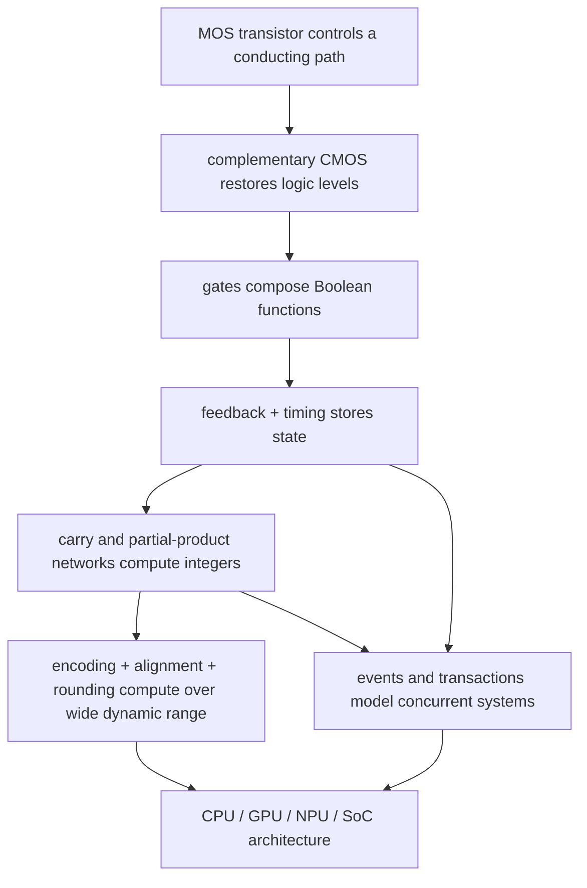

# 00 · Fundamentals — from device behavior to executable models

This folder builds the smallest mechanisms used everywhere else in the notebook. It does not assume that a term is already familiar: a first occurrence introduces the full name, the contract, and the reason the mechanism exists. Read in numeric order for the complete construction path; follow the focused routes below when returning for one design task.

The arrows are dependency and design logic. Device behavior explains why one gate is fast or leaky; gate behavior explains setup/hold and arithmetic delay; arithmetic explains the execution units in processors; event and transaction modeling explains how those processors and systems are studied before hardware exists.

## Reading contract used on every page

Each substantial mechanism should answer the same questions:

1. **Contract:** what enters, what state is owned, and what must emerge?
2. **Baseline:** what is the simplest correct construction?
3. **Failure:** which exact input, load, timing, scale, or workload breaks that baseline?
4. **Derived repair:** which new signal, stage, structure, or protocol removes the failure, and why?
5. **Worked trace:** how do concrete values move through the mechanism step by step?
6. **Cost:** what area, delay, power, numerical accuracy, model fidelity, or verification burden was added?
7. **Selection boundary:** when is the simpler design still preferable?
8. **Verification:** which invariants and adversarial cases prove the implementation rather than merely illustrate it?

If a section gives only a taxonomy or a final block diagram, treat it as incomplete and follow its deeper cross-reference.

## Pages and their construction paths

| # | Page | Starting failure | Mechanisms derived in order | What the reader can design or analyze afterward |
|---|---|---|---|---|
| 01 | [CMOS Fundamentals](01_CMOS_Fundamentals.md) | a transistor is an imperfect voltage-controlled switch; real wires and gates have capacitance, leakage, noise, and finite drive | metal–oxide–semiconductor field-effect transistor (MOSFET) → complementary inverter → voltage-transfer curve and noise margin → resistance/capacitance delay → logic families and level restoration → I/O signaling → latch-up/electrostatic discharge → FinFET scaling → 6T static random-access memory (SRAM) | size and compare basic gates, trace charge/discharge delay and dynamic energy, reason about signal integrity and static storage, identify physical reliability boundaries |
| 02 | [Logic Building Blocks](02_Logic_Building_Blocks.md) | combinational gates cannot remember, wide gates and long chains are slow, asynchronous changes can violate a sampling event | logical effort → mux/Shannon expansion → decoder/encoder/priority → bistable feedback → SR and D latches → edge-triggered flip-flops → enable/reset/scan/retention → registers/counters/files → finite-state machines → gray code/hazards → elastic buffers/FIFOs | construct control and storage logic from gates, choose latch/flip-flop topology, calculate timing/fan-out/FIFO depth, specify CDC and verification obligations |
| 03 | [Adders and Multipliers](03_Adders_and_Multipliers.md) | a correct one-bit sum becomes slow when carry must cross a word; repeated carry propagation makes multi-operand arithmetic worse | half/full adder → ripple trace → skip/select/lookahead → associative carry prefix → prefix topology tradeoffs → carry-save compression → Booth recoding → Wallace/Dadda reduction → final carry-propagate adder | select or implement an integer adder/multiplier for a delay/area/wiring target, trace every carry/partial product, write value-conservation checks |
| 04 | [Floating Point](04_Floating_Point.md) | one fixed binary point cannot cover tiny and huge values at useful precision; most exact results are not encodable | sign/significand/exponent → hidden bit → ULP/error model → subnormals → GRS and rounding → cancellation/dual-path add → fused multiply-add → low-precision and block-scaled AI formats → operation pipelines and special values | implement the control/data path of add, multiply, or FMA; calculate rounding decisions and numerical error; choose input/accumulator formats from workload range and reduction length |
| 05 | [SystemC and TLM](05_SystemC_and_TLM.md) | sequential C++ has no deterministic simulated concurrency, while pin-level RTL is too slow for software workloads and private transaction APIs do not compose | elaboration → event queue/evaluate/update/delta cycles → modules/processes/channels → generic payload/sockets → blocking LT → four-phase AT → DMI/temporal decoupling → counters and result reduction | build a virtual platform model, trace an instruction-generated load to its architectural result and simulated time, distinguish configured latency from emergent contention, validate reported performance |

## Focused reading routes

- **Build a storage or control cell:** CMOS §§2–5 → Logic §§1–4 → Logic §§6–8. This route goes from voltage restoration through feedback, sampling, next-state logic, metastability, and hazards.
- **Build an arithmetic datapath:** Logic §§1–3 → Adders §§1–8 → Floating Point §§4–8. This route goes from selection/reduction networks through carry/partial-product structures to alignment, normalization, and rounding.
- **Understand AI arithmetic:** Adders §6–7 → Floating Point §§4–7 → the NPU and GPU cross-references. Concentrate on carry-save accumulation, significand-width-squared multiplier cost, wide accumulation, and block scaling.
- **Build or evaluate a simulator:** SystemC §§1–6 → each architecture folder's simulation methodology. Keep host execution speed, target simulated time, fidelity, and derived architectural metrics separate.

## Diagram notation in this Obsidian vault

The vault uses more than one notation because one renderer cannot express circuit topology, event timing, and causal architecture equally well. The complete authoring rules and render test are in [Diagram Authoring Standard](../Diagram_Authoring_Standard.md).

| Question the figure answers | Notation | Reading rule |
|---|---|---|
| Which gates, transistors, or datapath blocks are wired together? | TikZJax with CircuiTikZ (`tikz` fence) | symbols are components; lines are wires; junctions and feedback paths are electrically meaningful |
| On which cycle/delta/phase does a value change? | WaveDrom (`wavedrom` fence) | rows share a time axis; labels identify values or protocol phases; analog behavior is only qualitative |
| Why does one mechanism lead to another, or which component owns a step? | Mermaid (`mermaid` fence) | arrows mean causality, dependency, state transition, or transaction direction—not an electrical net unless explicitly stated |
| What happens if values are changed interactively? | optional CircuitJS lab | the lab supplements, but never replaces, the equations, trace, and expected result in the note |

TikZJax, Mermaid Zoom, and WaveDrom are vault dependencies. A page should still teach correctly if a renderer is temporarily disabled: every figure needs adjacent prose stating its contract, one trace, and the important failure or tradeoff.

---

[Root Index](../Index.md) · [Flow Overview](../Chip_Design_Flow_Overview.md) · next ➡ [01 · Architecture and PPA](../01_Architecture_and_PPA/00_Index.md)
