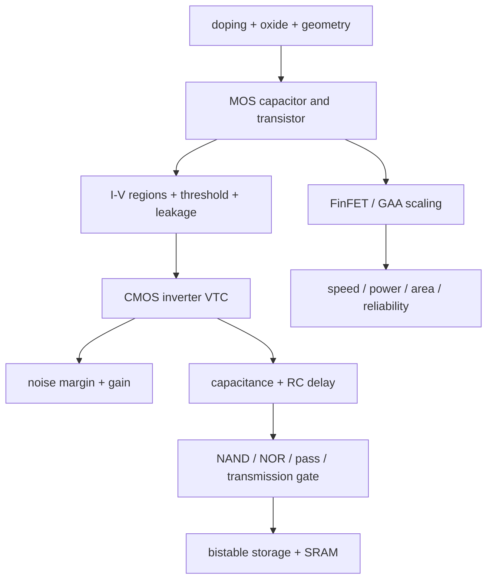

# CMOS Fundamentals and Device Physics — Concept-First Deep Dive



> **Prerequisites:** none beyond high-school algebra. §0.1 supplies the charge, field, doping, capacitor, and p–n-junction vocabulary needed by the device equations. This is the bottom of the notebook—everything else is built on the device and switching energy derived here.
> **Hands off to:** [Logic_Building_Blocks](02_Logic_Building_Blocks.md) (gates, latches, flip-flops built from these transistors), [Power_Fundamentals](../02_Power_and_Low_Power/01_Power_Fundamentals.md) (the $\alpha CV^2f$ this page derives, scaled to a whole SoC), [CPU PPA and Physical Implementation](../01_Architecture_and_PPA/01_CPU_Architecture/00_Design_Methodology/02_CPU_PPA_and_Physical_Implementation.md) (turns the bit cell into CPU arrays and ports), [Fabrication_Process](../07_Manufacturing_and_Bringup/01_Fabrication_Process.md) (how the FinFET/GAA of §8 is actually built).
> **Abbreviation key — return as needed:** complementary metal–oxide–semiconductor (CMOS); metal–oxide–semiconductor field-effect transistor (MOSFET); n-channel/p-channel MOSFET (NMOS/PMOS); voltage-transfer characteristic (VTC); resistor–capacitor (RC); fan-out-of-four (FO4); static random-access memory (SRAM); fin field-effect transistor (FinFET); gate-all-around (GAA); drain-induced barrier lowering (DIBL); equivalent oxide thickness (EOT); hot-carrier injection (HCI); electrostatic discharge (ESD); input/output (I/O); low-voltage CMOS (LVCMOS); stub-series-terminated logic (SSTL); pseudo-open-drain (POD); low-voltage differential signaling (LVDS); current-mode logic (CML); process, voltage, and temperature (PVT); power, performance, and area (PPA).

---

## 0. Why this page exists

The entire digital abstraction — a world of clean 0s and 1s — rests on one physical trick: **a MOSFET is a voltage-controlled switch with gain, and a *complementary pair* of them dissipates energy essentially only while switching.** Every property the layers above take for granted — that a gate restores a noisy input, that power tracks activity, that a bit holds its value, that timing closes — is a *consequence* of how well, or how badly, a real transistor approximates an ideal switch.

This page derives the digital world from device physics and then quantifies where the abstraction leaks. Each section opens with the *problem* — why must this device, circuit, or margin exist — before any equation. Four leaks organise everything:

- **Delay** — the switch has finite on-current, so charging a capacitor takes time (§1, §4, §10–§11).
- **Power** — switching costs $\tfrac12 CV^2$, and the switch never fully turns off (§4, §13).
- **Noise and variation** — real levels are corrupted and every transistor is a slightly different statistical object (§3, §9).
- **State** — holding a bit means fighting all of the above at once, which is the whole story of the SRAM cell (§12).

By the end you should be able to *derive* why $V_{DD}$ sits at 0.7 V, why $V_{th}$ cannot scale, why Dennard scaling ended and took frequency scaling with it, why FinFETs replaced planar devices, and why a 6T SRAM cell becomes unwritable-or-unreadable at low voltage — rather than recite parameter values.

### 0.1 The minimum physics bridge: from charge to a gate-controlled channel

Matter contains positively charged protons and negatively charged **electrons**. In a crystalline semiconductor such as silicon, most electrons participate in bonds; a small number can move through the crystal and carry current. A missing bond electron behaves as a positively charged mobile state called a **hole**. Engineers use **conventional current** in the direction positive charge would move, which is opposite the physical drift direction of electrons. Keep that sign convention separate from the actual carrier.

| Term | Plain-language contract | Why it enters a transistor |
|---|---|---|
| electric charge $Q$ (coulombs) | amount of positive or negative charge | a gate controls how much mobile charge exists near the surface |
| voltage $V$ (volts) | potential-energy difference per unit charge | $V_{GS}$ creates the field that forms a channel; $V_{DS}$ drives carriers along it |
| current $I=dQ/dt$ (amperes) | rate at which charge crosses a boundary | drain current charges or discharges the next gate's capacitance |
| electric field $E$ (volts/metre) | spatial slope of electric potential; force per unit charge | field across the oxide attracts or repels surface carriers |
| capacitance $C=Q/V$ (farads) | charge stored per volt between conductors separated by an insulator | the gate oxide is a capacitor; every driven wire/gate is also a load capacitor |
| resistance $R=V/I$ (ohms) | voltage required per unit current in a conducting path | an on transistor is approximately the resistor in the $RC$ delay model |

Pure silicon is **intrinsic**. **Doping** deliberately replaces a tiny fraction of its atoms:

- a donor atom with one extra valence electron creates **n-type** silicon, where electrons are the majority carriers;
- an acceptor atom one electron short creates **p-type** silicon, where holes are the majority carriers;
- putting p-type and n-type regions together creates a **p–n junction**. Carriers initially diffuse across the boundary, leaving fixed charged dopants and a carrier-poor **depletion region**. Its built-in electric field opposes further diffusion. Forward bias lowers the barrier and conducts; reverse bias widens the depletion region and ideally blocks.

“Metal–oxide–semiconductor” describes a capacitor stack: a conductive gate, a thin insulating oxide, and a semiconductor body. Because the oxide blocks direct-current flow, the gate controls the surface mainly by electric field rather than by supplying continuous current. An n-channel MOSFET places two n-type regions—source and drain—inside a p-type body:

```tikz
\usepackage{circuitikz}
\begin{document}
\begin{circuitikz}[thick,scale=0.85,transform shape,font=\small]
  \draw[fill=gray!25] (-1.6,2.85) rectangle (6.4,3.45);
  \node at (2.4,3.15) {conductive gate $G$};
  \draw[fill=blue!12] (-1.6,2.5) rectangle (6.4,2.85);
  \node[right] at (6.4,2.67) {oxide};
  \draw[fill=orange!12] (-1.6,-0.3) rectangle (6.4,2.5);
  \node at (2.4,0.1) {p-type silicon body $B$};
  \draw[fill=green!25] (-1.4,0.65) rectangle (0.9,1.65);
  \draw[fill=green!25] (3.9,0.65) rectangle (6.2,1.65);
  \node at (-0.25,1.15) {$n^{+}$ source $S$};
  \node at (5.05,1.15) {$n^{+}$ drain $D$};
  \draw[very thick,blue] (0.9,1.95) -- (3.9,1.95);
  \node at (2.4,2.25) {inversion channel ($V_{GS}>V_{th}$)};
  \draw[->] (2.4,4.0) -- (2.4,3.47) node[midway,right] {$+V_G$ creates field};
  \draw[->] (3.8,1.35) -- (1.0,1.35) node[midway,above] {electron drift};
  \draw[->] (1.0,0.9) -- (3.8,0.9) node[midway,below] {conventional $I_D$};
\end{circuitikz}
\end{document}
```

With $V_{GS}=0$, the two n-type islands are separated by p-type material and their p–n junctions block a source-to-drain path. A sufficiently positive gate repels holes, attracts electrons to the oxide interface, and eventually makes the surface electron-rich—**inversion**. The connected inversion layer is the channel. The gate voltage therefore creates or removes the path; the drain-to-source voltage moves charge through it. The threshold voltage $V_{th}$ is the approximate $V_{GS}$ at which strong inversion becomes useful, not an ideal on/off cliff (§1.3).

This sequence is the physical implementation of “voltage-controlled switch”: oxide gives near-zero steady gate current, field creates a channel, the channel provides drain current, and that current moves charge on the next capacitance. The rest of the page quantifies how imperfectly each step behaves.

---

## 1. The MOSFET as a switch — and where it fails to be one

Digital logic needs a switch with four properties: it must be **controlled by voltage** (so a gate's output can drive the next gate's input), have **gain** (so a weak input produces a strong output and noise gets squeezed out, §3), pass **near-zero current when off** (so idle logic is nearly free, §13), and present **low resistance when on** (so it charges the next stage fast, §4). The MOSFET approximates all four. Every non-ideality below — subthreshold conduction, velocity saturation, DIBL — is a way it *falls short*, and each shortfall reappears as a constraint one or more layers up.

### 1.1 The three regions, and the one equation that matters

An n-channel MOSFET forms a conducting channel once the gate pulls the surface into inversion, $V_{GS} > V_{th}$. The current then depends on whether the channel reaches the drain:

$$
I_D \approx
\begin{cases}
0, & V_{GS} < V_{th} & \text{(cutoff — the OFF switch)}\\[4pt]
\mu_n C_{ox}\dfrac{W}{L}\left[(V_{GS}-V_{th})V_{DS}-\dfrac{V_{DS}^2}{2}\right], & V_{DS} < V_{GS}-V_{th} & \text{(triode — the ON resistor)}\\[8pt]
\dfrac{1}{2}\mu_n C_{ox}\dfrac{W}{L}(V_{GS}-V_{th})^2(1+\lambda V_{DS}), & V_{DS}\ge V_{GS}-V_{th} & \text{(saturation — the current source)}
\end{cases}
$$

where $\mu_n$ = electron mobility ($\approx 400\ \text{cm}^2/\text{V·s}$ effective in the inversion layer), $C_{ox}=\varepsilon_{ox}/t_{ox}$ = gate-oxide capacitance per area, $W/L$ = the designer's only continuous knob, $V_{th}$ = threshold voltage, and $\lambda$ = channel-length modulation ($\approx 0.05$–$0.1\ \text{V}^{-1}$). Two facts do almost all the work later:

- **In triode the device is a resistor**, $R_{on}\approx 1/\!\left[\mu_n C_{ox}\frac{W}{L}(V_{GS}-V_{th})\right]$ — this is the $R$ in the delay model of §4.
- **In saturation the drive current sets how fast it can charge a load** — this is the $I$ in $t_p\propto CV/I$.

**Why PMOS is the weaker sibling.** Holes have roughly half the mobility of electrons ($\mu_p\approx 150$–$200\ \text{cm}^2/\text{V·s}$). For equal drive a PMOS must be $\sim2$–$2.5\times$ wider than an NMOS. That single asymmetry propagates into inverter sizing (§2), the NAND-over-NOR preference (§5), and the SRAM pull-up (§12).

### 1.2 The square law is a lie at short channel: the alpha-power law

The quadratic $(V_{GS}-V_{th})^2$ assumes carriers accelerate freely across the channel. In a modern device the lateral field is so high that carrier velocity **saturates** at $v_{sat}\approx 10^7\ \text{cm/s}$ long before the drain. Drive current then becomes **linear**, not quadratic, in overdrive:

$$
I_{Dsat}\approx W C_{ox}\,v_{sat}\,(V_{GS}-V_{th}) \quad\Longrightarrow\quad I_{Dsat}\propto (V_{GS}-V_{th})^{\alpha},\ \ \alpha\!:\ 2\to 1
$$

The **alpha-power law** (Sakurai–Newton) captures both limits with one exponent: $\alpha\approx 2$ for a long-channel device, falling to $\alpha\approx 1.1$–$1.4$ for a velocity-saturated modern one. This is not a curiosity — it is *why* raising $V_{DD}$ buys less speed than the textbook square law predicts, and it sets the delay exponent in §4. Note the design consequence: because current is now $\propto W$ (not $W/L$ with an $L$ you can shrink for free), you buy drive with *width*, which is exactly what FinFET fins and GAA sheets provide (§8).

### 1.3 The switch will not turn off: subthreshold conduction and the 60 mV/decade wall

Below $V_{th}$ the current is not zero — it falls **exponentially**, because the channel is diffusion-limited (a BJT-like Boltzmann tail), not abruptly cut off:

$$
I_D = I_0\,\exp\!\left(\frac{V_{GS}-V_{th}}{n\,V_T}\right)\left[1-\exp\!\left(-\frac{V_{DS}}{V_T}\right)\right],\qquad V_T=\frac{kT}{q}\approx 26\ \text{mV at }300\text{ K}
$$

The steepness of turn-off is the **subthreshold slope** $S$ — the gate swing needed to change $I_D$ by $10\times$:

$$
\boxed{\,S=\frac{kT}{q}\ln 10\left(1+\frac{C_{dep}}{C_{ox}}\right)\,}
$$

where $C_{dep}$ = depletion capacitance under the channel and $n=1+C_{dep}/C_{ox}$ is the body factor. At 300 K the prefactor $\frac{kT}{q}\ln 10 = 60\ \text{mV/decade}$ is a **hard thermodynamic floor** for any device that switches by modulating a Boltzmann barrier — bulk planar devices sit at $S\approx 80$–$100$ (poor gate control, large $C_{dep}/C_{ox}$); FinFETs reach $\approx 65$–$70$ by driving $n\to 1$.

This one equation is the master constraint of the whole page. It says: **to keep leakage low you want high $V_{th}$, but to keep speed and noise margin you want low $V_{th}$ — and $S$ sets the exchange rate between them.** With $S=70\ \text{mV/dec}$, dropping $V_{th}$ by 210 mV multiplies off-current by $1000$. That exchange rate is why $V_{th}$ has stopped scaling, why Dennard scaling ended (§4.5), why leakage is now half the power budget (§13), and why sub-60 mV/dec "steep-slope" devices (tunnel FETs, negative-capacitance FETs) are researched at all.

### 1.4 Second-order effects that matter at advanced nodes

The gate is losing its grip on the channel as $L$ shrinks toward the source/drain depletion widths. Four symptoms, each a reason for §8:

- **DIBL (drain-induced barrier lowering):** the drain field lowers the source barrier, so $V_{th}$ *drops* as $V_{DS}$ rises, $V_{th}(V_{DS})\approx V_{th,long}-\eta V_{DS}$ with $\eta\approx 50$–$100\ \text{mV/V}$ at 7 nm. DIBL couples §1.3 leakage to supply voltage and degrades $S$.
- **Body effect:** $V_{th}=V_{th0}+\gamma\!\left(\sqrt{2\phi_F+V_{SB}}-\sqrt{2\phi_F}\right)$ — a source raised above the body raises $V_{th}$. This is why the *upper* transistor in a series NAND/NOR stack (§5) and the SRAM access device are weaker than a lone device.
- **Gate tunnelling:** below $\sim2\ \text{nm}$ of $\text{SiO}_2$ electrons tunnel straight through the gate. The fix — **high-$k$ dielectrics** ($\text{HfO}_2$, $k\approx 20$–$25$) — lets the *physical* oxide be thick (low tunnelling) while the *electrical* thickness stays small: $\text{EOT}=t_{phys}\cdot(3.9/k)$.
- **HCI (hot-carrier injection):** high-energy carriers damage the oxide over time, shifting $V_{th}$ — a reliability/aging limit, not a speed one.

---

## 2. The CMOS inverter — why complementary static logic won

Before CMOS, logic used a driver transistor pulling against a resistive (or always-on) load. That load **burns DC current the entire time the output is low** and can only pull the output to a divider voltage, not a clean rail. The complementary insight fixes both at once: build the pull-up from PMOS and the pull-down from NMOS driven by the *same* input, so that **in either static state exactly one network conducts and the other is a true open switch.** The result: ideally *zero* static current, rail-to-rail output ($V_{OH}=V_{DD}$, $V_{OL}=0$), and high gain in between. That is the entire reason CMOS displaced NMOS, pseudo-NMOS, and everything else — energy is spent almost only when the output *changes* (§4).

The electrical schematic makes the complementary mechanism explicit. The p-channel MOSFET (PMOS) is the pull-up device and the n-channel MOSFET (NMOS) is the pull-down. Their gates share input $A$; their drains share output $Y$:

```tikz
\usepackage{circuitikz}
\begin{document}
\begin{circuitikz}[american,thick,scale=0.9,transform shape]
  \draw (0,3) node[vcc]{$V_{DD}$}
        (0,2.4) node[pmos,anchor=S](P){}
        (P.S) -- (0,3)
        (P.D) -- (0,1.5) coordinate(Y)
        (0,0.6) node[nmos,anchor=S,yscale=-1](N){}
        (N.D) -- (Y)
        (N.S) -- (0,0) node[ground]{};
  \draw (P.G) -- (-1.2,2.4)
        (N.G) -- (-1.2,0.6)
        (-1.2,0.6) -- (-1.2,2.4)
        (-1.2,1.5) -- (-2.0,1.5) node[left]{$A$};
  \draw (Y) -- (1.2,1.5) node[right]{$Y$};
  \draw (0.55,1.5) to[C,l_=$C_L$] (0.55,0) node[ground]{};
\end{circuitikz}
\end{document}
```

This figure abstracts body connections and parasitic capacitances except the lumped load $C_L$. The causal transition is:

| Phase | PMOS | NMOS | Physical event at $Y$ | Digital meaning |
|---|---|---|---|---|
| $A=0$ settled | on | off | PMOS has charged $C_L$ to $V_{DD}$ | restored 1 |
| $A$ rises through the threshold region | weakening but not yet off | strengthening | both conduct briefly; $C_L$ begins to discharge and short-circuit current flows | output is in transition, not a valid Boolean sample |
| $A=1$ settled | off | on | NMOS discharges $C_L$ to ground | restored 0 |
| $A$ falls | turns on | turns off | the supply replenishes the charge on $C_L$ | restored 1 |

The feature progression is therefore physical: a lone NMOS plus passive load can pull down but wastes static power and produces a ratio-dependent high; a complementary PMOS supplies the missing active pull-up; gain around the switching point restores noisy levels; the unavoidable load capacitance then creates delay and switching energy. Sections 3 and 4 quantify the two costs created by the repair.

### 2.1 The VTC and its five regions

Sweep $V_{in}$ from 0 to $V_{DD}$ and the output traces the voltage-transfer characteristic (VTC), passing through five regions as each transistor moves cutoff → saturation → triode:

| Region | $V_{in}$ | NMOS | PMOS | $V_{out}$ |
|---|---|---|---|---|
| A | $< V_{thn}$ | cutoff | triode | $V_{DD}$ (clean high) |
| B | rising to $V_M$ | saturation | triode | starts to fall |
| C | $\approx V_M$ | saturation | saturation | steep — **max gain**, the switching edge |
| D | above $V_M$ | triode | saturation | continues to fall |
| E | $> V_{DD}-|V_{thp}|$ | triode | cutoff | $0$ (clean low) |

Region C is the whole point: **both devices saturate, so a tiny $\Delta V_{in}$ moves $V_{out}$ across the full rail** — the high gain that regenerates logic levels (§3). Regions A and E are where the flat, noise-immune rails live.

### 2.2 The switching threshold $V_M$ — the one design equation

At $V_M$ the input equals the output and both devices are saturated, so their currents balance:

$$
\tfrac12 k_n (V_M-V_{thn})^2 = \tfrac12 k_p (V_{DD}-V_M-|V_{thp}|)^2,\qquad k_{n,p}=\mu_{n,p}C_{ox}\left(\tfrac{W}{L}\right)_{n,p}
$$

Solving with $r=\sqrt{k_p/k_n}$:

$$
V_M=\frac{V_{thn}+r\,(V_{DD}-|V_{thp}|)}{1+r}
$$

A **symmetric** VTC ($V_M=V_{DD}/2$, equal noise margins) needs $k_n=k_p$, i.e. $\mu_p(W/L)_p=\mu_n(W/L)_n$, i.e. $W_p\approx 2$–$2.5\,W_n$. But *real* standard-cell libraries rarely size for a perfectly symmetric $V_M$: velocity saturation flattens the benefit, and a high-density (HD) library will accept a slightly skewed $V_M$ to use a **smaller PMOS** and save area, while a high-performance (HP) library widens the PMOS toward symmetry for balanced edges. On FinFETs the ratio is *quantised* to integer fins (§8), so the "2.5×" ideal collapses to a 1:1 or 2:1 fin count with the asymmetry absorbed by threshold flavour instead — a concrete case of theory meeting a discrete process.

---

## 3. Noise margins and the regenerative property

Real interconnect couples neighbours, the supply droops under $IR$ load, and edges reflect — so a "1" arriving at a gate is never a clean $V_{DD}$. Digital logic survives only because **a gate with gain > 1 pushes a degraded level back toward the rail**: pass a noisy signal through a few stages and it is *cleaned up*. Noise margin quantifies how much corruption one stage absorbs before it can no longer restore.

### 3.1 Definition and the unity-gain construction

The receiver treats anything above $V_{IH}$ as a 1 and below $V_{IL}$ as a 0, where $V_{IH}$ and $V_{IL}$ are the two points on the VTC where the slope is exactly $-1$ (below unity gain the stage is amplifying noise, not rejecting it). The margins are the gaps to the driver's guaranteed levels:

$$
\text{NM}_H = V_{OH}-V_{IH},\qquad \text{NM}_L=V_{IL}-V_{OL}
$$

For a symmetric long-channel inverter ($k_n=k_p$, $V_{thn}=|V_{thp}|=V_t$) the region-by-region VTC gives the memorable closed form:

$$
V_{IL}\approx\frac{3V_{DD}+2V_t}{8},\quad V_{IH}\approx\frac{5V_{DD}-2V_t}{8}\ \Longrightarrow\ \text{NM}_H=\text{NM}_L=\frac{3V_{DD}+2V_t}{8}\approx 0.4\,V_{DD}
$$

Roughly **40% of $V_{DD}$** — far better than the 20–30% of ratioed NMOS logic, and the quantitative reason CMOS is the robust default.

### 3.2 Why $V_{DD}$ cannot scale to zero

Two effects erode the margin as supply drops, and together they set an absolute floor:

- **Absolute margin shrinks with $V_{DD}$.** The closed form scales with $V_{DD}$; halve the supply and you roughly halve the millivolts of noise you can tolerate, even as coupling and $IR$ noise do *not* shrink proportionally.
- **Regeneration itself fails.** Restoration requires peak gain $|A_v|>1$. As $V_{DD}$ falls toward a few $V_T$, the transistors slide into subthreshold, gain collapses, and the VTC flattens. The thermodynamic floor for a functioning inverter is the Swanson–Meindl limit $V_{DD,min}\approx 2\text{–}4\,\tfrac{kT}{q}\ln(\cdots)\sim 50\ \text{mV}$; *practically*, once $\sigma_{V_{th}}$ variation (§9) is included, robust logic needs $V_{DD}\gtrsim 2\text{–}3\,V_{th}\approx 0.3$–$0.5\ \text{V}$.

This floor is the villain of the whole low-power story: it caps voltage scaling (§4.5), sets the near-threshold operating point (§4.4), and is *the* reason the 6T SRAM cell loses its margin first and fails before logic does (§12). Anything that skews $V_M$ — $V_{th}$ mismatch between the n- and p-device, unequal sizing, supply droop, temperature — trades one margin for the other and pushes the failure point higher.

---

## 4. Delay, the three powers, and the energy–delay knee

A gate is characterised by two numbers the rest of the notebook consumes: **how long it takes to switch** and **how much energy that costs.** Both fall out of the same picture — a transistor (a resistor/current-source, §1) charging a capacitor (the next gate's input plus wire) — so delay and power are not independent knobs but two ends of one trade governed by $V_{DD}$ and $V_{th}$.

### 4.1 Propagation delay and the alpha-power law

Model the switching device as an effective resistance discharging the load:

```tikz
\usepackage{circuitikz}
\begin{document}
\begin{circuitikz}[american,thick,scale=0.9,transform shape]
  \draw (0,2.4) node[vcc]{$V_{DD}$} to[R,l=$R_p$] (0,1.2) coordinate(UP)
        (UP) -- (1.0,1.2) node[right]{$Y$}
        (1.0,1.2) to[C,l=$C_L$] (1.0,0) node[ground]{};
  \node at (0.5,-0.95) {low$\to$high: charge via $R_p$};
  \draw (5.0,1.2) coordinate(DN) -- (6.0,1.2) node[right]{$Y$}
        (6.0,1.2) to[C,l=$C_L$] (6.0,0) node[ground]{}
        (DN) to[R,l_=$R_n$] (5.0,0) node[ground]{};
  \node at (5.5,-0.95) {high$\to$low: discharge via $R_n$};
\end{circuitikz}
\end{document}
```

The two RC equivalents are not extra components added to the inverter. $R_p$ and $R_n$ are effective models of the conducting transistor over the transition; $C_L$ collects receiver gates, drain diffusion, and wire capacitance. The exponential $V_Y(t)=V_{DD}(1-e^{-t/R_pC_L})$ crosses half supply after $R_pC_L\ln2\approx0.69R_pC_L$, which derives the familiar delay coefficient instead of asking the reader to memorize it.

$$
t_{pHL}\approx 0.69\,R_n C_L,\qquad t_{pLH}\approx 0.69\,R_p C_L,\qquad C_L=C_{gate}^{fanout}+C_{wire}+C_{drain}^{self}
$$

Substituting the drive current gives the form that actually predicts scaling behaviour:

$$
t_p\ \propto\ \frac{C_L\,V_{DD}}{I_{Dsat}}\ \propto\ \frac{C_L\,V_{DD}}{(V_{DD}-V_{th})^{\alpha}}
$$

where $\alpha\approx 1.3$ for a modern velocity-saturated device (§1.2). Read it as the master delay law: **speed comes from overdrive $V_{DD}-V_{th}$, and because $\alpha<2$, raising $V_{DD}$ helps sub-quadratically** while costing energy quadratically — the root of every voltage/frequency trade. The process-independent unit is the **FO4 delay** (an inverter driving four copies of itself), $\approx 12$–$15\ \text{ps}$ at N5; the notebook measures pipeline stages, wakeup loops, and cache paths in FO4 precisely because it cancels the process out.

### 4.2 Dynamic energy: the $\tfrac12 CV^2$ that pays for computation

Charging $C_L$ from 0 to $V_{DD}$ draws $Q V_{DD}=C_L V_{DD}^2$ from the supply; half is stored on the capacitor and **half is dissipated in the PMOS regardless of its resistance.** Discharging dumps the stored half through the NMOS. So each *transition* costs $\tfrac12 C_L V_{DD}^2$ and, aggregated over a clock, the dynamic power is:

$$
\boxed{\,P_{dyn}=\alpha\,C_L\,V_{DD}^2\,f\,}
$$

where $\alpha$ = **activity factor** (average power-consuming transitions per cycle, typically 0.05–0.15 for random logic), $f$ = clock frequency. The quadratic $V_{DD}^2$ is the single most important lever in low-power design and the reason every technique downstream — clock gating, voltage scaling, $V_{DD}$ islands ([Power_Reduction_Techniques](../02_Power_and_Low_Power/04_Power_Reduction_Techniques.md)) — attacks one of $\alpha$, $C$, $V_{DD}$, or $f$.

### 4.3 The other two powers: short-circuit and leakage

- **Short-circuit power.** During an input edge both networks conduct briefly, shorting $V_{DD}$ to ground: $P_{sc}\approx \tfrac{\beta}{12}(V_{DD}-2V_{th})^3\,\tfrac{\tau}{T}$, where $\tau$ = input transition time and $T$ = period. It is typically **5–15% of dynamic**, vanishes for fast edges (small $\tau$), and disappears entirely once $V_{DD}<2V_{th}$ — a small but real reason to keep slews sharp.
- **Leakage (static) power.** The switch never fully opens (§1.3), so $P_{leak}=V_{DD}\,I_{leak}$ with $I_{leak}\propto 10^{-V_{th}/S}$. Once dominated by dynamic, leakage is now **20–50%** of total at advanced nodes and is the entire budget of an idle or always-on block (§13). It is the reason cells ship in $V_{th}$ *flavours*: **LVT** (low $V_{th}$ — fast, leaky), **SVT**, **HVT** (slow, low-leakage), placed cell-by-cell so only timing-critical paths pay the leakage.

$$
P_{total}=\underbrace{\alpha C V_{DD}^2 f}_{\text{dynamic}}+\underbrace{P_{sc}}_{\text{short-circuit}}+\underbrace{V_{DD}I_{leak}}_{\text{leakage}}
$$

### 4.4 The energy–delay trade and where $V_{DD}$ should sit

Lowering $V_{DD}$ cuts dynamic energy quadratically but raises delay (§4.1); lowering $V_{th}$ recovers the delay but raises leakage exponentially (§1.3). The **energy–delay product** $\text{EDP}=E\cdot t_p\propto C V_{DD}^2\cdot\frac{V_{DD}}{(V_{DD}-V_{th})^\alpha}$ has a genuine minimum below the nominal supply. Pushed further, into **near-threshold** operation ($V_{DD}\approx 0.4$–$0.6\ \text{V}$, a few $\times V_T$ above $V_{th}$), dynamic energy per op keeps falling but the clock slows so much that *leakage energy per op* (leakage × time) rises again, producing a **minimum-energy point** typically around 0.3–0.4 V. This is why ultra-low-power cores (ARM Cortex-M class, IoT, wake-word engines) run near threshold for $5$–$10\times$ energy savings at $\sim$half the frequency, while the 60 mV/dec floor (§1.3) and SRAM margin collapse (§12) stop them from going lower.

### 4.5 Dennard scaling and why it ended

For thirty years scaling was nearly free because of **Dennard's constant-field recipe**: shrink every dimension *and* the voltage by the same factor $\kappa>1$, hold the electric field constant, and the numbers fall out beautifully:

| Quantity | Scales as | | Quantity | Scales as |
|---|---|---|---|---|
| Dimensions $L,W,t_{ox}$ | $1/\kappa$ | | Gate delay $t\propto CV/I$ | $1/\kappa$ (faster) |
| Supply $V_{DD}$, $V_{th}$ | $1/\kappa$ | | Frequency $f$ | $\kappa$ |
| Capacitance $C$ | $1/\kappa$ | | Power/device $P\propto CV^2f$ | $1/\kappa^2$ |
| Current $I$ | $1/\kappa$ | | **Power density $P/A$** | **constant** |

Constant power density is the magic: double the transistors, each smaller and lower-power, and the chip's watts-per-mm² held still. **It ended around 2005 because $V_{th}$ stopped scaling.** To keep the field constant $V_{DD}$ had to drop, which required $V_{th}$ to drop — but the 60 mV/dec floor (§1.3) means every $V_{th}$ reduction multiplies subthreshold leakage, and leakage power was already becoming intolerable. So $V_{DD}$ stalled near $\sim1\ \text{V}$ and then crept only to $\sim0.7\ \text{V}$ over the next fifteen years. With $V$ frozen but transistors still shrinking, $P/A$ began **rising** — the "**power wall**." The consequences reshaped the whole field: single-thread frequency stalled at 3–5 GHz (§4.1 can't be cashed in without melting the die), designers pivoted to **multicore** and specialised accelerators, and "**dark silicon**" (fractions of the chip that must stay off to stay in the thermal budget) became a first-class constraint. Moore's Law (density) continued; Dennard scaling (free performance) did not — and that single split is why the notebook's upper layers are about extracting parallelism and managing power, not chasing clock.

---

## 5. Logic families: static CMOS and its situational rivals

Static complementary CMOS (§2) is the default *because* of its zero-static-current, full-swing, high-gain properties. Every alternative below trades one of those away to win area, speed, or pin count in a specific situation — so the family choice is really "which robustness am I willing to spend here?"

### 5.1 Static CMOS, and why NAND beats NOR

A static gate is a PMOS pull-up network (PUN) dual to an NMOS pull-down network (PDN). The load-bearing trade-off is **NAND vs NOR for the same function**: a NAND puts NMOS in series (fast — high mobility) and PMOS in parallel; a NOR puts the weak PMOS in series. For an $N$-input gate the series stack must widen $N\times$ to keep drive, so a NOR's series-PMOS width balloons as $N\times 2.5\,W_{min}$ — huge and slow. Synthesis therefore **prefers NAND/inverter forms and avoids high-fan-in NOR**, a direct consequence of the $\mu_n/\mu_p$ asymmetry of §1.1.

### 5.2 Ratioed and pass-transistor logic

- **Pseudo-NMOS / ratioed logic:** replace the PUN with a single always-on PMOS. Fewer transistors ($N{+}1$ vs $2N$) and fast for wide NOR/OR — but it **burns static current** whenever the PDN conducts and only reaches a divider $V_{OL}\ne 0$, eroding $\text{NM}_L$. A niche choice (wide address decoders) traded away exactly the two properties §2 prized.
- **Transmission-gate (pass) logic:** a parallel NMOS+PMOS passes *both* rails without a threshold drop, giving compact MUXes, XORs, and — importantly for [Logic_Building_Blocks](02_Logic_Building_Blocks.md) — **latches** (a TG in feedback around two inverters is the canonical static latch, the seed of every flip-flop). The cost: pass logic has **no gain**, so a chain of TGs degrades the level and must be periodically restored by a real inverter.

### 5.3 Dynamic (domino) logic

Precharge the output high on one clock phase, then let an NMOS-only evaluation network conditionally discharge it. This removes the slow PUN entirely — fast and compact for wide functions — but pays with **charge sharing, clock-skew sensitivity, no restoring noise immunity during evaluate (a single glitch is latched), and a monotonicity restriction** (needs keepers and static-inverter "domino" stages to cascade). Once common in high-frequency datapaths, it is largely displaced in modern low-power design because its noise and power-integrity cost is unattractive when leakage already dominates.

### 5.4 I/O signalling: the same physics at pF scale

On-chip gates drive fF loads; **I/O cells drive pF** off-chip loads (package + PCB trace + receiver), so they trade speed and area for drive strength, controlled slew, defined levels, termination, and ESD (§7). The standard is a transmitter↔receiver *contract*, and the whole zoo reduces to three families along one axis — **noise immunity vs pins/power**:

| Family | Idea | Cost / benefit | Examples |
|---|---|---|---|
| Rail-referenced single-ended | RX compares to its own rails | 1 pin, cheap; margin bounded by $V_{DDQ}$ and ground bounce | LVCMOS, LVTTL |
| $V_{REF}$-referenced + on-die termination | RX compares to $V_{REF}\approx V_{DDQ}/2$, ODT kills reflections → small swing, fast | wide fast buses; needs a reference and termination power | SSTL (DDR3), POD (DDR4/5, GDDR) |
| Differential | RX senses the *difference* → common-mode noise cancels | 2 pins/signal; smallest swing, highest rate, lowest EMI | LVDS, CML (PCIe/Ethernet/HBM SerDes) |

The evolution tells the story: DDR moved SSTL → POD (terminate to $V_{DDQ}$ so an idle-high bus only burns termination DC on 0s) as rates climbed, and everything multi-Gb/s went differential because a small swing across a terminated pair is the only way to get clean eyes at speed. Deeper treatment lives in [Signal_Integrity](../05_Backend_Physical_Design/02_Signal_Integrity_Reliability.md), DDR I/O in [DDR_Controller](../01_Architecture_and_PPA/04_SoC_and_Chiplet_Architecture/02_Shared_Memory/01_DDR_Controller.md), and package-level high-speed links in [IC_Packaging](../07_Manufacturing_and_Bringup/02_IC_Packaging.md).

---

## 6. Latch-up: the parasitic thyristor hiding in every well

Placing an NMOS in a p-substrate next to a PMOS in an n-well unavoidably creates a parasitic **PNPN thyristor** (a cross-coupled lateral PNP and vertical NPN). Normally both BJTs are off. But inject enough current — an ESD strike, an I/O driven beyond the rails, a supply transient — and the pair can latch into **positive feedback**: each transistor's collector feeds the other's base. The sustaining condition is essentially Barkhausen,

$$
\beta_{pnp}\cdot\beta_{npn}\ \gtrsim\ 1\quad\text{(with the well/substrate resistances }R_{well},R_{sub}\text{ providing the base drive)}
$$

Once latched, a **low-impedance $V_{DD}\!\to\!\text{GND}$ short** forms, current runs to >100 mA, and the chip cooks. Prevention is all about starving the feedback — **lower $\beta$ and lower $R_{well}/R_{sub}$**: guard rings around the devices, frequent well/substrate taps (a tap every 10–20 µm), a heavily-doped epitaxial substrate (the single most effective measure), generous n-to-p spacing, and — decisively — **SOI**, whose buried oxide isolates the devices and eliminates the thyristor outright, which is why radiation-hard and some high-reliability parts use it. Qualification is JEDEC JESD78 ($\pm100\ \text{mA}$ injection, over-voltage, at 125 °C).

---

## 7. ESD protection: surviving kilovolts at a thin-oxide gate

A pin can see a multi-kilovolt transient from a human touch or from the charged package itself, and the gate oxide it reaches is only $\sim1\ \text{nm}$ thick — it punctures at a few volts. So **every pad needs a deliberate low-impedance path to shunt the strike away from the gate** before the oxide fails. Two models bound the design:

- **HBM (Human Body Model):** 100 pF through 1.5 kΩ, $\sim$150 ns, $\sim$1.3 A peak; target $\pm2\ \text{kV}$.
- **CDM (Charged Device Model):** the IC self-discharges through one pin, $<1\ \text{ns}$, $>10\ \text{A}$; more damaging to thin oxides; target $\pm500\ \text{V}$.

The circuit is a shunt network: **diodes** from pad to $V_{DD}$ and to ground steer the strike into the rails, an **RC-triggered power clamp** (a big NMOS) opens a $V_{DD}$-to-GND path during the event, and a **ggNMOS** (grounded-gate NMOS) uses parasitic-BJT **snapback** to clamp large currents. The design tension is that the protection must trigger *above* $V_{DD}$ (invisible in normal operation) yet hold *above* $V_{DD}$ after firing (so it does not itself induce latch-up, §6) — and every added device loads the pad, trading I/O speed for robustness. Antenna rules address the same failure from the fab side: long metal connected to a gate during processing accumulates plasma charge that can rupture the oxide.

---

## 8. FinFET, GAA, and why geometry replaced material

The short-channel effects of §1.4 all say the same thing: **as $L$ shrinks toward the source/drain depletion depth, the drain steals control of the channel from the gate.** The gate's reach is a screening length $\lambda\propto\sqrt{t_{ox}\,t_{body}/\varepsilon}$, and good electrostatics need $L\gtrsim 5$–$6\lambda$. You can shrink $\lambda$ by thinning the oxide (§1.4 hit the tunnelling wall) — or by **thinning the body and wrapping the gate around it.** That geometric move, not any new material, is the story of the last decade.

### 8.1 Planar → FinFET → GAA nanosheet

- **Planar** loses control below $\sim22\ \text{nm}$: $S\gg 60$, DIBL $>100\ \text{mV/V}$, leakage intolerable.
- **FinFET** stands the channel up as a thin fin and wraps the gate on **3 sides**. The thin body ($W_{fin}\approx 7\ \text{nm}$) shrinks $\lambda$ dramatically: $S\approx 65$–$70\ \text{mV/dec}$, DIBL $<50\ \text{mV/V}$. Effective width $W_{eff}\approx 2H_{fin}+W_{fin}$ (Intel 22 nm in 2011 through TSMC N7/N5).
- **GAA nanosheet / MBCFET / RibbonFET** wraps the gate on **all 4 sides** of stacked horizontal sheets — the best electrostatics, and the mainstream device at 2 nm.

### 8.2 The fin-quantisation trade-off, and how GAA relaxes it

A FinFET's width is **quantised**: $W=N_{fins}\times W_{eff}$, integer fins only (1 fin ≈ 107 nm, 2 ≈ 214 nm, no in-between). So sizing is coarse — `INV_X1` = 1 fin, `INV_X2` = 2 fins — and analog matching and PMOS/NMOS balancing (§2.2) lose the continuous $W$ knob. **GAA restores a finer knob:** sheet width is continuously tunable ($\sim15$–$50\ \text{nm}$), so drive strength can be dialled in without hopping by whole fins — better standard-cell granularity and better analog matching, at the cost of more gate capacitance for wider sheets. This is a real DTCO (§9) lever: the process gives back a design degree of freedom that FinFET took away.

### 8.3 Real nodes, and the two library corners

| Node / vendor | Device | Notable |
|---|---|---|
| TSMC N5 / N3E | FinFET | mainstream 2020–2024; N3E backs off N3's density for yield |
| TSMC N2 (2025–26) | GAA nanosheet | first TSMC GAA; ~15% speed *or* ~30% power over N3 |
| Intel 18A (2025) | RibbonFET (GAA) + **PowerVia** | backside power delivery — Intel skipped 20A to reach it |
| Samsung SF3 / SF2 | MBCFET (GAA) | first production GAA (2022), 2 nm with BSPDN |

Within any node the library splits into **HD (high-density)** cells — shorter track height, fewer fins, packed for area and leakage (mobile, GPU) — and **HP (high-performance)** cells — taller, more fins, more drive for frequency (server, desktop). Choosing the mix per block is one of the highest-leverage PPA decisions and the front line of DTCO.

### 8.4 Wires become the bottleneck (BEOL)

Transistors got faster; the wires between them did not. Wire resistance $R=\rho L/(WH)$ **rises super-linearly** at narrow pitch as copper suffers grain-boundary and surface scattering ($\rho_{eff}\gg\rho_{bulk}$ once width approaches the electron mean free path), while capacitance to ever-closer neighbours grows. The killer is the quadratic:

$$
\tau_{wire}=R\,C\ \propto\ \frac{\rho\,\varepsilon\,L^2}{WH\,S}\quad\Longrightarrow\quad \text{doubling length} \to 4\times\text{ delay}
$$

Hence low-$k$ dielectrics (and air gaps), alternative metals (Co, Ru at the tightest pitches), 12–15+ metal layers, and aggressive **repeater insertion** to break long wires into linear segments (§10). Backside power delivery (§9.3) is partly a wire fix too — it evacuates the power grid off the signal layers.

---

## 9. Process variation and DTCO: the transistor as a statistical object

At these dimensions a transistor's channel holds only a *handful* of dopant atoms, so two "identical" devices differ measurably. Timing and SRAM margins must be signed off against the **spread**, not the nominal — which is why variation is a first-class design input, not an afterthought.

### 9.1 Systematic vs random, and the Pelgrom law

- **Systematic** variation is layout-dependent and correctable: lithographic line-end shortening, CMP dishing with metal density, well-proximity $V_{th}$ shift.
- **Random** variation is statistical, dominated by **random dopant fluctuation**, and follows the **Pelgrom law**:

$$
\sigma_{V_{th}}\ \propto\ \frac{1}{\sqrt{W L}}
$$

The sting: the *smallest* transistors have the *worst* $V_{th}$ spread — precisely the minimum-size devices in an SRAM bitcell, which is why SRAM (§12) fails on variation before logic does, and why SRAM cells are the yield-limiting structure at every node. Variation is split into within-die (WID) and die-to-die (D2D), both carried through static timing as OCV/AOCV/POCV derates.

### 9.2 Corners and temperature inversion

Timing signoff runs the process/voltage/temperature box: **FF/SS/TT** plus skewed **FS/SF**, crossed with min/max $V_{DD}$ and temperature. Classic worst-case speed is SS, low $V_{DD}$, hot. But at advanced nodes below $\sim0.8\ \text{V}$ there is **temperature inversion**: *lower* temperature is *slower*, because at low overdrive the $V_{th}$ increase with cold outweighs the mobility gain — reversing the old "hot = slow" rule and forcing signoff at *both* temperature extremes.

### 9.3 DTCO — co-designing process and design

**Design-Technology Co-Optimization** tunes the process and the design rules together for PPA that neither could reach alone. The high-leverage moves:

- **Standard-cell track height** ($7.5\text{T}\to6\text{T}\to5\text{T}$): fewer routing tracks → denser cells but more routing congestion.
- **Buried power rail (BPR)** and **backside power delivery (BSPDN)** — move $V_{DD}/V_{SS}$ *below* or *behind* the transistors, freeing M0/M1 for signal routing and slashing $IR$ drop. **Intel PowerVia** (18A, 2025) reports up to ~30–50% $IR$ reduction and higher density; TSMC (Super Power Rail) and Samsung follow at 2 nm.
- **Fin depopulation, CPODE (poly-on-diffusion-edge cuts)** — squeeze area out of non-critical cells.

DTCO is where §8's device choices, §9.1's variation, and library design meet the floorplan — the reason two products on the "same node" can differ 2× in density and power.

---

## 10. Wire delay: the Elmore model

Gate delay (§4) is only half the timing story — a signal also has to *travel*, and a long wire's distributed RC can dwarf the gate driving it. The **Elmore delay** is the first-order handle: for any RC tree, the 50%-response delay at a node is the sum over every upstream resistor of that resistor times *all* the capacitance downstream of it:

$$
t_{Elmore}=\sum_i R_i\,C_{\text{downstream},i}
$$

For a driver ($R_p$) pushing a wire (per-length $r,c$, length $L$) into a load $C_L$, lumping the wire as a $\pi$-section gives:

$$
t\approx \underbrace{0.69\,R_p C_L}_{\text{gate}\to\text{load}}+\underbrace{R_p C_{wire}}_{\text{gate}\to\text{wire}}+\underbrace{0.5\,R_{wire}C_{wire}}_{\text{wire self}}+\underbrace{R_{wire}C_L}_{\text{wire}\to\text{load}}
$$

with $R_{wire}=rL$, $C_{wire}=cL$. The single insight worth keeping: the wire-self term carries the **$0.5\,rc\,L^2$** — delay grows **quadratically** with length, so the fix is not a bigger driver but **breaking the wire with repeaters** so each segment is short and linear (the RC term that made §8's BEOL the bottleneck). At a 1 mm M4 wire the gate resistance still dominates; past $\sim5\ \text{mm}$ the wire wins, which is where repeater insertion becomes mandatory.

---

## 11. Logical effort: sizing a path without SPICE

Given a logic path, how do you size each gate for minimum delay *by hand*? **Logical effort** answers it with one normalised delay model, $d=g\cdot h+p$, where $g$ = logical effort (a gate's input-cap penalty vs an inverter of equal drive; $g_{inv}=1$, $g_{NAND2}=4/3$, $g_{NOR2}=5/3$ — the NOR is worse for exactly the series-PMOS reason of §5.1), $h=C_{out}/C_{in}$ = electrical effort (fanout), and $p$ = intrinsic parasitic delay.

For an $N$-stage path, total delay $D=\sum(g_i h_i+p_i)$ is minimised when **every stage carries equal effort**:

$$
f^{*}=(G\cdot H)^{1/N},\qquad D^{*}=N f^{*}+P
$$

where $G=\prod g_i$ (path logical effort), $H=C_{load}/C_{in}$ (path electrical effort), $P=\sum p_i$. Two results are worth memorising: (1) the optimum drives each stage at a fixed effort $f^*\approx 3.5$–$4$ (near $e$, inflated by parasitics), so a large fanout should be *staged* through several gates rather than one giant one; and (2) the optimal stage count is $N\approx\ln(GH)/\ln f^*$ — too few stages and each is overloaded, too many and the parasitics $P$ dominate. Example: driving $H=20$ through a NAND2 wants $\sim4$ stages ($f^*=(4/3\cdot20)^{1/4}\approx 2.3$), not 2 — the same "insert buffers" conclusion §10 reaches from the wire side.

---

## 12. The 6T SRAM bitcell and static noise margin

*(This section owns the transistor-level SRAM foundation that [CPU PPA and Physical Implementation](../01_Architecture_and_PPA/01_CPU_Architecture/00_Design_Methodology/02_CPU_PPA_and_Physical_Implementation.md) turns into cache, predictor, register-file, queue, and translation structures.)*

On-chip memory needs a bit that is **fast, non-destructive to read, and self-restoring** — and the cheapest way to get all three is to reuse the one circuit that already restores levels: the regenerative inverter pair of §2. Cross-couple two inverters and you have a **bistable** element — two stable states ($Q,\bar Q$) = (1,0) or (0,1), separated by a metastable point at $V_M$ — that holds its value by positive feedback with zero standing current. Add two access transistors to tap the internal nodes onto a bitline pair and you have the **6T cell**. Everything hard about SRAM comes from one fact: **those two access transistors serve both read and write, and the two operations want them sized in opposite directions.**

### 12.1 Structure derived from three jobs

At the logic level, the four storage transistors are two cross-coupled CMOS inverters and the remaining two transistors connect the internal nodes to complementary bitlines. Showing the feedback and the two access controls is more important than arranging six device glyphs into a compact foundry bitcell layout:

```tikz
\usepackage{circuitikz}
\begin{document}
\begin{circuitikz}[american,thick,scale=0.9,transform shape]
  \node[not port] (IL) at (0,1.5) {};
  \node[not port,xscale=-1] (IR) at (4,1.5) {};
  \draw (IL.out) -- (2.0,1.5) coordinate(Q) -- (IR.in);
  \draw (IR.out) -- (5.3,1.5) -- (5.3,0.2) -- (-1.3,0.2) -- (-1.3,1.5) -- (IL.in);
  \node[above] at (Q) {$Q$};
  \node[above] at (IR.out) {$\overline Q$};
  \node[below] at (0,1.0) {2T inverter};
  \node[below] at (4,1.0) {2T inverter};
  \node[nmos,rotate=-90] (AXL) at (2.0,2.5) {};
  \node[nmos,rotate=-90] (AXR) at (4.0,2.5) {};
  \draw (Q) -- (AXL.S);
  \draw (AXL.D) -- (2.0,3.3) node[above]{$BL$};
  \draw (IR.out) -- (AXR.S);
  \draw (AXR.D) -- (4.0,3.3) node[above]{$\overline{BL}$};
  \draw (AXL.G) -- (AXR.G) node[midway,below]{$WL$};
\end{circuitikz}
\end{document}
```

The two explicit NMOS devices are the bidirectional access switches. Each inverter expands to one PMOS plus one NMOS, so the count is $2+2+1+1=6$ transistors. The schematic exposes connectivity and control; a foundry bitcell layout folds and shares diffusion to minimize area.

```text
        VDD              VDD
         |                |
      ||-+ M1(P)       ||-+ M3(P)          M1/M2  : inverter 1  (drives Q)
         |                |                M3/M4  : inverter 2  (drives Qb)
   Q •---+----+      Qb •--+----+          Q, Qb  : the two storage nodes
         |    |           |    |           M5, M6 : access transistors
      ||-+ M2(N)       ||-+ M4(N)          WL     : wordline (gates of M5,M6)
         |                |                BL/BLB : complementary bitlines
        GND              GND
         |                |
  BL •--||  M5      BLB •--|| M6
       WL                WL
```

- **Hold** — the cross-coupled pair (M1–M4) latches the bit by feedback; the access devices are off (WL low), so the cell is an isolated bistable.
- **Read** — precharge BL/BLB high, raise WL; the storage node holding **0** sinks current from its bitline through the access device and pull-down, developing a small $\Delta V$ that a sense amp resolves. The stored value must survive being *tapped* — this is the dangerous operation.
- **Write** — drive the bitlines to the desired value and raise WL; the access devices must **overpower the feedback** and flip the cell.

Replay one stored zero on $Q$. In hold, the left inverter's pull-down and the right inverter's pull-up reinforce $(Q,\overline Q)=(0,1)$. For read, both bitlines begin high; raising $WL$ connects $BL$ to the zero node, so current follows $BL\rightarrow$ access device $\rightarrow$ cell pull-down $\rightarrow$ ground. $BL$ falls only slightly before the sense amplifier decides, while $\overline{BL}$ remains near its precharge value. The dangerous internal event is that the same access current raises $Q$ above zero. Section 12.2 derives the cell ratio required to keep that bump below the opposite inverter's trip point. For write-one, external drivers force $BL=1$ and $\overline{BL}=0$; the access path must pull $\overline Q$ below the left inverter's trip point, after which positive feedback completes the flip. That trace explains why read wants weak access devices and write wants strong ones.

### 12.2 The central conflict: two ratios that fight over the access transistor

The read and write requirements pin the access-transistor strength in opposite directions, expressed as two sizing ratios:

$$
CR=\frac{(W/L)_{\text{pull-down}}}{(W/L)_{\text{access}}}\ \ (\text{cell ratio — read stability}),\qquad
PR=\frac{(W/L)_{\text{access}}}{(W/L)_{\text{pull-up}}}\ \ (\text{pull-up ratio — write-ability})
$$

The access-transistor width appears in **$CR$ (want it *small*)** and in **$PR$ (want it *large*)** with opposite sign. Read wants weak access devices (don't disturb the stored 0); write wants strong ones (overpower the pull-up). Sizing is the search for a single access width that keeps *both* ratios safely above 1 — typically **$CR, PR\approx 1.2$–$2.0$**. There is no free lunch; you are splitting one strength budget between two enemies.

**Read disturb, quantitatively.** During read, the 0-node is pulled *up* by its (precharged-high) bitline through the access device, forming a divider against the pull-down. Balancing the access device (saturated) against the pull-down (triode) gives the read-node "bump" $V_{read}$:

$$
\tfrac12 k_{ax}\,(V_{DD}-V_{read}-V_{th})^2 \;=\; k_{pd}\!\left[(V_{DD}-V_{th})V_{read}-\tfrac{V_{read}^2}{2}\right]
$$

Larger $CR=k_{pd}/k_{ax}$ ⇒ smaller $V_{read}$. Read is safe **iff $V_{read}$ stays below the switching threshold $V_M$ of the opposite inverter** — if the bump trips it, the cell flips and the read *destroys* the bit. **Write-ability** is the mirror: the access device (pulling a held-1 node toward the driven-0 bitline) must beat the pull-up PMOS and drag that node below $V_M$; a large $PR$ guarantees it.

### 12.3 SNM: the butterfly curve

The combined DC robustness metric is the **static noise margin (SNM)**: superimpose the two inverters' VTCs on the same axes — one plotted normally, one with axes swapped — producing two lobes (the "**butterfly curve**"). Each lobe is an "eye"; **SNM is the side of the largest square that fits inside the smaller eye** — the DC noise a node can absorb before the two stable states merge into one and the bit is lost.

- **Hold SNM** ($\approx 0.4\,V_{DD}$): WL low, cell isolated, the eyes are widest — the same $\sim40\%$-of-$V_{DD}$ margin as a plain inverter (§3).
- **Read SNM** ($\approx 0.2\,V_{DD}$): WL high, the access-device divider pushes the 0-node up (§12.2), squeezing the eyes — so **read SNM < hold SNM** always, and read is the binding constraint.
- **Write margin** ($\approx 0.3\,V_{DD}$): measured the *opposite* way — how far the bitlines must swing to *collapse* the eye and force the flip. A cell that is hard to disturb (good read SNM) is hard to write — the §12.2 conflict, seen on the curve.

### 12.4 Why low $V_{DD}$ is the real enemy

Every $I$–$V$ curve compresses as $V_{DD}$ approaches $V_{th}$ (§3.2), so the butterfly eyes shrink with supply — and at the same time Pelgrom variation (§9.1) is *worst* for these minimum-size devices, so $\sigma_{V_{th}}$ eats what margin remains. The result: **the 6T read SNM can go to zero (or negative for a tail cell) at low $V_{DD}$**, and you cannot size your way out, because pushing $CR$ up to rescue read costs you $PR$ and write-ability. This structural collapse at low voltage — not area — is the reason the 6T cell hits a wall, and the entire motivation for the **8T cell** (a separate, isolated read port makes read SNM equal hold SNM) and for **read/write assist circuits** (wordline under-drive, negative bitline, $V_{DD}$ collapse) that widen the margins dynamically. Those architecture-level alternatives and their CPU consequences are developed in [CPU PPA and Physical Implementation](../01_Architecture_and_PPA/01_CPU_Architecture/00_Design_Methodology/02_CPU_PPA_and_Physical_Implementation.md#21-why-a-6t-cell-can-fail-during-a-read-or-write); their necessity is dictated by this cell's transistor-level physics.

**Cell numbers:** 6T area $\approx 0.02\ \mu\text{m}^2$ at N5 ($\sim120\,F^2$, the densest logic-rule structure); bitline capacitance 1–5 pF for a 256-row column; sense-amp offset 10–30 mV; data-retention $V_{DD,min}\approx 0.3$–$0.4\ \text{V}$; array efficiency 60–70%.

---

## 13. Leakage current: the switch that never fully opens

Because $V_{th}$ cannot scale (§1.3), the OFF transistor keeps conducting, and static power now rivals dynamic (§4.3) — setting standby battery life, always-on-domain budgets, and the thermal floor. Four mechanisms sum to the total, with subthreshold dominant:

$$
I_{leak}=I_{sub}+I_{gate}+I_{junc}+I_{GIDL}
$$

- **Subthreshold ($\sim$60–80%)** — the Boltzmann tail of §1.3, $I_{sub}\propto 10^{-V_{th}/S}$. Rises exponentially as $V_{th}$ drops, worsens with temperature (hot ⇒ lower $V_{th}$) and with DIBL (§1.4). Mitigated by HVT cells, power gating (sleep transistors cut the rail), and reverse body bias (raises $V_{th}$).
- **Gate tunnelling ($\sim$5–10%)** — direct tunnelling through the thin oxide, $I_{gate}\propto(V/t_{ox})^2 e^{-B t_{ox}/V}$. Was >50% before **high-$k$** (§1.4) let the physical oxide thicken at constant EOT — a rare case of a leakage component *solved* by a material change.
- **Junction / band-to-band ($\sim$5–10%)** — reverse-biased source/drain diode leakage plus BTBT at high doping.
- **GIDL ($\sim$5–10%)** — band-to-band tunnelling in the gate-drain overlap, worse at high $V_{DD}$.

The takeaway: leakage is governed by the *same* $S$ and $V_{th}$ that govern speed, so it is not a separate problem but the other face of the §1.3 trade — and it is why $V_{th}$ flavours, power gating, and body bias exist at all ([Power_Reduction_Techniques](../02_Power_and_Low_Power/04_Power_Reduction_Techniques.md)).

### 13.1 From equations to a reproducible cell characterization

The equations on this page select a topology and explain trends; a transistor-level simulator closes the implementation with foundry device models and extracted parasitics. A reproducible characterization has six stages:

1. **Declare the contract.** Fix device model revision, channel lengths, fin/sheet counts or widths, supply, temperature, input slew, output capacitance, body connections, and the exact output threshold used for delay. A “fast inverter” without load and slew is not a comparable result.
2. **Verify direct-current behavior.** Sweep the input slowly from 0 to $V_{DD}$, solve the operating point at every sample, and record the voltage-transfer characteristic (VTC), switching point, unity-gain crossings, $V_{OH}$/$V_{OL}$, and noise margins. Sweep device ratio to confirm the §2.2 movement of $V_M$. Check that no static input leaves both networks unintentionally on except in the intended transition region.
3. **Verify transient behavior.** Drive characterized rise and fall ramps, not ideal voltage steps. Measure $t_{pLH}$ and $t_{pHL}$ from the 50% input crossing to the 50% output crossing, plus output transition times. Sweep load and input slew; the delay surface, not one nominal point, is what a static-timing library interpolates. Integrate supply current to obtain energy per transition and separate leakage by holding each input state.
4. **Verify loading and composition.** Cascade the cell into realistic receivers or extracted wire capacitance. Repeat for fan-out-of-four and for the actual path. A schematic that is correct unloaded may violate level, delay, or dynamic-node retention once parasitics and coupling are present.
5. **Verify corners and statistics.** Run process corners, voltage min/nom/max, and temperatures covering the product range. Then run mismatch Monte Carlo for cells whose correctness depends on ratios, especially SRAM. Corners expose global shifts; Monte Carlo exposes local device-to-device variation. Report worst case and distribution/yield, not only the typical mean.
6. **Verify failure boundaries.** Reduce $V_{DD}$ until noise margin or timing collapses; increase slew until short-circuit current or pulse filtering violates the contract; inject the expected noise/coupling; and, for dynamic nodes, extend hold time until leakage loses the value. The boundary explains which mechanism is binding.

For the 6T SRAM cell, the minimum test set is more specific: retain both values with wordline low; perform a read of stored 0 and confirm the internal zero node does not cross the opposite inverter's trip point; perform writes of 0 and 1 and confirm the selected node crosses the trip point within the wordline pulse; generate hold/read butterfly curves and extract static noise margin; sweep bitline precharge, wordline amplitude/pulse, cell ratio, pull-up ratio, supply, temperature, and mismatch. Assertions should express the causal invariants: unselected cells retain state, a read is nondestructive, an enabled write reaches the commanded complementary state, bitlines never fight longer than the allowed window, and no illegal DC path exceeds the leakage budget.

Finally, compare the extracted results against the simple models here. $0.69R_{eq}C_L$ should predict the correct order and trend; dynamic energy should scale approximately with $CV^2$; subthreshold leakage should change exponentially with threshold and temperature; delay should worsen at low voltage and high load. A mismatch is not automatically a simulator error—it identifies the second-order effect the hand model omitted. That loop, from analytic expectation to detailed simulation to explained residual, is the engineering use of device theory.

---

## 14. Numbers to memorize

| Quantity | Value | Why it matters (section) |
|---|---|---|
| $V_{DD}$ at N5/N3 | 0.65–0.75 V | frozen by the $V_{th}$/leakage floor (§1.3, §4.5) |
| $V_{th}$ (typical) | 0.3–0.5 V | overdrive $V_{DD}-V_{th}$ sets speed (§4.1) |
| Subthreshold slope floor | **60 mV/decade** @ 300 K | thermodynamic limit; bulk ~80–100, FinFET ~65–70 (§1.3) |
| Electron / hole mobility (eff.) | ~400 / ~180 cm²/V·s | PMOS ~2–2.5× wider (§1.1, §2.2) |
| Alpha-power exponent $\alpha$ | ~1.3 | velocity-saturated; delay $\propto(V_{DD}-V_{th})^{-\alpha}$ (§1.2, §4.1) |
| FO4 delay at N5 | ~12–15 ps | process-independent gate-delay unit (§4.1) |
| Dynamic energy per transition | $\tfrac12 CV_{DD}^2$ | $P_{dyn}=\alpha CV_{DD}^2 f$ (§4.2) |
| Leakage share of total | 20–50% | static power now rivals dynamic (§4.3, §13) |
| Noise margin (symmetric inv.) | ~0.4 $V_{DD}$ | regeneration budget (§3.1) |
| Inverter switching threshold $V_M$ | $V_{DD}/2$ (symmetric) | sizing $r=\sqrt{k_p/k_n}$ (§2.2) |
| EOT at N5 | ~0.8–1.0 nm | high-$k$ keeps physical oxide thick (§1.4) |
| Fin pitch / height (N5) | ~25 nm / ~50–60 nm | drive per fin, quantised sizing (§8) |
| $\sigma_{V_{th}}$ scaling | $\propto 1/\sqrt{WL}$ | smallest devices vary most → SRAM limits (§9.1) |
| 6T SRAM cell area (N5) | 0.015–0.03 µm² (~120 $F^2$) | densest logic-rule cell; density driver (§12) |
| 6T hold / read SNM | ~0.4 / ~0.2 $V_{DD}$ | read is the binding constraint (§12.3) |
| 6T $CR$, $PR$ | 1.2–2.0 | read-stability vs write-ability split (§12.2) |
| Data-retention $V_{DD,min}$ | ~0.3–0.4 V | butterfly eye collapse (§12.4) |
| Subthreshold leakage (N5) | 10–100 nA/µm | leakage-power budget (§13) |

**The scaling one-liner (Dennard, §4.5):** constant-field scaling kept power density flat until $V_{th}$ (hence $V_{DD}$) stopped scaling at the 60 mV/dec wall (~2005) — after which power density rose, frequency stalled at 3–5 GHz, and the field turned to multicore, accelerators, and dark silicon.

---

## Cross-references

- **Down the stack (what this is built on):** semiconductor device physics and the [Fabrication_Process](../07_Manufacturing_and_Bringup/01_Fabrication_Process.md) (how the FinFET/GAA devices of §8 and the wells of §6 are actually formed). This page is otherwise the floor of the notebook.
- **Up the stack (what builds on it):** [Logic_Building_Blocks](02_Logic_Building_Blocks.md) (gates, the TG latch/flip-flop of §5.2, built from these transistors); [Adders_and_Multipliers](03_Adders_and_Multipliers.md) & [Floating_Point](04_Floating_Point.md) (the carry trees whose delay is measured in the FO4 of §4.1); [CPU_Architecture](../01_Architecture_and_PPA/01_CPU_Architecture/01_Core_Foundations/01_CPU_Architecture.md) & [OoO_Execution](../01_Architecture_and_PPA/01_CPU_Architecture/03_Out_of_Order_Backend/01_OoO_Execution.md) (the FO4 gate-delay budget and dynamic CAM cells that set pipeline and wakeup timing); [CPU PPA and Physical Implementation](../01_Architecture_and_PPA/01_CPU_Architecture/00_Design_Methodology/02_CPU_PPA_and_Physical_Implementation.md) (CPU SRAM/CAM macros, ports, ECC, timing, and uncertainty); [Power_Fundamentals](../02_Power_and_Low_Power/01_Power_Fundamentals.md) & [Power_Reduction_Techniques](../02_Power_and_Low_Power/04_Power_Reduction_Techniques.md) (the $\alpha CV^2f$ and leakage of §4/§13 scaled to an SoC).
- **Adjacent / signoff:** [STA](../06_Signoff/01_STA.md) (the corners and OCV derates of §9.2 in timing signoff); [Physical_Design](../05_Backend_Physical_Design/01_Physical_Design.md) (repeater insertion and the wire RC of §10/§8.4); [Signal_Integrity](../05_Backend_Physical_Design/02_Signal_Integrity_Reliability.md) (the I/O termination and reflections of §5.4); [DDR_Controller](../01_Architecture_and_PPA/04_SoC_and_Chiplet_Architecture/02_Shared_Memory/01_DDR_Controller.md) & [IC_Packaging](../07_Manufacturing_and_Bringup/02_IC_Packaging.md) (the off-chip I/O families of §5.4).

---

## References

1. Rabaey, J., Chandrakasan, A., and Nikolić, B., *Digital Integrated Circuits: A Design Perspective*, 2nd ed., Prentice Hall, 2003. Device model, VTC/noise margins, and the SRAM SNM of §12.
2. Weste, N. and Harris, D., *CMOS VLSI Design: A Circuits and Systems Perspective*, 4th ed., Addison-Wesley, 2010. Logic families (§5), logical effort (§11), and I/O.
3. Sutherland, I., Sproull, R., and Harris, D., *Logical Effort: Designing Fast CMOS Circuits*, Morgan Kaufmann, 1999. The method of §11.
4. Sakurai, T. and Newton, A.R., "Alpha-Power Law MOSFET Model and its Applications to CMOS Inverter Delay," *IEEE JSSC*, 25(2), 1990. The delay exponent of §1.2/§4.1.
5. Dennard, R. et al., "Design of Ion-Implanted MOSFETs with Very Small Physical Dimensions," *IEEE JSSC*, 9(5), 1974. The constant-field scaling of §4.5.
6. Seevinck, E., List, F., and Lohstroh, J., "Static-Noise Margin Analysis of MOS SRAM Cells," *IEEE JSSC*, 22(5), 1987. The butterfly-curve SNM of §12.3.
7. Pelgrom, M. et al., "Matching Properties of MOS Transistors," *IEEE JSSC*, 24(5), 1989. The $1/\sqrt{WL}$ variation law of §9.1.
8. Taur, Y. and Ning, T., *Fundamentals of Modern VLSI Devices*, 3rd ed., Cambridge, 2021. Short-channel electrostatics and the screening length of §1.4/§8.
