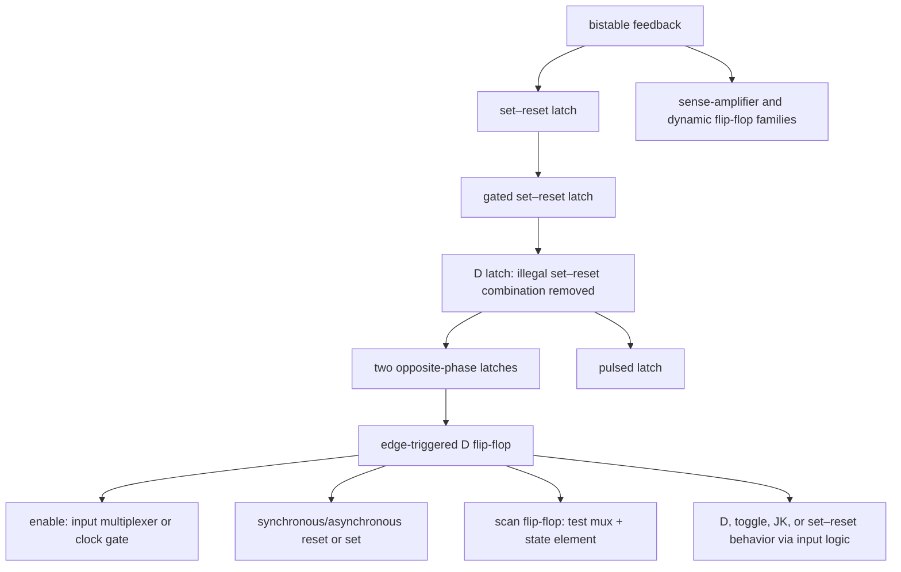
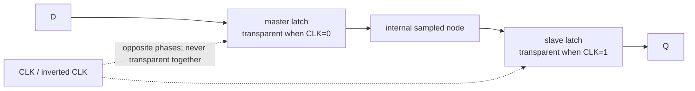

# Logic building blocks — from Boolean function to timed silicon

> **Prerequisites:** [CMOS_Fundamentals](01_CMOS_Fundamentals.md) (the transistor, inverter VTC and noise margins, RC delay and the FO4 unit, device-level logic families).
> **Hands off to:** [Adders_and_Multipliers](03_Adders_and_Multipliers.md) (carry/prefix trees built from these gates), [CPU_Architecture](../01_Architecture_and_PPA/01_CPU_Architecture/01_Core_Foundations/01_CPU_Architecture.md) (pipelines of these registers), [Async_Design_and_CDC](../03_Frontend_RTL_and_Verification/06_Async_Design_and_CDC.md) (synchronizers, Gray first-in/first-out (FIFO) pointers, and mean-time-between-failures (MTBF) budgeting), [static timing analysis (STA)](../06_Signoff/01_STA.md) (setup/hold signoff, time borrowing), [Clock_Division_and_Switching](../03_Frontend_RTL_and_Verification/04_Clock_Division_and_Switching.md) (glitch-free clock switching).

---

## 0. Why this page exists

Every digital chip is assembled from a short catalogue of primitives, each solving exactly one primitive problem: **select** one of many (mux), turn an index into a line and back (decoder/encoder), **compare**, and — the one thing combinational logic cannot do — **remember** a bit across time (latch/flip-flop) and **sequence** behaviour on history (FSM). The catalogue is short; the engineering is not, because each primitive can be realized many ways and the choice is a four-axis trade — speed, area, power, robustness — and the reader who only memorizes truth tables and signal names never sees the trade.

So this page derives each block **from its function** and evaluates each implementation against a single cost model, organized around two ideas:

1. A combinational block is a pure Boolean function, and there are always many circuits computing it. Which you pick — ripple vs tree, static vs dynamic, mux vs AOI, wide-gate vs decomposed — is decided quantitatively by the **method of logical effort**. Front-load it (§1) and every later trade-off is one sentence.
2. A sequential block adds the one capability logic alone lacks: **holding a value across a clock edge.** That single requirement — sample and hold without ever being transparent — *forces* the master–slave flip-flop, *defines* setup/hold/clk-to-Q, and *exposes* metastability. Derive the storage element from that requirement and latches, flip-flops, registers, and FSMs all follow.

The goal is that you finish able to reason about *why* a block is built the way it is and *where* the design knee sits — not to look up a schematic.

---

## 1. The cost model that governs every choice: logical effort

Before any block, fix the ruler. Almost every "which implementation" question on this page — and most on the adders and caches pages — is answered by comparing delay and area under one model. In CMOS, delay is not gate count; it is **effort**.

### 1.1 Delay as logical effort × electrical effort

The normalized delay of a logic gate is

$$
d \;=\; g\,h + p
$$

where:
- $g$ = **logical effort** — how much worse the gate's topology drives current than an inverter with the same input capacitance ($g_{inv}\equiv 1$). It is fixed by the gate *type* and captures the series-stack penalty.
- $h = C_{out}/C_{in}$ = **electrical effort** (fan-out) — load capacitance over the gate's own input capacitance; the only term the designer sets, by sizing and loading.
- $p$ = **parasitic delay** — the gate's self-load (drain diffusion), independent of $h$; $p_{inv}\approx 1$.
- $d$ is in units of $\tau$, the delay of a minimum inverter driving an identical inverter.

For the usual P/N ratio ($\gamma\approx 2$):

| Gate | $g$ (per input) | $p$ |
|---|---|---|
| Inverter | $1$ | $1$ |
| $n$-input NAND | $(n{+}2)/3$ | $n$ |
| $n$-input NOR | $(2n{+}1)/3$ | $n$ |
| 2:1 mux (TG) | $2$ | $4$ |
| 2-input XOR | $4$ | $4$ |

Two lessons already fall out: **NOR is worse than NAND** (its PMOS are in series, and PMOS is the weaker device — which is why static libraries prefer NAND/AOI and avoid wide NOR), and $g$ **grows with fan-in** $n$ (§1.3).

### 1.2 Sizing a path: path effort, the magic stage effort ≈ 4, and how many stages

A path is minimized as a whole, not gate by gate. Define:

$$
G=\prod_i g_i,\quad B=\prod_j b_j,\quad H=\frac{C_{out}}{C_{in}},\qquad F = G\,B\,H
$$

where $G$ = path logical effort, $B$ = path branching effort ($b=(C_{on}+C_{off})/C_{on}$ at each fan-out point), $H$ = overall electrical effort, and $F$ = **path effort**. The path delay $D=\sum_i g_ih_i+\sum_i p_i$ is minimized when **every stage carries the same stage effort**:

$$
\hat f = g_i h_i = F^{1/N},\qquad D_{min}=N\,F^{1/N}+P
$$

with $P=\sum_i p_i$. So the optimal *sizing* rule is "equalize effort per stage," and the optimal *number* of stages comes from minimizing $N F^{1/N}$ over $N$. Including parasitics, the best stage effort $\rho$ solves $p_{inv}+\rho(1-\ln\rho)=0$:

$$
\rho \approx e \approx 2.7\ (p_{inv}{=}0),\qquad \rho\approx 3.6\text{–}4\ (p_{inv}{\approx}1),\qquad \hat N \approx \log_\rho F \approx \log_4 F
$$

The delay curve is so flat that any stage effort from ~2.4 to ~6 is within a few percent of optimum, so the whole industry standardizes on **stage effort 4** — the **fan-out-of-4 (FO4)**. An inverter at $h{=}4$ has delay $1\cdot4+1=5\tau$, and because that number is nearly process-independent, FO4 is *the* portable delay unit (the OoO scheduler's cycle budget is quoted in FO4 for exactly this reason — [OoO_Execution](../01_Architecture_and_PPA/01_CPU_Architecture/03_Out_of_Order_Backend/01_OoO_Execution.md) §4.3).

Consequences you will reuse: driving a large load (a wide bus, a clock net, a decoder wordline) makes $H$ large, so you need $\hat N\approx\log_4 H$ buffer stages — the reason repeater/buffer trees exist. Both one huge gate (too few stages) and an over-buffered chain (too many) are slower than the $\log_4 F$ sweet spot.

### 1.3 Fan-in and fan-out: why wide gates are slow and shallow logic wins

A single $n$-input gate looks area-cheap but is delay-expensive three ways at once: $g=(n{+}2)/3$ rises linearly, $p\approx n$ rises linearly, and the series transistor stack has resistance $\sim n$, so a lone wide gate's delay grows roughly linearly-to-quadratically in $n$. A **balanced tree** of 2-input gates computing the same reduction has depth $\lceil\log_2 n\rceil$ with bounded per-gate effort — delay $\sim\log n$. That one inequality,

$$
D_{ripple}\sim O(N)\quad\text{vs}\quad D_{tree}\sim O(\log N),
$$

is why *every* wide function on this page and the next is a **tree**: the carry-lookahead adder replaces the ripple chain to escape fan-in explosion ([Adders_and_Multipliers](03_Adders_and_Multipliers.md)), and so do the priority encoder/LZD (§3.2), the comparator (§3.3), and the wide mux (§2.2). Fan-out has the dual cost — each added load raises $h$ and thus delay linearly, which §1.2 pays down with staged buffers. This is why real standard-cell libraries top out around **fan-in 4** (rare NAND4/AOI22) and insert buffers rather than let $h$ run past ~6.

### 1.4 The logic-family menu: how to build the gate itself

Logical effort compares *networks of static gates*, but you can also change what a "gate" is. Four families, one table — the first real design trade of the page:

| Family | Mechanism | Speed | Area | Power | Robustness / noise | Where it lands |
|---|---|---|---|---|---|---|
| **Static CMOS** | dual PUN/PDN, output always driven | baseline ($g$ per §1.1) | $2n$ transistors | lowest — dynamic only, no static path | rail-to-rail, best noise margin, **glitch-tolerant** | >90% of every standard-cell library |
| **Pass-transistor** (bare NMOS) | steer inputs through NMOS | fast, very few devices | fewest devices | $V_t$ drop → static current in next stage | '1' degrades to $V_{dd}{-}V_{tn}$, poor NM, **non-restoring** | *inside* XOR/mux/adder cells only, never a chain |
| **Transmission gate** (NMOS‖PMOS) | steer through complementary pair | fast, full swing | 2 T/switch + complement clock | no static current, but clocked control | full swing, still **non-restoring** ($RC$ in series), charge injection | mux/latch/FF internals, XOR |
| **Dynamic / domino** | precharge then conditional evaluate | **fastest** — NMOS-only, tiny $g$ | $n{+}$few T | **highest** — precharge every cycle ($\alpha\!\to\!1$) + clock | worst NM, charge sharing, leakage, **glitch-intolerant**, monotonic-input only | speed-critical wide OR/AND (register files, some ALUs) |

The device-level structures live in [CMOS_Fundamentals](01_CMOS_Fundamentals.md) §5; here is the *reasoning* that decides between them.

**Why dynamic is fastest, and why it is dangerous.** A dynamic gate has only a pull-down NMOS network — the clock precharges the node to $V_{dd}$, then evaluate conditionally discharges it — so its input capacitance, and hence $g$, is roughly half a static gate's, and the output makes a single monotonic transition. That speed buys three liabilities that are the substance of dynamic-logic design:

- **Charge sharing.** When the precharged node shares charge with the parasitic capacitance of internal stack nodes left low, the output droops toward a false '0' even when the path should hold '1'. Mitigation: precharge internal nodes, or strengthen the keeper.
- **The keeper.** A weak PMOS from $V_{dd}$ to the dynamic node, gated by the output, trickles in charge to hold the '1' against leakage and charge sharing. But it *contends* with a legitimate discharge, so it must stay weak — upsizing it improves noise immunity at a direct cost in evaluate speed and contention power. That knob *is* the dynamic-logic robustness-vs-speed trade.
- **Monotonicity → domino.** A dynamic node can discharge only once per cycle, so its inputs must rise monotonically during evaluate; any $1\!\to\!0$ input glitch discharges it permanently. Cascading is fixed by putting a static inverter after each dynamic stage so inter-stage signals only ever rise — the **domino** chain — at the cost of realizing only non-inverting logic. The same "one-shot discharge" makes dynamic logic uniquely **hazard-intolerant** (§8): a transient the pull-down sees becomes a permanent wrong answer.

This is why modern low-power designs are almost entirely static CMOS, reserving dynamic/domino for a few frequency-critical wide gates, and why pass and transmission-gate logic appear only *inside* cells (muxes, XORs, latches) where a following static stage restores the level.

---

## 2. The multiplexer: selection is function evaluation

The primitive problem is "route one of several inputs to an output under control." But the mux is far more fundamental than a router: Shannon's theorem says selection *is* Boolean evaluation, which makes the 2:1 mux the universal combinational element — the atom of every FPGA lookup table.

### 2.1 Shannon expansion: a mux is a truth-table lookup

Any Boolean function splits on any variable:

$$
F(x_1,\dots,x_n)=\overline{x_1}\,F|_{x_1=0}+x_1\,F|_{x_1=1}
$$

where $F|_{x_1=c}$ is the cofactor with $x_1$ fixed to $c$. The proof is one line: at $x_1{=}0$ the right side is $F|_0$, at $x_1{=}1$ it is $F|_1$, and both equal $F$ by definition — so it holds for every input. **That expression is exactly a 2:1 mux** with select $x_1$ and data $\{F|_0,F|_1\}$. Recurse on the remaining variables and an $n$-input function becomes a tree of 2:1 muxes selecting among the $2^n$ truth-table entries — a mux tree *is* a lookup table. Two corollaries the old page spent pages proving: a 2:1 mux is a **universal gate** (fix the data inputs to constants or a literal to get NOT/AND/OR/XOR), and an $n$-variable function needs at most a $2^{\,n-1}{:}1$ mux (fold the last variable into the data inputs). Keep the idea; drop the enumeration.

### 2.2 Building an n:1 mux: tree vs flat, TG vs AOI, LUT vs cell

Three orthogonal choices, all decided by §1:

- **Structure — tree vs flat.** A flat $n{:}1$ mux is one $n$-input selection gate: fan-in $n$, so delay $O(n)$ by §1.3. A balanced tree of 2:1 muxes is depth $\log_2 n$: delay $O(\log n)$. Build the tree, except for very small $n$ or lightly loaded selects where the flat form's lower parasitic wins.
- **Circuit — TG vs AOI.** A TG/pass mux is tiny (2 transistors per 2:1) and fast for a couple of levels, but *non-restoring*: series transmission gates add $RC$ that grows quadratically with depth and never restores the level, so a deep TG mux must be broken by buffers. A static AOI (and-or-invert) mux restores every level with clean logical effort, at more area. Synthesis picks TG-style for shallow datapath selection and restoring gates for deep or heavily loaded muxes.
- **Fabric — mux/LUT vs AOI cell.** The same choice at chip scale: an FPGA realizes logic as mux/LUT trees (Shannon, §2.1), while ASIC synthesis maps the same function onto AOI/NAND static cells for density and power. Same function, different atoms, different cost model.

### 2.3 Selecting a clock: why a combinational mux glitches

Selecting *data* with a mux is safe; selecting a *clock* with the same mux is not — a clean illustration of hazards (§8) on a signal that must never glitch. If `sel` toggles while the two clocks sit at different phases, the mux output can emit a **runt pulse**, a fragment shorter than a real period, which downstream flip-flops may sample as an extra edge, miss entirely, or go metastable on. The fix is not a better mux but a *protocol*: gate each clock with an enable that is (a) synchronized into that clock's own domain and (b) cross-coupled so one clock is proven off before the other turns on — **break-before-make**, giving a dead cycle where no partial period can appear. In silicon this is a library **integrated clock-gating (ICG)** cell, whose internal latch holds the enable stable through the active phase. The full state machine, exhaustive safety table, and RTL belong where they are owned — [Clock_Division_and_Switching](../03_Frontend_RTL_and_Verification/04_Clock_Division_and_Switching.md) (glitch-free switching) and [Power_Reduction_Techniques](../02_Power_and_Low_Power/04_Power_Reduction_Techniques.md) (ICG). The concept to carry away: a clock is a signal where a transient is a *functional* fault, so it is switched by handshake, never by combinational selection.

---

## 3. Decoders and encoders: crossing the binary/one-hot boundary

Hardware constantly converts between two representations of "which one": a compact $k$-bit **binary index** and a $2^k$-bit **one-hot** select. A decoder goes index→one-hot — it is the address path of every memory, register file, and demux, turning an address into the single wordline that fires. An encoder goes one-hot→index. When more than one input is hot the inverse is ill-posed, and resolving it by rank is the **priority encoder** — which is exactly leading-zero detection.

### 3.1 The decoder: index → one-hot, and why real ones predecode

An $n$-to-$2^n$ decoder asserts output $i$ iff the input equals $i$; each output is one $n$-input AND of the address bits in true/complement form. Built naively that is $2^n$ gates of fan-in $n$ — and by §1.3 fan-in $n$ is slow, with a large wordline load on top. Two techniques, both pure logical effort:

- **Predecode.** Factor the $n$-input AND into two levels: predecode groups of ~2–3 address bits into small one-hot fields, then AND one line from each group. Fan-in per gate drops to the number of groups, terms are shared across all $2^n$ outputs, and the array shrinks and speeds up — what every SRAM and register-file row decoder does.
- **Buffer the wordline.** The wordline drives thousands of cells ($H$ huge), so by §1.2 it wants $\log_4 H$ stages of buffering — the graduated driver at the end of the decoder.

### 3.2 Priority encoder and leading-zero detection: ripple vs tree

A priority encoder returns the index of the highest-priority hot input; leading-zero detection/count (LZD/LZC) is the same operation on the bit vector after a floating-point subtraction, where the leading-one position sets the normalization shift ([Floating_Point](04_Floating_Point.md)). A linear scan is $O(N)$ — unacceptable for a 53-bit mantissa. The tree formulation is $O(\log N)$: split into pairs, and at each node combine children $(c_L,v_L)$ and $(c_R,v_R)$ — where $c$ is a partial leading-zero count and $v$ marks "this half has a one" — by

$$
(c,v)=\begin{cases}(c_L,\;1) & v_L\\ (w_L+c_R,\;1) & \overline{v_L}\,v_R\\ (w,\;0) & \text{otherwise}\end{cases}
$$

with $w_L$ = left-block width and $w$ = total width. That is $\log_2 N$ levels — the same tree-beats-ripple inequality as §1.3. The one FP-specific refinement worth keeping is the **leading-zero anticipator (LZA)**: rather than wait for the subtraction, predict the shift from the operands *in parallel* with the adder, tolerate a $\pm1$ error, and correct in the next stage — trading a small correction for removing the LZC from the critical path (details in [Floating_Point](04_Floating_Point.md)).

### 3.3 Comparators are prefix problems too

Magnitude comparison is subtraction's sign/borrow, and equality is an XNOR-reduce; either way "is $A>B$" over $N$ bits is a **prefix/reduction** with the same ripple-$O(N)$-vs-tree-$O(\log N)$ choice, and the associative combine

$$
(g,e)_{hi\cdot lo}=\big(g_{hi}\lor e_{hi}\,g_{lo},\;\; e_{hi}\,e_{lo}\big)
$$

where $g$ = "greater so far" and $e$ = "equal so far", is structurally the carry-tree combine of a prefix adder. So comparators reuse the adder's parallel-prefix machinery ([Adders_and_Multipliers](03_Adders_and_Multipliers.md)), and synthesis builds the tree automatically from `A > B` — there is no separate art here, which is why this page defers the bit-level construction to the adder page.

---

## 4. Latch versus flip-flop: holding a bit across a clock edge

Everything so far is a memoryless function of the present inputs. The one thing combinational logic cannot do is *remember* — and a synchronous machine must carry state from one cycle to the next. This section derives the storage element from that single requirement.



### 4.1 Why storage needs feedback, and why an edge needs two latches

To hold a bit with no input, you need a circuit with two stable states — a **bistable** — and the only way to get bistability from inverters is positive feedback: two cross-coupled inverters latch either 0 or 1 and hold it. Add a way to write it (a **transmission gate (TG)** on the loop) and you have a **D latch**: when the clock enables the TG the loop opens and $Q$ follows $D$ (**transparent**); when it disables, feedback closes and the value holds (**opaque**). A transmission gate is used, not a bare pass transistor, precisely because it passes both 0 and 1 full-swing (§1.4).

#### 4.1.1 The SR latch: the primitive bistable with explicit set and reset

The simplest controllable bistable is the **set–reset (SR) latch**. Two cross-coupled NOR gates form an active-high version. Driving $S=1$ forces $Q=1$; driving $R=1$ forces $Q=0$; with both low, feedback holds the prior value.

| $S$ | $R$ | $Q_{next}$ | Meaning |
|---:|---:|---|---|
| 0 | 0 | $Q$ | hold |
| 1 | 0 | 1 | set |
| 0 | 1 | 0 | reset |
| 1 | 1 | invalid/indeterminate after release | both outputs forced low; release race chooses the state |

The NAND implementation is the polarity dual: inputs are active-low $\overline S,\overline R$, hold is 11, and 00 is forbidden. “Forbidden” is not merely a truth-table convention. Asserting set and reset together destroys complementary $Q/\overline Q$; releasing them together creates a race and can enter metastability. SR latches therefore appear inside controlled cells and asynchronous set/reset paths, but ordinary datapaths expose a D input instead.

#### 4.1.2 Gated SR and D latches

A gated SR latch qualifies $S$ and $R$ with an enable. Derive the D latch by choosing $S=E D$ and $R=E\overline D$: set and reset can never assert together. Its characteristic equation is

$$Q_{next}=E D+\overline E Q.$$

When $E=1$, the latch is transparent and $Q$ follows $D$ after propagation delay. When $E=0$, the feedback term holds $Q$. This is also how a synchronous enable is implemented around an edge flip-flop: a mux selects $D_{new}$ when enabled and old $Q$ otherwise.

```wavedrom
{ "signal": [
  { "name": "E (latch enable)", "wave": "0.1...0..1...0." },
  { "name": "D",                "wave": "0..1.0.1..0...." },
  { "name": "Q",                "wave": "0..1.0...10...." }
], "head": { "text": "D latch: Q tracks D only while E is high, then holds" } }
```

The waveform contains the essential distinction: a latch samples a *window*, not an edge. Any legal D transition inside the transparent window propagates to Q. The close of that window creates setup/hold constraints.

But transparency is a hazard in a clocked pipeline: while a latch is open, a change on $D$ races straight through $Q$ and onward into the next stage — state could ripple through many stages in one clock phase, and timing becomes unanalyzable. What we actually want is to capture $D$ at an *instant* — the clock edge — and be opaque otherwise. No single level-sensitive latch can do that. The construction that can is **two latches in series on opposite clock phases** (master–slave):



At no instant is there a transparent path from $D$ to $Q$: whichever latch is open, the other is closed. The value is sampled by the master during one phase and handed to the slave at the edge — an **edge-triggered D flip-flop (DFF)**. That is the whole reason a flip-flop is two latches: *edge behaviour is the elimination of a transparent path*, and it costs exactly one extra storage stage.

### 4.2 Setup, hold, and clk-to-Q — read off the master–slave internals

The three timing parameters are not axioms; they are the master latch's write window and the slave's read delay:

- **Setup $t_{su}$** — $D$ must be stable *before* the edge because the master's internal node needs time to charge through its TG to a valid level before that TG shuts. Miss it and the captured level is marginal (and may go metastable, §4.8).
- **Hold $t_{h}$** — $D$ must stay stable *after* the edge because the master TG has finite turn-off slew; while it still conducts, a new $D$ can corrupt the just-captured value.
- **Clock-to-Q $t_{cq}$** — after the edge the slave TG opens and drives $Q$; $t_{cq}$ is that turn-on plus the slave inverter plus output load.

These feed the synchronous constraints — setup $t_{cq}+t_{logic}+t_{su}\le T_{clk}-t_{skew}$ and hold $t_{cq}+t_{logic}\ge t_{h}+t_{skew}$ — whose full slack accounting is signoff's job ([STA](../06_Signoff/01_STA.md) §3). Note that **negative setup or hold** is normal in modern cells (sense-amp or pulsed designs whose sampling window straddles the edge), which is why the numbers below can be small or negative and why negative $t_h$ effectively adds slack.

```wavedrom
{ "signal": [
  { "name": "CLK", "wave": "p......." },
  { "name": "D",   "wave": "0..1..0." },
  { "name": "Q",   "wave": "0...1..0" }
], "head": { "text": "Positive-edge DFF: D is sampled at an edge; Q changes after clock-to-Q" } }
```

The diagram is qualitative: the forbidden aperture extends $t_{su}$ before and $t_h$ after each active edge, and Q moves only after $t_{cq}$. A library timing model supplies the exact, slew/load-dependent values.

### 4.3 Functional flip-flop families: D, T, JK, and SR

“D flip-flop” describes the next-state function $Q^+=D$. Other named flip-flops describe different input functions; in a modern standard-cell flow they are commonly synthesized as a DFF plus combinational logic unless a dedicated cell is smaller or faster.

| Type | Inputs | Characteristic equation | Key behavior | Typical use |
|---|---|---|---|---|
| D | $D$ | $Q^+=D$ | copy input | registers, pipelines, state machines |
| T | $T$ | $Q^+=T\oplus Q$ | hold at 0, toggle at 1 | counters, divide-by-two |
| JK | $J,K$ | $Q^+=J\overline Q+\overline KQ$ | 00 hold, 10 set, 01 reset, 11 toggle | historical universal FF; counters/control |
| SR | $S,R$ | $Q^+=S+\overline RQ$ for legal inputs | set/reset/hold; $S=R=1$ illegal | explicit control and latch internals |

The JK flip-flop was invented to remove the SR forbidden case: $J=K=1$ toggles. A level-sensitive JK latch can **race around**—toggle repeatedly while the clock level is active—so a JK implementation must be edge-triggered or master–slave. The T flip-flop is simply JK with $J=K=T$, or a DFF with $D=T\oplus Q$.

For state-machine synthesis, the excitation table answers “what input produces the requested transition?”

| $Q\rightarrow Q^+$ | D | T | JK ($J,K$) | SR ($S,R$) |
|---|---:|---:|---|---|
| $0\rightarrow0$ | 0 | 0 | $0,X$ | $0,X$ |
| $0\rightarrow1$ | 1 | 1 | $1,X$ | $1,0$ |
| $1\rightarrow0$ | 0 | 1 | $X,1$ | $0,1$ |
| $1\rightarrow1$ | 1 | 0 | $X,0$ | $X,0$ |

$X$ means “don’t care,” not an unknown hardware value. D is dominant in RTL because the next-state expression maps directly and avoids feedback-dependent excitation minimization; T/JK remain valuable reasoning models for counters.

### 4.4 Circuit topologies: how an edge-triggered cell is physically built

Different circuit families implement the same architectural DFF contract but move the power/timing/robustness point:

| Topology | Mechanism | Strength | Cost/risk |
|---|---|---|---|
| transmission-gate master–slave | two static latches on opposite phases | full swing, robust, easy characterization | clock capacitance and ~two-latch area |
| C²MOS (clocked complementary metal–oxide–semiconductor) | clocked pull-up/pull-down stages | race-free under complementary clocks, compact | clock overlap/skew sensitivity |
| true single-phase clock (TSPC) | dynamic stages driven by one clock | fewer clock devices, high speed | leakage, charge sharing, min-frequency limit |
| pulse-triggered latch | narrow pulse opens one latch | lower area/clock power, time borrowing | pulse width/distribution and hold risk |
| sense-amplifier flip-flop | differential input sensed/regenerated near edge | very fast, small/negative setup | higher clock/data power, differential front end |
| dual-edge flip-flop | captures rising and falling edges | same data rate at half clock frequency | complex duty-cycle/two-edge timing and larger cell |

The correct topology depends on clock load, activity, required edge rate, low-voltage robustness, hold margin, and library methodology. The architectural contract alone does not reveal clock power or metastability behavior.

### 4.5 Enable, synchronous/asynchronous reset, set, and retention

**Enable** can be a D-input feedback mux, $D_{ff}=E D+\overline E Q$, or a clock-gating cell shared by many flops. The mux toggles the clock tree every cycle but gives per-register control. Clock gating saves clock power across a bank but requires a glitch-free integrated clock-gating latch, test enable, and a gating setup/hold check.

**Synchronous reset** is sampled on the active edge and participates in the D path. It is timing-friendly and glitch-resistant but cannot clear state when the clock is stopped. **Asynchronous reset/set** directly forces the storage node independent of clock, useful for safe power-up and clock-off states, but assertion and especially deassertion are asynchronous events. Recovery and removal are the reset analogues of setup and hold: deassert too near an edge and different flops can leave reset on different cycles or go metastable. A common policy is **asynchronous assert, synchronous deassert** through a reset synchronizer in each clock domain.

```wavedrom
{ "signal": [
  { "name": "CLK",     "wave": "p........." },
  { "name": "reset_n", "wave": "0..1......" },
  { "name": "D",       "wave": "1........." },
  { "name": "Q",       "wave": "0....1...." }
], "head": { "text": "Asynchronous assert, synchronous release: Q stays reset until a safe clock edge" } }
```

Reset every control bit whose unknown value could cause unsafe activity; consider leaving wide datapath/pipeline registers unreset and qualify them with reset valid bits. Resetting thousands of data flops adds routing, area, clock/reset recovery constraints, and power. **Retention flops** add a separately powered shadow state and save/restore controls across power gating; their power-state protocol is owned by [Low-Power Architecture](../02_Power_and_Low_Power/03_Low_Power_Architecture_and_Domain_Partitioning.md).

### 4.6 Scan flip-flops and design-for-test consequences

A scan DFF inserts a mux before D: functional data when `scan_enable=0`, serial `scan_in` when 1. Chains connect Q to the next scan input so test equipment can shift in an internal state, capture one or more functional cycles, then shift the response out. Required fields are functional D, scan input/output, scan enable, clock/reset behavior, and sometimes test-mode clock-gate override.

Scan makes sequential logic controllable/observable for automatic test pattern generation, but adds input delay, area, routing, and switching power. Scan reorder after placement reduces wire; lockup latches bridge opposite clock edges or large skew; compression reduces pins and shift cycles. Detailed fault/test methodology belongs to [DFT and ATPG](../06_Signoff/02_DFT_and_ATPG.md), but the storage-cell choice must reserve the test path from the start.

### 4.7 The latch/flip-flop trade-off: area, power, and time borrowing

Given the flip-flop is two latches, why does anyone still pipeline with bare latches? Because the extra stage costs area, power, and flexibility:

| Axis | Flip-flop (edge) | Latch (level) |
|---|---|---|
| Storage stages | two (master + slave) | one → roughly **half the area and clock power** |
| Timing model | one edge, simple STA | transparent window → harder STA |
| Slack across stages | rigid: each stage $\le T$ | **time borrowing** — a slow stage steals from a fast neighbour |
| Min-delay / hold risk | contained | higher (transparency widens hold windows) |

**Why time borrowing works.** In a two-phase latch pipeline the receiving latch is still transparent for half a cycle *after* nominal launch, so a slow logic stage can finish late and still be captured — it "borrows" time from the next stage, which must then finish early. The constraint relaxes from per-stage to per-pair:

$$
t_{cq}+t_{comb,1}+t_{comb,2}+t_{su}\;\le\;2\,T_{half}
$$

so unbalanced logic that would fail a rigid flip-flop boundary can close between latches. The cost is exactly the transparency the flip-flop was built to avoid: harder timing closure and worse hold exposure. High-frequency custom datapaths use latches and **pulsed latches** for the area/power/borrowing win; control logic and most synthesized RTL use flip-flops for the simple single-edge model. A pulsed latch — a latch clocked by a narrow pulse — is the middle ground: near-latch area, edge-like use, at the price of a delicate pulse generator.

### 4.8 Metastability: the third equilibrium and MTBF

The cross-coupled pair has a *third* equilibrium besides 0 and 1: the balance point at $\approx V_{dd}/2$. It is unstable, but a setup/hold violation can leave the node there, and only circuit noise nudges it off. Linearizing around that point,

$$
\frac{dV}{dt}=\frac{V-V_m}{\tau}\;\;\Rightarrow\;\; V(t)-V_m=(V(0)-V_m)\,e^{\,t/\tau}
$$

where $V_m$ = metastable voltage and $\tau$ = regeneration time constant set by the pair's gain-bandwidth product. Resolution is exponential, so the probability of *still* being unresolved after time $t_r$ falls exponentially, giving the failure-rate/MTBF law:

$$
\text{MTBF}=\frac{e^{\,t_r/\tau}}{T_0\,f_{clk}\,f_{data}}
$$

where $t_r$ = time allowed to resolve, $T_0$ = width of the aperture around the edge in which a transition induces metastability, $f_{clk}$ = sampling clock, $f_{data}$ = rate of asynchronous input events. The lesson is the *shape*: MTBF is **exponential in the resolution time** $t_r$, so adding one synchronizer flip-flop (buying a full period more of $t_r$) multiplies MTBF by $e^{T_{clk}/\tau}$ — astronomically. Concretely, with $\tau\approx10$ ps, $T_0\approx50$ ps, $f_{clk}=2$ GHz, $f_{data}=500$ MHz, a 2-flop synchronizer resolves for $t_r\approx T_{clk}-t_{cq}-t_{su}\approx445$ ps, giving $\text{MTBF}=e^{44.5}/(50{\times}10^{-12}\cdot2{\times}10^{9}\cdot5{\times}10^{8})\approx4{\times}10^{11}$ s $\approx 13{,}600$ years; a third flop doubles $t_r$ and pushes it past $10^{26}$ years. That is why the fix for a marginal crossing is "add a flop," not "clock slower." The MTBF *budget*, the synchronizer zoo, and CDC schemes are the CDC page's subject ([Async_Design_and_CDC](../03_Frontend_RTL_and_Verification/06_Async_Design_and_CDC.md) §1); here metastability matters only as the physical price of a storage element that can be asked to sample at the wrong time.

---

## 5. Registers and register files: composing the primitives

Group the flip-flop and it becomes the workhorse sequential block. A **register** is $N$ flip-flops on one clock (optionally with an enable driven by a clock-gate, §2.3). A **shift register** wires each $Q$ to the next $D$ — serial↔parallel conversion and delay lines. A **register file** is where §2–§4 compose into one structure: an array of registers, a **decoder** (§3.1) per port turning an address into a wordline, and a read **mux/bitline** (§2) per port selecting the addressed row. Its cost is dominated by **ports**, not depth: each added read/write port threads another word- and bit-line through *every* cell, so cell area grows as $\sim P^2$ and access time with it — the identical quadratic-port wall that caps issue width in an OoO core ([OoO_Execution](../01_Architecture_and_PPA/01_CPU_Architecture/03_Out_of_Order_Backend/01_OoO_Execution.md) §2.3). This is why register files bank and cluster rather than pile on ports, and why "just add a port" is never cheap.

```mermaid
flowchart LR
    FF["flip-flop / latch"] --> REG["parallel register"]
    REG --> SHIFT["shift register\nserial and parallel modes"]
    REG --> CNT["counter\nbinary / modulo-N / up-down"]
    SHIFT --> RING["ring / Johnson counter"]
    SHIFT --> LFSR["linear-feedback shift register\npseudo-random sequence generator"]
    REG --> RF["register file"]
    DEC["address decoder"] --> RF
    RF --> MUX["read mux / bitlines"]
```



### 5.1 Register and shift-register modes

| Structure | Input/output mode | Per-edge behavior | Use |
|---|---|---|---|
| PIPO (parallel-in/parallel-out) | parallel in, parallel out | load or hold an entire word | pipeline/state register |
| SISO (serial-in/serial-out) | serial in, serial out | shift one bit between stages | delay, serialization |
| SIPO (serial-in/parallel-out) | serial in, parallel out | shift then observe all stages | serial receiver/deserializer |
| PISO (parallel-in/serial-out) | parallel in, serial out | load word, then shift | serializer/test output |
| bidirectional/universal | parallel load plus left/right shift | mux selects hold/load/shift directions | datapath alignment and scan-like movement |

The input mux selects hold, load, shift-left, or shift-right for every stage. Arithmetic right shift differs only at the incoming most-significant bit: replicate sign instead of zero. A barrel shifter replaces $N$ repeated shift cycles with $\log_2N$ mux stages; it is combinational and belongs to the same selection-tree cost model as §2.

### 5.2 Counter families and their design trade-offs

An **asynchronous or ripple counter** clocks each T/toggle stage from the previous Q. It is compact, but transitions ripple through $O(N)$ clock-to-Q delays and intermediate codes glitch; use it only for relaxed-frequency division where downstream logic does not sample the ripple. A **synchronous binary counter** clocks every bit together and computes toggle enable $T_i=\prod_{k<i}Q_k$. Naively that enable has growing fan-in; a prefix/carry tree or incrementer makes delay $O(\log N)$.

An up/down counter selects carry versus borrow propagation. A modulo-$M$ counter returns to zero at $M-1$; if $M$ is not a power of two, decoding terminal count adds logic and illegal states require recovery. A saturating counter stops at its maximum/minimum and is common in predictors because wraparound would invert confidence.

| Counter | State sequence | Advantage | Limitation/use |
|---|---|---|---|
| binary | $0\ldots2^N-1$ | compact encoding | many simultaneous bit toggles |
| Gray | adjacent codes differ by one bit | safe observation across domains | arithmetic/terminal decode needs conversion |
| one-hot ring | one bit circulates through $N$ flops | trivial decode, one-hot phase | needs initialized legal state; $N$ flops for $N$ states |
| Johnson/twisted ring | inverted tail feeds head | $2N$ easily decoded phases | illegal-state recovery |
| linear-feedback shift register (LFSR) | XOR feedback sequence | long pseudo-random sequence with little logic | excludes all-zero state; not cryptographically secure |

For an $N$-bit maximal-length LFSR, a primitive feedback polynomial yields period $2^N-1$. Fibonacci form computes one XOR feedback and shifts it; Galois form distributes XORs along the register, usually shortening the critical path. LFSRs generate pseudo-random binary sequences, scrambler patterns, built-in self-test signatures, and randomized replacement choices. The polynomial, shift convention, seed, and bit ordering are part of the interface—mismatching any one produces a different sequence.

### 5.3 Multiport register files and bypass

A register-file write port contains address decoder, write data/bitlines, byte/bit enables, and write driver. A read port contains wordline selection, bitlines/sense or mux tree, and output register/bypass. Multiple simultaneous writes to one address require a priority/error contract. A same-cycle read/write collision must define read-old, read-new through bypass, or unspecified behavior.

Flop-based small register files implement each read as a mux and are fast/flexible but scale poorly. Compiled SRAM/register-file macros use dense custom cells and bitlines but have fixed ports, latency, and collision modes. Banking reduces cell ports by steering addresses, but bank conflicts become an architectural stall/replay. Replication adds read ports cheaply only when writes broadcast to every copy.

---

## 6. Finite state machines: making behaviour depend on history

A pure function reacts only to the present input; a controller must react to *where it has been*. The minimal machine that does is a **state register plus combinational next-state/output logic** — the FSM. Its whole design reduces to choosing the state *encoding* and keeping the machine safe, both of which fall back on the §1 cost model plus a reliability concern.

### 6.1 Moore vs Mealy, and registered outputs

A **Moore** output depends only on the state (glitch-free, one cycle of latency); a **Mealy** output depends on state *and* input (fewer states, faster reaction, but it inherits input glitches). For clean timing, outputs are usually **registered** — decoded from `next_state` into an output flop so they change with the transition and arrive glitch-free at the next block. Decoding `next_state` rather than `state` removes both the extra Moore latency and the combinational output hazard, at the cost of one flop per output.

### 6.2 State encoding: one-hot vs binary vs gray

The encoding sets how much next-state logic sits between the flops — a direct fan-in trade:

| | Binary ($\lceil\log_2 S\rceil$ FF) | One-hot ($S$ FF) | Gray ($\lceil\log_2 S\rceil$ FF) |
|---|---|---|---|
| Flip-flops | fewest | most | fewest |
| Next-state logic | needs a state **decoder** (deep, high fan-in) | trivial — each bit is a shallow OR of a few transitions | like binary |
| Speed | slower (decode depth) | **fastest** (~2 gate levels) | slower |
| Best when | many states ($>\!\sim\!32$, FF count dominates) | few states, speed-critical, FPGA (FF-rich, LUT-poor) | adjacent transitions / async sampling |

The crossover is real: below ~20–32 states, one-hot's shallow next-state logic usually wins on speed *and* often on area (the logic saved outweighs the extra flops); past ~32 states the flop count dominates and binary wins. FPGAs skew strongly one-hot (flops are free, LUTs are the currency); ASICs choose per-FSM. This is the same "shallow tree beats deep decode" argument as §1.3, applied to the next-state cloud.

### 6.3 Safe FSMs: recovering from illegal states

A radiation strike, power glitch, or uncorrected ECC error can flip a state flop into an **unreachable** code. Binary with $S$ non-power-of-two states has $2^{\lceil\log_2 S\rceil}-S$ illegal codes; one-hot has $2^S-S$ (any word without exactly one hot bit is illegal — detectable in one line by `state != 0 && (state & (state-1)) == 0`). A safe FSM detects the illegal case and forces a return to a known state (IDLE) with an error flag. The related tapeout hazard is the `full_case`/`parallel_case` pragma: `parallel_case` (cases mutually exclusive) is legitimate for one-hot, but `full_case` (assume all cases covered) hides the missing default and causes sim/synth mismatch — so always code an explicit `default`. That is the entire safe-FSM discipline; it needs a one-line legality check, not a page of RTL.

---

## 7. Gray code: one bit at a time, and why CDC needs it

When a multi-bit value is sampled by a clock unrelated to the one changing it, several bits may be mid-transition at the sampling instant, and the captured word can be *neither* the old nor the new value — pure garbage. If consecutive values differ in exactly **one** bit, at most one bit is ever in flight, so the sample is always either the old or the new value. That property is why counters that cross clock domains (async-FIFO read/write pointers) are Gray-coded.

The reflected Gray code is $G(i)=i\oplus(i\gg1)$, i.e. $g_k=b_k\oplus b_{k+1}$. **Single-change proof:** incrementing $i$ flips its trailing run of ones and the first zero above them, at position $j$. Only $g_j=b_j\oplus b_{j+1}$ sees a net change — at any $k<j$ both $b_k$ and $b_{k+1}$ flip, so their XOR is unchanged; at $k>j$ neither flips; at $k=j$ only $b_j$ flips. Hence exactly one Gray bit changes per increment. Encode is a free XOR (`gray = bin ^ (bin>>1)`, no carry chain); decode is a prefix-XOR, $b_k=\bigoplus_{m\ge k} g_m$, an $O(\log N)$ tree — which matters because it sits on the FIFO pointer path. The CDC use — synchronizing Gray pointers, generating full/empty — is [Async_Design_and_CDC](../03_Frontend_RTL_and_Verification/06_Async_Design_and_CDC.md) §4–§5; here Gray is just the code whose defining property makes asynchronous sampling safe.

---

## 8. Hazards and glitches: when combinational logic lies transiently

A combinational output is only guaranteed correct *after* it settles; in between, unequal path delays make it glitch. Knowing when that matters — and when it does not — separates a real timing concern from wasted effort.

A **static-1 hazard** is the canonical case. In $F=AB'+BC$ with $A{=}C{=}1$, toggling $B$ hands the '1' from one product term to the other, and if the term that should rise is late, $F$ momentarily dips to 0. K-map view: the two 1-cells are adjacent but covered by *different* prime implicants with no shared cover, so the transition crosses a gap. The fix is the **consensus term**: add $AC$ (the consensus of $AB'$ and $BC$), which stays 1 throughout the transition and bridges the gap — redundant for *logic*, essential for *timing*. Static-0 hazards are the POS dual (add the consensus factor); dynamic hazards (multiple transitions) occur only in multi-level circuits, and Eichelberger's theorem guarantees that eliminating all static hazards eliminates dynamic ones too.

The load-bearing judgment: **in synchronous logic, glitches between flip-flops are harmless** — the output is sampled only at the clock edge, long after it settles, so consensus-term padding is wasted area there. Hazards matter only where a transient is itself an event:

1. asynchronous circuits and handshakes,
2. clock generation/gating and reset logic (a glitch is a spurious edge — §2.3),
3. anything feeding a level-sensitive latch enable or an edge/interrupt input,
4. **dynamic logic** (§1.4), where one glitch permanently discharges the node.

So hazard theory is a targeted tool for the async/clock/dynamic corners where combinational logic is read *before* it settles — not something to sprinkle across ordinary pipelined datapaths.

---

## 9. Elastic buffering and FIFO depth

Two agents that produce and consume at rates differing *instantaneously* (bursts) but compatible *on average* need somewhere to park the backlog — the FIFO is that elastic buffer, and it doubles as the safe payload channel across a clock-domain crossing.

The depth question is one integral, not a stack of worked scenarios. Over a burst the queue fills at the instantaneous rate difference, so the minimum depth is the peak backlog:

$$
D_{min}=\max_t\int_0^t\!\big(r_{wr}(t')-r_{rd}(t')\big)\,dt' \;\approx\; B\Big(1-\frac{r_{rd}}{r_{wr}}\Big)
$$

where $B$ = burst length and $r_{wr},r_{rd}$ = effective write/read rates (throughput × duty). Two guardrails: the buffer is only *stable* if $\overline{r_{rd}}\ge\overline{r_{wr}}$ **on average** (otherwise no finite depth suffices — occupancy grows without bound), and for a bursty producer you must take the worst-case per-burst backlog, not the average rate. An asynchronous FIFO adds a few entries of margin for synchronizer latency on the pointers (the opposite pointer is always 2–3 cycles stale) and rounds up to a power of two so the Gray-pointer wrap (§7) is free. The production-grade async FIFO — Gray pointers, pointer synchronizers, full/empty proofs, and the depth worked examples — is [Async_Design_and_CDC](../03_Frontend_RTL_and_Verification/06_Async_Design_and_CDC.md) §5. The takeaway here is the model, not the arithmetic: depth is bounded backlog, and only if the average rates are compatible.

---

## Numbers to memorize

| Quantity | Value | Why it matters (section) |
|---|---|---|
| Logical effort $g$: inv / NAND2 / NOR2 | 1 / 4/3 / 5/3 | NOR slower → libraries favor NAND/AOI (§1.1) |
| Optimal stage effort | ≈ 4 (FO4); ideal $e\approx2.7$ | equal-effort staging, flat over 2.4–6 (§1.2) |
| Optimal number of stages | $\log_4 F$ | path effort → depth (§1.2) |
| FO4 delay (7 nm) | ~15–30 ps | portable delay unit (§1.2) |
| Practical max fan-in | ~4 | wide-gate delay $O(n)$ → trees (§1.3) |
| Ripple vs tree | $O(N)$ vs $O(\log N)$ | every wide block is a tree (§1.3) |
| Setup / hold (DFF, N5) | 15–60 / 5–40 ps | max freq / min-delay path (§4.2) |
| Clk-to-Q (DFF, N5) | 20–40 ps | pipeline stage overhead (§4.2) |
| DFF vs latch area | ~2× (two latches vs one) | area/power/borrowing trade (§4.7) |
| Latch time-borrow limit | ≤ one half-cycle | unbalanced-pipeline slack (§4.7) |
| Metastability $\tau$ (N5) | 8–12 ps | MTBF exponent (§4.8) |
| MTBF scaling | $\propto e^{\,t_r/\tau}$ | +1 sync flop ⇒ ×$e^{T/\tau}$ (§4.8) |
| 2-FF synchronizer MTBF | >10⁴ years | adequate for most CDC (§4.8) |
| One-hot vs binary crossover | ~20–32 states | FF count vs decode depth (§6.2) |
| Gray code | adjacent values differ by 1 bit | safe async sampling (§7) |
| 2:1 mux transistors | 4 (TG) / 6 (gate) | area benchmark (§2.2) |
| DFF transistors | 24–28 | area benchmark (§4.1) |
| ICG cell | ~8 T + latch | clock-gate primitive (§2.3) |

---

## Cross-references

- **Down the stack (what these blocks are built from):** [CMOS_Fundamentals](01_CMOS_Fundamentals.md) — the transistor, inverter VTC, noise margins, RC delay and FO4, and the device-level static/pass/TG/dynamic families behind §1.4.
- **Same layer (blocks composed into datapaths):** [Adders_and_Multipliers](03_Adders_and_Multipliers.md) (carry/prefix trees — the §1.3 tree argument and the §3.3 comparator in full), [Floating_Point](04_Floating_Point.md) (the LZA/LZC normalization of §3.2).
- **Up the stack (what builds on these blocks):** [CPU_Architecture](../01_Architecture_and_PPA/01_CPU_Architecture/01_Core_Foundations/01_CPU_Architecture.md) (pipelines of these registers and the setup/hold budget of §4.2), [OoO_Execution](../01_Architecture_and_PPA/01_CPU_Architecture/03_Out_of_Order_Backend/01_OoO_Execution.md) (register files and the $P^2$ port wall of §5, the FO4 cycle budget of §1.2), [Async_Design_and_CDC](../03_Frontend_RTL_and_Verification/06_Async_Design_and_CDC.md) (metastability budgeting, Gray pointers, async FIFO of §4.8/§7/§9), [Clock_Division_and_Switching](../03_Frontend_RTL_and_Verification/04_Clock_Division_and_Switching.md) (the glitch-free clock mux of §2.3), [Power_Reduction_Techniques](../02_Power_and_Low_Power/04_Power_Reduction_Techniques.md) (ICG / clock gating), [STA](../06_Signoff/01_STA.md) (setup/hold and time-borrowing signoff of §4.2 and §4.7).

---

## References

1. Sutherland, I., Sproull, R., Harris, D., *Logical Effort: Designing Fast CMOS Circuits*, Morgan Kaufmann, 1999. The $g,h,p$ / path-effort / stage-effort-4 model of §1.
2. Weste, N., Harris, D., *CMOS VLSI Design*, 4th ed., Addison-Wesley, 2010. Logic families, sequential elements, FO4.
3. Rabaey, J., Chandrakasan, A., Nikolić, B., *Digital Integrated Circuits*, 2nd ed., Prentice Hall, 2003. Dynamic/domino logic, charge sharing, keepers (§1.4).
4. Eichelberger, E.B., "Hazard detection in combinational and sequential switching circuits," *IBM J. Res. Dev.*, 1965. The static→dynamic hazard theorem of §8.
5. Ginosar, R., "Metastability and Synchronizers: A Tutorial," *IEEE Design & Test*, 2011. The MTBF derivation of §4.8.
