# Logic building blocks — from Boolean function to timed silicon

> **Prerequisites:** [CMOS_Fundamentals](01_CMOS_Fundamentals.md) (the transistor, inverter VTC and noise margins, RC delay and the FO4 unit, device-level logic families).
> **Hands off to:** [Adders_and_Multipliers](03_Adders_and_Multipliers.md) (carry/prefix trees built from these gates), [CPU_Architecture](../01_Architecture_and_PPA/01_CPU_Architecture/01_Core_Foundations/01_CPU_Architecture.md) (pipelines of these registers), [Async_Design_and_CDC](../03_Frontend_RTL_and_Verification/06_Async_Design_and_CDC.md) (synchronizers, Gray first-in/first-out (FIFO) pointers, and mean-time-between-failures (MTBF) budgeting), [static timing analysis (STA)](../06_Signoff/01_STA.md) (setup/hold signoff, time borrowing), [Clock_Division_and_Switching](../03_Frontend_RTL_and_Verification/04_Clock_Division_and_Switching.md) (glitch-free clock switching).
> **Abbreviation key — return as needed:** application-specific integrated circuit (ASIC); and-or-invert (AOI); clock-domain crossing (CDC); complementary metal–oxide–semiconductor (CMOS); D flip-flop (DFF); field-programmable gate array (FPGA); finite-state machine (FSM); fan-out-of-4 (FO4); integrated clock-gating (ICG); linear-feedback shift register (LFSR); leading-zero anticipator/count/detector (LZA/LZC/LZD); power, performance, and area (PPA); process, voltage, and temperature (PVT); resistor–capacitor delay (RC delay); register-transfer level (RTL); set–reset (SR); sum of products/product of sums (SOP/POS); transmission gate (TG); true single-phase clock (TSPC); voltage-transfer characteristic (VTC).

---

## 0. Why this page exists

Every digital chip is assembled from a short catalogue of primitives, each solving exactly one primitive problem: **select** one of many (mux), turn an index into a line and back (decoder/encoder), **compare**, and — the one thing combinational logic cannot do — **remember** a bit across time (latch/flip-flop) and **sequence** behaviour on history (FSM). The catalogue is short; the engineering is not, because each primitive can be realized many ways and the choice is a four-axis trade — speed, area, power, robustness — and the reader who only memorizes truth tables and signal names never sees the trade.

So this page derives each block **from its function** and evaluates each implementation against a single cost model, organized around two ideas:

1. A combinational block is a pure Boolean function, and there are always many circuits computing it. The **method of logical effort** provides an early delay model for choices such as ripple versus tree, wide gate versus decomposition, and buffer depth. It does not replace power, noise, hazard, clocking, test, wire, or robustness analysis.
2. A sequential block adds the one capability logic alone lacks: **holding a value across time.** Requiring a level window produces a latch; requiring one exposed update per clock event motivates edge-triggered storage. The master–slave construction makes that evolution easiest to derive, while pulsed, dynamic, and sense-amplifier cells provide alternative physical implementations. Sampling defines setup/hold/clock-to-Q and exposes metastability; composing storage produces registers, counters, state machines, and FIFOs.

The goal is that you finish able to reason about *why* a block is built the way it is and *where* the design knee sits — not to look up a schematic.

### 0.1 The construction path used throughout this chapter

Digital structures are easiest to remember when each one is introduced as the repair for a specific failure of the previous one:

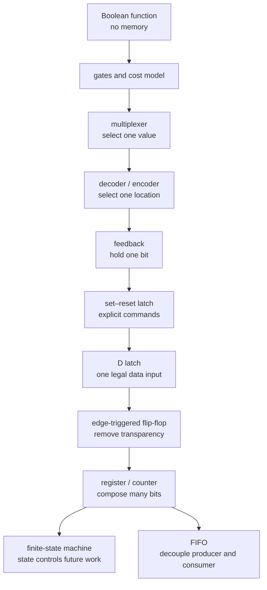

Every major subsection therefore answers the same seven questions:

1. What is the smallest structure that implements the required behavior?
2. What state and signals does that structure own?
3. What fails or becomes expensive in the baseline?
4. Which added gates, storage, protocol, or timing rule repair that failure?
5. How does a request or transition propagate through the new structure?
6. What area, delay, power, robustness, or verification cost did the repair introduce?
7. Under which workload or physical condition should a different structure be selected?

### 0.2 The minimal Boolean toolkit before circuit optimization

A logic value is an abstraction over a voltage range, not the voltage itself. Gates are specified by Boolean behavior and timing/noise limits; [CMOS Fundamentals](01_CMOS_Fundamentals.md) explains how transistor networks create those limits. This chapter uses the following functional atoms:

| Function | Equation | Output is 1 when | Why it becomes a building block |
|---|---|---|---|
| NOT | $Y=\overline A$ | input is 0 | creates complementary control and restores polarity |
| AND | $Y=AB$ | every input is 1 | qualifies an action by simultaneous conditions |
| OR | $Y=A+B$ | any input is 1 | merges alternative causes |
| NAND | $Y=\overline{AB}$ | not all inputs are 1 | universal and maps efficiently to series NMOS/parallel PMOS |
| NOR | $Y=\overline{A+B}$ | no input is 1 | universal and directly forms active-high SR feedback |
| XOR | $Y=A\oplus B$ | inputs differ | parity, adders, toggles, Gray conversion |
| XNOR | $Y=\overline{A\oplus B}$ | inputs match | equality comparison and tag matching |

**Universal** means that one gate family plus wiring can express every Boolean function. NAND demonstrates the construction:

```tikz
\usepackage{circuitikz}
\begin{document}
\begin{circuitikz}[american,thick,scale=0.9,transform shape]
  \node[nand port] (NI) at (2.0,2.3) {};
  \draw (-0.2,2.3) node[left]{$A$} -- (0.4,2.3) node[circ]{} |- (NI.in 1);
  \draw (0.4,2.3) |- (NI.in 2);
  \draw (NI.out) -- ++(0.7,0) node[right]{$\overline A$};

  \node[nand port] (NAB) at (2.0,0) {};
  \node[nand port] (NANDI) at (5.0,0) {};
  \draw (NAB.in 1) -- ++(-0.8,0) node[left]{$A$};
  \draw (NAB.in 2) -- ++(-0.8,0) node[left]{$B$};
  \draw (NAB.out) -- (3.5,0) coordinate (X) node[circ]{};
  \draw (X) |- (NANDI.in 1); \draw (X) |- (NANDI.in 2);
  \draw (NANDI.out) -- ++(0.7,0) node[right]{$AB$};

  \node[nand port] (NA) at (1.4,-2.2) {};
  \node[nand port] (NB) at (1.4,-3.8) {};
  \node[nand port] (NOR) at (5.0,-3.0) {};
  \draw (-0.2,-2.2) node[left]{$A$} -- (0.2,-2.2) node[circ]{} |- (NA.in 1);
  \draw (0.2,-2.2) |- (NA.in 2);
  \draw (-0.2,-3.8) node[left]{$B$} -- (0.2,-3.8) node[circ]{} |- (NB.in 1);
  \draw (0.2,-3.8) |- (NB.in 2);
  \draw (NA.out) -- (NOR.in 1) node[midway,above]{$\overline A$};
  \draw (NB.out) -- (NOR.in 2) node[midway,below]{$\overline B$};
  \draw (NOR.out) -- ++(0.7,0) node[right]{$A+B$};
  \node[align=right] at (-1.5,2.3) {NOT};
  \node[align=right] at (-1.5,0) {AND};
  \node[align=right] at (-1.5,-3.0) {OR};
\end{circuitikz}
\end{document}
```

The last branch is De Morgan's law: $A+B=\overline{\overline A\,\overline B}$. Its dual is $AB=\overline{\overline A+\overline B}$. These transformations matter physically because a sum-of-products expression can become a NAND–NAND network and a product-of-sums expression can become NOR–NOR, changing fan-in, inversion availability, delay, and glitch paths without changing the settled truth table.

To implement an arbitrary truth table, one mechanical route is **sum of products (SOP)**: create one AND term for every row whose output is 1, complementing inputs that are 0 in that row, then OR the terms. **Product of sums (POS)** does the dual for zero rows. Boolean algebra or a Karnaugh map removes redundant literals and combines adjacent rows; synthesis tools perform larger versions of this optimization. The minimized equation is still not a timed circuit—gate decomposition, fan-out, wire load, hazards, and storage boundaries remain.

For example, $F=AB+\overline A C$ can be read two ways:

```tikz
\usepackage{circuitikz}
\begin{document}
\begin{circuitikz}[american,thick,scale=0.9,transform shape]
  \node[not port] (I) at (0,1.2) {};
  \node[and port] (P0) at (2.6,2.0) {};
  \node[and port] (P1) at (2.6,0) {};
  \node[or port] (O) at (5.4,1.0) {};
  \draw (I.in) -- ++(-0.8,0) coordinate (A) node[circ]{} node[left]{$A$};
  \draw (A) |- (P0.in 1);
  \draw (I.out) -| (P1.in 1) node[pos=0.25,above]{$\overline A$};
  \draw (P0.in 2) -- ++(-0.8,0) node[left]{$B$};
  \draw (P1.in 2) -- ++(-0.8,0) node[left]{$C$};
  \draw (P0.out) -- (O.in 1); \draw (P1.out) -- (O.in 2);
  \draw (O.out) -- ++(1.0,0) node[right]{$F$};
  \node[below,align=center] at (2.7,-1.4) {SOP\\gate\\network};
  \node[draw,rounded corners,minimum width=1.7cm,minimum height=1.7cm,align=center] (M) at (11.4,1.0) {2:1\\MUX};
  \draw (M.west) ++(0,0.4) -- ++(-1.3,0) node[left]{$B=D_1$};
  \draw (M.west) ++(0,-0.4) -- ++(-1.3,0) node[left]{$C=D_0$};
  \draw (M.south) -- ++(0,-0.9) node[below]{$A$};
  \draw (M.east) -- ++(0.9,0) node[right]{$F$};
  \node[below,align=center] at (11.4,-1.4) {Shannon\\form};
\end{circuitikz}
\end{document}
```

The gate network says “two qualified causes”; Shannon expansion says “select $B$ when $A=1$, otherwise select $C$.” Both are correct. Their area, select load, path balance, and hazards differ, which is why §1 introduces a physical cost model and §2 derives multiplexers.

A **buffer** preserves logic polarity while increasing drive or isolating load; it is not functionally redundant once timing and fan-out matter. A **tri-state buffer** can drive 0, drive 1, or disconnect into high impedance. Tri-states can share an external pad or carefully controlled bus, but multiple enabled drivers cause contention and no enabled driver leaves a floating node. Most modern on-chip fabrics use explicit muxes instead because ownership, timing, test, and synthesis are clearer.

---

## 1. An early delay model for comparing implementations: logical effort

Before comparing topologies, establish a first-order delay ruler. Logical effort estimates gate and path delay well enough to explain why small balanced stages and tapered buffers recur. It does not by itself predict wire-dominated delay, leakage, dynamic-node failure, clock power, metastability, scan cost, or placement congestion; those become additional constraints in the choice loop below.

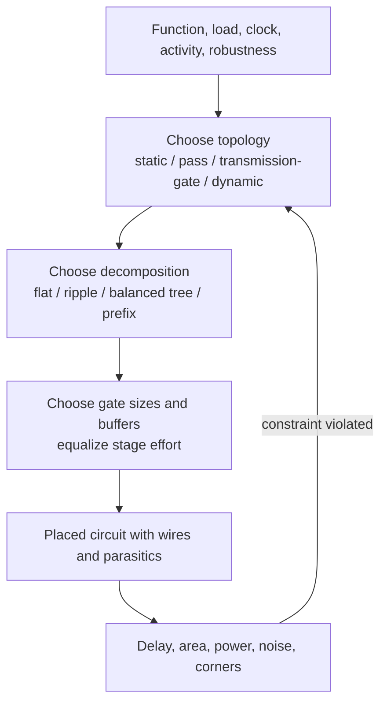

This loop matters because a Boolean identity does not select a physical implementation. The same function may be a two-level static gate, a transmission-gate network, a tree of small cells, or a dynamic stage; their truth tables match while their timing and failure modes do not.

### 1.1 Delay as logical effort × electrical effort

The normalized delay of a logic gate is

$$
d \;=\; g\,h + p
$$

where:
- $g$ = **logical effort** — how much worse the gate's topology drives current than an inverter with the same input capacitance ($g_{inv}\equiv 1$). It is fixed by the gate *type* and captures the series-stack penalty.
- $h = C_{out}/C_{in}$ = **electrical effort** (fan-out) — load capacitance over the gate's own input capacitance; the only term the designer sets, by sizing and loading.
- $p$ = **parasitic delay** — the gate's self-load (drain diffusion), independent of $h$; $p_{inv}\approx 1$.
- $d$ is in units of $\tau$, the delay of a minimum inverter driving an identical inverter.

For the usual P/N ratio ($\gamma\approx 2$):

| Gate | $g$ (per input) | $p$ |
|---|---|---|
| Inverter | $1$ | $1$ |
| $n$-input NAND | $(n{+}2)/3$ | $n$ |
| $n$-input NOR | $(2n{+}1)/3$ | $n$ |
| 2:1 mux (TG) | $2$ | $4$ |
| 2-input XOR | $4$ | $4$ |

Two lessons already fall out: **NOR is worse than NAND** (its PMOS are in series, and PMOS is the weaker device — which is why static libraries prefer NAND/AOI and avoid wide NOR), and $g$ **grows with fan-in** $n$ (§1.3).

### 1.2 Sizing a path: path effort, the magic stage effort ≈ 4, and how many stages

A path is minimized as a whole, not gate by gate. Define:

$$
G=\prod_i g_i,\quad B=\prod_j b_j,\quad H=\frac{C_{out}}{C_{in}},\qquad F = G\,B\,H
$$

where $G$ = path logical effort, $B$ = path branching effort ($b=(C_{on}+C_{off})/C_{on}$ at each fan-out point), $H$ = overall electrical effort, and $F$ = **path effort**. The stage efforts $g_ih_i$ have a *fixed product* $\prod_i(g_ih_i)=F$ (the branching and electrical efforts telescope to $BH$), so by AM–GM the delay sum $D=\sum_i g_ih_i+\sum_i p_i$ is smallest when **every stage carries the same stage effort**:

$$
\hat f = g_i h_i = F^{1/N},\qquad D_{min}=N\,F^{1/N}+P
$$

with $P=\sum_i p_i$. So the optimal *sizing* rule is "equalize effort per stage," and the optimal *number* of stages comes from minimizing $N F^{1/N}+P$ over $N$ (set $\mathrm{d}/\mathrm{d}N=0$, treating $N$ as continuous). Including parasitics, the best stage effort $\rho$ solves $p_{inv}+\rho(1-\ln\rho)=0$:

$$
\rho \approx e \approx 2.7\ (p_{inv}{=}0),\qquad \rho\approx 3.6\text{–}4\ (p_{inv}{\approx}1),\qquad \hat N \approx \log_\rho F \approx \log_4 F
$$

The delay curve is fairly flat around its optimum, so **stage effort near 4** is a common engineering target and the **fan-out-of-4 (FO4)** inverter delay is a useful normalized reference. An inverter at $h{=}4$ has normalized delay $1\cdot4+1=5\tau$. Absolute FO4 time still depends on technology, library, voltage, temperature, input slew, and loading; use it to compare cycle depth under stated assumptions, not as a process-independent constant ([OoO Execution](../01_Architecture_and_PPA/01_CPU_Architecture/03_Out_of_Order_Backend/01_OoO_Execution.md) §4.3).

Consequences you will reuse: driving a large load (a wide bus, a clock net, a decoder wordline) makes $H$ large, so you need $\hat N\approx\log_4 H$ buffer stages — the reason repeater/buffer trees exist. Both one huge gate (too few stages) and an over-buffered chain (too many) are slower than the $\log_4 F$ sweet spot.

### 1.3 Fan-in and fan-out: why wide gates are slow and shallow logic wins

A single $n$-input gate looks area-cheap but is delay-expensive three ways at once: $g=(n{+}2)/3$ rises linearly, $p\approx n$ rises linearly, and the series transistor stack has resistance $\sim n$, so a lone wide gate's delay grows roughly linearly-to-quadratically in $n$. A **balanced tree** of 2-input gates computing the same reduction has depth $\lceil\log_2 n\rceil$ with bounded per-gate effort — delay $\sim\log n$. That one inequality,

$$
D_{ripple}\sim O(N)\quad\text{vs}\quad D_{tree}\sim O(\log N),
$$

is why wide functions frequently become **trees**: the carry-lookahead adder replaces the ripple chain to escape fan-in explosion ([Adders and Multipliers](03_Adders_and_Multipliers.md)), and so do the priority encoder/leading-zero detector (§3.2), comparator (§3.3), and wide mux (§2.2). Fan-out has the dual cost—each added load raises $h$ and thus delay, which §1.2 pays down with staged buffers. Ordinary timing-sensitive standard-cell mappings therefore favor modest fan-in, often two to four inputs, and insert hierarchy or buffers before a very wide gate or extreme load. Exact available cells and the winning decomposition are library- and placement-dependent.

### 1.4 The logic-family menu: how to build the gate itself

Logical effort compares *networks of static gates*, but you can also change what a "gate" is. Four families, one table — the first real design trade of the page:

| Family | Mechanism | Speed | Area | Power | Robustness / noise | Where it lands |
|---|---|---|---|---|---|---|
| **Static CMOS** | dual PUN/PDN, output always driven | baseline ($g$ per §1.1) | roughly proportional to function literals | usually a favorable leakage/dynamic balance | rail-to-rail, strong noise margin, recovers after a transient | dominant general-purpose standard-cell style |
| **Pass-transistor** (bare NMOS) | steer inputs through NMOS | fast, very few devices | fewest devices | $V_t$ drop → static current in next stage | '1' degrades to $V_{dd}{-}V_{tn}$, poor NM, **non-restoring** | *inside* XOR/mux/adder cells only, never a chain |
| **Transmission gate** (NMOS‖PMOS) | steer through complementary pair | fast, full swing | 2 T/switch + complement clock | no static current, but clocked control | full swing, still **non-restoring** ($RC$ in series), charge injection | mux/latch/FF internals, XOR |
| **Dynamic / domino** | precharge then conditional evaluate | can be faster for selected wide functions | pull-down network plus clock/keeper devices | precharge and clock activity can be high | charge sharing, leakage, glitch sensitivity, monotonic-input constraint | selected custom speed-critical wide functions |

The device-level structures live in [CMOS_Fundamentals](01_CMOS_Fundamentals.md) §5; here is the *reasoning* that decides between them.

**Why dynamic logic can be fast, and why it is dangerous.** A dynamic gate evaluates through an NMOS pull-down network after a clocked precharge, avoiding a full complementary pull-up network on every data input. For selected wide functions this can reduce input capacitance and evaluation effort, while the output follows a monotonic evaluate transition. The benefit is topology- and load-dependent and buys three liabilities that are the substance of dynamic-logic design:

- **Charge sharing.** When the precharged node shares charge with the parasitic capacitance of internal stack nodes left low, the output droops toward a false '0' even when the path should hold '1'. Mitigation: precharge internal nodes, or strengthen the keeper.
- **The keeper.** A weak PMOS from $V_{dd}$ to the dynamic node, gated by the output, trickles in charge to hold the '1' against leakage and charge sharing. But it *contends* with a legitimate discharge, so it must stay weak — upsizing it improves noise immunity at a direct cost in evaluate speed and contention power. That knob *is* the dynamic-logic robustness-vs-speed trade.
- **Monotonicity → domino.** A dynamic node can discharge only once per cycle, so its inputs must rise monotonically during evaluate; any $1\!\to\!0$ input glitch discharges it permanently. Cascading is fixed by putting a static inverter after each dynamic stage so inter-stage signals only ever rise — the **domino** chain — at the cost of realizing only non-inverting logic. The same "one-shot discharge" makes dynamic logic uniquely **hazard-intolerant** (§8): a transient the pull-down sees becomes a permanent wrong answer.

This is why modern low-power designs are almost entirely static CMOS, reserving dynamic/domino for a few frequency-critical wide gates, and why pass and transmission-gate logic appear only *inside* cells (muxes, XORs, latches) where a following static stage restores the level.

---

## 2. The multiplexer: selection is function evaluation

The primitive problem is "route one of several inputs to an output under control." But the mux is far more fundamental than a router: Shannon's theorem says selection *is* Boolean evaluation, which makes the 2:1 mux the universal combinational element — the atom of every FPGA lookup table.

### 2.1 Shannon expansion: a mux is a truth-table lookup

Any Boolean function splits on any variable:

$$
F(x_1,\dots,x_n)=\overline{x_1}\,F|_{x_1=0}+x_1\,F|_{x_1=1}
$$

where $F|_{x_1=c}$ is the cofactor with $x_1$ fixed to $c$. At $x_1=0$ the right side becomes $F|_0$; at $x_1=1$ it becomes $F|_1$, so it matches $F$ for every input. **That expression is exactly a 2:1 mux** with select $x_1$ and data $\{F|_0,F|_1\}$. Recurse on the remaining variables and an $n$-input function becomes a tree of 2:1 muxes selecting among truth-table entries—a mux tree is a lookup table. Therefore a 2:1 mux is universal when its data inputs may be constants or literals, and an $n$-variable function needs at most a $2^{n-1}{:}1$ mux when the last variable is folded into the data inputs.

The gate-level structure follows the equation directly. The inverter creates $\overline S$; two product terms qualify the data inputs; the final OR joins the mutually exclusive paths:

```tikz
\usepackage{circuitikz}
\begin{document}
\begin{circuitikz}[american,thick,scale=0.9,transform shape]
  \node[and port] (A0) at (2.2,1.15) {};
  \node[and port] (A1) at (2.2,-1.15) {};
  \node[or port]  (OR) at (5.0,0) {};
  \node[not port] (INV) at (-0.1,-2.0) {};
  \draw (A0.out) -- (OR.in 1);
  \draw (A1.out) -- (OR.in 2);
  \draw (OR.out) -- ++(0.8,0) node[right]{$Y$};
  \draw (A0.in 1) -- ++(-1.0,0) node[left]{$D_0$};
  \draw (A1.in 1) -- ++(-1.0,0) node[left]{$D_1$};
  \draw (INV.out) -| (A0.in 2) node[pos=0.25,above]{$\overline S$};
  \draw (INV.in) -- ++(-0.9,0) coordinate (S) node[circ]{} node[left]{$S$};
  \draw (S) |- (A1.in 2);
\end{circuitikz}
\end{document}
```

This is a true gate-and-wire schematic: a branch denotes the same electrical signal driving more than one gate, while a gate symbol owns the Boolean operation. A standard-cell implementation commonly absorbs the AND/OR/invert network into one compound cell; a transmission-gate implementation instead opens exactly one bidirectional switch between the selected input and the output.

### 2.2 Building an n:1 mux: tree vs flat, TG vs AOI, LUT vs cell

Three orthogonal choices, all decided by §1:

- **Structure — tree vs flat.** A flat $n{:}1$ mux is one $n$-input selection gate: fan-in $n$, so delay $O(n)$ by §1.3. A balanced tree of 2:1 muxes is depth $\log_2 n$: delay $O(\log n)$. Build the tree, except for very small $n$ or lightly loaded selects where the flat form's lower parasitic wins.
- **Circuit — TG vs AOI.** A full 2:1 transmission-gate mux uses two transmission gates—four pass devices—plus a complemented select if it is not already available and eventual restoring drive. It is compact and fast for a few levels, but series switches add resistance/capacitance and do not restore levels, so deep chains need buffers. A static and-or-invert (AOI) form restores every stage at more device/input capacitance. The selected cell depends on depth, select availability/fan-out, output load, and library characterization.
- **Fabric — mux/LUT vs AOI cell.** The same choice at chip scale: an FPGA realizes logic as mux/LUT trees (Shannon, §2.1), while ASIC synthesis maps the same function onto AOI/NAND static cells for density and power. Same function, different atoms, different cost model.

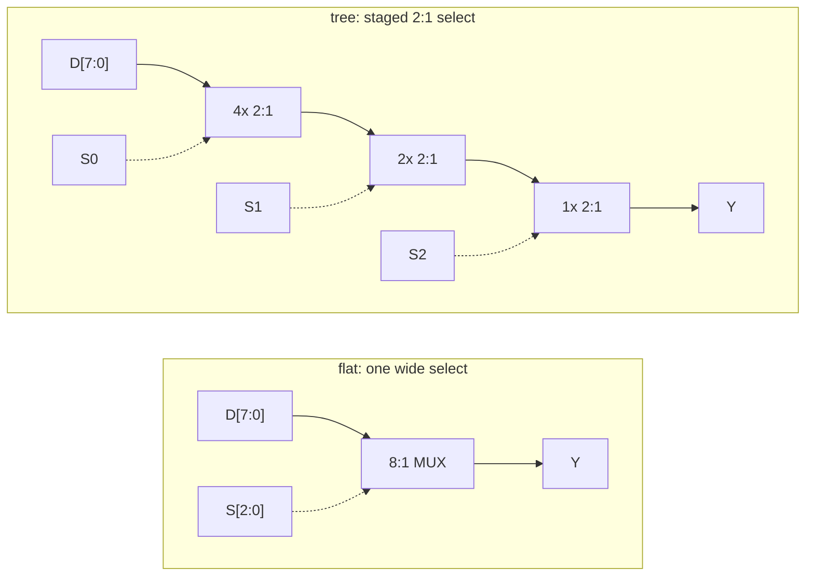

The flat form can win for a tiny selector because it avoids intermediate nodes. As $n$ grows, its wide gate and high-fan-out select become the bottleneck; the tree adds stages but bounds the electrical effort of each stage. That is the recurring evolution from “one large gate” to “hierarchy of small gates.”

### 2.3 Selecting a clock: why a combinational mux glitches

Selecting *data* with a mux is safe; selecting a *clock* with the same mux is not — a clean illustration of hazards (§8) on a signal that must never glitch. If `sel` toggles while the two clocks sit at different phases, the mux output can emit a **runt pulse**, a fragment shorter than a real period, which downstream flip-flops may sample as an extra edge, miss entirely, or go metastable on. The fix is not a better mux but a *protocol*: gate each clock with an enable that is (a) synchronized into that clock's own domain and (b) cross-coupled so one clock is proven off before the other turns on — **break-before-make**, giving a dead cycle where no partial period can appear. In silicon this is a library **integrated clock-gating (ICG)** cell, whose internal latch holds the enable stable through the active phase. The full state machine, exhaustive safety table, and RTL belong where they are owned — [Clock_Division_and_Switching](../03_Frontend_RTL_and_Verification/04_Clock_Division_and_Switching.md) (glitch-free switching) and [Power_Reduction_Techniques](../02_Power_and_Low_Power/04_Power_Reduction_Techniques.md) (ICG). The concept to carry away: a clock is a signal where a transient is a *functional* fault, so it is switched by handshake, never by combinational selection.

```wavedrom
{ "signal": [
  { "name": "clock A",       "wave": "p........." },
  { "name": "clock B",       "wave": "0..p......" },
  { "name": "select B",      "wave": "0...1....." },
  { "name": "direct mux",    "wave": "p...10p..." },
  { "name": "safe switched", "wave": "p....0.p.." }
], "head": { "text": "Qualitative clock switch: direct selection can create a runt edge; break-before-make inserts dead time" } }
```

WaveDrom cannot represent analog pulse width or clock slew; the short `10` segment marks a functionally unsafe fragment. The safe output may pause, but every emitted pulse is sourced from a complete input-clock interval.

---

## 3. Decoders and encoders: crossing the binary/one-hot boundary

Hardware constantly converts between two representations of "which one": a compact $k$-bit **binary index** and a $2^k$-bit **one-hot** select. A decoder goes index→one-hot — it is the address path of every memory, register file, and demux, turning an address into the single wordline that fires. An encoder goes one-hot→index. When more than one input is hot the inverse is ill-posed, and resolving it by rank is the **priority encoder** — which is exactly leading-zero detection.

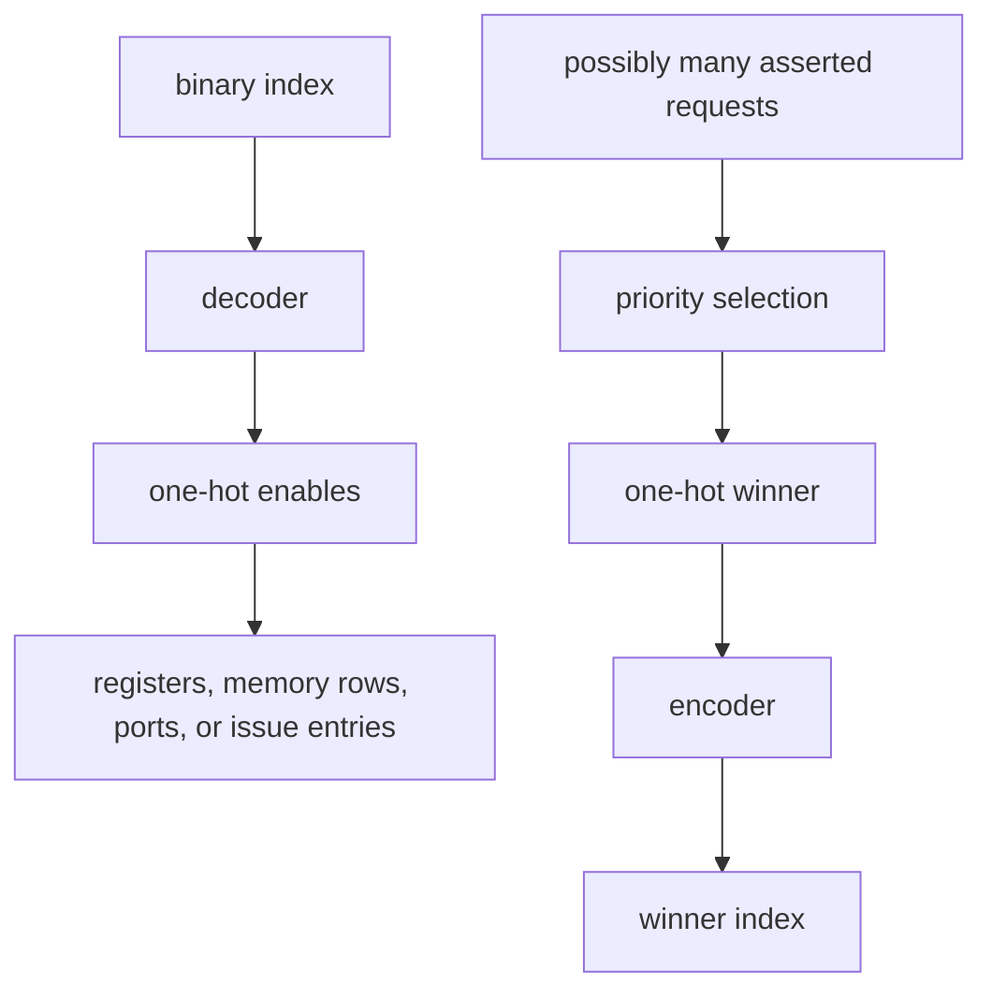

A plain encoder assumes exactly one hot input. A priority encoder adds policy—highest bit, lowest bit, oldest request, or rotating priority—because multiple requests are legal. A decoder performs the opposite expansion and usually drives a far larger physical load.

### 3.1 The decoder: index → one-hot, and why real ones predecode

An $n$-to-$2^n$ decoder asserts output $i$ iff the input equals $i$; each output is one $n$-input AND of the address bits in true/complement form. Built naively that is $2^n$ gates of fan-in $n$ — and by §1.3 fan-in $n$ is slow, with a large wordline load on top. Two techniques, both pure logical effort:

- **Predecode.** Factor the $n$-input AND into two levels: predecode groups of ~2–3 address bits into small one-hot fields, then AND one line from each group. Fan-in per gate drops to the number of groups, terms are shared across all $2^n$ outputs, and the array shrinks and speeds up — what every SRAM and register-file row decoder does.
- **Buffer the wordline.** The wordline drives thousands of cells ($H$ huge), so by §1.2 it wants $\log_4 H$ stages of buffering — the graduated driver at the end of the decoder.

For a two-bit address $A_1A_0$, the unfactored 2-to-4 decoder is already enough to expose the structure:

```tikz
\usepackage{circuitikz}
\begin{document}
\begin{circuitikz}[american,thick,scale=0.82,transform shape]
  \node[not port] (I1) at (-0.5,3.2) {};
  \node[not port] (I0) at (-0.5,2.0) {};
  \draw (I1.in) -- ++(-0.8,0) node[left]{$A_1$};
  \draw (I0.in) -- ++(-0.8,0) node[left]{$A_0$};
  \draw (I1.out) -- (1.0,3.2) node[circ]{} node[above]{$\overline A_1$};
  \draw (I0.out) -- (2.0,2.0) node[circ]{} node[above]{$\overline A_0$};
  \draw (-1.1,3.2) -- (-1.1,1.2) -- (3.0,1.2) node[circ]{} node[above]{$A_1$};
  \draw (-1.1,2.0) -- (-1.1,0.2) -- (4.0,0.2) node[circ]{} node[above]{$A_0$};
  \draw (1.0,3.2) -- (1.0,-3.2); \draw (2.0,2.0) -- (2.0,-3.2);
  \draw (3.0,1.2) -- (3.0,-3.2); \draw (4.0,0.2) -- (4.0,-3.2);
  \node[and port] (Y0) at (6.0,2.7) {};
  \node[and port] (Y1) at (6.0,0.9) {};
  \node[and port] (Y2) at (6.0,-0.9) {};
  \node[and port] (Y3) at (6.0,-2.7) {};
  \draw (1.0,2.95) node[circ]{} -- (Y0.in 1); \draw (2.0,2.45) node[circ]{} -- (Y0.in 2);
  \draw (1.0,1.15) node[circ]{} -- (Y1.in 1); \draw (4.0,0.65) node[circ]{} -- (Y1.in 2);
  \draw (3.0,-0.65) node[circ]{} -- (Y2.in 1); \draw (2.0,-1.15) node[circ]{} -- (Y2.in 2);
  \draw (3.0,-2.45) node[circ]{} -- (Y3.in 1); \draw (4.0,-2.95) node[circ]{} -- (Y3.in 2);
  \draw (Y0.out) -- ++(0.7,0) node[right]{$Y_0$}; \draw (Y1.out) -- ++(0.7,0) node[right]{$Y_1$};
  \draw (Y2.out) -- ++(0.7,0) node[right]{$Y_2$}; \draw (Y3.out) -- ++(0.7,0) node[right]{$Y_3$};
  \node[below,align=center] at (2.5,-3.4) {literal\\rails};
\end{circuitikz}
\end{document}
```

Exactly one output is high for every legal binary address. At larger width, repeating a full $n$-literal product for every row wastes gates and creates slow stacks; predecoding computes small shared one-hot groups, then combines one term from each group near the array.

### 3.2 Priority encoder and leading-zero detection: ripple vs tree

A priority encoder returns the index of the highest-priority hot input; leading-zero detection/count (LZD/LZC) is the same operation on the bit vector after a floating-point subtraction, where the leading-one position sets the normalization shift ([Floating_Point](04_Floating_Point.md)). A linear scan is $O(N)$ — unacceptable for a 53-bit mantissa. The tree formulation is $O(\log N)$: split into pairs, and at each node combine children $(c_L,v_L)$ and $(c_R,v_R)$ — where $c$ is a partial leading-zero count and $v$ marks "this half has a one" — by

$$
(c,v)=\begin{cases}(c_L,\;1) & v_L\\ (w_L+c_R,\;1) & \overline{v_L}\,v_R\\ (w,\;0) & \text{otherwise}\end{cases}
$$

with $w_L$ = left-block width and $w$ = total width. That is $\log_2 N$ levels — the same tree-beats-ripple inequality as §1.3. The one FP-specific refinement worth keeping is the **leading-zero anticipator (LZA)**: rather than wait for the subtraction, predict the shift from the operands *in parallel* with the adder, tolerate a $\pm1$ error, and correct in the next stage — trading a small correction for removing the LZC from the critical path (details in [Floating_Point](04_Floating_Point.md)).

For request vector `00101000` with bit 7 highest priority, split into halves. The upper half `0010` is valid, so the lower half is ignored; inside the upper half, the `10` sub-block is valid; its leading one is global bit 5.

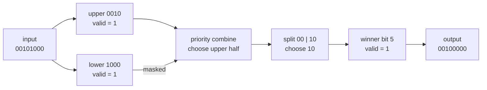

The tree must return both `valid` and `index`; an all-zero input has no winner, so an index without `valid` is meaningless. A rotating or age-based arbiter adds state to this pure priority function (§3.4).

### 3.3 Comparators are prefix problems too

Magnitude comparison is subtraction's sign/borrow, and equality is an XNOR-reduce; either way "is $A>B$" over $N$ bits is a **prefix/reduction** with the same ripple-$O(N)$-vs-tree-$O(\log N)$ choice, and the associative combine

$$
(g,e)_{hi\cdot lo}=\big(g_{hi}\lor e_{hi}\,g_{lo},\;\; e_{hi}\,e_{lo}\big)
$$

where $g$ means “greater in the most-significant processed portion” and $e$ means “equal in that portion.” This is structurally the carry-tree combine of a prefix adder. Comparators therefore reuse the same associative-tree design problem ([Adders and Multipliers](03_Adders_and_Multipliers.md)): choose a prefix topology that balances depth, wiring, fan-out, and physical placement.

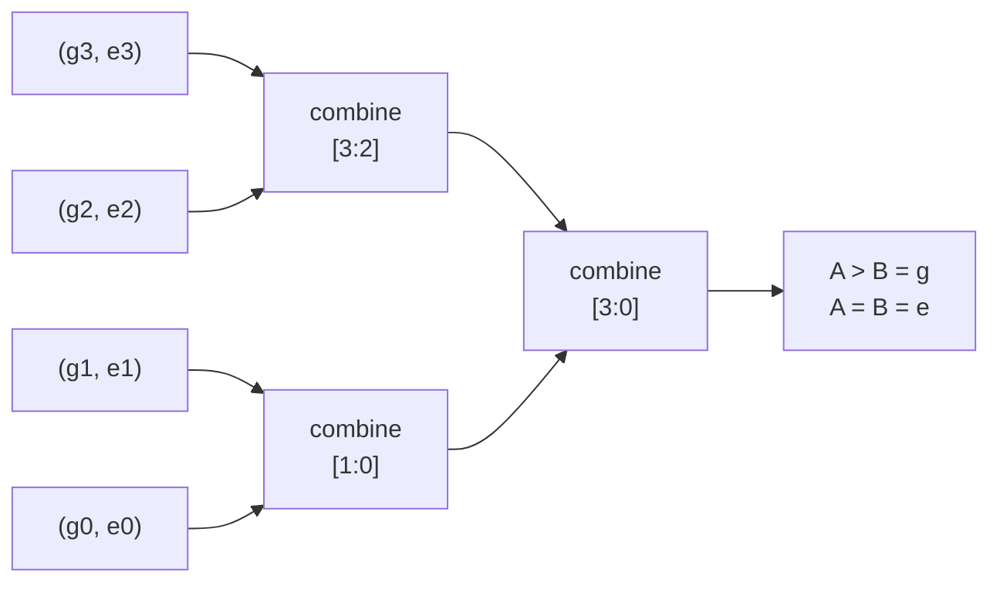

For $A=1010$ and $B=1001$, bits 3 and 2 are equal; bit 1 is the first mismatch and has $A_1=1,B_1=0$, so the high-to-low prefix reports greater without allowing bit 0 to overturn the decision. A linear comparator carries “equal so far” through every bit; a prefix tree computes the same associative result in logarithmic depth at more wiring/area.

### 3.4 From priority encoder to arbiter: selection policy needs state

A fixed-priority encoder is combinational: if request 7 is continuously high, lower requests can starve forever. An **arbiter** adds a grant protocol and, for fairness, state. A round-robin arbiter stores the position after the last accepted grant, rotates the request vector so the next position has highest priority, runs a fixed-priority encoder, then rotates the one-hot result back.

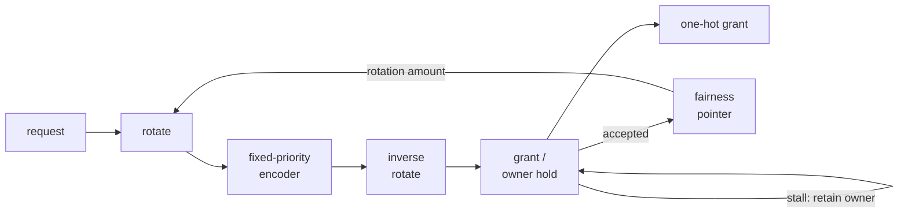

Update the pointer on an **accepted** grant, not merely an asserted grant; otherwise backpressure can cause ownership to jump while the selected requester still expects service. Fixed priority minimizes state and can protect a real-time class. Round robin bounds starvation among continuously eligible peers but may hurt critical traffic. Weighted or deficit arbitration adds counters to represent reserved shares and burst history. Verification must assert one-hot-or-zero grant, grant implies request, stable ownership under stall, pointer update only on acceptance, and a bounded-service property under explicitly stated assumptions.

---

## 4. Latch versus flip-flop: holding a bit across a clock edge

Everything so far is a memoryless function of the present inputs. The one thing combinational logic cannot do is *remember* — and a synchronous machine must carry state from one cycle to the next. This section derives the storage element from that single requirement.

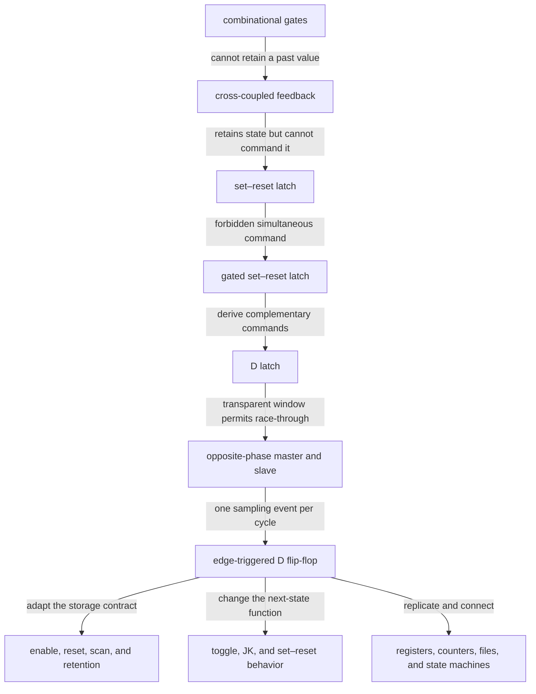

The arrows are design arguments, not a historical timeline. Each successor preserves the useful behavior of its predecessor and adds circuitry or timing discipline to remove one limitation. Alternative physical cells—pulsed latches, clocked complementary metal–oxide–semiconductor (C²MOS), true single-phase-clock cells, and sense-amplifier flip-flops—can implement similar contracts with different power, timing, and robustness.

### 4.1 Cross-coupled feedback: how a circuit stores one bit

One inverter has one output for each input and therefore no memory. Connect two inverters in a loop and the output of each becomes the input of the other. The loop has two stable solutions, $(Q,\overline Q)=(1,0)$ and $(0,1)$: a small disturbance is amplified back toward one of the rails. This is a **bistable** circuit.

```tikz
\usepackage{circuitikz}
\begin{document}
\begin{circuitikz}[american,thick,scale=1.1,transform shape,font=\small]
  \node[not port] (A) at (0,1.0) {};
  \node[not port,rotate=180] (B) at (0,-1.0) {};
  \draw (A.out) -- (1.4,1.0) -- (1.4,-1.0) -- (B.in);
  \draw (B.out) -- (-1.4,-1.0) -- (-1.4,1.0) -- (A.in);
  \draw (-1.4,0) node[circ]{} -- ++(-0.9,0) node[left]{$Q$};
  \draw (1.4,0) node[circ]{} -- ++(0.9,0) node[right]{$\overline{Q}$};
\end{circuitikz}
\end{document}
```

The functional equations are simply $Q=\neg\overline Q$ and $\overline Q=\neg Q$. More usefully, think in voltages: the two inverter transfer curves intersect at two stable rail points and one unstable mid-rail point. Near a stable point, loop regeneration restores the value. Near the middle intersection, the circuit may take a long and unbounded analog time to choose a rail—metastability, derived in §4.11.

The structure can retain a value after power and noise settle, but it has no safe external write input. Forcing an internal node fights an inverter and gives no protocol for set versus reset. The next structure replaces each inverter with a gate that has one feedback input and one command input.

### 4.2 The set–reset latch: adding explicit write commands

The simplest controllable bistable is the **set–reset (SR) latch**. Two cross-coupled NOR gates form an active-high version. Driving $S=1$ forces $Q=1$; driving $R=1$ forces $Q=0$; with both low, feedback holds the prior value.

```tikz
\usepackage{circuitikz}
\begin{document}
\begin{circuitikz}[american,thick,scale=1.1,transform shape,font=\small]
  \node[nor port] (U) at (0,1.35) {};
  \node[nor port] (D) at (0,-1.35) {};
  \draw (U.in 1) -- ++(-2.2,0) node[left]{$R$};
  \draw (D.in 2) -- ++(-2.2,0) node[left]{$S$};
  \draw (U.out) -- ++(3.0,0) node[right]{$Q$};
  \draw (D.out) -- ++(3.0,0) node[right]{$\overline{Q}$};
  \draw (D.in 1) -- ++(-0.5,0) coordinate (di);
  \draw (U.in 2) -- ++(-0.5,0) coordinate (ui);
  \draw (U.out) ++(1.0,0) node[circ]{} -- (di);
  \draw (D.out) ++(1.0,0) node[circ]{} -- (ui);
\end{circuitikz}
\end{document}
```

The two long return wires are the positive-feedback loop. Notice that each output returns to one input of the *other* NOR; deleting either return path turns the circuit back into combinational logic and destroys memory. Its coupled equations are

$$
Q=\overline{R+\overline Q},\qquad
\overline Q=\overline{S+Q}.
$$

Trace **set** causally. Starting from $Q=0,\overline Q=1$, raise $S$. The upper NOR output $\overline Q$ is forced low; that low removes the feedback term holding the lower NOR low; if $R=0$, the lower NOR raises $Q$. When $S$ returns low, $Q=1$ feeds back and keeps $\overline Q=0$, so the command can disappear while the state remains. Reset is the symmetric path through $R$.

| Operation | First forced event | Regenerative event | State after command is removed |
|---|---|---|---|
| hold, $S=R=0$ | neither output forced | feedback reinforces prior rails | unchanged |
| set, $S=1,R=0$ | $\overline Q\rightarrow0$ | $Q\rightarrow1$ | $Q=1$ |
| reset, $S=0,R=1$ | $Q\rightarrow0$ | $\overline Q\rightarrow1$ | $Q=0$ |
| forbidden, $S=R=1$ | both outputs forced to 0 | complement invariant is destroyed | release order/delay chooses result |

| $S$ | $R$ | Outputs while command is applied $(Q^+,\overline Q^+)$ | Meaning after command is removed |
|---:|---:|---|---|
| 0 | 0 | prior complementary pair | hold |
| 1 | 0 | $(1,0)$ | set remains stored |
| 0 | 1 | $(0,1)$ | reset remains stored |
| 1 | 1 | $(0,0)$, not complementary | near-simultaneous release races and final state is not guaranteed |

The NAND implementation is the polarity dual. Its command inputs are active-low—written $\overline S$ and $\overline R$—so hold is 11, set is 01, reset is 10, and 00 is forbidden:

```tikz
\usepackage{circuitikz}
\begin{document}
\begin{circuitikz}[american,thick,scale=1.1,transform shape,font=\small]
  \node[nand port] (U) at (0,1.35) {};
  \node[nand port] (D) at (0,-1.35) {};
  \draw (U.in 1) -- ++(-2.2,0) node[left]{$\overline{S}$};
  \draw (D.in 2) -- ++(-2.2,0) node[left]{$\overline{R}$};
  \draw (U.out) -- ++(3.0,0) node[right]{$Q$};
  \draw (D.out) -- ++(3.0,0) node[right]{$\overline{Q}$};
  \draw (D.in 1) -- ++(-0.5,0) coordinate (di);
  \draw (U.in 2) -- ++(-0.5,0) coordinate (ui);
  \draw (U.out) ++(1.0,0) node[circ]{} -- (di);
  \draw (D.out) ++(1.0,0) node[circ]{} -- (ui);
\end{circuitikz}
\end{document}
```

For the NAND form, $Q=\overline{\overline S\,\overline Q}$ and $\overline Q=\overline{\overline R\,Q}$. The polarity changes; the regenerative storage principle does not. NAND latches are convenient where an active-low reset signal should directly force a known state.

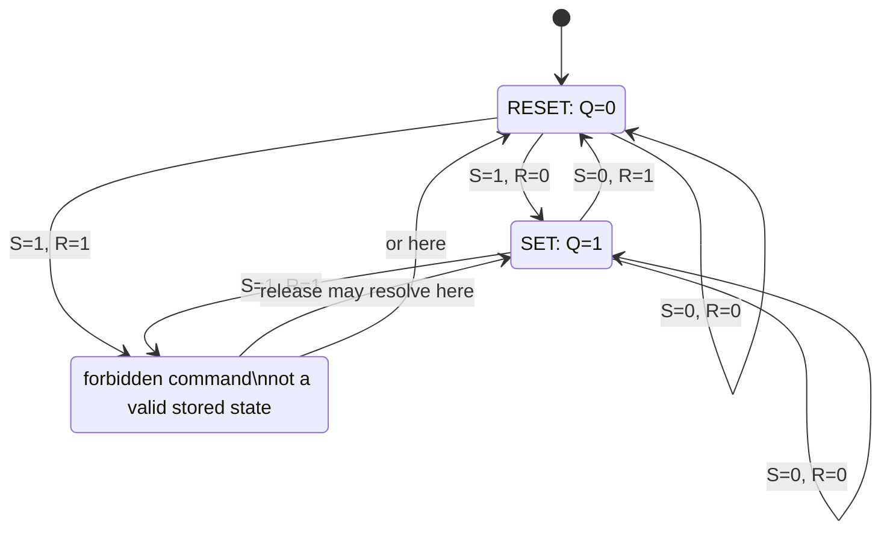

```wavedrom
{ "signal": [
  { "name": "S",  "wave": "010...10.." },
  { "name": "R",  "wave": "0..10.10.." },
  { "name": "Q",  "wave": "01..0.x..." },
  { "name": "Q̅", "wave": "10..1.x..." }
], "head": { "text": "NOR SR latch: set, hold, reset, then forbidden simultaneous assertion" } }
```

The digital `x` does not show the analog voltage trajectory. It means that after simultaneous assertion and near-simultaneous release, digital reasoning cannot guarantee which stable state wins. “Forbidden” is therefore not merely a truth-table convention: assertion destroys the $Q/\overline Q$ complement relation, and release creates a physical race that can pass through metastability.

The SR latch solved controlled writing but exposed two independent commands that must never overlap. A datapath would rather supply one data bit and one permission to store it. That requirement derives the D latch.

### 4.3 From gated SR to the D latch: remove the forbidden command

A **gated SR latch** first adds an enable $E$: the external commands reach the storage loop only while $E=1$. Gating creates a write window, but independent $S$ and $R$ can still request the forbidden combination. Now derive the one-data-input interface by choosing

$$
S_g=E D,\qquad R_g=E\overline D.
$$

```tikz
\usepackage{circuitikz}
\begin{document}
\begin{circuitikz}[american,thick,scale=0.9,transform shape,font=\small]
  \node[and port] (AS) at (2.6,1.2) {};
  \node[and port] (AR) at (2.6,-1.2) {};
  \node[not port] (INV) at (-0.3,-1.2) {};
  \node[draw,rounded corners,minimum width=2.3cm,minimum height=2.5cm,align=center] (SR) at (6.1,0) {cross-coupled\\SR\\latch};
  \draw (-2.9,1.35) node[left]{$D$} -- (-1.6,1.35) coordinate(jd) node[circ]{} -- (AS.in 1);
  \draw (jd) |- (INV.in);
  \draw (INV.out) -- (AR.in 1) node[pos=0.55,above]{$\overline{D}$};
  \draw (0.8,-2.7) node[below]{$E$} -- (0.8,1.05);
  \draw (0.8,1.05) -- (AS.in 2);
  \draw (0.8,-1.35) -- (AR.in 2);
  \draw (AS.out) -- node[above]{$S_g$} (SR.west |- AS.out);
  \draw (AR.out) -- node[below]{$R_g$} (SR.west |- AR.out);
  \draw (SR.east) -- ++(1.0,0) node[right]{$Q$};
\end{circuitikz}
\end{document}
```

When enabled, $D=1$ can only set and $D=0$ can only reset; $S_gR_g=E^2D\overline D=0$, so the forbidden command is unreachable for valid binary inputs. When disabled, both gated commands are zero and feedback holds the prior value. Substitution into the SR behavior gives the D-latch characteristic equation

$$Q_{next}=E D+\overline E Q.$$

When $E=1$, the latch is **transparent** and $Q$ follows $D$ after propagation delay. When $E=0$, it is **opaque** and the feedback term holds $Q$. This gate-level derivation explains the logic, but a standard-cell latch is often built more compactly with transmission gates:

```tikz
\usepackage{circuitikz}
\begin{document}
\begin{circuitikz}[american,thick,scale=0.9,transform shape]
  \node[draw,minimum width=1.15cm,minimum height=0.75cm,align=center] (TGI) at (0,0) {TG\\$E$};
  \node[not port] (I1) at (2.2,0) {};
  \node[not port] (I2) at (4.4,0) {};
  \node[draw,minimum width=1.15cm,minimum height=0.75cm,align=center] (TGF) at (2.2,-2.0) {TG\\$\overline E$};
  \draw (TGI.west) -- ++(-1.0,0) node[left]{$D$};
  \draw (TGI.east) -- (I1.in) coordinate[midway] (X) node[circ]{} node[above]{$X$};
  \draw (I1.out) -- (I2.in) node[midway,above]{$Y$};
  \draw (I2.out) -- ++(1.0,0) coordinate (Q) node[right]{$Q$};
  \draw (Q) |- (TGF.east);
  \draw (TGF.west) -| (1.1,0);
\end{circuitikz}
\end{document}
```

`TG` means **transmission gate**, a parallel n-channel/p-channel switch that passes both logic levels strongly when enabled. In transparent mode, the input TG is on and the feedback TG is off, so $D\rightarrow X\rightarrow Q$. In hold mode, the input path is off and the feedback path is on, closing the two-inverter storage loop $Q\rightarrow X\rightarrow Q$. Complementary controls must be generated so the input and feedback switches do not fight. A bare statement such as “put one switch in the loop” is incomplete: a static transmission-gate latch needs a controlled input path, a complementary feedback path, and restoring inverters.

| Realization | What implements write/hold | Strength | Cost or risk |
|---|---|---|---|
| gated-SR D latch | AND gates generate complementary set/reset commands | logic is easy to derive and verify | more internal gates and command-path delay |
| transmission-gate D latch | complementary input and feedback switches around static inverters | compact, full-swing, common in custom cells | complementary-clock load, overlap/non-overlap and hold sensitivity |

```wavedrom
{ "signal": [
  { "name": "E", "wave": "0.1....0..1..0" },
  { "name": "D", "wave": "0..1.0..1.0..." },
  { "name": "X", "wave": "0..1.0....0..." },
  { "name": "Q", "wave": "0...10....0..." }
], "head": { "text": "D latch: internal X and Q follow during the enabled window, then feedback holds" } }
```

The waveform is qualitative and deliberately shows propagation rather than instantaneous change. A latch samples a *window*, not an edge: legal $D$ transitions inside the transparent interval propagate through the internal node and inverters; a transition while opaque does not change $Q$. The closing edge of $E$ creates setup and hold constraints because the input path is turning off while the feedback path is turning on.

### 4.4 From transparent latch to edge-triggered flip-flop

But transparency is a hazard in a clocked pipeline: while a latch is open, a change on $D$ races straight through $Q$ and onward into the next stage — state could ripple through many stages in one clock phase, and timing becomes unanalyzable. What we actually want is to capture $D$ at an *instant* — the clock edge — and be opaque otherwise. No single level-sensitive latch can do that. The construction that can is **two latches in series on opposite clock phases** (master–slave):

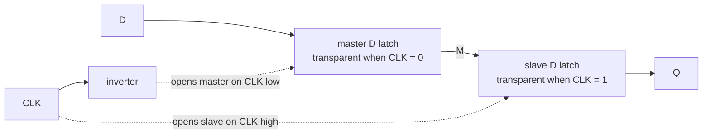

During the low phase, the master tracks $D$ while the slave holds the old output. At the rising edge, the master closes and freezes its last legal input; the slave opens and transfers that frozen master value to $Q$. During the high phase, later $D$ transitions cannot reach the closed master. The next falling edge closes the slave before reopening the master. This is a positive-edge-triggered **D flip-flop (DFF)**; reversing the latch phases produces a negative-edge-triggered cell.

```wavedrom
{ "signal": [
  { "name": "CLK", "wave": "p........." },
  { "name": "D",   "wave": "0.1....0.." },
  { "name": "M",   "wave": "0.1....0.." },
  { "name": "Q",   "wave": "0...1....0" }
], "head": { "text": "Master–slave behavior: M tracks in the low phase; Q receives frozen M after a rising edge" } }
```

“Opposite phase” is a required timing relationship, not magic. Real clock inversion has delay and finite slope. If both latches are transparent together long enough, $D$ can race through to $Q$; if both are closed too long, latency increases. Standard cells use characterized transmission-gate, C²MOS, or related structures whose internal clock overlap and hold behavior are included in library timing. Master–slave composition is the clearest derivation of edge behavior, but it is not the only physical implementation: pulsed and sense-amplifier cells create a narrow sampling event differently.

### 4.5 Setup, hold, and clock-to-Q: the price of sampling an edge

The three timing parameters are not axioms; they are the master latch's write window and the slave's read delay:

- **Setup $t_{su}$** — $D$ must be stable *before* the edge because the master's internal node needs time to charge through its transmission gate to a valid level before that gate shuts. Miss it and the captured level is marginal and may go metastable (§4.11).
- **Hold $t_{h}$** — $D$ must stay stable *after* the edge because the master TG has finite turn-off slew; while it still conducts, a new $D$ can corrupt the just-captured value.
- **Clock-to-Q $t_{cq}$** — after the edge the slave TG opens and drives $Q$; $t_{cq}$ is that turn-on plus the slave inverter plus output load.

These feed the synchronous constraints — setup $t_{cq}+t_{logic}+t_{su}\le T_{clk}-t_{skew}$ and hold $t_{cq}+t_{logic}\ge t_{h}+t_{skew}$ — whose full slack accounting is signoff's job ([STA](../06_Signoff/01_STA.md) §3). Note that **negative setup or hold** is normal in modern cells (sense-amp or pulsed designs whose sampling window straddles the edge), which is why the numbers below can be small or negative and why negative $t_h$ effectively adds slack.

```wavedrom
{ "signal": [
  { "name": "CLK",       "wave": "p........." },
  { "name": "D legal",   "wave": "01....0..." },
  { "name": "Q legal",   "wave": "0..1....0." },
  { "name": "D violates", "wave": "0..x1....." },
  { "name": "Q capture", "wave": "0...x....." }
], "head": { "text": "Qualitative DFF aperture: stable data captures predictably; an aperture violation is not guaranteed" } }
```

The diagram is qualitative, not drawn to analog time. The vulnerable aperture extends $t_{su}$ before and $t_h$ after an active edge; $Q$ may move only after $t_{cq}$. An `x` means the digital observer cannot guarantee the captured value—it does not mean a simulator models the analog metastable voltage. A library timing model supplies the exact values as functions of input slew, output load, voltage, temperature, process corner, and sometimes the direction of the transition.

Setup constrains the **maximum-delay path** because data must arrive before the next capture edge. Hold constrains the **minimum-delay path** because new data must not arrive too soon after the same edge. Increasing the clock period repairs setup but does not repair hold; hold is fixed with delay cells, clock-skew adjustment, or a different cell/path placement. That asymmetry is why setup and hold must never be summarized as one generic “timing check.”

### 4.6 Functional flip-flop families: change the next-state logic, not the storage physics

“D flip-flop” describes the next-state function $Q^+=D$. Other named flip-flops describe different input functions; in a modern standard-cell flow they are commonly synthesized as a DFF plus combinational logic unless a dedicated cell is smaller or faster.

```tikz
\usepackage{circuitikz}
\begin{document}
\begin{circuitikz}[american,thick,scale=0.82,transform shape]
  \tikzset{ff/.style={draw,minimum width=1.5cm,minimum height=0.9cm,align=center},logic/.style={draw,rounded corners,minimum width=2.9cm,minimum height=0.9cm,align=center}}
  \node[ff] (FD) at (6.2,2.7) {DFF};
  \draw[->] (-0.5,2.7) node[left]{$D$} -- (FD);
  \draw[->] (FD) -- ++(1.7,0) coordinate (QD) node[right]{$Q$};

  \node[xor port] (XT) at (3.1,0.9) {};
  \node[ff] (FT) at (6.2,0.9) {DFF};
  \draw (XT.in 1) -- ++(-1.0,0) node[left]{$T$};
  \draw[->] (XT.out) -- (FT);
  \draw[->] (FT) -- ++(1.7,0) coordinate (QT) node[circ]{} node[right]{$Q$};
  \draw (QT) -- ++(0,-0.65) -| (XT.in 2);

  \node[logic] (LJ) at (3.1,-0.9) {$D=J\overline Q+\overline KQ$};
  \node[ff] (FJ) at (6.2,-0.9) {DFF};
  \draw[->] (-0.5,-0.65) node[left]{$J$} -- (1.65,-0.65);
  \draw[->] (-0.5,-1.15) node[left]{$K$} -- (1.65,-1.15);
  \draw[->] (LJ) -- (FJ);
  \draw[->] (FJ) -- ++(1.7,0) coordinate (QJ) node[circ]{} node[right]{$Q$};
  \draw (QJ) -- ++(0,-0.55) -| (LJ.south) node[pos=0.75,below,align=center]{$Q$\\$\overline Q$};

  \node[logic] (LS) at (3.1,-2.8) {$D=S+\overline RQ$};
  \node[ff] (FS) at (6.2,-2.8) {DFF};
  \draw[->] (-0.5,-2.55) node[left]{$S$} -- (1.65,-2.55);
  \draw[->] (-0.5,-3.05) node[left]{$R$} -- (1.65,-3.05);
  \draw[->] (LS) -- (FS);
  \draw[->] (FS) -- ++(1.7,0) coordinate (QS) node[circ]{} node[right]{$Q$};
  \draw (QS) -- ++(0,-0.55) -| (LS.south) node[pos=0.75,below]{$Q$};
\end{circuitikz}
\end{document}
```

This view separates **storage physics** from the **next-state function**. The DFF supplies one edge-triggered state bit. Input logic computes what that bit should become. For a toggle input, “hold when $T=0$, complement when $T=1$” is exactly $Q^+=Q\oplus T$. For JK, conditional set and reset with the present state as feedback gives $Q^+=J\overline Q+\overline KQ$. The same derivation is how finite-state-machine equations eventually feed ordinary DFFs.

| Type | Inputs | Characteristic equation | Key behavior | Typical use |
|---|---|---|---|---|
| D | $D$ | $Q^+=D$ | copy input | registers, pipelines, state machines |
| T | $T$ | $Q^+=T\oplus Q$ | hold at 0, toggle at 1 | counters, divide-by-two |
| JK | $J,K$ | $Q^+=J\overline Q+\overline KQ$ | 00 hold, 10 set, 01 reset, 11 toggle | historical universal FF; counters/control |
| SR | $S,R$ | $Q^+=S+\overline RQ$ for legal inputs | set/reset/hold; $S=R=1$ illegal | explicit control and latch internals |

The JK flip-flop removes the SR forbidden case at the behavioral interface: $J=K=1$ requests a toggle. However, feed that equation into a **level-sensitive** latch and the newly changed $Q$ immediately feeds back while the latch is still open. If the transparent interval exceeds the loop delay, the output can toggle repeatedly—**race-around**—and the final value depends on analog delay rather than one logical event. Edge triggering or a sufficiently narrow characterized pulse limits the feedback update to one sampling event.

```wavedrom
{ "signal": [
  { "name": "CLK / enable", "wave": "0.1.....0." },
  { "name": "J",            "wave": "1........." },
  { "name": "K",            "wave": "1........." },
  { "name": "level JK Q",   "wave": "0..1010..." },
  { "name": "edge JK Q",    "wave": "0..1......" }
], "head": { "text": "JK=11: a transparent latch can race around; an edge-triggered cell toggles once" } }
```

The repeated transitions are qualitative; their exact count is not digitally defined. The T flip-flop is the constrained case $J=K=T$, or a DFF with $D=T\oplus Q$.

For state-machine synthesis, the excitation table answers “what input produces the requested transition?”

| $Q\rightarrow Q^+$ | D | T | JK ($J,K$) | SR ($S,R$) |
|---|---:|---:|---|---|
| $0\rightarrow0$ | 0 | 0 | $0,X$ | $0,X$ |
| $0\rightarrow1$ | 1 | 1 | $1,X$ | $1,0$ |
| $1\rightarrow0$ | 0 | 1 | $X,1$ | $0,1$ |
| $1\rightarrow1$ | 1 | 0 | $X,0$ | $X,0$ |

$X$ means “don’t care,” not an unknown hardware value. D is dominant in RTL because the next-state expression maps directly and avoids feedback-dependent excitation minimization; T/JK remain valuable reasoning models for counters.

### 4.7 Circuit topologies: different ways to manufacture a sampling event

The master–slave derivation spends two static latches to guarantee that no complete data path remains transparent. Once that contract is understood, circuit designers can create a narrower sampling event by other means. Different families preserve the architectural behavior while moving the power, timing, and robustness point:

| Topology | Where state is held | How the sample event is formed | Main advantage | Main cost or failure sensitivity |
|---|---|---|---|---|
| transmission-gate master–slave | two static inverter loops | complementary level windows in series | full swing, static retention, straightforward characterization | clock capacitance, two storage stages, internal overlap/hold sensitivity |
| C²MOS | clocked inverter stages | clocked pull-up/pull-down devices isolate stages on opposite phases | compact, race-resistant for the intended clock relationship | complementary-clock skew, overlap, low-voltage and sizing sensitivity |
| true single-phase clock (TSPC) | dynamic internal nodes plus restoring stages | one clock sequences precharge/evaluate-like stages | fewer clock pins/devices and high speed | leakage, charge sharing, data-dependent internal activity, minimum clock frequency |
| pulse-triggered latch | one static latch | a local pulse generator briefly opens the latch | smaller state cell, lower local clock load, limited time borrowing | pulse width and distribution variation, severe short-path/hold exposure |
| sense-amplifier flip-flop | regenerative differential nodes followed by a latch | small input difference is amplified at the clock event | very small setup and fast capture | input/clock power, differential front end, kickback/offset and complex characterization |
| dual-edge flip-flop | topology-dependent, commonly two capture paths | samples on rising and falling edges | same edge rate with half the clock frequency | duty-cycle/two-edge timing, more state/control, difficult test and clock closure |

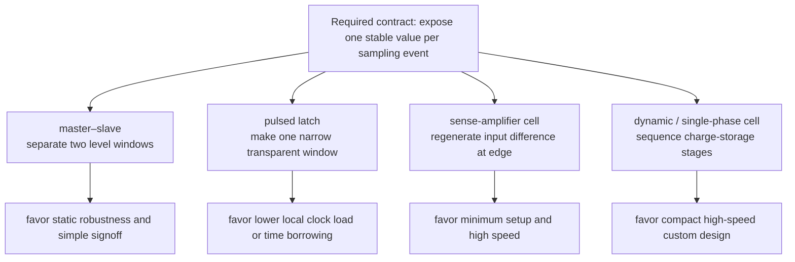

The correct topology depends on clock load, activity, required edge rate, low-voltage robustness, minimum clock frequency, hold margin, scan/reset requirements, and the available library methodology. An RTL `always_ff` statement does not select among these physical structures; synthesis chooses a characterized cell whose setup, hold, clock-to-Q, recovery/removal, internal power, and test behavior are present in the library.

### 4.8 Adding enable and reset: control when state may change

The baseline DFF loads new data on every active edge. A design often needs “update only when work is valid.” There are two non-equivalent implementations:

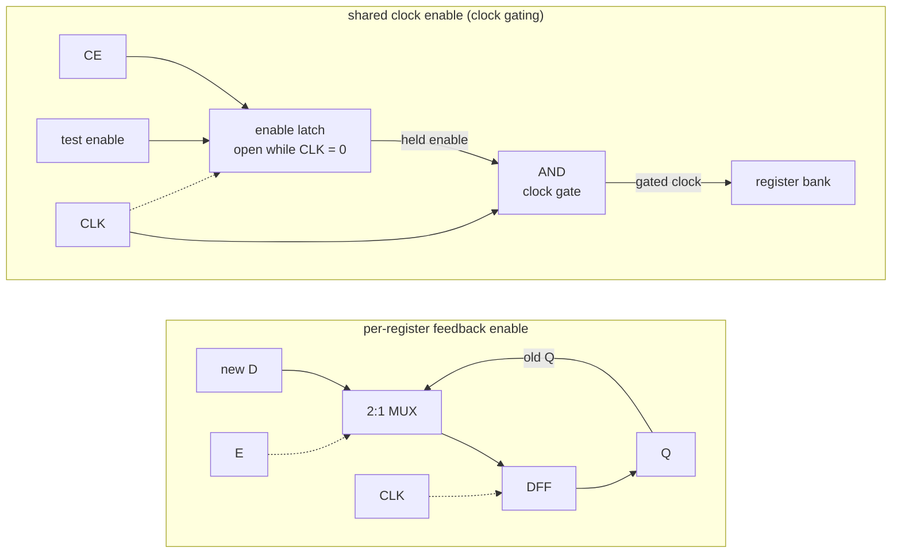

The feedback mux implements $D_{ff}=E D+\overline E Q$. It gives independent control per bit or register, but the clock tree and the DFF's internal clock devices still switch every cycle. An **integrated clock-gating (ICG) cell** latches the enable while the source clock is in its inactive phase, then gates a shared branch. It saves clock-tree and internal clock power across many registers, but control is coarser and the enable has its own gating setup/hold checks. A plain combinational AND on a clock is unsafe because a changing enable can create a runt pulse.

**Synchronous reset** is sampled on the active edge and participates in the D path. It is timing-friendly and glitch-resistant but cannot clear state when the clock is stopped. **Asynchronous reset/set** directly forces the storage node independent of clock, useful for safe power-up and clock-off states, but assertion and especially deassertion are asynchronous events. Recovery and removal are the reset analogues of setup and hold: deassert too near an edge and different flops can leave reset on different cycles or go metastable. A common policy is **asynchronous assert, synchronous deassert** through a reset synchronizer in each clock domain.

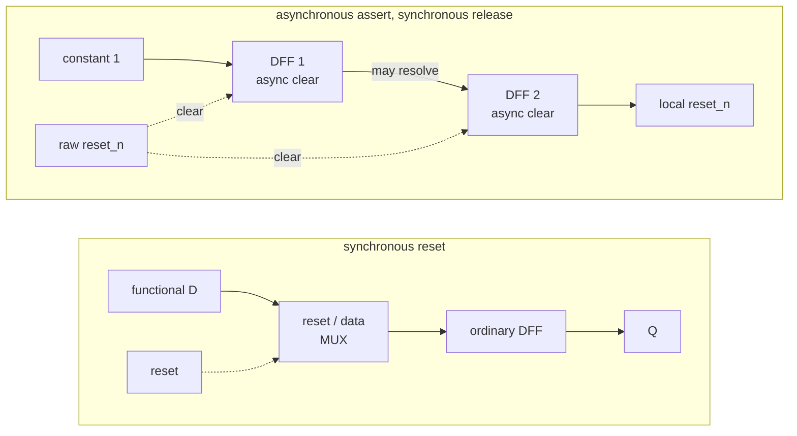

```wavedrom
{ "signal": [
  { "name": "CLK",         "wave": "p..........." },
  { "name": "raw reset_n", "wave": "0..1......0." },
  { "name": "stage 1",     "wave": "0....1....0." },
  { "name": "local reset_n", "wave": "0......1..0." },
  { "name": "state Q",     "wave": "0..........." }
], "head": { "text": "Reset synchronizer: assertion is immediate; release reaches the domain after two safe edges" } }
```

Every clock domain needs its own release synchronizer; distributing one synchronizer's output across unrelated domains recreates an asynchronous release. Reset every control bit whose unknown value could cause unsafe activity, but consider leaving wide datapath/pipeline registers unreset and qualify them with reset valid bits. Resetting thousands of data flops adds routing, area, recovery/removal constraints, and reset-deassertion power. The reset architecture is therefore a state-ownership decision, not a rule that “every flop must reset.”

### 4.9 Adding scan and retention: make hidden state testable and power-safe

#### 4.9.1 Scan flip-flops and the shift–capture–shift protocol

A scan DFF inserts a mux before D: functional data when `scan_enable=0`, serial `scan_in` when 1. Chains connect Q to the next scan input so test equipment can shift in an internal state, capture one or more functional cycles, then shift the response out. Required fields are functional D, scan input/output, scan enable, clock/reset behavior, and sometimes test-mode clock-gate override.

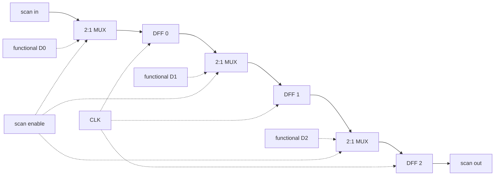

```wavedrom
{ "signal": [
  { "name": "scan_enable", "wave": "1....0.1...." },
  { "name": "scan_clock",  "wave": "p..........." },
  { "name": "scan_in",     "wave": "0101........" },
  { "name": "mode",        "wave": "3....4.5....", "data": ["shift in", "capture", "shift out"] },
  { "name": "scan_out",    "wave": "x.......3...", "data": ["captured bits"] }
], "head": { "text": "Scan operation: control internal state, capture one functional response, then observe it serially" } }
```

Scan makes sequential logic controllable/observable for automatic test pattern generation, but adds input delay, area, routing, and switching power. Scan reorder after placement reduces wire; lockup latches bridge opposite clock edges or large skew; compression reduces pins and shift cycles. Detailed fault/test methodology belongs to [DFT and ATPG](../06_Signoff/02_DFT_and_ATPG.md), but the storage-cell choice must reserve the test path from the start.

#### 4.9.2 Retention across a powered-off domain

Power gating removes the supply from ordinary state, so a normal DFF forgets its value. A **retention flip-flop** adds a small shadow latch powered by an always-on retention supply. Before shutdown, `save` copies $Q$ into the shadow; isolation prevents the dying domain from corrupting neighbors; after the main supply is stable, `restore` copies the retained bit back before functional clocks resume.

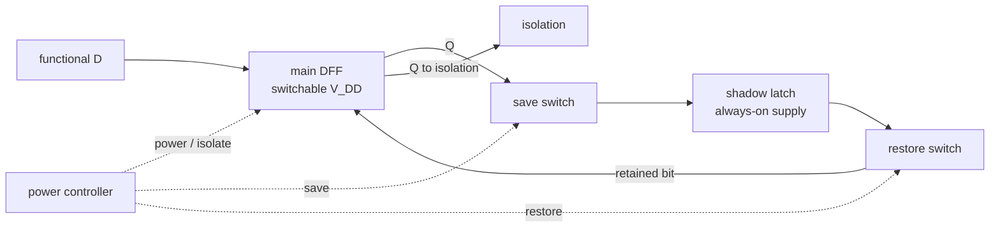

```wavedrom
{ "signal": [
  { "name": "save",       "wave": "010........." },
  { "name": "main_power", "wave": "1..0....1..." },
  { "name": "isolation",  "wave": "0.1......0.." },
  { "name": "restore",    "wave": "0........10." },
  { "name": "Q visible",  "wave": "3..x....3...", "data": ["A", "A restored"] }
], "head": { "text": "Retention protocol: save → isolate → power off/on → restore → release isolation" } }
```

The shadow latch, save/restore routing, always-on rail, and sequencing verification all cost area and leakage. Retain only architecturally expensive state; recompute or reset disposable pipeline state. The domain-level protocol and Unified Power Format/Common Power Format intent are owned by [Low-Power Architecture](../02_Power_and_Low_Power/03_Low_Power_Architecture_and_Domain_Partitioning.md) and [UPF/CPF](../02_Power_and_Low_Power/05_UPF_and_CPF_Power_Intent.md).

### 4.10 The latch/flip-flop trade-off: area, power, and time borrowing

Given the flip-flop is two latches, why does anyone still pipeline with bare latches? Because the extra stage costs area, power, and flexibility:

| Axis | Flip-flop (edge) | Latch (level) |
|---|---|---|
| Storage structure | commonly two latch-like stages | commonly one latch-like stage; savings are topology/library dependent |
| Timing model | one edge, simple STA | transparent window → harder STA |
| Slack across stages | rigid: each stage $\le T$ | **time borrowing** — a slow stage steals from a fast neighbour |
| Min-delay / hold risk | contained | higher (transparency widens hold windows) |

**Why time borrowing works.** In a two-phase latch pipeline the receiving latch is still transparent for half a cycle *after* nominal launch, so a slow logic stage can finish late and still be captured — it "borrows" time from the next stage, which must then finish early. The constraint relaxes from per-stage to per-pair:

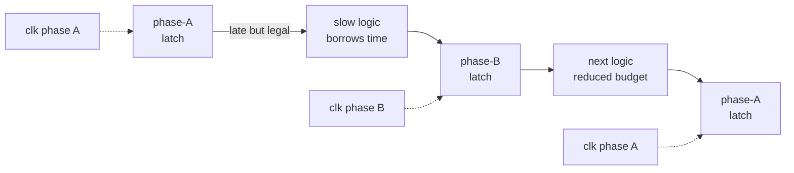

```wavedrom
{ "signal": [
  { "name": "phase A",    "wave": "1..0....1..0" },
  { "name": "phase B",    "wave": "0...1..0...1" },
  { "name": "late data",  "wave": "0....1......" },
  { "name": "latch B Q",  "wave": "0.....1....." },
  { "name": "next budget", "wave": "3.....4.....", "data": ["full", "reduced by borrowed time"] }
], "head": { "text": "Qualitative time borrowing: late data is accepted before latch B closes, reducing the next stage's budget" } }
```

$$
t_{cq}+t_{comb,1}+t_{comb,2}+t_{su}\;\le\;2\,T_{half}
$$

so unbalanced logic that would fail a rigid flip-flop boundary can close between latches. Borrowed time is not free slack: it is subtracted from the following stage, and non-overlap, duty cycle, skew, latch closing time, and minimum-delay paths must still close. The cost is exactly the transparency the flip-flop was built to avoid—harder timing analysis and greater hold exposure. High-frequency custom datapaths may choose latches or pulsed latches for time borrowing and lower local clock load; control logic and most synthesized RTL prefer flip-flops for the simpler single-edge abstraction.

### 4.11 Metastability: the third equilibrium and a probabilistic failure budget

The cross-coupled pair has a *third* equilibrium besides 0 and 1: the balance point at $\approx V_{dd}/2$. It is unstable, but a setup/hold violation can leave the node there, and only circuit noise nudges it off. Linearizing around that point,

$$
\frac{dV}{dt}=\frac{V-V_m}{\tau}\;\;\Rightarrow\;\; V(t)-V_m=(V(0)-V_m)\,e^{\,t/\tau}
$$

where $V_m$ = metastable voltage and $\tau$ = regeneration time constant set by the pair's gain-bandwidth product. Because the initial offset $V(0)-V_m$ grows by $e^{t/\tau}$, the fraction of starting points *still* inside the undecided band after $t_r$ falls as $e^{-t_r/\tau}$. The failure rate is then (rate of dangerous events) × (survival probability): a failure needs an asynchronous edge (rate $f_{data}$) to land in a narrow capture aperture $T_0$ around a sampling edge (rate $f_{clk}$), so failures occur at $\approx T_0\,f_{clk}\,f_{data}\,e^{-t_r/\tau}$. MTBF is the reciprocal of that rate:

$$
\text{MTBF}=\frac{e^{\,t_r/\tau}}{T_0\,f_{clk}\,f_{data}}
$$

where $t_r$ = time allowed to resolve, $T_0$ = a characterized aperture constant, $f_{clk}$ = sampling-clock frequency, and $f_{data}$ = asynchronous transition rate.

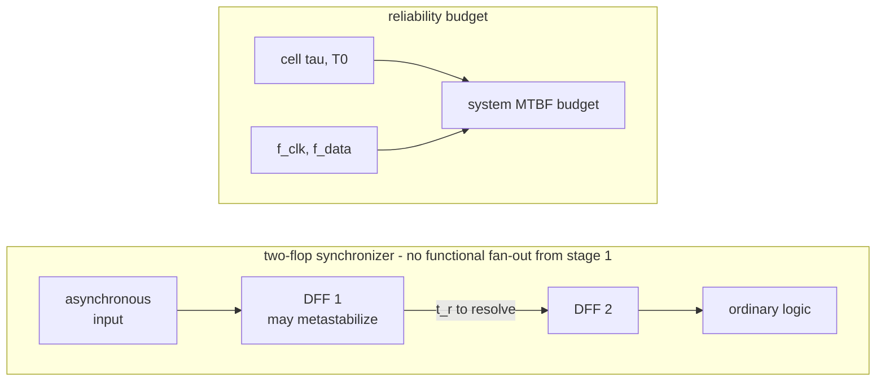

The lesson is the *shape*: mean time between failures (MTBF) is exponential in the resolution time $t_r$ and inverse-linear in the event rates. Adding a synchronizer stage usually buys almost one full clock period while preserving the destination frequency; reducing the frequency can also help by lowering $f_{clk}$ **and** increasing available resolution time, but changes throughput/latency and is rarely a local crossing fix.

A numeric MTBF is never a universal property of “two flops.” It must use worst-corner characterized $\tau$ and $T_0$, actual clock and data rates, inter-stage delay/skew, and a system failure target multiplied across every synchronizer in the product. The first stage must drive only the next synchronizer stage; otherwise different fan-out paths can interpret an unresolved voltage differently. Detailed budgeting, pulse/bus crossings, Gray pointers, and asynchronous FIFOs belong to [Async Design and CDC](../03_Frontend_RTL_and_Verification/06_Async_Design_and_CDC.md).

### 4.12 Verification obligations for a storage cell or wrapper

The derivation becomes implementable only when its invariants are observable:

| Structure | Safety property | Timing/physical check | Progress or coverage check |
|---|---|---|---|
| SR latch | active set and reset are never asserted together | recovery from command release is not used as functional behavior | cover set, hold, reset |
| D latch | while enabled, $Q$ follows $D$ after delay; while disabled, $Q$ remains stable | opening/closing setup and hold; no race-through across phases | cover transitions inside and outside the window |
| DFF | $Q$ changes only after the selected edge except asynchronous control | setup, hold, clock-to-Q at all required corners | cover 0→1, 1→0, enable/hold cases |
| reset wrapper | asynchronous assertion forces a safe value; release is synchronized per domain | recovery/removal and reset-tree skew | cover reset during idle, traffic, stopped clock, and power transition |
| scan chain | shift order and capture selection match the test protocol | shift/capture clocks, lockup-latch boundaries | every scan cell controllable and observable |
| retention cell | saved value restores before isolation is released | save/restore pulse width and power-state sequencing | cover every legal and illegal power transition |

Functional simulation checks the truth/state table; assertions check temporal invariants; static timing checks characterized arcs; gate-level simulation is reserved for reset/scan/timing-sensitive integration questions; formal reachability proves illegal states or command combinations cannot occur. Each method observes a different contract, so none substitutes for all the others.

---

## 5. Registers and register files: composing the primitives

Group the flip-flop and it becomes the workhorse sequential block. A **register** is $N$ flip-flops on one clock (optionally with an enable driven by a clock-gate, §2.3). A **shift register** wires each $Q$ to the next $D$ — serial↔parallel conversion and delay lines. A **register file** is where §2–§4 compose into one structure: an array of registers, a **decoder** (§3.1) per port turning an address into a wordline, and a read **mux/bitline** (§2) per port selecting the addressed row. Its cost is dominated by **ports**, not depth: each added read/write port threads another word- and bit-line through *every* cell, so cell area grows as $\sim P^2$ and access time with it — the identical quadratic-port wall that caps issue width in an OoO core ([OoO_Execution](../01_Architecture_and_PPA/01_CPU_Architecture/03_Out_of_Order_Backend/01_OoO_Execution.md) §2.3). This is why register files bank and cluster rather than pile on ports, and why "just add a port" is never cheap.

The composition starts mechanically: one DFF stores one bit; $N$ DFFs sharing clock/reset store one word; a mux before each D input adds hold/load; wiring neighboring outputs into those muxes adds shift; decoding an address lets many words share read/write ports.

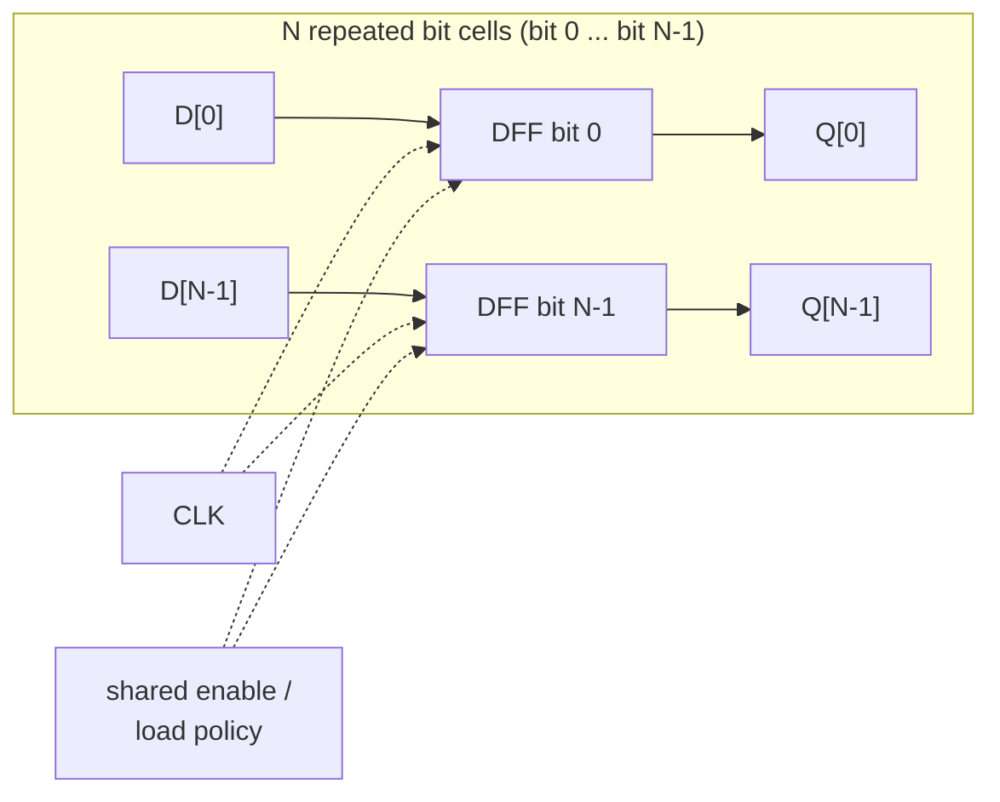

All bits sample the same architectural event, but physical clock skew and unequal data delay still create per-bit setup/hold checks. A word is coherent only when every bit meets those checks or the interface supplies a validity/error mechanism.

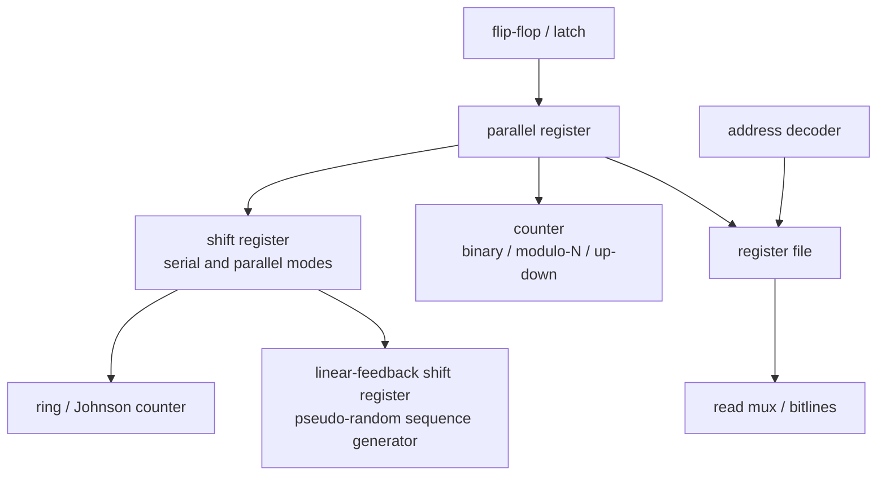

### 5.1 Register and shift-register modes

| Structure | Input/output mode | Per-edge behavior | Use |
|---|---|---|---|
| PIPO (parallel-in/parallel-out) | parallel in, parallel out | load or hold an entire word | pipeline/state register |
| SISO (serial-in/serial-out) | serial in, serial out | shift one bit between stages | delay, serialization |
| SIPO (serial-in/parallel-out) | serial in, parallel out | shift then observe all stages | serial receiver/deserializer |
| PISO (parallel-in/serial-out) | parallel in, serial out | load word, then shift | serializer/test output |
| bidirectional/universal | parallel load plus left/right shift | mux selects hold/load/shift directions | datapath alignment and scan-like movement |

The input mux selects hold, load, shift-left, or shift-right for every stage. Arithmetic right shift differs only at the incoming most-significant bit: replicate sign instead of zero. A barrel shifter replaces $N$ repeated shift cycles with $\log_2N$ mux stages; it is combinational and belongs to the same selection-tree cost model as §2.

For one bit $i$ of a universal shift register, a 4:1 mux computes

$$
Q_i^+=
\begin{cases}
Q_i, & mode=hold\\
P_i, & mode=parallel\ load\\
Q_{i-1}, & mode=shift\ left\\
Q_{i+1}, & mode=shift\ right,
\end{cases}
$$

with a serial boundary input substituted when $i$ has no neighbor.

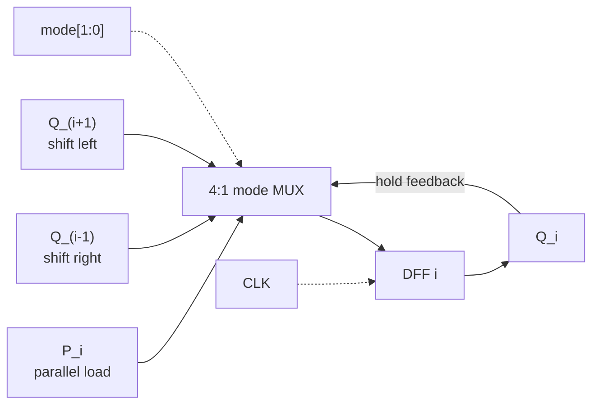

A shift register moves at most one position per active edge. If an instruction must shift by any distance in one cycle, sequential reuse is too slow. A barrel shifter instead uses one conditional mux stage per distance bit—shift by 1, then 2, then 4, and so on:

```mermaid
flowchart LR
  IN["8-bit input"] --> S1["8x 2:1 mux<br/>shift 0 or 1"] --> S2["8x 2:1 mux<br/>shift 0 or 2"] --> S4["8x 2:1 mux<br/>shift 0 or 4"] --> OUT["8-bit result"]
  A0["amount[0]"] -.-> S1
  A1["amount[1]"] -.-> S2
  A2["amount[2]"] -.-> S4
```

The barrel shifter trades $O(N\log N)$ mux wiring and a combinational $O(\log N)$ critical path for one-cycle latency. A sequential shifter uses $O(N)$ storage/mux resources but consumes up to $N-1$ cycles. The workload's shift frequency and latency requirement decide which wins.

### 5.2 Counter families and their design trade-offs

Start from one toggle flip-flop with $T=1$. It changes state on every active edge, so its output frequency is $f_{clk}/2$. Cascading each output into the next stage's clock creates an **asynchronous or ripple counter**: bit 0 toggles first, its delayed output clocks bit 1, and so forth.

```mermaid
flowchart LR
  CLK["source clock"] --> F0["TFF 0<br/>T = 1"]
  F0 -->|Q0 clocks| F1["TFF 1<br/>T = 1"]
  F1 -->|Q1 clocks| F2["TFF 2<br/>T = 1"]
  F2 -->|Q2 clocks| F3["TFF 3<br/>T = 1"]
  F3 --> Q3["Q3"]
```

The compact chain divides frequency, but it is not an atomic binary-state update. During $0111\rightarrow1000$, delayed toggles expose $0110$, $0100$, and $0000$ before the final value. Any decoder watching those bits can emit a false pulse.

```wavedrom
{ "signal": [
  { "name": "CLK edge", "wave": "01........" },
  { "name": "Q0",       "wave": "1.0......." },
  { "name": "Q1",       "wave": "1..0......" },
  { "name": "Q2",       "wave": "1...0....." },
  { "name": "Q3",       "wave": "0....1...." },
  { "name": "decoded bus", "wave": "3.4.5.6.7.", "data": ["0111", "0110", "0100", "0000", "1000"] }
], "head": { "text": "Qualitative ripple transition: propagation exposes intermediate codes before 1000 settles" } }
```

The repair is a **synchronous counter**: all flops share one clock, and next-state logic decides which bits toggle. With count enable $E$,

$$
T_0=E,\qquad T_i=E\prod_{k=0}^{i-1}Q_k,\qquad Q_i^+=Q_i\oplus T_i.
$$

```mermaid
flowchart LR
  E["E<br/>count enable"] --> PRE["prefix AND tree<br/>T_i = E and product of Q_k"]
  QIN["Q[N-1:0]"] --> PRE
  PRE -->|T| XOR["N XOR gates<br/>D_i = Q_i xor T_i"]
  XOR -->|D| BANK["N-bit DFF bank"]
  BANK --> OUT["Q[N-1:0]"]
  OUT -.->|feedback| XOR
  OUT -.->|feedback| PRE
  CLK["shared CLK"] -.-> BANK
```

All state bits now sample together, but the wide “all lower bits are one” logic becomes the critical path. An incrementer carry chain, carry-lookahead, or prefix tree computes the same enables with bounded fan-in and $O(\log N)$ depth. Thus counter evolution repeats the chapter's central pattern: ripple minimizes logic but exposes delay as behavior; synchronous logic hides intermediate states; prefix logic then repairs the synchronous critical path.

An up/down counter selects carry versus borrow propagation. A modulo-$M$ counter returns to zero at $M-1$; if $M$ is not a power of two, decoding terminal count adds logic and illegal states require recovery. A saturating counter stops at its maximum/minimum and is common in predictors because wraparound would invert confidence.

| Counter | State sequence | Advantage | Limitation/use |
|---|---|---|---|
| binary | $0\ldots2^N-1$ | compact encoding | many simultaneous bit toggles |
| Gray | adjacent codes differ by one bit | safe observation across domains | arithmetic/terminal decode needs conversion |
| one-hot ring | one bit circulates through $N$ flops | trivial decode, one-hot phase | needs initialized legal state; $N$ flops for $N$ states |
| Johnson/twisted ring | inverted tail feeds head | $2N$ easily decoded phases | illegal-state recovery |
| linear-feedback shift register (LFSR) | XOR feedback sequence | long pseudo-random sequence with little logic | excludes all-zero state; not cryptographically secure |

For an $N$-bit maximal-length LFSR, a primitive feedback polynomial yields period $2^N-1$. Fibonacci form computes one XOR feedback and shifts it; Galois form distributes XORs along the register, usually shortening the critical path. LFSRs generate pseudo-random binary sequences, scrambler patterns, built-in self-test signatures, and randomized replacement choices. The polynomial, shift convention, seed, and bit ordering are part of the interface—mismatching any one produces a different sequence.

```mermaid
flowchart LR
  subgraph RING["ring counter"]
    direction LR
    R0["Q0"] --> R1["Q1"] --> R2["Q2"] --> R3["Q3"]
    R3 -->|direct feedback| R0
  end
  subgraph JOHN["Johnson counter"]
    direction LR
    J0["Q0"] --> J1["Q1"] --> J2["Q2"] --> J3["Q3"] --> JI["NOT<br/>invert"]
    JI -->|inverted feedback| J0
  end
  subgraph LF["LFSR (all stages share one clock)"]
    direction LR
    LX["XOR<br/>taps"] --> L0["Q0"] --> L1["Q1"] --> L2["Q2"] --> L3["Q3"]
    L3 -->|tap Q3| LX
    L2 -->|tap Q2| LX
  end
```

A ring counter must start one-hot or it may lock in all zero; a Johnson counter feeds back the inverted tail and produces $2N$ phases; an LFSR's period depends on a primitive polynomial and a nonzero seed. These are not interchangeable “special counters”: each changes state encoding to optimize decoding, switching, phase generation, or pseudo-random coverage.

### 5.3 Multiport register files and bypass

A register-file write port contains address decoder, write data/bitlines, byte/bit enables, and write driver. A read port contains wordline selection, bitlines/sense or mux tree, and output register/bypass. Multiple simultaneous writes to one address require a priority/error contract. A same-cycle read/write collision must define read-old, read-new through bypass, or unspecified behavior.

```mermaid
flowchart LR
  WA["write address"] --> WDEC["write decoder"] -->|wordline| ARR["word array<br/>rows x bits<br/>2R1W cells"]
  WDATA["write data + enables"] --> WDRV["write drivers"] --> ARR
  ARR --> RM0["read mux /<br/>bitlines 0"] --> BP0["bypass MUX 0"] --> RD0["read data 0"]
  ARR --> RM1["read mux /<br/>bitlines 1"] --> BP1["bypass MUX 1"] --> RD1["read data 1"]
  CMP["write / read<br/>address comparators"] -.->|collision select| BP0
  CMP -.->|collision select| BP1
  WFWD["write data forward"] -.-> BP0 & BP1
```

This is a two-read/one-write (2R1W) functional organization. If a read address equals the active write address, the array may naturally return old data, new data, or an analog/macro-specific result. A read-new contract therefore compares addresses and bypasses `write_data`; a read-old contract suppresses bypass and must use an array mode that guarantees the old word. “Unspecified” is legal only if every consumer is prevented from using the collision.

Flop-based small register files implement each read as a mux and are fast/flexible but scale poorly. Compiled SRAM/register-file macros use dense custom cells and bitlines but have fixed ports, latency, and collision modes. Banking reduces cell ports by steering addresses, but bank conflicts become an architectural stall/replay. Replication adds read ports cheaply only when writes broadcast to every copy.

```wavedrom
{ "signal": [
  { "name": "CLK",          "wave": "p......." },
  { "name": "write_enable", "wave": "010....." },
  { "name": "write_addr",   "wave": "x3.x....", "data": ["r5"] },
  { "name": "write_data",   "wave": "x3.x....", "data": ["NEW"] },
  { "name": "read_addr",    "wave": "x3.....x", "data": ["r5"] },
  { "name": "read-new out", "wave": "x.3....x", "data": ["NEW via bypass"] }
], "head": { "text": "Same-cycle read/write collision under an explicit read-new bypass contract" } }
```

### 5.4 Verification and sizing checklist

- Prove reset/load/hold/shift mode exclusivity and cover every mode transition.
- For ripple counters, forbid combinational decoding unless the protocol tolerates transients; for synchronous counters, assert one increment/decrement per accepted enable.
- Assert ring-counter one-hot legality, Johnson legal-state recovery, and LFSR nonzero seed/expected period for the selected polynomial convention.
- For register files, verify every declared collision case, byte enable, reset/initialization rule, bank conflict, and bypass priority.
- Size ports and banks from simultaneous operand demand, not instruction count. Then include decoder, wire, mux, bypass, and clock load in the timing/PPA estimate.

---

## 6. Finite state machines: making behaviour depend on history

A pure function reacts only to the present input; a controller must react to *where it has been*. The minimal machine that does is a **state register plus combinational next-state/output logic**—the FSM. Its design requires a behavioral state abstraction, complete transition/output contract, encoding, timing strategy, illegal-state policy, and progress/verification argument. Encoding is one implementation choice, not the definition of the machine.

```mermaid
flowchart LR
  X1["inputs X"] --> NEXT["next-state logic<br/>S+ = F(S, X)"]
  NEXT -->|next state| REG["state DFF bank"]
  REG --> SOUT["present S"]
  SOUT -.->|state feedback| NEXT
  SOUT --> OUT["output logic<br/>Y = G(S, X)"]
  X2["inputs X"] --> OUT
  OUT --> Y["outputs Y"]
  CR["clock / reset"] -.-> REG
```

The state register is ordinary DFF storage. “Designing an FSM” means defining the state abstraction, deriving $F(S,X)$, choosing whether outputs depend on state alone or state plus inputs, encoding the states into bits, and proving that every legal and illegal state has intentional behavior.

### 6.1 Derive one controller from a protocol, not from a state-name list

Use a small request/work/acknowledge controller as the running example. Its contract is:

1. In `IDLE`, accept a high `req` once and pulse `start` to the worker.
2. Enter `RUN` and ignore further request level changes while work is active.
3. When the worker raises `done`, enter `RESP` and assert `ack`.
4. Hold `ack` until the requester lowers `req`; then return to `IDLE`.
5. Reset and any illegal state converge to `IDLE` without emitting `start`.

The three states are forced by ownership: `IDLE` owns no request, `RUN` owns an accepted request whose work is incomplete, and `RESP` owns a completed request whose acknowledgement has not yet been consumed.

```mermaid
stateDiagram-v2
    [*] --> IDLE: reset
    IDLE --> IDLE: req=0
    IDLE --> RUN: req=1 / start
    RUN --> RUN: done=0
    RUN --> RESP: done=1
    RESP --> RESP: req=1 / ack
    RESP --> IDLE: req=0
```

| Present state | Input condition | Next state | Outputs during this cycle | Reason |
|---|---|---|---|---|
| IDLE | `req=0` | IDLE | `start=0, ack=0` | no owned transaction |
| IDLE | `req=1` | RUN | `start=1, ack=0` | accept exactly once |
| RUN | `done=0` | RUN | `start=0, ack=0` | wait for worker |
| RUN | `done=1` | RESP | `start=0, ack=0` | completion becomes response ownership |
| RESP | `req=1` | RESP | `start=0, ack=1` | hold acknowledgement until observed |
| RESP | `req=0` | IDLE | `start=0, ack=1` for the current RESP cycle | complete handshake |

Here `ack` is a **Moore** output because it depends only on `RESP`; `start` is a **Mealy** acceptance output because it depends on `IDLE` and `req`. Moore does **not** automatically mean glitch-free: a combinational decode of several state bits can glitch while those bits change. A strict glitch-free interface uses a registered output or an encoding/cell/timing strategy whose transition cannot create a harmful pulse. Mealy responds without waiting for a state transition, but its input-to-output combinational path must meet timing and must not turn an asynchronous/glitching input into a protocol event.

```wavedrom
{ "signal": [
  { "name": "CLK",   "wave": "p..........." },
  { "name": "req",   "wave": "0.1......0.." },
  { "name": "start", "wave": "0.10........" },
  { "name": "state", "wave": "3.4....5...3", "data": ["IDLE", "RUN", "RESP", "IDLE"] },
  { "name": "done",  "wave": "0.....10...." },
  { "name": "ack",   "wave": "0......1..0." }
], "head": { "text": "Request controller: accept once, wait, acknowledge, and wait for request release" } }
```

The waveform is the procedural test: it demonstrates why `RUN` prevents duplicate starts while `req` remains high and why `RESP` retains completion until the requester observes it.

### 6.2 State encoding: one-hot vs binary vs gray

The encoding sets how much next-state logic sits between the flops — a direct fan-in trade:

| | Binary ($\lceil\log_2 S\rceil$ FF) | One-hot ($S$ FF) | Gray ($\lceil\log_2 S\rceil$ FF) |
|---|---|---|---|
| Flip-flops | fewest | most | fewest |
| Next-state logic | needs a state **decoder** (deep, high fan-in) | trivial — each bit is a shallow OR of a few transitions | like binary |
| Typical timing tendency | decode can deepen the critical path | shallow equations can be fast | similar to binary plus adjacency constraints |
| Best when | state-bit cost matters and decode is manageable | shallow control and abundant flops matter | transition graph and crossing/power objective benefit from one-bit changes |

For the running controller, choose binary `IDLE=00`, `RUN=01`, `RESP=10`; `11` is illegal. Let the present-state bits be $q_1q_0$. The transition table yields

$$
q_1^+=(\overline q_1q_0)\,done+(q_1\overline q_0)\,req,
$$

$$
q_0^+=(\overline q_1\overline q_0)\,req+(\overline q_1q_0)\,\overline{done}.
$$

Outputs are $start=(\overline q_1\overline q_0)req$, $busy=\overline q_1q_0$, and $ack=q_1\overline q_0$. These equations are not guessed from state names; they are minimized from the transition/output table.

With one-hot encoding, use bits $(I,R,P)$ and legal words 100, 010, 001. The next-state equations become shallow transition terms such as $R^+=I\,req+R\,\overline{done}$. That may reduce logic depth but adds a state flop and a larger clock/reset load. A field-programmable gate array often has plentiful nearby flops; an application-specific integrated circuit may favor binary, one-hot, or a tool-selected hybrid depending on fan-out, placement, test, safety, and transition activity. There is no portable “number of states” at which one encoding always wins—synthesize and place alternatives under the same constraints.

Gray encoding is helpful only if the legal transition graph admits one-bit-adjacent assignments for the transitions that matter. A branch-heavy arbitrary FSM cannot make every legal edge Gray. Gray is therefore a targeted encoding choice, not a generic third option.

### 6.3 Safe FSMs: recovering from illegal states

A radiation strike, power glitch, reset-release error, or design bug can place the state register in an **unreachable** code. Binary with $S$ non-power-of-two states has $2^{\lceil\log_2 S\rceil}-S$ illegal codes; one-hot has $2^S-S$ total illegal words. The predicate `state != 0 && (state & (state-1)) == 0` recognizes a legal one-hot word; illegal detection is its negation.

For the running binary example, state 11 must drive `start=0`, `ack=0`, raise an error/telemetry bit if required, and choose `IDLE` as the next state. Whether recovery may happen silently is a system contract: safety designs may enter a fail-safe state instead; secure designs may reset a larger trust domain.

```mermaid
stateDiagram-v2
    state "ILLEGAL: 11" as BAD
    BAD --> IDLE: recovery + error flag
    IDLE --> RUN: req
    RUN --> RESP: done
    RESP --> IDLE: request released
```

Verification should assert legal-state membership after the reset/recovery allowance, forbid `start` outside an accepted IDLE request, require `ack` to remain high while in RESP with `req=1`, and prove progress: every accepted request eventually reaches RESP if the worker eventually raises `done`. Cover every legal transition, reset from every state, and at least one injected illegal-state recovery. An explicit default/recovery path prevents simulation/synthesis assumptions from erasing the behavior that signoff expects.

---

## 7. Gray code: one bit at a time, and why CDC needs it

When a multi-bit binary counter increments across a carry boundary, several bits may change. A destination clock that samples during unequal wire and flip-flop delays can capture a mixture that is neither endpoint. Gray coding changes the source sequence so adjacent legal counts differ in one bit, reducing each increment to one changing signal.

```mermaid
flowchart LR
  BIN["source binary<br/>pointer DFFs"] -->|B| ENC["registered<br/>Gray encoder<br/>G = B xor (B shifted)"]
  ENC -->|G| SYNC["two DFFs<br/>per Gray bit"]
  SYNC -->|G| DST["destination<br/>compare + decode"]
  SCLK["source clock"] -.-> ENC
  DCLK["destination clock"] -.-> SYNC
  SKEW["bounded inter-bit skew"] -.-> SYNC
  INC["one legal increment"] -.-> BIN
```

Gray code alone is not a complete clock-domain-crossing solution. The source Gray word should be registered so combinational XOR glitches are not launched; every bit is synchronized into the destination domain; the protocol must tolerate missed intermediate counts; and implementation constraints must bound inter-bit skew so two successive source transitions do not arrive as one multi-bit event.

```wavedrom
{ "signal": [
  { "name": "source event", "wave": "01......" },
  { "name": "binary B",    "wave": "3.4.....", "data": ["0111", "1000"] },
  { "name": "binary wires", "wave": "3.x.4...", "data": ["0111", "1000"] },
  { "name": "Gray G",      "wave": "3.4.....", "data": ["0100", "1100"] },
  { "name": "changing Gray bit", "wave": "0.1....." }
], "head": { "text": "7→8 example: binary changes four bits; reflected Gray changes only one" } }
```

The reflected Gray code is $G(i)=i\oplus(i\gg1)$, i.e. $g_k=b_k\oplus b_{k+1}$. **Single-change proof:** incrementing $i$ flips its trailing run of ones and the first zero above them, at position $j$. Only $g_j=b_j\oplus b_{j+1}$ sees a net change—at any $k<j$ both $b_k$ and $b_{k+1}$ flip, so their XOR is unchanged; at $k>j$ neither flips; at $k=j$ only $b_j$ flips. Encode is an XOR layer with no carry chain; decode is a prefix XOR, $b_k=\bigoplus_{m\ge k} g_m$, implementable as an $O(\log N)$ tree. The complete asynchronous-FIFO proof and constraints are in [Async Design and CDC](../03_Frontend_RTL_and_Verification/06_Async_Design_and_CDC.md).

---

## 8. Hazards and glitches: when combinational logic lies transiently

A combinational output is only guaranteed correct *after* it settles; in between, unequal path delays make it glitch. Knowing when that matters — and when it does not — separates a real timing concern from wasted effort.

A **static-1 hazard** is the canonical case. In $F=AB'+BC$ with $A{=}C{=}1$, toggling $B$ hands the '1' from one product term to the other, and if the term that should rise is late, $F$ momentarily dips to 0. K-map view: the two 1-cells are adjacent but covered by *different* prime implicants with no shared cover, so the transition crosses a gap. The fix is the **consensus term**: add $AC$ (the consensus of $AB'$ and $BC$), which stays 1 throughout the transition and bridges the gap — redundant for *logic*, essential for *timing*. Static-0 hazards are the POS dual (add the consensus factor); dynamic hazards (multiple transitions) occur only in multi-level circuits, and Eichelberger's theorem guarantees that eliminating all static hazards eliminates dynamic ones too.

```tikz
\usepackage{circuitikz}
\begin{document}
\begin{circuitikz}[american,thick,scale=0.83,transform shape]
  \node[not port] (INV) at (0.0,1.0) {};
  \node[and port] (P0) at (3.0,2.0) {};
  \node[and port] (P1) at (3.0,0) {};
  \node[and port] (PC) at (3.0,-2.0) {};
  \node[or port,number inputs=3] (OR) at (7.0,0) {};
  \draw (-1.2,2.25) node[left]{$A$} -- (0.8,2.25) coordinate (A) node[circ]{} -- (P0.in 1);
  \draw (A) |- (PC.in 1);
  \draw (INV.in) -- ++(-1.2,0) coordinate (B) node[circ]{} node[left]{$B$};
  \draw (B) |- (P1.in 1);
  \draw (INV.out) -- (P0.in 2) node[midway,above]{$\overline B$};
  \draw (-1.2,-0.25) node[left]{$C$} -- (0.8,-0.25) coordinate (C) node[circ]{} -- (P1.in 2);
  \draw (C) |- (PC.in 2);
  \draw (P0.out) -- (OR.in 1); \draw (P1.out) -- (OR.in 2); \draw (PC.out) -- (OR.in 3);
  \draw (OR.out) -- ++(1.0,0) node[right]{$F$};
  \node[below,align=center] at (3.0,-2.7) {consensus\\path\\$AC$};
\end{circuitikz}
\end{document}
```

```wavedrom
{ "signal": [
  { "name": "B",            "wave": "0..1...." },
  { "name": "B̅ delayed",   "wave": "1...0..." },
  { "name": "A·B̅",         "wave": "1...0..." },
  { "name": "B·C",          "wave": "0..1...." },
  { "name": "F without AC", "wave": "1..010.." },
  { "name": "F with AC",    "wave": "1......." }
], "head": { "text": "Reconvergent unequal delays can create a static-1 hazard; consensus holds the output high" } }
```

The load-bearing judgment: in ordinary synchronous data logic, a glitch is **functionally unobserved only if it settles before the receiving setup aperture and does not reach an event-sensitive control**. It still consumes dynamic power and can worsen supply noise. Consensus-term padding is often unnecessary between well-timed flip-flops, but hazards matter functionally where a transient is itself an event:

1. asynchronous circuits and handshakes,
2. clock generation/gating and reset logic (a glitch is a spurious edge — §2.3),
3. anything feeding a level-sensitive latch enable or an edge/interrupt input,
4. **dynamic logic** (§1.4), where one glitch permanently discharges the node.

So hazard theory is a targeted tool for the async/clock/dynamic corners where combinational logic is read *before* it settles — not something to sprinkle across ordinary pipelined datapaths.

---

## 9. Elastic buffering: from one valid register to a complete FIFO

One register can decouple a producer and consumer for one beat if it also stores a **valid bit**. When empty, it may accept; when full, it must retain payload until the consumer accepts. A burst longer than one beat needs multiple entries and two independent positions: where the next push writes and where the next pop reads. That composition is a first-in, first-out queue (FIFO).

```mermaid
flowchart TD
    PROD["producer\npush_valid + data"] --> ADM["push admission\nnot full"]
    ADM --> MEM["entry array"]
    WP["write pointer"] --> MEM
    MEM --> RD["read selection"] --> CONS["consumer\npop_ready + data"]
    RP["read pointer"] --> RD
    ADM --> OCC["occupancy / pointer relation"]
    CONS --> OCC
    OCC --> FLAGS["empty, full, almost-full"]
    FLAGS -. "backpressure" .-> PROD
```

Define **accepted events**, not raw requests:

$$
push=push\_valid\land\neg full,\qquad
pop=pop\_ready\land\neg empty.
$$

For a depth-$D$ synchronous FIFO with occupancy $n\in[0,D]$,

$$
n^+=n+push-pop,\qquad empty=(n=0),\qquad full=(n=D).
$$

Simultaneous push and pop leave occupancy unchanged but advance both pointers. A full FIFO may accept a push in the same cycle as a guaranteed pop if the implementation explicitly supports look-ahead admission; otherwise conservative `full` backpressure sacrifices one opportunity for simpler control.

```wavedrom
{ "signal": [
  { "name": "CLK",         "wave": "p..........." },
  { "name": "push_valid",  "wave": "0.1.....0..." },
  { "name": "pop_ready",   "wave": "0....1....0." },
  { "name": "occupancy",   "wave": "3.4.5.6.5.4.3", "data": ["0", "1", "2", "3", "2", "1", "0"] },
  { "name": "almost_full", "wave": "0...1..0...." },
  { "name": "backpressure", "wave": "0....1.0...." }
], "head": { "text": "Burst buffering: occupancy integrates accepted pushes minus accepted pops" } }
```

The storage read contract changes latency. A **first-word fall-through (FWFT)** FIFO exposes the oldest entry as soon as nonempty, minimizing first-beat latency but lengthening the read-data path. A registered-read FIFO adds a cycle and output register, simplifying timing and memory-macro use. The interface must state whether `pop_ready` consumes the currently visible word or requests a word for a later cycle.

### 9.1 Derive depth from worst-case backlog

Two agents that produce and consume at rates differing *instantaneously* but compatible *on average* need enough entries for the maximum accumulated difference:

$$
D_{min}=\max_t\int_0^t\!\big(r_{wr}(t')-r_{rd}(t')\big)\,dt' \;\approx\; B\Big(1-\frac{r_{rd}}{r_{wr}}\Big)
$$

where $B$ is burst length and $r_{wr},r_{rd}$ are effective accepted write/read rates — a burst of $B$ writes at rate $r_{wr}$ lasts $B/r_{wr}$, and the reader drains $r_{rd}\,(B/r_{wr})$ in that time, so the leftover backlog is $B(1-r_{rd}/r_{wr})$. The buffer is stable only if $\overline{r_{rd}}\ge\overline{r_{wr}}$ on average; otherwise no finite depth suffices. Add margin for response/backpressure latency: after `almost_full` or `full` is generated, the producer may already have beats in a pipeline or link.

An asynchronous FIFO also pays for synchronized-pointer staleness and usually uses a power-of-two depth so binary/Gray wrap comparison is tractable. The production-grade Gray-pointer full/empty proof belongs to [Async Design and CDC](../03_Frontend_RTL_and_Verification/06_Async_Design_and_CDC.md); this chapter owns the synchronous storage/control composition and backlog model.

### 9.2 FIFO correctness and verification

- **No loss, duplication, or reordering:** every accepted push is popped exactly once and in order.
- **Bounds:** $0\le n\le D$; no write when full and no read when empty unless same-cycle look-ahead behavior explicitly makes it legal.
- **Pointer/occupancy agreement:** pointer difference, wrap bits, and occupancy represent the same number of stored entries.
- **Stable backpressure:** while an output beat is valid but not accepted, its data remains unchanged.
- **Corner coverage:** empty/full simultaneous push-pop, pointer wrap, long stalls, reset with traffic, threshold crossings, and maximum burst.
- **Liveness assumption:** if the consumer eventually accepts and the producer stops adding work, the FIFO eventually drains. No finite FIFO can guarantee progress when offered load permanently exceeds service rate.

---

## 10. Integrated construction: a buffered request engine

The chapter's blocks become useful when their ownership boundaries compose. Consider a producer that may burst requests while a single-cycle-at-a-time worker has variable latency. The smallest correct unbuffered design wires producer directly to the controller; while the worker is busy, the producer must stall. Add a FIFO when burst absorption is required.

```mermaid
flowchart TD
    P["producer\nvalid + payload"] --> ADM["ready/valid admission"]
    ADM --> FIFO["FIFO array\nwrite/read pointers + valid state"]
    FIFO --> HEAD["head payload register"]
    HEAD --> CTRL["IDLE/RUN/RESP controller"]
    CTRL --> W["worker datapath"]
    W --> RES["result register"]
    RES --> OUT["response valid/data"]
    OUT --> CTRL
    CTRL -. "pop on accepted start" .-> FIFO
    FIFO -. "full/almost-full" .-> ADM
```

Every earlier primitive now has a specific job:

- muxes select feedback/next data and steer FIFO entries;
- decoders select the write row and read muxes select the oldest row;
- DFFs hold pointers, valid bits, controller state, payload, and result;
- an incrementer advances accepted push/pop pointers;
- the FIFO decouples instantaneous rates;
- the FSM prevents duplicate starts and retains completion until accepted;
- hazard, setup/hold, reset, and scan rules apply to the composed paths.

| Cycle | Accepted event | FIFO after edge | Controller/worker state | Why the structure is needed |
|---:|---|---|---|---|
| 0 | none | empty | IDLE | baseline |
| 1 | push request A | `[A]` | IDLE | buffer accepts producer independently |
| 2 | pop A and `start(A)` | empty | RUN A | controller consumes exactly one head |
| 3 | push request B | `[B]` | RUN A | FIFO absorbs burst while worker is busy |
| 4 | worker `done(A)` | `[B]` | RESP A | result ownership moves to response state |
| 5 | response A accepted | `[B]` | IDLE | completion cannot be overwritten early |
| 6 | pop B and `start(B)` | empty | RUN B | order preserved without producer replay |

The feature is worthwhile only if waiting bursts occur often enough to justify storage, pointer, mux, and verification cost. A deeper FIFO raises burst tolerance but also area, leakage, pointer width, reset/test time, and worst-case queueing latency. Multiple workers would expose the next bottleneck: one FSM and in-order head selection may underutilize them, motivating tags, an issue queue, and out-of-order completion bookkeeping—the same evolution that later appears in CPU, GPU, NPU, and interconnect architecture.

An end-to-end proof combines local invariants: accepted producer beats enter once; FIFO order is preserved; the controller starts only the current head; each start creates at most one response; backpressure holds payload stable; reset cancels or drains according to a declared policy; and under fair worker/consumer assumptions every accepted request eventually completes. This is the complete logic-building flow: Boolean selection creates next-state functions, feedback stores them, registers compose state, and protocols make independently timed blocks cooperate.

---

## Quantities and design rules to carry

| Quantity | Value | Why it matters (section) |
|---|---|---|
| Logical effort $g$: inv / NAND2 / NOR2 | 1 / 4/3 / 5/3 | NOR slower → libraries favor NAND/AOI (§1.1) |
| Useful stage-effort target | often near 4; ideal no-parasitic result is $e$ | starting point for equal-effort staging, not a fixed cell rule (§1.2) |
| Optimal number of stages | $\log_4 F$ | path effort → depth (§1.2) |
| Absolute FO4 delay | technology/library/PVT dependent | normalized comparison is portable; picoseconds are not (§1.2) |
| Timing-sensitive fan-in | commonly kept modest | wide stacks/input load motivate trees; actual limit is library-specific (§1.3) |
| Ripple vs tree | $O(N)$ vs $O(\log N)$ | every wide block is a tree (§1.3) |
| Setup / hold / clock-to-Q | characterize versus slew, load, PVT, transition, cell | setup limits max delay; hold limits min delay; clock-to-Q is launch overhead (§4.5) |
| Latch vs DFF area/power | topology, scan/reset, clocking, and layout dependent | one versus two level windows is intuition, not a universal ratio (§4.10) |
| MTBF scaling | $\propto e^{t_r/\tau}/(f_{clk}f_{data})$ | resolution time is exponential; rates and cell constants still matter (§4.11) |
| Synchronizer depth | solve from worst-corner system MTBF budget | “two flops” has no universal lifetime (§4.11) |
| One-hot vs binary crossover | no universal state count | synthesize/place both under the same constraints (§6.2) |
| Reflected Gray code | adjacent legal counts differ by one bit | reduces a counter crossing to one changing bit, with registration/synchronization/skew constraints (§7) |
| 2:1 TG mux core | two TGs = four pass devices, plus select complement/restoration as needed | prevents undercounting the physical control/drive cost (§2.2) |
| DFF and ICG size | cell-topology and library dependent | compare characterized area, clock pin capacitance, arcs, and test features (§4.7–§4.9) |

---

## Cross-references

- **Down the stack (what these blocks are built from):** [CMOS_Fundamentals](01_CMOS_Fundamentals.md) — the transistor, inverter VTC, noise margins, RC delay and FO4, and the device-level static/pass/TG/dynamic families behind §1.4.
- **Same layer (blocks composed into datapaths):** [Adders_and_Multipliers](03_Adders_and_Multipliers.md) (carry/prefix trees — the §1.3 tree argument and the §3.3 comparator in full), [Floating_Point](04_Floating_Point.md) (the LZA/LZC normalization of §3.2).
- **Up the stack (what builds on these blocks):** [CPU Architecture](../01_Architecture_and_PPA/01_CPU_Architecture/01_Core_Foundations/01_CPU_Architecture.md) (pipelines of these registers and the setup/hold budget of §4.5), [OoO Execution](../01_Architecture_and_PPA/01_CPU_Architecture/03_Out_of_Order_Backend/01_OoO_Execution.md) (register files and the port wall of §5, the FO4 cycle budget of §1.2), [Async Design and CDC](../03_Frontend_RTL_and_Verification/06_Async_Design_and_CDC.md) (metastability budgeting, Gray pointers, and the asynchronous FIFO handoff of §4.11/§7/§9), [Clock Division and Switching](../03_Frontend_RTL_and_Verification/04_Clock_Division_and_Switching.md) (glitch-free clock selection), [Power Reduction Techniques](../02_Power_and_Low_Power/04_Power_Reduction_Techniques.md) (integrated clock gating), and [STA](../06_Signoff/01_STA.md) (setup/hold and time-borrowing signoff of §4.5 and §4.10).

---

## References

1. Sutherland, I., Sproull, R., Harris, D., *Logical Effort: Designing Fast CMOS Circuits*, Morgan Kaufmann, 1999. The $g,h,p$ / path-effort / stage-effort-4 model of §1.
2. Weste, N., Harris, D., *CMOS VLSI Design*, 4th ed., Addison-Wesley, 2010. Logic families, sequential elements, FO4.
3. Rabaey, J., Chandrakasan, A., Nikolić, B., *Digital Integrated Circuits*, 2nd ed., Prentice Hall, 2003. Dynamic/domino logic, charge sharing, keepers (§1.4).
4. Eichelberger, E.B., "Hazard detection in combinational and sequential switching circuits," *IBM J. Res. Dev.*, 1965. The static→dynamic hazard theorem of §8.
5. Ginosar, R., "Metastability and Synchronizers: A Tutorial," *IEEE Design & Test*, 2011. The MTBF derivation of §4.11.
