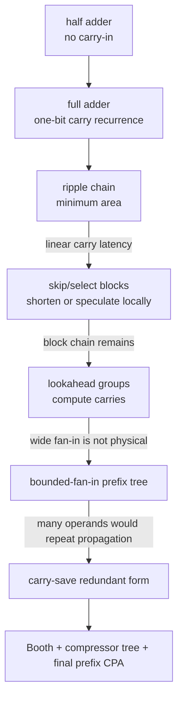

# Datapath Arithmetic — The Carry Chain and How to Beat It

```tikz
\usepackage{circuitikz}
\begin{document}
\begin{circuitikz}[american,thick,scale=0.78,transform shape]
  \tikzset{blk/.style={draw,rounded corners,minimum width=2.4cm,minimum height=1.0cm,align=center}}
  \node[blk] (ADD) at (0,1.2) {$N$-bit addition};
  \node[blk] (RIP) at (3.4,2.1) {ripple carry\\$O(N)$ latency};
  \node[blk] (CLA) at (3.4,0.3) {lookahead /\\carry select};
  \node[blk] (PRE) at (6.8,0.3) {parallel-prefix tree\\$O(\log N)$ latency};
  \node[blk] (MUL) at (0,-2.1) {multiplication};
  \node[blk] (PP) at (3.4,-2.1) {partial products\\Booth recoding};
  \node[blk] (RED) at (6.8,-2.1) {carry-save reduction\\Wallace / Dadda};
  \node[blk] (CPA) at (10.2,-0.9) {final carry-\\propagate adder};
  \draw[->] (ADD) -- (RIP); \draw[->] (ADD) -- (CLA); \draw[->] (CLA) -- (PRE);
  \draw[->] (MUL) -- (PP); \draw[->] (PP) -- (RED); \draw[->] (RED) -- (CPA);
  \draw[->] (PRE) -- (CPA);
  \draw[->] (CPA) -- ++(1.3,0) node[right]{sum / product};
\end{circuitikz}
\end{document}
```

> **Prerequisites:** [CMOS_Fundamentals](01_CMOS_Fundamentals.md) (the FO4 delay unit, series-stack fan-in limits, wire RC), [Logic_Building_Blocks](02_Logic_Building_Blocks.md) (MUX, XOR, comparator).
> **Hands off to:** [Floating_Point](04_Floating_Point.md) (the final CPA + rounding this feeds; SRT/Goldschmidt division), [OoO_Execution](../01_Architecture_and_PPA/01_CPU_Architecture/03_Out_of_Order_Backend/01_OoO_Execution.md) (§7's ALU/MUL/DIV latency menu — these circuits *are* that menu), [NPU_Accelerators](../01_Architecture_and_PPA/03_NPU_Architecture/01_Compute_Dataflows/01_NPU_Accelerators.md) (MAC arrays, approximate arithmetic).
> **Abbreviation key — return as needed:** arithmetic logic unit (ALU); carry-lookahead adder (CLA); carry-propagate adder (CPA); carry-save adder (CSA); ripple-carry adder (RCA); first-in, first-out (FIFO); fan-out-of-four (FO4); multiply-accumulate (MAC); most/least-significant bit (MSB/LSB); sum of products (SOP); square-root recurrence division (SRT); power, performance, and area (PPA).

---

## 0. Why this page exists

Addition looks trivial and is not. Adding two $n$-bit numbers is inherently **serial**, because bit $i$'s carry-out depends on bit $i-1$'s carry-out, which depends on bit $i-2$'s, all the way down: the carry ripples through a chain whose length is the word width. That chain is almost always the **longest combinational path in the datapath** — it is what sets the ALU's cycle time, and by extension a large part of the core's clock ([CPU_Architecture](../01_Architecture_and_PPA/01_CPU_Architecture/01_Core_Foundations/01_CPU_Architecture.md) §1, the EX-stage $t_{\text{logic}}$).

So every adder architecture in this page is one answer to a single question:

> **How do I compute the carries, or avoid waiting for them, instead of rippling through the chain?**

Read the whole page through that lens and the zoo collapses into a line. Ripple **accepts** the $O(n)$ chain. Carry-skip and carry-select **cut it into blocks** and handle the block-to-block carry cleverly, buying $O(\sqrt n)$. Carry-lookahead **computes** the carries directly from a recurrence, and — once fan-in reality forces it into a hierarchy — becomes $O(\log n)$. Parallel-prefix adders make that hierarchy explicit: they recognise "compute all carries" as a **prefix-sum over an associative $(g,p)$ operator**, which has a provably $O(\log n)$-depth parallel solution, and then trade depth against fan-out against wiring. Carry-save adders **refuse to propagate at all**, keeping the result in redundant form — the trick that makes multipliers and accumulators fast, because a multiplier is just a big multi-operand addition where the carry problem appears twice (once per partial-product row, once in the final sum).

We derive each structure from the carry problem, quantify where it sits in the delay/area/wiring space, and say **why real high-performance datapaths pick what they pick** (radix-4 Booth + a Dadda tree + a sparse prefix CPA, essentially every time). By the end you should be able to place any adder on the $[\,O(\log n)\text{ delay},\,O(n)\text{ area}\,]$ map and explain the constant-factor fight — fan-out and wire congestion — that decides real designs, rather than recite gate schematics.

### 0.1 The feature-evolution path

Treat every structure as a repair to a measured carry problem:



The procedure used below is: construct the minimum circuit, trace `0111 + 0001`, identify where its carry waits, add one mechanism, replay the same carry, then account for gates, fan-out, long wires, switching, and verification. The older circuit remains useful whenever the workload does not justify the repair.

---

## 1. The carry chain is the whole problem

Everything starts from one Boolean recurrence. For a single bit, with inputs $a_i,b_i$ and incoming carry $c_i$:

$$
s_i = a_i \oplus b_i \oplus c_i, \qquad c_{i+1} = a_ib_i + c_i(a_i \oplus b_i)
$$

Factor the carry into two per-bit signals — this is the single most important move in the whole subject:

$$
g_i = a_i b_i \quad(\text{generate}), \qquad p_i = a_i \oplus b_i \quad(\text{propagate}) \;\Longrightarrow\; \boxed{\,c_{i+1} = g_i + p_i\,c_i\,}, \quad s_i = p_i \oplus c_i
$$

where $g_i$ = "this bit makes a carry no matter what" (both inputs 1), $p_i$ = "this bit passes an incoming carry through" (exactly one input 1), and the third case $\bar g_i\bar p_i$ = "kill" (both 0, carry absorbed). Read the boxed recurrence as physics: a carry is *born* where something generates and *dies* at the first bit that does not propagate.

The one-bit implementation exposes which logic is parallel and which path is recursive. The first XOR and first AND compute $p_i$ and $g_i$ without waiting for $c_i$; only the second XOR and the $p_i c_i$ path wait for the incoming carry:

```tikz
\usepackage{circuitikz}
\begin{document}
\begin{circuitikz}[american,thick,scale=0.9,transform shape]
  \node[xor port] (X1) at (0,1.3) {};
  \node[xor port] (X2) at (2.5,1.3) {};
  \node[and port] (G) at (0,-0.7) {};
  \node[and port] (PC) at (2.5,-0.7) {};
  \node[or port] (CO) at (5.0,-0.2) {};
  \draw (X1.in 1) -- ++(-1.0,0) node[left]{$a_i$};
  \draw (X1.in 2) -- ++(-1.0,0) node[left]{$b_i$};
  \draw (X1.out) -- (X2.in 1) node[midway,above]{$p_i$};
  \draw (X2.in 2) -- ++(-0.7,0) node[left]{$c_i$};
  \draw (X2.out) -- ++(0.8,0) node[right]{$s_i$};
  \draw (G.in 1) -- ++(-1.0,0) node[left]{$a_i$};
  \draw (G.in 2) -- ++(-1.0,0) node[left]{$b_i$};
  \draw (X1.out) |- (PC.in 1);
  \draw (X2.in 2) |- (PC.in 2);
  \draw (G.out) -| (CO.in 1) node[pos=0.25,below]{$g_i$};
  \draw (PC.out) -- (CO.in 2);
  \draw (CO.out) -- ++(0.8,0) node[right]{$c_{i+1}$};
\end{circuitikz}
\end{document}
```

A **half adder** is the smaller contract with no $c_i$: $s=a\oplus b$ and $c=ab$. Adding the second XOR, second AND, and OR promotes it to a **full adder**. This evolution matters because array multipliers still use half adders at sparse column edges, while every interior 3:2 compressor is a full adder viewed as a column reducer.

**Where the difficulty lives.** The sum $s_i = p_i \oplus c_i$ is one XOR once you have the carry. All $g_i,p_i$ are computable *in parallel* in one gate level, independent of width. So the entire adder-design problem reduces to one thing: **compute the prefix carries $c_1,\dots,c_n$ fast.** Unrolling the recurrence shows why that is hard —

$$
c_{i+1} = g_i + p_i g_{i-1} + p_i p_{i-1} g_{i-2} + \dots + p_i p_{i-1}\cdots p_0\, c_0
$$

so $c_{i+1}$ is a function of $2i+2$ inputs. That single fact sets two hard limits that bound the *entire* design space:

- **Delay $\ge \Omega(\log n)$.** Any circuit of bounded fan-in $f$ computing a function that truly depends on $m$ inputs needs depth $\ge \lceil\log_f m\rceil$. The MSB carry depends on all $2n$ inputs, so no bounded-fan-in adder can be faster than $\log_f(2n)=\Theta(\log n)$ levels. Parallel-prefix adders *achieve* this — the bound is tight.
- **Area $\ge \Omega(n)$.** The result depends on every input bit, so at least $n$ gates must exist. Ripple *achieves* this.

Every adder therefore lives inside the box $[\,\Theta(\log n)\text{ delay},\,\Theta(n)\text{ area}\,]$, and **the whole game is constants** — how much area, fan-out, and wire you spend to get near the delay floor. The taxonomy:

| Strategy | Answer to "what about the carry?" | Delay | Area | Where it wins |
|---|---|---|---|---|
| Ripple (§2) | accept the chain | $O(n)$ | $O(n)$ | tiny widths, FPGA carry chains, energy |
| Carry-skip (§3) | bypass all-propagate blocks | $O(\sqrt n)$ | $\sim1.5\times$ | medium width, low wiring |
| Carry-select (§3) | precompute both carries, MUX late | $O(\sqrt n)$ | $\sim2\times$ | when a late carry-in is the problem |
| Carry-lookahead (§4) | compute carries from the recurrence | $O(\log n)$ | $O(n\log n)$ | classic hierarchical ALU adder |
| Parallel-prefix (§5) | prefix-sum over the $(g,p)$ monoid | $O(\log n)$ | $O(n\log n)$ | high-performance 32/64-bit ALUs |
| Carry-save (§6) | don't propagate — stay redundant | $O(1)$/level | $O(n)$/level | multipliers, MAC accumulators |

**Delay model used below.** Costs are in *gate delays* $\approx$ one FO4 inverter delay $\approx 15\text{–}25$ ps at 28 nm, $\approx 8$ ps at 7 nm ([CMOS_Fundamentals](01_CMOS_Fundamentals.md)). The load-bearing per-gate numbers: XOR $\approx 2$, a compound AOI/OAI carry gate $\approx 1.5$, MUX $\approx 1$. A full-adder contributes $\approx 1.5$ to the carry path and $\approx 2$ to the sum.

---

## 2. Ripple-carry: accept the chain (the $O(n)$ baseline)

The honest literal circuit: one full adder per bit, $c_{i+1}$ wired straight into the next stage's $c_i$. It exists because it is **provably area- and energy-minimal** — $n$ full adders, no speculation, no duplicated logic, the least switching per add — and because it is the baseline every faster adder must justify its extra area against. On an FPGA it is often the *right* answer up to 32–48 bits: the fabric has a dedicated hardened carry chain, so `a + b` ripples faster than any LUT-built prefix tree could.

Its delay is the chain length, directly from the recurrence:

$$
T_{\text{RCA}}(n) \approx t_{\text{pg}} + (n-1)\,t_{\text{carry}} + t_{\text{sum}} = 4.0 + 1.5\,(n-1)\ \text{gate delays}
$$

The $(n-1)\,t_{\text{carry}}$ term is the killer. A 32-bit RCA is $\approx 50$ gate delays $\approx 1$ ns at 28 nm — hopeless for a 2 GHz core with a 500 ps period. **That single number is why the rest of this page exists.** Ripple is $\Theta(n)$ delay for $\Theta(n)$ area: one corner of the design box, optimal on area, worst on delay. Everything below spends area to walk toward the $\Theta(\log n)$ corner.

### 2.1 Worked trace: why `0111 + 0001` exercises the entire chain

Use bits from least to most significant and $c_0=0$:

| $i$ | $a_i$ | $b_i$ | $(g_i,p_i)$ | arriving $c_i$ | $(s_i,c_{i+1})$ | causal event |
|---:|---:|---:|---|---:|---|---|
| 0 | 1 | 1 | $(1,0)$ | 0 | $(0,1)$ | bit 0 generates the carry |
| 1 | 1 | 0 | $(0,1)$ | 1 | $(0,1)$ | bit 1 propagates it |
| 2 | 1 | 0 | $(0,1)$ | 1 | $(0,1)$ | bit 2 propagates it |
| 3 | 0 | 0 | $(0,0)$ | 1 | $(1,0)$ | bit 3 kills it after forming the MSB sum |

Every $g_i,p_i$ exists after one local gate stage, yet $s_3$ cannot settle until $c_3$ has crossed bits 0→1→2. The qualitative timing is:

```wavedrom
{ "signal": [
  { "name": "a,b stable", "wave": "3.........", "data": ["0111 + 0001"] },
  { "name": "c1",         "wave": "0.1......." },
  { "name": "c2",         "wave": "0...1....." },
  { "name": "c3",         "wave": "0.....1..." },
  { "name": "sum valid",  "wave": "x.......3.", "data": ["1000"] }
], "head": { "text": "Ripple carry: each dependent carry waits for the preceding full-adder path" } }
```

This vector is also a useful directed verification test: changing any middle propagate bit to a kill must stop the later carries, while changing bit 0 from generate to kill must prevent the entire wave. Random arithmetic alone can miss a broken long propagate chain because the probability of a particular long pattern falls exponentially.

---

## 3. Carry-skip and carry-select: the $\sqrt n$ block methods

If the chain is too long, cut it into $n/k$ blocks of $k$ bits and attack only the *inter-block* carry. Two dual ideas do this without full lookahead, and both land at $O(\sqrt n)$ — the natural middle of the box.

**Carry-skip (bypass).** A block *entirely propagates* iff every bit in it propagates: $\text{BP}=p_i p_{i+1}\cdots p_{i+k-1}$. When $\text{BP}=1$ the block's carry-out simply equals its carry-in, so route the carry *around* the block through one AND (for BP) and a 2:1 MUX instead of rippling through $k$ full adders. No duplication — you add roughly one gate per block, so area is only $\sim1.5\times$ ripple. The critical path enters through the first block's ripple, skips the propagating middle blocks, and ripples out the last block.

**Carry-select (speculate).** Compute each block's sum *twice in parallel* — once assuming carry-in $=0$, once assuming $=1$ — and when the real carry finally arrives, a MUX picks the right precomputed sum. This converts a slow ripple-in into a fast MUX-select, at the cost of **two adders per block** ($\sim2\times$ area). Its refinement is elegant: since later blocks receive their carry later, make them **bigger** (block sizes $k,\,k{+}1,\,k{+}2,\dots$) so each block finishes its dual add exactly as its select MUX is ready — a self-balancing chain.

**Why both are $O(\sqrt n)$.** With uniform blocks the delay is a ripple-in-a-block plus a MUX-per-block chain:

$$
T(k) \approx a\,k + b\,\frac{n}{k} \;\xrightarrow{\;dT/dk=0\;}\; k_{\text{opt}}=\sqrt{\tfrac{b}{a}\,n}=\Theta(\sqrt n),\qquad T_{\min}=\Theta(\sqrt n)
$$

where $k$ = block size, the $a\,k$ term is the intra-block ripple and the $b\,n/k$ term is the chain of $n/k$ skip/select MUXes. Minimising the sum of a term rising in $k$ and one falling in $k$ always lands at $k_{\text{opt}}\propto\sqrt n$ — carry-select tunes to $k_{\text{opt}}\approx\sqrt n$, carry-skip to $\approx\sqrt{n/2}$ (its per-block term is heavier). For $n=32$ both sit around 18–26 gate delays: roughly $2.5\times$ faster than ripple, meaningfully slower than a prefix tree.

**The trade-off, and why they persist.** Carry-skip is the cheap option (little area, low wiring, low power) but a run of propagating blocks can chain the skips, so its constant is worse. Carry-select is faster but pays $\sim2\times$ area for the duplicate adders and burns power computing sums it throws away. Neither beats a prefix adder on delay, but both use **far less wiring** than Kogge-Stone (§5) — which is exactly why the *conditional-sum* idea (carry-select's recursive cousin) survives inside modern **sparse-prefix** adders: compute a few real carries with a small tree, then carry-select the bits between them, dodging the wire congestion a full prefix tree would suffer at 64 bits.

---

## 4. Carry-lookahead: compute the carries directly

Instead of waiting for the ripple, compute each carry straight from the unrolled recurrence:

$$
c_4 = g_3 + p_3g_2 + p_3p_2g_1 + p_3p_2p_1g_0 + p_3p_2p_1p_0c_0
$$

In principle this is $O(1)$ *logic depth* — a two-level AND-OR — so every carry is available at once. The catch is **fan-in**: $c_{i+1}$ needs a gate with $i{+}2$ inputs, and a flat 16-bit CLA would demand a 17-input AND. In CMOS, series transistor stacks past $\sim4$ tall have ruinous resistance and delay ([CMOS_Fundamentals](01_CMOS_Fundamentals.md)), so a wide flat CLA must be decomposed into a gate *tree* anyway — defeating the "$O(1)$" promise.

The fix is **hierarchy**, and it is the conceptual bridge to everything after. Compute each 4-bit block's *group* generate/propagate —

$$
G_{[i:j]} = g_i + p_i g_{i-1} + \dots + p_i\cdots p_{j+1}g_j, \qquad P_{[i:j]} = p_i p_{i-1}\cdots p_j
$$

— which are exactly a block's own $(g,p)$ collapsed into one pair, computable with fan-in $\le 4$. Then run lookahead *again* across the groups ($C_4=G_{[3:0]}+P_{[3:0]}c_0$, etc.), and recurse. Each level is bounded fan-in and covers $\sim4\times$ more bits, so a 64-bit CLA is $\sim3$ levels $\approx 12$ gate delays — versus 98 for ripple.

But look at what the hierarchy actually computes: it repeatedly **combines two adjacent $(G,P)$ groups into one**. That combining rule *is* an associative operator, and computing all the block carries *is* a prefix-sum. Hierarchical CLA is a parallel-prefix adder that has not yet admitted it. §5 makes it explicit and thereby gains the freedom to optimise the tree shape.

---

## 5. Prefix adders: addition is a prefix-sum

This is the theoretical heart of the page. Define the **carry operator** $\circ$ on $(g,p)$ pairs, with the *left* operand the more-significant group:

$$
(g_L,p_L)\circ(g_R,p_R) = \big(\,g_L + p_L\,g_R,\;\; p_L\,p_R\,\big)
$$

"The combined group generates if the upper part generates, or it propagates and the lower part generates; it propagates iff both do." This operator is **associative** (a monoid, with identity $(0,1)$ = "generate nothing, propagate everything"). Associativity is the entire ballgame:

One **black prefix cell** implements exactly that operator. Both ANDs begin together; the OR produces the combined generate, while the lower AND produces combined propagate:

```tikz
\usepackage{circuitikz}
\begin{document}
\begin{circuitikz}[american,thick,scale=0.9,transform shape]
  \node[and port] (AG) at (1.5,1.1) {};
  \node[or port]  (OG) at (4.0,1.6) {};
  \node[and port] (AP) at (2.7,-0.7) {};
  \draw (AG.in 1) -- ++(-0.9,0) node[left]{$p_L$};
  \draw (AG.in 2) -- ++(-0.9,0) node[left]{$g_R$};
  \draw (OG.in 1) -- ++(-3.6,0) node[left]{$g_L$};
  \draw (AG.out) -| (OG.in 2);
  \draw (OG.out) -- ++(0.9,0) node[right]{$G$};
  \draw (AP.in 1) -- ++(-2.1,0) node[left]{$p_L$};
  \draw (AP.in 2) -- ++(-2.1,0) node[left]{$p_R$};
  \draw (AP.out) -- ++(0.9,0) node[right]{$P$};
\end{circuitikz}
\end{document}
```

A **gray cell** omits the lower AND when only $G$ is needed. The tree is therefore not mysterious arithmetic hardware: it is repeated placement of this two-output combine cell over spans of 1, 2, 4, 8, … bits. For `0111+0001`, a four-bit tree combines `(g_1,p_1)∘(g_0,p_0)` and `(g_3,p_3)∘(g_2,p_2)` in parallel, then combines spans at the next level. The same carry that crossed three serial full adders now crosses two prefix levels. The repair costs more cells and lateral wires; §5.1 explains which tree shape pays which cost.

$$
\big[(g_a,p_a)\circ(g_b,p_b)\big]\circ(g_c,p_c) = \big(g_a+p_ag_b+p_ap_bg_c,\;p_ap_bp_c\big) = (g_a,p_a)\circ\big[(g_b,p_b)\circ(g_c,p_c)\big]
$$

Both sides collapse to the same triple — you can regroup the product any way you like. (It is **not** commutative: bit order is significant.) Now observe that the carries are exactly the **prefixes** of the per-bit pairs under $\circ$:

$$
(G_{[i:0]},P_{[i:0]}) = (g_i,p_i)\circ(g_{i-1},p_{i-1})\circ\cdots\circ(g_0,p_0), \qquad c_{i+1}=G_{[i:0]}\;(\text{when }c_0=0)
$$

"Compute all the carries" **is** "compute all prefixes of an associative sequence" — the classic parallel-prefix (scan) problem. And a prefix-sum over an associative operator has a **$\lceil\log_2 n\rceil$-depth** parallel solution. That is *why* prefix adders hit the $\Theta(\log n)$ delay floor of §1: the carry problem was a scan in disguise, and scans parallelise logarithmically.

### 5.1 The prefix family is one trade-off surface

All prefix adders compute the same prefixes; they differ only in the **shape of the prefix graph** — which cells combine which spans at which level. Harris's taxonomy captures the entire family with a beautiful conservation law. Characterise a network by three costs beyond the minimum:

- **$l$** = extra logic levels beyond the $\log_2 n$ floor,
- **$f$** = fan-out (how many cells a result must drive, $\propto$ electrical load),
- **$t$** = wiring tracks (how many long lateral wires run in parallel, $\propto$ congestion).

Then for the standard radix-2 networks,

$$
\boxed{\,l + f + t = \log_2 n - 1\,}
$$

You **cannot minimise depth, fan-out, and wiring at once** — spend on one, pay on another. The named adders are the corners and edges of this simplex:

| Network | Depth (levels) | Cells (size) | Max fan-out | Wiring | $(l,f,t)$ corner |
|---|---|---|---|---|---|
| **Kogge-Stone** | $\log_2 n$ | $n\log_2 n - n + 1$ | 2 | **highest** (many long wires) | min depth & fan-out, max wire |
| **Sklansky** | $\log_2 n$ | $\tfrac{n}{2}\log_2 n$ | **$n/2$** | low | min depth & cells, max fan-out |
| **Brent-Kung** | $2\log_2 n - 1$ | $2n - 2 - \log_2 n$ | 2 | **lowest** | min cells, fan-out & wire; **max depth** |
| **Han-Carlson** | $\log_2 n + 1$ | $\approx\tfrac{n}{2}\log_2 n$ | 2 | medium ($\approx$ half of K-S) | +1 level buys half the wiring |

Read the physics off the table:

- **Kogge-Stone** replicates cells to keep fan-out at 2 and hit the exact $\log_2 n$ depth — the fastest *logically*. It pays with $\Theta(n\log n)$ cells and, worse, a dense mat of long wires (the last level connects bit $i$ to bit $i-n/2$). In modern nodes those wires' RC and routing congestion — not the gates — set the real delay, which is why **pure Kogge-Stone is rarely used past 32 bits**.
- **Brent-Kung** uses a forward reduction tree plus an inverse tree, halving the cell count to $\Theta(n)$ with minimal fan-out and wiring — but at $\approx2\times$ the depth. It is the pick when area/power dominate and the clock is relaxed.
- **Sklansky** hits $\log_2 n$ depth with few cells by *broadcasting*: one cell drives up to $n/2$ others. That fan-out must be buffered, and the buffers eat much of the depth advantage — so its ideal $\log_2 n$ is optimistic in silicon.
- **Han-Carlson** runs a Kogge-Stone tree on the *even* bits only and cleans up the odd bits with one extra level: $\log_2 n + 1$ depth at roughly **half** Kogge-Stone's wiring. This near-optimal balance is why Han-Carlson (and Ladner-Fischer, and Knowles points between K-S and Sklansky) are the ones that actually ship in high-performance 32/64-bit ALUs. The **Knowles $[\dots]$ parameterisation** is the continuous knob: it sets the fan-out cap per level, sweeping from Kogge-Stone $[1,1,\dots]$ to Sklansky $[n/2,\dots]$ along the $l+f+t$ surface.

### 5.2 What real 64-bit ALU adders actually do

The $O(\log n)$-delay / $O(n\log n)$-area / wiring-congestion knee bites hardest at 64 bits, so production adders rarely use a textbook network verbatim. Two tricks dominate:

- **Sparse prefix + conditional-sum.** Build the prefix tree only to every 2nd or 4th bit (a "sparse" or "radix-higher" tree), cutting the long wires and cell count by that factor, then fill in the intermediate bits with tiny carry-selects (§3). This trades one logic level for a large wiring/area win — the standard high-performance 64-bit ALU adder.
- **Ling recoding.** Reformulate the recurrence around a *pseudo-carry* $H_i = c_i + c_{i+1}$ that removes one AND from the critical first level, shaving a full gate level off any prefix tree at essentially no cost. Used in IBM POWER, Itanium, and many x86 ALUs.

**Concretely:** ALU adders are latency-critical (one cycle, feeding the §4.3 wakeup-select loop in [OoO_Execution](../01_Architecture_and_PPA/01_CPU_Architecture/03_Out_of_Order_Backend/01_OoO_Execution.md)) → sparse Han-Carlson/Kogge-Stone, often Ling-recoded. Address adders (AGU) similarly. Wide but timing-relaxed adders (a divider's residual, an FP mantissa path) → Brent-Kung or even carry-select, to save area and power.

---

## 6. Carry-save: stop propagating (the multi-operand trick)

The deepest idea in datapath arithmetic is that when you must add **many** numbers, you should not propagate a carry for each addition — you should defer *all* propagation to the very end. A **carry-save adder (CSA)** is a full adder used sideways: it takes three bits *in the same column* and emits a sum bit and a carry bit, but the carry is **not** passed along the word — it is kept and re-injected, shifted one column left, at the *next reduction level*.

$$
\text{3:2 CSA: } (x,y,z)\ \mapsto\ \big(s = x\oplus y\oplus z,\; c = xy + z(x\oplus y)\big),\qquad \text{value } = s + 2c
$$

Because no carry travels along the word, a CSA has **$O(1)$ delay independent of width**. It converts three operands into two (a redundant sum/carry pair) every level. So to crush $n$ operands down to two:

```tikz
\usepackage{circuitikz}
\begin{document}
\begin{circuitikz}[american,thick,scale=0.9,transform shape]
  \node[draw,minimum width=2.2cm,minimum height=1.5cm,align=center] (FA) at (0,0) {full adder\\3:2 compressor};
  \draw (-2.0,0.5) -- (-1.1,0.5) node[left]{$x_i$};
  \draw (-2.0,0.0) -- (-1.1,0.0) node[left]{$y_i$};
  \draw (-2.0,-0.5) -- (-1.1,-0.5) node[left]{$z_i$};
  \draw (1.1,0.4) -- (2.1,0.4) node[right]{$s_i$};
  \draw (1.1,-0.4) -- (2.1,-0.4) node[right]{$c_{i+1}$};
\end{circuitikz}
\end{document}
```

The carry wire moves **diagonally to the next column at the next reduction level**, not horizontally into the neighboring cell in the same level. That single wiring difference is why all columns compress concurrently. A correctness invariant for every column is integer-value conservation: the weighted sum of all input bits to a reduction level must equal the weighted sum of all output sum/carry bits; no timing assumption is needed to prove it.

$$
\text{levels} \approx \lceil \log_{1.5}(n/2)\rceil,\qquad \text{since each 3:2 level shrinks the count by the ratio }3{:}2
$$

That $\log_{1.5}$ is the multiplier's whole speed story (§7.2). The practical building block is the **4:2 compressor** (two full adders arranged so its carry-out feeds the *same* column's next level, not the next column — critical path $\approx3$ XOR delays, and it lays out regularly). You pay **once** at the end: a single carry-propagate adder (§5) resolves the final redundant pair into a normal number.

**Carry-save's role in accumulation.** The same trick spans *time*, not just space. A multiply-accumulate (MAC) unit keeps its running sum in **redundant carry-save form across cycles**, feeding each new product into a CSA against the stored (sum, carry) pair — an $O(1)$ update every cycle — and resolves to a real number with one CPA only when the final result is read out. This is why dot-product engines, FIR filters, and NPU accumulators ([NPU_Accelerators](../01_Architecture_and_PPA/03_NPU_Architecture/01_Compute_Dataflows/01_NPU_Accelerators.md)) can accumulate at full clock: they never pay the carry chain until the very end. The cost is that the intermediate value is redundant — unusable anywhere that needs a comparable, non-redundant number mid-stream.

---

## 7. Multipliers: generate, reduce, add

A multiplier is three stacked problems, and each is a place the carry chain tries to reappear:

1. **Partial-product generation** — form the shifted multiplicand copies. Naïvely $n$ of them (one per multiplier bit), each an AND of the multiplicand with a multiplier bit.
2. **Reduction** — sum those $n$ partial products. This is exactly the multi-operand addition of §6.
3. **Final carry-propagate add** — resolve the one redundant pair the reduction leaves.

Naïve reduction with $n-1$ carry-propagate adds is the $O(n^2)$ disaster the next two subsections dismantle: **Booth** attacks stage 1 (fewer partial products), **Wallace/Dadda** attacks stage 2 (a carry-save tree instead of a ripple of adders).

### 7.1 Booth recoding: fewer partial products

Booth's insight is arithmetic: a run of 1s in the multiplier can be expressed as one subtraction and one addition instead of many additions, since $2^{k+1}-2^{j}=\underbrace{1\cdots1}_{j..k}$. Recode the multiplier from $\{0,1\}$ into signed digits. **Radix-4 (modified Booth)** is the one that matters: scan overlapping 3-bit windows and assign

$$
d_i = -2\,b_{2i+1} + b_{2i} + b_{2i-1} \in \{-2,-1,0,+1,+2\}
$$

Each digit selects one partial product from $\{0,\pm A,\pm 2A\}$ — all trivial (a shift and/or a two's-complement negate, no addition). This **halves** the partial-product count to $\lceil n/2\rceil$, *guaranteed* (not data-dependent), and handles signed two's-complement operands naturally, because the recoding produces the negative partial products itself.

**Radix-2 vs radix-4 vs radix-8 — the count-vs-hard-multiple trade.** Higher radix cuts the partial-product count further, but the multiples get expensive:

| Radix | Window | PP count | Multiples needed | Verdict |
|---|---|---|---|---|
| 2 | 2 bits | $n$ | $0,\pm A$ | data-dependent, no guaranteed win |
| **4** | 3 bits | $n/2$ | $0,\pm A,\pm 2A$ (shifts only) | **universal — the sweet spot** |
| 8 | 4 bits | $n/3$ | adds $\pm 3A$ — a **hard multiple** | needs a real CPA to precompute $3A$ |

Radix-8 removes another third of the rows but requires $3A$, which is not a shift — it costs a carry-propagate add up front and extra mux area, usually eating the reduction win. So **radix-4 Booth is the default in every commercial multiplier and synthesis library** (DesignWare and friends). Radix-8/16 appear only in very wide or heavily-pipelined multipliers where the hard-multiple precompute amortises across many partial products.

### 7.2 Reduction: Wallace vs Dadda trees

The partial-product array is a multi-operand add, so reduce it with a carry-save tree (§6). Both classic trees hit the same $\lceil\log_{1.5}(n/2)\rceil$ depth; they differ only in *when* they do the compressing:

- **Wallace** — reduce **eagerly**: at every level, compress every group of three bits it can. Uses more full adders, but the redundant pair converges to a **narrower** final CPA.
- **Dadda** — reduce **lazily**: compress only enough to bring each column down to the next Dadda number $d_{j+1}=\lfloor1.5\,d_j\rfloor$ ($2,3,4,6,9,13,19,28,\dots$), deferring everything else. Uses **fewer** full adders (more half adders), a **wider** final CPA, and lays out more regularly.

| | Wallace | Dadda |
|---|---|---|
| Full adders | more (eager) | fewer (lazy) |
| Final CPA width | narrower | wider |
| Layout regularity | lower | higher |
| Net | essentially a wash — synthesis chooses | |

In practice the difference is a few percent and the tool picks; the *concept* — a $\log$-depth CSA tree feeding one CPA — is what matters.

**Array vs tree.** A pure **array multiplier** ripples the partial products through regular rows: $O(n)$ depth, but dead-regular layout, short local wires, and trivial to pipeline deeply — favoured in some throughput DSP/FPGA datapaths and where floorplan regularity beats latency. A **tree** (Wallace/Dadda) is $O(\log n)$ depth but irregular and wire-heavy. High-performance CPU/GPU multipliers take the tree for latency; the recurring recipe is **radix-4 Booth → 4:2-compressor Dadda tree → sparse-prefix final CPA**.

---

## 8. Sequential vs combinational: the throughput knob

Everything in §7 is combinational — one deep path, one result per cycle if pipelined. The opposite extreme reuses **one** adder over $\sim n$ cycles:

$$
\text{repeat } n\text{ times: if } P[0]\!=\!1,\ P[2n{:}n]\mathrel{+}= M;\quad P \mathrel{>>}= 1
$$

The shift-add multiplier keeps a $2n$-bit product register (multiplier loaded low), conditionally adds the multiplicand to the high half, and shifts right — walking one multiplier bit into $P[0]$ per cycle. It needs **one CPA, one shift register, an AND-gate, and a tiny FSM**: near-zero area, at the cost of $\sim n$ cycles per product. Radix-4 Booth halves that to $\sim n/2$ and handles sign.

The decision is purely **required multiply throughput**:

| Design | Area | Throughput | Latency | Use when |
|---|---|---|---|---|
| Shift-add | **1 CPA, tiny** | 1 per $\sim n$ clk | $\sim n$ cyc | rare multiplies (config math, address calc) |
| Radix-4 Booth sequential | 1 CPA + encoder | 1 per $\sim n/2$ clk | $\sim n/2$ cyc | moderate rate |
| Pipelined Booth+tree | $O(n^2)$ FAs | 1 per clk | $\log$-depth, $P$ stages | every-cycle products (datapath, MAC array) |

Occasional multiply → spend nothing, take the cycles. Sustained one-per-cycle → pay for the pipelined tree. This is the same latency/throughput/area reasoning the scheduler sees as a unit's "latency + initiation interval" ([OoO_Execution](../01_Architecture_and_PPA/01_CPU_Architecture/03_Out_of_Order_Backend/01_OoO_Execution.md) §7).

For a 4-bit unsigned example, $M=0011_2=3$ and multiplier $Q=0101_2=5$. A shift-add controller examines one multiplier bit per cycle: add shifted $M$ for $Q_0=1$, skip for $Q_1=0$, add $M\ll2=12$ for $Q_2=1$, skip for $Q_3=0$. The accumulator evolves $0\rightarrow3\rightarrow3\rightarrow15\rightarrow15$. The implementation therefore needs explicit state `{accumulator, multiplicand/shift count, remaining multiplier bits, busy, done}` and an invariant after iteration $k$: the accumulator equals the contribution of the $k$ consumed multiplier bits. The pipelined tree removes those temporal states by spatially instantiating the partial products and compressors; it does not remove the arithmetic work.

---

## 9. Subtraction, comparison, and overflow: the adder, reused

None of these need new hardware — they are the carry tree wearing a hat, which is why an ALU folds ADD/SUB/CMP/branch-condition into one adder:

- **Subtraction.** $A-B = A + \overline{B} + 1$ (two's complement): invert $B$ and force $c_0=1$. A shared adder/subtractor XORs each $b_i$ with a `sub` control (conditional invert) and drives $c_0=\texttt{sub}$.
- **Comparison.** Subtract and read the flags. For unsigned, carry-out $=1$ means no borrow, so $A\ge B$; equality is a NOR of the difference. Signed comparisons combine the sign and overflow bits. A comparator *is* a subtractor whose sum bits are discarded — hence "add-compare" fuses cheaply.
- **Overflow (signed).** The single cleanest signal:
$$
\text{overflow} = c_{\text{in}}^{\text{MSB}} \oplus c_{\text{out}}^{\text{MSB}}
$$
They disagree exactly when a carry appeared or vanished at the sign bit in a way that flipped the result's sign — i.e. two same-sign operands produced an opposite-sign sum. One XOR off the top of the carry chain.

---

## 10. Approximate adders: trading correctness for the chain

If the carry chain is the cost and the application tolerates error, **cut the chain and accept an occasionally wrong carry**. Neural-network inference is the canonical case: ReLU clips, saturating nonlinearities absorb, quantisation to INT8/FP8 already discards most precision, and QAT can be trained against the injected error — so a sub-1% top-1 hit buys real delay/area/power. Every approximate adder is the same principle — *truncate carry propagation* — applied at a different granularity:

| Scheme | What it approximates | Error behaviour |
|---|---|---|
| **Truncated / segmented carry** | drop the carry *between* $K$-bit blocks | blocks run in parallel, delay $O(K)$; missing inter-block carry |
| **Lower-part-OR (LOA)** | low $K$ bits use $a_i\!\mid\!b_i$ instead of add | only the $(1,1)$ case errs (prob $1/4$/bit), bounded by $K$ |
| **Error-tolerant (ETA)** | low half drops carries, high half exact + estimated carry-in | error $\sim$ few % of magnitude, bounded by $2^{n/2}$ |
| **Speculative carry** | predict each block's carry-in from a short window | $1\text{–}5\%$ mispredict, optionally MUX-corrected |

The universal design rules follow from the error model: **keep the MSBs (magnitude and sign) exact**, approximate only the low bits; make the error **zero-mean** so it does not bias accumulation; and keep the **first and last network layers** accurate where errors matter most. In practice this shows up in NPU MAC accumulators (approximate the low $8\text{–}12$ bits of a $24\text{–}32$-bit accumulator) and in attention/softmax score paths, cutting the arithmetic critical path 30–50% ([NPU_Accelerators](../01_Architecture_and_PPA/03_NPU_Architecture/01_Compute_Dataflows/01_NPU_Accelerators.md)). Outside error-tolerant domains, approximation is off the table — general-purpose ALUs are always exact.

---

## 11. Choosing the structure

**For 99% of RTL: write `a + b` and let synthesis choose.** Design Compiler/DesignWare and Genus pick the adder from the library against your timing and area constraints far better than hand-instantiation. Hand-build only when the tool cannot see what you can:

- you need the adder *split across pipeline stages* (G/P in stage 1, prefix tree in stage 2, sum in stage 3) — the tool cannot infer that from `+`;
- you want to *fuse* an add with a neighbour (add-compare, add-select) to share the carry tree;
- you are on an **FPGA** — always use `+`, because the hardened carry chain beats any LUT-built prefix adder.

The concrete area/delay/power trade at 32 bits, 28 nm post-synthesis — the numbers that justify each corner of the §1 box:

| Architecture | Area (µm²) | Delay (ps) | Power (µW @1 GHz) | Reason it exists |
|---|---|---|---|---|
| Ripple | 280 | 980 | 12 | minimal area/energy; the baseline |
| Carry-skip | 410 | 480 | 18 | $\sqrt n$ delay, low wiring |
| Carry-select | 520 | 420 | 22 | fast late-carry, $2\times$ area |
| Brent-Kung | 450 | 380 | 20 | $O(n)$ cells, min wiring; deeper |
| Han-Carlson | 580 | 320 | 25 | near-min depth at half K-S wiring |
| Kogge-Stone | 820 | 290 | 32 | fastest logically; wire/area heavy |
| DesignWare auto | $\sim500$ | $\sim330$ | $\sim23$ | what the tool actually picks |

Note the knee: Kogge-Stone buys the last $\sim30$ ps over Han-Carlson for $\sim40\%$ more area and power — a trade only a latency-critical path takes. Most ALUs land where the tool lands: a Han-Carlson-class sparse prefix.

---

## 12. Numbers to memorize

| Quantity | Value | Why (section) |
|---|---|---|
| Carry recurrence | $c_{i+1}=g_i+p_i c_i$, $s_i=p_i\oplus c_i$ | the whole problem (§1) |
| Delay floor / area floor | $\Omega(\log n)$ / $\Omega(n)$ | bounded fan-in + must read all bits (§1) |
| Ripple delay | $4.0+1.5(n-1)$ gate delays; 32b $\approx50\approx1$ ns @28 nm | the chain (§2) |
| Carry-select / carry-skip block | $k_{\text{opt}}=\sqrt n$ / $\sqrt{n/2}$, delay $O(\sqrt n)$ | balance ripple vs MUX chain (§3) |
| Hierarchical CLA / prefix delay | $O(\log n)$; 64b CLA $\approx3$ levels | recurrence / prefix-sum (§4–5) |
| Prefix conservation law | $l+f+t=\log_2 n-1$ | can't min depth, fan-out, wire together (§5.1) |
| Kogge-Stone | depth $\log_2 n$, cells $n\log_2 n-n+1$, fan-out 2, max wire | min depth, max wiring (§5.1) |
| Brent-Kung | depth $2\log_2 n-1$, cells $2n-2-\log_2 n$ | min cells/wiring, $2\times$ depth (§5.1) |
| Han-Carlson | depth $\log_2 n+1$, $\approx$ half K-S wiring | the shipping sweet spot (§5.1) |
| 3:2 CSA | $O(1)$ delay, any width; $n{\to}2$ in $\lceil\log_{1.5}(n/2)\rceil$ levels | multi-operand add (§6) |
| Radix-4 Booth | partial products $n\to\lceil n/2\rceil$, guaranteed | fewer PPs, only easy multiples (§7.1) |
| Dadda number sequence | $2,3,4,6,9,13,19,28,\dots$ ($d_{j+1}=\lfloor1.5d_j\rfloor$) | reduction-tree targets (§7.2) |
| Overflow (signed) | $c_{\text{in}}^{\text{MSB}}\oplus c_{\text{out}}^{\text{MSB}}$ | one XOR off the carry (§9) |
| Standard multiplier recipe | radix-4 Booth → Dadda tree → sparse-prefix CPA | universal (§7) |

---

## Cross-references

- **Down the stack (what these circuits are built from):** [CMOS_Fundamentals](01_CMOS_Fundamentals.md) (the FO4 delay unit, the series-stack fan-in limit that forces hierarchical CLA in §4, and the wire RC that makes Kogge-Stone lose at 64b in §5), [Logic_Building_Blocks](02_Logic_Building_Blocks.md) (the MUX behind carry-select/skip, the XOR behind sum and Booth, the comparator of §9).
- **Up the stack (what builds on this):** [OoO_Execution](../01_Architecture_and_PPA/01_CPU_Architecture/03_Out_of_Order_Backend/01_OoO_Execution.md) (§7's ALU/MUL/DIV latency menu — the 1-cycle prefix-adder ALU, the log-depth Booth+tree multiplier, and why divide is a serial digit recurrence that will *not* flatten into a tree), [CPU_Architecture](../01_Architecture_and_PPA/01_CPU_Architecture/01_Core_Foundations/01_CPU_Architecture.md) (the EX-stage ALU whose adder sets $t_{\text{logic}}$ and the pipeline clock), [Floating_Point](04_Floating_Point.md) (the mantissa CPA and rounding this feeds; SRT and Goldschmidt division/reciprocal reuse the CSA and CPA here), [NPU_Accelerators](../01_Architecture_and_PPA/03_NPU_Architecture/01_Compute_Dataflows/01_NPU_Accelerators.md) (the MAC leaf of §6's carry-save accumulation and §10's approximate arithmetic), [GPU_Architecture](../01_Architecture_and_PPA/02_GPU_Architecture/01_Core_Architecture/01_GPU_Architecture.md) (the same Booth+tree multipliers replicated across many lanes).
- **Adjacent / prerequisite:** [Logic_Building_Blocks](02_Logic_Building_Blocks.md) and [Floating_Point](04_Floating_Point.md) share the comparator, priority-encoder, and leading-zero circuits that pair with these adders.

---

## References

1. Weste, N.H.E. and Harris, D.M., *CMOS VLSI Design: A Circuits and Systems Perspective*, 4th ed., Addison-Wesley, 2010. Ch. 11 — adders, prefix networks, and multipliers.
2. Harris, D., "A Taxonomy of Parallel Prefix Networks," *Asilomar Conf. on Signals, Systems and Computers*, 2003. The $l+f+t$ conservation law of §5.1.
3. Kogge, P.M. and Stone, H.S., "A Parallel Algorithm for the Efficient Solution of a General Class of Recurrence Equations," *IEEE Trans. Computers*, C-22(8), 1973.
4. Brent, R.P. and Kung, H.T., "A Regular Layout for Parallel Adders," *IEEE Trans. Computers*, C-31(3), 1982.
5. Han, T. and Carlson, D.A., "Fast Area-Efficient VLSI Adders," *IEEE Symp. on Computer Arithmetic (ARITH-8)*, 1987.
6. Knowles, S., "A Family of Adders," *IEEE Symp. on Computer Arithmetic (ARITH-14/15)*, 1999/2001. The fan-out-per-level parameterisation.
7. Ling, H., "High-Speed Binary Adder," *IBM J. Research and Development*, 25(3), 1981. Pseudo-carry recoding.
8. Booth, A.D., "A Signed Binary Multiplication Technique," *Quarterly J. Mechanics and Applied Mathematics*, 4(2), 1951.
9. Wallace, C.S., "A Suggestion for a Fast Multiplier," *IEEE Trans. Electronic Computers*, EC-13(1), 1964.
10. Dadda, L., "Some Schemes for Parallel Multipliers," *Alta Frequenza*, 34, 1965.
11. Parhami, B., *Computer Arithmetic: Algorithms and Hardware Designs*, 2nd ed., Oxford University Press, 2010.
