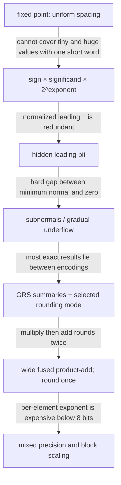

# Floating Point — The Range/Precision Trade and Its Hardware

```tikz
\usepackage{circuitikz}
\begin{document}
\begin{circuitikz}[american,thick,scale=0.78,transform shape]
  \tikzset{blk/.style={draw,rounded corners,minimum width=2.5cm,minimum height=1.5cm,align=center}}
  \node[blk] (UN) at (1.6,1.7) {unpack: sign,\\exponent,\\significand};
  \node[blk] (SP) at (5.1,1.7) {classify: zero,\\subnormal,\\inf / NaN};
  \node[blk] (AL) at (8.6,1.7) {compare\\exponents,\\then align};
  \draw[->] (-1.0,1.7) node[left]{encoded operands} -- (UN);
  \draw[->] (UN) -- (SP); \draw[->] (SP) -- (AL);
  \draw[->] (AL) -- ++(1.4,0) node[right,align=left]{continued below:\\aligned operands};

  \node[blk] (OP) at (1.6,-1.8) {add / multiply /\\fused operation};
  \node[blk] (NO) at (5.1,-1.8) {normalize +\\LZ detect};
  \node[blk] (RN) at (8.6,-1.8) {GRS +\\rounding mode};
  \node[blk] (PK) at (12.1,-1.8) {flags, overflow /\\underflow, pack};
  \draw[->] (-1.0,-1.8) node[left,align=right]{from alignment\\above} -- (OP);
  \draw[->] (OP) -- (NO); \draw[->] (NO) -- (RN); \draw[->] (RN) -- (PK);
  \draw[->] (PK) -- ++(1.0,0) node[right]{encoded result};
\end{circuitikz}
\end{document}
```

> **Prerequisites:** [Adders_and_Multipliers](03_Adders_and_Multipliers.md) (the mantissa $p\times p$ multiplier, the final CPA, and the SRT/Goldschmidt recurrences this page reuses), [Logic_Building_Blocks](02_Logic_Building_Blocks.md) (barrel shifter, leading-zero count, priority encoder), [CMOS_Fundamentals](01_CMOS_Fundamentals.md) (the area→energy argument behind §6).
> **Hands off to:** [NPU_Accelerators](../01_Architecture_and_PPA/03_NPU_Architecture/01_Compute_Dataflows/01_NPU_Accelerators.md) and [GPU_Architecture](../01_Architecture_and_PPA/02_GPU_Architecture/01_Core_Architecture/01_GPU_Architecture.md) (where these formats become MAC density and TOPS), [OoO_Execution](../01_Architecture_and_PPA/01_CPU_Architecture/03_Out_of_Order_Backend/01_OoO_Execution.md) §7 (the FPU/FMA/divide latency menu the scheduler reasons about).

**First-use vocabulary.** A **floating-point unit (FPU)** executes floating-point arithmetic. A **unit in the last place (ULP)** is the spacing between adjacent representable numbers near a value. **Guard, round, and sticky (GRS)** are the three summary bits used to decide rounding. **Round to nearest, ties to even (RNE)** is IEEE 754's usual rounding rule. A **fused multiply-add (FMA)** computes a product plus an addend with one final rounding. **NaN** means “not a number.” **Flush to zero (FTZ)** and **denormals are zero (DAZ)** replace tiny subnormal results or inputs with zero. A **multiply–accumulate (MAC)** repeatedly forms products and adds them into a running sum.

---

## 0. Why this page exists

A real computation spans an enormous dynamic range — a gravitational simulation touches $10^{-30}$ and $10^{30}$ in the same loop, a neural-net gradient and its weight differ by six orders of magnitude — but the hardware has a **fixed bit budget**. Fixed-point spends every bit on a fixed set of powers of two, so it can be either fine-grained *or* wide-ranging, never both. Floating point escapes by spending the budget on **two competing resources at once**: some bits become an **exponent** (which buys *range* — how far the number line reaches) and the rest become a **mantissa** (which buys *precision* — how finely it is resolved). That single allocation is the whole subject.

> **Every floating-point format is one point on the exponent-vs-mantissa allocation of a fixed bit budget. Move a bit to the exponent and you double the dynamic span; move it to the mantissa and you halve the relative error. Nothing else about a format is free to choose.**

This page derives IEEE-754 and the modern AI formats (TF32, FP16, BF16, FP8, MXFP, INT8) from that trade rather than from a bit-layout table, models the rounding error the trade admits ($|fl(x)-x|\le 2^{-p}|x|$), and shows why the *hardware* cost is set almost entirely by mantissa width — the multiplier area grows as $p^2$. By the end you should be able to look at a workload, say where on the range/precision line it wants to sit and why, and predict what that costs in silicon — not recite exponent-field encodings.

### 0.1 The mechanism evolves by repairing one failure at a time



This is a design argument rather than a historical timeline. At every arrow, keep the earlier contract and add the least machinery that removes its failure. That reading prevents “IEEE 754” from becoming a list of fields: the exponent exists because uniform spacing fails; the hidden bit recovers a predictable redundancy; subnormals repair an abrupt boundary; GRS bits make a finite datapath reproduce an infinitely precise rounding decision; the FMA removes an avoidable intermediate rounding; block scaling amortizes range metadata across many low-bit values.

Use the same procedural checklist for every operation below:

1. **Decode the contract:** format, rounding mode, exception behavior, and whether subnormals are supported.
2. **Carry sufficient internal information:** never discard a bit that could change the final rounded answer.
3. **Transform the exact value:** align, add or multiply, and normalize before rounding.
4. **Round once at the architectural boundary:** use retained least-significant bit plus GRS and the selected mode.
5. **Classify and pack:** apply special-case precedence and raise flags.
6. **Replay adversarial cases:** exponent gaps, complete cancellation, exact ties, overflow, underflow, infinities, and NaNs.

---

## 1. The fundamental problem: dynamic range on a fixed budget

Represent a real number in $N$ bits. **Fixed-point** places an implicit binary point at a chosen position: the representable values are $k\cdot 2^{-f}$ for integer $k$, evenly spaced by $2^{-f}$ across a total span of $2^{N-f}$. The spacing and the span are locked together — one knob, $f$, sets both. To resolve $10^{-30}$ you need $f\gtrsim 100$; to also reach $10^{30}$ you need $N\gtrsim 200$. No practical word is that wide, and most of those bits would be zero most of the time. Fixed-point wastes its budget carrying leading and trailing zeros that convey nothing.

**Floating point** stops storing the zeros. Write every nonzero number in normalized scientific form

$$
x = (-1)^{s}\;\cdot\; m \;\cdot\; 2^{e}, \qquad 1 \le m < 2,
$$

where $s$ = sign bit, $m$ = **significand** (mantissa) in $[1,2)$, $e$ = **exponent**. Store $s$, a $k$-bit field for $e$, and a $(p{-}1)$-bit field for the fraction of $m$. Now the two jobs are separated:

- the **exponent** slides the binary point, so the range is *doubly exponential* in its width, $\sim 2^{\,2^{k}}$ — 8 exponent bits already reach $10^{\pm 38}$;
- the **mantissa** resolves the number *relative to its own magnitude*: the gap between consecutive floats scales with the value. Big numbers are spaced coarsely, small numbers finely, and the **number of significant digits is roughly constant everywhere**.

That constant-relative-precision property is the reason floating point exists, and it is what lets one 32-bit word serve a physics kernel that a fixed-point word never could. The price is that most values are *not* representable exactly — they must be rounded (§4), and that rounding is the source of every numerical subtlety on this page.

The bit budget is now a partition:

$$
N = \underbrace{1}_{\text{sign}} + \underbrace{k}_{\text{exponent (range)}} + \underbrace{(p-1)}_{\text{fraction (precision)}}.
$$

Everything below is a consequence of how a given format splits $N$ between $k$ and $p$.

---

## 2. The floating-point number line: implicit bit, ULP, and machine epsilon

**The implicit bit — one free bit of precision.** Because a normalized significand always satisfies $1\le m<2$, its leading bit is *always* 1. Storing it would waste a bit, so it is not stored: the hardware prepends a "hidden" 1 to the $(p{-}1)$ stored fraction bits, giving $p$ bits of precision from $p{-}1$ bits of storage. (The single exception is subnormals, §3, whose hidden bit is 0 — which is exactly what makes them special.)

**ULP and machine epsilon.** In the binade $[2^{e},2^{e+1})$ the representable numbers are spaced by one **unit in the last place**,

$$
\mathrm{ULP}(x) = 2^{\,e-(p-1)} = 2^{e}\,\epsilon, \qquad \epsilon \equiv 2^{-(p-1)},
$$

where $\epsilon$ = **machine epsilon**, the gap between $1.0$ and the next larger float, and $p$ = significand precision (bits, including the hidden bit). The spacing scales with $2^{e}$ — the promised constant *relative* resolution.

**The rounding-error model.** Round-to-nearest maps any real $x$ (in range) to the closest float, so it errs by at most half a ULP:

$$
|fl(x)-x| \;\le\; \tfrac12\,\mathrm{ULP}(x) \;=\; \underbrace{2^{-p}}_{\;u\;}\,|x| \;=\; \tfrac12\,\epsilon\,|x|,
\qquad\Longleftrightarrow\qquad
fl(x) = x(1+\delta),\ \ |\delta|\le u,
$$

where $u=\tfrac12\epsilon=2^{-p}$ = **unit roundoff**. This is the load-bearing theorem of the whole field: **every basic operation returns its exact result perturbed by a relative error no larger than $2^{-p}$.** Why $2^{-p}$ and not something workload-dependent? Because normalization guarantees $p$ significant bits *regardless of magnitude*, so the worst-case relative error is a property of the format alone. Precision, in one number, is $p$; move one bit from mantissa to exponent and $u$ doubles.

**The canonical formats as points on the trade.** Read this table as *allocations*, not layouts — the last two columns are the whole story:

| Format | $k$ (exp) | $p{-}1$ (frac) | $p$ | Dynamic range | $u=2^{-p}$ | Decimal digits $\approx p\log_{10}2$ |
|---|---|---|---|---|---|---|
| FP64 (double) | 11 | 52 | 53 | $\pm1.8\times10^{308}$ | $2^{-53}$ | 15.9 |
| FP32 (single) | 8 | 23 | 24 | $\pm3.4\times10^{38}$ | $2^{-24}$ | 7.2 |
| TF32 (NVIDIA) | 8 | 10 | 11 | $\pm3.4\times10^{38}$ | $2^{-11}$ | 3.3 |
| FP16 (half) | 5 | 10 | 11 | $\pm6.5\times10^{4}$ | $2^{-11}$ | 3.3 |
| BF16 (bfloat16) | 8 | 7 | 8 | $\pm3.4\times10^{38}$ | $2^{-8}$ | 2.4 |
| FP8 E4M3 | 4 | 3 | 4 | $\pm448$ | $2^{-4}$ | 1.2 |
| FP8 E5M2 | 5 | 2 | 3 | $\pm5.7\times10^{4}$ | $2^{-3}$ | 0.9 |

Two pairs make the trade explicit. **FP16 vs BF16** are both 16-bit yet opposite bets: FP16 spends 5 bits on range and 10 on precision (good digits, narrow reach); BF16 spends 8 on range and 7 on precision (FP32's full reach, coarse digits). **FP8 E4M3 vs E5M2** replay the same argument inside 8 bits. Sections 6–7 explain which workloads want which side.

**Why the exponent is biased (briefly).** The exponent field stores $e+\text{bias}$ with $\text{bias}=2^{k-1}-1$ (127 for FP32, 1023 for FP64, 15 for FP16). Two reasons, both structural, neither worth a derivation: (1) a biased field is a plain *unsigned* integer, so comparing two positive floats is a single unsigned integer compare of the whole word — magnitude ordering falls out for free; (2) $2^{k-1}-1$ (not $2^{k-1}$) centers the exponent range almost symmetrically about zero, keeping the reciprocal of the largest normal representable. The two extreme exponent codes (all-zeros, all-ones) are reserved — for subnormals/zero and for infinity/NaN respectively (§3, §5).

---

## 3. Gradual underflow: why subnormals exist

Turn the smallest-normal knob and a real hazard appears. The smallest normal is $2^{\,e_{\min}}$ (for FP32, $2^{-126}$). If the next value below it were $0$, there would be a **gap** as wide as the smallest normal itself between $0$ and $2^{e_{\min}}$ — far wider than the spacing just *above* $2^{e_{\min}}$. Two distinct numbers whose difference lands in that gap would subtract to exactly $0$, breaking the property every programmer relies on:

$$
a \ne b \quad\Longrightarrow\quad a - b \ne 0.
$$

**Subnormals** (exponent field all-zeros, hidden bit $0$, value $0.f\times 2^{\,e_{\min}}$) fill the gap with values evenly spaced by the *smallest* ULP, $2^{\,e_{\min}-(p-1)}$ — the same spacing as just above $e_{\min}$. Underflow becomes **gradual**: a result drifting below the normal range loses precision one bit at a time instead of collapsing to zero in one step, and $a\ne b\Rightarrow a-b\ne0$ is restored. This is not pedantry — it is what makes `if (a != b) x = 1/(a-b);` safe.

**The hardware cost, and why throughput chips cheat.** A subnormal has *no* guaranteed leading 1, so it carries a variable number of leading zeros. That forces the FPU to run a leading-zero count and a variable pre/post-normalization shift on the underflow path, and to denormalize *before* the final rounding (else a shift after rounding double-rounds). Handled in full hardware this is a real area adder for a case most code rarely hits, so designs choose:

| Strategy | Subnormal latency | Area | IEEE-correct | Who ships it |
|---|---|---|---|---|
| Full hardware | no penalty | $+10\text{–}25\%$ FPU | yes | server/HPC CPUs |
| Microcode/trap assist | $+50\text{–}150$ cyc | minimal | yes | many x86 FPUs |
| **Flush-to-zero (FTZ/DAZ)** | no penalty | *smaller* (no case) | **no** | GPUs, DSPs, most AI datapaths |

FTZ simply forces subnormal inputs and results to zero. It abandons gradual underflow to delete the whole special case — an acceptable trade in ML, where a value at $10^{-38}$ is noise anyway, and the reason near-zero denormals essentially do not exist inside a tensor core.

---

## 4. Rounding: the half-ULP guarantee, and unbiased rounding

**Three bits round infinitely-precise results correctly.** After an aligned add or a $p\times p$ multiply the exact result can have an arbitrarily long tail below the $p$-bit significand. Remarkably, the correct round-to-nearest decision needs only three summary bits of that tail: the **Guard** (first bit past the retained significand), **Round** (second), and **Sticky** (the OR of *all* remaining bits). Sticky is the trick — it compresses the entire infinite tail into one bit answering "is anything nonzero below the round bit?", which is all any rounding rule needs to distinguish *exactly half* from *more/less than half*. For round-to-nearest-even the entire decision is one gate:

$$
\text{round\_up} \;=\; G \cdot \big(R \lor S \lor \text{LSB}\big),
$$

where LSB = least-significant retained bit. $G{=}0$: tail below half, truncate. $G{=}1$ with $R\lor S$: above half, round up. $G{=}1,\,R{=}S{=}0$: an exact tie, broken toward even (round up only if LSB is 1). The directed modes ($+\infty$, $-\infty$, toward-zero) reuse the same three bits with the sign; only their boolean differs. This is why FP datapaths carry exactly three extra bits and no more — a fact worth keeping when everything else about rounding can be re-derived.

**Why ties go to even.** Naïve "round half up" always pushes ties in the $+$ direction, injecting a systematic bias of $+\tfrac14\,\mathrm{ULP}$ per rounded tie — a DC offset that, summed over billions of operations, walks the result away from truth. Round-to-nearest-**even** sends half the ties up and half down (the neighbor with LSB $0$), so the tie bias is zero and rounding error behaves like zero-mean noise. Over a long accumulation, unbiased is worth far more than any single rounding's accuracy.

**Stochastic rounding — buying unbiasedness back at low precision.** In deep-precision formats a subtler bias dominates: when a weight $w$ in BF16/FP8 is updated by a gradient $g$ smaller than $\tfrac12\,\mathrm{ULP}(w)$, deterministic rounding maps $w+g\mapsto w$ **every time** — the update vanishes and training *stagnates* even though millions of such updates should have moved $w$. **Stochastic rounding** rounds $x$ up with probability equal to its fractional position between the two neighbors,

$$
\Pr[\,fl(x)=\lceil x\rceil_{\text{fp}}\,] = \frac{x-\lfloor x\rfloor_{\text{fp}}}{\mathrm{ULP}(x)},
\qquad\Rightarrow\qquad \mathbb{E}[fl(x)] = x,
$$

so the rounding is **unbiased in expectation**. A sub-ULP gradient now bumps the weight with a *proportional probability*; over many steps the weight moves by the correct average amount, and low-precision training converges where RNE would stall. This is why hardware RNGs are appearing next to low-precision accumulators (Graphcore IPU, several FP8 training proposals) — the rounding mode itself became a numerical-stability lever.

---

## 5. Catastrophic cancellation and the FMA

**Cancellation exposes error, it does not create it.** Subtracting two nearly-equal numbers is *exact* in hardware (Sterbenz: if $y/2\le x\le 2y$, then $x-y$ is representable with no rounding). The danger is upstream. If the operands are themselves rounded, $\hat x = x(1+\delta_x)$ and $\hat y = y(1+\delta_y)$ with $|\delta|\le u$, then

$$
\frac{|(\hat x-\hat y)-(x-y)|}{|x-y|} \;\le\; u\,\frac{|x|+|y|}{|x-y|}.
$$

When $x\approx y$ the denominator collapses while the numerator does not, so the relative error is **amplified by $(|x|+|y|)/|x-y|$**, which diverges as the operands converge. The subtraction merely strips away the agreeing leading digits, promoting the operands' pre-existing rounding error into the most significant bits of the result. The lesson is algorithmic: never compute a small quantity as the difference of two large nearly-equal ones (the quadratic formula, variance as $E[x^2]-E[x]^2$, finite differences all bite here).

Cancellation is also *why the FP adder has a close path*. When the exponent difference is $\le 1$ the result may cancel to many leading zeros, needing a full-width normalization shift driven by a leading-zero anticipator; when it is $\ge 2$ alignment dominates but normalization is trivial. The two expensive shifts never occur together, so real adders split into a **far path** (big align, tiny normalize) and a **close path** (tiny align, big normalize) and pick the winner — a concrete payoff of the cancellation analysis, not a bag of stages to memorize.

**The FMA: one rounding instead of two.** A **fused multiply-add** computes

$$
\text{fma}(a,b,c) = fl(a\cdot b + c)
$$

with a **single** rounding of the *exact* product-plus-addend, versus $fl(fl(a\cdot b)+c)$'s two. This matters for three compounding reasons:

1. **Accuracy per term.** A dot product accumulated with FMA rounds once per term, not twice, roughly halving the error constant; more importantly the intermediate product is never truncated to $p$ bits before it is added.
2. **Error-free transforms.** Because the product is kept exact internally, $p=fl(a\cdot b)$ and $e=\text{fma}(a,b,-p)$ together give $a\cdot b = p+e$ **exactly** — the rounding error is *recovered as a number*. This "2Product" is the foundation of compensated (Kahan) summation and double-double arithmetic (§6).
3. **Cheap iterative refinement.** Newton/Goldschmidt reciprocal and square-root steps are chains of $\text{fma}(-b,x,1)$ that would lose their meaning if the product were pre-rounded.

**Why the FMA is area-expensive.** The addend $c$ must align against the *full* $2p$-bit product before rounding, so the internal adder spans product width plus alignment range — roughly $3p$ bits (about 74 for FP32, 161 for FP64) against a bare FP adder's $p{+}3$. That wide carry-propagate add is usually the FMA's critical path and buys it $\sim 1{-}2$ cycles of latency over a plain multiply. Designs pay it anyway because one fused instruction with one rounding is both faster and *more accurate* than two — which is why the FMA, not the standalone multiply-then-add, is the primitive every modern datapath exposes. The multiplier tree feeding it (radix-4 Booth → Dadda → sparse-prefix CPA) is derived in [Adders_and_Multipliers](03_Adders_and_Multipliers.md) §7.

---

## 6. The hardware cost: everything scales with mantissa width squared

Here is why the whole industry moved to low precision. Decompose an FP multiplier:

- **Exponent path:** a $k$-bit add ($e_a+e_b-\text{bias}$). Area $\propto k$, and $k$ is single digits — negligible.
- **Sign:** one XOR.
- **Mantissa path:** a $p\times p$ unsigned multiply. A multiplier is an $O(p^2)$ array of partial-product bits reduced by a compressor tree, so both **area and switching energy scale as $p^2$.**

$$
A_{\text{mul}} \;\sim\; p^2, \qquad E_{\text{mul}} \;\sim\; p^2,
$$

where $p$ = significand width. The exponent — the thing that buys *range* — is almost free; the mantissa — the thing that buys *precision* — is quadratically expensive. **Cutting precision is the single most powerful area/energy lever in an arithmetic datapath**, and it cuts quadratically:

| Format | $p$ | $p^2$ (mantissa mult.) | vs FP32 | MACs in FP32's area |
|---|---|---|---|---|
| FP32 | 24 | 576 | $1\times$ | $1\times$ |
| TF32 / FP16 | 11 | 121 | $0.21\times$ | $\sim4.8\times$ |
| BF16 | 8 | 64 | $0.11\times$ | $\sim9\times$ |
| FP8 E4M3 | 4 | 16 | $0.028\times$ | $\sim36\times$ |
| FP8 E5M2 | 3 | 9 | $0.016\times$ | $\sim64\times$ |

Nine BF16 multipliers or thirty-six FP8 multipliers fit where one FP32 multiplier sat — *this* is the arithmetic behind the headline TOPS of AI chips, and it comes almost entirely from shrinking $p$ (the roughly-constant 8-bit exponent rides along cheaply). The full-datapath overhead (align shifter, LZC, rounding, special-case logic) makes an FP32 add $\sim12\times$ and an FP32 multiply $\sim40\times$ the area of the corresponding INT32 op, but those adders are linear in $p$; the $p^2$ multiplier is what dominates and what reduced precision attacks.

**But you cannot reduce the accumulator the same way.** Sum $n$ products each carrying relative error $\le u$. Worst-case error accumulates linearly and, for rounding that behaves like zero-mean noise, in RMS as a random walk:

$$
\big|\hat S_n - S_n\big| \;\lesssim\; (n-1)\,u\sum_i|t_i|
\quad\text{(worst case)}, \qquad
\text{RMS error} \;\sim\; \sqrt{n}\,u\,\|t\|
\quad\text{(stochastic)},
$$

where $t_i$ = the terms and $u$ = the *accumulator's* unit roundoff. Two consequences. First, error grows with $n$, so the accumulator's $u$ must be small enough that $n\,u\ll1$ over the longest reduction — a 4096-long dot product in FP8 ($u=2^{-4}$) would be pure noise. Second, **swamping**: once the running sum greatly exceeds the next term, that term falls entirely below the sum's ULP and rounds away — adding it in the *product's* precision loses it completely. The fix is structural and universal: **multiply in low precision, accumulate in a wide one.** Every tensor core takes BF16/FP8/INT8 inputs and accumulates in FP32; the accumulator keeps the range and the $n\,u$ headroom the cheap multiplier cannot. Kahan (compensated) summation is the software mirror — it uses the §5 error-free transform to capture each addition's lost low bits and fold them back, making an $n$-term sum behave like $O(u)$ instead of $O(n\,u)$. The MAC array that arranges this in space is [NPU_Accelerators](../01_Architecture_and_PPA/03_NPU_Architecture/01_Compute_Dataflows/01_NPU_Accelerators.md) §2; the carry-save accumulation inside it is [Adders_and_Multipliers](03_Adders_and_Multipliers.md) §6.

---

## 7. The AI-format landscape: the trade, applied

With the cost model in hand, every modern format is a *deliberate* point on the range/precision line, chosen for a workload. The organizing insight:

> **Training pushes toward the exponent (range) end; inference tolerates the mantissa (precision) end.** Gradients span many orders of magnitude and must neither overflow nor underflow to zero, so training pays for range. Inference activations are bounded and can be calibrated offline, so inference spends its few bits on precision — or drops the per-element exponent entirely.

Walking the line from FP32 outward:

- **TF32 (NVIDIA, Ampere+).** Keep FP32's 8-bit exponent (full range, drop-in) but truncate the mantissa to 10 bits, so the multiplier is $11\times11$ instead of $24\times24$ ($\sim4.8\times$ smaller) — while **accumulating in FP32**. A matmul silently runs on the tensor cores at a few-times-FP32 throughput with $\sim3$ decimal digits, no code change. TF32 is the purest illustration that *range is cheap and mantissa is what you pay for*.
- **FP16 vs BF16 — the training-format decision.** FP16 keeps 10 mantissa bits but only a 5-bit exponent (max $\approx65504$); training gradients routinely exceed that, so FP16 training needs **loss scaling** (multiply the loss up before the backward pass, divide out after) to keep gradients off the overflow/underflow rails. **BF16** instead keeps FP32's 8-bit exponent and spends only 7 bits on mantissa: gradients never overflow, **no loss scaling**, and the coarse mantissa even acts as mild regularization. That is why BF16 became the training default — Google TPU (v2, 2017), NVIDIA A100 (2020), and essentially every framework's mixed-precision path. The FP32 master weights still hold the precision; BF16 supplies the cheap range-preserving multiply.
- **FP8 E4M3 vs E5M2 — the same choice at 8 bits.** The OCP FP8 standard (2022; NVIDIA, AMD, Intel, Arm, others) ships *both* on purpose. **E4M3** (4-bit exp, 3-bit mantissa, range $\pm448$) has the extra mantissa bit — used for **forward-pass weights and activations**, which need precision within a bounded range. **E5M2** (5-bit exp, 2-bit mantissa, range $\pm5.7\times10^4$) has the extra exponent bit — used for **backward-pass gradients**, which need range above all. NVIDIA Hopper H100 (2022), AMD MI300, and Intel Gaudi run FP8 tensor cores that switch format by tensor/phase — the datapath literally re-allocates the bit between range and precision per operation.
- **MXFP / microscaling (OCP MX, 2023) — factoring range out of the element.** Below 8 bits, a per-element exponent is too coarse to carry both range and precision. Microscaling shares **one 8-bit scale across a block of 32 elements**; each element stores only its value *relative to the block*, so the block scale reconstitutes the dynamic range the tiny per-element field lost, and every element bit goes to precision:

$$
x_i = s_{\text{block}}\cdot m_i,\qquad \text{avg bits/elem} = b_{\text{elem}} + \tfrac{8}{32},
$$

so MXFP4 costs $4.25$ bits/element yet spans a useful range. Variants MXFP8/6/4 and NVIDIA's NVFP4 (Blackwell, 2024) push training and inference below the byte. Microscaling is the current frontier precisely because it *decouples* the two resources this whole page has been trading against — range lives in the shared scale, precision in the element.
- **INT8 — the degenerate case with no per-element exponent.** INT8 quantization drops the exponent entirely: a per-tensor or per-channel scale plus a uniform 8-bit integer grid. Within its (fixed, calibrated) range it resolves *more* finely than FP8 (all 8 bits are mantissa-like), but it has no per-element range at all, so it wins only where the value distribution is well-behaved and calibratable — classic post-training inference. TPUv1 was a $256\times256$ INT8 systolic array at 92 TOPS (Jouppi et al., 2017). MX-INT8 is the block-scaled compromise between INT8's density and FP8's per-block range.

| Workload | Format | Why (range vs precision) |
|---|---|---|
| Training, general | BF16 (FP32 master) | gradients need FP32 range; no loss scaling |
| Training, aggressive | FP8 E4M3 fwd / E5M2 bwd | per-phase range/precision split; FP32 accumulate |
| Frontier low-bit training/inference | MXFP8 / MXFP6 / MXFP4 | shared scale restores range below 8 bits |
| Inference, accuracy | FP16 or INT8 | bounded activations; calibrated |
| Inference, throughput | FP8 / MXFP4 / INT4 | max MAC density, accuracy loss $1\text{–}3\%$ tolerable |
| Scientific / HPC | FP64 | convergence needs $\sim16$ digits |

Two rules survive every format above and are the takeaways to keep: **the multiplier shrinks as $p^2$ (§6), and the accumulator stays wide (FP32) no matter how small the inputs get.** How these formats turn into MAC density, TOPS, and roofline behavior is [NPU_Accelerators](../01_Architecture_and_PPA/03_NPU_Architecture/01_Compute_Dataflows/01_NPU_Accelerators.md) and [GPU_Architecture](../01_Architecture_and_PPA/02_GPU_Architecture/01_Core_Architecture/01_GPU_Architecture.md); this page's job is the arithmetic that makes them safe.

---

## 8. Operations: multiply, add, divide, and the elementary functions

The mechanisms follow from the format; none needs a pipeline dump.

**Multiply** is the easy one because the format *is* multiplicative: sign $=s_a\oplus s_b$, exponent $=e_a+e_b-\text{bias}$, significand $=m_a\cdot m_b\in[1,4)$ (one possible normalize bit), then round (§4). The $p\times p$ significand multiply is the entire cost and the entire $p^2$ story of §6.

**Add** is the hard one because it is *not* aligned to the format: the smaller operand must be shifted to the larger's exponent (a barrel shift — the wide, expensive stage), then added, then re-normalized (the leading-zero-count + shift that cancellation, §5, makes large). Alignment and normalization are the two costs, they trade against the exponent difference, and the dual-path adder (§5) exists to never pay both at once.

### 8.1 A floating-point addition, exactly as hardware performs it

Start with an intentionally easy binary example so every internal bit is visible:

$$
a=1.5=1.100_2\times2^0,\qquad b=0.375=1.100_2\times2^{-2}.
$$

Assume a toy format with four retained significand bits including the hidden 1. The datapath does not “add two floating-point words.” It turns them into aligned fixed-point integers, operates on those integers, then constructs a new floating-point word:

| Step | Owned state | Operation | State after step |
|---|---|---|---|
| 1. classify/unpack | signs, unbiased exponents, significands | detect zero/subnormal/infinity/NaN; restore hidden bits | $m_a=1.100$, $e_a=0$; $m_b=1.100$, $e_b=-2$ |
| 2. compare exponents | $\Delta=e_a-e_b=2$ | choose $e_a$ as working exponent | common exponent $0$ |
| 3. align smaller | extended $m_b$ plus GRS positions | right-shift by two; OR discarded low bits into sticky | $m_b'=0.01100$ |
| 4. add magnitudes | aligned extended significands | $1.10000+0.01100$ | $1.11100$ |
| 5. normalize | raw sum and leading-one position | shift until result is in $[1,2)$; adjust exponent oppositely | already $1.11100\times2^0$ |
| 6. round | retained `1.111`, $G=R=S=0$ | apply RNE equation from §4 | no increment |
| 7. pack | sign, biased exponent, stored fraction | remove hidden 1 and encode | $1.111_2=1.875$ |

The same hardware must also survive a case where alignment loses visible digits. In a four-bit significand, suppose the normalized pre-round value is `1.010 100...`: retained bits are `1.010`, so retained LSB $=0$, $G=1$, $R=0$, $S=0$. This is an **exact tie**. RNE leaves the result at `1.010` because that neighbor is even. For `1.011 100...`, the retained LSB is 1, so the identical tie increments to `1.100`; the two tie directions balance. If any later discarded bit were 1, sticky would become 1 and the case would be “above half,” not a tie.

The concrete adder pipeline is therefore a composition of hardware already derived in the preceding pages:

```tikz
\usepackage{circuitikz}
\begin{document}
\begin{circuitikz}[american,thick,scale=0.82,transform shape]
  \tikzset{fpblock/.style={draw,rounded corners,minimum width=2.15cm,minimum height=1.05cm,align=center}}
  \node[fpblock] (un) at (0,1.5) {classify\\and unpack};
  \node[fpblock] (cmp) at (3.0,1.5) {exponent\\compare};
  \node[fpblock] (shr) at (6.0,1.5) {right barrel\\shift + sticky};
  \node[fpblock] (add) at (9.0,1.5) {add/subtract\\significands};
  \node[fpblock] (lzd) at (0,-1.5) {leading-zero\\detect + shift};
  \node[fpblock] (rnd) at (3.2,-1.5) {GRS decision\\+ increment};
  \node[fpblock] (pack) at (6.4,-1.5) {flags\\and pack};
  \draw[->] (un) -- (cmp); \node at (1.5,2.45){fields};
  \draw[->] (cmp) -- (shr); \node at (4.5,2.45){$\Delta e$};
  \draw[->] (shr) -- (add); \node at (7.5,2.45){aligned};
  \draw[->] (add) -- ++(1.1,0) node[right,align=left]{raw sum\\continued below};
  \draw[->] (-1.1,-1.5) node[left,align=right]{from add\\above} -- (lzd);
  \draw[->] (lzd) -- (rnd); \node at (1.6,-0.45){normalized + GRS};
  \draw[->] (rnd) -- (pack); \node at (4.8,-0.45){rounded};
  \draw[->] (un.south) -- ++(0,-0.45) -- ++(-1.2,0) -- ++(0,-3.0) -| node[pos=0.25,below]{signs and special-case class} (pack.south);
\end{circuitikz}
\end{document}
```

This figure is a **hardware ownership map**, not a promise that each box is exactly one cycle. Pipeline registers are inserted to balance the delay of the barrel shifter, significand adder, normalization network, and round incrementer. A typical five-stage implementation might schedule the same transaction like this:

```wavedrom
{ "signal": [
  { "name": "cycle",        "wave": "p......" },
  { "name": "input valid",  "wave": "010...." },
  { "name": "unpack",       "wave": "x3x....", "data": ["a,b"] },
  { "name": "align",        "wave": "x.3x...", "data": ["delta-e=2"] },
  { "name": "add",          "wave": "x..3x..", "data": ["1.11100"] },
  { "name": "normalize",    "wave": "x...3x.", "data": ["shift 0"] },
  { "name": "round / pack", "wave": "x....3x", "data": ["1.875"] },
  { "name": "output valid", "wave": "0....10" }
], "head": { "text": "One FP add moving through a five-stage pipeline; later independent operations may enter every cycle" } }
```

**Implementation tradeoffs.** A single path is smaller and easier to verify, but it puts a full alignment shifter and a full normalization shifter in series. A far/close dual path evaluates the likely normalization cases in parallel and multiplexes the answer, shortening the clock period at extra area and switching energy. A leading-zero anticipator predicts the cancellation shift in parallel with subtraction, accepting a possible one-bit correction to remove a serial leading-zero count. Pipeline depth improves clock frequency and throughput but increases latency, bypass complexity, exception bookkeeping, and energy in registers and clock trees.

**Verification obligations.** Compare the packed result and all exception flags against a bit-exact reference model for every supported rounding mode. Bias random tests toward exponent differences near $0$, $1$, $p$, and greater than $p$; opposite-sign operands that cancel to zero or one ULP; exact-half GRS patterns; largest finite operands; the normal/subnormal boundary; both signed zeros; and every infinity/NaN combination. Also assert that a stalled pipeline preserves the operands, rounding mode, and transaction tag together—an arithmetically correct result attached to the wrong instruction is still a design failure.

### 8.2 Why a fused multiply-add is physically different from “multiplier then adder”

```tikz
\usepackage{circuitikz}
\begin{document}
\begin{circuitikz}[american,thick,scale=0.8,transform shape]
  \tikzset{fpblock/.style={draw,rounded corners,minimum width=2.0cm,minimum height=0.95cm,align=center}}
  \node[fpblock] (mul0) at (0,1.4) {$p\times p$\\multiplier};
  \node[fpblock] (r0) at (3.0,1.4) {normalize\\and round};
  \node[fpblock] (a0) at (6.0,1.4) {$p$-bit\\FP add};
  \node[fpblock] (r1) at (9.0,1.4) {normalize\\and round};
  \draw[->] (mul0) -- (r0);
  \draw[->] (r0) -- (a0); \node at (4.5,2.35) {rounded product};
  \draw[->] (a0) -- (r1);
  \node[left] at (-1.15,1.4) {$a,b$};
  \node[above] at (6.0,2.0) {$c$};
  \draw[->] (6.0,2.0) -- (a0.north);

  \node[fpblock] (mul1) at (0,-1.4) {$p\times p$\\multiplier};
  \node[fpblock,minimum width=2.6cm] (wide) at (3.6,-1.4) {carry-save / wide\\product + aligned $c$};
  \node[fpblock] (one) at (7.1,-1.4) {normalize\\and round once};
  \draw[->] (mul1) -- node[above]{$2p$ bits} (wide);
  \draw[->] (wide) -- (one);
  \node[left] at (-1.15,-1.4) {$a,b$};
  \node[above] at (3.6,-0.8) {$c$};
  \draw[->] (3.6,-0.8) -- (wide.north);
  \node[right,align=left] at (10.1,1.4) {separate operations:\\two roundings};
  \node[right,align=left] at (8.4,-1.4) {fused path:\\one architectural rounding};
\end{circuitikz}
\end{document}
```

The upper path destroys low product bits before $c$ arrives; no later adder can reconstruct them. The lower path retains the full product, aligns $c$ to that wider internal scale, inserts it alongside the multiplier's partial-product rows in carry-save form (or into an equivalent wide adder), performs one final carry-propagate addition, then normalizes and rounds. Replicating an FMA therefore requires a wider internal format and a single rounding boundary—not merely issuing a multiply and an add in adjacent cycles.

**Divide and square root** are not polynomial in the operands, so they are slow and come in two families. **Digit recurrence (SRT)** retires a couple of quotient bits per step from a redundant partial remainder — inherently serial (each step depends on the last), which is why divide is $\sim10\text{–}40$ cycles, non-pipelined, and scheduled around rather than sped up (see the divide argument in [Adders_and_Multipliers](03_Adders_and_Multipliers.md) §7 and the latency menu in [OoO_Execution](../01_Architecture_and_PPA/01_CPU_Architecture/03_Out_of_Order_Backend/01_OoO_Execution.md) §7). **Multiplicative (Newton–Raphson / Goldschmidt)** instead refines a reciprocal from a small seed LUT, **doubling the correct bits each iteration** — quadratic convergence, because the error obeys

$$
e_{i+1} = B\,e_i^{2}\quad(\text{Newton, } X_{i+1}=X_i(2-B X_i)),
$$

so an 8-bit seed reaches FP32 in 2 iterations and FP64 in 3, each iteration a pair of FMAs (§5). Historical footnote worth its one sentence: the 1994 **Pentium FDIV bug** was five missing entries in exactly the SRT quotient-selection table above — a reminder that the recurrence's lookup table must be *formally* verified, because a handful of wrong entries produce errors in one division in nine billion.

Synthesizable IP for all of this exists off the shelf — Synopsys **DesignWare** (`DW_fp_*`), Berkeley **HardFloat** (the RISC-V BOOM/Rocket FPUs), and **FloPoCo** for FPGA — parameterized by $(k,p)$ and pipeline depth, where deeper pipelines buy frequency at the cost of latency exactly as in [Adders_and_Multipliers](03_Adders_and_Multipliers.md) §8.

### 8.3 Elementary functions: range reduction, polynomials, tables, and CORDIC

Divide and $\sqrt{\ }$ are the first members of a larger family — $\exp,\log,\sin,\cos,2^x,\log_2 x,1/x,1/\sqrt{x}$ — that no single multiply-add computes. Their hardware (a GPU's **special-function unit (SFU)**, a DSP's transcendental block, an NPU's activation/exponential unit) is built from one recipe in three steps, and the real design choice lives in step 2.

**The recipe: reduce → approximate → reconstruct.** A polynomial or table accurate over the whole real line is hopeless — it would need astronomically many terms. So every unit first **range-reduces** the argument to a small interval using the function's own identity, approximates there, then reconstructs:

- $e^x$: write $x=k\ln2+r$ with $k=\mathrm{round}(x/\ln2)$ and $r\in[-\tfrac{\ln2}{2},\tfrac{\ln2}{2}]$; then $e^x=2^k e^r$, where $2^k$ is a free exponent add and only $e^r$ on the tiny interval is approximated ($2^x$ splits as $2^{\lfloor x\rfloor}2^{\{x\}}$ the same way).
- $\log_2(m\cdot2^e)=e+\log_2 m$ with $m\in[1,2)$: the exponent $e$ is extracted for free, only $\log_2 m$ on $[1,2)$ is approximated.
- $\sin,\cos$: reduce $x$ modulo $\pi/2$ and track the quadrant. For **large** arguments this subtraction *is* the whole difficulty — $x-N\tfrac{\pi}{2}$ catastrophically cancels (§5) unless $\pi/2$ is carried to extra precision (the Payne–Hanek reduction). Range reduction, not the polynomial, is where transcendental units are most often wrong.

**Step 2 — three ways to approximate on the reduced interval**, and this is the architectural decision:

- **Minimax polynomial.** Evaluate a low-degree polynomial by Horner/Estrin, reusing the existing FMA (§5) — so on a machine that already has a multiplier this is almost free silicon. The coefficients are **minimax** (Remez), not Taylor: Taylor is optimal only *at* the expansion point, while the Remez polynomial equioscillates to minimise *worst-case* error across the whole interval, meeting a target ULP at the lowest degree. Latency $=$ degree $\times$ FMA.
- **Table + interpolation.** A LUT indexed by the argument's high bits returns a base value plus a slope (and, for one order more, a curvature); a linear or quadratic interpolation on the low bits finishes it. The canonical GPU SFU (Oberman–Siu) computes $1/x,\,1/\sqrt{x},\,2^x,\,\log_2 x,\,\sin,\cos$ by **quadratic interpolation** on small tables in a couple of cycles with one narrow multiplier — trading SRAM for arithmetic. At very low precision the tables go *add-only* (bipartite/multipartite), dropping the multiplier entirely.
- **CORDIC (shift-and-add).** Iterate a sequence of micro-rotations built from only **adds and barrel shifts** — no multiplier at all. Circular mode yields $\sin,\cos,\arctan$ and vector magnitude; hyperbolic mode yields $\exp,\log,\sinh,\cosh,\sqrt{\ }$; linear mode yields multiply and divide. It retires **one bit of accuracy per iteration** (linear convergence), so latency scales with precision — the area-minimal choice for an FPGA/DSP block with no spare multiplier, and the one that loses to table-plus-polynomial whenever a multiplier is already on the floor.

**The reciprocal/root family is special: seed, then square the error.** For $1/x,\sqrt{x},1/\sqrt{x}$ a very coarse seed — a tiny LUT, or the famous $\mathtt{0x5f3759df}$ bit hack that reads a float's exponent field as a linear estimate of $-\tfrac12\log_2 x$ — is refined by **Newton–Raphson / Goldschmidt**, each iteration a pair of FMAs that *doubles* the correct bits (the quadratic $e_{i+1}=Be_i^2$ of the divide unit above). Two to three iterations from an 8-bit seed reach FP32/FP64, which is why an SFU's job is often just to produce a good *seed* and let the FMA pipeline finish the refinement.

**Accuracy is an architectural specification, not an afterthought.** The unit's contract — its **ULP error bound**, whether it is **monotonic**, whether it is correctly rounded ($<0.5$ ULP) or merely *faithful* ($\le1$ ULP), and how it handles $0,\infty,$ NaN and out-of-domain inputs ($\log$ of a negative) — is fixed at design time and trades directly against area and latency. A GPU's fast `__expf` (a few ULP, one SFU pass) and a correctly-rounded `libm exp` ($<0.5$ ULP, a longer compensated polynomial) are *different hardware/software contracts for the same function*, chosen by whether the workload is a neural-net activation (loose) or a scientific kernel (tight) — the same "accuracy policy is part of architecture" point the NPU exponential unit makes ([Transformer and Attention Engine Microarchitecture](../01_Architecture_and_PPA/03_NPU_Architecture/01_Compute_Dataflows/03_Transformer_and_Attention_Engine_Microarchitecture.md)).

| Method | Ops used | Latency | Area | Best when |
|---|---|---|---|---|
| Minimax polynomial | FMA (existing) | degree × FMA | ~0 extra (reuses MUL) | a multiplier already exists; moderate degree |
| Table + interpolation | small LUT + narrow MUL | 1–few cycles | SRAM-heavy | high throughput, fixed function set (GPU SFU) |
| CORDIC | adds + shifts | ∝ precision | tiny, no MUL | no spare multiplier (FPGA/DSP) |
| Newton / Goldschmidt | FMA + seed LUT | 2–3 × FMA | seed table | reciprocal, sqrt, rsqrt |

---

## 9. Special values: keeping the algebra total

The reserved exponent codes (all-ones) exist so that arithmetic is **closed** — every operation returns *something*, so the hardware never has to trap mid-datapath. Three cases, one idea:

- **$\pm\infty$** (exp all-ones, fraction $0$) is the saturating result of overflow and of $x/0$. It lets a computation run past an overflow and report a recognizable result rather than a wrong finite one.
- **NaN** (exp all-ones, fraction $\ne0$) is the result of the genuinely undefined — $0/0$, $\infty-\infty$, $\sqrt{-1}$ — and it **propagates**: any operation with a NaN input yields NaN, so a single undefined value taints the downstream result instead of silently corrupting it. (The fraction's top bit distinguishes *quiet* NaNs, which propagate silently, from *signaling* NaNs, which raise an invalid-operation flag first — the mechanism behind "poison a buffer with sNaN to catch uninitialized reads.") NaN is also *unordered*: every comparison with it is false, so `x != x` is the canonical NaN test and any sort assuming trichotomy must special-case it.
- **$\pm0$** — signed zero — records the *direction* from which a value underflowed, which matters at branch cuts: $1/(+0)=+\infty$ but $1/(-0)=-\infty$, and $\sqrt{-1\pm 0i}$ lands on opposite sides. It costs a few gates of sign logic and $+0=-0$ compares true.

These are not a rules table to memorize; they are three encodings that make the FP number system *total*, so the pipeline can produce a defined answer for every input without stalling to a handler.

---

## 10. Numbers to memorize

| Quantity | Value | Note |
|---|---|---|
| FP32 layout / bias | 1 · 8 · 23, bias 127 | $p=24$ |
| FP32 exponent range | $-126$ to $+127$ | subnormals at $2^{-126}$ down to $2^{-149}$ |
| FP32 unit roundoff $u=2^{-p}$ | $2^{-24}\approx6\times10^{-8}$ | machine eps $\epsilon=2^{-23}$ |
| FP32 max / min-normal | $3.4\times10^{38}$ / $1.18\times10^{-38}$ | $\sim7.2$ decimal digits |
| FP64 layout / bias | 1 · 11 · 52, bias 1023 | $p=53$, $\sim16$ digits, $u=2^{-53}$ |
| BF16 | 1 · 8 · 7, bias 127 | FP32 range, $\sim2.4$ digits, $u=2^{-8}$ |
| FP16 | 1 · 5 · 10, bias 15 | max $65504$, $\sim3.3$ digits |
| TF32 | 1 · 8 · 10 (19 b) | FP32 range, FP32 accumulate |
| FP8 E4M3 / E5M2 | $\pm448$ / $\pm5.7\times10^4$ | fwd-weights / gradients |
| MX block | 32 elems · 1 shared 8-b scale | MXFP4 $=4.25$ b/elem |
| Multiplier area / energy | $\propto p^{2}$ | BF16 $\sim9\times$, FP8 $\sim36\times$ denser than FP32 |
| Rounding bound | $\lvert fl(x)-x\rvert\le 2^{-p}\lvert x\rvert$ | RNE, half a ULP |
| GRS bits | 3 (Guard, Round, Sticky) | suffice for all modes |
| FP32 add / mul latency | $3\text{–}5$ / $4\text{–}5$ cyc | pipelined |
| FP32 FMA latency | $4\text{–}7$ cyc | wide $\sim3p$-bit adder |
| FP32 divide / sqrt | $14\text{–}28$ cyc | serial SRT, non-pipelined |
| Accumulator rule | inputs low-precision, **sum in FP32** | error grows as $\sqrt{n}\,u$ |

---

## 11. Cross-references

- **Down the stack (what this is built from):** [Adders_and_Multipliers](03_Adders_and_Multipliers.md) (the $p\times p$ Booth+Dadda mantissa multiplier and final CPA whose $p^2$ area is §6, the CSA accumulation, and the SRT/Goldschmidt recurrences of §8), [Logic_Building_Blocks](02_Logic_Building_Blocks.md) (barrel shifter for alignment, leading-zero count/anticipator for the close path, priority encoder), [CMOS_Fundamentals](01_CMOS_Fundamentals.md) (the area→energy relation and FO4 timing behind the cost model).
- **Up the stack (what builds on this):** [NPU_Accelerators](../01_Architecture_and_PPA/03_NPU_Architecture/01_Compute_Dataflows/01_NPU_Accelerators.md) and [GPU_Architecture](../01_Architecture_and_PPA/02_GPU_Architecture/01_Core_Architecture/01_GPU_Architecture.md) (where §6–§7's mantissa-$p^2$ economics and FP32-accumulate rule become MAC density, tensor-core throughput, and roofline behavior), [OoO_Execution](../01_Architecture_and_PPA/01_CPU_Architecture/03_Out_of_Order_Backend/01_OoO_Execution.md) §7 (the FPU/FMA/divide entries of the latency/throughput menu the scheduler reasons about).
- **Adjacent / prerequisite:** [RISC_V_ISA](../01_Architecture_and_PPA/01_CPU_Architecture/01_Core_Foundations/02_RISC_V_ISA.md) (the F/D extension, `frm` rounding-mode field, and FCVT conversion semantics that expose this hardware), [CPU_Architecture](../01_Architecture_and_PPA/01_CPU_Architecture/01_Core_Foundations/01_CPU_Architecture.md) (the separate FP register namespace and pipeline this unit plugs into).

---

## References

1. IEEE, *Standard for Floating-Point Arithmetic (IEEE 754-2019).* The normative source for formats, rounding, subnormals, and special values.
2. Goldberg, D., "What Every Computer Scientist Should Know About Floating-Point Arithmetic," *ACM Computing Surveys*, 23(1), 1991. The ULP/epsilon and cancellation models of §2–§5.
3. Higham, N.J., *Accuracy and Stability of Numerical Algorithms*, 2nd ed., SIAM, 2002. Error-growth, compensated summation, and the FMA error-free transform of §5–§6.
4. Muller, J.-M. et al., *Handbook of Floating-Point Arithmetic*, 2nd ed., Birkhäuser, 2018. Dual-path adder, GRS rounding, SRT/Goldschmidt division.
5. Kalamkar, D. et al., "A Study of BFLOAT16 for Deep Learning Training," arXiv:1905.12322, 2019. The BF16 range argument of §7.
6. Micikevicius, P. et al., "FP8 Formats for Deep Learning," arXiv:2209.05433, 2022. The E4M3/E5M2 split.
7. Open Compute Project, *OCP Microscaling (MX) Formats Specification v1.0*, 2023. The block-scaled MXFP formats of §7.
8. Gupta, S. et al., "Deep Learning with Limited Numerical Precision," ICML 2015. Stochastic rounding for low-precision training (§4).
9. Muller, J.-M., *Elementary Functions: Algorithms and Implementation*, 3rd ed., Birkhäuser, 2016. Range reduction, minimax/Remez, table methods, and CORDIC of §8.3.
10. Oberman, S.F. and Siu, M.Y., "A High-Performance Area-Efficient Multifunction Interpolator," *IEEE Symposium on Computer Arithmetic (ARITH-17)*, 2005. The quadratic-interpolation GPU SFU of §8.3.
11. Walther, J.S., "A unified algorithm for elementary functions," *AFIPS Spring Joint Computer Conference*, 1971. The unified circular/linear/hyperbolic CORDIC of §8.3.
