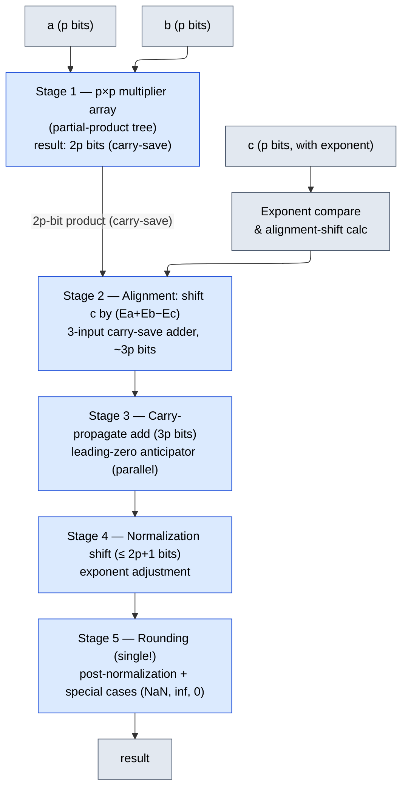

# Floating Point Arithmetic — Deep Dive for IC Design

## IEEE 754 Format — Beyond the Basics

### Why Bias = 127 (Not 128)?

For 8-bit exponent, exponent values 0 and 255 are reserved (for denorms/zero and inf/NaN respectively). Usable exponent range: 1 to 254.

The actual exponent range is: `E_actual = E_stored - bias`, so:
```text
E_actual_min = 1 - bias
E_actual_max = 254 - bias
```

We want the range to be roughly symmetric around 0. With bias = 127:
```text
E_actual_min = 1 - 127 = -126
E_actual_max = 254 - 127 = +127
```

Range: [-126, +127] — nearly symmetric, with one more positive value.

With bias = 128:
```text
E_actual_min = 1 - 128 = -127
E_actual_max = 254 - 128 = +126
```

Range: [-127, +126] — biased toward negative exponents.

**The choice bias = 2^(k-1) - 1 (not 2^(k-1))** ensures the maximum positive exponent magnitude is as large as the maximum negative, which is important because:
1. The reciprocal of the largest representable number should be representable (or at least close to it): 2^127 ≈ 1.7e38, and 2^(-126) ≈ 1.2e-38 — both in range.
2. With bias=128, 2^126 * 2^(-127) would result in 2^(-1) (fine), but 2^126 * 2^126 = 2^252 > 2^126 (overflow with bias=128's max of +126), while with bias=127, 2^127 * 2^(-127) = 1, and 2^127 * 2^127 overflows but that's expected.
3. Historical convention from the original IEEE 754-1985 committee deliberations.

### Actual Bit Patterns for Edge Cases (Single Precision)

**Positive zero: +0**
```text
S=0, E=0000_0000, M=000_0000_0000_0000_0000_0000
Hex: 0x00000000
Value: +0
```

**Negative zero: -0**
```text
S=1, E=0000_0000, M=000_0000_0000_0000_0000_0000
Hex: 0x80000000
Value: -0 (compares equal to +0 by IEEE rules, but sign bit differs)
```

**Smallest positive denormal:**
```text
S=0, E=0000_0000, M=000_0000_0000_0000_0000_0001
Hex: 0x00000001
Value: 0.000...001 (binary) * 2^(-126) = 2^(-23) * 2^(-126) = 2^(-149)
     ≈ 1.401298e-45
```

**Largest denormal:**
```text
S=0, E=0000_0000, M=111_1111_1111_1111_1111_1111
Hex: 0x007FFFFF
Value: 0.111...111 * 2^(-126) = (1 - 2^(-23)) * 2^(-126)
     ≈ 1.175494e-38
```

**Smallest positive normal:**
```text
S=0, E=0000_0001, M=000_0000_0000_0000_0000_0000
Hex: 0x00800000
Value: 1.0 * 2^(1-127) = 2^(-126)
     ≈ 1.175494e-38
```

**Transition from denormal to normal:**
```text
Largest denorm: 0.111...111 * 2^(-126)                = (1 - 2^(-23)) * 2^(-126)
Smallest normal: 1.000...000 * 2^(-126)               = 1.0 * 2^(-126)

Gap between them: 2^(-126) - (1 - 2^(-23)) * 2^(-126) = 2^(-23) * 2^(-126) = 2^(-149)
This equals exactly 1 ULP of the denormal range — CONTINUOUS! No gap.
```

This is the entire point of denormals: **gradual underflow**. Without denormals, there would be a gap from 0 to 2^(-126), and the property `a - b == 0 implies a == b` would break.

**Largest normal:**
```text
S=0, E=1111_1110 (=254), M=111_1111_1111_1111_1111_1111
Hex: 0x7F7FFFFF
Value: 1.111...111 * 2^(254-127) = (2 - 2^(-23)) * 2^127
     ≈ 3.402823e+38
```

**Positive infinity:**
```text
S=0, E=1111_1111, M=000_0000_0000_0000_0000_0000
Hex: 0x7F800000
```

**Quiet NaN (canonical):**
```ascii-graph
S=0, E=1111_1111, M=100_0000_0000_0000_0000_0000
Hex: 0x7FC00000
MSB of mantissa = 1 → quiet (does not trap)
```

**Signaling NaN:**
```ascii-graph
S=0, E=1111_1111, M=010_0000_0000_0000_0000_0000
Hex: 0x7FA00000
MSB of mantissa = 0, rest ≠ 0 → signaling (raises exception when used)
```

---

## Floating Point Addition — Detailed Pipeline

### Hardware Architecture: 5-Stage Pipeline

```ascii-graph
Stage 1: EXPONENT COMPARE + SWAP
  - Subtract exponents: d = E_A - E_B (8-bit subtractor)
  - If d < 0: swap operands (A becomes the larger-exponent operand)
  - Prepend implicit 1 (or 0 for denormals) to mantissas
  Hardware cost: 8-bit subtractor, 2:1 MUX for 24-bit mantissa swap, 8-bit MUX for exponent

Stage 2: ALIGNMENT SHIFT
  - Right-shift smaller mantissa by |d| positions
  - Capture shifted-out bits into Guard, Round, Sticky
  - Sticky = OR of all bits shifted beyond Round position
  Hardware cost: Barrel shifter (24+3 bit output, shift amount up to 24), sticky OR tree
  NOTE: This is the widest/most expensive stage — 24-bit barrel shifter

Stage 3: MANTISSA ADD/SUBTRACT
  - Add or subtract aligned mantissas (based on effective operation: signs match → add, differ → subtract)
  - Result width: 25 bits (carry-out for addition) or 24 bits (for subtraction)
  Hardware cost: 25-bit adder (or 28-bit including GRS)

Stage 4: NORMALIZATION
  - Leading-zero count (for subtraction results that may have leading zeros)
  - Left-shift mantissa by LZC amount, decrement exponent accordingly
  - OR: right-shift by 1 if addition overflow (mantissa >= 2.0), increment exponent
  Hardware cost: LZC tree (log N delay), barrel shifter (left), 8-bit exponent adder

Stage 5: ROUNDING + POST-NORMALIZATION
  - Apply rounding mode using GRS bits
  - If rounding causes mantissa overflow (1.111...1 + 1 = 10.0...0): right-shift by 1, increment exponent
  - Check for exponent overflow (→ infinity) or underflow (→ denorm or zero)
  Hardware cost: Incrementer (for round-up), exponent overflow/underflow detection
```

### The Dual-Path Adder (Why |d| <= 1 Is Special)

In a naive implementation, the critical path goes through: alignment shift → adder → LZC → normalization shift → rounding. This is 5 serial stages, and the LZC + normalization shift is expensive.

**Key observation:** When |d| <= 1 (exponent difference is 0 or 1), subtraction can cause massive cancellation — the result might have many leading zeros (up to 24 for single precision). This is the ONLY case where a large normalization shift is needed.

When |d| >= 2, the alignment shift discards many bits of the smaller operand. After subtraction, the result has at most 1 leading zero (addition: 0 zeros; subtraction with |d|>=2: at most 1).

**Dual-path architecture:**

```ascii-graph
FAR PATH (|d| >= 2):
  - Full alignment shift
  - Add/subtract
  - Normalize by 0 or 1 bit (trivial — just a MUX)
  - Round
  CRITICAL PATH: alignment shift → adder → 1-bit normalize → round

CLOSE PATH (|d| <= 1):
  - Align by 0 or 1 bit (trivial)
  - Subtract (always subtract in close path, since |d|<=1 and signs differ for cancellation)
  - LZA (Leading Zero Anticipator) runs IN PARALLEL with the subtractor
  - Normalize by LZA amount (may be 0 to 24 bits)
  - Round (simpler — fewer GRS bits matter after massive cancellation)
  CRITICAL PATH: subtractor + LZA-correction → normalize → round

SELECT: based on |d|, choose far or close path result
```

**Why this helps:** The far path avoids the expensive LZC + large normalization shift. The close path avoids the expensive alignment shift. Each path is individually faster than the combined path.

### Leading Zero Anticipator (LZA)

The LZA predicts the leading-zero count from the two mantissa inputs BEFORE the subtraction completes.

**Key insight:** For subtraction A - B (with |d| <= 1), define for each bit position i:
```text
T_i = A_i XOR B_i           (transfer: bits differ)
G_i = A_i AND NOT B_i   (generate: A > B at this position)
Z_i = NOT A_i AND B_i   (zero: A < B at this position)
```

The leading zero pattern of A - B can be predicted from the T/G/Z pattern with at most 1 bit of error:

```text
LZA pattern bit f_i = T_{i+1} XOR (G_i | Z_i)  (approximately)
```

The position of the leading 1 in the f vector gives the LZC, accurate to ±1. A 1-bit correction is applied after the actual subtraction result is available (just check if the MSB of the normalized result is 0, and if so, shift one more).

**Hardware:** The LZA is a parallel computation (just XOR/AND/OR gates across all bit positions), followed by a priority encoder. It adds O(log N) delay for the encoder but runs IN PARALLEL with the subtractor, so it doesn't add to the critical path.

### Compound Adder Trick

For the close path, we need both A - B and B - A (we don't know which is larger when |d| = 0). Instead of two full subtractors:

**Compound adder:** Computes both (A - B) and (B - A) using a single prefix tree.

The prefix tree computes carries for A + (~B) + 1 (which is A - B). Simultaneously, the complement sums give B - A = ~(A - B) + 1 (if A ≠ B). In practice, the compound adder computes (A - B - 1) and uses the carry-out to determine the sign, then adds 1 to the correct result. This reuses the same prefix tree for both directions.

---

## FP Multiplication — Detailed Pipeline

### Step-by-Step Pipeline

**Stage 1: Sign computation**
```text
s_result = s_A XOR s_B
```
Single XOR gate. Trivial delay.

**Stage 2: Exponent addition**
```text
e_result = e_A + e_B - bias
```
The bias subtraction compensates for double-counting: each input already has bias added, so adding both exponents counts bias twice. For FP32: e_result = e_A + e_B - 127.

**Stage 3: Mantissa multiplication**
```text
m_result = m_A * m_B    (m_A, m_B in [1, 2), with implicit 1)
```
Product is in [1, 4). This is the critical path -- implemented via a Wallace/Dadda tree followed by a CPA. For FP32, this is a 24x24-bit unsigned multiply.

**Stage 4: Normalization**
- If product >= 2 (i.e., both inputs >= sqrt(2)): shift mantissa right by 1, increment exponent by 1.
- If product < 1 (can only happen for denormal inputs): shift mantissa left, decrement exponent.

**Stage 5: Rounding**
Apply the rounding mode using GRS bits from the multiplication. This may cause a second normalization if rounding increments the mantissa to 10.000...0.

**Stage 6: Special case handling**
```text
0 * anything   = 0 (with appropriate sign per XOR rule)
inf * finite   = inf
NaN * anything = NaN
inf * 0        = NaN (invalid operation)
```

### Typical FP32 Pipeline Stages

| Stage | Operation | Notes |
|-------|-----------|-------|
| 1 | Booth encode + partial products | Generate N/2 partial products |
| 2 | Wallace tree reduction | Reduce to 2 vectors (Sum, Carry) |
| 3 | CPA + normalization | Final add, shift, exponent adjust |
| 4 | Rounding + special cases | Apply GRS, handle NaN/inf/zero |

Total: 4-5 cycles at ~1 GHz in modern processes.

### Worked Example: 1.5 * 3.0 in FP32

```text
A                         = 0 01111111 10000000000000000000000  (= 1.5)
B                         = 0 10000000 10000000000000000000000  (= 3.0)

Sign:  0 XOR 0            = 0

Exponent: 127 + 128 - 127 = 128 (biased) = +1 (unbiased)

Mantissa: 1.100...0 * 1.100...0
                          = 1.1 * 1.1 (binary multiplication)
                          = 10.01 (binary) = 2.25 (decimal)
  Full precision: 10.010000000000000000000000 (= 4.5 in [1,4))

Normalize: product >= 2, shift right 1
  1.0010000000000000000000000
  Exponent: 128 + 1       = 129 (biased) = +2 (unbiased)

Result: 0 10000001 00100000000000000000000
                          = 1.125 * 2^2 = 4.5  ✓
```

---

## FP-to-Integer and Integer-to-FP Conversion

### FP to Integer

**Algorithm:** Round toward zero, extract the integer part of the mantissa (shift by the exponent). If the exponent indicates a value with a fractional part, the fractional bits are discarded (after rounding).

**Key cases:**
- If |x| > INT_MAX: result is INT_MAX (saturated) or undefined behavior (C standard, implementation-defined).
- NaN -> 0 or INT_MAX (implementation-defined).
- inf -> INT_MAX (or INT_MIN for -inf).

**Critical subtlety:** The rounding must happen BEFORE the conversion, not after. Otherwise double-rounding errors occur: rounding the FP result to nearest-even, then truncating to integer, can produce a different value than directly rounding the FP result to nearest-integer.

### Integer to FP

**Algorithm:** Convert the integer magnitude to an FP mantissa (place the leading 1 at the MSB), set the exponent based on the position of the leading 1, and round if the mantissa is too wide for the target format.

**Precision loss for large integers:**
- INT32 has 31 bits of magnitude + sign.
- FP32 mantissa is only 24 bits (23 stored + 1 implicit).
- Integers > 2^24 cannot all be represented exactly in FP32.

**Worked example:**
int 16777217 = 2^24 + 1

**FP32 representation:**
   - Mantissa must fit in 24 bits, but 2^24 + 1 requires 25 bits.
   - Rounded to nearest-even: 2^24 = 16777216.
   - The +1 is lost -- it falls beyond the 24-bit mantissa precision.

Verify: 16777217 -> FP32 -> back to int = 16777216.

### RISC-V FCVT Instruction

RISC-V provides dedicated conversion instructions:
- `FCVT.W.S` / `FCVT.WU.S`: FP32 to signed/unsigned 32-bit integer.
- `FCVT.S.W` / `FCVT.S.WU`: signed/unsigned 32-bit integer to FP32.
- Uses the `frm` (floating-point rounding mode) field in the FP control register.
- Out-of-range conversions saturate to INT_MAX/INT_MIN.
- NaN-to-integer conversions produce INT_MAX.

---

## Rounding — GRS Bits and IEEE Rounding Modes

### Claim

Three extra bits (Guard, Round, Sticky) are sufficient to correctly round the infinitely-precise result to the nearest representable floating-point number, for ALL four IEEE rounding modes.

### Proof Sketch

After alignment and addition, the infinitely-precise result is:
```text
R = r_{n-1} r_{n-2} ... r_1 r_0 . g r s_{k} s_{k-1} ... s_0
                                    ^
                          rounding point (between bit 0 and guard bit)
```

We need to round R to n bits. The question is: does the exact truncated value `T = r_{n-1}...r_0` need to be incremented by 1 ULP?

**For round-to-nearest-even (default):**
- If the tail `g r s_k...s_0` < 0.1000...0 (i.e., < half ULP): truncate. Decision depends on g only: g=0 → truncate.
- If the tail > 0.1000...0 (> half ULP): round up. This happens when g=1 AND (r=1 OR s_k...s_0 ≠ 0). Since Sticky = OR(s_k...s_0), this is g=1 AND (r=1 OR sticky=1).
- If the tail = exactly 0.1000...0 (= half ULP, tie): round to even. This happens when g=1, r=0, sticky=0. Decision depends on LSB (r_0).

**All decisions can be made from {g, r, sticky, r_0}.** No additional bits beyond GRS are needed.

**For round-toward-+infinity (ceiling):**
- Round up if any bit in the tail is 1 AND the number is positive: `(g OR r OR sticky) AND sign==0`.

**For round-toward--infinity (floor):**
- Round up if any bit in the tail is 1 AND the number is negative.

**For round-toward-zero (truncate):**
- Always truncate. GRS not needed for the decision, but still needed for IEEE exception flags (inexact flag is raised if g OR r OR sticky is nonzero).

### Implementation of Round-to-Nearest-Even

```text
// Inputs: mantissa (n bits), guard, round, sticky, sign
// Output: whether to increment mantissa

wire lsb = mantissa[0];  // least significant bit of truncated result

wire round_up = guard & (round | sticky | lsb);
// Explanation:
//   guard=0 → truncate (tail < 0.5 ULP)
//   guard=1, round|sticky=1 → tail > 0.5 ULP → round up
//   guard=1, round=0, sticky=0 → tie → round to even → increment if lsb=1

wire [n-1:0] rounded_mantissa = mantissa + round_up;
```

**Post-normalization:** If the mantissa was 1.111...1 and we round up: result = 10.000...0. Must right-shift by 1 and increment exponent. This is a 1-bit shift (trivial) but must be checked.

### The Four IEEE 754 Rounding Modes

**Mode 1: Round-to-nearest-even (RNE) — the default "banker's rounding"**

Why "banker's rounding" prevents statistical bias: simple round-half-up always rounds 0.5 upward, introducing a systematic positive bias over many operations. RNE rounds ties to the nearest EVEN value, so half the ties round up and half round down (statistically). Over millions of operations, the accumulated rounding error averages to approximately zero.

**Examples (decimal analogy):**
   - 2.5 → rounds to 2 (nearest even)
   - 3.5 → rounds to 4 (nearest even)
   - 4.5 → rounds to 4 (nearest even)
   - 5.5 → rounds to 6 (nearest even)

Average rounding direction: 2 up, 2 down → zero bias

**Mode 2: Round toward +infinity (ceiling)**

Always rounds toward positive infinity. Non-exact positive results round up; non-exact negative results round toward zero (which is toward +inf).

```ascii-graph
+1.1 → +2    (rounded up)
-1.1 → -1    (rounded toward +inf, i.e., toward zero)
+1.0 → +1    (exact, no rounding)
```

**Mode 3: Round toward -infinity (floor)**

Always rounds toward negative infinity. Non-exact positive results round toward zero (toward -inf); non-exact negative results round down (more negative).

```ascii-graph
+1.1 → +1    (rounded toward -inf, i.e., toward zero)
-1.1 → -2    (rounded down, more negative)
```

**Mode 4: Round toward zero (truncation)**

Always rounds toward zero — simply discard the fractional bits. Positive numbers round down, negative numbers round up (toward zero).

```ascii-graph
+1.9 → +1    (truncated)
-1.9 → -1    (truncated toward zero)
```

**Interval arithmetic application:** By computing the same operation in round-toward-+inf and round-toward--inf modes, you get guaranteed upper and lower bounds on the true result. This is the basis for IEEE 754's support of interval arithmetic in scientific computing.

### Worked Example: 1.0 + 2^(-24) in Single Precision, All 4 Modes

**Setup:**

```text
A                      = 1.0  = 1.00000000000000000000000 * 2^0     (E=127)
B                      = 2^(-24) = 1.00000000000000000000000 * 2^(-24)  (E=103)

Exponent difference: d = 127 - 103 = 24
```

**Alignment shift (shift B right by 24):**

```text
M_A         = 1.00000000000000000000000  (24 bits: 1 implicit + 23 stored)
M_B before shift: 1.00000000000000000000000

Shift right by 24:
M_B_aligned = 0.00000000000000000000000 | 1 | 0 | 0
                                           G   R   S

The implicit 1 of B lands exactly in the Guard bit position.
G           = 1, R = 0, S = 0
```

**Mantissa addition:**

```text
  1.00000000000000000000000   (A)
+ 0.00000000000000000000000   (B aligned, truncated to 24 bits)
= 1.00000000000000000000000

The aligned B contributes 0 to the 24-bit mantissa. All its information is in GRS = 100.
```

**Infinitely precise result:**

- **True result** = `1.00000000000000000000000 1  (binary)`
   - ^-- this is the 25th bit (Guard position)
= 1.0 + 2^(-24)  = 1 + 2^(-24)

**The representable neighbors are:**
   - Lower: 1.00000000000000000000000 * 2^0  = 1.0
   - Upper: 1.00000000000000000000001 * 2^0  = 1.0 + 2^(-23)

The true result is EXACTLY halfway between them:
1.0 + 2^(-24) = 1.0 + (2^(-23))/2 = midpoint

**Rounding decisions:**

```ascii-graph
GRS = 100 (Guard=1, Round=0, Sticky=0) → exact tie (halfway case)
LSB of truncated mantissa = bit 0 = 0 (even)

Mode 1 — RNE:
  Tie → round to even → LSB is already 0 (even) → truncate (round down)
  Result: 1.00000000000000000000000 * 2^0 = 1.0
  The addition of 2^(-24) is LOST — the result is exactly 1.0.

Mode 2 — Round toward +inf:
  True result > representable result → round up (toward +inf)
  Result: 1.00000000000000000000001 * 2^0 = 1.0 + 2^(-23)
  Error = +2^(-24) (rounded up by half an ULP)

Mode 3 — Round toward -inf:
  True result > truncated result → but rounding toward -inf means truncate (for positive numbers)
  Result: 1.00000000000000000000000 * 2^0 = 1.0
  Same as RNE in this case.

Mode 4 — Round toward zero:
  Truncate (for positive numbers, toward zero = toward -inf)
  Result: 1.00000000000000000000000 * 2^0 = 1.0
  Same as mode 3.
```

**Key insight:** In RNE mode, adding 2^(-24) to 1.0 in single precision gives exactly 1.0 — the addition has no effect! This is because 2^(-24) is exactly 0.5 ULP of 1.0, and the tie-breaking rule rounds to the already-even LSB. However, adding 2^(-24) + 2^(-50) (anything slightly above half ULP) would round UP to 1.0 + 2^(-23).

### Another Worked Example: GRS in Action

**Compute 1.0 + 1.5 * 2^(-24) in single precision (RNE):**

```ascii-graph
A = 1.0 = 1.00000000000000000000000 * 2^0
B = 1.5 * 2^(-24) = 1.10000000000000000000000 * 2^(-24)

Alignment: shift B right by 24:
M_B_aligned = 0.00000000000000000000000 | 1 | 1 | 0
                                           G   R   S

G = 1, R = 1, S = 0

Mantissa sum (24-bit) = 1.00000000000000000000000 (same as before)

Rounding: GRS = 110
  G = 1 → tail >= 0.5 ULP
  R = 1 → tail > 0.5 ULP (not a tie!)
  → Round UP unconditionally

Result: 1.00000000000000000000001 * 2^0 = 1.0 + 2^(-23)
```

---

## Division — SRT, Newton-Raphson, and Goldschmidt

### Radix-4 SRT Division

Produces 2 quotient bits per iteration. Quotient digits: {-2, -1, 0, +1, +2}.

**Recurrence:**
```text
w_{j+1} = 4 * w_j - q_{j+1} * D
```

where w is the partial remainder (initially = Dividend), D is the divisor, and q_{j+1} is the selected quotient digit.

**The digit selection function** maps (w_j, D) to q_{j+1}. For radix-4 SRT with redundancy:

The selection is based on a truncated estimate of w_j (typically top 7-8 bits) and a truncated D (top 3-4 bits). This forms a lookup table (PLA).

### Quotient Digit Selection Table (Radix-4 SRT, partial)

The table entries for specific (w_hat, D_hat) regions:

```ascii-graph
D range: [0.5, 1.0) (normalized divisor)

         D_hat →    0.5    0.625   0.75    0.875
w_hat ↓
 +6/8             +2      +2      +2      +2
 +5/8             +2      +2      +2      +2
 +4/8             +2      +2      +1      +1
 +3/8             +1      +1      +1      +1
 +2/8             +1      +1      +1      +1
 +1/8             +1      +1      +0      +0
  0                0       0       0       0
 -1/8              0       0       0      -1
 -2/8             -1      -1      -1      -1
 -3/8             -1      -1      -1      -1
 -4/8             -1      -2      -2      -2
 -5/8             -2      -2      -2      -2
 -6/8             -2      -2      -2      -2
```

**Key insight:** The regions overlap — multiple valid quotient digits exist for some (w, D) pairs. This redundancy makes the selection function simpler (it can tolerate truncation error in w_hat and D_hat). Without redundancy (non-restoring division), the selection must be exact, requiring more bits of w and D.

### The Pentium FDIV Bug

Intel's Pentium (1994) used radix-4 SRT division. The quotient digit selection table was implemented as a PLA with 1066 entries. Five entries were incorrectly programmed as 0 instead of +2. These entries corresponded to rare combinations of w and D that only occurred for specific operand values.

The bug caused errors starting at the 4th significant decimal digit in approximately 1 in 9 billion random single-precision divisions. It was discovered by a mathematician (Thomas Nicely) computing reciprocals of twin primes.

**Lesson for IC designers:** Memory/PLA content verification is as critical as logic verification. The SRT table should have been formally verified against the mathematical selection function.

### Newton-Raphson — Quadratic Convergence Derivation

**Goal:** Compute 1/B using the iteration X_{i+1} = X_i * (2 - B * X_i).

**Define the error:** e_i = 1/B - X_i (the difference from the true reciprocal).

```text
X_{i+1}        = X_i * (2 - B * X_i)
               = X_i * (2 - B * X_i)

Substitute X_i = 1/B - e_i:
X_{i+1}        = (1/B - e_i) * (2 - B * (1/B - e_i))
               = (1/B - e_i) * (2 - 1 + B*e_i)
               = (1/B - e_i) * (1 + B*e_i)
               = 1/B + B*e_i/B - e_i - B*e_i^2
               = 1/B + e_i - e_i - B*e_i^2
               = 1/B - B*e_i^2

Therefore:
e_{i+1}        = 1/B - X_{i+1} = B * e_i^2
```

**This is quadratic convergence:** the error is SQUARED each iteration (times B).

If the initial approximation has k correct bits (|e_0| < 2^{-k}):
```text
After iteration 1: |e_1| < B * 2^{-2k} ≈ 2^{-2k+1}  (~2k bits correct)
After iteration 2: |e_2| < 2^{-4k+3}                                  (~4k bits correct)
After iteration 3: |e_3| < 2^{-8k+7}                                  (~8k bits correct)
```

**Practical convergence:**
| Starting accuracy | After 1 iter | After 2 iter | After 3 iter |
|-------------------|--------------|--------------|--------------|
| 8 bits (LUT)      | ~15 bits     | ~29 bits     | ~57 bits     |
| 10 bits (LUT)     | ~19 bits     | ~37 bits     | ~73 bits     |

For single precision (24 bits): 8-bit LUT + 2 iterations.
For double precision (53 bits): 10-bit LUT + 3 iterations.

Each iteration requires: 1 multiplication (B * X_i), 1 subtraction (2 - result), 1 multiplication (X_i * result). With a pipelined multiplier, this is ~3 multiplier latencies per iteration.

### Goldschmidt vs Newton-Raphson

**Goldschmidt iteration:**
```text
N_0     = A, D_0 = B  (numerator, denominator)
F_i     = 2 - D_i
N_{i+1} = N_i * F_i
D_{i+1} = D_i * F_i
```

As D → 1, N → A/B.

**Convergence:** Same as N-R (quadratic). Let e_i = 1 - D_i:
```text
D_{i+1}     = D_i * (2 - D_i) = D_i * (1 + (1 - D_i)) = D_i + D_i*(1-D_i)

1 - D_{i+1} = 1 - D_i*(2-D_i) = 1 - 2*D_i + D_i^2 = (1 - D_i)^2 = e_i^2
```

**Key advantage:** N_{i+1} = N_i * F_i and D_{i+1} = D_i * F_i are INDEPENDENT multiplications. With two multipliers, both can execute in parallel, halving the latency:
```text
N-R per iteration: 3 serial multiplications
Goldschmidt per iteration: 1 mul for F + 2 parallel muls (N*F, D*F) = 2 serial muls
```

**Goldschmidt disadvantage:** Requires two multipliers (more area). Also, the final result is not self-correcting — rounding to IEEE precision requires careful analysis of error bounds. N-R can be made self-correcting by computing the residual A - Q*B and correcting.

**In practice:** High-performance FPUs (AMD, IBM) use Goldschmidt. Simpler FPUs (embedded) use N-R or SRT.

### SRT Division: Radix-2 and Radix-4

**Radix-2 SRT Division:**

The simplest form of SRT (Sweeney, Robertson, Tocher) division. Quotient digits are from {-1, 0, +1} — a redundant signed-digit representation.

```text
Recurrence: w_{j+1} = 2 * w_j - q_{j+1} * D

Where:
  w_j               = partial remainder (initially = dividend N)
  D = divisor (normalized: 0.5 <= D < 1)
  q_{j+1}           = quotient digit selected from {-1, 0, +1}
```

Quotient digit selection for radix-2 SRT is trivial — based on the sign and magnitude of the partial remainder:

```text
If w_j >= D/2:    q = +1      (subtract D from shifted remainder)
If -D/2 <= w_j < D/2:  q = 0   (no correction, just shift)
If w_j < -D/2:   q = -1       (add D to shifted remainder)
```

**Key advantage of redundancy:** The selection of q only depends on a few MSBs of w_j (typically 3-4 bits) because the regions overlap. Without redundancy (non-restoring division, q in {-1, +1}), the selection boundary is exactly at w=0, requiring full-precision comparison.

**Radix-4 SRT Division (as used in Pentium):**

Produces 2 bits per iteration. Quotient digits: {-2, -1, 0, +1, +2}.

```text
Recurrence: w_{j+1} = 4 * w_j - q_{j+1} * D
```

The quotient digit selection function is more complex — it's a 2D function of (truncated w, truncated D). This is the P-D diagram (partial remainder vs divisor):

```ascii-graph
P-D Diagram for Radix-4 SRT:

  Partial            The diagram shows selection regions.
  Remainder          Overlap regions allow multiple valid digits.
  (w_hat)
    ^
    |  +2  +2  +2  +2
    |  /   /   /   /
    | +1  +1  +1  +1    ← Selection boundaries are
    | /   /   /   /       piecewise-linear functions of D
    | 0   0   0   0
    | \   \   \   \
    | -1  -1  -1  -1
    |  \   \   \   \
    |  -2  -2  -2  -2
    +------------------→ Divisor (D_hat)
       0.5   0.75   1.0
```

**Hardware implementation with carry-save adder:**

The partial remainder w is maintained in carry-save (redundant) form to avoid long carry propagation chains:

```text
w                                                                = w_sum + w_carry  (two vectors, no carry propagation)

Each iteration:
  1. Truncate w_sum and w_carry to get w_hat (top 7-8 bits)
     w_hat                                                       = w_sum[MSBs] + w_carry[MSBs]  (short CPA, ~8 bits)
  2. Look up q_{j+1} in the selection table using (w_hat, D_hat)
  3. Compute: [w_sum_new, w_carry_new]                           = CSA(4*w_sum, 4*w_carry, -q*D)
     The 4x is a 2-bit left shift (free in hardware)
     -q*D is: 0 (q=0), -D (q=+1), +D (q=-1), -2D (q=+2), +2D (q=-2)
     2D is D left-shifted by 1 (also free)

Critical path per iteration: truncation CPA + table lookup + CSA = very short
Typically 1 clock cycle per iteration at high frequency.
```

**Quotient conversion (on-the-fly):**

The signed-digit quotient {-2,-1,0,+1,+2} must be converted to standard binary. This is done on-the-fly using two registers QP (positive running quotient) and QM (QP minus 1 ULP):

```text
On each new digit q:
  If q >= 0: QP_new = QP_old << 2 | q;   QM_new = QP_old << 2 | (q-1)
  If q < 0:  QP_new = QM_old << 2 | (4+q); QM_new = QM_old << 2 | (4+q-1)

At the end: if final remainder >= 0, result = QP, else result = QM.
```

### Goldschmidt Division — Detailed

**Algorithm:**

```ascii-graph
Given: compute Q = N / D, where 0.5 <= D < 1 (normalized)

Step 0: Initial approximation
  F_0 = LUT(D)  ≈ 1/D  (8-12 bits of accuracy from lookup table)

Step 1-k: Iterate
  For each iteration i:
    N_{i+1} = N_i * F_i
    D_{i+1} = D_i * F_i
    F_{i+1} = 2 - D_{i+1}

  As D_i → 1, N_i → N/D = Q.
```

**Quadratic convergence proof:**

```ascii-graph
Let e_i = 1 - D_i  (error in D from the target value 1)

D_{i+1} = D_i * F_i = D_i * (2 - D_i)

e_{i+1} = 1 - D_{i+1} = 1 - D_i * (2 - D_i)
         = 1 - 2*D_i + D_i^2
         = (1 - D_i)^2
         = e_i^2

This is quadratic convergence: the error SQUARES each iteration.
If |e_0| < 2^(-8)  (8-bit initial approximation):
  |e_1| < 2^(-16)   (16 correct bits)
  |e_2| < 2^(-32)   (32 correct bits)
  |e_3| < 2^(-64)   (64 correct bits)
```

**Comparison with Newton-Raphson:**

| Aspect | Newton-Raphson | Goldschmidt |
|--------|---------------|-------------|
| Convergence | Quadratic (same) | Quadratic (same) |
| Operations/iteration | 3 serial multiplies | 1 mul (F) + 2 parallel muls |
| With 2 multipliers | 3 serial muls | 2 serial muls (N*F || D*F) |
| Latency/iteration | 3M | 2M (with 2 multipliers) |
| Total muls (SP, 8-bit LUT) | 6 (2 iterations * 3) | 4-6 (2 iterations, parallelized) |
| Self-correcting? | Yes (compute residual) | No (error analysis needed) |
| Hardware cost | 1 multiplier sufficient | Benefits from 2 multipliers |
| Used in | Simpler FPUs, embedded | IBM POWER, AMD |

**Goldschmidt's advantage** is that within each iteration, the N and D multiplications are independent and can execute simultaneously on two multiplier units. This nearly halves the latency compared to Newton-Raphson (where each multiply depends on the previous).

### Lookup Table Sizing for Initial Approximation

The initial reciprocal approximation comes from a ROM lookup table indexed by the top bits of the divisor:

**Table parameters:**
   - Input:  top k bits of D (after normalization, D in [0.5, 1))
   - Output: m bits approximating 1/D

**Common configurations:**
   - 8-bit input → 8-bit output:  256 entries * 8 bits = 256 bytes
   - Accuracy: ~8 correct bits of 1/D
   - Sufficient for SP with 2 N-R iterations

10-bit input → 10-bit output: 1024 entries * 10 bits = 1.25 KB
Accuracy: ~10 correct bits
Sufficient for DP with 3 N-R iterations

8-bit input → 16-bit output:  256 entries * 16 bits = 512 bytes
Accuracy: ~15+ correct bits (lookup can exceed input precision
by using fine-grained tabulation + linear interpolation)
Can reduce DP to 2 iterations

**Error bound for k-bit lookup:**
   - Maximum table error ≈ 2^(-(k+1)) (half an ULP of the table output)
   - With linear interpolation between entries: error ≈ 2^(-2k)

**Bipartite table optimization:** Instead of a single large table, use two smaller tables whose outputs are added:

Table A: indexed by top k1 bits of D → coarse approximation
Table B: indexed by top k1 bits AND next k2 bits → correction term
- **Result** = `Table_A[D_high] + Table_B[D_high][D_mid]`

Total entries: 2^k1 + 2^(k1+k2) (much less than 2^(k1+k2) for a single table)
Accuracy: comparable to a single (k1+k2)-bit table

This technique reduces table area by 50-70% for the same accuracy and is widely used in production FPU designs.

---

## Fused Multiply-Add (FMA)

### Why FMA Is Critical for Dot Products

Without FMA, computing a dot product a0*b0 + a1*b1 + ... + a_{n-1}*b_{n-1}:
```text
temp0 = round(a0 * b0)        // 1 rounding
temp1 = round(temp0 + a1*b1)  // 2 roundings (1 for mul, 1 for add)... wait
```

Actually, each multiply-add pair incurs 2 roundings. For n terms: 2n roundings. Rounding errors accumulate.

With FMA: `fma(a_i, b_i, running_sum)` rounds only once per term. For n terms: n roundings. Error is reduced by ~sqrt(2) in the worst case.

More importantly, FMA enables **error-free transformations:** using Dekker's algorithm with FMA, you can compute the exact product a*b as (p, e) where p = round(a*b) and e = fma(a, b, -p) gives the exact error. This is the basis for compensated summation algorithms.

### The Wide Adder Problem

In an FMA computing A*B + C:
- A*B produces a product of 2p bits (48 bits for SP, 106 for DP)
- C can have an exponent much larger (or smaller) than A*B
- Alignment of C relative to the product can require shifting by up to 2*E_max positions

The adder in the FMA must handle the full product width PLUS the alignment range:
```text
Adder width ≈ 2p + 2 (for product) + p (for C alignment overshoot)
            ≈ 3p + 2 bits

For single precision: ~74 bits
For double precision: ~161 bits
```

This is why FMA is area-expensive — the adder is much wider than a normal FP adder (which only handles p+3 bits).

### Why FMA Exists

The FMA computes `round(a * b + c)` with a **single rounding** at the end, instead of the two roundings in separate multiply-then-add (`round(round(a*b) + c)`).

**Accuracy benefit:** The single rounding means the result is the correctly-rounded value of the infinitely-precise `a*b + c`. This is critical for:

1. **Dot products:** Each FMA accumulates one term with only 1 rounding error instead of 2. For an n-term dot product, error is reduced from O(n * epsilon^2) to O(n * epsilon).

2. **Polynomial evaluation (Horner's method):** `((a3*x + a2)*x + a1)*x + a0` — each step is an FMA, and single rounding per step minimizes error propagation.

3. **Error-free transformations:** With FMA, the exact rounding error of a multiplication can be computed: if `p = round(a*b)`, then `e = fma(a, b, -p)` gives the exact error such that `a*b = p + e` exactly (no rounding). This is the foundation of compensated algorithms.

4. **Newton-Raphson iterations:** Each iteration `x_{n+1} = x_n * (2 - b*x_n)` can be expressed as `fma(-b, x_n, 2) * x_n` — the FMA avoids intermediate rounding that would slow convergence.

### Hardware Architecture — Pipeline Stages



**Key widths (double precision, p = 53):**

- **Multiplier array** — 53 x 53 = 106-bit product (in carry-save: two 106-bit vectors)
- **Alignment shift** — c can be shifted by up to 2*E_max ≈ 2048 positions
- **Adder** — ~161 bits wide (106 for product + 53 for c alignment + guard bits)
- **Normalizer** — barrel shifter up to 161 bits

**The (p_a + p_b) bit multiplier product:**

For p-bit mantissa inputs (including implicit 1), the exact product is (2p)-bit. No information is lost at this stage — the FMA preserves the full product. In a regular FP multiplier, this product would be immediately rounded to p bits. In the FMA, it feeds directly (unrounded) into the alignment/addition stage.

**Alignment shift of addend c:**

The addend c must be aligned so its binary point matches the product's binary point. The shift amount is:

- **shift** = `(E_a + E_b - bias) - E_c + p`

Where E_a + E_b - bias is the product's exponent.
Shift can be from -(2p) to +(2*E_max):
- Large positive shift: c is much smaller than product → shift c right (lose precision of c)
   - Large negative shift: c is much larger than product → product is effectively zero
   - Small shift: both contribute significantly → this is the hard case

### Latency and Critical Path Analysis

Typical FMA pipeline: **4-5 stages**, total latency **4-5 cycles** at 1-2 GHz in modern process nodes.

```text
Stage 1 (Multiply): Booth-encoded partial product generation + Wallace tree reduction
  Latency: ~1.5 ns (in 7nm)
  This is the same as a standalone multiplier's critical path

Stage 2 (Align + 3:2 CSA): Barrel shifter for c alignment + carry-save addition
  Latency: ~0.8 ns
  The barrel shifter for alignment is on the critical path

Stage 3 (CPA + LZA): Full carry-propagate adder (161 bits!) + LZA in parallel
  Latency: ~1.0 ns
  The wide CPA is the dominant delay (161-bit Kogge-Stone or similar)

Stage 4 (Normalize): Wide barrel shifter
  Latency: ~0.8 ns

Stage 5 (Round): Incrementer + special-case MUX
  Latency: ~0.5 ns
```

**Critical path:** The overall critical path often goes through the wide CPA in stage 3, which is significantly wider than in a standalone adder. This is why FMA latency is typically 1-2 cycles longer than a standalone multiply.

**Throughput:** With full pipelining, the FMA can accept a new operation every cycle (throughput = 1 FMA/cycle), even though latency is 4-5 cycles.

### FMA for Division and Square Root — Detailed

**Division using FMA (Newton-Raphson):**

```text
Goal: Q                         = A / B

Step 0: x0                      = LUT(B)           // ~8-10 bit approximation of 1/B
Step 1: e0                      = fma(-B, x0, 1.0) // e0 = 1 - B*x0 (exact with FMA!)
        x1                      = fma(x0, e0, x0)  // x1 = x0 + x0*e0 = x0*(1+e0) ≈ 1/B
Step 2: e1                      = fma(-B, x1, 1.0) // e1 = 1 - B*x1
        x2                      = fma(x1, e1, x1)  // x2 = x1*(1+e1) ≈ 1/B (more accurate)
Step 3 (for DP): e2             = fma(-B, x2, 1.0)
                 x3             = fma(x2, e2, x2)
Final:  Q                       = fma(A, x3, 0.0)   // Q = A * (1/B)
        (or: Q                  = A * x3 with a separate multiply)

Residual check: r               = fma(-B, Q, A)  // r = A - B*Q (exact residual!)
  If |r| > 0.5 ULP: Q_corrected = Q + sign(r) * ULP
```

The FMA is crucial here because `fma(-B, x_i, 1.0)` computes `1 - B*x_i` with no intermediate rounding. Without FMA, the multiplication `B*x_i` would be rounded, and the subtraction from 1 might lose significant bits due to cancellation.

**Square root using FMA:**

```text
Goal: S                   = sqrt(A)

Strategy: compute 1/sqrt(A) first, then multiply by A.

Step 0: y0                = LUT(A)              // ~8-bit approximation of 1/sqrt(A)
Step 1: h0                = 0.5 * y0
        r0                = fma(-A, y0*y0, 1.0) // r0 = 1 - A*y0^2
        y1                = fma(h0, r0, y0)     // y1 = y0 + 0.5*y0*r0
Step 2: h1                = 0.5 * y1
        r1                = fma(-A, y1*y1, 1.0)
        y2                = fma(h1, r1, y1)
...
Final: S                  = fma(A, y_final, 0.0)  // S = A * (1/sqrt(A)) = sqrt(A)

Residual: r               = fma(-S, S, A)      // r = A - S^2 (exact residual)
  Correction: S_corrected = fma(r, 0.5*y_final, S)
```

**Latency comparison (double precision):**

- **SRT radix-4 division** — ~27 cycles (53/2 = ~27 iterations)
- **Newton-Raphson with FMA** — ~16-20 cycles (3 iterations * 2 FMA + setup)
- **Goldschmidt with FMA** — ~14-16 cycles (3 iterations, parallelized)

---

## Exception Handling

### NaN Propagation Rules

IEEE 754 specifies:
1. If ANY input to an operation is NaN, the result is NaN (with some exceptions)
2. If one input is QNaN and one is SNaN, the SNaN takes priority (raises exception, then converts to QNaN)
3. For binary operations with two NaN inputs: result is one of the input NaNs (implementation-defined which one). Common choice: return the first (destination) operand's NaN.
4. Operations that produce NaN from non-NaN inputs (0/0, inf-inf, 0*inf, sqrt(-1)): produce a canonical QNaN with payload = 0.

**NaN payload:** The mantissa bits (excluding the quiet/signaling bit) carry a "payload" — arbitrary data that can identify where the NaN was created. This is useful for debugging numerical code.

### Signed Zero Semantics

IEEE 754 has both +0 and -0. Key rules:
```text
+0 == -0  is TRUE
+0 < -0   is FALSE (they compare equal)
1/(+0)      = +inf
1/(-0)      = -inf
log(+0)     = -inf
log(-0)     = NaN (negative input to log)

(-0) + (-0) = -0
(-0) + (+0) = +0 (in default rounding mode)
-(+0)       = -0
-(-0)       = +0
```

**Why signed zero matters:** In complex analysis and branch cuts. For example, `sqrt(-1 + 0i)` and `sqrt(-1 - 0i)` produce different results on different sides of the branch cut. The sign of zero determines which side.

In hardware: the sign logic must handle zero as a special case. After addition, if the result is zero, the sign depends on the rounding mode:
- Round-toward-negative-infinity: zero result is -0 if and only if both operands are -0 or the operation is subtraction of +0 from -0
- All other rounding modes: zero result is +0 unless both operands are -0 or the result is the difference of equal-magnitude, same-sign operands (which gives +0 by convention)

---

## Denormal Handling in Hardware

### The Performance Problem

Denormal numbers have exponent = 0 (minimum) and no implicit leading 1. This creates special cases throughout the FPU pipeline:

1. **No implicit 1:** Mantissa must be treated differently (prepend 0 instead of 1)
2. **Leading zeros:** Denormal mantissa can have many leading zeros, requiring large normalization shifts
3. **Exponent clamping:** After subtraction, if the exponent underflows below E_min, the result must be gradually denormalized (shift mantissa right, clamp exponent to E_min)
4. **Double rounding risk:** In pipelined designs, the denormalization shift and rounding must be done atomically to avoid double rounding

**Common implementation strategies:**
1. **Microcode trap:** Detect denormal input/output, trap to microcode handler. Fast common path, slow (100+ cycles) for denormals. Used in many x86 CPUs (including modern ones for some operations).
2. **Flush-to-zero (FTZ) + denormals-are-zero (DAZ):** Set both denormal results and inputs to zero. Breaks IEEE compliance but avoids all special-case hardware. Used in GPUs and DSPs.
3. **Full hardware support:** Handle denormals entirely in hardware with no performance penalty. Expensive (extra MUXes, wider shifters) but IEEE-compliant. Used in some server CPUs.

---

## Practical FP Addition Example — Full Walkthrough

### Compute 1.5 + 0.125 in IEEE 754 Single Precision

**Step 0: Encode operands**
```text
A               = 1.5 = 1.1 (binary) = 1.1 * 2^0
  S=0, E_stored = 0+127 = 127 = 0111_1111
  M             = 10000...0 (23 bits, implicit leading 1)
  Hex: 0x3FC00000

B               = 0.125 = 0.001 (binary) = 1.0 * 2^(-3)
  S=0, E_stored = -3+127 = 124 = 0111_1100
  M             = 00000...0 (23 bits, implicit leading 1)
  Hex: 0x3E000000
```

**Step 1: Exponent comparison**
```text
d = E_A - E_B = 127 - 124 = 3
A has the larger exponent. No swap needed.
```

**Step 2: Alignment shift**
```text
M_A         = 1.10000000000000000000000 (1 + 23 bits)
M_B         = 1.00000000000000000000000

Right-shift M_B by 3:
M_B_aligned = 0.00100000000000000000000|0|0|0
                                          G R S (all shifted-out bits)
G           = 0, R = 0, S = 0
```

**Step 3: Mantissa addition**
```text
  1.10000000000000000000000
+ 0.00100000000000000000000
= 1.10100000000000000000000

No overflow (result < 2.0), no leading zeros.
```

**Step 4: Normalization**
```ascii-graph
Result is already in [1, 2) → no shift needed.
E_result = 127 (same as A)
```

**Step 5: Rounding**
```ascii-graph
GRS = 000 → truncate (no rounding needed)
```

**Step 6: Encode result**
```text
S=0, E_stored=127=0111_1111, M=10100000000000000000000
Value = 1.101 * 2^0 = 1.625
Hex: 0x3FD00000
```

Verify: 1.5 + 0.125 = 1.625. Correct.

### Trickier Example: 1.0 - 0.9999999 (Near-Cancellation)

This demonstrates the close-path scenario:
```text
A = 1.0     = 1.000...0 * 2^0  (E=127)
B = 0.99999 ≈ 1.111...1 * 2^(-1) (E=126)

d = 127 - 126 = 1 (close path, |d| <= 1)
```

Alignment: shift B right by 1:
```text
M_A         =      1.00000000000000000000000
M_B_aligned = 0.11111111111111111111111|1|0|0  (approximately, for 0.99999...)
```

Subtraction:
```text
  1.00000000000000000000000
- 0.11111111111111111111111 1
= 0.00000000000000000000000 1...  (massive cancellation!)
```

The result has many leading zeros → the close-path LZA detects ~23 leading zeros → large left-shift → exponent decremented by ~23 → result is a very small number close to 2^(-24).

This is why the dual-path adder exists — only the close path handles this massive shift.

---

## IEEE 754 Special Cases Deep Dive

### Subnormal (Denormalized) Numbers

**Why subnormals exist:** Without subnormals, the smallest positive normal number is 2^(-126) for single precision. Numbers smaller than this would flush to zero, creating a large gap between 0 and 2^(-126). This gap breaks the fundamental property:

```text
a != b  implies  a - b != 0
```

Without subnormals, two distinct small normal numbers could subtract to zero (because the true result falls in the gap). This violates the mathematical expectation that subtraction of unequal values is nonzero.

**Gradual underflow:** Subnormals fill the gap [0, 2^(-126)] with evenly-spaced values:

- **Spacing in subnormal range** = `2^(-149) (for single precision)`
   - = 2^(-126) * 2^(-23) = E_min * epsilon

Subnormal values: k * 2^(-149) for k = 1, 2, ..., 2^23 - 1
Smallest: 1 * 2^(-149) ≈ 1.4e-45
Largest:  (2^23 - 1) * 2^(-149) ≈ 1.175e-38

Normal values start at: 2^23 * 2^(-149) = 2^(-126) ≈ 1.175e-38

The transition is seamless — the largest subnormal is exactly 1 ULP below the smallest normal.

**Representation details:**

- **Subnormal format** — (-1)^S * 0.M * 2^(1 - bias) = (-1)^S * 0.M * 2^(-126)
- Exponent field is all zeros (stored exponent = 0)
- No implicit leading 1 (mantissa starts with 0.)
- Effective exponent is FIXED at E_min = -126 (not -127!)
- This E_min = 1 - bias choice ensures continuity with normals

- **Normal format** — (-1)^S * 1.M * 2^(E_stored - bias)
- Smallest normal: 1.0 * 2^(1 - 127) = 2^(-126)

**Hardware performance penalty:**

Subnormals cause problems in every FPU pipeline stage:

1. **Input detection:** Must check if exponent == 0 and mantissa != 0 (subnormal) vs exponent == 0 and mantissa == 0 (zero). This adds a zero-detector and AND gate to the input classification logic.

2. **Leading-zero detection changes:** Normal numbers always have an implicit 1, so the mantissa is 1.xxx. Subnormals have 0.xxx with variable leading zeros. The LZC (leading-zero count) circuit that is normally used only in the close-path subtraction must also handle subnormal inputs.

3. **Pre-normalization:** Before any operation, subnormal inputs must be pre-shifted to align their effective binary point. This requires an extra barrel shifter pass or a wider input shifter.

4. **Post-normalization with exponent clamping:** If the result exponent would go below E_min, the mantissa must be right-shifted and the exponent clamped to E_min. Each right-shift loses 1 bit of precision (gradual underflow). The right-shift amount depends on how far below E_min the exponent went.

5. **Double rounding hazard:** If a result is first rounded to normal precision, then denormalized by right-shifting, the second shift may discard bits that change the rounding decision. The result must be denormalized BEFORE rounding — requiring the FPU to compute extra precision internally.

**Implementation strategies (recap with detail):**

| Strategy | Latency (subnormal) | Area overhead | IEEE compliant |
|----------|---------------------|---------------|----------------|
| Full hardware | 0 extra cycles | +15-25% FPU area | Yes |
| Microcode assist | 50-150 extra cycles | Minimal | Yes |
| Flush-to-zero (FTZ) | 0 extra cycles | Minimal (simpler) | No |
| Hybrid (common cases HW) | 0-5 extra cycles | +10% | Yes |

### NaN Propagation Rules — Quiet NaN vs Signaling NaN

**Quiet NaN (QNaN):**
- Bit pattern: exponent = all 1s, mantissa MSB = 1, rest can be anything (payload)
- Propagates silently through operations without raising exceptions
- Generated by: operations that produce mathematically undefined results from non-NaN inputs (0/0, inf - inf, 0 * inf, sqrt(negative))
- Purpose: allows computation to continue, with the NaN "infecting" all downstream results

**Signaling NaN (SNaN):**
- Bit pattern: exponent = all 1s, mantissa MSB = 0, rest != 0
- Raises the "invalid operation" exception when used as an operand
- After raising the exception, the SNaN is converted to a QNaN (MSB of mantissa set to 1) and the QNaN propagates
- Purpose: used as a sentinel/trap value. Initialize memory with SNaN to detect use of uninitialized data. If the exception is masked, the operation continues with a QNaN.

**Propagation rules (IEEE 754-2008/2019):**

```ascii-graph
Rule 1: If any operand is SNaN → raise invalid exception → return QNaN
  The returned QNaN is typically the SNaN with its quiet bit set.

Rule 2: If any operand is QNaN (and no SNaN) → return QNaN, no exception
  If both operands are QNaN, return one of them (implementation-defined).
  Common convention: return the first operand's NaN (preserves payload).

Rule 3: If no operands are NaN, but the operation is invalid:
  0/0, inf/inf, inf - inf, 0 * inf, sqrt(negative) → return canonical QNaN
  Canonical QNaN: sign=0, exponent=all 1s, mantissa = 10...0

Rule 4: Comparison operations:
  NaN compared with ANYTHING (including itself) returns "unordered"
  NaN == NaN → false
  NaN != NaN → true
  NaN < x → false, NaN > x → false, NaN <= x → false, NaN >= x → false
  
  EXCEPTION: signaling comparisons (e.g., IEEE totalOrder) do not signal
  on QNaN. Only "signaling" comparison predicates (like `<` on SNaN) signal.
```

**Hardware NaN detection circuit:**

```verilog
// NaN detection for single precision
wire is_nan  = (exponent == 8'hFF) && (mantissa != 23'b0);
wire is_qnan = is_nan && mantissa[22];     // MSB of mantissa = 1
wire is_snan = is_nan && ~mantissa[22];    // MSB of mantissa = 0

// NaN propagation logic for binary operation (op A, B)
wire a_is_snan, b_is_snan, a_is_qnan, b_is_qnan;
wire any_snan = a_is_snan | b_is_snan;
wire any_nan  = a_is_snan | b_is_snan | a_is_qnan | b_is_qnan;

// Result selection
wire [31:0] nan_result;
assign nan_result = any_snan ? (a_is_snan ? {a[31], 8'hFF, 1'b1, a[21:0]}   // quieted A
                                          : {b[31], 8'hFF, 1'b1, b[21:0]})   // quieted B
                   : a_is_qnan ? a                                             // propagate A's QNaN
                   : b_is_qnan ? b                                             // propagate B's QNaN
                   : 32'h7FC00000;                                             // canonical QNaN

// Exception flag
wire invalid_op = any_snan | (/* operation-specific invalid conditions */);
```

### Infinity Arithmetic — Complete Rules

IEEE 754 defines precise results for all operations involving infinity:

**Addition and subtraction:**

```text
(+inf) + (+inf) = +inf
(-inf) + (-inf) = -inf
(+inf) + (-inf) = NaN   (indeterminate)
(-inf) + (+inf) = NaN   (indeterminate)
(+inf) + x      = +inf  (for any finite x)
(-inf) + x      = -inf  (for any finite x)

(+inf) - (-inf) = +inf
(-inf) - (+inf) = -inf
(+inf) - (+inf) = NaN   (indeterminate)
(-inf) - (-inf) = NaN   (indeterminate)
```

**Multiplication:**

```text
(+inf) * (+inf) = +inf
(+inf) * (-inf) = -inf
(-inf) * (-inf) = +inf
(+inf) * x      = +inf  (for finite x > 0)
(+inf) * x      = -inf  (for finite x < 0)
(+inf) * 0      = NaN    (indeterminate: 0 * inf)
(-inf) * 0      = NaN    (indeterminate)
```

**Division:**

```text
(+inf) / (+inf) = NaN    (indeterminate: inf/inf)
x / (+inf)      = +0      (for finite x >= 0)
x / (-inf)      = -0      (for finite x >= 0)
x / (+0)        = +inf  (for finite x > 0, division by zero exception)
x / (-0)        = -inf  (for finite x > 0, division by zero exception)
(+0) / (+0)     = NaN    (indeterminate: 0/0)
(+inf) / x      = +inf  (for finite x > 0)
(+inf) / (+0)   = +inf
```

**Other operations:**

```text
sqrt(+inf)      = +inf
sqrt(-inf)      = NaN    (invalid)
log(+inf)       = +inf
log(0)          = -inf  (division by zero exception)
log(-x)         = NaN    (invalid, for x > 0)
exp(+inf)       = +inf
exp(-inf)       = +0
```

**Hardware implementation note:** Infinity detection is a simple comparator (exponent == all 1s, mantissa == 0). The result-selection MUX at the output of the FPU must check for infinity inputs BEFORE the main datapath result is selected. The infinity/NaN result override has the highest priority in the result MUX.

### Signed Zero: +0 vs -0

**Complete signed zero rules:**

```ascii-graph
Arithmetic:
  (+0) + (+0)  = +0
  (-0) + (-0)  = -0
  (+0) + (-0)  = +0  (in RNE, round-toward-+inf, round-toward-zero modes)
  (+0) + (-0)  = -0  (in round-toward--inf mode ONLY)
  (+0) * (+0)  = +0
  (+0) * (-0)  = -0  (sign = XOR of operand signs)
  (-0) * (-0)  = +0
  -(+0)        = -0
  -(-0)        = +0
  abs(-0)      = +0
  
Division:
  1 / (+0)  = +inf  (with division-by-zero exception)
  1 / (-0)  = -inf  (with division-by-zero exception)
  -1 / (+0) = -inf
  -1 / (-0) = +inf
  (+0) / x  = +0  (for finite x > 0)
  (-0) / x  = -0  (for finite x > 0)

Comparison:
  (+0) == (-0)  → TRUE
  (+0) < (-0)   → FALSE
  (+0) > (-0)   → FALSE
```

**When signed zero matters in practice:**

1. **Complex arithmetic:** `sqrt(-1 + 0i)` vs `sqrt(-1 - 0i)` — the sign of the imaginary zero determines which side of the branch cut the result lands on, giving `+i` vs `-i`.

2. **Reciprocal of zero:** Code like `1.0 / x` where `x` may be a zero result from subtraction. The sign of zero determines whether you get +inf or -inf, which can propagate differently through subsequent computations.

3. **Serialization/comparison:** When storing/comparing floating-point values at the bit level (e.g., hash tables, memcmp), +0 and -0 have different bit patterns but compare equal under IEEE rules. This can cause subtle bugs in FP-keyed data structures.

**Hardware cost of signed zero:** The sign-computation logic at the output of an FP adder must special-case the zero result. After the mantissa adder produces zero, the hardware must determine the sign based on:
- Operand signs
- The rounding mode
- Whether this is addition or subtraction

This requires a small truth table (about 8 entries) encoded as combinational logic alongside the normal sign-computation path.

### Comparison Gotchas — NaN and Ordering

**IEEE 754 comparison semantics vs total ordering:**

The standard IEEE comparison returns one of four results: less, equal, greater, or **unordered** (when at least one operand is NaN). This creates non-intuitive behavior:

```ascii-graph
NaN == NaN  → false (unordered)
NaN != NaN  → true  (the ONLY value that is not equal to itself)
NaN < 1.0   → false
NaN > 1.0   → false
NaN <= 1.0  → false
NaN >= 1.0  → false

Consequence: if (x <= y || x > y) is NOT always true!
  When x or y is NaN, both conditions are false.
  
Consequence: sorting algorithms that assume trichotomy (a < b, a == b, or a > b)
  will malfunction if the data contains NaN. Quicksort can infinite-loop.
```

**totalOrder (IEEE 754-2008):** A total ordering that IS reflexive and handles NaN:

```text
totalOrder places all values in a single chain:
  -NaN < -inf < -finite < -0 < +0 < +finite < +inf < +NaN
  
Within NaN: ordered by payload, with sign determining position.
  -NaN with larger payload < -NaN with smaller payload
  +NaN with smaller payload < +NaN with larger payload
  
totalOrder(-0, +0) = true (i.e., -0 < +0)
totalOrder(+0, -0) = false

This is useful for deterministic sorting, canonical forms, and serialization.
```

**Hardware comparison implementation:**

```verilog
// IEEE comparison (6 outcomes encoded)
// Returns: eq, lt, gt, unordered
wire a_is_nan = (a_exp == 8'hFF) && (a_mant != 0);
wire b_is_nan = (b_exp == 8'hFF) && (b_mant != 0);
wire unordered = a_is_nan | b_is_nan;

// For equal: must handle +0 == -0
wire both_zero = (a[30:0] == 31'b0) && (b[30:0] == 31'b0);
wire bit_equal = (a == b);
wire ieee_equal = ~unordered & (bit_equal | both_zero);

// For less-than: sign-magnitude comparison
wire a_neg = a[31];
wire b_neg = b[31];
wire mag_a_lt_b = (a[30:0] < b[30:0]);
wire ieee_lt = ~unordered & (
    (a_neg & ~b_neg & ~both_zero) |           // a negative, b positive (and not both zero)
    (a_neg & b_neg & ~mag_a_lt_b & ~bit_equal) | // both negative, |a| > |b|
    (~a_neg & ~b_neg & mag_a_lt_b)              // both positive, |a| < |b|
);
```

---

## FP in ASIC/FPGA Synthesis

### Synthesizable FP: DesignWare and Custom RTL

**Synopsys DesignWare FP library:**

DesignWare provides parameterizable, synthesizable floating-point operators:

```verilog
DW_fp_add   — FP adder (configurable precision, pipeline stages)
DW_fp_mult  — FP multiplier
DW_fp_div   — FP divider (SRT or N-R selectable)
DW_fp_sqrt  — FP square root
DW_fp_fma   — Fused multiply-add
DW_fp_cmp   — FP comparator
DW_fp_i2flt — Integer to float conversion
DW_fp_flt2i — Float to integer conversion

Parameters:
  sig_width   — significand width (e.g., 23 for SP, 52 for DP)
  exp_width   — exponent width (e.g., 8 for SP, 11 for DP)
  ieee_compliance — 0: no denorm/NaN support (faster), 1: full IEEE
  num_stages  — pipeline depth (higher = faster clock, more latency)
```

**Example instantiation:**

```verilog
DW_fp_add #(
    .sig_width(23),
    .exp_width(8),
    .ieee_compliance(1)
) u_fp_add (
    .a(operand_a),     // [sig_width+exp_width:0] = [31:0]
    .b(operand_b),
    .rnd(3'b000),      // round-to-nearest-even
    .z(result),
    .status(status)    // {inexact, huge, tiny, invalid, zero, inf}
);
```

**Custom RTL considerations:**

When DesignWare is not available (open-source projects, FPGA with non-Synopsys tools), custom FP RTL must be written:

1. **Berkeley HardFloat:** Open-source IEEE 754 FP units in Chisel/Verilog, used in RISC-V cores (BOOM, Rocket). Well-tested, synthesizable, supports recoded FP format for efficient internal representation.

2. **FloPoCo:** Open-source FP core generator. Generates VHDL for arbitrary precision, optimized for FPGA (uses DSP slices for multipliers).

3. **Manual RTL:** Follow the pipeline stages described in this document. Key pitfall: getting rounding correct for all edge cases (denormals, overflow/underflow, exact ties). Extensive testing against a reference (e.g., MPFR library) is mandatory.

### Pipeline Depth vs Frequency Trade-off

The FP unit's pipeline depth directly affects achievable clock frequency and throughput:

```ascii-graph
Single-precision FP adder:
  1 stage (combinational): ~2-4 ns critical path → max 250-500 MHz
  3 stages: ~0.8-1.0 ns → 1.0-1.25 GHz
  5 stages: ~0.5-0.6 ns → 1.6-2.0 GHz

Single-precision FP multiplier:
  1 stage: ~3-5 ns → 200-333 MHz
  3 stages: ~1.0-1.5 ns → 667 MHz - 1.0 GHz
  4-5 stages: ~0.6-0.8 ns → 1.25-1.67 GHz

Double-precision FP multiplier:
  4 stages: ~1.0-1.2 ns → 833 MHz - 1.0 GHz
  6-7 stages: ~0.5-0.7 ns → 1.4-2.0 GHz
```

**Trade-off considerations:**

```ascii-graph
More pipeline stages:
  + Higher clock frequency (shorter critical path)
  + Better throughput (operations per second)
  - More registers → more area and power
  - Higher latency (more cycles from input to output)
  - More complex forwarding/hazard logic in the processor

Fewer pipeline stages:
  + Lower latency
  + Less area (fewer pipeline registers)
  - Lower clock frequency
  - May bottleneck the overall processor pipeline
```

**ASIC vs FPGA:** FPGA designs typically need deeper pipelines because routing delays are much larger than in ASIC. A 3-stage ASIC FP adder at 1 GHz might need 6-8 stages on FPGA to achieve 300 MHz.

### Area Comparison

Approximate gate counts and silicon area for key operations (in a modern 7nm-class process):

| Operation | Gate count (approx) | Relative area |
|---|---|---|
| INT32 add | ~200 | 1× (baseline) |
| INT32 multiply | ~3,000 | 15× |
| FP32 add | ~2,500 | 12× |
| FP32 multiply | ~8,000 | 40× |
| FP32 FMA | ~15,000 | 75× |
| FP64 add | ~5,000 | 25× |
| FP64 multiply | ~25,000 | 125× |
| FP64 FMA | ~50,000 | 250× |

**FP32 multiply vs INT32 multiply — why 5-8x more area:**

The FP32 multiplier contains:
1. 24x24-bit mantissa multiplier (~4,000 gates) — larger than INT32 because of the implicit 1 bit
2. 8-bit exponent adder (~100 gates)
3. Normalization shifter (~600 gates)
4. Rounding logic (~300 gates)
5. Special-case detection (NaN, inf, zero, denormal) (~500 gates)
6. Sign logic (~50 gates)

The mantissa multiplier alone is ~1.3x the area of an INT32 multiplier (24-bit vs 32-bit mantissa, but the Booth encoding and Wallace tree are similar). The overhead comes from normalization, rounding, and special-case handling.

### AI-Specific Formats: bfloat16, FP16, TF32

Modern AI/ML workloads have driven the creation of reduced-precision FP formats:

| Format | Sign | Exponent | Mantissa | Total bits | Dynamic range | Precision |
|---|---|---|---|---|---|---|
| FP32 | 1 | 8 | 23 | 32 | ±3.4e38 | ~7.2 decimal digits |
| TF32 | 1 | 8 | 10 | 19 | ±3.4e38 | ~3.6 decimal digits |
| bfloat16 | 1 | 8 | 7 | 16 | ±3.4e38 | ~2.4 decimal digits |
| FP16 | 1 | 5 | 10 | 16 | ±6.5e4 | ~3.6 decimal digits |
| FP8 (E4M3) | 1 | 4 | 3 | 8 | ±240 | ~1.2 decimal digits |
| FP8 (E5M2) | 1 | 5 | 2 | 8 | ±5.7e4 | ~0.9 decimal digits |

**bfloat16 (Brain Float 16):**
- Created by Google Brain for ML training
- Same exponent range as FP32 (8-bit exponent) → same dynamic range, no overflow issues during training
- Truncated mantissa (7 bits vs 23) → coarser precision, but sufficient for gradient descent
- Conversion to/from FP32 is trivial: just truncate or zero-extend the lower 16 mantissa bits
- Hardware: bfloat16 multiply is ~4x smaller than FP32 multiply (7x7 vs 24x24 mantissa multiplier)

**TF32 (TensorFloat-32, NVIDIA):**
- 19-bit format: 8-bit exponent + 10-bit mantissa
- Used internally in NVIDIA Ampere/Hopper tensor cores
- Input: read as FP32, truncate mantissa to 10 bits
- Multiply: 10x10 mantissa multiply (vs 24x24 for FP32) → ~5.7x less multiply area
- Accumulate: in FP32 for full precision of the sum
- Transparent to software — looks like FP32 operations but with reduced precision

**FP16 (IEEE half-precision):**
- Limited exponent range (5 bits → max ~65504) → prone to overflow in training
- Good mantissa precision (10 bits) → better than bfloat16 for inference
- Widely used in inference with mixed-precision (FP16 compute, FP32 master weights)

**Hardware savings in AI accelerators:**

```ascii-graph
Multiplier area scales roughly as O(mantissa_bits^2):
  FP32 multiply:    24 * 24 = 576 "multiply units"
  bfloat16 multiply: 8 * 8  = 64  "multiply units"  → ~9x smaller
  FP16 multiply:    11 * 11 = 121 "multiply units"  → ~4.8x smaller
  TF32 multiply:    11 * 11 = 121 "multiply units"  → ~4.8x smaller
  FP8 (E4M3):       4 * 4  = 16  "multiply units"  → ~36x smaller

In a fixed silicon area, you can fit:
  ~9x more bfloat16 MACs than FP32 MACs
  ~36x more FP8 MACs than FP32 MACs
  
This is why AI chips report massive TOPS/TFLOPS for lower precisions.
```

**Format selection guidance:**

| Use case | Recommended format |
|----------|-------------------|
| Training (large models) | bfloat16 compute, FP32 master weights |
| Training (mixed precision) | FP16 compute with loss scaling, FP32 accumulator |
| Inference (high accuracy) | FP16 or INT8 |
| Inference (throughput) | FP8 or INT4 (with calibration) |
| Scientific computing | FP64 (mandatory for convergence) |
| Graphics (shading) | FP16 or FP32 |

### FP8 (E4M3 and E5M2) — OCP Standard for AI

```ascii-graph
FP8 was standardized by the Open Compute Project (OCP) in late 2022, with
broad industry adoption (NVIDIA, AMD, Intel, ARM, Qualcomm, Google, Microsoft).

Two encodings optimized for different AI use cases:

FP8 E4M3 (4-bit exponent, 3-bit mantissa):
  Sign | Exponent (4) | Mantissa (3) = 8 bits total
  Range: ±240 (max value), no inf representation in some implementations
  Bias = 7 → actual exponent range: [-6, +9] (approximately)
  Precision: ~1.2 decimal digits
  Primary use: AI training forward pass, AI inference weights/activations
  NaN: exponent = 1111, mantissa != 0 (only one NaN encoding needed)

FP8 E5M2 (5-bit exponent, 2-bit mantissa):
  Sign | Exponent (5) | Mantissa (2) = 8 bits total
  Range: ±5.7e4 (same dynamic range as FP16)
  Bias = 15 → actual exponent range similar to FP16
  Precision: ~0.9 decimal digits
  Primary use: AI training backward pass (gradients), where dynamic range
  matters more than precision
  Supports inf and NaN (exponent = 11111)

Why two formats:
  - Forward pass: activations and weights need precision more than range → E4M3
  - Backward pass: gradients need range (can be very large or small) → E5M2
  - Hardware can dynamically switch between formats per layer/phase

Hardware implementation:
  - FP8 multiply: 4x4 or 3x2 mantissa multiply → ~16-36 "multiply units"
  - vs FP32 multiply: 24x24 = 576 units → 16-36x smaller
  - Conversion to/from FP32: simple shift-and-truncate (8→32 bit zero-extend)
  - NVIDIA Hopper H100: native FP8 tensor core support (2022)
  - AMD MI300: FP8 support in matrix units
  - Intel Gaudi3: FP8 native support
```

### FP4 and Sub-Byte Formats for AI Inference

FP4 (multiple competing formats, not yet standardized):

**NVFP4 (NVIDIA Blackwell, 2024):**
   - 1-bit sign + 2-bit exponent + 1-bit mantissa = 4 bits
   - Very limited range: approximately ±6
   - Must be used with block scaling (MX format, see below)

**FP4 with E2M1 encoding:**
   - Sign | Exponent (2) | Mantissa (1) = 4 bits
   - Representable values (positive): 0, 1, 1.5, 2, 3, 4, 6
   - Only 7 distinct positive values!
   - Requires per-block scaling factor to be useful

**Why FP4 works for neural networks:**
   - Neural network weights are approximately normally distributed
   - Most values cluster near zero → coarse quantization acceptable
   - Per-block scaling compensates for limited dynamic range
   - 2x throughput and 2x memory savings vs FP8
   - Accuracy loss: 1-3% on most tasks (acceptable for inference)

**Hardware approach:**
   - FP4 stored in memory, decompressed to FP8/FP16 for compute
   - Or: native FP4 MAC units (very small: 2x2 = 4 multiply units)
   - NVIDIA Blackwell: FP4 tensor core support

### MX (Microscaling) Formats — Block-Scaled Arithmetic

```ascii-graph
MX (Microscaling) formats: OCP standard (2023) for block-scaled floating point.
Jointly developed by AMD, ARM, Intel, NVIDIA, Qualcomm, and others.

Key idea: Group elements into blocks of size B (typically B=32).
Each block shares a single 8-bit scale factor.
Individual elements use reduced-precision formats.

MX format variants:
  MXFP8: Block of 32 × E4M3 or E5M2 elements + 1 shared 8-bit scale
    Each element: 8 bits, scale: 8 bits → average 8.25 bits/element
    Use case: training (replaces FP32/BF16 in forward/backward)

  MXFP6: Block of 32 × FP6 elements + 1 shared 8-bit scale
    FP6 encodings: E2M3 or E3M2 (debated, not finalized)
    Use case: training and inference

  MXFP4: Block of 32 × FP4 (E2M1) elements + 1 shared 8-bit scale
    Each element: 4 bits, scale: 8 bits → average 4.25 bits/element
    Use case: inference (weights and activations)

  MXINT8: Block of 32 × INT8 elements + 1 shared 8-bit scale
    Use case: inference (replaces per-tensor INT8 quantization)

Block scaling mathematics:
  value_i = element_i * 2^(scale)    (shared exponent for the block)
  scale is stored as 8-bit integer with bias

  Example MXFP4 with block size 32:
    Raw storage: 32 * 4 bits + 8 bits = 136 bits for 32 values
    Average: 4.25 bits/value (vs 16 for FP16, 32 for FP32)
    Memory savings: 7.5x vs FP32, 3.8x vs FP16

Hardware implementation:
  1. Load block: read scale + B elements
  2. Dequantize: multiply each element by 2^scale (shift)
  3. Compute: use FP16 or FP32 MAC units
  4. (Or: native MX MAC that folds in scaling during multiply)

  The per-block scale adds minimal hardware overhead:
    - One shared exponent per 32 elements → 1 barrel shifter per block
    - Can be pipelined: dequantize block N while computing block N-1
```

### BF16 Training — Industry Standard for Deep Learning

```ascii-graph
Key shift: BF16 has replaced FP32 for most deep learning training workloads.

Why BF16 won over FP16 for training:
  - FP16 (5-bit exponent, max ~65504): gradients easily overflow → requires
    loss scaling (multiply loss by large constant, divide gradients later)
  - BF16 (8-bit exponent, max ~3.4e38): same range as FP32 → no overflow
    → no loss scaling needed, simpler training recipes
  - BF16 lower precision (7-bit mantissa) acts as implicit regularization,
    often matching or exceeding FP32 training accuracy

Industry adoption:
  - Google TPU (v2+): native BF16 training since 2017
  - NVIDIA Ampere A100: BF16 tensor cores (2020)
  - NVIDIA Hopper H100: BF16 + FP8 tensor cores (2022)
  - AMD MI300: BF16 matrix units
  - All major training frameworks (PyTorch, JAX): BF16 default for mixed precision

Training recipe (mixed precision with BF16):
  1. Master weights stored in FP32
  2. Forward pass: compute in BF16 (weights cast BF16→FP32→BF16)
  3. Loss computation: in FP32
  4. Backward pass: gradients in BF16
  5. Weight update: FP32 master weights += FP32 gradient (from BF16)
  → No loss scaling needed (unlike FP16 mixed precision)

Hardware cost of BF16 vs FP32:
  BF16 multiplier: 8×8 mantissa = 64 multiply units
  FP32 multiplier: 24×24 mantissa = 576 multiply units
  → 9x smaller multiply, 9x more MACs in same area
```

---

## Numbers to Memorize

| Quantity | Value |
|---|---|
| FP32 bias | 127 |
| FP32 exponent range | -126 to +127 |
| FP32 mantissa bits | 23 (+1 implicit) |
| FP32 precision | ~7 decimal digits |
| FP32 max value | (2-2^-23) * 2^127 ~ 3.4 * 10^38 |
| FP32 smallest normal | 2^-126 ~ 1.18 * 10^-38 |
| FP32 smallest denorm | 2^-149 ~ 1.4 * 10^-45 |
| FP64 bias | 1023 |
| FP64 mantissa bits | 52 (+1 implicit) |
| FP64 precision | ~15-16 decimal digits |
| BF16 bias | 127 (same as FP32) |
| BF16 mantissa bits | 7 (+1 implicit) |
| BF16 range | Same as FP32 |
| BF16 precision | ~3 decimal digits |
| FP16 bias | 15 |
| FP16 exponent range | -14 to +15 |
| FP16 mantissa bits | 10 (+1 implicit) |
| FP8 E4M3 range | +/-448 |
| FP8 E5M2 range | +/-57344 |
| FP32 add latency (typical) | 3-5 cycles |
| FP32 multiply latency (typical) | 4-5 cycles |
| FP32 FMA latency (typical) | 4-7 cycles |
| FP32 divide latency (typical) | 14-28 cycles |
| FP32 sqrt latency (typical) | 14-28 cycles |
| Denorm gap (FP32) | 2^-149 = smallest ULP |
| Subthreshold swing for denorm support | ~60 mV/decade per bit of mantissa |
