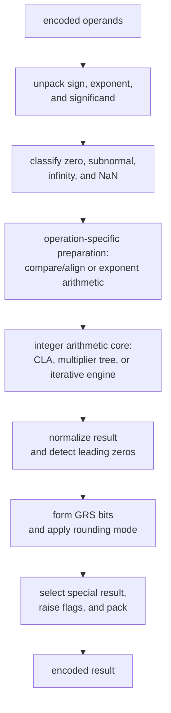
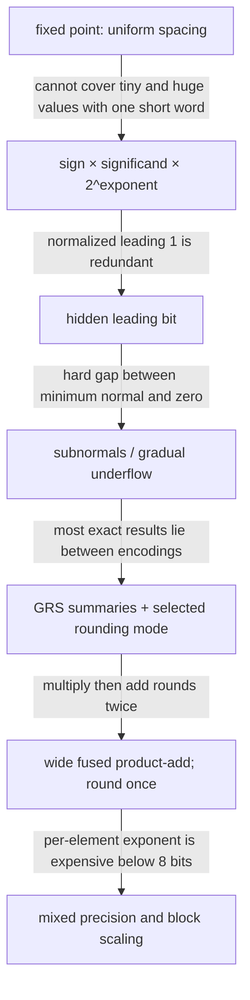
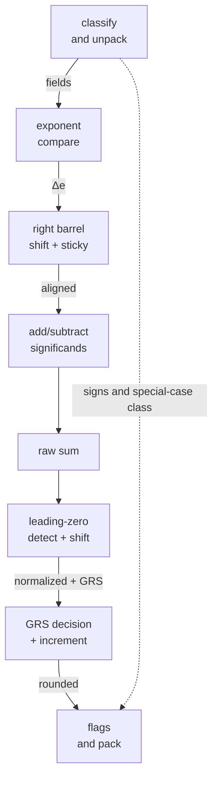
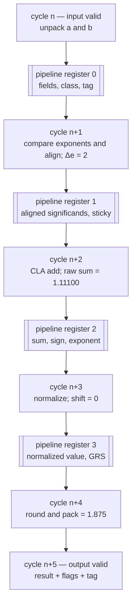
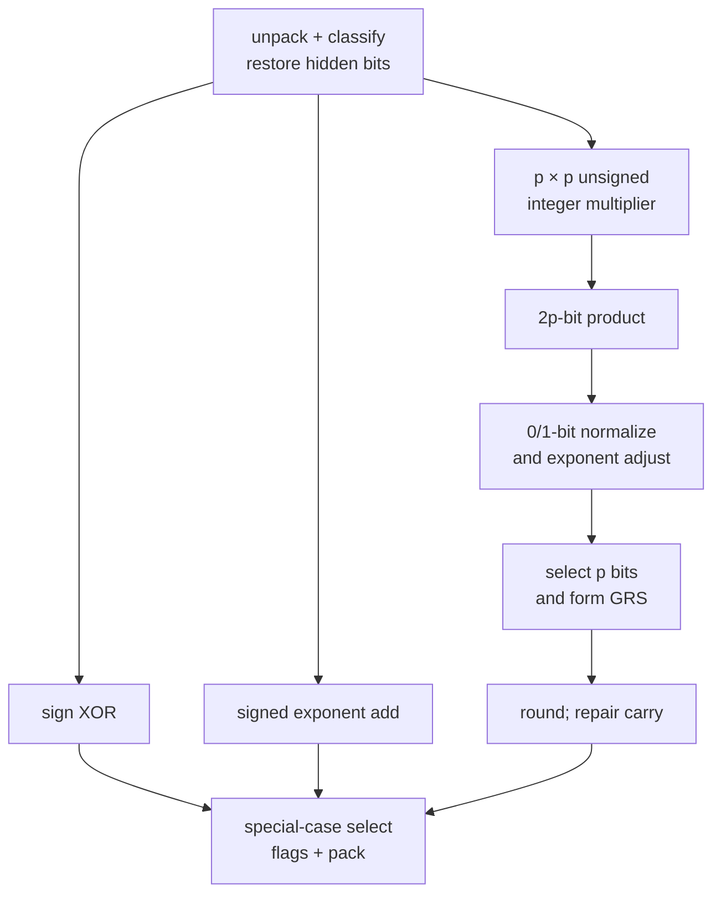
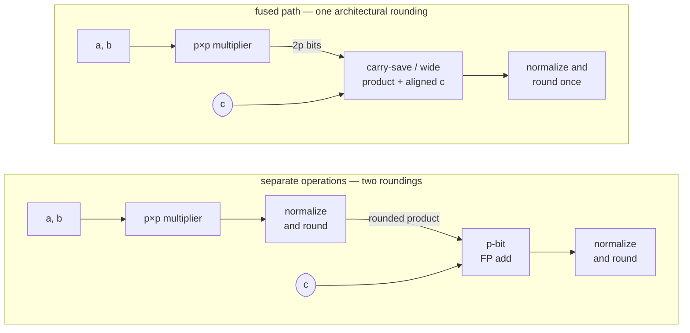
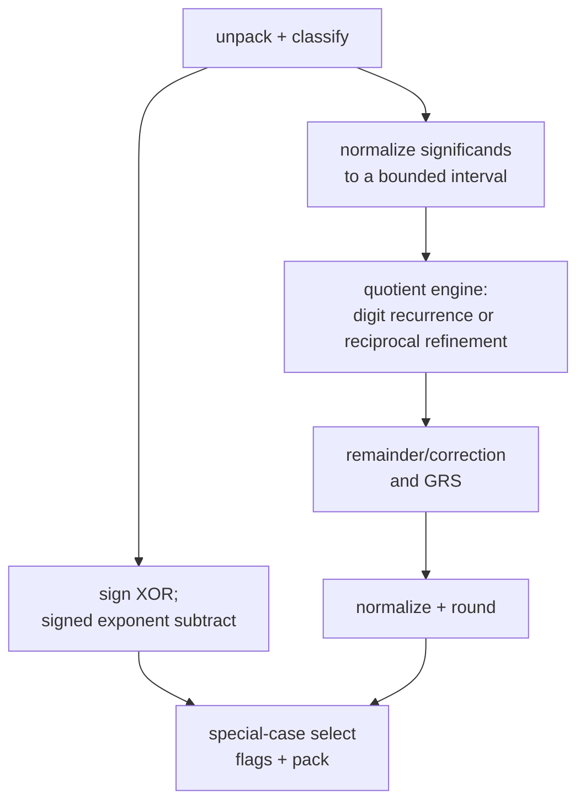
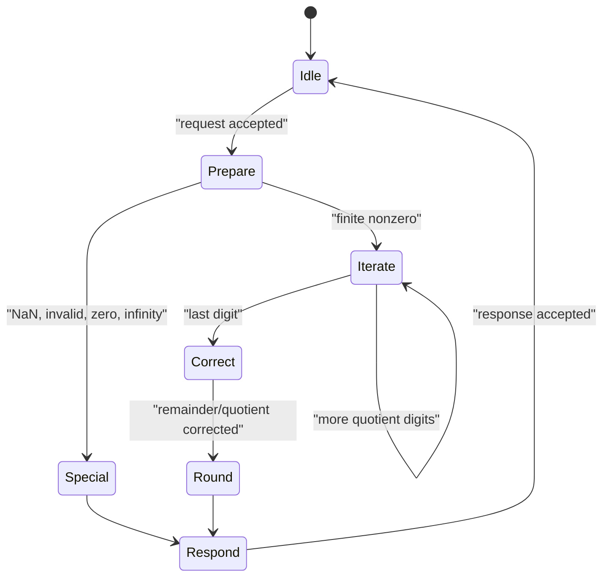
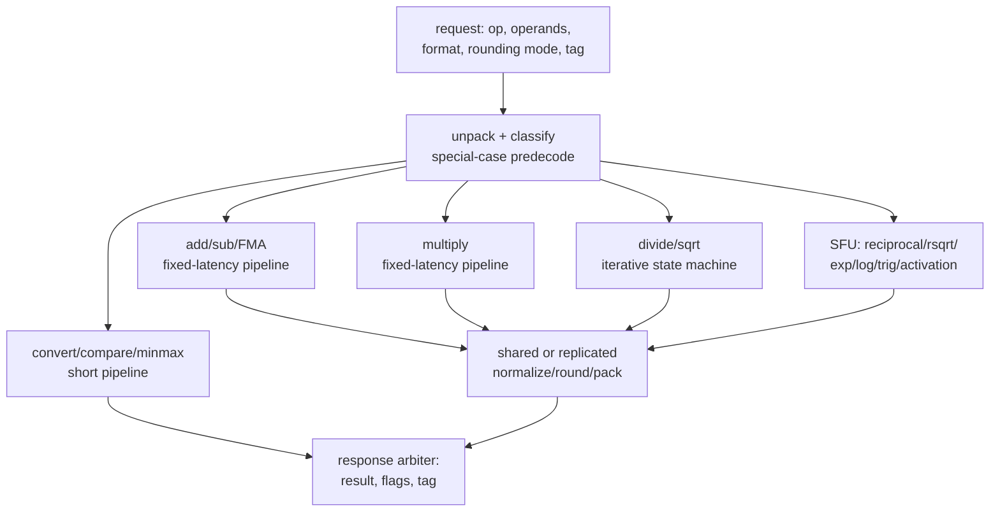

# Floating Point — From a Carry Adder to Add, Multiply, FMA, Divide, and SFUs


```mermaid
flowchart TB
  IN["encoded operands"] --> UN["unpack sign, exponent,<br/>and significand"]
  UN --> SP["classify zero, subnormal,<br/>infinity, and NaN"]
  SP --> PRE["operation-specific preparation:<br/>compare/align or exponent arithmetic"]
  PRE --> OP["integer arithmetic core:<br/>CLA, multiplier tree, or iterative engine"]
  OP --> NO["normalize result<br/>and detect leading zeros"]
  NO --> RN["form GRS bits<br/>and apply rounding mode"]
  RN --> PK["select special result,<br/>raise flags, and pack"]
  PK --> ER["encoded result"]
```

> **Prerequisites:** [Adders_and_Multipliers](03_Adders_and_Multipliers.md) (the mantissa $p\times p$ multiplier, the final CPA, and the SRT/Goldschmidt recurrences this page reuses), [Logic_Building_Blocks](02_Logic_Building_Blocks.md) (barrel shifter, leading-zero count, priority encoder), [CMOS_Fundamentals](01_CMOS_Fundamentals.md) (the area→energy argument behind §6).
> **Hands off to:** [NPU_Accelerators](../01_Architecture_and_PPA/03_NPU_Architecture/01_Compute_Dataflows/01_NPU_Accelerators.md) and [GPU_Architecture](../01_Architecture_and_PPA/02_GPU_Architecture/01_Core_Architecture/01_GPU_Architecture.md) (where these formats become MAC density and TOPS), [OoO_Execution](../01_Architecture_and_PPA/01_CPU_Architecture/03_Out_of_Order_Backend/01_OoO_Execution.md) §7 (the FPU/FMA/divide latency menu the scheduler reasons about).

**First-use vocabulary.** A **floating-point unit (FPU)** executes floating-point arithmetic. A **unit in the last place (ULP)** is the spacing between adjacent representable numbers near a value. **Guard, round, and sticky (GRS)** are the three summary bits used to decide rounding. **Round to nearest, ties to even (RNE)** is IEEE 754's usual rounding rule. A **fused multiply-add (FMA)** computes a product plus an addend with one final rounding. **NaN** means “not a number.” **Flush to zero (FTZ)** and **denormals are zero (DAZ)** replace tiny subnormal results or inputs with zero. A **multiply–accumulate (MAC)** repeatedly forms products and adds them into a running sum.

> **Assumed starting point:** you know a ripple-carry adder (RCA, also called a carry-ripple adder or CRA), a carry-lookahead adder (CLA), two's-complement subtraction, multiplexers, and registers. That is enough. An FP adder is not a mysterious new kind of adder: it is a CLA/parallel-prefix adder surrounded by exponent comparison, a barrel shifter, leading-zero logic, rounding, and special-case control. An FP multiplier similarly wraps an unsigned integer multiplier with sign/exponent/normalization logic.

---

## 0. Why this page exists

A real computation spans an enormous dynamic range — a gravitational simulation touches $10^{-30}$ and $10^{30}$ in the same loop, a neural-net gradient and its weight differ by six orders of magnitude — but the hardware has a **fixed bit budget**. Fixed-point spends every bit on a fixed set of powers of two, so it can be either fine-grained *or* wide-ranging, never both. Floating point escapes by spending the budget on **two competing resources at once**: some bits become an **exponent** (which buys *range* — how far the number line reaches) and the rest become a **mantissa** (which buys *precision* — how finely it is resolved). That single allocation is the whole subject.

> **Every floating-point format is one point on the exponent-vs-significand allocation of a fixed bit budget. One more exponent bit roughly doubles the number of available exponent codes (greatly expanding logarithmic range); one more significand bit halves the local ULP and unit roundoff. Encodings, exceptional values, subnormals, and block scales add further contract choices.**

This page derives IEEE-754 and the modern AI formats (TF32, FP16, BF16, FP8, MXFP, INT8) from that trade rather than from a bit-layout table, models the rounding error the trade admits ($|fl(x)-x|\le 2^{-p}|x|$), and shows why the *hardware* cost is set almost entirely by mantissa width — the multiplier area grows as $p^2$. By the end you should be able to look at a workload, say where on the range/precision line it wants to sit and why, and predict what that costs in silicon — not recite exponent-field encodings.

### 0.1 The mechanism evolves by repairing one failure at a time


```mermaid
flowchart TD
    FX["fixed point: uniform spacing"] -->|"cannot cover tiny and huge values with one short word"| EX["sign × significand × 2^exponent"]
    EX -->|"normalized leading 1 is redundant"| HB["hidden leading bit"]
    HB -->|"hard gap between minimum normal and zero"| SUB["subnormals / gradual underflow"]
    SUB -->|"most exact results lie between encodings"| GRS["GRS summaries + selected rounding mode"]
    GRS -->|"multiply then add rounds twice"| FMA["wide fused product-add; round once"]
    FMA -->|"per-element exponent is expensive below 8 bits"| MX["mixed precision and block scaling"]
```

This is a design argument rather than a historical timeline. At every arrow, keep the earlier contract and add the least machinery that removes its failure. That reading prevents “IEEE 754” from becoming a list of fields: the exponent exists because uniform spacing fails; the hidden bit recovers a predictable redundancy; subnormals repair an abrupt boundary; GRS bits make a finite datapath reproduce an infinitely precise rounding decision; the FMA removes an avoidable intermediate rounding; block scaling amortizes range metadata across many low-bit values.

Use the same procedural checklist for every operation below:

1. **Decode the contract:** format, rounding mode, exception behavior, and whether subnormals are supported.
2. **Carry sufficient internal information:** never discard a bit that could change the final rounded answer.
3. **Transform the exact value:** align, add or multiply, and normalize before rounding.
4. **Round once at the architectural boundary:** use retained least-significant bit plus GRS and the selected mode.
5. **Classify and pack:** apply special-case precedence and raise flags.
6. **Replay adversarial cases:** exponent gaps, complete cancellation, exact ties, overflow, underflow, infinities, and NaNs.

---

## 1. The fundamental problem: dynamic range on a fixed budget

Represent a real number in $N$ bits. **Fixed-point** places an implicit binary point at a chosen position: the representable values are $k\cdot 2^{-f}$ for integer $k$, evenly spaced by $2^{-f}$ across a total span of $2^{N-f}$. The spacing and the span are locked together — one knob, $f$, sets both. To resolve $10^{-30}$ you need $f\gtrsim 100$; to also reach $10^{30}$ you need $N\gtrsim 200$. No practical word is that wide, and most of those bits would be zero most of the time. Fixed-point wastes its budget carrying leading and trailing zeros that convey nothing.

**Floating point** stops storing the zeros. Write every nonzero number in normalized scientific form

$$
x = (-1)^{s}\;\cdot\; m \;\cdot\; 2^{e}, \qquad 1 \le m < 2,
$$

where $s$ = sign bit, $m$ = **significand** (mantissa) in $[1,2)$, $e$ = **exponent**. Store $s$, a $k$-bit field for $e$, and a $(p{-}1)$-bit field for the fraction of $m$. Now the two jobs are separated:

- the **exponent** slides the binary point, so the range is *doubly exponential* in its width, $\sim 2^{\,2^{k}}$ — 8 exponent bits already reach $10^{\pm 38}$;
- the **mantissa** resolves the number *relative to its own magnitude*: the gap between consecutive floats scales with the value. Big numbers are spaced coarsely, small numbers finely, and the **number of significant digits is roughly constant everywhere**.

That constant-relative-precision property is the reason floating point exists, and it is what lets one 32-bit word serve a physics kernel that a fixed-point word never could. The price is that most values are *not* representable exactly — they must be rounded (§4), and that rounding is the source of every numerical subtlety on this page.

The bit budget is now a partition:

$$
N = \underbrace{1}_{\text{sign}} + \underbrace{k}_{\text{exponent (range)}} + \underbrace{(p-1)}_{\text{fraction (precision)}}.
$$

Everything below is a consequence of how a given format splits $N$ between $k$ and $p$.

---

## 2. The floating-point number line: implicit bit, ULP, and machine epsilon

**The implicit bit — one free bit of precision.** Because a normalized significand always satisfies $1\le m<2$, its leading bit is *always* 1. Storing it would waste a bit, so it is not stored: the hardware prepends a "hidden" 1 to the $(p{-}1)$ stored fraction bits, giving $p$ bits of precision from $p{-}1$ bits of storage. (The single exception is subnormals, §3, whose hidden bit is 0 — which is exactly what makes them special.)

**A worked encoding — $-6.5$ into FP32.** Take the fields apart by hand. Write the magnitude in binary and normalize so the leading bit is the hidden $1$:

$$
6.5 = 110.1_2 = 1.101_2 \times 2^{2}.
$$

The stored fraction is $101$ padded to 23 bits, the unbiased exponent is $2$ (biased $2+127=129$), and the sign is $1$:

$$
\underbrace{1}_{s}\ \ \underbrace{1000\,0001}_{129}\ \ \underbrace{101\,0000\,0000\,0000\,0000\,0000}_{\text{stored fraction}}\;=\;\texttt{0xC0D00000}.
$$

Decode it back: $(-1)^1\times 1.101_2\times 2^{129-127}=-1.625\times 4=-6.5$ — clean, because $6.5$ is a sum of powers of two. Most decimals are not: $0.1$ has no finite binary expansion, so its significand $1.1001\,1001\,1001\ldots_2$ is *rounded* to 24 bits and stored as $\texttt{0x3DCCCCCD}\approx 0.100000001$ — the rounding of §4, already visible in the encoding. The standard way to see the three fields is to reinterpret the bits:

```c
#include <stdint.h>
#include <math.h>
#include <stdio.h>

// Reinterpret a float's bits and split out the three IEEE-754 fields.
void dissect(float x) {
    union { float f; uint32_t u; } v = { .f = x };        // type-pun via union
    uint32_t sign =  v.u >> 31;
    int32_t  exp  = (int32_t)((v.u >> 23) & 0xFF) - 127;   // remove the bias
    uint32_t frac =  v.u & 0x7FFFFF;                       // 23 stored bits
    float    ulp  = nextafterf(x, INFINITY) - x;           // gap to next float
    printf("%g: sign=%u exp=%d frac=0x%06X ulp=%g\n", x, sign, exp, frac, ulp);
}
// dissect(-6.5f) -> sign=1 exp=2 frac=0x500000 ulp=4.76837e-07
```

**ULP and machine epsilon.** In the binade $[2^{e},2^{e+1})$ the representable numbers are spaced by one **unit in the last place**,

$$
\mathrm{ULP}(x) = 2^{\,e-(p-1)} = 2^{e}\,\epsilon, \qquad \epsilon \equiv 2^{-(p-1)},
$$

where $\epsilon$ = **machine epsilon**, the gap between $1.0$ and the next larger float, and $p$ = significand precision (bits, including the hidden bit). The spacing scales with $2^{e}$ — the promised constant *relative* resolution.

**A ULP / machine-epsilon computation.** Machine epsilon is just the ULP at $1.0$: the next float above $1.000\ldots0_2$ sets the lowest stored bit, giving $1+2^{-23}$, so $\epsilon=2^{-23}\approx1.19\times10^{-7}$ (FP32). The gap then rides the binade. Near $100$ (in $[2^6,2^7)$) it is $2^{6-23}=2^{-17}\approx7.6\times10^{-6}$ — so $100.0$ and $100.000008$ are adjacent floats with nothing between them; near $6.5$ (in $[2^2,2^3)$) it is $2^{2-23}=2^{-21}\approx4.8\times10^{-7}$, the `ulp` the snippet above prints for $-6.5$. Constant *relative* precision ($\sim7$ digits) everywhere; only the absolute spacing moves.

**The rounding-error model.** Round-to-nearest maps any real $x$ (in range) to the closest float, so it errs by at most half a ULP:

$$
|fl(x)-x| \;\le\; \tfrac12\,\mathrm{ULP}(x) \;\le\; \underbrace{2^{-p}}_{\;u\;}\,|x| \;=\; \tfrac12\,\epsilon\,|x|,
\qquad\Longleftrightarrow\qquad
fl(x) = x(1+\delta),\ \ |\delta|\le u,
$$

where $u=\tfrac12\epsilon=2^{-p}$ is **unit roundoff**. The relative model applies when the exact result and its rounded value remain in the normal finite range. Near zero, gradual underflow is better described by an absolute-error bound; overflow and exceptional values need separate cases. Within that normal range, a correctly rounded basic operation behaves as though its exact real result were perturbed by at most $u$ in relative terms.

**The canonical formats as points on the trade.** Read this table as *allocations*, not layouts — the last two columns are the whole story:

| Format | $k$ (exp) | $p{-}1$ (frac) | $p$ | Dynamic range | $u=2^{-p}$ | Decimal digits $\approx p\log_{10}2$ |
|---|---|---|---|---|---|---|
| FP64 (double) | 11 | 52 | 53 | $\pm1.8\times10^{308}$ | $2^{-53}$ | 15.9 |
| FP32 (single) | 8 | 23 | 24 | $\pm3.4\times10^{38}$ | $2^{-24}$ | 7.2 |
| TF32 (NVIDIA) | 8 | 10 | 11 | $\pm3.4\times10^{38}$ | $2^{-11}$ | 3.3 |
| FP16 (half) | 5 | 10 | 11 | $\pm6.5\times10^{4}$ | $2^{-11}$ | 3.3 |
| BF16 (bfloat16) | 8 | 7 | 8 | $\pm3.4\times10^{38}$ | $2^{-8}$ | 2.4 |
| FP8 E4M3 | 4 | 3 | 4 | $\pm448$ | $2^{-4}$ | 1.2 |
| FP8 E5M2 | 5 | 2 | 3 | $\pm5.7\times10^{4}$ | $2^{-3}$ | 0.9 |

Two pairs make the trade explicit. **FP16 vs BF16** are both 16-bit yet opposite bets: FP16 spends 5 bits on range and 10 on precision (good digits, narrow reach); BF16 spends 8 on range and 7 on precision (FP32's full reach, coarse digits). **FP8 E4M3 vs E5M2** replay the same argument inside 8 bits. Sections 6–7 explain which workloads want which side.

**Why the exponent is biased (briefly).** The exponent field stores $e+\text{bias}$ with $\text{bias}=2^{k-1}-1$ (127 for FP32, 1023 for FP64, 15 for FP16). Two reasons, both structural, neither worth a derivation: (1) a biased field is a plain *unsigned* integer, so comparing two positive floats is a single unsigned integer compare of the whole word — magnitude ordering falls out for free; (2) $2^{k-1}-1$ (not $2^{k-1}$) centers the exponent range almost symmetrically about zero, keeping the reciprocal of the largest normal representable. The two extreme exponent codes (all-zeros, all-ones) are reserved — for subnormals/zero and for infinity/NaN respectively (§3, §9).

---

## 3. Gradual underflow: why subnormals exist

Turn the smallest-normal knob and a real hazard appears. The smallest normal is $2^{\,e_{\min}}$ (for FP32, $2^{-126}$). If the next value below it were $0$, there would be a **gap** as wide as the smallest normal itself between $0$ and $2^{e_{\min}}$ — far wider than the spacing just *above* $2^{e_{\min}}$. (In FP32 that cliff is $2^{-126}$ wide, yet the spacing just above it is only $2^{-149}$ — a step $2^{23}\approx8.4\times10^{6}$ times too big.) Two distinct numbers whose difference lands in that gap would subtract to exactly $0$, breaking the property every programmer relies on:

$$
a \ne b \quad\Longrightarrow\quad a - b \ne 0.
$$

**Subnormals** (exponent field all-zeros, hidden bit $0$, value $0.f\times 2^{\,e_{\min}}$) fill the gap with values evenly spaced by the *smallest* ULP, $2^{\,e_{\min}-(p-1)}$ — the same spacing as just above $e_{\min}$. Underflow becomes **gradual**: a result drifting below the normal range loses precision one bit at a time instead of collapsing to zero in one step, and $a\ne b\Rightarrow a-b\ne0$ is restored. This is not pedantry — it is what makes `if (a != b) x = 1/(a-b);` safe.

**The hardware cost and implementation choices.** A subnormal has *no* guaranteed leading 1, so it carries a variable number of leading zeros. Supporting it can require leading-zero detection, variable pre-normalization, and a right-shift-jam into the subnormal result range before final rounding. Implementations choose among:

| Strategy | Datapath consequence | Architectural consequence |
|---|---|---|
| full-rate hardware | normalize/denormalize and round in the normal pipeline | gradual underflow supported at normal throughput |
| slower assist/path | reuse or iterate normalization hardware | IEEE-style result is possible with data-dependent latency |
| **DAZ / FTZ profile** | treat subnormal inputs as zero and/or flush tiny results | simpler/faster contract, but not full gradual-underflow behavior |

**DAZ** (denormals are zero) applies to inputs; **FTZ** (flush to zero) applies to tiny results. A design may support one, both, or neither. Their area, timing, and energy effect depends on whether normalization hardware is already shared with other operations, so it must be measured in the actual implementation. The instruction/profile must expose this behavior because some algorithms depend on gradual underflow.

---

## 4. Rounding: the half-ULP guarantee, and unbiased rounding

**Three summary bits decide final rounding.** Once an operation has preserved enough exact/internal information to reach its final rounding boundary, the decision needs only the **Guard** bit (first below the retained significand), **Round** bit (second), and **Sticky** bit (OR of everything lower or previously discarded). Sticky distinguishes an exact half from a value above it. For round-to-nearest-even:

$$
\text{round\_up} \;=\; G \cdot \big(R \lor S \lor \text{LSB}\big),
$$

where LSB is the least-significant retained bit. $G{=}0$: below half. $G{=}1$ with $R\lor S$: above half. $G{=}1,\,R{=}S{=}0$: an exact tie, incremented only when LSB is 1 so the result becomes even. The final rounder needs only these summaries, but the operation core may need many more internal bits—an FMA keeps a full product, and a divider uses a nonzero remainder to form sticky.

**Why ties go to even.** A rule that always sends exact midpoint cases toward the larger magnitude introduces a systematic direction into repeated tie-heavy calculations. Round-to-nearest-even selects the neighbor whose retained LSB is 0, so it does not always move ties in one magnitude direction. This reduces statistical bias; it does not guarantee zero error for an arbitrary, nonuniform data set.

**Stochastic rounding — buying unbiasedness back at low precision.** In deep-precision formats a subtler bias dominates: when a weight $w$ in BF16/FP8 is updated by a gradient $g$ smaller than $\tfrac12\,\mathrm{ULP}(w)$, deterministic rounding maps $w+g\mapsto w$ **every time** — the update vanishes and training *stagnates* even though millions of such updates should have moved $w$. **Stochastic rounding** rounds $x$ up with probability equal to its fractional position between the two neighbors,

$$
\Pr[\,fl(x)=\lceil x\rceil_{\text{fp}}\,] = \frac{x-\lfloor x\rfloor_{\text{fp}}}{\mathrm{ULP}(x)},
\qquad\Rightarrow\qquad \mathbb{E}[fl(x)] = x,
$$

so the rounding is **unbiased in expectation**. A sub-ULP gradient now bumps the weight with a *proportional probability*; over many steps the weight moves by the correct average amount, and low-precision training converges where RNE would stall. This is why hardware RNGs are appearing next to low-precision accumulators (Graphcore IPU, several FP8 training proposals) — the rounding mode itself became a numerical-stability lever.

---

## 5. Catastrophic cancellation and the FMA

**Cancellation exposes error, it does not create it.** Subtracting two nearly-equal numbers is *exact* in hardware (Sterbenz: if $y/2\le x\le 2y$, then $x-y$ is representable with no rounding). The danger is upstream. If the operands are themselves rounded, $\hat x = x(1+\delta_x)$ and $\hat y = y(1+\delta_y)$ with $|\delta|\le u$, then

$$
\frac{|(\hat x-\hat y)-(x-y)|}{|x-y|} \;\le\; u\,\frac{|x|+|y|}{|x-y|}.
$$

When $x\approx y$ the denominator collapses while the numerator does not, so the relative error is **amplified by $(|x|+|y|)/|x-y|$**, which diverges as the operands converge. The subtraction merely strips away the agreeing leading digits, promoting the operands' pre-existing rounding error into the most significant bits of the result. The lesson is algorithmic: never compute a small quantity as the difference of two large nearly-equal ones (the quadratic formula, variance as $E[x^2]-E[x]^2$, finite differences all bite here).

**A cancellation demo you can check by hand.** Work in a toy decimal float carrying 4 significant digits (RNE), standing in for FP32's $\sim7$. Two nearby values arrive, each *already* rounded to the format:

$$
a=3.14159\Rightarrow fl(a)=3.142,\qquad b=3.14127\Rightarrow fl(b)=3.141.
$$

The subtraction is *exact* (Sterbenz): $3.142-3.141=0.001$. But the true difference is $a-b=0.00032$, so the computed $0.001$ is off by $\approx210\%$ — the answer is essentially noise. Nothing failed in the subtract; it cancelled the three agreeing digits $3.14$ and promoted each operand's half-ULP rounding error (up to $0.0005$, invisible while riding a value of $\sim3$) into the *leading* digit of a result of size $\sim0.001$. FP32 does the identical thing in binary with $2^{-24}$ in place of the decimal ULP — which is why a small quantity must never be formed as the difference of two large near-equal ones.

Cancellation is also *why the FP adder has a close path*. For effective subtraction with exponent difference $\le1$, the result may cancel to many leading zeros, needing a full-width normalization shift driven by a leading-zero anticipator. Effective additions and farther subtractions use the far/add path: alignment may dominate, but post-normalization is small. The two expensive shifts need not occur in one path, so high-speed adders split into a **far/add path** (big align, tiny normalize) and a **close-subtract path** (tiny align, big normalize).

**The FMA: one rounding instead of two.** A **fused multiply-add** computes

$$
\text{fma}(a,b,c) = fl(a\cdot b + c)
$$

with a **single** rounding of the *exact* product-plus-addend, versus $fl(fl(a\cdot b)+c)$'s two. This matters for three compounding reasons:

1. **Accuracy per term.** A dot product accumulated with FMA has one rounding per multiply-add term instead of an independently rounded product followed by an add. The exact error-bound improvement depends on the summation and data, but the intermediate product is not truncated to $p$ bits before it reaches the addend.
2. **Error-free transforms.** Under the usual finite/no-underflow assumptions, $p=fl(a\cdot b)$ and $e=\text{fma}(a,b,-p)$ give $a\cdot b=p+e$ exactly: the product rounding error is recovered as a representable number. This `TwoProduct` primitive supports compensated dot products and double-double arithmetic. Kahan summation instead compensates addition error with a `TwoSum`-like update.
3. **Cheap iterative refinement.** Newton/Goldschmidt reciprocal and square-root steps are chains of $\text{fma}(-b,x,1)$ that would lose their meaning if the product were pre-rounded.

**An FMA rounding difference, by hand.** Take a 3-significant-digit toy float and compute $a\cdot b+c$ with $a=b=9.99,\ c=-99.8$; the exact product is $99.8001$.

- **Separate**, $fl(fl(a\cdot b)+c)$: round the product first, $fl(99.8001)=99.8$, then $99.8-99.8=0$ — the result vanishes.
- **Fused**, $fl(a\cdot b+c)$: keep the product exact, $99.8001-99.8=0.0001$, round once to $1.00\times10^{-4}$.

The true answer is $0.0001$; the separate path lost it *entirely* by truncating the product to the format before $c$ could cancel the leading digits, while the FMA's single rounding kept it. This is the "never round the intermediate product" point made numeric — and exactly why the §8.3 datapath carries the full $2p$-bit product into the add.

**Why the FMA costs more than a bare multiplier.** The addend $c$ must align against the full $2p$-bit product before rounding. The internal fixed-point window, alignment network, cancellation handling, final CPA, and normalization logic are therefore wider than the destination significand. Exact width and pipeline latency depend on format support, subnormal policy, alignment scheme, and timing target; determine them from the chosen architecture and synthesis, not a universal cycle count. The multiplier tree feeding it is derived in [Adders_and_Multipliers](03_Adders_and_Multipliers.md) §7.

---

## 6. The hardware cost: the significand multiplier scales roughly with width squared

Here is why the whole industry moved to low precision. Decompose an FP multiplier:

- **Exponent path:** a $k$-bit add ($e_a+e_b-\text{bias}$). Area $\propto k$, and $k$ is single digits — negligible.
- **Sign:** one XOR.
- **Mantissa path:** a $p\times p$ unsigned multiply. A multiplier is an $O(p^2)$ array of partial-product bits reduced by a compressor tree, so both **area and switching energy scale as $p^2$.**

$$
A_{\text{mul}} \;\sim\; p^2, \qquad E_{\text{mul}} \;\sim\; p^2,
$$

where $p$ is significand width. This is a model of the **partial-product core**, not the whole FP lane. Exponent/classification logic, alignment, accumulation, rounding, registers, clocking, and routing do not shrink as $p^2$. Cutting precision creates large multiplier-density headroom, but realized lane density must include those fixed and linear-width costs:

| Format | $p$ | $p^2$ partial-product bits | FP32 core ratio | Ideal inverse core ratio |
|---|---:|---:|---:|---:|
| FP32 | 24 | 576 | $1$ | $1\times$ |
| TF32 / FP16 | 11 | 121 | $0.210$ | $4.76\times$ |
| BF16 | 8 | 64 | $0.111$ | $9\times$ |
| FP8 E4M3 | 4 | 16 | $0.0278$ | $36\times$ |
| FP8 E5M2 | 3 | 9 | $0.0156$ | $64\times$ |

The last column is an **upper opportunity from the multiplier core only**. It does not mean 9 complete BF16 MAC lanes or 36 complete FP8 lanes fit in one FP32 MAC area. Accumulator ports/width, format muxing, issue bandwidth, wiring, and power can dominate at low precision. Use synthesized/post-route lane area and measured power to turn the $p^2$ opportunity into a product claim.

**But you cannot reduce the accumulator the same way.** Sum $n$ products each carrying relative error $\le u$. Worst-case error accumulates linearly and, for rounding that behaves like zero-mean noise, in RMS as a random walk:

$$
\big|\hat S_n - S_n\big| \;\lesssim\; (n-1)\,u\sum_i|t_i|
\quad\text{(worst case)}, \qquad
\text{RMS error} \;\sim\; \sqrt{n}\,u\,\|t\|
\quad\text{(stochastic)},
$$

where $t_i$ are terms and $u$ is the accumulator's unit roundoff. Error grows with reduction length and conditioning, so directly accumulating a long dot product at FP8 input precision is usually unacceptable. **Swamping** occurs when the next term lies below the running sum's ULP and rounds away. Hardware therefore commonly multiplies at low precision and accumulates in a wider floating-point or fixed-point representation, often FP32-like but always defined by the instruction. Kahan/compensated summation is a software-side technique for recovering lost addition information; exact error bounds still depend on the summation algorithm and data. The MAC array is covered in [NPU_Accelerators](../01_Architecture_and_PPA/03_NPU_Architecture/01_Compute_Dataflows/01_NPU_Accelerators.md) §2.

---

## 7. The AI-format landscape: the trade, applied

With the cost model in hand, every modern format is a *deliberate* point on the range/precision line, chosen for a workload. The organizing insight:

> **Training pushes toward the exponent (range) end; inference tolerates the mantissa (precision) end.** Gradients span many orders of magnitude and must neither overflow nor underflow to zero, so training pays for range. Inference activations are bounded and can be calibrated offline, so inference spends its few bits on precision — or drops the per-element exponent entirely.

Walking the line from FP32 outward:

- **TF32 (NVIDIA, Ampere+).** Keep FP32's 8-bit exponent (full range, drop-in) but truncate the mantissa to 10 bits, so the multiplier is $11\times11$ instead of $24\times24$ ($\sim4.8\times$ smaller) — while **accumulating in FP32**. A matmul silently runs on the tensor cores at a few-times-FP32 throughput with $\sim3$ decimal digits, no code change. TF32 is the purest illustration that *range is cheap and mantissa is what you pay for*.
- **FP16 vs BF16 — the training-format decision.** FP16 keeps 10 fraction bits but only a 5-bit exponent (maximum finite 65,504), so mixed-precision FP16 training often uses loss scaling to avoid gradient underflow. **BF16** keeps FP32's 8-bit exponent and spends only 7 bits on the fraction, greatly reducing the need for loss scaling while giving up precision. Overflow is still possible and algorithm-dependent; wider accumulators/master state remain important.
- **FP8 E4M3 vs E5M2 — the same choice at 8 bits.** The OCP FP8 standard (2022; NVIDIA, AMD, Intel, Arm, others) ships *both* on purpose. **E4M3** (4-bit exp, 3-bit mantissa, range $\pm448$) has the extra mantissa bit — used for **forward-pass weights and activations**, which need precision within a bounded range. **E5M2** (5-bit exp, 2-bit mantissa, range $\pm5.7\times10^4$) has the extra exponent bit — used for **backward-pass gradients**, which need range above all. NVIDIA Hopper H100 (2022), AMD MI300, and Intel Gaudi run FP8 tensor cores that switch format by tensor/phase — the datapath literally re-allocates the bit between range and precision per operation.
- **MXFP / microscaling (OCP MX, 2023) — factoring range out of the element.** Below 8 bits, a per-element exponent is too coarse to carry both range and precision. Microscaling shares **one 8-bit scale across a block of 32 elements**; each element stores only its value *relative to the block*, so the block scale reconstitutes the dynamic range the tiny per-element field lost, and every element bit goes to precision:

$$
x_i = s_{\text{block}}\cdot m_i,\qquad \text{avg bits/elem} = b_{\text{elem}} + \tfrac{8}{32},
$$

so MXFP4 costs $4.25$ bits/element yet spans a useful range. Variants MXFP8/6/4 and NVIDIA's NVFP4 (Blackwell, 2024) push training and inference below the byte. Microscaling is the current frontier precisely because it *decouples* the two resources this whole page has been trading against — range lives in the shared scale, precision in the element.
- **INT8 — the degenerate case with no per-element exponent.** INT8 quantization drops the exponent entirely: a per-tensor or per-channel scale plus a uniform 8-bit integer grid. Within its (fixed, calibrated) range it resolves *more* finely than FP8 (all 8 bits are mantissa-like), but it has no per-element range at all, so it wins only where the value distribution is well-behaved and calibratable — classic post-training inference. TPUv1 was a $256\times256$ INT8 systolic array at 92 TOPS (Jouppi et al., 2017). MX-INT8 is the block-scaled compromise between INT8's density and FP8's per-block range.

| Workload | Format | Why (range vs precision) |
|---|---|---|
| Training, general | BF16 (often wider master/accumulation) | wide exponent reduces loss-scaling pressure |
| Training, aggressive | FP8 E4M3 fwd / E5M2 bwd | per-phase range/precision split; FP32 accumulate |
| Frontier low-bit training/inference | MXFP8 / MXFP6 / MXFP4 | shared scale restores range below 8 bits |
| Inference, accuracy | FP16 or INT8 | bounded activations; calibrated |
| Inference, throughput | FP8 / MXFP4 / INT4 | density opportunity; accuracy requires calibration/QAT and workload validation |
| Scientific / HPC | FP64 | convergence needs $\sim16$ digits |

Two rules survive every format above and are the takeaways to keep: **the multiplier shrinks roughly as $p^2$ (§6), and long reductions normally use an accumulator wider than their inputs—often FP32 or an equivalent wide fixed-point accumulator.** How these formats turn into MAC density, TOPS, and roofline behavior is [NPU_Accelerators](../01_Architecture_and_PPA/03_NPU_Architecture/01_Compute_Dataflows/01_NPU_Accelerators.md) and [GPU_Architecture](../01_Architecture_and_PPA/02_GPU_Architecture/01_Core_Architecture/01_GPU_Architecture.md); this page's job is the arithmetic that makes them safe.

---

## 8. Operations: build the complete arithmetic unit from integer blocks

Every operation uses the same outer shell:

1. **unpack and classify** the encoded operands;
2. convert finite values to an internal sign, signed exponent, and explicit significand;
3. perform an exact or sufficiently wide integer operation;
4. normalize the raw result;
5. round once to the destination format;
6. select special-case results, raise flags, and pack the bits.

The CLA/CRA is step 3 for addition. The multiplier tree is step 3 for multiplication. FMA widens step 3 so the product and addend meet before rounding. Divide, square root, and elementary functions repeat a smaller multiply/add step across several cycles.

### 8.1 A floating-point addition, exactly as hardware performs it

Start with an intentionally easy binary example so every internal bit is visible:

$$
a=1.5=1.100_2\times2^0,\qquad b=0.375=1.100_2\times2^{-2}.
$$

Assume a toy format with four retained significand bits including the hidden 1. The datapath does not “add two floating-point words.” It turns them into aligned fixed-point integers, operates on those integers, then constructs a new floating-point word:

| Step | Owned state | Operation | State after step |
|---|---|---|---|
| 1. classify/unpack | signs, unbiased exponents, significands | detect zero/subnormal/infinity/NaN; restore hidden bits | $m_a=1.100$, $e_a=0$; $m_b=1.100$, $e_b=-2$ |
| 2. compare exponents | $\Delta=e_a-e_b=2$ | choose $e_a$ as working exponent | common exponent $0$ |
| 3. align smaller | extended $m_b$ plus GRS positions | right-shift by two; OR discarded low bits into sticky | $m_b'=0.01100$ |
| 4. add magnitudes | aligned extended significands | $1.10000+0.01100$ | $1.11100$ |
| 5. normalize | raw sum and leading-one position | shift until result is in $[1,2)$; adjust exponent oppositely | already $1.11100\times2^0$ |
| 6. round | retained `1.111`, $G=R=S=0$ | apply RNE equation from §4 | no increment |
| 7. pack | sign, biased exponent, stored fraction | remove hidden 1 and encode | $1.111_2=1.875$ |

The same hardware must also survive a case where alignment loses visible digits. In a four-bit significand, suppose the normalized pre-round value is `1.010 100...`: retained bits are `1.010`, so retained LSB $=0$, $G=1$, $R=0$, $S=0$. This is an **exact tie**. RNE leaves the result at `1.010` because that neighbor is even. For `1.011 100...`, the retained LSB is 1, so the identical tie increments to `1.100`; the two tie directions balance. If any later discarded bit were 1, sticky would become 1 and the case would be “above half,” not a tie.

The concrete adder pipeline is therefore a composition of hardware already derived in the preceding pages:


```mermaid
flowchart TB
  UN["classify<br/>and unpack"] -->|fields| CMP["exponent<br/>compare"] -->|Δe| SHR["right barrel<br/>shift + sticky"] -->|aligned| ADD["add/subtract<br/>significands"] --> RAW["raw sum"]
  RAW --> LZD["leading-zero<br/>detect + shift"] -->|normalized + GRS| RND["GRS decision<br/>+ increment"] -->|rounded| PACK["flags<br/>and pack"]
  UN -.->|signs and special-case class| PACK
```

This figure is a **hardware ownership map**, not a promise that each box is exactly one cycle. Pipeline registers are inserted to balance the delay of the barrel shifter, significand adder, normalization network, and round incrementer. A typical five-stage implementation might schedule the same transaction like this:


```mermaid
flowchart TB
  C0["cycle n — input valid<br/>unpack a and b"] --> R0[["pipeline register 0<br/>fields, class, tag"]]
  R0 --> C1["cycle n+1<br/>compare exponents and align; Δe = 2"]
  C1 --> R1[["pipeline register 1<br/>aligned significands, sticky"]]
  R1 --> C2["cycle n+2<br/>CLA add; raw sum = 1.11100"]
  C2 --> R2[["pipeline register 2<br/>sum, sign, exponent"]]
  R2 --> C3["cycle n+3<br/>normalize; shift = 0"]
  C3 --> R3[["pipeline register 3<br/>normalized value, GRS"]]
  R3 --> C4["cycle n+4<br/>round and pack = 1.875"]
  C4 --> OV["cycle n+5 — output valid<br/>result + flags + tag"]
```

**Implementation tradeoffs.** A single path is smaller and easier to verify, but it puts a full alignment shifter and a full normalization shifter in series. A far/close dual path evaluates the likely normalization cases in parallel and multiplexes the answer, shortening the clock period at extra area and switching energy. A leading-zero anticipator predicts the cancellation shift in parallel with subtraction, accepting a possible one-bit correction to remove a serial leading-zero count. Pipeline depth improves clock frequency and throughput but increases latency, bypass complexity, exception bookkeeping, and energy in registers and clock trees.

**Verification obligations.** Compare the packed result and all exception flags against a bit-exact reference model for every supported rounding mode. Bias random tests toward exponent differences near $0$, $1$, $p$, and greater than $p$; opposite-sign operands that cancel to zero or one ULP; exact-half GRS patterns; largest finite operands; the normal/subnormal boundary; both signed zeros; and every infinity/NaN combination. Also assert that a stalled pipeline preserves the operands, rounding mode, and transaction tag together—an arithmetically correct result attached to the wrong instruction is still a design failure.

#### 8.1.1 What changes around the CLA/CRA

Suppose the destination has precision $p$, counting the hidden bit. A useful teaching implementation carries `p+3` low-order bits through the main add: the retained $p$ bits plus G, R, and S. It normally also carries one high-order bit for an addition carry. The core can therefore be pictured as:

| Structure | Width/role | What you already know |
|---|---|---|
| exponent subtractor | roughly $k+1$ signed bits | a small CLA computes $E_a-E_b$ |
| magnitude swap mux | whole unpacked operand | comparator + mux |
| right barrel shifter | $p+3$ bits plus sticky OR | mux tree controlled by $|\Delta E|$ |
| significand add/subtract | roughly $p+4$ bits | CLA or parallel-prefix CPA; subtraction is invert + carry-in 1 |
| leading-zero counter | roughly $\lceil\log_2(p+4)\rceil$ output bits | priority-encoder tree |
| left normalization shifter | roughly $p+4$ bits | another barrel shifter |
| round incrementer | $p$ bits | add one when the rounding equation says so |
| pack/special mux | encoded result width | control decode + mux |

The FP difficulty is therefore **data preparation and post-processing**, not the carry equation. The expensive path in a simple adder is:

$$
\Delta E\ \text{CLA}
\ \text{right barrel shift}
\ \text{significand CLA}
\ \text{LZC}
\ \text{left barrel shift}
\ \text{round increment}.
$$

That chain is why an FP add is pipelined and why high-frequency designs split it into close and far paths.

#### 8.1.2 A complete finite-add algorithm

For operands $A$ and $B$, use this exact sequence:

1. **Decode each exponent field.**
   - Normal: hidden bit is 1 and internal exponent is $E-\text{bias}$.
   - Subnormal: hidden bit is 0 and the effective exponent is $e_{\min}$.
   - Exponent all zero with fraction zero: signed zero.
   - Exponent all one: infinity or NaN.
2. **Handle the special-case table** before the normal datapath commits a result.
3. **Compare magnitudes** and swap the finite inputs so $|A|\ge|B|$. This makes the result sign known for an effective subtraction.
4. **Compute** $\Delta E=e_A-e_B\ge0$.
5. **Extend** each significand on the right with three zeros for GRS.
6. **Align $B$ right by $\Delta E$.** If the shift exceeds the datapath width, retained aligned bits become zero while `tail_nonzero` is the OR of discarded bits. A positive add path can fold that information into sticky; an effective subtract path uses the implementation's proved tail/borrow correction. A saturating shift control avoids building useless shift distances.
7. **Choose add or subtract.**
   - Equal signs: add magnitudes; result sign is their sign.
   - Different signs: subtract aligned $B$ from $A$; result sign is the sign of the larger magnitude.
8. **Normalize.**
   - Same-sign addition may produce `10.x`; shift right one and increment the exponent.
   - Opposite-sign cancellation may produce leading zeros; count them, shift left, and decrement the exponent, stopping at the subnormal exponent floor.
   - An exact zero uses the architecture's signed-zero rule.
9. **Round** using the destination LSB and GRS.
10. **Repair a rounding carry.** If `1.111... + 1 ULP` becomes `10.000...`, shift right and increment the exponent again.
11. **Detect overflow/underflow/inexact**, choose infinity or maximum finite according to the rounding mode, and pack.

This is implementable as control around a familiar adder. In pseudocode-like RTL notation:

```text
ua, ub = unpack_and_classify(a, b)
if special_case(ua, ub, op): return special_result_and_flags
hi, lo = order_by_magnitude(ua, ub)
delta = hi.exp - lo.exp
lo_aligned, tail = align_right_with_tail(lo.sig << 3, delta)
raw = add_or_subtract_with_tail_correction(
          hi.sig << 3, lo_aligned, tail, same_sign)
norm_sig, norm_exp = normalize(raw, hi.exp)
rounded, carry, inexact = round(norm_sig, sign, rounding_mode)
return pack(rounded, norm_exp + carry, sign, flags)
```

`shift_right_jam` means “right shift and jam every discarded 1 into the sticky bit.” A plain logical right shift is insufficient: two inputs with identical retained bits but different discarded tails can round differently.

#### 8.1.3 All common rounding modes as increment equations

Let

$$
D=G\lor R\lor S
$$

mean that some discarded bit is nonzero, let $L$ be the retained LSB, and let $s$ be the result sign. The increment sent to the $p$-bit round adder is:

| Mode | Increment condition | Intuition |
|---|---|---|
| RNE: nearest, ties even | $G\land(R\lor S\lor L)$ | above half, or exact half toward the even neighbor |
| RTZ: toward zero | $0$ | truncate magnitude |
| RUP: toward $+\infty$ | $\lnot s\land D$ | increment only a positive inexact result |
| RDN: toward $-\infty$ | $s\land D$ | increment only a negative inexact result |
| RMM/ties-away | $G$ | half or above goes to larger magnitude |

`NX` (inexact) is $D$ for the final rounding boundary. Overflow and underflow have additional range tests; the inexact bit must travel with them. Whether tininess is detected before or after rounding is an architectural choice that must match the selected standard/ISA profile; many modern ISA profiles use **after rounding**.

#### 8.1.4 Worked add that creates a rounding carry

Use precision $p=4$ (hidden bit plus three stored fraction bits):

$$
A=1.101_2\times2^3=13,\qquad
B=1.011_2\times2^1=2.75.
$$

Alignment shifts $B$ right by two:

```text
A                    1.10100 × 2^3
B aligned            0.01011 × 2^3
exact raw sum         1.11111 × 2^3
retain p=4            1.111 | G=1 R=1 S=0
```

RNE increments because the discarded tail is above half. The retained `1.111` plus one ULP becomes `10.000`, so rounding itself creates a normalization carry:

$$
10.000_2\times2^3=1.000_2\times2^4=16.
$$

The exact answer is $15.75$ and the two neighboring $p=4$ values are $15$ and $16$, so $16$ is correct. This is why rounding cannot be bolted on after exponent packing: the round increment can change the exponent.

#### 8.1.5 Special-case precedence for add/subtract

The bypass controller should decide these before enabling the wide datapath:

| Inputs/operation | Result | Flag |
|---|---|---|
| signaling NaN present | quiet NaN | invalid |
| quiet NaN present | propagated/canonical quiet NaN per profile | normally none |
| $+\infty+(-\infty)$ or $\infty-\infty$ | quiet NaN | invalid |
| one infinity with no invalid conflict | that signed infinity | none |
| zero plus finite | finite, subject to signed-zero rules | none |
| exact finite cancellation | signed zero selected by rounding/profile rules | none |

Do not let “NaN bypass” mean “ignore every other invalid condition.” The ISA can require an invalid flag for a particular invalid arithmetic combination even when another operand is a quiet NaN; FMA has an important example in §8.3.

#### 8.1.6 Turn the algorithm into an RTL pipeline

A hardware designer must now choose widths, register cuts, and a flow-control contract. Let:

```text
EW = encoded exponent width
FW = stored fraction width
P  = FW + 1                         // explicit normal significand
XW = EW + 2                         // signed internal exponent with headroom
AW = P + 3                          // significand plus G, R, S positions
RW = AW + 1                         // add carry / sign headroom
CW = ceil(log2(RW + 1))             // normalization-count width
```

`XW=EW+2` is a convenient teaching choice, not a magic IEEE constant. Prove that it covers every temporary exponent produced by the implemented operations and formats. If one shared engine accepts a wider format or an unusual exponent encoding, derive the bound again.

A practical in-order adder pipe can carry these registered bundles:

| Boundary | Registered data | Combinational work before it |
|---|---|---|
| `A0` request | packed operands, `op`, format, rounding mode, tag, valid/kill | input handshake |
| `A1` decoded | class, sign, signed exponent, explicit significand; candidate special result/flags | classify, unpack, optional subnormal recode |
| `A2` ordered | `hi/lo` significands and exponents, $\Delta E$, effective add/subtract, result-sign candidate, close/far select | magnitude compare, swap, exponent subtract |
| `A3` aligned | `hi_sig[AW-1:0]`, aligned `lo_sig[AW-1:0]`, discarded-tail-nonzero state, working exponent, signs, LZA inputs | saturating align shifter and sticky OR tree |
| `A4` arithmetic | `raw[RW-1:0]`, exact-zero, working exponent, predicted normalization count | prefix add/subtract; LZA in parallel on the close subtraction path |
| `A5` normalized | retained significand, G/R/S, rounded exponent candidate, sign, pending flags | normalization shifter and one-bit LZA correction |
| response | packed result, five flags, tag | round increment or sum/sum+1 select, range check, special-result mux |

The special-case controller does **not** bypass the pipeline timing contract. It creates `special_valid`, `special_data`, and `special_flags` in `A1`, then delays them beside the finite datapath so the final mux selects a result with the correct tag in the documented response cycle. A separate early-response port is possible, but then the scheduler and completion arbiter must support variable latency.

The close-path select is normally:

```text
effective_subtract && (delta_exp <= 1)
```

not merely `delta_exp <= 1`. Same-sign addition cannot catastrophically cancel and can use the far path even when the exponents match. The far path owns the wide right aligner and only a zero/one-bit post-normalization; the close subtraction path owns only zero/one-bit alignment and the full LZA/left normalizer. This is the hardware reason the two large shifters need not be serial.

The aligner must be a **shift-right-jam**, not the `>>` operator alone. One synthesizable pattern inside a parameterized module is:

```systemverilog
function automatic logic [W-1:0] shift_right_jam (
    input logic [W-1:0] x,
    input logic [$clog2(W+1)-1:0] shamt
);
    logic [W-1:0] y, low_mask;
    int unsigned s;
    begin
        s = shamt;
        if (s == 0) begin
            shift_right_jam = x;
        end else if (s >= W) begin
            shift_right_jam = {{(W-1){1'b0}}, |x};
        end else begin
            low_mask = {W{1'b1}} >> (W - s);
            y = x >> s;
            y[0] = y[0] | (|(x & low_mask));
            shift_right_jam = y;
        end
    end
endfunction
```

This code assumes bit 0 is the jam position and is useful for a positive magnitude headed directly to rounding. If the datapath retains separate G/R/S wires, return the lost-bit reduction separately. For effective subtraction, do not assume the OR-jammed bit is an exact numeric replacement for the discarded tail: keep `tail_nonzero` separately or use a proved complement/correction convention so a discarded tail cannot create a one-ULP borrow error.

Synthesis can build the shift as mux stages for distances 1, 2, 4, …; each stage also accumulates an OR for the bits it discards. That distributed sticky network is usually faster than a second full-width variable mask after the barrel shifter.

**Pipeline control is part of the arithmetic design.** A fully elastic pipe can use

```text
ready[i] = !valid[i] || ready[i+1]
```

and update stage `i` only when `ready[i]` is true. A high-frequency FPU often instead uses an unstalled fixed-latency interior plus input admission and a response FIFO, because a ready chain across every stage can become a new timing path. Either choice must state:

- when a request is accepted;
- whether latency is fixed under output backpressure;
- where a killed instruction is invalidated;
- whether exception flags are accrued at execute or retirement;
- how reset drains or discards live tags;
- whether clock gating freezes **data and every sideband bit together**.

The main timing candidates are exponent-compare→barrel-shift, prefix add→result select, LZA→normalize-shift, and normalize→round/pack. Synthesis and place-and-route decide the register cuts; a textbook box is never evidence that the path meets the target clock.

### 8.2 Floating-point multiplication — wrap an integer multiplier correctly

Multiplication is simpler than addition because normalized significands are already aligned:

$$
A=(-1)^{s_a}m_a2^{e_a},\qquad
B=(-1)^{s_b}m_b2^{e_b}.
$$

For finite nonzero operands,

$$
s_z=s_a\oplus s_b,\qquad
e_z=e_a+e_b,\qquad
m_z=m_a m_b.
$$

The datapath is:


```mermaid
flowchart TB
  U["unpack + classify<br/>restore hidden bits"] --> SX["sign XOR"]
  U --> EA["signed exponent add"]
  U --> IM["p × p unsigned<br/>integer multiplier"]
  IM --> PP["2p-bit product"]
  PP --> N["0/1-bit normalize<br/>and exponent adjust"]
  N --> G["select p bits<br/>and form GRS"]
  G --> R["round; repair carry"]
  SX --> P["special-case select<br/>flags + pack"]
  EA --> P
  R --> P
```

Here the integer multiplier may be an array, Booth-recoded tree, or library macro. Floating-point logic does not change its partial-product arithmetic; it changes how operands enter and how the $2p$-bit product leaves.

#### 8.2.1 Exact stage-by-stage algorithm

1. Classify operands and normalize supported subnormals internally.
2. XOR signs.
3. Add **unbiased signed exponents** in at least $k+2$ bits so temporary overflow/underflow is representable.
4. Multiply the two explicit $p$-bit significands to a full $2p$-bit product. Never truncate at the multiplier output.
5. For normals, $m_am_b\in[1,4)$. If the product begins `10` or `11`, shift right one and increment the exponent; if it begins `01`, it is already in `[1,2)`.
6. Select the leading $p$ bits. The next bit is G, the following bit is R, and the OR of every remaining bit is S.
7. Round in the requested mode; repair a rounding carry.
8. Create a subnormal by a right-shift-jam if the exponent is below $e_{\min}$, then round at the final position.
9. Select overflow behavior and pack.

#### 8.2.2 Worked binary multiply

Again take $p=4$:

$$
A=1.101_2\times2^2=6.5,\qquad
B=1.110_2\times2^{-1}=0.875.
$$

The exponent sum is $2+(-1)=1$. The unsigned integer multiplier computes the exact significand product:

$$
1.101_2\times1.110_2=10.11011_2.
$$

Because the product is at least 2, normalize right and increment the exponent:

```text
raw                 10.11011 × 2^1
normalized           1.011011 × 2^2
retain p=4           1.011 | G=0 R=1 S=1
```

RNE does not increment when $G=0$, so the packed value is

$$
1.011_2\times2^2=5.5.
$$

The exact product is $5.6875$. At exponent 2, one ULP for $p=4$ is $0.5$, and the error $0.1875<0.25=\tfrac12\text{ULP}$.

#### 8.2.3 Special-case precedence for multiply

| Inputs | Result | Flag |
|---|---|---|
| signaling NaN | quiet NaN | invalid |
| quiet NaN | quiet NaN per propagation policy | normally none |
| $0\times\infty$ or $\infty\times0$ | quiet NaN | invalid |
| infinity × finite nonzero | signed infinity | none |
| zero × finite | signed zero using sign XOR | none |
| finite nonzero × finite nonzero | normal datapath | range/inexact as produced |

Clock- or operand-gate the integer multiplier when the special-case path wins; otherwise NaNs and zeros waste most of the FPU's switching energy.

#### 8.2.4 Multiplier pipeline and physical implementation

The complete multiplier is not one `*` followed by an exponent adder. A throughput implementation can be partitioned as:

| Boundary | Datapath state | Hardware in the stage |
|---|---|---|
| `M1` | classified operands, signs, signed exponents, `P`-bit significands | unpack, special-case decode, subnormal recode |
| `M2` | exponent sum, product sign, Booth digits/partial-product rows | radix-4 Booth recoders and row generation |
| `M3...` | reduced carry-save rows | one or more 3:2/4:2 compressor levels per physical timing budget |
| `MN` | resolved `2P`-bit product, exponent candidate | final CPA in parallel with product-leading-bit test |
| `MN+1` | normalized product and GRS | zero/one-bit product normalize, subnormal shift-right-jam if required |
| response | packed result, flags, tag | round/range/special mux |

The compressor tree carries **sum and carry rows**, not a binary product, across internal registers. The carry row has an implied one-bit left shift; the register definition must say whether it stores `carry[i]` at weight $2^i$ or already shifted to weight $2^{i+1}$. Mixing those conventions across a pipeline cut silently doubles or halves part of the product.

For a radix-4 Booth implementation, sign extension and the `-X/-2X` correction bits are real partial-product columns. Draw the column-height chart, including sign/correction bits, before choosing compressor levels. “Wallace tree” names a reduction strategy; it does not determine a correct signed layout.

At the final product:

- `product[2P-1]` selects whether the normalized significand begins at that bit or one position lower;
- the exponent adjustment and product slice selection occur in parallel;
- all product bits below R feed sticky through a balanced OR tree;
- a subnormal result needs an additional right-shift-jam **before** the one final rounding;
- the overflow decision uses the exponent **after** product normalization and any rounding carry.

For multiple formats, do not assume a wide multiplier automatically becomes several narrow multipliers. Lane mode needs explicit segmentation:

```text
FP32 mode: one P32 × P32 reduction
BF16 mode: independently gated P16 lanes
FP8 mode: independently gated P8 lanes
```

Each segment requires carry barriers, separate sign/exponent/control lanes, separate rounding state, and operand routing. A carry or Booth sign-extension bit crossing a segment boundary corrupts the neighboring result. The physical benefit appears only if the partial-product array, compressor columns, registers, and operand network are actually partitioned and clock/operand gated.

Floorplan Booth row generators along one edge of the compressor array, place compressor cells by bit weight, and keep the final prefix adder close to the two reduced rows. A logically shallow tree with long cross-column routes can lose to a slightly deeper but locally wired Dadda-style schedule. Use post-route timing, congestion, glitch power, and IR-drop—not only gate count—to select the tree.

### 8.3 Why a fused multiply-add is physically different from “multiplier then adder”


```mermaid
flowchart LR
  subgraph SEP["separate operations — two roundings"]
    direction LR
    ab1["a, b"] --> M1["p×p multiplier"] --> R1["normalize<br/>and round"]
    R1 -->|rounded product| ADD["p-bit<br/>FP add"]
    C1(["c"]) --> ADD
    ADD --> R2["normalize<br/>and round"]
  end
  subgraph FUS["fused path — one architectural rounding"]
    direction LR
    ab2["a, b"] --> M2["p×p multiplier"]
    M2 -->|2p bits| CS["carry-save / wide<br/>product + aligned c"]
    C2(["c"]) --> CS
    CS --> R3["normalize and<br/>round once"]
  end
```

The upper path destroys low product bits before $c$ arrives; no later adder can reconstruct them. The lower path retains the full product, aligns $c$ to that wider internal scale, inserts it alongside the multiplier's partial-product rows in carry-save form (or into an equivalent wide adder), performs one final carry-propagate addition, then normalizes and rounds. Replicating an FMA therefore requires a wider internal format and a single rounding boundary—not merely issuing a multiply and an add in adjacent cycles.

#### 8.3.1 The fused finite datapath

For $Z=A\times B+C$:

1. Unpack and classify all three operands.
2. Form the product sign $s_p=s_a\oplus s_b$ and a wide signed product exponent.
3. Generate the exact $2p$-bit significand product. A Booth/compressor design can leave it as two carry-save rows rather than resolving it immediately with a CPA.
4. Convert $C$ to the product's binary-point position. This may require a wide right-shift-jam; $C$ has only $p$ significant bits, but it must be placed in the same approximately $2p$-bit fixed-point window as the unrounded product.
5. If the effective signs differ, complement the subtracted operand and inject its two's-complement correction bit into the compressor tree.
6. Compress product rows, aligned $C$, and correction bits to two rows.
7. Resolve the two rows once with a wide CPA while a leading-zero anticipator predicts cancellation.
8. Normalize the product-plus-addend.
9. Form final GRS, round **once**, repair a rounding carry, set flags, and pack.

The key internal invariant is:

> No bit that could affect the correctly rounded value of the exact $A\times B+C$ may be discarded before the one architectural rounding point.

The product exponent and $C$ exponent can differ far more than the width finally retained. Real implementations cap the physical shift at the internal window width and jam all lower information into sticky. This is the same saturation trick as an FP adder, but the window is wider.

#### 8.3.2 FMA special cases are not “multiply cases, then add cases”

The three-operand controller evaluates the fused operation as one operation:

| Condition | Result | Flag |
|---|---|---|
| signaling NaN input | quiet NaN | invalid |
| $0\times\infty$ or $\infty\times0$ | quiet NaN | invalid, even for profiles that also see a quiet-NaN addend |
| infinite product plus opposite-signed infinite $C$ | quiet NaN | invalid |
| infinite product with no conflict | product infinity | none |
| finite product plus infinite $C$ | $C$ infinity | none |
| quiet NaN with no higher-priority profile rule | quiet NaN | normally none |
| all finite | fused datapath | range/inexact as produced |

This precedence must be verified directly. Reusing a separate multiplier's “special result” and feeding that rounded result to an adder is both numerically wrong and capable of producing the wrong flag.

#### 8.3.3 Worked binary example: why one rounding changes the answer

Use $p=4$ and choose representable operands

$$
A=B=1.111_2=1.875,\qquad C=-1.110_2\times2^1=-3.5.
$$

The exact product is:

$$
AB=11.100001_2=3.515625.
$$

A separate multiply retains `1.110 | G=0 R=0 S=1` at exponent 1 and rounds to $3.5$. Adding $C=-3.5$ then returns zero. The fused path instead subtracts while the low product bit is still present:

$$
11.100001_2-11.100000_2=0.000001_2=2^{-6}.
$$

The exact nonzero result is representable. This is cancellation inside the FMA, and it proves why the low product bits must survive until $C$ is aligned.

#### 8.3.4 Binary-point bookkeeping and an implementable FMA pipe

This is where many “detailed” FMA descriptions still become too vague. If each explicit significand is an unsigned integer `sig` of width `P` representing

$$
m=\frac{\texttt{sig}}{2^{P-1}},
$$

then the exact product integer `prod = sigA × sigB` has width `2P` and represents

$$
m_A m_B=\frac{\texttt{prod}}{2^{2P-2}}.
$$

One clean fixed-radix convention adds one low zero to the product and places $C$ in the same `2P+1`-bit scale:

```text
prod_fixed = prod << 1
c_fixed    = sigC << P

prod_fixed / 2^(2P-1) = mA*mB
c_fixed    / 2^(2P-1) = mC
```

Use raw product exponent `eA+eB` and addend exponent `eC` for alignment under this convention. The appended zeros do not add precision; they make every column's binary weight explicit. An implementation can instead normalize the product scale first, but then it must change the exponent/radix interpretation without discarding the product LSB and must place $C$ consistently.

A correct finite FMA can then be designed in these hardware phases:

1. **Establish the product scale.** Keep the full product and a documented radix/exponent convention such as `prod_fixed` above. Do not round.
2. **Choose the common exponent.** Compare the product-scale exponent with $e_C$; the larger exponent defines the fixed-point window.
3. **Align the smaller term.** Use a wide saturating shift. Preserve every bit needed for cancellation and final rounding; bits outside the implemented window become explicit tail metadata.
4. **Apply effective signs.** Keep magnitude rows through alignment, then create two's-complement/compressor inputs, including inversion and the correction `+1` at the correct binary weight.
5. **Compress.** Merge product sum/carry rows, aligned $C$, and correction rows to two carry-save rows.
6. **Resolve and anticipate.** A wide CPA produces the binary result while an LZA predicts the cancellation shift.
7. **Normalize, correct, and round once.**

Do **not** treat a jammed sticky bit as an ordinary magnitude bit during effective subtraction. OR-jamming is sufficient for a positive discarded tail used only for rounding, but complementing/subtracting a term with a discarded nonzero tail can require a borrow/correction. Implementations use a proved signed-tail convention—such as retained round/sticky information plus a complement correction, or a wider exact close path—and formally prove it against exact integer arithmetic. “Shift, OR everything into bit 0, then two's-complement it” is not a proof of a correctly rounded FMA.

There is no universal statement that “an FMA is `2P+4` bits wide.” Derive the window from:

- the `2P` exact product bits;
- product and addend normalization conventions;
- leading carry/sign headroom;
- maximum cancellation that must remain exact;
- destination G/R/S needs;
- subnormal support and tininess rule;
- the representation of a discarded signed tail.

The proof obligation is: for every exponent difference, the retained window and tail metadata distinguish all exact values that round differently in any supported rounding mode.

A representative pipeline register map is:

| Boundary | Registered FMA state |
|---|---|
| `F1` | three operand classes/signs/exponents/significands; op variant (`ab+c`, `ab-c`, `-ab+c`, `-ab-c`); mode/tag |
| `F2` | product exponent/sign; Booth partial-product or early compressor rows; special-case candidate |
| `F3` | full product carry-save rows; normalized product scale; $C$ extended to product resolution; exponent difference |
| `F4` | aligned term, signed-tail metadata, subtraction correction, working exponent |
| `F5` | two compressed rows and LZA inputs |
| `F6` | CPA result, predicted normalization count, exact-zero/sign information |
| `F7` | normalized magnitude, G/R/S, exponent, pending flags |
| response | rounded/packed result and architectural flags |

The multiplier compressor tree can accept aligned $C$ as another row, avoiding an intermediate product CPA. Whether alignment finishes early enough to enter that tree or instead feeds a later carry-save merge is a timing/floorplan decision. The architectural invariant—one rounding after exact $A\times B+C$—does not dictate one physical partition.

Effective zero and sign need care after cancellation. A two's-complement result may require conditional negate before LZC/normalization. High-speed designs can compute both signs/magnitudes or use end-around sign correction so the LZA and shifter do not wait on a second wide add. Again, the selected convention must be visible in the stage specification and verified at the `+0/-0` boundary.

### 8.4 Floating-point division and reciprocal

For finite nonzero operands,

$$
\frac{A}{B}
=(-1)^{s_a\oplus s_b}
\left(\frac{m_a}{m_b}\right)
2^{e_a-e_b}.
$$

Sign and exponent are easy. The significand quotient is the difficult part, and it is built from comparison, add/subtract, shifts, and registers—the blocks a CLA/CRA student already knows.


```mermaid
flowchart TB
  U["unpack + classify"] --> E["sign XOR;<br/>signed exponent subtract"]
  U --> N["normalize significands<br/>to a bounded interval"]
  N --> Q["quotient engine:<br/>digit recurrence or reciprocal refinement"]
  Q --> C["remainder/correction<br/>and GRS"]
  C --> R["normalize + round"]
  E --> P["special-case select<br/>flags + pack"]
  R --> P
```

#### 8.4.1 Start from binary long division

Integer restoring division generates one quotient bit per step:

1. Shift the partial remainder left and bring down the next numerator bit.
2. Subtract the divisor using a CLA.
3. If the subtraction is nonnegative, keep it and emit quotient bit 1.
4. If it is negative, restore the old remainder and emit 0.

The recurrence is

$$
R_{i+1}=2R_i-q_{i+1}D,\qquad q_{i+1}\in\{0,1\}.
$$

The comparator is usually the subtractor's sign/carry result, and the “restore or keep” choice is a mux. One quotient bit per cycle gives a small unit and latency proportional to precision.

**Non-restoring division** avoids the explicit restore. It permits a signed partial remainder; the next step adds $D$ after a negative remainder and subtracts $D$ after a positive one. A final correction converts the signed-digit decisions to the ordinary binary quotient.

#### 8.4.2 SRT: generate more bits with redundant digits

Sweeney–Robertson–Tocher (SRT) division generalizes the recurrence:

$$
R_{i+1}=rR_i-q_{i+1}D.
$$

For radix $r=4$, each iteration nominally produces two quotient bits and chooses

$$
q_{i+1}\in\{-2,-1,0,+1,+2\}.
$$

Why allow negative quotient digits? Redundancy makes several digits valid for overlapping ranges of $R_i/D$. The selection logic can inspect only a few leading bits of the partial remainder and divisor instead of performing a full-width compare. Hardware then:

1. keeps $R_i$ as carry-save `(sum, carry)` rows so each iteration avoids a full carry propagation;
2. uses a small quotient-digit selection table;
3. selects $0,\pm D,\pm2D$ with shifts, inversion, and muxes;
4. updates the carry-save remainder;
5. converts redundant quotient digits to binary **on the fly**;
6. performs a final remainder correction.

The historical Pentium FDIV failure came from missing entries in an SRT selection table. The design lesson is current: prove the digit-selection bounds and table completeness, not merely millions of random divisions.

To round correctly, generate at least the destination precision plus guard information. A nonzero final remainder contributes to sticky: even if all explicitly generated tail bits are zero, $R_{\text{final}}\ne0$ means the quotient is inexact.

#### 8.4.3 Newton–Raphson reciprocal: turn divide into multiplies/FMAs

Normalize $B$ into a small interval and obtain an initial reciprocal estimate $X_0$ from a ROM indexed by leading significand bits. Iterate

$$
X_{i+1}=X_i(2-BX_i).
$$

Define $e_i=1-BX_i$. Then

$$
e_{i+1}=e_i^2,
$$

so the number of correct bits approximately doubles each iteration. A seed with about 8 correct bits needs roughly two refinements for FP32-class precision and three for FP64-class precision, but the exact internal precision and final correction depend on the rounding contract. Compute the final quotient as $A X_n$.

An FMA evaluates the residual accurately:

$$
t_i=\operatorname{fma}(-B,X_i,1),\qquad
X_{i+1}=\operatorname{fma}(X_i,t_i,X_i).
$$

**Goldschmidt** instead multiplies numerator and denominator by common factors that drive the denominator toward 1. Its independent multiplies pipeline well, but it is less self-correcting under finite rounding. Both methods reuse the multiplier/FMA array rather than dedicating a long digit-recurrence datapath.

| Divider | Main hardware | Latency/throughput character | Best fit |
|---|---|---|---|
| radix-2 restoring/non-restoring | one add/subtract + remainder register | about one bit/cycle; very small | embedded/area-first |
| radix-4 SRT | CSA remainder, digit table, multiple selector | about two bits/iteration | general CPU divide/sqrt unit |
| Newton reciprocal | seed ROM + multiplier/FMA | few high-work iterations; reusable pipe | throughput FPUs/GPUs |
| Goldschmidt | seed ROM + parallel multipliers | pipeline-friendly | vector/tensor throughput |

Special cases include $0/0$ and $\infty/\infty$ → invalid NaN; finite nonzero divided by zero → signed infinity and divide-by-zero; zero divided by finite → signed zero; finite divided by infinity → signed zero; infinity divided by finite → signed infinity.

#### 8.4.4 Divider control is an FSMD, not just a recurrence

An iterative divider is a finite-state machine with datapath (FSMD). A radix-4 SRT context can contain:

```text
class/sign and signed result exponent
normalized divisor D
partial remainder as carry-save Rsum/Rcarry
positive and negative quotient accumulators (on-the-fly conversion)
iteration counter and selected quotient digit
guard/sticky or residual-nonzero state
rounding mode, destination format, flags, tag, valid, kill
```

The controller is explicit:


```mermaid
stateDiagram-v2
    [*] --> Idle
    Idle --> Prepare: "request accepted"
    Prepare --> Special: "NaN, invalid, zero, infinity"
    Prepare --> Iterate: "finite nonzero"
    Iterate --> Iterate: "more quotient digits"
    Iterate --> Correct: "last digit"
    Correct --> Round: "remainder/quotient corrected"
    Special --> Respond
    Round --> Respond
    Respond --> Idle: "response accepted"
```

In `Iterate`, a truncated leading slice of the carry-save remainder and divisor indexes the quotient-selection table. That table chooses one of `0, ±D, ±2D`; a multiple-select mux and compressor update the redundant remainder. The state register captures the next rows only when the context advances. If the output stalls, `Respond` holds data, flags, and tag stable.

For radix $r$, a first estimate of iteration count is

$$
N_{\text{iter}}\approx
\left\lceil\frac{P+n_{\text{guard}}}{\log_2 r}\right\rceil,
$$

plus prepare, correction, rounding, and response cycles. Redundant digits, early quotient bits, and overlap can change the exact count. State the latency and initiation interval separately. One-context iterative hardware has an initiation interval near its full latency; several context banks can interleave iterations and improve throughput without duplicating the arithmetic slice.

Digit-selection verification is structural:

- prove every reachable truncated `(R,D)` code selects an allowed digit;
- prove the selected digit keeps the exact next remainder within the convergence bound;
- prove on-the-fly conversion matches the redundant digit sequence;
- prove final correction produces a quotient and remainder satisfying $N=QD+R$ with the required remainder range;
- use `R != 0` in final inexact/sticky logic.

Do not mark the recurrence path as a multicycle timing path unless the enable protocol really holds its source and destination registers for that many cycles. Most iterative dividers still perform one registered recurrence per clock; that recurrence is an ordinary single-cycle timing path.

### 8.5 Square root and reciprocal square root

For a finite positive normal

$$
X=m\,2^e,
$$

make $e$ even. If $e$ is odd, shift the significand so

$$
X=(2m)\,2^{e-1}.
$$

Then

$$
\sqrt X=\sqrt{m'}\,2^{e'/2},
$$

so exponent work is a parity test, optional one-bit significand shift, and an arithmetic divide-by-two. The root significand remains.

#### 8.5.1 Digit-recurrence square root

Binary long square root consumes the radicand in **pairs of bits** because each root bit corresponds to a power of four. If $Q_i$ is the partial root and $R_i$ the partial remainder:

1. shift $R_i$ left by two and bring down the next radicand pair;
2. form the trial divisor derived from $(2Q_i+1)$ at the proper position;
3. subtract it with a CLA;
4. keep the subtraction and append root bit 1 if nonnegative; otherwise restore and append 0.

This is the square-root analogue of restoring division: shift, subtract, sign test, mux, register. SRT-style redundant digits can accelerate it and allow a shared iterative divide/sqrt engine.

#### 8.5.2 Newton reciprocal-square-root

A throughput design often finds $Y\approx1/\sqrt X$:

$$
Y_{i+1}
=\frac12Y_i\left(3-XY_i^2\right).
$$

A ROM seed supplies the first bits; each iteration roughly doubles the correct bits. Then:

$$
\sqrt X=X\,Y_n.
$$

The iteration maps naturally to FMAs:

```text
t  = fma(-x, y*y, 3)       // 3 - x*y^2
y' = 0.5 * y * t
```

Powers of two such as `0.5` can be exponent adjustments. A correctly rounded `sqrt` still needs extra internal bits and a final residual test. Bracket the exact root by adjacent candidates $z_\text{lo}$ and $z_\text{hi}$, then for RNE compare $X$ against the exact squared midpoint $((z_\text{lo}+z_\text{hi})/2)^2$ and break an exact tie toward the even significand. An approximate `rsqrt` instruction can stop earlier and expose a looser ULP contract.

Special cases: $\sqrt{+0}=+0$, $\sqrt{-0}=-0$ in IEEE-style arithmetic; $\sqrt{+\infty}=+\infty$; a negative finite nonzero input or $-\infty$ produces invalid NaN; NaNs follow the selected propagation policy.

#### 8.5.3 Root-engine state and scheduling

A digit-recurrence root context stores the normalized radicand, paired-bit position, partial remainder, partial root, trial-divisor state, iteration counter, exponent, rounding/flag state, and tag. A combined divide/root FSMD can reuse the recurrence adder/compressor, muxes, counter, and final rounder; `mode` changes divisor/trial-generation and final correction. One shared context means a divide blocks a root. Multiple contexts can be interleaved if context select/writeback is added around the arithmetic slice.

A Newton `rsqrt` engine is instead a micro-op sequencer over a seed ROM and multiplier/FMA:

```text
LOOKUP -> y*y -> residual fma -> y refinement
       -> repeat -> optional x*y for sqrt -> CORRECT -> ROUND
```

Every temporary has a declared internal precision and context ID. The controller reserves or arbitrates multiplier/FMA issue and writeback slots. Seed address width, ROM output bits, refinement count, intermediate rounding, and final residual correction come from the requested approximate/faithful/correctly-rounded contract.

### 8.6 Conversions, comparisons, min/max, and sign operations

These are common enough to deserve their own hardware rather than software sequences.

#### 8.6.1 Integer to floating point

For a signed integer:

1. Record the sign and form the absolute magnitude with a two's-complement negator.
2. Leading-zero-count the magnitude.
3. The highest 1 position becomes the unbiased exponent.
4. Left-shift to put that 1 in the hidden-bit position.
5. If the integer has more than $p$ significant bits, form GRS from the discarded low bits and round.
6. Repair a rounding carry and pack.

Integers with magnitude below $2^p$ are exact because every bit fits in the significand.

#### 8.6.2 Floating point to integer

1. Reject/handle NaN and infinity according to the ISA's invalid-result policy.
2. Use the exponent to place the binary point.
3. Left-shift for a large integral magnitude or right-shift-jam when fractional bits must be discarded.
4. Round to an integer using the selected rounding mode.
5. Apply the sign and check signed/unsigned range.

The ISA must define out-of-range behavior: indefinite value, saturation, or another selected result. “Just drop the exponent” is not a conversion.

#### 8.6.3 Format widening and narrowing

- **Widening** such as FP16→FP32 is exact for finite IEEE binary formats: rebias the exponent and append fraction zeros. Normalize a source subnormal if the internal representation requires it.
- **Narrowing** such as FP32→FP16 is a complete rounding operation with overflow, underflow, subnormal, NaN, and flag behavior.
- **FMA through a wider format is not automatically equivalent.** Widening BF16 operands, doing FP32 FMA, then narrowing can double-round relative to a native BF16-destination fused operation unless the intermediate precision/rounding rules are chosen carefully.

#### 8.6.4 Compare and min/max

For non-NaNs:

- `+0` and `-0` compare equal.
- Two positive finite encodings compare lexicographically by exponent then fraction.
- Two negative values reverse the magnitude comparison.
- Any negative finite value is less than any positive finite value.
- NaN is unordered for ordinary numeric comparisons; signaling vs quiet comparisons decide whether invalid is raised.

`min`/`max` are not merely a comparator plus mux until the architecture defines NaN and signed-zero behavior. IEEE-754-2019-style minimum/maximum operations and older “minimum-number” variants differ in how they treat a single NaN. Implement the ISA's named operation, not a generic block called `min`.

`abs`, `neg`, and `copySign` are sign-field operations for ordinary encodings. Whether they quiet a signaling NaN or raise a flag depends on the instruction definition; a raw sign-bit XOR and an IEEE arithmetic operation are not automatically the same contract.

### 8.7 Elementary functions: range reduction, polynomials, tables, and CORDIC

Divide and $\sqrt{\ }$ are the first members of a larger family — $\exp,\log,\sin,\cos,2^x,\log_2 x,1/x,1/\sqrt{x}$ — that no single multiply-add computes. Their hardware (a GPU's **special-function unit (SFU)**, a DSP's transcendental block, an NPU's activation/exponential unit) is built from one recipe in three steps, and the real design choice lives in step 2.

**The recipe: reduce → approximate → reconstruct.** A practical fixed-size polynomial or table cannot cover an unbounded input range at uniform high precision. A hardware unit therefore range-reduces the argument to a small interval using the function's identity, approximates there, then reconstructs:

- $e^x$: write $x=k\ln2+r$ with $k=\mathrm{round}(x/\ln2)$ and $r\in[-\tfrac{\ln2}{2},\tfrac{\ln2}{2}]$; then $e^x=2^k e^r$. Reconstruction by $2^k$ is mostly exponent/range logic.
- $\log_2(m\cdot2^e)=e+\log_2 m$ with $m\in[1,2)$: decode $e$ from the input and approximate only $\log_2m$ on $[1,2)$.
- $\sin,\cos$: reduce $x$ modulo $\pi/2$ and track the quadrant. For **large** arguments this subtraction *is* the whole difficulty — $x-N\tfrac{\pi}{2}$ catastrophically cancels (§5) unless $\pi/2$ is carried to extra precision (the Payne–Hanek reduction). Range reduction, not the polynomial, is where transcendental units are most often wrong.

*Why exponent reconstruction is cheap, and why big trig arguments are not.* Each reduction uses a functional identity to move part of the work into an integer exponent. For $e^x$, with $k=\operatorname{round}(x/\ln2)$ and $r=x-k\ln2$,
$$e^x=e^{k\ln2+r}=(e^{\ln2})^k e^r=2^k e^r,$$
and multiplication by $2^k$ is normally an exponent adjustment plus range handling. The approximation is now confined to $e^r$ over a width-$\ln2\approx0.69$ interval. $\log$ is the mirror image: a float already *is* $x=m\cdot2^e$, so $\log_2 x=e+\log_2 m$ reads $e$ from the decoded exponent and leaves only $\log_2 m$ on $[1,2)$. Trig is harder because $\pi/2$ is irrational: for a huge $x$, forming $r=x-N\tfrac{\pi}{2}$ cancels many leading bits, so destination-width constants and subtraction may leave too few accurate remainder bits. Payne–Hanek-style reduction stores enough bits of $2/\pi$ and performs extended fixed-point work to recover the remainder to the promised accuracy. The cost hides in the reducer, not just the polynomial.

**Step 2 — three ways to approximate on the reduced interval**, and this is the architectural decision. The overview: a **minimax polynomial** (FMA-friendly when a multiplier exists), a **table with interpolation** (trades ROM/SRAM for arithmetic), or **CORDIC** (shifts and adds, no general multiplier). Each is derived below.

**Polynomial approximation — why minimax, not Taylor.** On a small interval $[a,b]$, approximate $f$ by a degree-$n$ polynomial. Taylor matches $f$ and its derivatives *at one point* $c$, so its error is usually smallest near $c$ and less balanced at the interval edges. A **minimax** polynomial instead minimizes the maximum absolute error on the selected interval. Under the usual conditions, the optimum error equioscillates at $n+2$ points; the **Remez exchange** algorithm iteratively solves for those coefficients. Minimax often meets a worst-case target at lower degree than a same-center Taylor series, but the difference depends on the function, interval, coefficient quantization, and evaluation rounding. Evaluate with **Horner** ($c_0+x(c_1+x(c_2+\cdots))$ — $n$ dependent FMAs, low hardware demand) or **Estrin** (parallel power groups — more multipliers, less dependency depth) when latency dominates.

**Tables plus interpolation — trading SRAM for arithmetic.** Split the reduced argument into high bits $x_h$ (a table index) and low bits $x_\ell$. Tabulate $f$ (and derivatives) at each $x_h$ and finish with a short interpolation in $x_\ell$. A degree-$d$ interpolation over a subinterval of width $h=2^{-b}$ ($b$ index bits) has error
$$|f-p|\ \lesssim\ \frac{h^{\,d+1}}{(d+1)!}\,\max|f^{(d+1)}|,$$
so **each added index bit cuts the error by $2^{\,d+1}$** — with quadratic interpolation ($d=2$) one more table bit buys 3 bits of accuracy. That single inequality *is* the SFU design knob: spend SRAM (index bits) or spend arithmetic (interpolation degree). The Oberman–Siu GPU SFU sits at $d=2$ with small tables, reaching single precision in one narrow multiply. *Why add-only tables exist:* at low precision drop the multiplier with a **bipartite** table — split $x=x_h+x_m+x_\ell$ and expand $f(x)\approx f(x_h+x_m)+x_\ell f'(x_h)$; the second term depends only on the coarse $x_h$ and on $x_\ell$ (not $x_m$), so it is a *small* table $b(x_h,x_\ell)$. Thus $f\approx a(x_h,x_m)+b(x_h,x_\ell)$: **two lookups and an add, no multiply.** Multipartite tables extend this to more terms for more bits — how tiny fixed-function and low-precision NPU activation units evaluate $\exp$/$\sigma$ with only adders.

**CORDIC — rotating a vector with only shifts and adds.** CORDIC is attractive when a general multiplier is unavailable or busy. Rotating $(x,y)$ by $\theta$ is $x'=x\cos\theta-y\sin\theta,\ y'=x\sin\theta+y\cos\theta$. Factor out $\cos\theta$: $x'=\cos\theta\,(x-y\tan\theta),\ y'=\cos\theta\,(y+x\tan\theta)$. Now **choose the micro-rotation angles so $\tan\alpha_i=2^{-i}$**; then $x\tan\alpha_i=x\cdot2^{-i}$ is a **right shift**, and step $i$ is
$$x_{i+1}=x_i-d_i\,y_i\,2^{-i},\quad y_{i+1}=y_i+d_i\,x_i\,2^{-i},\quad z_{i+1}=z_i-d_i\,\alpha_i,\qquad d_i=\pm1,$$
with $z$ an angle accumulator and the $\alpha_i=\arctan2^{-i}$ read from a tiny ROM. The $\cos\alpha_i$ factors combine into a known **gain** $K=\prod_i\cos\alpha_i=\prod_i(1+2^{-2i})^{-1/2}\approx0.6073$ for the usual circular sequence; pre-scale the input or correct the output. Within its convergence interval, choosing $d_i$ from the residual sign drives $z$ toward zero, while range reduction handles angles outside that interval. Each circular iteration contributes roughly one accuracy bit after initial transients. Feed a target angle in $z$ and read $(\cos,\sin)$ off $(x,y)$ (*rotation mode*), or drive $y\to0$ and read magnitude and angle (*vectoring mode*). Linear and hyperbolic variants reuse the shift/add structure for other function families; hyperbolic CORDIC needs a modified schedule with repeated indices.

**The reciprocal/root family is special: seed, then square the error.** These are done by a self-correcting iteration that converges *quadratically* — **doubling the correct bits every step**. For $1/B$, apply Newton's method to $f(X)=\tfrac1X-B=0$; since $f'(X)=-1/X^2$, the update collapses to **multiplies only**:
$$X_{k+1}=X_k\,(2-B\,X_k).$$
Track the error $e_k=1-B X_k$; then
$$1-B X_{k+1}=1-B X_k(2-B X_k)=1-2B X_k+(B X_k)^2=(1-B X_k)^2,$$
so $e_{k+1}=e_k^{\,2}$ in exact arithmetic: a seed with about 8 correct relative-error bits can grow to roughly 16, then 32, then 64 before finite-precision effects. An SFU may therefore emit a seed and let a wider FMA pipeline refine it; the required iteration count still depends on seed quality, internal rounding, and the final contract. **Goldschmidt** rearranges the convergence so multiplies can proceed in parallel, but finite-rounding errors in multiple state variables require care. Square root uses a related reciprocal-root iteration and one final multiply. The famous `0x5f3759df` software trick is an example of this broad idea—obtain a rough reciprocal-root seed from the float encoding, then refine—but production hardware normally uses a characterized table or polynomial seed with an explicit error proof.

**Accuracy is an architectural specification, not an afterthought.** The unit's contract — its **ULP error bound**, whether it is **monotonic**, whether it is correctly rounded (nearest-mode error at most $0.5$ ULP, with a defined tie rule) or merely *faithful* (one of the two neighboring representable values), and how it handles $0,\infty,$ NaN and out-of-domain inputs — is fixed at design time and trades directly against area and latency. An approximate GPU instruction and a correctly rounded software/library sequence are different contracts for the same mathematical function. The ISA, compiler, RTL reference, and workload-quality tests must agree on which one is implemented.

| Method | Ops used | Latency | Area | Best when |
|---|---|---|---|---|
| Minimax polynomial | FMA (existing) | degree × FMA | low incremental arithmetic when an FMA is reused; coefficient/control state remains | a multiplier already exists; moderate degree |
| Table + interpolation | small LUT + narrow MUL | 1–few cycles | SRAM-heavy | high throughput, fixed function set (GPU SFU) |
| CORDIC | adds + shifts | ∝ precision | tiny, no MUL | no spare multiplier (FPGA/DSP) |
| Newton / Goldschmidt | FMA + seed LUT | 2–3 × FMA | seed table | reciprocal, sqrt, rsqrt |

#### 8.7.1 Map common functions onto the recipe

| Function | Range reduction | Approximation core | Reconstruction |
|---|---|---|---|
| reciprocal $1/x$ | normalize $x=m2^e$ | seed + Newton/Goldschmidt on $m$ | negate exponent |
| reciprocal root $1/\sqrt{x}$ | normalize and make exponent even | seed + Newton rsqrt | halve/negate exponent |
| $\exp_2(x)$ | $x=k+f$, small $f$ | table/polynomial for $2^f$ | add $k$ to exponent |
| $\exp(x)$ | $x=k\ln2+r$ | table/polynomial for $e^r$ | exponent shift by $k$ |
| $\log_2(x)$ | $x=m2^e$ | table/polynomial for $\log_2m$ | add integer $e$ |
| $\sin,\cos$ | quadrant + remainder modulo $\pi/2$ | odd/even minimax polynomial or CORDIC | swap/sign from quadrant |
| $\tanh(x)$ | symmetry; clamp large $|x|$ | direct polynomial/table or exponential identity | restore sign |
| sigmoid $\sigma(x)$ | symmetry $\sigma(-x)=1-\sigma(x)$; clamp tails | exponential + reciprocal or direct table | complement for negative side |
| GELU/erf | symmetry and bounded central interval | polynomial/table | tail saturation |

For AI activation units, exact IEEE rounding is often not the contract. The specification may instead give a maximum absolute/relative/ULP error and monotonicity requirement. The RTL, reference model, and model-quality validation must all use the same contract.

#### 8.7.2 Make the SFU an implementable pipeline

A table/polynomial SFU can register:

| Boundary | State |
|---|---|
| `S1` | class/sign, operation, mode/tag, range-reduction control |
| `S2` | reduced argument, segment/quadrant, table index, interpolation residual, reconstruction exponent |
| `S3` | coefficient-ROM outputs and residual powers |
| `S4...` | Horner/Estrin partials in a declared internal fixed/FP format |
| `SN` | reconstructed extended result plus domain/exception state |
| response | final rounded result, flags, tag |

Coefficient memory has a real port/latency/test cost. Its depth is segment count × coefficient set; word width follows coefficient-quantization analysis; several lanes need replication, banking, or arbitration. A synchronous ROM adds a registered cycle. Protect/test a large table as required, and version the coefficient-generation script and ROM image with the RTL decoder.

The error proof separates:

$$
\epsilon_{\text{total}}
\le
\epsilon_{\text{reduction}}
+\epsilon_{\text{approximation}}
+\epsilon_{\text{coefficients}}
+\epsilon_{\text{evaluation}}
+\epsilon_{\text{reconstruction/final round}}.
$$

Search every reduced interval with a higher-precision model and direct tests at segment boundaries, quadrant changes, clamps, coefficient sign changes, and final rounding midpoints. Prove monotonicity separately; two adjacent segments can each meet the pointwise error target yet form a backward step at their join.

Large-argument trig needs a separate range-reduction datapath: an extended fixed-point multiply by stored $2/\pi$, quotient/quadrant extraction, and a cancellation-resistant remainder subtraction. Its width and constant precision can dominate the polynomial core.

### 8.8 How the operations share one FPU

A complete FPU rarely duplicates unpacking, classification, rounding, and packing for every function. It shares the shell and places different engines behind it:


```mermaid
flowchart TB
  REQ["request: op, operands,<br/>format, rounding mode, tag"] --> UC["unpack + classify<br/>special-case predecode"]
  UC --> AF["add/sub/FMA<br/>fixed-latency pipeline"]
  UC --> MP["multiply<br/>fixed-latency pipeline"]
  UC --> DS["divide/sqrt<br/>iterative state machine"]
  UC --> CV["convert/compare/minmax<br/>short pipeline"]
  UC --> SF["SFU: reciprocal/rsqrt/<br/>exp/log/trig/activation"]
  AF --> RP["shared or replicated<br/>normalize/round/pack"]
  MP --> RP
  DS --> RP
  CV --> OUT["response arbiter:<br/>result, flags, tag"]
  SF --> RP
  RP --> OUT
```

**What must travel with the data.** Every pipeline register or iterative-state entry carries:

- operation and destination format;
- rounding mode and subnormal policy;
- sign/exponent/significand state;
- special-class bits and pending exception bits;
- destination/tag so the response returns to the right instruction;
- valid, kill/flush, and backpressure state.

Fixed-latency add/multiply/FMA pipes can accept one independent operation each cycle once full. An iterative divide/sqrt unit may accept a new operation only when its state machine or context slot is free. A vector design may instantiate several small engines, interleave multiple contexts through one iterative engine, or use reciprocal estimates plus the FMA lanes. Latency, initiation interval, and number of contexts are separate architecture parameters.

**Rounder sharing is a queueing problem.** If add and multiply can finish in the same cycle, one shared round/pack block needs arbitration and enough buffering to prevent either producer from losing a result. Replicating rounders costs area but removes that conflict. A designer must prove both arithmetic correctness and response conservation:

$$
\#\text{accepted operations}
=\#\text{retired results}+\#\text{live operations}+\#\text{killed operations}.
$$

#### 8.8.1 A tapeout-level FPU interface and control contract

A reusable execution unit needs a transaction interface, not only arithmetic ports:

```text
request:
  valid / ready
  operation and format
  operands A/B/C
  rounding mode and FTZ/DAZ/profile bits
  destination/ROB/warp tag
  privilege or exception-control attributes

response:
  valid / ready
  result
  invalid/divByZero/overflow/underflow/inexact
  destination/ROB/warp tag
```

The microarchitecture specification must answer:

1. Can add, multiply, FMA, convert, and divide be accepted simultaneously?
2. Which engines are fully pipelined (`II=1`) and which reserve a context?
3. Are responses in order, per-engine ordered, or arbitrated out of order?
4. What buffers absorb two engines completing together?
5. Does a pipeline stall internally, or does an output queue guarantee it never stalls?
6. At what stage may a branch/warp/ROB kill invalidate a request?
7. Are flags returned per instruction, accumulated in a CSR, or both?
8. What happens to an iterative operation on replay, reset, power collapse, or context switch?

A common implementation uses independent fixed pipes feeding small completion FIFOs plus a shared response arbiter. Divide/sqrt has a reservation/context table. The scheduler's scoreboard uses the advertised latency or waits for a tagged completion; it must never infer completion from “the multiplier should be done by now” if the pipe can stall.

The physical design review should list, for every mode:

| Concern | Evidence required |
|---|---|
| longest register-to-register path | post-route STA path with actual mode muxes and wire delay |
| operand isolation | gate-level activity/power showing unused multiplier/compressor lanes stay quiet |
| clock gating | enable checks, glitch-free ICG usage, test-enable behavior, CTS impact |
| multi-format segmentation | no cross-lane carry/sign-extension; mode-transition flush or tagging |
| simultaneous completion | FIFO/arbiter occupancy proof and stress simulation |
| scan/DFT | controllable pipeline valids, iterative state, ROM/table test, no X-dependent control |
| reset/recovery | defined disposition of every live transaction and accrued flag |
| PVT/variation | setup/hold, recovery/removal, IR-drop-aware timing, and low-voltage mode checks |

An FPU is ready for integration only when the arithmetic proof, transaction-conservation proof, and physical timing/power evidence all refer to the **same** RTL configuration.

### 8.9 Verification and sign-off for a real FP block

Random real numbers are a weak FP test because most do not land on the boundaries that control hardware. Verification needs a bit-exact reference such as Berkeley SoftFloat/TestFloat or an independently coded arbitrary-precision model, plus directed structure-aware stimulus.

#### 8.9.1 Directed classes

For every supported operation, cross:

- operand class: normal, subnormal, zero, infinity, quiet NaN, signaling NaN;
- both signs, including both signed zeros;
- every rounding mode;
- exact and inexact results;
- normal↔subnormal, maximum-finite↔infinity, and rounding-carry boundaries;
- exponent differences $0,1,p,p+1$, and much larger than the datapath width;
- cancellation shifts $0,1,p-1,p$, including exact zero;
- exact-half tails with retained LSB 0 and 1;
- FMA invalid combinations and product/addend cancellation;
- division quotient-table boundaries, zero divisors, and nonzero remainders;
- square inputs around perfect squares and their adjacent representable values;
- conversion values around integer limits and half-integers;
- SFU segment boundaries, extrema of approximation error, huge trig arguments, and saturation thresholds.

#### 8.9.2 Useful assertions

- Once an input transfer occurs, its operands, mode, format, tag, and class bits remain associated until response or kill.
- Exactly one of finite/zero/infinity/NaN result classes is selected.
- A finite normal packed result has a nonzero exponent field; a subnormal has hidden bit zero by construction.
- Sticky equals the OR of every bit discarded by all previous alignment/range shifts.
- If GRS is zero, no rounding mode may change the finite significand.
- RNE exact ties produce an even retained LSB.
- FMA has one and only one architectural rounding boundary.
- An iterative divider never overwrites a live remainder/context.
- A response cannot appear without an accepted, non-killed request.

#### 8.9.3 Formal and mathematical checks

Formal proof is especially valuable for small parameterizations:

- exhaustively prove a toy format such as $(k,p)=(4,4)$ against an integer/rational reference;
- prove the round-increment equations for all `L,G,R,S,sign,mode`;
- prove leading-zero count and shift reconstruction;
- prove SRT digit-selection bounds preserve the remainder invariant;
- prove special-case priority independently of the finite datapath;
- use monotonicity and symmetry properties for SFUs, then separately bound approximation error.

After block-level proof, run long randomized streams with stalls, flushes, simultaneous completions, resets, and clock/power transitions. Arithmetic tests alone will not find a correct result delivered with the wrong tag.

---

## 9. Special values: keeping the algebra total

Reserved exponent codes let ordinary arithmetic produce a defined data result plus status flags for exceptional conditions. An ISA may still choose traps or software handling around those flags. Three important classes are:

- **$\pm\infty$** (exp all-ones, fraction $0$) represents mathematical infinities, division of finite nonzero by zero, and some overflow results. Directed rounding can select maximum finite instead of infinity on overflow.
- **NaN** (exp all-ones, fraction $\ne0$) represents invalid operations such as $0/0$, $\infty-\infty$, and $\sqrt{-1}$. Arithmetic propagation, payload choice, signaling behavior, and comparison flags follow the selected standard/ISA profile. NaN is unordered for ordinary comparisons, so `x != x` is a common NaN test.
- **$\pm0$** — signed zero — records the *direction* from which a value underflowed, which matters at branch cuts: $1/(+0)=+\infty$ but $1/(-0)=-\infty$, and $\sqrt{-1\pm 0i}$ lands on opposite sides. It costs a few gates of sign logic and $+0=-0$ compares true.

These encodings keep exceptional data flowing through a pipelined interface while flags record what occurred. The exact result/flag priority still belongs in the operation's special-case table.

---

## 10. Numbers to memorize

| Quantity | Value | Note |
|---|---|---|
| FP32 layout / bias | 1 · 8 · 23, bias 127 | $p=24$ |
| FP32 exponent range | $-126$ to $+127$ | subnormals at $2^{-126}$ down to $2^{-149}$ |
| FP32 unit roundoff $u=2^{-p}$ | $2^{-24}\approx6\times10^{-8}$ | machine eps $\epsilon=2^{-23}$ |
| FP32 max / min-normal | $3.4\times10^{38}$ / $1.18\times10^{-38}$ | $\sim7.2$ decimal digits |
| FP64 layout / bias | 1 · 11 · 52, bias 1023 | $p=53$, $\sim16$ digits, $u=2^{-53}$ |
| BF16 | 1 · 8 · 7, bias 127 | FP32 range, $\sim2.4$ digits, $u=2^{-8}$ |
| FP16 | 1 · 5 · 10, bias 15 | max $65504$, $\sim3.3$ digits |
| TF32 | 1 · 8 · 10 (19 b) | FP32 range, FP32 accumulate |
| FP8 E4M3 / E5M2 | $\pm448$ / $\pm5.7\times10^4$ | fwd-weights / gradients |
| MX block | 32 elems · 1 shared 8-b scale | MXFP4 $=4.25$ b/elem |
| Significand partial-product count | proportional to $p^{2}$ before recoding | a core reason narrow formats improve multiplier density; whole-unit scaling is smaller |
| Rounding bound | $\lvert fl(x)-x\rvert\le 2^{-p}\lvert x\rvert$ | RNE, half a ULP |
| GRS bits | 3 (Guard, Round, Sticky) | suffice for the standard binary rounding decisions |
| Add/multiply/FMA latency | implementation-dependent | fixed-latency pipelines can still accept one operation/cycle |
| Divide/sqrt latency | implementation-dependent, commonly iterative | precision and radix/iteration set the cycle count |
| Accumulator rule | inputs may be narrow; **sum wider** | error and swamping grow with reduction length |

---

## 11. Cross-references

- **Down the stack (what this is built from):** [Adders_and_Multipliers](03_Adders_and_Multipliers.md) (the $p\times p$ Booth+Dadda mantissa multiplier and final CPA whose $p^2$ area is §6, the CSA accumulation, and the SRT/Goldschmidt recurrences of §8), [Logic_Building_Blocks](02_Logic_Building_Blocks.md) (barrel shifter for alignment, leading-zero count/anticipator for the close path, priority encoder), [CMOS_Fundamentals](01_CMOS_Fundamentals.md) (the area→energy relation and FO4 timing behind the cost model).
- **Up the stack (what builds on this):** [NPU_Accelerators](../01_Architecture_and_PPA/03_NPU_Architecture/01_Compute_Dataflows/01_NPU_Accelerators.md) and [GPU_Architecture](../01_Architecture_and_PPA/02_GPU_Architecture/01_Core_Architecture/01_GPU_Architecture.md) (where §6–§7's mantissa-$p^2$ economics and FP32-accumulate rule become MAC density, tensor-core throughput, and roofline behavior), [OoO_Execution](../01_Architecture_and_PPA/01_CPU_Architecture/03_Out_of_Order_Backend/01_OoO_Execution.md) §7 (the FPU/FMA/divide entries of the latency/throughput menu the scheduler reasons about).
- **Adjacent / prerequisite:** [RISC_V_ISA](../01_Architecture_and_PPA/01_CPU_Architecture/01_Core_Foundations/02_RISC_V_ISA.md) (the F/D extension, `frm` rounding-mode field, and FCVT conversion semantics that expose this hardware), [CPU_Architecture](../01_Architecture_and_PPA/01_CPU_Architecture/01_Core_Foundations/01_CPU_Architecture.md) (the separate FP register namespace and pipeline this unit plugs into).

---

## References

1. IEEE, [*Standard for Floating-Point Arithmetic (IEEE 754-2019)*](https://standards.ieee.org/ieee/754/6210/). The active normative standard for formats, operations, rounding, exceptions, and default handling.
2. Goldberg, D., "What Every Computer Scientist Should Know About Floating-Point Arithmetic," *ACM Computing Surveys*, 23(1), 1991. The ULP/epsilon and cancellation models of §2–§5.
3. Higham, N.J., *Accuracy and Stability of Numerical Algorithms*, 2nd ed., SIAM, 2002. Error-growth, compensated summation, and the FMA error-free transform of §5–§6.
4. Muller, J.-M. et al., *Handbook of Floating-Point Arithmetic*, 2nd ed., Birkhäuser, 2018. Dual-path adder, GRS rounding, SRT/Goldschmidt division.
5. Kalamkar, D. et al., "A Study of BFLOAT16 for Deep Learning Training," arXiv:1905.12322, 2019. The BF16 range argument of §7.
6. Micikevicius, P. et al., "FP8 Formats for Deep Learning," arXiv:2209.05433, 2022. The E4M3/E5M2 split.
7. Open Compute Project, *OCP Microscaling (MX) Formats Specification v1.0*, 2023. The block-scaled MXFP formats of §7.
8. Gupta, S. et al., "Deep Learning with Limited Numerical Precision," ICML 2015. Stochastic rounding for low-precision training (§4).
9. Hauser, J., [*Berkeley HardFloat Verilog Modules*](https://www.jhauser.us/arithmetic/HardFloat-1/doc/HardFloat-Verilog.html) and [*TestFloat/SoftFloat*](https://www.jhauser.us/arithmetic/). Parameterized add, multiply, FMA, divide/sqrt, conversion, comparison, rounding, and differential-test references.
10. RISC-V International, [*“F” Extension for Single-Precision Floating-Point*](https://docs.riscv.org/reference/isa/unpriv/f-st-ext.html) and [*Zfa Additional Floating-Point Instructions*](https://docs.riscv.org/reference/isa/unpriv/zfa.html). Concrete rounding-mode, flag, FMA, comparison, min/max, and conversion contracts.
11. NVIDIA, [*Parallel Thread Execution ISA — Floating-Point Instructions*](https://docs.nvidia.com/cuda/parallel-thread-execution/index.html). Architectural examples of correctly rounded and approximate reciprocal, root, exponential, logarithmic, trigonometric, and activation operations.
12. Muller, J.-M., *Elementary Functions: Algorithms and Implementation*, 3rd ed., Birkhäuser, 2016. Range reduction, minimax/Remez, table methods, and CORDIC of §8.7.
13. Oberman, S.F. and Siu, M.Y., "A High-Performance Area-Efficient Multifunction Interpolator," *IEEE Symposium on Computer Arithmetic (ARITH-17)*, 2005. A table/interpolation SFU design referenced in §8.7.
14. Walther, J.S., "A unified algorithm for elementary functions," *AFIPS Spring Joint Computer Conference*, 1971. The unified circular/linear/hyperbolic CORDIC of §8.7.

---

⬅ prev [Datapath Arithmetic](03_Adders_and_Multipliers.md) · [Section Index](00_Index.md) · [Root Index](../Index.md) · next ➡ [SystemC and TLM-2.0](05_SystemC_and_TLM.md)
