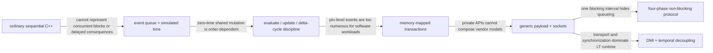
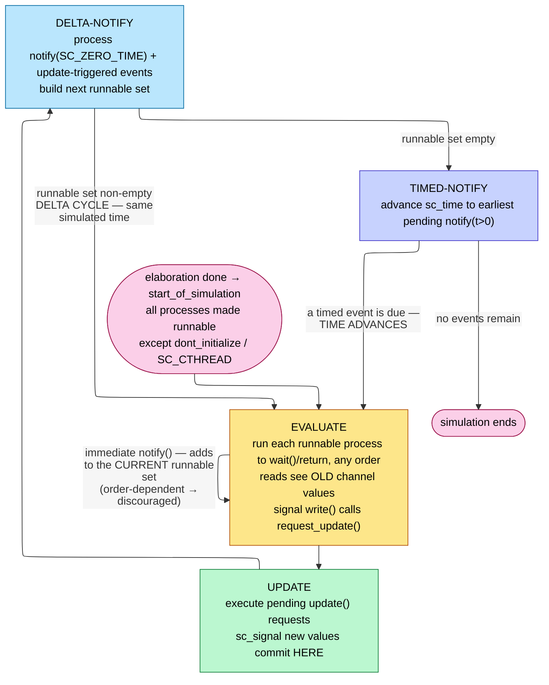

# SystemC and TLM-2.0 — A Discrete-Event Kernel and an Interoperable Transaction Layer, Built in C++

> **Stage:** 00 · Fundamentals — the modeling *substrate* the architecture pages use. This is the language and event kernel underneath the virtual platforms and transaction-level models that [SoC/chiplet simulation methodology](../01_Architecture_and_PPA/04_SoC_and_Chiplet_Architecture/00_Design_Methodology/03_SoC_Chiplet_Simulation_Methodology_and_Evidence.md) commissions and composes.
> **Prerequisites:** [Procedural_Processes_and_IPC](../03_Frontend_RTL_and_Verification/03_Procedural_Processes_and_IPC.md) (the SystemVerilog event scheduler / delta-cycle / NBA-region model — SystemC's evaluate–update is the same idea in a C++ library), [SoC/chiplet simulation methodology](../01_Architecture_and_PPA/04_SoC_and_Chiplet_Architecture/00_Design_Methodology/03_SoC_Chiplet_Simulation_Methodology_and_Evidence.md) (the discrete-event engine and its time-ordered invariant), C++ (templates, virtual dispatch, RAII).
> **Hands off to:** [SoC/chiplet simulation methodology](../01_Architecture_and_PPA/04_SoC_and_Chiplet_Architecture/00_Design_Methodology/03_SoC_Chiplet_Simulation_Methodology_and_Evidence.md) (LT/AT virtual platforms in the fidelity ladder), [gem5](../01_Architecture_and_PPA/01_CPU_Architecture/08_Simulation/01_gem5.md) (the SystemC-TLM co-simulation bridge), [AHB_AXI_APB](../01_Architecture_and_PPA/04_SoC_and_Chiplet_Architecture/03_Transaction_Protocols/01_AHB_AXI_APB.md) & [DDR_Controller](../01_Architecture_and_PPA/04_SoC_and_Chiplet_Architecture/02_Shared_Memory/01_DDR_Controller.md) (the memory-mapped protocols the generic payload abstracts).

**First-use vocabulary.** **SystemC** is a C++ library plus a discrete-event simulation kernel. **Electronic-system-level (ESL)** means modeling a system above register-transfer level. **Register-transfer level (RTL)** models clocked registers and combinational transfers precisely enough for logic synthesis. **Transaction-level modeling (TLM)** replaces pin toggles with operations such as “read 8 bytes at address X.” An **instruction-set simulator (ISS)** executes target-machine instructions on the host. **Direct Memory Interface (DMI)** lets a model use a validated host pointer instead of transporting every memory access. **Loosely timed (LT)** prioritizes software execution speed; **approximately timed (AT)** exposes enough phases to model arbitration and contention. **RAII** is C++ resource acquisition is initialization: object lifetime owns resource lifetime.

---

## 0. Why this page exists

You cannot boot Linux on a chip that does not exist, and you cannot afford to boot it on the chip's RTL (register-transfer level): a full-SoC RTL simulation runs at ~10²–10⁴ effective Hz ([SoC/chiplet simulation methodology](../01_Architecture_and_PPA/04_SoC_and_Chiplet_Architecture/00_Design_Methodology/03_SoC_Chiplet_Simulation_Methodology_and_Evidence.md)), so a 30-second Linux boot — a few tens of billions of target cycles — would take **weeks to months** of wall-clock. Yet firmware, drivers, the BSP (board-support package), and the OS bring-up must be *working* the day silicon returns, or the schedule slips by that same year. The only way out is to model the machine at a coarser rung: throw away the per-cycle, per-net detail and model only the thing software can observe — **memory-mapped transactions** (a CPU reads/writes an address; a device responds). That buys the **100–1000×** over RTL the [SoC/chiplet simulation methodology](../01_Architecture_and_PPA/04_SoC_and_Chiplet_Architecture/00_Design_Methodology/03_SoC_Chiplet_Simulation_Methodology_and_Evidence.md) ladder quotes for transaction-level modeling (TLM), and with direct-memory and temporal-decoupling tricks (§6) far more — enough to boot an OS in seconds and run software regressions overnight.

**SystemC** is the substrate that makes this practical. It is *not a new language* — it is a **C++ class library** (standardized as IEEE 1666) that adds two things C++ lacks: (1) a **discrete-event simulation kernel** so that concurrent hardware blocks can be described and advanced in simulated time, and (2) **hardware data types and structure** (bit-accurate integers, modules, ports, channels). Because it is C++, a model is *compiled native code* — the modeled CPU's instruction-set simulator, the peripheral's behavior, and the firmware under test all run as one fast host binary, with no interpreter tax. That is the whole reason ESL (electronic-system-level) modeling settled on C++ rather than an HDL.

**TLM-2.0** solves the second-order problem: once everyone models transactions, they each invent a *different* "read/write a burst" API, and no two vendors' models connect without glue. TLM-2.0 is an **interoperability standard** layered on SystemC — a fixed transaction object (the *generic payload*), fixed **sockets**, and fixed **transport interfaces** — so that any compliant initiator can drive any compliant target. It is to system models what AXI is to on-chip wires: not the fastest possible point solution, but the one everyone can plug into.

This page derives both from first principles: the kernel as a discrete-event simulator (§1–§4, connecting straight to [SoC/chiplet simulation methodology](../01_Architecture_and_PPA/04_SoC_and_Chiplet_Architecture/00_Design_Methodology/03_SoC_Chiplet_Simulation_Methodology_and_Evidence.md)), and TLM-2.0 as the transaction layer on top (§5–§6), ending with where each rung is the right one (§7).

### 0.1 The modeling stack evolves by removing one bottleneck at a time



Each step deliberately discards or constrains information. Transaction models are faster because they do **not** calculate every wire transition; LT is faster than AT because it does **not** preserve every arbitration boundary. That makes fidelity an explicit contract: before trusting a result, name which events exist in the model, what latency is annotated, what contention is represented, and what behavior is absent.

---

## 1. The SystemC kernel — a discrete-event simulator built as a C++ library

[SoC/chiplet simulation methodology](../01_Architecture_and_PPA/04_SoC_and_Chiplet_Architecture/00_Design_Methodology/03_SoC_Chiplet_Simulation_Methodology_and_Evidence.md) derives the generic discrete-event engine: a time-ordered event queue, `pop-min` processing, the correctness invariant that "no event schedules a consequence in the past" (all latencies $\ge 0$), and — the load-bearing detail for this page — the observation that **zero-latency chains within a tick force the engine to add a delta/priority sub-order that sequences zero-time updates without breaking causality.** SystemC *is* that engine, and its **delta cycle** *is* that sub-order, realized as a concrete two-phase protocol. Everything in §1 is that abstract machine made specific.

### 1.1 Elaboration vs simulation — two disjoint phases

A SystemC program runs in two strictly separated phases, and conflating them is the first novice error:

- **Elaboration** builds the *structure*: the constructor of every `sc_module` runs, sub-modules are instantiated, channels are created, **ports are bound** to channels, and processes are *registered* with the kernel. No simulated time passes; no process bodies run (beyond construction). At the end, the module/port/channel graph is **fixed** — SystemC structure is *static* (there is no runtime module creation), which is what lets the kernel pre-resolve every interface binding and iterate cheaply thereafter. Callbacks `before_end_of_elaboration → end_of_elaboration → start_of_simulation` fire at the boundary.
- **Simulation** begins when `sc_start()` is called: the scheduler runs, advancing `sc_time` and triggering processes, until the queue empties, the time limit is hit, or `sc_stop()` is called.

The separation is the same "build the graph once, then run it" discipline as the static elaboration of an RTL netlist — and for the same reason: a static structure has a fixed cost per event, so the per-event work $i_{\text{ev}}$ of the [slowdown identity $S\approx w=i_{\text{ev}}\,n_{\text{ev}}$](../01_Architecture_and_PPA/04_SoC_and_Chiplet_Architecture/00_Design_Methodology/03_SoC_Chiplet_Simulation_Methodology_and_Evidence.md) is bounded and small.

### 1.2 The scheduler — evaluate, update, and the delta cycle

The core of the kernel is a loop over **delta cycles**. A delta cycle is a step of **zero simulated time** containing three sub-phases, run in this exact order:

1. **Evaluate.** The kernel runs the *runnable* processes one at a time, in an **unspecified order**, each to completion (`SC_METHOD`) or up to its next `wait()` (`SC_THREAD`). During evaluation a process may (a) *read* channels, (b) *write* channels — but a write to a **primitive channel** such as `sc_signal` does **not** change the value now; it calls `request_update()` to schedule the change — and (c) create **notifications** (§1.4).
2. **Update.** After the runnable set is exhausted, the kernel executes every pending `update()` request. **This is where `sc_signal` new values become visible.** Nothing was visible during evaluate; everything commits here, atomically.
3. **Delta notification.** Pending **delta notifications** (`notify(SC_ZERO_TIME)`) and the events triggered by the just-committed updates determine the *next* runnable set. If it is non-empty, loop to step 1 for **another delta cycle at the same simulated time**.

When no process is runnable after a delta cycle, the kernel enters the **timed** phase: it advances `sc_time` to the earliest pending timed notification (`notify(t)`, $t>0$), makes the corresponding processes runnable, and resumes at evaluate. When nothing is left, simulation ends.



This is **exactly** the SystemVerilog region model of [Procedural_Processes_and_IPC](../03_Frontend_RTL_and_Verification/03_Procedural_Processes_and_IPC.md): SystemC's *evaluate* = SV's *Active* region (blocking reads/writes, RHS evaluation), SystemC's *update* = SV's *NBA* region (non-blocking `<=` commit), and the delta-cycle loop is SV's "iterate zero-delay updates to a fixed point within the time slot." An `sc_signal` write *is* a non-blocking assignment; a plain C++ member write *is* a blocking assignment. If you already know why RTL puts `<=` in the clocked block, you already know why `sc_signal` uses request-update — it is the same theorem.

The smallest concrete trace is two processes, `producer` and `consumer`, joined by `sc_signal<int> x`. At time 10 ns and delta 0, `producer` reads old `x=0` and requests `x.write(1)`. The write does **not** mutate the readable value. At the update boundary the channel commits `x=1`; `value_changed_event()` then makes `consumer` runnable in delta 1 at the same 10 ns. The consumer can now read 1. No target clock tick occurred between the write and observation:

```wavedrom
{ "signal": [
  { "name": "kernel phase", "wave": "345345.", "data": ["eval d0", "update d0", "notify d0", "eval d1", "update d1", "notify d1"] },
  { "name": "simulated time", "wave": "3.....4", "data": ["10 ns", "next timed event"] },
  { "name": "producer runnable", "wave": "10....." },
  { "name": "x.read()", "wave": "3.4....", "data": ["0 old", "1 committed"] },
  { "name": "pending x", "wave": "03.0...", "data": ["1"] },
  { "name": "consumer runnable", "wave": "0..10.." }
], "head": { "text": "One sc_signal write: request in evaluate, commit in update, observer wakes next delta at the same time" } }
```

The “pending x” row is simulator-owned state, not an extra hardware register. If the producer had assigned an ordinary shared C++ integer instead, the consumer might see 0 or 1 depending on process order; the request/update split is precisely the mechanism that removes that ambiguity.

### 1.3 Why evaluate–update makes zero-time logic deterministic — the derivation

The evaluate–update split is not an implementation nicety; it is what buys **determinism independent of the order processes happen to run**, which a naive "run processes, mutate shared state" model cannot give on a sequential host.

**Claim.** If processes communicate only through primitive channels (request-update), the state committed by a delta cycle is a function of the pre-delta state alone — independent of the order in which runnable processes execute in the evaluate phase.

**Proof.** Let $S$ be the vector of channel values *frozen* at the start of the evaluate phase. Every read during evaluate returns a component of $S$ (no write is visible until update). Hence each runnable process $P_i$ computes its write requests as a *pure function of the frozen state*, $r_i = f_i(S)$, with no dependence on whether $P_j$ ran before or after it — because $P_j$'s writes are invisible during evaluate. The multiset of requests $\{f_i(S)\}$ is therefore order-independent. In the update phase each channel resolves its new value from the requests targeting it; for a single-writer `sc_signal` this is deterministic (multiple writers to one signal in a delta is a modeling error, exactly like multiple RTL drivers). So the post-update state $S' = U(S)$ is a deterministic function of $S$. $\square$

**Why this makes combinational feedback deterministic.** A zero-delay combinational network settles as a **fixed-point iteration** over delta cycles: $S \to U(S) \to U(U(S)) \to \dots$, each step order-independent by the claim, all at the *same* simulated time. If the network is well-formed (no zero-delay cycle that fails to converge) it reaches a stable fixed point $S^\star = U(S^\star)$ in a bounded number of delta cycles — at most the combinational depth. The determinism is precisely that the sequence $U^k(S)$ does not depend on scheduler order, so the fixed point is reached the same way on every run and every simulator. A *true* zero-delay combinational loop (an odd-inversion ring) has **no** fixed point: $U$ has no stable point and the kernel spins delta cycles forever at one time value — the model of a real oscillation, and the reason zero-delay comb loops are illegal in SystemC just as in RTL.

**Worked number.** Model an $N$-stage ripple (e.g., an 8-bit ripple-carry) as $N$ `SC_METHOD`s, each sensitive to the previous stage's `sc_signal`. Stage $k$ cannot see stage $k{-}1$'s new value until an update, so the carry propagates **one stage per delta cycle**: the network settles in **$N=8$ delta cycles at $0$ ns of simulated time**. The eight deltas are the causal ordering imposed on zero-time events; the simulated clock has not moved. This is the concrete face of "delta cycles sequence zero-time updates without breaking causality" from [SoC/chiplet simulation methodology](../01_Architecture_and_PPA/04_SoC_and_Chiplet_Architecture/00_Design_Methodology/03_SoC_Chiplet_Simulation_Methodology_and_Evidence.md) — and the per-delta cost (evaluate + update + notify over the runnable set, a few hundred host instructions per activated process) is why a design that generates thousands of deltas per simulated microsecond pays for them in the $n_{\text{ev}}$ term of the slowdown identity.

### 1.4 Notification phases — immediate, delta, timed — and why immediate is dangerous

An `sc_event` is the kernel's synchronization primitive; a process suspends on it (`wait(e)`) and is resumed when it is notified. There are exactly three notification timings, and they map onto the three ways time can (not) advance:

| Notification | Call | Runnable when | Determinism |
|---|---|---|---|
| **Immediate** | `e.notify()` | **within the current evaluate phase** (this delta) | **order-dependent** — discouraged |
| **Delta** | `e.notify(SC_ZERO_TIME)` | next delta cycle, **same** simulated time | deterministic |
| **Timed** | `e.notify(t)`, $t>0$ | after all deltas at now, at time `now+t` | deterministic |

**Why immediate notification breaks the §1.3 guarantee.** Immediate notification makes a waiting process runnable *inside the evaluate phase that is already running*. Whether that newly-runnable process executes before or after the other already-runnable processes now depends on the kernel's unspecified evaluation order — the very order the evaluate–update split was designed to make irrelevant. The moment a process's behavior depends on "did I run before or after the process I just notified," the result is **non-reproducible** across simulators and even across runs. Immediate notification also cannot be cancelled, and it does not participate in the clean "reads see old values" contract. Delta notification restores determinism by deferring the wakeup to the *next* delta — after the current evaluate and update phases have fully closed — so every observer still sees a consistent committed state. The rule: **never signal cross-process synchronization with immediate notification; use `notify(SC_ZERO_TIME)`.** (An event holds at most one pending notification; if re-notified, the *earliest* pending time wins, and immediate outranks delta outranks timed.)

`sc_time` itself is a 64-bit fixed-point count of a resolution quantum (default $1\text{ ps}$), so simulated time is exact integer arithmetic — no floating-point drift in the event queue keys, which is what keeps the time-ordered `pop-min` invariant of [SoC/chiplet simulation methodology](../01_Architecture_and_PPA/04_SoC_and_Chiplet_Architecture/00_Design_Methodology/03_SoC_Chiplet_Simulation_Methodology_and_Evidence.md) exact.

---

## 2. Structure — modules, interfaces, ports, channels

SystemC's structural model exists to answer one question cleanly: **how does one block talk to another without depending on how the other is built?** The answer — *interface-method call through a port bound to a channel* — is the seed that grows into TLM-2.0.

- **`sc_module`** is the structural unit: a C++ class (via the `SC_MODULE` macro) holding ports, channels, processes, and sub-modules. Hierarchy is composition of modules.
- **Interface** (`sc_interface`): a pure-virtual set of methods — *what* you can do, not *how*. Example: `sc_signal_in_if<T>` declares `read()`; `tlm_fw_transport_if` declares `b_transport()`. An interface is a contract with no data.
- **Channel:** an object that *implements* one or more interfaces — the *how*. Two flavors:
  - **Primitive channel** (`sc_prim_channel`): no hierarchy, no processes; it participates in the **update phase** via request-update. `sc_signal`, `sc_fifo`, `sc_mutex`, `sc_semaphore` are primitive. These are the objects whose determinism §1.3 proved.
  - **Hierarchical channel:** itself an `sc_module` that also implements an interface, so it can contain processes, ports, and sub-modules — used to model a whole protocol (a bus, an arbiter) behind a simple interface.
- **Port** (`sc_port<IF>`): a module's *requirement* — "I need something that implements `IF`." The module calls interface methods **through** the port; at elaboration the port is *bound* to a channel that implements `IF`, and the call dispatches to that channel. This is the **interface-method-call (IMC)** idiom.
- **Export** (`sc_export<IF>`): the dual — a module *provides* an interface upward, publishing an implementation (its own or a forwarded sub-channel's) to whoever binds to it.

**Why the channel sits *behind* an interface — the decoupling theorem.** Because a module calls `port->method()` and never names a concrete channel type, you can **swap the channel implementation without touching the module**: replace an `sc_signal` with a logging channel, or a simple bus with an arbitrated one, and every module bound to that interface is unchanged and recompiles clean. Communication is thereby separated from computation *at the type level* — the module's code depends only on the interface's method signatures, a minimal-sufficient contract. This is the exact principle TLM-2.0 scales up in §5: standardize the interface (and the transaction it carries) and any implementation behind it interoperates. The IMC indirection costs one virtual dispatch per call — a handful of host instructions, negligible against the transaction work it guards, and the reason the abstraction is free enough to always use.

---

## 3. Processes — the two kinds, sensitivity, and the determinism boundary

A process is the kernel's unit of concurrency. SystemC has two that matter (plus a clocked specialization), and the difference is entirely about **whether the process owns an execution stack**.

- **`SC_METHOD`** — **no own stack.** It runs to completion every time it is triggered and **cannot call `wait()`** (there is no stack to suspend). It models combinational logic or a single clocked evaluation: re-invoked from the top on each trigger. Cheap — a plain function call, no coroutine context switch — which is why cycle-/signal-level models favor it.
- **`SC_THREAD`** — **own coroutine stack.** It is launched once and runs a persistent body (typically `while(true){ …; wait(); }`), suspending at `wait()` and resuming *where it left off* with its local state intact. It models a process with memory of its own progress — a bus master issuing a sequence, a CPU model's main loop. More expensive: a stack allocation plus a context switch on every `wait()`/resume.
- **`SC_CTHREAD`** — a clocked `SC_THREAD` implicitly sensitive to a clock edge; `wait()` waits for the next edge. Used for cycle-based/behavioral-synthesis styles; largely subsumed by `SC_THREAD` + `wait(clk.posedge_event())`.

**Static vs dynamic sensitivity.** *Static* sensitivity is fixed at elaboration (`sensitive << a << b;` for a method; the argument-less `wait()` in a thread waits on it) — the analog of an RTL sensitivity list. *Dynamic* sensitivity overrides it per-invocation: a thread does `wait(event)`, `wait(t)`, or `wait(e1 | e2)`; a method uses `next_trigger(...)` to change what wakes it next time. Dynamic sensitivity is what lets one thread walk a protocol (wait for grant, then wait for data, then wait for ack) without a state machine of static-sensitive methods.

**The determinism guarantee, stated precisely, and where it breaks.** SystemC guarantees a *reproducible* result **iff** every inter-process interaction goes through primitive channels (§1.3) and events use delta/timed (not immediate) notification. It breaks in three places, all the same failure — a value observed before it is deterministically committed:

1. **Immediate notification** (§1.4) — an order-dependent wakeup inside evaluate.
2. **Shared plain variables** — if process $A$ writes a plain `int` member and process $B$ reads it in the *same* evaluate phase, the answer depends on run order (no request-update deferral protects it). The fix is to communicate through an `sc_signal`/`sc_fifo`.
3. **Explicit arbitration** (`sc_mutex`, `sc_semaphore`) where the grant order among simultaneously-waiting processes is unspecified.

The teachable boundary: **the kernel makes *channel* communication deterministic; it makes *nothing else* deterministic.** Every reproducibility bug in a SystemC model is a value that escaped the channel discipline — the direct analog of an RTL race that survives "correct-looking" code because it crossed regions incorrectly ([Procedural_Processes_and_IPC](../03_Frontend_RTL_and_Verification/03_Procedural_Processes_and_IPC.md)).

---

## 4. Bit-accurate data types and their simulation cost

Native C++ has `int` (32-bit) and `long`/`int64_t` (64-bit) and nothing between or beyond, with no 4-state and no fixed-point. Hardware needs all of those, so SystemC ships a data-type library — and each type buys accuracy at a measurable **simulation-speed** cost, which is the whole reason to use them *only where required*.

| Type | Models | Range / state | Cost vs native |
|---|---|---|---|
| `sc_int<W>` / `sc_uint<W>` | a register of exact width $W$ | signed/unsigned, $W\le 64$ | ~2–5× (width mask + sign-extend per op) |
| `sc_bigint<W>` / `sc_biguint<W>` | wide datapaths | arbitrary $W>64$ | ~10–50× (multi-word arrays) |
| `sc_bv<W>` | large bit vectors, no arithmetic | 2-state (0/1) | moderate; cheaper than `sc_lv` |
| `sc_lv<W>` | buses, tri-state, uninitialized | **4-state** (0/1/X/Z) | ~10–100× (2 bits/logic-bit + per-bit tables) |
| `sc_fixed<W,I>` / `sc_ufixed` | DSP/ML fixed-point | $W$ bits, $I$ integer + rounding/overflow modes | high (quantization + saturation logic per op) |

**Why they exist — the accuracy each recovers.** `sc_uint<12>` **wraps at $2^{12}=4096$**; a native `unsigned` does not, so a 12-bit counter or an address-truncation bug is only faithful with the sized type. `sc_lv` carries **X** (unknown) and **Z** (high-impedance), which native types cannot represent — needed to detect uninitialized reads and to model tri-state buses. `sc_fixed<W,I>` carries the exact quantization (rounding mode) and overflow (saturate vs wrap) behavior a DSP or ML datapath will have in silicon, so a bit-exact reference can be validated against RTL. (The RTL side of this — 2-state vs 4-state, packed widths — is [Data_Types_and_Basics](../03_Frontend_RTL_and_Verification/02_Data_Types_and_Basics.md).)

**Why the cost matters — the work-per-event lever.** A native `int32` add is *one* host instruction. An `sc_int<W>` add is that plus a mask-and-sign-extend to $W$ bits (a few instructions); an `sc_bigint<256>` add loops over four 64-bit words; an `sc_lv<W>` add walks per-bit 4-state logic tables. In the [slowdown identity $S\approx i_{\text{ev}}\,n_{\text{ev}}$](../01_Architecture_and_PPA/04_SoC_and_Chiplet_Architecture/00_Design_Methodology/03_SoC_Chiplet_Simulation_Methodology_and_Evidence.md), these types inflate $i_{\text{ev}}$ — the host instructions per modeled operation — directly. A datapath modeled entirely in `sc_lv` can run **10–100× slower** than the same model in native types with a few sized types at the boundaries. The senior rule: **model in native C++ (`uint32_t`, `uint64_t`) by default, and reach for `sc_` types only on the specific signals whose exact width, 4-state, or fixed-point behavior the study actually needs** — the same "pay for fidelity only where a decision depends on it" discipline as the whole [fidelity ladder](../01_Architecture_and_PPA/04_SoC_and_Chiplet_Architecture/00_Design_Methodology/03_SoC_Chiplet_Simulation_Methodology_and_Evidence.md).

---

## 5. TLM-2.0 — the transaction-level interoperability standard

### 5.1 The problem it solves — separate computation from communication, then standardize the communication

§2 showed that SystemC already separates *what a module computes* from *how it communicates* (channel behind an interface). But an interface only guarantees interoperability if **everyone agrees on the same interface and the same data object**. Before TLM-2.0 they did not: each modeling team defined its own transaction struct and its own read/write method set, so a memory model from vendor A could not be dropped onto a bus model from vendor B without a hand-written adapter — and a large SoC integrates dozens of such IP models. TLM-2.0 (an Accellera/OSCI standard, folded into IEEE 1666 since the 2011 revision) fixes the interface *and* the transaction:

- a single standard transaction object — the **generic payload** — for memory-mapped read/write traffic;
- a fixed pair of **transport interfaces** (blocking and non-blocking);
- **sockets** that bundle the forward and backward interfaces and check compatibility at compile time;
- a **base protocol** that pins down the legal call/phase sequence.

The payoff is stated as the *interoperability layer*: two models that both speak the base protocol over the generic payload connect with **zero glue**. Specialized needs are met by *extensions* (below) that are **ignorable** — a compliant target must still function if it ignores an extension it does not understand — so specialization never costs interoperability.

### 5.2 The generic payload — one object so any target can decode any initiator

`tlm_generic_payload` is the lingua franca. Its fields are exactly the minimal-sufficient description of a memory-mapped bus transaction — derive them from "what must a target know to service a read or write, and what must it report back?":

| Field | Purpose |
|---|---|
| **Command** | `TLM_READ_COMMAND`, `TLM_WRITE_COMMAND`, `TLM_IGNORE_COMMAND` (the last for DMI/probe with no data transfer) |
| **Address** | the target-relative address |
| **Data pointer** | pointer to the initiator's data buffer — target reads/writes **through** it, no copy |
| **Data length** | number of bytes in the transfer |
| **Byte-enable pointer + length** | which byte lanes are active (partial writes / lane masking); the pattern repeats across the transfer |
| **Streaming width** | for wrapping/streaming bursts (< data length ⇒ the address wraps within the window) |
| **Response status** | init `TLM_INCOMPLETE_RESPONSE`; target **must** set `TLM_OK_RESPONSE` or a specific error (`TLM_ADDRESS_ERROR_RESPONSE`, `TLM_BYTE_ENABLE_ERROR_RESPONSE`, …) |
| **DMI-allowed hint** | target sets it to advertise that a direct pointer is available (§5.6) |
| **Extensions** | array of typed, statically-indexed pointers to user objects — the *extensibility* escape hatch |

**Why a *standard* object is what enables interoperability.** If two models share the exact object layout and its rules — data-pointer ownership stays with the initiator for the call's duration, response status starts INCOMPLETE and the target must overwrite it, byte-enables mask lanes — then a target can decode *any* initiator's request and an initiator can interpret *any* target's response, with no per-pair negotiation. The **extensions** array is what keeps this from being a straitjacket: protocol-specific attributes (an AXI QoS field, a cache-attribute, a master ID) ride as ignorable extensions, so an AXI-flavored model and a generic memory still interoperate over the same payload — the generic part is understood by all, the extension by those who care. That "shared core + ignorable extension" structure is the same interoperability pattern as an extensible packet header.

The data-by-pointer choice is a performance decision: a burst of $L$ bytes is transported by passing **one pointer**, not by copying $L$ bytes into the transaction — $O(1)$, not $O(L)$, per transfer.

### 5.3 Sockets — the bound pair that carries both directions

A plain port carries one direction; a transaction needs *two* (an initiator drives requests forward, a target drives responses back, and — for non-blocking — each can call the other over time). A **socket** bundles them:

- **`tlm_initiator_socket`** = a forward **port** (to call `b_transport` / `nb_transport_fw` / `get_direct_mem_ptr` / `transport_dbg` on the target) **plus** a backward **export** (to receive the target's `nb_transport_bw` / `invalidate_direct_mem_ptr`).
- **`tlm_target_socket`** = the mirror: a forward export (it *implements* the forward interface) plus a backward port (to call back into the initiator).

Binding `initiator_socket.bind(target_socket)` wires **both** paths at once. Sockets are templated on the **bus width** and a **protocol-traits** type, so the compiler rejects a bind between incompatible protocols — a static interoperability check, not a runtime surprise. The convenience sockets in `tlm_utils` (`simple_initiator_socket`, `simple_target_socket`) let a model register callback methods instead of subclassing, which is why most real models use them. This bidirectional, type-checked bundle is the reason sockets exist beyond §2's plain ports: the non-blocking backward call in §5.5 has nowhere to go without the socket's backward path.

### 5.4 Blocking transport — one call, whole transaction (the LT workhorse)

The **blocking** interface is a single method:

```cpp
void b_transport(tlm_generic_payload& trans, sc_time& delay);
```

One call carries the entire transaction: the initiator fills the payload, calls `b_transport`, and on return reads the response status and (for reads) the data. The target may **consume simulated time** — it can call `wait()` inside `b_transport` to model latency — which is why `b_transport` must be invoked from an `SC_THREAD` (an `SC_METHOD` has no stack to block on, §3). The `delay` argument is the temporal-decoupling offset (§6.2): the target *adds* its latency to `delay` and returns, letting the initiator account for time without a kernel synchronization. This is **two timing points** per transaction (call = begin, return = end) folded into one call — coarse, fast, and exactly what **loosely-timed (LT)** modeling uses. It is the interface a CPU model's load/store issues, and the one that boots operating systems.

#### 5.4.1 Worked LT trace: one CPU load becomes one final result

Assume an ISS executes `LW x5, 0x20(x10)`, register `x10=0x8000_1000`, memory is little-endian, the address map routes `0x8000_0000–0x8fff_ffff` to DRAM, and the memory target annotates 40 ns. The simulated instruction follows this exact ownership chain:

| Step | Component that owns the step | State before | Action | State after |
|---:|---|---|---|---|
| 1 | ISS | `PC`, decoded `LW`, `x10` | computes effective address $0x80001000+0x20$ | address `0x80001020`; destination tag `x5` |
| 2 | CPU initiator | empty/recycled payload; 4-byte buffer | sets READ, address, pointer, length 4, streaming width 4, no byte enables, response `INCOMPLETE` | complete request object; local delay $\tau=0$ |
| 3 | interconnect target/initiator pair | global address | decodes region and subtracts target base if the target uses local addresses | routed to DRAM, local offset `0x1020` |
| 4 | memory target | payload and backing byte array | copies bytes `[78 56 34 12]` into the initiator buffer; adds 40 ns; sets `TLM_OK_RESPONSE` | buffer represents `0x12345678`; $\tau=40$ ns |
| 5 | CPU initiator | returned payload | checks response, reconstructs the little-endian word, sign-extends because `LW` is signed | candidate result `0x0000000012345678` |
| 6 | ISS commit | destination tag and candidate result | writes architectural register and advances the instruction model | `x5=0x12345678`; counters: 1 instruction, 1 load, 4 bytes |
| 7 | time manager | local delay 40 ns | either accumulates it or calls `wait(40 ns)` | observable simulated time eventually advances by 40 ns |

The final architectural result is not calculated from “40 ns.” Data correctness comes from address decode plus byte transfer; latency is a separate annotation used to update simulated time. An LT target normally does **not** determine whether another master queued ahead of this request, so the 40 ns is a configured service estimate, not an emergent contention measurement.

This trace also shows where failures belong. Bad address decode produces `TLM_ADDRESS_ERROR_RESPONSE`; an unsupported byte-enable pattern produces `TLM_BYTE_ENABLE_ERROR_RESPONSE`; a target that forgets to overwrite `INCOMPLETE` violates the protocol; a stale or prematurely freed data buffer is a C++ lifetime bug; incorrect sign extension is an ISS semantic bug. Keeping these ownership boundaries explicit is what makes a platform debuggable.

### 5.5 Non-blocking transport — four phases, for arbitration-accurate timing

When you need to model **contention and pipelining** — a bus arbiter, a memory controller reordering requests — one blocking call is too coarse; you need to expose the transaction's *timing points* so multiple in-flight transactions can interleave. The **non-blocking** interface does this with two methods and a **phase** argument:

```cpp
tlm_sync_enum nb_transport_fw(tlm_generic_payload& trans, tlm_phase& ph, sc_time& delay); // initiator → target
tlm_sync_enum nb_transport_bw(tlm_generic_payload& trans, tlm_phase& ph, sc_time& delay); // target → initiator
```

The **base protocol** defines four phases in order — **`BEGIN_REQ → END_REQ → BEGIN_RESP → END_RESP`** — split across the two paths by who owns each edge: the **initiator** drives `BEGIN_REQ` (request starts) and `END_RESP` (response consumed) on the *forward* path; the **target** drives `END_REQ` (request accepted) and `BEGIN_RESP` (response starts) on the *backward* path. The return value `tlm_sync_enum` controls how the phase progresses:

- **`TLM_ACCEPTED`** — callee has *not* advanced the phase; the transition will come later on the opposite path (the general case).
- **`TLM_UPDATED`** — callee advanced the phase/`delay` synchronously in this call (a shortcut, one hop saved).
- **`TLM_COMPLETED`** — the transaction is finished early; skip the remaining phases.

```mermaid
sequenceDiagram
    autonumber
    participant I as Initiator (e.g. CPU / DMA)
    participant T as Target (e.g. memory / slave)
    Note over I,T: one ref-counted payload passed by reference; every call carries an sc_time delay
    I->>T: nb_transport_fw(trans, BEGIN_REQ, delay)
    T-->>I: TLM_ACCEPTED
    T->>I: nb_transport_bw(trans, END_REQ, delay)
    I-->>T: TLM_ACCEPTED
    Note over I,T: request phase closed → initiator may issue the NEXT BEGIN_REQ (pipelining)
    Note over T: target models access latency, adds it to delay
    T->>I: nb_transport_bw(trans, BEGIN_RESP, delay)
    I-->>T: TLM_ACCEPTED
    I->>T: nb_transport_fw(trans, END_RESP, delay)
    T-->>I: TLM_COMPLETED
```

The same protocol viewed as time rather than call stack makes the two exclusion rules visible:

```wavedrom
{ "signal": [
  { "name": "time",        "wave": "p..........." },
  { "name": "txn A phase", "wave": "034..56....", "data": ["BEGIN_REQ", "END_REQ", "BEGIN_RESP", "END_RESP"] },
  { "name": "request busy", "wave": "01.0........" },
  { "name": "response busy","wave": "0....1.0...." },
  { "name": "txn B phase", "wave": "x..34....56.", "data": ["BEGIN_REQ", "END_REQ", "BEGIN_RESP", "END_RESP"] }
], "head": { "text": "AT base protocol: B may begin after A's END_REQ even while A still waits for and occupies the response path" } }
```

For a base-protocol socket, do not issue a second `BEGIN_REQ` while the request exclusion rule is active, and do not begin a second response while the response exclusion rule is active. `END_REQ` releases the request channel; `END_RESP` releases the response channel. An implementation may pipeline A and B because these are separate channels, but it must retain per-payload state until that payload completes. A common design is a transaction table keyed by payload address, storing current phase, target route, timestamps, and reference count.

**Why four phases, and why `END_REQ` matters.** Two timing points (LT) can only say "the transaction happened between $t_0$ and $t_1$." Four points separate the **request channel** from the **response channel**: once the target sends `END_REQ`, the request is *accepted* and the initiator may launch the *next* request while the current response is still pending — that is **pipelining/outstanding transactions**, the thing that produces bus utilization and queueing. Model an arbiter as a finite-rate server and the gap between a request's `BEGIN_REQ` and its `END_REQ` *is* the arbitration/queueing delay, emergent exactly as in [SoC/chiplet simulation methodology](../01_Architecture_and_PPA/04_SoC_and_Chiplet_Architecture/00_Design_Methodology/03_SoC_Chiplet_Simulation_Methodology_and_Evidence.md) — no "contention formula" is written, it falls out of serializing `END_REQ` grants. Each phase call carries its own `delay`, so per-phase latencies (arbitration, request transport, target access, response transport) are annotated independently, giving the **approximately-timed (AT)** accuracy that LT throws away. The `tlm_phase` type is itself extensible, so custom protocols can add phases (e.g., a separate address/data phase) while non-extended targets still see the base four.

**AT result reconstruction.** Record timestamps $t_{BR},t_{ER},t_{BP},t_{EP}$ at the four phase boundaries. Then request acceptance delay is $t_{ER}-t_{BR}$, target/queue residence is $t_{BP}-t_{ER}$, response consumption is $t_{EP}-t_{BP}$, and end-to-end latency is $t_{EP}-t_{BR}$. Count accepted bytes at `END_REQ` or completed bytes at `END_RESP`—choose one definition and use it consistently. Over a measurement window $T$, throughput is completed bytes divided by $T$; queue occupancy is the time integral of outstanding accepted requests; Little's law $L=\lambda W$ is an excellent cross-check between average occupancy $L$, completion rate $\lambda$, and average residence time $W$.

### 5.6 DMI and debug transport — the two side channels

**Direct Memory Interface (DMI).** For an LT model, routing *every* CPU load/store through `b_transport` is the bottleneck: a transaction fill + virtual dispatch + address decode is ~tens of host instructions per access, dwarfing the one instruction the modeled load "is." DMI removes it. The initiator calls

```cpp
bool get_direct_mem_ptr(tlm_generic_payload& trans, tlm_dmi& dmi_data);
```

and if the target grants, it fills `dmi_data` with a **raw host pointer** to the memory backing the region, the **address range** `[start, end]` for which the pointer is valid, the **access type** (read/write), and the **read/write latencies**. The initiator then services all accesses in that range with **direct pointer reads/writes**, bypassing transport entirely.

**Worked number.** A `b_transport` access costs ~80 host instructions (payload setup + dispatch + decode + response); a DMI access is a bounds check plus a dereference, ~2 host instructions — **~40× on the memory path**. For a CPU model where a third of instructions touch memory, DMI is the difference between ~10 MIPS and ~100s of MIPS, and is why LT virtual platforms boot in seconds.

**DMI invalidation — the correctness hazard.** A DMI pointer is a *cache of the address-decode result*, and like any cache it must be invalidated when the mapping changes. The target (or an interconnect on the path) calls, on the backward path,

```cpp
void invalidate_direct_mem_ptr(sc_dt::uint64 start, sc_dt::uint64 end);
```

and every initiator holding a DMI pointer overlapping `[start, end]` **must discard it** and fall back to transport (or re-request DMI). This fires when a region is remapped, its permissions change, an overlay is swapped, or a bus is reconfigured. Getting it wrong is a classic **stale-pointer bug**: the model keeps reading a region that has since been reassigned, and the software running on it sees phantom values — a bug that only appears after a remap, which is why DMI invalidation is part of the standard and not an optimization detail. The bidirectional socket of §5.3 is what makes the backward `invalidate_direct_mem_ptr` call possible.

**Debug transport.** `unsigned int transport_dbg(tlm_generic_payload& trans)` reads/writes target memory **with no simulated-time cost and no side effects** — outside the timing protocol entirely. It is how a debugger inspects a variable, how a loader drops a program image into modeled RAM, and how a testbench peeks state, all without perturbing the timing under study. It returns the number of bytes accessed.

### 5.7 Memory management — pooling and reference counting

In the non-blocking flow a single payload **outlives the call**: it is passed by reference across `fw`/`bw` calls that span multiple delta cycles and simulated-time points, and it may traverse a *chain* of interconnect components, any of which might hold it. So "who frees it, and when?" is a real question — and allocating a fresh payload per transaction (`new`/`delete`) is both slow (heap churn) and leak-prone. TLM-2.0's answer is **reference counting + pooling**:

- the generic payload carries an `acquire()`/`release()` reference count and a pointer to a **memory manager** (`tlm_mm_interface`);
- `release()` at count zero does **not** `delete` — it calls the manager's `free()`, which returns the object to a **pool** for reuse;
- an initiator owns a pool, hands out recycled payloads, and never touches the heap in steady state;
- **extensions** have their own lifetime rules (`set_auto_extension` frees with the payload; sticky extensions persist), and `free()` clears them.

**Why — the same work-per-event argument.** A `malloc`+`free` pair is ~100–200 host instructions; a pool acquire/release is ~5. A virtual platform doing $10^8$ transactions over a boot saves on the order of $10^8 \times 150 \approx 1.5\times10^{10}$ host instructions — **seconds of wall-clock** — purely by not churning the heap, on top of removing allocator-induced nondeterminism and cross-component ownership bugs. Pooling is the transaction-layer analog of the event engine's own "touch only what is active" economy: you pay for transactions, not for allocations.

---

## 6. Coding styles and temporal decoupling

### 6.1 Loosely-timed vs approximately-timed — the speed/accuracy trade, derived

TLM-2.0 names two coding styles, and the choice is the same accuracy↔speed decision as the whole [fidelity ladder](../01_Architecture_and_PPA/04_SoC_and_Chiplet_Architecture/00_Design_Methodology/03_SoC_Chiplet_Simulation_Methodology_and_Evidence.md), specialized to bus modeling:

- **Loosely-timed (LT):** `b_transport`, **two** timing points per transaction, **temporal decoupling** (§6.2) and **DMI** for speed. Timing is functional-grade — enough to run software correctly, not to resolve bus contention. Target: **software bring-up on a virtual platform** (boot the OS, run firmware/drivers, regression). Deliverable = *time-to-software*.
- **Approximately-timed (AT):** `nb_transport_fw/bw`, **four** phases, per-phase latency, and modeled **arbitration/contention**. Slower, but it produces the bus/memory *timing* — latency-vs-load, bandwidth, buffer occupancy — that LT cannot. Target: **architecture/performance study** of the interconnect and memory system ([AHB_AXI_APB](../01_Architecture_and_PPA/04_SoC_and_Chiplet_Architecture/03_Transaction_Protocols/01_AHB_AXI_APB.md), [DDR_Controller](../01_Architecture_and_PPA/04_SoC_and_Chiplet_Architecture/02_Shared_Memory/01_DDR_Controller.md)).

The speed gap is structural: AT does ~2× the timing points, models contention (more events per transaction, larger $n_{\text{ev}}$), forgoes DMI (every access is a transport call, larger $i_{\text{ev}}$), and cannot temporally decouple as aggressively. Each factor multiplies, which is why AT is typically **~1 MIPS** while LT is **tens to hundreds of MIPS** (§6.3).

### 6.2 Temporal decoupling and the quantum keeper — running ahead of time

The single biggest LT speed lever is **not synchronizing with the kernel on every transaction.** A kernel synchronization — yielding the `SC_THREAD`, letting the scheduler advance time, resuming — is a coroutine context switch costing far more than the modeled work of one instruction. Temporal decoupling lets an initiator **run ahead** of global simulated time using a **local time offset**, executing many transactions before it yields, and synchronizing only at a **quantum** boundary.

Mechanically: the initiator keeps a local offset $\tau$, issues `b_transport(trans, τ)`, the target adds its latency to $\tau$ and returns *without* `wait()`, and the initiator keeps going, accumulating $\tau$. When $\tau$ reaches the **global quantum** $Q$, the initiator calls `wait(τ)` once (paying the sync, advancing real simulated time by $Q$) and resets $\tau$. The `tlm_utils::tlm_quantumkeeper` encapsulates this (`inc(delay)`, `need_sync()`, `set_and_sync()`, `get_local_time()`, `reset()`); the quantum is set globally via `tlm_global_quantum::instance().set(Q)`.

For example, let global kernel time be 100 ns, quantum $Q=50$ ns, and three modeled operations contribute 12 ns, 18 ns, and 25 ns. The kernel stays at 100 ns while the initiator's local notion advances:

| Event | Kernel time | Local offset before | Added latency | Initiator's effective time after | Synchronize? |
|---|---:|---:|---:|---:|---|
| begin quantum | 100 ns | 0 ns | — | 100 ns | no |
| transaction A returns | 100 ns | 0 ns | 12 ns | 112 ns | no |
| transaction B returns | 100 ns | 12 ns | 18 ns | 130 ns | no |
| transaction C returns | 100 ns | 30 ns | 25 ns | 155 ns | yes: offset crossed 50 ns |
| `set_and_sync()` completes | 155 ns | 55 ns | — | 155 ns | offset resets to 0 |

The model did not erase 55 ns; it delayed the expensive kernel handoff until three operations could share it. But another process scheduled at global 125 ns cannot affect this initiator during its run-ahead interval unless the model explicitly forces an early synchronization. Therefore a quantum must be bounded by the fastest externally visible interaction the decision cares about—not chosen only from host performance.

**The speedup model.** Let $c_{\text{work}}$ be the host time to model one transaction's actual work (ISS step + DMI access) and $c_{\text{sync}}$ the host cost of one kernel synchronization. Without decoupling, each transaction pays both, so the per-transaction cost is $c_{\text{work}}+c_{\text{sync}}$. With a quantum spanning $N$ transactions, the one sync is amortized:

$$
\text{cost}_{\text{no-TD}} = c_{\text{work}} + c_{\text{sync}}, \qquad
\text{cost}_{\text{TD}} = c_{\text{work}} + \frac{c_{\text{sync}}}{N}, \qquad
N = \frac{Q}{\bar{t}_{\text{txn}}} = Q\,f\,\text{IPC},
$$

$$
\text{speedup} = \frac{c_{\text{work}}+c_{\text{sync}}}{c_{\text{work}}+c_{\text{sync}}/N} \;\xrightarrow[N\to\infty]{}\; 1+\frac{c_{\text{sync}}}{c_{\text{work}}},
$$

where $\bar t_{\text{txn}}$ = average simulated time per transaction, $f$ = modeled clock, IPC = modeled instructions/cycle, so $N=Qf\,\text{IPC}$ is the transactions per quantum. **The sync cost is amortized over the quantum**, and the speedup saturates at the ratio $1+c_{\text{sync}}/c_{\text{work}}$ — once syncs are negligible, you are work-bound and a larger quantum buys nothing.

**Worked number.** Take $c_{\text{work}}=10\text{ ns}$/instr (100 MIPS raw, DMI-backed) and $c_{\text{sync}}=90\text{ ns}$ per kernel sync. **Without TD:** $10+90=100\text{ ns}$/instr $\Rightarrow$ **10 MIPS**. **With TD**, quantum $Q=1\,\mu\text{s}$ on a modeled $1\text{ GHz}$, IPC-1 core: $N=Q f=10^{-6}\times10^{9}=1000$ instructions/quantum, so per-instruction cost $=10+90/1000=10.09\text{ ns}\Rightarrow$ **~99 MIPS — a 9.9× speedup**, essentially the ceiling $1+c_{\text{sync}}/c_{\text{work}}=1+9=10\times$. Pushing $Q=10\,\mu\text{s}$ ($N=10^4$) gives $10.009\text{ ns}$ — a further $0.8\%$, the diminishing return of an already work-bound model.

**The accuracy cost — the quantum is the knob.** Within a quantum a decoupled initiator runs on **stale** state: it does not observe other models' updates until it synchronizes, so inter-process timing can be wrong by up to $Q$. On the $1\text{ GHz}$ core, $Q=1\,\mu\text{s}$ means up to **1000 instructions of skew** between decoupled models before they reconcile. Hence the global-quantum trade: **small $Q$ = accurate, slow; large $Q$ = fast, coarse.** Models that must observe a peer promptly (polling a device register another model writes) call `need_sync()`/sync-on-demand to break the quantum early — buying back accuracy exactly where causality demands it, and nowhere else.

### 6.3 The speed ladder — RTL ≪ cycle-accurate ≪ AT < LT

Assembling §6.1–§6.2 with the [SoC/chiplet simulation methodology](../01_Architecture_and_PPA/04_SoC_and_Chiplet_Architecture/00_Design_Methodology/03_SoC_Chiplet_Simulation_Methodology_and_Evidence.md) (all figures illustrative, for a ~1 GHz target):

| Rung | Timing points / txn | Typical rate | Slowdown vs target | Boot an OS in… |
|---|---|---|---|---|
| **RTL simulation** | every net, every cycle | ~0.1–10 kHz | $10^5$–$10^7\times$ | weeks–months (infeasible) |
| **Cycle-accurate / fine AT** | per cycle | ~0.01–0.1 MIPS | $10^4$–$10^5\times$ | days |
| **AT TLM** (4 phases) | 4 | ~0.5–5 MIPS | ~$10^3\times$ | hours |
| **LT TLM** (2 pts, no TD/DMI) | 2 | ~5–20 MIPS | ~50–200× | ~10 min |
| **LT TLM + TD + DMI** | 2, amortized | ~50–1000+ MIPS | ~1–20× | seconds–minutes |

The ladder is **RTL ≪ cycle-accurate ≪ AT < LT < LT+TD+DMI**, spanning ~6 orders of magnitude — the same span as the master fidelity curve, because it *is* that curve applied to system modeling. The "100–1000× over RTL" rule of thumb of [SoC/chiplet simulation methodology](../01_Architecture_and_PPA/04_SoC_and_Chiplet_Architecture/00_Design_Methodology/03_SoC_Chiplet_Simulation_Methodology_and_Evidence.md) is the AT-to-LT band; DMI + temporal decoupling extend LT past it, which is what makes pre-silicon OS boot and overnight software regression physically possible.

### 6.4 From input program to reported result: what the simulator actually calculates

A SystemC virtual platform does not automatically turn an application into IPC, bandwidth, or energy. It executes a chain of models and accumulates explicitly defined observations. The full path is:

```mermaid
flowchart LR
    SRC["source program + libraries"] --> COMP["compiler / assembler / linker"]
    COMP --> IMG["target ISA executable or boot image"]
    IMG --> LOAD["platform loader populates modeled memory and reset state"]
    LOAD --> ISS["ISS fetches, decodes, and executes target instructions"]
    ISS --> TX["loads, stores, MMIO, interrupts become TLM transactions/events"]
    TX --> MODELS["interconnect, memory, and device models update state and annotate time"]
    MODELS --> OBS["counters, timestamps, traces, and checkpoints"]
    OBS --> REDUCE["warm-up exclusion + measurement formulas + confidence checks"]
    REDUCE --> RESULT["reported result with fidelity and configuration"]
```



**Compilation is outside SystemC.** A target compiler lowers source into the target instruction-set architecture (ISA), the assembler encodes instructions, and the linker places code/data and resolves symbols. The simulator receives an ELF executable, binary image, disk image, or firmware bundle; it does not rediscover source-level operations. The loader reads executable segments into modeled memory, initializes the program counter, stack, device tree/boot arguments, and reset registers. Dynamic libraries and operating-system services are either present in the boot image or replaced by an explicit syscall-emulation layer.

**Execution is owned by the ISS.** For each target instruction, the ISS fetches encoded bytes, decodes the opcode, reads architectural registers, computes the instruction semantics, and commits the architecturally visible result. Pure register arithmetic may never create a TLM transaction. A load/store computes an address and emits a generic payload as in §5.4.1. Memory-mapped I/O (MMIO) reaches a device model; the device may update registers, schedule a timed completion, perform direct-memory access (DMA), and assert an interrupt event. The ISS observes the interrupt at whatever boundary its fidelity contract defines. Thus “one simulated instruction” can be a native host function call, while one device operation may unfold across many events and transactions.

**Time comes from the chosen model.** An LT ISS may add a constant instruction delay plus target latency, so it can estimate elapsed simulated time but not pipeline instructions-per-cycle (IPC). An AT interconnect can derive queueing because requests occupy modeled resources. A cycle-accurate CPU model must separately represent fetch, dependencies, issue width, cache misses, and recovery; SystemC alone supplies scheduling semantics, not those microarchitectural facts. Never report a metric whose causal mechanism was abstracted away.

Define raw counters at ownership boundaries:

| Quantity | Increment where | Why that point is unambiguous |
|---|---|---|
| retired instructions | ISS architectural commit | excludes faults/replays that never become visible |
| completed load/store bytes | successful target completion | excludes rejected or incomplete payloads |
| request latency | `BEGIN_REQ` to `END_REQ` | measures admission/queue wait under the chosen AT protocol |
| end-to-end latency | issue timestamp to completion timestamp | measures the whole modeled path |
| outstanding occupancy | increment on accepted request, decrement on completion; integrate over time | preserves the queue's actual residence time |
| device interrupts | interrupt line/event transition plus acceptance | distinguishes generated from serviced interrupts |
| simulated time | SystemC kernel time plus synchronized local offsets | avoids dropping temporally decoupled work |
| host execution time | wall-clock timer around the measured run | measures simulator speed, not target performance |

Then derive results with named denominators:

$$
\mathrm{MIPS}_{host}=\frac{N_{retired}}{T_{wall}\cdot10^6},\qquad
\mathrm{target\ IPC}=\frac{N_{retired}}{T_{sim}\,f_{target}},\qquad
\mathrm{bandwidth}=\frac{B_{completed}}{T_{sim}},
$$

$$
\overline L=\frac{\sum_j \mathrm{latency}_j}{N_{completed}},\qquad
\overline Q=\frac{\int_{t_0}^{t_1}q(t)\,dt}{t_1-t_0}.
$$

`MIPS_host` answers “how quickly can this simulator execute the workload?” Target IPC answers “how much target work completed per modeled cycle?” They are not interchangeable. An LT platform can have excellent host MIPS and meaningless target IPC because its pipeline is absent. Similarly, configured memory latency is an input; latency-vs-load emerging from an AT queue is an output.

**Measurement procedure.** Record the exact executable hash, compiler flags, platform configuration, random seed, model revisions, quantum, time resolution, and workload arguments. Boot and initialize outside the region of interest unless boot is the workload. Warm caches and predictors only if the research question assumes steady state; otherwise preserve cold state. Start all counters at one explicit trigger, stop them at another, drain outstanding transactions if the definition requires completed work, and report both raw counts and derived quantities. Repeat nondeterministic or sampled runs and report dispersion, not just a mean.

**Cross-checks before belief.** Functional output must match a known-good native or ISA reference. `INCOMPLETE` responses must be zero at the end. Completed transactions must not exceed issued transactions; outstanding count must return to zero after drain; completed bytes must agree between initiator and target; time must never decrease; every non-blocking payload must follow a legal phase path exactly once. For performance, sweep offered load: low-load latency should approach the configured no-contention path, bandwidth should saturate near modeled service capacity, and occupancy/latency/throughput should satisfy Little's law within boundary effects. Finally, perturb a parameter whose direction is known—double memory latency or halve link width—and verify the result changes for the causal reason claimed.

---

## 7. Where it fits — choosing the rung

Every rung answers a different question; the discipline (as everywhere on the [fidelity ladder](../01_Architecture_and_PPA/04_SoC_and_Chiplet_Architecture/00_Design_Methodology/03_SoC_Chiplet_Simulation_Methodology_and_Evidence.md)) is **use the fastest model whose fidelity still exceeds the decision you are making.**

- **LT virtual platform — pre-silicon software.** Boot Linux/RTOS, develop firmware/drivers/BSP, run software regressions, do HW/SW co-design "shift-left." The timing is functional-grade, so *do not* quote LT cycle counts as performance — its deliverable is *working software months early*, not an accurate MIPS. This is the rung that pays for the whole SystemC investment.
- **AT — architecture study of the uncore.** Bus arbitration, QoS, interconnect and memory-controller latency-vs-load, buffer/queue sizing — anything set by **contention**, which LT discards. Use AT when the *decision* is about the shared fabric ([AHB_AXI_APB](../01_Architecture_and_PPA/04_SoC_and_Chiplet_Architecture/03_Transaction_Protocols/01_AHB_AXI_APB.md), [ACE_and_CHI](../01_Architecture_and_PPA/01_CPU_Architecture/06_Coherence_and_Consistency/03_ACE_and_CHI.md), [Network_on_Chip](../01_Architecture_and_PPA/04_SoC_and_Chiplet_Architecture/04_On_Chip_Networks/01_Network_on_Chip.md), [DDR_Controller](../01_Architecture_and_PPA/04_SoC_and_Chiplet_Architecture/02_Shared_Memory/01_DDR_Controller.md)).
- **SystemC-TLM vs gem5.** For CPU-**microarchitecture** performance (IPC, ROB/LSQ pressure), gem5's detailed O3 model is the right tool ([gem5](../01_Architecture_and_PPA/01_CPU_Architecture/08_Simulation/01_gem5.md), [CPU simulation methodology](../01_Architecture_and_PPA/01_CPU_Architecture/00_Design_Methodology/03_CPU_Simulation_Methodology_and_Evidence.md))—SystemC-TLM abstracts the pipeline away. But gem5 ships a **SystemC/TLM bridge**, so you can co-simulate gem5's validated CPU/memory models with existing SystemC-TLM IP (a vendor's peripheral or memory model)—reusing IP that has no gem5 equivalent, at the cost of inheriting gem5's slower detailed models for the parts it owns.
- **vs RTL co-simulation.** When *one* block must be exact (the one under design) inside an otherwise-fast system, wrap its RTL (via Verilator or a SystemVerilog DPI) into the SystemC simulation with a **transactor** — an adapter that converts TLM transactions ↔ pin-level activity. The transactor re-introduces per-cycle activity for that block (it is the bottleneck), so the system runs fast *except* through the RTL island. This mixed-abstraction rung — fast TLM everywhere, cycle-exact RTL where it counts — is validated against real workloads in [Gate_Level_Sim_and_Emulation](../03_Frontend_RTL_and_Verification/13_Gate_Level_Sim_and_Emulation.md).

The through-line: SystemC gives you a **dial**, not a point. LT for reach and software, AT for uncore timing, transactor-coupled RTL for one block's exactness, gem5 for CPU µarch — and the whole reason it is one framework is that a single generic-payload transaction can flow across all of them.

---

## Numbers to memorize

| Quantity | Value | Why it matters |
|---|---|---|
| TLM vs RTL speed | 100–1000× (more with DMI+TD) | the reason virtual platforms exist (§0, §6.3) |
| Delta cycle | 0 simulated time; evaluate → update → delta-notify | zero-time causal ordering (§1.2) |
| Evaluate–update determinism | committed state $S'=U(S)$, order-independent | reproducibility ⇔ channel-only comms (§1.3) |
| Ripple settle | $N$-deep combinational chain → $N$ delta cycles, 0 ns | delta cycles = combinational depth (§1.3) |
| Notification timings | immediate (this evaluate, **nondeterministic**) / delta (next delta, same time) / timed ($t{>}0$) | never use immediate for sync (§1.4) |
| `sc_time` resolution | 64-bit fixed-point, default 1 ps | exact event-queue keys (§1.4) |
| `SC_METHOD` vs `SC_THREAD` | no stack, run-to-completion, **no `wait`** / own coroutine stack, can `wait` | cost vs suspendability (§3) |
| Bit-accurate types | `sc_int/uint`≤64 · `sc_bigint`>64 · `sc_bv` 2-state · `sc_lv` 4-state · `sc_fixed` fixed-pt | native by default; `sc_` where fidelity needed (§4) |
| 4-state / bignum cost | ~10–100× native | width/X/Z inflate $i_{\text{ev}}$ (§4) |
| Generic payload | cmd · addr · data-ptr · len · byte-enable · resp · **extensions** | one object ⇒ interoperability (§5.2) |
| Response status init | `TLM_INCOMPLETE`; target **must** overwrite | unset = protocol error (§5.2) |
| Transport | `b_transport` (LT, 2 pts) / `nb_transport_fw+bw` (AT, 4 phases) | blocking vs phased (§5.4–§5.5) |
| Four phases | BEGIN_REQ → END_REQ → BEGIN_RESP → END_RESP | END_REQ enables pipelining/contention (§5.5) |
| `tlm_sync_enum` | ACCEPTED / UPDATED / COMPLETED | how the phase progresses (§5.5) |
| DMI | pointer + range + R/W latencies; **invalidate on remap** | ~40× on memory path; stale-ptr hazard (§5.6) |
| Payload mgmt | ref-count + pool (not new/delete) | ~30× vs heap; clear ownership (§5.7) |
| Temporal-decoupling speedup | $\dfrac{c_{\text{work}}+c_{\text{sync}}}{c_{\text{work}}+c_{\text{sync}}/N}\to 1+\dfrac{c_{\text{sync}}}{c_{\text{work}}}$, $N=Qf\,\text{IPC}$ | sync amortized over the quantum (§6.2) |
| Typical quantum | 1 µs (≈1000 instr @ 1 GHz) → ~10× | skew ≤ $Q$; the LT accuracy knob (§6.2) |
| Speed ladder | RTL(kHz) ≪ cyc-acc(0.01–0.1 MIPS) ≪ AT(~1 MIPS) < LT(10s–1000s MIPS) | pick the rung per decision (§6.3, §7) |

---

## Cross-references

- **Up the stack (what commissions this):** [SoC/chiplet simulation methodology](../01_Architecture_and_PPA/04_SoC_and_Chiplet_Architecture/00_Design_Methodology/03_SoC_Chiplet_Simulation_Methodology_and_Evidence.md) — LT/AT virtual platforms on the coverage/time-to-software axis of the fidelity ladder; this page is the substrate that makes those rungs real. [Full_Chip_Modeling](../01_Architecture_and_PPA/04_SoC_and_Chiplet_Architecture/01_System_Modeling/01_Full_Chip_Modeling.md) — composing leaf models into a chip.
- **Sideways (the engine and its formalization):** [SoC/chiplet simulation methodology](../01_Architecture_and_PPA/04_SoC_and_Chiplet_Architecture/00_Design_Methodology/03_SoC_Chiplet_Simulation_Methodology_and_Evidence.md) defines the discrete-event queue, causality/delta ordering, work-per-event slowdown, and contention-as-output that this page realizes in SystemC. [gem5](../01_Architecture_and_PPA/01_CPU_Architecture/08_Simulation/01_gem5.md) provides the CPU-microarchitecture rung and the SystemC-TLM co-simulation bridge.
- **Down / lateral (the RTL analog):** [Procedural_Processes_and_IPC](../03_Frontend_RTL_and_Verification/03_Procedural_Processes_and_IPC.md) — the SystemVerilog event scheduler, delta cycle, and NBA region that SystemC's evaluate–update mirrors one-to-one (§1.2–§1.3, §3). [RTL_Design_Methodology](../03_Frontend_RTL_and_Verification/01_RTL_Design_Methodology.md) and [Data_Types_and_Basics](../03_Frontend_RTL_and_Verification/02_Data_Types_and_Basics.md) — the synthesizable target and its 2/4-state data model (§4). [Gate_Level_Sim_and_Emulation](../03_Frontend_RTL_and_Verification/13_Gate_Level_Sim_and_Emulation.md) — RTL-in-the-loop co-simulation via transactors (§7).
- **What the payload abstracts:** [AHB_AXI_APB](../01_Architecture_and_PPA/04_SoC_and_Chiplet_Architecture/03_Transaction_Protocols/01_AHB_AXI_APB.md) · [ACE_and_CHI](../01_Architecture_and_PPA/01_CPU_Architecture/06_Coherence_and_Consistency/03_ACE_and_CHI.md) · [Network_on_Chip](../01_Architecture_and_PPA/04_SoC_and_Chiplet_Architecture/04_On_Chip_Networks/01_Network_on_Chip.md) · [DDR_Controller](../01_Architecture_and_PPA/04_SoC_and_Chiplet_Architecture/02_Shared_Memory/01_DDR_Controller.md) · [Memory](../01_Architecture_and_PPA/04_SoC_and_Chiplet_Architecture/00_Design_Methodology/02_SoC_Chiplet_PPA_and_Physical_Implementation.md) — the memory-mapped protocols and devices AT models time and LT models functionally.
- **Folder:** [00 · Fundamentals index](00_Index.md) · [Root Index](../Index.md) · [Chip Design Flow Overview](../Chip_Design_Flow_Overview.md).

---

## References

1. **IEEE Std 1666-2011 (and 1666-2023), *IEEE Standard for Standard SystemC Language Reference Manual*.** The normative definition of the kernel, the scheduler (evaluate/update/delta/timed), the data types, and — since 2011 — TLM-2.0 as an integral part.
2. **Accellera/OSCI, *TLM-2.0 Language Reference Manual* (2009).** The generic payload, sockets, blocking/non-blocking transport, the base protocol and four phases, DMI, debug transport, and the memory-management/interoperability rules (§5–§6).
3. **F. Ghenassia (ed.), *Transaction-Level Modeling with SystemC: TLM Concepts and Applications for Embedded Systems*, Springer, 2005.** The virtual-platform methodology and the LT/AT/temporal-decoupling rationale (§6–§7).
4. **D. C. Black, J. Donovan, B. Bunton, A. Keist, *SystemC: From the Ground Up*, 2nd ed., Springer, 2010.** Kernel mechanics, processes, channels, and the coding styles, with worked models.
5. **Accellera SystemC reference implementation (proof-of-concept simulator) and `tlm_utils` (quantum keeper, simple sockets).** The de-facto behavior behind §5–§6.
