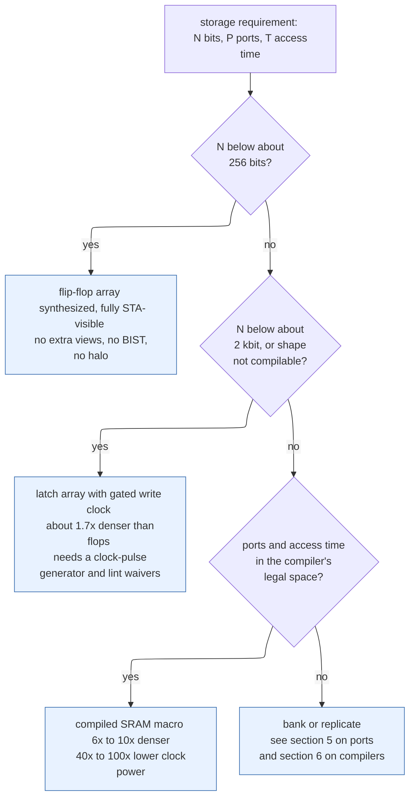
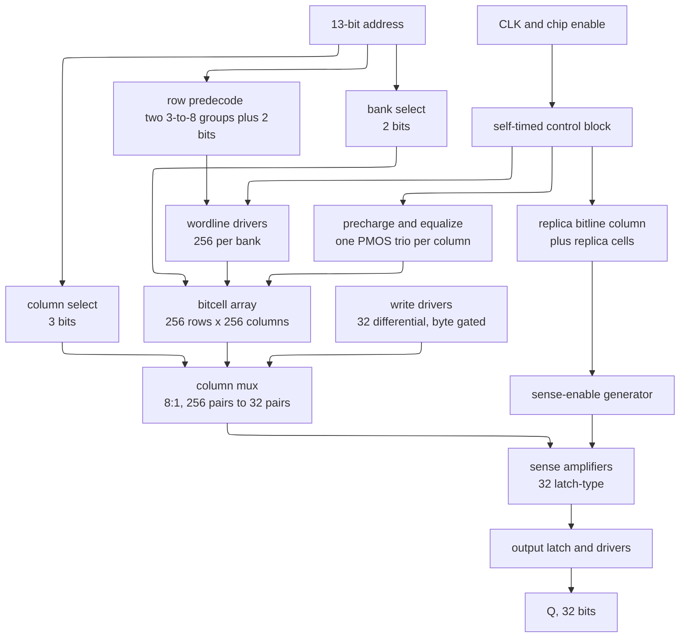
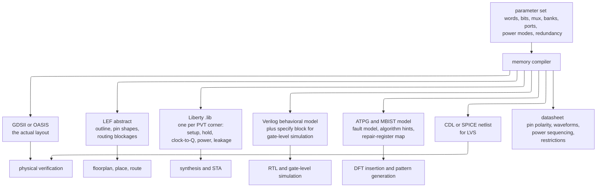
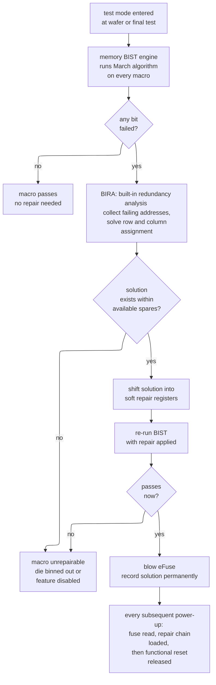
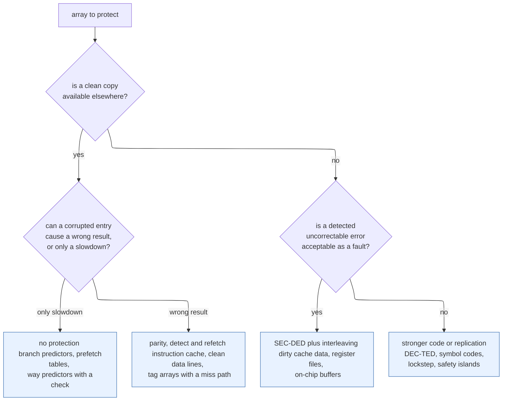

# Memory Circuits and Technologies — the storage arrays every design is mostly made of

> **Stage:** 00 · Fundamentals — the physical storage substrate. Every cache line, scratchpad entry, FIFO slot, branch-predictor counter, and DRAM page in this notebook eventually lands in one of the arrays derived here.
> **Prerequisites:** [CMOS Fundamentals](01_CMOS_Fundamentals.md) (the MOSFET as a ratioed switch, the inverter voltage-transfer curve, noise margin, the RC delay model, and §12's transistor-level 6T bitcell and static-noise-margin definition — this page starts where that section stops), [Logic Building Blocks](02_Logic_Building_Blocks.md) (latches, flip-flops, decoders, multiplexers, and register files *as logic* — this page prices them against a real array).
> **Hands off to:** [Cache Microarchitecture](../01_Architecture_and_PPA/01_CPU_Architecture/04_Cache_Hierarchy/01_Cache_Microarchitecture.md) (turns banks, access time, and port count into hit latency and associativity), [DFT and ATPG](../06_Signoff/02_DFT_and_ATPG.md) (memory BIST, repair-chain scan, and testing logic around a black-box macro), [Floorplanning and Power Planning](../05_Backend_Physical_Design/03_Floorplanning_and_Power_Planning.md) (places the macros this page produces, with their halos, blockages, and peak currents).

**First-use vocabulary.** A **bitcell** is the smallest circuit that stores one bit. An **array** is a two-dimensional tiling of bitcells sharing wordlines along rows and bitlines along columns. A **wordline (WL)** selects one row; a **bitline (BL)** carries data for one column. A **macro** is a pre-laid-out, pre-characterized hard block — you instantiate it, you do not synthesize it. A **memory compiler** is the program that generates a macro from a parameter set. **Static random-access memory (SRAM)** holds a bit in cross-coupled inverters and needs no refresh; **dynamic random-access memory (DRAM)** holds it as charge on a capacitor and does. **Read-only memory (ROM)** is written by a mask; **one-time-programmable (OTP)** memory is written once electrically. **Non-volatile memory (NVM)** survives power removal. **Error-correcting code (ECC)** adds redundant bits so that a corrupted word can be repaired. **Failures in time (FIT)** is failures per $10^9$ device-hours. **Redundancy** is spare rows and columns swapped in for defective ones. **Built-in self-test (BIST)** and **built-in self-repair (BISR)** are on-chip engines that find and fix array defects.

---

## 0. Why this page exists

Open the floorplan of any modern digital chip and count area. Between 40% and 70% of it is memory — SRAM in caches, register files, queues, branch predictors, translation buffers, line buffers, and accelerator scratchpads, plus ROM for boot code and eFuse for identity and repair. The notebook talks about all of these constantly: cache microarchitecture assumes an array with a known access time, the NPU pages assume a scratchpad with a known bandwidth, the DDR controller page assumes a DRAM device with `tRCD` and `tRP` already defined. None of those pages explains what the array physically *is*, why its access time is what it is, or where the macro in your floorplan came from. That is this page.

The gap is not academic. An engineer who skips it makes four specific mistakes, all of which are expensive and all of which are caught late. First, they infer a 4 kbit "register file" in RTL, synthesis turns it into 4096 flip-flops plus a 64:1 mux tree, and the block comes back 8× larger and 70× more clock-power-hungry than the equivalent macro — discovered at first physical trial, when the floorplan is frozen. Second, they instantiate a macro with an unregistered output, discover at static timing analysis (STA) that the 900 ps access time consumes the whole cycle, and have to add a pipeline stage that changes the load-use latency the architecture team already published. Third, they ship an array with no ECC because "soft errors are rare," and the fleet-level failure rate turns a 148-year per-chip mean time between failures into a five-day mean time between failures across ten thousand parts. Fourth, they specify a memory with no redundancy and yield 12% instead of 94%.

What ties those four together is that a memory is not a logic block with a lot of state. It is a *ratioed analog circuit* wrapped in a digital interface. A read does not evaluate a Boolean function; it lets a 25 µA current discharge a 53.4 fF wire for 235 ps until a differential of 110 mV exists, and then a mismatched latch decides which side is lower. Every parameter you will ever argue about — access time, banking, port count, Vmin, ECC strength, refresh overhead — falls out of that sentence.

After this page you will be able to: derive whether a given storage requirement should be flops, a latch array, or a macro, and show the arithmetic; read an SRAM datasheet and a `.lib` and know what every timing arc means; compute bitline development time and predict how access time scales with capacity; choose a port structure and price it; specify redundancy and compute the yield it buys; choose between no protection, parity, and single-error-correcting double-error-detecting (SEC-DED) ECC with a fleet FIT calculation behind the choice; and derive DRAM's timing parameters from its cell physics rather than copying them from a table.

---

## 1. Why memory is not built from flip-flops

### 1.1 The baseline that a digital-design course teaches

You need 1024 words × 64 bits of storage. The construction you already know: 65,536 D flip-flops, a 10-to-1024 decoder driving per-word write enables, and a 1024:1 multiplexer tree for the read port. It is correct, it is synthesizable, it is fully visible to static timing analysis, and it needs no new tools. For 16 words it is also the right answer. The question is where it stops being the right answer, and the answer must be derived, not asserted.

### 1.2 Price the flop-based bit

Use a 7 nm-class (N7) library throughout so the numbers stay comparable. Areas below are typical of a 6-track high-density library; your library will differ by tens of percent, not by factors.

| Element | Area | Reasoning |
|---|---|---|
| Scan D flip-flop (SDFF) | $0.18\ \mu\text{m}^2$ | ~11 contacted poly pitches wide at a 0.24 µm cell height |
| 2-input NAND | $0.041\ \mu\text{m}^2$ | 3 CPP × 0.24 µm |
| 2:1 multiplexer | $0.06\ \mu\text{m}^2$ | one AOI22-class cell |
| D latch | $0.09\ \mu\text{m}^2$ | roughly half a flop: one storage stage, not two |

A 1024:1 read mux built from 2:1 stages costs $1023$ muxes per output bit — but those muxes are shared across nothing, so per *stored* bit the amortized cost is $\frac{1023}{1024}\approx 1$ mux. Write-enable gating adds roughly one clock-gate cell per word, negligible per bit. So:

$$
a_{\text{flop}} = \underbrace{0.18}_{\text{SDFF}} + \underbrace{0.06}_{\text{read mux}} + \underbrace{0.02}_{\text{write enable, buffering}} = 0.26\ \mu\text{m}^2/\text{bit (cell area)}
$$

That is *cell* area. Synthesized random logic does not place at 100% utilization; 65–70% is normal for a routable block, and a flop array is wire-heavy because every bit needs a mux input routed to it. At 68%:

$$
a_{\text{flop,eff}} = \frac{0.26}{0.68} = 0.38\ \mu\text{m}^2/\text{bit}
$$

### 1.3 Price the SRAM bit

The N7 high-density 6T bitcell is $0.027\ \mu\text{m}^2$ — the densest structure the process can print, because it is drawn with its own restricted rules (§2.6). But a macro is not only bitcells: it carries row decoders, wordline drivers, precharge devices, column multiplexers, sense amplifiers, write drivers, a self-timed control block, and an edge ring of dummy cells. **Array efficiency** is bitcell area divided by macro area; for a mid-size macro it is 55–70%. At 65%:

$$
a_{\text{sram}} = \frac{0.027}{0.65} = 0.0415\ \mu\text{m}^2/\text{bit}
$$

**The headline ratio is $0.38 / 0.0415 = 9.2\times$.** An SRAM macro stores a bit in roughly one ninth the area of a synthesized flop array at the same node. That number is stable across nodes because both terms scale together; expect 6–10× anywhere.

### 1.4 The crossover, derived

Neither curve passes through the origin. The flop array carries a small fixed cost (decoder, enable tree): call it $30\ \mu\text{m}^2$. The macro carries a large one — the control block, the timing replica, the sense-amp row, the write drivers, and the boundary cells exist even for a 64-bit macro. For a small N7 single-port macro that fixed cost is about $200\ \mu\text{m}^2$. A latch array sits between: no second storage stage, but it needs a pulse or gated-clock generator per row.

$$
A_{\text{flop}}(N) = 0.38N + 30,\qquad
A_{\text{latch}}(N) = 0.22N + 45,\qquad
A_{\text{sram}}(N) = 0.0415N + 200
$$

where $N$ is bits and the latch figure is $0.09$ (latch) $+\ 0.06$ (mux) $+\ 0.00$ scaled by the same 68% utilization, $0.15/0.68 = 0.22$.

Solve the three pairwise crossovers:

$$
\text{flop} = \text{latch:}\quad 0.16N = 15 \;\Rightarrow\; N = 94\ \text{bits}
$$
$$
\text{latch} = \text{SRAM:}\quad 0.1785N = 155 \;\Rightarrow\; N = 868\ \text{bits}
$$
$$
\text{flop} = \text{SRAM:}\quad 0.3385N = 170 \;\Rightarrow\; N = 502\ \text{bits}
$$

Now add the costs the area equation does not see. A hard macro needs a **placement halo** — a keep-out ring, 2–5 µm per side, where standard cells may not be placed — because the macro's own power and pin structures need clearance. For a 20 µm × 15 µm macro a 2 µm halo adds $24\times19 - 20\times15 = 156\ \mu\text{m}^2$, nearly doubling the fixed cost. Push $A_{\text{sram}}$ to $0.0415N + 350$ and the flop crossover moves to $N = 945$ bits.

### 1.5 The three regimes



The decision tree is the algebra of §1.4 plus one engineering term the algebra cannot express: **each additional hard macro costs fixed human effort** — a Liberty view per corner to install, a BIST port to hook up, a floorplan slot to defend, an IR-drop check to run, a memory in the repair chain. Teams therefore draw the line conservatively at **256 bits** (below it, never a macro) and **2 kbit** (above it, always a macro), with the 256 bit–2 kbit band decided per block. That is exactly the three-regime rule of thumb, and now you can derive it instead of memorizing it.

### 1.6 The power argument, which is larger than the area argument

Area is the reason people quote; power is the reason it is not close. Every flip-flop in an array receives the clock every cycle whether or not it is written. At N7 a flop's clock pin plus its share of the local clock tree is about 3 fF. For 65,536 flops at 0.75 V and 1 GHz, and remembering that a clock node charges *and* discharges every cycle so its energy is $CV^2$, not $\tfrac12 CV^2$:

$$
P_{\text{clk}} = N C V^2 f = 65536 \times 3\times10^{-15} \times 0.75^2 \times 10^9 = 0.197\ \text{nF}\times0.5625\times10^9 = 111\ \text{mW}
$$

A 64 kbit SRAM macro reading 64 bits costs roughly 1.5 pJ per access at N7 — one wordline, 64 bitline pairs partially discharged, 64 sense amplifiers fired. At one access per cycle at 1 GHz that is **1.5 mW**. The ratio is **74×**. Clock gating on the flop array recovers a large part of this only if the array is idle; a register file read every cycle is not idle. This is why a 64-entry × 64-bit register file is a compiled multi-port array and not 4096 flops, even though 4096 flops would fit.

The cost of the macro side of that trade: the array is a black box to synthesis and to ATPG, it cannot be retimed, it constrains the floorplan, it needs its own test and repair infrastructure, and its access time is a fixed number you must design around rather than a path the optimizer can fix. Sections 6, 7, and 13 are about paying those costs deliberately.

---

## 2. The 6T SRAM cell in detail

[CMOS Fundamentals §12](01_CMOS_Fundamentals.md) establishes the cell as a bistable element and defines static noise margin on the butterfly curve. This section owns what happens when that cell is asked to drive a real bitline: the current it can deliver, the exact ratios that make read and write mutually hostile, and why you are forbidden from drawing the layout yourself.

### 2.1 The circuit

```tikz
\usepackage{circuitikz}
\begin{document}
\begin{circuitikz}[american,thick,scale=0.85,transform shape]
  \node[pmos,xscale=-1] (P1) at (0,2.8) {};
  \node[nmos,xscale=-1] (N1) at (0,0.6) {};
  \node[pmos] (P2) at (5,2.8) {};
  \node[nmos] (N2) at (5,0.6) {};
  \draw (P1.S) -- (0,3.9) node[above]{$V_{DD}$};
  \draw (P2.S) -- (5,3.9) node[above]{$V_{DD}$};
  \draw (N1.S) -- (0,-0.6);
  \draw (0,-0.6) node[ground]{};
  \draw (N2.S) -- (5,-0.6);
  \draw (5,-0.6) node[ground]{};
  \draw (P1.D) -- (0,1.7) coordinate (Q) -- (N1.D);
  \draw (P2.D) -- (5,1.7) coordinate (QB) -- (N2.D);
  \draw (Q) -- (-1.5,1.7) -- (-1.5,-2.6) -- (3.8,-2.6) -- (3.8,0.6);
  \draw (3.8,0.6) -- (3.8,2.8);
  \draw (P2.G) -- (3.8,2.8);
  \draw (N2.G) -- (3.8,0.6);
  \draw (QB) -- (6.5,1.7) -- (6.5,5.6) -- (1.2,5.6) -- (1.2,2.8);
  \draw (1.2,2.8) -- (1.2,0.6);
  \draw (P1.G) -- (1.2,2.8);
  \draw (N1.G) -- (1.2,0.6);
  \node[nmos] (M5) at (-1.5,3.6) {};
  \node[nmos,xscale=-1] (M6) at (8.0,3.6) {};
  \draw (M5.S) -- (-1.5,1.7);
  \draw (M6.S) -- (8.0,1.7) -- (6.5,1.7);
  \draw (M5.D) -- (-1.5,6.4) node[above]{$BL$};
  \draw (M6.D) -- (8.0,6.4) node[above]{$\overline{BL}$};
  \draw (M5.G) -- (-2.9,3.6) node[left]{$WL$};
  \draw (M6.G) -- (9.4,3.6) node[right]{$WL$};
  \fill (-1.5,1.7) circle (2.2pt);
  \fill (6.5,1.7) circle (2.2pt);
  \node at (-0.75,2.4) {\small $M_1$};
  \node at (-0.75,0.2) {\small $M_2$};
  \node at (5.75,2.4) {\small $M_3$};
  \node at (5.75,0.2) {\small $M_4$};
  \node at (-2.4,4.4) {\small $M_5$};
  \node at (8.9,4.4) {\small $M_6$};
\end{circuitikz}
\end{document}
```

**Contract.** $M_1/M_2$ and $M_3/M_4$ are two inverters wired output-to-input in both directions, so the pair has exactly two stable DC solutions: $(Q,\overline{Q}) = (1,0)$ or $(0,1)$. $M_5$ and $M_6$ are **access transistors**, both NMOS, both gated by the same wordline, connecting the two storage nodes to a complementary bitline pair. With $WL$ low the cell is an isolated bistable drawing only leakage; with $WL$ high it is electrically merged with two long, heavily loaded wires it must either drive (read) or be driven by (write).

**One trace.** Suppose $Q=0$, $\overline{Q}=1$. Both bitlines are precharged to $V_{DD}$. Raise $WL$. Current now flows $BL \rightarrow M_5 \rightarrow M_2 \rightarrow \text{GND}$, pulling $BL$ down; $\overline{BL}$ has no path down because $M_3$ holds $\overline{Q}$ at $V_{DD}$ and $M_6$'s two terminals are both at $V_{DD}$. A differential develops. **But that same current flows through $M_5$ and $M_2$ in series, and the node between them is $Q$** — so $Q$ is no longer at 0 V. It sits at a divider voltage $V_{read}$ above ground. That bump is the whole problem.

**The trade-off it illustrates.** $M_5$ is in the read path *and* the write path. Read wants it weak so $V_{read}$ stays small; write wants it strong so it can overpower $M_1$, the pull-up holding $Q$. There is one width, and it must satisfy both.

### 2.2 Read: the disturb constraint

During a read, $M_5$ is in saturation (drain at $\approx V_{DD}$, gate at $V_{DD}$, source at $V_{read}\approx 0$) and $M_2$ is in triode (drain at $V_{read}$, small). Equating currents with a simple square-law model:

$$
\tfrac{1}{2}k_{ax}\left(V_{DD}-V_{read}-V_{th}\right)^2 \;=\; k_{pd}\left[\left(V_{DD}-V_{th}\right)V_{read}-\tfrac{V_{read}^2}{2}\right]
$$

Define the **cell ratio**

$$
\beta \;=\; \frac{(W/L)_{\text{pull-down}}}{(W/L)_{\text{access}}} \;=\; \frac{k_{pd}}{k_{ax}}
$$

Larger $\beta$ makes the right side larger for the same $V_{read}$, so the balance point moves down: **$V_{read}$ falls as $\beta$ rises.** Read is safe if and only if $V_{read}$ stays below $V_M$, the switching threshold of the *opposite* inverter ($M_3/M_4$). If $V_{read} > V_M$, that inverter starts to flip $\overline{Q}$ low, which via feedback drives $Q$ high, and the read has destroyed the bit. Typical designs target $\beta = 1.2$–$2.0$; at $\beta \approx 1.5$, $V_{read}$ lands near $0.15\,V_{DD}$ against a $V_M$ near $0.45\,V_{DD}$.

Note what $\beta$ does *not* fix: it is a ratio of nominal widths, and at minimum geometry the actual thresholds are random. Pelgrom's law says $\sigma_{V_{th}} = A_{V_{th}}/\sqrt{WL}$, and the bitcell has the smallest $WL$ on the die. A cell whose $M_2$ happens to be $3\sigma$ weak and whose $M_5$ is $3\sigma$ strong has an effective $\beta$ far below nominal. Because a 1 Mbit array has $10^6$ chances to find that cell, the design target is not "safe at nominal" but "safe at roughly $5.5\sigma$" — which is why bitcell signoff is a Monte Carlo problem with importance sampling, not a corner simulation.

### 2.3 Write: the write-ability constraint

To write a 0 into a cell currently holding $Q=1$, the write driver pulls $BL$ to ground and holds $\overline{BL}$ at $V_{DD}$, then $WL$ rises. Now $M_5$ (NMOS, source at 0 V on the bitline side, gate at $V_{DD}$) fights $M_1$ (the PMOS pull-up holding $Q$ high). The node $Q$ settles at a divider voltage $V_{write}$, and the write succeeds only if $V_{write} < V_M$ of the opposite inverter — the mirror image of §2.2. Define the **pull-up ratio**

$$
\gamma \;=\; \frac{(W/L)_{\text{access}}}{(W/L)_{\text{pull-up}}}
$$

Larger $\gamma$ makes $M_5$ win, so $V_{write}$ falls and the write completes. Typical target $\gamma = 1.2$–$2.0$.

**The two constraints pull in opposite directions, and the proof is one line.** Let $w_{ax}$ be the access-device width. Then

$$
\beta = \frac{w_{pd}}{w_{ax}}\ \ (\text{decreasing in } w_{ax}), \qquad \gamma = \frac{w_{ax}}{w_{pu}}\ \ (\text{increasing in } w_{ax})
$$

Their product is $\beta\gamma = w_{pd}/w_{pu}$ — independent of the access width entirely. **You cannot improve both by sizing $M_5$; you can only trade one for the other, and the sum of what you have to trade is fixed by the pull-down/pull-up ratio.** The only ways to raise the product are to widen the pull-downs or narrow the pull-ups, and both are bounded: the pull-up is already minimum width, and widening the pull-down grows the cell, which grows the array, which grows the bitline, which slows the read.

At a FinFET node the constraint is harsher still, because widths are quantized to whole fins. A 6T cell is typically 1 fin per device (some libraries use 2 fins on the pull-down for high-performance cells), so $\beta \in \{1, 2\}$ — there is no 1.5. Fin quantization is the reason bitcell variants exist as discrete library offerings (high-density, high-current, low-voltage) rather than as a continuous sizing knob.

### 2.4 Static noise margin and the butterfly curve

Plot inverter 1's transfer curve $\overline{Q}=f(Q)$ and inverter 2's *inverse* transfer curve $Q = g^{-1}(\overline{Q})$ on the same axes. They cross three times: two stable points and one metastable point. The two closed regions between the curves are the "eyes." **Static noise margin (SNM) is the side length of the largest square that fits inside the smaller eye** — the largest DC voltage a saboteur could inject at both storage nodes without collapsing the bistability.

Three numbers matter, and they are three different measurements of the same curve:

| Metric | Condition | Typical value | What it bounds |
|---|---|---|---|
| Hold SNM | $WL$ low, cell isolated | $\approx 0.4\,V_{DD}$ | Retention in standby and in drowsy/retention power modes |
| Read SNM | $WL$ high, bitlines precharged high | $\approx 0.2\,V_{DD}$ | The binding constraint: a read must not flip the cell |
| Write margin | $WL$ high, one bitline driven to 0 | $\approx 0.3\,V_{DD}$ of bitline swing required | A write must flip the cell |

Read SNM is always smaller than hold SNM, because raising $WL$ adds the $M_5$ divider that lifts the 0-node — the eye is squeezed by exactly the $V_{read}$ of §2.2. Everything about SRAM low-voltage behavior follows: as $V_{DD}$ falls toward $V_{th}$, all the $I$–$V$ curves compress, the eyes shrink, and $\sigma_{V_{th}}/(V_{DD}-V_{th})$ grows. **Read SNM reaches zero for the worst cell in a large array at a supply typically 100–200 mV above the array's nominal.** That voltage is $V_{min}$, and it — not logic — usually sets the floor for dynamic voltage-frequency scaling on a chip.

The two standard escapes, both of which you will see in compiler options: **assist circuits** and **cell change**. Write assist lowers the effective $\gamma$ barrier by collapsing the cell's local $V_{DD}$ during a write (weakening $M_1$) or by driving the bitline below ground (negative bitline, strengthening $M_5$). Read assist raises effective $\beta$ by under-driving the wordline (weakening $M_5$). Cell change means the 8T cell of §5, which removes the read constraint entirely by removing the read current from the storage node. Assist costs 3–8% macro area and one extra timing-critical internal signal; 8T costs 30–40% cell area.

### 2.5 What one cell can actually deliver

The number that drives §4 is the **cell read current** $I_{cell}$: the current the $M_5$–$M_2$ series stack sinks from a precharged bitline. It is not $I_{on}$ of a logic transistor, because $M_5$ is source-degenerated by $V_{read}$ and both devices are minimum geometry. At N7 with a high-density cell:

- $I_{cell} \approx 25\ \mu\text{A}$ at typical process, 0.75 V, 25 °C.
- $I_{cell} \approx 9\ \mu\text{A}$ at slow process, 0.675 V (nominal minus 10%), 125 °C, for a $-3\sigma$ cell.

That 2.8× spread between the number you simulate first and the number you sign off on is the reason SRAM access time is quoted at a slow corner and the reason a design that "worked in simulation" fails at cold-boot low voltage.

### 2.6 Bitcell push rules

A logic standard cell obeys the foundry's design-rule check (DRC) deck. **A bitcell does not.** It is drawn under a separate, more aggressive rule set — variously called *push rules*, *bitcell rules*, or *SRAM rules* — that permits smaller pitches, tighter contacts, and geometries the logic deck forbids. Three things make this legal and safe:

1. **Extreme regularity.** The array is one cell tiled millions of times in a strictly periodic pattern with a single orientation (adjacent cells are mirrored to share diffusion and contacts). Lithography and optical proximity correction for a single repeating pattern are far more predictable than for arbitrary logic, so the process window is genuinely wider.
2. **Dedicated process centering.** Foundries co-optimize the process for the SRAM cell — it is the density figure of merit a node is announced with. Litho, implant, and etch recipes are tuned on the bitcell.
3. **Foundry ownership.** You do not draw it. The bitcell layout, its Monte Carlo characterization, and its permitted usage come from the foundry inside the compiler. Any hand-drawn deviation loses the guarantee.

The practical consequences you will meet: (a) the array must be surrounded by **dummy/edge cells** and **strap cells** — non-functional rows and columns whose only job is to give the outermost real cells the same lithographic neighborhood as an interior cell, plus well ties and substrate contacts on a fixed pitch; these are pure area overhead and they are why a tiny macro has terrible array efficiency. (b) The macro's DRC and layout-versus-schematic (LVS) runs use waivers keyed to the bitcell region — see [Physical Verification DRC and LVS](../06_Signoff/03_Physical_Verification_DRC_LVS.md). (c) You cannot place logic under or inside the array; the bitcell rules do not compose with logic rules across a boundary.

---

## 3. The array

### 3.1 Shape

Take a 32 KB single-port SRAM: 8192 words × 32 bits = 262,144 bits. There is no requirement that the physical array be 8192 rows tall and 32 columns wide — and it must not be, for two reasons. A 8192-row column would have a bitline capacitance ~30× larger than §4 allows. And a 32-column array would be a 1:250 sliver that no floorplan can absorb.

Instead the compiler chooses a **column multiplexing factor** $M$: it lays out $B_{\text{word}} \times M$ physical columns and selects one of every $M$ with a mux driven by the low address bits. Here, with $M=8$: 256 physical columns and $262144/256 = 1024$ rows. Still too tall, so it splits into **4 banks of 256 rows**. The address decomposes as: 3 bits of column select, 8 bits of row select within a bank, 2 bits of bank select — 13 bits total, matching $\log_2 8192$.

Column muxing is not only about aspect ratio. It amortizes the expensive periphery: 256 columns share 32 sense amplifiers and 32 write drivers instead of needing 256 of each. Sense amplifiers are large (they must be well-matched, so they are drawn at many times minimum size) and there is no room for one per bitcell column pitch anyway. And as §8 shows, the column mux is what makes physical **bit interleaving** possible, which is what makes ECC work against multi-cell upsets.

### 3.2 The complete block diagram



**Contract.** One clock edge, one access. Address and controls are captured on the rising edge; a single internal pulse sequence follows; data appears at $Q$ before the next edge (or one edge later if the macro is pipelined). **Trace a read of address `0x0C41`:** bank select = 0, row = 0x62 = 98, column select = 1. The control block releases precharge, the decoder raises wordline 98 in bank 0, all 256 columns of that row develop a differential, the column mux selects the 32 bitline pairs whose column-select is 1, the replica path fires the sense-enable, the 32 sense amplifiers latch, the output latch holds. **Trade-off it illustrates:** every one of the 256 columns in that row discharges its bitline, but only 32 are used. The other 224 columns dissipate switching energy for nothing and must be restored by precharge. Higher $M$ means better area and aspect ratio but more wasted bitline energy — which is why low-power compilers offer *hierarchical* or *segmented* bitlines that activate only the used columns, at a cost of extra devices per column.

### 3.3 Precharge and equalization

Before every access, both bitlines of every column are pulled to $V_{DD}$ by a pair of PMOS devices, and a third PMOS is turned on *between* them. The pull-up is obvious; the equalizer is the subtle one and it is not optional. After a read, one bitline sits at $V_{DD}-110\ \text{mV}$ and the other at $V_{DD}$. The pull-up PMOS devices are not perfectly matched and the precharge window is short, so at the end of precharge a residual differential of a few millivolts may remain — *with the same polarity as the previous read*. That is a systematic offset added to the next read's signal, and if the next read is of the opposite value it eats margin. The equalizer shorts the two bitlines together, which drives their differential to exactly zero in a time set by the equalizer's on-resistance and $C_{BL}/2$, independent of matching. Precharge sets the common mode; equalization sets the differential to zero. Both are needed.

### 3.4 The sense amplifier

A 110 mV differential on a 0.75 V rail is not a logic level. The sense amplifier's job is to convert it into one, quickly, and its own input-referred offset is the reason 110 mV was the target in the first place. The workhorse is a **latch-type (cross-coupled) sense amplifier**: the same regenerative structure as the bitcell, with an enable device that holds it inert until the differential is ready.

```tikz
\usepackage{circuitikz}
\begin{document}
\begin{circuitikz}[american,thick,scale=0.85,transform shape]
  \node[pmos,xscale=-1] (P1) at (0,2.8) {};
  \node[nmos,xscale=-1] (N1) at (0,0.6) {};
  \node[pmos] (P2) at (5,2.8) {};
  \node[nmos] (N2) at (5,0.6) {};
  \draw (P1.S) -- (0,3.8) -- (5,3.8) -- (P2.S);
  \draw (N1.S) -- (0,-0.5) -- (5,-0.5) -- (N2.S);
  \node[pmos] (PH) at (2.5,4.7) {};
  \node[nmos] (NF) at (2.5,-1.5) {};
  \draw (PH.D) -- (2.5,3.8);
  \draw (PH.S) -- (2.5,5.7) node[above]{$V_{DD}$};
  \draw (PH.G) -- (1.2,4.7) node[left]{$\overline{SAE}$};
  \draw (NF.D) -- (2.5,-0.5);
  \draw (NF.S) -- (2.5,-2.5);
  \draw (2.5,-2.5) node[ground]{};
  \draw (NF.G) -- (1.2,-1.5) node[left]{$SAE$};
  \draw (P1.D) -- (0,1.7) -- (N1.D);
  \draw (P2.D) -- (5,1.7) -- (N2.D);
  \draw (1.2,0.6) -- (1.2,2.8);
  \draw (P1.G) -- (1.2,2.8);
  \draw (N1.G) -- (1.2,0.6);
  \draw (3.8,0.6) -- (3.8,2.8);
  \draw (P2.G) -- (3.8,2.8);
  \draw (N2.G) -- (3.8,0.6);
  \draw (0,2.1) -- (3.8,2.1);
  \draw (5,1.3) -- (1.2,1.3);
  \fill (0,2.1) circle (2.2pt);
  \fill (5,1.3) circle (2.2pt);
  \fill (3.8,2.1) circle (2.2pt);
  \fill (1.2,1.3) circle (2.2pt);
  \draw (0,1.7) -- (-1.5,1.7) node[left]{$BL$};
  \draw (5,1.7) -- (6.5,1.7) node[right]{$\overline{BL}$};
  \fill (0,1.7) circle (2.2pt);
  \fill (5,1.7) circle (2.2pt);
\end{circuitikz}
\end{document}
```

**Contract.** While $SAE$ is low and $\overline{SAE}$ is high, both the foot NMOS and the head PMOS are off: the latch has no current path and cannot regenerate, so its two nodes simply follow the bitlines. When $SAE$ rises and $\overline{SAE}$ falls, the latch is powered and its positive feedback amplifies whatever differential exists at that instant to full rail in a few tens of picoseconds. The two crossings in the drawing are wire crossings, not connections; the four dots are connections. In a real column the bitlines are separated from the latch nodes by isolation devices, so that the latch drives a small local capacitance instead of the full bitline — that shortens resolution time by an order of magnitude but does not change the argument below.

**One trace.** $BL$ has fallen to $V_{DD}-110$ mV, $\overline{BL}$ is at $V_{DD}$. $SAE$ rises. $M_2$-equivalent (the left NMOS) is gated by the *right* node through the cross-coupling, and that node is still at $V_{DD}$, so it has the higher gate voltage and conducts more; the left node discharges faster; that pulls the right NMOS's gate down further, turning it off; regeneration completes with left = 0, right = $V_{DD}$. The $BL$ side resolves low — which is the stored 0 of §2.1, read back correctly.

**The failure it illustrates.** The decision is made by comparing two nominally identical devices. Their thresholds differ randomly. The **input-referred offset** $V_{os}$ of a latch-type sense amplifier is roughly $\sigma_{V_{th}}$ of the input pair scaled by the ratio of transconductances, and lands at $\sigma_{V_{os}} = 10$–$25$ mV for a reasonably sized amplifier at modern nodes. If $|\Delta V_{BL}| < |V_{os}|$ the amplifier resolves the *wrong way* — silently, with a full-rail output, indistinguishable from correct data.

That fixes the required signal. A chip with 64 macros × 32 sense amplifiers, each firing $10^9$ times per second over a 10-year life, performs about $6\times10^{20}$ sense operations. Requiring a wrong-way probability far below one per fleet lifetime means the differential must exceed the offset by roughly **5.5–6 standard deviations**. With $\sigma_{V_{os}} = 18$ mV:

$$
\Delta V_{\text{target}} = 6 \times 18\ \text{mV} = 108\ \text{mV} \;\approx\; 110\ \text{mV}
$$

There is the 110 mV. It is not a convention; it is six sigma of a mismatch distribution. Halving $\sigma_{V_{os}}$ (by doubling sense-amp area, since $\sigma \propto 1/\sqrt{WL}$) halves the required differential and therefore halves bitline development time — a direct area-for-speed trade the compiler exposes as "high-performance" versus "high-density" macro flavors.

### 3.5 Write drivers

A write is easier than a read in one respect and harder in another. Easier: the driver is a full-strength inverter pair driving one bitline hard to ground while the other stays at $V_{DD}$, so no analog margin is involved. Harder: the write must *complete* — the cell must actually flip — before the wordline falls, and it must then be given time to restore both bitlines before the next access. **Write recovery time** is a real macro parameter; a write followed immediately by a read of a different row in the same bank is the worst case, because the bitlines have been driven to opposite rails and precharge must undo that in full.

Byte enables complicate this: a masked byte's columns must not be driven at all, which means the write driver has a per-column enable and the unwritten columns still see a wordline. Those cells experience a *read* disturb during a write to their row — the §2.2 constraint applies to them too. This is why byte-write granularity is a compiler parameter with an area cost rather than something free.

### 3.6 The self-timed replica path

Here is the question that decides whether the macro works: **when do you fire $SAE$?** Too early, and the differential is below the offset — wrong data. Too late, and you waste cycle time, and the bitline keeps discharging toward ground, which wastes energy and eventually endangers the cell.

The naive answer is a delay chain of inverters sized to match the expected development time. It fails, badly, because the two delays track different things. Bitline development time is $C_{BL}\Delta V/I_{cell}$ — it is set by a *bitcell's* current into a *wire's* capacitance. An inverter chain's delay is set by logic transistor drive into gate capacitance. Across process corners, voltage, and temperature these diverge by a factor of two or more in opposite directions: at low $V_{DD}$ and high temperature the bitcell current collapses much faster than logic delay grows.

The derived repair is the **replica bitline**. Add a dummy column at the array edge whose cells are permanently programmed to 0 and whose wordline fires with the real one. Connect a known number $k$ of those replica cells to a replica bitline whose capacitance is a known fraction of the real one. The replica bitline therefore discharges at $k \times I_{cell}$ into $C_{rep}$, and its swing crosses an inverter's threshold after

$$
t_{rep} = \frac{C_{rep}\,V_{trip}}{k\,I_{cell}}
$$

Choose $C_{rep}/k$ so that $t_{rep}$ equals the desired $C_{BL}\Delta V/I_{cell}$ plus margin. Because $I_{cell}$ appears in both expressions, **the sense-enable timing tracks the bitcell across every PVT corner and every aging effect automatically.** That is the entire point: the timing reference is built from the thing being timed. The residual mismatch — the replica cells are a small sample, so their own $\sigma_{V_{th}}$ matters — is handled by using several replica cells in parallel (averaging) and by adding a fixed margin, which is where a few percent of the access time goes.

Everything else in the macro's control block is derived from the same principle: the wordline pulse width, the precharge pulse, and the write pulse are all generated from internal self-timed edges rather than from the external clock's duty cycle, which is why an SRAM macro tolerates a wide range of input clock duty cycles but has a hard minimum cycle time.

### 3.7 A full read cycle

```wavedrom
{ "signal": [
  { "name": "CLK",      "wave": "1...0...1...0..." },
  { "name": "CEN low",  "wave": "0.......1......." },
  { "name": "ADDR",     "wave": "=.......=.......", "data": ["A0","A1"] },
  { "name": "PCH",      "wave": "10.........1...." },
  { "name": "WL",       "wave": "0.1.......0.....", "node": "..a............." },
  { "name": "BL - BLB", "wave": "x.2..3..4..x....", "data": ["0 mV","55 mV","110 mV"] },
  { "name": "SAE",      "wave": "0.......1...0...", "node": "........b......." },
  { "name": "Q",        "wave": "x.........=.....", "data": ["data at A0"], "node": "..........c....." }
 ],
 "edge": ["a~>b develop 235 ps", "b~>c resolve plus output 200 ps"],
 "head": {"text": "one SRAM read cycle, eight divisions per clock period"}
}
```

**Contract.** Chip-enable and address are sampled on the rising edge at division 0. The precharge is released one division later, the wordline rises at division 2, the differential grows linearly through divisions 2–8, the sense enable fires at division 8, output is valid at division 10, and precharge reasserts at division 11 so the array is ready for the next edge.

**Trace and failure.** The gap between the wordline rising and the sense enable firing is not a design choice made in the timing constraints; it is the replica delay of §3.6, and it is the largest single term in the access time. If the array had 512 rows instead of 256, that gap doubles (§4) and the whole waveform no longer fits between two clock edges — the macro's minimum cycle time grows. This is the mechanism behind "bigger memories are slower," and it is why the compiler splits a 32 KB memory into four banks rather than making one tall array.

Note also what is *not* on this diagram: there is no combinational path from $ADDR$ to $Q$ that a synthesis tool can optimize. The macro presents STA with a setup and hold requirement on $ADDR$, $CEN$, $WEN$, and $D$ relative to $CLK$, and a clock-to-$Q$ arc. Section 13 is about living with that.

---

## 4. Bitline timing, derived

### 4.1 The one equation

During a read the selected cell sinks a nearly constant current $I_{cell}$ from one bitline (nearly constant because the access transistor is in saturation for the small swing involved). A constant current into a capacitance produces a linear ramp:

$$
I_{cell} = C_{BL}\frac{dV}{dt} \quad\Longrightarrow\quad \Delta V(t) = \frac{I_{cell}\,t}{C_{BL}} \quad\Longrightarrow\quad \boxed{\;t_{dev} = \frac{C_{BL}\,\Delta V_{\text{target}}}{I_{cell}}\;}
$$

Three quantities, all of which you now know where to get: $\Delta V_{\text{target}} = 110$ mV from the sense-amp offset (§3.4), $I_{cell}$ from the cell (§2.5), and $C_{BL}$ from the array geometry.

### 4.2 Where $C_{BL}$ comes from

Per row, a bitline carries: the drain junction and contact capacitance of one access transistor, the wire capacitance of one cell pitch of metal, and the coupling to the adjacent bitline. At N7 with a 0.027 µm² cell these sum to roughly $c_{bl} = 0.15$ fF per row. On top sits the periphery — the column mux transistors' diffusion, the write driver's output, the precharge devices, the sense-amp isolation devices — call it $C_{per} = 15$ fF, independent of row count. So for $R$ rows:

$$
C_{BL}(R) = c_{bl}R + C_{per} = 0.15R + 15\ \text{fF}
$$

| Rows per bank | $C_{BL}$ | $t_{dev}$ at TT, $I_{cell}=25\ \mu$A | $t_{dev}$ at SS worst cell, $I_{cell}=9\ \mu$A |
|---|---|---|---|
| 64 | 24.6 fF | 108 ps | 301 ps |
| 128 | 34.2 fF | 150 ps | 418 ps |
| 256 | 53.4 fF | 235 ps | 653 ps |
| 512 | 91.8 fF | 404 ps | 1122 ps |
| 1024 | 168.6 fF | 742 ps | 2061 ps |

Arithmetic for the 256-row row, worked in full so the units are unambiguous:

$$
C_{BL} = 0.15\times256 + 15 = 38.4 + 15 = 53.4\ \text{fF}
$$
$$
t_{dev} = \frac{53.4\times10^{-15}\ \text{F}\times 0.110\ \text{V}}{9\times10^{-6}\ \text{A}} = \frac{5.874\times10^{-15}\ \text{C}}{9\times10^{-6}\ \text{A}} = 6.53\times10^{-10}\ \text{s} = 653\ \text{ps}
$$

### 4.3 From development time to access time

Development is the dominant term, not the only one. The signoff-corner access time of a 256-row bank is roughly:

| Term | Value | Source |
|---|---|---|
| Clock to internal control edge | 60 ps | control block, self-timed |
| Address decode and predecode | 90 ps | two levels of NAND plus a driver |
| Wordline rise across 256 columns | 120 ps | distributed RC of the wordline wire |
| Bitline development | 653 ps | §4.2 |
| Sense-amp resolution | 90 ps | regeneration to full rail |
| Column mux, output latch, output driver | 110 ps | plus the load you attach |
| **Total clock-to-Q** | **≈ 1.12 ns** | |

**Bitline development is 58% of the access time.** Everything the array architecture does is an attack on that term.

### 4.4 Why arrays are banked

Development time is linear in row count. Halving the rows per bank nearly halves it. Split the 32 KB memory of §3.1 into $B$ banks and each bank has $1024/B$ rows:

| Banks | Rows/bank | $t_{dev}$ (SS) | Access time | Extra periphery |
|---|---|---|---|---|
| 1 | 1024 | 2061 ps | 2.53 ns | — |
| 2 | 512 | 1122 ps | 1.59 ns | +1 sense-amp row, +1 decoder |
| 4 | 256 | 653 ps | 1.12 ns | +3 |
| 8 | 128 | 418 ps | 0.89 ns | +7 |
| 16 | 64 | 301 ps | 0.77 ns | +15 |

Every access-time entry is that row's $t_{dev}$ plus the **470 ps** of non-development terms that §4.3 totals (60 + 90 + 120 + 90 + 110). The gain saturates because the fixed 15 fF of periphery capacitance and that 470 ps stop scaling, while the cost — an extra sense-amp row, write-driver row, decoder, and control per bank, plus a global bank-select mux and a global data bus whose own RC grows with bank count — is linear. Array efficiency falls from ~70% at 4 banks to ~45% at 16. **The optimum lands at 128–256 rows per bank**, which is why nearly every compiled SRAM you will ever look at has that shape internally, regardless of its capacity.

### 4.5 Why access time scales as it does

For a roughly square array of $N$ bits, rows $\propto \sqrt{N}$ and the global wire from the array edge to the macro's output pins also grows $\propto \sqrt{N}$. Both the development term and the global-wire term therefore grow as $\sqrt{N}$, giving

$$
t_{acc}(N) \approx a + b\sqrt{N}
$$

with $a$ the fixed decode/sense/output overhead. This square-root law is the analytical core of cache models such as CACTI and it is the reason the cache hierarchy has the shape it does: a 32 KB L1 lands at ~1 ns (3–4 cycles at 3–4 GHz), a 1 MB L2 at $\sqrt{32}\approx 5.7\times$ the variable term (~10–15 cycles), and a 32 MB L3 is dominated by the wire delay of crossing it rather than by any array (~40–60 cycles). Bank it more aggressively and you trade area and energy for latency; the architecture consequences of that trade belong to [Cache Microarchitecture](../01_Architecture_and_PPA/01_CPU_Architecture/04_Cache_Hierarchy/01_Cache_Microarchitecture.md).

There is a second consequence that catches people: **energy per access also grows with array size**, because a read discharges every bitline in the activated row, including the $M-1$ of every $M$ columns that the column mux throws away, and each of those bitlines is longer in a bigger array. Energy per bit read is therefore *worse* for a big flat array than for a banked one, on top of the latency. Both arguments point the same way, which is unusual and convenient.

---

## 5. Multi-port and specialty cells

### 5.1 The problem with one port

The 6T cell has one wordline and one bitline pair, so it supports one access per cycle — read or write, not both. A processor's register file must supply two source operands and accept one result every cycle for every instruction issued; a four-wide machine needs eight reads and four writes per cycle. A single-ported array cannot do this, and neither can eight copies of a single-ported array (writes would have to go to all eight, which is fine, but that is 8× the area). The port structure is an architectural decision with a circuit price, and the price is not linear.

### 5.2 The 8T cell: decouple the read

The 6T cell's binding constraint is that the read current flows *through the storage node* (§2.2). Remove that and the constraint vanishes. Add two NMOS in series: the lower one gated by the storage node $\overline{Q}$, the upper one gated by a separate **read wordline (RWL)**, with the stack pulling down a separate single-ended **read bitline (RBL)**.

- The read now discharges RBL through a stack that only *senses* $\overline{Q}$ through a gate. No current enters the storage node. **Read SNM becomes equal to hold SNM** — the §2.2 constraint is gone entirely.
- $\beta$ is now free. You can size the access transistors purely for write-ability, so $\gamma$ can be large. The two constraints have been decoupled, not merely rebalanced.
- $V_{min}$ drops by 100–200 mV, which is exactly why 8T is standard for the register files and low-voltage caches of processors that scale their supply aggressively.

Costs: two more transistors (+33%), but the real cost is wires — RWL is a third horizontal wire and RBL a third vertical one, and the bitcell is wire-pitch-limited, so the area penalty is **30–40%, not 33% of transistor area**. The read is single-ended, so there is no differential to sense: RBL must swing a large fraction of the rail against a simple skewed inverter or a low-offset single-ended sensing scheme, which is slower and more leakage-sensitive (all the unselected cells on RBL leak, and with 256 rows the aggregate leakage can rival the on-cell current at high temperature — which is why 8T arrays use shorter read bitlines or a hierarchical read structure).

### 5.3 The 10T cell and below

10T variants add isolation to fix the leakage problem the 8T read bitline introduced — typically two more devices that cut the leakage path of unselected cells, or that make the read stack fully differential. They enable near-threshold and sub-threshold operation (0.3–0.5 V) at 1.6–2× the 6T area. Use them when the array's supply must go where a 6T cell cannot follow: always-on domains, energy-harvesting parts, retention arrays. Do not use them for a cache; the area is not worth it when you can bank a 6T array and lower the frequency instead.

### 5.4 True multi-port cells and the port-squared law

A true dual-port (2RW) cell adds a second complete access pair: a second wordline and a second bitline pair, 8 transistors. A 2R1W register-file cell adds one differential write port and two single-ended read stacks: 6 + 2 + 2 = 10 transistors and, more importantly, three wordlines and four bitlines.

The area law is not about transistors. **A multi-port bitcell is wire-limited.** Each port needs one horizontal wire (its wordline) and one or two vertical wires (its bitline or bitline pair). Cell height is set by the number of horizontal wires and cell width by the number of vertical ones, so:

$$
A_{cell} \;\propto\; \underbrace{(R+W)}_{\text{wordlines, sets height}} \times \underbrace{(R+2W)}_{\text{bitlines, sets width}}
$$

for $R$ read ports and $W$ write ports (reads single-ended, writes differential). Instantiate:

| Configuration | Horizontal | Vertical | Product | Relative area |
|---|---|---|---|---|
| 1RW (6T) | 1 | 2 | 2 | 1.0× |
| 1R1W | 2 | 3 | 6 | 3.0× |
| 2R1W | 3 | 4 | 12 | 6.0× |
| 4R2W | 6 | 8 | 48 | 24× |
| 8R4W | 12 | 16 | 192 | 96× |

The relative-area column is a scaling law, not an exact prediction — real 1R1W cells land near 1.6–1.9× a 6T rather than 3×, because the 6T entry is dominated by the transistors, not the wires, so the law only becomes accurate once wires dominate (3 ports and up). But the *shape* is right and it is the shape that matters: **port count costs area quadratically.** An 8-read, 4-write monolithic register file is not buildable; you would spend more area on one register file than on the execution units it feeds.

### 5.5 The architect's escape: banking and pseudo-dual-port

Since ports are quadratic and banks are linear, replace ports with banks.

- **Pseudo-dual-port by time multiplexing.** Run a single-ported array at 2× the logic clock and give the first half-cycle to the read port and the second to the write port. Costs nothing in area; costs a doubled internal frequency, which the array may not reach at the signoff corner, and a second clock domain inside the macro. This is what "1R1W" compiler configurations frequently are underneath.
- **Banking.** Split the storage into $B$ single-ported banks and let each request address one bank. Two requests to *different* banks proceed in parallel; two to the *same* bank conflict and one must stall.

The port-conflict problem is now the architect's, and it is quantifiable. With $P$ independent random requests per cycle into $B$ banks, the probability that a given request finds its bank already taken by an earlier request in the same cycle is, for $P=2$, exactly $1/B$. For $B=4$ that is **25% of cycles losing one access**. For $B=8$, 12.5%. Real address streams are worse than random because they are strided: a stride that is a multiple of the bank interleave hits one bank forever, taking the conflict rate to 100%. The standard mitigations — XOR-based or prime-modulus bank hashing, request queueing per bank, and issue-stage arbitration that avoids scheduling conflicting pairs — are developed in [Cache Microarchitecture](../01_Architecture_and_PPA/01_CPU_Architecture/04_Cache_Hierarchy/01_Cache_Microarchitecture.md) and, for the extreme case of a GPU's operand delivery, in [Operand Collectors, Register Files and Scoreboards](../01_Architecture_and_PPA/02_GPU_Architecture/01_Core_Architecture/03_Operand_Collectors_Register_Files_and_Scoreboards.md). What this page contributes is the reason the problem exists at all: a fifth port would have cost more area than the entire conflict-management structure.

### 5.6 Selection boundary

Use a 6T single-port array whenever one access per cycle suffices — which is most on-chip memory by area, including every L2 and L3 data array. Use 8T when $V_{min}$ or read stability is the binding constraint, or when you need a genuinely simultaneous read and write. Use a true 2RW cell only when both ports must be full-function reads *and* writes to arbitrary addresses with no stall allowed. Everything above 2 ports should be banked or replicated, and the crossover is early: three ports of banking almost always beats three ports of cell.

---

## 6. Memory compilers

### 6.1 What a compiler is and why it must exist

You cannot synthesize an SRAM. The bitcell is drawn under push rules (§2.6), the sense amplifier is an analog circuit whose offset must be characterized by Monte Carlo, and the internal timing is self-generated (§3.6) rather than derived from your constraints. All of that is fixed, expert, foundry-specific work. But there are thousands of distinct memory shapes in a single SoC, and hand-crafting each is impossible.

A **memory compiler** resolves this: it is a program, licensed from the foundry or from an IP vendor, containing a small set of hand-drawn, silicon-verified **leaf tiles** (bitcell, wordline driver, sense amplifier, write driver, precharge, control, edge/dummy cells) plus an assembler that tiles them into an array of the requested shape and a characterization engine that produces the models. You give it parameters; it gives you a fully signed-off hard macro. The layout is not optimized per instance — it is *assembled* from pre-verified pieces, which is exactly why the result can be trusted.

### 6.2 What you choose

| Parameter | Typical range | What it changes |
|---|---|---|
| Words (depth) | 8 to 16384, quantized | Rows and banks; drives $t_{dev}$ and area |
| Bits (width) | 2 to 288 | Physical columns; drives aspect ratio |
| Column mux factor $M$ | 2, 4, 8, 16 | Aspect ratio, sense-amp sharing, interleaving for ECC |
| Banks | 1, 2, 4, 8 | Access time versus periphery area (§4.4) |
| Ports | 1RW, 1R1W, 2RW | Area, quadratically (§5.4) |
| Write granularity | full word, byte, bit | Write-driver enables; area cost of masking |
| Bitcell flavor | high-density, high-current, low-voltage | $I_{cell}$, $V_{min}$, area |
| Power modes | none, light sleep, deep sleep, shutdown | Extra header/footer devices, retention pins, wake latency |
| Redundancy | none, row, column, both | Spare rows/columns plus repair muxes and fuse registers (§7) |
| Output pipelining | unregistered, registered | Clock-to-Q versus one cycle of latency (§13.3) |
| Pin placement / orientation | left, right, top, bottom, flipped | Floorplan routability |
| Test collar | none, BIST interface, scan wrapper | DFT hookup (§13.5) |

### 6.3 What it emits



Every one of those views must be consistent, and the classic disasters come from inconsistency: a `.lib` generated for a different mux factor than the GDS, a Verilog model whose `x`-propagation on a write-during-read differs from the silicon, a LEF whose blockage layers are understated so the router puts a wire over the array. **Treat the compiler output set as one atomic artifact with one version, and never mix views across compiler releases.** The Liberty view in particular has exactly the same structure as a standard cell's — pin capacitances, non-linear delay tables indexed by input transition and output load, timing arcs, internal power, and leakage per state — which is why [Standard Cell Libraries and Characterization](../04_Synthesis/03_Standard_Cell_Libraries_and_Characterization.md) is required reading before you can interpret it. A macro is characterized by the same methodology as an inverter; it just has more arcs and larger numbers.

### 6.4 The legal configuration space is discrete, and that shapes your design

A compiler will not build an arbitrary shape. The constraints come straight from the physics of §3 and §4:

- Words must be a multiple of the column mux factor (the mux selects among $M$ columns; a partial group has no meaning).
- Rows per bank are bounded above (typically 256, sometimes 512) because of bitline capacitance, and below (typically 8–16) because of edge-cell overhead.
- Width is bounded by the practical aspect ratio and by the number of sense amplifiers the control block can fire simultaneously without an intolerable current spike.
- Some combinations are simply not characterized: a 2RW cell may not be offered with byte write, or with deep sleep, or below a certain depth.

The consequence for you: **a request for 1000 × 72 becomes 1024 × 72.** Ask for 1000 words and you either waste 24 words or the compiler refuses. This is worth planning around. A 3-way structure sized at 1536 entries, a queue depth chosen as 100, a table of 20 entries — all of these round up, and if you sized them by careful analysis you should re-examine the analysis at the rounded size rather than paying for storage you cannot use.

### 6.5 Compiler choice shapes the floorplan

A macro is a rectangle with a fixed aspect ratio, fixed pin locations, fixed routing blockages, and a halo. Choosing "one 32 KB macro" versus "four 8 KB macros" is not an implementation detail; it is a floorplan decision made in the RTL.

| Option | Footprint | Access time | Floorplan effect |
|---|---|---|---|
| 1 × 32 KB, 4 banks internal | ~11,000 µm², roughly 105 × 105 µm | 1.12 ns | One block to place; hard to fit around a narrow region; one set of pins to reach |
| 4 × 8 KB, 1 bank each | ~3,000 µm² each plus 4 halos | 1.08 ns each | Placeable in an L-shape or along an edge; 4× the pin count to route; 4× the BIST hookup |
| 2 × 16 KB | intermediate | ~1.10 ns | Usually the pragmatic answer |

More, smaller macros give the floorplanner freedom and only *slightly* better access time — all three options put 256 rows on a bitline, so §4.2's 653 ps of development is identical in every one of them and the only thing that shrinks is the global output wire inside a smaller array. Do not expect partitioning to buy latency; it buys placement freedom, and it costs pin routing, halo area, and per-instance engineering. Fewer, larger macros give better array efficiency and cost placement flexibility. When a block's macros exceed roughly 40% of its area, the macro placement *is* the floorplan and the standard cells fill what is left — see [Floorplanning and Power Planning](../05_Backend_Physical_Design/03_Floorplanning_and_Power_Planning.md). Decide the macro partitioning with the physical designer before RTL freeze, not after.

---

## 7. Yield, redundancy, and repair

### 7.1 Why a large array cannot yield

Manufacturing defects — particles, pattern-collapse, contact voids, missing or extra material — land on the die at random. Model the probability that any given bit is defective as $p$ and assume independence. For an array of $N$ bits the number of defective bits is Poisson with mean $\lambda = Np$, and the probability of a perfect array is

$$
Y_{\text{no repair}} = e^{-Np}
$$

Take a 1 Mbit macro ($N = 1{,}048{,}576$) on a mature process with $p = 2\times10^{-6}$:

$$
\lambda = 1{,}048{,}576 \times 2\times10^{-6} = 2.10, \qquad Y = e^{-2.10} = 0.122
$$

**12.2%.** And that is one macro. A chip with 40 such macros yields $0.122^{40} \approx 10^{-37}$ — not "low," but *zero*. Since the bitcell is drawn under push rules at the tightest pitch the process can print, it is the *most* defect-prone structure on the die, so $p$ for a bitcell is worse than for logic. Without repair, large memories are unmanufacturable. This is not a marginal effect to be optimized away; it is the reason the redundancy mechanism exists.

### 7.2 Row and column redundancy

Build the array with $r$ spare rows and $c$ spare columns beyond the addressable capacity. At wafer test, a BIST engine writes and reads patterns, records the addresses of failing bits, and a repair-analysis step decides which spares to deploy. Deployment is a substitution: the row decoder is augmented so that when the input address matches a stored *defective* row address, the spare row's wordline fires instead of the defective one. Column repair works the same way through a shifting or muxing network in the column select.

A single random defective bit can be repaired by either a row spare or a column spare. With $r$ row spares and $c$ column spares, and assuming the defects fall in distinct rows and distinct columns (overwhelmingly likely when $\lambda \ll \sqrt{N}$), the array is repairable if the number of defects is at most $r + c$:

$$
Y_{\text{repair}} = P(K \le r+c) = e^{-\lambda}\sum_{k=0}^{r+c}\frac{\lambda^k}{k!}
$$

With $\lambda = 2.10$ and $r = c = 2$ (so $r+c = 4$):

$$
\sum_{k=0}^{4}\frac{2.1^k}{k!} = 1 + 2.100 + 2.205 + 1.5435 + 0.81034 = 7.6589
$$
$$
Y = 0.12246 \times 7.6589 = 0.938
$$

**12.2% → 93.8%.** The area cost: 2 spare rows out of 512 is 0.39%, 2 spare columns out of 2048 is 0.10%, plus the address comparators, the repair muxes, and the fuse-shadow registers — total **2–4% of macro area**.

But 40 macros at 93.8% still gives $0.938^{40} = e^{-2.56} = 7.7\%$ chip yield. The fix is more spares, and the return is dramatic because you are climbing the tail of a Poisson. With $r = c = 4$ (8 repairs):

$$
\sum_{k=0}^{8}\frac{2.1^k}{k!} = 7.6589 + 0.34043 + 0.11912 + 0.035736 + 0.0093806 = 8.1635
$$
$$
Y = 0.12246 \times 8.1635 = 0.99971
$$

and the chip yields $0.99971^{40} = 98.85\%$. **Doubling the spares took chip yield from 7.7% to 98.8% for roughly another 2% of macro area.** That trade is why redundancy is not optional above a few hundred kilobits, and why the number of spares is a compiler parameter you should think about rather than accept by default.

Two honest caveats. First, the "distinct rows and columns" assumption fails when defects cluster — a scratch or a stuck wordline driver kills an entire row, and a shorted bitline kills an entire column. Clustered failures are exactly what row/column spares are *good* at (one spare fixes the whole line), which partly compensates; but a fault map with, say, 3 bad bits sharing one row and 3 sharing one column may need a specific assignment, and finding a minimum row/column cover for an arbitrary fault map is NP-hard. Real built-in repair-analysis engines use a "must-repair" heuristic: any line with more faults than the opposite dimension's remaining spares must be repaired by its own spare, applied iteratively, then a greedy assignment of the rest. Second, real yield models use a clustered (negative binomial) defect distribution rather than pure Poisson, which raises the probability of both zero defects and many defects; the qualitative conclusion is unchanged.

### 7.3 Storing the repair: fuses, eFuse, and soft repair

The repair solution must survive power cycling, so it must be stored non-volatilely.

- **Laser fuses** (historical): metal links cut by a laser at wafer test. Cheap per bit, but they need a laser step, they cannot be programmed after packaging, and they need large keep-out areas.
- **eFuse** (current practice): a narrow polysilicon-silicide link. Passing a large current (order 10 mA for a few microseconds at an elevated programming supply) drives electromigration of the silicide, raising the link resistance from ~100 Ω to well above 10 kΩ. Programming can be done at wafer test *or* at final test after packaging, which matters because packaging itself induces failures. The fuse is read by comparing against a reference resistance with a sense amplifier.
- **Soft repair registers**: the actual repair information used during operation lives in ordinary flip-flops inside each macro's repair controller. At every power-up, a small state machine reads the eFuse array once and shifts the values into those registers along a serial **repair chain**. This indirection exists because eFuse read margin degrades over time and with temperature (a blown fuse's resistance can partially recover), so you want to read each fuse exactly once per boot under controlled conditions rather than on every memory access.

The same repair chain is what lets you *test* a repair before burning it: a tester can shift a candidate repair solution into the soft registers, re-run BIST, confirm the array now passes, and only then blow the fuses. It also allows a debug override in the lab.

### 7.4 BIST, BIRA, and BISR



**Contract.** The BIST engine must be able to write and read every physical location, which means it needs its own address, data, and control path into the macro — the multiplexer of §13.5 — and it must run a *march algorithm* rather than a random pattern, because the fault models that matter in memory are not stuck-at faults. March C− (a standard sequence of ascending and descending read/write passes) covers stuck-at, transition, address-decoder, and coupling faults between cells; a checkerboard pattern additionally stresses the pattern-dependent leakage and bitline coupling that a march misses. Fault models, algorithm selection, and how the memory collar interacts with scan chains and pattern generation belong to [DFT and ATPG](../06_Signoff/02_DFT_and_ATPG.md); what this page fixes is *why* those algorithms exist — they are aimed at coupling and decoder faults, which are consequences of the array structure of §3 and have no analogue in random logic.

**The interaction that surprises people:** BIST must run *before* the repair is loaded (to find the faults) and *again after* (to verify), and at every functional power-up the fuse read must complete before any functional access reaches the array. That puts a fixed, non-negotiable sequence at the front of the reset release, and it is a common source of bring-up bugs — see [Tapeout and Post-Silicon Bringup](../07_Manufacturing_and_Bringup/03_Tapeout_and_Post_Silicon_Bringup.md).

### 7.5 Where redundancy stops and ECC starts

Redundancy repairs **hard** defects: permanent, repeatable failures present at test. It does nothing for a bit that flips once, correctly stores the next value, and never misbehaves again. It also does nothing for a defect that appears after test — a marginal cell that degrades with bias-temperature instability over years of operation. Those are the province of ECC, and the two mechanisms are complementary rather than alternative: a well-engineered array has spares to survive manufacturing and ECC to survive operation.

---

## 8. Soft errors and ECC

### 8.1 The mechanism

A **soft error** is a bit flip with no permanent damage: rewrite the cell and it works. Two sources dominate on Earth.

**Alpha particles.** Trace uranium and thorium in package materials, solder, and molding compound emit alpha particles of 4–9 MeV. An alpha travels 20–100 µm in silicon, losing energy by ionization at roughly 1 fC of electron-hole pairs per micron near the end of its track. If the track passes near a reverse-biased drain, some of that charge is collected by the depletion field within picoseconds.

**Neutrons.** Cosmic rays produce a secondary flux of high-energy neutrons in the atmosphere. The JEDEC reference flux is 13 neutrons cm⁻² h⁻¹ above 10 MeV at New York City sea level; it roughly doubles per 1000 m of altitude and varies by a factor of ~3 with geomagnetic latitude. A neutron does not ionize directly — it must first collide with a silicon nucleus and produce recoil ions or spallation fragments, which then ionize densely along a short track. The probability is low but the deposited charge can be far larger than an alpha's.

**The flip condition.** A storage node holds charge $Q_{node} \approx C_{node}V_{DD}$. If collected charge $Q_{coll}$ exceeds a threshold $Q_{crit}$ — roughly the charge that the cell's restoring transistors cannot replace within the feedback loop's response time — the node crosses the metastable point and the cross-coupled pair regenerates to the wrong state. $Q_{crit}$ has fallen with every node: order 10–50 fC at 250 nm, ~1 fC at 65 nm, a few hundred attocoulombs at FinFET nodes.

That should have made things catastrophically worse, and it did not, for a reason worth understanding: **FinFET geometry cut the collection volume more than it cut $Q_{crit}$.** A planar drain sits on a large bulk region that funnels charge from a long track; a fin is a small silicon volume standing on insulating or heavily-doped material, so most of the track's charge is deposited where no junction can collect it. Measured SRAM soft-error rate per bit fell by roughly an order of magnitude from planar bulk to FinFET. Sequential cells (flip-flops) benefited less, so at modern nodes flip-flop SER per bit is comparable to or worse than SRAM SER per bit — and since caches are usually ECC-protected and flops usually are not, unprotected sequential logic can dominate a chip's soft-error budget.

### 8.2 FIT arithmetic, per bit and per fleet

$1\ \text{FIT} = 1$ failure per $10^9$ device-hours, so $\text{MTBF} = 10^9/\text{FIT}$ hours. Rates are quoted per megabit because that is the unit that composes.

Take a 16 nm-class FinFET SRAM at **3 FIT/Mbit at sea level** (a realistic mid-range figure; the honest range is 1–10 FIT/Mbit depending on cell, voltage, and altitude, and every number below moves with it), and a chip with **32 MB = 256 Mbit** of SRAM:

$$
\text{FIT}_{\text{chip}} = 256 \times 3 = 768\ \text{FIT}
\quad\Longrightarrow\quad
\text{MTBF} = \frac{10^9}{768} = 1.302\times10^6\ \text{h} = 148.6\ \text{years}
$$

Per chip, that looks like nothing. Now deploy 10,000 of them:

$$
\text{FIT}_{\text{fleet}} = 7.68\times10^6 \quad\Longrightarrow\quad \text{MTBF} = \frac{10^9}{7.68\times10^6} = 130\ \text{h} = 5.4\ \text{days}
$$

**A silent data corruption every 5.4 days across the fleet.** This is the entire argument for ECC, and note that the per-chip number — the one an engineer intuitively computes — is the misleading one. The same arithmetic run at altitude (a chip in Denver sees ~3× the neutron flux; in an aircraft, ~300×) or on a part with 256 MB of cache moves the answer by another order of magnitude.

### 8.3 Codes: parity, then SEC-DED

**Parity** appends one bit equal to the XOR of the data. Any odd number of flipped bits changes the XOR, so a single error is *detected*; nothing is corrected, and two flips are invisible. Cost: 1 bit per protected word, two levels of XOR logic.

**Single-error-correcting, double-error-detecting (SEC-DED)** requires enough check bits that every single-bit error produces a *distinct*, non-zero **syndrome** — the XOR of the received check bits with the check bits recomputed from the received data. For $k$ data bits and $r$ check bits, single-error correction needs at least $k + r + 1$ distinct syndromes ($k+r$ error positions plus "no error"):

$$
2^r \ge k + r + 1
$$

| $k$ | Minimum $r$ for SEC | $+1$ for DED | Code | Overhead |
|---|---|---|---|---|
| 8 | 4 | 5 | (13, 8) | 62.5% |
| 16 | 5 | 6 | (22, 16) | 37.5% |
| 32 | 6 | 7 | (39, 32) | 21.9% |
| 64 | 7 | 8 | (72, 64) | 12.5% |
| 128 | 8 | 9 | (137, 128) | 7.0% |

**This table is why memory ECC is done on 64-bit granules.** Overhead falls roughly as $\log_2 k / k$, so wider words are much cheaper — but a wider ECC granule means a partial write (a byte store) becomes read-modify-write, because you cannot recompute the check bits without the whole word. 64 bits with 8 check bits is the industry compromise, and it happens to make the storage width exactly 72, which maps onto 9 DRAM chips of 8 bits.

### 8.4 Constructing the code, with a worked (7,4) and its extension

The classical construction places check bits at power-of-two positions. For $k=4$, $r=3$, positions 1–7 with parity at 1, 2, 4 and data at 3, 5, 6, 7. Each check bit covers the positions whose index has the corresponding binary bit set. The **parity-check matrix** $H$ has one column per position, and that column *is* the binary representation of the position index:

```text
position:   1  2  3  4  5  6  7
            p1 p2 d1 p4 d2 d3 d4

H =    s1 [ 1  0  1  0  1  0  1 ]     covers positions 1,3,5,7
       s2 [ 0  1  1  0  0  1  1 ]     covers positions 2,3,6,7
       s4 [ 0  0  0  1  1  1  1 ]     covers positions 4,5,6,7
```

**Encode $d = 1011$** (so $d_1{=}1$ at pos 3, $d_2{=}0$ at pos 5, $d_3{=}1$ at pos 6, $d_4{=}1$ at pos 7):

$$
p_1 = d_1\oplus d_2\oplus d_4 = 1\oplus0\oplus1 = 0,\quad
p_2 = d_1\oplus d_3\oplus d_4 = 1\oplus1\oplus1 = 1,\quad
p_4 = d_2\oplus d_3\oplus d_4 = 0\oplus1\oplus1 = 0
$$

Codeword (positions 1–7): `0 1 1 0 0 1 1`.

**Corrupt position 6.** Received: `0 1 1 0 0 0 1`.

$$
s_1 = 0\oplus1\oplus0\oplus1 = 0,\quad
s_2 = 1\oplus1\oplus0\oplus1 = 1,\quad
s_4 = 0\oplus0\oplus0\oplus1 = 1
$$

Syndrome $(s_4s_2s_1)_2 = (110)_2 = 6$. **The syndrome is the index of the bad bit.** Flip position 6 and the word is restored. That is the whole trick of the Hamming construction: because each column of $H$ is the binary index, the syndrome of a single error at position $i$ is column $i$, which reads out as $i$ directly.

**Why this alone is dangerous.** Corrupt positions 3 and 5 instead, giving `0 1 0 0 1 1 1`. $s_1 = 0\oplus0\oplus1\oplus1 = 0$, $s_2 = 1\oplus0\oplus1\oplus1 = 1$, $s_4 = 0\oplus1\oplus1\oplus1 = 1$; syndrome $= (110)_2 = 6$. That is no accident: the syndrome of a double error is the XOR of the two columns, and column 3 XOR column 5 is $3 \oplus 5 = 6$. The decoder would "correct" position 6 — turning a 2-bit error into a 3-bit error, silently. A SEC code without DED is *worse than nothing* against double errors.

**The extension.** Append an overall parity bit $p_0$ = XOR of all seven positions (here $0\oplus1\oplus1\oplus0\oplus0\oplus1\oplus1 = 0$). At decode, compute $s_0$ = mismatch of the overall parity, and the Hamming syndrome $S$:

| $s_0$ | $S$ | Conclusion |
|---|---|---|
| 0 | 0 | No error |
| 1 | $\ne 0$ | Single error at position $S$ — correct it |
| 1 | 0 | The overall parity bit itself flipped — data is fine |
| 0 | $\ne 0$ | **Double error — detected, not correctable (DUE)** |

The logic is parity arithmetic: an odd number of errors changes the overall parity; an even number does not. So $s_0 = 0$ with a non-zero syndrome means an even, non-zero number of errors.

### 8.5 The code hardware actually uses: Hsiao

Production ECC does not place check bits at power-of-two positions — that forces an unbalanced $H$ matrix in which $s_1$ covers half the word and $s_4$ covers a quarter, so the XOR trees have very different depths and the slowest one sets the latency. **Hsiao codes** achieve the same SEC-DED capability with a balanced matrix and no separate overall-parity bit, by choosing all columns of $H$ to have **odd weight**. Then:

- A single error contributes one odd-weight column, so the syndrome has odd weight.
- A double error contributes the XOR of two odd-weight columns, which has even weight, and is non-zero because the columns are distinct.

So the decode rule needs no extra parity bit: syndrome zero means clean, odd-weight syndrome means correctable single error, even non-zero syndrome means DUE. For $k=32$ and $r=7$, the available odd-weight columns number $\binom{7}{1}+\binom{7}{3}+\binom{7}{5}+\binom{7}{7} = 7+35+21+1 = 64$; the seven weight-1 columns are reserved for the check bits themselves, leaving 57 for data — 32 of them are used, all of weight 3, chosen to balance the row weights so all seven XOR trees have the same depth.

```systemverilog
// SEC-DED decode for a (39,32) Hsiao code: 32 data bits + 7 check bits.
// Every column of H has odd weight. That single property makes the syndrome
// weight itself the single/double discriminator, with no extra parity bit.
module secded_dec_39_32 (
    input  logic [31:0] d_in,     // data bits as read from the array
    input  logic [6:0]  c_in,     // check bits as read from the array
    output logic [31:0] d_out,    // corrected data
    output logic        sbe,      // single-bit error, corrected
    output logic        due       // double-bit error, uncorrectable
);
  // 32 distinct weight-3 columns over 7 check bits.
  localparam logic [6:0] H [32] = '{
      7'h07, 7'h0B, 7'h0D, 7'h0E, 7'h13, 7'h15, 7'h16, 7'h19,
      7'h1A, 7'h1C, 7'h23, 7'h25, 7'h26, 7'h29, 7'h2A, 7'h2C,
      7'h31, 7'h32, 7'h34, 7'h38, 7'h43, 7'h45, 7'h46, 7'h49,
      7'h4A, 7'h4C, 7'h51, 7'h52, 7'h54, 7'h58, 7'h61, 7'h62 };

  function automatic logic [6:0] check_of (input logic [31:0] d);
    logic [6:0] c;
    c = '0;
    for (int i = 0; i < 32; i++) if (d[i]) c ^= H[i];
    return c;
  endfunction

  logic [6:0]  syn;
  logic [31:0] flip;

  always_comb begin
    syn  = check_of(d_in) ^ c_in;
    flip = '0;
    // A syndrome equal to a data column locates that data bit. A syndrome equal
    // to a weight-1 column means a check bit flipped: nothing to correct in data.
    for (int i = 0; i < 32; i++) if (syn == H[i]) flip[i] = 1'b1;
    sbe   = (syn != 7'b0) &&  (^syn);   // odd weight  -> one error
    due   = (syn != 7'b0) && !(^syn);   // even weight -> two errors
    d_out = d_in ^ flip;
  end
endmodule
```

### 8.6 Interleaving against multi-cell upsets

A single particle strike at a modern node does not upset one cell. Its ionization track is wider than a bitcell, so 2–8 physically adjacent cells can flip together — a **multi-cell upset (MCU)**. If those adjacent cells belong to the same logical word, SEC-DED sees a double error and gives you a detected-but-uncorrectable failure, which is often as bad as a corruption because it usually means a machine check.

The repair is purely physical: **bit interleaving.** Lay the array out so that physically adjacent columns belong to *different* logical words. With an interleaving factor $I$, bit $j$ of word $w$ sits in physical column $jI + (w \bmod I)$. Now a strike that flips 4 adjacent cells flips one bit in each of 4 different words — four independently correctable single errors instead of one uncorrectable double error.

This is free, in the sense that the column multiplexer of §3.1 already exists and already selects one column of every $M$; you simply choose which logical word each column belongs to. It is not free in the sense that **the interleaving factor cannot exceed the column mux factor**, so ECC requirements now constrain the compiler parameter you chose in §6.2 for aspect-ratio reasons. Typical interleaving is 4–8, which reduces same-word MCU events by roughly two orders of magnitude.

### 8.7 Scrubbing, and when it actually matters

SEC-DED protects against one error per word. Two *independent* soft errors landing in the same word over time will accumulate into a DUE. **Scrubbing** is a background process that periodically reads every word, corrects any single error, and writes it back, resetting the accumulation clock.

Quantify it. For the 32 MB chip of §8.2: $N_w = 256\times10^6/64 = 4\times10^6$ words, and the per-word rate is $\lambda_w = 768\ \text{FIT}/4\times10^6 = 1.92\times10^{-13}\ \text{h}^{-1}$. The rate of a second error landing in an already-corrupted word within a scrub interval $T$ hours is approximately

$$
R_{DUE} \approx N_w \lambda_w^2 T = 4\times10^6 \times (1.92\times10^{-13})^2 \times T = 1.47\times10^{-19}T\ \text{h}^{-1}
$$

At $T = 24$ h that is $3.5\times10^{-18}$ failures/hour — about $3.5\times10^{-9}$ FIT. **Utterly negligible.** The honest conclusion for on-chip SRAM is that scrubbing buys almost nothing against independent accumulation; the reason to implement it is different and specific: (a) DRAM, where the raw rate per device is orders of magnitude higher and words are re-read rarely; (b) very large last-level caches holding lines that may sit unread for hours; (c) safety-critical designs where the argument must be made against a *systematic* latent-fault accumulation model rather than a probabilistic one — see [Functional Safety and Reliability Engineering](../08_Cross_Cutting_Engineering/02_Functional_Safety_and_Reliability_Engineering.md). Do not add a scrubber to an L1 cache and call it reliability work.

### 8.8 Cost, and the decision rule

**Storage:** 12.5% for (72,64). **Logic:** each of 8 check bits is the XOR of ~32 data bits — 5 levels of 2-input XOR, or ~3 levels of 4-input XOR, roughly 150–250 ps at N7 for encode. Decode is syndrome generation (the same tree) plus a 1-of-72 decode plus a correction XOR: another ~150 ps. **Latency:** encode sits on the write path where there is usually slack; *decode sits on the read path where there is not*. The three standard placements are: (1) accept a longer cycle, (2) add a pipeline stage after the array, or (3) **correct-on-error**: forward the raw data speculatively, compute the syndrome in parallel, and if it is non-zero, squash the consumer and replay — zero latency cost in the common case, at the price of a replay mechanism that must already exist for other reasons.



The decision hinges on one question: **is there another copy?** If a corrupted line can be re-fetched from the next level, detection is sufficient and parity costs 1 bit instead of 8. If the array holds the only copy — a dirty write-back line, an architectural register, a DMA staging buffer — you must be able to correct, because detection alone means data loss. Everything else follows from that.

---

## 9. ROM, OTP, and eFuse

### 9.1 Mask ROM

If the contents never change, the bitcell can be a single transistor whose presence, absence, or threshold encodes the bit. There is no storage node, no refresh, no write path, no stability constraint — and no soft-error mechanism, because there is nothing to upset.

**NOR ROM.** Every row's wordline gates one transistor per column; the transistor's drain connects to the column's bitline and its source to ground. Precharge the bitline, raise one wordline: columns whose selected cell has a transistor pull low (read 0), columns whose cell is absent stay high (read 1). Fast — one transistor in the discharge path, so it behaves like a single-ended SRAM read with a large cell current. Costs area because every cell needs a bitline contact.

**NAND ROM.** Put $n$ cells in series along a column (a "string") between the bitline and ground. To read row $i$, drive *all other* wordlines high (turning those cells on unconditionally) and drive row $i$'s wordline to an intermediate level. If cell $i$ is a normal transistor it stays off and the string does not conduct; if it has been coded as permanently-on (shorted by a metal strap or shifted by an implant) the string conducts. Denser — no per-cell contact, so the cell is roughly half the NOR cell — but the read path is $n$ transistors in series, so the current is $1/n$ of NOR's and the access time is much worse. NAND ROM is used for large, latency-tolerant contents; NOR ROM for anything on a critical path.

**How the code gets in.** Three programming layers, and the choice determines turnaround:

| Coding layer | Where it is set | Turnaround to change |
|---|---|---|
| Active/diffusion | transistor present or absent | Full mask set, full fab cycle |
| Implant ($V_{th}$) | one implant mask shifts selected cells permanently off | One mask, most of a fab cycle |
| Contact or metal | contact present or absent to the bitline | BEOL only — days to a couple of weeks |

**Metal-programmable ROM is a standard late-stage escape hatch**: boot code and constant tables are placed in a contact-coded ROM specifically so that a bug found after tape-out can be fixed with a metal-layer revision rather than a full re-spin. The cost is a larger cell than an implant-coded ROM. That is a deliberate schedule-insurance purchase.

### 9.2 One-time-programmable memory and eFuse

Mask ROM cannot hold anything die-specific — a serial number, a repair solution, a trim value — because every die from the same mask is identical. OTP fills that gap.

**Antifuse OTP** stores a bit by rupturing a thin gate oxide with an elevated voltage, converting a capacitor into a resistor. It is irreversible, dense, and hard to reverse-engineer optically, which is why it is preferred for cryptographic key storage.

**eFuse** works the opposite way: a narrow polysilicon-silicide link is *destroyed* rather than created. Programming drives a large current (order 10 mA for microseconds, from a dedicated programming supply typically 1.5–2.5 V) through the link; electromigration transports the low-resistance silicide away from the narrow segment, raising resistance from around 100 Ω to well above 10 kΩ. Reading compares the link against a reference with a sense amplifier — and because the blown resistance can partially recover with time and temperature, the read margin degrades over the product's life. **This is why fuse values are read exactly once, at power-up, into shadow flip-flops** (§7.3), rather than on demand.

Practical constraints an integrator must handle: a dedicated programming supply pin or on-chip charge pump; a hard interlock so that programming cannot be triggered in functional mode; a per-fuse programming sequence with controlled pulse width (over-programming damages neighbors, under-programming leaves a marginal resistance); and generous ESD and latch-up protection on the programming rail.

### 9.3 What the fuse array is used for

| Use | Bits | Why non-volatile and die-specific |
|---|---|---|
| Memory repair solution | 10s to 1000s | §7.3 — must survive power cycles, differs per die |
| Chip identity and traceability | 64–256 | Lot, wafer, X/Y coordinate; needed for field failure analysis |
| Analog trim | 10s to 100s | Bandgap reference, oscillator frequency, ADC offset, PLL loop settings, all of which need per-die calibration |
| SKU and feature configuration | 10s | Core count, frequency bin, disabled features — a partially defective die sold as a lower SKU |
| Security lifecycle and keys | 128–512 | Device unique key, debug-disable, secure-boot root of trust; see [Hardware Security Architecture](../08_Cross_Cutting_Engineering/01_Hardware_Security_Architecture.md) |

The repair and trim uses are what make the fuse array a *bring-up* dependency: nothing analog is in calibration and no memory is repaired until the fuse read has completed, so the fuse controller is one of the first blocks that must work on new silicon.

---

## 10. DRAM device physics

The [DDR Controller](../01_Architecture_and_PPA/04_SoC_and_Chiplet_Architecture/02_Shared_Memory/01_DDR_Controller.md) page owns the scheduler that issues commands to a DRAM device and the policies that make it fast. This section owns the *device*: why those commands exist and where each timing parameter comes from. Nothing here is a table lookup; every number is derived from one capacitor.

### 10.1 The 1T1C cell

```tikz
\usepackage{circuitikz}
\begin{document}
\begin{circuitikz}[american,thick,scale=1.0]
  \node[nmos] (M) at (0,0) {};
  \draw (M.G) -- (-1.8,0) node[left]{$WL$};
  \draw (M.D) -- (0,1.2) -- (3.2,1.2) node[right]{$BL$};
  \draw (2.0,1.2) -- (2.0,-0.4);
  \draw (2.0,-0.4) to[C=$C_{BL}$] (2.0,-1.8);
  \draw (2.0,-1.8) node[ground]{};
  \draw (M.S) -- (0,-1.1);
  \draw (0,-1.1) to[C=$C_s$] (0,-2.5);
  \draw (0,-2.5) node[ground]{};
  \fill (2.0,1.2) circle (2.2pt);
  \node[right] at (0.2,-1.0) {\small storage node};
\end{circuitikz}
\end{document}
```

**Contract.** One NMOS access transistor and one capacitor. The bit is the presence or absence of charge on $C_s$. There is no feedback, no restoring circuit, and no static power — and therefore no mechanism to hold the value against leakage. Everything difficult about DRAM follows from the absence of that feedback loop, which is also the reason the cell is 6 F² (F = the process half-pitch) instead of the ~120 F² of a 6T SRAM cell. Modern DRAM builds $C_s \approx 6$–10 fF into a deep trench or a tall stacked pillar with a high-permittivity dielectric, keeping the capacitance roughly constant across generations while the footprint shrinks — a heroic and increasingly expensive piece of process engineering.

**Trace.** Take $C_s = 10$ fF, $C_{BL} = 30$ fF, array supply $V_{array} = 1.1$ V, and a stored 1 meaning the cell node sits at 1.1 V.

### 10.2 The charge-sharing read, and why it is destructive

Precharge $BL$ to exactly $V_{array}/2 = 0.55$ V and let it float. Raise $WL$ (to a *boosted* voltage $V_{PP} \approx 2.5$ V, because an NMOS cannot pass a full high otherwise). Charge redistributes between $C_s$ and $C_{BL}$ until both are at the same potential:

$$
V_f = \frac{C_sV_{cell} + C_{BL}V_{array}/2}{C_s + C_{BL}}
\quad\Longrightarrow\quad
\Delta V_{BL} = V_f - \frac{V_{array}}{2} = \left(V_{cell} - \frac{V_{array}}{2}\right)\frac{C_s}{C_s+C_{BL}}
$$

$$
\Delta V_{BL} = (1.1 - 0.55)\times\frac{10}{40} = 0.55\times0.25 = 137.5\ \text{mV}
$$

Three consequences fall out immediately.

1. **The signal is tiny and it is set by a capacitance ratio.** $C_s/(C_s+C_{BL})$ is the *charge-transfer ratio*; making $C_{BL}$ smaller (fewer cells per bitline) raises the signal, which is why a DRAM bitline carries only 512–1024 cells rather than the thousands that would be more area-efficient.
2. **The read destroys the data.** After sharing, the cell node is at $V_f \approx 0.69$ V, not 1.1 V. Whatever was stored is gone. The value must be written back — and since it must be written back anyway, the sense amplifier is designed to do it.
3. **Precharging to $V_{array}/2$ is not arbitrary.** It makes the signal symmetric for stored 1s and 0s (both give $\pm137.5$ mV), it halves the precharge energy compared to precharging to the rail, and it means the two bitlines of a pair start at exactly the same potential so the sense amplifier's decision is about the cell alone.

### 10.3 The sense amplifier is a latch, and that is what restores the cell

The DRAM sense amplifier is the same cross-coupled structure as §3.4. Fire it with 137.5 mV of differential present and it regenerates: the higher bitline is driven to $V_{array}$, the lower to ground. **The wordline is still on.** So the sense amplifier, having decided the value, now drives the full rail through the access transistor back onto $C_s$, recharging it to a full 1.1 V (thanks to the boosted wordline). Restore is not a separate operation; it is what the sense amplifier does after it latches.

That single fact defines the DRAM command set. The sense amplifiers of one row cannot serve another row until they are reset, so:

- **ACT (activate)** = raise a wordline, share charge, fire the sense amplifiers. Afterwards the sense-amp row holds the entire row — this is the **row buffer**, and it is not a cache in any structural sense: it is literally the latches that had to exist anyway.
- **RD / WR (column access)** = select some columns of the already-latched row and move data to or from the I/O. Cheap, because the hard work is done.
- **PRE (precharge)** = lower the wordline, reset the sense amplifiers, equalize both bitlines back to $V_{array}/2$. Required before any other row in that bank can be activated.

### 10.4 The timing parameters, derived

| Parameter | Physical content | Typical DDR4 value |
|---|---|---|
| $t_{RCD}$ | Wordline boost and RC along a wordline crossing 512–1024 cells (~5 ns) + charge sharing (~2 ns) + sense-amp regeneration to a safe margin (~6 ns) | 13–15 ns |
| $t_{RAS}$ | $t_{RCD}$ + restore: driving $C_s$ back to full rail through a high-resistance access transistor. With $R_{acc}\approx500\ \text{k}\Omega$ and $C_s = 10$ fF, $\tau = 5$ ns, and ~4$\tau$ is needed | 32–35 ns |
| $t_{RP}$ | Wordline down, sense amps off, equalize both bitlines to $V_{array}/2$ through the equalizer against $C_{BL}$ | 13–15 ns |
| $t_{RC}$ | $t_{RAS} + t_{RP}$ — the minimum time between activating two different rows in the same bank | 45–50 ns |
| $t_{REFI}$ | Retention time divided by row count: $64\ \text{ms}/8192 = 7.8125\ \mu$s | 7.8 µs (3.9 µs above 85 °C) |
| $t_{RFC}$ | Time for one refresh command to internally activate and restore a group of rows | 260 ns (4 Gb), 350 ns (8 Gb), 550 ns (16 Gb) |

**$t_{RC} \approx 46$ ns is the number that shapes system architecture.** One bank can start a new row every 46 ns — about 21.7 million row activations per second. A single bank therefore cannot come close to saturating a modern data bus, and that is why a DRAM device has 8–32 banks and why the controller's entire job is finding independent banks to keep busy. That argument, and the row-buffer hit/miss/conflict cost model built on it, is developed in [DDR Controller](../01_Architecture_and_PPA/04_SoC_and_Chiplet_Architecture/02_Shared_Memory/01_DDR_Controller.md).

```wavedrom
{ "signal": [
  { "name": "CMD",     "wave": "=..=...=..=.........", "data": ["ACT","RD","PRE","ACT"], "node": "a..b...c..d........." },
  { "name": "WL",      "wave": "01.....0............" },
  { "name": "BL pair", "wave": "=.=..=.=..=.........", "data": ["VDD/2","charge share","latch and restore","equalize","VDD/2"] },
  { "name": "SAE",     "wave": "0.1....0............" },
  { "name": "DQ",      "wave": "x....=..x...........", "data": ["burst"] }
 ],
 "edge": ["a~>b tRCD", "a~>c tRAS", "c~>d tRP"],
 "head": {"text": "one DRAM row cycle, about 5 ns per division, rounded to the grid"}
}
```

**Contract and trace.** ACT at division 0 raises the wordline; the bitline pair leaves its $V_{array}/2$ common mode and develops 137.5 mV by division 2, at which point the sense amplifier fires and both latches *and* begins restoring the cell. The RD at division 3 is legal because $t_{RCD}$ has elapsed and the row buffer already holds valid data — the column access is a mux, not a memory access. PRE cannot be issued until division 7 because the restore must finish ($t_{RAS}$), and the next ACT cannot come until division 10 ($t_{RP}$ after PRE, making the ACT-to-ACT span the 50 ns $t_{RC}$ of §10.4). **The failure this illustrates:** issuing PRE early does not merely lose performance, it corrupts the row, because the cell has not been recharged. $t_{RAS}$ is a data-integrity constraint, not a performance one — which is why it is enforced by the controller and not left to a scheduler heuristic.

### 10.5 Refresh, derived from leakage

The retention specification says every cell must hold its value for 64 ms at $\le$85 °C. Turn that into a device parameter. A cell may lose at most enough charge that $\Delta V_{BL}$ stays above the sense amplifier's offset plus margin — say it may lose 0.3 V of its 0.55 V of headroom:

$$
\Delta Q = C_s\,\Delta V_{cell} = 10\ \text{fF}\times0.3\ \text{V} = 3\ \text{fC}
\quad\Longrightarrow\quad
I_{leak,\max} = \frac{3\times10^{-15}\ \text{C}}{64\times10^{-3}\ \text{s}} = 47\ \text{fA}
$$

**The retention spec is a statement that the leakiest cell among 8 billion leaks less than about 50 femtoamps.** That is the hardest number in mainstream semiconductor manufacturing, and the distribution has a long tail — a small population of "weak cells" with retention times far below the rest, which is handled by redundancy (§7) and by post-package repair.

Junction and subthreshold leakage roughly doubles per 10 °C. So at 95 °C the worst cell leaks twice as fast and the retention window halves — which is exactly why $t_{REFI}$ halves from 7.8 µs to 3.9 µs above 85 °C. That is not a safety factor chosen by a committee; it is the temperature coefficient of leakage.

Because a refresh is internally an ACT followed by a PRE on many rows at once, its cost is $t_{RFC}$, and the device is unavailable for that whole window. Refresh overhead is $t_{RFC}/t_{REFI}$: 4.5% for an 8 Gb device at normal temperature, 9.0% above 85 °C, and worse as density rises (worked in full in Problem 5).

### 10.6 Folded versus open bitline

Where does the *reference* bitline come from? The sense amplifier needs two inputs and only one carries a cell.

```text
OPEN BITLINE                              FOLDED BITLINE
array A        SA        array B          one array
 ---o---o---o--[SA]--o---o---o---          ---o-------o-------o---  BL
    |   |   |         |   |   |               |       |       |
 cell at every WL/BL crossing               ---+---o---+---o---+--- BLB
 cell size 6F^2                                     |       |
 BL and BLB are in different arrays        cell at every OTHER crossing
 -> noise on them is uncorrelated          cell size 8F^2
                                           BL and BLB adjacent, same array
                                           -> common-mode noise cancels
```

**Open bitline** places a cell at every wordline/bitline intersection, giving the minimum 6 F² cell, and takes the reference from the mirror-image bitline in the adjacent array segment. Because the two bitlines live in different arrays and are driven by different wordline activity, coupling and supply noise on them is *not* common mode, so it appears directly as an error at the sense-amp input — dangerous when the signal is 137 mV. It also requires half-arrays at the edges of the device that contain no useful cells.

**Folded bitline** runs $BL$ and $\overline{BL}$ side by side through the same array, so any coupling from a neighbor or any supply disturbance hits both nearly equally and the differential amplifier rejects it. The price is that a cell can only be placed where its bitline passes but its complement does not, halving the cell density to 8 F².

Commodity DRAM chose density: modern devices use 6 F² open-bitline-derived architectures with elaborate bitline **twisting** (physically swapping $BL$ and $\overline{BL}$ positions at intervals) so that coupling from any given aggressor is split evenly between the two and becomes common mode after all. This is the same idea as folding, achieved by routing rather than by cell placement.

### 10.7 3D stacking and HBM

Everything above is about a DRAM *die*. The bandwidth of a die is limited by its package pins, and pins scale far worse than transistors. **High Bandwidth Memory (HBM)** attacks exactly that: stack 4–16 DRAM dies vertically, connect them with through-silicon vias (TSVs) — vertical copper columns through thinned silicon — to a base logic die, and expose a 1024-bit-wide interface per stack running at a modest per-pin rate, mounted next to the processor on a silicon interposer. The result is 1–2 orders of magnitude more bandwidth per package at much better energy per bit, because the links are millimeters of on-interposer wire instead of centimeters of PCB trace. **What HBM does not change is anything in §10.1–10.5:** the cell is still 1T1C, the read is still destructive charge sharing, and $t_{RCD}$, $t_{RAS}$, $t_{RP}$ are essentially the same tens of nanoseconds as DDR. HBM buys bandwidth through width and proximity, never latency. The system consequences are developed in [HBM and Advanced Memory Systems](../01_Architecture_and_PPA/02_GPU_Architecture/02_Memory_System/02_HBM_and_Advanced_Memory_Systems.md), and the simulation methodology for all of this in [DRAM Simulators](../01_Architecture_and_PPA/04_SoC_and_Chiplet_Architecture/06_Simulation/01_DRAM_Simulators.md).

---

## 11. Non-volatile memory

### 11.1 The floating gate, and what it costs

Insert a second, completely isolated conductive gate between the channel and the control gate of a MOSFET. Electrons placed on that **floating gate** are trapped by the surrounding oxide and shift the transistor's apparent threshold voltage: a charged cell reads as "off" at a gate voltage where an uncharged cell reads as "on." Nothing sustains the state — the oxide simply does not let the electrons out, for a specified 10 years at 85 °C.

Getting electrons in and out is the entire engineering problem, because oxide is supposed to be an insulator.

- **Channel hot-electron injection (CHE)**: run a large channel current with a high drain voltage; a small fraction of carriers gain enough energy to surmount the oxide barrier. Fast (microseconds) but current-hungry — so it can only program a few bytes at a time. Used by NOR flash.
- **Fowler-Nordheim tunneling (FN)**: apply a large field across the thin tunnel oxide and let electrons tunnel through. Almost no current, so a whole page can be programmed in parallel, but it needs 15–20 V, generated on-chip by charge pumps, and it takes hundreds of microseconds. Used by NAND flash for both program and erase.

**Endurance** is the direct consequence: every FN pulse drives carriers through the tunnel oxide and each traversal has some probability of creating a defect. Traps accumulate, the threshold window between programmed and erased narrows, and eventually the cell cannot be read reliably. That is *wear*, and it is why flash has a cycle count while SRAM and DRAM do not.

### 11.2 NOR versus NAND

| | NOR flash | NAND flash |
|---|---|---|
| Cell connection | Each cell has its own bitline contact and ground | 32–128 cells in series per string; contacts only at the string ends |
| Cell area | ~10 F² | ~4 F² planar; far less effective area in 3D |
| Random read | 50–100 ns — supports execute-in-place | 25–100 µs to fetch a whole page; no random byte read |
| Program | CHE, byte or word, µs | FN, whole page (16 kB), 200–700 µs |
| Erase | Sector, 64–128 kB, ~1 s | Block, several MB, 2–10 ms |
| Endurance | ~100k cycles | SLC 60–100k, MLC 3–10k, TLC 1–3k, QLC 0.3–1k |
| Where it is used | Boot code, firmware, anything a CPU fetches directly | Bulk storage: SSDs, eMMC, UFS |

The structural difference is one contact. NAND removes the per-cell contact by putting cells in series, which is where its density comes from and also where every one of its awkward properties comes from: you cannot read one cell without turning all the others in its string fully on (so unselected cells suffer *read disturb*), you cannot write one byte without programming a page, and you cannot erase a page without erasing its whole block. Those constraints are why NAND requires a flash translation layer, wear leveling, and bad-block management in software or in a controller.

**Charge-trap storage** replaces the conductive floating gate with a silicon-nitride layer full of discrete traps. Because the charge is not on a conductor, a single oxide defect drains only the traps near it rather than the entire stored charge — which makes the cell tolerant of a thinner tunnel oxide and, critically, makes it manufacturable as a vertical structure. **3D NAND** stacks 128–300+ wordline layers around vertical polysilicon channels; combined with 3–4 bits per cell it delivers effective per-bit areas an order of magnitude below any planar cell, and it is the reason NAND cost per bit kept falling after planar scaling stopped.

Multi-level storage (MLC/TLC/QLC) subdivides the threshold window into 4, 8, or 16 levels. Each additional bit halves the margin between levels, which multiplies the required ECC strength: SLC NAND needs a handful of correctable bits per kilobyte, TLC and QLC need 40–80 bits per kilobyte and have moved from BCH codes to soft-decision LDPC decoding with multiple read-retry voltage levels. The NAND controller is, by transistor count, mostly an ECC engine.

### 11.3 Why embedded flash stopped, and what replaced it

Embedded flash (eFlash) on a microcontroller costs 10–12 extra mask layers for the floating-gate stack, the high-voltage devices, and the charge pumps. Those high-voltage devices need thick oxides that do not scale, so eFlash effectively stops at 28 nm (with heroic 22 nm exceptions). Meanwhile automotive and IoT microcontrollers want to move to 22 nm and below for the logic. That gap — not any theoretical superiority — is what put emerging NVM into production.

**MRAM (STT-MRAM).** The storage element is a **magnetic tunnel junction (MTJ)**: two ferromagnetic layers separated by a ~1 nm MgO barrier. When the layers' magnetizations are parallel, tunneling resistance is low; antiparallel, high. The ratio (tunneling magnetoresistance, TMR) is 150–200%. Writing uses **spin-transfer torque**: a current through the junction carries spin-polarized electrons that exert torque on the free layer and flip it — 50–150 µA for 10–50 ns. Reading is a resistance measurement against a reference, 5–20 ns. Endurance is $10^6$ to $10^{12}$ cycles depending on the write conditions, there is no charge pump because everything happens at logic voltages, and the MTJ is built between two metal layers in the back end, adding only 2–4 masks. The hard part is retention: thermal stability scales with the energy barrier $\Delta = E/k_BT$, and holding data for 10 years at 125 °C (automotive) needs $\Delta \approx 70$–80, which requires a larger junction and therefore a larger write current — the central MRAM trade. **In production as the eFlash replacement at 22 nm and 16 nm from multiple foundries**, and used in shipping microcontrollers.

**ReRAM (RRAM).** A metal-oxide layer (HfO₂, TaOₓ) between two electrodes. A one-time **forming** step at 2–4 V creates a conductive filament of oxygen vacancies; subsequent set/reset operations at under 2 V rupture and re-form the filament's narrowest section. Extremely simple (one transistor and one resistor, 1T1R), low write energy, and BEOL-integrable. The weakness is variability: filament formation is a stochastic process, so cell-to-cell and cycle-to-cycle resistance distributions are broad and overlap, and endurance is typically $10^5$–$10^6$. **Shipping as embedded NVM in 22–40 nm microcontrollers**, and the most-studied substrate for analog compute-in-memory (§12) precisely because its resistance is continuously tunable.

**PCM (phase-change memory).** A chalcogenide alloy (typically Ge₂Sb₂Te₅) switched between a high-resistance amorphous phase and a low-resistance crystalline one by Joule heating: a short, high, sharply-terminated pulse melts and quenches it into the amorphous state; a longer, lower pulse anneals it back to crystalline. Endurance $10^6$–$10^9$, and a genuinely large resistance ratio. Two problems: writing requires melting a volume of material, so the current is high (hundreds of microamps) and does not scale down easily; and the amorphous state's resistance **drifts** upward as a power law in time, which is manageable for single-level cells and treacherous for multi-level ones. PCM was the storage element of 3D XPoint (sold as Intel Optane, discontinued as a product line in 2022) and is in production as embedded NVM for automotive microcontrollers at 28 nm.

**How to think about all three.** None of them beats SRAM on speed, DRAM on density, or NAND on cost per bit. Each of them beats *embedded flash below 28 nm*, which is a real and commercially significant niche because embedded flash simply does not exist there. Judge them against that comparison, not against a universal memory that does not exist.

---

## 12. Compute-in-memory, honestly

The idea is genuinely appealing. In a matrix-vector product, every weight is read once and used once, so the energy is dominated by moving weights out of the array rather than by the multiply. So do the multiply *inside* the array: store weights in the bitcells, drive the wordlines with the input activations (as pulse widths, or as analog voltages, or as a sequence of binary steps), and let the bitline sum the resulting currents by Kirchhoff's law. One bitline access performs an entire column's worth of multiply-accumulates, in the analog domain, essentially for free.

The reason it has not displaced digital arrays is the converter. The bitline's analog sum must be digitized, and an analog-to-digital converter (ADC) with enough resolution to be useful costs far more energy and area than the multiply-accumulates it digitizes. An 8-bit SAR ADC operating at array speed costs on the order of picojoules per conversion and occupies many bitcell columns' worth of area; you need one per column, or you time-multiplex it and give back the throughput that was the entire point. Published SRAM compute-in-memory macros do report 10–100 TOPS/W, but at 1–4 bit precision where the ADC can be trivial; at 8 bits with a real converter the advantage over a well-designed digital multiply-accumulate array — which is itself at 10–50 TOPS/W at 5 nm and improving every node — shrinks to under 2–4×, which is not enough to justify an analog block with PVT drift, limited effective precision (typically 4–6 bits regardless of nominal), non-linearity that must be calibrated per die, and no ability to run any other kernel.

There is a second, more structural problem: the weights must *fit in the array*. A 1 Mbit compute-in-memory macro holds 128 kB of 8-bit weights. Any model larger than the on-chip array must stream weights in, at which point you are paying the data-movement cost you set out to avoid, and the analog array is now an expensive way to do what a systolic array does better.

What has actually shipped is the conservative version: **digital near-memory compute** — put the multiply-accumulate units immediately adjacent to the SRAM banks, keep everything digital, and capture most of the data-movement win with none of the analog risk. That is what accelerator scratchpad architectures do, and it is developed in [Systolic, Spatial and Vector Dataflows](../01_Architecture_and_PPA/03_NPU_Architecture/01_Compute_Dataflows/02_Systolic_Spatial_and_Vector_Dataflows.md). Analog compute-in-memory remains a live research area with real published silicon, and it is plausible in ultra-low-power always-on inference where 4-bit precision is acceptable and the model is small enough to be resident. Treat any claim beyond that with the ADC energy budget in hand.

---

## 13. What a designer must actually do with a memory macro

### 13.1 Read the datasheet before the Liberty file

The datasheet states things the `.lib` cannot: the polarity of every pin (chip enable and write enable are usually *active low*, and getting that wrong produces a design that writes when it means to read), the power-up and power-down sequencing requirements, whether simultaneous read and write to the same address is defined or produces unknown data, what happens to the output on a write cycle (usually it holds the previous read value, but some macros drive unknown), and the restrictions — for example that the retention pin must not toggle within some window of a clock edge.

**The write-read-same-address case is the classic bug.** RTL simulation of an inferred memory returns the new data; the macro's Verilog model returns `x`; silicon returns the old data. Any of the three may be what your design assumed. Read the datasheet, then write an assertion.

### 13.2 What the `.lib` says

The macro appears to synthesis and STA exactly as a large sequential cell, characterized by the same non-linear-delay-model methodology as any standard cell ([Standard Cell Libraries and Characterization](../04_Synthesis/03_Standard_Cell_Libraries_and_Characterization.md)):

| Arc | Typical N7 value, slow corner | What it constrains |
|---|---|---|
| Setup, address/control/data to CLK | 150–400 ps | Your logic must finish this much before the edge; large because the address feeds a decoder immediately after capture |
| Hold, address/control/data to CLK | 50–150 ps | Rarely tight, but a violation on the address is **silent corruption**: a decoder that briefly sees two addresses can fire two wordlines and destroy a row |
| CLK to Q | 0.5–1.2 ns for a 32 kB macro | The whole §4.3 access time appears here |
| Output pin capacitance / drive | as characterized | The Q drivers are weak; do not fan them out without a buffer |
| Internal power per access | ~1–3 pJ for a 32-bit read | Dominates block dynamic power in memory-heavy designs |
| Leakage per state | varies by sleep mode | Dominates block static power |

Two things to check on every new macro: that a `.lib` exists for **every corner you sign off**, including the low-voltage and cold corners (memories often have a narrower characterized range than logic, and a missing corner is a signoff hole); and that the hold arcs are characterized at the *fast* corner, since that is where hold fails.

### 13.3 The pipeline decision

An unregistered macro presents its full access time as clock-to-Q, and whatever your consumer logic does after it must fit in the remaining cycle. With a 1.12 ns access in a 1.0 ns cycle, it does not fit at all. Two options:

- **Registered output (pipelined macro).** The compiler adds a flop stage inside; clock-to-Q drops to ~100 ps and the array's own access is absorbed internally. Cost: **one additional cycle of latency**, visible architecturally as load-use latency.
- **External flop.** You register the output yourself. Same timing effect, and you keep control of reset and initialization behavior, at a small area cost.

**The rule:** if the macro's clock-to-Q exceeds roughly 50–60% of the cycle time, register it. Do not discover this at physical implementation — the extra cycle changes cache hit latency, which changes the pipeline, which changes performance models. Settle it during architecture, using compiler-reported timing for the candidate configurations.

```systemverilog
// Wrapper around a compiled 1RW SRAM macro: 1024 words x 64 bits, byte write.
// Everything the rest of the design should not know about the macro lives here:
// active-low pin conventions, the BIST access path, and the output pipeline.
module sram_1rw_1024x64 #(
    parameter bit REGISTERED_OUT = 1'b1
) (
    input  logic        clk,
    input  logic        rst_n,
    input  logic        en,          // functional access request
    input  logic        we,          // 1 = write, 0 = read
    input  logic [7:0]  be,          // byte enables, writes only
    input  logic [9:0]  addr,
    input  logic [63:0] wdata,
    output logic [63:0] rdata,
    // memory-BIST port, driven by the MBIST controller in test mode
    input  logic        bist_mode,
    input  logic        bist_en,
    input  logic        bist_we,
    input  logic [9:0]  bist_addr,
    input  logic [63:0] bist_wdata,
    // power control, driven by the power controller, never by datapath logic
    input  logic        ret_n,       // 0 = retention: periphery off, array holds
    input  logic        pde          // 1 = power down: contents lost
);
  logic        m_cen_n, m_wen_n;
  logic [7:0]  m_be;
  logic [9:0]  m_addr;
  logic [63:0] m_wdata, m_q;

  // Test mode steals the port here, outside the macro, so that exactly one
  // characterized macro instance exists and its timing is what the .lib says.
  always_comb begin
    m_cen_n = bist_mode ? ~bist_en    : ~en;
    m_wen_n = bist_mode ? ~bist_we    : ~we;
    m_be    = bist_mode ?  8'hFF      :  be;
    m_addr  = bist_mode ?  bist_addr  :  addr;
    m_wdata = bist_mode ?  bist_wdata :  wdata;
  end

  SRAM1RW1024x64 u_macro (
      .CLK  (clk),    .CEN (m_cen_n), .WEN (m_wen_n), .BEN (~m_be),
      .A    (m_addr), .D   (m_wdata), .Q   (m_q),
      .RET1N(ret_n),  .PDE (pde)
  );

  generate
    if (REGISTERED_OUT) begin : g_pipe
      always_ff @(posedge clk or negedge rst_n) begin
        if (!rst_n) rdata <= '0;
        else        rdata <= m_q;
      end
    end else begin : g_flow
      assign rdata = m_q;
    end
  endgenerate
endmodule
```

### 13.4 Power gating and retention

Macros usually offer three levels beyond normal operation, and they are not interchangeable:

| Mode | What is off | Contents | Exit latency | Typical leakage saving |
|---|---|---|---|---|
| Light sleep | Periphery biased down, array at nominal | Retained | 1–3 cycles | 20–40% |
| Deep sleep / retention | Periphery off, array supply lowered to just above data-retention $V_{min}$ | Retained | 5–20 cycles | 60–85% |
| Shutdown | Array supply collapsed | **Lost** | 20–100 cycles plus re-initialization | >95% |

Two integration hazards. First, **retention voltage is a real analog constraint**: the array supply in retention must stay above the data-retention $V_{min}$ (typically 0.35–0.45 V) at *every* corner including IR drop and worst-case cell variation. A retention rail specified without margin loses data on a small fraction of parts, intermittently, at temperature — one of the hardest bugs there is. Second, **in-rush current**: a macro exiting shutdown re-charges its entire internal supply network and can pull tens of milliamps for a few nanoseconds. Wake forty macros on the same edge and the rail collapses, which resets the block. Compilers therefore provide daisy-chained power-switch enables so the wake ripples through the array rather than arriving everywhere at once, and the physical designer must verify the resulting current profile. The power-intent expression of all this — the retention strategy, the isolation of outputs during shutdown, the power-state table — belongs to [UPF and CPF Power Intent](../02_Power_and_Low_Power/05_UPF_and_CPF_Power_Intent.md), and the architectural choice of which memories can sleep to [Power Reduction Techniques](../02_Power_and_Low_Power/04_Power_Reduction_Techniques.md).

### 13.5 Test hookup

A macro is opaque to automatic test pattern generation: ATPG cannot propagate a fault effect through an array it has no model of. Three things follow, all of which you must actively provide.

1. **A BIST path into the macro**, as in the wrapper above, so a march algorithm can address every physical location.
2. **A way to test the logic *around* the macro.** With the array a black box, the logic driving its inputs has no observable endpoint and the logic reading its outputs has no controllable start. The standard solution is a **memory collar**: scan-observable flops on the macro inputs and scan-controllable flops (or a bypass mux from inputs to outputs) on its outputs, so ATPG sees a boundary it can control and observe.
3. **The repair chain**, connected in a serial loop across all macros so a tester or the BISR controller can load and read back repair solutions (§7.3).

All three are DFT structures with area and timing cost, and all three must be planned before synthesis, not retrofitted. See [DFT and ATPG](../06_Signoff/02_DFT_and_ATPG.md).

### 13.6 Placement and pin orientation

A macro is a hard obstacle. Everything the physical flow must respect comes from that:

- **Pins on one or two edges only.** The macro must be oriented so those edges face the logic that talks to it. A macro flipped the wrong way forces every one of its 100+ signals to route around the block, which alone can make a floorplan unroutable.
- **Routing blockages** on the metal layers the macro uses internally (typically up to M4 or M5). Signals may cross above it on higher layers, but the vertical connection is impossible, so a macro is a wall for lower-layer routing. Rows of macros must leave **channels** between them for routing and for power straps.
- **A halo / keep-out** of 2–5 µm where standard cells may not be placed, both for the macro's own edge structures and to leave room for the buffers that will inevitably be needed at its pins.
- **Power grid alignment.** The macro's power pins must land on the block's straps; a macro placed off-grid needs custom straps and becomes an IR-drop hotspot. The peak current at wordline fire is a genuine local event that must be checked, not assumed.
- **No clock tree inside.** The macro's clock pin is a leaf of your clock tree with its own insertion delay and a tight transition requirement. Long, high-fanout paths to macro clock pins are a common source of skew and of clock-transition violations.

All of these are the floorplanner's constraints, and they are the reason macro placement happens *first*, before standard-cell placement — see [Floorplanning and Power Planning](../05_Backend_Physical_Design/03_Floorplanning_and_Power_Planning.md) and [Physical Design](../05_Backend_Physical_Design/01_Physical_Design.md).

---

## Numbers to memorize

| Quantity | Value | Why it matters |
|---|---|---|
| SRAM macro density advantage over a flop array | 6–10× area, 40–100× clock power | The whole reason arrays exist; sets the regime boundaries (§1.2–§1.6) |
| Practical flop / latch / macro boundaries | ~256 bits and ~2 kbit | Where the algebra plus halo plus engineering cost lands (§1.5) |
| N7 high-density 6T bitcell | $0.027\ \mu\text{m}^2$ | The density figure of merit a node is announced with (§1.3) |
| Array efficiency of a real macro | 55–70% mid-size, 25–35% tiny | Why small macros are a bad deal (§1.3, §6.5) |
| Cell ratio $\beta$ and pull-up ratio $\gamma$ | both 1.2–2.0, and $\beta\gamma$ is fixed | Read stability and write-ability trade against each other, provably (§2.3) |
| Read SNM vs hold SNM | $\approx 0.2\,V_{DD}$ vs $\approx 0.4\,V_{DD}$ | Read is always the binding stability constraint (§2.4) |
| SRAM cell read current $I_{cell}$ | 25 µA typical, 9 µA at slow corner and worst cell | The numerator of every access-time calculation (§2.5) |
| Sense-amp input-referred offset $\sigma_{V_{os}}$ | 10–25 mV | Multiplied by ~6 it becomes the required bitline differential (§3.4) |
| Required bitline differential $\Delta V$ | ~110 mV | Six sigma of the offset, not a convention (§3.4) |
| Bitline capacitance | ~0.15 fF per row plus ~15 fF periphery at N7 | The denominator of the access time (§4.2) |
| Rows per bank in practice | 128–256 | Where linear speed gain stops beating linear periphery cost (§4.4) |
| Access time scaling | $t_{acc}\approx a + b\sqrt{N}$ | Why L1 is small and L3 is slow (§4.5) |
| Multi-port cell area law | $\propto (R+W)(R+2W)$ | Ports cost quadratically; bank instead (§5.4) |
| SEC-DED overhead | 12.5% at 64 data bits, 21.9% at 32 | Why ECC granularity is 64 bits (§8.3) |
| SRAM soft-error rate | 1–10 FIT/Mbit at 16 nm FinFET, sea level; ~3 typical | 148-year chip MTBF, 5-day fleet MTBF (§8.2) |
| Redundancy yield effect | 12% → 94% with 4 spares, → 99.97% with 8 | ~3% area buys manufacturability (§7.2) |
| DRAM charge-transfer ratio | $C_s/(C_s+C_{BL}) \approx 0.25$, giving ~140 mV | Why DRAM bitlines are short and reads are destructive (§10.2) |
| DRAM worst-cell leakage budget | < ~50 fA for 64 ms retention | The hardest number in volume manufacturing (§10.5) |
| $t_{RC}$ for DDR4 | 45–50 ns | One row per bank per 46 ns; forces bank parallelism (§10.4) |
| DRAM refresh overhead | 4.5% at 8 Gb, 9% above 85 °C, 14% at 16 Gb hot | Bandwidth you never see (§10.5, Problem 5) |
| Macro halo and blockage | 2–5 µm keep-out, blocked to M4/M5 | Macro placement is the floorplan (§13.6) |

---

## Worked problems

**1 — Register array versus SRAM, and the trap in the question.**
You must store the payload of a 48-entry reorder buffer: 48 entries × 40 bits = 1920 bits, at N7. The structure needs 4 write ports (4-wide dispatch) and 4 read ports (4-wide retire). Choose an implementation.

*Solution.* First do the area algebra of §1.4 as though ports were free:

$$
A_{\text{flop}} = 0.38(1920) + 30 = 759.6\ \mu\text{m}^2
$$
$$
A_{\text{latch}} = 0.22(1920) + 45 = 467.4\ \mu\text{m}^2
$$
$$
A_{\text{sram}} = 0.0415(1920) + 350 = 429.7\ \mu\text{m}^2
$$

The macro wins — by 8% over the latch array and 43% over flops. At 1920 bits we are just past the §1.4 crossover of ~945 bits, exactly as predicted. **But this answer is wrong**, and the reason is §5.4. A 4R4W array has $(R+W)(R+2W) = 8\times12 = 96$ wire-track units against the 6T cell's 2 — a scaling factor near 48× on the cell, which destroys the $0.0415\ \mu\text{m}^2$/bit assumption completely. No compiler offers 4R4W, and if one did the macro would be far larger than the flop array.

Check the alternatives. Banking into 4 banks does not help: retire reads 4 *consecutive* entries and dispatch writes 4 consecutive entries, so with a low-order interleave each cycle touches all 4 banks and a bank conflict is guaranteed on some pair. Time-multiplexing at 4× the clock is not reachable.

*Answer:* a **latch array** at 467 µm², built as 48 rows of 40 latches with per-row write-clock gating and four independent 48:1 read mux trees. The read muxes are the dominant cost and they are already counted in the $0.22\ \mu\text{m}^2$/bit figure. The general lesson: **run the area algebra second. Run the port analysis first**, because port count can move the answer by more than an order of magnitude while area moves it by 40%.

*Variation.* Now suppose the same 1920 bits is a single-ported instruction-fetch buffer read every cycle. Area still favors the macro slightly, but now compute clock power: 1920 flops × 3 fF × 0.5625 V² × 1 GHz = **3.24 mW** of pure clock power versus roughly **0.1 mW** for the macro's per-access energy. If this block is in an always-on domain, the macro wins on power by 30× and the area tie is irrelevant.

---

**2 — Bitline development, and choosing between two fixes.**
You need a 32 KB single-port SRAM (8192 × 32) at N7 with a 1.0 ns cycle at the slow corner. The compiler offers 4 banks of 256 rows or 8 banks of 128 rows, and separately a high-current bitcell with $I_{cell} = 12\ \mu$A at the slow corner at 26% larger cell area. Non-development access terms total 470 ps (§4.3) and $\Delta V_{\text{target}} = 110$ mV.

*Solution.* Bitline capacitance from §4.2, $C_{BL} = 0.15R + 15$ fF:

$$
R = 256: \quad C_{BL} = 53.4\ \text{fF}, \quad t_{dev} = \frac{53.4\times10^{-15}\times0.110}{9\times10^{-6}} = 653\ \text{ps}, \quad t_{acc} = 1123\ \text{ps}
$$
$$
R = 128: \quad C_{BL} = 34.2\ \text{fF}, \quad t_{dev} = \frac{34.2\times10^{-15}\times0.110}{9\times10^{-6}} = 418\ \text{ps}, \quad t_{acc} = 888\ \text{ps}
$$

The 4-bank version at 1123 ps misses a 1.0 ns cycle. How close is it? The 470 ps of fixed overhead leaves 530 ps for development, so solve for the differential that *would* fit:

$$
\Delta V = \frac{t\,I_{cell}}{C_{BL}} = \frac{530\times10^{-12}\times9\times10^{-6}}{53.4\times10^{-15}} = 89\ \text{mV}
$$

which needs $\sigma_{V_{os}} \le 89.3/6 = 14.9$ mV against the 18 mV you have. It misses by 17% — nowhere near a rounding error, because the 6σ requirement is what keeps the fleet from producing silent wrong data.

Now price the two fixes. Total bits = 262,144.

$$
\text{8 banks, HD cell, efficiency } 57\%: \quad \frac{262144\times0.027}{0.57} = \frac{7078}{0.57} = 12{,}418\ \mu\text{m}^2
$$
$$
\text{4 banks, HC cell } (0.034\ \mu\text{m}^2), \text{ efficiency } 65\%: \quad \frac{262144\times0.034}{0.65} = \frac{8913}{0.65} = 13{,}713\ \mu\text{m}^2
$$

and for the high-current option, $t_{dev} = 53.4\times10^{-15}\times0.110/12\times10^{-6} = 490$ ps, giving $t_{acc} = 960$ ps — it also makes timing, but only just.

*Answer:* **8 banks of 128 rows**, at 12,418 µm² versus 13,713 µm² — 9% smaller than the high-current-cell option, and it also has the better access time (888 ps versus 960 ps), leaving margin for the output load and the clock skew you have not budgeted yet. The general lesson: banking and cell selection are two knobs on the same equation, and the cheaper one is usually banking until array efficiency collapses.

---

**3 — SEC-DED syndrome decoding.**
An 8-bit datum is protected by a (13,8) extended Hamming SEC-DED code: 12 Hamming positions with check bits at 1, 2, 4, 8 and data at 3, 5, 6, 7, 9, 10, 11, 12, plus an overall parity bit $p_0$ over all 12. Encode the byte `0xB4`, then decode two corrupted receptions.

*Encode.* `0xB4` = `1011 0100`, so $d_1..d_8 = 1,0,1,1,0,1,0,0$ mapped to positions 3, 5, 6, 7, 9, 10, 11, 12.

$$
p_1 = \bigoplus\{3,5,7,9,11\} = 1\oplus0\oplus1\oplus0\oplus0 = 0
$$
$$
p_2 = \bigoplus\{3,6,7,10,11\} = 1\oplus1\oplus1\oplus1\oplus0 = 0
$$
$$
p_4 = \bigoplus\{5,6,7,12\} = 0\oplus1\oplus1\oplus0 = 0
$$
$$
p_8 = \bigoplus\{9,10,11,12\} = 0\oplus1\oplus0\oplus0 = 1
$$

Codeword, positions 1–12: `0 0 1 0 0 1 1 1 0 1 0 0`. Ones at positions 3, 6, 7, 8, 10 — five of them — so $p_0 = 1$.

*Case A: position 10 flips.* Received: `0 0 1 0 0 1 1 1 0 0 0 0`, $p_0 = 1$.

$$
s_1 = 0\oplus1\oplus0\oplus1\oplus0\oplus0 = 0 \quad (\text{positions } 1,3,5,7,9,11)
$$
$$
s_2 = 0\oplus1\oplus1\oplus1\oplus0\oplus0 = 1 \quad (\text{positions } 2,3,6,7,10,11)
$$
$$
s_4 = 0\oplus0\oplus1\oplus1\oplus0 = 0 \quad (\text{positions } 4,5,6,7,12)
$$
$$
s_8 = 1\oplus0\oplus0\oplus0\oplus0 = 1 \quad (\text{positions } 8,9,10,11,12)
$$

Syndrome $(s_8s_4s_2s_1)_2 = (1010)_2 = 10$. Overall-parity check: the received 12 bits have ones at 3, 6, 7, 8 — four, so computed parity 0, against a stored $p_0 = 1$, giving $s_0 = 1$. **$s_0 = 1$ with a non-zero syndrome: single error at position 10. Flip it.** Data restored to `0xB4`.

*Case B: positions 5 and 10 both flip.* Received: `0 0 1 0 1 1 1 1 0 0 0 0`, $p_0 = 1$.

$$
s_1 = 0\oplus1\oplus1\oplus1\oplus0\oplus0 = 1,\quad
s_2 = 0\oplus1\oplus1\oplus1\oplus0\oplus0 = 1
$$
$$
s_4 = 0\oplus1\oplus1\oplus1\oplus0 = 1,\quad
s_8 = 1\oplus0\oplus0\oplus0\oplus0 = 1
$$

Syndrome $= (1111)_2 = 15$. Overall parity: ones at 3, 5, 6, 7, 8 — five, computed parity 1, stored $p_0 = 1$, so $s_0 = 0$. **$s_0 = 0$ with a non-zero syndrome: an even number of errors. Detected, uncorrectable.** Raise a machine check; do not "correct."

Note that in this instance the syndrome 15 also exceeds the largest valid position (12), which is a second hint — but that hint is an artifact of this small code and is *not* general. Position 15 exists in a (15,11) code, and there the parity check is the only thing standing between you and a confidently-wrong correction. **Always decode with $s_0$; never infer double errors from an out-of-range syndrome.**

---

**4 — Sizing redundancy to a chip yield target.**
A 4 Mbit SRAM macro (1024 rows × 4096 columns) is built on a process with a per-bit defect probability $p = 8\times10^{-7}$. The chip contains 24 such macros. How many spares are needed for 98%+ chip yield, and what does that cost?

*Solution.*

$$
\lambda = Np = 4{,}194{,}304\times8\times10^{-7} = 3.355 \quad\text{defective bits per macro (mean)}
$$
$$
Y_{\text{no repair}} = e^{-3.355} = 0.0349 \quad\Rightarrow\quad \text{chip} = 0.0349^{24} \approx 10^{-35}
$$

With $s = r + c$ spares, $Y = e^{-\lambda}\sum_{k=0}^{s}\lambda^k/k!$. Building the cumulative sum:

| $s$ | $\lambda^s/s!$ | Cumulative | $Y_{\text{macro}}$ | $Y_{\text{chip}} = Y^{24}$ |
|---|---|---|---|---|
| 2 | 5.628 | 9.983 | 0.3485 | $\sim10^{-11}$ |
| 4 | 5.279 | 21.556 | 0.7525 | 0.11% |
| 6 | 1.981 | 27.079 | 0.9453 | 25.8% |
| 8 | 0.3981 | 28.427 | 0.9924 | 83.4% |
| 9 | 0.1484 | 28.575 | 0.9976 | 94.4% |
| 10 | 0.0498 | 28.625 | 0.9993 | **98.3%** |

Two of those rows deserve attention. At $s=4$ — the configuration that was perfectly adequate for the 1 Mbit macro of §7.2 — chip yield is **0.11%**. Scaling the macro 4× scaled $\lambda$ 4× and moved the required spare count far more than proportionally, because you are climbing the Poisson tail. And the last two rows show the payoff shape: going from 8 spares to 10 costs 0.05% of the array and takes chip yield from 83% to 98%.

*Answer:* **10 spares — say 6 spare rows and 4 spare columns.** Cost: $6/1024 = 0.59\%$ in rows, $4/4096 = 0.10\%$ in columns, plus address comparators, repair muxes, and repair-shadow registers at roughly 2.5% — **about 3.2% of macro area for a 900× improvement in chip yield.** The area question is not close; the interesting question is whether the BIRA engine can *find* a 10-spare solution for a clustered fault map, which is the NP-hard covering problem of §7.2 and the reason repair engines are given more spares than the Poisson math strictly requires.

---

**5 — DRAM refresh overhead.**
Derive $t_{REFI}$ for a DDR4 device, then compute the refresh bandwidth tax for an 8 Gb and a 16 Gb device at both temperature ranges, and evaluate fine-granularity refresh.

*Derive $t_{REFI}$.* The retention specification is 64 ms and the device has 8192 rows to refresh in that window. Refresh commands are issued at an average interval

$$
t_{REFI} = \frac{64\ \text{ms}}{8192} = 7.8125\ \mu\text{s} \;\to\; 7.8\ \mu\text{s}
$$

Above 85 °C, leakage doubles (§10.5), so the retention window halves and $t_{REFI}$ becomes 3.9 µs. Nothing here is a design choice; both numbers are the leakage current of the worst cell.

*Overhead.* Each refresh occupies the device for $t_{RFC}$, during which no bank can be accessed (all-bank refresh). The fraction of time lost is $t_{RFC}/t_{REFI}$:

$$
\text{8 Gb},\ \le 85\ ^\circ\text{C}: \quad \frac{350\ \text{ns}}{7800\ \text{ns}} = 4.49\%
$$
$$
\text{8 Gb},\ > 85\ ^\circ\text{C}: \quad \frac{350}{3900} = 8.97\%
$$
$$
\text{16 Gb},\ \le 85\ ^\circ\text{C}: \quad \frac{550}{7800} = 7.05\%
$$
$$
\text{16 Gb},\ > 85\ ^\circ\text{C}: \quad \frac{550}{3900} = 14.10\%
$$

**Refresh overhead grows with density**, because $t_{RFC}$ scales with the number of rows refreshed per command while $t_{REFI}$ is pinned by the retention time. This is a structural problem for DRAM scaling, not a tuning parameter.

*Fine-granularity refresh.* DDR4's 2× FGR mode issues refreshes twice as often with a shorter $t_{RFC2}$ (260 ns for 8 Gb):

$$
\frac{260}{3900} = 6.67\% \quad\text{versus}\quad 4.49\%\ \text{for the normal mode}
$$

**FGR makes total overhead worse**, because $t_{RFC}$ does not halve when the refresh work halves — the fixed per-command overhead (row activation ramp, wordline settling) does not scale. What FGR buys is *tail latency*: the longest window in which a read can be blocked drops from 350 ns to 260 ns. Choose it when a real-time deadline is the constraint, not when bandwidth is.

*System impact.* On a 25.6 GB/s DDR4-3200 channel, the 8 Gb hot-temperature case costs $0.0897\times25.6 = 2.30$ GB/s of peak bandwidth before any scheduling inefficiency, row-buffer miss, or bus turnaround is counted. Those additional losses, and the controller policies that minimize them, are in [DDR Controller](../01_Architecture_and_PPA/04_SoC_and_Chiplet_Architecture/02_Shared_Memory/01_DDR_Controller.md).

---

## Cross-references

- **Down the stack (what this consumes):** [CMOS Fundamentals](01_CMOS_Fundamentals.md) (the ratioed-switch model, the inverter VTC and noise margin, Pelgrom variation, and the transistor-level bitcell this page's arrays are built from), [Logic Building Blocks](02_Logic_Building_Blocks.md) (decoders, multiplexers, latches and flip-flops — the periphery of every array and the baseline §1 prices against), [Fabrication Process](../07_Manufacturing_and_Bringup/01_Fabrication_Process.md) (the lithography and defect mechanisms behind push rules and the yield model of §7), [Standard Cell Libraries and Characterization](../04_Synthesis/03_Standard_Cell_Libraries_and_Characterization.md) (the Liberty format and characterization methodology a macro's `.lib` uses).
- **Up the stack (what consumes this):** [Cache Microarchitecture](../01_Architecture_and_PPA/01_CPU_Architecture/04_Cache_Hierarchy/01_Cache_Microarchitecture.md) (turns §4's access-time law and §5's port limits into hit latency, associativity, and banking), [Arithmetic and Memory RTL](../03_Frontend_RTL_and_Verification/16_Arithmetic_and_Memory_RTL.md) (how to write RTL that infers or instantiates these structures correctly), [DFT and ATPG](../06_Signoff/02_DFT_and_ATPG.md) (memory BIST algorithms, the memory collar, and the repair chain of §7 and §13.5), [STA](../06_Signoff/01_STA.md) (constraining and checking the macro timing arcs of §13.2), [Floorplanning and Power Planning](../05_Backend_Physical_Design/03_Floorplanning_and_Power_Planning.md) and [Physical Design](../05_Backend_Physical_Design/01_Physical_Design.md) (macro placement, halos, blockages, and the power grid of §13.6), [Physical Verification DRC and LVS](../06_Signoff/03_Physical_Verification_DRC_LVS.md) (bitcell rule waivers and macro LVS), [UPF and CPF Power Intent](../02_Power_and_Low_Power/05_UPF_and_CPF_Power_Intent.md) and [Power Reduction Techniques](../02_Power_and_Low_Power/04_Power_Reduction_Techniques.md) (retention and shutdown of §13.4), [DDR Controller](../01_Architecture_and_PPA/04_SoC_and_Chiplet_Architecture/02_Shared_Memory/01_DDR_Controller.md) and [DRAM Simulators](../01_Architecture_and_PPA/04_SoC_and_Chiplet_Architecture/06_Simulation/01_DRAM_Simulators.md) (the scheduler and models built on §10's device timing), [HBM and Advanced Memory Systems](../01_Architecture_and_PPA/02_GPU_Architecture/02_Memory_System/02_HBM_and_Advanced_Memory_Systems.md) (stacking §10's device), [Operand Collectors, Register Files and Scoreboards](../01_Architecture_and_PPA/02_GPU_Architecture/01_Core_Architecture/03_Operand_Collectors_Register_Files_and_Scoreboards.md) (the extreme case of §5's port problem), [Decoupled Access-Execute and Scratchpad Scheduling](../01_Architecture_and_PPA/03_NPU_Architecture/02_Mapping_and_Memory/03_Decoupled_Access_Execute_and_Scratchpad_Scheduling.md) (accelerator scratchpads built from these macros), [Functional Safety and Reliability Engineering](../08_Cross_Cutting_Engineering/02_Functional_Safety_and_Reliability_Engineering.md) (FIT budgets and latent-fault arguments over §8), [Hardware Security Architecture](../08_Cross_Cutting_Engineering/01_Hardware_Security_Architecture.md) (fuse-based keys and lifecycle state of §9.3).
- **Section index:** [00_Index](00_Index.md). Terminology: [Glossary](../Glossary.md).

---

## References

1. Rabaey, J.M., Chandrakasan, A., Nikolić, B., *Digital Integrated Circuits: A Design Perspective*, 2nd ed., Prentice Hall, 2003. The memory chapter is the standard derivation of bitcell sizing, sense amplifiers, decoders, and array timing used in §2–§4.
2. Weste, N.H.E., Harris, D.M., *CMOS VLSI Design: A Circuits and Systems Perspective*, 4th ed., Addison-Wesley, 2010. Array organization, ROM structures, redundancy, and the memory-compiler view of §3, §6, §9.
3. Seevinck, E., List, F.J., Lohstroh, J., "Static-Noise Margin Analysis of MOS SRAM Cells," *IEEE Journal of Solid-State Circuits*, vol. SC-22, no. 5, 1987. The butterfly-curve SNM definition and the cell-ratio analysis of §2.2–§2.4.
4. Chang, L., et al., "An 8T-SRAM for Variability Tolerance and Low-Voltage Operation in High-Performance Caches," *IEEE Journal of Solid-State Circuits*, vol. 43, no. 4, 2008. The decoupled read port and its $V_{min}$ benefit, §5.2.
5. Itoh, K., *VLSI Memory Chip Design*, Springer, 2001. Replica timing, bitline architectures, and the low-voltage limits treated in §3.6 and §10.6.
6. Muralimanohar, N., Balasubramonian, R., Jouppi, N.P., "CACTI 6.0: A Tool to Model Large Caches," HP Laboratories Technical Report HPL-2009-85, 2009. The analytical banking, access-time, and energy model behind §4.4–§4.5.
7. Hamming, R.W., "Error Detecting and Error Correcting Codes," *Bell System Technical Journal*, vol. 29, no. 2, 1950. The SEC construction and syndrome-as-position property worked in §8.4.
8. Hsiao, M.Y., "A Class of Optimal Minimum Odd-Weight-Column SEC-DED Codes," *IBM Journal of Research and Development*, vol. 14, no. 4, 1970. The odd-weight-column code actually implemented in hardware, §8.5.
9. Baumann, R.C., "Radiation-Induced Soft Errors in Advanced Semiconductor Technologies," *IEEE Transactions on Device and Materials Reliability*, vol. 5, no. 3, 2005. The alpha and neutron mechanisms, $Q_{crit}$, and SER scaling of §8.1.
10. JEDEC Standard JESD89A, *Measurement and Reporting of Alpha Particle and Terrestrial Cosmic Ray-Induced Soft Errors in Semiconductor Devices*. The reference neutron flux and the FIT measurement methodology cited in §8.1–§8.2.
11. JEDEC Standard JESD79-4, *DDR4 SDRAM* (and JESD79-5, *DDR5 SDRAM*). The normative $t_{RCD}$, $t_{RP}$, $t_{RAS}$, $t_{RFC}$, and $t_{REFI}$ values derived in §10.4–§10.5 and Problem 5.
12. Jacob, B., Ng, S.W., Wang, D.T., *Memory Systems: Cache, DRAM, Disk*, Morgan Kaufmann, 2007. DRAM device operation, folded versus open bitline, and the origin of each timing parameter, §10.
13. Schroeder, B., Pinheiro, E., Weber, W.-D., "DRAM Errors in the Wild: A Large-Scale Field Study," *ACM SIGMETRICS*, 2009. The field evidence that DRAM errors are dominated by hard faults rather than soft errors, cited in §8.7.
14. Micheloni, R., Crippa, L., Marelli, A., *Inside NAND Flash Memories*, Springer, 2010. Floating-gate physics, program/erase mechanisms, endurance, and the ECC requirements of §11.1–§11.2.
15. Apalkov, D., Dieny, B., Slaughter, J.M., "Magnetoresistive Random Access Memory," *Proceedings of the IEEE*, vol. 104, no. 10, 2016. STT-MRAM device physics, the retention/write-current trade, and embedded status, §11.3.
16. Wong, H.-S.P., et al., "Metal-Oxide RRAM," *Proceedings of the IEEE*, vol. 100, no. 6, 2012. Filament formation, variability, and endurance for the ReRAM discussion in §11.3.

---

⬅ prev [05 · SystemC and TLM](05_SystemC_and_TLM.md) · [Section Index](00_Index.md) · [Root Index](../Index.md) · next ➡ [07 · DSP and Fixed-Point Hardware](07_DSP_and_Fixed_Point_Hardware.md)
