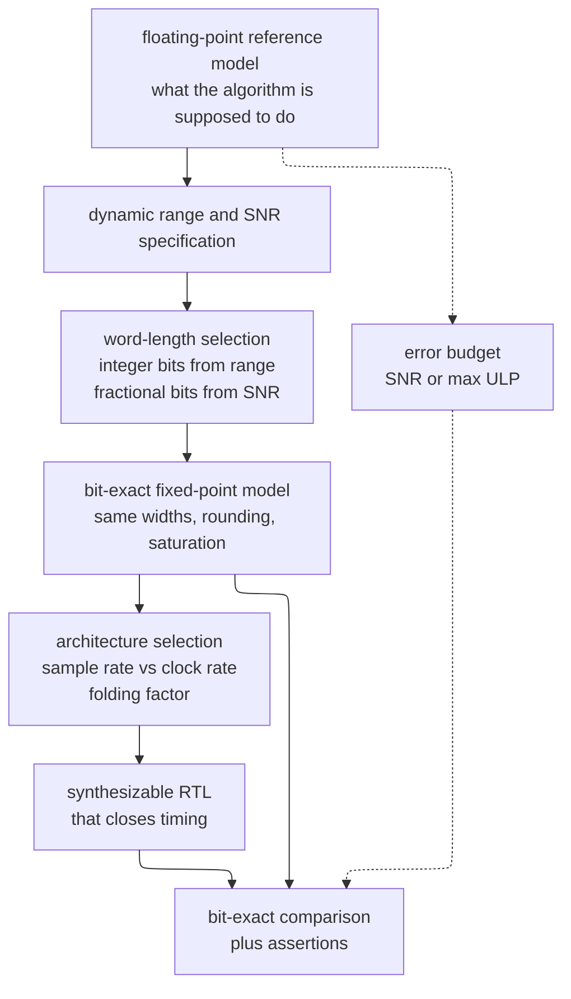
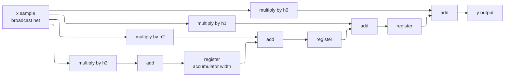
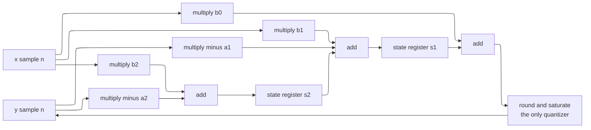
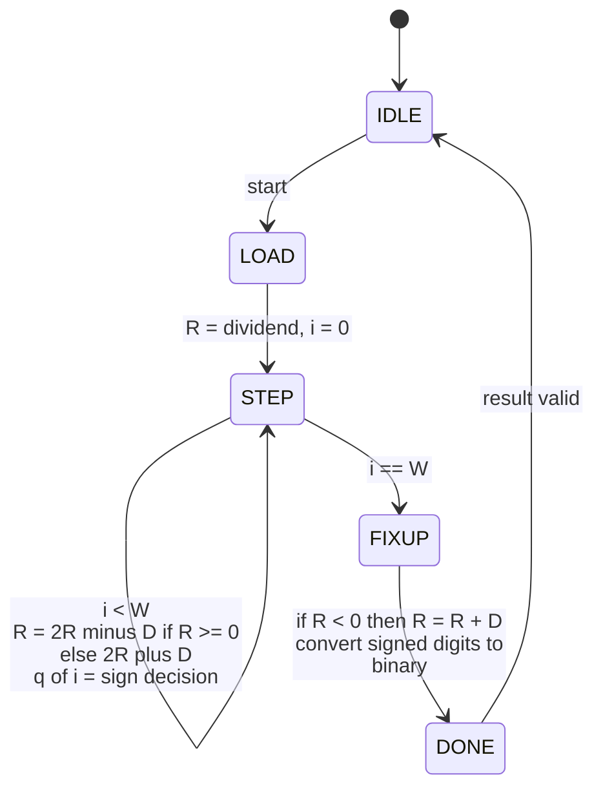
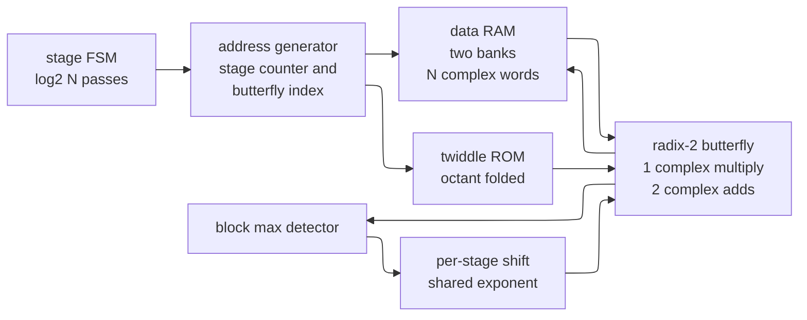
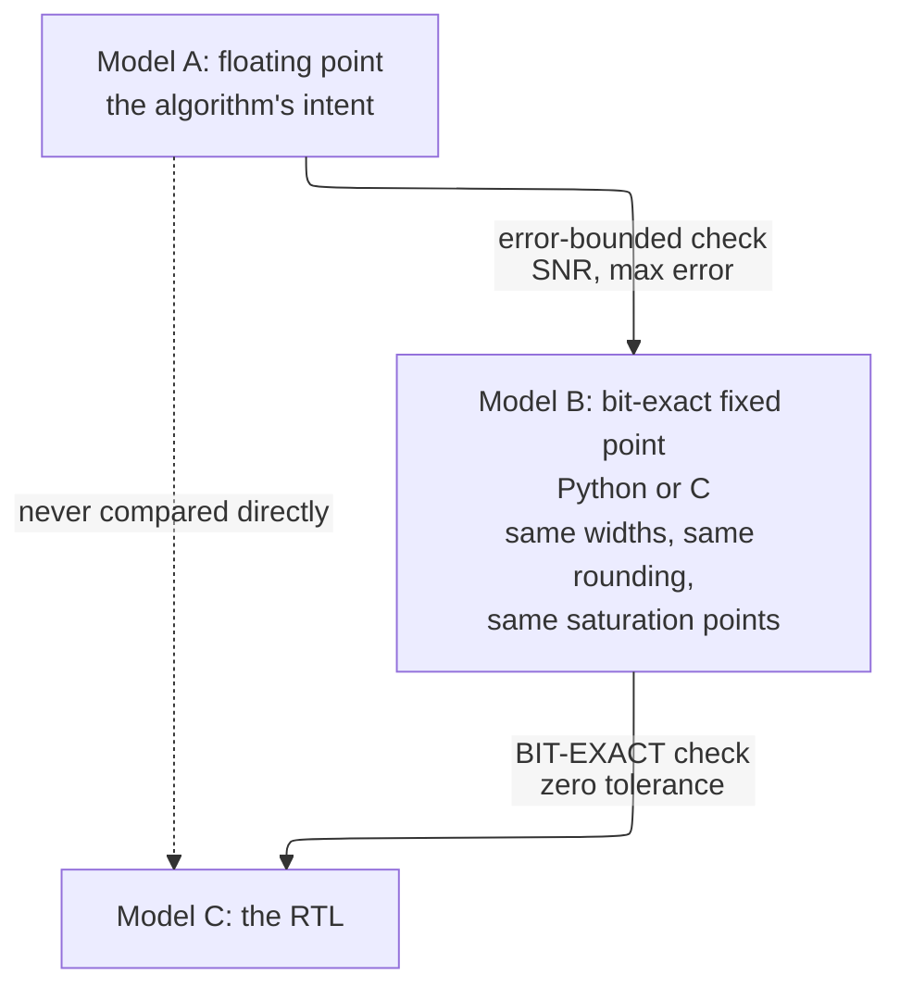

# Fixed-Point and DSP Hardware — turning a signal-processing algorithm into a datapath that closes timing



> **Prerequisites:** [Adders_and_Multipliers](03_Adders_and_Multipliers.md) (the carry-save accumulator, the Booth-plus-tree multiplier, and the delay/area cost of a multiply — this page decides *how many* of them you buy), [Arithmetic_and_Memory_RTL](../03_Frontend_RTL_and_Verification/16_Arithmetic_and_Memory_RTL.md) (Q-format alignment rules, the saturating-add cell, the rounding modes, and RAM inference — those are the primitives; this page builds algorithms out of them).
> **Hands off to:** [Floating_Point](04_Floating_Point.md) (when the dynamic-range analysis of §1 says no fixed word length works, and for the floating-point versions of the divide/root/elementary-function algorithms in §7–§8), [Sparsity_Quantization_and_Compression](../01_Architecture_and_PPA/03_NPU_Architecture/02_Mapping_and_Memory/02_Sparsity_Quantization_and_Compression.md) (INT8/INT4 neural-network quantization is this page's number-format engineering applied to weights and activations — §11).
> **Abbreviation key — return as needed:** analog-to-digital converter (ADC); block floating point (BFP); canonical signed digit (CSD); cascaded integrator-comb (CIC); decimation in time (DIT); direct form II transposed (DF2T); digital signal processing (DSP); fan-out-of-four inverter delay (FO4); fast Fourier transform (FFT); finite impulse response (FIR); gate equivalent, the area of one two-input NAND (GE); infinite impulse response (IIR); least-significant bit (LSB); multiply-accumulate (MAC); numerically controlled oscillator (NCO); orthogonal frequency-division multiplexing (OFDM); radix-2 single-path delay feedback (R2SDF); root mean square (RMS); read-only memory (ROM); signal-to-noise ratio (SNR); static random-access memory (SRAM); static timing analysis (STA); unit in the last place (ULP).

---

## 0. Why this page exists

You will not be hired as a "DSP person," and you will still write this hardware. A camera pipeline has a lens-shading correction, a demosaic filter, and a tone curve — all fixed-point datapaths. A power-management block has a current-sense filter and a proportional-integral controller — a fixed-point IIR. A radio has a decimator, an automatic gain control loop, and an FFT. A neural-network accelerator has an INT8 multiply-accumulate array feeding a requantizer. A motor drive has a Clarke/Park transform, which is a rotation, which is CORDIC. Every one of these is the same engineering problem wearing a different hat: **you were handed an algorithm defined over the real numbers, and you must ship a circuit that computes it in a finite number of bits, at a stated sample rate, with an error you can defend in a review.**

The failure mode when engineers skip this material is specific and recognizable. Someone writes the filter in `float` in a C model, hands it to an RTL engineer, and the RTL engineer picks widths by feel — "32 bits should be plenty" — and instantiates one multiplier per tap because that is what the equation looks like. The result is a block that is four times larger than it needed to be, does not close timing because a 64-input adder tree sits between two flops, and occasionally emits a full-scale glitch that nobody can reproduce because the accumulator wraps once every few million samples on a particular input. All three defects come from not doing the arithmetic *up front*: the width, the noise budget, and the folding factor are all computable from the specification before a line of RTL is written.

The specific skill this page teaches is: **take a floating-point reference model and a specification, and produce a bit-exact fixed-point RTL implementation together with a proven error bound.** "Proven" means you can say, in a design review, "the output signal-to-noise ratio is at least 84 dB, here is the noise budget by stage, the accumulator cannot overflow because $\|h\|_1 = 1.168$ and I carry one guard bit, and the RTL matches a bit-exact Python model on every one of these directed corner vectors." That sentence is the deliverable. Everything below is how to earn the right to say it.

The page assumes the *primitives* are already understood. Q-format notation, the saturating add cell, round-half-up versus round-half-to-even, and RAM inference live in [Arithmetic_and_Memory_RTL](../03_Frontend_RTL_and_Verification/16_Arithmetic_and_Memory_RTL.md); the adder and multiplier structures live in [Adders_and_Multipliers](03_Adders_and_Multipliers.md). What is new here is everything at the level above: *choosing* the format, *propagating* the error, *sizing* the accumulator, and *folding* the algorithm onto a number of arithmetic units chosen from the ratio of clock rate to sample rate.

Read the opening figure as a contract. The float reference defines intent; the specification defines the error you may commit; word-length selection turns the specification into integers; the bit-exact model freezes every rounding decision so that the RTL has something to be *equal to*; the architecture step decides how much silicon computes it; and the comparison step proves the whole chain. Skip the bit-exact model and the final comparison degenerates into "the RTL is within a few percent of the float model, probably fine," which is not a signoff criterion — it is a hope.

---

## 1. Number-format engineering: deriving the width, not guessing it

### 1.1 The notation, in brief

A **Qm.n** number is an $m+n$-bit two's-complement integer that everyone agrees to read as scaled by $2^{-n}$: the stored integer $\text{raw}$ represents the value $\text{raw}\cdot 2^{-n}$. The binary point is a convention held in the designer's head and in the comments, not a bit in the register. The hardware is an ordinary integer adder and an ordinary integer multiplier; only the interpretation differs. Throughout this page, $m$ **includes the sign bit**, so a Qm.n signed word covers $[-2^{m-1},\ 2^{m-1}-2^{-n}]$ with a step of $\Delta = 2^{-n}$.

The two alignment rules follow immediately and are derived in full in [Arithmetic_and_Memory_RTL §1](../03_Frontend_RTL_and_Verification/16_Arithmetic_and_Memory_RTL.md): **add** requires equal $n$ and produces one extra integer bit; **multiply** requires no pre-alignment at all and produces $\text{Q}m_1.n_1 \times \text{Q}m_2.n_2 = \text{Q}(m_1{+}m_2).(n_1{+}n_2)$. Storing a product back into a narrower word therefore always involves two lossy steps — dropping low bits (rounding) and dropping high bits (saturation) — and those two cells are the ones that page builds. This page takes them as given and asks the question that page does not: *what should $m$ and $n$ be?*

### 1.2 Fractional bits come from the SNR requirement

Model the error committed when a real value is forced onto the Q-format grid as an additive noise $e$, uniformly distributed over one step. For round-to-nearest, $e \in [-\Delta/2, +\Delta/2]$; for truncation toward $-\infty$, $e \in [-\Delta, 0]$. Either way the variance is the same:

$$
\sigma_e^2 \;=\; \frac{1}{\Delta}\int_{-\Delta/2}^{+\Delta/2} e^2\,de \;=\; \frac{1}{\Delta}\left[\frac{e^3}{3}\right]_{-\Delta/2}^{+\Delta/2} \;=\; \frac{\Delta^2}{12}.
$$

Truncation additionally has a **mean of $-\Delta/2$** — a direct-current (DC) offset of half an LSB — which is why truncation inside a feedback loop biases the loop and round-to-nearest does not. That $\Delta^2/12$ is the single most useful number in fixed-point design; commit it.

Now compute the best possible SNR for a $B$-bit word, $B = m+n$. The format's full range is $R = 2^m = \Delta\cdot 2^{B}$. Take the most favorable case: a signal that uniformly fills the whole range, so $\sigma_x^2 = R^2/12$. Then

$$
\text{SNR} \;=\; \frac{\sigma_x^2}{\sigma_e^2} \;=\; \frac{R^2/12}{\Delta^2/12} \;=\; \left(\frac{R}{\Delta}\right)^{\!2} = 2^{2B},
\qquad
\text{SNR}_{\text{dB}} = 20B\log_{10}2 = \boxed{6.0206\,B}.
$$

That is the 6.02 dB-per-bit rule, and it is a *ceiling*, not a promise. Two effects push a real design below it, and both are just bookkeeping:

- **Crest factor** $C_{\text{dB}} = 20\log_{10}(x_{\text{peak}}/x_{\text{rms}})$. A full-scale sinusoid has $C = 3.01$ dB, which recovers the familiar $\text{SNR} = 6.02B + 1.76$ dB — check it directly: $\sigma_x^2 = R^2/8$ gives $\text{SNR} = 1.5\cdot2^{2B}$ and $10\log_{10}1.5 = 1.76$. The bookkeeping that reconciles the two is $6.02B - 3.01 + 4.77 = 6.02B + 1.76$, and that $4.77 = 10\log_{10}3$ is the crest factor of the uniform full-range signal the $6.02B$ ceiling assumed; it reappears in the working formula below and is the term people drop. Speech has $C \approx 12$ dB; an OFDM waveform has $C \approx 10\!-\!12$ dB; a pulse train can have 20 dB or more.
- **Headroom** $H_{\text{dB}} = 20\log_{10}(R/2 \div x_{\text{peak}})$ — the deliberate gap you leave between the largest signal you expect and the largest number the format can hold, so that a transient does not clip.

So the working formula is

$$
\text{SNR}_{\text{dB}} \;=\; 6.02\,B \;+\; 4.77 \;-\; C_{\text{dB}} \;-\; H_{\text{dB}}
\qquad\Longrightarrow\qquad
B \;=\; \left\lceil \frac{\text{SNR}_{\text{req}} + C_{\text{dB}} + H_{\text{dB}} - 4.77}{6.02} \right\rceil .
$$

The $+4.77 = 10\log_{10}3$ term is not a fudge factor and dropping it is the classic mistake. The $6.02B$ ceiling was derived for a signal that fills the range *uniformly*, and a uniform distribution has a crest factor of its own: $20\log_{10}(\sqrt{12}/2) = 4.77$ dB. Subtracting the real signal's $C_{\text{dB}}$ without adding the reference distribution's back double-counts, and the formula then under-predicts every SNR by exactly 4.77 dB. Sanity check it on the case you already know: a full-scale sinusoid has $C = 3.01$ and $H = 0$, and the formula returns $6.02B - 3.01 + 4.77 = 6.02B + 1.76$ dB — the ADC datasheet result.

### 1.3 Integer bits come from the dynamic range

The integer part is a *containment* question, not a noise question: $m$ must be large enough that the largest value the node can ever hold is representable. Given a peak magnitude $V_{\max}$ at that node,

$$
m \;=\; \left\lceil \log_2 V_{\max} \right\rceil + 1 \quad\text{(the } +1 \text{ is the sign bit)}.
$$

The classic trap is $V_{\max} = 1.0$ in a Q1.15 word. Q1.15 spans $[-1,\ +0.999969]$: the value $-1$ is representable and $+1$ is **not**. Normalizing an ADC's output to "$\pm 1$ full scale" and then storing it in Q1.15 clips every positive full-scale sample. Either normalize to $\pm(1-2^{-15})$, or spend one bit and use Q2.14, which spans $[-2, +2)$ and buys 6.02 dB of headroom at the same time.

### 1.4 Worked format selection

**Specification.** A vibration-monitoring channel. The sensor front end delivers a signal normalized so that its peak excursion is $\pm 1.0$. The worst-case waveform has a crest factor of 12 dB. The required in-band SNR is 84 dB. Design practice adds 6 dB of margin against modeling error, so the target is 90 dB.

**Fractional bits, from the noise integral.** Signal RMS at full drive is $\sigma_x = 1.0/10^{12/20} = 1.0/3.981 = 0.2512$, so $\sigma_x^2 = 0.06310$. The permitted quantization-noise power is

$$
\sigma_e^2 \le \sigma_x^2 \cdot 10^{-90/10} = 0.06310 \times 10^{-9} = 6.310\times10^{-11}.
$$

From $\sigma_e^2 = \Delta^2/12$: $\Delta \le \sqrt{12 \times 6.310\times10^{-11}} = 2.752\times10^{-5}$, hence

$$
n \;\ge\; \log_2\frac{1}{2.752\times10^{-5}} \;=\; 15.15 \quad\Longrightarrow\quad n = 16 .
$$

**Integer bits, from the range.** $V_{\max}=1.0$, so $m = \lceil\log_2 1\rceil + 1 = 1$ would give Q1.16 — which cannot hold $+1.0$. Take $m=2$: Q2.16, spanning $[-2,+2)$, an 18-bit word.

**Cross-check with the shortcut formula.** Choosing $m=2$ against a peak of 1.0 means $H = 20\log_{10}(2/1) = 6.02$ dB of headroom. Then $\text{SNR} = 6.02\times18 + 4.77 - 12 - 6.02 = 95.1$ dB — and feeding $\Delta = 2^{-16}$ back through $\sigma_e^2 = \Delta^2/12$ gives 95.1 dB as well, so the two routes agree to within a tenth of a decibel. That is the check you always run, and it has a specific diagnostic value: **if the two routes disagree by about 4.8 dB you have dropped the $10\log_{10}3$.** Note also that 95.1 dB sits 5.1 dB *above* the 90 dB target, and the 5.1 dB is precisely the $6.02\times(16 - 15.15)$ bought by rounding $n$ up to an integer.

**The engineering decision that follows.** 18 bits is awkward. Rounding *up* to 20 bits (Q2.18) costs two extra bits in every register and roughly 20% in every multiplier, and buys 12 dB of margin you did not ask for. Rounding *down* to 16 bits (Q2.14) yields $6.02\times16 + 4.77 - 18.02 = 83.1$ dB — it misses the 84 dB requirement, and it misses by only 0.9 dB, which is exactly the kind of near-miss that tempts a team into shipping it and then discovering that the 6 dB modelling margin was the thing protecting them. So 18 bits it is, and the correct move is to declare it as a parameter rather than a magic number, because the next revision of the sensor will change the crest factor.

---

## 2. Quantization noise as a design tool

### 2.1 The model and where it breaks

Everything in §1.2 rests on four assumptions, usually credited to Bennett and made rigorous by Widrow and Kollár:

1. the error is uniformly distributed over one quantization step;
2. it is **white** — successive errors are uncorrelated;
3. it is uncorrelated with the signal;
4. errors from different quantizers in the same system are mutually uncorrelated.

These hold well when the signal traverses many quantization levels between samples — that is, when the signal is "busy" relative to $\Delta$. They fail in four situations that a hardware engineer meets constantly:

- **Small signals.** If the input swings over only two or three levels, the error is a *deterministic* function of the signal, not noise. A sine wave of amplitude $2\Delta$ produces a staircase whose error is periodic, so the "noise" appears as discrete harmonics — audible tones, not a floor.
- **DC and slowly varying inputs.** A constant input produces a constant error. There is no averaging; there is a bias.
- **Commensurate frequencies.** A sinusoid whose frequency is a simple rational multiple of the sample rate produces a periodic error sequence, hence line spectra — spurious tones, which is why an ADC datasheet quotes spurious-free dynamic range separately from SNR.
- **Feedback.** Inside a recursive loop the quantizer's output re-enters its own input, and the model's independence assumption collapses entirely. That is the limit-cycle problem of §6.

The engineering repair for the first three is **dither**: add a small pseudorandom sequence (typically triangular, peak-to-peak $2\Delta$) before the quantizer. Dither decorrelates the error from the signal, converting tones into a slightly higher but *benign* noise floor. The cost is about 4.8 dB of SNR and a linear-feedback shift register. Audio and instrumentation designs almost always pay it; a video pipeline usually does not, because a tone at $-90$ dB is invisible.

### 2.2 Noise through a linear system

A quantizer buried inside a filter does not deliver its noise directly to the output; the noise is filtered by whatever lies between the quantizer and the output. If white noise of variance $\sigma_e^2$ enters a linear time-invariant system with impulse response $g[k]$, the output noise power is

$$
\sigma_{\text{out}}^2 \;=\; \sigma_e^2 \sum_{k} g[k]^2 \;=\; \sigma_e^2\,\|g\|_2^2 \;=\; \frac{\sigma_e^2}{2\pi}\int_{-\pi}^{\pi}\left|G(e^{j\omega})\right|^2 d\omega ,
$$

the two forms being equal by Parseval's relation. The quantity $\|g\|_2^2$ — the **noise gain** — is the number to compute for every quantizer in the design. Note that $g$ is *not* the filter's own impulse response unless the quantizer sits at the input; it is the response from the quantizer's injection point to the output. A rounding step applied to the final output has $g = \delta$ and noise gain 1; a rounding step applied before a lowpass with $\|h\|_2^2 = 0.0625$ has its noise attenuated by 12 dB.

### 2.3 A multi-stage noise budget, worked

Consider a three-stage acquisition chain: a 14-bit ADC, a 64-tap decimating lowpass, and a final requantization to a 16-bit output word.

| Stage | Where the noise is injected | Step $\Delta$ | $\sigma^2 = \Delta^2/12$ | Noise gain to output | Contribution at output |
|---|---|---|---|---|---|
| 1 | ADC quantization, Q1.13 | $2^{-13}$ | $1.242\times10^{-9}$ | $\|h\|_2^2 = 0.0625$ | $7.761\times10^{-11}$ |
| 2 | accumulator round to Q2.20 after the FIR | $2^{-20}$ | $7.579\times10^{-14}$ | $1$ | $7.579\times10^{-14}$ |
| 3 | output requantization to Q1.15 | $2^{-15}$ | $7.761\times10^{-11}$ | $1$ | $7.761\times10^{-11}$ |
| | | | | **total** | $1.553\times10^{-10}$ |

Against a full-scale sinusoid of amplitude 1.0 (power 0.5),

$$
\text{SNR} = 10\log_{10}\frac{0.5}{1.553\times10^{-10}} = 10\log_{10}(3.220\times10^{9}) = 95.1\ \text{dB}.
$$

Now read the table as a *design* document rather than an analysis. Stages 1 and 3 contribute equally — $7.76\times10^{-11}$ each — and stage 2 contributes three orders of magnitude less. Stage 2 is therefore **over-designed**: those 20 fractional bits in the accumulator round buy nothing. Reduce it to 14 fractional bits and $\sigma_2^2$ becomes $3.104\times10^{-10}$, the total becomes $4.657\times10^{-10}$, and the SNR drops to 90.3 dB — still above an 84 dB requirement, and six bits narrower in the widest register in the block.

The general principle, and the reason a budget table beats intuition: **a contributor 10 dB below the sum of the others costs you $10\log_{10}(1.1) = 0.41$ dB.** Driving it another 10 dB down recovers 0.37 dB. Spend the area where contributions are comparable, and stop refining anything already 10 dB below the leader. Word-length optimization tools automate exactly this search; the manual version is the table above, and you should be able to produce it in a review from memory.

---

## 3. Overflow strategy: guard bits, saturation, and when wrapping is correct

### 3.1 The three policies

When a result exceeds the format's range there are exactly three things hardware can do, and each is right somewhere.

**Wraparound** is what a plain two's-complement adder does for free: the result is correct modulo $2^{B}$. Cost: zero. Failure: a value just above the maximum becomes a value near the minimum, so a positive peak becomes a negative trough — a full-scale discontinuity injected into the signal, not a small error.

**Saturation** clamps to the format's maximum or minimum. Cost: a comparator and a multiplexer per adder, plus (importantly) it breaks associativity, so the compiler-style reassociation that synthesis loves is no longer legal on a saturating adder tree. Failure: it is a nonlinearity, and inside a feedback loop a nonlinearity has dynamics of its own (§3.4).

**Guard bits** widen the accumulator until overflow is impossible, then requantize once at the end. Cost: extra flops and a wider adder on every stage. This is the only policy that is *exactly* correct, and it is the default inside any accumulation.

### 3.2 How many guard bits an accumulation needs

Take the general accumulation $y = \sum_{k=0}^{N-1} h_k\,x_k$ with $|x_k| \le X_{\max}$. By the triangle inequality,

$$
|y| \;\le\; \sum_k |h_k|\,|x_k| \;\le\; X_{\max}\sum_k |h_k| \;=\; X_{\max}\,\|h\|_1 .
$$

This is the **$L_1$-norm bound**, and it is *tight*: equality holds for the input sequence $x_k = X_{\max}\,\mathrm{sign}(h_k)$. That sequence is constructible, which means an adversary (or a customer) can produce it, which means you must either carry the bits or saturate. The number of extra integer bits above the product format is

$$
g \;=\; \left\lceil \log_2 \|h\|_1 \right\rceil .
$$

The famous $\log_2 N$ result is the special case $h_k = 1$ for all $k$ — a plain sum of $N$ terms, where $\|h\|_1 = N$ and $g = \lceil\log_2 N\rceil$. Every accumulator-sizing rule you will hear quoted is this formula with a particular $h$.

There is a companion **statistical** bound. If the $x_k$ are zero-mean and mutually uncorrelated with RMS $\sigma_x$, then the output RMS is $\sigma_y = \sigma_x\|h\|_2$, and a $k$-sigma containment bound gives

$$
g_{\text{stat}} \;=\; \left\lceil \log_2 \frac{k\,\|h\|_2}{X_{\max}/\sigma_x} \right\rceil .
$$

For unit coefficients this is $g_{\text{stat}} \approx \tfrac12\log_2 N + \log_2 k - \log_2(\text{crest factor})$ — roughly *half* the worst-case width. The statistical bound is not safe on its own; it is safe *with saturation as a backstop*, and the design question becomes what overflow rate you can tolerate. That trade is worked out numerically in Worked Problem 2.

### 3.3 The filter case, and the sinusoid refinement

For a filter, $\|h\|_1$ is the induced gain from bounded inputs to bounded outputs — the largest possible $|y|$ for $|x|\le 1$. But if you can guarantee the input is a *sinusoid* (or a narrowband signal), the relevant gain is instead the peak of the frequency response,

$$
\|H\|_\infty = \max_\omega \left|H(e^{j\omega})\right| \;\le\; \|h\|_1 ,
$$

and the inequality is often loose by several decibels. For the 11-tap Hamming-windowed lowpass used throughout this page, $\|h\|_1 = 1.168$ but $\|H\|_\infty = 1.00$: the worst-case bound demands one guard bit, the sinusoid bound demands none. Choosing between them is a *specification* decision — you are asserting something about the input — and it belongs in the design document, not in a comment.

### 3.4 When saturation is the wrong answer

Two important cases invert the usual advice.

**Modular accumulators must wrap.** A numerically controlled oscillator's phase accumulator represents phase, which is inherently modulo $2\pi$; mapping the accumulator's full range onto one turn makes two's-complement wraparound *exactly* the correct arithmetic, and saturating it would freeze the oscillator at the top of its range. The same argument covers the integrator stages of a CIC decimator: Hogenauer's result is that the integrator-comb pair is exactly reconstructing modulo $2^{B}$, so intermediate wraparound in an integrator is undone by the corresponding comb, *provided* every stage carries the same width $B \ge B_{\text{in}} + \lceil N\log_2(RM)\rceil$ and uses wrapping arithmetic. Insert a saturating adder into a CIC integrator and the filter produces permanently wrong output for large inputs — the modular cancellation is destroyed. This is the single most common CIC bug.

**Control loops need saturation *plus* anti-windup.** A digital controller whose integrator saturates suffers **integrator windup**: while the plant is rate-limited the error keeps the same sign, the integrator pins at its maximum, and when the error finally reverses the integrator must unwind from the clamp before the control action changes — producing a large overshoot that looks like instability. Wrapping is not the fix (a sign inversion in a feedback loop turns negative feedback into positive feedback, which is catastrophic rather than merely ugly). The fix is *conditional integration* (stop accumulating while the output is clamped) or *back-calculation* (feed the clamping error back into the integrator with a gain). The lesson generalizes: **saturation is a nonlinearity, and any nonlinearity inside a loop must be analyzed as part of the loop, not treated as an error handler.**

The saturating-add and rounding cells themselves — including the sign-and-overflow detection logic and the round-half-to-even implementation — are built in [Arithmetic_and_Memory_RTL §2–§4](../03_Frontend_RTL_and_Verification/16_Arithmetic_and_Memory_RTL.md). This page assumes them and decides *where* to place them.

---

## 4. The FIR filter as the canonical datapath

An $N$-tap finite impulse response filter computes

$$
y[n] \;=\; \sum_{k=0}^{N-1} h_k\, x[n-k].
$$

Every architectural idea in DSP hardware — folding, transposition, symmetry exploitation, systolic pipelining — shows up first here, in a structure simple enough that the arithmetic is checkable by hand.

### 4.1 Direct form: the obvious structure, and its critical path

Direct form is a literal transcription: a tapped delay line holds $x[n], x[n-1], \dots, x[n-N+1]$; each tap feeds a multiplier; the $N$ products are summed. The registers are $W_x$ bits wide (the input width), and there are $N-1$ of them. The combinational path from a delay-line register to the output is

$$
t_{\text{crit}}^{\text{direct}} \;=\; t_{\text{mult}} \;+\; \lceil \log_2 N\rceil \cdot t_{\text{add}}
$$

if the $N$ products are summed by a balanced adder tree, or $t_{\text{mult}} + (N-1)t_{\text{add}}$ if summed by a chain. With a 16×16 multiplier at roughly 12 FO4 and a 38-bit prefix adder at roughly 6 FO4, a 64-tap direct-form filter has a path of $12 + 6\times6 = 48$ FO4 — around 580 ps at 12 ps/FO4 (a 7 nm-class node, where FO4 $\approx$ 11–14 ps), capping the clock near 1.7 GHz *before* any wire delay. The tree grows with $\log_2 N$, so doubling the tap count costs another adder level.

### 4.2 Transposed form: the same filter, a constant critical path

Apply the **transposition theorem** to the signal-flow graph: reverse the direction of every edge, exchange source and sink, and the transfer function is unchanged. The delay line disappears from the input side; instead $x[n]$ is broadcast to all $N$ multipliers, and each product is added into a chain of registered accumulators running back toward the output.



Trace the contract. Between any two registers in that graph there is **exactly one multiplier and exactly one adder**, regardless of how many taps you draw. So

$$
t_{\text{crit}}^{\text{transposed}} \;=\; t_{\text{mult}} + t_{\text{add}} \;=\; 12 + 6 = 18\ \text{FO4} \approx 216\ \text{ps},
$$

independent of $N$. That is the derivation: transposition converts the $\lceil\log_2 N\rceil$-deep summation tree into a chain of accumulate stages, and the registers that were storing *delayed inputs* in direct form are now sitting *between adders*, doing pipelining work for free. A 64-tap transposed FIR closes at 4.6 GHz where the direct form closed at 1.7 GHz, with the same latency.

Two costs are paid, and they are why direct form is not obsolete:

- **The broadcast net.** $x[n]$ now drives $N$ multipliers. At $N=64$ and 16 bits, that is 1024 sinks on 16 nets. The buffer tree needed to drive them adds roughly $\log_4 N \approx 3$ FO4 stages of delay and real routing congestion, and at large $N$ it must itself be pipelined — which restores some of the latency you saved.
- **Wide registers.** The direct form's $N-1$ registers are $W_x = 16$ bits; the transposed form's are the full accumulator width $W_{\text{acc}} = W_x + W_h + g = 16+16+6 = 38$ bits. That is $63\times 38 = 2394$ flops versus $63\times 16 = 1008$ — 2.4× the sequential area.

The honest comparison is that direct form can be pipelined to the same frequency by cutting its adder tree, which costs $\lceil\log_2 N\rceil$ ranks of accumulator-width registers and $\lceil\log_2 N\rceil$ cycles of latency. Transposed form gets the pipelining *for free and at zero latency cost*; direct form pays for it. The place direct form still wins is symmetry.

### 4.3 Symmetric folding: halve the multipliers

A linear-phase FIR has $h_k = h_{N-1-k}$. Then for even $N$,

$$
y[n] \;=\; \sum_{k=0}^{N/2-1} h_k\,\big(x[n-k] + x[n-N+1+k]\big),
$$

so each coefficient is used once, on the *sum* of its two taps. This halves the multiplier count to $N/2$ at the cost of $N/2$ pre-adders of width $W_x + 1$. The economics are decisive: a 17-bit adder is on the order of 100 GE while a 16×16 multiplier is on the order of 2000 GE, so you trade a 2000 GE unit for a 100 GE unit — a 20:1 win, repeated $N/2$ times.

The pre-add is natural in direct form, because both members of a symmetric pair are simultaneously present in the delay line. In transposed form they are not — the input is broadcast, not delayed — so exploiting symmetry there requires an auxiliary delay line and loses much of the benefit. **This is the real selection rule: linear-phase filter with $N$ large and $f_s \ll f_{\text{clk}}$ → direct form with symmetric pre-adds and folding; non-symmetric filter or $f_s \approx f_{\text{clk}}$ → transposed form.**

### 4.4 RTL: transposed-form FIR

```systemverilog
// Transposed-form FIR. Critical path = one multiplier + one adder, independent of NTAP.
// Coefficients are Q1.(CW-1); the input is Q1.(DW-1); the accumulator carries GUARD
// extra integer bits, sized from ceil(log2 ||h||_1) as derived in section 3.2.
// Output y[n] = sum_k COEF[k] * x[n-1-k]: one sample of pipeline latency.
module fir_transposed #(
    parameter int NTAP  = 8,
    parameter int DW    = 16,        // input sample width
    parameter int CW    = 16,        // coefficient width
    parameter int GUARD = 3,         // ceil(log2(||h||_1)) extra integer bits
    parameter logic signed [CW-1:0] COEF [NTAP] = '{default: '0}
)(
    input  logic                          clk,
    input  logic                          rst_n,
    input  logic                          en,     // one pulse per input sample
    input  logic signed [DW-1:0]          x,
    output logic signed [DW+CW+GUARD-1:0] y       // Q(2+GUARD).(DW+CW-2)
);
    localparam int AW = DW + CW + GUARD;          // accumulator width

    logic signed [DW+CW-1:0] prod [NTAP];
    logic signed [AW-1:0]    acc  [NTAP];

    // Products are exact: DW x CW bits in, DW+CW bits out, no rounding here.
    always_comb begin
        for (int k = 0; k < NTAP; k++) prod[k] = x * COEF[k];
    end

    // AW'(prod[k]) sign-extends because prod is declared signed.
    always_ff @(posedge clk or negedge rst_n) begin
        if (!rst_n) begin
            for (int k = 0; k < NTAP; k++) acc[k] <= '0;
        end else if (en) begin
            acc[NTAP-1] <= AW'(prod[NTAP-1]);              // head of the chain
            for (int k = 0; k < NTAP-1; k++)
                acc[k] <= AW'(prod[k]) + acc[k+1];         // one mult + one add per stage
        end
    end

    assign y = acc[0];
endmodule
```

Three details carry the design intent. First, the multiply is **exact** — no rounding inside the chain — because rounding $N$ times injects $N$ independent noise sources where rounding once injects one; §2.3's budget says to round once, at the end. Second, `GUARD` is a parameter derived from $\|h\|_1$, not a guess, and the module's contract is that overflow is impossible if it was computed correctly. Third, `acc[NTAP-1]` is assigned the product alone because there is no upstream stage; getting that boundary wrong is the classic transposed-FIR bug, and it shows up as a spurious extra tap at the far end of the impulse response — which is exactly why §10's impulse test exists.

### 4.5 Four architectures for one filter, with arithmetic

Fix a concrete problem: **$N = 64$ taps, linear phase (so 32 effective multiplies per output), 16-bit data and coefficients, input sample rate $f_s = 10$ MSa/s, clock $f_{\text{clk}} = 500$ MHz.** The clock-to-sample ratio is $500/10 = 50$ clocks available per input sample — which is the number that decides everything.

The required arithmetic throughput is $32 \times 10\times10^6 = 320$ million multiply-accumulates per second. A single multiplier running at 500 MHz supplies 500 MMAC/s. **One multiplier is enough.** Any architecture with more than one is buying throughput the specification does not want.

The folded schedule looks like this in time:

```wavedrom
{ "signal": [
  { "name": "clk",     "wave": "p........." },
  { "name": "x_valid", "wave": "010.......", "node": ".a........" },
  { "name": "tap_idx", "wave": "x33333333x", "data": ["0","1","2","3","4","5","6","7"] },
  { "name": "mac_en",  "wave": "01.......0" },
  { "name": "acc",     "wave": "x444444445", "data": ["p0","+p1","+p2","+p3","+p4","+p5","+p6","+p7","hold"] },
  { "name": "y_valid", "wave": "0........1", "node": ".........b" }
 ],
 "edge": ["a~>b F clocks per output sample"],
 "head": {"text": "Time-multiplexed FIR: one MAC unit, fold factor F = 8, one output every 8 clocks"}
}
```

The contract of that waveform: `x_valid` marks the arrival of one input sample; for the next $F$ clocks the address generator walks `tap_idx` across the coefficient ROM and the delay-line RAM, the MAC accumulates one product per clock, and `y_valid` marks the completed output. The trade it illustrates is exact: the multiplier is busy $F$ of every $f_{\text{clk}}/f_s$ clocks, so utilization is $F\cdot f_s/f_{\text{clk}}$, and the maximum supportable sample rate is $f_{\text{clk}}/F$. The failure it warns about is the boundary case — if a new `x_valid` arrives before `y_valid`, the delay-line RAM is being written while the previous output is still reading it, and you need either a second bank or a guaranteed gap. That is a flow-control problem, handled with the ready/valid discipline of [Flow_Control_and_FIFOs](../03_Frontend_RTL_and_Verification/15_Flow_Control_and_FIFOs.md).

Area figures below use library-typical order-of-magnitude values — 16×16 signed multiplier ≈ 2000 GE, 40-bit adder ≈ 250 GE, flop ≈ 5.5 GE/bit — and are meant for *ratios*, not for a datasheet.

| Architecture | Mult | Clocks per output | Max $f_s$ at 500 MHz | Mult utilization at 10 MSa/s | Logic area | Latency | Memory | Pick it when |
|---|---|---|---|---|---|---|---|---|
| Fully parallel, transposed | 64 | 1 | 500 MSa/s | 2% | ≈ 156 kGE | 1 clk | none | $f_s$ within 2× of $f_{\text{clk}}$ |
| Fully parallel, direct + symmetric pre-add | 32 | 1 | 500 MSa/s | 2% | ≈ 81 kGE | ≈ 6 clk (pipelined tree) | none | same, and linear phase |
| Systolic, 64 cells | 64 | 1 | 500 MSa/s, highest achievable $f_{\text{clk}}$ | 2% | ≈ 162 kGE | 128 clk | none | you need the clock, not the filter |
| Semi-parallel, fold ×16 ($P=2$) | 2 | 16 | 31.2 MSa/s | 32% | ≈ 5.4 kGE | ≈ 20 clk | 1 kbit RAM + 512 b ROM | 3× rate headroom wanted |
| Time-multiplexed, single MAC | 1 | 32 | 15.6 MSa/s | 64% | ≈ 3.0 kGE | ≈ 36 clk | 1 kbit RAM + 512 b ROM | minimum area, spec met |

The single-MAC design is **53× smaller** than the fully parallel transposed one and meets the specification with 56% margin. That factor is not a rounding error in a PPA review; it is the difference between a block you can afford and one you cannot. The fully parallel design runs its 64 multipliers 2% of the time, meaning 98% of the most expensive silicon in the block is idle — and idle multipliers still leak, so the power argument points the same way ([Power_Reduction_Techniques](../02_Power_and_Low_Power/04_Power_Reduction_Techniques.md) for the clock-gating and power-gating that partially recover it).

The **systolic** variant deserves its own note because its motivation is different from the others. A systolic FIR places a register between *every* multiplier and its adder and lets the input propagate as a wavefront, so no signal travels more than one cell per clock: there is no broadcast net and no long adder chain, only nearest-neighbor connections. Its throughput equals the fully parallel form's, its area is slightly higher (two extra register ranks per cell), and its latency is roughly $2N$ clocks. You choose it not for arithmetic reasons but for *physical* ones — a locally connected array places and routes at a higher frequency than a design with a 64-way broadcast, which is exactly the argument that produces systolic arrays in NPUs ([Systolic_Spatial_and_Vector_Dataflows](../01_Architecture_and_PPA/03_NPU_Architecture/01_Compute_Dataflows/02_Systolic_Spatial_and_Vector_Dataflows.md)).

**Selection boundary.** Folding is free performance only while $f_{\text{clk}}/f_s \ge$ the required MACs per sample. When that ratio approaches 1 — a 500 MSa/s channelizer on a 600 MHz clock — folding is impossible and you are back to full parallelism, at which point the transposed or systolic forms are the only ones that close timing.

---

## 5. Multiplier-free implementations: constant coefficients are not multiplications

### 5.1 Why a constant coefficient is different

A general multiplier must handle any pair of operands, so it generates $W$ partial products and reduces them. But a filter coefficient is a **compile-time constant**. Multiplying by a constant $c$ whose binary expansion has $S$ non-zero bits is a sum of $S$ shifted copies of the input, and a shift by a constant amount is *free* in hardware — it is a wire renaming, zero gates and zero delay. So a constant multiply costs $S-1$ additions and nothing else.

For $c = 0.6875 = \text{0.1011}_2$: $c\cdot x = (x \gg 1) + (x \gg 3) + (x \gg 4)$, two adders. A 16×16 general multiplier is roughly 2000 GE; two 17-bit adders are roughly 220 GE. That is a 9× saving, obtained purely by knowing the coefficient at synthesis time.

The cost model is therefore **adder count**, and the optimization problem is to minimize the number of non-zero digits. A $W$-bit binary constant has on average $W/2$ ones, hence $W/2 - 1$ adders. Can we do better without changing the value?

### 5.2 Canonical signed digit recoding

Allow the digits to be $\{-1, 0, +1\}$ rather than $\{0,1\}$ — a subtraction is the same cost as an addition in two's complement, so a $-1$ digit is free relative to a $+1$ digit. Then a run of ones collapses:

$$
\underbrace{0\,1\,1\,1\,\cdots\,1}_{k\text{ ones}} \;=\; 2^{k}-1 \;\longrightarrow\; 1\,0\,0\,\cdots\,0\,\bar 1 ,
$$

turning $k$ non-zero digits into 2. The **canonical signed digit (CSD)** representation is the signed-digit form with the minimum number of non-zero digits, made unique by the additional property that no two adjacent digits are both non-zero. It is produced by a simple left-to-right scan: at each position, if the current bit is 1, emit the digit $r = 2 - (n \bmod 4) \in \{-1,+1\}$ and subtract $r$ from the running value, then shift.

CSD has two guarantees worth memorizing: **at most $\lceil (W+1)/2\rceil$ non-zero digits**, and an **average of $W/3 + 1/9$** non-zero digits for a random constant — versus binary's $W/2$. So the expected saving is about **33% of the adders**, with the best cases far better.

**Worked recoding.** Take the coefficient $h = 0.4967$ stored in Q1.15, so $\text{raw} = 16279$:

$$
16279_{10} = \texttt{11111110010111}_2 \quad\text{— 11 non-zero bits, 10 adders.}
$$

Scan it into CSD. The leading run of seven ones collapses, and the trailing $\texttt{10111}$ collapses again:

$$
16279 \;=\; 2^{14} - 2^{7} + 2^{5} - 2^{3} - 2^{0}
$$

Check: $16384 - 128 + 32 - 8 - 1 = 16279$. **5 non-zero digits, 4 adders** — down from 10. That is a 60% reduction on this coefficient, because it happened to be a value adjacent to a power of two.

Not every coefficient wins that much. The full 11-tap Hamming-windowed lowpass with $f_c = 0.25 f_s$ quantized to Q1.15 has four distinct coefficient magnitudes (the filter is symmetric, and the even-indexed taps other than the center are zero):

| Coefficient (Q1.15 raw) | Binary non-zero bits | Binary adders | CSD digits | CSD adders | CSD expansion |
|---|---|---|---|---|---|
| 166 | 4 | 3 | 4 | 3 | $2^7+2^5+2^3-2^1$ |
| −1374 | 7 | 6 | 5 | 4 | $-(2^{11}-2^{9}-2^{7}-2^{5}-2^{1})$ |
| 9453 | 8 | 7 | 6 | 5 | $2^{13}+2^{10}+2^{8}-2^{4}-2^{2}+2^{0}$ |
| 16279 | 11 | 10 | 5 | 4 | $2^{14}-2^{7}+2^{5}-2^{3}-2^{0}$ |
| **total** | **30** | **26** | **20** | **16** | |

Counting only the distinct magnitudes (symmetry means each is used once after the pre-add of §4.3, and the two zero coefficients cost nothing), CSD takes the filter from 26 adders to 16 — **38% fewer**, close to the $W/2 \to W/3$ average the theory predicts. Against a fully parallel multiplier implementation of the same four *non-zero* taps (four 16×16 multipliers ≈ 8 kGE), the CSD shift-add version needs 16 adders of ≈ 20 bits ≈ 2.1 kGE, a 3.8× area reduction. Note the shape of the table: 16279 alone accounts for most of the win, because it happens to sit next to a power of two, while 9453 — an ordinary-looking coefficient — gives back only two adders. Also note that a 0 coefficient costs *nothing* and a power-of-two coefficient costs *nothing* — which is why filter designers who care about area constrain the design to power-of-two coefficients where the frequency response can tolerate it.

### 5.3 Multiple-constant multiplication and subexpression sharing

CSD optimizes each coefficient in isolation. But an FIR multiplies **the same input** by many constants, which is the *multiple-constant multiplication* (MCM) problem: build all $N$ products $h_0 x, h_1 x, \ldots$ with the fewest total adders, allowed to share intermediate results.

The mechanism is **common subexpression elimination**. Suppose two coefficients both contain the digit pattern $2^a + 2^b$ at some relative offset. Compute $t = x + (x\gg(a-b))$ once, then each coefficient uses a shifted $t$ instead of two shifted $x$'s. Concretely, if $c_1 = 2^{14} + 2^{9}$ and $c_2 = 2^{7} + 2^{2}$, both are $(2^5+1)$ scaled: compute $t = (x\ll5) + x$ once, then $c_1 x = t \ll 9$ and $c_2 x = t \ll 2$ — two adders' worth of work done by one. Graph-based MCM algorithms (Hcub, RAG-$n$, and the exact-CSE formulations) search for the best set of such shared intermediates and routinely beat per-coefficient CSD by another 20–40% on real filter coefficient sets.

The related idea when many taps share a *structure* rather than a value is **distributed arithmetic**: precompute, in a $2^K$-entry ROM, the inner product of every possible $K$-bit slice of the input vector with the coefficient vector, then accumulate ROM outputs bit-serially. It replaces all multipliers with one ROM and one shift-accumulate, at the cost of $W$ clocks per output and a table that doubles with every additional tap in the group.

### 5.4 When a real multiplier still wins

Shift-add is not free, and four conditions send you back to a multiplier:

- **Programmable coefficients.** If the filter must be reloaded at runtime — an adaptive equalizer, a user-tunable equalizer band — the coefficients are not constants and there is nothing to recode. A multiplier is mandatory.
- **Hard multiplier resources.** An FPGA with hundreds of unused DSP slices, or an ASIC flow with a well-characterized multiplier macro, gives you a multiplier at effectively zero *marginal* area and better timing than an adder chain you have to place yourself.
- **Deep adder chains hurt timing.** $S-1$ adders in series is $S-1$ carry-propagate delays unless you tree them; a coefficient with 8 CSD digits has a longer combinational path than a well-pipelined multiplier.
- **Folded architectures.** In the single-MAC design of §4.5 the *same* multiplier is reused for all 32 coefficients, so there is exactly one multiplier in the whole block. Replacing it with 32 different shift-add networks would be strictly worse. **Shift-add wins in fully parallel architectures; multipliers win in folded ones** — the two optimizations are in direct competition, and you pick one.

---

## 6. IIR filters: what feedback costs

### 6.1 The recursive bound on clock frequency

An infinite impulse response filter computes

$$
y[n] \;=\; \sum_{k=0}^{M} b_k\,x[n-k] \;-\; \sum_{k=1}^{M} a_k\,y[n-k].
$$

The second sum is the problem: $y[n]$ depends on $y[n-1]$, which was computed one sample period earlier. That dependency forms a **loop** in the signal-flow graph, and a loop cannot be pipelined — inserting a register inside it changes the algorithm, because the register adds a delay to the recursion.

Formally, for any recursive signal-flow graph the **iteration bound** is

$$
T_\infty \;=\; \max_{\text{loops } l} \frac{t_l}{d_l},
$$

where $t_l$ is the total computation time around loop $l$ and $d_l$ is the number of delay elements in it. No retiming and no pipelining can achieve a sample period below $T_\infty$; it is a property of the algorithm, not of the implementation. For a first-order section $y[n] = x[n] + a\,y[n-1]$, the loop contains one multiplier, one adder, and one delay, so $T_\infty = t_{\text{mult}} + t_{\text{add}}$.

Put numbers on it. An 18×18 multiplier with a 2.0 ns delay and a 0.5 ns adder gives $T_\infty = 2.5$ ns, so the maximum sample rate of that section is **400 MSa/s**, no matter how fast the rest of the chip runs. An FIR of any length has no loop at all and can be pipelined to an arbitrary clock; an IIR cannot. This asymmetry is the single strongest architectural argument for FIR filters in high-rate hardware.

The escape is **look-ahead transformation**: algebraically substitute the recursion into itself to increase $d_l$. Two-step look-ahead gives

$$
y[n] = x[n] + a\big(x[n-1] + a\,y[n-2]\big) = x[n] + a\,x[n-1] + a^2\,y[n-2],
$$

a loop with **two** delays and still one multiply-add, so $T_\infty$ halves to 1.25 ns and the section reaches 800 MSa/s. The cost is one extra multiplier and one extra adder in the (pipelinable) feedforward path per look-ahead step, plus a numerical hazard: $a^2$ must be represented to the same accuracy as $a$, and for a pole near the unit circle $a^2$ is even closer to 1, so the coefficient-precision requirement grows with the look-ahead depth.

| Look-ahead steps $M$ | $T_\infty$ | Max $f_s$ | Extra multipliers | New feedback coefficient |
|---|---|---|---|---|
| 1 (none) | 2.50 ns | 400 MSa/s | 0 | $a$ |
| 2 | 1.25 ns | 800 MSa/s | 1 | $a^2$ |
| 3 | 0.83 ns | 1200 MSa/s | 2 | $a^3$ |
| 4 | 0.63 ns | 1600 MSa/s | 3 | $a^4$ |

### 6.2 Coefficient sensitivity, and why high-order IIRs become biquads

An order-$M$ direct-form denominator stores $M$ coefficients $a_k$, and the filter's poles are the roots of $1 + \sum a_k z^{-k}$. The sensitivity of a root $p_i$ to one coefficient is

$$
\frac{\partial p_i}{\partial a_k} \;=\; \frac{-\,p_i^{\,M-k}}{\displaystyle\prod_{j\ne i}\big(p_i - p_j\big)} .
$$

Read the denominator. If two poles are close together, $p_i - p_j$ is small and the sensitivity is enormous — the same conditioning disaster that makes Wilkinson's polynomial famous. A sharp high-order filter *necessarily* has clustered poles near the band edge, so a direct-form implementation of an 8th-order elliptic lowpass can require 30 or more coefficient bits before the realized response resembles the design, and can be outright unstable at 16 bits.

Factoring the transfer function into **cascaded second-order sections (biquads)** removes the coupling entirely: each section's two poles are determined by its own two coefficients and nothing else, so the product $\prod_{j\ne i}(p_i - p_j)$ in the sensitivity formula contains only the conjugate partner. Quantitatively, a section with poles at radius $r$ and angle $\pm\theta$ has $a_1 = -2r\cos\theta$ and $a_2 = r^2$, hence $r = \sqrt{a_2}$ and

$$
\frac{\partial r}{\partial a_2} = \frac{1}{2r}
\qquad\Longrightarrow\qquad
\Delta r \;=\; \frac{2^{-B}}{2r}\ \text{for } B \text{ fractional coefficient bits}.
$$

For $r = 0.99$ and $B = 9$: $\Delta r = 9.86\times10^{-4}$, which is 9.9% of the stability margin $1-r = 0.01$ — marginal. At $B = 12$: $\Delta r = 1.23\times10^{-4}$, or 1.2% of the margin — comfortable. So the biquad needs roughly **12 coefficient bits for poles at $r = 0.99$**, and 16 bits for $r = 0.999$. That is a two-line calculation you can do in a review, and it is why every practical IIR above second order ships as a cascade.

One refinement: the direct-form coefficient pair $(a_1, a_2)$ maps poles onto a *non-uniform* grid that becomes sparse near $z = 1$, so very-low-frequency poles are poorly placed even with many bits. The **coupled form** (Gold–Rader), which stores $r\cos\theta$ and $r\sin\theta$ directly, gives a uniform rectangular pole grid at the cost of four multipliers instead of two. Use it for low-frequency sections; use direct form elsewhere.

### 6.3 Limit cycles and the dead band

Put a quantizer inside the loop and the linear analysis stops applying. Consider $y[n] = Q\!\left[a\,y[n-1]\right] + x[n]$ with $x = 0$ and round-to-nearest quantization of step $\Delta$. A constant output $y$ persists forever if quantizing $a y$ returns $y$ itself:

$$
\left|a y - y\right| \le \frac{\Delta}{2}
\qquad\Longrightarrow\qquad
|y| \;\le\; \frac{\Delta/2}{1 - |a|} .
$$

Every value inside that interval is a fixed point of the loop. This is the **dead band**: with zero input, the filter can idle at any value in it, forever. For $a = 0.99$ and 15 fractional bits, the dead band is

$$
\frac{2^{-16}}{0.01} = 1.526\times10^{-3} = \textbf{50 LSB} = -56.3\ \text{dBFS},
$$

which in an audio path is a clearly audible tone and in a control loop is a permanent offset. Note that the dead band scales as $1/(1-|a|)$: moving the pole from 0.99 to 0.999 makes it ten times worse (500 LSB, $-36$ dBFS).

Four repairs, in increasing order of cost:

1. **Magnitude truncation** (round toward zero) in the feedback path instead of round-to-nearest. Because $|Q[v]| \le |v|$, the loop becomes a strict contraction and granular limit cycles in a second-order section are provably eliminated. Cost: a slightly higher noise floor and a small signal-dependent bias. This is the standard first move.
2. **More fractional bits in the feedback path only.** The dead band is proportional to $\Delta$, so four extra bits shrink it 16×. In the $a = 0.99$ example, going from 15 to 19 fractional bits in the state registers keeps the dead band at 50 of the *new* LSBs, which is about 3 LSB of the output format — $-80.4$ dBFS, inaudible. Cost: four bits on two state registers, cheap.
3. **Dither** in the loop, as in §2.1.
4. **Error feedback / noise shaping**: feed the quantization residue forward into the next sample's accumulator, which shapes the in-loop noise away from the band of interest. Cost: one extra register and adder per section; this is the same mechanism as a sigma-delta modulator's noise shaping.

**Overflow limit cycles** are the more dangerous cousin. If the accumulator wraps inside the loop, a large-amplitude self-sustaining oscillation can appear and never decay, because the wrap injects energy on every cycle. Here saturation is not optional: a classical result is that a second-order direct-form section using saturating arithmetic is free of overflow oscillations whenever $|a_1| + |a_2| < 1$. So §3.4's warning inverts inside an IIR — **inside a recursive loop, use saturation; the modular-arithmetic argument that justifies wrapping in a CIC does not apply when a quantizer sits in the loop.**

### 6.4 Scaling to prevent internal overflow

Even with correct output scaling, an internal node of an IIR can have a much larger transfer function than the overall filter — a resonant section can have 20 dB of internal gain while the cascade is flat. The fix is to insert scaling multipliers (usually powers of two, so they are shifts) so that every internal node stays in range. For a node whose transfer function from the filter input is $F(z)$, the safe scale factor $s$ satisfies $s\cdot\|F\| \le 1$ under one of three norms:

| Norm | Definition | Guarantees no overflow for | Conservatism |
|---|---|---|---|
| $L_1$ | $\sum_k \lvert f[k]\rvert$ | any bounded input | most conservative, always safe |
| $L_\infty$ | $\max_\omega \lvert F(e^{j\omega})\rvert$ | sinusoidal / narrowband inputs | moderate |
| $L_2$ | $\big(\tfrac{1}{2\pi}\!\int \lvert F\rvert^2 d\omega\big)^{1/2}$ | RMS sense only | least conservative |

Common practice is $L_2$ scaling with 2–4 bits of extra headroom and saturation as the backstop — $L_1$ scaling is often 10–20 dB pessimistic, and paying that in headroom costs 2–3 bits of SNR everywhere. Jackson's classical analysis also shows that the *ordering* of sections in a cascade and the *pairing* of poles with zeros change the total round-off noise by 10 dB or more; the standard heuristic is to order sections by increasing peak gain and pair each pole with its nearest zero.

### 6.5 The biquad, direct form II transposed



Direct form II transposed is the structure to reach for by default, for three reasons visible in the figure. It uses the **minimum number of state registers** (two, for a second-order section). Those states are held at the **full product scale**, so no quantization happens inside the state path. And there is exactly **one quantizer** in the whole section, at the output — which means §2.3's noise budget has one entry per biquad instead of five.

Trace the recursive loop: $y \to$ multiply by $-a_1 \to$ the adder producing $s_1 \to$ the $s_1$ register $\to$ the adder producing $y$. One multiplier and (with a carry-save compression of the three-input sum) roughly one adder delay. That is the $T_\infty$ of §6.1, and it is why registering the module's output does *not* help: the feedback tap is taken from the combinational $y$, not from the output register.

```systemverilog
// Biquad, direct-form-II transposed, one quantizer at the output.
//   y[n]  = b0*x[n] + s1
//   s1'   = b1*x[n] - a1*y[n] + s2
//   s2'   = b2*x[n] - a2*y[n]
// Samples are Q1.(DW-1); coefficients are Q2.(CW-2); states are held at the raw
// product scale (DW-1)+(CW-2) fractional bits, so the only rounding is on y.
// The recursive loop y -> na1 -> s1_d is combinational: it sets the iteration bound.
module biquad_df2t #(
    parameter int DW  = 18,     // sample width
    parameter int CW  = 18,     // coefficient width
    parameter int GRD = 4       // headroom bits in the state / accumulator path
)(
    input  logic                 clk,
    input  logic                 rst_n,
    input  logic                 en,             // one pulse per sample period
    input  logic signed [CW-1:0] b0, b1, b2,     // feedforward, Q2.(CW-2)
    input  logic signed [CW-1:0] na1, na2,       // ALREADY negated: -a1, -a2
    input  logic signed [DW-1:0] x,
    output logic signed [DW-1:0] y,
    output logic                 sat
);
    localparam int F  = CW - 2;                  // coefficient fractional bits
    localparam int SW = DW + CW + GRD;           // state / accumulator width
    localparam logic signed [DW-1:0] YMAX = {1'b0, {(DW-1){1'b1}}};
    localparam logic signed [DW-1:0] YMIN = {1'b1, {(DW-1){1'b0}}};
    localparam logic signed [SW-1:0] RNDC = SW'(1) <<< (F-1);   // round-to-nearest

    logic signed [SW-1:0] s1_q, s2_q, s1_d, s2_d, acc, shifted;
    logic signed [DW-1:0] y_c;
    logic                 sat_c;

    always_comb begin
        acc     = SW'(x * b0) + s1_q;                 // still at product scale
        shifted = (acc + RNDC) >>> F;                 // rescale to sample scale
        sat_c   = (shifted > SW'(YMAX)) || (shifted < SW'(YMIN));
        y_c     = (shifted > SW'(YMAX)) ? YMAX
                : (shifted < SW'(YMIN)) ? YMIN
                : DW'(shifted);
        // Feedback uses y_c, the value the output actually takes, so that the
        // saturation nonlinearity is inside the loop where the stability proof needs it.
        s1_d    = SW'(x * b1) + SW'(y_c * na1) + s2_q;
        s2_d    = SW'(x * b2) + SW'(y_c * na2);
    end

    always_ff @(posedge clk or negedge rst_n) begin
        if (!rst_n) begin
            s1_q <= '0;   s2_q <= '0;   y <= '0;   sat <= 1'b0;
        end else if (en) begin
            s1_q <= s1_d; s2_q <= s2_d; y <= y_c; sat <= sat_c;
        end
    end
endmodule
```

The load-bearing choice is feeding back `y_c` rather than the pre-saturation `shifted`. Feed back the unsaturated value and the loop's state can grow without bound while the output looks clamped and healthy — the block appears to work in simulation and then latches up on a transient in silicon. Feeding back the saturated value puts the nonlinearity inside the loop, which is exactly the configuration the $|a_1|+|a_2|<1$ no-overflow-oscillation result assumes.

---

## 7. CORDIC: trigonometry from shifts and adds

### 7.1 The derivation

Rotating a vector $(x,y)$ by an angle $\theta$ is

$$
x' = x\cos\theta - y\sin\theta, \qquad y' = x\sin\theta + y\cos\theta .
$$

Factor out $\cos\theta$:

$$
x' = \cos\theta\,\big(x - y\tan\theta\big), \qquad y' = \cos\theta\,\big(y + x\tan\theta\big).
$$

Here is the whole trick. **Choose the rotation angles so that $\tan\theta$ is a power of two.** Define the micro-rotation angles $\alpha_i = \arctan(2^{-i})$; then $y\tan\alpha_i = y \gg i$ and $x\tan\alpha_i = x\gg i$, and each step is two shifts and two adds. Decompose the target angle as a signed sum $\theta = \sum_i d_i\alpha_i$ with $d_i \in \{-1,+1\}$, and drive an angle accumulator $z$ toward zero to pick the $d_i$ greedily:

$$
\begin{aligned}
x_{i+1} &= x_i - d_i\,\big(y_i \gg i\big) \\
y_{i+1} &= y_i + d_i\,\big(x_i \gg i\big) \\
z_{i+1} &= z_i - d_i\,\alpha_i,
\end{aligned}
\qquad d_i = \operatorname{sign}(z_i).
$$

The dropped $\cos\alpha_i$ factors do not vanish; they accumulate into a **known constant gain**

$$
K_n = \prod_{i=0}^{n-1}\frac{1}{\cos\alpha_i} = \prod_{i=0}^{n-1}\sqrt{1+2^{-2i}} \;\xrightarrow[n\to\infty]{}\; 1.646760,
\qquad \frac{1}{K_\infty} = 0.607253 .
$$

Because $K$ does not depend on the angle, it is compensated for free: pre-scale the input by $1/K$ (which for a constant input magnitude costs nothing at all), or post-scale, or absorb it into an adjacent filter coefficient. For $n=6$, $K_6 = 1.646492$, already within $2.7\times10^{-4}$ of the limit.

The **convergence range** is set by the reachable angle span $\sum_{i\ge0}\arctan 2^{-i} = 1.7433$ rad $= 99.88°$. Angles outside $\pm 99.88°$ must be range-reduced first, which for the circular case is a quadrant fold: subtract multiples of $90°$ (a coordinate swap and sign flip, zero cost) until the residue is in range.

### 7.2 A six-iteration rotation, traced

Rotate by $30°$, starting from $(x_0, y_0) = (1/K_6,\ 0) = (0.607352,\ 0)$ so that the output emerges pre-scaled. The correct answer is $(\cos 30°, \sin 30°) = (0.866025,\ 0.500000)$.

| $i$ | $\alpha_i$ (deg) | $z_i$ (deg) | $d_i$ | $x_i$ | $y_i$ |
|---|---|---|---|---|---|
| 0 | 45.0000 | +30.0000 | +1 | 0.607352 | 0.000000 |
| 1 | 26.5651 | −15.0000 | −1 | 0.607352 | 0.607352 |
| 2 | 14.0362 | +11.5651 | +1 | 0.911028 | 0.303676 |
| 3 | 7.1250 | −2.4712 | −1 | 0.835109 | 0.531433 |
| 4 | 3.5763 | +4.6538 | +1 | 0.901538 | 0.427044 |
| 5 | 1.7899 | +1.0775 | +1 | 0.874848 | 0.483390 |
| — | — | −0.7124 | — | **0.859742** | **0.510729** |

The residual angle after six iterations is $-0.712°$, comfortably inside the guaranteed bound $|z_n| \le \alpha_{n-1} = 1.79°$. The output vector is therefore rotated $0.712°$ short of $30°$, giving errors of $-0.00628$ in $x$ and $+0.01073$ in $y$ — magnitudes near $0.712° \times \pi/180 = 0.0124$, exactly as the angle residual predicts. Six iterations bought roughly $\log_2(1/0.0124) = 6.3$ bits.

That is the general **accuracy law**: after $n$ iterations $|z_n| \le \arctan 2^{-(n-1)} \approx 2^{-(n-1)}$, and the induced error in $(x,y)$ is $\approx |z_n|\cdot|\text{vector}|$, so CORDIC delivers **approximately one bit of accuracy per iteration**. To get $B$ good bits you run about $B$ iterations.

The second half of the accuracy law concerns the datapath width. Each iteration commits a rounding error of about $2^{-W}$ where $W$ is the internal width; $n$ iterations accumulate to at most $n\cdot 2^{-W}$ (worst case) or $\sqrt n\cdot 2^{-W}$ (statistically). To keep that below the $2^{-B}$ target you need

$$
W \;\ge\; B + \left\lceil\log_2 n\right\rceil \;\approx\; B + \log_2 B .
$$

For $B = 16$ that is $W \ge 16 + 5 = 21$ bits, usually rounded to 22. **Guard bits are not optional in a CORDIC** — a 16-bit CORDIC built with a 16-bit datapath delivers about 12 good bits, and the bug looks like a mysterious accuracy shortfall rather than a functional failure.

### 7.3 Vectoring mode and the function set

Flip the decision rule from $d_i = \operatorname{sign}(z_i)$ to $d_i = -\operatorname{sign}(y_i)$ and the iteration drives $y$ to zero instead of $z$. The vector is rotated onto the $x$ axis, and at the end

$$
x_n = K_n\sqrt{x_0^2 + y_0^2}, \qquad y_n \approx 0, \qquad z_n = z_0 + \arctan\frac{y_0}{x_0}.
$$

That is a rectangular-to-polar conversion — magnitude and phase — in the same hardware, with a one-bit change to the decision logic. Generalizing further, Walther's unified algorithm parameterizes the iteration by $m \in \{1, 0, -1\}$:

$$
x_{i+1} = x_i - m\,d_i\,(y_i\gg i), \qquad
y_{i+1} = y_i + d_i\,(x_i\gg i), \qquad
z_{i+1} = z_i - d_i\,e_i ,
$$

with $e_i = \arctan 2^{-i}$, $2^{-i}$, or $\operatorname{artanh} 2^{-i}$ respectively.

| $m$ | Mode | Rotation ($d_i = \operatorname{sign} z_i$) gives | Vectoring ($d_i = -\operatorname{sign} y_i$) gives |
|---|---|---|---|
| $+1$ circular | $e_i = \arctan 2^{-i}$ | $\cos, \sin$; polar → rectangular | magnitude $\sqrt{x^2+y^2}$; $\arctan(y/x)$, i.e. rectangular → polar |
| $0$ linear | $e_i = 2^{-i}$ | $y_0 + x_0 z_0$ — a **multiply** | $z_0 + y_0/x_0$ — a **divide** |
| $-1$ hyperbolic | $e_i = \operatorname{artanh} 2^{-i}$ | $\cosh, \sinh$, hence $e^{w} = \cosh w + \sinh w$ | $\operatorname{artanh}(y/x)$, hence $\ln w = 2\operatorname{artanh}\frac{w-1}{w+1}$ and $\sqrt w$ via the magnitude of $\left(w+\tfrac14,\ w-\tfrac14\right)$ |

One block, one control bit and one ROM select, and you have sine, cosine, arctangent, magnitude, multiply, divide, exponential, logarithm, and square root. That breadth is CORDIC's real argument. The hyperbolic mode has one wrinkle: the series $\sum\operatorname{artanh}2^{-i}$ does not converge over the needed range unless certain indices are **repeated** — the schedule starts at $i=1$ and repeats indices $4, 13, 40, \ldots$ following $i_{k+1} = 3i_k + 1$ — and its gain is $K_h \approx 0.828159$.

### 7.4 RTL: one pipelined stage

```systemverilog
// One pipelined CORDIC stage, circular rotation mode.
//   x' = x - d*(y >>> I),   y' = y + d*(x >>> I),   z' = z - d*atan(2^-I)
// d = +1 when z >= 0, else -1.  Angles use binary angle measure: a full turn
// is 2^AW, so ATAN = round(atan(2^-I) / (2*pi) * 2^AW) and the angle wraps for free.
// The shift by I is a constant -- it is wire renaming, zero gates and zero delay.
// That is the entire reason CORDIC is cheap.
module cordic_stage #(
    parameter int I  = 0,       // iteration index == shift amount
    parameter int DW = 22,      // x/y datapath width (B + log2(n) guard bits)
    parameter int AW = 22,      // angle width
    parameter logic signed [AW-1:0] ATAN = '0
)(
    input  logic                 clk,
    input  logic                 rst_n,
    input  logic                 en,
    input  logic signed [DW-1:0] x_i,
    input  logic signed [DW-1:0] y_i,
    input  logic signed [AW-1:0] z_i,
    output logic signed [DW-1:0] x_o,
    output logic signed [DW-1:0] y_o,
    output logic signed [AW-1:0] z_o
);
    logic signed [DW-1:0] xs, ys;
    logic                 d;                  // 1 => rotate in the positive direction

    always_comb begin
        d  = ~z_i[AW-1];                      // z >= 0 iff the sign bit is clear
        xs = x_i >>> I;                       // arithmetic shift: sign-preserving 2^-I
        ys = y_i >>> I;
    end

    always_ff @(posedge clk or negedge rst_n) begin
        if (!rst_n) begin
            x_o <= '0;  y_o <= '0;  z_o <= '0;
        end else if (en) begin
            x_o <= d ? (x_i - ys) : (x_i + ys);
            y_o <= d ? (y_i + xs) : (y_i - xs);
            z_o <= d ? (z_i - ATAN) : (z_i + ATAN);
        end
    end
endmodule
```

Instantiate $n$ of these in a chain, each with its own `I` and `ATAN`, and you have a fully pipelined CORDIC: throughput one result per clock, latency $n$ clocks, critical path one $DW$-bit adder. The area is $n \times (3\ \text{adders} + 3\ \text{registers})$ — for $n=17$, $DW=AW=22$, roughly $17\times(3\times130 + 66\times5.5) \approx 12.8$ kGE, plus a 17-entry $\times$ 22-bit angle ROM (374 bits, effectively free). An **iterative** version reuses one stage with a variable shifter and a small ROM: about 1.5 kGE plus a barrel shifter, at $n$ clocks per result. The barrel shifter is the reason the iterative version is not 17× smaller — a variable shift costs real multiplexers, where the pipelined version's constant shifts cost nothing.

### 7.5 When CORDIC wins, and when it does not

CORDIC's competition is a table. A direct lookup of $\sin$ over a quadrant at 16-bit output accuracy needs about $2^{14}$ entries $\times$ 16 bits $= 262$ kbit — the table size is **exponential in the input width**, which is why direct tables die past about 12 bits. But a table with **linear interpolation** does far better: split the input into $m$ coarse bits and the rest fine, store $\sin$ and $\cos$ at the segment boundaries, and interpolate. The interpolation error over a segment of width $\delta$ is at most $|f''|\delta^2/8$; for $\sin$ on $[0,\pi/2)$ with $m=8$, $\delta = 2^{-8}\cdot\pi/2 = 6.14\times10^{-3}$ and the error is $4.7\times10^{-6} = 2^{-17.7}$ — comfortably 16-bit accurate from a 256-entry, 8 kbit table plus one multiplier and two adders, about 2.5 kGE and 2–3 cycles of latency.

So the honest comparison, for one function at 16 bits:

| | Pipelined CORDIC | LUT + linear interpolation |
|---|---|---|
| Logic | ≈ 12.8 kGE | ≈ 2.5 kGE (one multiplier dominates) |
| Table | 374 bit | 8 kbit ROM |
| Latency | 17 clk | 2–3 clk |
| Throughput | 1/clk | 1/clk |
| Multiplier needed | **no** | yes |
| Extra functions | free ($\arctan$, magnitude, $\ln$, $\sqrt{\ }$, …) | a new table each |
| Two-input functions | native (vectoring: $\operatorname{atan2}$, magnitude) | needs a 2-D table — impractical |

**CORDIC wins when** the multiplier is the scarce resource (a small FPGA with its DSP slices already spent, or a control block where adding a multiplier would add a whole timing path), when you need several different functions from one block, when you need the *vectoring* operations — magnitude and $\operatorname{atan2}$ have two inputs and a table cannot cover a 2-D domain — or when the design must be uniform and regular for physical reasons.

**CORDIC loses when** a multiplier is already present and idle (then polynomial or interpolated-table evaluation is cheaper and much lower latency), when latency matters (17 cycles is a long time inside a control loop), or when only one function at modest precision is needed. And in a floating-point unit CORDIC is almost never the answer, because the FMA is already there and a minimax polynomial evaluated in 3–4 FMAs beats it on every axis — see [Floating_Point §8.7](04_Floating_Point.md).

---

## 8. Division, square root, and reciprocal in fixed point

Multiplication is cheap and division is not, because division is a **digit recurrence**: each quotient digit depends on the remainder left by the previous one, so the computation is inherently serial in a way multiplication is not. There are three families of answers, and the choice is a latency/area/table trade.

### 8.1 Restoring and non-restoring division as an FSM

Restoring division is long division in binary. Hold a partial remainder $R$, initially the dividend; at each step shift $R$ left, subtract the divisor $D$, and look at the sign. If the result is non-negative, the quotient bit is 1 and you keep it; if negative, the quotient bit is 0 and you must **restore** $R$ by adding $D$ back. Cost: $W$ iterations, and up to two additions per iteration.

Non-restoring division removes the restore. Allow the partial remainder to go negative and let the quotient digits be $\{-1,+1\}$: if $R \ge 0$ subtract $D$ on the next step, if $R < 0$ **add** $D$ instead. Exactly one addition per iteration, $W$ iterations, and a final conversion from the signed-digit quotient to two's complement (which is one subtraction of the negative-digit mask from the positive-digit mask, or equivalently a shift-and-increment). A final correction step fixes the remainder's sign if it ended negative.



The contract of that machine: $W+2$ cycles, one $W$-bit adder, one shift register for $R$, one for $Q$. A concrete trace: dividing $13$ by $4$ with $W=4$ produces quotient digits that assemble to $3$ and a remainder of $1$, and the useful check on any implementation is $\text{dividend} = Q\cdot D + R$ with $0 \le R < D$ — an invariant worth writing as an assertion. The failure this structure has versus a multiplier is stark: 4-bit division takes 6 cycles where a 4-bit multiply takes 1. Radix-4 SRT division halves the iteration count by producing 2 bits per step, at the cost of a quotient-digit selection table and a redundant remainder representation; that machinery is developed in [Floating_Point §8.4](04_Floating_Point.md), because it is where floating-point dividers actually live.

### 8.2 Newton–Raphson reciprocal: buy division with multiplication

If a fast multiplier exists, stop dividing and compute the reciprocal instead. Apply Newton's method to $f(z) = 1/z - d$, whose root is $z = 1/d$:

$$
z_{k+1} \;=\; z_k - \frac{f(z_k)}{f'(z_k)} \;=\; z_k - \frac{1/z_k - d}{-1/z_k^2} \;=\; z_k\,(2 - d\,z_k).
$$

Two multiplies and one subtract per iteration, no division anywhere. Now the crucial property. Define the relative error $\epsilon_k = 1 - d\,z_k$. Then

$$
\epsilon_{k+1} = 1 - d\,z_{k+1} = 1 - d\,z_k(2-d z_k) = 1 - 2 d z_k + (d z_k)^2 = (1 - d z_k)^2 = \epsilon_k^2 .
$$

**The error squares every iteration**, which means the number of correct bits *doubles*: $p \to 2p \to 4p \to 8p$. This is quadratic convergence, and it turns the iteration count into a two-line calculation.

The iteration must be seeded from a table. Normalize $d$ into $[1,2)$ (a leading-zero count and a shift), index a ROM by the top $p-1$ bits below the implicit leading 1, and read an initial estimate good to $p$ bits.

| Initial table | Correct bits after each iteration | Iterations to 24 bits | Multiplies | Table size |
|---|---|---|---|---|
| 8 bits | 8 → 16 → 32 | 2 | 4 | 128 × 10 b = 1.3 kbit |
| 12 bits | 12 → 24 | 1 | 2 | 2048 × 14 b = 28.7 kbit |
| 16 bits | 16 → 32 | 1 | 2 | 32768 × 18 b = 590 kbit |

Read that table as the design trade: going from an 8-bit seed to a 12-bit seed removes one iteration — two multiplies and roughly two cycles of latency — and costs 27 kbit of ROM. Going further to a 16-bit seed removes nothing and costs 560 kbit more; it is strictly wasted. **The right seed is the smallest one that removes an iteration**, and beyond that the table is pure loss.

**Worked trace.** Compute $1/1.7$ with an 8-bit seed. The table returns $z_0 = 0.5859375$, giving $\epsilon_0 = |1 - 1.7\times0.5859375| = 3.906\times10^{-3} = 2^{-8}$ — 8 correct bits, as advertised.

- Iteration 1: $z_1 = z_0(2 - 1.7 z_0) = 0.588226$, $\epsilon_1 = 1.526\times10^{-5} = 2^{-16}$. **16 bits.**
- Iteration 2: $z_2 = 0.5882352940$, $\epsilon_2 = 2.328\times10^{-10} = 2^{-32}$. **32 bits.**

The true value is $1/1.7 = 0.5882352941$. Two iterations, four multiplies, and the answer is exact to the width of a 32-bit datapath.

Two practical notes. First, Newton–Raphson converges *from below* if seeded from below and the multiplies are exact; with rounding, the last bit is not guaranteed correctly rounded, so a final remainder-correction step is required if you need a correctly rounded quotient (this is exactly why the floating-point page treats the last-bit problem separately). Second, the same machinery gives the inverse square root, $z_{k+1} = \tfrac{z_k}{2}\,(3 - d\,z_k^2)$, which also converges quadratically and — importantly — contains no division, so $\sqrt d = d \cdot (1/\sqrt d)$ is computed with multiplies only.

### 8.3 Piecewise polynomial and table-plus-interpolation

The third family evaluates a low-degree polynomial per input segment. Split the normalized input range into $2^m$ segments; store the coefficients of a degree-$D$ minimax polynomial for each. The approximation error on a segment of width $\delta = 2^{-m}$ is bounded by the classical interpolation bounds — for degree 1, $E \le |f''|_{\max}\delta^2/8$; for degree 2, $E \lesssim |f'''|_{\max}\delta^3/(9\sqrt3)$.

Work it for the reciprocal on $[1,2)$, where $|f''| = |2/d^3| \le 2$ and $|f'''| = |6/d^4| \le 6$, targeting $2^{-24}$:

| Degree | Bound | Segments needed | Table | Runtime cost |
|---|---|---|---|---|
| 1 (linear) | $2\delta^2/8 \le 2^{-24}$ → $\delta \le 2^{-11}$ | $2^{11} = 2048$ | ≈ 100 kbit | 1 multiply, 1 add |
| 2 (quadratic) | $6\delta^3/(9\sqrt3) \le 2^{-24}$ → $\delta \le 2^{-8}$ | $2^{8} = 256$ | ≈ 21.5 kbit | 2 multiplies, 2 adds (Horner) |

Each extra polynomial degree buys roughly one more power of $\delta$: a degree-$D$ minimax fit has error $\propto \delta^{D+1}$, so for a $2^{-24}$ target the segment count is $2^{24/(D+1)}$ and stepping from $D$ to $D+1$ divides it by $2^{24/(D+1) - 24/(D+2)}$ — $2^{12-8} = 16\times$ for $D = 1 \to 2$. The table above realizes 8× rather than 16× because the two error bounds carry different constants ($1/8$ against $1/(9\sqrt3)$), which is the usual gap between the asymptotic law and the arithmetic. The general shape is that **table size falls geometrically with degree while arithmetic grows linearly**, so degree 1 or 2 is almost always the optimum in hardware, and degree 3+ appears only when the ROM is the binding constraint.

Two refinements are standard. **Bipartite (and multipartite) tables** split the interpolation into two smaller tables added together, exploiting the fact that the correction term depends weakly on the high-order input bits; they achieve roughly $2p$ bits of accuracy from tables sized like $2^{2p/3}$, with adders only and no multiplier at all. And **coefficient storage can be shrunk** by noting that higher-order coefficients need fewer bits than the constant term — the degree-2 coefficient of a well-conditioned segment only needs enough precision to place its own contribution below the error target.

**Choosing among the three.** Digit recurrence has the smallest area and the worst latency and needs no table — use it in a control block or where divisions are rare. Newton–Raphson has the best latency when a multiplier already exists and the operand is wide — use it in a datapath that already has a MAC. Piecewise polynomial has the best latency of all (fully pipelined, 2–3 cycles) and the largest ROM — use it when the function is evaluated every cycle. The floating-point variants of all three, including the correctly-rounded-result problem and Goldschmidt's multiplicative variant, are in [Floating_Point §8.4–§8.5](04_Floating_Point.md).

---

## 9. The FFT as a hardware architecture

### 9.1 The butterfly and the operation count

The discrete Fourier transform of $N$ points costs $N^2$ complex multiplies computed directly. The radix-2 decimation-in-time factorization splits the sum into even- and odd-indexed samples, recursively, giving $\log_2 N$ stages of $N/2$ **butterflies** each:

$$
\begin{aligned}
X_{\text{top}} &= a + W_N^{\,k}\,b \\
X_{\text{bot}} &= a - W_N^{\,k}\,b
\end{aligned}
\qquad\text{where } W_N^{\,k} = e^{-j2\pi k/N}.
$$

One butterfly is **one complex multiply and two complex adds**. A complex multiply is 4 real multiplies and 2 real adds, or 3 real multiplies and 5 real adds using the Karatsuba-style identity $(a+jb)(c+jd)$ with the shared product $t = c(a+b)$ — worth taking when multipliers are expensive and adders are not. The total is

$$
\frac{N}{2}\log_2 N \ \text{butterflies}: \quad N=1024 \Rightarrow 512\times10 = 5120 .
$$

That count is the currency. Every architecture below spends the same 5120 butterfly operations; they differ only in **how many butterfly units** they instantiate and therefore how many clocks they take.

### 9.2 The twiddle-factor storage problem

Each butterfly needs $W_N^k$. A full table holds $N/2$ complex values: for $N=1024$ at 16 bits per component that is $512\times32 = 16$ kbit of ROM — comparable to the data memory itself, which is unacceptable in a small design. Three reductions:

- **Octant symmetry.** $W^{k+N/4} = -j\,W^k$ and $W^{N/2-k} = -\overline{W^k}$, so all $N/2$ twiddles are sign flips and real/imaginary swaps of the first $N/8$. Store 128 complex values (4 kbit) plus a small address-remap and sign/swap block. This is a 4× reduction for a few dozen gates and is close to free.
- **Two-level factorization.** Write $k = 32 k_1 + k_0$ and $W^k = W^{32k_1}\cdot W^{k_0}$: two tables of 32 entries each (2 kbit total) and one extra complex multiply per butterfly. An 8× table reduction for one multiplier — the right trade only when $N$ is large.
- **Generate them.** A CORDIC (§7) in rotation mode produces $W^k$ from the index with no table at all. A recursive resonator ($W^{k+1} = W\cdot W^k$) is cheaper still but accumulates error over the sequence and drifts, so it is used only with periodic re-seeding.

### 9.3 Three architecture families

**Memory-based.** One butterfly unit, one data memory of $N$ complex words, one twiddle ROM, and an address generator that walks the butterfly index pattern for each of the $\log_2 N$ stages, reading two words and writing two words per cycle.



The load-bearing detail is the **two banks**. An in-place radix-2 butterfly at stage $s$ reads the pair of addresses that differ only in bit $s$, so if the bank select is the exclusive-OR of the address bits, the two operands always land in different banks and both reads happen in one cycle. Get that wrong and every butterfly serializes its two reads on one bank.

Then count the accesses honestly, because this is where the cycle budget is usually mis-quoted. A butterfly is **two reads and two writes** — four accesses. Two *single-port* banks supply two accesses per cycle, so a butterfly takes **two** cycles and a transform takes $N\log_2 N$ cycles. Only with two **1R1W** banks, at roughly 1.6–1.9× the area per bit of a 1RW macro ([Memory_Circuits_and_Technologies](06_Memory_Circuits_and_Technologies.md)), does the read pair and the write pair overlap and give one butterfly per cycle, $\frac N2\log_2 N$ cycles per transform. Production engines pay for 1R1W, and the rest of this section assumes it; if you are costing a design with 1RW macros, double every memory-based cycle count below.

**Pipelined delay-feedback (R2SDF).** One butterfly per stage, $\log_2 N$ stages, each with a feedback shift register that holds $N/2^{s+1}$ words. Data streams through at one sample per clock.

```wavedrom
{ "signal": [
  { "name": "clk",       "wave": "p..........." },
  { "name": "in",        "wave": "33333333xxxx", "data": ["x0","x1","x2","x3","x4","x5","x6","x7"] },
  { "name": "bf_active", "wave": "0...1...0..." },
  { "name": "fifo_wr",   "wave": "3...4...x...", "data": ["x0..x3 stored","b0..b3 stored"] },
  { "name": "out",       "wave": "x...5...4...", "data": ["a0..a3 = x + x4","W times b0..b3"] }
 ],
 "head": {"text": "R2SDF stage 1 for N=8: fill 4, butterfly 4, drain 4 — one sample per clock, butterfly busy half the time"}
}
```

Read the contract: for the first $N/2$ clocks the stage merely loads its feedback FIFO; for the next $N/2$ it computes both butterfly outputs, emitting the sum immediately and pushing the difference back into the FIFO; then it drains those differences through the twiddle multiplier. Every stage does this at its own scale, so the pipeline accepts one sample per clock forever and produces one transform every $N$ clocks. The trade the waveform exposes is **50% butterfly utilization** — the adder is idle during fill and drain — which is exactly what radix-$2^2$ and radix-4 variants improve. The failure it warns about is the gap: if the input stream stalls mid-frame, every stage's FIFO occupancy must stall coherently, so the enable must be global.

Two arithmetic facts make R2SDF attractive. Its total memory is $\sum_{s} N/2^{s+1} = N-1$ complex words — the *same* as the memory-based design, not more. And the **radix-$2^2$** variant (He and Torkelson) reorganizes the twiddles so that all but $\log_4 N - 1$ of them are trivial multiplications by $\pm1$ or $\pm j$ (a sign flip and a swap, free), cutting the complex multiplier count for $N=1024$ from 9 to **4**.

**Fully parallel.** Instantiate all $\frac N2\log_2 N$ butterflies as pure combinational-plus-pipeline logic with no memory at all — the delays become wires. For $N=1024$ that is 5120 complex multipliers, roughly 46 million gate equivalents: absurd. Fully parallel FFTs exist only for small $N$ (8, 16, 64) as a fixed function inside a larger engine — an OFDM subcarrier mapper, a beamformer, or a small transform unit inside an accelerator.

### 9.4 Comparison for $N = 1024$, 16-bit complex

| Architecture | Butterfly units | Complex multipliers | Data memory | Cycles per transform | Throughput at 400 MHz | Logic area |
|---|---|---|---|---|---|---|
| Memory-based, radix-2 | 1 | 1 | 1024 words, 2 banks 1R1W | 5120 | 78 kFFT/s | ≈ 12 kGE |
| Memory-based, radix-4 | 1 (radix-4) | 3 | 1024 words, 4 banks 1R1W | 1280 | 313 kFFT/s | ≈ 35 kGE |
| Pipelined R2SDF | 10 | 9 | 1023 words | 1024 (streaming) | 391 kFFT/s | ≈ 95 kGE |
| Pipelined R2$^2$SDF | 10 | 4 | 1023 words | 1024 (streaming) | 391 kFFT/s | ≈ 50 kGE |
| Fully parallel | 5120 | ≈ 5120 | none | 1 (pipelined) | 400 MFFT/s | ≈ 46 MGE |

Radix-4 deserves a note because it is usually the best single change. One radix-4 butterfly does the work of four radix-2 butterflies and needs only **3** non-trivial complex multiplies instead of 4, because one of its four twiddles is $W^0 = 1$. It also halves the number of stages ($\log_4 N$ instead of $\log_2 N$), which halves the number of memory passes and therefore the memory bandwidth and the round-off accumulation. Its constraint is that $N$ must be a power of 4; for $N = 2^{\text{odd}}$ you append one radix-2 stage.

### 9.5 Bit-reversal addressing

Decimation-in-time with naturally ordered input produces **bit-reversed** output: bin $k$ appears at position $\operatorname{bitrev}(k)$. Four ways to deal with it, in descending order of preference:

1. **Reverse the address wires.** If you own the address generator, connect $\text{addr}[i]$ to $\text{addr}[L-1-i]$ on the output read port. Zero gates, zero cycles. This is the answer whenever the FFT's consumer reads from the same memory.
2. **Use DIF for the forward transform and DIT for the inverse.** Decimation-in-frequency takes natural input to bit-reversed output; decimation-in-time takes bit-reversed input to natural output. In a system that does forward-transform → multiply → inverse-transform (fast convolution, OFDM), the bit-reversal cancels and neither permutation is ever performed.
3. **Ping-pong buffer**, writing bit-reversed and reading naturally. Costs $N$ extra complex words.
4. **In-place permutation** with a counter that visits each index and swaps when $\operatorname{bitrev}(k) > k$. Costs $\approx N/2$ cycles and a bit-reversing counter (which, usefully, is just a normal counter that carries in the opposite direction).

### 9.6 Dynamic range: guard bits, unconditional scaling, and block floating point

A radix-2 butterfly can grow magnitude: $|a \pm W b| \le |a| + |b| \le 2\max(|a|,|b|)$, so each stage can double the peak. Over $\log_2 N$ stages the worst-case growth is $2^{\log_2 N} = N$ — a factor of 1024 for a 1024-point transform, meaning **10 bits of growth**. Three policies:

| Policy | Datapath width for 16-bit input, $N=1024$ | Accuracy behavior | Cost |
|---|---|---|---|
| Full guard bits, no scaling | 26 bits at the last stage | best; no scaling noise at all | widest multipliers and memory, ≈ 60% more area |
| Unconditional scaling, shift right 1 per stage | 16 bits throughout | signal is divided by $N$ whether it grew or not; classical analysis gives roughly **half a bit of SNR lost per stage** | cheapest |
| Block floating point | 16 bits plus a shared exponent | recovers most of the guard-bit accuracy | one max detector and a shared 4–5 bit exponent register per block |

Unconditional scaling is the trap that catches people. It is not that the FFT is inaccurate; it is that the FFT scaled by $2^{-1}$ per stage divides a *small* signal by 1024 just as enthusiastically as a large one, and every stage's rounding then sits at a fixed absolute level. For $N=1024$, ten stages at half a bit apiece costs about 5 bits, so a 16-bit unconditionally scaled FFT delivers roughly 11 effective bits.

**Block floating point** is the derived repair, and it is exactly the mechanism the AI world calls a microscaling format. Rather than a per-sample exponent (which would be full floating point, with all the alignment cost of [Floating_Point §8.1](04_Floating_Point.md)), share **one exponent across the whole block** of $N$ values. After each stage, detect the maximum magnitude in the block, count its redundant sign bits, and shift the entire block left by that amount while decrementing the shared exponent. A signal that actually grew gets scaled; a signal that did not, does not. The cost is one comparator tree running alongside the butterfly (the max for stage $s$ is computed while stage $s$ writes, and applied when stage $s{+}1$ reads) plus $\log_2\log_2 N$ bits of exponent. For a few hundred gates you recover most of the 5 bits that unconditional scaling threw away — which is why essentially every production fixed-point FFT ships with BFP.

---

## 10. Verifying a fixed-point datapath

### 10.1 The three-model discipline

The mistake that ruins fixed-point verification is comparing the RTL directly against the floating-point reference. When they differ by 3 LSBs you cannot tell whether that is the quantization error you designed for or a bug, so every failure becomes a judgment call and the testbench stops being a test. The repair is to keep **three** models and check two *different* things:



The A↔B check is a **numerical** question answered once, off-line, with a metric and a threshold — "the fixed-point model achieves 91.2 dB SNR against the float model on 10 million samples of the specified stimulus, requirement 84 dB." The B↔C check is a **logical** question answered continuously in regression, with **zero tolerance** — any mismatch is a bug, full stop. Splitting them this way is what makes the regression automatable.

Model B is not a re-derivation; it is a transcription of the RTL's arithmetic decisions. It must use the same accumulator widths, the same rounding mode (including the tie rule), the same saturation limits, and the same order of operations — because saturating addition is **not associative**, so `(a+b)+c` and `a+(b+c)` genuinely differ, and if the model and the RTL disagree on the order you will chase a phantom.

### 10.2 The stimulus that actually finds bugs

Random inputs find few fixed-point bugs, because the interesting states are at the edges of the number system and random data spends almost no time there. The directed set:

| Stimulus | What it proves | What it catches |
|---|---|---|
| **Impulse** ($x = [1,0,0,\dots]$) | the output *is* the coefficient sequence | coefficient load order, tap indexing, the transposed-form boundary tap, off-by-one in the delay line |
| **Positive full scale, DC** | no overflow at the $\|h\|_1$ bound for a lowpass | accumulator width, sign extension |
| **Negative full scale, DC** | the two's-complement asymmetry | negating $-2^{B-1}$, which has no positive counterpart — the single most common saturation bug |
| **Alternating $\pm$ full scale** | maximum high-frequency gain | overflow in a highpass or differentiator |
| **Sign-matched worst case**, $x[n] = X_{\max}\operatorname{sign}(h[N{-}1{-}n])$ | attains the $L_1$ bound *exactly* | whether the guard-bit calculation of §3.2 was right — this is the input that makes the bound tight |
| **Zero input after a large transient** | the filter settles to exactly zero | limit cycles and dead bands (§6.3); a nonzero steady state is a defect |
| **$\pm 1$ LSB dither around zero** | behavior where the uniform-noise model fails | rounding-mode bias, truncation offset |
| **Swept sine / chirp** | the frequency response matches the mask | coefficient quantization damage, wrong pole placement |
| **Reset assertion mid-stream** | state clears deterministically | uninitialized accumulators, X-propagation |

The sign-matched vector deserves emphasis. It is trivially constructible from the coefficients, it is the *only* input that exercises the worst-case accumulator value, and a design whose guard-bit budget was computed with the statistical bound of §3.2 will overflow on it by construction — which is the point: run it, confirm the saturation flag asserts and the output clamps gracefully, and record that as the documented behavior rather than discovering it in the field.

### 10.3 Assertions and formal

Immediate and concurrent assertions ([Assertions_and_Coverage](../03_Frontend_RTL_and_Verification/09_Assertions_and_Coverage.md)) turn the invariants above into always-on checks:

```systemverilog
// 1. The saturation flag is exactly the out-of-range condition -- not "usually".
//    `wide` is the pre-clamp value; this is a simulation/formal-only observation.
property p_sat_iff_oor;
  @(posedge clk) disable iff (!rst_n)
    en |-> ( sat == ((wide > SW'(YMAX)) || (wide < SW'(YMIN))) );
endproperty
assert property (p_sat_iff_oor);

// 2. When saturated, the output is exactly one of the two rails.
assert property (@(posedge clk) disable iff (!rst_n)
    (en && sat) |-> (y == YMAX || y == YMIN));

// 3. No UNINTENDED overflow: a shadow accumulator two bits wider must never
//    disagree with the real one. If it does, the guard-bit budget was wrong.
assert property (@(posedge clk) disable iff (!rst_n)
    en |-> (acc_shadow[AW+1:AW-1] inside {3'b000, 3'b111}));

// 4. Monotonicity of the requantizer: it is a formal property, small enough
//    to prove exhaustively on the combinational cell alone.
assert property (@(posedge clk) (wide_a <= wide_b) |-> (sat_round(wide_a) <= sat_round(wide_b)));
```

Assertion 3 is the pattern worth internalizing. Sizing an accumulator from $\|h\|_1$ is a *claim*; a shadow register two bits wider, checked for sign-extension in its top bits, converts that claim into a continuously monitored invariant with no cost in synthesized hardware.

Formal verification ([Formal_Verification](../03_Frontend_RTL_and_Verification/12_Formal_Verification.md)) is a poor fit for a 64-tap filter — the state space is enormous — but an excellent fit for the *cells*. A combinational round-and-saturate block with an 18-bit output is small enough to prove exhaustively equivalent to a reference expression, and once proven it never needs simulation coverage again. The productive split is: **prove the arithmetic cells formally, simulate the datapath that composes them.**

Finally, coverage. The two bins that matter and that nobody writes by default are (a) *did the accumulator ever come within one bit of its declared maximum?* — if not, the guard-bit budget is either untested or over-provisioned, and either finding is actionable — and (b) *did the rounding tie case ever occur?* Round-half-to-even and round-half-up differ only on exact ties, so a regression that never hits a tie has not distinguished them.

---

## 11. The bridge to AI hardware

Say it plainly: **INT8 and INT4 neural-network quantization is this page, with different vocabulary.** Nothing in the deep-learning quantization literature is a new arithmetic idea; it is fixed-point DSP applied to tensors, with the scales chosen by calibration instead of by specification.

The standard affine quantization maps a real value $r$ to an integer $q$ by

$$
r \;\approx\; s\,(q - z), \qquad q = \operatorname{round}\!\left(\frac{r}{s}\right) + z ,
$$

with $s$ the **scale** and $z$ the **zero point**. Set $z = 0$ and $s = 2^{-n}$ and this is *exactly* Qm.n. The two generalizations are: an arbitrary (non-power-of-two) scale, which turns the rescale from a shift into a fixed-point multiply-then-shift; and an offset, which lets an asymmetric activation range such as a post-ReLU $[0, 6]$ use the whole integer range instead of half of it. Both are §1's format engineering with two more degrees of freedom.

The correspondences are one-to-one:

| Neural-network quantization | This page |
|---|---|
| scale $s$, symmetric ($z=0$) | the fractional-bit count $n$ of a Q-format (§1.2) |
| zero point $z$ | a fixed offset added to the Q-format grid; costs one bias add per operand |
| per-tensor scale | one Q-format for the whole array |
| **per-channel** scale | §1's word-length selection performed independently per output channel, because each channel's weight range differs |
| **per-group / MX formats** (a shared exponent for 32 weights) | **block floating point**, §9.6 — the same mechanism the FFT uses for dynamic range |
| INT32 accumulator | §3.2's guard-bit derivation |
| requantization to INT8 after the accumulator | the multiply → round → saturate pipeline of [Arithmetic_and_Memory_RTL](../03_Frontend_RTL_and_Verification/16_Arithmetic_and_Memory_RTL.md) |
| clipping / outlier handling | saturation strategy, §3.1 |

**The accumulator width argument, done explicitly.** An INT8 × INT8 product spans $[-128\cdot127,\ 128\cdot128] = [-16256,\ 16384]$, which needs 16 signed bits. Accumulating $K$ such products over a reduction dimension of length $K$ requires, by the $L_1$ bound with unit coefficients,

$$
W_{\text{acc}} \;=\; 16 + \lceil\log_2 K\rceil .
$$

For $K = 1024$ — a typical transformer feed-forward reduction — that is $16 + 10 = 26$ bits. For $K = 4096$, 28 bits. **This is why every INT8 accelerator uses INT32 accumulators**: 32 bits covers reductions up to $K = 2^{16} = 65536$ with the worst-case bound, and beyond that the reduction must be split into partial sums (which is also what tiling does for memory reasons anyway). The statistical bound of §3.2 says the realistic requirement is much smaller — $16 + \tfrac12\log_2 K + 3 \approx 24$ bits at $K=1024$ — which is why some designs use 24-bit accumulators with saturation and accept a vanishing overflow rate.

**The requantization step, done explicitly.** After the INT32 accumulation, the result must return to INT8 for the next layer. The exact operation is multiply by $M = s_x s_w / s_y$, add the output zero point, round, and saturate. $M$ is a real number in $(0,1)$ known at compile time, so it is decomposed once as $M = 2^{-e}M_0$ with $M_0 \in [0.5, 1)$ held in Q0.31, and the runtime cost is one 32×32 multiply and one arithmetic shift — §1.1's rescale, with the shift amount and multiplier baked in by the compiler.

**Where the analogy stops.** Two things genuinely differ. First, the scales are *calibrated from data* rather than derived from a specification: you run the network on representative inputs, observe the distribution at each tensor, and choose $s$ to minimize some error criterion, which is an optimization problem with no closed form. Second, real weight and activation distributions have **outliers** that violate the uniform-noise assumption badly — a handful of activation channels in a transformer have ranges 100× the median, so a per-tensor scale wastes almost all of the integer range on values that never occur. That is the failure that motivates per-channel scaling, group-wise scaling, and the outlier-migration techniques; and at INT4, where the 6.02 dB/bit rule allows only 24 dB of SNR, group-wise block floating point stops being an optimization and becomes mandatory. The full treatment — including sparsity, mixed precision, and the compression formats that ride alongside — is in [Sparsity_Quantization_and_Compression](../01_Architecture_and_PPA/03_NPU_Architecture/02_Mapping_and_Memory/02_Sparsity_Quantization_and_Compression.md).

---

## Numbers to memorize

| Quantity | Value | Why it matters |
|---|---|---|
| Quantization noise power | $\sigma_e^2 = \Delta^2/12$ | the one integral underneath every SNR budget (§1.2) |
| SNR per bit | 6.02 dB; working form $\text{SNR} = 6.02B + 4.77 - C - H$ | converts an SNR specification into a word length; dropping the $4.77 = 10\log_{10}3$ under-predicts every result by 4.8 dB (§1.2) |
| Full-scale sinusoid SNR | $6.02B + 1.76$ dB | the ADC datasheet formula; the $1.76$ is $10\log_{10}1.5$ (§1.2) |
| Truncation bias | $-\Delta/2$ | truncation adds a DC offset; round-to-nearest does not (§1.2, §6.3) |
| Cost of dither | ≈ 4.8 dB of SNR | the price of turning quantization tones into a benign floor (§2.1) |
| A contributor 10 dB below the rest | costs 0.41 dB | stop refining any noise source already this far down (§2.3) |
| Guard bits for an accumulation | $g = \lceil\log_2\lVert h\rVert_1\rceil$ | the exact, attainable accumulator-width bound (§3.2) |
| The $\log_2 N$ rule | the $h_k = 1$ case of the above | plain $N$-term accumulator (§3.2) |
| Statistical guard bits | $\approx \tfrac12\log_2 N$ plus a $k$-sigma allowance | roughly half the width, requires saturation as backstop (§3.2) |
| Direct-form FIR critical path | $t_{\text{mult}} + \lceil\log_2 N\rceil\,t_{\text{add}}$ | grows with tap count; needs pipelining (§4.1) |
| Transposed-form FIR critical path | $t_{\text{mult}} + t_{\text{add}}$, independent of $N$ | the reason transposed form closes timing (§4.2) |
| Symmetric folding | halves multipliers; a pre-adder is ≈ 1/20 of a multiplier | first optimization on any linear-phase FIR (§4.3) |
| Folding factor limit | $F \le f_{\text{clk}}/f_s$ | the single number that selects the architecture (§4.5) |
| CSD non-zero digits | $\le\lceil(W{+}1)/2\rceil$; average $W/3 + 1/9$ | ≈ 33% fewer adders than binary, more on lucky constants (§5.2) |
| Iteration bound | $T_\infty = \max_l t_l/d_l$ | the sample period a recursion cannot beat, by any pipelining (§6.1) |
| Biquad coefficient precision | ≈ 12 bits at $r=0.99$, ≈ 16 at $r=0.999$; $\Delta r = 2^{-B}/2r$ | why high-order IIRs ship as biquad cascades (§6.2) |
| Limit-cycle dead band | $\dfrac{\Delta/2}{1-\lvert a\rvert}$ | 50 LSB for $a=0.99$ at 15 fractional bits (§6.3) |
| CORDIC gain | $K_\infty = 1.64676$, $1/K_\infty = 0.60725$ | the constant you pre-scale the input by (§7.1) |
| CORDIC convergence range | $\pm 99.88°$ ($1.7433$ rad) | anything beyond needs a quadrant fold (§7.1) |
| CORDIC accuracy law | ≈ 1 bit per iteration; internal width $W \ge B + \log_2 B$ | forgetting the guard bits silently costs 4 bits (§7.2) |
| Newton–Raphson convergence | $\epsilon_{k+1} = \epsilon_k^2$ — correct bits double | 8-bit seed → 2 iterations for 24 bits (§8.2) |
| Radix-2 FFT cost | $\tfrac N2\log_2 N$ butterflies (5120 at $N=1024$) | the currency every FFT architecture spends (§9.1) |
| R2SDF total memory | $N-1$ complex words | the same as a memory-based design, not more (§9.3) |
| FFT worst-case growth | $N$, i.e. $\log_2 N$ guard bits | 10 bits at $N=1024$ (§9.6) |
| Unconditionally scaled FFT | ≈ 0.5 bit of SNR lost per stage | ≈ 5 bits at $N=1024$; the reason BFP exists (§9.6) |
| INT8 accumulator width | $16 + \lceil\log_2 K\rceil$ bits | 26 bits at $K=1024$ — why INT32 accumulators (§11) |

---

## Worked problems

**1 — Word-length selection for a motor-drive current sense.**

*Problem.* A current-sense path normalizes the ADC output so that $1.0$ corresponds to 30 A. Requirements: (a) the full 30 A peak must be representable; (b) at the nominal running current of 6 A RMS the SNR must be at least 60 dB; (c) a 5 mA RMS ripple component at the loop bandwidth must be resolvable with at least 10 dB SNR. Choose the Q-format.

*Solution.* Handle each requirement separately, then take the maximum.

*Integer bits (requirement a).* $V_{\max} = 1.0$ in normalized units. Q1.$n$ spans $[-1, +1)$ and cannot represent $+1.0$, so $m = 2$, spanning $[-2, +2)$, i.e. $\pm 60$ A. That also gives $20\log_{10}(2/1) = 6.02$ dB of headroom, which a drive wants anyway for fault transients.

*Fractional bits from requirement (b).* Nominal RMS is $6/30 = 0.2$, power $0.04$. The permitted noise power is $0.04\times10^{-60/10} = 4.0\times10^{-8}$. From $\Delta^2/12 \le 4.0\times10^{-8}$: $\Delta \le \sqrt{4.8\times10^{-7}} = 6.928\times10^{-4}$, so $n \ge \log_2(1/6.928\times10^{-4}) = 10.50 \Rightarrow n = 11$.

*Fractional bits from requirement (c).* The ripple RMS is $5\times10^{-3}/30 = 1.667\times10^{-4}$, power $2.778\times10^{-8}$. For 10 dB SNR the noise power must be $\le 2.778\times10^{-9}$, so $\Delta \le \sqrt{12\times2.778\times10^{-9}} = 1.826\times10^{-4}$ and $n \ge \log_2(1/1.826\times10^{-4}) = 12.42 \Rightarrow n = 13$.

*Combine.* Requirement (c) binds. The format is **Q2.13**, a 15-bit word.

*Verify by the shortcut rule.* $\Delta = 2^{-13} = 1.2207\times10^{-4}$, so $\sigma_e^2 = 1.241\times10^{-9}$. At the ripple amplitude, $\text{SNR} = 10\log_{10}(2.778\times10^{-8}/1.241\times10^{-9}) = 13.5$ dB — above the 10 dB requirement by exactly the $6.02\times(13-12.42) = 3.5$ dB gained by rounding $n$ up. At the nominal current, $\text{SNR} = 10\log_{10}(0.04/1.241\times10^{-9}) = 75.1$ dB, comfortably above 60 dB.

*Engineering conclusion.* Round 15 up to a 16-bit word. The choice is Q2.14 (one more fractional bit, 6 dB more ripple SNR) versus Q3.13 (one more integer bit, $\pm 120$ A range so a 2× overcurrent fault is observed rather than clipped). In a motor drive the fault observability usually wins, so **Q3.13** — and that is a *system* argument, not an arithmetic one, which is why the format must be reviewed with the control engineer and not chosen alone.

---

**2 — Guard bits for a 1024-tap $\pm1$ correlator.**

*Problem.* A matched filter correlates a 12-bit signed input (range $[-2048, +2047]$) against a 1024-chip pseudorandom code with $h_k \in \{+1,-1\}$. Size the accumulator (a) for guaranteed no overflow, and (b) statistically, given that the input is a zero-mean signal with $\sigma_x = 512$ (a 12 dB crest factor) and the sample rate is 1 MSa/s. What overflow rate does each choice imply?

*Solution — worst case.* $\|h\|_1 = \sum_k |h_k| = 1024$. The $L_1$ bound gives

$$
|y|_{\max} = X_{\max}\|h\|_1 = 2048 \times 1024 = 2\,097\,152 = 2^{21}.
$$

A $B$-bit signed accumulator holds $[-2^{B-1}, 2^{B-1}-1]$. Holding $+2^{21}$ requires $B = 23$; holding only $-2^{21}$ would need $B=22$. And $+2^{21}$ *is* attainable: set $x_k = -2048$ wherever $h_k = -1$ and $x_k = +2047$ elsewhere — close enough that the two's-complement asymmetry decides a whole bit. The clean fix is to clamp the input to $[-2047, +2047]$ at the front end, which makes $|y|_{\max} = 2047\times1024 = 2\,096\,128 < 2^{21}$ and lets a **22-bit** accumulator suffice: $g = \lceil\log_2 1024\rceil = 10$ guard bits above the 12-bit input. Losing one input code is invisible; losing a bit on 1024 accumulator registers is not.

*Solution — statistical.* With uncorrelated inputs, $\sigma_y = \sigma_x\|h\|_2 = 512\sqrt{1024} = 512\times32 = 16\,384 = 2^{14}$. A $k$-sigma bound needs $\lceil\log_2(k\sigma_y)\rceil + 1$ bits:

| Bound | Peak allowed | Accumulator | Gaussian tail probability | Overflows per second at 1 MSa/s | Mean time between overflows |
|---|---|---|---|---|---|
| $4\sigma$ | 65 536 | 18 bits | $6.33\times10^{-5}$ | 63 | 16 ms |
| $6.5\sigma$ | 106 496 | 18 bits | $8.03\times10^{-11}$ | $8.0\times10^{-5}$ | ≈ 3.5 hours |
| worst case | 2 096 128 | 22 bits | 0 | 0 | never |

The $4\sigma$ row is the two's-complement asymmetry of §10.2 biting a second time, and it is why the two statistical rows tie at 18 bits. The formula returns $\lceil\log_2 65\,536\rceil + 1 = 17$, but $4\sigma$ lands *exactly* on $2^{16}$, and a 17-bit signed word spans $[-65\,536,\ +65\,535]$ — it holds the negative peak and misses the positive one by one LSB. Rounding up to 18 bits is the honest answer, so $4\sigma$ costs exactly what $6.5\sigma$ costs.

*Answer and the trade.* $4\sigma$ is therefore dominated outright — it buys not one bit of width over $6.5\sigma$ and delivers a defect rate $7.9\times10^{5}$ times worse. On its own terms it is also unusable: 63 clipping events per second in a correlator is a visible degradation of the detection statistic. $6.5\sigma$ needs 18 bits (since $106\,496 < 2^{17}$, an 18-bit signed word covers it) and overflows about once every 3.5 hours, which with saturation is a single slightly-wrong correlation peak in a system that produces a million per second. So the statistical design saves **4 bits out of 22 — 18% of the width of every register and adder in the reduction tree** — for a defect rate of $8\times10^{-11}$.

*The condition on taking that deal.* The statistical bound is only defensible if (i) saturation is implemented, so an excursion clips instead of inverting; (ii) an overflow-count register is exposed so the field can confirm the rate; and (iii) the input really is what you assumed. Requirement (iii) is the one that fails: if an interferer raises $\sigma_x$ by 12 dB, $\sigma_y$ rises by 12 dB, the $6.5\sigma$ point moves to $4\times10^{5}$, and the overflow rate goes from once per 3.5 hours to essentially continuous. **A statistical accumulator bound is a statement about the input, and it belongs in the interface specification.**

---

**3 — CSD recoding and adder count for an 11-tap filter.**

*Problem.* An 11-tap linear-phase lowpass ($f_c = 0.25f_s$, Hamming window, unity DC gain) has Q1.15 coefficients $[166,\,0,\,-1374,\,0,\,9453,\,16279,\,9453,\,0,\,-1374,\,0,\,166]$. Compare three implementations: general multipliers, binary shift-add, and CSD shift-add. Also state the guard-bit requirement.

*Solution — recode the worst coefficient by hand.* $16279 = \texttt{11111110010111}_2$, 11 non-zero bits. Scan from the least-significant end, emitting $r = 2 - (n \bmod 4)$ whenever the current bit is set. The long run of seven ones at the top collapses to $2^{14} - 2^{7}$, and the low $\texttt{10111}$ collapses to $2^{5} - 2^{3} - 2^{0}$:

$$
16279 = 2^{14} - 2^{7} + 2^{5} - 2^{3} - 2^{0} = 16384 - 128 + 32 - 8 - 1 .
$$

Five non-zero digits instead of eleven, hence **4 adders instead of 10**.

*Solution — the whole filter.* Symmetry means each distinct magnitude is used once, on the pre-added tap pair (§4.3), and the two zero coefficients cost nothing:

| Coefficient | Binary ones | Binary adders | CSD digits | CSD adders |
|---|---|---|---|---|
| 166 | 4 | 3 | 4 | 3 |
| −1374 | 7 | 6 | 5 | 4 |
| 9453 | 8 | 7 | 6 | 5 |
| 16279 | 11 | 10 | 5 | 4 |
| **total** | 30 | **26** | 20 | **16** |

*Comparison.*

| Implementation | Arithmetic units | Approximate area |
|---|---|---|
| Four 16×16 multipliers | 4 multipliers + 3 pre-adders + adder tree | ≈ 8000 GE + 0.6 kGE ≈ **8.6 kGE** |
| Binary shift-add | 26 adders (≈ 20 bits) + 3 pre-adders | ≈ 26×130 + 0.4 kGE ≈ **3.8 kGE** |
| CSD shift-add | 16 adders + 3 pre-adders | ≈ 16×130 + 0.4 kGE ≈ **2.5 kGE** |

CSD is **3.5× smaller than the multiplier version and 1.5× smaller than naive shift-add**. Only four multipliers appear, not six, because two of the six distinct taps are exactly zero and cost nothing at all. Common-subexpression sharing across the four coefficients (§5.3) typically removes another 2–3 adders.

*Guard bits.* $\|h\|_1 = 1.168$, so $g = \lceil\log_2 1.168\rceil = 1$ guard bit above the Q2.30 product format — a Q3.30 accumulator, 33 bits, which is then rounded once to the output format. If the specification restricts the input to sinusoids, $\|H\|_\infty = 1.00$ and even that one bit is unnecessary; the design document must say which assumption is being made.

*Caveat.* All of the above assumes the coefficients are fixed at synthesis. If this filter is ever reloaded at runtime, the entire CSD analysis is void and you must instantiate multipliers (§5.4).

---

**4 — CORDIC iteration count, width, and the LUT comparison.**

*Problem.* A block must produce $\sin$ and $\cos$ of a 16-bit angle with an absolute output error below $2^{-16}$, at one result per clock. Determine the iteration count, the internal datapath width, the resulting area and latency, and decide whether CORDIC or an interpolated table is the better choice. Then state what changes if the block must also compute $\operatorname{atan2}(y,x)$.

*Solution — iterations.* After $n$ iterations the residual angle is bounded by $|z_n| \le \arctan 2^{-(n-1)}$, and the induced error in a unit-magnitude output vector is approximately $|z_n|$. Requiring $|z_n| < 2^{-16} = 1.526\times10^{-5}$:

$$
\arctan 2^{-(n-1)} \approx 2^{-(n-1)} < 2^{-16} \;\Longrightarrow\; n-1 > 16 \;\Longrightarrow\; n = 17 .
$$

(Checking the boundary: $\arctan 2^{-15} = 3.052\times10^{-5} = 2^{-15.0}$, which is $2\times$ the target, so $n=16$ is one bit short and $n=17$ is correct.)

*Solution — internal width.* Each iteration rounds, contributing up to $2^{-W}$; 17 iterations accumulate up to $17\times2^{-W}$ in the worst case. Requiring that below $2^{-16}$:

$$
W \ge 16 + \lceil\log_2 17\rceil = 16 + 5 = 21 \;\Longrightarrow\; W = 22\ \text{bits (rounded up)}.
$$

*Solution — area and latency.* Seventeen instances of the `cordic_stage` module of §7.4: each has three 22-bit adder/subtractors (≈ 130 GE each) and three 22-bit registers (66 bits × 5.5 GE):

$$
17 \times (3\times130 + 66\times5.5) = 17 \times (390 + 363) = 17\times753 \approx 12.8\ \text{kGE}.
$$

Angle ROM: 17 entries × 22 bits = 374 bits, negligible. Latency 17 clocks, throughput 1 result/clock, critical path one 22-bit adder — so this closes timing essentially anywhere.

*Solution — the table alternative.* Reduce the angle to a quadrant (free: a swap and two sign flips), leaving 14 significant bits. Split into 8 coarse and 6 fine bits; store $\sin$ and $\cos$ at the 256 segment boundaries and interpolate linearly. Segment width $\delta = 2^{-8}\times(\pi/2) = 6.14\times10^{-3}$; the linear-interpolation error bound is $|f''|_{\max}\delta^2/8 = 1\times(6.14\times10^{-3})^2/8 = 4.7\times10^{-6} = 2^{-17.7}$ — meets the target with a bit of margin. Cost: a $256\times2\times16$-bit ROM (8 kbit), one 16×16 multiplier (≈ 2 kGE), two adders. Total ≈ **2.5 kGE + 8 kbit ROM, latency 2–3 clocks**.

*Decision.* For sine and cosine alone, the interpolated table wins decisively: **5× less logic and 6× less latency**, paid for with 8 kbit of ROM. Choose CORDIC here only if the multiplier is genuinely unavailable — an FPGA with its DSP slices exhausted, or a design where adding one multiplier adds a new timing path through an already-critical region.

*What changes with $\operatorname{atan2}$.* $\operatorname{atan2}(y,x)$ and $\sqrt{x^2+y^2}$ have **two** inputs, so a lookup table would have to cover a two-dimensional domain — $2^{28}$ entries at 14 bits each, which is not a design, it is a joke. CORDIC computes both simultaneously in *vectoring* mode with a one-bit change to the decision logic and the same 12.8 kGE of hardware. **Once the requirement list includes a rectangular-to-polar conversion, CORDIC wins outright**, and the sine/cosine functions come along free.

---

**5 — FFT architecture selection for a spectrum monitor.**

*Problem.* A 1024-point complex FFT, 16-bit input, runs on a 400 MHz clock. The input is a 40 MSa/s stream. Two operating modes must be supported: (a) contiguous non-overlapped frames, and (b) a spectrogram mode with 75% overlap. Choose an architecture and size the dynamic-range handling.

*Solution — the timing budget.* One frame is 1024 samples. In mode (a) a frame arrives every $1024/40\,\text{MSa/s} = 25.6\ \mu\text{s}$. In mode (b) the hop is 256 samples, so a new transform must complete every $256/40\,\text{MSa/s} = 6.4\ \mu\text{s}$.

*Solution — candidate throughputs.* The workload is $\tfrac{1024}{2}\log_2 1024 = 5120$ radix-2 butterfly operations.

| Architecture | Cycles per transform | Time at 400 MHz | Mode (a), 25.6 µs | Mode (b), 6.4 µs |
|---|---|---|---|---|
| Memory-based radix-2, 1 butterfly | 5120 | 12.8 µs | pass, 2.0× margin | **fail** |
| Memory-based radix-4, 1 butterfly | 1280 | 3.2 µs | pass, 8× margin | pass, 2.0× margin |
| Pipelined R2$^2$SDF | 1024 (streaming) | 2.56 µs | pass, 10× margin | pass, 2.5× margin |

*Solution — area.* Taking a complex multiplier at ≈ 8.5 kGE (four 16×16 real multipliers plus two adders) and a complex adder at ≈ 250 GE:

- Memory-based radix-2: 1 complex multiplier + 2 complex adders + address generator ≈ **12 kGE**, plus one 1024×32-bit SRAM (32 kbit) as two 1R1W banks (§9.3 — with 1RW banks the cycle counts below double) and a 4 kbit octant-folded twiddle ROM.
- Memory-based radix-4: 3 complex multipliers + 8 complex adders + a 4-bank address generator ≈ **35 kGE**, same memory but split into four 1R1W banks.
- R2$^2$SDF: 4 non-trivial complex multipliers + 10 butterflies + $N-1 = 1023$ words of delay-feedback storage ≈ **50 kGE** plus 32 kbit.

*Decision.* **Memory-based radix-4.** It is the smallest architecture that meets *both* modes, and it does so with 2× margin in the harder one. The pipelined design costs 43% more logic to deliver 2.56 µs where 3.2 µs suffices — throughput the specification never asked for. Note the structure of the argument: it is §4.5's folding argument transplanted to the FFT. The clock is 10× the sample rate, so the correct move is to time-share one butterfly unit rather than instantiate ten.

*Selection boundary.* If the requirement changed to 95% overlap (hop 51 samples, 1.28 µs per transform), radix-4 memory-based would fail at 3.2 µs — **and so would R2$^2$SDF**, which streams one sample per clock and therefore needs 1024 clocks = 2.56 µs per transform however the frames overlap. The reason is worth stating because it is easy to get backwards: overlap does not shorten the transform, it multiplies the *sample* rate the engine must swallow. At 95% overlap each input sample belongs to 20 frames, so the engine must accept $20 \times 40 = 800$ MSa/s against a 400 MHz clock, and no single-lane architecture on this clock can do that. The answers are a faster clock, a two-samples-per-clock radix-4 pipeline, or two engines processing alternate frames. If instead the input rate rose to 400 MSa/s with no overlap, only the pipelined design would work, because a memory-based engine physically cannot accept one sample per clock while also performing $\log_2 N$ passes over the same memory.

*Solution — dynamic range.* Worst-case magnitude growth over 10 radix-2 stages (5 radix-4 stages) is $N = 1024$, i.e. 10 bits. Three options: a 26-bit datapath with no scaling (largest, exact); unconditional scaling with a 16-bit datapath (cheapest, costs about 5 bits of effective resolution); or **block floating point** — a max-magnitude detector running alongside the butterfly, one shared 4-bit exponent per block, and a per-stage shift applied on the next stage's read. BFP costs a comparator tree and an exponent register, a few hundred gates against a 35 kGE engine, and recovers most of the 5 bits. For a spectrum monitor, where the whole point is measuring signals 60–80 dB below full scale, BFP is not optional.

---

## Cross-references

- **Down the stack (what this consumes):** [Adders_and_Multipliers](03_Adders_and_Multipliers.md) (the multiplier whose cost drives every folding decision in §4, the carry-save accumulator behind the MAC, and the prefix adder in the transposed-FIR critical path), [Arithmetic_and_Memory_RTL](../03_Frontend_RTL_and_Verification/16_Arithmetic_and_Memory_RTL.md) (Q-format alignment, the saturating-add cell of §3, the rounding modes of §2, and the RAM/ROM inference every folded design in §4.5 depends on), [Logic_Building_Blocks](02_Logic_Building_Blocks.md) (the barrel shifter that makes an iterative CORDIC cost more than a pipelined one, and the comparator behind the block-floating-point max detector), [Memory_Circuits_and_Technologies](06_Memory_Circuits_and_Technologies.md) (single- versus dual-port SRAM area, which is what the FFT two-bank addressing scheme of §9.3 is buying).
- **Up the stack (what consumes this):** [Sparsity_Quantization_and_Compression](../01_Architecture_and_PPA/03_NPU_Architecture/02_Mapping_and_Memory/02_Sparsity_Quantization_and_Compression.md) (INT8/INT4 affine quantization, per-channel scaling, and microscaling block formats — §11 shows they are this page's §1, §3, and §9.6), [Systolic_Spatial_and_Vector_Dataflows](../01_Architecture_and_PPA/03_NPU_Architecture/01_Compute_Dataflows/02_Systolic_Spatial_and_Vector_Dataflows.md) (the systolic FIR of §4.5 generalized to a two-dimensional MAC array), [NPU_Accelerators](../01_Architecture_and_PPA/03_NPU_Architecture/01_Compute_Dataflows/01_NPU_Accelerators.md) (the MAC array and its accumulator width), [Assertions_and_Coverage](../03_Frontend_RTL_and_Verification/09_Assertions_and_Coverage.md) and [Formal_Verification](../03_Frontend_RTL_and_Verification/12_Formal_Verification.md) (the saturation-flag, no-overflow, and monotonicity properties of §10.3).
- **Adjacent:** [Floating_Point](04_Floating_Point.md) (what to do when §1's dynamic-range analysis says no single fixed point works; also the SRT/Goldschmidt division and elementary-function machinery that §7–§8 only sketch), [Flow_Control_and_FIFOs](../03_Frontend_RTL_and_Verification/15_Flow_Control_and_FIFOs.md) (the valid/ready discipline a folded datapath needs at its boundaries), [RTL_Design_Patterns](../03_Frontend_RTL_and_Verification/14_RTL_Design_Patterns.md) (the address generators and FSMs that drive folded arithmetic), [Power_Reduction_Techniques](../02_Power_and_Low_Power/04_Power_Reduction_Techniques.md) (clock gating an under-utilized parallel datapath, and why folding beats gating), [STA](../06_Signoff/01_STA.md) (where the iteration bound of §6.1 shows up as an unfixable loop violation).
- **Section index:** [00_Index](00_Index.md). **Vocabulary:** [Glossary](../Glossary.md). **Where this sits in the whole map:** [Concept_Dependency_Map](../Concept_Dependency_Map.md).

---

## References

1. Oppenheim, A.V. and Schafer, R.W., *Discrete-Time Signal Processing*, 3rd ed., Prentice Hall, 2010. Chapters 6 and 9 — round-off noise in filter structures, coefficient quantization, limit cycles, and the fixed-point FFT error analysis behind §9.6.
2. Parhi, K.K., *VLSI Digital Signal Processing Systems: Design and Implementation*, Wiley, 1999. The iteration bound, retiming, folding and unfolding transformations, and look-ahead for recursive filters — the formal basis of §4.5 and §6.1.
3. Parhami, B., *Computer Arithmetic: Algorithms and Hardware Designs*, 2nd ed., Oxford University Press, 2010. Signed-digit representations and CSD, restoring and non-restoring division, and convergence division — §5, §8.
4. Widrow, B. and Kollár, I., *Quantization Noise: Roundoff Error in Digital Computation, Signal Processing, Control, and Communications*, Cambridge University Press, 2008. The rigorous conditions under which the uniform white-noise model of §2.1 is valid, and what happens when they fail.
5. Jackson, L.B., "On the Interaction of Roundoff Noise and Dynamic Range in Digital Filters," *Bell System Technical Journal*, 49(2), 1970. The $L_1$/$L_2$/$L_\infty$ scaling framework and cascade section ordering used in §6.4.
6. Volder, J.E., "The CORDIC Trigonometric Computing Technique," *IRE Transactions on Electronic Computers*, EC-8(3), 1959. The original rotation/vectoring algorithm of §7.
7. Walther, J.S., "A Unified Algorithm for Elementary Functions," *AFIPS Spring Joint Computer Conference*, 1971. The circular/linear/hyperbolic unification and the repeated-index schedule in §7.3.
8. Cooley, J.W. and Tukey, J.W., "An Algorithm for the Machine Calculation of Complex Fourier Series," *Mathematics of Computation*, 19(90), 1965. The decimation factorization underlying §9.
9. He, S. and Torkelson, M., "A New Approach to Pipeline FFT Processor," *Proceedings of the International Parallel Processing Symposium (IPPS)*, 1996. The radix-$2^2$ single-path delay-feedback architecture and its multiplier count in §9.3.
10. Hogenauer, E.B., "An Economical Class of Digital Filters for Decimation and Interpolation," *IEEE Transactions on Acoustics, Speech, and Signal Processing*, 29(2), 1981. The CIC register-growth formula and the modular-arithmetic argument for wraparound in §3.4.
11. Meyer-Baese, U., *Digital Signal Processing with Field Programmable Gate Arrays*, 4th ed., Springer, 2014. Practical CSD, multiple-constant multiplication, and distributed arithmetic implementations for §5.
12. Jacob, B. et al., "Quantization and Training of Neural Networks for Efficient Integer-Arithmetic-Only Inference," *IEEE/CVF Conference on Computer Vision and Pattern Recognition (CVPR)*, 2018. The scale/zero-point affine formulation and the fixed-point requantization multiplier of §11.

---

⬅ prev [06 · Memory Circuits and Technologies](06_Memory_Circuits_and_Technologies.md) · [Section Index](00_Index.md) · [Root Index](../Index.md) · next ➡ [01 · Architecture and PPA](../01_Architecture_and_PPA/00_Index.md)
