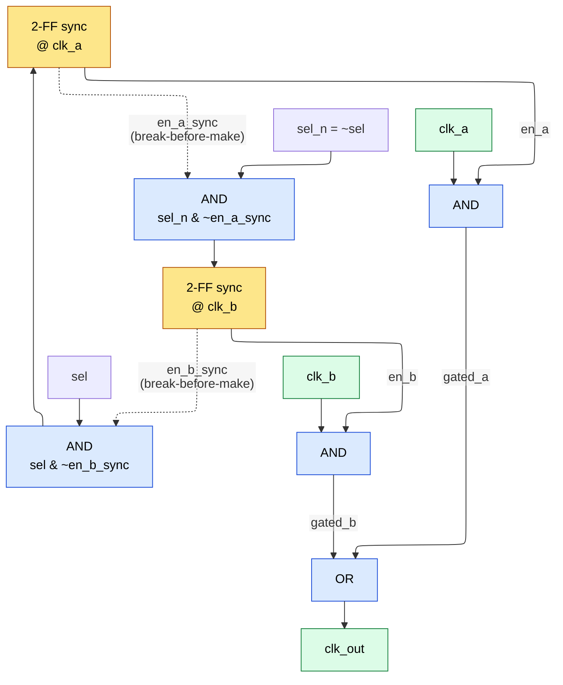

# Basic Knowledge for Digital Design — Senior Engineer Level

> **Prerequisites:** [CMOS_Fundamentals](CMOS_Fundamentals.md) (transistor-level latch/flip-flop)
> **See also:** [Adders](Adders.md) (comparator circuits), [Floating_Point](Floating_Point.md) (priority encoder / LZA)

## Multiplexer (MUX) — Deep Dive

### Shannon Expansion: Proof and Application

The Shannon expansion theorem (also called Shannon decomposition or Boole's expansion theorem) states that any Boolean function can be decomposed with respect to any variable:

```text
F(x1, x2, ..., xn) = x1' * F(0, x2, ..., xn) + x1 * F(1, x2, ..., xn)
```

**Proof:** Consider any Boolean function F. For any assignment of variables, x1 is either 0 or 1.
- If x1 = 0: the expression becomes `1 * F(0, x2,...,xn) + 0 * F(1, x2,...,xn) = F(0, x2,...,xn)`, which equals F by substitution.
- If x1 = 1: the expression becomes `0 * F(0, x2,...,xn) + 1 * F(1, x2,...,xn) = F(1, x2,...,xn)`, which equals F by substitution.
Since the expression equals F for both possible values of x1, it equals F for all inputs. QED.

**This IS a 2:1 MUX.** The select line is x1, the two data inputs are the cofactors F|x1=0 and F|x1=1. This proves that any Boolean function of N variables can be implemented using a single (N-1)-variable-input MUX (with the most significant variable as select).

**Recursive application:** Apply Shannon expansion repeatedly:
```text
F(A,B,C) = A' * F(0,B,C) + A * F(1,B,C)

F(0,B,C) = B' * F(0,0,C) + B * F(0,1,C)
F(1,B,C) = B' * F(1,0,C) + B * F(1,1,C)

F(0,0,C) = C' * F(0,0,0) + C * F(0,0,1)
...
```

This leads to a tree of 2:1 MUXes — an N-input function needs (2^N - 1) 2:1 MUXes.

**Optimization trick:** If the last variable is used as a data input (not as a select), an N-input function can be implemented with a single 2^(N-1):1 MUX. The data inputs are constants (0, 1) or the last variable and its complement.

**Worked example — implement F(A,B,C) = sum(1,2,6,7) using a 4:1 MUX:**
```ascii-graph
Use A,B as select lines. Evaluate cofactors:
  AB=00: F(0,0,C) = F(0,0,0)=0, F(0,0,1)=1 → C
  AB=01: F(0,1,C) = F(0,1,0)=1, F(0,1,1)=0 → C'
  AB=10: F(1,0,C) = F(1,0,0)=0, F(1,0,1)=0 → 0
  AB=11: F(1,1,C) = F(1,1,0)=1, F(1,1,1)=1 → 1

4:1 MUX with S1=A, S0=B:
  I0 = C, I1 = C', I2 = 0, I3 = 1
```

### MUX as Universal Gate

A 2:1 MUX can implement ANY logic gate:
```ascii-graph
NOT:  Y = MUX(A, sel=A, d0=1, d1=0) → A ? 0 : 1 = A'
AND:  Y = MUX(sel=A, d0=0, d1=B)   → A ? B : 0 = A*B
OR:   Y = MUX(sel=A, d0=B, d1=1)   → A ? 1 : B = A+B
NAND: Y = MUX(sel=A, d0=1, d1=B')  → A ? B' : 1
XOR:  Y = MUX(sel=A, d0=B, d1=B')  → A ? B' : B = A^B
```

This makes the 2:1 MUX a **universal logic element** — any combinational circuit can be built from 2:1 MUXes alone.

### Glitch-Free Clock MUX — Detailed Timing Analysis

**Why a naive MUX glitches on clocks:**

```wavedrom
{ "signal": [
  { "name": "clk_a", "wave": "01010101" },
  { "name": "clk_b", "wave": "10101010" },
  { "name": "sel",   "wave": "0...1..." },
  {},
  { "name": "naive out (sel ? clk_b : clk_a)", "wave": "0101x010" }
], "head": { "text": "Naive clock MUX: sel flips while clk_a HIGH and clk_b LOW -> runt pulse (x)" } }
```

When `sel` switches while `clk_a` is HIGH and `clk_b` is LOW, the combinational MUX produces a partial (runt) pulse and the output drops abruptly. A glitch-free MUX gates each clock with a synchronized enable to avoid this.

The runt pulse is shorter than a valid clock period. Downstream flip-flops may:
1. Miss the edge entirely (setup violation)
2. Sample at the wrong time (hold violation)
3. Enter metastability

**The AND-OR-AND structure with feedback (industry standard):**



**Critical feedback path:** Each synchronizer's input is ANDed with the negation of the OTHER path's synchronized enable. This guarantees:
- en_a can only go high when en_b is confirmed low (and vice versa)
- There is a mandatory dead-time of at least 2 clock cycles where BOTH enables are low

**Exhaustive case analysis for safety:**

| en_a | en_b | clk_out                    | Safe? |
|------|------|----------------------------|-------|
| 0    | 0    | 0 (dead time during switch)| Yes   |
| 1    | 0    | clk_a (only A active)      | Yes   |
| 0    | 1    | clk_b (only B active)      | Yes   |
| 1    | 1    | IMPOSSIBLE (feedback prevents)| N/A  |

The feedback cross-coupling makes state (1,1) unreachable. The 2-FF synchronizers ensure that enable transitions are clean in each clock domain, preventing metastability on the enable signals.

**Switching latency:** ~2-4 cycles of each clock domain. This is fine — clock switching is a rare control-plane event (e.g., switching PLL source during DVFS transitions).

```verilog
module glitch_free_clk_mux (
    input  clk_a,
    input  clk_b,
    input  rst_n,
    input  sel,       // 0 = clk_a, 1 = clk_b
    output clk_out
);
    reg sel_a_ff1, sel_a_ff2;
    reg sel_b_ff1, sel_b_ff2;

    // Synchronize and cross-couple in clk_a domain
    always @(posedge clk_a or negedge rst_n) begin
        if (!rst_n) begin
            sel_a_ff1 <= 1'b1;  // default: select clk_a
            sel_a_ff2 <= 1'b1;
        end else begin
            sel_a_ff1 <= ~sel & ~sel_b_ff2;  // enable A only if B disabled
            sel_a_ff2 <= sel_a_ff1;
        end
    end

    // Synchronize and cross-couple in clk_b domain
    always @(posedge clk_b or negedge rst_n) begin
        if (!rst_n) begin
            sel_b_ff1 <= 1'b0;
            sel_b_ff2 <= 1'b0;
        end else begin
            sel_b_ff1 <= sel & ~sel_a_ff2;   // enable B only if A disabled
            sel_b_ff2 <= sel_b_ff1;
        end
    end

    // AND-OR clock mux — use ICG cells in real ASIC
    assign clk_out = (clk_a & sel_a_ff2) | (clk_b & sel_b_ff2);
endmodule
```

**ASIC implementation note:** In real tapeouts, replace `clk_a & sel_a_ff2` with a library ICG (Integrated Clock Gating) cell. ICG uses an internal latch to hold the enable stable during the active clock phase, preventing glitches even if the enable has marginal timing. The ICG also has characterized timing models for STA.

---

## Decoder / Encoder — Deep Dive

### Priority Encoder for Floating-Point Leading-Zero Detection

In floating-point normalization, after mantissa subtraction you need to find the position of the leading one (or equivalently, count leading zeros) to determine the left-shift amount. This is done by a priority encoder tree.

**Naive approach (linear scan):** O(N) delay — unacceptable for 24-bit or 53-bit mantissas.

**Tree-based Leading Zero Detector (LZD):**

The idea: divide the N-bit input into pairs, then combine results hierarchically.

For each 2-bit group, encode:
```text
Input   | Leading Zeros | Valid (has a 1)
  00    |      2        |       0
  01    |      1        |       1
  10    |      0        |       1
  11    |      0        |       1
```

For combining two groups (Left, Right) each with count cL, cR and valid vL, vR:
```ascii-graph
if (vL)       → count = cL,           valid = 1
else if (vR)  → count = width_L + cR, valid = 1
else          → count = total_width,   valid = 0
```

**8-bit LZD tree structure:**

1. **4 groups of 2 bits → 4 ×** (1-bit count, 1-bit valid)
2. **2 groups of 4 bits → 2 ×** (2-bit count, 1-bit valid)
3. **1 group of 8 bits  → 1 ×** (3-bit count, 1-bit valid)

Total delay: O(log2(N)) — 3 levels for 8-bit, 5 levels for 32-bit.

```verilog
// 8-bit Leading Zero Counter — tree-based
module lzc_8 (
    input  [7:0] in,
    output [2:0] count,  // 0 to 7 (8 means all zeros)
    output       valid   // 1 if any bit is set
);
    wire [3:0] v1;   // valid bits for 2-bit groups
    wire [3:0] c1;   // count bits for 2-bit groups

    // Level 0: 2-bit groups (MSB-first: in[7:6], in[5:4], in[3:2], in[1:0])
    assign v1[3] = |in[7:6];
    assign c1[3] = ~in[7];  // 0 if in[7]=1 (leading 1 at pos 0), 1 if in[7]=0,in[6]=1

    assign v1[2] = |in[5:4];
    assign c1[2] = ~in[5];

    assign v1[1] = |in[3:2];
    assign c1[1] = ~in[3];

    assign v1[0] = |in[1:0];
    assign c1[0] = ~in[1];

    // Level 1: 4-bit groups
    wire [1:0] v2;
    wire [1:0] c2_hi, c2_lo;

    assign v2[1]   = v1[3] | v1[2];
    assign c2_hi[1] = ~v1[3];                    // MSB of 2-bit count
    assign c2_lo[1] = v1[3] ? c1[3] : c1[2];    // LSB of 2-bit count

    assign v2[0]   = v1[1] | v1[0];
    assign c2_hi[0] = ~v1[1];
    assign c2_lo[0] = v1[1] ? c1[1] : c1[0];

    // Level 2: 8-bit final
    assign valid    = v2[1] | v2[0];
    assign count[2] = ~v2[1];                              // MSB
    assign count[1] = v2[1] ? c2_hi[1] : c2_hi[0];       // middle bit
    assign count[0] = v2[1] ? c2_lo[1] : c2_lo[0];       // LSB

endmodule
```

**Application in FP:** After mantissa subtraction produces result R, the LZC determines shift amount s. The mantissa is left-shifted by s, and the exponent is decremented by s. In a pipelined FPU, the LZC runs in parallel with the subtraction using a **Leading Zero Anticipator (LZA)** that predicts the leading zero count from the inputs (before the subtraction completes), accepting +/-1 error and correcting in the next cycle.

### Tree Comparator for 64-bit

A naive 64-bit comparator cascades bit comparisons MSB to LSB — O(N) delay. A tree comparator achieves O(log N).

**Approach:** Divide into 8-bit blocks, compare each block in parallel, then combine with priority.

```ascii-graph
64-bit A vs B:
  Block 7: A[63:56] vs B[63:56] → (gt7, eq7, lt7)
  Block 6: A[55:48] vs B[55:48] → (gt6, eq6, lt6)
  ...
  Block 0: A[7:0]   vs B[7:0]   → (gt0, eq0, lt0)

Combine (MSB-priority tree):
  Level 1: Pairs → (gt76, eq76, lt76), (gt54, eq54, lt54), ...
  Level 2: Quads → (gt7654, eq7654, lt7654), (gt3210, ...)
  Level 3: Final → (gt_final, eq_final, lt_final)
```

Each combine operation:
```text
gt_combined = gt_left | (eq_left & gt_right)
eq_combined = eq_left & eq_right
lt_combined = lt_left | (eq_left & lt_right)
```

For 64-bit with 8-bit blocks: 3 tree levels + ~3 gate delays per block comparison = ~6 levels total vs 64 levels for naive cascade.

In practice, synthesis tools build optimal comparator trees automatically from `A > B` — manual instantiation is rarely needed.

---

## Latch vs Flip-Flop — Transistor-Level Understanding

### Transmission-Gate D-Latch

A D-latch can be built from a transmission gate and an inverter with feedback:

```ascii-graph
          CLK    CLK_bar
           |       |
    D ──►[TG]──►─┬──►[INV1]──► Q
                  │
                  └──[INV2]──┘
                    (feedback)

TG (Transmission Gate): NMOS gate = CLK, PMOS gate = CLK_bar
  When CLK=1: TG is ON → D passes to internal node → Q follows D (transparent)
  When CLK=0: TG is OFF → feedback inverter holds the value (opaque)
```

**Transistor count:** 2 (TG) + 2 (INV1) + 2 (INV2) = 6 transistors (plus clock inverter shared).

The transmission gate passes both 0 and 1 cleanly (NMOS pulls low well, PMOS pulls high well), unlike a single pass transistor which suffers threshold voltage drop.

### Master-Slave D Flip-Flop

Two D-latches in series with complementary clocks:

```ascii-graph
          CLK_bar  CLK        CLK    CLK_bar
           |       |           |       |
    D ──►[TG1]──►[INV]──►──[TG2]──►[INV]──► Q
              │    ▲              │    ▲
              └─[INV]┘            └─[INV]┘
           (master latch)      (slave latch)

When CLK=0: Master is transparent (sampling D), Slave is opaque (holding old value)
When CLK=1: Master is opaque (holding sampled D), Slave is transparent (outputting master's value)
```

**The setup/hold window in terms of internal nodes:**

- **Setup time (Tsu):** D must be stable BEFORE CLK rises so that the master latch's internal node settles to the correct voltage. If D is still changing when the master TG closes (CLK 0→1), the internal node voltage may be at an intermediate level. Tsu is the minimum time for the internal node to charge/discharge through the TG to a valid logic level.

- **Hold time (Th):** After CLK rises, the master TG doesn't turn off instantaneously — the clock edge has finite slew. During the transition, the TG has diminishing but non-zero conductance. If D changes too soon, the residual TG conductance can corrupt the master's internal node. Th is the time after the clock edge during which the TG still has enough conductance to disturb the stored value.

- **Clock-to-Q (Tc2q):** After CLK rises, the slave TG opens. The delay from CLK rising to Q being valid is determined by the slave TG turn-on delay + slave inverter delay + output load.

**Typical values in 7nm FinFET (representative, varies by library cell):**

| Parameter | Value     |
|-----------|-----------|
| Tsu       | 15-25 ps  |
| Th        | 5-15 ps   |
| Tc2q      | 25-40 ps  |
| D-to-Q    | 40-65 ps  |

**Negative setup time:** In some library cells (e.g., pulsed-latch or sense-amplifier based FFs), the setup time is negative — data can arrive AFTER the clock edge and still be captured. This happens when the internal sampling window extends past the clock edge. Negative Tsu effectively increases timing slack.

### Time Borrowing with Latches

In a latch-based pipeline:
```ascii-graph
    Latch1 (CLK) → Combinational → Latch2 (CLK_bar) → Combinational → Latch3 (CLK)
     open when      Logic Stage 1   open when           Logic Stage 2   open when
     CLK=1                          CLK=0                               CLK=1
```

If Stage 1 logic finishes late (takes more than half a clock period), Latch2 is still transparent (CLK_bar is still high), so data passes through. Stage 2 has less time, but if it's fast, the overall pipeline still works.

**Maximum borrowing:** One full half-cycle (minus setup time of the next latch).

**STA complication:** The timing constraint becomes:
```text
Tcq_latch1 + Tcomb1 + Tcomb2 + Tsu_latch3 <= 2 * Thalf_cycle
```
Instead of the simpler per-stage constraint of flip-flop design. This makes timing closure harder but allows higher clock rates for unbalanced pipelines.

---

## Metastability — First-Principles Derivation

*This section derives the physics. The design consequences — MTBF budgeting, synchronizer zoo, CDC schemes, async FIFO: [Async_Circuit_Design](../03_Frontend_RTL_and_Verification/Async_Circuit_Design.md) §1–§5.*

### The Physics of Metastability

A flip-flop's internal cross-coupled inverter pair has three equilibrium points:
1. Q=0 (stable)
2. Q=1 (stable)
3. Q=VDD/2 (unstable — the metastable point)

When setup/hold is violated, the internal node lands near VDD/2. The noise in the circuit (thermal noise, shot noise) provides a random perturbation that eventually pushes the node toward 0 or 1, but the time to resolve is probabilistic.

### Derivation of Resolution Time Distribution

The internal node voltage V(t) near the metastable point obeys (linearized):
```text
dV/dt = (V - Vm) / tau
```
where Vm is the metastable voltage and tau is the **metastability time constant** determined by the gain-bandwidth product of the cross-coupled inverter pair.

**Solution:**
```text
V(t) - Vm = (V(0) - Vm) * exp(t / tau)
```

The node voltage moves exponentially away from the metastable point. Resolution occurs when |V(t) - Vm| exceeds a threshold Vth (enough for the downstream logic to interpret as a valid 0 or 1).

**Probability of NOT resolving within time Tr:**
```text
P(not resolved in Tr) = T0 * fdata * exp(-Tr / tau)
```

where T0 is the "setup window" — the time interval around the clock edge within which data transitions cause metastability. T0 depends on the flip-flop design and is typically 30-100 ps.

### MTBF Derivation

The probability of a metastability failure per clock cycle is:
```text
P_fail = T0 * fdata * exp(-Tr / tau)
```

With fclk clock cycles per second, the failure rate (failures per second) is:
```text
lambda = fclk * T0 * fdata * exp(-Tr / tau)
```

MTBF = 1/lambda:
```text
MTBF = exp(Tr / tau) / (T0 * fclk * fdata)
```

### Actual Numbers for 7nm Technology

Typical values for a standard-Vt flip-flop in 7nm FinFET:
```text
tau  ≈ 8-12 ps
T0   ≈ 40-80 ps
```

**Example calculation:** fclk = 2 GHz, fdata = 500 MHz, 2-FF synchronizer

For a 2-FF synchronizer, the resolution time Tr equals one clock period minus Tc2q minus Tsu:
```text
Tr = Tclk - Tc2q - Tsu = 500ps - 35ps - 20ps = 445 ps
```

Using tau = 10 ps, T0 = 50 ps:
```text
MTBF = exp(445/10) / (50e-12 * 2e9 * 500e6)
     = exp(44.5) / (50e-12 * 1e18)
     = 2.15e19 / 50e6
     = 4.3e11 seconds
     ≈ 13,600 years
```

**For a 3-FF synchronizer:** Tr doubles (two full periods of resolution time):
```text
Tr = 2*Tclk - Tc2q - Tsu = 1000ps - 35ps - 20ps = 945ps
MTBF = exp(94.5) / (50e6) ≈ 2.6e34 seconds ≈ 8.2e26 years
```

This is astronomically large — 3-FF is overkill for most designs but used in safety-critical systems (automotive ISO 26262, aerospace).

**Key insight about tau:** tau decreases with technology scaling (faster transistors), which HELPS metastability resolution. However, T0 increases as setup windows tighten, and fclk increases — these HURT. The net effect in modern nodes is that 2-FF synchronizers remain adequate for most applications.

### When 2-FF Is Not Enough

- **Very high clock ratios:** If fclk >> fdata, Tr is large and MTBF is excellent. But if fclk ≈ fdata, Tr is minimal.
- **Many synchronizers in a chip:** If you have 1000 independent CDC crossings, divide MTBF by 1000.
- **Safety-critical:** ISO 26262 ASIL-D requires MTBF > 10^9 hours for random hardware faults.

---

## Finite State Machines — Real Engineering Depth

### One-Hot vs Binary Encoding — Actual Synthesis Comparison

**Example: 12-state FSM (UART receiver)**

| Metric              | Binary (4-bit) | One-Hot (12-bit) | Gray (4-bit) |
|---------------------|----------------|------------------|--------------|
| Flip-flops          | 4              | 12               | 4            |
| Combinational gates | ~45            | ~28              | ~52          |
| Max combinational delay | 4 gate levels | 2 gate levels  | 4 gate levels|
| Total area (NAND2 equiv)| ~65       | ~52              | ~70          |
| Fmax (28nm typical) | ~1.8 GHz      | ~2.5 GHz        | ~1.7 GHz     |

**Why one-hot is faster:** Next-state logic is simpler — each flip-flop's next value depends on at most a few other state bits and input conditions, instead of decoding a binary state value.

**Why one-hot can be SMALLER for moderate state counts:** Although it uses more flip-flops, the combinational logic savings often outweigh the extra FF cost, especially when the FSM has sparse transitions.

**Crossover point:** For >~32 states, binary encoding starts winning on area because the FF count dominates. For speed-critical FSMs with <20 states, one-hot is almost always better.

**FPGA consideration:** FPGAs have abundant flip-flops but limited LUTs, making one-hot strongly preferred (sometimes the tool does this automatically).

### Safe FSM Coding — Default State Recovery

In real tapeouts, cosmic rays, power glitches, or ECC failures can corrupt state registers, putting the FSM into an unencoded (illegal) state.

**Binary encoding:** With 4 bits and 12 states, there are 4 unused states (12-15). If the FSM enters one of these, it must recover.

**One-hot encoding:** Any state with 0 or 2+ bits set is illegal. There are 2^12 - 12 = 4084 illegal states.

```verilog
// Safe FSM with one-hot encoding and state recovery
module uart_rx_fsm (
    input  clk, rst_n,
    input  rx_bit, baud_tick,
    output reg [11:0] state,
    output reg data_valid, error
);
    localparam [11:0] IDLE      = 12'b0000_0000_0001;
    localparam [11:0] START_BIT = 12'b0000_0000_0010;
    localparam [11:0] BIT0      = 12'b0000_0000_0100;
    // ... (more states)
    localparam [11:0] STOP_BIT  = 12'b1000_0000_0000;

    // One-hot check: exactly one bit should be set
    wire state_valid = (state != 0) && ((state & (state - 1)) == 0);
    // (state & (state-1)) == 0 is true only for powers of 2

    always @(posedge clk or negedge rst_n) begin
        if (!rst_n) begin
            state <= IDLE;
        end else if (!state_valid) begin
            state <= IDLE;  // RECOVERY: illegal state → go to safe state
            error <= 1'b1;  // flag the error for debug
        end else begin
            // Normal state transitions
            case (1'b1)  // synthesis parallel_case
                state[0]:  if (baud_tick && !rx_bit) state <= START_BIT;
                state[1]:  if (baud_tick) state <= BIT0;
                // ...
                state[11]: if (baud_tick) state <= IDLE;
                default:   state <= IDLE;  // should never reach
            endcase
        end
    end
endmodule
```

**Common tapeout gotcha:** Using `// synopsys full_case parallel_case` pragmas without thinking. `full_case` tells synthesis all cases are covered (even if they're not in simulation), causing simulation/synthesis mismatch. `parallel_case` tells synthesis cases are mutually exclusive (even if they're not). For one-hot FSMs, `parallel_case` is correct (by design), but `full_case` masks the missing default case in simulation. Best practice: always code the `default` explicitly.

### Registered vs Combinational Outputs

**Moore with registered outputs (safest, no glitches):**
```verilog
always @(posedge clk or negedge rst_n) begin
    if (!rst_n) begin
        state <= IDLE;
        out   <= 1'b0;
    end else begin
        state <= next_state;
        case (next_state)    // NOTE: uses next_state, not state
            RUN:     out <= 1'b1;
            default: out <= 1'b0;
        endcase
    end
end
```

Using `next_state` (not `state`) eliminates the one-cycle latency that Moore machines normally have — the output is registered but updates in the same cycle as the state transition.

---

## Gray Code — Mathematical Proof of Single-Bit Property

### Formal Definition

The N-bit reflected Gray code G(i) for integer i is defined as:
```text
G(i) = i XOR (i >> 1)
```

In terms of individual bits, if B(i) = b_{n-1} b_{n-2} ... b_1 b_0 is the binary representation:
```text
g_k = b_k XOR b_{k+1}    for k = 0, 1, ..., n-2
g_{n-1} = b_{n-1}         (MSB stays the same)
```

### Proof: Adjacent Gray Codes Differ in Exactly One Bit

**Claim:** For any integer i, G(i) and G(i+1) differ in exactly one bit position.

**Proof:**

Let i and i+1 have binary representations B(i) and B(i+1). When we add 1 to i, the binary representation changes in a specific pattern: the lowest k bits flip (where bit k is the lowest 0-bit of i).

Specifically, if i has trailing bits ...1...10...0 (j trailing ones followed by a zero at position j), then:
```text
B(i)   = ...0 1 1 ... 1 (bits j, j-1, ..., 0)
B(i+1) = ...1 0 0 ... 0 (carry propagates through j ones, flips the zero)
```

**Proof by direct bit analysis:**

The Gray code bit at position k is defined as g_k = b_k XOR b_{k+1}, where b_k are bits of the binary representation. We examine how each Gray code bit changes between i and i+1.

When adding 1 to i, let j be the position of the lowest 0-bit in i. The binary addition flips bits 0 through j:
```text
B(i)   = ...b_{j+1} 0 1 1 ... 1  (bit j = 0, bits j-1 through 0 = all 1s)
B(i+1) = ...b_{j+1} 1 0 0 ... 0  (carry propagates through j ones, flips the zero)
```

**Bit j (the flipping zero):** B(i)_j = 0, B(i+1)_j = 1. Bit j+1 is unchanged (b_{j+1}).
```ascii-graph
G(i)_j   = 0 XOR b_{j+1}
G(i+1)_j = 1 XOR b_{j+1}
→ G(i)_j differs from G(i+1)_j  (this bit FLIPS)
```

**Bit j-1 (if j > 0):** Both B_{j-1} and B_j change (1→0 and 0→1 respectively).
```ascii-graph
G(i)_{j-1}   = 1 XOR 0 = 1
G(i+1)_{j-1} = 0 XOR 1 = 1
→ Same! (both XOR inputs flip, canceling out)
```

**Any position k < j-1:** Both B_k and B_{k+1} flip (all trailing bits flip). The XOR of two flipped bits is unchanged.

**Any position k > j:** Neither B_k nor B_{k+1} changes. The XOR is unchanged.

**Therefore, exactly one Gray code bit changes: bit position j (the position of the lowest 0-bit in i).** QED.

### Gray Code Conversion Circuits

**Binary to Gray (combinational, zero delay cost):**
```verilog
assign gray = binary ^ (binary >> 1);
// This is just N-1 XOR gates in parallel — no carry chain
```

**Gray to Binary (has a serial XOR chain — O(N) delay):**
```verilog
// Method 1: Serial (simple but slow for wide buses)
assign binary[N-1] = gray[N-1];
genvar i;
generate
    for (i = N-2; i >= 0; i = i - 1) begin : g2b
        assign binary[i] = binary[i+1] ^ gray[i];
    end
endgenerate

// Method 2: Parallel prefix XOR — O(log N) delay
// binary[k] = XOR of gray[N-1:k]
// Can use a parallel prefix tree of XOR gates
assign binary[7] = gray[7];
assign binary[6] = gray[7] ^ gray[6];
assign binary[5] = gray[7] ^ gray[6] ^ gray[5];
// ... (or use generate with parallel prefix structure)
```

**Why Gray-to-Binary latency matters for FIFOs:** The gray-to-binary conversion is on the read/write pointer path before memory addressing. If it's too slow, it can limit FIFO operating frequency. Using the parallel prefix approach (log2(N) XOR levels) is important for high-speed FIFOs.

---

## Hazards — Algebraic Detection and Elimination

### Static-1 Hazard: Detailed Analysis

**Example:** `F = AB' + BC`

**Timing diagram showing the glitch:**
```wavedrom
{ "signal": [
  { "name": "B",                 "wave": "1100" },
  { "name": "B' = ~B (delayed)", "wave": "0011" },
  { "name": "A.B'",              "wave": "0011" },
  { "name": "B.C",               "wave": "1100" },
  {},
  { "name": "F = A.B' + B.C",    "wave": "1101" }
], "head": { "text": "Static-1 hazard (A=1, C=1, B falls): B.C drops before A.B' rises -> F dips to 0" } }
```

The glitch duration equals the propagation delay of the inverter generating B'.

### K-Map Detection Method

```ascii-graph
F = AB' + BC

K-map for F:
        BC
AB  | 00  01  11  10
----|-----|-----|-----|-----
 00 |  0  |  0  |  0  |  0
 01 |  0  |  0  |  1  |  0
 11 |  1  |  1  |  1  |  0
 10 |  1  |  1  |  0  |  0

Groups:
  AB': covers (A=1,B=0,C=0) and (A=1,B=0,C=1) → row 10
  BC:  covers (A=0,B=1,C=1) and (A=1,B=1,C=1) → column C=1,B=1

Adjacent cells A=1,B=0,C=1 (covered by AB') and A=1,B=1,C=1 (covered by BC)
are in different groups with no overlap → HAZARD when B changes with A=1,C=1.
```

### Consensus Theorem for Elimination

**Consensus theorem:** `AB + A'C + BC = AB + A'C`

The third term BC is the **consensus** of AB and A'C. It's redundant for logic but NOT redundant for timing.

For hazard elimination, we ADD the consensus term:
```text
F = AB' + BC + AC   (AC is the consensus term bridging the gap)
```

Now when A=1, C=1 and B transitions:
```text
AC = 1 (constant, does not depend on B)
F = AB' + BC + 1 = 1   (no glitch possible)
```

**General rule:** For each pair of adjacent prime implicants that share a boundary where a variable transitions, add the consensus term that covers both. This is equivalent to ensuring every pair of adjacent 1-cells in the K-map is covered by at least one common prime implicant.

### Static-0 Hazard

Occurs in POS (product-of-sums) form when the output should stay 0 but glitches to 1.

- **F** = `(A+B')(B+C)    — POS form`

When A=0, C=0, B transitions 0→1:
(A+B') = (0+1) = 1 → (0+0) = 0  (falls)
(B+C)  = (0+0) = 0 → (1+0) = 1  (rises)

F rises briefly before the first term falls → static-0 hazard

Fix: add consensus factor `(A+C)`.

### Dynamic Hazards

Occur only in multi-level circuits. The output transitions multiple times (e.g., 0→1→0→1) during a single input change. Caused by a signal reaching the output through paths of different lengths.

**Elimination:** If all static hazards are eliminated, dynamic hazards cannot exist (theorem by Eichelberger).

**Practical relevance:** In synchronous digital design, hazards are irrelevant for combinational logic between flip-flops (outputs are only sampled at clock edges). Hazards ONLY matter in:
1. Asynchronous circuits and handshake protocols
2. Clock generation and distribution logic
3. Reset generation circuits
4. Level-sensitive latch enable signals

---

## FIFO Depth Calculation — Three Scenarios with Full Walkthrough

### Scenario 1: Different Clock Frequencies, Continuous Write Burst

**Problem:** Write clock = 200 MHz, Read clock = 150 MHz, Write pattern: 256 words written back-to-back. Read is continuous (no idle cycles). Calculate minimum FIFO depth.

**Step 1:** Time to write the burst:
```text
T_burst = 256 / 200 MHz = 1.28 us
```

**Step 2:** Words read during the burst period:
```text
Words_read = 150 MHz * 1.28 us = 192
```

**Step 3:** Maximum FIFO occupancy:
```text
Depth_min = 256 - 192 = 64
```

**Step 4:** Round to power-of-2 for async FIFO: **64** (already power-of-2).

**Important:** After the burst ends, the reader continues draining. The FIFO reaches max occupancy at the END of the write burst, then gradually empties. We need the FIFO to hold the peak.

### Scenario 2: Same Clock Frequency with Idle Cycles (Back-Pressure)

**Problem:** Both write and read at 100 MHz. Writer sends 80 words, then idles for 20 cycles (repeat). Reader reads 1 word every 2 cycles (50% throughput).

**Step 1:** Write rate during burst: 100 MW/s (megawords/sec)
Effective write rate over one period: 80 words / 100 cycles = 0.8 words/cycle

**Step 2:** Read rate: 1 word every 2 cycles = 0.5 words/cycle

Since write rate (0.8) > read rate (0.5), FIFO accumulates data.

**Step 3:** During the write burst (80 cycles):
```text
Words written = 80
Words read = 80 / 2 = 40
Net accumulation = 80 - 40 = 40
```

**Step 4:** During the idle period (20 cycles):
```text
Words written = 0
Words read = 20 / 2 = 10
Net drain = 10
```

**Step 5:** Net accumulation per period (100 cycles):
```text
Net per period = 40 - 10 = 30
```

This means the FIFO NEVER FULLY DRAINS — data accumulates indefinitely! The system is unstable.

**Verify:** Average write rate = 80/100 = 0.8 words/cycle > read rate = 0.5 words/cycle. This FIFO will overflow no matter the depth.

**Correct problem statement would need:** Read rate >= average write rate. Let's fix: reader reads 1 word every cycle but pauses for 5 cycles after every 8 reads.

Effective read rate: $8/(8+5) = 8/13 \approx 0.615$ words/cycle > 0.8? No, 0.615 < 0.8. Still unstable.

**Lesson:** Always verify that average read rate >= average write rate BEFORE calculating FIFO depth. If it's not, no finite FIFO will work.

### Scenario 2 (Fixed): Viable System

**Problem:** Write clock = 100 MHz. Writer sends 80 words, then idles for 120 cycles. Reader at 100 MHz reads 1 word every 2 cycles (continuous).

Average write rate = 80/200 = 0.4 words/cycle. Read rate = 0.5 words/cycle. Viable (read > write on average).

**Write burst phase (80 cycles):**
```text
Written = 80, Read = 40, Net accumulation = 40
```

**Idle phase (120 cycles):**
```text
Written = 0, Read = 60, Net drain = 60
```

But we can only drain what's in the FIFO. Peak occupancy occurs at the END of the write burst = 40 words.

During idle, FIFO drains: 40 words drained over 40*2 = 80 cycles. FIFO is empty after 80 idle cycles, with 40 idle cycles remaining (reader sees empty FIFO).

**Minimum FIFO depth: 40.** Round to power-of-2: **64**.

### Scenario 3: Fractional Rates with Clock Domain Crossing

**Problem:** Write clock = 133 MHz, Read clock = 100 MHz. Writer: 8 words per 10 write-clock cycles (8 writes then 2 idles, repeat). Reader: continuous. Find minimum FIFO depth for a burst of 200 words.

**Step 1:** Effective write rate:
```text
Write rate = 8/10 * 133 MHz = 106.4 MW/s
```

**Step 2:** Read rate:
```text
Read rate = 100 MW/s
```

Since write rate (106.4) > read rate (100), the FIFO accumulates during the burst.

**Step 3:** Time to write 200 words at effective rate:
```text
200 words at 8 per 10 cycles = 200/8 * 10 = 250 write-clock cycles
T_burst = 250 / 133 MHz = 1.879 us
```

**Step 4:** Words read during that time:
```ascii-graph
Words_read = 100 MHz * 1.879 us = 187.9 → 187 (floor, conservative)
```

**Step 5:** Peak FIFO occupancy:
```text
Depth_min = 200 - 187 = 13
```

But wait — we need to account for the bursty write pattern. The writes come in clusters of 8, so there's micro-bursting. Let's verify cycle by cycle for the worst case.

**Micro-burst analysis for first few periods:**

Write period = 10 cycles at 133 MHz = 75.19 ns
During one write period: 8 writes happen in cycles 0-7, idle in cycles 8-9.
Words read in 75.19 ns: $100\,\text{MHz} \times 75.19\,\text{ns} = 7.519$ → ~7 words

Net per write period: 8 - 7 = 1 word accumulation (approximately)

Over 25 write periods (250 write cycles): ~25 words of accumulation... but our continuous calculation said 13?

The discrepancy is from the floor function. More precisely: in each 10-cycle write period, exactly 8 words are written. Reads happen at 100 MHz — in 75.19 ns, between 7 and 8 reads occur depending on phase alignment. Worst case: 7 reads per write period.

Over 25 write periods: 25 * (8-7) = 25 words worst case.

**Corrected minimum depth: 25.** Round to power-of-2: **32**.

**Lesson:** For accurate FIFO depth with fractional rates, analyze one write period at a time and take the worst-case read count per period. Don't just use average rates for bursty traffic.

### FIFO Depth Formula — General Case

For a burst of B words, write clock fwr, read clock frd, write duty = Dw (fraction of cycles with actual writes), read duty = Dr (fraction of cycles with actual reads):

```text
Depth >= B - floor(B * (frd * Dr) / (fwr * Dw))
```

**Additional margin for async FIFO:** Add 2-3 words for synchronizer latency (the read pointer is always 2-3 cycles stale in the write domain), then round up to next power of 2.

```text
Depth_async = next_power_of_2(Depth_min + 3)
```

---

## Numbers to Memorize

| Quantity | Value | Why it matters |
|---|---|---|
| Setup time (typical DFF, N5) | 30-60 ps | Determines max frequency |
| Hold time (typical DFF, N5) | 20-40 ps | Determines min path delay |
| Metastability tau (N5) | 8-12 ps | Resolves at ~63 mV/decade |
| MTBF target | >10,000 years | Safety threshold |
| 2-FF synchronizer latency | 2-3 clock cycles | CDC overhead |
| Async FIFO depth formula | Bdiff + 2 * fclk * (t_sync1 + t_sync2) | Guarantees no overflow |
| Gray code property | Adjacent values differ by 1 bit | Safe CDC pointer encoding |
| MUX propagation delay (N5) | ~15-25 ps | Critical path component |
| DFF CLK-to-Q (N5) | ~20-40 ps | Pipeline stage overhead |
| Maximum clock frequency (N5, simple) | 1-3 GHz | Depends on logic depth |
| Clock skew budget | 5-10% of clock period | Limits frequency scaling |
| FIFO almost-full offset | Typically 2-4 entries | Safety margin for synchronizer delay |
| 2:1 MUX transistor count | 4 (TG) or 6 (gate) | Area benchmark |
| DFF transistor count | 24-28 (traditional) | Area benchmark |
| Clock gating cell (ICG) | ~8 transistors + latch | Power saving primitive |
