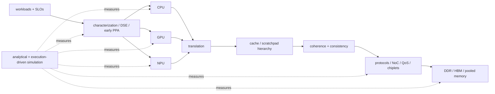

# 01 · Architecture and PPA — Book Contents

Architecture translates a product workload into hardware structure before RTL. This book is organized first by system boundary, then by focused subdomain, then by implementation-level chapter. It contains **45 substantive chapters across 25 subdomains**.

## How the architecture composes



## Seven parts

| Part | Subdomains | Chapters | What it owns |
|---|---:|---:|---|
| [1 · Modeling](01_Modeling/00_Index.md) | 2 | 4 | workload contracts, performance/DSE, full-chip PPA and uncertainty |
| [2 · CPU](02_CPU/00_Index.md) | 4 | 9 | ISA/core foundations, frontend, OoO backend and case studies |
| [3 · Memory](03_Memory/00_Index.md) | 5 | 9 | cache, virtual memory, coherence/consistency, arrays and main memory |
| [4 · Interconnect](04_Interconnect/00_Index.md) | 3 | 6 | protocols, NoC transport/proofs, QoS/I/O and chiplet fabrics |
| [5 · GPU](05_GPU/00_Index.md) | 3 | 4 | SIMT core, GPU memory system and scale-up |
| [6 · NPU](06_NPU/00_Index.md) | 3 | 5 | compute dataflow, mapping/compression and system integration |
| [7 · Simulators](07_Simulators/00_Index.md) | 5 | 8 | methods and domain-specific CPU/memory/interconnect/accelerator tools |

## Subdomain tree

```text
01_Architecture_and_PPA/
├── 01_Modeling/
│   ├── 01_Performance_Analysis/
│   └── 02_System_and_PPA/
├── 02_CPU/
│   ├── 01_Core_Foundations/
│   ├── 02_Frontend_and_Prediction/
│   ├── 03_Out_of_Order_Backend/
│   └── 04_Core_Case_Studies/
├── 03_Memory/
│   ├── 01_Cache_Hierarchy/
│   ├── 02_Virtual_Memory/
│   ├── 03_Coherence_and_Consistency/
│   ├── 04_Memory_Technologies/
│   └── 05_Main_Memory/
├── 04_Interconnect/
│   ├── 01_Protocols/
│   ├── 02_Network_on_Chip/
│   └── 03_System_Fabrics/
├── 05_GPU/
│   ├── 01_Core_Architecture/
│   ├── 02_Memory_System/
│   └── 03_Scale_Up/
├── 06_NPU/
│   ├── 01_Compute_Dataflows/
│   ├── 02_Mapping_and_Memory/
│   └── 03_System_Integration/
└── 07_Simulators/
    ├── 01_Methodology/
    ├── 02_CPU_and_System/
    ├── 03_Memory_and_Interconnect/
    ├── 04_Accelerator_Simulation/
    └── 05_Specialized_Simulators/
```

Each subdomain has its own `00_Index.md` defining ownership, chapter order, and handoffs.

## Complete chapter catalog

### 1 · Modeling

| Subdomain | Chapter | Focus |
|---|---|---|
| Performance Analysis | [Performance Modeling and DSE](01_Modeling/01_Performance_Analysis/01_Performance_Modeling_and_DSE.md) | fidelity ladder, analytical bounds, cycle models and architecture search |
| Performance Analysis | [Workload Characterization and Sampling](01_Modeling/01_Performance_Analysis/02_Workload_Characterization_and_Sampling.md) | benchmark contracts, phase selection, warm-up, statistics and aggregation |
| System and PPA | [Full-Chip Modeling](01_Modeling/02_System_and_PPA/01_Full_Chip_Modeling.md) | hierarchical composition, contention, overlap, DVFS and thermal coupling |
| System and PPA | [Early PPA Estimation and Uncertainty](01_Modeling/02_System_and_PPA/02_Early_PPA_Estimation_and_Uncertainty.md) | structural proxies, calibration, sensitivity, intervals and robust decisions |

### 2 · CPU

| Subdomain | Chapter | Focus |
|---|---|---|
| Core Foundations | [CPU Architecture](02_CPU/01_Core_Foundations/01_CPU_Architecture.md) | pipeline, hazards, hierarchy, speculation and multicore overview |
| Core Foundations | [RISC-V ISA](02_CPU/01_Core_Foundations/02_RISC_V_ISA.md) | ISA/privilege/vector contract and implementation implications |
| Core Foundations | [SMT, SIMD, and Vector Execution](02_CPU/01_Core_Foundations/03_SMT_SIMD_and_Vector_Execution.md) | parallelism taxonomies, lanes/register bandwidth and shared-thread resources |
| Frontend | [Branch Prediction](02_CPU/02_Frontend_and_Prediction/01_Branch_Prediction_Deep_Dive.md) | BTB, TAGE, indirect prediction, RAS and FTQ |
| Frontend | [Fetch, Decode, and µop Delivery](02_CPU/02_Frontend_and_Prediction/02_Fetch_Decode_and_Uop_Delivery.md) | I-cache/ITLB, alignment, decode, µop cache, queues and redirect |
| OoO Backend | [Out-of-Order Execution](02_CPU/03_Out_of_Order_Backend/01_OoO_Execution.md) | rename, ROB, issue/wakeup, execution and sizing |
| OoO Backend | [Load-Store Unit and Memory Ordering](02_CPU/03_Out_of_Order_Backend/02_Load_Store_Unit_and_Memory_Ordering.md) | address generation, disambiguation, forwarding, replay and store visibility |
| OoO Backend | [Retirement, Recovery, and Precise State](02_CPU/03_Out_of_Order_Backend/03_Retirement_Recovery_and_Precise_State.md) | checkpoints, commit maps, exceptions, machine clears and epoch safety |
| Case Studies | [Xiangshan CPU Design](02_CPU/04_Core_Case_Studies/01_Xiangshan_CPU_Design.md) | open-core design choices across frontend, window, LSU, cache and CHI |

### 3 · Memory

| Subdomain | Chapter | Focus |
|---|---|---|
| Cache Hierarchy | [Cache Microarchitecture](03_Memory/01_Cache_Hierarchy/01_Cache_Microarchitecture.md) | AMAT, associativity, MSHRs, writes and hierarchy |
| Cache Hierarchy | [Prefetching, Replacement, and QoS](03_Memory/01_Cache_Hierarchy/02_Prefetching_Replacement_and_QoS.md) | prediction feedback, insertion/victim policy and shared-resource control |
| Virtual Memory | [TLB and Virtual Memory](03_Memory/02_Virtual_Memory/01_TLB_and_Virtual_Memory.md) | TLB reach, page walks, VIPT, superpages and shootdown |
| Virtual Memory | [Page Walkers, IOMMUs, and Virtualization](03_Memory/02_Virtual_Memory/02_Page_Walkers_IOMMUs_and_Virtualization.md) | nested translation, device contexts, ATS/PRI, invalidation and isolation |
| Coherence | [Cache Coherence](03_Memory/03_Coherence_and_Consistency/01_Cache_Coherence.md) | stable/transient states, directories, races, safety/liveness and verification |
| Consistency | [Memory Consistency and Atomics](03_Memory/03_Coherence_and_Consistency/02_Memory_Consistency_and_Atomics.md) | litmus tests, SC/TSO/RVWMO, fences and atomic serialization |
| Technology | [Memory Arrays and Technologies](03_Memory/04_Memory_Technologies/01_Memory_Arrays_and_Technologies.md) | SRAM/DRAM, register files, compilers, ECC, CAM and emerging memories |
| Main Memory | [DDR Controller](03_Memory/05_Main_Memory/01_DDR_Controller.md) | banks, timing, scheduling, refresh, ECC and achieved bandwidth |
| Main Memory | [HBM and Advanced Memory Systems](03_Memory/05_Main_Memory/02_HBM_and_Advanced_Memory_Systems.md) | stacked channels, MLP, mapping, RAS, thermals and heterogeneous tiers |

### 4 · Interconnect

| Subdomain | Chapter | Focus |
|---|---|---|
| Protocols | [AHB, AXI, and APB](04_Interconnect/01_Protocols/01_AHB_AXI_APB.md) | channels, handshakes, IDs, bursts, outstanding transactions and bridges |
| Protocols | [ACE and CHI](04_Interconnect/01_Protocols/02_ACE_and_CHI.md) | snoop and directory/home coherence fabrics |
| NoC | [Network-on-Chip Architecture](04_Interconnect/02_Network_on_Chip/01_Network_on_Chip.md) | topology, router pipeline, load latency and physical design |
| NoC | [Routing, Flow Control, and Deadlock](04_Interconnect/02_Network_on_Chip/02_Routing_Flow_Control_and_Deadlock.md) | credit/VC design, dependency proofs, adaptive escape and liveness |
| System Fabrics | [QoS, Ordering, and I/O Coherence](04_Interconnect/03_System_Fabrics/01_QoS_Ordering_and_IO_Coherence.md) | service contracts, arbitration, request identity, device visibility and isolation |
| System Fabrics | [Chiplets, CXL, and Die-to-Die](04_Interconnect/03_System_Fabrics/02_Chiplets_CXL_and_Die_to_Die.md) | partitioning, UCIe/CXL, credits, reset/RAS/security and package co-design |

### 5 · GPU

| Subdomain | Chapter | Focus |
|---|---|---|
| Core | [GPU Architecture](05_GPU/01_Core_Architecture/01_GPU_Architecture.md) | SIMT throughput-machine overview and SM organization |
| Core | [SIMT Scheduling and Occupancy](05_GPU/01_Core_Architecture/02_SIMT_Scheduling_and_Occupancy.md) | residency, eligibility, scoreboards, issue policy, divergence and barriers |
| Memory | [Coalescing, Caches, and Shared Memory](05_GPU/02_Memory_System/01_Coalescing_Caches_and_Shared_Memory.md) | lane transactions, bank conflicts, MSHRs, translation, partitions and HBM |
| Scale-Up | [Multi-GPU Interconnect and Execution](05_GPU/03_Scale_Up/01_Multi_GPU_Interconnect_and_Execution.md) | topology, collectives, decomposition, remote memory, overlap and reliability |

### 6 · NPU

| Subdomain | Chapter | Focus |
|---|---|---|
| Dataflows | [NPU Accelerators](06_NPU/01_Compute_Dataflows/01_NPU_Accelerators.md) | systolic/dataflow/scratchpad/roofline overview |
| Dataflows | [Systolic, Spatial, and Vector Dataflows](06_NPU/01_Compute_Dataflows/02_Systolic_Spatial_and_Vector_Dataflows.md) | loop-to-PE mapping, multicast/reduction, shape/fill and precision |
| Mapping | [Tensor Tiling and Data Movement](06_NPU/02_Mapping_and_Memory/01_Tensor_Tiling_and_Data_Movement.md) | loop blocking, capacity, traffic, fusion, NoC placement and search |
| Mapping | [Sparsity, Quantization, and Compression](06_NPU/02_Mapping_and_Memory/02_Sparsity_Quantization_and_Compression.md) | numerical contracts, metadata, zero skipping, load balance and decode |
| Integration | [Host Interface, Coherence, and Scheduling](06_NPU/03_System_Integration/01_Host_Interface_Coherence_and_Scheduling.md) | command queues, DMA/IOMMU, synchronization, virtualization, RAS and firmware |

### 7 · Simulators

| Subdomain | Chapter | Focus |
|---|---|---|
| Methodology | [Simulation Methodology](07_Simulators/01_Methodology/01_Simulation_Methodology.md) | fidelity/speed, event engines, execution, warm-up, validation and error budgets |
| Methodology | [Analytical Models](07_Simulators/01_Methodology/02_Analytical_Models.md) | roofline, interval, queueing, communication and scaling bounds |
| CPU/System | [gem5](07_Simulators/02_CPU_and_System/01_gem5.md) | SE/FS, CPU timing, classic/Ruby memory, checkpoints and statistics |
| Memory/NoC | [DRAM Simulators](07_Simulators/03_Memory_and_Interconnect/01_DRAM_Simulators.md) | timing guards, scheduling, row locality and power |
| Memory/NoC | [NoC and Coherence Simulation](07_Simulators/03_Memory_and_Interconnect/02_NoC_and_Coherence_Simulation.md) | coupled protocol/network state, synthetic/trace/execution traffic and validation |
| Accelerators | [GPU Simulators](07_Simulators/04_Accelerator_Simulation/01_GPU_Simulators.md) | SIMT, coalescing, HBM, tensor timing and power |
| Accelerators | [Accelerator and NPU Simulators](07_Simulators/04_Accelerator_Simulation/02_Accelerator_and_NPU_Simulators.md) | mapping, dataflow, energy and cycle tools |
| Specialized | [Other Architecture Simulators](07_Simulators/05_Specialized_Simulators/01_Other_Architecture_Simulators.md) | manycore, NoC, CIM, datacenter, chiplet and RISC-V tool map |

## Question-based reading paths

| Question | Path |
|---|---|
| Why is a CPU frontend starving? | [Workload Characterization](01_Modeling/01_Performance_Analysis/02_Workload_Characterization_and_Sampling.md) → [Branch Prediction](02_CPU/02_Frontend_and_Prediction/01_Branch_Prediction_Deep_Dive.md) → [Fetch/Decode](02_CPU/02_Frontend_and_Prediction/02_Fetch_Decode_and_Uop_Delivery.md) |
| Why did a load replay or violate ordering? | [LSU](02_CPU/03_Out_of_Order_Backend/02_Load_Store_Unit_and_Memory_Ordering.md) → [Consistency](03_Memory/03_Coherence_and_Consistency/02_Memory_Consistency_and_Atomics.md) → [Coherence](03_Memory/03_Coherence_and_Consistency/01_Cache_Coherence.md) |
| How should a shared cache be controlled? | [Cache](03_Memory/01_Cache_Hierarchy/01_Cache_Microarchitecture.md) → [Prefetch/Replacement/QoS](03_Memory/01_Cache_Hierarchy/02_Prefetching_Replacement_and_QoS.md) → [System QoS](04_Interconnect/03_System_Fabrics/01_QoS_Ordering_and_IO_Coherence.md) |
| How does device virtual memory remain safe? | [IOMMU/Virtualization](03_Memory/02_Virtual_Memory/02_Page_Walkers_IOMMUs_and_Virtualization.md) → [I/O Coherence](04_Interconnect/03_System_Fabrics/01_QoS_Ordering_and_IO_Coherence.md) → [NPU Integration](06_NPU/03_System_Integration/01_Host_Interface_Coherence_and_Scheduling.md) |
| Why is a GPU below peak? | [SIMT Scheduling](05_GPU/01_Core_Architecture/02_SIMT_Scheduling_and_Occupancy.md) → [GPU Memory](05_GPU/02_Memory_System/01_Coalescing_Caches_and_Shared_Memory.md) → [HBM](03_Memory/05_Main_Memory/02_HBM_and_Advanced_Memory_Systems.md) |
| Why is an NPU below peak TOPS? | [Dataflows](06_NPU/01_Compute_Dataflows/02_Systolic_Spatial_and_Vector_Dataflows.md) → [Tiling](06_NPU/02_Mapping_and_Memory/01_Tensor_Tiling_and_Data_Movement.md) → [Sparsity/Quantization](06_NPU/02_Mapping_and_Memory/02_Sparsity_Quantization_and_Compression.md) |
| Should a design become chiplets? | [Full-Chip Modeling](01_Modeling/02_System_and_PPA/01_Full_Chip_Modeling.md) → [Early PPA/Uncertainty](01_Modeling/02_System_and_PPA/02_Early_PPA_Estimation_and_Uncertainty.md) → [Chiplets/CXL](04_Interconnect/03_System_Fabrics/02_Chiplets_CXL_and_Die_to_Die.md) |
| Which simulator is trustworthy? | [Analytical Models](07_Simulators/01_Methodology/02_Analytical_Models.md) → [Simulation Methodology](07_Simulators/01_Methodology/01_Simulation_Methodology.md) → the subsystem-specific simulator chapter |

---

⬅ prev [00 · Fundamentals](../00_Fundamentals/00_Index.md) · [Root Index](../Index.md) · [Flow Overview](../Chip_Design_Flow_Overview.md) · next ➡ [02 · Power and Low-Power](../02_Power_and_Low_Power/00_Index.md)
