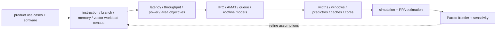
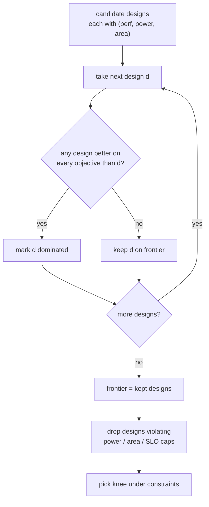

# CPU Workloads, Performance Modeling, and Design-Space Exploration

> **First-time reader orientation:** A CPU is not “fast” in the abstract. It runs a particular instruction stream produced by a compiler, exposes several kinds of parallelism, and waits on branch, dependency, cache, translation, coherence, and operating-system events. This chapter shows how to describe that workload, turn it into equations and counters, and decide which CPU structures deserve more detailed study.

> **Abbreviation key — skim now and return as needed:** instruction set architecture (ISA); application binary interface (ABI); instructions per cycle (IPC); cycles per instruction (CPI); instruction-level parallelism (ILP); memory-level parallelism (MLP); thread-level parallelism (TLP); simultaneous multithreading (SMT); single instruction, multiple data (SIMD); region of interest (ROI); misses per thousand instructions (MPKI); translation lookaside buffer (TLB); last-level cache (LLC); reorder buffer (ROB); load-store queue (LSQ); branch-prediction unit (BPU); power, performance, and area (PPA); design-space exploration (DSE); quality of service (QoS); service-level objective (SLO).

> **Hands off to:** [CPU PPA and Physical Implementation](02_CPU_PPA_and_Physical_Implementation.md) for the physical price of the structures selected here, and [CPU Simulation Methodology and Evidence](03_CPU_Simulation_Methodology_and_Evidence.md) for measuring them.

---

## 0. Begin with a CPU workload contract

A CPU product requirement must name more than a benchmark suite. Record:

- source and input revisions, command line, working set, and expected output;
- compiler, optimization flags, target ISA extensions, ABI, libraries, and link mode;
- single-thread, SMT, core count, affinity, scheduler, and memory placement;
- foreground/background mixes for server or interactive products;
- operating point: clock, voltage, temperature, memory speed, and power limit;
- the measured boundary: function, transaction, request, process, boot, or whole system;
- success metrics and constraints: latency, throughput, tail latency, energy, area, or fairness.

This tuple is the workload. “SPEC CPU,” “database,” or “browser” is only a label. Different inputs can change loop trip counts, branch bias, code footprint, cache reuse, translation pressure, system calls, and synchronization even when the executable is identical.

### 0.1 Architecture, microarchitecture, and implementation are different decisions

- The **ISA** defines programmer-visible instructions, registers, exceptions, and memory-order rules.
- The **microarchitecture** chooses how to execute the ISA: pipeline, prediction, renaming, issue policy, cache hierarchy, and coherence participation.
- The **implementation** maps that microarchitecture to cells, memories, wires, clocks, voltage domains, and a process technology.

Two cores can implement the same RISC-V ISA yet have radically different IPC, frequency, power, and area. A simulator normally predicts the microarchitecture; synthesis and physical design determine whether its assumed frequency and structure latencies are realizable.

## 1. The CPU performance identity

For one measured region,

$$
T=I\times\text{CPI}\times t_{clk}=\frac{I}{\text{IPC}\,f},
$$

where $I$ is retired architectural instructions, $t_{clk}$ is clock period, and $f=1/t_{clk}$ is frequency. This identity separates three causes:

1. **instruction count:** compiler, ISA, libraries, algorithm, and input;
2. **CPI/IPC:** microarchitecture and memory-system interaction;
3. **clock period:** physical timing and operating voltage.

It prevents a common mistake: a wider core can raise IPC but lengthen the clock period, while a new vector instruction can reduce instruction count without changing scalar IPC. Compare execution time for equivalent work, not one metric in isolation.

### 1.1 A CPI stack is useful but not naively additive

**Intuition — read the total as an itemized bill.** $\text{CPI}_{base}$ is the ideal cycles the retired work truly costs; every later term is a surcharge for a structure that stalled the core. The stack is a triage tool: if memory dominates the bill, a wider backend buys almost nothing, and if branches dominate, more cache does not help. You attack the tallest bar first.

A first decomposition is

$$
\text{CPI}=\text{CPI}_{base}+\text{CPI}_{front}+\text{CPI}_{dep}+\text{CPI}_{branch}+\text{CPI}_{memory}+\text{CPI}_{resource}.
$$

The labels mean frontend starvation, data dependencies, branch recovery, exposed memory delay, and full queues/ports. Real stalls overlap: an LLC miss may occur while the frontend is already recovering from a branch. Use simulator stall attribution rules or interval analysis; do not sum independently measured percentages unless the categories are mutually exclusive.

**Worked stack — why isolation overcounts.** Profile a 4-wide core (ideal $\text{CPI}_{base}=1/4=0.25$) two ways. Column A measures each penalty *in isolation* (idealize everything else, then switch one effect on); column B is a single run with everything enabled, then attributed by interval analysis:

| Component | A: isolated penalty | B: interval-analysis share |
|---|---|---|
| base (ideal, 4-wide) | 0.25 | 0.25 |
| frontend | 0.10 | 0.07 |
| dependencies | 0.15 | 0.11 |
| branch | 0.15 | 0.10 |
| memory | 0.55 | 0.42 |
| resource | 0.05 | 0.05 |
| **total CPI** | **1.25** | **1.00** |

Column A sums to $1.25$, but the core actually retires at $\text{CPI}=1.00$. The $0.25$-cycle gap is *overlap*: a load miss is frequently serviced while the frontend is already refilling after a mispredict, so the same idle cycle would be billed twice. Optimize against column B — here the memory term ($0.42$) is worth six times the frontend term ($0.07$), so it, not fetch width, is the lever.

## 2. Four kinds of parallelism constrain the core differently

| Parallelism | Where it comes from | CPU structures that exploit it | Typical limiter |
|---|---|---|---|
| ILP | independent instructions in one thread | rename, ROB, issue queues, functional units | dependency chains, window size, wakeup/select |
| MLP | independent outstanding cache misses | LSQ, miss-status entries, prefetchers, memory controller | address dependencies, queue capacity, DRAM concurrency |
| TLP | independent software threads | multiple cores or SMT contexts | synchronization, memory bandwidth, QoS |
| SIMD/vector | one instruction applies across lanes | vector registers and execution lanes | vectorizability, masks, alignment, memory bandwidth |

Increasing one dimension can reduce another. SMT improves utilization but partitions ROB/LSQ/cache capacity. A wider vector unit lowers instruction count but increases register-file ports and data bandwidth. A deeper window finds more ILP/MLP but increases wakeup energy, bypass distance, and recovery cost.

## 3. Characterize behavior with a CPU workload vector

For each program or phase, collect a vector such as

$$
\mathbf{x}=(I,\;\text{branch MPKI},\;\text{mispredict rate},\;L1I/L1D/L2/LLC\ \text{MPKI},\;\text{TLB MPKI},\;\text{MLP},\;\text{ILP},\;\text{code/data footprint},\;\text{sync intensity}).
$$

Useful dimensions include:

- **control:** branch frequency, predictability, indirect calls, return behavior, instruction-cache footprint;
- **backend:** dependency depth, operation mix, port pressure, critical chains, vector fraction;
- **memory:** reuse distance, cache misses, bandwidth, MLP, store intensity, prefetch coverage/accuracy;
- **translation:** page footprint, TLB misses, page-walk concurrency, huge-page sensitivity;
- **parallel/service:** thread scalability, locks, coherence sharing, queue depth, average and tail latency.

Cluster phases by these behaviors rather than benchmark names. Two programs from different suites can exercise the same bottleneck, while two inputs to one program can be microarchitecturally different.

**Two archetypes make the vector concrete.** The same iron law can hide opposite bottlenecks (values illustrative):

| Dimension | Dense FP kernel (compute-bound) | Graph traversal (memory-bound) |
|---|---|---|
| Branch MPKI | ~0.5 | ~12 |
| LLC MPKI | ~1 | ~30 |
| MLP (outstanding misses) | 2-3 | ~1.2 |
| Vector fraction | high | ~0 |
| Active limiter | FUs / register bandwidth | LLC + DRAM latency |
| Knob that helps | wider vectors, more FUs | larger MSHR/LLC, prefetch, more MLP |
| Knob that wastes area here | larger LLC | wider issue |

Both can report the same IPC yet spend it on entirely different structures. That is why section 5 sweeps *coupled* knobs against the measured census, not against the benchmark's name: the left column rewards backend width, the right column rewards the memory system, and applying either lever to the wrong workload buys area without speed.

## 4. First-order models tell you what detailed simulation must resolve

### 4.1 Branch penalty

If $r_b$ is branches/instruction, $p_m$ is misprediction probability, and $L_m$ is exposed redirect/refill cycles,

$$
\Delta\text{CPI}_{branch}\approx r_b p_m L_m.
$$

This equation distinguishes predictor accuracy from pipeline recovery. A longer/deeper frontend increases $L_m$, making each accuracy point more valuable.

### 4.2 Memory exposure

For level $j$,

$$
\Delta\text{CPI}_{mem,j}\approx \frac{\text{MPKI}_j}{1000}\,L_j\,\phi_j,
$$

where $L_j$ is miss latency and $\phi_j\in[0,1]$ is the unhidden fraction after overlap, prefetching, out-of-order execution, and MLP. Setting $\phi=1$ gives a pessimistic serial bound; assuming latency divided by average MLP is a better first approximation but still misses queueing and dependencies.

### 4.3 Window coverage

If independent work becomes available only after $D$ dynamic instructions, a ROB smaller than $D$ cannot expose it. Enlarging a window beyond the workload's useful dependence distance adds power/area without corresponding IPC. Measure critical dependence depth and ready-instruction distribution, not just average ROB occupancy.

### 4.4 Bandwidth and queueing

For arrival rate $\lambda$, service rate $\mu$, and utilization $\rho=\lambda/\mu$, a simple single-server approximation gives

$$
W\approx\frac{1}{\mu-\lambda}.
$$

Latency rises sharply near saturation: with $\mu=10$ and $\lambda=8$, $W=1/(10-8)=0.5$, but pushing arrivals just 19% higher to $\lambda=9.5$ quadruples the wait to $W=2$. This nonlinear knee is why average unloaded cache/DRAM latency cannot predict server tail latency or many-core scaling.

## 5. Design-space exploration is a constrained experiment

Define a configuration vector

$$
\theta=(W_f,W_d,W_i,W_r,N_{ROB},N_{IQ},N_{LSQ},N_{PRF},BPU,L1,L2,LLC,MSHR,f,V),
$$

covering widths, queue depths, predictor, cache and miss resources, frequency $f$, and voltage $V$. Then define objectives and constraints, for example

$$
\max_{\theta}\ \text{geomean speedup}(\theta)
\quad\text{subject to}\quad
P\le P_{max},\ A\le A_{max},\ T_{tail}\le T_{SLO}.
$$

### 5.1 Change mechanisms, not isolated knobs

A wider issue width without more fetch/decode bandwidth, issue ports, physical registers, bypass capacity, and retirement bandwidth is not a coherent machine. Likewise, a larger cache may require an extra cycle and a different clock. Each DSE point must update all coupled parameters and physical assumptions.

### 5.2 Use staged fidelity

1. analytical bounds eliminate impossible or dominated regions;
2. traces/counters characterize workload phases;
3. detailed timing simulation resolves contention, speculation, and overlap for finalists;
4. synthesis/memory-compiler data checks timing, power, and area feasibility;
5. RTL/emulation validates control and software behavior later.

The fastest model that preserves the deciding mechanism is the correct first tool. Detailed simulation of an obviously bandwidth-impossible design only produces a more expensive rejection.

### 5.3 The output of DSE is a Pareto frontier, not a single winner

**What.** With several objectives at once — go faster, but under a power cap, an area cap, and a tail-latency SLO — there is usually no design that wins on every axis. The **Pareto frontier** is the set of *non-dominated* configurations. A design is *dominated* when some other design is at least as good on every objective and strictly better on one; anything dominated is a strictly worse deal, and the frontier is what remains. Concretely, sweep six candidates on (perf, power):

| Design | Perf (geomean speedup) | Power (W) | On frontier? |
|---|---|---|---|
| D1 | 1.00 | 5 | yes (cheapest) |
| D2 | 1.20 | 7 | yes |
| D3 | 1.15 | 9 | no — D2 is faster *and* cooler |
| D4 | 1.35 | 12 | yes |
| D5 | 1.30 | 12 | no — D4 is faster at equal power |
| D6 | 1.40 | 20 | yes (fastest) |

The frontier $\{D1,D2,D4,D6\}$ is a rising staircase: each extra watt buys the most speed available at that budget. D3 and D5 sit strictly inside it, so no rational objective picks them.

**Why.** Collapsing perf, power, and area into one weighted score hides the trade-off and silently bakes in weights you have not justified. Publishing the frontier keeps the decision explicit and lets the product team choose the operating point — often the *knee*, past which more speed costs disproportionate power — under the real caps rather than an arbitrary scalar.

**How.** Filter the swept points by pairwise dominance, then apply the hard constraints, then pick the knee of what survives:

## 6. Sampling and aggregation must match the claim

Long CPU programs are nonstationary. Separate:

1. initialization/boot;
2. fast-forward to a representative phase;
3. warm-up of caches, TLBs, predictors, coherence, and queues;
4. measured ROI;
5. drain and correctness verification.

For fixed-instruction samples whose $w_i$ values represent fractions of dynamic instructions,

$$
\widehat{\text{CPI}}=\sum_i w_i\text{CPI}_i,\qquad
\widehat{\text{IPC}}=1/\widehat{\text{CPI}}.
$$

Do not average IPC blindly. For variable sample lengths, sum consistently weighted cycles and instructions. Across programs, calculate each speedup first and use a geometric mean for ratios:

$$
S_{geo}=\left(\prod_{k=1}^{K}S_k\right)^{1/K}.
$$

Keep every per-program result; a mean can hide a regression or SLO violation. Report confidence intervals for stochastic variation, and treat warm-up or model bias as systematic error rather than noise that more samples will remove.

## 7. Worked CPU decision: wider issue or better predictor?

Assume a baseline at 3 GHz has CPI 1.00. Branches are 18% of instructions, misprediction rate is 4%, and exposed recovery is 14 cycles:

$$
\text{CPI}_{branch}=0.18\times0.04\times14=0.1008.
$$

A predictor change reduces mispredictions to 2.8%, giving

$$
\Delta\text{CPI}=0.18(0.04-0.028)14=0.0302,
$$

or approximately 3.1% speedup if frequency is unchanged. A wider issue design raises ideal backend throughput enough to remove 0.05 CPI, but synthesis predicts a 5% frequency loss. Its times are

$$
T_{base}\propto1.00/3.00,
\qquad
T_{wide}\propto0.95/2.85=1.00/3.00.
$$

The wider core is roughly performance-neutral before considering extra power/area; the predictor is the better candidate if its access time still fits the frontend. A timing simulator should now resolve predictor aliasing and recovery overlap, while PPA analysis should price tables and frontend timing.

## 8. CPU design-review checklist

- Is the binary, compiler, input, software stack, and ROI frozen?
- Does each metric have an explicit numerator, denominator, scope, and unit?
- Are instruction count, CPI, and frequency separated?
- Which ILP/MLP/TLP/SIMD limit is actually active?
- Are cache/TLB/coherence effects measured at the correct boundary?
- Are DSE knobs physically coupled into a coherent configuration?
- Are warm-up, sampling weights, aggregation, and uncertainty documented?
- Is correctness checked before performance?
- Can the final point be traced back to raw counters and configuration?

## Cross-references

- [CPU Architecture](../01_Core_Foundations/01_CPU_Architecture.md) instantiates the basic pipeline and iron law.
- [Branch Prediction](../02_Frontend_and_Prediction/01_Branch_Prediction_Deep_Dive.md), [Out-of-Order Execution](../03_Out_of_Order_Backend/01_OoO_Execution.md), and [Cache Microarchitecture](../04_Cache_Hierarchy/01_Cache_Microarchitecture.md) provide mechanism depth for the terms above.
- [AI Performance Analysis](../09_AI_Workloads_and_Serving/03_Performance_Analysis_Profiling_and_Research_Frontiers.md) extends roofline, byte accounting, queueing, TTFT/TPOT, and evidence to CPU AI serving.
- [XiangShan CPU Design](../07_Core_Case_Studies/01_Xiangshan_CPU_Design.md) is a concrete open high-performance design case.

## References

1. J. L. Hennessy and D. A. Patterson, *Computer Architecture: A Quantitative Approach*.
2. D. J. Lilja, *Measuring Computer Performance*.
3. T. Sherwood et al., “Automatically Characterizing Large Scale Program Behavior,” ASPLOS 2002.
4. T. E. Carlson et al., “Sniper: Exploring the Level of Abstraction for Scalable and Accurate Parallel Multi-Core Simulation,” SC 2011.

---

← [Methodology index](00_Index.md) · next → [CPU PPA and Physical Implementation](02_CPU_PPA_and_Physical_Implementation.md)
