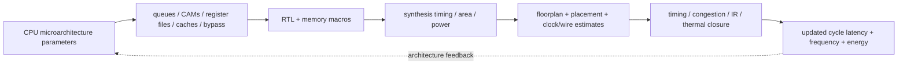
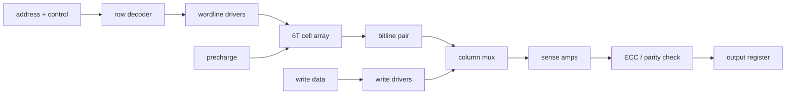
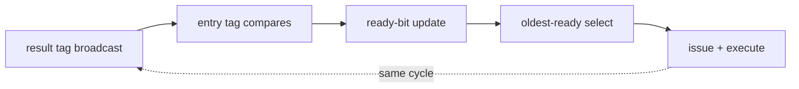

# CPU Power, Performance, Area, and Physical Implementation

> **First-time reader orientation:** A CPU block diagram hides the structures that determine silicon cost. A larger reorder buffer is an array plus age/ready logic, a wider issue machine multiplies register-file and bypass ports, and a larger cache changes wire delay and hit latency. This chapter turns CPU features into a physical resource ledger and an uncertainty-aware PPA estimate.

> **Abbreviation key — skim now and return as needed:** power, performance, and area (PPA); reorder buffer (ROB); issue queue (IQ); load-store queue (LSQ); physical register file (PRF); register-transfer level (RTL); static random-access memory (SRAM); content-addressable memory (CAM); error-correcting code (ECC); arithmetic logic unit (ALU); branch-prediction unit (BPU); translation lookaside buffer (TLB); miss-status holding register (MSHR); last-level cache (LLC); dynamic voltage and frequency scaling (DVFS); process, voltage, and temperature (PVT); voltage threshold (Vth); standard deviation ($\sigma$).

> **Prerequisite:** [CPU Workloads, Performance Modeling, and DSE](01_CPU_Workloads_Performance_and_DSE.md). **Hands off to:** [CPU Simulation Methodology and Evidence](03_CPU_Simulation_Methodology_and_Evidence.md) and the mechanism chapters that define each structure.

---

## 0. Replace feature names with a CPU resource ledger

For every proposal, list:

| CPU feature | Stored state | Access/compare work | Long wires or clock load | Timing risk |
|---|---|---|---|---|
| wider fetch/decode | instruction bytes, µop queues | multi-instruction alignment/decode | frontend distribution | I-cache, steering, rename fanout |
| larger predictor | direction/history/target tables | multiple indexed reads and tag checks | history/target paths | prediction must arrive before fetch redirects |
| deeper ROB | destination, exception, completion, age | allocation, completion updates, head retirement | broadcasts across entries | commit scans and recovery |
| larger IQ | operands, tags, ready bits, age | associative tag match and selection | wakeup/select broadcast | often a critical high-fanout loop |
| wider PRF | architectural values | many reads/writes per cycle | bypass and operand wires | ported-array access |
| larger LSQ | addresses/data/order state | associative violation/forwarding search | address/data broadcasts | forwarding and ordering checks |
| larger cache/TLB | tags, data, replacement/ECC | indexed read, tag compare, refill | bank and crossbar wires | hit latency and frequency |

This ledger exposes multiplicative costs. Issue width $W$ can require roughly $2W$ integer source reads, $W$ writes, more IQ grants, more bypass destinations, and more clocked control. Area rarely scales with “one more instruction per cycle” alone.

## 1. CPU PPA equations and their limits

Dynamic switching power is approximated by

$$
P_{dyn}=\alpha C_{sw}V^2f,
$$

where $\alpha$ is activity, $C_{sw}$ switched capacitance, $V$ supply voltage, and $f$ clock. Leakage is approximately

$$
P_{leak}=V I_{leak}(V,T,V_{th}).
$$

Energy for a measured task is

$$
E=(P_{dyn}+P_{leak})T.
$$

These are organizing equations, not a signoff model. Activity differs by workload and clock gating; capacitance depends on placement and wires; leakage is strongly nonlinear in temperature and threshold choice. Early analysis should report ranges and sensitivity.

Performance must retain both CPI and clock:

$$
T=I\,\text{CPI}/f.
$$

Area is usefully decomposed as

$$
A=A_{arrays}+A_{logic}+A_{wires/buffers}+A_{clock/power}+A_{margin}.
$$

Ignoring wires, clock, and utilization makes wide out-of-order cores look much cheaper than they place and route.

## 2. SRAM cells become CPU arrays

A conventional six-transistor (6T) SRAM bit cell uses two cross-coupled inverters and two access transistors. It must hold a bit, permit a read without flipping, and permit a write strong enough to overwrite the prior state. These competing requirements create read stability and write-margin constraints, especially at low voltage.

### 2.1 Why a 6T cell can fail during a read or write

During a read, both bitlines are precharged near $V_{DD}$ and the wordline turns on the two access transistors. The side storing zero is then connected to a high bitline. Its access transistor and pull-down transistor form a voltage divider, so the supposedly low storage node rises. If that rise crosses the opposite inverter's switching point, positive feedback flips the bit: a **read disturb**. Designers therefore require the pull-down device to be stronger than the read access device. The **cell ratio** is commonly defined as

$$
CR=\frac{(W/L)_{pull\text{-}down}}{(W/L)_{access}},
$$

where $W/L$ is transistor width divided by length. A larger ratio improves read stability but makes the cell larger and can make writing a one harder. **Static noise margin (SNM)** is the maximum direct-current noise voltage the cross-coupled inverters tolerate; it is obtained from the largest square that fits between the two lobes of the inverter-transfer "butterfly" curve. Hold SNM, read SNM, and write margin are different measurements. Quoting "the SRAM SNM" without a mode, voltage, temperature, and process corner is incomplete.

A write creates the opposite conflict. The write driver pulls one bitline low, and the access device must drag the corresponding storage node far enough to overpower the cell's pull-up p-channel MOS transistor (PMOS). Stronger access devices improve writability but hurt read stability. Lowering $V_{DD}$ reduces both margins while random threshold-voltage variation becomes a larger fraction of the available voltage. That is why minimum operating voltage, often called $V_{min}$, is usually set by the weakest array rather than by ordinary logic.

Three common responses are architecture-visible:

- An **8T cell** separates the read path from the storage nodes. Read SNM approaches hold SNM, enabling lower-voltage operation, but the extra transistors and read bitline increase area and routing.
- A **10T or differential read-decoupled cell** improves low-voltage robustness or differential sensing at still greater area cost.
- **Assist circuits** temporarily weaken one side of the conflict: wordline underdrive improves read stability; wordline boost or negative bitline improves writes; collapsing the cell supply during a write weakens the pull-up. Assists add analog constraints, level generation, verification corners, and sometimes cycle-time penalties.

The CPU consequence is not merely memory yield. A voltage-scaled L1 using a larger robust cell may consume more core area; a dense 6T cache may need a separate voltage rail; predictor arrays might accept parity and reset on error; architectural register files may require stronger protection. The correct choice depends on whether the array is timing-critical, architecturally recoverable, and active in retention states.

A CPU never instantiates a raw bit cell alone. An array adds:

- row decoder and wordline drivers;
- precharge, bitlines, sense amplifiers, and write drivers;
- column multiplexers, banking, redundancy, and repair;
- ECC/parity generation and checking;
- address/control registers and output muxes;
- local clock and power-gating circuitry.

The observed access time is decoder + wordline + cell/bitline + sense + output routing, not a single “SRAM latency.” Large predictors, caches, TLBs, and queues are banked or pipelined because wire resistance/capacitance grows with dimensions.

The macro is therefore a datapath, and its latency is a sum of stages rather than one number. A read walks the decode-to-output path below; a write injects at the column drivers.

### 2.2 From one bit to a manufacturable CPU macro

An array must work when millions or billions of cells are manufactured together. If one bit has failure probability $p$ and failures were independent, a raw $N$-bit-array yield would be approximately

$$
Y_{raw}=(1-p)^N\approx e^{-Np}.
$$

The final step uses $\ln(1-p)\approx-p$ for small $p$.

The independence assumption is simplified, but the exponential exposure explains why spare rows/columns, fuse or electrically programmed repair, error correction, and screening are normal macro features. A CPU capacity label normally states usable bytes; physical area also contains spare capacity, parity/ECC bits, tag/state bits, and periphery. Soft errors from radiation are handled with parity, ECC, scrubbing, replay, or duplication according to the state's consequence and recovery window.

### 2.3 Ports are expensive

True multiported SRAM needs additional access devices/wordlines/bitlines or replicated/banked structures. A PRF for issue width $W$ may demand about $2W$ reads and $W$ writes before considering vector/branch/load paths. Full multiporting expands cell/periphery and routing rapidly.

**Why full multiporting is a square, not a line:** a multiported bit cell is less a storage device than a small grid of wires. Every port that can reach the bit needs its own wordline threaded across the cell and its own bitline (or bitline pair) running down it, so adding ports grows the cell in *both* directions at once. Once the cell is wire-limited — its size set by wire pitch rather than by the transistors — area follows the square of the port count:

$$
A_{cell}\propto p^2,\qquad p=n_{read}+n_{write},
$$

counting each read or write port as one wordline and one bitline group. Normalizing a 1-read/1-write cell ($p=2$) to unit area:

| Cell ports | $p$ | Area $\propto (p/2)^2$ |
|---|---|---|
| 1R1W | 2 | 1.0× |
| 2R1W | 3 | 2.25× |
| 4R2W | 6 | 9.0× |
| 8R4W | 12 | 36× |

The 8-read/4-write file a 4-wide integer core naively wants ($2W=8$ reads, $W=4$ writes) is roughly 36× the bit-cell area of a single-ported cell, before any periphery. Access delay grows about linearly with $p$ (longer word/bitlines) and access energy faster than linearly, so a fully multiported file is slow and hot, not merely large. That quadratic is the pressure behind every alternative below.

Common CPU alternatives:

- bank the PRF and steer operations, accepting bank conflicts;
- replicate read copies and broadcast writes;
- split integer/floating/vector files;
- use clustered issue/PRFs with explicit inter-cluster moves;
- bypass recent results rather than read them back immediately.

Each saves one cost while creating another: conflicts, coherence between copies, bypass muxing, or compiler/scheduler constraints.

A useful first check is to count logical accesses before selecting an implementation. A four-wide integer issue queue whose operations have two inputs can request eight PRF reads and four writes in one cycle. Replicating the array four times could supply eight reads with dual-read copies, but every write must update every copy, creating sixteen physical write deliveries plus long fanout. Banking avoids replication only if the scheduler prevents or replays same-bank conflicts. The bank function, instruction steering, and conflict policy are therefore part of CPU microarchitecture—not an implementation detail that can be postponed.

## 3. Associative structures cost more than indexed memory

An indexed SRAM activates one selected row. A CAM-like search compares a key against many entries in parallel. CPU examples include TLBs, issue-queue wakeup tags, LSQ address checks, victim structures, and fully associative predictor components.

Approximate compare energy scales with entries $N$, key bits $B$, and search ports $P_s$:

$$
E_{search}\propto NBP_s.
$$

Unlike an SRAM, a content-addressable memory (CAM) precharges a match line for every candidate entry and conditionally discharges it when any compared bit mismatches. A lookup therefore activates many comparison cells and long match lines at once. A translation lookaside buffer may compare a virtual-page number against every way; an IQ may compare each broadcast destination tag against two source tags in every entry; an LSQ may compare load addresses or byte masks against older stores. More search ports replicate comparison wires and precharge activity. Partial tags, bank prediction, hashed indexing, hierarchy, and staged comparison save energy or time only by accepting collision, replay, or extra-latency behavior that the performance model must include.

Priority selection follows comparison. If dozens of entries wake together, an age-based grant network must find the oldest legal operations for several issue ports. Wire delay and fan-in make the physical cost grow faster than raw entry count. This is why an “128-entry scheduler” cannot be costed as 128 records of metadata alone.

### 3.1 CAM versus TCAM in and around a CPU

A binary CAM compares every stored bit with a zero or one in the search key. A **ternary content-addressable memory (TCAM)** adds a “do not care” state, allowing one entry to match an address prefix or masked field. A conceptual ternary bit needs stored value plus mask state and a comparison cell; practical TCAMs therefore have lower density and higher search energy than SRAM and ordinary CAM.

CPU-core TLBs normally need exact virtual-page tag matches plus separate page-size/global/permission fields, so they are often set-associative SRAM/CAM structures rather than a large general TCAM. TCAM-like matching appears when variable page sizes, range registers, protection regions, breakpoints, or packet/classification functions require masked matches. A system CPU complex may also include TCAMs in I/O translation, networking, or security blocks, but those are not “free entries” in the core area model.

If the requirement is longest-prefix match, a TCAM can answer in one parallel search but switches nearly the whole table. Alternatives—tries, hashed tables, staged prefix banks, or exact-match caches backed by software—trade extra cycles and miss paths for lower energy/area. The architecture model must include that fallback latency and traffic rather than pricing only the fast hit.

Wakeup/select can form a same-cycle loop:

$$
\text{result tag broadcast}\rightarrow\text{entry compares}\rightarrow\text{ready update}\rightarrow\text{oldest-ready select}\rightarrow\text{issue}.
$$

The chain is drawn straight, but it closes on itself: the instruction that issues broadcasts its own destination tag, waking its dependents in time for them to select the *next* cycle. Back-to-back dependent issue therefore needs the whole loop to settle within one clock, which is why it resists pipelining.

Increasing IQ entries, issue width, or operand count loads this loop. Hierarchical selection, segmented wakeup, dependence prediction, banked schedulers, or an extra pipeline stage are physical responses—not abstract simulator parameters.

## 4. Cache and TLB implementation choices feed back into architecture

For a cache with capacity $C$, associativity $A_s$, and line size $B$, set count is

$$
N_{set}=\frac{C}{A_sB}.
$$

The tag stores physical-address bits not consumed by byte offset and set index, plus valid/dirty/coherence/replacement/ECC state. Data and tag arrays may be accessed in parallel or serially. Parallel lookup is faster but switches more data; serial tag-then-data saves energy but adds latency.

Banking increases bandwidth but introduces bank selection, conflicts, and crossbars. A larger L1 may reduce misses while adding a pipeline stage, which affects load-use latency, branch resolution, and frequency. An LLC may be physically distributed into slices, making NoC/home selection part of hit latency.

TLBs face the same trade: more entries reduce page walks, but higher associativity/ports increase compare energy and access delay. Multi-level TLBs, banking by page size, and shared second-level TLBs are physical/architectural compromises.

## 5. ECC, parity, and recovery are part of the CPU data path

For $k$ protected bits, a single-error-correcting code needs parity bits $r$ satisfying

$$
2^r\ge k+r+1.
$$

The $r$ check bits produce $2^r$ distinct syndromes, which must identify each of the $k+r$ possible single-bit error positions plus the no-error case.

Adding overall parity gives single-error correction, double-error detection (SECDED). Protection adds stored bits, encoder/checker logic, correction latency, scrub traffic, and fault-report state.

For example, protecting $k=64$ data bits needs $r=7$ check bits ($2^7=128\ge 64+7+1$); the SECDED parity bit brings the total to 8, a 12.5% array overhead. The relative cost falls as the protected granule widens — a 128-bit word needs only 9 SECDED bits (about 7%) — which is why caches usually protect wide data granules rather than individual bytes.

CPU structures choose different policies:

- parity plus pipeline replay for timing-sensitive caches/queues;
- ECC for data caches and large arrays;
- duplication or residue checks for critical control;
- poison propagation when data cannot be corrected;
- selective hardening for architected or recovery-critical state.

The recovery mechanism must be modeled: a corrected L2 access may add a cycle; an uncorrectable line may raise a machine check; a predictor parity fault may invalidate and retrain rather than corrupt architectural state.

## 6. Frequency is a path budget, not a free input

At period $T_{clk}$,

$$
T_{logic}+T_{wire}+T_{clock\ uncertainty}+T_{setup}+T_{margin}\le T_{clk}.
$$

CPU-critical path families include:

- predictor/table access → target selection → fetch address;
- decode → rename map/free-list allocation → dispatch;
- wakeup → select → operand read → execute/bypass;
- load address → TLB → L1 tags/data → forwarding/wakeup;
- branch resolution → recovery map → frontend redirect;
- commit/exception ordering and clock distribution.

Simulation must use latencies consistent with an achievable implementation. If a 128 KB L1 requires four cycles in the target process but the model uses two, performance and frequency are both optimistic.

## 7. Variation and uncertainty change rankings

At architecture time, use intervals:

$$
\hat P=P_0(1+\epsilon_P),\quad
\hat A=A_0(1+\epsilon_A),\quad
\hat f=f_0(1+\epsilon_f).
$$

Separate:

- **parametric uncertainty:** unknown capacitance, activity, memory/compiler result, wire length;
- **model-form uncertainty:** omitted mechanisms such as real bypass topology or voltage droop;
- **workload uncertainty:** phase/input/software mix;
- **implementation uncertainty:** floorplan, congestion, process corner, memory macro availability.

Sensitivity should precede precision:

$$
S_x=\frac{\partial \ln Y}{\partial \ln x}.
$$

If a 10% cache-area uncertainty barely changes the decision but a one-cycle load-use change reverses it, spend effort on memory timing, not on another decimal place of array area.

### 7.1 Pareto dominance under ranges

A point is robustly dominated only if its plausible performance, power, and area ranges are worse than another point's. Overlapping error bars mean the model cannot confidently rank them. Escalate fidelity or choose based on secondary constraints rather than presenting a false winner.

## 8. Worked resource estimate: doubling the out-of-order window

Suppose a 4-wide core moves from a 192-entry to 384-entry ROB, 64 to 128-entry IQ, and 72 to 128-entry LSQ.

The naive statement is “the window doubles.” The physical changes include:

1. ROB state bits and completion/exception update loads roughly double;
2. IQ tag comparators and ready/select population double;
3. LSQ address/data/age storage and forwarding/violation search grow;
4. more in-flight destinations require more physical registers and rename checkpoints;
5. broadcasts reach more loads, increasing wire capacitance and repeater count;
6. branch recovery/squash touches more entries;
7. clock power rises even when extra entries contribute little performance.

If simulation shows only 3% speedup, while implementation estimates +12% core area, +18% backend dynamic power, and a possible issue-stage pipeline split, the correct metric is not speedup alone. Energy-delay and area-normalized throughput likely reject the larger window unless a priority workload specifically needs its MLP.

## 9. CPU PPA handoff checklist

- Map every performance knob to arrays, logic, ports, wires, clock load, and recovery state.
- Obtain memory-compiler estimates at the target size, ports, voltage, and PVT corner.
- Check timing paths created by width/depth, not just block-average delay.
- Use workload activity for dynamic power and realistic idle/clock-gating states.
- Include ECC, repair, test, power management, and design margin.
- Keep CPI and achievable frequency coupled.
- Record uncertainty ranges and the parameters most likely to reverse ranking.
- Calibrate relative trends against a synthesized or measured reference point.

## Cross-references

- [Fetch, Decode, and µop Delivery](../02_Frontend_and_Prediction/02_Fetch_Decode_and_Uop_Delivery.md) and [Advanced Scheduling](../03_Out_of_Order_Backend/04_Advanced_Scheduling_Wakeup_and_Replay.md) expose timing-critical paths.
- [Cache Microarchitecture](../04_Cache_Hierarchy/01_Cache_Microarchitecture.md) and [TLB and Virtual Memory](../05_Virtual_Memory/01_TLB_and_Virtual_Memory.md) instantiate the memory-array tradeoffs.
- [Power and Low Power](../../../02_Power_and_Low_Power/00_Index.md) continues into RTL/physical power intent and signoff.

## References

1. N. H. E. Weste and D. Harris, *CMOS VLSI Design*.
2. B. S. Amrutur and M. A. Horowitz, “Speed and Power Scaling of SRAMs,” IEEE JSSC.
3. S. Palacharla, N. P. Jouppi, and J. E. Smith, “Complexity-Effective Superscalar Processors,” ISCA 1997.
4. CACTI and technology-specific memory-compiler documentation for array estimates.

---

← [CPU Workloads and DSE](01_CPU_Workloads_Performance_and_DSE.md) · next → [CPU Simulation Methodology and Evidence](03_CPU_Simulation_Methodology_and_Evidence.md)
