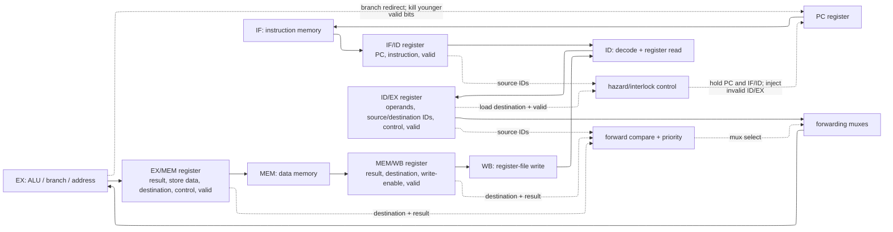

# Central Processing Unit (CPU) Architecture — The Pipelined Machine and Its Contract

> **First-time reader orientation:** A CPU is a programmable machine that repeatedly fetches an instruction, determines what it means, obtains its inputs, performs work, and makes the result visible. A pipeline overlaps those steps for different instructions. This chapter begins with that simple in-order path before adding prediction, multiple issue, caches, and multicore behavior.

> **Abbreviation key — skim now and return as needed:** graphics processing unit (GPU); instruction set architecture (ISA); reduced instruction set computer (RISC); instructions per cycle (IPC); cycles per instruction (CPI);
> instruction-level parallelism (ILP); memory-level parallelism (MLP); average memory access time (AMAT); design-space exploration (DSE); out-of-order (OoO);
> translation lookaside buffer (TLB); address-space identifier (ASID); reorder buffer (ROB); miss status holding register (MSHR); load-store queue (LSQ);
> issue queue (IQ); physical register file (PRF); register alias table (RAT); arithmetic logic unit (ALU); register file (RF);
> single instruction, multiple data (SIMD); simultaneous multithreading (SMT); dynamic random-access memory (DRAM); content-addressable memory (CAM); level-one cache (L1);
> level-two cache (L2); level-three cache (L3); direct memory access (DMA); AXI Coherency Extensions (ACE); Coherent Hub Interface (CHI);
> branch target buffer (BTB); tagged geometric-history-length predictor (TAGE); Modified, Exclusive, Shared, Invalid (MESI); Modified, Owned, Exclusive, Shared, Invalid (MOESI); Modified, Exclusive, Shared, Invalid, Forward (MESIF);
> reliability, availability, and serviceability (RAS); program counter (PC); complementary metal-oxide-semiconductor (CMOS); fan-out-of-four (FO4); finite-state machine (FSM);
> read after write (RAW); write after read (WAR); write after write (WAW); virtually indexed, physically tagged (VIPT); kilobyte (KB);
> megabyte (MB); gigahertz (GHz).

> **Prerequisites:** [CMOS_Fundamentals](../../../00_Fundamentals/01_CMOS_Fundamentals.md) (the FO4 (fan-out-of-4) unit and the gate-delay budget a stage must fit), [Logic_Building_Blocks](../../../00_Fundamentals/02_Logic_Building_Blocks.md), [Adders_and_Multipliers](../../../00_Fundamentals/03_Adders_and_Multipliers.md) (the ALU that sits in EX).
> **Hands off to:** [RISC_V_ISA](02_RISC_V_ISA.md), [OoO_Execution](../03_Out_of_Order_Backend/01_OoO_Execution.md), [Branch_Prediction_Deep_Dive](../02_Frontend_and_Prediction/01_Branch_Prediction_Deep_Dive.md), [Cache_Microarchitecture](../04_Cache_Hierarchy/01_Cache_Microarchitecture.md), [Cache_Coherence](../06_Coherence_and_Consistency/01_Cache_Coherence.md), [TLB_and_Virtual_Memory](../05_Virtual_Memory/01_TLB_and_Virtual_Memory.md).

---

## 0. Why this page exists

Almost everything in a scalar CPU is a consequence of one decision: **overlap the execution of consecutive instructions instead of running them to completion one at a time.** Overlap is the only source of throughput a single ALU can offer — and it is also the sole reason hazards, forwarding, branch prediction, store buffers, and precise-state machinery exist at all. None of them is needed in a machine that finishes one instruction before fetching the next; every one is the *price* of the overlap that buys speed.

This page derives that machine from its purpose. We start from *why overlap raises throughput* and let the theory (ideal CPI, the frequency-versus-depth trade-off, the diminishing return of deeper pipes) tell us how far to push it. From the overlap itself we derive the three hazard classes and price each one. We present forwarding not as a table of bypass multiplexers but as the answer to a single timing gap. Then we place the pipelined core in the system it actually lives in — a memory hierarchy it must hide, a coherence invariant it must preserve, a consistency contract it must honour, sibling threads it can share with, and a speculation side-channel it must not leak through. For each we ask the same question: *what invariant does this thing maintain or break, and why must it exist?*

The deep dives — dynamic scheduling, the ROB (reorder buffer) and LSQ (load-store queue), TAGE (TAgged GEometric-history-length predictor) prediction, cache and TLB (translation lookaside buffer) internals — live on the sibling pages this one hands off to. Here we build the foundation they relax.

### 0.1 The evolution path: every feature repairs a specific failure

CPU features are easiest to remember as a sequence of failed machines. Start with a machine that completes one instruction before beginning the next. It is simple because only one instruction owns the datapath, but most hardware is idle most of the time. Pipelining fixes that utilization problem by overlapping instructions; the overlap then creates hazards that did not exist before. Each later feature is therefore both an optimization **and a new correctness obligation**:

```mermaid
%%{init: {"flowchart": {"defaultRenderer": "elk", "nodeSpacing": 45, "rankSpacing": 55, "htmlLabels": false}}}%%
flowchart LR
    A["One instruction at a time\ncorrect, long cycle, low utilization"]
    B["Pipeline\nstage registers + valid bits"]
    C["Forwarding + interlock\ncomparators, operand muxes, stall control"]
    D["Branch prediction\nBTB/history state + checkpoints + redirect"]
    E["Superscalar issue\nmultiple lanes and port arbitration"]
    F["Out-of-order execution\nrename + IQ + ROB + recovery"]
    G["Nonblocking memory\nLSQ + MSHRs + replay"]
    H["Multicore shared memory\ncoherence + consistency ordering"]

    A -->|"idle units; one long critical path"| B
    B -->|"RAW, control, and resource hazards"| C
    C -->|"next PC still arrives too late"| D
    D -->|"scalar throughput ceiling"| E
    E -->|"one slow older op blocks ready work"| F
    F -->|"cache latency exceeds window tolerance"| G
    G -->|"private cached copies can disagree"| H
```



Read every arrow with the same seven questions:

1. **Baseline:** what is the smallest correct machine before the arrow?
2. **Failure:** what event makes it slow or wrong?
3. **Feature:** what mechanism is added?
4. **Enabling state:** what must be remembered per instruction, register, branch, miss, or cache line?
5. **Control/data path:** what comparisons, arbitration, muxes, broadcasts, or recovery signals use that state?
6. **Effect and cost:** which cycles disappear, and which area, energy, latency, or new failure mode appears?
7. **Evidence:** which counter and which assertion would prove the mechanism works?

For example, a pipeline alone removes the long-cycle bottleneck but creates read-after-write (RAW) hazards. Forwarding removes most RAW stalls by adding destination-tag comparators and ALU-input muxes; its losing case is a load whose data physically arrives too late, so an interlock must still insert one bubble. The evidence is not merely higher instructions per cycle (IPC): it is a fall in `raw_stall_cycles`, a nonzero but explainable `load_use_stalls`, and an assertion that a selected bypass source is the youngest older matching producer. The rest of the page follows this construction rather than treating the blocks as independent vocabulary.

---

## 1. Pipelining: why overlap buys throughput, and how deep to go

### 1.1 The throughput argument

A non-pipelined core drives one instruction through fetch → decode → execute → memory → writeback and only then starts the next. Its clock must be slow enough for the *entire* datapath to settle, and it completes one instruction every $t_{\text{logic}}$ seconds. Throughput is $1/t_{\text{logic}}$; the expensive ALU sits idle four-fifths of the time.

Pipelining cuts the datapath into $N$ stages separated by registers and lets $N$ instructions occupy different stages at once. The clock now only has to cover the *slowest single stage*, and in steady state **one instruction completes every cycle** even though each still takes $N$ cycles end to end. The labels below are instruction fetch (IF), instruction decode (ID), execute (EX), memory access (MEM), and writeback (WB):

```text
cycle:   1    2    3    4    5    6    7    8
I1:     IF   ID   EX   MEM  WB
I2:          IF   ID   EX   MEM  WB
I3:               IF   ID   EX   MEM  WB
I4:                    IF   ID   EX   MEM  WB
                          └── steady state: one WB per cycle ──┘
```

The trade is explicit: per-instruction **latency** is unchanged (slightly worse, because of register overhead), but **throughput** rises by up to $N\times$. This is the whole game — latency for throughput — and it is why the *iron law* separates cleanly into three independent knobs:

$$
T_{\text{CPU}} \;=\; IC \times \text{CPI} \times t_{\text{clk}}
$$

where $IC$ = dynamic instruction count (set by ISA + compiler), $\text{CPI}$ = cycles per instruction (set by the microarchitecture's stalls), $t_{\text{clk}}$ = clock period (set by the slowest stage). Pipelining attacks $t_{\text{clk}}$; its **ideal CPI is 1** (one completion per cycle). Every mechanism in §2–§5 exists to keep the *actual* CPI near that ideal without giving back the $t_{\text{clk}}$ that pipelining won.

**The iron law is an accounting identity, not a model** — it cannot be wrong, only unhelpful, and seeing why fixes what it is *for*. Total time is tautologically the cycle count times the cycle time, and the cycle count is tautologically the instruction count times the average cycles charged per instruction:

$$
T_{\text{CPU}} = (\text{cycles}) \times t_{\text{clk}} = \Big(IC \times \underbrace{\tfrac{\text{cycles}}{IC}}_{\equiv\,\text{CPI}}\Big) \times t_{\text{clk}} = IC \times \text{CPI} \times t_{\text{clk}}.
$$

Each factor is *defined* so the product telescopes back to $T$; the content is not the algebra but the **separation of ownership** — $IC$ to the ISA/compiler, $t_{\text{clk}}$ to the circuit/process, $\text{CPI}$ to the architect. Because the three *multiply*, a given fractional change in any one moves $T$ by the same fraction, so they compare on equal footing and only the **product** is the objective: a 10% deeper-pipe win in $t_{\text{clk}}$ is erased by an 11% CPI regression.

**Quantifying the pipeline win.** Split the datapath's combinational delay $t_{\text{comb}}$ evenly over $N$ stages; each stage also pays a fixed latch overhead $t_{\text{latch}}$ (flop setup + clk-to-Q + skew + jitter) — the same two quantities §1.3 writes as $t_{\text{logic}}$ and $t_{\text{ovh}}$. The achievable period and its ideal-CPI (=1) throughput speedup over the unpipelined machine are

$$
t_{\text{clk}}(N) = \frac{t_{\text{comb}}}{N} + t_{\text{latch}}, \qquad
S(N) \equiv \frac{t_{\text{clk}}(1)}{t_{\text{clk}}(N)} = \frac{t_{\text{comb}} + t_{\text{latch}}}{\dfrac{t_{\text{comb}}}{N} + t_{\text{latch}}} \xrightarrow[\,t_{\text{latch}}\to 0\,]{} N,
$$

where $S(N)$ = steady-state throughput ratio and $t_{\text{clk}}(1) = t_{\text{comb}}+t_{\text{latch}}$ is the unpipelined period. The limit $S\to N$ is the promise — *$N$ stages, $N\times$ throughput* — but the latch term bends it: as $N\to\infty$, $S\to (t_{\text{comb}}+t_{\text{latch}})/t_{\text{latch}}$, a hard ceiling set purely by overhead (the **overhead wall**, §1.3). And the win is only banked if CPI stays near 1 — the *net* speedup is $S(N)/\text{CPI}(N)$, which is where the hazard terms of §2 and the depth penalty of §1.3 enter.

*Worked number — depth 5 vs 15.* Take $t_{\text{comb}} = 45$ FO4 of logic, $t_{\text{latch}} = 3$ FO4, and a depth-linear hazard penalty $\text{CPI}(N) = 1 + \beta N$ with $\beta = 0.02$ (illustrative). The unpipelined period is $48$ FO4.

| $N$ | $t_{\text{clk}}(N)$ | raw $S(N)$ | $\text{CPI}(N)$ | net $S/\text{CPI}$ |
|---|---|---|---|---|
| 5  | $45/5+3 = 12$ | $48/12 = 4.0$ | $1.10$ | $3.6$ |
| 15 | $45/15+3 = 6$ | $48/6 = 8.0$ | $1.30$ | $6.2$ |

Tripling the depth (5→15) buys only **2×** raw throughput, not 3×, because the fixed latch grew from 25% of the cycle ($3/12$) to 50% ($3/6$); and once the hazard penalty is charged, *net* speedup rises just **1.7×** (3.6→6.2). Both the shrinking frequency return and the growing CPI cost are already visible at $N=15$ — precisely the convex trade §1.3 now solves for its optimum.

### 1.2 Overlap forces exactly two things to be built

Because up to $N$ instructions now coexist, two obligations follow directly and nothing else in the scalar core is fundamental:

1. **State per in-flight instruction.** Each stage must latch everything later stages will need — decoded controls, operands, the destination register, the PC. That is the *entire* reason pipeline registers exist; they hold the context that used to live implicitly in a single instruction's lifetime.
2. **Hazards.** With five instructions in flight, a later one can reach a stage needing a result an earlier one has not produced (data), the fetch stage must pick a next PC before an in-flight branch resolves (control), or two instructions want one resource in one cycle (structural). §2 derives all three from overlap and prices them.

The following is the minimal **implementation structure**, not just the five stage names. The wide arrows carry instruction data and decoded control. The dashed arrows are the control paths that make overlap safe.



A pipeline register must carry **data, control, identity, and validity** together. Data without its destination identity cannot be forwarded; a destination without `RegWrite` could create a false match; stale control from a flushed instruction could write memory. A `valid` bit turns a bubble into an ordinary pipeline entry whose side-effect enables are forced off. That gives a simple control priority at each clock edge:

1. **reset or exception/mispredict recovery:** redirect the PC and clear the valid bits of all younger entries;
2. **interlock stall:** hold the PC and IF/ID register, but write an invalid bubble into ID/EX so the older instruction continues;
3. **normal advance:** capture each stage's output into the next register.

This priority matters. If a branch redirects in the same cycle that a younger load-use hazard asks to stall, honoring the stall first would preserve wrong-path work and potentially suppress the redirect. A useful control assertion is therefore: *after a redirect, no entry younger than the redirecting instruction may remain valid on the next cycle*. This is the first appearance of the `valid/kill/age` discipline that the out-of-order ROB later generalizes to hundreds of entries.

### 1.3 How deep should the pipe be? The frequency-versus-depth trade-off

Deeper pipes clock faster — but not without limit, and not for free in CPI. Model the clock period as the per-stage logic plus a fixed overhead:

$$
t_{\text{clk}}(N) \;=\; \frac{t_{\text{logic}}}{N} \;+\; t_{\text{ovh}}
$$

where $t_{\text{logic}}$ = total combinational delay of the unpipelined datapath (FO4), $t_{\text{ovh}}$ = per-stage overhead (flop setup + clk-to-Q + skew + jitter), roughly constant per stage. As $N\to\infty$ the useful logic term vanishes and frequency saturates at $1/t_{\text{ovh}}$ — **the overhead wall**: past some depth, added stages are almost pure latch delay.

Meanwhile CPI *rises* with depth, because the branch-misprediction penalty is the number of stages between fetch and branch resolution, which grows with $N$. Writing the added mispredict CPI as $\beta N$:

$$
\text{CPI}(N) \;=\; 1 + \beta N, \qquad \beta \equiv b \cdot p_{\text{mp}} \cdot c
$$

where $b$ = branches per instruction ($\approx 0.2$), $p_{\text{mp}}$ = per-branch mispredict rate, $c$ = fraction of the added stages sitting between fetch and resolve. Per-instruction time is the product, and minimizing it gives the optimal depth:

$$
\tau(N) = (1+\beta N)\!\left(\frac{t_{\text{logic}}}{N}+t_{\text{ovh}}\right)
\;\;\Longrightarrow\;\;
\boxed{\,N^{*} = \sqrt{\dfrac{t_{\text{logic}}}{\beta\,t_{\text{ovh}}}}\,}
$$

**Why that root is the optimum, and why it is unique.** Expand the product to isolate the $N$-dependence:

$$
\tau(N) = \underbrace{\big(\beta\,t_{\text{logic}} + t_{\text{ovh}}\big)}_{\text{constant in }N} \;+\; \underbrace{\frac{t_{\text{logic}}}{N}}_{\text{falling}} \;+\; \underbrace{\beta\,t_{\text{ovh}}\,N}_{\text{rising}} .
$$

Only two terms move with $N$: a frequency term $t_{\text{logic}}/N$ that *falls* (deeper pipe, shorter stages) and a hazard term $\beta t_{\text{ovh}} N$ that *rises* (deeper pipe, more exposed mispredict). Their sum is **convex** — $\tau''(N) = 2t_{\text{logic}}/N^{3} > 0$ for all $N>0$ — so any stationary point is the *unique* global minimum. Setting $\tau'(N) = -t_{\text{logic}}/N^{2} + \beta t_{\text{ovh}} = 0$ yields it directly; equivalently, AM–GM bounds the two moving terms below by

$$
\frac{t_{\text{logic}}}{N} + \beta t_{\text{ovh}} N \;\ge\; 2\sqrt{\beta\,t_{\text{logic}}\,t_{\text{ovh}}},
$$

with equality — hence the minimum — exactly when the falling and rising terms are equal, $t_{\text{logic}}/N = \beta t_{\text{ovh}} N$, giving $N^{*} = \sqrt{t_{\text{logic}}/(\beta t_{\text{ovh}})}$. The optimum is the depth at which *the marginal cycle-time gained from one more stage equals the marginal CPI it costs* — the same falling-vs-rising balance that fixes convex optima across the sibling modeling page. The floor itself, $\tau(N^{*}) = (\beta t_{\text{logic}} + t_{\text{ovh}}) + 2\sqrt{\beta t_{\text{logic}} t_{\text{ovh}}}$, is the per-instruction time no amount of pipelining can beat.

The two effects — frequency gain $\propto 1/N$ shrinking, penalty cost $\propto N$ growing — cross at $N^{*}$; beyond it, every added stage costs more mispredict CPI than it recovers in frequency. This is *why* deeper is not always better, expressed as a knee rather than a slogan.

Two lessons drop out of $N^{*}$. First, the optimum tracks $\sqrt{1/\beta}$: a **better branch predictor (smaller $p_{\text{mp}}$) justifies a deeper pipe**, which is exactly why prediction accuracy and pipeline depth advanced together historically. Second, the pure-performance $N^{*}$ comes out *deep* — often tens of stages — which is why the early-2000s frequency race pushed pipelines to 20–31 stages. What pulls the real knee back to **14–20 stages** is not $N^{*}$ itself but two limits it ignores: the **overhead wall** — below roughly **6–8 FO4 of logic per stage** (Hrishikesh et al., 2002), $t_{\text{ovh}}$ consumes too large a share of each cycle for useful frequency to keep rising — and **power**, which grows with frequency and makes the performance-per-watt optimum shallower still. The Pentium 4 (~31 stages, ~20-cycle mispredict penalty) sat past that knee and paid in CPI on branchy code and in watts; modern high-performance cores settle at 14–20 stages, and in-order embedded cores at 5–8.

*(The complementary bound — how much of a program is even pipelineable/parallelizable — is Amdahl's law, $\text{Speedup}=1/((1-f)+f/S)$; it governs multicore scaling and is developed in [CPU workload and performance methods](../00_Design_Methodology/01_CPU_Workloads_Performance_and_DSE.md).)*

---

## 2. Hazards: the three ways overlap breaks, and what each costs

A hazard is any situation where naively advancing every instruction one stage per cycle would compute the wrong answer or contend for a resource. Overlap creates exactly three root causes. Naming the *cost* of each up front is the point — the rest of the chapter is about paying those costs cheaply.

**The three costs add — the hazard-CPI stack.** In an in-order pipe a stall fully serializes: while one hazard's bubble drains, nothing else advances, so bubbles from independent hazard sources do not overlap. By linearity of expectation over the instruction stream, the per-instruction cycle count is then the ideal 1 plus one expected-bubble term per hazard class,

$$
\text{CPI} = 1 + \underbrace{f_{\text{br}}\,p_{\text{miss}}\,\text{penalty}}_{\text{CPI}_{\text{branch}}} + \underbrace{f_{\text{load-dep}}\,b_{\text{lu}}}_{\text{CPI}_{\text{load-use}}} + \underbrace{f_{\text{str}}\,b_{\text{str}}}_{\text{CPI}_{\text{struct}}},
$$

each term being (fraction of instructions that trigger the hazard) × (bubbles charged per trigger), where $f_{\text{br}}$ = branch fraction, $p_{\text{miss}}$ = per-branch mispredict rate, $\text{penalty}$ = resolve distance in cycles ([Branch_Prediction_Deep_Dive](../02_Frontend_and_Prediction/01_Branch_Prediction_Deep_Dive.md), §4); $f_{\text{load-dep}}$ = fraction that are a load feeding a dependent in the next slot and $b_{\text{lu}} = 1$ = the irreducible load-use bubble (§3); $f_{\text{str}}$, $b_{\text{str}}$ = structural-conflict frequency and its stall. This is the CPI stack read bottom-up — the same additive decomposition [CPU workload and performance methods](../00_Design_Methodology/01_CPU_Workloads_Performance_and_DSE.md) builds top-down — and its payoff is that the *tallest term names the bottleneck*, so front-end effort goes where the term is largest.

*Worked number.* A branchy integer workload with $f_{\text{br}} = 0.20$, $p_{\text{miss}} = 0.05$, $\text{penalty} = 12$; $f_{\text{load-dep}} = 0.10$; and split I/D caches so $f_{\text{str}} \approx 0$. Then $\text{CPI}_{\text{branch}} = 0.20\times0.05\times12 = 0.12$ and $\text{CPI}_{\text{load-use}} = 0.10\times1 = 0.10$, so $\text{CPI} = 1 + 0.12 + 0.10 = 1.22$ — a 22% tax split almost evenly between the two hazards §3's forwarding *cannot* fully erase. The mispredict term dominates only once the pipe is deep (penalty ↑) or prediction poor ($p_{\text{miss}}$ ↑); on a short, well-predicted pipe the load-use residue is the larger of the two.

**Data hazards (RAW — read-after-write).** A consumer reaches the stage where it needs an operand before the producer has written it back. The register file is written in WB but read in ID, so a naive machine would read a stale value.
- *Cost if handled by waiting:* 1–3 stall cycles per dependent pair, equal to the distance between where the value is produced and where it is consumed.
- *How it is paid:* forwarding (§3) reclaims almost all of it. The one case forwarding *cannot* fix — the load-use hazard, where the datum does not physically exist early enough — costs an unavoidable **1-cycle bubble**.

**Control hazards.** The branch's direction and target are unknown when the *next* fetch must launch. Every cycle between fetch and branch resolution is a cycle of instructions fetched on an unverified path.
- *Cost:* the penalty equals the number of stages from fetch to resolution, charged on every taken/mispredicted branch. As a CPI adder:

$$
\Delta\text{CPI}_{\text{ctrl}} \;=\; b \times p_{\text{mp}} \times \text{penalty}
$$

  where $b$ = branch frequency, $p_{\text{mp}}$ = mispredict rate, penalty = resolve-distance in cycles.
- *How it is paid:* branch prediction (§4) moves the cost from *every* branch to only the mispredicted ones — the single most valuable idea in the front end, and the reason $\beta$ in §1.3 is small enough to justify deep pipes.

**Structural hazards.** Two instructions need the same hardware in the same cycle (one memory port for both fetch and load; one write port for two results).
- *Cost:* one instruction stalls.
- *How it is paid:* duplicate the resource (split I/D caches, multiple ALUs) or pipeline the shared unit so it accepts a new request each cycle. In a scalar pipe structural hazards are largely designed away; they return as a first-order concern in wide superscalar and shared-port designs.

Data and control hazards are the expensive ones in a scalar pipeline; §3 and §4 exist to drive their cost toward zero without serializing execution.

### 2.1 WAR and WAW are not real hazards — they are name collisions

Two more "dependences" appear the moment instructions can *complete* out of program order (which a scalar in-order pipe does not do, but its OoO successor will): **WAR** (write-after-read) and **WAW** (write-after-write). Neither carries a value from the earlier instruction to the later one; both are artifacts of two independent computations reusing the same architectural register *name*. Because the ISA exposes only ~32 names but a core keeps hundreds of results live, name reuse is constant and every reuse looks like a dependence the hardware must honour.

The fix is therefore not stalling or forwarding but **renaming**: give every new destination a fresh physical register and the collisions vanish, leaving only true RAW. This is why WAR/WAW belong to the out-of-order story, not the scalar one — the mechanism that removes them (register renaming) is derived in full in [OoO_Execution](../03_Out_of_Order_Backend/01_OoO_Execution.md) §2, and previewed in §5 here.

---

## 3. Forwarding: closing one timing gap

Forwarding rests on a single observation. A result is **physically available at the end of the stage that computes it** — an ALU result is latched into the EX/MEM register at the end of EX — but the *register-file copy* a consumer would read is not written until WB, a couple of cycles later. A stall-only pipeline pretends the value does not exist until WB and waits. Forwarding instead **reads the value from where it already sits** — the pipeline latch — and muxes it straight into the ALU input.

So the entire forwarding network is forced by, and only by, that produce-at-EX-end / consume-at-EX-start gap. It must do exactly two things:

1. **Detect**, for each source operand of the instruction in EX, whether a later-stage pipeline register holds a not-yet-committed write to that same architectural register.
2. **Select the freshest** match when more than one later stage holds a write to that register — an EX/MEM forward (the more recent write) takes priority over a MEM/WB forward.

That is the whole idea. The signal-level realization (one comparator per source per forwarding stage, a small mux tree on each ALU input) is mechanical bookkeeping that follows from those two requirements; it is not worth memorizing and is not reproduced here.

**The load-use exception proves the rule.** Forwarding can route a value to an *earlier stage*, but it cannot route it *earlier in time than it is produced*. A load's datum does not exist until the end of MEM — one cycle after a dependent ALU op in the next slot needs it — so no bypass path can conjure it. A separate hazard-detection check must inject exactly one stall cycle, after which the value forwards normally. This is why detection (decide *when to wait*) is a distinct function from forwarding (decide *where to read*): the first handles the one gap the second cannot close. Compilers hide this bubble by scheduling an independent instruction into the load-delay slot.

**Why forwarding collapses RAW to exactly the load-use residue — the cycle arithmetic.** Number the stages IF=1 … WB=5 and put a producer in EX at cycle $t$. An **ALU** producer latches its result at the *end* of EX (cycle $t$); a dependent one slot behind reaches EX at cycle $t{+}1$ and needs the operand at that cycle's *start*. Since end-of-$t$ precedes start-of-$(t{+}1)$, the EX/MEM latch forwards it with **zero** bubbles; a producer two slots ahead is covered by the MEM/WB forward. Every RAW whose producer is an ALU op is therefore erased outright. A **load** producer misses this by one cycle: its datum returns only at the *end* of MEM (cycle $t{+}1$), while the dependent one slot behind needs it at the *start* of EX (also cycle $t{+}1$) — the value would have to move *backward in time by one cycle*, which no wire can do. Hardware injects exactly one bubble; the consumer then sits in EX at $t{+}2$ and the end-of-MEM($t{+}1$) value forwards forward-in-time. The load-use bubble is thus a **causality** limit, not a routing one — the single RAW case bypass cannot reach — which is why it is the irreducible $b_{\text{lu}} = 1$ of §2.

*Worked number — what forwarding buys.* Suppose 40% of instructions consume the immediately-preceding result. Without forwarding, an ALU→ALU RAW waits until the producer reaches WB — 2 bubbles — so the data-hazard tax is $0.40 \times 2 = 0.80$ CPI, nearly doubling a base-1 CPI. Forwarding zeroes every ALU-producer case; only the subset whose producer is a *load* survives, at 1 bubble each. With loads ≈ 25% of those producers, the residue is $0.40 \times 0.25 \times 1 = 0.10$ CPI — exactly the $f_{\text{load-dep}}$ of §2. Forwarding turns an 0.80-CPI tax into 0.10, an **8× cut**, and what remains is precisely the causality-limited load-use case the compiler must schedule around.

**Why this machinery does not survive into wide out-of-order cores.** The explicit bypass network is an all-to-all set of paths from every producing stage to every consuming input. Its cost scales as roughly $O(\text{depth} \times W^{2})$ in a $W$-wide machine — every one of $W$ consumers this cycle may need a value from any of the in-flight producers — so wires, muxes, and the timing pressure on the ALU input all explode with width and depth. Beyond a few stages and a couple of lanes it stops being tractable as fixed wiring. The out-of-order core's answer is to replace *all* explicit bypass paths with **one broadcast**: a completing instruction drives its result tag onto a common data bus that every waiting consumer snoops, waking dependents regardless of pipeline distance. That single move — turning a wiring problem into a broadcast — is developed in [OoO_Execution](../03_Out_of_Order_Backend/01_OoO_Execution.md) §4.

### 3.1 A complete forwarding/interlock trace

Trace four instructions through the five-stage machine:

```text
I0: ADD x5, x1, x2      # produces x5 at end of EX
I1: SUB x6, x5, x3      # consumes x5 in the next cycle
I2: LW  x7, 0(x6)       # address consumes x6
I3: ADD x8, x7, x4      # consumes load data too early
```

| Cycle | I0 | I1 | I2 | I3 | What the control hardware does |
|---:|---|---|---|---|---|
| 1 | IF | — | — | — | fetch I0 |
| 2 | ID | IF | — | — | read I0 sources |
| 3 | EX | ID | IF | — | I0 computes `x5` |
| 4 | MEM | EX | ID | IF | EX/MEM→EX forwards I0's result to I1 |
| 5 | WB | MEM | EX | ID | EX/MEM→EX forwards I1's `x6` to I2's address generator; detector sees `I2.MemRead && I2.rd == I3.rs1` |
| 6 | — | WB | MEM | **ID held** | hold PC+IF/ID; inject an invalid EX bubble; load data appears only at the end of this cycle |
| 7 | — | — | WB | EX | MEM/WB→EX forwards `x7` to I3 |
| 8 | — | — | — | MEM | normal advance |
| 9 | — | — | — | WB | architectural result appears |

This trace separates three concepts that are often blurred together:

- **Detection** compares source and destination identities and decides whether an operand is unavailable.
- **Interlocking** controls time: hold the consumer and insert a bubble when no legal source exists yet.
- **Forwarding** controls space: select the newest legal value location instead of the stale register-file copy.

The ALU chains `I0→I1→I2` issue back-to-back, so forwarding removes four would-be stall cycles in this small trace. `I2→I3` still costs one cycle because the load data does not exist at I3's original EX boundary. More forwarding ports cannot fix that causality failure; an earlier data-cache return, load-value speculation, or compiler scheduling is required.

**What can lose.** Every added bypass source adds a tag comparator, a wider priority encoder, and another ALU-input mux level. The mux can lengthen the EX critical path enough that a zero-bubble dependency lowers clock frequency. A high-frequency design may deliberately pipeline or prune rare bypasses and accept a bubble instead. Measure both sides: `forward_exmem_hits`, `forward_memwb_hits`, `load_use_stalls`, and cycles lost to data hazards, together with post-layout ALU-input slack and bypass switching activity.

**What must be verified.** For each ALU operand, if one or more older valid pipeline entries will write the requested nonzero register, the selected operand must equal the result of the **youngest** such entry; if the selected producer is a load whose value is not ready, the consumer must not advance. Killed entries must never match, and register zero in an ISA such as RISC-V must never be forwarded as a writable destination. Those properties verify the causal rule directly; end-of-program register comparisons alone can miss a rare priority or simultaneous-flush corner.

---

## 4. Control hazards and branch prediction — the concept

A branch stalls the front end for as many cycles as it takes to resolve. Prediction exists to change *when* that cost is paid: instead of stalling on every branch, the core **guesses** direction and target at fetch, speculatively fetches down the predicted path, and pays the penalty *only when the guess is wrong*. The CPI model of §2 makes the value obvious — with $b=0.2$ and a 2-cycle penalty, moving from 50 %-accurate static prediction to 97 %-accurate dynamic prediction cuts the branch tax from ~20 % to ~1 %, and (via $N^{*}$ in §1.3) unlocks the deeper pipe.

Two ideas carry the concept; their elaborate realizations belong to [Branch_Prediction_Deep_Dive](../02_Frontend_and_Prediction/01_Branch_Prediction_Deep_Dive.md).

- **Hysteresis (the 2-bit counter).** A 1-bit predictor mispredicts *twice* per loop — once entering, once exiting — because a single anomalous outcome flips it. A 2-bit saturating counter requires *two* consecutive misses to change its prediction, so a loop's single not-taken exit does not unlearn the taken pattern; it mispredicts only once per loop. The lesson generalizes: predictors add a confidence dimension so that a lone counter-example does not erase a strong history.
- **Correlation (global history).** A branch's outcome often depends on *other recent branches*, not just its own history (`if (x) … if (!x) …`). Indexing a table by the recent global-outcome pattern (hashed with the PC, as in gshare) captures that correlation. Modern predictors (TAGE, perceptron) generalize this to many history lengths at once.

The separation of concerns is worth stating because it recurs everywhere in the front end: a **direction** predictor answers *whether* a branch is taken, while a **target** buffer (BTB) answers *where* it goes if taken; both are needed because the next fetch address requires both facts before the branch executes.

**Vendor accuracy** (why the branch horizon of §1.3 is where it is):

| Predictor | Accuracy (SPEC INT) | Shipped in |
|---|---|---|
| Static (always-taken / BTFNT) | 60–75 % | simple embedded |
| 2-bit BHT | 85–90 % | early RISC |
| gshare (global history) | 93–95 % | AMD K6 |
| Tournament (local+global) | 95–97 % | Alpha 21264 |
| TAGE-SC-L | 97–99 % | Intel Haswell+ |
| Perceptron + TAGE | 97–99 % | AMD Zen |

At 97–99 % accuracy a mispredict every ~200–300 instructions, not buffer area, is what caps the useful speculation window — the branch horizon that bounds ROB size in [OoO_Execution](../03_Out_of_Order_Backend/01_OoO_Execution.md) §3.

---

## 5. Beyond in-order: the scalar ceiling and the four ideas that break it

The in-order scalar pipe has a hard performance floor. Its CPI cannot drop below 1 (one issue per cycle), a single long-latency instruction (a cache-missing load, a divide) stalls *every* instruction behind it even when independent work exists, and name reuse fabricates WAR/WAW stalls that carry no real data. Lifting each limit is a named idea, developed fully in [OoO_Execution](../03_Out_of_Order_Backend/01_OoO_Execution.md); the concepts, and *why each must exist*, are these:

- **Register renaming** removes the WAR/WAW name collisions of §2.1 by mapping ~32 architectural names onto a large physical pool, so only true RAW can make an instruction wait. It is *exact*: it removes precisely the false dependences and nothing else.
- **Dynamic scheduling (Tomasulo's algorithm)** lets an instruction issue the moment its operands are *ready* rather than when its neighbours are, by having each waiting instruction watch a common data bus for the result tags it needs. Historically it introduced tag-based wakeup and the register-renaming-via-reservation-stations idea that every modern scheduler descends from. This is what lets independent work proceed *underneath* a stalled load — the source of CPI below 1.
- **The reorder buffer (ROB)** reconciles the contradiction the first two ideas create: instructions now *complete* in any order, yet software, interrupts, and exceptions must see architectural state change *in program order*. The ROB is the program-order queue that funnels out-of-order results back into in-order **commit**, which is the single point where speculation becomes architectural fact (precise state).
- **Superscalar width** raises the issue rate above one per cycle by widening fetch/decode/issue to $W$. Its cost is the $O(W^{2})$ dependency-check and rename-port growth (every one of $W$ instructions may depend on the others in its group), which — together with the port-cost walls in [OoO_Execution](../03_Out_of_Order_Backend/01_OoO_Execution.md) §2–§4 — is why real cores rarely exceed 6–8-wide.

**Micro-op fusion** is the cheap complement to width: the decoder fuses an adjacent compare-and-branch (or a load-and-op) into a single internal op that occupies one ROB slot, one issue slot, and one scheduler entry, splitting only at the execution ports. It raises *effective* ROB capacity and issue width at no window-storage cost — Golden Cove fuses ~5–7 % of dynamic instructions for an ~8–10 % effective-ROB gain, and Apple's very wide cores lean on aggressive fusion to feed their back ends. It is an ISA-efficiency lever (x86's memory-operand instructions create more fusion opportunities), not a new structure.

### 5.1 The width limit — why $w$-wide buys strictly less than $w\times$

Widening fetch/decode/issue to $w$ lifts the ideal ceiling from IPC (instructions per cycle) 1 to IPC $w$: you cannot retire what you never decoded, so $\text{IPC} \le w$ is a hard bound (ideal CPI $\ge 1/w$). Two forces hold the *sustained* IPC well under that ceiling, and they pull in opposite directions on cost versus benefit.

**The benefit saturates at the code's ILP (a counting bound).** To issue $w$ instructions in one cycle the window must hold $w$ that are mutually independent *and* operand-ready. If a $W$-entry window contains dependency chains of average height $h$, at most $\approx W/h$ instructions are simultaneously dataflow-ready, so

$$
\text{IPC}_{\text{sustained}} \le \min\!\big(w,\ \text{ILP}\big), \qquad \text{ILP} \approx \frac{W}{h},
$$

where ILP = the instruction-level parallelism the window exposes. General-purpose integer code has ILP ≈ 1–2 with realistic windows (branchy, pointer-chasing, short chains), so past $w \approx 2$–$4$ each added lane finds a ready instruction less and less often — diminishing returns baked into the *workload*, not the hardware.

**The cost grows as $w^{2}$ (a pairing bound).** Three structures scale quadratically in width:
- *Intra-group dependency check* — each of the $w$ instructions renamed together is compared against the other $w{-}1$ to catch a producer in the same group: $\binom{w}{2} = w(w{-}1)/2 = O(w^{2})$ comparators.
- *Bypass network* — $w$ results this cycle may each feed any of the $w$ ALU inputs next cycle, so every input mux selects among $\sim w$ result buses: $O(w^{2})$ paths, and the added wire/mux load lengthens the very ALU-to-ALU path forwarding (§3) sits on.
- *Wakeup/select and RF ports* — a $w$-wide issue broadcasts $w$ result tags to the window and needs $2w$ read + $w$ write register-file ports; both the CAM match and the port-count area go as $O(w^{2})$ — the tag-broadcast wakeup of [OoO_Execution](../03_Out_of_Order_Backend/01_OoO_Execution.md) §4 is exactly this $w^{2}$ made dynamic.

*Worked number.* Take an ILP-limited workload whose sustained IPC saturates toward ≈ 2.6 and normalize the quadratic cost to $w^{2}$:

| $w$ | IPC (illustrative) | IPC/$w$ (lane efficiency) | bypass cost $\propto w^{2}$ | IPC per unit cost |
|---|---|---|---|---|
| 2 | 1.6 | 0.80 | 4  | 0.40 |
| 4 | 2.2 | 0.55 | 16 | 0.14 |
| 8 | 2.6 | 0.33 | 64 | 0.041 |

Doubling 4→8 wide lifts IPC only $2.2\to2.6$ (**+18%**) while the quadratic structures **quadruple** (16→64); lane efficiency falls 55%→33% and IPC-per-unit-cost drops ~3.4×. The perf/area/watt optimum therefore sits at modest width — the quantitative reason real cores cluster at **4–8-wide** and lean on micro-op fusion (above) and SMT (§10) to raise *effective* width without paying the full $w^{2}$.

Everything from here on is the *system* the core runs inside.

---

## 6. The memory hierarchy the pipeline must hide

The pipeline of §1 assumes a one-cycle memory. Real DRAM is 100–300 cycles away, so the entire memory system exists to make the common case look close while the rare case is amortized, not eliminated. The governing equation is **average memory access time**, applied recursively down the levels:

$$
\text{AMAT} = t_{\text{hit}} + m \cdot P_{\text{miss}}, \qquad
P_{\text{miss}} = t_{\text{hit}}^{(L2)} + m^{(L2)}\big(t_{\text{hit}}^{(L3)} + m^{(L3)}\,t_{\text{mem}}\big)
$$

where $t_{\text{hit}}$ = hit time of a level, $m$ = its miss rate, $P_{\text{miss}}$ = penalty (the AMAT of the next level down). The recursion is why hierarchy works: a small fast L1 catches most accesses, and each deeper level only pays for the traffic the level above missed. A typical modern stack — L1 4 cyc, L2 ~14 cyc, L3 ~40 cyc, DRAM ~200 cyc at L1/L2/L3 miss rates of ~10 %/2 %/20 % of the level above — yields an AMAT of ~5–6 cycles, versus ~24 cycles for L1-then-DRAM: a $\sim 4\times$ swing bought entirely by the middle levels. Cache internals (geometry, replacement, write policy, the three-Cs miss taxonomy) are the subject of [Cache_Microarchitecture](../04_Cache_Hierarchy/01_Cache_Microarchitecture.md); here only the latency they expose matters.

### 6.1 Memory-level parallelism: overlap, applied to misses

AMAT quietly assumes misses are *serial*. The escape is the same idea as pipelining — overlap. If the core can keep $N$ independent misses outstanding at once, their latencies overlap and the *effective* per-miss cost falls toward $t_{\text{miss}}/N$. This is **memory-level parallelism (MLP)**, and by Little's law the outstanding count the machine needs is the bandwidth–delay product $N = t_{\text{miss}} \times (\text{miss rate})$. MLP is a distinct axis from instruction-level parallelism: a dependency-bound loop has low ILP but a strided access pattern can still expose high MLP.

MLP is capped by hardware that tracks outstanding misses — **MSHRs** (miss-status holding registers), typically 8–16 at L1 — and generated by three mechanisms: out-of-order execution (issue independent loads past a miss), the hardware **prefetcher** (the dominant source in practice — a stride detector fires requests ahead of demand, converting would-be serial misses into parallel hits), and a deep enough window to expose the independent loads (the ROB-sizing argument of [OoO_Execution](../03_Out_of_Order_Backend/01_OoO_Execution.md) §3). Pointer-chasing workloads (graph traversal, sparse linear algebra) defeat all three — their addresses are data-dependent, so neither prefetcher nor OoO can find parallelism the program does not contain.

This overlap-memory-with-compute principle is general: it is also what GPU warp scheduling (run one warp while another waits on memory) and tiled kernels like FlashAttention (load the next tile while computing the current one) exploit. A CPU reaches it dynamically through OoO + prefetch rather than by explicit software staging.

### 6.2 The store buffer, and store-to-load forwarding

Stores need a buffer between the pipeline and the L1 for three independent reasons, each a small invariant:

1. **Speculation** — a store on a mispredicted path must never reach the cache, so its write is held until the store is known non-speculative (commit). This is the memory-side mirror of deferring the register-map update to commit (precise state).
2. **Decoupling** — a store should not stall the pipeline waiting for a busy cache write port (e.g. behind a line fill); the buffer absorbs it.
3. **Out-of-order data readiness** — a store's address and data can be produced before older instructions retire; the buffer holds the result until in-order commit.

A buffered store is invisible to memory but *must* be visible to a younger load from the same address in the same thread — otherwise the thread would not see its own writes. So a load checks the store buffer and, on an address match, takes the data directly (**store-to-load forwarding**) instead of reading a stale cache. The hard cases are timing (the store address may resolve after the load) and *partial overlap* (a load spanning bytes from several stores plus the cache), which forces a per-byte merge or a stall until the stores commit — a documented 5–10 % of cycles on store-forwarding-heavy integer code. Store-buffer capacity is a real limiter for write-heavy code (memcpy/memset): **~32 (Cortex-X2), ~40 (Apple M1), ~48 (Zen 4), ~60 (Raptor Lake)**. The dynamic disambiguation of loads against older unknown-address stores — the store-set predictor and violation recovery — is the LSQ's job, in [OoO_Execution](../03_Out_of_Order_Backend/01_OoO_Execution.md) §5.

---

## 7. Virtual memory and the TLB — the concept

Every load and store issues a *virtual* address that must be translated to a physical one before it can touch a cache tag or memory. The page table that holds the mapping is itself in memory and, on x86-64, is a four-level tree — so a naive translation costs four dependent memory accesses *before* the one the program wanted. That is intolerable on the pipeline's critical path, so the mapping is cached: the **TLB** is a small, fast associative memory holding recently used page translations, turning the common case into a one-cycle lookup.

Three ideas carry the topic; the microarchitecture (multi-level TLBs, page-walk caches, ASIDs, the Sv39/48 formats) is [TLB_and_Virtual_Memory](../05_Virtual_Memory/01_TLB_and_Virtual_Memory.md).

- **The TLB is a cache of translations,** so it has the same hit/miss/AMAT structure as §6. A hit is ~1 cycle; a miss triggers a page-table walk of ~10–60 cycles (walk entries usually themselves cached), or hundreds if the walk itself misses to DRAM, or millions on a true page fault (disk).
- **VIPT hides the TLB in the shadow of the cache.** If the cache is *indexed by virtual bits that lie within the page offset* (which translation never changes) and *tagged by the physical address* (from the TLB), then the TLB lookup and the cache-set access proceed **in parallel** — one cycle total instead of two serialized. The constraint is that index+offset bits must fit within the page-offset width; exceeding it (a too-large cache) reintroduces aliasing, resolved by higher associativity or page colouring. This is the standard L1 organization precisely because it removes translation from the load-use critical path.
- **Huge pages trade fragmentation for reach.** A 4 KB page maps 4 KB per TLB entry; a 2 MB page maps 512× more, so a fixed 64-entry TLB covers 128 MB instead of 256 KB and skips a walk level. The cost is internal fragmentation and allocation difficulty — the usual capacity-versus-granularity tension.

---

## 8. Cache coherence: the single-writer invariant

*This page owns the architectural contract and stable MESI/MOESI view. [Cache_Coherence](../06_Coherence_and_Consistency/01_Cache_Coherence.md) turns those stable permissions into a correct controller—transient states, TBEs, races, acknowledgement proofs, atomics/DMA, safety, liveness, and verification. [Cache_Microarchitecture](../04_Cache_Hierarchy/01_Cache_Microarchitecture.md) owns the cache arrays/MSHRs/inclusion; [ACE_and_CHI](../06_Coherence_and_Consistency/03_ACE_and_CHI.md) owns the fabric realization.*

Private per-core caches create a correctness problem the single-core machine never had: the same memory line can sit in several caches at once, and one core's write must not leave another core reading a stale copy. Coherence is the protocol that preserves, across all those private copies, the illusion of **one shared memory**. Precisely, it maintains two invariants:

- **Single-Writer / Multiple-Reader (SWMR):** for any line, at any instant, either *one* cache may write it (and no other holds it) *or* any number may read it (and none writes). Writer and readers are mutually exclusive in time.
- **Data-Value:** a read returns the value of the *last* write to that line in the coherence order — no copy lags behind a completed write.

**Why private caches break both invariants without a protocol — a two-line trace.** Cores A and B each load line $x$ (value 42) into their private L1s; both now hold a valid copy. A executes `x = 99`, updating *only its own* cache. Nothing informs B, so B's next load returns the stale 42 — SWMR is technically intact (A could be the sole writer) but **data-value is violated**: B did not observe the last write. Alternatively let both write at once — A sets `x = 99`, B sets `x = 7` — each mutates its own copy and now **SWMR is violated**: two live writers, two divergent values, and no single coherence order $\prec_x$ into which they can be placed. A write-back cache makes it worse still, because *memory itself* is stale until the dirty owner evicts, so "just read memory" does not recover the truth. The fix is not to forbid private caches — they are the whole point of §6 — but to add hardware that **tracks who holds each line and forces every copy to agree on each write**. That bookkeeping is exactly what the four MESI states encode; the same staleness bug, drawn on the wire, opens [ACE_and_CHI §0](../06_Coherence_and_Consistency/03_ACE_and_CHI.md).

Every state and transition in MESI is the *minimal bookkeeping* needed to enforce those two invariants, and reading the states as answers to two yes/no questions is more useful than memorizing a transition table:

| State | "Am I the only cached copy?" | "Is memory stale (am I dirty)?" | What it buys |
|---|---|---|---|
| **Modified** | yes | yes | write freely, no bus traffic; must write back |
| **Exclusive** | yes | no | can write *silently* (E→M) with no bus transaction |
| **Shared** | no | no | read freely; must announce before writing |
| **Invalid** | — | — | not present; must fetch |

That two-bit intuition unfolds into the **full per-state contract** — the permissions and obligations a controller actually acts on. This is the state semantics in reference form:

| State | Read? | Write? | Data valid? | May be dirty? | Others may hold? | On eviction |
|---|---|---|---|---|---|---|
| **M** odified | yes | **yes** | yes | **yes** (memory stale) | no (sole copy) | **write back** |
| **E** xclusive | yes | yes\* | yes | no (clean) | no (sole copy) | silent (clean) |
| **S** hared | yes | **no** | yes | no (clean) | yes (0+ others) | silent (clean) |
| **I** nvalid | no | no | **no** | — | — | — |

\*E grants write permission *architecturally*, but the first write is the silent E→M transition (§8.1) — the entire point of E is that this write needs **no bus transaction**. Only the two *exclusive* states (M, E) permit a write at all, and the sole difference between them is whether memory is already current (the "dirty?" bit); S is the only *sharable* state and the only present-state that forbids writing without first announcing on the bus; I is the absence of a copy. Read left to right, each row is one line of the SWMR + data-value contract: "Others may hold?" is the SWMR column (a writer must be alone), "May be dirty?" is the data-value column (a dirty copy owes memory a write-back).

The four states are exactly the two bits those two questions need. **Why Exclusive exists** is the subtle part: without it, the extremely common read-then-modify pattern (load a line, then store to it) would need a bus invalidation on the store even when no other cache holds the line. E records "I am the only copy *and* clean," so the subsequent write upgrades E→M **silently** — a bus transaction saved on the most common private-data access pattern. That single optimization is why MESI is the baseline over the older MSI.

**Proof that without E every read-then-write pays a bus transaction.** Put MSI (three states M, S, I — no Exclusive) head to head with MESI on the ubiquitous *read-then-write* idiom: a core loads a line no other cache holds, then stores to it (`x++`, acquiring an uncontended lock, initializing a freshly-allocated object). Trace both:

- **MSI.** The load misses in I and issues BusRd; lacking an E state, the line can only enter **S**. The store then finds it in S, and $S\!\to\!M$ *must* issue a **BusUpgr** to invalidate other copies — even though there are none — because S carries no record of exclusivity, so the controller cannot *prove* the broadcast is skippable. Cost: **2 bus transactions** (BusRd + BusUpgr).
- **MESI.** The load misses in I and issues BusRd; the snoop responses show no other holder (the *shared* line stays deasserted), so the cache installs the line in **E**. The store finds E and does $E\!\to\!M$ **silently**. Cost: **1 bus transaction** (BusRd only).

So MESI saves *exactly one* bus transaction per read-then-write to unshared data — and in MSI that saved BusUpgr is **pure waste**, a broadcast invalidation that reaches no cache. The saving is large because the pattern is not rare: essentially every store to a stack local, a private heap object, or an uncontended lock is a read-then-write to a line the writing core alone holds.

*Worked number.* Take a workload where stores are 30% of dynamic instructions and 60% of those hit a line the core just loaded and no other cache holds ($0.30\times0.60 = 0.18$ of all instructions). Per 1000 instructions, MSI issues **180 BusUpgr** invalidations that reach nobody; MESI issues **0**. If each broadcast invalidate occupies the shared snoop path for $\sim\!10$ cycles of tag-lookup bandwidth across the other caches, MSI burns $180\times10 = 1800$ bus-cycles per 1000 instructions invalidating *private* data — on the very shared medium whose bandwidth is the $O(N^2)$ wall of [ACE_and_CHI §3](../06_Coherence_and_Consistency/03_ACE_and_CHI.md). E does not merely shave latency off one store; it lowers the coherence-transaction rate $r$ that the snoop wall multiplies, so its value *grows with core count*. That is why MESI, not MSI, is the floor of every modern protocol.

**Why four is the minimum — a counting argument.** To act on a line *without* consulting the bus, a cache must answer exactly the questions the two invariants pose. SWMR forces it to know *may I write?*, which requires *am I the sole copy?* (a writer must be alone); the data-value invariant forces it to know *must I write memory back on eviction/downgrade?*, i.e. *am I dirty?* Two independent yes/no facts give $2\times2=4$ combinations, plus the degenerate *not present*:

| sole? | dirty? | legal in MESI? | state |
|---|---|---|---|
| yes | no  | ✓ | **E** — sole & clean → write silently |
| yes | yes | ✓ | **M** — sole & dirty → write freely, must write back |
| no  | no  | ✓ | **S** — shared & clean → read only, announce before writing |
| no  | yes | ✗ | *forbidden* — folded into the M→S writeback |
| — | — | — | **I** — not present |

MESI *chooses* to forbid the (shared, dirty) cell — a dirty line must first become sole (M) or be cleaned to memory before it may be shared (S), which is exactly why the M→S transition carries a writeback (§8.1). Admitting that fifth legal state is precisely MOESI's **Owned**. So the count is not arbitrary: **three present-states (M, E, S) plus Invalid is the minimum a clean-on-share protocol needs to answer both invariants locally.** Drop Exclusive and you get correctness-minimal MSI (3 states) at the price of a bus transaction on every read-then-write; add Owned and you get traffic-optimal MOESI (5 states) at the price of one more encoded bit. MESI is the knee between them.

### 8.1 The complete transition table and the state diagram

Everything a snooping MESI controller does is two lookup tables — one for the events its *own* processor generates, one for the events it *observes* on the bus — and each entry is the mechanical consequence of the two invariants: SWMR fixes when a copy must vanish or downgrade, data-value fixes when dirty data must be supplied or written back. The bus vocabulary is minimal: **BusRd** (fetch a readable copy), **BusRdX** (read-for-ownership — fetch *and* invalidate all others, for a write miss), **BusUpgr** (invalidate-only, no data — for a writer that already holds valid data in S), and **BusWB / Flush** (a holder writes the dirty line back to memory and/or supplies it).

**Processor-side** — this core issues a load, store, or replacement:

| State | PrRd (load) | PrWr (store) | Evict / replace |
|---|---|---|---|
| **I** | BusRd → **E** (no sharer) / **S** (a sharer answers) | BusRdX → **M** | — |
| **S** | hit → **S** | **BusUpgr** → **M** | silent → **I** |
| **E** | hit → **E** | *silent* → **M** (no bus) | silent → **I** |
| **M** | hit → **M** | hit → **M** | **BusWB** (flush dirty) → **I** |

**Snoop-side** — this core observes a *remote* core's request to the same line:

| State | observe BusRd | observe BusRdX (RFO) | observe BusUpgr |
|---|---|---|---|
| **I** | ignore → **I** | ignore → **I** | ignore → **I** |
| **S** | assert *shared* → **S** | invalidate → **I** | invalidate → **I** |
| **E** | assert *shared*, downgrade → **S** | invalidate → **I** | cannot occur † |
| **M** | **Flush** (supply + write back) → **S** | **Flush** (supply) + invalidate → **I** | cannot occur † |

† A BusUpgr is issued *only* by a cache holding the line in **S**, which presupposes the line is shared — so no cache can simultaneously hold it in **E** or **M** (both mean *sole copy*). The (E or M) × BusUpgr cells are unreachable in a correct protocol: a small consistency check that the table encodes the invariants rather than an arbitrary FSM.

**Every arrow is forced, not chosen.** To write a Shared or Invalid line, SWMR demands every other copy vanish first, so S→M and I→M must issue an invalidate (BusUpgr) or read-for-ownership (BusRdX); to write an Exclusive line no other copy exists, so E→M is **silent**; when another core reads a Modified line, the data-value invariant demands it observe the latest write, so M→S must Flush the dirty data and refresh memory; a Shared or Exclusive line hit by another core's BusRdX drops to Invalid because SWMR tolerates only one writer. No arrow is free to be otherwise without breaking an invariant — the sense in which MESI is *derived*, not designed. (The interconnect-message dual of these bus actions — get-shared / get-unique / upgrade / writeback / snoop — is [ACE_and_CHI §1.1](../06_Coherence_and_Consistency/03_ACE_and_CHI.md); this page owns the *state* view, that page the *message* view of the same protocol.)

The diagram makes the two tables one picture. Processor-initiated triggers are named `Pr*` (this core); snoop-initiated triggers are prefixed `snoop` / `Bus*` (a remote core's request seen on the bus); the text after `/` is the bus action, and `silent` means no bus transaction — the star of the whole protocol being the silent E→M:

```mermaid
%%{init: {"flowchart": {"defaultRenderer": "elk", "nodeSpacing": 55, "rankSpacing": 55, "htmlLabels": false}}}%%
stateDiagram-v2
    direction LR
    I: Invalid
    S: Shared
    E: Exclusive
    M: Modified
    I --> E: PrRd / BusRd (no sharer)
    I --> S: PrRd / BusRd (sharer)
    I --> M: PrWr / BusRdX
    S --> M: PrWr / BusUpgr
    E --> M: PrWr / silent, no bus
    E --> S: snoop BusRd / assert shared
    M --> S: snoop BusRd / Flush (WB + supply)
    S --> I: evict (silent), or snoop BusRdX/BusUpgr (inval)
    E --> I: evict (silent), or snoop BusRdX (inval)
    M --> I: evict / BusWB, or snoop BusRdX / Flush + inval
    S --> S: PrRd hit; snoop BusRd (assert shared)
    E --> E: PrRd hit
    M --> M: PrRd / PrWr hit
    note left of E
      Pr* = this core (processor-initiated).
      snoop / Bus* = a remote core's request.
      After the slash is the bus action;
      'silent' = no bus transaction.
      The silent E to M is MESI's reason to exist.
    end note
```



**Why a real controller has more than four states — the transient limbo.** The tables above assume an *atomic bus*: a request, all snoops, and the data transfer appear to happen in one indivisible step, so a line is only ever in one of the four stable states. Real interconnects are **split-transaction** — a coherence operation is a *chain* of messages (request → arbitration → snoops → responses → data → completion) spread over many cycles and, on a mesh, many hops. Between issuing a BusRdX and receiving the last acknowledgement, the line is neither cleanly I nor cleanly M: it sits *in flight*, and a second core may race a conflicting request to it in that window. The controller must therefore hold it in a **transient state** — conventionally named for the pending transition (e.g. an "I heading to M, awaiting data and acks" state) — in which it stalls or NACKs conflicting snoops until the chain closes. This is why a production coherence FSM has not 4 but **dozens** of states: the four stable states plus a transient state for each multi-message transition. We do not enumerate them — the *count* is an implementation detail — but the *reason* is fundamental, and the agent that makes the sprawling chain *appear* atomic (the ordering point that admits one transaction per line at a time) is derived at the interconnect level in [ACE_and_CHI §1.1 and §4.1](../06_Coherence_and_Consistency/03_ACE_and_CHI.md). The canonical race lives exactly here: two S-holders both issuing BusUpgr for the same line resolve at the serialization point, which orders one first; the loser observes the winner's invalidate, drops S→I, and its own BusUpgr **fails and is reissued as a BusRdX** (it no longer has valid data) — a transition the atomic-bus table cannot express but the transient states must.

### 8.2 The fifth state: MOESI's Owned and MESIF's Forward

The counting argument left one legal combination on the table — (shared, dirty) — that MESI forbids by making a dirty line write back before it may be shared. The two production five-state protocols each admit a *different* missing capability, and each is worth deriving because each proves its own traffic saving.

**Owned (MOESI) — cache-to-cache dirty supply without a writeback.** In MESI, when a Modified line is read by another core, the M→S transition **writes the dirty data back to memory** as it shares — a DRAM write on *every* producer→consumer hand-off, even though the two on-chip caches could have exchanged the line directly. MOESI admits the forbidden cell as **Owned (O)**: on a remote BusRd, the dirty holder supplies the data **cache-to-cache**, keeps it as **Owner** (still dirty, still responsible), transitions M→O instead of M→S, and **defers the memory writeback to eviction**. The reader gets the line in S; memory is *not* updated.

*Proof of the traffic saving.* Consider a producer→consumer loop: core A writes line $x$ (produces), core B reads it (consumes), repeated $n$ times. In MESI each iteration is A-write (line becomes M) → B-read (M→S forces a 64 B **writeback to DRAM**), so $n$ iterations cost $n$ DRAM writes $= 64n$ bytes of memory write traffic. In MOESI each iteration is A-write → B-read (M→O, **cache-to-cache**, no DRAM write); the lone writeback happens once, when the Owned line is finally evicted. So MOESI cuts the pattern's DRAM write traffic from $64n$ B to $64$ B — a factor of $n$, i.e. it *eliminates* the writeback from the steady state. For $n = 10^{6}$ hand-offs that is **64 MB** of DRAM write traffic removed and converted into lower-latency on-chip transfers — the exact constant the §8.5 ping-pong number credits MOESI with. **AMD uses MOESI** (Opteron onward, over HyperTransport / Infinity Fabric) precisely because its multi-die parts are memory-bandwidth-bound and cache-to-cache dirty supply is the cheapest way to move a producer's output to its consumer.

**Forward (MESIF) — one designated responder among clean sharers.** Owned solves *dirty* supply; a symmetric problem afflicts *clean* supply. Suppose a clean line sits in **S** in $k$ caches and a new core issues BusRd — who answers? Two bad options: (a) **memory** supplies (correct but slow — a DRAM access though $k$ on-chip copies exist); (b) **every S-holder** supplies, so all $k$ caches respond to one request — a **response storm** of $k$ redundant data messages contending for the fabric. Plain MESI takes (a) to avoid the storm, eating a DRAM latency. **MESIF** designates exactly one sharer as **Forward (F)** — the rest stay S — and *only* the F-holder supplies data on a BusRd; S-holders merely assert *shared* and stay silent.

*Proof it removes the storm.* With $k$ sharers, "any sharer may supply" draws up to $k$ data responses per read — $O(k)$ traffic that grows with the sharer count, worst for the hottest, most widely-shared lines. Designating one F-holder makes the response count **exactly 1**, independent of $k$: an $O(k)\!\to\!O(1)$ collapse that keeps the cache-to-cache *latency* win (no DRAM access) while removing the storm that made clean cache-to-cache supply untenable. The F token is handed to the **most recent** cache to receive the line, so it stays populated as caches evict (a departing F hands off, or the system falls back to memory-supply). *Worked number:* a hot read-only structure — a dispatch table, a config page — shared by $k = 8$ cores. Under "any sharer supplies," each external read draws 8 data responses (7 wasted); under MESIF, exactly 1 — an **8× cut** in response traffic — *and* it beats plain MESI's memory-supply by a full DRAM latency ($\sim$100+ cycles versus a $\sim$30–60-cycle cache-to-cache transfer). **Intel uses MESIF** (Nehalem onward, over QPI / UPI) for exactly this: cache-to-cache supply of clean shared lines without the broadcast response storm.

The two extra states are **orthogonal** — Owned adds a *shared-dirty* responder (killing writebacks), Forward adds a *single clean* responder (killing the storm) — which is why they are two different letters in two different vendors' protocols, not one. At the interconnect the distinction is a property of the *snoop response*, not a new request type ([ACE_and_CHI §1.1](../06_Coherence_and_Consistency/03_ACE_and_CHI.md) carries the O-state as cache-to-cache dirty supply and the CHI shared-dirty encoding).

### 8.3 Write-invalidate vs write-update

MESI, MOESI, and MESIF are all **write-invalidate**: a write to a shared line *invalidates* every other copy, and later readers miss and re-fetch. The alternative is **write-update** (write-broadcast, as in the historical Dragon and Firefly protocols): a write *broadcasts the new value* to every cache holding the line, updating them in place so readers never miss. Which wins is a pure traffic question, decided by the workload's write-to-read ratio and its sharer count.

Model one shared line with $k$ reader-sharers and count transactions over a window of writes and reads:

- **Write-invalidate.** The *first* write invalidates the $k$ copies (one broadcast, or $k$ targeted messages); subsequent writes by the same owner are **local M-hits — free** — until another core reads. Each post-invalidation reader then pays one full-line miss to re-fetch. So a burst of $m$ writes by one core followed by $k$ reads costs $\approx 1$ invalidate $+\ k$ line-refetches, **independent of $m$**.
- **Write-update.** *Every* write broadcasts the changed word ($w$ bytes) to all $k$ caches; readers always hit and never re-fetch. So the same $m$ writes then $k$ reads cost $\approx m$ update broadcasts (each delivering $w$ bytes to $k$ caches), **scaling with $m$**.

The crossover falls straight out — invalidate wins when a burst has more writes than the invalidate-plus-refetch it would replace:

$$
\text{invalidate wins} \iff \underbrace{m}_{\text{update broadcasts}} \;>\; \underbrace{1 + k}_{\text{invalidate}\,+\,\text{refetches}}, \qquad \text{update wins} \iff m \ll 1 + k,
$$

$$
\text{where } m = \text{writes per burst before a remote read},\ k = \text{sharers},\ w = \text{bytes changed per write}.
$$

Read off the two regimes:

- **Migratory / low-sharing data (invalidate wins).** A line a core writes many times before it migrates ($m$ large): a lock held for a while, a private-turned-shared object, a thread-local promoted to shared. Invalidate pays *once* per migration ($\approx 2$ transactions) regardless of the write count; update pays *per write*, most broadcasts landing on sharers that have moved on and no longer read — almost pure waste.
- **Producer→consumer / dissemination (update wins).** Every write is immediately read by many cores ($m \approx 1$, $k$ large, tight write-read alternation): a barrier flag, a frequently-polled status word, a streaming producer. Update keeps every reader hot with a small $w$-byte message; invalidate throws away all $k$ copies and re-ships $k$ *full lines* on the next reads.

*Worked number.* Line 64 B, changed datum $w = 8$ B, $k = 4$ sharers. *Producer→consumer, each write consumed by all four:* invalidate $= 1$ invalidate $+\ 4\times64$ B refetch $= 256$ B per write; update $= 4\times8$ B $= 32$ B per write — **update is $8\times$ cheaper**. *Migratory, $m = 10$ writes/burst, sharers stale:* invalidate $\approx 1$ invalidate $+\ 1\times64$ B refetch $= 64$ B per 10 writes $= 6.4$ B/write; update $= 10\times8$ B $= 80$ B per 10 writes $= 8$ B/write, *all of it wasted* (nobody reads) — **invalidate wins**. Real sharing is dominated by the migratory/stale-sharer case (locks, task migration, data written far more than remotely read), and update carries two further penalties — it complicates the consistency model (writes become visible incrementally) and has no clean way to stop spamming a sharer that lost interest. That is why **every mainstream ISA's hardware is write-invalidate**; write-update survives only as a niche technique and as motivation for *software* publish patterns.

### 8.4 Snooping vs directories — the scaling axis

The mechanism that answers "who else holds this line?" is the real scalability limiter, and it is a single axis with two ends:

- **Snooping** broadcasts every coherence request to *all* caches, which filter by address. Serialization is free — winning bus arbitration for an address *is* winning its coherence order — but broadcast bandwidth grows as $O(N^2)$ in core count $N$, and the shared medium saturates at **~8–16 cores**. Simple and low-latency at small scale, the regime MESI-over-a-bus was designed for.
- **Directories** keep, per line, a record of which caches share it and send **point-to-point** messages only to the actual holders. This removes the broadcast, scaling to **64–128+ cores**, at the cost of a directory lookup in the latency path and $O(N)$-per-line sharer storage. Every large server fabric (AMD EPYC, Intel Xeon SP, Arm CMN) is directory-based.

This is the ACE-vs-CHI decision, and its full derivation — the $O(N^2)$ snoop-bandwidth wall, the $O(1)$-per-miss directory message count, directory-storage encodings, and the home node as simultaneous directory / serializer / ordering-point — is [ACE_and_CHI §3–§5](../06_Coherence_and_Consistency/03_ACE_and_CHI.md), which owns the interconnect realization of this page's protocol. The states and transitions are identical; only the *transport* of the coherence question changes.

### 8.5 Coherence traffic, false sharing, and the ping-pong worked example

The same invariants that keep caches correct make *sharing* expensive, and the cost follows directly from SWMR: since at most one cache may hold a line writable, every write to a line another core wants forces an ownership transfer. Two patterns expose it.

**True-sharing ping-pong.** Two cores alternately write the same line (a shared counter, a lock word). Each write by core A must invalidate B's copy and pull the line in as Modified; B's next write then misses — its copy was just invalidated — triggering a read-for-ownership that invalidates A and drags the line back. Steady state is **one coherence miss per write**: the line bounces between the two private caches, each write serialized at coherence-miss latency instead of the ~1 cycle a private write costs. Over $N$ alternating writes the bus carries $\approx N$ ownership transactions (each a BusRdX/invalidate on a snooping fabric), so

$$
t_{\text{ping-pong}} \approx N \cdot t_{\text{coh-miss}}, \qquad \text{slowdown} \approx \frac{t_{\text{coh-miss}}}{1\ \text{cyc}} .
$$

**Worked example — the exact MESI state sequence.** Two cores A and B alternately *store* to one shared line $x$; memory initially holds it, both caches Invalid. Trace the per-cache state and count bus transactions:

| Step | Event | A's state | B's state | Bus transaction |
|---|---|---|---|---|
| 0 | A stores $x$ | I → **M** | I | BusRdX (fetch + inval; no other copy) |
| 1 | B stores $x$ | M → **I** | I → **M** | BusRdX; A snoops in M → **Flush** dirty data |
| 2 | A stores $x$ | I → **M** | M → **I** | BusRdX; B snoops in M → **Flush** |
| 3 | B stores $x$ | M → **I** | I → **M** | BusRdX; A **Flush** |
| … | (alternating) | M ↔ I | I ↔ M | one BusRdX + one Flush per write |

The line never reaches S (neither core ever merely reads), so each cache oscillates **M ↔ I** and every write after the first is a **coherence miss**: a BusRdX that forces the other core to Flush the dirty line. Over $n$ alternating writes the bus carries $n$ BusRdX plus $n-1$ Flushes $\approx 2n$ coherence operations — against **zero** had the two cores written *different, unshared* lines. That entire $\approx 2n$ is the sharing tax, and it charges each write $t_{\text{coh-miss}}$ ($\sim$100–200 cyc) instead of the $\sim$1 cycle a private M-hit costs.

**What MOESI can and cannot fix here.** MOESI (§8.2) makes each Flush a *cache-to-cache* transfer with no memory writeback, shrinking the per-bounce **constant** (the 150–200-cycle figure toward ~100). It cannot shrink the transaction **count**: SWMR permits only one writer, so a write-write ping-pong *must* transfer exclusive ownership once per write no matter how many states the protocol carries. The count falls only when *sharing* falls — which is why, when the sharing is **false**, the fix is layout, not a richer protocol.

**False sharing** is that identical cost with none of the intent: two cores write *different* variables that merely occupy the *same* line. Coherence tracks state per line (typically 64 B), not per byte, so the protocol cannot distinguish independent accesses from a genuine conflict — the line ping-pongs though the data never overlaps. The fix is layout, not protocol: pad or align the two variables onto separate lines.

*Worked number.* Two cores in a tight loop alternating writes to one line, with a cache-to-cache coherence miss $\approx 100$ cycles at 3 GHz. Private-cache throughput would be ~1 write/cycle; ping-pong throughput is ~1 write / 100 cycles — a **100× slowdown**. For $N = 10^{6}$ writes that is ~$10^{6}$ ownership transactions and $\approx 10^{8}$ cycles $\approx 33$ ms, versus $\approx 0.33$ ms had the line stayed local. In MESI the M→S/M→I transfer routes the dirty data through memory (writeback + refill), pushing the constant nearer 150–200 cycles; MOESI's Owned state (§8.2) supplies it cache-to-cache and roughly halves that — the concrete payoff of the extra state. When the sharing is *false*, the entire cost is pure waste that 64-B alignment removes for free — the first thing to check when a parallel loop refuses to scale. (Line geometry is [Cache_Microarchitecture](../04_Cache_Hierarchy/01_Cache_Microarchitecture.md); the transactions on the wire are [ACE_and_CHI](../06_Coherence_and_Consistency/03_ACE_and_CHI.md).)

---

## 9. Memory consistency: the ordering contract

Coherence (§8) governs a *single* address across caches. **Consistency** governs the visible order of accesses to *different* addresses, across threads. It is a contract: the hardware promises never to expose a reordering the model forbids, and software promises to insert synchronization when it needs ordering the model does not guarantee by default. The models form a spectrum from strong-and-slow to weak-and-fast:

- **Sequential consistency (SC):** all operations appear in one global order that respects each thread's program order — no reordering is ever visible. Easiest to reason about, but every load must wait for all prior stores to become globally visible, so it forfeits the store buffer's latency hiding. No mainstream general-purpose CPU ships SC as its default.
- **Total store order (TSO — x86):** relaxes exactly *one* pair — a load may pass an older store to a *different* address (store→load reordering). This is precisely what the store buffer of §6.2 does naturally: a store sits in the buffer while younger loads to other addresses proceed, and same-address loads are covered by store-to-load forwarding. TSO is "the store buffer, made architectural."
- **Weak ordering (ARM, RISC-V default):** permits all four reorderings by default; software inserts **fences** or uses **acquire/release** annotations where ordering matters. A store-release orders all prior accesses before it (lock release); a load-acquire orders all subsequent accesses after it (lock acquire) — together they build a critical section without a full fence, which is cheaper because the LSQ enforces per-instruction ordering bits locally instead of draining the whole pipeline.

The design lesson is the direct trade: **stronger models cost performance** (less reordering freedom, more stalling) but **ease software reasoning**; weaker models expose more parallelism but push the ordering burden onto programmers and compilers. The LSQ machinery that actually enforces these constraints — speculating loads past unresolved stores and replaying on a violation — is in [OoO_Execution](../03_Out_of_Order_Backend/01_OoO_Execution.md) §5; the fence encodings (`fence rw,rw`, `fence.i`, `sfence.vma`, `.aq`/`.rl`) are in [RISC_V_ISA](02_RISC_V_ISA.md).

---

## 10. Simultaneous multithreading: replicate state, share the engine

A single thread rarely sustains a wide core's peak IPC — it stalls on misses, mispredicts, and dependency chains, leaving execution ports idle. **SMT fills those idle slots** by running $t$ threads over one out-of-order datapath, so that when one thread stalls another's ready instructions use the ports. The organizing principle is one line: **replicate the architectural state that gives each thread its identity; share the throughput engine that SMT exists to keep busy.** The invariant preserved is that each thread's architectural state evolves exactly as if it ran alone — thread-ID tags on every shared entry keep the threads from aliasing.

| Resource | Policy | Why |
|---|---|---|
| PC, RAT, commit map, RAS | **replicated** | this *is* each thread's architectural identity |
| ROB, IQ, LSQ capacity | **partitioned** (dynamic, per-thread floor) | bound one thread's footprint so a stalled thread cannot monopolize the window |
| PRF, execution units, caches, predictors | **shared** | the throughput resources SMT is built to fill; tags already distinguish threads |

Speedup is the ratio of aggregate to single-thread throughput, and its ceiling is the reason SMT is a modest multiplier, not a doubling:

$$
\text{Speedup}_{\text{SMT}} = \frac{\sum_i \text{IPC}_i}{\text{IPC}_{\text{single}}} \approx 1 + \alpha(t-1), \quad \alpha \approx 0.2\text{–}0.4
$$

where $\alpha$ = per-thread resource-overlap factor. As threads are added they contend for the *same* ports, cache capacity, and memory bandwidth, so a second thread converts idle slots to work only until those shared resources saturate — after which it mostly adds cache pressure. SMT therefore helps memory-bound and branchy code most (many idle slots to reclaim) and compute-bound SIMD least (few idle slots, more contention).

**The utilization derivation — SMT's Amdahl ceiling.** Frame the core as $w$ issue slots per cycle. One thread fills a fraction $u = \text{IPC}_1/w$ of them; the idle fraction $1-u$ is pure bubble — slots lost to that thread's misses, mispredicts, and dependency chains. SMT's whole premise is that a second thread's ready instructions are statistically independent of the first's stalls, so they land in those bubbles. If every idle slot could be filled, aggregate IPC would reach the ceiling $w$, giving

$$
\text{Speedup}_{\text{SMT}} \;\le\; \frac{w}{\text{IPC}_1} = \frac{1}{u},
$$

the exact analogue of Amdahl's law with the **idle-slot fraction $1-u$ playing the role of the parallelizable part**: a core one thread drives to 60% utilization has at most $1/0.6 = 1.67\times$ to gain; one at 30% has $3.3\times$. That is *why* SMT pays most on low-utilization (memory-bound, branchy) code and least on already-saturated SIMD. The linear $1+\alpha(t-1)$ is the small-$t$ approximation to this saturating curve — $\alpha$ is the share of a thread's demand that actually reaches an idle slot rather than colliding with an in-use one, and it must obey $\alpha \le (1-u)/u$ so the model never pierces the $1/u$ ceiling.

**Per-thread slowdown is the flip side.** The aggregate $S_{\text{agg}} = 1+\alpha(t-1)$ is split among $t$ threads, so each runs at

$$
\frac{\text{IPC per thread}}{\text{IPC}_1} = \frac{1+\alpha(t-1)}{t} \;<\; 1 ,
$$

— SMT trades single-thread latency for aggregate throughput, which is why latency-critical threads are pinned to their own core.

*Worked number.* A 4-wide core at single-thread IPC $1.4$ has $u = 1.4/4 = 0.35$, idle fraction $0.65$, so the SMT-2 ceiling is $1/0.35 = 2.9\times$. With a realized $\alpha = 0.30$ (contention keeps most but not all of the headroom), aggregate speedup is $1 + 0.30 = 1.30\times$ → aggregate IPC $1.82$, utilization $0.35 \to 0.46$. Per thread: $1.30/2 = 0.65$, so each thread runs at **65% of its solo speed** while the pair delivers **1.30×** — the Golden-Cove/Zen operating point of the table below, comfortably under the $2.9\times$ ceiling because contention, not the slot count, binds first.

**Vendor positions map directly onto that ceiling.** Intel and AMD ship SMT-2 (Golden Cove **1.25–1.35×**, Zen 4 **1.20–1.30×**); IBM POWER10 pushes SMT-8 (**1.6–2.2×**) for throughput-oriented server workloads with abundant idle slots. **Apple ships no SMT at all** — its very wide single-thread cores (8-wide decode, ~600-entry ROB) already extract most of the available ILP, and two independent non-SMT cores in the same area give more predictable performance while avoiding the shared-state side-channels of §11. The choice is thus workload- and security-driven, not merely a transistor count.

---

## 11. Speculative-execution security: the invariant speculation breaks

Speculation (branch prediction, out-of-order loads) rests on an assumption the whole machine is built around: **wrong-path work is invisible once squashed.** Architecturally that is true — a mispredicted path's register and memory writes are rolled back at commit. The Spectre/Meltdown class of attacks (2018) proved the assumption false at the *microarchitectural* level: speculation leaves footprints — cache lines filled, TLB entries installed, predictor state updated — that rollback does **not** undo. Those footprints are readable through timing, so a covert channel (usually cache-hit-versus-miss latency) can exfiltrate a secret that was touched only during the transient, "never-committed" window.

Two families exploit two different holes:

- **Meltdown (rogue data-cache load)** exploited a *deferred permission check*: on affected cores a user load from a kernel page returned its data to dependent instructions *before* the fault was raised at retirement, so the secret was transiently usable to index an attacker array and leave a cache footprint. The invariant broken: a permission fault must gate the *value*, not just the architectural result. The clean fix is architectural — check permissions **before** forwarding speculative data — and post-2018 silicon (AMD, ARM Cortex-A76+, Intel's later cores) does exactly that in hardware.
- **Spectre (bounds-check bypass / branch-target injection)** exploited *predictor training*: the attacker mistrains a shared direction or target predictor so the victim speculatively runs a gadget of the attacker's choosing (an out-of-bounds array read, or an indirect jump to a chosen address), again leaving a measurable cache footprint. The invariant broken: predictor state is a *shared, trainable* resource across security domains. Spectre is far harder to eliminate than Meltdown because speculation past a bound is not itself a fault — the machine is doing exactly what it was designed to do.

The mitigations are best read as attacks on one of three things — *close the window, isolate the predictor, or check before forwarding* — with the cost of each shown, because these are the numbers that appear in real deployment decisions:

| Mitigation | Principle | Typical cost |
|---|---|---|
| `lfence` / speculation barriers | close the window (serialize) | high where inserted |
| Retpoline | avoid the poisoned indirect predictor (use the RAS) | 5–15 % (indirect-heavy) |
| IBRS / STIBP | isolate predictor state across privilege / SMT sibling | 1–10 % |
| SSBD | disable speculative store-bypass | 0–3 % |
| KPTI (software) | unmap the kernel to hide it from user speculation | 5–10 % (syscall-heavy) |
| Full stack | all combined | 10–30 % worst case |

The enduring lesson for an architect: **a speculative optimization is only safe if it is truly invisible.** Because microarchitectural state is observable through timing, "we roll it back" is not the same as "it never happened" — and any future speculation feature must be evaluated against that standard, not just against correctness of the committed state.

---

## 12. Numbers to memorize

| Parameter | Typical | Range | Why this value (section) |
|---|---|---|---|
| Ideal pipeline CPI | 1 | — | one completion per cycle (§1.1) |
| Ideal pipeline speedup | $\to N$ (overhead-capped) | — | $N$ stages ⇒ ≤ $N\times$ throughput (§1.1) |
| Logic per stage (optimum) | ~6–8 FO4 | 5–12 | overhead wall vs mispredict penalty (§1.3) |
| Pipeline depth | 14–20 | 5–31 | $N^{*}=\sqrt{t_{\text{logic}}/(\beta t_{\text{ovh}})}$ (§1.3) |
| Load-use penalty | 1 cyc | — | datum not produced until end of MEM (§3) |
| Load-use dependent fraction | ~0.10 | 0.05–0.15 | irreducible RAW residue after forwarding (§2, §3) |
| Branch mispredict penalty | 12 cyc | 8–20 | resolve distance ≈ depth (§1.3, §4) |
| Branch-frequency $b$ | 0.2 | 0.15–0.25 | 1 in 5 instructions (§2, §4) |
| Predictor accuracy | 97 % | 60–99.5 % | sets branch tax and $N^{*}$ (§4) |
| Integer ILP (real window) | ~1–2 | — | caps IPC below issue width $w$ (§5.1) |
| Issue width (real cores) | 4–8 | 1–10 | $O(w^2)$ bypass/wakeup wall (§5.1) |
| L1 / L2 / L3 / DRAM latency | 4 / 14 / 40 / 200 cyc | — | the AMAT recursion (§6) |
| L1 MSHRs (MLP cap) | 8–16 | 4–32 | outstanding misses = MLP ceiling (§6.1) |
| Store buffer | ~48 | 32–60 | speculation + decouple + OoO data (§6.2) |
| TLB hit / miss | 1 / 10–60 cyc | — | cache of translations (§7) |
| MESI states | 4 | — | 2 questions × 2 bits (§8) |
| MSI → MESI saving | 1 bus txn / read-then-write | — | E enables the silent E→M (§8) |
| MOESI / MESIF | 5 states | — | Owned = dirty c2c; Forward = 1 responder (§8.2) |
| Snoop scaling limit | ~8–16 cores | — | $O(N^2)$ broadcast bandwidth (§8.4) |
| Coherence-miss (ping-pong) | ~100–200 cyc | — | true/false-sharing tax per write (§8.5) |
| SMT-2 speedup | 1.2–1.35× | 1.1–1.4× | $1+\alpha(t{-}1)$, shared-resource ceiling (§10) |
| SMT ceiling | $1/u$ | — | idle-slot (Amdahl) bound on utilization $u$ (§10) |
| Full mitigation cost | 10–30 % | — | close window / isolate / check (§11) |

**The iron law** — $T_{\text{CPU}} = IC \times \text{CPI} \times t_{\text{clk}}$ — is the frame for all of it: frequency is not performance (a 2 GHz, CPI-1.5 core beats a 3 GHz, CPI-2.5 core), because throughput is $\text{IPC}\times f$, not $f$.

---

## 13. Worked problems

**1 — Optimal pipeline depth, and why it is deeper than real cores.** A datapath has total logic $t_{\text{logic}}=140$ FO4 and per-stage overhead $t_{\text{ovh}}=2$ FO4; aggregate depth-sensitive hazards add $\beta=0.02$ CPI per stage (branch mispredicts dominate). The performance-only optimum is $N^{*}=\sqrt{t_{\text{logic}}/(\beta\,t_{\text{ovh}})}=\sqrt{140/0.04}\approx 59$ stages — only ~2.4 FO4 of logic per stage. That is *deeper* than any real core, and deliberately illustrative: it is why the frequency-race designs (Pentium 4, ~31 stages) went as far as they did. Two limits pull the real knee back to **14–20 stages**: the overhead wall (below ~6–8 FO4/stage, $t_{\text{ovh}}$ eats too large a fraction of each cycle for useful frequency to keep rising) and dynamic power ($\propto f$), which makes the performance-per-watt optimum shallower still. Better prediction (smaller $\beta$) raises $N^{*}$ as $1/\sqrt{\beta}$ — the quantitative form of "accurate prediction justifies a deeper pipe" (§1.3).

**2 — Branch tax and why prediction beats width.** Ideal CPI 1, $b=0.2$, penalty 15. Static 50 %-accurate prediction: $\Delta\text{CPI}=0.2\times0.5\times15=1.5$ (CPI 2.5). A 97 % predictor: $\Delta\text{CPI}=0.2\times0.03\times15=0.09$ (CPI 1.09) — a 2.3× throughput swing from prediction alone, before touching issue width. This is why the front end's first lever is accuracy, not width (§4).

**3 — AMAT and the value of the middle levels.** L1 hit 4, miss rate 10 %; L2 hit 14, miss 2 %; L3 hit 40, miss 20 %; DRAM 200. $\text{AMAT}=4+0.10(14+0.02(40+0.20\times200))=4+0.10(14+0.02\times80)=4+0.10\times15.6=5.56$ cyc. Delete L2/L3: $4+0.10\times200=24$ cyc — the hierarchy buys a $4.3\times$ reduction (§6).

**4 — MLP turns latency into throughput.** A loop misses to DRAM ($t_{\text{miss}}=200$) every ~50 instructions at IPC 3. Serial, each miss stalls ~200 cyc. With MSHRs and OoO exposing MLP $=4$ independent misses, effective per-miss cost falls to $200/4=50$ cyc — the same overlap idea as pipelining, applied to memory (§6.1).

---

## Cross-references

- **Advanced CPU microarchitecture:** [Speculative Execution](../02_Frontend_and_Prediction/03_Speculative_Execution.md) defines prediction, validation, recovery, and transient state; [Advanced Scheduling, Wakeup, and Replay](../03_Out_of_Order_Backend/04_Advanced_Scheduling_Wakeup_and_Replay.md) develops distributed issue, early wakeup/cancel, writeback conflicts, and replay.

- **Down the stack (what this machine is built from):** [CMOS_Fundamentals](../../../00_Fundamentals/01_CMOS_Fundamentals.md) (the FO4 unit and $t_{\text{ovh}}$ behind §1.3), [Logic_Building_Blocks](../../../00_Fundamentals/02_Logic_Building_Blocks.md), [Adders_and_Multipliers](../../../00_Fundamentals/03_Adders_and_Multipliers.md) (the EX-stage ALU whose delay sets $t_{\text{logic}}$).
- **Up the stack (what builds on it):** [OoO_Execution](../03_Out_of_Order_Backend/01_OoO_Execution.md) (the renaming, dynamic scheduling, ROB, and LSQ of §5 in full — the machine this in-order pipe becomes), [Branch_Prediction_Deep_Dive](../02_Frontend_and_Prediction/01_Branch_Prediction_Deep_Dive.md) (the TAGE/perceptron/BTB/RAS realization of §4), [Cache_Microarchitecture](../04_Cache_Hierarchy/01_Cache_Microarchitecture.md) (the cache internals of §6), [Cache_Coherence](../06_Coherence_and_Consistency/01_Cache_Coherence.md) (the transient controller, same-line races, directory formats, false sharing, atomics/DMA, and safety/liveness behind §8), [TLB_and_Virtual_Memory](../05_Virtual_Memory/01_TLB_and_Virtual_Memory.md) (the translation microarchitecture of §7), [ACE_and_CHI](../06_Coherence_and_Consistency/03_ACE_and_CHI.md) (the interconnect that carries the coherence protocol of §8 — this page owns the MESI/MOESI/MESIF stable-state view, while that page owns its message-set dual and snoop-vs-directory scaling), [Xiangshan_CPU_Design](../07_Core_Case_Studies/01_Xiangshan_CPU_Design.md) (a complete open core composing all of this).
- **Adjacent:** [RISC_V_ISA](02_RISC_V_ISA.md) (the instruction set, trap model, and fence encodings referenced in §5/§9), [CPU workload and performance methods](../00_Design_Methodology/01_CPU_Workloads_Performance_and_DSE.md) (Amdahl's law and the CPI stack — the iron law of §1 and the additive hazard-CPI of §2 are the same decomposition, built bottom-up here from the pipeline and read top-down there as a modeling kernel).

---

## References

1. Hennessy, J.L. and Patterson, D.A., *Computer Architecture: A Quantitative Approach*, 6th ed., Morgan Kaufmann, 2017. Appendix C (pipelining, hazards, forwarding) and Ch. 2/5 (memory hierarchy, coherence, consistency).
2. Hrishikesh, M.S. et al., "The Optimal Logic Depth Per Pipeline Stage is 6 to 8 FO4," *ISCA*, 2002. The empirical basis for §1.3.
3. Hartstein, A. and Puzak, T.R., "The Optimum Pipeline Depth for a Microprocessor," *ISCA*, 2002. The $\sqrt{}$ depth-optimum derivation.
4. Sorin, D.J., Hill, M.D., and Wood, D.A., *A Primer on Memory Consistency and Cache Coherence*, 2nd ed., Morgan & Claypool, 2020. SWMR/data-value invariants of §8 and the consistency models of §9.
5. Tomasulo, R.M., "An Efficient Algorithm for Exploiting Multiple Arithmetic Units," *IBM J. R&D*, 11(1), 1967. The dynamic scheduling of §5.
6. Tullsen, D.M., Eggers, S.J., and Levy, H.M., "Simultaneous Multithreading: Maximizing On-Chip Parallelism," *ISCA*, 1995. The SMT model of §10.
7. Kocher, P. et al., "Spectre Attacks: Exploiting Speculative Execution," *IEEE S&P*, 2019; Lipp, M. et al., "Meltdown: Reading Kernel Memory from User Space," *USENIX Security*, 2018. The attacks of §11.
