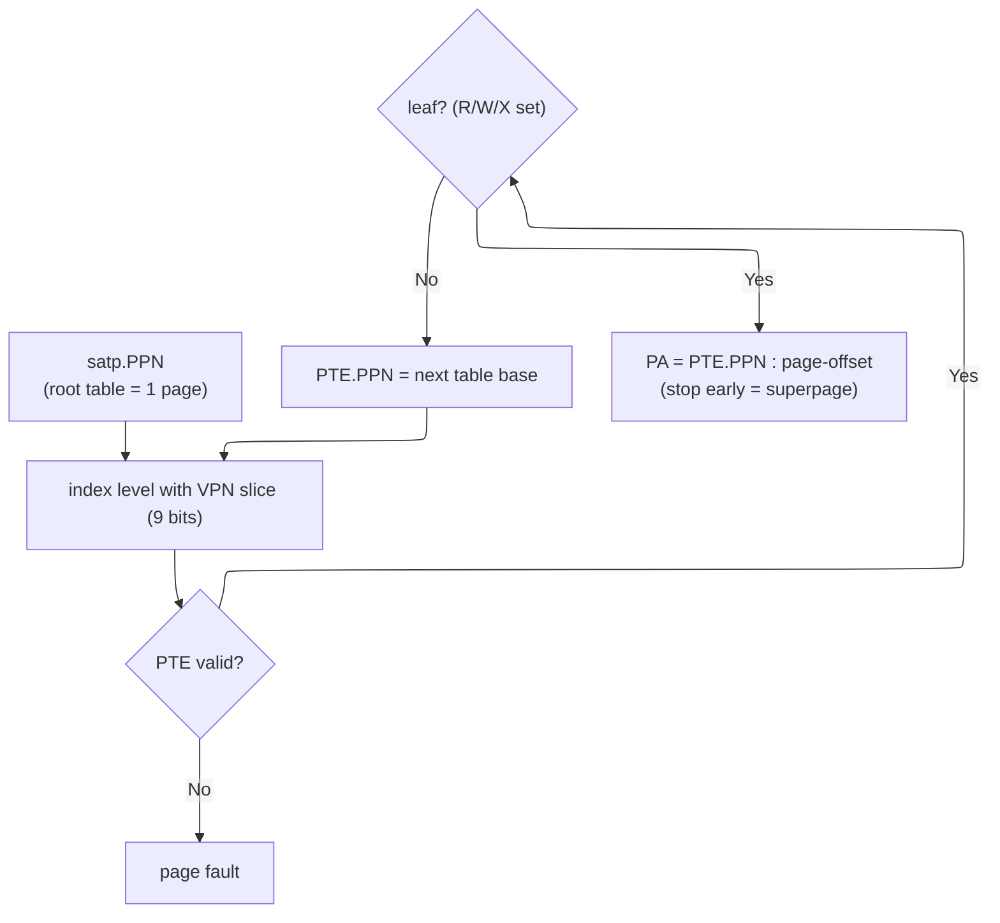

# RISC-V Instruction Set Architecture (ISA) — A Modular Load-Store Contract

> **First-time reader orientation:** An instruction set architecture is the contract between software and hardware: instructions, registers, exceptions, privilege, and memory behavior that programs may rely on. RISC-V is a family of open, modular ISAs. The chapter distinguishes that visible contract from the hidden CPU pipeline that implements it.

> **Abbreviation key — skim now and return as needed:** central processing unit (CPU); graphics processing unit (GPU); neural processing unit (NPU); reduced instruction set computer (RISC); design-space exploration (DSE);
> out-of-order (OoO); translation lookaside buffer (TLB); page-table entry (PTE); virtual page number (VPN); address-space identifier (ASID);
> load-store queue (LSQ); address-generation unit (AGU); arithmetic logic unit (ALU); register file (RF); single instruction, multiple data (SIMD);
> vector register length (VLEN); selected element width (SEW); vector register grouping multiplier (LMUL); content-addressable memory (CAM); virtual address (VA);
> physical address (PA); program counter (PC); operating system (OS); complementary metal-oxide-semiconductor (CMOS); fan-out-of-four (FO4);
> artificial intelligence (AI); floating point (FP); fused multiply-add (FMA); read-modify-write (RMW); exclusive OR (XOR);
> control and status register (CSR); interprocessor interrupt (IPI); initiation interval (II); kilobyte (KB); megabyte (MB);
> gigabyte (GB); kibibyte (KiB); mebibyte (MiB).

> **Prerequisites:** [CPU_Architecture](01_CPU_Architecture.md) (pipelining, decode, hazards), [Logic_Building_Blocks](../../../00_Fundamentals/02_Logic_Building_Blocks.md) (the decoders and datapath these instructions drive).
> **Hands off to:** [OoO_Execution](../03_Out_of_Order_Backend/01_OoO_Execution.md), [TLB_and_Virtual_Memory](../05_Virtual_Memory/01_TLB_and_Virtual_Memory.md), [Cache_Coherence](../06_Coherence_and_Consistency/01_Cache_Coherence.md) (atomics, fences, and the coherence/consistency boundary), [Xiangshan_CPU_Design](../07_Core_Case_Studies/01_Xiangshan_CPU_Design.md).

---

## 0. Why this page exists

An ISA is not a list of instructions; it is the **contract** between everyone who writes software and everyone who builds silicon — the one interface that must stay fixed while both sides evolve independently for decades. The whole art of ISA design is deciding what goes *into* that contract, because **every bit the hardware is obligated to decode is a complexity tax paid on every fetch, forever, by every implementation** — from a 10 kgate microcontroller to a 500-wide-window server core.

RISC-V's thesis is a single sentence: **make the mandatory contract as small as possible, and make everything else optional and orthogonal.** A tiny frozen base plus a set of independently-ratified extensions, so that the decode/area cost a chip pays scales with the features it actually instantiates, and the software ecosystem still has a stable target.

This page derives RISC-V's design *from that thesis* rather than cataloguing encodings. For each major choice — load-store, fixed-width instructions, the compressed extension, the modular M/A/F/D/B extensions, the M-S-U privilege stack with Sv39 virtual memory, the length-agnostic vector extension — we ask the same three questions the rest of this notebook asks of hardware: **what problem does it solve, what does the alternative cost, and why did real silicon land here.** Bit-field layouts, opcode maps, and hex-decode drills are reference material; they live in the spec. What survives here are the ideas a hardware designer must actually hold — with one or two representative encodings kept only where the layout *is* the design argument.

---

## 1. The ISA as a contract: a small base plus orthogonal extensions

An ISA has exactly two jobs, and they pull against each other: expose *enough* capability that software expresses any computation efficiently, and hide *everything* about how the hardware does it so the two sides change independently. More capability written into the contract means more that every implementation must always provide. So the first design question is not "which instructions" but "**how much is mandatory**."

**Two philosophies answer differently.**

- **Monolithic (x86, the CISC (complex-instruction-set computer) lineage).** One ever-growing mandatory ISA. Four decades of accreted instructions, none of which can *ever* be removed because some shipped binary uses it, so the decoder must handle all of it (cracking the rare and complex forms through microcode). The tax is permanent and compounding: every new core re-implements the entire historical surface.
- **Modular (RISC-V).** A minimal **frozen base** the spec guarantees will never change — **RV32I / RV64I, ~40 integer instructions** — plus a set of separately-specified, independently-optional **extensions** (M multiply, A atomics, F/D float, C compressed, V vector, B bitmanip, H hypervisor, …). A chip includes an extension only if its workload pays for the area. The common shorthand **"RV64G"** is just the general-purpose bundle: **I + M + A + F + D + Zicsr + Zifencei**.

Because the base is frozen, a decoder and a toolchain built against it are correct *forever*; because the extensions are orthogonal, the decode cost of a design is **additive and opt-in**:

$$
A_{\text{decode}} \;\propto\; I_{\text{base}} \;+\; \sum_{e\,\in\,\text{included}} I_e \qquad\text{vs. monolithic}\qquad A_{\text{decode}} \;\propto\; I_{\text{all}}\ \text{(always)}
$$

where $I_{\text{base}}$ = base instruction forms, $I_e$ = forms added by extension $e$, $I_{\text{all}}$ = the entire historical set. A control microcontroller implements ~RV32IMC and spends *zero* gates decoding vector or floating-point; a datacenter core adds V and H. Nothing pays for what it does not instantiate.

**The trade is modularity versus fragmentation.** Orthogonal extensions create a combinatorial space of possible feature subsets; if every chip picks its own, software must target the lowest common denominator or ship many builds — the exact fragmentation that hurt early ARM. RISC-V's answer is **profiles**: **RVA23** (2024) mandates a specific extension set (V, bitmanip, crypto, …) that an application-class chip *must* implement, giving compilers and Linux distributions one stable target. The contract is deliberately re-widened at *profile* granularity rather than per-chip — modularity kept from becoming chaos.

| Axis | Monolithic ISA (x86) | Modular ISA (RISC-V) |
|---|---|---|
| Mandatory decode surface | Entire history, always | Small frozen base only |
| Cost of a new capability | Added to the mandatory set forever | An optional extension, opt-in by area |
| Removing a feature | Impossible (binary compat) | Never was mandatory |
| Ecosystem stability | Guaranteed but monolithic | Guaranteed *per profile* |
| Customization | Vendor-controlled | Open + reserved custom opcodes (§7) |

That the base is a *specification and not a licensed product* — no royalty, no NDA'd microarchitecture contract — is what lets academia, startups, and hyperscalers each build compliant cores against the same frozen base (expanded in §7).

---

## 2. Load-store and fixed width: designing the encoding for the decoder

The decoder sits on the critical path of *every* instruction, and its complexity is fixed by the encoding before any clever microarchitecture can help. Two encoding decisions dominate that complexity — **where operands live** and **how instructions are delimited** — and RISC-V makes both in the decoder's favor.

### 2.1 Load-store: memory is touched only by loads and stores

Arithmetic is strictly register-to-register; only explicit load/store instructions reach memory. Derive the consequence: every instruction then has **at most one memory access** and a *fixed, statically-known* set of register operands. So the pipeline has exactly one memory stage, every ALU op has uniform single-cycle latency, and the number of things that can fault or stall per instruction is bounded. For an out-of-order core this is decisive — address generation separates cleanly into the AGU/load-store queue (→ [OoO_Execution](../03_Out_of_Order_Backend/01_OoO_Execution.md) §5), and there is no "add-to-memory" instruction that is simultaneously an ALU op *and* a store with two distinct fault points mid-instruction.

The alternative is CISC memory operands: x86's `add [mem], reg` fuses load + add + store in one instruction — denser code, fewer fetches — but that "instruction" is really three µops the hardware must crack, with an addressing-mode decode and a mid-instruction fault boundary. RISC's bet, vindicated once pipelining and OoO dominate: **regularity is worth more than density, and the lost density is recoverable separately** (§3).

**Quantifying the hazard-logic win.** Interlock and forwarding cost scales with the number of *(source, destination)* operand pairs that can be simultaneously in flight. For an in-order pipeline that forwards results from the $k$ post-execute stages still holding an un-retired value, a machine with at most $s$ source and $d$ destination registers per instruction needs $\Theta(s\,d\,k)$ tag comparators per issue slot — each source compared against each live destination in each forwarding stage (→ [CPU_Architecture](01_CPU_Architecture.md) §2–§3):

$$
N_{\text{cmp}} \;=\; s \cdot d \cdot k \qquad\text{(per issue slot)}
$$

where $s$ = source registers/instruction, $d$ = destinations/instruction, $k$ = forwarding depth (post-execute stages that can source a result). Load-store with orthogonal, fixed-position GPR (general-purpose register) fields pins $s=2$ (`rs1`,`rs2`) and $d=1$ (`rd`); the classic 5-stage pipe forwards from EX/MEM and MEM/WB, so $k=2$ and $N_{\text{cmp}} = 2\times1\times2 = 4$ five-bit tag compares plus two forwarding muxes per ALU input. And because every ALU op has *uniform single-cycle latency*, the only stall the base ISA can generate is the one-cycle **load-use** bubble — a single comparator of `rd` in MEM against the two sources in ID. A CISC memory-operand instruction breaks all three counts at once: `add [mem],reg` sources two address registers (base+index) *and* memory *and* the implicit **flags** register, writes memory *and* flags, and has *variable* latency, so $k$ is no longer a small constant and the fixed comparator array must become a variable-latency scoreboard. The flags register is the sharpest cost: written by nearly every arithmetic instruction and read by every conditional branch, it adds an implicit source+destination on almost every edge of the dependence graph — in an OoO machine, a whole extra rename lane (→ [OoO_Execution](../03_Out_of_Order_Backend/01_OoO_Execution.md) §7). RISC-V's compare-and-branch-on-registers erases that lane entirely: the hazard logic sees only the operands the instruction names.

### 2.2 Fixed 32-bit width: the decoder knows every boundary for free

The deepest cost in a variable-length ISA is *finding where each instruction starts*. In x86 an instruction is **1–15 bytes**, and you cannot decode instruction $i{+}1$ until you know the length of instruction $i$ — a serial dependence that makes wide parallel decode painful (hence length-predecode bits cached alongside the i-cache, and x86 decoders being a notorious power/area sink). Fixed 32-bit width places every boundary at a known 4-byte multiple, so an $N$-wide decoder is simply $N$ identical decoders running in parallel with **zero inter-instruction dependency**. This is *the* reason RISC-V (and AArch64) scale decode width cheaply.

$$
\text{start}(i) \;=\; \sum_{j<i} \ell_j \;\; \text{(variable: serial prefix, or } O(N^2)\text{ speculative predecode)} \qquad\text{vs.}\qquad \text{start}(i) = 4i \;\; \text{(fixed: } O(1)\text{)}
$$

where $\ell_j$ = length of instruction $j$. The fixed-width column is why parallel fetch/decode is a solved problem here and an engineering saga on x86.

**Why the complexity is $O(1)$ vs $O(w)$ — and what it costs in silicon.** Decoding $w$ instructions in one cycle requires knowing all $w$ start offsets $s_0,\dots,s_{w-1}$ *before* the parallel decoders can fire. Fixed width makes each $s_k = 4k$ a **wiring constant**: the offsets are known the instant the fetch group lands, the $w$ decoders are hard-wired to slots $\{0,4,\dots\}$, and the *depth* of the boundary computation is $O(1)$ *independent of $w$* — widening decode just replicates one more identical slice, so decoder count is $O(w)$ at constant frequency. Variable width makes the offsets a **recurrence**

$$
s_{k+1} \;=\; s_k + \ell(s_k),
$$

where the length $\ell(\cdot)$ is itself a function of the bytes at $s_k$ (prefixes, ModRM, SIB (scale-index-base), immediate). You cannot know boundary $k{+}1$ until you have decoded the length at boundary $k$: the boundary computation is a serial chain of depth $O(w)$. Two escapes exist, both taxed. *Predecode* marks $1$–$3$ length bits per byte in the I-cache on fill so fetch reads boundaries instead of computing them — extra I-cache state and an extra front-end pass, still speculative because a branch can land at an unmarked interior byte. *Speculative parallel decode* attempts an instruction at every byte offset in the window and discards the invalid ones — for a $B$-byte window that is $\Theta(B)$ speculative decoders to harvest $w$ real ones, i.e. $\Theta(w\bar\ell)$ hardware for width $w$ at mean length $\bar\ell$. Either way the fixed-width front-end scales *linearly* in area at constant depth; the variable-width one pays super-linear area (or serial depth) for the same width.

*Worked number.* Take a 32-byte fetch window. Fixed 32-bit encoding exposes exactly $32/4 = 8$ candidate instructions at known offsets $\{0,4,\dots,28\}$ — an 8-wide decoder is 8 copies of one slice. The same 32 bytes of x86 hold anywhere from $\lceil 32/15\rceil = 3$ to $32$ instructions (1–15 B each) starting at any of 32 bytes, so without predecode the boundary walk is up to 32 serial length-evaluations. This is why real fixed-width cores reach **8-wide native decode** (Apple Firestorm, 8-wide) as replicated slices, while x86 native decode plateaus around **4–6 wide** (AMD Zen 4, 4-wide; Intel Golden Cove, 6-wide) and leans on a **µop cache** — a second front-end storing already-decoded µops precisely to *bypass* the length-serial legacy decoder on hot loops. That µop cache is the area and power the variable-length boundary problem costs, made visible.

### 2.3 Static register fields and a fixed sign bit: reading before decode finishes

The layout that makes decode cheap is best shown once, then reasoned about — this is the *only* bit-field figure this page keeps, because the placement **is** the design argument:

```text
        31          25 24    20 19    15 14  12 11     7 6      0
R-type: |  funct7     |  rs2   |  rs1   | fn3 |  rd     | opcode |
I-type: |  imm[11:0]           |  rs1   | fn3 |  rd     | opcode |
S-type: | imm[11:5]   |  rs2   |  rs1   | fn3 | imm[4:0]| opcode |
                        ^^^^^^   ^^^^^^         ^^^^^^
                        rs2      rs1            rd   ← always these columns
        ^ imm[31] is the immediate's sign bit in EVERY format that has one
```

Two hardware wins fall out of this:

- **Register specifiers are position-invariant.** `rs1` (bits 19:15), `rs2` (24:20), and `rd` (11:7) sit in the *same columns* in every format that uses them. So the register file read fires from those fixed fields **speculatively, in parallel with opcode decode**, and the result is discarded if the format turns out not to use it — no mux, no wait for decode.
- **The immediate's sign bit is always bit 31.** The immediates *look* scrambled (B- and J-type scatter their bits), but the scramble is deliberate: it pins the sign bit to bit 31 so sign-extension is a single hard-wired fan-out rather than a format-dependent mux, and it moves each immediate bit as little as possible between formats to minimize the immediate-generator's muxing. The encoding optimizes the *machine* that decodes it billions of times per second, at the cost of looking ugly to the human who reads it rarely — exactly the right trade.

**The critical-path derivation.** Model decode-and-operand-fetch as a dependency chain and ask where the register read sits. If register fields were format-dependent, the read address would not be known until the format is — the path is *serial*:

$$
T_{\text{serial}} \;=\; t_{\text{dec}} \;+\; t_{\text{mux}} \;+\; t_{\text{RF}},
$$

decode the opcode ($t_{\text{dec}}$) to learn the format, mux the right bits into the register ports ($t_{\text{mux}}$), *then* read the file ($t_{\text{RF}}$). Fixing `rs1`/`rs2`/`rd` at constant positions removes the first two terms from the read's dependency: the raw instruction bits *are* the read address, so the register file — a multiported RAM, one of the slowest structures in the front end — begins accessing at $t=0$ in parallel with opcode decode, and the sign bit at constant position 31 lets sign-extension fan out at $t=0$ as well. The path becomes *parallel*:

$$
T_{\text{parallel}} \;=\; \max\!\big(t_{\text{dec}},\; t_{\text{RF}},\; t_{\text{immgen}}\big) \;+\; t_{\text{sel}},
$$

where $t_{\text{immgen}}$ = immediate-assembly delay, $t_{\text{sel}}$ = final operand-select mux. The saving is $\approx \min(t_{\text{dec}}, t_{\text{RF}})$: the shorter of decode and register-read is now hidden under the longer instead of summed onto it. *Worked number* (illustrative FO4-scale delays for a modern node): $t_{\text{dec}}\approx150$ ps, $t_{\text{RF}}\approx350$ ps, $t_{\text{mux}}\approx50$ ps, $t_{\text{immgen}}\approx120$ ps, $t_{\text{sel}}\approx50$ ps. Serial $=150+50+350=550$ ps; parallel $=\max(150,350,120)+50=400$ ps — a **~27% shorter operand-fetch path**, routinely the difference between fitting the read in one pipe stage and spilling into a second.

**The one cost: an immediate-scramble mux.** Because the immediate bits sit in different columns per format (I/S/B/U/J), assembling the final immediate needs a per-output-bit mux selecting among the formats' sources for that bit. The scramble is designed to *minimize* this: each immediate bit moves as little as possible between formats, so most output bits have only 1–2 possible sources and the immediate generator is a single shallow layer of 2:1–5:1 muxes (~32 bits wide, 2–3 gate delays). It sits on the $t_{\text{immgen}}$ leg — off the register-read critical path and *overlapped* with it — so the ugly-looking encoding buys a faster machine at the price of a cheap mux the human never sees. That is the whole ISA in microcosm: optimize the hardware that runs billions of times per second, not the encoding a human reads once.

Two more base-ISA choices earn their keep by simplifying the very cores later pages build:

- **No condition-code register.** Compare-and-branch instructions test registers directly; there is no global flags register. A flags register is a hidden serializing dependency that *every* arithmetic instruction writes and *every* branch reads — a rename and hazard headache in an OoO machine. RISC-V has none, so a branch depends only on the explicit registers it names.
- **`x0` hardwired to zero.** Reads yield 0, writes are discarded. This one choice synthesizes NOP (`addi x0,x0,0`), register move (`add rd,x0,rs`), value-discard, and unconditional-compare idioms *for free*, so no dedicated opcodes are spent on them — a trivial encoding investment that pays across the whole instruction set.

---

## 3. The compressed (C) extension: buying code density back as an option

Fixed width's one real cost is **code density**: RV64I code is roughly 20–30% larger than a variable-length encoding's, and code size is not vanity — it sets i-cache footprint, fetch bandwidth, and, in embedded parts, ROM cost. The C extension recovers most of it *without* surrendering the §2 decode simplicity.

**Mechanism.** C defines 16-bit encodings for the most common instructions, each of which is a pure **alias that expands to exactly one 32-bit base instruction** at fetch. A small fixed decompressor sits in front of the normal decoder; everything downstream — rename, the OoO core — still sees only base instructions. There is no new datapath and, crucially, no second execution *mode*.

**What C actually costs.** Instructions may now begin on any **2-byte** boundary, so a 4-byte instruction can straddle a fetch group, cache line, or page. That reintroduces an alignment problem — but a *bounded* one: **two** possible alignments, not the fifteen of x86. Fetch absorbs it with a small alignment buffer rather than a predecode CAM. This is the subtle payoff of having chosen fixed width first: adding density costs only a *small* alignment complication, whereas a natively variable-length ISA pays the full boundary-finding cost on every instruction.

**Why the win is ~25–30%, not 50%.** Model static size as the mean bytes per instruction:

$$
\bar{B} \;=\; 2 f_c + 4(1 - f_c), \qquad \text{shrink} \;=\; 1 - \frac{\bar{B}}{4} \;=\; \frac{f_c}{2}
$$

where $f_c$ = fraction of static instructions that have a 16-bit form. Typical integer code gives $f_c \approx 0.5\text{–}0.6 \Rightarrow$ **25–30% smaller**, matching measurement. The 50% ceiling is reached only if *every* instruction compresses ($f_c = 1$), which it cannot: not all instructions have a 16-bit form, the compressed forms can name only the 8 registers **x8–x15** (3-bit specifiers), and their immediates are narrow — the exact corners cut to fit 16 bits.

**Why $f_c$ is large — the coverage argument.** That $f_c$ lands near $0.5$–$0.6$ is not luck; it follows from the extreme skew of static instruction frequency. Instruction usage is Zipf-like: a *small set of forms* — load, store, `addi`, `add`/`mv`, compare-branch, `jal`/`jalr` — accounts for a *large majority of instances*, in both the static image and the dynamic stream. Those same high-frequency instructions carry little information, which is exactly why 16 bits suffice for them: the compiler's hot working set fits in a handful of registers (a 3-bit specifier over `x8`–`x15` covers most operands), their immediates are small (stack and struct offsets), and the two-address idiom `rd == rs1` is common (one field names both). An instruction whose *entropy* is well under 16 bits can be given a short code with no loss — a Huffman argument. C is precisely the short-code book for the head of that distribution, so its coverage $f_c$ is the mass of the head: measured near $0.5$–$0.6$ of static instructions in integer code, hence the $25$–$30\%$ shrink. The remaining ~40–50% are the tail — instructions needing the full register set, wide immediates, or rare opcodes — which keep their 32-bit form and cap the win below the $f_c=1$, 50% ceiling.

**The fetch-bandwidth win is often the real motive.** A cache line holds twice as many compressed instructions (a 32-byte line: **16 vs 8**) — up to ~2× effective i-cache reach and front-end throughput on compressed-heavy code. Quantitatively, mean size $\bar B = 4 - 2f_c$ bytes means a fixed byte-wide fetch port delivers $4/\bar B = 1/(1 - f_c/2)$ *more instructions per cycle*, and a fixed-capacity I-cache holds the same factor more code. At $f_c = 0.6$, $\bar B = 2.8$ B, so front-end instruction bandwidth and effective I-cache reach both rise by $4/2.8 \approx 1.43\times$ — a 32 KB I-cache that held $8192$ base instructions now holds $\approx 11{,}700$; the pure-16-bit $\bar B \to 2$ is the $2\times$ ceiling. That front-end-throughput and I-cache-reach gain, not static size, is why a *performance* core (not just an embedded one) includes C. And unlike ARM Thumb — a *mode* you branch into and out of, with a state bit and switch cost — RVC interleaves 16- and 32-bit instructions freely in one stream, the cleaner realization of the same idea.

---

## 4. The modular extensions: capability paid for in area, not mandatory complexity

Each standard extension is a self-contained capability an integrator switches on at design time when the workload justifies its area and power; because they are orthogonal, their decode cost is additive (§1). Read each below as **problem → what the hardware pays → the load-bearing design decision** — not as an instruction catalogue.

| Ext. | Problem it solves | What the hardware pays | The design decision worth remembering |
|---|---|---|---|
| **M** | integer `* / %` | a 64×64 multiplier tree + a slow SRT divider | divide edge cases are **defined and non-trapping** |
| **A** | multicore atomicity | RMW datapath + reservation tracking | ordering **self-annotated** per atomic (`aq`/`rl`) |
| **F/D** | IEEE-754 float | a separate FP datapath + register file | **FMA is a primitive** (single rounding); separate namespace |
| **B** | hot bit/byte ops | almost none (a popcount tree, the shifter's rotate) | accelerate what's hot for near-zero gates |

### 4.1 M — multiply/divide

Optional because the *hardware* is expensive and workload-dependent: a 64×64 multiplier is a large Booth/Wallace tree and divide is a slow digit-recurrence (both in [Adders_and_Multipliers](../../../00_Fundamentals/03_Adders_and_Multipliers.md)); a deeply embedded control core that never multiplies should pay for neither. The one design choice to carry forward: **divide edge cases are defined and do not trap** — divide-by-zero returns an all-ones quotient with the dividend as remainder, and signed overflow ($-2^{63}/-1$) returns $-2^{63}$. This keeps the divider entirely *off the exception path*, so an OoO core never has to take a precise trap out of the middle of a divide — the recovery logic (→ [OoO_Execution](../03_Out_of_Order_Backend/01_OoO_Execution.md) §9) is simpler for it. The concept (define the corners so they can't fault), not the special-case table, is the point.

### 4.2 A — atomics

Multicore needs atomic read-modify-write that no sequence of plain loads and stores can synthesize race-free. RISC-V provides **two** mechanisms because they cover different needs:

- **AMO** (atomic memory operation) — one instruction performs load-op-store atomically (swap/add/and/or/min/max). Efficient for the common fetch-and-op and for atomics executed *near memory*.
- **LR/SC** (load-reserved / store-conditional) — a reservation-based pair that lets software build *arbitrary* atomic sequences (compare-and-swap, multi-word updates) the fixed AMO menu cannot express; SC fails if anyone disturbed the reservation between the two, the classic lock-free retry primitive.

The load-bearing idea is the **`aq`/`rl` (acquire/release) bits** every atomic carries. Instead of a separate fence around each atomic, RISC-V's memory model (RVWMO (RISC-V weak memory ordering), a release-consistency model) lets each atomic *self-annotate* its ordering:

| `aq` | `rl` | Meaning |
|---|---|---|
| 0 | 0 | relaxed — no ordering |
| 1 | 0 | **acquire** — later accesses can't rise above it |
| 0 | 1 | **release** — earlier accesses can't sink below it |
| 1 | 1 | sequentially-consistent point |

Reservations are tracked at cache-line granularity, so an unrelated store to the same line can cause a *spurious* SC failure — which is why the spec guarantees forward progress for a tight LR/SC loop rather than guaranteeing any single SC succeeds.

### 4.3 F / D — floating point

IEEE-754 single (F) and double (D), optional because FP is a large, separable datapath many workloads never touch. Three decisions matter:

- **A separate `f0`–`f31` register file.** FP is a distinct namespace, so it neither steals integer register ports and bandwidth nor forces integer-only chips to carry FP state — and an OoO core renames it in its own physical pool (→ [OoO_Execution](../03_Out_of_Order_Backend/01_OoO_Execution.md) §7).
- **FMA is a primitive**, computing `a*b + c` with a *single* rounding. Not two instructions, because the fused form both halves the rounding error and is the throughput core of every dense-linear-algebra kernel; making it one instruction with one rounding is an ISA-level correctness *and* performance decision (circuit in [Floating_Point](../../../00_Fundamentals/04_Floating_Point.md)).
- **Compares write an integer register; the rounding mode is dynamic** (`fcsr.frm`) or static per instruction. The full FCVT conversion matrix — every int/uint × 32/64 × single/double corner — exists so software never needs a library cast; *that it is complete* is the point, not its rows.

### 4.4 B — bitmanip, the archetype of "accelerate what's hot for almost nothing"

Population-count, count-leading/trailing-zeros, rotates, byte-reverse, single-bit ops, and carry-less multiply are **one cycle in hardware but 10–15 instructions in software**, and they are pervasive — cryptography, hashing, codecs, bioinformatics, and the compiler's own idioms. *Worked instance:* a branch-free 64-bit population count is the classic 5-step SWAR (SIMD-within-a-register) reduction — mask-and-add with the constants `0x5555…`, `0x3333…`, `0x0F0F…`, then a multiply-and-shift horizontal sum — about **12 instructions**; `cpop` is **one**. Count-leading-zeros without hardware is a ~6-step binary search or a de-Bruijn multiply plus a table load; `clz` is one. The 10–15× the extension collapses is exactly this, paid per hot inner-loop iteration. Representative of the whole extension: `cpop` (population count), `clz`/`ctz` (leading/trailing zeros), `ror` (rotate), and `clmul` (carry-less multiply). Each is tiny area you often *already have* (a popcount tree; the barrel shifter's rotate path) for order-of-magnitude speedups — `clmul` alone turns table-driven CRC-32 (~8 loads + XORs per word) into a couple of instructions and is the primitive behind GCM/GHASH.

B is the modular thesis at its purest: a capability nearly free in gates, enormous for the workloads that need it, and pure dead-weight-free *omission* for those that don't.

---

## 5. Privilege and virtual memory: the mechanism system software needs

An operating system and a hypervisor need three things from the ISA that user code cannot build for itself, and the entire privileged architecture is the minimal machinery that provides exactly them:

1. a **protection boundary** — supervisory code the supervised code cannot bypass;
2. a **controlled crossing** of that boundary — traps that are precise and resumable;
3. **address translation with protection** — per-process virtual address spaces.

The M/S/U modes, the trap machinery, and Sv39 all derive from these three needs.

### 5.1 Three privilege modes, derived

- **U (user)** — applications; no access to system state.
- **S (supervisor)** — the OS kernel; owns virtual memory (`satp`) and handles the traps delegated to it.
- **M (machine)** — always present; owns the raw hardware (firmware, the SBI (supervisor binary interface), a security monitor). The mode that exists *below* the OS.

Why this layering and not two: U/S is the classic user/kernel split every OS needs. **M exists beneath S** so that firmware and a security monitor are isolated from the kernel itself — you can run (and decline to fully trust) an S-mode OS while M-mode retains ultimate control, which is exactly what secure boot, a TEE (trusted execution environment), or a hypervisor-below-the-OS requires. A minimal embedded chip implements **M-only or M+U** and simply omits S — and with it virtual memory — the same opt-in-by-area principle as the extensions. A mode can access only its own and lower CSRs (control and status register), and the CSR *address ranges* encode the level (**U 0x000–0x0FF, S 0x100–0x1FF, M 0x300–0x3FF**) — the memorizable pattern; individual addresses are lookup.

**The isolation property, derived to its minimal mechanism.** Isolation means code at privilege $p$ can neither observe nor modify state owned by any $q>p$, and can raise its own privilege only through a controlled entry. The *minimal* hardware enforcing exactly this is surprisingly small. (1) A current-privilege register of **2 bits**, writable by no ordinary instruction — the only things that change it are a trap (up) and an `xRET` (down). (2) One **comparator** gating every privileged action: a CSR access or privileged instruction checks the target's encoded level (the address-range bits above) against the current 2 bits, and a shortfall raises illegal-instruction — a strong confidentiality/integrity guarantee for the cost of a 2-bit compare per privileged access, near-zero gates. (3) Memory reach is bounded by translation (S-mode owns `satp`) and by **PMP** (M-mode physical memory protection) for the untranslated modes, so even the physical addresses a lower mode may touch are enumerated by a higher one. The result is a **lattice** $U \sqsubseteq S \sqsubseteq M$: each level's trusted base excludes only the levels above it, the relation is monotone, and the single upward edge is the trap, which *atomically* sets mode := target and PC := `tvec`. No instruction lets software elevate itself arbitrarily — `ecall` *requests* a service across the boundary, it does not grant privilege — which is the property secure boot and a TEE stand on.

### 5.2 Traps: the controlled crossing, and why delegation exists

A trap — exception or interrupt — is the only upward control transfer. To be **precise and resumable**, the hardware must atomically save exactly the state needed to name the fault, dispatch the handler, and return as if nothing happened. Derive that state rather than memorizing an address table: on trap entry the hardware records the **restart PC** (`*epc`), the **cause** (`*cause`), a **fault value** such as the bad address (`*tval`), consults **where to jump** (`*tvec`), and stacks the **pre-trap interrupt-enable and privilege** into `*status` for `MRET`/`SRET` to restore. That is the minimal ledger for a clean trap; the *pipeline* mechanism that makes exceptions precise is the reorder buffer's job (→ [OoO_Execution](../03_Out_of_Order_Backend/01_OoO_Execution.md) §9).

The load-bearing design idea is **delegation** (`medeleg`/`mideleg`). Without it, every page fault and system call from a U/S-mode OS would trap into M-mode firmware and be reflected back down — a round-trip on the hottest control paths. Delegation lets M-mode hand entire classes of trap (page faults, `ecall`s) *directly* to S-mode, so the kernel services its own faults with no firmware detour. It is a pure virtualization-performance win the layered model makes possible.

**Interrupt sources** are standardized as two memory-mapped controllers (not CSRs, so they live outside the core and scale with the platform): the per-hart (hardware thread) **CLINT** (core-local interruptor) for timer (`mtime`/`mtimecmp`) and software (inter-processor) interrupts, and the **PLIC** (platform-level interrupt controller), which routes external device interrupts by priority through a claim/complete handshake. That shape is the load-bearing fact; the register maps and initialization sequences are board reference.

### 5.3 Virtual memory: a radix page table sized to the page

The OS needs per-process address spaces with page-granular protection. RISC-V uses a **radix (multi-level) page table** walked by hardware. Radix rather than hashed/inverted because the walk is a short, deterministic loop of dependent PTE (page-table entry) fetches; a sparse address space costs only the levels it actually uses; and **superpages fall out for free** by stopping the walk early at an aligned level — a hashed table would need collision handling in hardware, whereas radix needs only an adder and a memory read per level.

The elegant invariant worth carrying: each level indexes exactly **512 = 2⁹** entries, because a 4 KB page holds 512 eight-byte PTEs — so **every page table is itself exactly one page.** That single fact fixes the whole geometry:

$$
\text{VA}_{\text{bits}} \;=\; 12 + 9L
$$

where 12 = page-offset bits, 9 = VPN (virtual page number) index bits per level, $L$ = levels. $L=3 \Rightarrow$ **Sv39** (39-bit VA, 512 GB reach), $L=4 \Rightarrow$ **Sv48**, $L=5 \Rightarrow$ **Sv57**. You buy one more level of reach at the cost of **one more dependent memory access per walk** — the reach-vs-latency knee the TLB exists to hide (→ [TLB_and_Virtual_Memory](../05_Virtual_Memory/01_TLB_and_Virtual_Memory.md)).



The walk is the concept: `satp.PPN` names the root page; index it by the top VPN slice; follow non-leaf PTEs down; a leaf gives the physical page. The leaf PTE's *role* bits are what the OS relies on — **R/W/X/U** for protection, and **A/D (accessed/dirty)**, which hardware sets to give the OS its hooks for page replacement and copy-on-write. A superpage is simply a leaf found one level early (in Sv39 the root is level 2, so a 2 MB leaf sits at **level 1** and requires the low PPN (physical page number) bits `PPN[0]` to be zero — natural alignment; a 1 GB leaf sits at level 2 and needs `PPN[1:0]=0`). **ASID** tags each translation with an address-space ID so a context switch needn't flush the whole TLB. The exact PTE bit positions and a hex walk are spec reference; the invariant and the reach/latency law above are what a designer reasons with.

### 5.4 The hypervisor (H) extension: virtualization as recursion of the same mechanism

A hypervisor must virtualize the very mechanism §5.3 defines, so H adds a **second stage** of translation: guest virtual → guest physical (stage 1, the guest's own tables under `vsatp`) → host physical (stage 2, the hypervisor's tables under `hgatp`), with a **VMID** tagging stage-2 translations the way ASID tags stage-1.

The cost is the deepening the original framing missed: the two-stage walk is **not additive but multiplicative**, because every guest-physical address touched *during* the stage-1 walk must itself be translated by a full stage-2 walk. For $L$-level tables in both dimensions the worst case is

$$
N_{\text{access}} \;\le\; (L+1)^2 - 1
$$

which counts the walk as an $(L{+}1)\times(L{+}1)$ grid: the stage-1 walk makes $L{+}1$ "stops" — $L$ guest-PTE fetches plus the final guest-physical data address — and each stop's guest-physical address needs a full $L$-level stage-2 walk before the guest-side reference it gates can issue, i.e. an $(L{+}1)$-reference host translation per stop; less the one grid corner that is the register-held root pointer (no memory access). So it is up to **15** memory accesses for Sv39 two-stage ($L=3$: $4^2-1$), and the well-known **24** for x86's 4-level nested paging ($L=4$: $5^2-1$), versus **3** for a native Sv39 walk. This quadratic blow-up is precisely *why* nested TLBs and page-walk caches are mandatory for acceptable virtualization performance — not the "3 + 3 = 6" an additive intuition suggests.

---

## 6. The vector (V) extension: length-agnostic as a portability contract

Fixed-width SIMD's original sin is that the vector width lives *in the opcode*. Every widening — SSE (128) → AVX (256) → AVX-512, or NEON (128) → a new width — is a **new instruction set** software must be recompiled and re-encoded for, and yesterday's binary cannot use tomorrow's wider datapath. RISC-V V makes the vector length a **runtime quantity the program asks for**, so one binary runs on any hardware VLEN.

**The mechanism that makes portability work** (the concept, not the encodings):

- `vsetvli` tells the hardware "I have this many elements left; how many can you do?" and the hardware answers with `vl = min(requested, VLMAX)`, where

$$
\text{VLMAX} \;=\; \frac{\text{LMUL}\times \text{VLEN}}{\text{SEW}}
$$

with **VLEN** = hardware vector-register width (the implementation's free choice), **SEW** = element width (set at runtime), **LMUL** = how many registers to gang into one logical vector.
- The **stripmine loop** processes `vl` elements per iteration and re-asks; the final short iteration runs the *same code* with a smaller `vl` — **no scalar epilogue, no tail predication.** That is the whole trick: the program never names a width, so the iteration count $\lceil N/\text{VLMAX}\rceil$ scales with the hardware while **source and binary never change.**
- **`v0` doubles as the mask register** — per-element predication that turns data-dependent control flow (`if (a[i] > 0) …`) into branch-free masked vector ops. LMUL (and fractional LMUL) let software trade register count against vector length and mix element widths in one loop.

**Strip-mining, derived.** Let a loop process $N$ elements. Fixed-width SIMD hard-codes the width $W$ into the code: $\lfloor N/W\rfloor$ full vector iterations plus a **scalar epilogue** for the $N \bmod W$ tail (or a masked remainder), with the constant $W$ baked into the binary. RVV instead makes each iteration *ask*:

```text
    mv      a0, N            # a0 = elements remaining (AVL)
loop:
    vsetvli t0, a0, e32, m1  # t0 = vl = min(a0, VLMAX)
    vle32.v v0, (src)        # load vl elements
    # ... vector work on v0 ...
    vse32.v v0, (dst)        # store vl results
    sub     a0, a0, t0       # remaining -= vl
    # ... advance src/dst by vl*4 bytes ...
    bnez    a0, loop
```

Two invariants make this correct and portable. First, `vsetvli` returns $vl = \min(\text{AVL}, \text{VLMAX})$, so the body always operates on exactly the elements that exist: the final iteration simply receives a smaller $vl$ and runs the **same instructions** — no epilogue, no tail mask. Iteration count is $\lceil N/\text{VLMAX}\rceil$. Second — the portability proof — correctness never depends on the *value* of VLMAX, only on the identity $vl \le \text{VLMAX}$ that `vsetvli` guarantees on every implementation. A VLEN-128 phone and a VLEN-1024 server run the **identical bytes**; the wider machine reports a larger VLMAX, gets a larger $vl$, and loops fewer times. Contrast the fixed-width failure modes: an AVX-512 binary raises illegal-instruction on an AVX2-only part (width in the opcode), and an AVX2 binary leaves half of an AVX-512 datapath idle forever. VLA has neither, because the width is a *runtime answer*, not an *encoded constant*.

**Throughput, derived, with the lane/VLEN split.** Separate the *architectural* vector length from the *physical* execution width. A vector register holds $\text{VLEN}/\text{SEW}$ elements at LMUL=1; the datapath has $L$ physical **lanes**, each retiring one SEW-wide result per cycle. A $vl$-element op therefore takes $\lceil vl/L\rceil$ cycles, and steady-state element throughput is

$$
\text{elem/cycle} \;=\; \min\!\Big(\frac{\text{VLEN}}{\text{SEW}},\; L\Big) \qquad (\text{LMUL}=1),
$$

the two caps being *how many elements a register can present* ($\text{VLEN}/\text{SEW}$) and *how many the pipes can consume* ($L$). If $L \ge \text{VLEN}/\text{SEW}$ the whole register drains in one cycle (register-size bound); if $L < \text{VLEN}/\text{SEW}$ the op streams over several cycles at $L$/cycle (lane bound). LMUL groups $m$ registers into one logical vector, so an op spans $m\cdot\text{VLEN}/\text{SEW}$ elements in $\lceil m\cdot\text{VLEN}/\text{SEW} / L\rceil$ cycles — the same $L$/cycle steady state, but per-instruction overhead (the `vsetvli`, the loop branch) amortizes over $m\times$ more elements and the trip count $\lceil N/(m\cdot\text{VLEN}/\text{SEW})\rceil$ falls $m\times$.

*Worked number.* VLEN = 256, SEW = 32 $\Rightarrow \text{VLEN}/\text{SEW} = 8$ elements/register (LMUL=1). Machine A with $L=8$ lanes does $\min(8,8)=8$ elem/cycle — a full vector op per cycle. Machine B with $L=2$ lanes (cheaper silicon) does $\min(8,2)=2$ elem/cycle — the *same* op in $\lceil 8/2\rceil = 4$ cycles. Same binary, VLMAX $=8$ on both; A has 4× the throughput of B with **no ISA change** — VLEN and lane count are the implementer's private throughput dials. Now process $N=1003$ elements: at LMUL=1 (VLMAX=8) the loop runs $\lceil 1003/8\rceil = 126$ iterations, the last with $vl = 1003 - 125\cdot 8 = 3$, handled by the identical body. Switch to LMUL=4: VLMAX $= 4\cdot 256/32 = 32$, the loop runs $\lceil 1003/32\rceil = 32$ iterations (last $vl=11$) — 4× fewer `vsetvli`/branch pairs, registers ganged into 8 groups of 4, at the cost of only 8 independently-named vector registers.

**The trade against fixed-width SIMD.** VLA wins on **portability** (one binary from a VLEN-128 phone to a VLEN-1024+ datacenter part), **code size** (no per-width intrinsics, no epilogue), and **forward compatibility** (a profile mandates V once and hardware widens freely). Fixed-width wins on **hardware simplicity** — a known-width datapath needs no `vl` plumbing or partial-vector tail logic — and can be marginally easier to peak on a fixed size. For new, portable, AI/DSP-heavy designs the industry has taken the VLA side. The implementer's bonus: because software is width-agnostic, **VLEN is a free throughput dial** — add lanes to raise throughput with no ISA change. Real cores: Alibaba **Xuantie C910/C920** (open-sourced OoO RV64GCV, VLEN=256), **SiFive P870** (VLEN=256, 4 lanes, RVA23), **Ventana Veyron** (8-wide OoO server). The vector register file is $32 \times \text{VLEN}$ bits (1–2 KB at VLEN 256–512), and chaining hides producer→consumer latency — the sizing facts worth keeping.

**Ecosystem tie-back.** RVA23 makes V **mandatory** to break the chicken-and-egg: software won't vectorize for a feature that might be absent, so the profile guarantees it and the whole toolchain (LLVM, glibc, the Android runtime) can assume it — §1's modularity-vs-fragmentation trade resolved at profile granularity.

---

## 7. Why RISC-V matters for hardware design

Two properties make RISC-V the default substrate for new hardware, and both follow from the §1 thesis.

**Extensibility — the ISA is built to be extended at the leaf.** The encoding permanently reserves *custom* opcode space (custom-0/1/2/3), so a designer can bolt domain-specific instructions onto a compliant core without forking the base or breaking the toolchain. This is the accelerator story: **Tenstorrent** uses small RISC-V cores as the control plane beside Tensix matrix engines; **Esperanto** placed 1000+ RV64 cores on one inference die; **Alibaba Xuantie** adds custom matrix/int8 extensions over the standard base. The frozen base guarantees the OS, compiler, and debugger keep working; the custom leaf accelerates the hot kernel. The alternative is a fixed proprietary ISA you cannot extend without the vendor's cooperation.

**Open — the contract is a specification, not a product.** No per-core royalty and no NDA'd microarchitecture contract means academia, startups, and hyperscalers can each build compliant silicon against the *same frozen base* and share *one* software ecosystem. That is why RISC-V is simultaneously the teaching and research default — you can read, modify, and tape out a complete core ([Xiangshan_CPU_Design](../07_Core_Case_Studies/01_Xiangshan_CPU_Design.md)) — and, increasingly, the control-plane ISA inside GPUs, NICs, SSDs, and NPUs ([NPU_Accelerators](../../03_NPU_Architecture/01_Compute_Dataflows/01_NPU_Accelerators.md)).

**The lesson that ties the page together: RISC-V is a study in the discipline of subtraction.** A good ISA is defined as much by what it refuses to make mandatory as by what it includes, because every mandate is a permanent, compounding hardware tax. Load-store, fixed-width encoding, static register fields, the modular extensions, the layered privilege stack, and the length-agnostic vector model are the *same bet placed six times*: keep the mandatory core minimal and trivially decodable, and make every added capability optional, orthogonal, and composable. That bet is why one ISA now spans a 10 kgate microcontroller and a 500-wide-window server core.

---

## Numbers to memorize

| Quantity | Value | Why it matters (section) |
|---|---|---|
| Integer / FP / vector registers | 32 / 32 / 32 | fixed namespaces; `x0` = hardwired zero (§2.3) |
| XLEN | 32 / 64 / 128 | register + address width (RV32/64/128) |
| Base ISA size | ~40 instructions, **frozen** | small mandatory contract (§1) |
| RV64G | I + M + A + F + D + Zicsr + Zifencei | the general-purpose bundle (§1) |
| Base / compressed instruction length | 32 / 16 bits | fixed-width decode vs C density (§2.2, §3) |
| Boundary-find cost | $O(1)$ fixed vs $O(w)$ variable | parallel decode as replicated slices (§2.2) |
| Native decode width | ~8-wide RISC vs 4–6 x86 + µop cache | fixed-width scaling (§2.2) |
| RVC static code shrink | 25–30% | $f_c/2$, $f_c\!\approx\!0.5$–0.6 (§3) |
| RVC fetch / I-cache-reach gain | $1/(1-f_c/2)\approx 1.43\times$ at $f_c=0.6$ | front-end bandwidth (§3) |
| Static field positions | rs1 = 19:15, rs2 = 24:20, rd = 11:7 | speculative register read (§2.3) |
| Immediate sign bit | always bit 31 | single-wire sign-extend (§2.3) |
| Operand-fetch path win | RF read ∥ decode → ~27% shorter | fixed reg/sign positions (§2.3) |
| Base hazard logic | $s{\cdot}d{\cdot}k = 2{\cdot}1{\cdot}2 = 4$ compares, 1 load-use bubble | orthogonal load-store, no flags (§2.1) |
| I-type / U-type immediate | 12 / 20 bits | reach of immediate forms |
| Branch / jump range | ±4 KiB / ±1 MiB | B-type / J-type offset (×2) |
| Atomic ordering combinations | 4 (`aq`,`rl`) | release-consistency memory model (§4.2) |
| Privilege modes | U=0, S=1, M=3; **2 = reserved** | protection layering (§5.1) |
| Hypervisor modes | HS = S+H (V=0); VS/VU add V-bit, *not* a level 2 | virtualization (§5.4) |
| Privilege encodings | U=00, S=01, M=11 | 2-bit mode field (§5.1) |
| CSR address ranges | U 0x000 / S 0x100 / M 0x300 | level encoded in address (§5.1) |
| Key CSRs | mstatus 0x300, mtvec 0x305, mepc 0x341, satp 0x180 | trap + translation control (§5.2–5.3) |
| Page size / PTE size | 4 KB / 8 bytes | 512 PTEs = exactly one page (§5.3) |
| PTEs per table / VPN bits per level | 512 / 9 | the $2^9$ invariant (§5.3) |
| Page-offset bits | 12 | $\text{VA}_{\text{bits}} = 12 + 9L$ (§5.3) |
| Sv39 / Sv48 / Sv57 | 39-bit ÷3 lvl / 48 ÷4 / 57 ÷5 | reach vs walk latency (§5.3) |
| Sv39 physical address | 56 bits | leaf PPN width |
| Superpage sizes | 2 MB, 1 GB | leaf found one/two levels early (§5.3) |
| ASID / VMID | 16 / 14 bits | TLB tagging, no full flush (§5.3–5.4) |
| Two-stage walk worst case | $(L{+}1)^2\!-\!1$ → 15 (Sv39), 24 (x86 L4) | nested-paging is multiplicative (§5.4) |
| Vector registers / VLEN | 32 / ≥128 (128–1024+) | VLEN is a free throughput dial (§6) |
| SEW / LMUL | 8/16/32/64 / 1–8 (+1/2–1/8) | VLMAX = LMUL·VLEN/SEW (§6) |
| Vector throughput | $\min(\text{VLEN}/\text{SEW},\ \text{lanes})$ elem/cyc | register-size vs lane bound (§6) |
| Strip-mine trip count | $\lceil N/\text{VLMAX}\rceil$, tail = same code | VLA portability, no epilogue (§6) |
| Vector mask register | `v0` | per-element predication (§6) |
| CLINT / PLIC base (typical) | 0x0200_0000 / 0x0C00_0000 | timer+IPI / external IRQ routing (§5.2) |
| PLIC sources / priorities | ≤1023 / 0–7 | external interrupt scaling (§5.2) |

---

## Cross-references

- **Down the stack (what these instructions are built from):** [Logic_Building_Blocks](../../../00_Fundamentals/02_Logic_Building_Blocks.md) (the decoders and ALU the encoding drives), [Adders_and_Multipliers](../../../00_Fundamentals/03_Adders_and_Multipliers.md) (the M-extension multiplier tree and SRT divider), [Floating_Point](../../../00_Fundamentals/04_Floating_Point.md) (the F/D datapath and FMA), [CMOS_Fundamentals](../../../00_Fundamentals/01_CMOS_Fundamentals.md) (the gates decode and CSR logic are built from).
- **Up the stack (what builds on this contract):** [OoO_Execution](../03_Out_of_Order_Backend/01_OoO_Execution.md) (renames this register namespace, exploits load-store for the LSQ, and implements the precise-trap model of §5.2), [Cache_Microarchitecture](../04_Cache_Hierarchy/01_Cache_Microarchitecture.md) & [TLB_and_Virtual_Memory](../05_Virtual_Memory/01_TLB_and_Virtual_Memory.md) (the caches and TLB that hold the Sv39 walk this page specifies), [Cache_Coherence](../06_Coherence_and_Consistency/01_Cache_Coherence.md) (where AMOs, fences, and RVWMO meet coherent hardware), [Branch_Prediction_Deep_Dive](../02_Frontend_and_Prediction/01_Branch_Prediction_Deep_Dive.md) (predicts the flags-free branches of §2.3), [Xiangshan_CPU_Design](../07_Core_Case_Studies/01_Xiangshan_CPU_Design.md) (a complete open RV64GC core), [NPU_Accelerators](../../03_NPU_Architecture/01_Compute_Dataflows/01_NPU_Accelerators.md) & [GPU_Architecture](../../02_GPU_Architecture/01_Core_Architecture/01_GPU_Architecture.md) (where the V and custom extensions of §6–§7 land).
- **Adjacent / prerequisite:** [CPU_Architecture](01_CPU_Architecture.md) (the in-order pipeline that decodes and executes these — §2–§3 there own the hazard-comparator and forwarding logic that §2.1's load-store orthogonality simplifies), [Performance_Modeling_and_DSE](../../05_Architecture_Foundations_and_Methods/02_Performance_Analysis/01_Performance_Modeling_and_DSE.md) (where extension choices become area/performance trade studies).

---

## References

1. RISC-V International, *The RISC-V Instruction Set Manual, Vol. I: Unprivileged ISA* (ratified 2019 onward). Base integer ISA, M/A/F/D/C/B extensions.
2. RISC-V International, *The RISC-V Instruction Set Manual, Vol. II: Privileged Architecture* (2021 onward). Privilege modes, traps, delegation, Sv39/48/57, the H extension.
3. RISC-V International, *RISC-V "V" Vector Extension, Version 1.0* (ratified 2021). The length-agnostic model of §6.
4. RISC-V International, *RVA23 Profiles* (2024). Mandatory extension sets and the fragmentation argument of §1 and §6.
5. Waterman, A., *Design of the RISC-V Instruction Set Architecture*, PhD thesis, UC Berkeley, 2016. The modularity and compressed-encoding rationale of §1–§3.
6. Patterson, D.A. and Waterman, A., *The RISC-V Reader: An Open Architecture Atlas*, Strawberry Canyon, 2017.
7. Bhargava, R. et al., "Accelerating Two-Dimensional Page Walks for Virtualized Systems," *ASPLOS*, 2008. The nested-paging cost model of §5.4.
