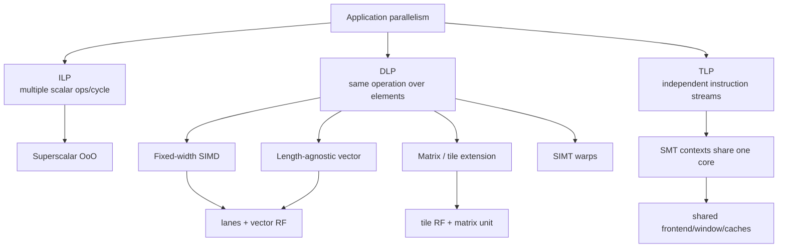
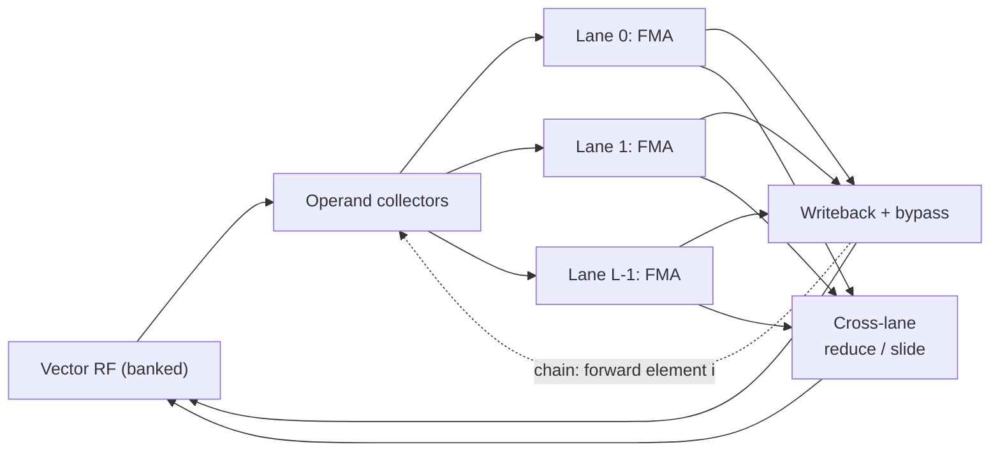
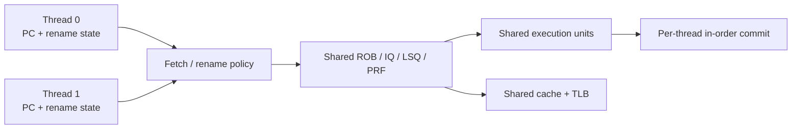

# Simultaneous Multithreading (SMT), Single Instruction Multiple Data (SIMD), Vector, and Matrix Execution

> **First-time reader orientation:** These mechanisms use different sources of parallel work. Simultaneous multithreading mixes instructions from several software threads; single instruction, multiple data applies one operation to several lanes; vector execution makes vector length part of an architectural contract; matrix extensions keep two-dimensional operand and accumulator tiles near a matrix-multiply engine. The chapter first separates those meanings before comparing hardware costs.

> **Abbreviation key — skim now and return as needed:** central processing unit (CPU); graphics processing unit (GPU); neural processing unit (NPU); instruction set architecture (ISA); reduced instruction set computer (RISC);
> instruction-level parallelism (ILP); data-level parallelism (DLP); thread-level parallelism (TLP); out-of-order (OoO); translation lookaside buffer (TLB); instruction TLB (ITLB); reorder buffer (ROB);
> miss status holding register (MSHR); load-store queue (LSQ); issue queue (IQ); physical register file (PRF); register file (RF);
> single instruction, multiple threads (SIMT); vector register length (VLEN); selected element width (SEW); vector register grouping multiplier (LMUL); error-correcting code (ECC);
> quality of service (QoS); branch target buffer (BTB); program counter (PC); fused multiply-add (FMA); terabyte (TB);
> gigahertz (GHz); Advanced Vector Extensions (AVX); Advanced Matrix Extensions (AMX); tile matrix multiply unit (TMUL); bfloat16 (BF16); integer 8-bit (INT8); Scalable Vector Extension (SVE); Scalable Matrix Extension (SME); operating system (OS).

> **Prerequisites:** [CPU Architecture](01_CPU_Architecture.md) (pipeline and superscalar concepts), [RISC-V ISA](02_RISC_V_ISA.md) §6 (vector ISA contract), and [Out-of-Order Execution](../03_Out_of_Order_Backend/01_OoO_Execution.md) (window structures).
> **Hands off to:** [GPU Architecture](../../02_GPU_Architecture/01_Core_Architecture/01_GPU_Architecture.md) for SIMT, [NPU Accelerators](../../03_NPU_Architecture/01_Compute_Dataflows/01_NPU_Accelerators.md) for spatial tensor execution, and the backend chapters for scalar scheduling and recovery.

---

## 0. Why this page exists

Wide machines go idle for different reasons. Scalar superscalar issue runs out of independent instructions; vector lanes run out of active elements; simultaneous multithreading (SMT) runs out of shared queues or fetch fairness. “More parallelism” is therefore not one technique but several contracts with distinct state, control, and utilization costs.



The design question is which form of parallelism the software can expose, which structures must be replicated, and which bottleneck becomes shared.

## Before the details: one machine, three sources of work

Imagine several execution lanes that would otherwise sit idle. There are three ways to find work for them. **SMT** selects independent scalar instructions from different threads. **SIMD** places several data elements inside one architectural instruction and performs the same operation in parallel. A **vector ISA** also describes data-parallel work, but adds vector-length, masking, exception, and register semantics that let one binary use different hardware lane counts.

The distinction matters because each mechanism stores and schedules different state. SMT duplicates or tags thread context and makes shared queues compete. SIMD widens datapaths and register accesses but follows one control stream. Vector execution adds vector registers, element grouping, masks, and long-running operations whose data can span several cycles. A design question should therefore name the resource being filled—fetch slots, issue slots, arithmetic lanes, or memory bandwidth—and the independent work source expected to fill it.

**Beginner checkpoint:** “eight lanes” is a physical quantity; it does not say whether those lanes execute eight threads, eight elements of one vector instruction, or unrelated scalar instructions. The later utilization equations are meaningful only after that mapping is explicit.

## 1. Taxonomy: do not conflate width with threads

| Mechanism | Architectural streams | Control stream | Data elements per instruction | Main utilization loss |
|---|---:|---:|---:|---|
| scalar superscalar | 1 | 1 | 1 | insufficient ILP / dependencies |
| fixed-width SIMD | 1 | 1 | fixed ISA width | short/tail vectors, shuffle cost |
| length-agnostic vector | 1 | 1 | runtime `vl`, implementation VLEN | strip-mining overhead, lane/memory imbalance |
| matrix/tile extension | 1 | 1 | two-dimensional tile operation | tile underfill, load/pack bandwidth, accumulator dependencies |
| SIMT | many logical threads | warp-level issue | active lanes in warp | divergence, occupancy/resource limits |
| SMT | 2+ independent threads | independent PCs | scalar or vector per thread | contention and unfairness |

SIMD/vector amortizes one instruction's fetch/decode over many operations. SMT selects among independent instruction streams to fill scalar issue slots. SIMT combines a multithreaded programming model with grouped lane issue. These mechanisms can coexist: an SMT core can issue vector instructions from either thread.

### 1.1 The same loop, scalar then wide

**WHAT.** "Doing the work wide" is not a metaphor. The scalar loop below touches one element per iteration; the fixed-width SIMD version issues one instruction that operates on eight `float` lanes at once (Intel AVX2 with FMA, intrinsics from `<immintrin.h>`). Fetch, decode, and loop overhead are now paid once per *eight* results instead of once per result — that amortization is the entire point of §1's "amortized control" row.

```c
// scalar: 1 element per iteration        (SAXPY: y = a*x + y)
for (int i = 0; i < n; i++)
    y[i] = a * x[i] + y[i];

// AVX2 + FMA: 8 float lanes per iteration
__m256 va = _mm256_set1_ps(a);            // broadcast a to 8 lanes
int i = 0;
for (; i + 8 <= n; i += 8) {
    __m256 vx = _mm256_loadu_ps(&x[i]);
    __m256 vy = _mm256_loadu_ps(&y[i]);
    vy = _mm256_fmadd_ps(va, vx, vy);     // 8x (a*x + y) in one op
    _mm256_storeu_ps(&y[i], vy);
}
for (; i < n; i++)                        // scalar tail: n % 8 != 0
    y[i] = a * x[i] + y[i];
```

**WHY the bridge to §2.** The awkward part is the trailing **scalar tail loop**. Because `__m256` names a *fixed* physical width of eight floats, any `n` that is not a multiple of 8 needs separate remainder code, and the same binary can never widen itself to a future 512-bit unit. Removing exactly that limitation is the job of the vector-length contract in §2.

## 2. The vector-length contract

In fixed-width SIMD, the ISA names a physical width. Software must be rebuilt or dispatched differently when the width changes. A length-agnostic vector ISA instead exposes a maximum implementation width while software sets the active element count `vl` for each strip-mined iteration.

For application vector length $N$, element width $SEW$, architectural register grouping $LMUL$, and implementation vector length $VLEN$,

$$
VLMAX=LMUL\frac{VLEN}{SEW},\qquad n_{iter}=\left\lceil\frac{N}{VLMAX}\right\rceil.
$$

The final iteration uses a smaller `vl`; tail policy defines whether inactive elements are preserved or may become unspecified. Mask policy similarly determines inactive masked elements. These policies are not syntax trivia: preserving old values creates read-modify-write pressure in the vector register file.

### 2.1 Strip mining example

With $VLEN=256$, $SEW=32$, and $LMUL=2$, $VLMAX=16$ elements. A 100-element loop executes seven vector iterations (six at 16, one at 4). The binary remains correct on a 128-bit or 512-bit implementation because it queries the available length.

The loop that expresses this contract asks the hardware for a length every iteration and lets it shrink on the final pass — so the same binary that ran the AVX kernel of §1.1 needs **no separate remainder loop**:

```asm
# a0=n, a1=x, a2=y, fa0=a    (SAXPY: y = a*x + y)
loop:
    vsetvli t0, a0, e32, m1, ta, ma   # t0 = vl = min(a0, VLMAX)
    vle32.v v0, (a1)                  # load vl elements of x
    vle32.v v1, (a2)                  # load vl elements of y
    vfmacc.vf v1, fa0, v0            # v1 += a * v0, over vl lanes
    vse32.v v1, (a2)                 # store vl elements of y
    slli t1, t0, 2                    # bytes done = vl * 4
    add  a1, a1, t1                   # advance x, y
    add  a2, a2, t1
    sub  a0, a0, t0                   # n -= vl
    bnez a0, loop                     # last pass just uses a smaller vl
```

On the final pass `vsetvli` returns a smaller `vl` (4 in the example above) and the very same instructions cover the tail. The width is decided at run time, not baked into the mnemonic.

## 3. Lane organization and the utilization equation

A vector unit with $L$ lanes, $m$ functional pipelines per lane, and clock $f$ has peak operation rate

$$
P_{peak}=L\,m\,o\,f,
$$

where $o$ counts operations per pipeline result (for example, an FMA may count as two floating-point operations). Achieved performance is

$$
P=P_{peak}\eta_{lane}\eta_{issue}\eta_{mem}\eta_{mask},
$$

with lane fill, issue availability, memory supply, and active-mask efficiencies.

Lanes may be **element-partitioned** (each lane owns element indices modulo $L$) or **register-partitioned**. Element partitioning simplifies regular arithmetic but makes cross-lane slides, permutations, reductions, and indexed memory expensive. A reduction tree adds area and wiring yet cuts latency from $O(L)$ serialized steps toward $O(\log L)$ stages.

The datapath makes that cost asymmetry visible: each lane's arithmetic path is local and cheap to replicate, while operand supply (the banked register file plus collectors) and any cross-lane movement are *shared* structures that dominate area and energy. This is the picture the utilization factors above draw from — $\eta_{lane}$ lives in the lanes, $\eta_{issue}$ and the operand traffic of §4 live in the collectors and register file, and $\eta_{mask}$ gates individual lanes.



### 3.1 Chaining and convoys

Without chaining, a dependent vector instruction waits for the entire producer vector. With lane-level forwarding, element $i$ can enter the consumer shortly after its producer result emerges. For producer startup $S_p$, consumer startup $S_c$, and $n$ elements processed at $L$ elements/cycle,

$$
T_{chained}\approx S_p+S_c+\left\lceil\frac{n}{L}\right\rceil,
$$

rather than paying the full vector length twice. For example, with $S_p=S_c=5$, $n=64$, and $L=8$, chaining needs about $5+5+\lceil 64/8\rceil=18$ cycles instead of the serialized $5+8+5+8=26$, a $1.44\times$ shortening; the advantage grows with vector length because the shared startup terms are paid once, not once per instruction. Chaining is vector bypassing; it also creates long, high-fanout physical paths.

## 4. The vector register file is usually the tax collector

Peak arithmetic is easy to replicate. Feeding it requires read/write bandwidth. If each of $I$ issued vector operations needs $r$ source and $w$ destination operands, the logical port demand is $Ir$ reads and $Iw$ writes per cycle, each across $L\times SEW$ bits.

Practical designs reduce the quadratic multiport cost using:

- banking and lane-local register slices;
- operand collectors that decouple register reads from issue;
- staged reads for ternary operations;
- bypass networks to avoid immediate write/read cycles;
- register grouping and physical-register allocation constraints;
- separate mask/predicate storage;
- compiler scheduling around bank conflicts.

A 32-lane, 32-bit result is 1024 bits per cycle before ECC, tags, and bypass control. Two results plus three sources can make operand transport consume more energy and routing than the arithmetic.

## 5. Vector memory is a second machine

Unit-stride accesses are coalesced into cache-line transactions. Strided and indexed operations require address generation, translation, miss tracking, ordering, and fault bookkeeping per element or group.

For line size $B$, element size $E$, and unit stride, one line supplies $B/E$ elements. With $L$ lanes consuming one element/cycle, minimum line request rate is

$$
\lambda_{line}=\frac{LE}{B}\ \text{lines/cycle}.
$$

At $L=16$, $E=4$ B, and $B=64$ B, the vector unit consumes one line per cycle. Two source streams plus one destination can demand three cache-line streams, before misses. The cache banks, TLB ports, MSHRs, and store path must scale accordingly.

Precise exceptions complicate vector loads. The implementation must identify the faulting element, avoid exposing later elements incorrectly, and support restart state such as RISC-V `vstart`. Fault-only-first operations deliberately shorten `vl` after the first fault to support vectorized pointer/string traversal.

## 5.1 Matrix and tile extensions: reuse across two dimensions

A vector FMA exposes one-dimensional lanes. A matrix instruction exposes a larger operation whose implementation can reuse rows and columns inside a dedicated engine. This changes the machine boundary: peak arithmetic rises only if tile loads, accumulator residency, and packed layouts feed it.

Intel **AMX (Advanced Matrix Extensions)** illustrates the contract. Its original tile state contains eight configurable two-dimensional data registers, each up to 16 rows by 64 bytes (1 KiB). Software loads a tile configuration, fills tiles from memory, issues a **TMUL (tile matrix multiply unit)** operation such as BF16 or INT8 dot-product accumulation, and stores or converts the accumulator. AMX is architecturally visible state, so the OS must enable and preserve it across context changes.

For a conceptual $M_t\times K_t$ tile multiplied by a $K_t\times N_t$ tile, one loaded input tile is reused across one output dimension while accumulator elements remain resident across successive $K_t$ steps. Ignoring metadata and output traffic, the tile arithmetic intensity is approximately

$$
I_{tile}\approx\frac{2M_tK_tN_t}{q_A M_tK_t+q_BK_tN_t},
$$

where $q_A$ and $q_B$ are bytes per input element. Larger $M_t,N_t$ increase reuse, but architectural tile capacity, cache supply, tail shapes, and thread-level sharing limit them.

The physical pipeline must solve four loops:

1. **load:** address generation, cache access, and packed tile arrival;
2. **compute:** several independent accumulator tiles cover TMUL latency and initiation limits;
3. **epilogue:** vector/scalar code applies bias, activation, scale, saturation, or conversion;
4. **store:** output ownership and cache-write bandwidth complete the tile.

Double buffering can overlap loading the next operands with computing the current tile, but it consumes more tile/register and cache capacity. If every TMUL waits for a tile load, published peak operations are irrelevant. If the output tile is stored and reloaded on every $K$ block, accumulator reuse was lost.

Arm **SME (Scalable Matrix Extension)** takes a scalable approach with streaming execution and a two-dimensional accumulator state commonly named `ZA`. The important research comparison is not which mnemonic is shorter; it is fixed versus scalable tile shape, explicit state-management cost, supported input/accumulation types, data-movement semantics, tail behavior, and virtualization overhead. RISC-V's ratified V extension supplies length-agnostic vectors; matrix claims must name the exact implemented or proposed extension instead of implying a single ratified RISC-V matrix contract.

Matrix units also interact with out-of-order scheduling. A long, multi-cycle tile operation occupies execution resources and creates accumulator dependencies; a wide scalar ROB does not create independent tile work if the microkernel uses one accumulator chain. Conversely, exposing many tile operations can pressure issue queues and load buffers. The compiler/kernel and microarchitecture must be evaluated as one schedule.

## 6. SMT: replicate identity, share expensive machinery

An SMT context needs its own architectural PC/register state, privilege state, rename map or map identity, interrupt state, and predictor-history context. The core may share fetch/decode bandwidth, physical registers, ROB entries, issue queues, execution units, load/store queues, TLBs, and caches.



That diagram shows *where* two threads merge; the value of SMT is in *when*. Below, a 4-wide issue window runs each thread alone, then both together. Neither thread alone has enough independent, ready instructions to fill four slots every cycle (dependencies and misses leave gaps); interleaving a second stream fills most of the idle slots with work that was already available.

```text
4-wide issue.   "." = idle slot (throughput lost).

  Thread 0 alone         Thread 1 alone         SMT: T0 and T1 co-issue
c1  a a . .            c1  b b b .            c1  a a b b
c2  a . . .            c2  b . . .            c2  a a b b
c3  a a a .            c3  b b . .            c3  a a b b
c4  . . . .            c4  b . . .            c4  b . . .

idle 10/16 (62%)       idle  9/16 (56%)       idle  3/16 (19%)
```

The combined column places all $6+7=13$ ready instructions from the two threads, leaving only $3$ idle slots — but that gain holds *only* while the shared queues and ports are not themselves the limit, which is exactly what the next bound quantifies.

SMT throughput benefit follows complementarity. Let $C_j$ be the available capacity of resource $j$ per cycle, let $d_{0,j}$ and $d_{1,j}$ be the two threads' demand for that resource when each runs at its own single-thread unit throughput, and let $x$ be the equal throughput scale achieved by each thread while co-running. Then

$$
x\le\min_j\frac{C_j}{d_{0,j}+d_{1,j}},\qquad
S_{SMT,aggregate}\le\min(2,2x).
$$

The aggregate speedup is normalized to one thread's unit throughput, so two complementary half-capacity threads can reach $x=1$ and aggregate speedup two. Apply the bound across fetch, rename, issue, execution ports, memory bandwidth, and queue occupancy. It remains crude because demand changes with cache behavior and co-run interference. Two memory-bound threads can reduce single-thread performance without increasing total work much.

### 6.1 Sharing policies

| Policy | Benefit | Risk |
|---|---|---|
| fully shared | high utilization and elasticity | starvation, covert channels, unpredictable latency |
| static partition | isolation and simple accounting | stranded entries when one thread stalls |
| threshold / cap | bounded interference with some elasticity | tuning complexity |
| dynamic priority | targets QoS or critical thread | feedback instability and gaming |

ROB/LSQ/physical-register occupancy must be controlled together. Capping only ROB entries does not stop a thread from exhausting load buffers or MSHRs.

## 7. Frontend and predictor implications of SMT

Fetch policies include round-robin, instruction-count scheduling (ICOUNT, favor the thread with fewer in-flight instructions), stall-based selection, and QoS priority. Predictor state may be shared with thread tags, partitioned, or indexed using history containing thread identity. Sharing improves capacity but creates destructive interference and security channels.

The instruction cache can hold both working sets while the ITLB, BTB, and return stack thrash. Therefore measure frontend structures separately; “SMT slows the cache” may actually be BTB or ITLB contention.

At retirement, each thread must preserve in-order architectural state, but aggregate commit bandwidth can be shared. Interrupt delivery, single-step debug, and precise exceptions target one context without corrupting the other.

## 8. SIMD/vector versus SMT: a design ledger

| Question | Vector/SIMD | SMT |
|---|---|---|
| software requirement | data-parallel loop or tiled matrix | independent threads |
| replicated state | lanes/datapaths, vector or tile RF capacity | architectural contexts, maps/history |
| amortized control | high | low; each thread has own stream |
| latency tolerance | long vector operations and memory overlap | switch issue among threads |
| main bottleneck | operand/memory bandwidth, masks, packing, and tile fill | shared-structure contention |
| determinism | relatively predictable for regular loops | workload-pair dependent |
| security/isolation | lane data separation | shared predictors/caches create channels |

The mechanisms are complementary. A server may use SMT to fill scalar bubbles and vectors to accelerate dense loops. The physical budget must cover their interaction: two SMT threads issuing wide vectors can saturate register-file and memory bandwidth abruptly.

## 9. Numbers to remember

- $VLMAX=LMUL\times VLEN/SEW$ elements for the basic RISC-V vector relationship.
- Tail and mask **undisturbed** policies may require preserving old destination elements.
- Vector peak is lane count × pipelines/lane × operations/result × frequency; utilization factors multiply it down.
- Register-file and bypass bandwidth often dominate vector-core energy and routing.
- Matrix/tile peak is useful only when packed tile loads and independent accumulators keep the matrix pipeline occupied.
- SMT replicates architectural identity but shares expensive execution and memory structures.
- SMT throughput gains are workload-pair dependent; isolation needs coordinated queue/cache/bandwidth controls.

## 10. Worked problems

### Problem 1 — vector utilization

An 8-lane unit processes 100 32-bit elements with `VLMAX=32`. It runs four iterations with active elements 32, 32, 32, and 4. Ignoring startup, lane-slot utilization is

$$
\eta=\frac{100}{4\times32}=78.125\%.
$$

Longer application vectors or a policy that combines independent short vectors is needed to recover the tail loss.

### Problem 2 — register bandwidth

Two vector FMAs/cycle each read three 512-bit operands and write one result. Logical register traffic is

$$
2(3+1)512=4096\ \text{bits/cycle}=512\ \text{B/cycle}.
$$

At 2 GHz that is 1 TB/s of on-core operand traffic, showing why lane-local banking and bypass are mandatory.

### Problem 3 — SMT fairness

A 256-entry ROB gives thread 0 a cap of 192 and thread 1 a guaranteed minimum of 64. If thread 0 stalls at 120 entries, thread 1 may borrow the remainder under an elastic policy. A static 192/64 partition would strand 72 entries; a fully shared policy could let thread 0 starve thread 1. The threshold policy trades utilization for a bounded minimum.

### Problem 4 — matrix tile supply

A tile operation performs 32,768 operations and can start every 16 cycles, giving a compute roof of 2,048 operations/cycle. Its two operand tiles total 2 KiB, and the L1 path sustainably supplies 96 B/cycle to this kernel. Operand supply takes at least $2048/96\approx21.3$ cycles, so this schedule is load-bound before considering conflicts or the epilogue. Reusing one operand tile across two output tiles reduces new operand bytes and may move the active roof.

### Problem 5 — SIMD speedup ceiling (Amdahl)

Lane count bounds only the *vectorized fraction* of a program, never the whole. Suppose $90\%$ of runtime is a loop an $8$-wide unit accelerates $8\times$, while the remaining $10\%$ stays scalar. With vectorizable fraction $p$ and per-loop speedup $s$,

$$
S=\frac{1}{(1-p)+p/s}=\frac{1}{0.10+0.90/8}=\frac{1}{0.2125}\approx4.71\times,
$$

not $8\times$. Doubling to $16$ wide gives $1/(0.10+0.90/16)=1/0.15625=6.4\times$: twice the lanes buys only $1.36\times$ more, and no width beats the scalar-bound ceiling $1/0.10=10\times$. This is why the intro's "eight lanes" checkpoint never means "eight times faster" — the physical width caps the vectorized part, and the scalar remainder sets the roof.

## Cross-references

- **Scalar core:** [CPU Architecture](01_CPU_Architecture.md), [Out-of-Order Execution](../03_Out_of_Order_Backend/01_OoO_Execution.md), [Fetch, Decode, and µop Delivery](../02_Frontend_and_Prediction/02_Fetch_Decode_and_Uop_Delivery.md).
- **Vector contract:** [RISC-V ISA](02_RISC_V_ISA.md) §6 and the official RISC-V V specification.
- **AI operator mapping:** [AI Operators on CPU Microarchitecture](../09_AI_Workloads_and_Serving/02_AI_Operators_on_CPU_Microarchitecture.md) follows dense, sparse, attention, and quantized kernels through vector and tile execution.
- **Throughput relatives:** [GPU Architecture](../../02_GPU_Architecture/01_Core_Architecture/01_GPU_Architecture.md), [SIMT Scheduling and Occupancy](../../02_GPU_Architecture/01_Core_Architecture/02_SIMT_Scheduling_and_Occupancy.md), [Systolic, Spatial, and Vector Dataflows](../../03_NPU_Architecture/01_Compute_Dataflows/02_Systolic_Spatial_and_Vector_Dataflows.md).

## References

1. RISC-V International, [“V” Standard Extension for Vector Operations, Version 1.0](https://docs.riscv.org/reference/isa/unpriv/v-st-ext).
2. R. Espasa and M. Valero, “Multithreaded Vector Architectures,” HPCA 1997.
3. D. Tullsen, S. Eggers, and H. Levy, “Simultaneous Multithreading: Maximizing On-Chip Parallelism,” ISCA 1995.
4. J. Smith and G. Sohi, “The Microarchitecture of Superscalar Processors,” *Proceedings of the IEEE*, 1995.
5. Intel, *64 and IA-32 Architectures Optimization Reference Manual*.
6. Intel, [Advanced Matrix Extensions architectural overview and intrinsic example](https://www.intel.com/content/www/us/en/developer/articles/code-sample/advanced-matrix-extensions-intrinsics-functions.html).
7. Arm, [A-profile architecture and SME documentation](https://developer.arm.com/Architectures/A-Profile%20Architecture).

---

**Navigation:** [Core Foundations index](00_Index.md) · [CPU index](../00_Index.md)
