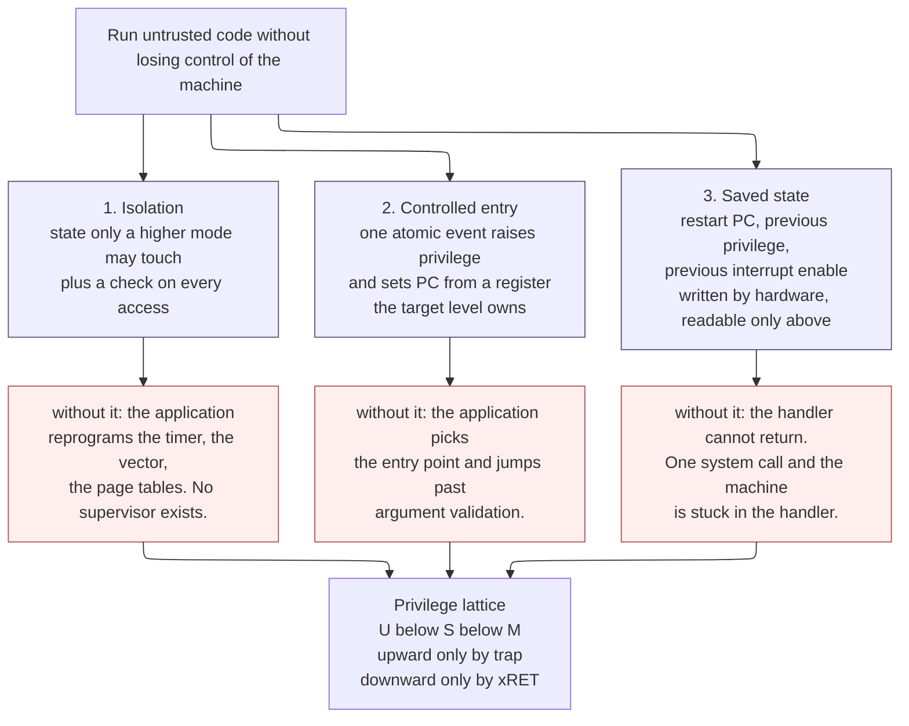
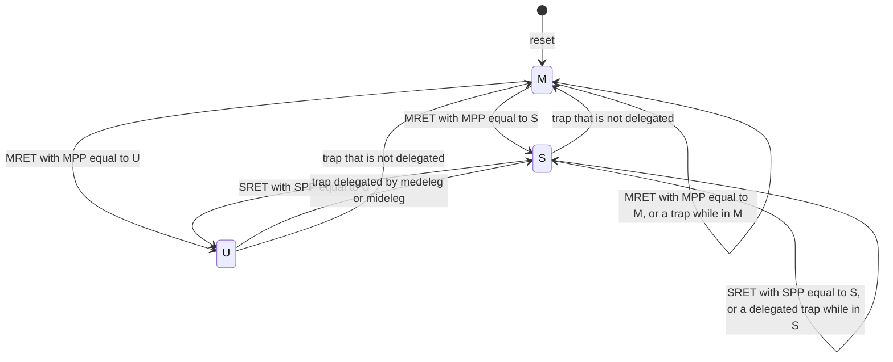
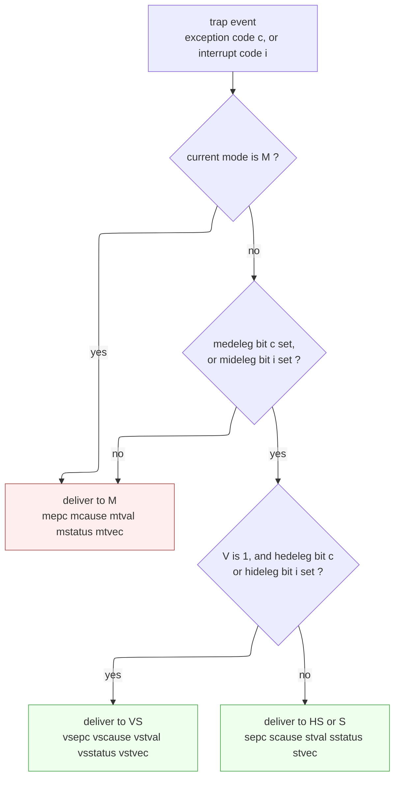

# Privileged Architecture, Control and Status Registers, and Trap Delivery — the architected contract that makes an operating system possible

> **First-time reader orientation:** Everything on this page is *architecture* — the part of the machine that software may rely on and that a specification must nail down before any RTL is written. A **privilege level** is a mode the hardware runs in that determines what state it may touch. A **control and status register (CSR)** is a register that is not a general-purpose register: it holds machine configuration and status, and it is reached by a dedicated instruction carrying a numeric register identifier, not by a load or store to an address. A **trap** is the hardware's controlled, involuntary transfer of control to a higher-privileged handler — either an **exception** caused synchronously by an instruction, or an **interrupt** caused asynchronously by something outside the instruction stream. This page derives all three from first principles and then specifies them to the level a commercial product document must reach.

> **Abbreviation key — skim now and return as needed:** control and status register (CSR); central processing unit (CPU); instruction set architecture (ISA); operating system (OS); program counter (PC); register-transfer level (RTL); general-purpose register (GPR); floating point (FP); institute of electrical and electronics engineers (IEEE);
> machine mode (M); supervisor mode (S); user mode (U); hypervisor-extended supervisor mode (HS); virtual supervisor mode (VS); virtual user mode (VU); exception level (EL, Arm's name for a privilege level);
> write-preserve read-ignore (WPRI); write-legal read-legal (WLRL); write-any read-legal (WARL); read-only (RO); read-write (RW); write-one-to-clear (W1C); write-one-to-set (W1S);
> physical memory protection (PMP); physical memory attributes (PMA); memory protection unit (MPU); protected memory system architecture (PMSA); privileged access never (PAN); supervisor mode access prevention (SMAP);
> translation lookaside buffer (TLB); virtual address (VA); physical address (PA); address-space identifier (ASID); virtual machine identifier (VMID); reorder buffer (ROB); out-of-order (OoO);
> performance monitoring unit (PMU); wait for interrupt (WFI); interprocessor interrupt (IPI); core-local interruptor (CLINT); platform-level interrupt controller (PLIC); advanced interrupt architecture (AIA); generic interrupt controller (GIC, Arm's);
> debug module (DM); debug module interface (DMI); joint test action group (JTAG); trusted execution environment (TEE); supervisor binary interface (SBI); virtual machine (VM); virtual machine control structure (VMCS);
> SystemVerilog assertion (SVA); universal verification methodology (UVM); register abstraction layer (RAL); gate equivalent (GE); kilobyte (KB); kibibyte (KiB); megahertz (MHz); gigahertz (GHz).

> **Prerequisites:** [RISC-V Instruction Set Architecture](02_RISC_V_ISA.md) (the base encoding, the M/S/U mode stack sketched in its §5, and the Sv39 page-table geometry — this page owns in depth what that page outlines), [Retirement, Recovery, and Precise State](../03_Out_of_Order_Backend/03_Retirement_Recovery_and_Precise_State.md) (the reorder-buffer machinery that *implements* precise traps — this page owns the architectural contract that machinery must satisfy).
> **Hands off to:** [TLB and Virtual Memory](../05_Virtual_Memory/01_TLB_and_Virtual_Memory.md) (takes the `satp`-class registers and fence semantics defined here and builds the translation datapath), [Interrupt Architecture](../../04_SoC_and_Chiplet_Architecture/05_IO_and_Chiplets/05_Interrupt_Architecture.md) (owns the controller and the delivery path *up to* the core pin; this page owns everything from the moment the core decides to take the trap), [IP Reuse, Integration, and Register Automation](../../../08_Cross_Cutting_Engineering/04_IP_Reuse_Integration_and_Register_Automation.md) (owns bus-accessed memory-mapped registers and their generation flow — a different register file from this one, see §14.1).

---

## 0. Why this page exists

An instruction set that lets any instruction do anything cannot run an operating system. That is not a slogan; it is a theorem with a two-line proof, and §1 gives it. Every mechanism on this page — privilege levels, the CSR address space, the field-type taxonomy, the trap-entry sequence, delegation, region protection — is a consequence of removing that one impossibility, and each mechanism costs specific gates, specific verification effort, and specific software obligations.

The notebook has, until now, described the machinery that *implements* traps without describing the contract that machinery must honor. [Retirement, Recovery, and Precise State](../03_Out_of_Order_Backend/03_Retirement_Recovery_and_Precise_State.md) explains how a reorder buffer arranges for exactly one instruction boundary to be architecturally visible when a fault fires. But it does not say which register receives the restart address, in what order the privilege change and the interrupt-enable push happen, which of two simultaneous exceptions wins, or what a hardware designer is permitted to do when software writes a value the register cannot represent. Those are architecture. They belong in a specification, they are what a compliance suite tests, and they are what silicon is respun for when they are wrong.

The gap matters commercially. A privileged-architecture defect does not present as a wrong answer in a benchmark; it presents as a kernel that boots on the simulator and hangs on silicon, a hypervisor that loses an interrupt once every few hours, a security monitor that a compromised kernel can starve, or a field-programmable feature that a customer's driver cannot discover because the discovery mechanism — write a value, read it back, see what stuck — was implemented as "raise illegal instruction" instead. Every one of those is a specification failure that a well-formed register document would have caught before RTL.

After this page you should be able to: read a 12-bit CSR number and state, without a lookup table, who may access it and with which instruction; write a register specification whose every field carries a type, a legal-value set, a legalization function, a reset value, and an assertion; walk a trap entry and return and give the exact contents of every architected register at every step; resolve a simultaneous-exception case against the architected priority order and explain why the order exists; size a physical-memory-protection block and a world switch in real numbers; and read the Arm system-register manual and the RISC-V privileged manual as two answers to the same five questions rather than as two unrelated vocabularies.

---

## 1. Why a privileged architecture exists at all

### 1.1 The baseline: one mode, and what it cannot do

Start with the simplest machine that could work: a CPU with one mode, in which every instruction is always legal and every piece of state is always reachable. This is not a strawman — it is the 8086 in real mode, most microcontrollers shipping today, and every processor built before the mid-1960s. It is a perfectly good design for a machine that runs exactly one program.

Now try to run two. A supervisor program wants to time-slice between application $A$ and application $B$, and it wants a bug in $A$ not to destroy $B$. Trace three concrete attacks, none of them malicious — each is an ordinary bug:

1. $A$ has an off-by-one in a loop and writes past the end of its array into $B$'s data. Nothing stops it: on a one-mode machine every address is reachable by every instruction.
2. $A$ writes the timer-compare register so the scheduler's tick never fires. $A$ now owns the machine forever. Nothing stops it: the timer is just another memory location or register.
3. $A$ writes the trap-vector location so that the next interrupt jumps into $A$'s own code. $A$ is now the supervisor. Nothing stops it, and worse, nothing *detects* it.

The conclusion is not "add memory protection." It is stronger and it is structural: **on a machine with one mode there is no state that the supervisor can own and the application cannot forge, so there is no supervisor.** Multiprogramming, memory protection, reliable timekeeping, secure boot, and virtualization are all downstream of one missing property.

### 1.2 The three requirements, derived one failure at a time

**Requirement 1 — isolation.** There must exist state that only a higher mode can read or write, and a check on every access that enforces it. The minimal mechanism is astonishingly small: a mode field (two bits is enough for four levels), and one comparator per privileged access that compares the access's required level against the current mode field and raises a fault on a shortfall. That is a handful of gates.

*What breaks without it:* everything in §1.1. Attack 2 in particular is fatal in a way people underestimate — a system whose scheduler tick can be disabled by the scheduled program has no availability guarantee at all, which is why "isolation" in a real product always includes control of the time base, not just control of memory.

Isolation alone, though, produces a machine that is *safe and useless*: the application can now do nothing privileged, including asking for a service. So:

**Requirement 2 — controlled entry.** There must be a way for a lower mode to transfer control *into* a higher mode, and the higher mode must choose the destination. The naive fix is a "raise privilege" instruction, or an ordinary jump that happens to land in supervisor code. Both fail:

- A "raise privilege" instruction is a privilege escalation primitive with a nice name. If $A$ can execute it, $A$ is the supervisor.
- An ordinary jump into supervisor code lets $A$ pick the entry point. Real kernels validate arguments at the top of a system call and then act on them; if $A$ can jump *past* the validation to the action, the validation was decorative. This is not hypothetical — it is the structural shape of an entire class of historical vulnerabilities in systems where the entry point was not hardware-chosen.

The mechanism that removes both failures is a **trap**: a single hardware event that *simultaneously and atomically* raises the privilege and sets the PC to a location supplied by a register **only the target level can write**. The lower mode chooses *when* (it executes `ecall`, or it faults, or an interrupt fires); the higher mode chose *where*, once, at boot. Note carefully what `ecall` is and is not: it is a *request* to cross the boundary, delivered to an address the requester did not choose. It does not grant privilege; it causes the machine to enter a handler that the higher level wrote.

**Requirement 3 — saved state.** The handler runs. Now what? To resume the interrupted program it needs, at minimum, the address to restart at and the privilege to restart in. If that information is not captured, the trap is a one-way trip and the machine can service exactly one system call before it can no longer return.

The naive fix — "put the return address in a general-purpose register" — fails twice. First, the handler needs registers to do its own work, so the return address is destroyed almost immediately unless the handler saves it, and it cannot save it without a register to compute an address in. Second, the interrupted program's registers are untrusted: on an interrupt taken in user mode, *every* GPR contains a value the user chose, including whatever the user put in the register that a naive design would use as a stack pointer.

So the return address, the previous privilege, and the previous interrupt-enable state must land in registers that the *target* level owns and the source level cannot touch. That is the third leg, and it is why a privileged architecture always has an exception-program-counter register and a status register with a "previous mode" field.

There is a fourth thing the handler needs that hardware deliberately does *not* supply, and understanding the omission is worth a paragraph. The handler needs a *stack*, and at the instant of the trap the hardware does not know that one exists. Three architectures answer this differently and the difference is instructive:

- **x86** switches the stack pointer in hardware, loading it from a per-privilege-level slot in a task-state structure, then pushes the flags, code segment, and instruction pointer onto that stack. The cost is that a memory access sits on the trap path, and the machine needs a defined behavior when that access itself faults — hence x86's double-fault machinery.
- **Arm AArch64** banks the stack pointer per exception level (`SP_EL0`, `SP_EL1`, `SP_EL2`, `SP_EL3`) and provides a `SPSel` bit, so entering EL1 automatically selects a stack EL1 owns. It also splits the vector table so that an exception taken from the *current* EL with `SP_EL0` selected lands at a different address than one taken with `SP_ELx` selected — a hardware hook for surviving a corrupted stack.
- **RISC-V** banks nothing. It gives the handler one scratch register per privilege level (`mscratch`, `sscratch`) and one instruction that can *exchange* a GPR with a CSR in a single atomic step. The first instruction of a machine-mode handler is conventionally `csrrw sp, mscratch, sp`, which simultaneously loads the handler's stack pointer and stashes the interrupted program's — using no spare register, because there is none. §3.3 shows why that instruction had to be an exchange and not a read followed by a write.

Three costs in three places: a memory access on the trap path, banked register area, or an ISA feature plus a software convention. There is no free answer; there is only a choice about where to pay.

### 1.3 The three-legged stool



The contract this figure states is that the three requirements are jointly necessary and, together, sufficient to build a supervisor. Trace one concrete path: a user program executes `ecall`. Leg 2 fires — privilege becomes M and the PC becomes the value in the machine trap-vector register, which only M-mode could ever have written. Leg 3 fires in the same instant — the address of the `ecall` lands in the machine exception-PC register and the previous privilege lands in a two-bit field of the status register. Leg 1 has been in force the whole time and is what made the trap-vector register and the exception-PC register unforgeable. Now delete any one leg and the path collapses: without leg 1 the user rewrote the vector before executing `ecall`; without leg 2 the user jumped straight to the handler's body; without leg 3 the handler has nowhere to return to. The trade-off the figure hides is that all three legs are *checked on every single access and every single instruction boundary*, forever, in every implementation — the tax §1.4 prices.

### 1.4 What the three legs cost

The remarkable thing about the privileged architecture is how cheap the *core* of it is and how expensive the *periphery* becomes.

| Leg | Minimal hardware | Rough cost | Where the real cost hides |
|---|---|---|---|
| Isolation | 2-bit privilege register; one 2-bit unsigned comparator on the CSR access path; a permission check in the load/store path | tens of gates for the comparator; the privilege register is 2 flops | the *memory* isolation it enables — page tables (§5), region protection (§10) — is thousands of gates and sits on the critical path |
| Controlled entry | a mux on the next-PC path selecting the trap vector; an FSM that fires the whole entry sequence in one cycle | a 64-bit mux and ~20 flops of control | making the entry *precise* in an out-of-order machine, which is the entire subject of [Retirement and Precise State](../03_Out_of_Order_Backend/03_Retirement_Recovery_and_Precise_State.md) |
| Saved state | `xepc`, `xcause`, `xtval`, `xtvec`, `xscratch` plus 4 fields of `xstatus`, per privilege level | ~5 registers × 64 bits × 2 levels ≈ 640 flops ≈ 3–4 kGE | the *verification* obligation: every field needs a type, a legal set, a reset value, and a proof (§4, §15) |

A 2-bit comparator is free. The privileged architecture is not, because the parts of it that are hard are the parts nobody counts: precise trap delivery inside a 300-instruction speculation window, a region checker fast enough to run in parallel with an L1 tag compare, and a specification complete enough that a compliance suite can be generated from it.

**Selection boundary — when you should not build one.** A deeply embedded core running a single, statically linked, cooperatively scheduled program has no untrusted code and no second address space. RISC-V's M-mode-only configuration is exactly that, and it is the correct answer for a great many shipping parts: implement M-mode, implement the trap machinery (you still need interrupts), and omit S-mode, the page tables, and optionally even PMP. The privileged architecture is modular for the same reason the base ISA is (see [RISC-V ISA §1](02_RISC_V_ISA.md)) — you pay for the levels you instantiate.

---

## 2. Privilege levels concretely

### 2.1 The RISC-V stack, and why M sits *below* S

RISC-V defines three levels with a two-bit encoding, plus a separate one-bit "virtualization" flag added by the hypervisor extension.

| Level | Encoding | Present in | Owns | Cannot reach |
|---|---|---|---|---|
| **U** — user | `00` | almost all designs | its own GPRs and whatever memory its translation and region checks permit | every CSR outside the unprivileged range; all privileged instructions |
| **S** — supervisor | `01` | designs that run a general-purpose OS | address translation via `satp`, its own trap registers, the traps M delegated to it | machine-level CSRs, PMP configuration, the physical machine |
| *(reserved)* | `10` | — | — | the encoding is reserved; note it is *used* in the CSR **address** space to denote hypervisor registers (§3.1), which is a different namespace |
| **M** — machine | `11` | **always** | the raw hardware: PMP, the physical memory map, delegation policy, the reset entry point | nothing |

Two design decisions in that table are worth extracting.

**M is mandatory and S is optional.** Every RISC-V hart implements M-mode, because M-mode is what the machine comes up in and what owns the physical resources. S-mode is opt-in, exactly like the M or V instruction-set extensions — a microcontroller instantiates M or M+U and simply does not have supervisor state, saving the registers, the translation hardware, and the verification.

**M sits beneath S, not above it in the usual "kernel is king" sense.** This is the part that surprises people coming from a two-ring world. The classic split is user/kernel; RISC-V adds a level *below* the kernel. The reason is that firmware, a security monitor, and a trusted execution environment all need to be isolated **from the operating system**, not merely from applications. If the kernel were the most privileged thing on the machine, then a kernel compromise would be a total compromise: secure boot could be undone, attestation forged, and a hardware root of trust bypassed. With M-mode below S, the machine can run — and decline to fully trust — a supervisor. That is what a supervisor binary interface (SBI) implementation such as OpenSBI is: M-mode firmware exposing services to a kernel it does not trust with the physical machine.

### 2.2 The hypervisor extension adds a flag, not a level

The natural but wrong way to virtualize is to add a fourth privilege level above S for the hypervisor. RISC-V does not, because a guest kernel expects to run *at supervisor level* — it executes `sret`, it writes `satp`, it reads `scause`. If the hypervisor took S and pushed the guest to U, every one of those would trap and need emulating.

Instead the H extension adds a **virtualization mode flag `V`** orthogonal to the 2-bit privilege field:

| `V` | privilege | Name | What it is |
|---|---|---|---|
| 0 | `11` | M | machine mode, unchanged |
| 0 | `01` | **HS** | hypervisor-extended supervisor: the host kernel or hypervisor |
| 0 | `00` | U | host user mode |
| 1 | `01` | **VS** | virtual supervisor: the *guest kernel*, running at supervisor privilege |
| 1 | `00` | **VU** | virtual user: an application inside the guest |

The guest kernel genuinely runs at privilege `01`. What changes is that when `V = 1`, hardware **redirects** the guest's accesses to the supervisor CSRs to a second, guest-private set (`vsstatus`, `vsatp`, `vstvec`, …) and interposes a second stage of address translation. §12 develops this; the point here is that virtualization was achieved by *renaming registers in the decoder*, not by adding a level. Arm reached the same insight from the opposite direction with its virtualization host extensions, which redirect `_EL1` register names to `_EL2` registers so an unmodified host kernel can run at EL2 (§13.4).

### 2.3 Arm's exception levels and security states

Arm AArch64 numbers its levels in the opposite direction — higher number, higher privilege — and crosses them with an orthogonal **security state**.

| Arm | Purpose | RISC-V analogue |
|---|---|---|
| **EL0** | applications | U |
| **EL1** | OS kernel | S (or VS when virtualized) |
| **EL2** | hypervisor | HS |
| **EL3** | secure monitor / firmware | M |

Crossed with security state: `SCR_EL3.NS` selects Non-secure or Secure worlds, so `EL1` names two different sets of registers depending on the world. Armv9's Realm Management Extension widens this to four states — Non-secure, Secure, Realm, and Root — selected by `SCR_EL3.{NSE, NS}`, with EL3 the only code that runs in Root state. That is a genuine architectural difference: **Arm architects a second dimension of isolation; RISC-V's ratified base does not.** A RISC-V TEE is built from M-mode plus PMP (§10) rather than from an architected second world, and proposals to add a memory-tagging-based world model exist but are not in the ratified privileged specification. State this accurately when comparing the two; the RISC-V approach costs less silicon and puts more of the isolation argument on M-mode firmware.

### 2.4 The comparison table that matters

| Axis | RISC-V | Arm AArch64 |
|---|---|---|
| Level count and direction | 3 levels, M=`11` highest | 4 levels, EL3 highest |
| Numbering monotone with privilege? | **yes** (U=0 < S=1 < M=3), so the check is a 2-bit unsigned compare | yes (EL0 < EL1 < EL2 < EL3), but the check is per-register, not per-address |
| Virtualization | orthogonal `V` flag; guest kernel keeps supervisor privilege | EL2 is a level; `HCR_EL2.E2H` redirects EL1 register names to EL2 |
| Second isolation dimension | none architected (M-mode + PMP by convention) | Secure / Non-secure, plus Realm / Root in Armv9 |
| Optional levels | S and the H extension are optional; M is mandatory | EL2 and EL3 are optional; EL0/EL1 mandatory |
| Where the trap vector lives | one CSR per level, `mtvec` / `stvec` / `vstvec` | one register per level, `VBAR_EL1` / `VBAR_EL2` / `VBAR_EL3` |
| Legal upward transition | trap only | exception only |
| Legal downward transition | `mret` / `sret` to `xPP` | `eret` to `SPSR_ELx.M` |

The single most useful line is the second: RISC-V's privilege encodings are *numerically ordered*, and the CSR address encodes the minimum privilege in two bits (§3.1). Those two facts together let the entire access-control policy for 4096 registers be one 2-bit unsigned comparator. Arm's check is a property of each register definition and is realized as decode logic per register. Arm buys per-register flexibility; RISC-V buys a comparator.

### 2.5 Legal transitions



The contract: **the only upward edges are traps, and the only downward edges are the return instructions.** Read one trace: the machine resets into M, firmware configures PMP and delegation, executes `mret` with `mstatus.MPP = S`, and lands in the kernel; the kernel configures `satp` and `stvec`, executes `sret` with `sstatus.SPP = U`, and lands in an application; the application faults; the fault is delegated, so the machine goes `U → S` and the kernel handles it; the kernel executes `sret` and the application resumes.

Two absent edges carry as much information as the present ones. There is **no `U → U` trap edge** in the standard architecture: an exception in user code always leaves user mode, because user mode has no trap registers to save state into and no vector of its own. (An optional "N" extension for user-level interrupts was explored and withdrawn; the cost of a third full trap-register set was not judged worth it.) And there is **no edge that raises privilege without a trap** — that absence is the security property of §1.2, and §15 states it as the first formal assertion the design must discharge.

The self-loops matter too. A trap taken while already in M goes to M: delegation is ignored when the machine is already at the level that owns the trap, which is the rule that prevents a delegation configuration from ever *lowering* where a trap lands (§8.4). A trap taken in S and delegated goes to S — the kernel handling its own page faults without a round trip through firmware, which is the entire point of delegation.

---

## 3. The CSR address space and the access mechanism

### 3.1 Twelve bits, of which four are policy

A RISC-V CSR is named by a **12-bit number**, giving 4096 possible registers. That number is not an address in the memory sense — nothing decodes it onto a bus, no byte enables exist, and no load or store can reach it. It is a field inside the instruction encoding, and it is decoded by the core itself.

The top four bits are not part of the name. They are the access policy:

```text
CSR number, 12 bits
   11  10   9   8   7   6   5   4   3   2   1   0
 +---------+-------+-------------------------------+
 |  [11:10]| [9:8] |          index [7:0]          |
 +---------+-------+-------------------------------+
      |        |
      |        +--  00 = accessible from User / unprivileged
      |             01 = accessible from Supervisor and above
      |             10 = Hypervisor / Virtual-Supervisor registers
      |             11 = Machine mode only
      |
      +-- 11 = READ-ONLY  (any encoding that writes raises illegal instruction)
          00, 01, 10 = read/write
```

Two consequences fall straight out, and both are load-bearing.

**Access control is a 2-bit unsigned comparison.** Because privilege encodings are numerically ordered (U=0, S=1, M=3), the entire permission policy for all 4096 registers is `current_privilege >= csr_number[9:8]`. No table, no per-register decode, no maintenance burden when a register is added. This is why §2.4 flagged the monotone numbering as the most useful line in the comparison: it converts a policy into a comparator.

**Read-only-ness is a property of the number, not of the register.** `csr[11:10] == 11` means every write encoding targeting that number is illegal, checked without ever looking at which register it is. This is how `mvendorid`, `cycle`, `instret`, and the whole identification and counter-shadow space are protected by construction.

Worked decodes, done by hand — this is a skill, not a lookup:

| Number | Binary `[11:10] [9:8]` | Policy | Register | Who may do what |
|---|---|---|---|---|
| `0x300` | `00  11` | RW, M | `mstatus` | M reads and writes; S or U raises illegal instruction |
| `0x100` | `00  01` | RW, S | `sstatus` | S and M read and write; U raises illegal instruction |
| `0x180` | `00  01` | RW, S | `satp` | S and M; and M can additionally *trap* S's access via `mstatus.TVM` (§12.2) |
| `0x344` | `00  11` | RW, M | `mip` | M only — but several of its bits are read-only *within* a writable register (§4.5) |
| `0xC00` | `11  00` | **RO**, U | `cycle` | any mode may read; **any** write encoding is illegal; and reads are additionally gated by `mcounteren` (§11.2) |
| `0xC02` | `11  00` | RO, U | `instret` | as above |
| `0xF11` | `11  11` | RO, M | `mvendorid` | M may read; nobody may write; reads as 0 for a non-commercial implementation, which is a *legal value*, not a reason to trap |
| `0xB00` | `10  11` | RW, M | `mcycle` | M may read **and write** — note `[11:10] = 10`, not `11`, precisely because the machine-level counter must be writable to be initialized |
| `0x7B0` | `01  11` | RW, M | `dcsr` | debug-mode only; the `0x7B0–0x7BF` block is architecturally accessible only when the hart is in debug mode (§11.5) |

The `cycle` / `mcycle` pair is the clearest illustration of the scheme. They are the same counter. `mcycle` at `0xB00` is the writable machine-level name; `cycle` at `0xC00` is the read-only unprivileged shadow. The permission difference is expressed entirely in bits `[11:10]` of the number, with no extra hardware.

### 3.2 The instruction family

CSR access is the `Zicsr` extension — six instructions, all in the `SYSTEM` major opcode, all I-type:

```text
        31                20 19    15 14  12 11     7 6           0
CSRRW   |     csr[11:0]     |  rs1   | 001 |   rd   |  1110011    |   rd = csr ; csr = rs1
CSRRS   |     csr[11:0]     |  rs1   | 010 |   rd   |  1110011    |   rd = csr ; csr = csr |  rs1
CSRRC   |     csr[11:0]     |  rs1   | 011 |   rd   |  1110011    |   rd = csr ; csr = csr & ~rs1
CSRRWI  |     csr[11:0]     | uimm5  | 101 |   rd   |  1110011    |   rd = csr ; csr = uimm
CSRRSI  |     csr[11:0]     | uimm5  | 110 |   rd   |  1110011    |   rd = csr ; csr = csr |  uimm
CSRRCI  |     csr[11:0]     | uimm5  | 111 |   rd   |  1110011    |   rd = csr ; csr = csr & ~uimm
                              ^^^^^^         ^^^^
        for CSRRS/CSRRC/CSRRSI/CSRRCI:  source == 0  ->  the instruction does NOT write
        for CSRRW/CSRRWI:               rd == x0     ->  the instruction does NOT read
```

Three structural facts, each of which is a specification obligation and not a convenience:

**The zero-operand suppression rules are semantic, not optimizations.** For `CSRRS`/`CSRRC` and their immediate forms, a source of zero means the instruction "shall not write the CSR at all, and shall not cause any of the side effects that might otherwise occur on a CSR write." For `CSRRW`/`CSRRWI`, `rd = x0` means the instruction "shall not read the CSR and shall not cause any of the side effects that might occur on a read." These exist so the ISA does not need separate read-only and write-only opcodes: `csrr rd, csr` is `csrrs rd, csr, x0` and `csrw csr, rs` is `csrrw x0, csr, rs`. The obligation this creates in hardware is real — if your register has a read side effect (§4.5), the `rd = x0` case must genuinely suppress it, and that is a bug people ship.

**Legality is decided by the encoding, never by the runtime value.** `csrrs x5, cycle, x0` is legal, because `rs1 = x0` is visible in the instruction word and means "no write." `csrrs x5, cycle, x1` is **illegal even when `x1` happens to hold zero at execution time**, because `rs1 = x1` in the encoding means the instruction writes, and `cycle` is read-only. This is deliberate: it lets the illegality be computed in decode, off the register-read path, so the illegal-instruction signal does not depend on operand values.

**The 5-bit immediate reaches exactly the bits that matter.** `uimm5` covers CSR bits 4:0. In `mstatus`, `MIE` is bit 3 and `SIE` is bit 1 — both inside that window. `csrrci x0, mstatus, 8` atomically disables machine interrupts using **no register at all**. `MPIE` (bit 7) and `SPIE` (bit 5) are outside the window and need a register. That is not an accident of layout; the hot, register-starved operations were placed where the immediate can reach them, and the cold ones were not. The field layout was designed for the instruction that accesses it.

### 3.3 Why the access must be an atomic read-modify-write

The obvious cheaper design is two instructions: a CSR read and a CSR write. It fails three ways, and the three failures are of different kinds.

**Failure 1 — hardware writes the register between your read and your write.** Concretely: `mstatus.FS` is a two-bit field that hardware sets to `Dirty` whenever an instruction writes a floating-point register. That marking is what tells the OS "this thread has live FP state, save it on the next context switch." Now suppose a kernel does a read-modify-write of `mstatus` to change some unrelated bit, and an FP instruction commits between the read and the write. The write puts back the *stale* `FS` value, erasing the Dirty marking. The next context switch does not save the FP registers. Some other thread's floating-point results are now silently wrong, intermittently, under load. This is the worst class of bug there is: no fault, no trap, wrong answers, non-reproducible.

**Failure 2 — you need to exchange a value and have no spare register.** The first instruction of a trap handler runs with every GPR holding a value belonging to the interrupted program, and it must not destroy any of them. `csrrw sp, mscratch, sp` writes `sp` into `mscratch` and `mscratch` into `sp` in one atomic step, using zero temporaries. With separate read and write instructions this is not merely racy — it is *impossible* without first destroying a register you were required to preserve. This, not the race, is the argument that makes the exchange form mandatory, and it is why `mscratch` exists at all (§5.7).

**Failure 3 — the enable/disable window.** `csrrci t0, mstatus, 8` disables machine interrupts **and** returns whether they had been enabled, atomically. With read-then-write there is a window between "I decided to disable interrupts" and "interrupts are disabled" in which an interrupt is taken; the nested handler runs its own disable/restore sequence; and the outer sequence then restores a value that was correct before the nesting and is wrong after it.

**What atomicity costs.** In the CSR unit itself it is nearly free: one read port and one write port active in the same cycle with a bypass. The real cost is upstream. Because a CSR write can change the machine's configuration — the translation regime, the trap vector, the decoder's legal instruction set — a CSR instruction is normally made **serializing**: it waits until it is the oldest instruction in the machine, all older stores drain, and the front end refetches afterwards. On a 15-stage out-of-order core that is a drain plus a refill, typically **20–60 cycles**. So a one-instruction `csrrs` on a hot path is nothing like a one-cycle ALU operation, and modeling it as one produces optimistic and wrong OS and virtualization performance projections. [Retirement, Recovery, and Precise State §7](../03_Out_of_Order_Backend/03_Retirement_Recovery_and_Precise_State.md) owns the serialization taxonomy; §4.6 below owns the question of *which* CSR writes actually need it, because serializing all of them is a measurable performance loss and serializing too few is a correctness bug.

### 3.4 The illegal-instruction rules, stated completely

A CSR access raises an **illegal-instruction exception** (cause 2) when any of the following holds. This list is the specification; anything not on it must succeed.

1. The CSR number is not implemented. (Note: "not implemented" and "implemented but reads zero" are different. A CSR the specification says must exist has to be accessible and read zero — trapping instead is a compliance failure.)
2. `current_privilege < csr[9:8]` — insufficient privilege.
3. `csr[11:10] == 2'b11` **and** the encoding writes — a write to a read-only number.
4. A register-specific gate is closed: `mcounteren`/`scounteren` for the counter shadows (§11.2), `mstatus.TVM` for `satp` accesses from S-mode (§12.2), debug-mode-only registers accessed outside debug mode.

Under the hypervisor extension there is a fifth, distinct outcome. When VS-mode or VU-mode accesses a CSR that exists only in HS-mode, the architecture raises a **virtual-instruction exception** (cause 22) rather than illegal instruction. The reason is delivery: illegal-instruction is normally delegated to the guest kernel, but the guest kernel is not who should handle "you touched a hypervisor register" — the hypervisor should, so it can emulate or refuse. A separate cause code lets the two be delegated separately. §14.3 puts this in the access-policy matrix as a third cell value, which is exactly why that matrix cannot be a boolean.

### 3.5 The access path in RTL

```systemverilog
// ---------------------------------------------------------------------------
// CSR access path.  Executes at commit: at most one CSR operation retires per
// cycle, so this is a single-ported structure with a combinational
// read-modify-write, not a multi-ported register file.
// ---------------------------------------------------------------------------
module csr_access #(
  parameter int XLEN = 64
) (
  input  logic            clk,
  input  logic            rst_n,

  // ---- from the commit stage -------------------------------------------
  input  logic            csr_valid,   // a CSR instruction is committing
  input  logic [11:0]     csr_num,     // instr[31:20]
  input  logic [2:0]      funct3,      // 001 RW, 010 RS, 011 RC, 1x1 = imm forms
  input  logic [4:0]      rs1_idx,     // instr[19:15]; also the uimm field
  input  logic [4:0]      rd_idx,      // instr[11:7]
  input  logic [XLEN-1:0] rs1_val,
  input  logic [1:0]      cur_priv,    // 00 = U, 01 = S, 11 = M

  output logic [XLEN-1:0] rd_val,
  output logic            illegal_insn
);

  // ---- 1. The number IS the access-control policy ------------------------
  //  cur_priv is numerically ordered (U=0 < S=1 < M=3), so the whole
  //  permission check for all 4096 registers is one 2-bit unsigned compare.
  logic       num_is_ro;
  logic [1:0] num_min_priv;
  assign num_is_ro    = (csr_num[11:10] == 2'b11);
  assign num_min_priv =  csr_num[9:8];

  // ---- 2. Does this encoding read?  Does it write? -----------------------
  //  These are structural signals derived from the instruction word alone --
  //  never from operand values -- so legality resolves in decode.
  logic is_imm, will_write, will_read;
  assign is_imm     = funct3[2];
  assign will_write = (funct3[1:0] == 2'b01)      // CSRRW / CSRRWI always write
                    | (rs1_idx != 5'd0);          // RS/RC (and imm forms) only
                                                  // when the source is nonzero
  assign will_read  = (funct3[1:0] == 2'b01) ? (rd_idx != 5'd0) : 1'b1;

  // ---- 3. Legality -------------------------------------------------------
  logic exists, gate_ok, priv_ok, ro_violation;
  assign priv_ok      = (cur_priv >= num_min_priv);
  assign ro_violation = num_is_ro & will_write;
  assign illegal_insn = csr_valid & (~exists | ~priv_ok | ro_violation | ~gate_ok);

  // ---- 4. The atomic read-modify-write -----------------------------------
  logic [XLEN-1:0] src, old_val, new_val;
  assign src = is_imm ? {{(XLEN-5){1'b0}}, rs1_idx} : rs1_val;

  always_comb begin
    unique case (funct3[1:0])
      2'b01:   new_val = src;                 // CSRRW : replace
      2'b10:   new_val = old_val |  src;      // CSRRS : set the named bits
      2'b11:   new_val = old_val & ~src;      // CSRRC : clear the named bits
      default: new_val = old_val;
    endcase
  end

  logic csr_we;
  assign csr_we = csr_valid & will_write & ~illegal_insn;

  // ---- 5. Storage, with per-register WARL legalization on the write path --
  logic [XLEN-1:0] mtvec_q, mepc_q, mscratch_q;

  // WARL: this implementation supports MODE = Direct(0) and Vectored(1) only.
  // A write of 2 or 3 must NOT trap; it must be folded to a legal value, and
  // the fold must be documented because software discovers features this way.
  function automatic logic [XLEN-1:0] legalize_mtvec (input logic [XLEN-1:0] v);
    logic [1:0] mode;
    mode = v[1] ? 2'b00 : v[1:0];             // MODE >= 2 folds to Direct
    return {v[XLEN-1:2], mode};
  endfunction

  always_ff @(posedge clk or negedge rst_n) begin
    if (!rst_n) begin
      mtvec_q    <= '0;                       // reset contract: see section 4.10
      mepc_q     <= '0;
      mscratch_q <= '0;
    end else if (csr_we) begin
      unique case (csr_num)
        12'h305: mtvec_q    <= legalize_mtvec(new_val);
        12'h341: mepc_q     <= {new_val[XLEN-1:1], 1'b0};  // WARL: bit 0 is 0
        12'h340: mscratch_q <= new_val;                    // every value legal
        default: ;                                          // trap handled above
      endcase
    end
  end

  // ---- 6. Read mux -------------------------------------------------------
  always_comb begin
    unique case (csr_num)
      12'h305: old_val = mtvec_q;
      12'h341: old_val = mepc_q;
      12'h340: old_val = mscratch_q;
      default: old_val = '0;
    endcase
  end

  assign rd_val = will_read ? old_val : '0;

endmodule
```

The contract of that module: one CSR operation per cycle at commit, permission decided from the instruction word alone, and every write passing through a per-register legalization function before it reaches a flop. One concrete trace: software executes `csrrw x0, mtvec, x5` with `x5 = 0x8000_0083`. `funct3[1:0] = 01`, so `will_write = 1` unconditionally and `will_read = 0` because `rd = x0`. `csr_num[11:10] = 00`, so not read-only; `csr_num[9:8] = 11`, so M-mode is required and the compare passes. `new_val = 0x8000_0083`, whose low two bits are `11` — MODE 3, unsupported. `legalize_mtvec` sees `v[1] = 1` and folds MODE to `00`, so `mtvec_q` becomes `0x8000_0080`. Software reading it back gets `0x8000_0080`, learns that vectored mode with that base was not accepted, and falls back. **No exception was raised, and the read-back was legal** — the two halves of the WARL contract that §4.3 makes precise.

The failure this structure prevents is the one a naive implementation ships: raising illegal-instruction on the unsupported MODE. That turns feature discovery into a fault, breaks every OS that probes by writing, and is not detectable by any test that only writes legal values.

---

## 4. CSR field semantics — the section a product specification lives on

A register specification that gives only names and bit ranges is not a specification. It does not say what happens when software writes a value the field cannot hold, whether reading has a side effect, who wins when hardware and software write the same bit in the same cycle, or what the field contains at reset. Every one of those omissions has a characteristic silicon bug attached to it. This section defines each field type, states what it *licenses hardware to do*, prices it, and states the verification obligation it creates. §4.11 collects the result as a checklist you can walk a specification against.

### 4.1 WPRI — write preserve, read ignore

**Definition.** A reserved field. Software must preserve its value across a read-modify-write and must ignore what it reads. Hardware reads it as zero and ignores writes to it.

**What it licenses.** Hardware may implement the field as literally nothing: no flops, no logic, tied to zero on the read mux, write data discarded.

**Why it exists.** Forward compatibility, and specifically forward compatibility *for software that does not know about the future field*. A later extension may define bits `[31:23]` of `mstatus` as something meaningful. Old software that updated `mstatus` by reading it, modifying one bit, and writing it back will have preserved the field's value — because it read zero on old hardware and reads the real value on new hardware, and writes back what it read. Software that instead did `csrrw mstatus, x5` with a constructed constant destroys the field.

**The software rule this implies.** Prefer `csrrs`/`csrrc`, which touch only the bits you name, over `csrrw` on any status register. This is a real portability rule and the reason the set/clear forms exist as first-class instructions rather than as a macro.

**Cost.** Zero flops, zero gates.

**Verification obligation.** Two properties. (a) The field reads zero in every reachable state — trivially provable if it is tied off, but *not* trivially provable if a lazy implementation aliased a WPRI bit onto a real flop to save a mux input. (b) A write to the WPRI field has no effect on any other field of the register, which catches the aliasing bug directly.

### 4.2 WLRL — write legal, read legal

**Definition.** Software must write only values the specification defines as legal. If it does, the field reads back exactly what was written. If it writes an illegal value, hardware may return **any** value on a subsequent read, and may — but is not required to — raise an illegal-instruction exception on the write.

**What it licenses.** The cheapest possible implementation: store the raw bits, legalize nothing, check nothing.

**Where it is used.** The exception-code field of `mcause` and `scause` is WLRL. That is the canonical case, and it is instructive: the field is written by *hardware* on every trap with a value that is legal by construction, and written by software only when a handler is manufacturing a synthetic cause or restoring saved state.

**The trap in WLRL, and it is a real one.** Because hardware is permitted to store garbage, you cannot write the obvious assertion — "the read-back is always legal" is *false by permission* for a WLRL field. The verification obligation therefore shifts, and shifts to a place people forget:

> **A WLRL field may contain any bit pattern. Prove that no illegal pattern can cause the hardware to do anything undefined.**

Concretely: if your design uses `mcause[4:0]` to index a table — a dispatch ROM, a per-cause enable array, a decode of "is this a page fault" — then software writing `mcause = 0x7FFF_FFFF_FFFF_FFFF` must not index out of bounds, must not select a reserved microcode entry, and must not produce an X in simulation that hides a real fault. This is a hardening item, not a compliance item, and it is the reason a security review reads the WLRL fields first.

**Cost.** Raw flops, no legalizer. The cheapest field type there is.

**Verification obligation.** (a) An illegal value has no unsafe consequence — best discharged formally with the field driven to an unconstrained symbolic value. (b) If your implementation *does* choose to raise illegal-instruction on an illegal WLRL write, that choice must be documented, because it is visible to software and differs between compliant implementations.

### 4.3 WARL — write any, read legal

**Definition.** Hardware must accept **any** written value without raising an exception, and must return a **legal** value on read. The value returned need not be related to the value written.

This is the most important field type in the architecture and the one that is most often implemented wrongly.

**What it licenses, enumerated exhaustively.** On a write of an illegal value, hardware may:

1. keep the field's previous value;
2. force the field to a fixed legal value (often zero, or the reset value);
3. force it to some other legal value chosen by a function of the written value — for example, truncating high bits, clamping to a maximum, or rounding down to the nearest supported option;
4. change it to a legal value unrelated to the write.

And hardware may **not**:

1. raise any exception on the write;
2. return a value outside the legal set on a subsequent read;
3. leave the field in a state that makes the register's behavior undefined.

**Why WARL exists — the derivation.** An operating system needs to discover what the hardware supports. Three mechanisms are possible:

- *A capability register* enumerating features. Costs a register per feature group, must be kept in sync with the features, and needs its own encoding space that grows forever.
- *Write and catch the fault.* The OS writes the value it wants and installs a handler for the resulting exception. This works but is expensive and ugly: it requires a trap handler to be installed during early boot before the trap machinery is fully configured, and the write is exactly the operation that might have changed the trap machinery.
- *Write and read back.* The OS writes the value it wants, reads the field, and sees what it got. No fault, no handler, no extra register, one extra instruction.

WARL is the third. That is the whole reason for the field type, and it explains every one of its rules. The "no exception" rule exists because faulting would defeat the mechanism. The "read-back must be legal" rule exists because otherwise the OS cannot interpret what it read. The "need not be related to what was written" rule exists so hardware can implement legalization as cheaply as a mux to a constant.

**Worked instance.** A kernel supporting Sv39, Sv48, and Sv57 page tables writes `satp` with `MODE = 10` (Sv57) and reads it back. If it reads `10`, the hardware does Sv57. If it reads `9`, the hardware capped it at Sv48. If it reads `0`, the hardware went to Bare and the kernel must fall back to a design with no translation, or fail cleanly. All three are compliant hardware; the kernel handles all three with one write and one read and no exception handler.

**Where WARL appears.** `mtvec.MODE` and `stvec.MODE`; `mepc`/`sepc` low bits; `satp.MODE` and the implemented width of `satp.ASID`; `pmpcfg.A` and the low bits of `pmpaddr` below the granularity; `misa`; `medeleg`/`mideleg` bits for causes that cannot be delegated; `mcounteren` bits for counters that are not implemented; `mstatus.MPP` on a core that does not implement all privilege modes.

**Cost.** A legalization function on the write path — a mux, a clamp, or a bit-mask — in front of the storage flops. It sits in the CSR write path, which executes once at commit and is essentially never the critical path, so the timing cost is nil. The area cost is a few tens of gates per field. The *documentation* cost is the real one: the legalization function is architecturally visible and must be written down.

**Verification obligation, and this one is cheap and complete.** The property is

$$
\forall\, v \in \{0,1\}^{w} : \big(\text{field} \leftarrow \mathrm{legalize}(v)\big) \Rightarrow \mathrm{legalize}(v) \in \mathcal{L}
$$

where $w$ = field width and $\mathcal{L}$ = the legal set. This is a bounded property over a single write, ideal for formal property checking: drive the write value symbolically and prove the read-back lies in $\mathcal{L}$. One proof covers all $2^{w}$ inputs. Simulation cannot do this — a directed test writes the handful of values the test author thought of, and the illegal values are by definition the ones nobody thought of. See [Formal Verification](../../../03_Frontend_RTL_and_Verification/12_Formal_Verification.md) for the tooling. Add a second property: no write to a WARL field raises an exception, ever.

### 4.4 The three types side by side

| | WPRI | WLRL | WARL |
|---|---|---|---|
| Hardware must accept any write without trapping | yes (ignores it) | **no** — may trap on an illegal value | **yes, must not trap** |
| Read-back guaranteed to be a legal value | reads 0 | **no** | **yes, must** |
| Read-back equals what was written | n/a | yes, *if* a legal value was written | not necessarily |
| Flops | 0 | raw | raw + legalizer |
| Primary purpose | forward compatibility | cheapest storage for hardware-written status | **feature discovery by write-then-read-back** |
| Formal obligation | reads 0; no aliasing | illegal value has no unsafe consequence | for all writes, read-back is in the legal set; no write traps |
| Characteristic bug | a WPRI bit aliased onto a real flop, so future software's preserve-and-restore corrupts state | an out-of-range value indexing a table | **raising illegal instruction on an unsupported value, which turns discovery into a fault** |

### 4.5 Read-only fields, and fields with side effects on read

**Read-only zero.** A field that is architecturally defined but not implemented reads zero and ignores writes. The rule that matters: *the register still exists*. `mvendorid` reading zero means "this is not a commercially registered implementation" — a legal, meaningful value. Implementing it as "not present, raise illegal instruction" is a compliance failure and breaks every piece of software that identifies the machine.

**Read-only constant.** Identification and capability fields with a fixed nonzero value. Zero flops — the read mux is driven by tie-offs.

**Fields with side effects on read.** These are rare in the architected CSR file and common in memory-mapped space, but the rare ones matter enormously. The canonical RISC-V case is subtle and worth stating precisely:

> `mip.SEIP` (supervisor external interrupt pending) is **writable by M-mode**, and the value **returned by a read of `mip`** is the logical OR of that software-writable bit with the wire coming from the external interrupt controller. But `CSRRW`/`CSRRS`/`CSRRC` on `mip` affect **only the software-writable bit**.

So the value you read is not the value you can write, and a read-modify-write of `mip` does not round-trip. The reason for this asymmetry is virtualization: M-mode firmware needs to be able to *inject* a supervisor external interrupt that no device raised, without being able to clear one that a device did raise. Every hypervisor and every firmware interrupt-injection path depends on this behavior, and an implementation that "simplifies" it by making the read return only the flop breaks interrupt injection in a way that appears months later as a lost interrupt under load.

**Cost of a read side effect.** In an out-of-order core, an ordinary CSR read is a pure function of state and can be speculated, replayed, or squashed harmlessly. A read with a side effect cannot: it must execute **exactly once**, at commit, on the non-speculative path, and must never be replayed. That constraint is the reason such CSRs are scarce.

**Verification obligation.** (a) Exactly-once semantics under every replay and squash path the core has — this is a co-verification item with [Retirement, Recovery, and Precise State](../03_Out_of_Order_Backend/03_Retirement_Recovery_and_Precise_State.md), because the recovery machinery is what could replay it. (b) The `rd = x0` suppression genuinely suppresses the side effect. Write the assertion: a `CSRRW` with `rd == x0` targeting a read-side-effect register must produce no state change attributable to the read.

### 4.6 Fields with side effects on write

Many CSR fields *are* the machine's configuration, so writing them changes how subsequent instructions behave. The specification obligation is to state, for each, **what changes and from which instruction onward**.

| Field written | What changes | Serialization required |
|---|---|---|
| `satp.MODE` / `satp.PPN` / `satp.ASID` | the translation regime for all subsequent instruction fetches and data accesses | drain, flush the front end, refetch under the new regime; the I-TLB and D-TLB must both be considered |
| `mtvec` / `stvec` | where future traps land | none — the next trap reads the new value |
| `mstatus.MPRV` | the *next* load or store is translated as though the privilege were `MPP` | must take effect at the next memory access, so the store buffer and any in-flight address translation must be accounted for |
| `mstatus.SUM` / `MXR` | permission checking for S-mode data accesses | as above |
| `misa` | which instructions decode legally | full pipeline clear and refetch — the decoder's behavior changed |
| `pmpcfg` / `pmpaddr` | the physical access permission of subsequent accesses | drain, and invalidate any cached PMP decision |
| `mcountinhibit` | whether counters advance | none |

**The characteristic silicon bug.** A `satp` write that flushes the data TLB but not the instruction TLB. The next data access is correct; the next instruction *fetch* uses the previous address space. This does not fail immediately, because the kernel's own text is usually mapped identically in both address spaces — it fails on the first process whose mapping differs, months into bring-up, as a random instruction fetch from a stale page.

**Cost.** Serialization, priced in §3.3 at 20–60 cycles on a deep out-of-order machine. This is why the table above matters commercially: serializing *every* CSR write costs measurable performance on OS-heavy workloads, and serializing too few is a silent correctness bug. The table is the deliverable; it must be part of the register specification, not an implementation note.

**Verification obligation.** For each write side effect, prove that the flush covers **every** structure whose contents depend on the field. Enumerate them explicitly: I-TLB, D-TLB, page-walk cache, PMP decision cache, decode tables, and any predictor whose state is privilege-tagged. That enumeration is a design document, and its absence is the reason the I-TLB bug above is a recurring industry classic.

### 4.7 Write-one-to-clear, write-one-to-set, and where RISC-V put the atomicity

A status bit that hardware sets and software clears has a race: hardware sets it in the same cycle software's clear lands. If software wins, the event is lost forever — an interrupt that never fires, a transfer that never completes.

Two architectural answers exist, and the choice is a genuine fork:

- **Put the atomicity in the register.** Define the bit as write-one-to-clear: writing 1 clears, writing 0 leaves alone. Now clearing bit 2 is a single store of `0x4` with no read, so there is no read-modify-write window at all. Provide a separate write-one-to-set address if software also needs to set. This is what memory-mapped register maps do, and Arm's GIC does exactly this with paired `ISENABLER`/`ICENABLER` (set-enable and clear-enable) registers at *different addresses*.
- **Put the atomicity in the instruction.** Define `CSRRS` and `CSRRC`, which set and clear named bits atomically in hardware. Now **every** register in the machine gets atomic bit manipulation for free, and no register definition needs a W1C policy at all.

RISC-V took the second fork; Arm took the first. The trade is explicit: RISC-V spends two opcodes (four with the immediate forms) once, forever, and gets the property universally. Arm spends nothing in the ISA and pays a design rule that **every** register definition must obey — hardware-set state must live in read-only registers or in paired set/clear registers, never in a shared read-modify-write register. Both work. RISC-V's cost is in the instruction set; Arm's is in the discipline of fifty years of register definitions, and a lapse in that discipline is a lost-update bug.

Regardless of the fork, when both hardware and software can write a bit, **the specification must state who wins in a tie.** The correct default for any status or error bit is *hardware wins*, because losing an event is worse than a redundant one. [IP Reuse and Register Automation §6.3](../../../08_Cross_Cutting_Engineering/04_IP_Reuse_Integration_and_Register_Automation.md) owns this for memory-mapped registers and shows the machine-readable way to say it; the rule is identical here, and the architected instance is the counter-overflow bit of §4.8.

### 4.8 Sticky bits

A **sticky** bit latches when its condition occurs and stays set until software explicitly clears it. It exists because a transient condition must remain observable after the fact — the alternative is that software must be watching at the instant it happens, which is impossible for anything faster than the polling loop.

The canonical architected sticky field is `fcsr.fflags`, the IEEE-754 accrued exception flags: inexact, underflow, overflow, divide-by-zero, invalid. Any floating-point operation that raises a condition ORs the corresponding bit in; hardware never clears them; software clears them explicitly. That is precisely the IEEE-754 contract for accrued flags, and it is what lets a numerical library run a thousand operations and then ask once whether anything went wrong.

**The microarchitectural obligation that makes this hard.** In an out-of-order core, floating-point operations execute speculatively and out of order. `fflags` must reflect exactly the operations that **committed**, in program order, and nothing else. A squashed operation that raised inexact must not leave a mark. So the sticky OR cannot happen at execute; it must happen at commit, and the accumulated value must be recoverable on a flush. Concretely, the flag contribution rides in the reorder-buffer entry alongside the exception metadata and is ORed into the architectural `fflags` at retirement — the same mechanism, and the same discipline, as the exception bits described in [Retirement, Recovery, and Precise State §4](../03_Out_of_Order_Backend/03_Retirement_Recovery_and_Precise_State.md).

**Cost.** One flop per flag, plus a commit-stage OR tree, plus the ROB payload bits. Trivial area; nontrivial verification.

**Verification obligation.** Assert that a squashed operation never contributes to a sticky flag. This is a good formal target and a poor simulation target, because hitting the exact squash-during-flag-raise window by random stimulus is rare.

The picture below is the sticky bit as a circuit, with the hardware-set-wins precedence made explicit:

```tikz
\begin{document}
\begin{circuitikz}[scale=1.0]
  \node[not port] (n1) at (0,0) {};
  \node[and port] (a1) at (3.2,-0.6) {};
  \node[or  port] (o1) at (6.6,0.3) {};
  \draw (n1.in)  -- ++(-1.6,0) node[left]  {\texttt{sw\_clear}};
  \draw (n1.out) -- (a1.in 1);
  \draw (a1.in 2) -- ++(-1.6,0) node[left] {$q$ \ (current value)};
  \draw (a1.out) -- (o1.in 2);
  \draw (o1.in 1) -- ++(-1.6,0) node[left] {\texttt{hw\_set}};
  \draw (o1.out) -- ++(1.6,0) node[right] {$q^{+}$ \ (D input of the flop)};
\end{circuitikz}
\end{document}
```

The contract of that circuit is the Boolean equation $q^{+} = \texttt{hw\_set} \lor (q \land \lnot\texttt{sw\_clear})$. Trace the tie: at the cycle in question $q = 0$, software issues a clear, and hardware simultaneously asserts `hw_set`. The AND gate's output is 0 (correctly, since $q$ was 0), but the OR gate's other input is 1, so $q^{+} = 1$ — **the event survives the clear.** Now invert the priority by putting the clear on the outside, $q^{+} = (\texttt{hw\_set} \lor q) \land \lnot\texttt{sw\_clear}$: the same trace gives $q^{+} = 0$ and the event is gone with no trace that it ever happened. Two gates in a different order, and the difference is an interrupt that fires versus one that never does. The cost of the correct ordering is zero — it is the same two gates — which is why there is no excuse for getting it wrong, and why the *specification* must say which one it is rather than leaving it to whoever writes the RTL.

### 4.9 Fields whose legal values depend on another field

This is where register specifications fail most often, because the specification format itself usually cannot express it. A field's legal set is not always a constant; sometimes it is a function of another field's value.

Real instances:

- **`mstatus.MPP`.** Its legal values are exactly the privilege modes the implementation supports. On an M+U-only core (no S-mode), `MPP` may hold only `00` and `11`; a write of `01` must be legalized. On an M-only core it may hold only `11`. So the legal set of a field depends on a *configuration parameter*, and the legalizer must be parameterized alongside the rest of the core.
- **`pmpcfg.A = NA4`** is not selectable when the PMP granularity parameter $G \ge 1$, because a 4-byte region is finer than the implemented granularity. So one field's legal set depends on a build-time parameter that also changes which bits of a *different* register (`pmpaddr`) are implemented (§10.3).
- **`pmpcfg` with `R=0, W=1`** — writable but not readable — is a reserved combination. A WARL implementation must decide what it does with it, and must write that decision down.
- **`mtvec.BASE` alignment depends on `mtvec.MODE`.** The architecture requires 4-byte alignment always, which the encoding enforces since `MODE` occupies the low two bits. But an implementation is permitted, under WARL, to require *stronger* alignment when `MODE = Vectored` — for instance aligning `BASE` to the size of the whole vector table so the vector computation is an OR rather than an add.
- **`satp.ASID` width depends on `satp.MODE`**, and is meaningless in Bare mode.

**The question a specification must answer and usually does not:** when a single `CSRRW` writes both fields at once, is the dependent field legalized against the **old** value of the controlling field or the **new** one?

Consider `csrrw x0, mtvec, x5` with `x5` setting `MODE = Vectored` and a `BASE` that is legal for Direct mode but violates the implementation's stronger vectored alignment. Legalizing `BASE` against the old `MODE` (Direct) accepts it, and the register now holds a vectored configuration with an illegal base. Legalizing against the new `MODE` rejects it and folds `BASE`. Both are defensible; only one is what your RTL does; and if the specification does not say, the RTL's choice becomes the de facto architecture and a different implementation of the same specification will differ. **This is a specification defect that is found in silicon**, because no test written from an ambiguous specification can fail.

**Cost.** The legalization function is no longer per-field; it is a function of the whole register's new value, so the write path needs cross-field logic. Still cheap — tens of gates — but it must be written as one function, not as independent per-field clamps, or the interaction is lost.

**Verification obligation.** The formal property must quantify over the **joint** write value, not field by field. And the *reset* value must be jointly legal, which is a surprisingly easy thing to get wrong when each field's reset was specified independently.

### 4.10 The reset-value contract

Every field must be in exactly one of three states at reset, and the specification must say which:

1. **A specified constant.** Costs a reset connection to every flop in the field.
2. **A value sampled from a strap, fuse, or configuration input.** Costs the input path and a decision about when it is sampled.
3. **Explicitly undefined; software must initialize before use.** Costs nothing in silicon and creates a firmware obligation.

RISC-V specifies remarkably little at reset — deliberately. The architecture requires only that the privilege mode be M, the PC be an implementation-defined reset vector, `mstatus.MIE` be 0, `mstatus.MPRV` be 0, `misa` reflect the maximal legal configuration, `mcause` indicate the reset cause, and (where the platform requires it) the `L` and `A` fields of `pmpcfg` be zero. **Everything else is undefined at reset and must be initialized by firmware.**

That minimalism is a real design choice with a real price. The benefit: a reset net that reaches only the flops that must be reset. On a CSR block of, say, 2,000 flops, resetting all of them adds 2,000 loads to the reset tree, and the reset tree is a high-fanout net that must meet recovery and removal timing at every one of them — typically 4–6% of the block's area in buffering, plus a real placement constraint. Resetting only the ~300 that must be reset removes almost all of that.

The cost of the choice is a class of bug that **does not exist in simulation**. Simulation initializes un-reset flops to X (in a tool configured for it) or to 0 (in a tool that is not); silicon comes up with whatever the flop settled to, which is neither. So:

- Run **X-propagation** simulation so that a read of an uninitialized CSR poisons downstream logic visibly rather than silently reading zero.
- Run a **random-reset regression**: initialize every un-reset flop to a random value, boot, and prove the firmware initialization sequence converges to the same architectural state every time. Repeat across many seeds.
- Produce an explicit **reset-value audit table** — one row per field, one of the three categories, and for category 3 the name of the firmware routine that initializes it. A field in category 3 with no owner is a bug that ships.

### 4.11 The specification checklist

Walk any privileged register definition against this list. A row you cannot fill in is a decision that has not been made, and it will be made by whoever writes the RTL, silently.

1. **Name, CSR number, and XLEN dependence.** Does the layout change between RV32 and RV64? Is there a high-half companion register on RV32?
2. **Access policy per privilege level** — for M, S/HS, VS, VU, U, and debug mode separately. Cell values are read-write, read-only, illegal-instruction, virtual-instruction, or gated-by-another-register. Five values, not two (§14.3).
3. **Per field:** bit range, type (WPRI / WLRL / WARL / RO / RW), the **legal value set**, and the **legalization function** written as an expression.
4. **Cross-field legality constraints**, and the order in which they are applied when one write changes several fields (§4.9).
5. **Reset value**, or an explicit statement of "undefined, initialized by *this named* firmware routine" (§4.10).
6. **Read side effects**, and confirmation that `rd = x0` suppresses them.
7. **Write side effects**, the set of structures they invalidate, and the serialization required (§4.6).
8. **Hardware-versus-software write precedence** for every field both can write (§4.7).
9. **Behavior when the feature the field controls is not implemented** — reads zero, or WARL-folds, or the whole register is absent.
10. **Virtualization behavior:** is the register redirected, trapped, or shadowed when `V = 1`? To what (§12)?
11. **Debug-mode accessibility**, and whether the debug module's register-access command can reach it (§11.5).
12. **The assertion that encodes each of the above**, by name, so the specification and the verification plan are the same document (§15).

Items 3, 4, 8, and 10 are the ones that are routinely missing, and they are exactly the four that produce bugs no test written from the specification can find.

---

## 5. The core register groups, in the order a trap uses them

There are hundreds of CSRs. There are **seven groups**, and a trap touches them in a fixed order. Learn the order and the groups; the numbers are lookup.

### 5.1 The status register and the privilege stack

`mstatus` (`0x300`) is the machine's mode word. `sstatus` (`0x100`) is **not a separate register** — it is a restricted *view* of the same flops, exposing only the fields S-mode is allowed to see and hiding the rest as WPRI. Writing `sstatus.SIE` writes `mstatus.SIE`. That aliasing is deliberate: there is exactly one interrupt-enable stack, and both levels manipulate their own slice of it.

| Bits | Field | Type | Meaning |
|---|---|---|---|
| 63 | `SD` | RO | summary: 1 when `FS`, `VS`, or `XS` indicates dirty extension state |
| 37, 36 | `MBE`, `SBE` | WARL | endianness of M-mode / S-mode data accesses |
| 35:34, 33:32 | `SXL`, `UXL` | WARL | effective XLEN at S and U; legal values depend on the machine's `MXL` (§4.9) |
| 22 | `TSR` | RW | trap `SRET` executed in S-mode |
| 21 | `TW` | RW | timeout-wait: trap `WFI` executed in S-mode (§9.4) |
| 20 | `TVM` | RW | trap `satp` access and `SFENCE.VMA` in S-mode |
| 19 | `MXR` | RW | make executable readable: loads may read execute-only pages |
| 18 | `SUM` | RW | permit supervisor user memory access |
| 17 | `MPRV` | RW | modify privilege: loads/stores translate as if privilege were `MPP` |
| 16:15, 14:13, 10:9 | `XS`, `FS`, `VS` | WARL | extension state: Off / Initial / Clean / Dirty |
| **12:11** | **`MPP`** | **WARL** | **previous privilege before the last trap to M** |
| **8** | **`SPP`** | **WARL** | **previous privilege before the last trap to S** (1 bit: only U or S possible) |
| **7** | **`MPIE`** | RW | **previous value of `MIE`** |
| **5** | **`SPIE`** | RW | **previous value of `SIE`** |
| **3** | **`MIE`** | RW | **global machine interrupt enable** |
| **1** | **`SIE`** | RW | **global supervisor interrupt enable** |
| 6, 4, 2, 0, 31:23, 62:38 | — | WPRI | reserved |

The bold rows are the privilege stack, and they are exactly **one entry deep per level**. That is a deliberate and consequential minimalism: hardware saves one previous privilege and one previous enable, and a second trap at the same level before software has saved them destroys the first. §6.5 makes that concrete.

Three of the control bits earn their own paragraph because they are security mechanisms, not conveniences.

**`SUM` — supervisor user memory.** With `SUM = 0`, an S-mode access to a page marked user-accessible *faults*. This sounds backwards until you consider the attack: a kernel bug dereferences a pointer the user supplied, and without `SUM` the kernel silently reads or writes user memory chosen by the attacker — the substrate of a large family of privilege-escalation exploits. With `SUM = 0` as the default, the kernel must explicitly open the window for the few microseconds of a `copy_to_user`, and every accidental user-pointer dereference becomes a loud fault instead of a silent success. Arm's identical mechanism is `PSTATE.PAN` (privileged access never); x86's is SMAP. All three exist for the same reason and were all added late, after the exploit class was understood.

**`MXR` — make executable readable.** Normally a page marked execute-only cannot be loaded from, which is what makes execute-only mappings useful against code-disclosure attacks. `MXR` lets privileged software temporarily read them — needed for instruction emulation and debugging.

**`MPRV` — modify privilege.** When set, loads and stores use the translation and protection of `MPP` rather than M. This exists so M-mode firmware can reach a supervisor's or user's memory using that mode's own address space — copying system-call arguments, for instance. It is also a loaded gun: leaving it set across a return would run the next mode's accesses through the wrong regime. Hence the architectural rule in §6.3 that `MRET` clears `MPRV` whenever it returns to a mode less privileged than M. That rule is not an optimization; it is a mandatory safety interlock, and it is one of the small number of places where a return instruction has a *conditional* side effect.

### 5.2 The trap-vector register

```text
mtvec (0x305) / stvec (0x105) / vstvec (0x205)
  MXLEN-1                                    2   1   0
 +---------------------------------------------+-------+
 |                 BASE (WARL)                 | MODE  |
 +---------------------------------------------+-------+
  MODE = 0  Direct    : pc <- BASE                       for everything
  MODE = 1  Vectored  : pc <- BASE + 4 * cause           for INTERRUPTS
                        pc <- BASE                       for EXCEPTIONS
  MODE >= 2 reserved  : WARL -- fold to a legal value, do NOT trap
  BASE is 4-byte aligned by construction: MODE occupies the low two bits.
```

**Why two modes exist.** Direct mode sends every trap to one address, and software dispatches by reading `mcause`. That costs a CSR read, a branch on the interrupt bit, and an indexed jump — perhaps 8–15 cycles of prologue before the handler for the actual cause begins. Vectored mode sends interrupts straight to a per-cause slot, eliminating the dispatch. The slot is **4 bytes**, which holds exactly one instruction: in practice a `jal` to the real handler. So vectored mode buys the dispatch cycles and costs a table of jumps plus, on the WARL side, a possible stronger alignment requirement on `BASE`.

**Why exceptions do not vector.** Exceptions arrive with a cause code from a large and sparse space (0–23 and beyond, with gaps), and they are far less latency-critical than interrupts — an exception's cost is already dominated by whatever caused it. Vectoring them would need a larger, sparser table for no measurable benefit. Interrupts are the latency-critical case, so interrupts are the case that vectors. That asymmetry is a considered design decision, not an oversight.

**Selection boundary.** A real-time microcontroller with tight interrupt-latency requirements uses vectored mode. A general-purpose OS usually uses direct mode, because it wants a single entry point where it can do the common prologue — save registers, switch stacks, establish the kernel's environment — before dispatching, and duplicating that prologue in 16 vector slots is worse than the branch.

### 5.3 The exception program counter

`mepc` (`0x341`) / `sepc` (`0x141`). Holds the address to restart at. It is **WARL with bit 0 always zero**, because no instruction can begin at an odd address. On an implementation without the compressed extension, bits `[1:0]` are both always zero, since all instructions are 4-byte aligned.

The semantic that matters most, and that people get wrong:

- **For an exception,** `xepc` holds the address of the instruction **that caused** the fault. Returning re-executes it. That is what makes demand paging work: the handler maps the page and returns, and the load runs again and succeeds.
- **For an interrupt,** `xepc` holds the address of the **next instruction to execute** — the interrupt was taken *between* instructions, so nothing needs re-running. §7.3 derives why interrupts are defined this way and what it buys.

A trap handler that wants to *skip* the faulting instruction — an `ecall` handler, or an emulator that has just executed the instruction in software — must advance `xepc` itself before returning. And it must advance it by the right amount, which with the compressed extension means 2 or 4 depending on the instruction it just emulated. Forgetting this produces an infinite trap loop, which is the single most common bring-up symptom in a new handler.

### 5.4 The cause register

```text
mcause (0x342) / scause (0x142)
  MXLEN-1   MXLEN-2                            0
 +---------+-------------------------------------+
 |   INT   |       Exception Code (WLRL)         |
 +---------+-------------------------------------+
  INT = 1  ->  the code names an INTERRUPT
  INT = 0  ->  the code names an EXCEPTION
```

Putting the interrupt flag in the **most significant** bit rather than a low bit is a small choice with a real payoff: a signed comparison of `mcause` against zero distinguishes interrupt from exception in one instruction, and the vectored-mode address computation `BASE + 4*cause` uses the low bits directly with no masking. The two facts together mean a dispatch sequence needs no field extraction.

Standard codes, which are worth knowing by shape rather than by memorization:

| `INT` | Code | Meaning |
|---|---|---|
| 0 | 0, 4, 6 | instruction / load / store-AMO **address misaligned** |
| 0 | 1, 5, 7 | instruction / load / store-AMO **access fault** (a physical-protection or attribute violation) |
| 0 | 2 | **illegal instruction** |
| 0 | 3 | **breakpoint** (`EBREAK`, or a debug trigger firing) |
| 0 | 8, 9, 10, 11 | **environment call** from U / S / VS / M |
| 0 | 12, 13, 15 | instruction / load / store-AMO **page fault** (a translation or permission violation) |
| 0 | 20, 21, 23 | instruction / load / store-AMO **guest-page fault** (stage-2, §12) |
| 0 | 22 | **virtual instruction** (§3.4) |
| 1 | 1, 5, 9 | supervisor software / timer / external interrupt |
| 1 | 3, 7, 11 | machine software / timer / external interrupt |
| 1 | 13 | counter-overflow interrupt (§11.3) |

The structure to notice: causes come in triples of {instruction, load, store-AMO}, and the triple {misaligned, access fault, page fault} distinguishes *why* the access failed — the address was badly formed, physical protection refused it, or translation refused it. Those three failures are detected by three different pieces of hardware in three different pipeline stages, which is exactly why §7 can order them.

### 5.5 The trap-value register

`mtval` (`0x343`) / `stval` (`0x143`). Holds a piece of information that the cause code alone does not carry:

- for address-misaligned, access-fault, page-fault, and address breakpoints: **the faulting virtual address**;
- for an illegal-instruction exception: *optionally* the faulting instruction's encoding;
- otherwise: zero.

It is **WARL**, and the legal set includes zero — which means an implementation is permitted to always write zero and never report anything. That is a compliant, cheap implementation, and it makes every page-fault handler that expects a fault address stop working. So "does this implementation write `mtval`?" is a question a specification must answer, and software must discover the answer by reading the documentation, not by probing.

The value of `mtval` is that it saves the handler from re-deriving the address. Without it, a page-fault handler must fetch the faulting instruction (using `mepc`), decode it, extract the base register and offset, read the saved register file, and add — perhaps 30–60 cycles and a nontrivial amount of code, including a decoder for every memory-accessing instruction the machine has. With it, one CSR read. The same argument at a larger scale is what motivates the H extension's `htinst` and Arm's `ESR` syndrome field (§12.4, §13.3).

### 5.6 Interrupt-pending and interrupt-enable

`mip` (`0x344`) / `mie` (`0x304`), with the S-level views `sip` (`0x144`) / `sie` (`0x104`). Same bit positions in all four:

| Bit | Name | Source |
|---|---|---|
| 1 | supervisor software | written by M-mode (or by S-mode in `sip`), used for IPIs |
| 3 | machine software | written by the platform's core-local interruptor |
| 5 | supervisor timer | the platform timer, or M-mode injection |
| 7 | machine timer | the platform timer comparator |
| 9 | supervisor external | the external controller, **OR**ed with an M-mode-writable bit (§4.5) |
| 11 | machine external | the external controller |
| 13 | counter overflow | a performance counter overflowing (§11.3) |
| 2, 6, 10, 12 | VS software / timer / external, supervisor guest external | the hypervisor extension |

Which bits are writable is *not* uniform, and the specification must say so per bit. `MSIP`, `MTIP`, and `MEIP` are **read-only in `mip`** — they reflect wires from outside the core, and the way to clear them is to service the device, not to write the CSR. `SSIP` and `STIP` are writable by M-mode so firmware can inject supervisor-level interrupts. `SEIP` has the read-OR-write-flop asymmetry of §4.5. A register in which some bits are read-only, some are read-write, and one has different read and write semantics is precisely the kind of register that a bit-position table cannot describe and a field-typed specification can.

### 5.7 The scratch register

`mscratch` (`0x340`) / `sscratch` (`0x140`). One register per level, holding whatever software wants.

It exists because of §1.2's fourth problem: at the instant of a trap the handler has no free register and no known-good stack pointer. RISC-V banks no stack pointer, so the convention is that the level's scratch register holds the handler's stack pointer (or a pointer to a per-hart save area) while lower-privileged code runs, and the handler's first instruction exchanges it:

```asm
trap_entry:
    csrrw sp, mscratch, sp      # sp = handler stack; mscratch = interrupted sp
    addi  sp, sp, -256
    sd    t0,  0(sp)            # now there is a free register
    sd    t1,  8(sp)
    csrr  t0, mepc              # save the one-deep hardware stack IMMEDIATELY
    sd    t0, 16(sp)            # -- see 6.5 for why this cannot wait
    csrr  t0, mcause
    sd    t0, 24(sp)
    csrr  t0, mstatus
    sd    t0, 32(sp)
    ...
    csrrw sp, mscratch, sp      # restore; mscratch holds the handler stack again
    mret
```

Two invariants make this correct. The exchange is atomic, so no register is destroyed (§3.3, failure 2). And the exchange is its own inverse, so the same instruction both enters and leaves the handler's stack — which means a handler that is interrupted *at the wrong moment* has a detectable signature, because `mscratch` would be holding a user stack pointer when a nested handler swaps.

That last observation is not academic. A widely used hardening trick is to keep the sign bit of the scratch value meaningful — the handler stack is in kernel address space with the high bit set, the user stack is not — so the handler can branch on `bgez` immediately after the swap and detect that it took a trap from within itself. That is the RISC-V equivalent of Arm's separate `SP_EL0`/`SP_ELx` vector entries, built in software instead of hardware.

### 5.8 The translation-control register

`satp` (`0x180`), whose contents are consumed by [TLB and Virtual Memory](../05_Virtual_Memory/01_TLB_and_Virtual_Memory.md):

```text
satp, RV64
   63   60 59            44 43                                0
 +--------+----------------+-------------------------------------+
 |  MODE  |      ASID      |                PPN                  |
 +--------+----------------+-------------------------------------+
  MODE (WARL) = 0 Bare, 8 Sv39, 9 Sv48, 10 Sv57
```

This page owns two things about it that the translation page does not: the **field semantics** and the **fence contract**.

The field semantics are a compact illustration of §4. `MODE` is WARL, which is exactly how an OS discovers the deepest page-table format the hardware supports (§4.3's worked instance). The implemented width of `ASID` is also WARL: an OS writes all ones, reads back, and counts the bits that stuck — that is the standard discovery loop for the ASID space, and it is why the field is WARL rather than accompanied by a capability register.

The fence contract is the part that produces bugs. **Writing `satp` is not, by itself, ordered with respect to your earlier stores to the page tables.** The page-table walker is a memory client; the stores that built the tables may still be in a store buffer. So the sequence for switching to an address space whose tables you just modified is a fence *before* the write, to make the table stores visible to the walker, and a fence *after* it, to discard stale cached translations:

```asm
    sfence.vma zero, zero        # make prior page-table stores visible to the walker
    csrw       satp, a0          # install the new root pointer and ASID
    sfence.vma zero, zero        # discard translations cached under the old regime
```

If the tables were *not* modified and the new address space uses an ASID that has not been recycled, the fences are unnecessary and the switch is a single CSR write — which is precisely the win that ASIDs buy, developed in [TLB and Virtual Memory §4](../05_Virtual_Memory/01_TLB_and_Virtual_Memory.md). And note that `SFENCE.VMA` is a **local** operation: making a page-table change visible to other harts is software's job, via inter-processor interrupts, the shootdown protocol that page's §8 owns.

---

## 6. Trap delivery, cycle by cycle

### 6.1 The entry sequence

When the core decides to take a trap to M-mode, hardware performs **eight** updates. They are listed here in dependency order — note carefully that some read values that others overwrite, which is why the order is part of the architecture and not an implementation detail.

| # | Update | Value written | Why it must happen before or after its neighbors |
|---|---|---|---|
| 1 | `mepc` ← | faulting instruction's PC (exception) or next instruction's PC (interrupt) | must be captured before the PC is redirected in step 8 |
| 2 | `mcause` ← | `{INT, code}` | independent |
| 3 | `mtval` ← | faulting address, instruction bits, or 0 | independent |
| 4 | `mstatus.MPIE` ← | **the current value of `mstatus.MIE`** | **must read `MIE` before step 5 clears it** |
| 5 | `mstatus.MIE` ← | 0 | after step 4 |
| 6 | `mstatus.MPP` ← | **the current privilege mode** | **must read the privilege before step 7 changes it** |
| 7 | privilege ← | M | after step 6 |
| 8 | `pc` ← | `mtvec.BASE` (Direct) or `mtvec.BASE + 4 × cause` (Vectored, interrupts only) | after step 1 |

Steps 4/5 and 6/7 are read-then-write pairs on the same conceptual state — the interrupt-enable stack and the privilege stack. That is why the specification states them as an ordered sequence. In hardware they are not sequential at all: they are one register-transfer performed by a single control step, old values feeding the "previous" fields and new values feeding the current ones, in one cycle. The specification's ordering is a *description of the simultaneous transfer*, not a schedule.

An `S`-mode trap is the same eight updates on `sepc`/`scause`/`stval`/`sstatus.{SPIE, SIE, SPP}`/`stvec`, with one difference forced by the encoding: `SPP` is **one bit**, because a trap to S can only have come from U or S. That is a small but real saving that follows from the lattice.

### 6.2 The atomicity requirement, and what a partial trap breaks

The eight updates must be **atomic with respect to the instruction stream**: no instruction may observe a state in which some have happened and others have not.

Trace the violation. Suppose `mepc` is written in cycle $t$ and `mcause` in cycle $t+1$, and a second trap fires at $t+1$. The second trap writes `mepc` with its own restart address. Software now has the first trap's cause and the second trap's return address, and the machine returns to the wrong place with the wrong explanation. There is no recovery: the first restart address is simply gone.

The requirement is trivially satisfied inside the core, because all eight updates are one commit-stage register transfer driven by one FSM, and the core does not accept a second trap in the middle of taking the first. **The requirement becomes non-trivial one instruction later**, in software, and that is where it actually bites (§6.5).

### 6.3 What the return instruction undoes

`MRET` performs five updates:

1. Let $y = $ `mstatus.MPP`. Set privilege ← $y$.
2. `mstatus.MIE` ← `mstatus.MPIE`.
3. `mstatus.MPIE` ← 1.
4. `mstatus.MPP` ← U (or the least-privileged mode the implementation supports).
5. **If $y \ne$ M, `mstatus.MPRV` ← 0.**
6. `pc` ← `mepc`.

Steps 3, 4, and 5 are the ones nobody expects, and each is deliberate.

**Step 3 — `MPIE` is set to 1, not restored.** There is nothing to restore it *from*; the stack is one deep. Setting it to 1 is the safe choice: if software subsequently executes a spurious `MRET`, it re-enables interrupts rather than silently disabling them forever.

**Step 4 — `MPP` is forced to the least-privileged mode.** This is a deliberate bug-catcher. After an `MRET`, `MPP` no longer says anything about where you came from. If software executes a stray `MRET` without having set up `MPP`, it drops to user mode instead of staying in machine mode — failing safe rather than failing privileged. The cost is that `MPP` is not a usable record after the return, which is exactly the point.

**Step 5 — the `MPRV` interlock.** If firmware set `MPRV` to reach into a lower mode's address space, and then returned to that lower mode without clearing it, the lower mode's own accesses would be translated under `MPP` — a privilege confusion. Hardware clears it, unconditionally, on any return to a mode below M. This is one of very few conditional side effects on a return instruction, and it exists purely as a safety interlock.

`SRET` is the same shape on `SPP`/`SPIE`/`SIE`/`sepc`, with `SPP` forced to U. It is additionally trappable: `mstatus.TSR = 1` makes an `SRET` executed in S-mode raise illegal instruction, so M-mode can interpose (§12.2).

**The asymmetry to internalize:** `MRET` does *not* restore `mstatus` to its pre-trap value. Only `MIE` and the PC are genuinely restored. `MPP` and `MPIE` come back as constants. Anything else the handler changed stays changed. Worked problem 3 shows the exact bit patterns, and the discrepancy surprises everyone the first time.

### 6.4 A trap entry and return, in waves

```wavedrom
{ "signal": [
  { "name": "clk",          "wave": "p..........." },
  { "name": "trap_taken",   "wave": "0..10.......", "node": "...a........" },
  { "name": "cur_priv",     "wave": "3...4.....3.", "data": ["U = 00","M = 11","U = 00"] },
  { "name": "mstatus.MIE",  "wave": "1...0.....1." },
  { "name": "mstatus.MPIE", "wave": "0...1......." },
  { "name": "mstatus.MPP",  "wave": "x...3.......", "data": ["U = 00"] },
  { "name": "mepc",         "wave": "x...5.......", "data": ["0x8000_1A44"] },
  { "name": "mcause",       "wave": "x...5.......", "data": ["0x...000D"] },
  { "name": "mtval",        "wave": "x...5.......", "data": ["0x0000_2FF8"] },
  { "name": "pc",           "wave": "5..5......5.", "data": ["user code","mtvec = handler","restart 0x8000_1A44"] },
  { "name": "mret_commit",  "wave": "0........10.", "node": ".........b.." }
 ],
 "edge": ["a~>b handler body: software saves and restores the one-deep stack"],
 "head": {"text": "Trap entry on a load page fault (cause 13) taken in U-mode, and the MRET that undoes it"}
}
```

The contract of this waveform is that everything in cycles 3→4 happens in one register transfer. Trace it: the faulting load commits in cycle 3, asserting `trap_taken`. In cycle 4 the privilege has become M, `MIE` has gone to 0 while `MPIE` captured its old value of 1, `MPP` captured the old privilege U, `mepc` holds the faulting instruction's address, `mcause` holds 13, `mtval` holds the faulting virtual address, and the PC is the handler. Between cycles 4 and 9 the handler runs — and the annotated edge is the crucial part: **during that whole window the hardware stack holds exactly one entry, and it is software's job to copy it somewhere safe.** At cycle 9 `MRET` commits; at cycle 10 privilege is U again, `MIE` is back to 1, and the PC is the faulting instruction, which now re-executes against the page the handler mapped.

The trade-off the figure makes visible is the one-deep stack. Hardware saved three pieces of state in one cycle for a handful of flops. If it had saved a full stack of four levels, nesting would be free and the handler prologue would vanish — at the cost of four times the state, a stack pointer, an overflow condition to define, and an overflow behavior to specify. The architecture chose the cheap hardware and the software obligation. §6.5 is that obligation.

### 6.5 Nesting, and why the handler prologue is what it is

A second trap taken before the handler saves `mepc`, `mcause`, and `mstatus` overwrites all three. The first trap's return address is gone and the machine cannot return. RISC-V has **no hardware double-fault vector** — no architected escape hatch — so this state is unrecoverable and typically presents as a hang or a reset.

The architecture provides exactly one mitigation, and it is in step 5 of §6.1: hardware clears `xIE` on entry. That guarantees no *interrupt* can nest before software is ready. It does not, and cannot, prevent an *exception* in the handler's own first instructions.

Which yields a hard design rule with a specific shape:

> **The instructions between trap entry and the point where `xepc`, `xcause`, and `xstatus` have been saved must be provably incapable of faulting.**

In practice that means: the handler's save area is reached through a pointer already in the scratch register (no address computation from untrusted state); the save area is in physical memory or in a page that is mapped in every address space and pinned; and it is covered by a PMP entry that permits the access unconditionally. Only after the save may the handler re-enable interrupts — which it does explicitly, with `csrrsi x0, mstatus, 8`, having first copied the saved state to a software-managed stack that *can* nest arbitrarily.

This is the whole reason the prologue in §5.7 saves `mepc` before doing anything else that could conceivably fault, and it is why "save the CSRs first" is not stylistic advice.

Arm makes a different trade at the same point. `ELR_ELx`, `SPSR_ELx`, and `ESR_ELx` are banked per exception level, so an exception taken at EL1 while handling an exception from EL0 still overwrites `ELR_EL1` — the same problem. What Arm adds is the split vector table: an exception from the *current* EL lands at a different vector address than one from a *lower* EL, so the handler for the nested case is a different piece of code and can be written to recognize its own situation. Hardware costs 8 more vector slots; software gets an earlier and clearer signal. RISC-V achieves a weaker version of the same thing in software via the scratch-register sign trick of §5.7.

---

## 7. Exception priority — architecture, not implementation

### 7.1 Why the order must be specified at all

A single instruction can raise several exceptions at once. `lw a0, 1(a1)` with `a1 = 0x2FFE` produces a 4-byte access at virtual address `0x2FFF` that is (a) misaligned and (b) crosses into a page that may be unmapped. Both conditions are true simultaneously; only one cause code fits in `mcause`.

The tempting answer is "let the implementation pick." It is wrong, for a reason that has nothing to do with elegance:

**The handler's behavior depends on which cause it sees, and the two handlers do incompatible things.** A misaligned-access handler emulates the access in software and advances `mepc` past the instruction. A page-fault handler maps a page and returns *without* advancing `mepc`, so the instruction re-executes. If the ordering is unspecified, then the same binary on two compliant implementations takes two different paths — and on the implementation that reports misaligned first, the emulation code then touches the unmapped page itself, from inside the handler, producing a nested fault the handler was not written to survive. Unspecified ordering does not produce a slightly different machine; it produces a different *software contract*.

So the order is architecture. It is stated in the specification, it is tested by the compliance suite, and it constrains where in your pipeline each check may live.

### 7.2 The order, and the causal principle behind it

| Rank | Codes | Exception | Where it is detected |
|---|---|---|---|
| 1 (highest) | 3 | instruction address breakpoint (a debug trigger armed on the PC) | before fetch |
| 2 | 12, 1 | page fault or access fault **during instruction address translation** | fetch / I-TLB / walk |
| 3 | 1 | instruction access fault on the resulting **physical** address | fetch / PMP and PMA |
| 4 | 2 | illegal instruction | decode |
| 5 | 0 | instruction address misaligned | execute of the control transfer that produced the target |
| 6 | 8, 9, 10, 11 | environment call | execute |
| 7 | 3 | environment breakpoint (`EBREAK`) | execute |
| 8 | 3 | load/store/AMO address breakpoint (a data trigger) | address generation |
| 9a | 4, 6 | *optionally* load/store/AMO address misaligned | address generation |
| 10 | 13, 15, 5, 7 | page fault or access fault **during data address translation** | D-TLB / walk |
| 9b | 4, 6 | load/store/AMO address misaligned | see below |
| 11 (lowest) | 5, 7 | access fault on the resulting **physical** data address | PMP and PMA |

**The principle: priority follows the causal order of the pipeline stages that can detect the fault.** You cannot decode bytes you could not fetch, so a fetch fault outranks illegal instruction. You cannot compute an address for an instruction that is not legal, so illegal instruction outranks the data-side faults. You cannot check physical permission on an address you could not translate, so translation faults outrank access faults. Every rank in the table is the pipeline's own dependency graph written down.

Rank 5 is the one that looks out of place and is the most instructive. Instruction-address-misaligned (code 0) is *not* raised by fetching a misaligned instruction; it is raised by the **branch or jump whose target was misaligned**, and it is reported on that branch, with `mepc` pointing at the branch and `mtval` holding the bad target. So it is an execute-stage exception belonging to the control transfer, which is why it sits below decode-stage illegal-instruction rather than up with the fetch faults where its name suggests.

**Ranks 9a and 9b are the same row appearing twice**, and that is the architecture explicitly declining to choose: data address-misaligned may be reported either **before or after** the data translation faults. This is not sloppiness. A design that checks alignment in the address-generation unit, before translation, naturally reports misaligned first. A design that folds the alignment check into the memory pipeline after translation naturally reports the page fault first. Forcing one order would force a pipeline structure on every implementation for no software benefit — because a handler that must cope with one order can cope with both by checking alignment itself. The architecture therefore specifies the freedom, which means implementations must **document which they chose**, and software must not assume.

### 7.3 Interrupts versus exceptions

**Rule: at a given instruction boundary, a pending enabled interrupt is taken in preference to any exception the next instruction would raise.**

The derivation is short and worth doing. An interrupt is taken *between* instructions. If instruction $I$ would fault and an interrupt is pending, the machine takes the interrupt, $I$ never executes, and `xepc` points at $I$. When the handler returns, $I$ executes and *then* faults. **The exception is not lost — it is deferred, and it will still be there.** So taking the interrupt first costs nothing.

Now reverse the priority and see what breaks. Consider a loop that guarantees a page fault every iteration:

```asm
1:  lw   x0, 0(a0)      # a0 points at a permanently unmapped page
    j    1b
```

with a handler that does not fix the mapping. Under "exceptions first," this program takes an unbounded stream of exceptions and **the timer interrupt is never taken**, because at every boundary there is an exception waiting. User code has disabled the scheduler. That is a denial of service against the operating system, achievable by any program, using no privileged instruction. Interrupts must win, and the fact that the exception is merely deferred is what makes winning free.

### 7.4 Interrupts arriving during a trap

Three rules, and each is a consequence of §6.

**1. Hardware clears `xIE` on entry, so no interrupt at level $x$ can nest until software re-enables.** This is the hardware half of the §6.5 window.

**2. An interrupt destined for a *more privileged* mode than the current one is always enabled, regardless of that mode's `xIE` bit.** `mstatus.MIE` gates machine interrupts only while running *in* M. While running in S or U, machine interrupts are enabled unconditionally.

This rule looks arbitrary and is essential. Suppose it were otherwise. M-mode firmware clears `MIE`, does something, and returns to S-mode — and now `MIE` is still 0, so the machine timer interrupt cannot be taken while the kernel runs. M-mode has locked itself out of its own machine, and only the kernel can let it back in. Worse, from the security side: an untrusted S-mode kernel that could suppress M-level interrupts by running with interrupts disabled could starve the machine-level watchdog and the RAS error path indefinitely. The rule that `xIE` only gates at level $x$ is what keeps the trusted monitor reachable from inside untrusted code, and it is the reason §8.4 flags delegating a machine-level interrupt to S as a genuine security hole.

**3. Multiple simultaneous interrupts resolve by a fixed priority**, highest first: machine external, machine software, machine timer, supervisor external, supervisor software, supervisor timer, then the counter-overflow interrupt. Machine-level sources outrank supervisor-level sources — again because the more-privileged level must not be starvable by the less-privileged one. Within a level, external outranks software outranks timer, on the reasoning that an external device may have a bounded service deadline while a timer tick is inherently a deadline the software chose.

Note what this priority does *not* do: it does not order the hundreds of individual devices behind the external-interrupt bit. Those are ordered by the external controller's own priority and threshold registers, which are outside the core — see [Interrupt Architecture](../../04_SoC_and_Chiplet_Architecture/05_IO_and_Chiplets/05_Interrupt_Architecture.md).

---

## 8. Delegation

### 8.1 The round trip that delegation removes

Without delegation, **every** trap goes to M-mode. A page fault in a user program running under a Linux kernel would: trap to M, run firmware's dispatcher, have firmware recognize that this belongs to S, have firmware construct S-mode's trap state by hand (`sepc`, `scause`, `stval`, the `sstatus` stack), and `mret` into S-mode's handler. Then the reverse on the way back.

Price it. The forward path is a trap entry (~10 cycles of pipeline redirect plus the handler's I-cache footprint), a dispatcher branch, six-to-eight CSR writes to build S-mode's state — and CSR writes on a deep core serialize (§3.3) at perhaps 25 cycles each — and an `mret`. Call it **250–400 cycles** of pure overhead, doubled on the return path, on top of the actual page-fault handling. Page faults, system calls, and timer ticks together run into the hundreds of thousands per second on a busy machine. At $3\times10^{5}$ traps/s and 600 cycles of overhead each, that is $1.8\times10^{8}$ cycles/s — **9% of a 2 GHz core burned on a detour through firmware**, for traps firmware has no opinion about.

**Delegation** removes it. `medeleg` (`0x302`) has one bit per exception cause; `mideleg` (`0x303`) one bit per interrupt cause. A set bit means: when this trap occurs in S-mode or U-mode, deliver it directly to S-mode, using S's registers and S's vector, without entering M at all. The kernel services its own page faults; firmware never runs.

### 8.2 The effective-destination computation



The contract: destination is a function of three things only — the current mode, the cause, and the delegation bits. Trace a load page fault taken in U-mode with `medeleg` bit 13 set and no hypervisor: the first test fails (we are in U, not M), the second passes, the third fails (`V = 0`), so the trap lands in S-mode and the kernel handles it with no firmware involvement. Now trace the *same* fault taken while already in S-mode: the first test still fails, the second still passes, so it still lands in S — a trap delegated to S that occurs in S is delivered to S, which is the self-loop of §2.5.

The single most important structural property of that flowchart is the **first test**. When the machine is already in M, delegation is ignored entirely. That is what makes the next subsection's guarantee hold.

### 8.3 The two invariants delegation must never break

**Invariant 1: a trap never lands in a mode less privileged than the one it came from.** Guaranteed by the first test. If it were violated, a trap taken in M-mode could be delivered to S-mode — meaning an untrusted kernel would receive, and could inspect and mishandle, a fault that occurred inside firmware. That is a direct privilege inversion.

**Invariant 2: delegation grants no capability that the delegated-to level did not already have.** Delegation redirects *where a trap is delivered*. It does not grant access to any CSR, any memory, or any instruction. An S-mode handler that receives a delegated access fault still cannot read the memory that faulted, still cannot reconfigure PMP, and still cannot raise its own privilege. This is what makes delegation safe to use liberally.

The architecture backstops both invariants structurally. Certain bits are hardwired: `medeleg` bit 11 (environment call from M-mode) is read-only zero, because an M-mode `ecall` delegated to S would be Invariant 1 violated by construction. Interrupt bits for machine-level sources are read-only zero in `mideleg`, for reasons §8.4 makes concrete. Both are **WARL** fields — a write of 1 must be accepted without an exception and read back as 0.

### 8.4 Where the security holes actually are

Invariant 2 says delegation cannot *escalate*. It does not say delegation cannot *harm*, and three configurations are genuinely dangerous.

**Delegating a machine-level interrupt.** Suppose an implementation makes `mideleg` bit 11 (machine external) writable and firmware sets it. Now the machine external interrupt is delivered to S-mode, and — critically — it is now gated by `sstatus.SIE` rather than being unconditionally enabled while below M (§7.4, rule 2). A kernel that runs a long critical section with `SIE = 0` now delays a machine-level interrupt for the whole section. If that interrupt is a watchdog, a RAS error report, or a security monitor's tick, **untrusted software can starve the trusted monitor** by doing something entirely ordinary. This is why the architecture makes those bits read-only zero, and why an implementation that makes them writable has introduced an availability vulnerability that no functional test will find.

**Delegating access faults.** Access faults (codes 1, 5, 7) are what PMP raises when a lower mode touches memory M-mode reserved. Delegating them means S-mode handles its own PMP violations — and M-mode never learns that its isolation boundary was touched. A lower level can now probe the physical memory map at full speed: try an address, catch the fault locally, record, repeat. There is no audit trail, no rate limit, and no way for the monitor to respond. The escalation is nil; the information leak is total. If M-mode's PMP layout is a secret (it usually encodes where the monitor's own memory lives), this is a map of the target handed over for free.

**Delegating breakpoint (code 3) when M-mode uses debug triggers.** The trigger fires, S-mode receives it, and M-mode's own instrumentation silently stops working.

The general rule to apply when reviewing a delegation configuration: **delegate a cause to level $x$ only if level $x$ is the level that both (a) can actually fix the condition and (b) is trusted to know it happened.** Page faults and `ecall` from U pass both tests for a kernel. Access faults and machine-level interrupts fail the second.

### 8.5 Cost

Two registers of one bit per cause — call it 64 flops total — plus a mux in the trap-destination computation, plus one AND gate per cause in the interrupt-destination logic. Under a hundred gates. It is one of the highest-leverage features in the privileged architecture per gate spent, which is why it is not optional.

---

## 9. Interrupt control from the core's side

### 9.1 The enable hierarchy

An interrupt must pass four independent gates before the core takes it. They exist at different places for different reasons, and confusing them is the origin of a great deal of bring-up time.

| Gate | Where it lives | Granularity | Purpose |
|---|---|---|---|
| 1. Source enable and priority threshold | the external controller, outside the core | per device | which of hundreds of devices may signal at all, and at what priority |
| 2. Per-cause enable, `mie` / `sie` | the core, one bit per cause | per interrupt *class* — timer, software, external | which of the seven-or-so architected classes this hart accepts |
| 3. Global enable, `mstatus.MIE` / `SIE` | the core, one bit per privilege level | all interrupts destined for that level | the critical-section switch; **gates only while running at that level** (§7.4) |
| 4. Delegation, `mideleg` | the core, one bit per cause | per cause | *where* it goes, not whether it fires (§8) |

Gate 1 is [Interrupt Architecture](../../04_SoC_and_Chiplet_Architecture/05_IO_and_Chiplets/05_Interrupt_Architecture.md)'s subject and this page's boundary. Everything from gate 2 inward is here.

### 9.2 The taken-interrupt equation

An interrupt $i$ is taken to M-mode exactly when all of the following hold:

$$
\underbrace{\texttt{mip}[i] \wedge \texttt{mie}[i]}_{\text{pending and enabled}} \;\wedge\; \underbrace{\lnot\,\texttt{mideleg}[i]}_{\text{not delegated away}} \;\wedge\; \underbrace{\big(\text{priv} < \text{M}\ \lor\ (\text{priv} = \text{M} \wedge \texttt{mstatus.MIE})\big)}_{\text{globally enabled at the target level}}
$$

and to S-mode exactly when

$$
\texttt{mip}[i] \wedge \texttt{mie}[i] \;\wedge\; \texttt{mideleg}[i] \;\wedge\; \big(\text{priv} < \text{S}\ \lor\ (\text{priv} = \text{S} \wedge \texttt{sstatus.SIE})\big).
$$

Three things to read out of these. The pending-and-enable AND is the **same two registers** in both equations — `sip`/`sie` are views of `mip`/`mie`, not separate state, so there is one pending bit per cause in the whole core. The delegation term partitions causes between the two destinations, so exactly one equation can be true for a given cause. And the global-enable term is the asymmetric one derived in §7.4: strictly-less-privileged means unconditionally enabled.

In hardware this is one AND-OR per cause plus a priority encoder over the results (§7.4, rule 3) — a few hundred gates, entirely off the critical path since it is evaluated at instruction boundaries.

### 9.3 Interrupt latency, budgeted

Latency is what a real-time customer buys, and it is the sum of terms in very different units:

$$
L = \underbrace{t_{\text{sync}}}_{\text{2--3 cycles}} + \underbrace{t_{\text{boundary}}}_{\text{0--}N} + \underbrace{t_{\text{redirect}}}_{\text{10--25}} + \underbrace{t_{\text{vector fetch}}}_{\text{2--200}} + \underbrace{t_{\text{prologue}}}_{\text{20--60}}
$$

- $t_{\text{sync}}$: the incoming request crosses into the core's clock domain through a synchronizer — 2 to 3 flops.
- $t_{\text{boundary}}$: the core must reach an instruction boundary at which it can take the trap. This is the unbounded term, and it is set by the *longest uninterruptible operation* the machine has: a multi-cycle divide, a page-table walk that misses to memory, a long vector operation, or an uncached device access that must complete. A design targeting hard real-time must enumerate these and either bound or restart them. This is the single number that separates a microcontroller core from an application core, and it is an architectural decision, not a tuning parameter.
- $t_{\text{redirect}}$: flushing and refetching, which is the pipeline depth. Deep out-of-order machines pay more here.
- $t_{\text{vector fetch}}$: 2 cycles if the handler is in the I-cache, 200 or more if it is not. Real-time systems pin the vector table and the handler prologue in cache or in a tightly coupled memory for exactly this reason.
- $t_{\text{prologue}}$: the scratch swap, the register saves, the CSR saves of §5.7.

A small in-order core with a bounded worst-case instruction lands at **40–80 cycles**; a large out-of-order core with a cold handler is **300–800**. Vectored mode (§5.2) removes 8–15 cycles of dispatch from $t_{\text{prologue}}$ — meaningful in the first case, noise in the second, which is exactly the selection boundary stated there.

### 9.4 Wait-for-interrupt, and why it must be a hint

`WFI` tells the core that it has nothing to do until an interrupt arrives, so the implementation may stop the clock, drop to a low-power state, or release shared resources to another hardware thread.

**The architecture defines `WFI` as a hint: implementing it as a `NOP` is legal.** That is not laziness, and the reasons are worth enumerating because they generalize to every "wait" primitive:

- A hart with no possible interrupt source would **deadlock forever** if `WFI` were a guarantee.
- A debugger or a hypervisor must be able to resume a halted hart. If `WFI` guaranteed a halt until an interrupt, resuming would require inventing an interrupt.
- An implementation with nothing to gate would still be obliged to build a halt state to be compliant, for zero benefit.

Making it a hint pushes the obligation to software, which is where it belongs and where it is cheap: **`WFI` must always be inside a loop that re-checks the condition.** A correct idle loop is `1: wfi; j 1b`, or more precisely a loop that re-examines the work queue after every wake.

Two further semantics matter for hardware:

**`WFI` resumes when an enabled interrupt becomes pending, even if that interrupt is not *taken*.** The resume condition is $\texttt{mip}[i] \wedge \texttt{mie}[i]$ — it deliberately ignores `mstatus.MIE` and the delegation registers. This exists so software can write "wait for this event, then continue *without* being interrupted": clear `MIE`, set the specific `mie` bit, `WFI`, and on wake examine `mip` directly. That pattern is how a low-level power-management or bring-up sequence waits for a specific condition without needing a handler at all.

**`mstatus.TW` (timeout wait) makes `WFI` executed in S-mode trap to M-mode** after an implementation-defined bounded time. Without it, a guest kernel that executes `WFI` could park a physical hart indefinitely, denying it to the hypervisor's other guests. With it, the hypervisor regains control and can schedule someone else. Arm's `HCR_EL2.TWI` and `TWE` do exactly the same job for `WFI` and `WFE`.

```wavedrom
{ "signal": [
  { "name": "clk",           "wave": "p........." },
  { "name": "wfi_commit",    "wave": "010......." },
  { "name": "core_halted",   "wave": "0.1..0....", "node": ".....b...." },
  { "name": "mie.MTIE",      "wave": "1........." },
  { "name": "mip.MTIP",      "wave": "0...1.....", "node": "....a....." },
  { "name": "mstatus.MIE",   "wave": "0........." },
  { "name": "irq_taken",     "wave": "0........." },
  { "name": "pc",            "wave": "3.4...5...", "data": ["...","wfi","wfi + 4"] }
 ],
 "edge": ["a~>b resume on pending AND enabled, without taking the trap"],
 "head": {"text": "WFI wakes on mip AND mie; mstatus.MIE = 0 means the interrupt is never taken"}
}
```

The contract: the wake condition and the take condition are *different functions of different registers*. Trace it — `WFI` commits at cycle 1 and the core halts at cycle 2 with `mstatus.MIE = 0`. At cycle 4 the timer fires and `mip.MTIP` sets; because `mie.MTIE` is 1, the wake condition is satisfied and the core resumes at cycle 5 at `wfi + 4`. `irq_taken` never asserts, because the take condition additionally requires `mstatus.MIE`, which is 0. Software now polls `mip` and acts, with no handler and no trap. The failure this illustrates is the implementation that folds `mstatus.MIE` into the wake condition to "simplify" it: the core then sleeps forever, and the bug appears only in firmware that uses the poll idiom.

### 9.5 The boundary with the interrupt controller

The core exposes a small number of wires — machine external, machine timer, machine software, supervisor external — and everything behind them is the platform's. The controller owns per-device enables, priorities, thresholds, the claim/complete handshake that tells it which device to service and when servicing finished, message-signaled delivery, and routing to a particular hart. Those all live in [Interrupt Architecture](../../04_SoC_and_Chiplet_Architecture/05_IO_and_Chiplets/05_Interrupt_Architecture.md).

One consequence of the split is worth stating here because it is a recurring source of confusion: **the pending bits for external and timer interrupts are read-only in `mip`.** The way to clear a machine external interrupt is not to write `mip` — it is to complete the transaction with the controller, which deasserts the wire. Software that tries to clear `MEIP` with a `csrrc` sees nothing happen and, if it does not know why, concludes the CSR is broken. The register specification must say, per bit, whether it is a wire or a flop (§5.6).

---

## 10. Memory protection without translation

### 10.1 Why a second mechanism exists at all

Page tables give per-process address spaces with page-granular protection, and [TLB and Virtual Memory](../05_Virtual_Memory/01_TLB_and_Virtual_Memory.md) owns them. They are the wrong tool in three situations, and each is common:

- **Before translation is on.** At reset the machine runs in M-mode with no page tables. Firmware must still protect its own memory from the code it is about to launch.
- **In modes that never translate.** M-mode accesses are physical. Nothing in the page tables constrains them, so if M-mode's own regions are to be enforced — and for a security monitor they must be — the enforcement must be physical.
- **In machines with no MMU at all.** A microcontroller or a real-time core wants task isolation without the area, latency, and determinism cost of translation.

The answer in all three is a small set of **physical address-range checks**, applied to the physical address, in parallel with the cache access. RISC-V calls it physical memory protection (PMP); Arm's protected memory system architecture calls it a memory protection unit (MPU). They are the same idea with three interestingly different resolutions of one question.

### 10.2 PMP structure and matching

```text
one pmpcfg byte -- eight of them pack into each pmpcfg CSR on RV64
   7      6  5     4   3     2     1     0
 +-----+--------+---------+-----+-----+-----+
 |  L  |  WARL  | A[1:0]  |  X  |  W  |  R  |
 +-----+--------+---------+-----+-----+-----+
  A = 0 OFF   : entry disabled
    = 1 TOR   : top of range -- matches pmpaddr[i-1] <= addr>>2 < pmpaddr[i]
    = 2 NA4   : naturally aligned 4 bytes
    = 3 NAPOT : naturally aligned power of two, >= 8 bytes, size encoded in
                the run of low-order ones in pmpaddr[i]
  L = 1       : LOCKED -- immutable until reset, AND enforced on M-mode too
```

Up to 64 entries, each with an 8-bit config byte and an address register holding `address[PA-1:2]`.

Three matching modes exist because they trade encoding cost against alignment freedom. **NAPOT** encodes a power-of-two region entirely inside one address register, using a run of low-order ones to indicate size — one register per region, but the region must be naturally aligned and a power of two. **TOR** uses two consecutive address registers as a base and a limit, giving arbitrary alignment and arbitrary size at the cost of a second entry (or of chaining, since entry $i$'s base is entry $i{-}1$'s address). **NA4** is the 4-byte degenerate case, useful for protecting a single device register.

**Priority: the lowest-numbered matching entry wins.** Not the most specific, not the most restrictive — the lowest index. This is the design decision worth extracting. "Most specific wins" requires comparing region *sizes* across all matching entries, which for $N$ entries is an $O(N^2)$ comparison network and is still ambiguous when two regions are the same size. Static index priority makes the resolution a **priority encoder of depth $\log_2 N$** with no ambiguity possible, and it gives software a clean composition rule: put the tightest, most specific carve-outs at low indices and the broad permissive regions at high indices.

**Default when nothing matches:** M-mode succeeds, S and U fail. Denying by default for the lower modes is the only safe choice; permitting M by default is what lets firmware bring the machine up before any entry is configured.

That permissive default is also the hole: M-mode may read, write, and *execute* every region no entry describes, so a bug that redirects firmware into a user-supplied buffer executes it at the highest privilege. The **`Smepmp`** extension closes it with one CSR, `mseccfg`, and three bits. **`MMWP`** (machine-mode whitelist policy) inverts the default so an unmatched M-mode access fails as well, making the PMP a whitelist for every mode. **`MML`** (machine-mode lockdown) re-reads the permission encodings so a locked entry becomes M-mode-only and an unlocked one becomes S/U-only — M-mode can then neither execute S/U code nor touch S/U data unless an entry says so explicitly, using the formerly reserved `R=0, W=1` combination to name a deliberately shared region. **`RLB`** (rule-locking bypass) is the development escape hatch that permits locked rules to be edited, and it cannot be set again once cleared while a locked rule exists. `MML` and `MMWP` are sticky until reset, for the same reason the `L` bit is: a policy that a later exploit can switch off is not a policy.

**Locking.** `L = 1` freezes the entry until reset **and** makes it apply to M-mode. Both halves are necessary. Freezing without applying to M would let a compromised M-mode simply clear the entry; applying to M without freezing would let it be cleared just as easily. Together they give a one-way boot-time commitment: firmware carves out its own protected region, locks it, and *cannot subsequently be persuaded to unlock it*, which is exactly the property a root of trust needs. See [Hardware Security Architecture §2](../../../08_Cross_Cutting_Engineering/01_Hardware_Security_Architecture.md) for what is built on top of it.

### 10.3 Granularity and the area trade

The granularity parameter $G$ makes the minimum region size $2^{G+2}$ bytes. Its effect is not just a policy limit — it removes hardware:

- When $G \ge 1$, `NA4` becomes unselectable (a WARL constraint on `pmpcfg.A` that depends on a build parameter — §4.9's second example).
- The low $G$ bits of every `pmpaddr` become architecturally constant (read as zeros for OFF/TOR, ones for NAPOT), so they need not be flops.

Price a 64-entry, 56-bit-physical-address block. Each entry holds `pmpaddr[55:2]` = 54 bits plus an 8-bit config = 62 flops, so 64 entries is 3,968 flops. At roughly 5 gate-equivalents per flop that is **~20 kGE of storage alone**, before the comparators. Each entry needs, for TOR, two 54-bit unsigned comparisons, and for NAPOT a mask generator plus a 54-bit masked equality — call it 250–400 GE. Total: **~40–50 kGE for a 64-entry PMP.**

Put that next to a complete RV32IMC microcontroller core at 15–25 kGE and the point lands: **a full-width PMP can be larger than the CPU it protects.** Entry count is a first-order architectural decision, not a parameter to leave at its maximum. And moving from $G = 0$ (4-byte granularity) to $G = 10$ (4 KiB) removes 10 flops from each of 64 entries — 640 flops, ~3.2 kGE, 6–8% of the block — while losing nothing if the smallest region you ever protect is a page.

The other cost is delay. The checker runs **in parallel with the L1 data-cache tag compare**, on the physical address. If its delay exceeds the tag path it adds a pipeline stage to every load and store. That is what caps practical entry counts in a high-frequency core far below 64, and it is why large designs often add a small cache of recent PMP decisions — with the write-side effect obligation of §4.6 attached.

### 10.4 The checker

```systemverilog
// ---------------------------------------------------------------------------
// PMP check.  Purely combinational, runs in parallel with the L1 tag compare.
// Lowest-numbered matching entry wins -- a priority encoder, not a size sort.
// ---------------------------------------------------------------------------
module pmp_check #(
  parameter int N       = 16,       // implemented entries
  parameter int PA_BITS = 56
) (
  input  logic [PA_BITS-1:0]              addr,
  input  logic [2:0]                      req,       // {X, W, R} of this access
  input  logic [1:0]                      priv,      // 00 = U, 01 = S, 11 = M
  input  logic [N-1:0][7:0]               cfg,       // {L, --, A[1:0], X, W, R}
  input  logic [N-1:0][PA_BITS-3:0]       pmpaddr,   // address[PA-1:2]
  output logic                            allow
);
  localparam logic [1:0] A_OFF = 2'd0, A_TOR = 2'd1, A_NA4 = 2'd2, A_NAPOT = 2'd3;

  logic [PA_BITS-3:0] a;
  assign a = addr[PA_BITS-1:2];

  logic [N-1:0] match;

  always_comb begin
    for (int i = 0; i < N; i++) begin
      logic [PA_BITS-3:0] base, mask;
      // NAPOT size comes from the run of low-order ones: a ^ (a+1) is a mask
      // of ones covering bit 0 up to the lowest zero, which is exactly the
      // set of address bits the region ignores.
      mask = pmpaddr[i] ^ (pmpaddr[i] + 1);
      base = (i == 0) ? '0 : pmpaddr[i-1];

      unique case (cfg[i][4:3])
        A_OFF:   match[i] = 1'b0;
        A_TOR:   match[i] = (a >= base) && (a < pmpaddr[i]);
        A_NA4:   match[i] = (a == pmpaddr[i]);
        A_NAPOT: match[i] = ((a & ~mask) == (pmpaddr[i] & ~mask));
      endcase
    end
  end

  always_comb begin
    logic hit;
    hit   = 1'b0;
    allow = (priv == 2'b11);          // default: M passes, S and U are denied
    for (int i = 0; i < N; i++) begin
      if (!hit && match[i]) begin
        hit = 1'b1;
        // A locked entry is enforced on M-mode as well as on S and U.
        if ((priv != 2'b11) || cfg[i][7])
          allow = ((req & cfg[i][2:0]) == req);   // every requested right present
        else
          allow = 1'b1;                            // unlocked entry, M-mode: pass
      end
    end
  end
endmodule
```

The contract: one combinational decision per access, resolved by index priority, with locked entries binding M-mode. Trace a store from U-mode to physical `0x8000_4000` with entries configured as `[0] = NAPOT covering 0x8000_0000..0x8000_7FFF, R only, L=1` and `[1] = NAPOT covering 0x8000_0000..0x800F_FFFF, RWX`. Entry 0 matches, so entry 1 is never consulted; `req = {0,1,0}` and `cfg[0][2:0] = 001`, so `(req & cfg) = 000 ≠ req` and the access is **denied** — a store access fault, cause 7. Entry 1 would have permitted it, which is the point of index priority: the narrow read-only carve-out at a lower index overrides the broad permissive region above it, and reordering the two entries silently removes the protection. That ordering dependence is the trade PMP makes for its $O(\log N)$ resolution, and it is a documented software obligation rather than a hardware guarantee.

### 10.5 The Arm MPU, and three answers to one question

Arm's PMSA describes regions as an explicit base and limit pair (`MPU_RBAR` / `MPU_RLAR` in Armv8-M, `PRBAR` / `PRLAR` in Armv8-R), with memory attributes held indirectly through an index into a `MAIR` attribute register — a normalization RISC-V does not have, because RISC-V keeps attributes in a separate physical-memory-attributes mechanism rather than in the protection entry. The exception worth naming, because it arrived after the base ISA: **`Svpbmt`** (page-based memory types) does give RISC-V a per-page attribute override, a two-bit field in PTE bits 62:61 — `00` defer to the PMA, `01` **NC** (non-cacheable, idempotent), `10` **IO** (non-cacheable, non-idempotent) — enabled by `menvcfg.PBMTE`. It lives in the *translation* path, though, so it is exactly what the PMP-only machines this section is about do not have.

The genuinely interesting difference is the answer to *what happens when two regions overlap*:

| Architecture | Overlap resolution | What it buys | What it costs |
|---|---|---|---|
| RISC-V PMP | **lowest-numbered entry wins** | $O(\log N)$ priority encoder; a clean "specific first, general last" composition rule | software must order entries correctly; reordering silently changes policy |
| Armv7-M MPU | **highest-numbered region wins** | same hardware cost, opposite convention | the same ordering hazard, inverted — and a portability trap for anyone moving code |
| Armv8-M PMSA | **overlap is not permitted**; behavior is unpredictable | no priority logic at all; the smallest checker | the *software* must guarantee disjointness, and a configuration bug produces undefined behavior rather than a defined-but-wrong result |

All three are defensible. Armv8-M's is the cheapest hardware and the most dangerous specification, because "unpredictable" means no test can establish correctness. RISC-V's and Armv7-M's are the same hardware with opposite conventions, which is a genuine portability hazard worth knowing about before porting a memory-protection configuration between them.

---

## 11. Performance monitoring and debug as architected state

### 11.1 Why counters are architecture

A cycle counter is not a debug convenience; it is part of the software contract. A just-in-time compiler decides when to recompile based on measured time. A profiler attributes cost to source lines. A scheduler measures how long a task ran. All of them read counters from *unprivileged* code, at high frequency, and the values they read must have defined semantics — which makes the counters architected state with all of §4's obligations attached.

RISC-V defines a fixed pair plus a programmable array:

| Register | Number | Contents |
|---|---|---|
| `mcycle` / `cycle` | `0xB00` / `0xC00` | cycles elapsed |
| `minstret` / `instret` | `0xB02` / `0xC02` | instructions retired |
| `time` | `0xC01` | wall-clock time — **no machine-level CSR counterpart** |
| `mhpmcounter3..31` / `hpmcounter3..31` | `0xB03..0xB1F` / `0xC03..0xC1F` | 29 programmable event counters |
| `mhpmevent3..31` | `0x323..0x33F` | which event each counter counts, plus filtering |
| `mcounteren` / `scounteren` | `0x306` / `0x106` | per-counter read permission for the next-lower level |
| `mcountinhibit` | `0x320` | per-counter stop |

### 11.2 Two knobs that are constantly confused

`mcountinhibit` **stops the counter from counting.** `mcounteren` **stops a lower privilege level from reading it.** They are unrelated and both are necessary.

Inhibit exists for two reasons. Measurement: to read a coherent multi-counter snapshot you stop them, read, and restart, otherwise the counters drift relative to each other between reads. Power: a 64-bit counter toggling every cycle is a real energy line item in a small core, and one that is never read is pure waste.

Enable exists because a cycle counter is a **timing side channel**. Fine-grained time is the measuring instrument for cache-timing and speculative-execution attacks — see [Hardware Security Architecture §6](../../../08_Cross_Cutting_Engineering/01_Hardware_Security_Architecture.md) and [Speculative Execution](../02_Frontend_and_Prediction/03_Speculative_Execution.md). Access must therefore be revocable, per counter, per level. Reading `cycle` from U-mode requires `mcounteren.CY = 1` **and** `scounteren.CY = 1`; from S-mode it requires `mcounteren.CY = 1` alone.

**Why a disabled read raises illegal-instruction rather than returning zero.** Returning zero tells software the counter is broken and invites it to loop or to fall back to something worse. Trapping hands control to the level above, which can then **emulate** — returning a coarsened value, a virtualized value, or a per-guest value. The trap is not a refusal; it is a hook. `time` is the standing example: there is no machine-level `time` CSR at all, because wall-clock time lives in a memory-mapped platform timer. A read of `time` therefore traps to M-mode, which reads the platform timer and writes the value into the trapping instruction's destination register. Software sees a working `time` CSR that does not exist in hardware.

### 11.3 Counter overflow and the interrupt it raises

A sampling profiler wants "interrupt me after $N$ events," not "poll me." The mechanism is to preload the counter with $2^{64} - N$ and take an interrupt on the carry out. RISC-V's `Sscofpmf` extension adds, per counter, an overflow bit in the high bit of `mhpmeventN`, a read-only summary register `scountovf`, and a **local counter-overflow interrupt** at cause 13.

The overflow bit is the §4.7 race in the architected register file: hardware sets it, software clears it, and the same cycle can carry both. Hardware must win, or a sample is lost silently and the profile is quietly biased toward whatever was running when the collision happened.

The same extension adds **privilege-mode filtering** — per-counter inhibit bits for M, S, U, VS, and VU. Without it, every profile of a user program includes the kernel's interrupt handling, and every profile inside a guest includes the hypervisor. With it, a counter can be told to count only user cycles.

The hard part is not the counting; it is **attribution**. In an out-of-order machine, the instruction executing when the counter overflows is not the instruction that caused the event, and by the time the interrupt is delivered the machine has moved on by tens of instructions. A profile built on unattributed samples is smeared across a basic block. Making a sample precise requires tagging the event to a specific in-flight instruction and delivering the interrupt at *that* instruction's retirement — the same machinery as a precise exception, applied to a performance event. That is what "precise event sampling" means in every vendor's PMU, and it is a nontrivial extension of the retirement logic in [Retirement, Recovery, and Precise State](../03_Out_of_Order_Backend/03_Retirement_Recovery_and_Precise_State.md).

### 11.4 Counters as a verification obligation

Two invariants, both cheap and both worth asserting (§15): a counter is **monotonic** — it never decreases except by an explicit write or a wrap — and `mcycle` advances by exactly one per cycle when not inhibited. On RV32 a 64-bit counter is split into a low and a high register, so software must read high, low, high again and retry if the high half changed; the hardware obligation is that the two halves are never observed in an inconsistent state that this loop cannot detect.

### 11.5 Debug as a privilege level

External debug is architected state too, and it is best understood as a **level above M**.

- The **debug module** sits outside the core, reached over a debug transport (typically JTAG). It asserts a halt request; the hart halts at the next instruction boundary and enters **debug mode**.
- On entry, `dpc` (`0x7B1`) receives the PC, `dcsr` (`0x7B0`) receives the halt cause — breakpoint, trigger, halt request, single-step, or reset-halt — and the previous privilege. `dscratch0/1` are the debug handler's equivalent of `mscratch`. All of these live at `0x7B0–0x7BF` and are accessible **only in debug mode**; a read from M-mode raises illegal instruction.
- `dret` resumes: PC ← `dpc`, privilege ← `dcsr.prv`. It is `MRET` for the level above M.

Two access mechanisms, with a clean trade:

- **Abstract commands** — the debug module issues a structured request such as "read register $n$" and the hardware services it. Fast, and it perturbs nothing: no instruction executes, no cache line is touched, no GPR is destroyed.
- **Program buffer** — the debugger writes instructions into a small buffer and the hart executes them. Arbitrarily general, but it consumes a GPR, perturbs the caches, and can itself fault.

The detail that ties this section back to §3 and forward to §14: the abstract command's register-number field uses `0x0000–0x0FFF` for **CSRs, numbered by their 12-bit CSR number**, and `0x1000–0x101F` for GPRs. The debug module is the only bus-reachable view of the architected register file — the exception that proves §14.1's rule that CSRs are not memory-mapped. It is also, for the same reason, the biggest hole in a chip's security posture if it is not gated: [Hardware Security Architecture §9](../../../08_Cross_Cutting_Engineering/01_Hardware_Security_Architecture.md) owns that argument, and [DFT and ATPG §7](../../../06_Signoff/02_DFT_and_ATPG.md) owns the test-access plumbing it shares.

Finally, the **trigger module** (`tselect`, `tdata1..3` at `0x7A0–0x7A3`) implements hardware breakpoints and watchpoints — address and data matches that fire without modifying the instruction stream. A trigger firing is what produces the "instruction address breakpoint" at rank 1 of the §7.2 priority table, which is where debug state re-enters the architecture proper.

---

## 12. Virtualization's second layer

### 12.1 Trap-and-emulate, and why it is not affordable

A hypervisor must virtualize the mechanism §5–§9 defines. The baseline is trap-and-emulate: run the guest kernel at reduced privilege, let every privileged access fault, and emulate it.

Price one emulated CSR access. Trap entry to HS-mode, ~15 cycles of redirect. The handler must then discover *what* the guest tried to do, which means fetching the guest's instruction — at a **guest virtual address**, which the hypervisor must translate itself through the guest's page tables it does not directly use — then decoding it in software. Call it 80–200 cycles. Then the emulation, then `sret`. **200–500 cycles per privileged access.**

Now count the accesses. A Linux kernel touches `sstatus` on every interrupt entry and exit, `sie`/`sip` on every interrupt-masking operation, and `satp` on every context switch. On a busy system that is easily $10^5$ privileged accesses per second, and interrupt-heavy or context-switch-heavy workloads reach $10^6$. At $3\times10^5$/s and 300 cycles that is $9\times10^7$ cycles/s — **4.5% of a 2 GHz core, spent entirely on emulating register accesses**, before a single guest instruction of useful work and before two-stage translation costs anything.

### 12.2 The pre-hypervisor hooks, and what they were for

Before the H extension, virtualization was built from three trap bits in `mstatus`: `TVM` traps S-mode accesses to `satp` and `SFENCE.VMA`; `TW` traps `WFI` in S-mode after a bounded time; `TSR` traps `SRET` in S-mode. They are the archetype of "add a bit so a higher level can intercept a lower level's use of the mechanism," and they map one-for-one onto Arm's `HCR_EL2.{TVM, TWI, ...}`. They still exist, and they are still how M-mode interposes on a supervisor it does not fully trust. What they cannot do is make the common case fast, because interposition *is* the cost.

### 12.3 Guest-visible copies: the repair

The H extension's central move is to stop trapping and start **renaming**. When `V = 1`, the CSR decoder redirects the guest's supervisor-register accesses to a second, guest-private set:

| Guest writes | Hardware actually accesses |
|---|---|
| `sstatus`, `sie`, `sip`, `stvec`, `sscratch`, `sepc`, `scause`, `stval`, `satp` | `vsstatus`, `vsie`, `vsip`, `vstvec`, `vsscratch`, `vsepc`, `vscause`, `vstval`, `vsatp` |

Nine registers. The guest kernel executes exactly the instructions it always did, at full speed, with no trap. The hypervisor reads and writes the `vs*` copies by name (they have their own CSR numbers in the `0x2xx` hypervisor range), so it can save and restore them on a world switch.

**Cost:** nine 64-bit registers — 576 flops, roughly 3 kGE — plus a mux in the CSR decode path selected by `V`. Set that against 4.5% of the machine and the trade is not close.

**Selection boundary:** a hypervisor that runs a small number of long-lived, compute-bound guests may never notice the difference. A container or microVM host doing thousands of switches per second, or any workload with heavy interrupt traffic, cannot ship without it.

Alongside the copies come the hypervisor's own controls: `hstatus` (including `SPV`, which records whether the trap came from a virtual mode, and `VTVM`/`VTW`, the guest-facing analogues of `TVM`/`TW`), `hedeleg`/`hideleg` for delegating from HS down to VS, `hvip` for injecting virtual interrupts the guest believes came from a device, `hgatp` for stage-2 translation, and `htimedelta` so each guest can be given its own time base.

### 12.4 Two-stage translation, and the syndrome problem

Stage 1 (`vsatp`) maps guest virtual to guest physical; stage 2 (`hgatp`) maps guest physical to host physical, tagged by a **VMID** exactly as ASIDs tag stage 1. Each stage gets its own fence, because a guest's `SFENCE.VMA` must not be able to reach past its own mappings: **`HFENCE.VVMA`** invalidates VS-stage (guest-virtual) translations for the current VMID, **`HFENCE.GVMA`** invalidates G-stage (guest-physical) translations by VMID and guest physical address, and the `Svinval` extension adds their decomposed counterparts **`HINVAL.VVMA`** and **`HINVAL.GVMA`**, which perform the invalidation without carrying the ordering fence. The walk becomes two-dimensional and the cost is multiplicative, not additive — [RISC-V ISA §5.4](02_RISC_V_ISA.md) derives the $(L{+}1)^2 - 1$ bound and [Page Walkers, IOMMUs, and Virtualization](../05_Virtual_Memory/02_Page_Walkers_IOMMUs_and_Virtualization.md) owns the walker and its caches. What belongs here is the *architectural* consequence: three new cause codes (20, 21, 23 — instruction, load, and store guest-page faults) that are distinct from ordinary page faults, so the hypervisor and the guest kernel can be given their own faults by delegation without ambiguity, plus `htval` carrying the guest physical address that faulted.

And one register that solves the §12.1 fetch-and-decode problem directly: **`htinst`**. On a trap that the hypervisor will have to emulate, hardware writes a *transformed* encoding of the faulting instruction into `htinst` — a canonical form the hypervisor can dispatch on without fetching guest memory at all. That removes a guest-VA translation, a memory read, and a software decode from every emulated access: **100–200 cycles saved per event.** On a paravirtualized device doing $10^5$ memory-mapped operations per second, that is $10$–$20\times10^6$ cycles/s recovered. Arm reached the identical conclusion twenty years earlier and built it into `ESR_ELx`'s syndrome field (§13.3); RISC-V arrived at the same place by a different route.

### 12.5 What a world switch costs

Count the state that must be saved for the outgoing guest and restored for the incoming one:

| Class | Count | Notes |
|---|---|---|
| Integer GPRs | 31 | `x0` is hardwired |
| FP registers + `fcsr` | 33 | **lazily** saved: skipped entirely when `mstatus.FS = Off` |
| VS-level CSRs | 9 | the redirected copies of §12.3 |
| Hypervisor per-guest CSRs | ~8 | `hgatp`, `hstatus`, `hedeleg`, `hideleg`, `hvip`, `hie`, `hcounteren`, `htimedelta` |
| Vector state | up to 32 × VLEN bits | lazily saved on the same principle; can dwarf everything else |

The direct cost, with a store or load throughput of one per cycle, ordinary CSR reads at ~1 cycle, and configuration-changing CSR writes serializing at ~25 cycles:

$$
C_{\text{direct}} = \underbrace{2\times31}_{\text{GPRs}} + \underbrace{2\times(9+8)}_{\text{CSR reads/writes}} + \underbrace{n_{\text{ser}}\times 25}_{\text{serializing writes}}
$$

With $n_{\text{ser}} = 4$ (`hgatp`, `vsatp`, `hstatus`, `vsstatus` all change the machine's behavior): $C_{\text{direct}} = 62 + 34 + 100 = 196$ cycles. Add the trap in and the `sret` out, ~60 cycles, and the hypervisor's own scheduling decision, a few hundred: **roughly 500–800 cycles of direct cost**, and 1,500–2,500 if the guest used floating point and it must be saved eagerly.

The *indirect* cost is larger and is what actually shows up in a benchmark. VMID tagging is what keeps it from being catastrophic — without it the switch would flush every stage-2 translation and the incoming guest would refill its entire TLB working set, hundreds of misses at 40–100 cycles each. With VMIDs, the TLB entries survive and the residual cost is cache displacement: the incoming guest's working set is cold in whatever the outgoing guest evicted. That term is workload-dependent and routinely **2–10× the direct cost**. Worked problem 5 computes a specific case.

---

## 13. Arm's system-register model compared

### 13.1 The namespace

Arm has no flat CSR number. A system register is named by a five-field tuple — `op0` (2 bits), `op1` (3), `CRn` (4), `CRm` (4), `op2` (3) — encoded into `MRS` (read) and `MSR` (write) instructions. Sixteen bits of encoding space, but it is not a linear address space: the fields carry structure, with `op1` broadly reflecting the minimum exception level and `CRn` grouping registers by function.

The consequence is that Arm's permission check is **per register**, defined by each register's own description, rather than derived from four bits of a number as in §3.1. Arm buys per-register flexibility — a register can have arbitrary access rules, including rules that depend on other registers' trap bits — and pays for it in decode logic and in a specification that must state the rules register by register. RISC-V buys a comparator and pays by having to fit every register into the four-bit policy the number encodes.

### 13.2 Banking instead of views

`SCTLR_EL1`, `SCTLR_EL2`, and `SCTLR_EL3` are **three different registers** with three different sets of flops. A higher EL can access a lower EL's copy by name; a lower EL cannot see a higher EL's at all.

Contrast §5.1: `sstatus` is a *view* of `mstatus` — the same flops, with the M-only fields masked. An S-mode write to `sstatus.SIE` writes `mstatus.SIE`, because there is one interrupt-enable stack shared by both levels.

The trade is concrete. Banking means a level change requires **no save or restore** of the banked register — EL2 writing `SCTLR_EL2` cannot corrupt EL1's configuration, so a world switch does not have to touch it. Views mean fewer flops but a shared-state hazard: M-mode must reason about what S-mode can reach through the view. Price the banking: `SCTLR` is 64 bits; three copies is 192 flops instead of 64. Across the roughly fifty banked registers of an application-class implementation that is on the order of **6,000 extra flops, ~30 kGE** — affordable in a server core, prohibitive in a microcontroller, which is exactly why Armv8-M defines a much smaller and differently banked model rather than scaling the A-profile one down.

### 13.3 The trap-time state, and the syndrome

| Axis | RISC-V | Arm AArch64 |
|---|---|---|
| Return address | `mepc` / `sepc` | `ELR_ELx` (banked) |
| Saved status | 3 fields: `xPP` (2 bits), `xPIE` (1 bit), and `xIE` cleared | `SPSR_ELx`: a **full 64-bit snapshot of PSTATE** — condition flags, `DAIF` masks, the EL it came from, stack selection |
| Cause | `xcause`: one integer code | `ESR_ELx`: `EC[31:26]` exception class, `IL[25]` instruction length, `ISS[24:0]` syndrome |
| Fault address | `xtval` | `FAR_ELx`, plus `HPFAR_EL2` for the stage-2 address |
| Vector | one base, optional 4-byte-per-cause stride | `VBAR_ELx` + 16 slots × 128 bytes = a **2 KiB table**, split by source EL, stack selection, and execution state, crossed with synchronous / IRQ / FIQ / SError |
| Interrupt masks | `mstatus.MIE`/`SIE` plus `mie` bits | `PSTATE.DAIF` — four bits, with `MSR DAIFSet`/`DAIFClr` immediate forms |

Two of these rows are the substance of the comparison.

**`SPSR` versus the two-bit stack.** Arm saves all of PSTATE, so the handler need reconstruct nothing and `ERET` restores everything including the condition flags. RISC-V saves three fields and leaves the rest to software — which is why §6.3's asymmetry exists (`MRET` does not restore `mstatus`) and why the §5.7 prologue is as long as it is. Arm pays 64 banked bits per level; RISC-V pays software instructions on every trap.

**`ESR`'s syndrome versus `mcause` plus `mtval`.** For a data abort, Arm's `ISS` field encodes the access size, the direction, the destination register number, and the translation level at which the fault occurred. A hypervisor emulating a memory-mapped device access reads one register and knows everything — no instruction fetch, no decode. RISC-V's base architecture gives a cause and an address, so the hypervisor must fetch and decode the guest instruction, at the 100–200 cycle cost of §12.4 — which is precisely the cost `htinst` was added to remove. **The two architectures converged on the same answer from opposite starting points**, and that convergence is the most useful thing in this comparison: when a trap will be handled by emulation, the architecture must tell the handler what happened in enough detail that it never has to re-read the instruction stream.

### 13.4 No atomic read-modify-write, and what replaces it

There is no `MRS`/modify/`MSR` fused form. Changing one bit of a system register is three instructions with a window in the middle. Arm therefore imposes a **design rule instead of an ISA feature**: state that hardware can modify must not live in a register that software updates by read-modify-write. It lives in read-only registers, or in paired set and clear registers at different encodings — `GICD_ISENABLER` and `GICD_ICENABLER` being the standard example — or, for the interrupt masks, in `MSR DAIFSet #imm` and `MSR DAIFClr #imm`, immediate forms that set or clear without reading.

That last one is exactly RISC-V's `csrrsi`/`csrrci` on `mstatus` (§3.2), reached by a different route: Arm special-cased the four mask bits into their own immediate instructions; RISC-V made set-and-clear general and placed the mask bits within the immediate's reach. Same destination, different generality.

The honest summary: RISC-V spent four opcodes once and got atomic bit manipulation on all 4096 registers forever. Arm spent nothing in the ISA and pays a discipline that every register definition must obey, forever. A lapse in that discipline is a lost-update bug that no amount of testing the register in isolation will find.

### 13.5 The same trick, twice

RISC-V solves "run a guest kernel at supervisor privilege without trapping" by making `V = 1` redirect `sstatus` to `vsstatus` in the decoder (§12.3). Arm solves "run an unmodified host kernel at EL2" by making `HCR_EL2.E2H = 1` redirect `TTBR0_EL1`, `SCTLR_EL1`, and their siblings to the EL2 registers, with `_EL12` aliases provided for reaching the genuine EL1 copies.

These are the same mechanism: **rename registers in the decoder so unmodified software runs at a level it was not written for.** Recognizing that both manuals are describing one idea is what makes a reader portable between them, and it is the single most transferable insight in this section.

---

## 14. Specifying, generating, and verifying a real register map

### 14.1 Two register files, and why the distinction is not pedantic

A chip has two kinds of registers that are both called "registers" and share almost nothing.

| | **Architected CSR file** (this page) | **Memory-mapped registers** ([Register Automation §6–§7](../../../08_Cross_Cutting_Engineering/04_IP_Reuse_Integration_and_Register_Automation.md)) |
|---|---|---|
| Access mechanism | a **CSR instruction** carrying a 12-bit register number in the instruction word | a **load or store** to a physical address, over a bus |
| Namespace | 4096 numbers, global to the ISA, fixed by the specification | the SoC address map, chosen per project |
| Who can reach it | only the hart executing the instruction | the hart, any other hart, DMA engines, and any bus master that can address it |
| Atomicity of read-modify-write | **in the ISA** — `CSRRS`/`CSRRC` | **in the register** — W1C/W1S policies, because the bus has no atomic RMW |
| Width | always XLEN; no byte enables, no partial access | bus width; partial writes and wide-register tearing are real problems |
| Error reporting | illegal-instruction / virtual-instruction exception | a bus error response, or silence |
| Access control | 4 bits of the register number plus per-register gates (§3.1) | address-map filtering, secure/non-secure views, per-master permissions |
| Reset | mostly undefined by architecture; firmware initializes (§4.10) | almost always fully specified per field |
| Source of truth | the ISA specification plus the core's configuration description | SystemRDL or IP-XACT, per project |
| Bus-visible? | **no** — the only exception is the debug module's register-access command (§11.5) | yes, by definition |

The row that matters most in practice is the last-but-one. A memory-mapped register block is a *project artifact*, described in SystemRDL and generated. The CSR file is an *architectural artifact*: its numbers, its field types, and its trap semantics are fixed by a specification you do not own, and your freedom is confined to the WARL legalization functions, the reset values, and which optional registers exist. Applying a memory-mapped register generator to it produces something that is syntactically a register block and semantically wrong — it will emit bus decode logic that nothing drives, miss the privilege check entirely, and have no way to express WARL.

### 14.2 The machine-readable source of truth

The generation *discipline* of [Register Automation §6](../../../08_Cross_Cutting_Engineering/04_IP_Reuse_Integration_and_Register_Automation.md) applies unchanged — one source, many generated artifacts, no hand-maintained duplicates. Only the schema differs.

For RISC-V the schema is a **core configuration description**: a YAML document (the `riscv-config` format is the standard instance) that states which extensions are implemented, which CSRs exist, and — the part that no memory-mapped schema has — the **legal-value set of every WARL field**, written as an explicit range or list. That last element is the whole reason a CSR-specific schema is needed. A WARL field is not described by name and bit range; it is described by the set $\mathcal{L}$ and the legalization function $\mathrm{legalize}(\cdot)$ of §4.3. Without those, nobody can generate the RTL clamp, the assertion, or the compliance test, and all three end up written by hand from prose, differently.

For Arm the equivalent is the published **system-register XML**, from which Arm generates its own architecture reference manual's register descriptions and which downstream tools consume.

What must be generated from that one source:

1. **The CSR RTL** — the decode, the permission check, the storage, and the per-field legalizers of §3.5.
2. **The C header and accessors.** With a constraint peculiar to CSRs: the register number is *inside the instruction encoding*, so it must be a compile-time constant. The accessor cannot be a function taking a variable register number; it must be a macro or an inline-assembly template with an immediate constraint. A generated header gets this right by construction; a hand-written one frequently offers a `read_csr(int num)` that cannot exist.
3. **The reference model** used for co-simulation — the golden ISA simulator against which the RTL's every architectural state write is compared (§15.3).
4. **The documentation**, including the access-policy matrix of §14.3 and the reset-value audit of §4.10.
5. **The assertion set** of §15.
6. **The compliance tests**, or at least the WARL read-back tests, which cannot be written without $\mathcal{L}$.
7. **The debug module's register list**, so the abstract command can reach every implemented CSR (§11.5).
8. **The ISA string and device-tree description** the operating system parses at boot.

### 14.3 The access-policy matrix

The deliverable that catches the most bugs is a matrix, not a list. Rows are registers; columns are the levels; and the cells take **five** values, not two.

| Register | M | HS | VS | VU / U | Debug |
|---|---|---|---|---|---|
| `mstatus` | RW | illegal | illegal | illegal | RW |
| `sstatus` | RW | RW | **redirected to `vsstatus`** | illegal | RW |
| `satp` | RW | RW, **gated by `mstatus.TVM`** | **redirected to `vsatp`**, gated by `hstatus.VTVM` | illegal | RW |
| `hgatp` | RW | RW | **virtual instruction** | illegal | RW |
| `cycle` | RO | RO, **gated by `mcounteren.CY`** | gated by `mcounteren` and `hcounteren` | gated by all three | RO |
| `mcycle` | RW | illegal | illegal | illegal | RW |
| `dcsr` | illegal | illegal | illegal | illegal | RW |

The five cell values are read-write, read-only, illegal-instruction, **virtual-instruction** (§3.4 — the guest touched a hypervisor register, so the *hypervisor* must be told, not the guest), and **redirected** (§12.3 — the access succeeds but reaches a different register). A boolean "can this level access this register" is not expressive enough to describe a machine with a hypervisor extension, and a specification that uses one has silently deferred four decisions.

Two rows show why the matrix must be generated rather than written. `satp` from HS-mode is legal *unless* `mstatus.TVM` is set, and from VS-mode is redirected *unless* `hstatus.VTVM` is set, in which case it traps to HS. `cycle` from VU-mode requires three separate enable bits to be set, in three different registers, owned by three different levels. Nobody maintains that by hand across a hundred registers without error.

### 14.4 The compliance suite, and what it can and cannot see

The architectural compliance model is the same in both ecosystems: run a test on the implementation and on a **golden reference model** — a formal or executable specification such as Sail, or a well-established simulator — and compare. RISC-V's framework runs the architectural test suite against a chosen reference; Arm's compliance kit plays the same role for its own architecture.

The comparison mechanism is a **signature**: the test writes values into a designated memory region, the framework dumps that region at the end, and compares it against the reference's dump. That mechanism has a consequence people miss:

> **The suite can only check what the test explicitly writes into the signature.**

So a WARL field is only tested if some test writes an illegal value, reads the field back, and stores the read-back to the signature region — for every field, over a set of write values that includes the illegal ones. That test cannot be written from prose; it can be generated mechanically from $\mathcal{L}$. This is the concrete payoff of putting the legal-value set into the machine-readable source, and it is why §14.2 insists on it.

What compliance cannot see at all: timing, serialization behavior, interrupt latency, the precision of counter attribution, and anything about the microarchitectural side effects of a write. Those need the assertions and co-simulation of §15.

---

## 15. The verification obligation

### 15.1 Why this block is a formal target

The CSR and trap block has a small state space and an enormous input space. Enumerate the inputs to a single CSR access: 4096 register numbers × 6 instruction forms × 4 privilege modes × 2 virtualization states × $2^{64}$ data values. The address-by-opcode-by-privilege cross alone is 98,304 cases before any data. Directed simulation samples this; random simulation samples it slightly better; neither covers it.

The state, by contrast, is a few thousand flops with well-defined invariants. That combination — small state, huge input space, crisp invariants — is the textbook profile for formal property checking. Drive the register number, the instruction form, the privilege, and the write data **symbolically**, and one proof covers the whole cross product. See [Formal Verification](../../../03_Frontend_RTL_and_Verification/12_Formal_Verification.md) for the method and [Assertions and Coverage](../../../03_Frontend_RTL_and_Verification/09_Assertions_and_Coverage.md) for the assertion language.

### 15.2 The invariants, and the assertions that encode them

```systemverilog
localparam logic [1:0] PRIV_U = 2'b00, PRIV_S = 2'b01, PRIV_M = 2'b11;

// I1. Privilege never rises except through a trap.  This one property is the
//     entire security argument of section 1.  Note it depends on the encodings
//     being numerically ordered, which is why section 2.4 flagged that.
a_priv_rise_only_on_trap: assert property (@(posedge clk) disable iff (!rst_n)
    (priv_q > $past(priv_q)) |-> $past(trap_taken));

// I2. A trap never targets a mode less privileged than the one it left.
//     Delegation cannot violate this because of the first test in 8.2.
a_no_downward_trap: assert property (@(posedge clk) disable iff (!rst_n)
    trap_taken |-> (trap_dest_priv >= priv_q));

// I3. Trap entry is ATOMIC: every architected effect lands together (6.2).
a_trap_entry_atomic: assert property (@(posedge clk) disable iff (!rst_n)
    (trap_taken && trap_dest_priv == PRIV_M) |=>
       (priv_q            == PRIV_M)
    && (mepc_q            == $past(trap_epc))
    && (mcause_q          == $past(trap_cause))
    && (mtval_q           == $past(trap_tval))
    && (mstatus_mpp_q     == $past(priv_q))
    && (mstatus_mpie_q    == $past(mstatus_mie_q))
    && (mstatus_mie_q     == 1'b0)
    && (pc_q              == $past(trap_vector)));

// I4. MRET restores exactly what entry saved -- and does the three things
//     nobody expects (6.3): MPIE:=1, MPP:=U, and the MPRV interlock.
a_mret_restores: assert property (@(posedge clk) disable iff (!rst_n)
    mret_commit |=>
       (priv_q            == $past(mstatus_mpp_q))
    && (mstatus_mie_q     == $past(mstatus_mpie_q))
    && (mstatus_mpie_q    == 1'b1)
    && (mstatus_mpp_q     == PRIV_U)
    && (pc_q              == $past(mepc_q))
    && (($past(mstatus_mpp_q) != PRIV_M) -> (mstatus_mprv_q == 1'b0)));

// I5. Access control: insufficient privilege always traps, for EVERY number.
//     Drive csr_num symbolically and this covers all 4096 in one proof.
a_csr_priv_check: assert property (@(posedge clk) disable iff (!rst_n)
    (csr_valid && (priv_q < csr_num[9:8])) |-> illegal_insn);

// I6. A write to a read-only number traps -- but only when the ENCODING
//     writes.  Getting this wrong breaks csrrs rd, cycle, x0 (3.2).
a_csr_ro_check: assert property (@(posedge clk) disable iff (!rst_n)
    (csr_valid && (csr_num[11:10] == 2'b11) && will_write) |-> illegal_insn);

// I7. WARL, both halves: the read-back is always legal, and no write traps.
a_mtvec_mode_legal: assert property (@(posedge clk) disable iff (!rst_n)
    mtvec_q[1:0] inside {2'b00, 2'b01});
a_warl_never_traps: assert property (@(posedge clk) disable iff (!rst_n)
    (csr_valid && (csr_num == 12'h305)) |-> !illegal_insn);

// I8. Counters are monotonic and advance by exactly one when not inhibited.
a_mcycle_mono: assert property (@(posedge clk) disable iff (!rst_n)
    (!mcountinhibit_cy && !mcycle_written) |=> (mcycle_q == $past(mcycle_q) + 64'd1));

// I9. A squashed operation never contributes to a sticky flag (4.8).
a_fflags_precise: assert property (@(posedge clk) disable iff (!rst_n)
    squash_valid |=> (fflags_q == $past(fflags_q)));
```

Two notes on using these. `a_csr_priv_check` and `a_csr_ro_check` are the ones to run with a **symbolic register number** — that is where the 4096× coverage multiplier lives, and running them with concrete numbers wastes the whole benefit. `a_trap_entry_atomic` and `a_mret_restores` are the ones that catch the ordering bug of §6.1: an implementation that clears `MIE` before sampling it into `MPIE`, or changes the privilege before sampling it into `MPP`, fails them immediately and fails nothing else.

### 15.3 What assertions cannot reach, and what covers it

Three obligations need something other than a property.

**Write side effects.** §4.6's obligation — that a `satp` write invalidates *every* structure whose contents depend on it — is a claim about a set you must first enumerate. The verification artifact is the enumeration itself (I-TLB, D-TLB, walk cache, PMP decision cache, decode tables), plus one assertion per member. An assertion suite cannot tell you that you forgot the I-TLB; only the document can.

**Whole-machine architectural equivalence.** The industry method is **co-simulation**: run the RTL and a golden ISA simulator on the same instruction stream and compare *every architectural state write* — every GPR, every CSR, every memory write, the PC, and the privilege — cycle by retired instruction. Any divergence is flagged at the instruction that caused it, not thousands of cycles later when the symptom appears. This is how CSR semantics are actually verified at scale, because the reference model encodes the specification and the comparison is exhaustive over whatever stimulus you run. [Xiangshan CPU Design](../07_Core_Case_Studies/01_Xiangshan_CPU_Design.md) is an open implementation of exactly this arrangement; [gem5](../08_Simulation/01_gem5.md) discusses the reference-model side; the integration mechanics live in [CPU Integration, Verification, and Bring-up](../10_Implementation_Blueprints/03_CPU_Integration_Verification_and_Bringup_Blueprint.md).

**Coverage of the trap cross-product.** The functional coverage model must be the *tuple*, not the individual axes: (cause) × (privilege at the time of the trap) × (delegation state for that cause) × (destination) × (virtualization state). Covering "every cause occurred" and "every privilege was visited" separately is the classic way to have 100% coverage and an untested path — the bug in §8.4 lives in a specific tuple, not in a specific cause. [Verification Planning and Coverage Closure](../../../03_Frontend_RTL_and_Verification/11_Verification_Planning_and_Coverage_Closure.md) owns the methodology; the point here is that the cross is the coverage model.

Finally, the compliance suite of §14.4 is a floor, not a ceiling. It establishes that the implementation is *an* implementation of the architecture. It does not establish that it is the one your specification describes — the WARL legalization functions, the reset values, the serialization behavior, and the `mtval` reporting policy are all implementation choices that compliance passes without examining. Those are yours to verify, from your own document.

---

## Numbers to memorize

| Quantity | Value | Why it matters |
|---|---|---|
| CSR number width / count | 12 bits / 4096 | the whole namespace fits in the instruction word (§3.1) |
| CSR read-only encoding | number`[11:10] == 11` | read-only-ness is a property of the *number*, checked without a lookup (§3.1) |
| CSR minimum privilege | number`[9:8]` | the entire access policy is one 2-bit unsigned compare (§3.1) |
| Privilege encodings | U=`00`, S=`01`, M=`11`; `10` reserved | numerically ordered, which is what makes the compare work (§2.1) |
| CSR instruction count | 6: RW/RS/RC × register/immediate | atomic read-modify-write on every register (§3.2) |
| Zero-operand suppression | `rd = x0` → no read; `rs1 = x0` or `uimm = 0` → no write | semantic, not an optimization; side effects must be suppressed too (§3.2) |
| CSR immediate width | 5 bits, reaching CSR bits 4:0 | `MIE` is bit 3 and `SIE` is bit 1 — placed there on purpose (§3.2) |
| CSR write serialization cost | 20–60 cycles on a deep out-of-order core | a `csrrs` is nothing like a one-cycle ALU op (§3.3, §4.6) |
| Field types | WPRI (reads 0), WLRL (may trap, may read illegal), WARL (**never traps, always reads legal**) | WARL is the feature-discovery mechanism (§4.1–§4.4) |
| WARL obligation | for all $2^w$ writes, read-back $\in \mathcal{L}$; no write raises an exception | one bounded formal proof covers it (§4.3) |
| `mstatus` stack fields | `MPP` 12:11, `SPP` 8, `MPIE` 7, `SPIE` 5, `MIE` 3, `SIE` 1 | one entry deep, per level (§5.1) |
| `mtvec.MODE` | 0 = Direct, 1 = Vectored; stride 4 bytes | vectored applies to **interrupts only** (§5.2) |
| Vectored target | `BASE + 4 × cause` | one instruction per slot, so a `jal` table (§5.2) |
| `mepc` alignment | bit 0 always 0; bits 1:0 both 0 without the C extension | WARL, and the canonical low-cost legalizer (§5.3) |
| `mcause` interrupt flag | the **most significant** bit | a signed compare against 0 splits interrupt from exception (§5.4) |
| Key exception codes | 0/4/6 misaligned, 1/5/7 access fault, 2 illegal, 3 breakpoint, 8/9/11 ecall, 12/13/15 page fault, 20/21/23 guest-page, 22 virtual instruction | causes come in {instruction, load, store} triples (§5.4) |
| Key interrupt codes | 1/5/9 supervisor SW/timer/external, 3/7/11 machine, 13 counter overflow | (§5.6) |
| Interrupt priority | MEI > MSI > MTI > SEI > SSI > STI > LCOFI | machine-level sources must not be starvable by supervisor-level ones (§7.4) |
| Interrupt vs exception | **interrupts win** at the same boundary | the exception is deferred, not lost; reversing it is a denial of service (§7.3) |
| Trap-entry updates | 8, all in one atomic register transfer | partial entry destroys the return address (§6.1–§6.2) |
| `MRET`'s surprises | `MPIE := 1`, `MPP := U`, `MPRV := 0` if returning below M | `mstatus` is **not** restored to its pre-trap value (§6.3) |
| Nesting protection | hardware clears `xIE`; there is **no** hardware double-fault vector | the prologue must be provably fault-free until the CSRs are saved (§6.5) |
| Delegation registers | `medeleg` `0x302`, `mideleg` `0x303`, one bit per cause | ~100 gates, removes a 250–400 cycle firmware round trip (§8.1, §8.5) |
| Hardwired delegation zeros | `medeleg[11]` (ecall from M); machine-level bits of `mideleg` | writable machine-interrupt delegation is a starvation vulnerability (§8.3–§8.4) |
| Global-enable rule | `xIE` gates **only while running at level $x$** | keeps the trusted monitor reachable from inside untrusted code (§7.4) |
| Interrupt latency | 40–80 cycles small in-order; 300–800 large OoO with a cold handler | the unbounded term is the longest uninterruptible operation (§9.3) |
| `WFI` | a **hint**; may be implemented as `NOP`; wakes on `mip ∧ mie` ignoring `mstatus.MIE` | must always sit inside a re-checking loop (§9.4) |
| PMP entries / config byte | up to 64; `{L, --, A[1:0], X, W, R}` | (§10.2) |
| PMP `A` encoding | 0 OFF, 1 TOR, 2 NA4, 3 NAPOT | NAPOT size = the run of low-order ones in `pmpaddr` (§10.2) |
| PMP priority | **lowest-numbered match wins** | a $\log_2 N$ priority encoder instead of an $O(N^2)$ size sort (§10.2) |
| PMP default | no match → M allows, S/U deny | (§10.2) |
| PMP granularity | region quantum $2^{G+2}$ bytes; $G \ge 1$ removes NA4 | the low $G$ bits stop being flops (§10.3) |
| 64-entry PMP area | ~40–50 kGE, vs 15–25 kGE for a whole RV32IMC core | **the protection can be bigger than the CPU** (§10.3) |
| Counter knobs | `mcountinhibit` stops counting; `mcounteren`/`scounteren` gate *reading* | different jobs, constantly confused (§11.2) |
| Disabled counter read | raises illegal instruction, **not** zero | the trap is a hook for emulation, e.g. `time` (§11.2) |
| Debug CSRs | `dcsr` `0x7B0`, `dpc` `0x7B1`, `dscratch0/1` `0x7B2`/`0x7B3` | debug is effectively a level above M (§11.5) |
| Debug register numbering | abstract-command `regno` `0x000–0xFFF` = CSR numbers | the only bus-reachable view of the CSR file (§11.5, §14.1) |
| Hypervisor modes | HS (`V=0`), VS/VU (`V=1`); `V` is a flag, not a level | the guest kernel keeps supervisor privilege (§2.2) |
| Redirected VS CSRs | 9 (`vsstatus`, `vsie`, `vsip`, `vstvec`, `vsscratch`, `vsepc`, `vscause`, `vstval`, `vsatp`) | ~3 kGE to remove ~4.5% of the machine (§12.1, §12.3) |
| World switch, direct | ~500–800 cycles; 1,500–2,500 with eager FP save | indirect cache cost is typically 2–10× larger (§12.5) |
| `htinst` saving | 100–200 cycles per emulated access | the same problem Arm's `ESR.ISS` solves (§12.4, §13.3) |
| Arm vector table | `VBAR_ELx` + 16 slots × 128 bytes = 2 KiB | split by source EL, stack selection, and execution state (§13.3) |
| Arm `ESR_ELx` | `EC[31:26]`, `IL[25]`, `ISS[24:0]` | the syndrome removes the fetch-and-decode from emulation (§13.3) |
| Arm banking cost | ~50 banked registers × 3 levels ≈ 6,000 flops ≈ 30 kGE | affordable in a server core, prohibitive in a microcontroller (§13.2) |
| Arm atomicity | none in the ISA — `MRS`/modify/`MSR` | replaced by a design rule and paired set/clear registers (§13.4) |
| CSR verification cross | 4096 numbers × 6 forms × 4 privileges = 98,304 cases, before data | small state, huge input space: a formal target (§15.1) |

---

## Worked problems

### 1 — Decode four CSR numbers cold, and say exactly who may do what

**Problem.** Without a lookup table, determine for each of `0x143`, `0xC02`, `0xB00`, and `0xF11`: the minimum privilege, whether it is read-only, and which of `csrrs x5, csr, x0` / `csrrs x5, csr, x1` / `csrrw x0, csr, x1` are legal from U-mode and from M-mode. Assume `mcounteren.IR = 0`.

**Solution.**

Write each number in binary and split off bits `[11:10]` and `[9:8]`.

| Number | Binary | `[11:10]` | `[9:8]` | Read-only? | Min privilege |
|---|---|---|---|---|---|
| `0x143` | `0001 0100 0011` | `00` | `01` | no | S |
| `0xC02` | `1100 0000 0010` | `11` | `00` | **yes** | U |
| `0xB00` | `1011 0000 0000` | `10` | `11` | no | M |
| `0xF11` | `1111 0001 0001` | `11` | `11` | **yes** | M |

These are `stval`, `instret`, `mcycle`, and `mvendorid`.

Now the three encodings. Recall §3.2: `csrrs` with `rs1 = x0` does **not** write; with any other `rs1` it **does** write, regardless of the runtime value; `csrrw` always writes and, with `rd = x0`, does not read.

**`0x143` (`stval`, RW, min privilege S).**
- From U: all three raise illegal instruction — `priv (0) < min (1)` fails the §3.1 comparison before anything else is considered.
- From M: all three are legal. `M (3) >= S (1)`, and the register is not read-only.

**`0xC02` (`instret`, RO, min privilege U).** This is the instructive one.
- `csrrs x5, instret, x0` from U: the privilege check passes (`0 >= 0`). `rs1 = x0`, so the encoding does not write, so the read-only check does not fire. **But** the counter gate does: with `mcounteren.IR = 0`, a U-mode read of `instret` raises illegal instruction (§11.2). Legal by number, refused by gate. From M: legal — `mcounteren` gates the level *below* M, not M itself.
- `csrrs x5, instret, x1` from **either** mode: **illegal**, always. `rs1 = x1` means the encoding writes, and `[11:10] = 11` means read-only. This is illegal *even if `x1` contains zero at execution time*, because legality is decided from the instruction word (§3.2). This is the single most commonly missed point about the CSR instructions.
- `csrrw x0, instret, x1`: illegal in both modes, same reason.

**`0xB00` (`mcycle`, RW, min privilege M).** Note `[11:10] = 10`, not `11` — the machine-level counter is deliberately *writable*, so firmware can initialize it, while its unprivileged shadow `cycle` at `0xC00` has `[11:10] = 11` and is not. Same counter, two numbers, and the entire permission difference is encoded in two bits with no extra hardware. From U: all three illegal. From M: all three legal.

**`0xF11` (`mvendorid`, RO, min privilege M).** Reads legally from M only; every writing encoding is illegal from every mode. And the trap in §4.5: if this implementation is not a registered commercial one, `mvendorid` reads **zero**, and zero is a legal, meaningful value. An implementation that raises illegal instruction "because we have no vendor ID" is non-compliant and breaks machine identification.

**The transferable result:** three independent gates can refuse a CSR access — the privilege compare, the read-only bit, and a register-specific enable — and they are checked in that order. A test that only exercises the first finds none of the bugs in the other two.

### 2 — Given a WARL specification, enumerate the legal behaviors and write the check

**Problem.** The specification says: "`stvec.MODE` is a 2-bit WARL field. This implementation supports Direct (0) and Vectored (1)." Enumerate every behavior hardware is permitted to exhibit when software writes `MODE = 2`, every behavior it is forbidden to exhibit, and write both the hardware legalizer and the verification check. Then state what software must do.

**Solution.**

**Permitted, on a write of the illegal value 2:**

1. Keep the field's previous value — if it was Vectored, it stays Vectored.
2. Force it to a fixed legal value: 0, or 1, or the reset value.
3. Compute a legal value from the written one — for instance truncate to `MODE & 1`, giving 0 for a write of 2 and 1 for a write of 3.
4. Set it to any legal value at all, related to the write or not.

**Forbidden:**

1. Raising **any** exception on the write. This is the rule that gets violated, and violating it converts feature discovery into a fault.
2. Returning 2 or 3 on a subsequent read.
3. Leaving the register in a state where the trap-vector computation is undefined.

**The hardware.** From §3.5, and note it costs one gate:

```systemverilog
// MODE >= 2 folds to Direct.  Documented, because software reads back the result.
mode_next = mode_written[1] ? 2'b00 : mode_written;
```

Option 3, `mode_written & 1`, would be equally legal and would cost the same one gate — which is exactly why the *specification* must name the choice. Two compliant implementations differ, and software that assumes one behavior misbehaves on the other.

**The check.** Two properties, and both should be run in a formal tool with the write data unconstrained:

```systemverilog
// (a) The read-back is always in the legal set -- for every one of the 2^XLEN
//     possible written values, which is why this must be formal, not simulation.
a_stvec_mode_legal: assert property (@(posedge clk) disable iff (!rst_n)
    stvec_q[1:0] inside {2'b00, 2'b01});

// (b) No write to this register ever raises an exception.
a_stvec_never_traps: assert property (@(posedge clk) disable iff (!rst_n)
    (csr_valid && csr_num == 12'h105 && will_write) |-> !illegal_insn);
```

Property (a) alone is insufficient and is the usual mistake: an implementation that raises illegal-instruction on the illegal write *passes* (a), because the write never lands, while being flatly non-compliant. Property (b) is what catches it.

**What software must do.** Never assume the write took. The discovery idiom is:

```asm
    li    t0, (BASE | 1)         # ask for Vectored
    csrw  stvec, t0
    csrr  t1, stvec              # read back what you actually got
    andi  t1, t1, 3
    li    t2, 1
    bne   t1, t2, use_direct     # not Vectored: fall back
```

Three instructions of read-back, and no trap handler needed — which is the entire reason WARL exists (§4.3).

### 3 — Walk a trap entry and return, giving exact register contents

**Problem.** A hart executes `ld a0, 8(a1)` at PC `0x8000_1A44` in U-mode, with `a1 = 0x0000_0000_0000_2FF0`. The page containing `0x2FF8` is not mapped. Configuration: `medeleg = 0x0000_B100`, `stvec = 0x8020_0000`, `sstatus = 0x0000_0000_0000_0022`, `mstatus = 0x0000_0000_0000_1808`. Give the destination, the exact contents of every register hardware writes, and the state after the handler returns. Then repeat with `medeleg = 0`.

**Solution.**

**Step 1 — the cause.** A load whose translation fails is a **load page fault, cause 13**, with `INT = 0`. The faulting virtual address is $\texttt{a1} + 8 = \texttt{0x2FF0} + 8 = \texttt{0x0000\_0000\_0000\_2FF8}$.

**Step 2 — the destination (§8.2).** Current mode is U, not M, so delegation is consulted. $\texttt{0x B100} = \texttt{1011\_0001\_0000\_0000}_2$, so bits 15, 13, 12, and 8 are set — store page fault, load page fault, instruction page fault, and ecall-from-U. Bit 13 is set, so the trap is **delegated to S-mode**. No hypervisor, so `V = 0` and the third test does not apply.

**Step 3 — decode the initial `sstatus`.** $\texttt{0x22} = \texttt{0010\_0010}_2$, so bit 5 (`SPIE`) = 1 and bit 1 (`SIE`) = 1. Bit 8 (`SPP`) = 0.

**Step 4 — the eight entry updates (§6.1).**

| Register / field | Before | After | Rule |
|---|---|---|---|
| `sepc` | (stale) | `0x0000_0000_8000_1A44` | the **faulting** instruction's PC, not the next one — it must re-execute |
| `scause` | (stale) | `0x0000_0000_0000_000D` | 13, with the MSB clear |
| `stval` | (stale) | `0x0000_0000_0000_2FF8` | the faulting virtual address |
| `sstatus.SPIE` | 1 | **1** | ← the old `SIE`, which was 1 |
| `sstatus.SIE` | 1 | **0** | cleared, after being sampled |
| `sstatus.SPP` | 0 | **0** | ← the old privilege, U |
| privilege | U | **S** | after being sampled into `SPP` |
| `pc` | `0x8000_1A44` | `0x8020_0000` | `stvec` with `MODE = 0`, Direct |

`sstatus` after entry: bit 5 set, bits 1 and 8 clear → **`0x0000_0000_0000_0020`**.

**Step 5 — `SRET` (§6.3).**

| Register / field | Before | After | Rule |
|---|---|---|---|
| privilege | S | **U** | ← `SPP` |
| `sstatus.SIE` | 0 | **1** | ← `SPIE` |
| `sstatus.SPIE` | 1 | **1** | forced to 1, not restored |
| `sstatus.SPP` | 0 | **0** | forced to U |
| `pc` | (in handler) | `0x8000_1A44` | ← `sepc`; the load re-executes |

`sstatus` after return: bits 5 and 1 set → **`0x0000_0000_0000_0022`**, which happens to equal the starting value because `SPP` and `SPIE` were already at their forced values.

**Step 6 — the same fault with `medeleg = 0`.** Bit 13 is now clear, so the trap goes to **M-mode**. Decode the initial `mstatus`: $\texttt{0x1808} = \texttt{0001\_1000\_0000\_1000}_2$, so bits 12:11 (`MPP`) = `11` (M), bit 3 (`MIE`) = 1, bit 7 (`MPIE`) = 0.

Entry writes `mepc = 0x8000_1A44`, `mcause = 13`, `mtval = 0x2FF8`, and updates `mstatus`: `MPIE` ← old `MIE` = **1** (sets bit 7, `0x80`); `MIE` ← 0 (clears bit 3); `MPP` ← U = `00` (clears bits 12:11, removing `0x1800`). So

$$
\texttt{mstatus} : \texttt{0x1808} \;\longrightarrow\; \texttt{0x0080}.
$$

`MRET` then sets privilege ← `MPP` = U, `MIE` ← `MPIE` = 1 (bit 3, `0x8`), `MPIE` ← 1 (bit 7, `0x80`), `MPP` ← U (`00`), and `MPRV` ← 0 since we returned below M. So

$$
\texttt{mstatus} : \texttt{0x0080} \;\longrightarrow\; \texttt{0x0088}.
$$

**The point of the second half:** `mstatus` started at `0x1808` and ended at `0x0088`. It was **not restored**. `MPP` was `11` before the trap and is `00` after the return; `MPIE` was 0 before and is 1 after. Only `MIE` and the PC came back. If firmware had been relying on `MPP` holding M — for instance to decide where a later `MRET` should go — that assumption is now silently wrong. This is why §6.5 insists the handler save `mstatus` explicitly, and it is the discrepancy that surprises everyone the first time they trace it.

---

### 4 — Resolve two simultaneously raised exceptions

**Problem.** Three cases. For each, name every exception the instruction raises, state which one is reported, and justify it from the priority principle.

(a) `lw a0, 1(a1)` with `a1 = 0x0000_2FFE`, where the page containing `0x3000` is unmapped and the page containing `0x2000` is mapped.
(b) An instruction word of `0xFFFF_FFFF` (not a legal encoding) sits at PC `0x9000_0000`, on a page that is unmapped.
(c) `jalr x1, 3(a2)` with `a2 = 0x8000_0100`, on a machine without the compressed extension, where the instruction itself is legal and fetched cleanly.

**Solution.**

**(a) Misaligned versus page fault — the case the architecture refuses to order.**

The effective address is $\texttt{0x2FFE} + 1 = \texttt{0x2FFF}$. A 4-byte load from `0x2FFF` spans `0x2FFF`–`0x3002`, so two conditions hold at once:

- **Load address misaligned** (cause 4): `0x2FFF` is not 4-byte aligned.
- **Load page fault** (cause 13): the access reaches into the page at `0x3000`, which is unmapped.

Look at the §7.2 table and find rank 9 appearing **twice** — once above the translation faults and once below. The architecture explicitly permits either order. So:

- An implementation that checks alignment in the address-generation unit, before translation, reports **cause 4**.
- An implementation that folds the alignment check into the memory pipeline after translation reports **cause 13**.

Both are compliant. The reason the architecture declines to choose is that choosing would force a pipeline structure on every implementation for no software benefit — a handler that must cope with one order can cope with both by re-checking alignment itself.

The consequence for software is real and specific. A misaligned-access emulation handler that receives cause 4 will fetch and decode the instruction, compute the address, and perform the access byte by byte — **and the byte accesses into the `0x3000` page will fault from inside the handler**, at a point where the handler may not be re-entrant. A correctly written emulation handler must therefore be prepared to take a nested page fault, or must validate the whole span before touching it. This is exactly the sort of thing that works for a year and then does not.

**Deliverable: your specification must state which order your implementation chose.** It is architecturally visible and it is not discoverable by any test written from a specification that omits it.

**(b) Fetch fault versus illegal instruction — strictly ordered.**

Both conditions appear to hold: the encoding is illegal (cause 2) and the page is unmapped (cause 12).

Only one is real. **The instruction was never fetched.** The instruction-page-fault at rank 2 fires in the fetch stage; the illegal-instruction check at rank 4 fires in decode and cannot run, because there are no bytes to decode. The reported cause is **12, instruction page fault**, and `mepc = 0x9000_0000`, `mtval = 0x9000_0000`.

This is the causal principle in its purest form: **you cannot decode bytes you could not fetch.** The ordering is not a convention, it is the pipeline's dependency graph. And note that "the instruction word is `0xFFFF_FFFF`" was a red herring — on an unmapped page there is no instruction word at all, and an implementation that reported illegal-instruction here would be inventing a fact about memory it never read.

**(c) Instruction address misaligned, and where it is reported.**

The jump target is $\texttt{0x8000\_0100} + 3 = \texttt{0x8000\_0103}$, then `jalr` clears the low bit, giving `0x8000_0102`. On a machine without the compressed extension, instructions must be 4-byte aligned, so `0x8000_0102` is a misaligned target: **cause 0, instruction address misaligned**.

The trap is reported on the **`jalr` itself**, not on a fetch from `0x8000_0102`. So `mepc` = the address of the `jalr`, and `mtval` = `0x8000_0102`, the bad target. Nothing was ever fetched from the misaligned address — the exception is raised by the control transfer at execute, which is why it sits at rank 5, *below* decode-stage illegal-instruction, despite its name suggesting it belongs up with the fetch faults at ranks 2 and 3.

**The generalization from all three:** exception priority is the pipeline's causal order written into the architecture, with exactly one place where the architecture declines to choose — and that one place is where two reasonable pipeline structures disagree.

### 5 — Compute a world-switch cost from a stated register set

**Problem.** A RISC-V hypervisor switches between two guests on a core with these costs: a load or store to warm L1 is 1 cycle of throughput; a CSR read is 1 cycle; a CSR write that does not change machine configuration is 1 cycle; a CSR write that does (`vsatp`, `hgatp`, `vsstatus`, `hstatus`) serializes at 25 cycles. The state is 31 GPRs, 32 FP registers plus `fcsr`, 9 VS CSRs, and 8 hypervisor per-guest CSRs. Trap in and `sret` out cost 30 cycles each. The hypervisor's scheduling decision is 200 cycles. Compute (a) the direct cost with eager FP save, (b) with lazy FP save when the outgoing guest never used FP, and (c) the total including an indirect cost of 400 L2 misses at 60 cycles each for the incoming guest's cold working set. Then state what a VMID buys.

**Solution.**

**(a) Eager FP save.** Each item is saved for the outgoing guest and restored for the incoming one, so every count is doubled.

$$
\begin{aligned}
\text{GPRs} &: 2 \times 31 = 62 \text{ cycles} \\
\text{FP} + \texttt{fcsr} &: 2 \times 33 = 66 \\
\text{CSR reads (save)} &: 9 + 8 = 17 \\
\text{CSR writes (restore)}&: \underbrace{13 \times 1}_{\text{non-serializing}} + \underbrace{4 \times 25}_{\text{serializing}} = 13 + 100 = 113 \\
\text{trap in} + \texttt{sret} &: 30 + 30 = 60 \\
\text{scheduler} &: 200 \\ \hline
C_{\text{direct}} &= 62 + 66 + 17 + 113 + 60 + 200 = \mathbf{518 \text{ cycles}}
\end{aligned}
$$

**(b) Lazy FP save.** `mstatus.FS` reports the outgoing guest's extension state as `Off`, so the 33 FP registers are neither saved nor restored — the incoming guest gets `FS = Off` and will take a trap on its first FP instruction if it uses one, at which point the hypervisor loads its state on demand.

$$
C_{\text{direct}}^{\text{lazy}} = 518 - 66 = \mathbf{452 \text{ cycles}},
$$

a 13% saving here. Note that the saving scales with the state being skipped: if the guest used the vector extension with `VLEN = 512`, the vector file is $32 \times 512 = 16{,}384$ bits $= 2{,}048$ bytes, which at 8 bytes per store is 256 stores each way — **512 cycles, more than the entire rest of the switch.** Lazy save is not a micro-optimization; for a vector-capable machine it is the difference between a 500-cycle switch and a 1,000-cycle one, and it is the reason the `FS`/`VS` dirty-tracking fields exist in `mstatus` at all (§5.1).

**(c) Total with cold caches.**

$$
C_{\text{indirect}} = 400 \times 60 = 24{,}000 \text{ cycles}, \qquad C_{\text{total}} = 452 + 24{,}000 = \mathbf{24{,}452 \text{ cycles}}.
$$

The direct cost is **1.8%** of the total. That ratio is the lesson: optimizing the register save/restore path is optimizing the visible 2%. The switch is dominated by the incoming guest re-warming state the outgoing guest evicted, which is why the useful lever is *switch less often* — larger scheduling quanta, guest-aware co-location, and pinning — rather than shaving CSR writes.

**What the VMID buys.** Without VMID tagging, a world switch must invalidate every stage-2 translation, because the incoming guest's guest-physical addresses mean something different. The incoming guest then refills its entire TLB working set. At, say, 300 second-level TLB entries and a two-stage walk costing up to 15 memory accesses each (see [RISC-V ISA §5.4](02_RISC_V_ISA.md)), even at a generous 10 cycles per access with page-walk caching that is $300 \times 15 \times 10 = 45{,}000$ cycles — roughly **doubling the total switch cost**. The VMID field costs a handful of bits per TLB entry and one extra comparison per lookup. That is the same trade ASIDs make for stage 1 ([TLB and Virtual Memory §4](../05_Virtual_Memory/01_TLB_and_Virtual_Memory.md)), applied one level down, and it is the reason nested paging is usable at all.

### 6 — Find the security hole in a delegation configuration

**Problem.** A platform's M-mode firmware configures, on a machine whose implementation made all `mideleg` bits writable:

```text
medeleg = 0x0000_0000_0000_B18E     # causes 1, 2, 3, 7, 8, 12, 13, 15
mideleg = 0x0000_0000_0000_0AAA     # interrupt causes 1, 3, 5, 7, 9, 11
```

The platform runs an untrusted third-party S-mode kernel, and M-mode firmware implements a watchdog driven by the machine timer and a RAS error reporter driven by the machine external interrupt. Identify every problem, rank by severity, and state the fix.

**Solution.**

**Decode the bit masks first.**

$\texttt{0xB18E} = \texttt{1011\_0001\_1000\_1110}_2$, so `medeleg` bits set are **1, 2, 3, 7, 8, 12, 13, 15** — instruction access fault, illegal instruction, breakpoint, store access fault, ecall from U, and the three page faults.

$\texttt{0x0AAA} = \texttt{1010\_1010\_1010}_2$, so `mideleg` bits set are **1, 3, 5, 7, 9, 11** — supervisor software, **machine software**, supervisor timer, **machine timer**, supervisor external, **machine external**.

**Hole 1 (critical) — machine-level interrupts delegated.** Bits 3, 7, and 11 of `mideleg` are machine software, machine timer, and machine external. On a compliant implementation these are hardwired zero precisely to prevent this; this implementation made them writable, which is itself a specification violation, and firmware then set them.

The consequence is not privilege escalation — it is **starvation of the trusted monitor** (§7.4, §8.4). Once delegated, a machine-level interrupt is delivered to S-mode and is therefore gated by `sstatus.SIE` instead of being unconditionally enabled while below M. An untrusted kernel that runs a long critical section with `SIE = 0`, or that simply never sets it, **indefinitely delays the watchdog and the RAS error reporter**. The watchdog never fires on a hung kernel; a correctable-error storm is never reported. Nothing looks broken; the safety and availability mechanisms have simply been switched off by ordinary-looking guest code. Worse, the kernel now *receives* the machine timer interrupt, so it also controls the firmware's time base.

*Fix:* `mideleg &= ~0x0888` — clear bits 3, 7, 11. And file the implementation bug: those bits must be WARL and read back as zero.

**Hole 2 (serious) — access faults delegated.** `medeleg` bits 1 and 7 are instruction access fault and store access fault. These are the causes PMP raises when a lower mode touches memory M-mode reserved (§10.2). Delegating them means the untrusted kernel handles its own PMP violations and **M-mode never learns its isolation boundary was probed**.

This grants no new access — Invariant 2 of §8.3 holds. What it grants is a fast, silent, unlimited oracle: try an address, catch the fault locally in a few tens of cycles, record, repeat. The kernel can map M-mode's entire PMP layout, which typically reveals where the monitor's own code and secrets live. There is no audit trail and no rate limit, because the monitor is never invoked.

*Fix:* `medeleg &= ~0x00A2` — clear bits 1, 5, 7 (load access fault, bit 5, is not set here but should be explicitly excluded by policy).

**Hole 3 (moderate) — breakpoint delegated.** `medeleg` bit 3 is breakpoint. If M-mode firmware uses hardware triggers for its own instrumentation or for a control-flow integrity check, the trigger now fires into S-mode and the firmware's instrumentation silently stops working. Whether this is a hole depends on whether firmware uses triggers; if it does, this is a bypass of a security control, and it is invisible.

*Fix:* leave bit 3 delegated only if firmware provably uses no triggers, and document that dependency.

**Not a hole — the rest.** Bits 2, 8, 12, 13, 15 of `medeleg` (illegal instruction, ecall from U, and the three page faults) are exactly the right things to delegate: the kernel is both the level that *can* fix them and the level that *should* know about them, which is the §8.4 test. Delegating them removes the 250–400 cycle firmware round trip that §8.1 prices. Bits 1, 5, 9 of `mideleg` (the supervisor-level interrupts) are likewise correct and are what make interrupt handling affordable.

**Also check what is absent.** `medeleg` bit 11 (ecall from M) is correctly clear — and on a compliant machine it is hardwired clear, because an M-mode `ecall` delegated to S would be a direct violation of Invariant 1 (§8.3). If this implementation made bit 11 writable too, it is a second specification bug, though a less consequential one: the first test in §8.2 ignores delegation entirely when the machine is already in M, so the invariant survives even if the bit does not.

**The corrected configuration:**

```text
medeleg = 0x0000_0000_0000_B10C     # 2, 3, 8, 12, 13, 15 -- kernel-fixable causes only
mideleg = 0x0000_0000_0000_0222     # 1, 5, 9 -- supervisor-level interrupts only
```

**The reviewable rule:** delegate a cause to level $x$ only if $x$ both **can fix it** and **is trusted to know it happened**. Page faults and `ecall` from U pass both. Access faults fail the second. Machine-level interrupts fail both.

---

## Cross-references

- **Down the stack (what this consumes):** [RISC-V Instruction Set Architecture](02_RISC_V_ISA.md) (the base encoding, the `SYSTEM` opcode this page's six CSR instructions live in, and the M/S/U outline of its §5 that this page develops); [CPU Architecture](01_CPU_Architecture.md) (the pipeline stages that §7's priority order is derived from); [Logic Building Blocks](../../../00_Fundamentals/02_Logic_Building_Blocks.md) (the priority encoders, comparators, and muxes every mechanism here is built from); [Retirement, Recovery, and Precise State](../03_Out_of_Order_Backend/03_Retirement_Recovery_and_Precise_State.md) (the reorder-buffer machinery that makes the §6 trap-entry contract implementable in an out-of-order core, plus the serialization taxonomy §3.3 and §4.6 depend on).
- **Up the stack (what consumes this):** [TLB and Virtual Memory](../05_Virtual_Memory/01_TLB_and_Virtual_Memory.md) (takes `satp` and the fence contract of §5.8 and builds the translation datapath, ASID tagging, and shootdown protocol); [Page Walkers, IOMMUs, and Virtualization](../05_Virtual_Memory/02_Page_Walkers_IOMMUs_and_Virtualization.md) (implements the two-stage walk that §12.4 controls); [Interrupt Architecture](../../04_SoC_and_Chiplet_Architecture/05_IO_and_Chiplets/05_Interrupt_Architecture.md) (owns everything outside the core pin — per-device enables, priorities, claim/complete, message-signaled delivery — where §9.1's gate 1 and §9.5's boundary lead); [Hardware Security Architecture](../../../08_Cross_Cutting_Engineering/01_Hardware_Security_Architecture.md) (builds secure boot, a root of trust, and a TEE on §10's locked PMP entries and §11.5's gated debug); [Functional Safety and Reliability Engineering](../../../08_Cross_Cutting_Engineering/02_Functional_Safety_and_Reliability_Engineering.md) (depends on the machine-level watchdog and RAS interrupt paths that §8.4 shows how to destroy); [Speculative Execution](../02_Frontend_and_Prediction/03_Speculative_Execution.md) (why §11.2's counter enables are a security control); [Load-Store Unit and Memory Ordering](../03_Out_of_Order_Backend/02_Load_Store_Unit_and_Memory_Ordering.md) and [Memory Consistency and Atomics](../06_Coherence_and_Consistency/02_Memory_Consistency_and_Atomics.md) (where the §10 permission check sits in the memory pipeline).
- **Adjacent — the same problem in a different register file:** [IP Reuse, Integration, and Register Automation §6–§7](../../../08_Cross_Cutting_Engineering/04_IP_Reuse_Integration_and_Register_Automation.md) owns *memory-mapped* registers — bus-accessed, SystemRDL-described, generated per project. §14.1 tabulates why that is a different artifact from the architected CSR file, and §4.7 and §14.2 state precisely which of its patterns and disciplines carry over. Also [Arithmetic and Memory RTL](../../../03_Frontend_RTL_and_Verification/16_Arithmetic_and_Memory_RTL.md) (the mechanics of a register file behind a bus port) and [AHB, AXI, and APB](../../04_SoC_and_Chiplet_Architecture/03_Transaction_Protocols/01_AHB_AXI_APB.md) (the bus a memory-mapped register sits on, and that a CSR does not).
- **Verification and bring-up:** [Formal Verification](../../../03_Frontend_RTL_and_Verification/12_Formal_Verification.md) (§15.1's argument for symbolic proof over simulation); [Assertions and Coverage](../../../03_Frontend_RTL_and_Verification/09_Assertions_and_Coverage.md); [Verification Planning and Coverage Closure](../../../03_Frontend_RTL_and_Verification/11_Verification_Planning_and_Coverage_Closure.md) (the cross-product coverage model of §15.3); [CPU Integration, Verification, and Bring-up Blueprint](../10_Implementation_Blueprints/03_CPU_Integration_Verification_and_Bringup_Blueprint.md) and [Xiangshan CPU Design](../07_Core_Case_Studies/01_Xiangshan_CPU_Design.md) (co-simulation against a golden model, in an open implementation); [gem5](../08_Simulation/01_gem5.md) (reference models and their privileged-state fidelity); [DFT and ATPG](../../../06_Signoff/02_DFT_and_ATPG.md) and [Tapeout and Post-Silicon Bring-up](../../../07_Manufacturing_and_Bringup/03_Tapeout_and_Post_Silicon_Bringup.md) (the debug transport of §11.5 and what it is shared with).
- **Section index:** [00_Index](00_Index.md).

---

## References

1. RISC-V International, *The RISC-V Instruction Set Manual, Volume II: Privileged Architecture*. The normative source for privilege modes, the CSR address map, WPRI/WLRL/WARL, trap entry and `xRET`, exception and interrupt priority, delegation, PMP, and the hypervisor extension. Every field layout and cause code in §3–§12 is from this document.
2. RISC-V International, *The RISC-V Instruction Set Manual, Volume I: Unprivileged ISA*. The `Zicsr` instruction definitions of §3.2, including the `rd = x0` and `rs1 = x0` suppression rules, and the `fcsr` accrued-flag semantics of §4.8.
3. RISC-V International, *RISC-V External Debug Support*. The debug module, abstract commands, `dcsr`/`dpc`/`dscratch`, the trigger module, and the register-numbering scheme of §11.5.
4. RISC-V International, *RISC-V Advanced Interrupt Architecture*. The successor interrupt model referenced at the §9.5 boundary; read alongside the interrupt-architecture page.
5. Arm Limited, *Arm Architecture Reference Manual for A-profile Architecture* (DDI 0487). Exception levels, security states, system-register encoding, `SPSR`/`ELR`/`ESR`/`FAR`, the vector table layout, `PSTATE.DAIF`, and the virtualization host extensions — the source for §2.3, §13, and the Arm rows throughout.
6. Arm Limited, *Armv8-M Architecture Reference Manual* (DDI 0553). The PMSAv8 memory protection unit and its no-overlap rule, used in §10.5.
7. Waterman, A., *Design of the RISC-V Instruction Set Architecture*, PhD thesis, University of California, Berkeley, 2016. The design rationale behind the modular privileged architecture and the CSR instruction set.
8. Popek, G. J. and Goldberg, R. P., "Formal Requirements for Virtualizable Third Generation Architectures," *Communications of the ACM*, 17(7), 1974. The classical statement of trap-and-emulate and its requirements, which §12.1 prices in modern cycles.
9. Armstrong, A. et al., "ISA Semantics for ARMv8-A, RISC-V, and CHERI-MIPS," *Proceedings of the ACM on Programming Languages* (POPL), 2019. The Sail formal ISA models used as golden references by the compliance flow of §14.4 and the co-simulation of §15.3.
10. Accellera Systems Initiative, *SystemRDL 2.0* (2018), and IEEE Std 1685, *IP-XACT*. The memory-mapped register schemas contrasted against the CSR configuration description in §14.1–§14.2.
11. Hennessy, J. L. and Patterson, D. A., *Computer Architecture: A Quantitative Approach*, Morgan Kaufmann. Background on precise exceptions, virtualization overheads, and performance-counter methodology.

---

⬅ prev [03 · SMT, SIMD, and Vector Execution](03_SMT_SIMD_and_Vector_Execution.md) · [Section Index](00_Index.md) · [Root Index](../../../Index.md)
