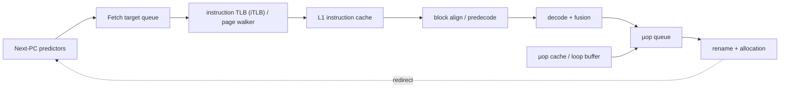

# Fetch, Decode, and Micro-Operation (µop) Delivery — Keeping a Wide Backend Fed

> **First-time reader orientation:** Fetching obtains instruction bytes; decoding turns those bytes into internal actions called micro-operations. A wide backend can only execute quickly if the frontend supplies enough correct µops every cycle. This chapter follows bytes through address translation, instruction cache, alignment, decoding, buffering, and redirect rather than assuming “four-wide” means four useful operations always arrive.

> **Abbreviation key — skim now and return as needed:** central processing unit (CPU); instruction set architecture (ISA); reduced instruction set computer (RISC); translation lookaside buffer (TLB); level-one cache (L1);
> fetch target queue (FTQ); program counter (PC); gigabyte (GB); gigahertz (GHz).

> **Prerequisites:** [CPU Architecture](../01_Core_Foundations/01_CPU_Architecture.md) (pipeline and hazards), [Branch Prediction](01_Branch_Prediction_Deep_Dive.md) (next-PC prediction), and [Cache Microarchitecture](../04_Cache_Hierarchy/01_Cache_Microarchitecture.md) (cache access and miss tracking).
> **Hands off to:** [Out-of-Order Execution](../03_Out_of_Order_Backend/01_OoO_Execution.md) at rename/allocation and [Retirement, Recovery, and Precise State](../03_Out_of_Order_Backend/03_Retirement_Recovery_and_Precise_State.md) for redirect/recovery semantics.

---

## 0. Why this page exists

A $W$-wide backend cannot retire $W$ operations per cycle unless the frontend delivers a sustained stream at least that wide. Peak decode width is only one link in a serial supply chain: predict a PC, translate it, fetch bytes, align variable-length instructions, decode them, form µops, and buffer them across bubbles and redirects.

The frontend is a queueing network. Its quality is measured by **useful µops delivered**, not bytes fetched or instructions decoded.

## Before the details: the frontend is a supply chain

A CPU backend consumes decoded work, but instructions begin as bytes stored at addresses. The frontend must choose a next address, translate it, fetch the containing cache line, find instruction boundaries, decode each instruction, and queue the resulting micro-operations. Any stage can reduce useful delivery even if the nominal decode width is large.

Think of two rates. **Peak width** is the most operations one stage can handle in an ideal cycle. **Sustained delivery** is the average number of correct-path operations reaching rename after misses, redirects, alignment waste, queue boundaries, and variable instruction lengths. A four-wide decoder fed only half the time supplies at most two operations per cycle on average. A micro-operation cache may bypass expensive decoding, but it still depends on correct prediction and fetch addresses.

**Beginner checkpoint:** a branch-prediction error wastes more than the cycle in which it is discovered. It discards younger work already fetched and decoded, redirects the program counter, and refills the frontend. That is why the chapter measures lost delivery slots rather than treating each mechanism as an isolated hit rate.

## 1. The delivery equation

Let $W_r$ be rename width. In cycle $t$, useful delivery is bounded by

$$
D_t=\min(W_r,\ D_{pred,t},\ D_{I\$,t},\ D_{align,t},\ D_{decode,t},\ D_{queue,t}).
$$

Over a window,

$$
\eta_{FE}=\frac{\sum_t D_t^{useful}}{W_rT}=1-F_{latency}-F_{bandwidth}-F_{badpath}-F_{backend-blocked},
$$

where categories must be mutually exclusive for diagnosis. A branch miss can appear as bad-path work followed by frontend latency; a full backend can stop delivery even when the frontend is healthy.

The frontend needs headroom above retirement width because branches, macro-to-µop expansion, alignment loss, and recovery make supply bursty.

## 2. Fetch blocks: prediction and I-cache boundaries disagree

Predictors reason in branch targets and fetch blocks; I-caches return aligned lines or sectors; ISA instructions can cross either boundary. The frontend therefore tracks:

- start PC and valid-byte mask;
- predicted branch positions and targets;
- page and cache-line boundaries;
- exception/fault metadata per byte or instruction;
- history/checkpoint identity;
- path confidence and fetch sequence number.

If a fetch block spans two I-cache lines, two banks, or two pages, effective bandwidth can halve unless the hardware supports dual accesses. Variable-length ISAs add a second alignment problem: the decoder must find instruction boundaries after redirects and across block joins.

### 2.1 Fetch bandwidth

For average instruction length $\bar{L}$ bytes, target decode width $W_d$, and useful-byte efficiency $\eta_b$,

$$
B_{fetch}\ge\frac{W_d\bar{L}}{\eta_b}\ \text{bytes/cycle}.
$$

At six instructions/cycle, average length 3.5 B, and 75% efficiency, the path needs at least 28 B/cycle—often rounded to a 32-byte fetch block. Crossing and taken-branch losses still require buffering or multi-block capability.

## 3. ITLB and I-cache: two misses, one visible stall

Translation and tag lookup may be parallel in a virtually indexed, physically tagged I-cache when index bits fit within the page offset. Otherwise translation must lead or aliases must be handled.

Frontend miss latency includes:

$$
L_{fetch-miss}=L_{detect}+L_{TLB/walk}+L_{cache/hierarchy}+L_{refill}+L_{restart}.
$$

Instruction working sets differ from data: they have control-flow-driven spatial locality, shared read-only pages, and bursts around phase changes. Important structures include:

- L1I miss-status entries and line-fill buffers;
- instruction prefetchers (next-line, stream, branch-directed);
- page-walk cache and ITLB hierarchy;
- predecode bits or branch metadata stored with cache lines;
- self-modifying-code and instruction-coherence machinery.

An instruction prefetcher must follow predicted control flow. Fetching sequentially past a frequently taken branch wastes bandwidth and cache capacity.

## 4. Alignment, predecode, and variable-length instructions

For a fixed-width ISA, byte-to-instruction boundaries are simple once PC alignment is known. Compressed or variable-length encodings require boundary detection, length decode, and stitching across fetch blocks.

Predecode can store start/end/branch markers with the I-cache line. This moves work out of the critical decode path but enlarges the cache and requires metadata generation on refill. A carry buffer holds trailing bytes from the prior block.

Alignment throughput depends on both byte bandwidth and branch density. If a taken branch appears early in a block, later bytes are fetched but not useful. Useful byte efficiency is

$$
\eta_b=\frac{\text{bytes belonging to correct-path decoded instructions}}{\text{bytes returned by L1I}}.
$$

This metric exposes line crossings, branch truncation, wrong-path fetch, and alignment waste in one denominator.

## 5. Decode is a translation and expansion engine

Decode performs length/legality checks, identifies sources/destinations, forms immediates, classifies execution, and may expand one architectural instruction into several µops. Complex instructions can enter a microcode sequencer.

The distinction matters:

$$
W_{decode,inst}\ne W_{deliver,\mu op}.
$$

Six decoded instructions can produce more than six µops, overflowing a downstream queue. Conversely, **macro-fusion** may combine a compare+branch pair and **micro-fusion** may keep address and data work together through part of the pipeline, reducing queue pressure.

Wide decode costs include replicated decoders, length-steering logic, crossbar movement from byte positions to decoder slots, and output routing to rename. The crossbar—not the opcode table—often sets area/timing.

## 6. µop caches and loop buffers

A µop cache stores decoded operations keyed by instruction address and path context. Hits bypass byte alignment and decode, saving energy and raising bandwidth. Its design questions are cache-like but path-sensitive:

- tag by virtual or physical address;
- organize by basic block, fetch block, or fixed µop line;
- represent taken branches and fall-through boundaries;
- handle code invalidation and permission changes;
- prevent stale translations after self-modifying code;
- balance capacity against decode energy.

If hit rate is $h$, hit delivery $W_u$, and decode delivery $W_d$, an optimistic average is

$$
D\le hW_u+(1-h)W_d,
$$

but transitions, misses, branch truncation, and downstream queues reduce it. A loop buffer is smaller and detects repeated short sequences; it can suppress fetch/predict/decode activity nearly entirely for tight loops.

## 7. Decoupling queues absorb burstiness

The fetch-target queue (FTQ) decouples prediction from instruction fetch. A byte/instruction queue decouples fetch from decode. A µop queue decouples decode/µop cache from rename.

Little's law gives a sizing floor. If the downstream can stall for average duration $L_s$ while upstream produces $\lambda$ entries/cycle,

$$
N_{queue}\gtrsim\lambda L_s.
$$

But queues cannot cover persistent bandwidth deficits. They smooth a 10-cycle I-cache bank conflict or decoder switch; they do not make a four-wide decoder feed a sustained six-wide backend.

Each queue also stores recovery metadata: PCs, prediction IDs, exceptions, instruction lengths, and possibly raw bytes. Deepening it increases wrong-path work and redirect drain time unless entries are invalidated by generation tags.

## 8. Redirect and restart latency

When a branch or exception redirects, the path is

$$
L_{redirect}=L_{resolve}+L_{signal}+L_{predict/resteer}+L_{fetch}+L_{decode}+L_{rename}.
$$

Predictor-side overrides may redirect earlier than execution, while execution confirmation ensures correctness. Multiple redirects can race: an older exception must beat a younger branch correction. Use age or sequence tags and define one priority rule.

Recovery strategies:

- flush all younger frontend state and restart;
- retain unaffected FTQ blocks when target remains inside known path;
- use rename/history checkpoints for fast restoration;
- tag queues with epochs so stale responses are discarded.

The frontend must tolerate late I-cache/TLB responses from a killed epoch. “Flush” is a logical invalidation, not a guarantee that every memory response disappears.

## 9. Instruction coherence and security boundaries

Code modification requires ordering stores, data-cache cleaning when needed, instruction-cache invalidation, and pipeline synchronization according to the ISA/platform. A µop cache and predecode metadata are additional instruction copies that must be invalidated.

Frontend predictors and caches are also speculation channels. Mitigations include context tagging, partitioning, flush controls, restricted predictor updates, and bounds on speculative fetch. These choices affect capacity, context-switch latency, and performance; they are architecture state even when not programmer-visible.

## 10. Counters that make the frontend diagnosable

At minimum count:

- cycles with zero delivery while backend was ready;
- delivered versus useful-retired µops;
- prediction redirects by class and recovery latency;
- L1I, ITLB, and page-walk misses and blocked cycles;
- decode, µop-cache, and microcode-source µops;
- fetch bytes, useful bytes, and line/page crossings;
- queue full/empty cycles at each boundary;
- self-modifying-code or machine-clear events.

Attribute a cycle to the oldest blocking cause to avoid double-counting. Preserve histograms: average redirect latency hides rare instruction page walks that dominate tails.

## 11. Numbers to remember

- Fetch byte demand is decode width × average instruction length ÷ useful-byte efficiency.
- Peak decode width is not sustained useful-µop delivery.
- A µop cache trades tag/data capacity for decode energy and bandwidth.
- Queues cover burstiness, not a permanent upstream bandwidth shortage.
- Redirect latency includes restart through rename, not only branch execution.
- Every instruction copy—L1I, predecode, µop cache, loop buffer—participates in code invalidation.

## 12. Worked problems

### Problem 1 — required fetch width

An eight-wide frontend sees 4-byte average instructions and 80% useful-byte efficiency:

$$
B\ge\frac{8\times4}{0.8}=40\ \text{B/cycle}.
$$

A 32 B/cycle I-cache interface cannot sustain the target even with perfect decode; a wider or dual-block fetch path is needed.

### Problem 2 — queue coverage

A six-µop/cycle decoder must cover a 12-cycle µop-cache-to-decode switch bubble. The minimum elasticity is $6\times12=72$ µops, before variability and metadata. If such bubbles occur continuously, 72 entries only delay the stall.

### Problem 3 — bad-path energy

A core fetches 40 B/cycle and 18% are wrong-path or discarded alignment bytes. At 2.5 GHz, wasted frontend traffic is

$$
40\times0.18\times2.5\times10^9=18\ \text{GB/s}
$$

inside the core, explaining why prediction accuracy is an energy feature as well as performance.

## Cross-references

- **Steering:** [Branch Prediction Deep Dive](01_Branch_Prediction_Deep_Dive.md).
- **Translation/cache supply:** [TLB and Virtual Memory](../05_Virtual_Memory/01_TLB_and_Virtual_Memory.md), [Cache Microarchitecture](../04_Cache_Hierarchy/01_Cache_Microarchitecture.md).
- **Consumers and recovery:** [Out-of-Order Execution](../03_Out_of_Order_Backend/01_OoO_Execution.md), [Retirement, Recovery, and Precise State](../03_Out_of_Order_Backend/03_Retirement_Recovery_and_Precise_State.md).

## References

1. Intel, [Top-Down Microarchitecture Analysis Method](https://www.intel.com/content/www/us/en/docs/vtune-profiler/cookbook/2025-4/top-down-microarchitecture-analysis-method.html).
2. A. Seznec, “A 64-Kbytes ITTAGE Indirect Branch Predictor,” JWAC 2011.
3. J. F. K. et al., “The Micro-op Cache: A Power Aware Frontend for Variable Instruction Length ISA,” ISCA 2001.
4. RISC-V International, Unprivileged and Privileged ISA specifications (instruction encodings and `FENCE.I`).
5. Intel, *64 and IA-32 Architectures Optimization Reference Manual*.

---

**Navigation:** [Frontend and Prediction index](00_Index.md) · [CPU index](../00_Index.md)
