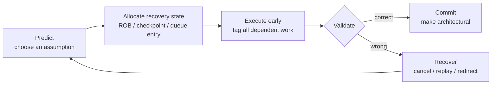
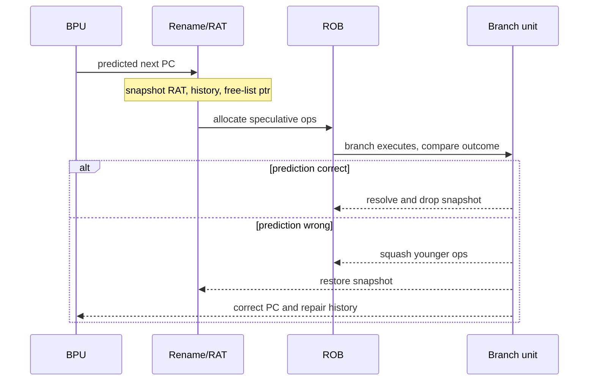

# Speculative Execution — Predict, Validate, Recover, and Contain Side Effects

> **First-time reader orientation:** A fast central processing unit (CPU) often starts an operation before it knows that the operation is on the correct program path or that all of its inputs are safe to use. That early work is *speculative*. The result may become real only after the CPU validates the guess; otherwise the CPU must discard the work and restore an older correct state.

> **Abbreviation key — skim now and return as needed:** central processing unit (CPU); instruction set architecture (ISA); out-of-order (OoO); program counter (PC); branch prediction unit (BPU); fetch target queue (FTQ); reorder buffer (ROB); register alias table (RAT); physical register file (PRF); load-store unit (LSU); load-store queue (LSQ); load queue (LQ); store queue (SQ); memory dependence predictor (MDP); store-set identifier table (SSIT); last fetched store table (LFST); translation lookaside buffer (TLB); miss status holding register (MSHR); instructions per cycle (IPC); misses per thousand instructions (MPKI).

> **Prerequisites:** [Branch Prediction](01_Branch_Prediction_Deep_Dive.md) for next-PC prediction, [Out-of-Order Execution](../03_Out_of_Order_Backend/01_OoO_Execution.md) for rename and the ROB, and [Retirement and Recovery](../03_Out_of_Order_Backend/03_Retirement_Recovery_and_Precise_State.md) for precise architectural state.
> **Hands off to:** [Advanced Scheduling, Wakeup, and Replay](../03_Out_of_Order_Backend/04_Advanced_Scheduling_Wakeup_and_Replay.md) for the timing-critical implementation, [Load-Store Unit](../03_Out_of_Order_Backend/02_Load_Store_Unit_and_Memory_Ordering.md) for memory ordering, and [XiangShan](../07_Core_Case_Studies/01_Xiangshan_CPU_Design.md) for a current open implementation.

---

## 0. Why speculation deserves its own chapter

Branch prediction is one form of speculation, but it is not the whole subject. A modern CPU guesses in several places at once:

- **Control speculation:** which instruction address comes next?
- **Memory-dependence speculation:** may a load pass older stores whose addresses are not known yet?
- **Latency speculation:** will a producer finish at its usual time, so dependents can wake before writeback?
- **Cache and translation speculation:** did a way, TLB entry, or permission check hit as expected?
- **Value speculation and runahead:** can the machine predict a value, or temporarily execute only to discover future misses?

These guesses share one engineering pattern. Each needs a prediction, a place to keep recoverable state, a validation event, and a rule for which effects may escape. Studying them as one pattern prevents a common misunderstanding: **speculation is not “executing randomly and hoping.” It is a controlled transaction with an undo boundary.**



## 1. Architectural, speculative, and transient state

The **instruction set architecture (ISA)** defines the state software is allowed to observe: registers, memory, exceptions, privilege state, and the order in which these appear. Microarchitecture adds much more state—predictor tables, cache tags, replacement bits, queue entries, physical registers, and in-flight requests.

It is useful to divide that implementation state into three categories:

1. **Architectural state** has passed retirement and is part of the software-visible machine.
2. **Speculative state** belongs to instructions that might retire but have not yet done so. ROB entries, newly allocated physical registers, and an uncommitted store are examples.
3. **Transient side effects** are changes caused by speculative work that may remain after the work is squashed: a filled cache line, trained predictor entry, occupied port, or altered replacement state.

Correctness requires that a wrong guess never corrupt architectural state. Security is stricter: secret-dependent transient effects must not become an observable side channel. A design can therefore be architecturally correct and still insecure.

## 2. The speculation contract

Every speculative mechanism should answer six questions before register-transfer level (RTL) design begins:

| Question | Why it is required |
|---|---|
| What is predicted? | Defines the hypothesis: target, dependency, latency, hit, or value. |
| What identifies the speculation? | A ROB index, FTQ index, generation number, or queue tag distinguishes live work from stale responses. |
| What state is recoverable? | RAT snapshots, free-list pointers, history state, and queue tails must return to a known point. |
| What validates the guess? | Branch execution, address comparison, writeback, tag check, or retirement closes the speculation. |
| What is the recovery scope? | One instruction may replay, a dependency slice may replay, or the whole younger machine may flush. |
| Which effects may escape? | Stores, exceptions, predictor training, cache fills, and external requests need explicit policy. |

The key invariant is:

> An instruction may produce tentative data early, but it may update architectural state only when every older instruction is known to permit it.

The ROB normally enforces the age part of that invariant. Stores add another boundary: their address and data may be computed early, but a store must not become globally visible until it is non-speculative under the memory model.

### 2.1 Confidence is an allocation policy, not merely a prediction bit

A predictor may produce both a choice and a confidence estimate. Confidence determines whether the machine should consume speculative resources for that choice. Let $p_c$ be probability the prediction is correct, $B$ the latency benefit when correct, $C_r$ recovery cost when wrong, and $C_e$ energy/occupancy cost paid either way. A first expected-value model is

$$
V_{spec}=p_cB-(1-p_c)C_r-C_e.
$$

Speculate only when $V_{spec}>0$, subject to queue and security constraints. This exposes several non-obvious policies:

- a high-confidence prediction may still be rejected when recovery bandwidth is saturated;
- a low-confidence prediction may be worthwhile if recovery is local and cheap;
- confidence should be calibrated by phase and context, not only ranked globally;
- two individually profitable guesses may be unprofitable together because one wrong guess squashes the other's work;
- energy and transient-state exposure can move the threshold even when IPC improves.

Confidence storage also has aliasing and hysteresis. A saturating counter learns slowly after a phase change; a table shared across contexts can transfer behavior or information. Research evaluation should report calibration—for example, actual correctness of predictions assigned 90% confidence—and coverage, the fraction of eligible operations actually speculated.

## 3. Control speculation: following a predicted path

The frontend predicts a next PC because waiting for a branch to execute would starve the pipeline. A practical high-performance predictor is itself pipelined. A small, fast structure gives an early answer; larger structures later override it with a more accurate answer. The FTQ records each predicted fetch block and the metadata needed to train or repair the predictor.

A control-speculation lifetime is:

1. The branch prediction unit predicts direction and target.
2. The FTQ records the predicted block and speculative history.
3. Instructions on that path enter rename and receive ROB entries.
4. The branch executes and computes its actual outcome.
5. If correct, execution continues and training eventually uses a trusted outcome.
6. If wrong, the redirect selects the correct PC and all younger work is invalidated.

Concretely, that lifetime is a cross-unit checkpoint protocol: rename snapshots the recovery state the moment the speculative path begins, and the branch unit later either drops the snapshot (correct) or rolls back to it and squashes younger work (wrong).



The lost work per misprediction is roughly

$$
W_{lost} \approx P_{redirect}\times I_{front},
$$

where $P_{redirect}$ is the redirect-to-refill penalty in cycles and $I_{front}$ is the average number of operations delivered per cycle. This is why a wider machine raises the value of accurate prediction even when the number of lost *cycles* is unchanged.

**Worked example — width multiplies the cost.** Fix the redirect penalty at $P_{redirect}=15$ cycles. A 4-wide frontend throws away $4\times15=60$ issue slots per misprediction; an 8-wide frontend throws away $8\times15=120$ — twice the wasted work for the *same* 15 lost cycles. Now add frequency: if 20% of instructions are branches predicted at 96% accuracy, mispredictions arrive at $1000\times0.20\times0.04=8$ per thousand instructions (8 MPKI). On the 8-wide core that is $8\times15=120$ bubble cycles per 1000 instructions. Against an ideal $1000/8=125$-cycle run, those bubbles nearly double execution time and drop sustained throughput to $1000/(125+120)\approx4.1$ IPC — roughly half of peak. Accuracy, not raw width, is what keeps a wide machine's slots full.

### 3.1 Speculative predictor history

History-based predictors need the outcome of recent branches to predict the next branch. Waiting until retirement would make the history stale, so the predictor shifts predicted outcomes into a speculative history register. A misprediction must restore the old history and then insert the actual outcome. The same issue appears in a return-address stack: calls and returns on a wrong path must not permanently corrupt the stack.

Common recovery choices are:

- save a complete history checkpoint per in-flight branch;
- save a pointer into a persistent history structure;
- reconstruct history from the FTQ or ROB;
- keep separate speculative and committed structures.

Full checkpoints recover quickly but cost storage and ports. Reconstruction stores less but adds redirect latency.

## 4. Memory-dependence speculation: loads before unknown stores

Register dependencies are visible after decode and rename. Memory dependencies are not: the CPU may not know whether `load [r1]` overlaps an older `store [r2]` until both addresses are calculated.

The conservative policy waits for every older store address. It is safe but often stalls independent loads. The aggressive policy issues the load, compares its address against older stores later, and recovers on a violation. Its expected cost is

$$
C_{spec}=p_{vio}C_{recover},
$$

where $p_{vio}$ is the probability of a true ordering violation. Speculation wins while this is lower than the delay avoided by not waiting.

An **MDP (memory dependence predictor)** learns which static loads have violated before. A store-set design usually contains:

- an **SSIT (store-set identifier table)** mapping an instruction PC to a learned dependency group;
- an **LFST (last fetched store table)** or related structure naming an older in-flight store in that group;
- an update path that merges or refreshes groups after observed violations.

The prediction does not need to name an exact byte address. It answers the scheduling question: “which older store must be far enough along before this load may issue?”

### 4.1 Validation and replay

The LSQ validates speculation using age and address comparisons. It must distinguish at least:

- a true store-to-load ordering violation;
- store data not ready for forwarding;
- a TLB miss or permission delay;
- a cache-bank conflict or miss;
- a coherence probe or invalidation race.

Not all causes justify flushing the whole pipeline. A blocked cache port can replay one load. A load that supplied a wrong value to many dependents may require selective replay of its dependency chain or a redirect that removes all younger instructions. Recovery scope is a performance-versus-complexity choice, not merely a correctness choice.

## 5. Latency speculation and speculative wakeup

Suppose an add normally produces its result one cycle after issue. If the scheduler waits for physical-register writeback before waking a dependent add, it inserts an avoidable cycle. Instead, issue logic can send a **speculative wakeup** based on the producer's expected latency, allowing the dependent to select the bypassed result as it becomes available.

This creates a new obligation: if the producer is canceled, delayed, or misses in the cache, every consumer awakened by that prediction must be canceled or replayed. Implementations carry dependency tags or short load-dependency vectors so a late cancel reaches the affected consumers.

The benefit is largest in a recurrence:

$$
t_{loop}=t_{select}+t_{operand}+t_{execute}+t_{wakeup}.
$$

Removing even one registered cycle from this loop can raise dependent-operation throughput. The cost is a fast broadcast network and a precise cancellation path, both of which become timing-critical as issue width grows.

## 6. Cache, TLB, and way speculation

An L1 cache may read data before a full physical tag comparison finishes, or predict the likely way to save power and mux delay. A TLB hierarchy may allow a fast translation to drive a parallel cache access before all permission and alias checks settle.

These mechanisms are safe only if:

- returned data remains tagged as speculative until tag and permission checks complete;
- exceptions are recorded but not architecturally raised before the instruction reaches the retirement boundary;
- a failed way or translation prediction cancels dependent wakeups;
- stale refills carry an epoch or transaction identity so they cannot complete a reallocated queue entry.

This is the same speculate–validate–recover pattern again, applied to a memory lookup rather than control flow.

## 7. Value prediction and runahead

Two more aggressive techniques are important even when a particular core does not implement them.

**Value prediction** predicts the output of a load or arithmetic instruction and lets dependents execute with that value. Validation compares the prediction with the real result. A mismatch can invalidate a large dependency slice, so confidence estimation is essential; predicting too often may waste more energy and recovery bandwidth than it saves.

**Runahead execution** addresses a different problem. When an old cache miss blocks retirement and the ROB fills, the core checkpoints architectural state, marks the missing value invalid, and continues executing only to discover independent future misses. Those speculative misses act as prefetches. When the original miss returns, the machine restores the checkpoint and executes normally. Runahead does not try to commit the temporary instructions; its product is memory-level parallelism.

These techniques show the outer boundary of speculation: the machine may use wrong-path or non-committing work if the useful microarchitectural effect—usually an early memory request—outweighs its energy and recovery cost.

### 7.1 Why general value prediction remains difficult

Value prediction can break a true data-dependence chain rather than merely choose a control path. That makes its benefit large and its validation/recovery burden unusually strict.

Predictor families include last-value prediction, stride or finite-context prediction, and computation reuse. They work on different value regularities. An implementation also needs:

1. **identity:** static instruction and dynamic instance or generation;
2. **confidence:** a threshold that avoids high-fanout low-value mistakes;
3. **validation:** exact comparison with the non-predicted result before retirement;
4. **dependence tracking:** which consumers observed the predicted value;
5. **recovery:** selective re-execution or a younger-machine flush;
6. **memory and exception rules:** predicted values cannot authorize stores, addresses, or privileged effects prematurely.

If a prediction has $F$ dependent operations and each consumes execution/operand energy $e$, a misprediction adds at least $Fe$ wasted energy before queue, cache, and recovery effects. High fanout increases both potential speedup and recovery amplification. Validation latency also matters: if the real value returns before consumers can use the prediction, the mechanism adds tables and ports without shortening the critical path.

Exact validation preserves architectural correctness, but microarchitectural side effects created from a predicted address or branch condition may remain observable. A design can restrict predicted values from address generation or authorization decisions, lowering risk at the cost of much of the benefit. This security/performance boundary should be part of the value-prediction contract, not an afterthought.

Runahead avoids exact value prediction by marking unavailable values invalid and suppressing dependent results. Its useful output is independent memory requests. Research comparisons must count *prefetch accuracy* (fraction of runahead requests later used), *coverage* (demand misses exposed early), timeliness, memory-bandwidth pollution, and lost opportunity when runahead occupies frontend/backend resources.

## 8. Recovery granularity

| Recovery method | Removes | Advantage | Cost |
|---|---|---|---|
| local retry | one request | cheapest when no consumer observed bad data | queue must retain complete request state |
| selective replay | producer and affected consumers | preserves unrelated work | dependency tracking and cancel network |
| checkpoint restore | speculative mappings/history after a saved point | fast state repair | snapshot storage and checkpoint selection |
| ROB walk | younger instructions in program order | simple and general | recovery takes several cycles |
| full redirect/flush | all younger work | easiest correctness argument | loses maximum useful work |

An advanced core normally uses several. Cache-bank conflicts retry locally; load miss wakeup failures selectively cancel dependents; a branch misprediction redirects the frontend and restores a checkpoint; an exception may drain to a precise ROB boundary.

## 9. Speculation and security

Squashing an instruction removes its architectural result, but does not automatically undo cache fills, predictor changes, port contention, or DRAM activity. A transient instruction that reads a secret and then uses it to choose a cache line can encode the secret in timing even though the instruction never retires.

**Concrete intuition — bounds-check bypass (Spectre v1).** The leak needs two ingredients: a secret read, and a secret-dependent footprint that outlives the squash.

```c
if (i < array1_len)                 // branch mistrained to predict in-bounds
    y = array2[ array1[i] * 512 ];  // runs transiently when i is out of bounds
```

Train the branch taken with legal values of $i$, then supply an out-of-bounds $i$. The frontend speculates down the taken path before the bound resolves. Transiently, $s = array1[i]$ reads a secret byte and the dependent load pulls cache line $array2[s \times 512]$ into L1 (the $\times 512$ stride puts each possible byte value on its own line). The squash discards $y$, its physical registers, and the ROB entries — but not the cache fill. The attacker afterwards times every candidate line $array2[k \times 512]$; the single fast one reveals $k = s$. No architectural state leaked; the *microarchitectural footprint of squashed work* did — which is exactly why blocking the illegal read alone is not enough.

A secure design therefore distinguishes **permission to execute** from **permission to transmit an effect**. Mitigation families include:

- block speculative access until authorization is known;
- partition or flush predictor state across protection domains;
- delay cache-visible changes or keep them in speculative buffers;
- prevent forwarding of faulting or unauthorized values;
- provide speculation barriers and predictor-control instructions;
- verify non-interference properties in addition to ISA correctness.

There is no universal free defense. Delaying all speculative effects sacrifices much of the performance speculation was added to obtain, so threat model and trust boundary must be explicit architecture inputs.

### 9.1 Security-aware speculation as a resource policy

Treat protection context as another speculation dimension. A prediction trained in one context and consumed in another can create interference even if their architectural state is isolated. A design may tag, partition, flush, or selectively share predictor and cache state. Each choice trades capacity, warm-up, latency, and leakage.

A useful policy matrix asks whether an operation may:

| Stage | Same trust domain | Cross-domain or authorization unresolved |
|---|---|---|
| predict and fetch | commonly allowed | may require isolated predictor/history state |
| execute arithmetic | allowed while recoverable | depends on whether operands are authorized |
| form a memory address | normally allowed | high risk if secret-dependent |
| allocate cache/TLB state | performance-friendly | may require delay, shadow state, or partition |
| train shared predictor | often delayed until a trusted point | partition, sanitize, or suppress |
| make a store/external request visible | only after architectural permission | never from an unresolved path |

“Disable speculation” is rarely a precise proposal. Name the producer, consumer, side effect, validation point, and trust boundary. Then measure both the leakage channel addressed and the cost in redirect stalls, memory-level parallelism, energy, and service goodput.

## 10. XiangShan as a current open example

Current Kunminghu documentation exposes several forms of speculation that are often hidden in commercial CPUs:

- a multi-stage BPU whose later answers may override earlier answers;
- an FTQ that retains prediction metadata through commit and recovers its pointers on redirects;
- speculative branch history and a persistent return-address stack;
- rename snapshots used to shorten recovery compared with walking from committed state;
- a memory-dependence predictor based on a load-wait table and a store-set variant;
- speculative wakeup in distributed issue queues, with cancellation feedback;
- a load replay queue that records causes such as TLB miss, cache miss, and forwarding violation;
- redirect arbitration among branches, memory violations, and ROB flushes.

The important lesson is not that XiangShan “has speculation.” It is that speculation is a **cross-pipeline protocol**. Frontend, rename, scheduler, LSU, cache, and retirement all exchange identities, cancel events, and recovery state. Leaving any one of those paths out produces either silent corruption or a deadlock.

## 11. Verification checklist

For each speculation source, verify both the prediction and every way it can be wrong:

1. A correct prediction commits exactly once.
2. A wrong prediction cannot update architectural state.
3. A canceled producer cancels every speculatively awakened consumer.
4. A stale response cannot match a recycled ROB, LSQ, FTQ, or MSHR entry.
5. The oldest redirect wins when several redirects arrive together.
6. Recovery restores RAT, free list, history, queue tails, and privilege context to the same logical boundary.
7. Exceptions remain precise even when detected early.
8. Stores never become visible from a squashed path.
9. Forward progress holds under repeated replay and backpressure.
10. Security tests cover observable transient state, not only retired results.

## 12. Worked examples

**1 — Is memory speculation worthwhile?** A load would wait an average of 5 cycles for unresolved stores. Violations occur for 1% of dynamic loads and cost 18 cycles to recover. The expected speculative cost is $0.01\times18=0.18$ cycles per load, far below the 5-cycle conservative wait. Even at a 10% violation rate the expected cost is 1.8 cycles, so speculation still wins—assuming recovery bandwidth does not saturate.

**2 — Why selective replay matters.** A delayed load has 12 younger dependent operations and the ROB contains 140 younger operations total. Replaying the dependency slice discards 13 operations including the load; a full flush discards 141. If both recover in the same number of cycles, selective replay reduces wasted execution by roughly $141/13\approx10.8\times$. The tracking logic is justified only if such events are frequent enough.

**3 — Checkpoint capacity.** Four rename snapshots are available and branches eligible for snapshots arrive every 8 cycles. A snapshot lives for 28 cycles on average. Little's law predicts $28/8=3.5$ live snapshots, so four covers the mean with little burst headroom. The design must either throttle snapshot creation, fall back to ROB walking, or snapshot additional periodic boundaries when the queue is full.

**4 — Confidence threshold.** A predicted load value saves 14 cycles when correct, costs 22 cycles to recover when wrong, and consumes an equivalent 1 cycle of energy/queue opportunity every attempt. The expected value is $14p_c-22(1-p_c)-1=36p_c-23$, so the simple threshold is $p_c>23/36\approx63.9\%$. If recovery contention doubles the wrong-prediction cost, the threshold becomes $(44+1)/(14+44)\approx77.6\%$. Confidence policy must therefore react to machine occupancy, not only static predictor accuracy.

## Numbers to remember

| Quantity | Typical scale | Design meaning |
|---|---:|---|
| branch frequency | about 15–25% of instructions | control speculation is continuously active |
| high-performance redirect penalty | roughly 8–20 cycles | recovery latency multiplies predictor mistakes |
| L1 load-use latency | roughly 3–5 cycles | makes speculative wakeup valuable and fragile |
| ROB size | roughly 100–600 operations | maximum ordinary speculative window |
| store/load violation rate | workload-dependent, often low | low rate is why aggressive load issue pays |
| stale-response protection | at least identity plus generation/epoch | prevents recycled-entry corruption |

## Cross-references

- [Branch Prediction](01_Branch_Prediction_Deep_Dive.md) explains the predictor structures that create control speculation.
- [Advanced Scheduling, Wakeup, and Replay](../03_Out_of_Order_Backend/04_Advanced_Scheduling_Wakeup_and_Replay.md) follows speculative data through the issue machinery.
- [Memory Consistency and Atomics](../06_Coherence_and_Consistency/02_Memory_Consistency_and_Atomics.md) separates legal architectural reordering from internal speculation.
- [XiangShan](../07_Core_Case_Studies/01_Xiangshan_CPU_Design.md) maps these mechanisms onto current open modules.

## References

1. G. Z. Chrysos and J. S. Emer, “Memory Dependence Prediction using Store Sets,” ISCA 1998 — [paper](https://www.princeton.edu/~rblee/ELE572Papers/MemoryDependencePredictionStoreSets_Emer.pdf).
2. O. Mutlu et al., “Runahead Execution: An Alternative to Very Large Instruction Windows,” HPCA 2003 — [paper](https://www.cs.cmu.edu/~18742/papers/Mutlu2003.pdf).
3. P. Kocher et al., “Spectre Attacks: Exploiting Speculative Execution,” 2018 — [paper](https://arxiv.org/abs/1801.01203).
4. XiangShan Team, “Kunminghu V3 Backend, FTQ, CtrlBlock, IssueQueue, and LSU Design Documents” — [documentation](https://docs.xiangshan.cc/projects/design/en/kunminghu-v3/).
5. XiangShan Team, “Memory Dependence Prediction” — [documentation](https://docs.xiangshan.cc/zh-cn/dev/memory/mdp/mdp/).
6. M. H. Lipasti and J. P. Shen, “Exceeding the Dataflow Limit via Value Prediction,” MICRO 1996.
7. A. Perais and A. Seznec, “Practical Data Value Speculation for Future High-end Processors,” HPCA 2014.

---

← [Fetch, Decode, and µop Delivery](02_Fetch_Decode_and_Uop_Delivery.md) · [Frontend index](00_Index.md) · next → [Out-of-Order Backend](../03_Out_of_Order_Backend/00_Index.md)
