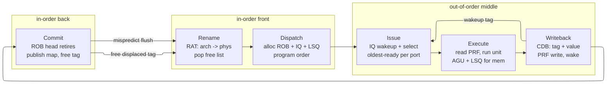
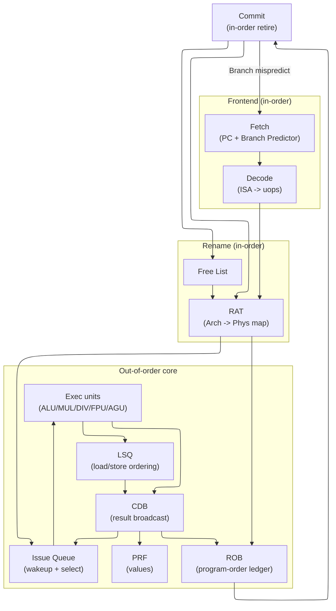
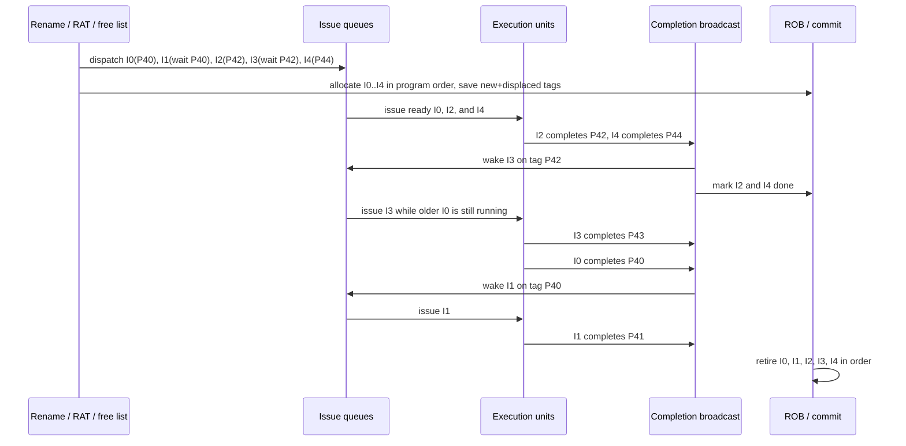
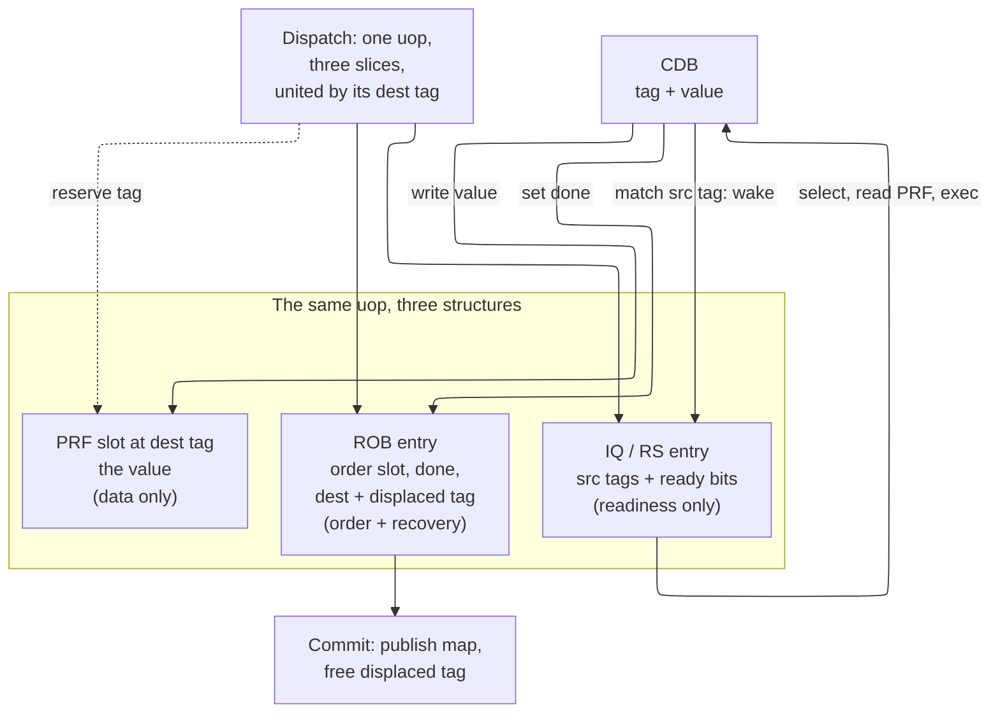
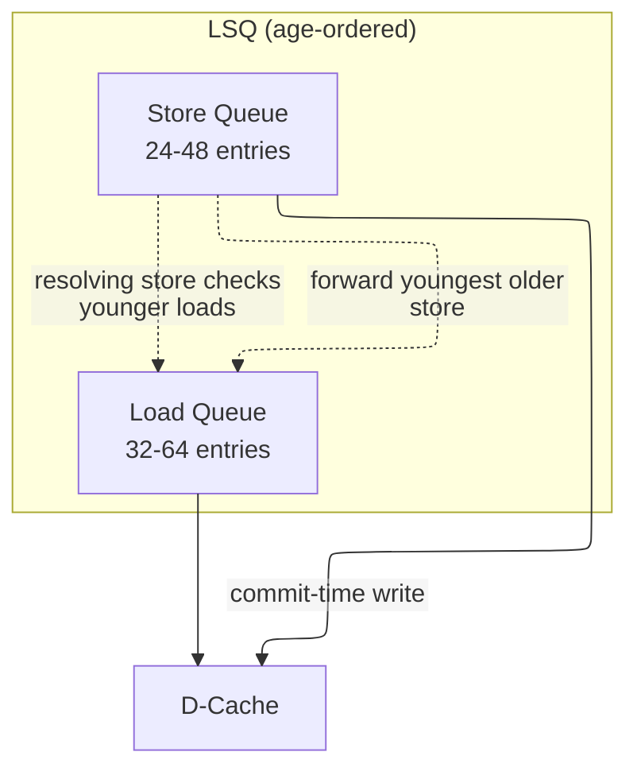

# Out-of-Order Execution — Datapath Design Deep Dive

> **First-time reader orientation:** Out-of-order execution lets a ready younger instruction run while an older instruction waits, but results still become architectural in program order. Register renaming removes false name dependencies; an issue queue finds ready work; a reorder buffer (ROB) holds speculative instructions until retirement. The chapter builds these structures from the correctness requirement.

> **Abbreviation key — skim now and return as needed:** central processing unit (CPU); instruction set architecture (ISA); reduced instruction set computer (RISC); instructions per cycle (IPC); cycles per instruction (CPI);
> instruction-level parallelism (ILP); memory-level parallelism (MLP); misses per thousand instructions (MPKI); design-space exploration (DSE); out-of-order (OoO);
> translation lookaside buffer (TLB); reorder buffer (ROB); load-store queue (LSQ); load queue (LQ); store queue (SQ);
> issue queue (IQ); physical register file (PRF); register alias table (RAT); address-generation unit (AGU); arithmetic logic unit (ALU);
> common data bus (CDB); single instruction, multiple data (SIMD); simultaneous multithreading (SMT); static random-access memory (SRAM); dynamic random-access memory (DRAM);
> content-addressable memory (CAM); first in, first out (FIFO); level-one cache (L1); level-two cache (L2); level-three cache (L3);
> last-level cache (LLC); tagged geometric-history-length predictor (TAGE); program counter (PC); operating system (OS); complementary metal-oxide-semiconductor (CMOS);
> fan-out-of-four (FO4); floating point (FP); fused multiply-add (FMA); Microprocessor without Interlocked Pipeline Stages (MIPS) architecture; read after write (RAW);
> write after read (WAR); write after write (WAW); control and status register (CSR); initiation interval (II); kilobyte (KB);
> terabyte (TB); gigahertz (GHz).

> **Prerequisites:** [CPU_Architecture](../01_Core_Foundations/01_CPU_Architecture.md) (in-order pipeline, hazards), [Adders_and_Multipliers](../../../00_Fundamentals/03_Adders_and_Multipliers.md), [RISC_V_ISA](../01_Core_Foundations/02_RISC_V_ISA.md).
> **Hands off to:** [Branch_Prediction_Deep_Dive](../02_Frontend_and_Prediction/01_Branch_Prediction_Deep_Dive.md), [Cache_Microarchitecture](../04_Cache_Hierarchy/01_Cache_Microarchitecture.md), [Xiangshan_CPU_Design](../07_Core_Case_Studies/01_Xiangshan_CPU_Design.md).

---

## 0. Why this page exists

Out-of-order (OoO) execution is one idea applied relentlessly: **a program is written as a total order, but the only ordering the hardware must actually respect is the true data-dependence (RAW) partial order.** Everything else — the reuse of register names, the program-order sequencing of independent instructions, the in-order arrival of loads and stores — is a constraint the *language* imposes, not the *computation*. An OoO core spends its transistors relaxing those false constraints while preserving the illusion that it did not.

That illusion has a price and a structure. This page derives the five datapath structures that pay for it — register renaming, the reorder buffer (ROB), the issue queue (IQ), the load-store queue (LSQ), and the common data bus (CDB) — **from the problem each one solves**, not as a catalogue of fields. For every structure we ask: what must it fundamentally remember, why must it exist, where is the knee in its sizing, and why do real cores (Golden Cove, Zen 4, Apple, Neoverse) land where they do. By the end you should be able to reason about an OoO window quantitatively — size a ROB from Little's law, explain why the scheduler sets the clock period, and predict where adding hardware stops buying performance — rather than recite signal names.

---

## 1. The core idea: a dataflow engine behind an in-order façade

An OoO core is two machines glued together:

- A **dataflow engine** in the middle that executes each instruction the moment its operands exist, in whatever order that happens to be, across many speculative branches at once.
- An **in-order façade** at each end — in-order rename/dispatch at the front, in-order commit at the back — that makes the chaos in the middle invisible to software.

The contract between them is the organizing principle of the whole datapath: **reorder and speculate freely in the shadow, but let nothing become architectural except in program order.** "Architectural" means two things only — the committed register map and memory — and both are updated *exclusively* at the in-order commit point. That single rule is why the ROB, the store queue, and the two rename maps all exist: each is a mechanism for holding a result in limbo until commit blesses it.

Four false constraints, four structures:

| False constraint the ISA imposes | Why it is false | Structure that removes it |
|---|---|---|
| A register *name* reused by a later instruction looks like a dependence (WAR/WAW) | It is a naming collision, not a data flow | **Register renaming** (§2) |
| Results must become visible in program order | Only *visibility* must be ordered, not *computation* | **Reorder buffer** (§3) |
| Instructions must issue in program order | An instruction is runnable when its operands are ready, not when its neighbours are | **Issue queue** (§4) |
| A load must wait for all older stores | Only stores to the *same address* matter, and addresses bind late | **Load-store queue** (§5) |

Before the structural map, the same contract reads as a **pipeline of six stages** an instruction flows through — two in-order ends wrapped around an out-of-order middle, each stage the place one structure does its job:



Rename and dispatch stay in program order and commit snaps back to it; only issue/execute/writeback run in dataflow order. The three back-edges — wakeup, tag reclaim, flush — are the control loops §1.1 now wires up as hardware.

### 1.1 The datapath as a map



The three feedback loops carry all the interesting control:

- **CDB → IQ (wakeup).** A completing instruction broadcasts its result *tag*; waiting consumers watching that tag become ready. This loop closes in **one cycle** for dependent instructions and, as §4.3 shows, sets the clock period.
- **Commit → RAT (register alias table) / free list (retire).** Retirement publishes a speculative mapping as architectural and reclaims the physical register it displaced (§2.4).
- **Commit → Fetch (recovery).** A mispredict or fault flushes the shadow and redirects the front end (§2.5, §6).

Everything downstream of rename is a snoop on the CDB; everything at commit is a publication of what the shadow computed. Hold those two facts and the datapath reads as one mechanism, not seven.

### 1.2 The historical construction: relax one ordering constraint at a time

The modern datapath is easier to reconstruct by watching simpler machines fail:

```mermaid
%%{init: {"flowchart": {"defaultRenderer": "elk", "nodeSpacing": 44, "rankSpacing": 56, "htmlLabels": false}}}%%
flowchart LR
    A["In-order interlocked pipe<br/>one stalled op blocks all younger ops"]
    B["Scoreboard<br/>central ready/busy state; issue ready younger ops"]
    C["Tomasulo reservation stations<br/>tags + distributed wakeup + value broadcast"]
    D["ROB + in-order retirement<br/>precise exceptions and recoverable speculation"]
    E["Explicit RAT + PRF + free list<br/>compact tags; scalable value storage"]
    F["Modern clustered backend<br/>distributed IQs, checkpoints, selective replay"]

    A -->|"head-of-line blocking"| B
    B -->|"WAR/WAW name stalls and centralized wiring"| C
    C -->|"completion order leaks to architectural state"| D
    D -->|"values duplicated in ROB/reservation stations"| E
    E -->|"global wakeup and ports limit frequency"| F
```



A **scoreboard** is a table that records which functional units and registers are busy. It can let an independent younger instruction execute while an older one waits, but because architectural names are still the storage locations, it must stall on write-after-read (WAR) and write-after-write (WAW) hazards. Tomasulo's algorithm replaces those names inside the window with producer **tags** and places waiting operations in reservation stations near their execution units. A result broadcast matches tags and wakes consumers, removing the false name hazards. The original idea still allows results to reach visible state out of order; a reorder buffer (ROB) is the next feature required for precise exceptions and branch recovery. Modern cores then separate values into a physical register file (PRF), keep only compact tags in schedulers and the ROB, and partition the global structures to meet clock and power limits.

Notice the repeated pattern: the feature that removes one serialization creates a new piece of state that must be recovered. Dynamic issue requires readiness state; renaming requires a map and free list; speculative execution requires a program-order ledger; early scheduling requires replay when predicted latency is wrong. A design is incomplete until both the fast path **and** the undo path are specified.

### 1.3 Worked construction: five instructions through rename, issue, wakeup, and commit

Consider this program fragment. `MUL` takes four cycles; `ADD` takes one:

```text
I0: MUL x5,  x1,  x2      # long producer
I1: ADD x6,  x5,  x3      # true RAW dependence on I0
I2: ADD x5,  x7,  x8      # reuses architectural x5: apparent WAW with I0
I3: ADD x9,  x5,  x10     # must consume I2, not I0
I4: ADD x11, x12, x13     # independent
```

Assume the committed map initially maps `x5→P5`, `x6→P6`, `x9→P9`, and `x11→P11`. Rename walks instructions in program order and updates the speculative register alias table (RAT) after each destination, so later instructions in the same group see earlier new mappings:

| Instruction | Renamed sources | Fresh destination | Displaced tag saved in ROB | Consequence |
|---|---|---|---|---|
| I0 | `P1,P2` | `x5→P40` | `P5` | creates the value I1 needs |
| I1 | `P40,P3` | `x6→P41` | `P6` | waits on P40 |
| I2 | `P7,P8` | `x5→P42` | `P40` | WAW vanishes: I0 and I2 write different storage |
| I3 | `P42,P10` | `x9→P43` | `P9` | correctly binds to I2's definition of x5 |
| I4 | `P12,P13` | `x11→P44` | `P11` | immediately ready |

**Dependence audit — what renaming kept and erased.** The ISA's reuse of `x5` implies three edges among these instructions; renaming deletes exactly the two that are naming artifacts and keeps the one real value flow:

- **RAW (kept — real):** I1 must read I0's `x5`, so it waits on `P40`; I3 must read I2's `x5`, so it waits on `P42`. Renaming *preserves* each by pointing the consumer at its producer's exact tag — this is the computation, and no hardware can remove it.
- **WAW (erased):** I0 and I2 both write `x5`. Fresh tags place them in *different* storage (`P40` vs `P42`), so nothing serialises the two writes; in-order commit alone settles the final architectural `x5` to the last writer, `P42`.
- **WAR (erased):** I1 *reads* `x5` (`P40`) while the younger I2 *writes* `x5` (`P42`). Without renaming, I2's write would have to wait for I1's read so as not to clobber the value it needs; with its own fresh `P42`, I2 may execute even before I1 has read `P40`.

So the one reused name forces zero false waits: only the two genuine producer-to-consumer edges (`P40` into I1, `P42` into I3) survive — the §2.1 exactness claim made concrete on a single register.



This example exposes all four ordering domains:

- **Rename order is program order.** It builds the correct version chain (`P40` then `P42`) even when several instructions rename in one cycle.
- **Issue and completion order follow readiness.** I2, I4, and I3 can finish before I0 and I1.
- **Value identity is physical-tag identity.** I1 waits for `P40`; I3 waits for `P42`. The reused architectural name `x5` creates no ambiguity.
- **Commit order is program order.** Although I2 is done, it cannot retire before I0 and I1. This preserves precise state and proves when displaced tags become dead.

If I0 raises an exception, I2/I3/I4 may have written speculative PRF entries, but none of their mappings has become architectural and no displaced tag has been reclaimed. Recovery restores the committed RAT, invalidates their ROB/IQ/LSQ entries, and returns `P40..P44` as appropriate. That is why PRF writes may occur at completion but **architectural map publication** occurs only at commit.

**Performance effect.** The in-order machine waits roughly four cycles for I0 before it can do anything behind I1. The OoO machine uses those slots for I2, I4, and then I3. The gain is bounded by the ready independent work in the window; if every younger instruction depends on I0, the extra structures do nothing. It can also lose when rename/free-list pressure, IQ wakeup delay, PRF port contention, or ROB head blocking adds more time or energy than the overlapped work saves.

**Evidence and invariants.** Count issue age inversions, ready-but-not-selected cycles by execution port, ROB-head blocked cycles by cause, rename stalls by free-list/ROB/IQ/LSQ fullness, and squashed µops per recovery. Assert that every source tag equals the youngest older dynamic definition at rename; no physical tag is allocated twice while live; a consumer issues only when all source-ready bits are true; commit is monotonically increasing in ROB age; and a freed tag is not referenced by any surviving source, map, or late response. These properties reconstruct the intended partial order directly.

---

## 2. Register renaming: mapping names to erase false dependencies

Renaming exists to remove one specific bottleneck: the ISA exposes only ~32 register *names*, yet an OoO core keeps hundreds of instructions in flight, so those names are reused constantly and every reuse looks to the hardware like a dependence it must honour. The job is to translate the small, heavily reused set of *architectural* names into a large pool of *physical* locations, so that the only thing that can still make an instruction wait is a genuine producer-to-consumer value flow (a true RAW).

### 2.1 Why only RAW is real

With 32 architectural names, three "dependences" can appear between two instructions that share a name:

- **RAW (read-after-write)** — the consumer genuinely needs the producer's value. *Real.* No renaming can remove it; it is the computation.
- **WAR (write-after-read)** and **WAW (write-after-write)** — a later instruction writes a name that an earlier one still reads, or that an earlier one also wrote. *False.* Neither involves a value flowing from the earlier instruction to the later one; they are artifacts of two computations colliding on the same *name*.

Give every new destination a *fresh* physical register and the collisions vanish: the later writer gets its own location, so it can neither clobber a value an earlier reader still needs (WAR) nor race an earlier writer for a name (WAW). Only RAW — resolved by making the consumer read the exact physical tag the producer will write — survives. Renaming is therefore **exact**: it removes precisely the false dependences and nothing else.

*Why exact, in one argument.* Model the rename map as a function from each *dynamic definition* (one per executed write) to a physical tag. Because every write is handed an unused tag, that function is **injective** over the live window — no two in-flight definitions share a location. Now classify the three hazards by what forces the edge. A hazard exists only where two instructions *name the same storage*: WAR and WAW both require the later writer to reuse a name an earlier instruction reads or writes, and injectivity gives that writer its own fresh tag, so **both edges are deleted by construction**. RAW is different in kind — it is not a name collision but a value flow, and the consumer must read *some* location; correctness forces that location to be the producer's exact tag, so the edge is *preserved*, not removed. Renaming thus deletes every edge that is a naming artifact and no edge that is a value flow: the constraint graph collapses from the ISA's total order to the true-data-dependence DAG. That DAG's longest path is the hard floor on execution time no amount of hardware can beat — the wall §10 returns to.

### 2.2 The state renaming must keep — derived from the job

One translation job forces exactly four pieces of state. Read each as a *consequence*, not a feature:

1. **A current map — the RAT.** Every source operand must be resolved from the name the program wrote to the physical location holding the *live* value, so there must be a table with one entry per architectural register giving its most-recent physical tag. Without it a consumer cannot be reconnected to its producer once a name has been reused. Because there are only ~32 architectural names, this is a *small, fast SRAM* indexed directly by the register number — not a searched structure. (An associative/CAM organisation only appears for checkpointing, §2.5, where the map itself is the recovery history; the active map never needs a search.)
2. **A value pool — the PRF, plus a free list.** Handing every destination a fresh tag only works if free physical registers exist and the hardware knows which: the physical register file (PRF) holds the values, the free list (a bitmap or FIFO of available tags) tracks availability. The pool must be large enough to name every in-flight destination *and* the committed architectural set at once — the sizing knee of §2.3.
3. **A record of what each rename displaced.** The mapping a destination overwrites cannot simply be dropped: older consumers may still read the old value, and a mispredict may need to put it back. So rename saves the displaced tag alongside the new one, and that single record is exactly what reclamation (§2.4) consumes on commit and what recovery (§2.5) replays on a flush.

So the rename stage is the machine's **naming authority** — it alone decides which physical location an architectural name currently means — and everything else in this section (sizing, reclamation, checkpointing, the dual front-end/commit map) exists to keep that decision *recoverable* when a branch or fault rewinds the machine. There is no bit-field table to memorise here; those three obligations *are* the state.

Two maps, not one. The core keeps a **front-end (speculative) RAT** updated at rename — the latest mapping, used to resolve sources — and a **commit (architectural) RAT** updated only at retirement — the mapping of the last *committed* writer of each name. The commit RAT is the precise architectural snapshot; on any flush the front-end map is restored from it (or from a finer checkpoint, §2.5). The whole of renaming is the discipline of keeping these two maps consistent across speculation.

### 2.3 Sizing the physical register file

A physical register is allocated at rename and stays live until the instruction that *overwrites* its architectural name commits (§2.4). So at any instant the live set is the committed architectural mapping plus one register for every uncommitted register-writing instruction in flight:

$$
N_{live} \;=\; N_{arch} \;+\; N^{wr}_{inflight}, \qquad N^{wr}_{inflight} \le N_{ROB}
$$

To guarantee that rename never stalls for want of a tag, provision for the worst case, giving the **floor**:

$$
\boxed{\,N_{phys} \;\ge\; N_{arch} + N_{ROB}\,}
$$

where $N_{arch}$ = architectural registers (32 for RV64I), $N_{ROB}$ = reorder-buffer depth, $N_{phys}$ = physical registers. Below this floor the free list can drain while the ROB still has empty slots: dispatch stalls with instruction bandwidth to spare — an *artificial* ILP (instruction-level parallelism) ceiling created purely by under-naming.

**Free-list dynamics.** The floor also drops straight out of a conservation argument on the free list — the pool of tags neither held by the committed architectural map nor by an in-flight writer. Its occupancy is

$$
N_{free}(t) \;=\; N_{phys} - N_{arch} - N^{wr}_{inflight}(t),
$$

and it moves by exactly two events: rename **pops** one tag per register-writing dispatch, commit **pushes** back one displaced tag per register-writing retire (§2.4). In steady state pop-rate $=$ push-rate $= f\cdot\text{IPC}$, so the list holds level on average; it is the *burst* that bites. Little's law applied to the tags themselves says the mean number checked out is $\bar N^{wr}_{inflight} = f\cdot\text{IPC}\times\bar T_{tag}$, where $\bar T_{tag}$ = a tag's mean lifetime from rename to the commit of its overwriter. Rename **stalls** the instant a burst drives $N^{wr}_{inflight}$ to $N_{phys}-N_{arch}$ (list empty), and in the worst case $N^{wr}_{inflight}$ reaches $N_{ROB}$ — recovering $N_{phys}\ge N_{arch}+N_{ROB}$ from the free-list side. *Worked:* the 128-PRF / 128-ROB / 32-arch machine has $128-32 = 96$ speculatively allocatable tags for up to 128 in-flight writers, so the list empties only when a window runs $>96/128 = 75\%$ register-writers; with $f\approx0.7$ that burst is rare, which is precisely the deliberate under-provision (§13.3) — a handful of rename bubbles traded for the quadratic port area of the 32 registers left below the 160-tag floor.

The floor is a worst case that real code does not hit, because only a fraction $f \approx 0.6\text{–}0.8$ of instructions write a register (stores, branches, and pure compares do not). The *expected* demand is $N_{arch} + f\,N_{ROB}$, so designers deliberately under-provision to roughly that and absorb the rare rename stall — e.g. **128 physical registers for a 32-arch, 128-ROB machine** (floor 160), or Golden Cove's **~280 for a 512-ROB** window.

Why not simply over-provision and forget the stalls? Because the PRF is a heavily multiported RAM whose area *and* access time grow with size and with port count together. A $W$-wide core reading two sources and writing $W$ results per cycle needs on the order of

$$
P \;\approx\; \underbrace{2W}_{\text{read}} + \underbrace{W}_{\text{write}} \quad\text{ports}, \qquad A_{PRF} \;\sim\; N_{phys}\times P^2
$$

because every added port threads another wordline and bitline across *every* cell, so cell area grows quadratically in $P$. Access time (wordline/bitline RC) grows with both $N_{phys}$ (a taller array) and $P$ (a wider cell), and it sits directly on the **load-use critical path**. Past the point where extra registers are rarely occupied they buy no ILP yet still lengthen that path and inflate area — so the same quadratic-in-width cost that caps issue width also caps $N_{phys}$. This is why cores bank or cluster the PRF and why $W$ rarely exceeds 6–8.

### 2.4 Reclaiming a physical register: when is a name dead?

Knowing *when* to free a physical register is one of the subtlest correctness questions in the core: free too early and a straggler consumer reads a value that has been reallocated and overwritten (silent corruption); free too late and the free list starves and dispatch stalls.

The clean answer comes from a single invariant. A physical register $P_{old}$ is the mapping some instruction $I$ *displaced* when it renamed the same architectural name. Every instruction that could legitimately read $P_{old}$ is **older than $I$** (it was the live mapping only before $I$). So the moment $I$ **commits**, all of those older instructions have already committed and read their value — and $P_{old}$ is provably dead:

$$
\text{free } P_{old} \;\Longleftrightarrow\; \text{the instruction that overwrote its arch name commits.}
$$

This is why each ROB entry carries the displaced tag (§2.2, §3.2): reclamation is just "on commit, return the displaced tag to the free list." It needs no reference counts and no per-register liveness search in the common case — the in-order commit point already proves the safety condition. (Designs that speculatively free earlier, on the *last* consumer rather than the overwriter's commit, exist but must track consumer counts and re-establish the tag on a flush; the extra bookkeeping rarely pays.) The MIPS R10000 established this discipline and essentially every modern core follows it.

### 2.5 Recovering the map: checkpoint vs ROB-walk

On a branch mispredict (or fault) the front-end RAT and free list must snap back to the state *before* the offending instruction. There are two mechanisms, and the choice is a pure area-vs-latency trade:

- **ROB-walk (history).** The displaced-tag record each entry already holds *is* the undo log. Walk the ROB from the tail back to the branch, and for each wrong-path entry restore its displaced mapping and free its speculative tag. **Storage cost: zero** (the record exists for reclamation anyway). **Latency: $O(\text{wrong-path instructions})$** — one entry per cycle, so tens of cycles deep into a large window.
- **Checkpoint.** At each branch, snapshot the whole front-end map (and the free-list head) into a shadow. On a mispredict, activate the shadow in **one cycle**. **Latency: ~1 cycle.** **Storage cost: a few hundred bits per in-flight branch**, plus the logic to snapshot on every branch and to fall back (stall dispatch) when in-flight branches outnumber checkpoints.

The performance difference is real and computable. A ROB-walk that costs $k$ extra recovery cycles per mispredict adds, in CPI:

$$
\Delta\text{CPI} \;=\; \frac{\text{MPKI}}{1000}\times k
$$

where MPKI = mispredicts per 1000 instructions. The walk depth $k$ is itself derivable: at one entry unwound per cycle it equals the number of in-flight instructions younger than the resolving branch, on average $k\approx\text{IPC}\times\bar t_{resolve}$ where $\bar t_{resolve}$ = the branch's mean dispatch-to-resolve latency. A branch that resolves 10–20 cycles after dispatch therefore leaves $k$ of order 10–20 entries to unwind, and a *deeper* window makes $k$ larger, not smaller — the walk cost scales with exactly the window depth §3.2 wants to grow. A checkpoint collapses $k$ to $\approx1$ by construction, recovering nearly all of that $\frac{\text{MPKI}}{1000}\times k$ penalty. At MPKI $=$ 5 and $k \approx 14$ extra cycles, that is $\approx 0.07$ CPI thrown away versus a checkpoint — significant at high clock. So **high-performance cores checkpoint** (Golden Cove, Zen 4, Cortex-X) and **area-constrained cores walk** the ROB (early MIPS, small embedded OoO). A common hybrid checkpoints *branches* (frequent, latency-critical) and walks the ROB for *exceptions* (rare, latency-tolerant), getting one-cycle branch recovery at branch-only checkpoint cost.

Renaming ~4–6 instructions per cycle then requires a small port-heavy RAT (2 read ports per source lane, one write port per destination) with intra-group bypass so that instruction $i{+}1$ sees $i$'s fresh mapping within the same cycle — a $W\times W$ compare. It is a real cost but a bounded one; the window-sizing knees above dominate the design.

---

## 3. The reorder buffer: where speculation becomes fact

The ROB is the structure that lets a core execute out of order while presenting architectural state *as if* every instruction had run in program order. Before looking at any bits, derive **what it must hold from the three jobs it does** — every piece of its state is a consequence of one of these, not an arbitrary choice.

1. **In-order retirement.** Results are produced out of order but must become *architecturally visible* in program order, so that software and the next interrupt see a consistent machine. The ROB is the program-order queue: instructions are appended at dispatch (tail) in fetch order and retired only from the head. This is *why* it is a FIFO/circular buffer at all, and why the head must be able to ask "has the oldest instruction finished?"
2. **Precise architectural state.** On an exception, interrupt, or mispredict the machine must present the *exact* state at some instruction boundary: every older instruction applied, no younger one. That forces the ledger to (a) *name* the boundary — a restart PC and any exception raised — and (b) guarantee nothing younger has already corrupted architectural state, which is exactly what deferring the register-map publish and the store-to-cache write to retirement buys. Precise state is *the* reason retirement exists; without it a fault could not name a restart PC.
3. **Speculation recovery.** Most in-flight instructions are speculative (past unresolved branches); when speculation is wrong their effects must be undone cheaply. For registers that means restoring the map and freeing the physical registers the wrong path allocated — so each entry remembers the mapping it displaced (§2.4–2.5). For memory it means a speculative store must not reach the cache — so store data waits and commits *only* at retirement (§5.3).

So the ROB is best understood not as "a table of fields" but as **the program-order ledger that makes retirement the single point where speculation becomes fact.**

### 3.1 The essential state, derived — not a bit-field table

Each job demands specific state, and that derivation *is* the entry. Read the table right-to-left: the job comes first, the bits are whatever that job needs.

| The entry must remember… | …because of which job |
|---|---|
| its **program-order slot** (implicit in the FIFO position) and a **done** flag | *In-order retirement* — the head must know whether the oldest instruction has completed before it may retire |
| its **restart PC** and any **exception** raised during execution | *Precise state* — to name the fault boundary and redirect the front end to it |
| its **physical destination** and the **tag it displaced** | *Speculation recovery* — to publish the new map on commit and rebuild/free the map on a flush (§2.4–2.5) |
| that it is a **store** whose data is **still pending** | *Speculation recovery (memory)* — the write must be withheld from the cache until commit (§5.3) |

That is the whole ledger. Everything else sometimes listed in an ROB entry (branch masks, LSQ indices) is an *optimisation pointer* into another structure, not architectural state the ROB must own. Mechanically the ROB is a circular buffer with head/tail pointers; sizing it a power of two makes the modular wrap free (bit truncation), which is the only implementation detail worth keeping.

Three operations follow directly: **allocate** at the tail in program order at dispatch; **complete** when the CDB reports the instruction's tag (set *done*, record any exception); **retire** from the head when the oldest entry is done and fault-free — publish its mapping to the commit RAT, free the displaced tag, release a pending store to the cache, and advance the head (up to the commit width per cycle). A faulting or mispredicting head instead triggers recovery (§6, §9).

### 3.2 How big should the ROB be? A real model of diminishing returns

The ROB is a queue, so start with **Little's law** — and derive it rather than cite it, because the derivation is what pins $\lambda$ and $W$ to real quantities. Let $A(t)$ and $D(t)$ count instructions that have *entered* (dispatched into) and *left* (committed from) the ROB by time $t$; occupancy is $N(t)=A(t)-D(t)$. Integrate occupancy over a window $[0,T]$ and count the area $\int_0^T N\,dt$ two ways: **horizontally** it is the time-average occupancy times the interval, $\bar N\,T$; **vertically** it is the sum over instructions of the time each spent inside, $\sum_i T_{res,i}$ (an instruction resident for $\tau$ cycles paints a $\tau$-tall column). Equate and divide by $T$:

$$
\bar N \;=\; \underbrace{\frac{\#\text{arrivals}}{T}}_{\lambda}\;\cdot\;\underbrace{\frac{\sum_i T_{res,i}}{\#\text{arrivals}}}_{\bar W} \;=\; \lambda\,\bar W
\qquad\Longrightarrow\qquad N = \lambda W.
$$

This is a pure accounting identity — no distribution assumed. For the ROB the steady-state arrival rate *is* the commit throughput, $\lambda=\text{IPC}$ (instr/cycle), and $W=\bar T_{res}$ is mean residency from dispatch to commit, so

$$
N_{ROB} \;\ge\; \text{IPC} \times \bar{T}_{res}
$$

where $\bar{T}_{res}$ = mean residency from dispatch to commit (cycles). The ROB must be at least the *bandwidth–delay product* of the window; anything smaller caps IPC below target — if $N_{ROB}<\text{IPC}\times\bar T_{res}$ the buffer saturates, dispatch stalls, and the *achieved* rate falls to $\lambda = N_{ROB}/\bar T_{res}<\text{IPC}$, so the window depth, not the execution bandwidth, is the binding constraint.

Residency is set by the slowest instruction still ahead in program order, and the dominant case is a **last-level-cache miss**. An instruction that misses to DRAM sits at or near the head, blocking retirement, for $L_{miss}$ cycles. To keep issuing useful work *underneath* that miss — the entire point of a big window — the ROB must hold every instruction dispatched in the miss's shadow:

$$
N_{ROB} \;\gtrsim\; \text{IPC}\times\frac{L_{miss}}{\text{MLP}}
$$

where $L_{miss}$ = miss latency ($\approx$ 100–300 cycles to DRAM), MLP = memory-level parallelism = the number of *independent* misses the window overlaps. A larger ROB directly buys MLP: it exposes more independent misses to overlap, amortising $L_{miss}$ across them. This is why server cores carry enormous ROBs — Golden Cove's **512** is sized so that ~400 loads can be in flight against ~100 ns DRAM, turning a single 400-cycle stall into many overlapped ones.

It pays to separate the two effects. Set MLP $=1$ (a single *isolated* miss): Little's law demands the raw

$$
N_{ROB} \;\gtrsim\; \text{IPC}\times L_{miss}
$$

just to keep dispatching for the miss's whole shadow. *Worked — a 300-cycle LLC miss at IPC 4:* $N_{ROB}\gtrsim 4\times300 = \mathbf{1200}$ entries to *fully* hide one miss behind independent work — more than double the largest shipping ROB (Golden Cove's 512). The blunt lesson: **you cannot outlast an isolated LLC miss by window depth alone.** What makes deep windows pay is MLP — overlapping $k$ independent misses so their latencies *share* the shadow, cutting the requirement to $\text{IPC}\times L_{miss}/\text{MLP}$; at MLP $=4$ the same miss stream needs only $1200/4 = 300$ entries, now buildable. A big ROB buys performance by converting one unhideable 300-cycle stall into four overlapped ones, not by waiting a single miss out.

Memory pushes the ROB *up*. Two horizons push back and produce the diminishing returns everyone cites.

**The branch horizon.** Everything past an unresolved branch is speculative, and a mispredict flushes the entire tail. Model each instruction as carrying a branch with density $b$, each branch mispredicting with probability $p_{mp}$; the expected run of correct-path instructions before the next mispredict is geometric:

$$
N_{useful} \;\approx\; \frac{1}{b\,p_{mp}} \;=\; \frac{1000}{\text{MPKI}}
$$

where $b$ = branches per instruction ($\approx 0.2$), $p_{mp}$ = per-branch mispredict rate ($\approx 0.02$ at 98 % accuracy), MPKI = mispredicts per 1000 instructions. For MPKI $\approx 4$ that is **~250 instructions**: a ROB much larger than this spends its far end holding instructions that, on average, will be squashed before they commit. Branch-predictor accuracy — not buffer area — sets this ceiling, which is why practical ROB growth has tracked predictor improvement, not just process scaling.

*Proof that the useful window saturates* (the mean run length above is not the whole story — the useful *occupancy* is what caps returns). Let $q=b\,p_{mp}$ be the probability that a given dispatched instruction is a mispredicting branch. An entry at program-order distance $k$ behind the commit head commits only if **none** of the $k$ older in-flight instructions is a mispredicting branch — the oldest such branch squashes everything younger. Assuming independence, that survival probability is $(1-q)^k$, so the expected number of entries in an $N$-deep ROB that will *actually commit* is a geometric sum:

$$
E[\text{useful}] \;=\; \sum_{k=0}^{N-1}(1-q)^k \;=\; \frac{1-(1-q)^N}{q} \;\xrightarrow[N\to\infty]{}\; \frac{1}{q} \;=\; \frac{1000}{\text{MPKI}}.
$$

Useful occupancy is **bounded by $1/q$ for every window size** — the far end of a large ROB holds work exponentially (in $N$) likely to be squashed. The marginal committing instruction contributed by the $N$-th entry is $\frac{d}{dN}E[\text{useful}]\approx(1-q)^N\approx e^{-qN}$: at the horizon $N=1/q$ it is already down to $e^{-1}\approx0.37$, and by $N=3/q$ to $e^{-3}\approx0.05$. *Worked (MPKI $=4$, $q=0.004$, ceiling $1/q=250$):* a 256-entry ROB commits on average $E=(1-0.996^{256})/0.004\approx\mathbf{160}$ of its entries; doubling to 512 lifts that to only $(1-0.996^{512})/0.004\approx\mathbf{218}$ — a **+36 % return for 2× the entries**, and already 87 % of the hard 250 ceiling *no* window can pass. That saturating $1/q$, not the transistor budget, is why ROBs stall out near 512.

**The ILP horizon.** Even with a perfect predictor and an infinite buffer, extractable parallelism is bounded by the true-dependence (RAW) critical path through the window. As the window grows, each newly fetched instruction is *less* likely to be independent of everything already in flight, so measured ILP rises sub-linearly:

$$
\text{IPC}(N_{ROB}) \;\sim\; N_{ROB}^{\,\alpha}, \qquad \alpha \approx 0.3\text{–}0.5 \ \text{(integer code)}
$$

so the *marginal* IPC per entry falls off as $N_{ROB}^{\,\alpha-1}$ — each doubling of the window yields less than the last. Floating-point and streaming code have longer independent chains (larger $\alpha$), which is exactly why they reward bigger windows and vector cores build them.

The same independence limit caps the *memory* benefit specifically. A larger ROB helps memory only by exposing more independent misses, but a program supplies only so many — an intrinsic $\text{MLP}_{\max}$ set by how many cache lines it can chase without a dependence between them. Once the window is deep enough to hold all of them at once — at $N_{ROB}\approx\text{IPC}\times L_{miss}/\text{MLP}_{\max}$ — every *further* entry can only hold an instruction that **depends** on one of the misses already in flight, so it cannot issue: the window is **independent-starved**, and the exposed penalty $L_{miss}/\text{MLP}(N)$ has already bottomed out at $L_{miss}/\text{MLP}_{\max}$. Both horizons are then one theorem in two guises — past the depth where new entries hold only *squashed* work (branch horizon) or *dependence-blocked* work (MLP/ILP horizon), IPC per entry collapses and the added silicon buys nothing.

The design point is where **marginal IPC per entry equals marginal area/power/timing cost per entry**. Integer desktop and mobile code — moderate MPKI, footprints that mostly hit in L2/L3 — lands at 128–320 (Zen 4: 320). Server code — high MLP demand, large footprints missing to DRAM — justifies 512 (Golden Cove). Beyond ~512 the branch horizon dominates for almost every workload and the returns effectively vanish; this, not area alone, is why no shipping core has a 4096-entry ROB.

---

## 4. The issue queue: dataflow scheduling and the wakeup–select recurrence

Dispatch happens in *program order*, but execution must happen in *dataflow order* — an instruction becomes runnable the moment its last operand is produced, which may be many cycles later and out of order with respect to its neighbours. The issue queue is the buffer that absorbs that reordering. It is a pure **dataflow scheduler**: it watches the stream of completion events and, each cycle, fires the instructions those events made ready.

Its two verbs dictate everything it holds:

- **Wakeup** — "have my operands arrived yet?" — is fundamentally a *match*: any result can satisfy any waiting consumer, and the consumer set changes every cycle, so every entry must compare what it is waiting for against every result broadcast this cycle.
- **Select** — "am I chosen among those ready this cycle?" — is an arbitration over the ready set for a scarce number of execution ports.

### 4.1 What each entry must remember, and what it must not

| The entry must remember… | …because |
|---|---|
| the **source tags** it waits on, each with a **ready** bit | *Wakeup* matches these against every result tag broadcast on the CDB |
| its **age** | *Select* is oldest-ready-first — the oldest ready instruction is likeliest on the critical path |
| its **opcode/immediate**, **destination tag**, and **ROB index** | to execute once chosen and report the result back to consumers and the ROB |

The load-bearing observation is what is *absent*: the IQ holds **tags, not values**. Operand values live in the PRF and arrive on the CDB; the IQ tracks *readiness*, not data. So the issue queue is best read as **the scoreboard that turns a stream of completion events into issue decisions** — one per ready instruction per port. (Whether to hold values instead is a real design axis — §4.4 — but every modern core chose tags.)

That split — readiness here, values elsewhere — is one face of a larger division of labor. A single in-flight uop lives in **three structures at once, stitched together by its physical destination tag**: the IQ/RS holds only its *readiness*, the ROB holds its *program-order slot and recovery info*, and the PRF holds its *value*. The tag is the key that lets one CDB broadcast update all three:



Read it as one uop across the row: dispatch allocates the three slices in lockstep, the CDB broadcast writes the value into the PRF and flips the *ready* bit in the IQ and the *done* bit in the ROB together, and commit (§3.1) is the single point that turns the ROB slice architectural. Because no structure duplicates another's job, each is sized independently against its own limiter — the IQ against wakeup–select delay (§4.3), the ROB against the window horizons (§3.2), the PRF against port cost (§2.3).

### 4.2 The common data bus, and why wakeup is a broadcast

At the instant a result is produced, the hardware does not know which waiting instructions consume it — any renamed instruction still in the IQ could hold that physical tag as a source, and the set changes every cycle. The only area-cheap way to satisfy an *unknown, time-varying* consumer set is to **announce**: each result port drives a `{tag, value}` pair onto a shared **common data bus (CDB)** that every IQ entry, the PRF, and the ROB snoop at once. The number of CDB lines is a provisioned resource equal to the peak results-per-cycle, and it is costly on *both* ends — each line adds a PRF write port and multiplies the IQ's match work by another full sweep of the queue. That is the central CDB trade-off (enough lines to drain the execution units, no more), and it is why designs *segregate* buses — a narrower CDB per cluster or per operand class — so not every consumer must watch every producer.

### 4.3 Why wakeup–select sets the clock period

For **back-to-back dependent** instructions the wakeup→select→issue path is a **single-cycle recurrence**: a producer issuing in cycle $T$ must wake its consumer in time for the consumer to issue in $T{+}1$. Unlike almost everything else in the pipeline, this loop **cannot be pipelined away** — insert a bubble and *every* dependent pair pays it, which is ruinous on the dependency chains that dominate integer code. Its latency therefore *is* a lower bound on the cycle time.

Inside that one cycle:

- **Wakeup is associative.** Each of $N$ entries compares each of its $S$ source tags against each of the $N_{cdb}$ tags broadcast this cycle:

$$
C_{wakeup} \;=\; N \times S \times N_{cdb}\ \ \text{tag compares per cycle}
$$

  This is a CAM (content-addressable memory), and both the compare count and the *wire length* grow with $N$: driving a tag across $N$ entries and OR-reducing the match lines is $O(N)$ logic on wires that lengthen with the array. *Worked count:* a 128-entry queue with $S=2$ sources and $N_{cdb}=8$ result buses performs $128\times2\times8 = 2048$ tag comparisons **every cycle**; at a 7-bit physical tag that is ~14 000 bit-comparators toggling per cycle, each gated by a match line that must precharge and conditionally discharge inside the single wakeup phase.
- **Select is a priority arbitration.** From up to $N$ ready entries, pick $W$ oldest that have an available port — an $O(\log N)$ tree whose wires also lengthen with $N$.

The sting is that a more aggressive machine scales **both** $N$ (deeper window) **and** $N_{cdb}$ (more result buses, $\propto W$), so wakeup work grows roughly as $W^2$ — the "$N^2$" scheduler cost that folklore attaches to issue logic. Make the coupling explicit. A balanced machine sizes its window to feed its width — enough in-flight instructions to keep $W$ ports busy across the average dependence spacing — so $N\propto W$; and it provisions one result bus per issue port, $N_{cdb}\propto W$. Substituting into $C_{wakeup}=N\,S\,N_{cdb}$:

$$
C_{wakeup} \;\propto\; W\cdot S\cdot W \;=\; S\,W^2,
$$

**the associative wakeup cost is quadratic in issue width.** This is the theoretical reason superscalar width *plateaus*: doubling $W$ quadruples the per-cycle CAM work *and* lengthens the broadcast wires, yet all of it must still complete inside the one-cycle wakeup→select recurrence that (unlike the rest of the pipe) cannot be pipelined away. The achievable $N$ and $W$ are jointly whatever keeps that loop's delay under $t_{cyc}$; since the delay rises with $N$ (tag flight + match-line RC) and with $W$ (more buses to compare), there is a hard *frequency-bounded* ceiling on the two together — which is why sustained issue width has sat at 4–8 for two decades while transistor budgets grew ~100×. The escape is not a bigger CAM but **partitioning** (§4.5): $c$ clusters of $N/c$ entries cut each queue's compare count and wire length by $\sim c$, trading cross-cluster steering for a loop that closes. Concretely, at 3 GHz a cycle is $\approx 333$ ps $\approx 12$ FO4 inverter delays, and wakeup+select alone consume 6–9 of them:

| Component | FO4 | Note |
|---|---|---|
| CDB tag broadcast | 1–2 | wire delay across the queue |
| CAM tag comparison | 2–3 | dynamic match-line discharge |
| Ready reduction | 1 | combine per-source ready bits |
| Select (priority encode + port check) | 2–3 | oldest-first over the ready set |

That leaves only a few FO4 for latch, clock skew, and the wire flight to the execution units. This is why issue queues stay **small** (32–64 entries per queue), get **split or clustered**, and why widening issue or raising frequency trades directly against IQ depth. It is also why the scheduler — not the ROB or the PRF — is usually the *frequency-limiting* structure of the core, and why §4.4–4.5 are all about keeping it small.

### 4.4 Data-capture vs tag-only schedulers

The deepest scheduler choice is *what the entry stores*, and it follows straight from §4.3:

- **Data-capture (Tomasulo reservation stations; Intel P6 / Pentium Pro).** Each entry latches operand *values* as they appear on the CDB; a selected instruction already has its operands, so no register read follows select. **Cost:** every entry stores $S$ full-width values and every result is written into every matching entry — a large scheduler fed by wide value buses.
- **Tag-only / physical-register-file scheduler (MIPS R10000, Alpha 21264, and every modern high-frequency core).** The entry stores only tags and ready bits; a selected instruction reads its operands from the PRF (or bypass) in a stage *after* select. **Cost:** an extra register-read stage and more bypass paths — but the entries shrink to a handful of bits.

The trade is **scheduler size vs pipeline length**. Because the scheduler is the frequency limiter, keeping its entries tiny wins decisively at high clock: tag-only lets the queue be both larger and faster, and the CDB need only broadcast tags to it (values go straight to the PRF). Data-capture survives only in small or low-frequency designs where the extra read stage is not worth it. This is the same logic — keep the hot structure small — that made merged physical register files (§2) universal.

### 4.5 Unified vs distributed, and IQ power

Splitting the queue is the other lever on §4.3. A **unified** queue sees every ready instruction and so never idles a port for lack of visibility, but its match cost grows as $N\times S\times N_{cdb}$ and its wires grow physically longer — both stretch the single-cycle loop. **Distributed** per-class queues (integer / FP / memory) cut each queue's $N$ and shorten its wires, buying frequency and power, at the price of *fragmentation*: a burst of integer-ready instructions cannot borrow an idle slot in the FP queue, so utilisation drops. Distributed wins in high-frequency cores because the loop *is* the limiter and the lost utilisation is small in practice — which is exactly why **Zen 4 splits its scheduler 64 + 44 + 48** while it is the **unified 128-entry scheduler that bounds Golden Cove's wakeup power** (§11).

Power follows the same term. Every occupied entry drives a CAM compare against every CDB line every cycle:

$$
P_{IQ} \;\propto\; N_{entries}\times N_{cdb}\times f_{clock}\times E_{cam}
$$

where $E_{cam} \approx 1\text{–}5$ fJ per 7-bit tag compare in 7 nm. Plug in a 64-entry queue with $S=2$ sources and $N_{cdb}=4$ CDB lines at 4 GHz: the *bare-compare* term is $64\times2\times4\times4{\times}10^{9}\times(1\text{–}5){\times}10^{-15} \approx 2\text{–}10$ mW — small on its own. What makes the scheduler a *real* slice of the core budget (hundreds of mW, approaching ~1 W in a wide, high-clock core) is everything the raw compare count omits: precharging every match line across the **full** tag width each cycle, driving the tag broadcast down the array's long wires, the select tree, and the payload read. Those wire- and match-line-dominated terms, not the comparator arithmetic, are the actual power — which is why designs **gate** matches for entries whose operands are already ready, **compact** out invalid entries, and **bank** the queue so only the relevant bank wakes. Latency-aware **speculative wakeup** (waking a consumer a fixed number of cycles after a known-latency producer issues, e.g. a 3-cycle multiply, so the dependent issues exactly as the result lands) hides multi-cycle latencies without breaking the single-cycle recurrence, at the cost of occasionally cancelling and re-waking consumers of a load that mispredicted its latency (an L1 miss).

---

## 5. The load-store queue: disambiguating a name space that binds too late

The deeper question the LSQ answers is *why memory needs a dedicated ordered structure at all* when registers make do with renaming, the IQ, and the ROB. The answer is a difference in when names bind.

A register dependence is knowable at **rename**: the register names are right there in the instruction encoding, so the hardware can wire producer to consumer before either executes. A memory dependence is not: whether a load aliases an older store depends on their *addresses*, which are unknown until each has passed through the AGU (address-generation unit) at **execute**. Memory is a second, **late-binding** name space that cannot be renamed away — so the machine cannot build the dependence graph up front; it must *discover* dependences dynamically as addresses resolve. That one fact forces the whole structure:

- **Program order must be explicit**, because "does this load alias an *older* store?" is meaningless without recorded age — so loads and stores sit in age-ordered queues (LQ and SQ), not an unordered pool like the IQ.
- **Address and data hide behind *known* flags**, because they arrive at different times (address from the AGU, store data possibly later) and disambiguation may only compare fields that have actually resolved.
- **Two opposite searches must both exist**, because a hazard can be found from either end: a load scanning *backward* for the youngest older store that aliases it (store-to-load forwarding, §5.2), and a resolving store scanning *forward* for a younger load that already read stale data (violation detection, §5.1). Both are address CAMs.
- **Stores are withheld until commit**, because a speculative store that reached the cache could not be undone — so the SQ buffers store data and writes through only at retirement (§5.3), the memory-side mirror of deferring the register-map publish to commit.

| The LSQ entry must remember… | …because |
|---|---|
| its **address**, behind an **address-known** flag | disambiguation may compare only *resolved* addresses |
| its **data** (store) or **destination** (load), behind a **valid** flag | data binds separately from, and often later than, the address |
| its **program-order age** | "older / younger" is the entire question being asked |
| its **ROB link** | to coordinate commit (stores) and flush (both) with retirement |

So the LSQ is, in the end, **the disambiguation engine for a name space that binds too late to rename** — an age-ordered ledger of in-flight memory ops whose purpose is to let loads and stores execute out of order while *reconstructing*, address by address, the program-order memory image they would have produced in sequence.



**Sizing the queues.** The LQ and SQ are windows onto the *same* in-flight stream as the ROB, so the same Little's law (§3.2) fixes them — each must hold its op-type's fraction of the window or it fills *before* the ROB and throttles dispatch below IPC with ROB slots to spare:

$$
N_{LQ} \;\gtrsim\; f_{ld}\,N_{ROB}, \qquad N_{SQ} \;\gtrsim\; f_{st}\,N_{ROB},
$$

where $f_{ld},f_{st}$ = load/store fractions of dynamic instructions. *Worked:* at $f_{ld}\approx0.25$, a 512-ROB core wants $\gtrsim128$ load slots — Golden Cove's 128-entry load capacity — and Zen 4's 320 ROB scales to $\approx0.25\times320 = 80$ LQ, exactly its 80. Stores run *richer* than the bare $f_{st}\approx0.15$ fraction (Zen 4: 64 SQ vs $0.15\times320\approx48$) because §5.3 loads the SQ with a second duty — buffering committed stores through their cache-drain latency — so its residency $\bar T_{res}$ exceeds a load's and Little's law returns a larger count.

### 5.1 To speculate or to stall: the memory-dependence trade-off

For a load with older, address-unresolved stores ahead of it, there are two pure policies:

- **Conservative** — wait until *every* older store address is known. Safe, but pays a stall on the critical path essentially every time store addresses resolve late, which on pointer-chasing code is several cycles per load.
- **Speculative** — assume no alias and issue now. Free when right; on a genuine alias (a *memory-ordering violation*) the load read stale data and pays a full flush of itself and everything younger, ~10–20 cycles — the same order as a branch mispredict.

Compare the expected cost per load:

$$
E[\text{conservative}] = \bar{C}_{stall}, \qquad E[\text{speculative}] = p_{viol}\times C_{flush}
$$

where $\bar{C}_{stall}$ = mean cycles a load waits for older store addresses, $p_{viol}$ = probability this load actually aliases an older in-flight store, $C_{flush}$ = flush penalty. Speculation wins whenever $E[\text{speculative}]<E[\text{conservative}]$, i.e. above a **break-even alias rate**

$$
p_{viol} \;<\; \frac{\bar C_{stall}}{C_{flush}}.
$$

*Worked:* with $\bar C_{stall}\approx3$ cycles and $C_{flush}\approx15$, break-even is $p_{viol}=0.2$ — speculation loses only if *more than one load in five* truly aliases a pending store. Violations are in fact *rare* ($p_{viol}\approx 0.1\text{–}1\%$ of loads) while stalls are *frequent*, so with $C_{flush}\approx 15$ the speculative expectation is $\approx 0.02\text{–}0.15$ cycles/load — two orders of magnitude under break-even, and far below the several cycles/load the conservative policy pays. High-performance cores therefore **speculate by default**.

The predictor closes the remaining gap. Rather than one blanket policy, a **store-set predictor** (Chrysos–Emer) decides *per load*, exploiting the fact that memory dependences are stable — a given load tends to alias the same store(s) run after run, so history predicts them. Each load carries a *store set* (the stores it has aliased before) and waits only for those; loads with empty sets fire speculatively. This drives the per-load cost toward $\min(\bar{C}_{stall},\,p_{viol}C_{flush})$ — spending a stall only where a flush is genuinely likely. Store-set predictors reach **>95 % accuracy** and ship in Intel Core, AMD Zen, and ARM Cortex. Cheaper *store-coloring* schemes (hash the address to a few-bit colour, stall only on colour matches) trade some accuracy for area in mid-range cores. The whole design target is to push the product $p_{viol}\times C_{flush}$ below the conservative stall it replaces.

### 5.2 Store-to-load forwarding, and why it is expensive

When a load's address resolves, it searches the SQ for older stores to the same bytes and, on a hit, takes the data **directly from the store** rather than the cache. Correctness requires the **youngest older** store per byte (the most recent write the load should see), so the search is an age-priority CAM, and *partial overlaps* (a load spanning bytes written by several stores plus the cache) require a per-byte merge. That per-byte multiplexed datapath is wide and power-hungry, which is why some designs forward only on exact-match and simply stall the load until the overlapping stores commit otherwise — trading ILP for a smaller, faster forwarding network. Forwarding latency in real cores is ~1 cycle for a clean match and several cycles for partial overlaps (Golden Cove, Zen 4).

### 5.3 Committing stores in order

A store never writes the cache until it reaches the ROB head and commits — the memory half of precise state (§3, §9). At commit the SQ entry drains to the cache (or to a small store buffer if the line is not yet present, typically 8–16 entries) and is freed. Until then its data lives only in the SQ, visible to younger loads by forwarding but invisible to memory and to other cores — which is precisely what lets a mispredict or fault discard it with no architectural trace.

---

## 6. Branch misprediction: the dominant limiter

Branch mispredictions are the single largest performance limiter in an OoO core: every one discards all work on the wrong path and stalls the front end through recovery. A branch resolves in execute when its direction and target are computed and compared against the fetch-time prediction; a mismatch triggers recovery.

Recovery reuses machinery already built: **restore the rename map** to the branch point (checkpoint or ROB-walk, §2.5), **squash** all younger ROB / IQ / LSQ entries and free their speculative registers, and **redirect fetch** to the correct target. The only branch-specific part is detecting the mismatch and driving the redirect; the map/register cleanup is the same flush path a fault uses (§9).

The cost is captured by how mispredicts dilate CPI:

$$
\text{IPC}_{eff} = \frac{\text{IPC}_{ideal}}{1 + \dfrac{\text{MPKI}}{1000}\times \text{Penalty}}
$$

where Penalty = cycles from the branch entering the pipe to correct-path fetch resuming, dominated by pipeline depth. A core at MPKI $=$ 10 with a 15-cycle penalty loses $\approx 13\%$ of ideal IPC — and the loss scales with *both* MPKI and depth, which is why deep, wide cores invest so heavily in prediction ([Branch_Prediction_Deep_Dive](../02_Frontend_and_Prediction/01_Branch_Prediction_Deep_Dive.md)) and in resolving branches *early*. The penalty grows sharply when a branch depends on a load that misses (resolution waits for the miss), which is the worst case the store-set and value mechanisms elsewhere on this page try to avoid.

| Resolution point | Typical penalty |
|---|---|
| Execute (ALU-resolved condition) | 8–15 cycles |
| Memory, L1 hit (indirect via memory) | 15–25 cycles |
| Memory, L2+ miss (unpredictable indirect) | 25–100+ cycles |

Mitigations all attack one of the two factors: **resolve earlier** (evaluate the condition sooner, dedicated fast redirect from execute to fetch bypassing the ROB) to cut Penalty, or **predict better** to cut MPKI.

---

## 7. Execution units as a latency/throughput menu

To the scheduler an execution unit is a triple — **latency** (when its result can wake dependents), **throughput / initiation interval** (how often it accepts a new op), and whether it is **pipelined**. Those three numbers, not the internal circuits, are what OoO scheduling reasons about: latency sets speculative-wakeup timing (§4.3), throughput bounds how many independent ops of a type overlap, and a non-pipelined unit serialises its class. The circuit design of the adders and multipliers themselves lives in [Adders_and_Multipliers](../../../00_Fundamentals/03_Adders_and_Multipliers.md) and [Floating_Point](../../../00_Fundamentals/04_Floating_Point.md); here we care about the numbers and *why* they are what they are.

| Unit | Count (4-wide) | Latency | Throughput | Pipelined |
|---|---|---|---|---|
| Integer ALU | 3–4 | 1 | 1/cycle each | yes |
| Integer MUL | 1–2 | 3–5 | 1 per 1–2 cyc | yes |
| Integer DIV | 1 | 10–40 | blocking | no |
| FPU (FADD/FMUL/FMA) | 1–2 | 3–6 | 1/cycle | yes |
| FDIV/FSQRT | 1 | 12–24 | blocking | no |
| AGU | 2 | 1 | 2/cycle | yes |

**Why the ALU is one cycle, and why everything chains off it.** A 64-bit add with a parallel-prefix adder (Kogge-Stone / Han-Carlson) settles in a few FO4, comfortably inside a cycle, so ALU results wake dependents the very next cycle. That back-to-back ALU path is the exact case the single-cycle wakeup–select recurrence (§4.3) is built to serve, and comparisons and branch conditions fall out of the same carry tree for free.

**Why multiply takes a few cycles but still pipelines.** A $64\times64$ multiply forms ~32 partial products (radix-4 Booth halves the count); summed naively that is a 32-deep addition. The escape is **carry-save compression** — a Wallace/Dadda tree of 3:2 and 4:2 compressors reduces all partial products to a redundant sum+carry pair in $O(\log n)$ depth, resolved by one final carry-propagate add. Log-depth is *why* latency is 3–5 cycles rather than tens, and because the tree is feed-forward the unit pipelines to ~1 multiply per 1–2 cycles. Consumers rely on latency-aware wakeup (§4.3) to issue exactly as the result lands.

**Why divide is slow and not pipelined.** Division is a **digit recurrence**: each step selects a quotient digit and subtracts a multiple of the divisor from the remainder, and the next step depends on *this* step's remainder — an inherently serial data dependence that will not flatten into a feed-forward tree. Radix-4 SRT retires ~2 quotient bits per step, so a 64-bit divide is 30+ dependent steps → 10–40 cycles, and the recurrence makes the unit *blocking* (one divide at a time). Because divides are ~1 % of dynamic instructions, cores rationally leave the unit slow and unpipelined and schedule around its latency. FP division uses the same SRT recurrence or a multiplicative Newton–Raphson / Goldschmidt reciprocal that *doubles* precision per iteration.

**FPU and AGU.** FADD/FMUL/FMA are 3–6-cycle pipelined units (the FMA fuses multiply-add under a single rounding, which is why it is a primitive rather than two ops); FDIV/FSQRT are long and blocking like integer divide. RISC-V renames the F registers in a *separate* physical pool because they are a separate architectural namespace. The AGU is simply an adder forming base+offset (or base+index×scale); its 1-cycle latency and 2/cycle throughput set the load/store issue rate, and it hands the virtual address to the TLB and LSQ ([TLB_and_Virtual_Memory](../05_Virtual_Memory/01_TLB_and_Virtual_Memory.md)).

---

## 8. Simultaneous multithreading (SMT)

A single thread rarely sustains the core's peak IPC — it stalls on misses, mispredicts, and dependency chains, leaving execution ports idle. **SMT fills those idle slots** by running $t$ threads over one OoO datapath so that when one thread stalls, another's ready instructions use the ports. The dividing principle is clean: **replicate architectural state, share the dataflow engine.**

| Resource | Sharing | Rationale |
|---|---|---|
| PC / fetch state, RAT, commit map | **replicated** | this *is* each thread's architectural identity |
| ROB, and often IQ / LSQ capacity | **partitioned** | bound one thread's footprint so a stalled thread can't monopolise the window |
| PRF, execution units, caches, predictors | **shared** | the throughput resources SMT exists to keep busy (tags already distinguish threads) |

Speedup and its ceiling:

$$
\text{Speedup}_{SMT} = \frac{\sum_i \text{IPC}_i}{\text{IPC}_{single}}
$$

Typical 2-thread gains are ~1.2–1.4× on throughput, saturating because the threads now contend for the *same* ports, cache capacity, and memory bandwidth — SMT converts idle slots to work only until the shared resources themselves saturate, at which point a second thread mostly adds cache pressure. It helps memory-bound and branchy code most (many idle slots to reclaim) and compute-bound SIMD least (few idle slots, more contention). Fetch is usually round-robin with an **I-count** bias (favour the thread with fewer in-flight instructions) so neither thread hogs the partitioned structures.

---

## 9. Precise exceptions and interrupts

An exception is **precise** if, when the handler runs, architectural state looks exactly as if every instruction before the faulting one had completed and none after had started:

$$
\text{state}_{\text{at trap}} = \text{commit}\big(\text{ROB}[0..i{-}1]\big), \qquad i = \text{faulting index}
$$

Precise state is the ROB's second job (§3). Because commit is in-order and *nothing* — register map or store — becomes architectural until an instruction reaches the head, the head is the single serialisation point at which a fault can be taken cleanly.

This makes exception handling **lazy**, which is the key idea. A fault is detected out of order, wherever it arises (a page fault in the memory stage, an illegal opcode at decode), but it is *not acted on there*. Instead the cause is recorded in the instruction's ROB entry, the instruction is marked done, and it rides the ledger to the head like any result. Only when it becomes the oldest instruction does commit observe the exception and act — squash everything younger, restore the map to the committed RAT (§2.5), and redirect fetch to the trap vector. No fast-flush logic is needed at the detection site; the normal in-order commit path handles faults for free. The cost is latency (the fault waits to reach the head) traded for a uniform, simple mechanism — the same trade the ROB makes everywhere.

**Synchronous vs asynchronous.** A synchronous exception (page fault, illegal instruction, ECALL) is tied to a specific instruction, so attaching it to that ROB entry makes it automatically precise. An asynchronous **interrupt** (timer, external IRQ) belongs to no instruction; the core takes it *at a commit boundary* — it lets the current head retire or not, then diverts, so the interrupted PC is always a clean instruction boundary. Checking at commit rather than at execute is exactly what keeps that boundary unambiguous despite out-of-order completion.

**RISC-V mechanics.** On a trap the hardware saves the restart PC to `mepc`/`sepc`, the cause to `mcause`/`scause`, and auxiliary data (faulting address or instruction) to `mtval`/`stval`, lowers `mstatus.MIE`, raises privilege, and jumps to `mtvec`/`stvec`; `MRET`/`SRET` reverses it. Traps may be **delegated** from M-mode to S-mode (`medeleg`/`mideleg`) so the OS handles common faults without a firmware round-trip — the separate S-mode vector cuts privilege transitions on syscalls and page faults versus a single-entry model like MIPS. Hardware resolves simultaneous exceptions by a fixed priority (instruction-fetch faults over decode over execute over memory), but that ordering is a spec detail, not a datapath one.

### 9.1 Verification closure follows the instruction lifecycle

Random instruction tests are necessary but not sufficient: most backend failures occur when two individually legal events coincide. Organize verification around the same lifecycle as §1.3:

| Boundary | Required proof | High-value collision to force |
|---|---|---|
| Rename | source tags name the youngest older definition; destinations are unique | two same-cycle writes to one architectural register plus a same-group consumer |
| Dispatch | one instruction allocates matching ROB/IQ/LSQ identities atomically, or allocates none | free list empties while ROB has space; LSQ fills on the last lane of a wide group |
| Wakeup/select | only ready, valid, non-killed entries issue; port constraints hold | result broadcast and branch kill target the same entry in one cycle |
| Complete | a response updates only its live tag/epoch and records exceptions without committing them | delayed divide/cache response returns after its destination tag was squashed and reused |
| Commit | only consecutive done, nonfaulting head entries retire; stores become eligible in order | exception at lane 0 while lanes 1–3 are done; interrupt concurrent with a retiring branch |
| Recovery | map, free list, ROB/IQ/LSQ tails, and checkpoints agree on one age boundary | nested branches resolve out of order; mispredict coincides with memory replay and SMT activity |

Use a small in-order reference model at the **commit interface**, not at execution completion. Each retired instruction is compared against the reference architectural state; speculative completion is checked with local assertions because it is intentionally out of order. Tag every request and response with a generation or epoch so a flushed cache miss, divide, or translation response cannot write a newly reused physical register. The closure dashboard should include IPC but also rename starvation, ready-queue occupancy, issue-port utilization, wakeup replays, ROB-head stall cause, flush depth, recovery cycles, and PRF/issue-queue switching. Those counters reveal whether a larger window actually exposes parallel work or merely stores more blocked and soon-to-be-squashed instructions.

---

## 10. Value prediction: probing the ILP ceiling

Even with perfect branch prediction and infinite issue width, **true (RAW) dependences** bound extractable ILP — a load that misses to L2 stalls every instruction that consumes its result. Value prediction is the one proposed mechanism that attacks this floor directly: guess the result before it is computed and let dependents execute speculatively, verifying when the real value arrives.

Predictors trade accuracy for table area: **last-value** (~50–60 %, a few KB), **stride** (~70–80 %, catches loop induction and array walks), and **context/FCM (finite-context method)** (~80–95 %, large history-indexed tables, cold-start-sensitive); a stride+FCM hybrid reaches ~90–95 % on SPEC INT at 16–32 KB — an L1 way's worth of storage. Each prediction carries a **confidence** counter so only high-confidence guesses speculate; recovery mirrors branch misprediction (flush from the mispredicted instruction, restore from checkpoint). The catch is frequency: even filtered, **5–20 %** of value predictions are wrong versus ~1–5 % of branches, and each costs a full flush, so aggregate recovery cost is higher — which is why proposals restrict prediction to the highest-impact instructions (loads, chain-heads).

As of 2025 **no shipping commercial core deploys value prediction**: studies show 5–15 % IPC on integer code but <2 % on FP/SIMD (already data-parallel), and the table area, recovery complexity, and power have not yet justified it. It remains the canonical illustration that OoO extracts *parallelism from a fixed dependence graph* — and that the graph itself is the last wall.

---

## 11. Real cores: Golden Cove vs Zen 4

The two mainstream x86 cores of the early 2020s make the same fundamental bet — a large OoO window extracts more ILP at more area and power — but resolve the §3–§4 knees differently: Golden Cove buys the **bigger window with a unified scheduler**, Zen 4 buys **higher clock with a distributed scheduler**.

| Feature | Intel Golden Cove (2021) | AMD Zen 4 (2022) |
|---|---|---|
| ROB | **512** | **320** |
| Rename width | 6 uops/cyc | 6 uops/cyc |
| Physical regs (INT / FP) | ~280 / ~224 | 224 / 192 |
| Scheduler | **Unified, 128 entries** | **Distributed, 64+44+48** |
| INT ALU / FP FMA | 4 / 3 (AVX-512) | 4 / 2 (AVX-512) |
| Load / store queue | 128 LSQ (2 ld + 1 st /cyc) | 80 LQ / 64 SQ |
| L1D / load-use | 48 KB / 4 cyc | 32 KB / 4 cyc |
| Branch predictor | TAGE-SC-L, ~99 % | perceptron+TAGE, ~98.5 % |
| Max clock / process | 5.2 GHz / Intel 7 | 5.7 GHz / TSMC N5 |
| Core area | ~15 mm² | ~10 mm² |

The trade-offs on this page explain every row. Golden Cove's **512 ROB** is the §3.2 memory argument taken to its server conclusion — sized so ~400 loads overlap against ~100 ns DRAM — and its **unified 128-entry scheduler** takes the §4.5 fragmentation win (never idles a port for lack of visibility) at the cost of the wakeup power that then bounds its frequency. Zen 4's **distributed 64+44+48 scheduler** takes the opposite side of §4.3–4.5 — smaller per-queue $N$, shorter wires, lower CAM power — trading some cross-class utilisation for the headroom that lets it clock to 5.7 GHz, and it pairs that with a *smaller* 320 ROB because its target integer workloads sit below the branch horizon anyway (§3.2). Both keep issue width at 6 and PRFs near the $N_{arch}+f\,N_{ROB}$ floor (§2.3), because both hit the same quadratic port-cost wall.

---

## 12. Numbers to memorize

Typical parameters for a modern high-performance 4-to-6-wide OoO core (early 2020s):

| Parameter | Typical | Range | Why this value (section) |
|---|---|---|---|
| ROB entries | 128 | 64–512 | Little's law × miss shadow vs branch horizon (§3.2) |
| Issue queue (per queue) | 32–64 | 16–128 | wakeup–select single-cycle recurrence (§4.3) |
| Physical regs (INT) | 128 | 80–280 | floor $N_{arch}+f\,N_{ROB}$, port-cost cap (§2.3) |
| Physical regs (FP) | 96 | 64–224 | separate namespace, same floor |
| Load queue | 48 | 32–80 | memory window depth (§5) |
| Store queue | 32 | 24–64 | in-flight uncommitted stores (§5.3) |
| Rename / dispatch width | 4 | 4–6 | RAT port cost, intra-group bypass (§2.5) |
| Issue / commit width | 4–6 / 4–8 | 4–10 | scheduler + PRF port quadratic (§2.3, §4.3) |
| Branch mispredict penalty | 12 cyc | 8–20 | pipeline depth (§6) |
| Branch predictor accuracy | 97 % | 95–99.5 % | sets the branch horizon (§3.2) |
| Checkpoint depth | 8–16 | 4–32 | in-flight branches (§2.5) |
| L1D load-use latency | 4 cyc | 3–5 | AGU + TLB + array (§7) |
| Clock frequency | 3–5 GHz | 2–6 | bounded by wakeup–select (§4.3) |
| Branch (useful-window) horizon | $1000/\text{MPKI}$ | ~250 @ MPKI 4 | $E[\text{useful}]\!\to\!1/q$ caps ROB return (§3.2) |
| ROB miss floor (Little's law) | $\text{IPC}\times L_{miss}$ | ÷ MLP with overlap | in-flight to hide one miss (§3.2) |
| Wakeup CAM cost | $\propto S\,W^2$ | quadratic in width | why issue width plateaus at 4–8 (§4.3) |

**Memory hierarchy latencies** (why the ROB must be big): PRF ~1 cycle · L1D 3–4 · L2 10–15 · L3 30–50 · **DRAM 100–300 cycles** — the $L_{miss}$ that drives §3.2.

---

## 13. Worked problems

**1 — Size a ROB for a memory-bound loop (Little's law + MLP).** A core sustains IPC $=$ 3; the loop misses to DRAM every ~50 instructions at $L_{miss}=200$ cycles, and the window can overlap MLP $=4$ independent misses. Minimum ROB to hide the misses: $N_{ROB}\gtrsim \text{IPC}\times L_{miss}/\text{MLP} = 3\times200/4 = 150$. Without MLP (serialised misses) it would be $3\times200 = 600$ — showing that *most of the benefit of a big ROB is buying MLP*, not raw depth. Now apply the branch horizon: at MPKI $=4$, $N_{useful}\approx 1000/4 = 250$, so a 256-entry ROB both hides these misses and stays inside the speculation horizon — which is why this class of core lands at 128–256.

**2 — Misprediction CPI.** Ideal IPC $=4$ (CPI $=0.25$), MPKI $=8$, penalty $=14$ cycles. Added CPI $= (8/1000)\times14 = 0.112$, so $\text{CPI}_{eff}=0.25+0.112=0.362$ and $\text{IPC}_{eff}=1/0.362\approx 2.76$ — a **31 %** loss to branches alone. Halving MPKI to 4 (a better predictor) recovers most of it: added CPI $0.056$, $\text{IPC}_{eff}\approx 3.27$. This is why prediction, not width, is the first lever.

**3 — PRF floor and the under-provisioning gamble.** RV64I ($N_{arch}=32$), $N_{ROB}=128$, register-write fraction $f=0.7$. Zero-stall floor $=32+128=160$; expected demand $=32+0.7\times128\approx 122$. A 128-entry PRF sits *above* expected demand but *below* the floor — so rename stalls only in the rare bursts where >75 % of the window writes registers, and the design trades those rare stalls for the quadratic port area of the missing 32 registers (§2.3). This is the standard bet, and it is why 128 physical registers pairs with a 128-entry ROB across the industry.

---

## Cross-references

- **Advanced continuations:** [Speculative Execution](../02_Frontend_and_Prediction/03_Speculative_Execution.md) unifies the prediction/validation/recovery contract; [Advanced Scheduling, Wakeup, and Replay](04_Advanced_Scheduling_Wakeup_and_Replay.md) covers distributed queues, speculative wakeup cancellation, operand delivery, writeback conflicts, and selective replay.

- **Down the stack (what this datapath is built from):** [Adders_and_Multipliers](../../../00_Fundamentals/03_Adders_and_Multipliers.md) (the ALU/MUL/DIV circuits behind §7's latency menu), [Floating_Point](../../../00_Fundamentals/04_Floating_Point.md) (FPU/FMA, SRT/Goldschmidt division), [CMOS_Fundamentals](../../../00_Fundamentals/01_CMOS_Fundamentals.md) (the FO4 unit and dynamic CAM cells that bound §4.3).
- **Up the stack (what builds on it):** [Branch_Prediction_Deep_Dive](../02_Frontend_and_Prediction/01_Branch_Prediction_Deep_Dive.md) (drives the front end and sets the §3.2 branch horizon and §6 penalty), [Cache_Microarchitecture](../04_Cache_Hierarchy/01_Cache_Microarchitecture.md) & [TLB_and_Virtual_Memory](../05_Virtual_Memory/01_TLB_and_Virtual_Memory.md) (the memory system the LSQ and AGU talk to; the $L_{miss}$ of §3.2), [Xiangshan_CPU_Design](../07_Core_Case_Studies/01_Xiangshan_CPU_Design.md) (a complete open OoO core composing every structure here), [CPU workload and performance methods](../00_Design_Methodology/01_CPU_Workloads_Performance_and_DSE.md) (where these window-sizing models feed design-space exploration — the Little's-law ROB floor and MLP overlap of §3.2 are the microarchitectural origin of its §2.1 exposed-penalty/overlap factor, and the $S\,W^2$ wakeup cost of §4.3 is the origin of its §2.4/§6 super-linear width cost).
- **Adjacent / prerequisite:** [CPU_Architecture](../01_Core_Foundations/01_CPU_Architecture.md) (the in-order pipeline and hazards this relaxes), [RISC_V_ISA](../01_Core_Foundations/02_RISC_V_ISA.md) (the architectural namespace being renamed and the trap model of §9).

---

## References

1. Hennessy, J.L. and Patterson, D.A., *Computer Architecture: A Quantitative Approach*, 6th ed., Morgan Kaufmann, 2017. Ch. 3 on ILP, OoO, and the limits of the window.
2. Sima, D., "The Design Space of Register Renaming Techniques," *IEEE Micro*, 20(5), 2000.
3. Kessler, R.E., "The Alpha 21264 Microprocessor," *IEEE Micro*, 19(2), 1999. Distributed issue queues and tag-only scheduling.
4. Yeager, K.C., "The MIPS R10000 Superscalar Microprocessor," *IEEE Micro*, 16(2), 1996. Merged physical register file and commit-time reclamation.
5. Sohi, G.S. and Vajapeyam, S., "Instruction Issue Logic for High-Performance, Interruptible Pipelined Processors," *ISCA*, 1987. Foundational ROB / precise-exception design.
6. Chrysos, G.Z. and Emer, J.S., "Memory Dependence Prediction Using Store Sets," *ISCA*, 1998. The store-set predictor of §5.1.
7. Palacharla, S., Jouppi, N.P., and Smith, J.E., "Complexity-Effective Superscalar Processors," *ISCA*, 1997. The wakeup–select critical-path analysis of §4.3.
8. Tullsen, D.M., Eggers, S.J., and Levy, H.M., "Simultaneous Multithreading," *ISCA*, 1995.
9. RISC-V International, *The RISC-V Instruction Set Manual, Vol. II: Privileged Architecture*, 2024. Trap, CSR, and delegation model of §9.
