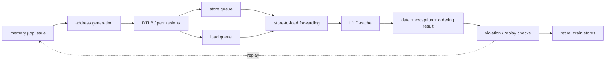
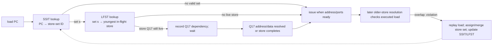
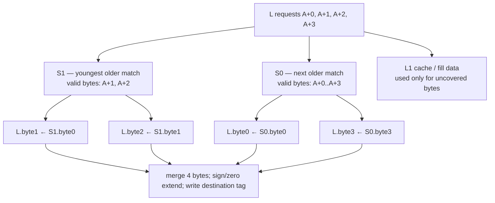

# Load-Store Unit and Memory Ordering — Speculating Without Breaking the Instruction Set Architecture (ISA)

> **First-time reader orientation:** A load reads memory and a store writes it, but their addresses may be unknown when the CPU wants to schedule them. The load-store unit (LSU) predicts which operations are independent, forwards bytes from older stores, detects mistakes, and replays affected work. A load-store queue (LSQ) is the tracking structure—not the complete policy.

> **Abbreviation key — skim now and return as needed:** central processing unit (CPU); reduced instruction set computer (RISC); instructions per cycle (IPC); memory-level parallelism (MLP); translation lookaside buffer (TLB);
> reorder buffer (ROB); miss status holding register (MSHR); load-store queue (LSQ); load queue (LQ); store queue (SQ);
> address-generation unit (AGU); arithmetic logic unit (ALU); load-store unit (LSU); dynamic random-access memory (DRAM); level-one cache (L1);
> program counter (PC); kibibyte (KiB).

> **Prerequisites:** [Out-of-Order Execution](01_OoO_Execution.md) (renaming, ROB, issue, LSQ overview), [Cache Microarchitecture](../04_Cache_Hierarchy/01_Cache_Microarchitecture.md), and [Memory Consistency and Atomics](../06_Coherence_and_Consistency/02_Memory_Consistency_and_Atomics.md).
> **Hands off to:** [Retirement, Recovery, and Precise State](03_Retirement_Recovery_and_Precise_State.md) for replay/flush completion and [Cache Coherence](../06_Coherence_and_Consistency/01_Cache_Coherence.md) after a physical request enters the hierarchy.

---

## 0. Why this page exists

Registers bind early: rename assigns a physical name before execution. Memory addresses bind late: a load may execute while older stores still lack addresses or data. The load-store unit (LSU) must speculate to expose memory-level parallelism, then prove that the observed value is consistent with older instructions and the architectural memory model.



The LSU is simultaneously an address pipeline, an associative dependency checker, a speculative value producer, and a protocol endpoint.

### 0.1 The evolution path: memory parallelism is purchased with proof and recovery

The simplest correct processor executes memory operations in program order and waits for each to finish. It needs almost no disambiguation logic, but one cache miss stops every later memory operation. The modern load-store unit (LSU) emerges by relaxing that serialization one constraint at a time:

```mermaid
%%{init: {"flowchart": {"defaultRenderer": "elk", "nodeSpacing": 42, "rankSpacing": 56, "htmlLabels": false}}}%%
flowchart LR
    A["Blocking in-order memory\none operation completes before the next"]
    B["Committed store buffer\nretire before cache drain"]
    C["Split store address and data\ndisambiguate as soon as address is known"]
    D["Conservative LQ/SQ\nloads wait for all older unknown stores"]
    E["Speculative disambiguation\npredict independence; detect violations"]
    F["Store-to-load forwarding\nyoungest older source selected per byte"]
    G["Nonblocking cache + selective replay\nMSHRs, epochs, dependency poison"]

    A -->|"store/cache latency blocks retirement"| B
    B -->|"late store data need not hide an early address"| C
    C -->|"unrelated older stores still block loads"| D
    D -->|"lost MLP behind unknown addresses"| E
    E -->|"true aliases should not wait for cache"| F
    F -->|"misses, bank conflicts, and late invalidations remain"| G
```



Each step adds a new correctness burden. A store buffer separates **retirement** from **global visibility**, so fences must know which point they require. Speculative disambiguation allows a load to read before all older store addresses are known, so every later-resolving store must search younger executed loads and trigger recovery on overlap. Forwarding avoids a cache round trip, but turns one address match into a youngest-older, byte-granular selection. A nonblocking cache overlaps misses, but every response now needs an identity and generation so a killed request cannot complete into reused state.

This gives the LSU's central contract: **produce a load value early, then retain enough age, address, source, and epoch evidence either to prove that value legal or to revoke every consumer that used it.** A design that specifies the early data path without the proof/replay path is not a speculative LSU; it is a silent-corruption generator.

## Before the details: memory operations carry both an address and an age

A register operation names its inputs directly. A memory operation first computes an address, and two operations that use different register names may still touch overlapping bytes. The load-store unit must therefore reason about **program age**—which operation is older—and **address overlap**—which bytes refer to the same storage.

For a load, the correct value may come from the cache, one older store, or several partially overlapping older stores plus cache bytes. If an older store’s address is still unknown, the CPU may wait or predict that the load is independent. Prediction gains time, but a later discovered overlap requires violation detection and replay. Stores add another boundary: computing store data is not the same as making that data visible to other cores.

**Beginner checkpoint:** the load-store queue is a set of tracking entries, not a magic ordering box. Correctness comes from comparisons, forwarding selection, replay rules, fences, cache responses, and retirement conditions acting together. The detailed structures below are derived from those required decisions.

## 1. Split the memory operation into independently scheduled pieces

A memory instruction may decompose into:

- address generation (base + index/offset);
- translation and protection check;
- store-data production;
- cache/tag access;
- forwarding or merge;
- miss allocation and response;
- ordering validation;
- commit/drain.

Store address and store data often become ready at different times. Holding them separately lets an early address disambiguate younger loads even if data is late. Loads can issue address work as soon as operands are ready, then wait for translation/cache ports.

For $A$ address-generation units and average memory-instruction rate $r_m$ per retired instruction at IPC $I$,

$$
\lambda_{addr}=Ir_m\le A
$$

is a necessary throughput condition. It is not sufficient: TLB, cache banks, load ports, and store-data paths also constrain issue.

## 2. Load and store queue entries

A load-queue (LQ) entry commonly tracks:

- instruction age/ROB tag and destination physical register;
- virtual/physical address and byte mask;
- execution, completion, exception, and replay state;
- observed cache-line version or snoop interaction;
- older-store dependency prediction;
- miss/MSHR and split-access identity.

A store-queue (SQ) entry tracks:

- age, address validity, data validity, and byte enables;
- translation/exception state;
- committed status and cache-drain status;
- ordering/atomic attributes;
- merge or write-combining information.

Sizing follows residence time, not only the in-flight instruction mix:

$$
N_{LQ}\ge\lambda_L T_L,\qquad N_{SQ}\ge\lambda_S T_S.
$$

Committed stores can remain in the SQ or a separate store buffer until the cache accepts them, so $T_S$ may exceed ROB residence. A full store buffer can stop retirement even when execution is otherwise idle.

## 3. Memory disambiguation: predict before all older addresses exist

When a load address is ready, older stores fall into three classes:

1. address known and non-aliasing — safe to bypass;
2. address known and overlapping — forward or wait;
3. address unknown — speculate or wait.

Always waiting is correct but serializes loads behind unrelated stores. Always speculating exposes MLP but can cause violations and replays. A memory-dependence predictor learns which loads should wait for which older store.

Predictor styles include store sets, load-wait tables, dependence distance, and PC-pair correlation. The prediction output may name a specific store, a store-set last-fetched-store, or a conservative “wait for all older addresses.”

Expected cost for speculating a load is

$$
C_{spec}=p_vL_{replay}+(1-p_v)L_{fast},
$$

while waiting costs $L_{wait}$. Speculate when the expected saved latency and extra MLP exceed violation/recovery cost and wasted energy.

### 3.1 Evolving from one global rule to a learned store set

A single global policy is poor because most static loads almost never alias an older store, while a small set—stack spills/reloads, object-field updates, and producer-consumer queues—alias repeatedly. A **memory-dependence predictor** moves the decision from “all loads” to “this load PC in this context.” A store-set design does so with two small tables:

- The **Store Set Identifier Table (SSIT)** maps a load or store program counter (PC) to a store-set identifier. Operations that have violated with each other are trained into the same set.
- The **Last Fetched Store Table (LFST)** maps that set identifier to the youngest currently in-flight store in the set.

At dispatch, a store with set ID `s` replaces `LFST[s]` with its own queue/ROB identity. A load with the same set ID records a dependency on the current `LFST[s]`; it may issue after that store's address and data make the dependence safe. A load with no trained set speculates freely. On a violation, hardware assigns or merges the load's and store's sets, so the next dynamic instance waits on the known troublemaker rather than every older store.



The predictor stores a *relationship*, not an address. That matters because the same static instructions can operate on changing addresses while preserving their dependence pattern. It also explains the losing cases: hashed PCs can merge unrelated operations into one set and cause false waits; a phase change can leave a stale set; and a load may depend on different stores across iterations. Periodic clearing/aging, larger tags, or more context reduce those costs at storage and training complexity.

Useful observables are `loads_waited_for_predicted_store`, `wait_cycles`, `violations_after_prediction`, `false_waits` (the named store resolves nonoverlapping), set merges, and SSIT/LFST alias events. The predictor is valuable only if **cycles saved by independent speculation exceed wait cycles from false dependencies plus replay cycles from missed dependencies**.

## 4. Store-to-load forwarding is a byte-granular associative operation

The youngest older store overlapping every requested load byte should supply that byte. Cases:

- exact address/size match — fast path;
- store wider than load — select subset;
- load wider than store — merge store bytes with cache or multiple stores;
- partial overlap — merge and track sources;
- address match but store data not ready — wait or predict/replay;
- page-offset match before translation — beware physical alias mismatch.

For load byte mask $M_L$ and candidate store masks $M_{S_i}$, forwarding is complete when the union of youngest-per-byte older stores covers $M_L$. Choosing one “matching store” is insufficient for a load assembled from multiple earlier stores.

Forwarding delay scales with queue depth, compare width, priority selection, and data mux width. Designers filter comparisons using page offset, hashed address bits, age windows, or predicted dependence, then confirm with the physical address.

### 4.1 The classic 4K alias

Before translation completes, two virtual addresses with the same 12-bit page offset may be conservatively treated as aliases. If their physical pages differ, the load may be delayed or replayed unnecessarily. Counter this as a false-alias event; it reveals a translation/LSQ interaction, not a cache miss.

### 4.2 Worked byte merge: why one matching-store mux is insufficient

Suppose an older 4-byte store `S0` writes addresses `A+0..A+3`, a younger 2-byte store `S1` overwrites `A+1..A+2`, and then load `L` reads four bytes from `A+0`. Program order is `S0 < S1 < L`. The correct source is selected independently for every load byte:



Implementation proceeds from youngest to oldest. Begin with an uncovered mask equal to the load's byte mask. For each older store in descending age order, compute `claim = address_overlap & uncovered`. If `claim` is nonzero and the store data is valid, route those bytes into the merge network and clear them from `uncovered`. If the data is not valid, mark the claimed bytes **blocked** and stop older stores or the cache from supplying them—the youngest matching store already owns those bytes even though its value has not arrived. Only bytes never claimed by an older store may come from the cache. Allowing an older store or cache to fill a claimed-but-not-ready byte would return a stale value.

This is both a content-addressable search and a wide priority mux. For a 64-entry store queue, two load pipes, and a 64-bit access, the naive structure compares two load addresses against all 64 entries, performs age priority per byte, and routes up to eight byte lanes per load every cycle. Common timing reductions—checking page offset before full physical address, splitting the queue into banks, predicting one forwarding store, or supporting only simple aligned matches on the fast path—save power and delay but create false stalls or replay slow paths. Therefore report exact-match forwards, multi-store merges, partial overlaps, data-not-ready waits, and forwarding replays separately.

The core assertion is per byte: if `L` completes, byte `b` equals the data of the youngest valid older store covering that physical byte, or cache data only if no such store exists. This assertion catches the subtle failure where the correct store is found but the priority is reversed, or a wide load incorrectly treats one partial store as covering every byte.

## 5. Detecting ordering violations

Suppose a younger load executes before an older store address is known. When that store resolves, compare it against younger executed loads. An overlap means the load may have read a stale value.

Recovery choices:

- replay only the load and its dependent slice;
- replay all younger memory operations;
- flush all younger instructions from the violating load;
- train the dependence predictor to prevent recurrence.

Selective replay saves work but requires poison/dependency tracking and care with already-issued dependents. Full flush is simpler and expensive. The load's result cannot become irrevocable until the machine has a proof or a recovery path.

Coherence probes create another validation point. If a speculative load read a line that an external request invalidates before the load becomes architecturally ordered, the LSU may need replay or a rule proving the value remains legal under the consistency model.

### 5.1 The violation lifecycle: detect, poison, replay, retrain

Take an older store `S` whose address operand is delayed and a younger load `L` whose address is already known. The predictor says independent, so `L` reads the cache and wakes dependent instructions. Later `S` computes the same address. Merely reissuing `L` is not enough: every consumer that used the stale value must also be prevented from committing.

```mermaid
sequenceDiagram
    participant SQ as Store queue: older S
    participant LQ as Load queue: younger L
    participant DC as L1 data cache
    participant WB as Result broadcast / dependents
    participant RP as Replay controller
    participant ROB as ROB / retirement

    LQ->>LQ: predictor permits issue past unresolved S
    LQ->>DC: read address A
    DC-->>LQ: return old value V0
    LQ->>WB: write V0; wake dependent slice
    SQ->>SQ: S address resolves to A; data is V1
    SQ->>LQ: compare against younger executed loads
    LQ-->>RP: violation: L observed before older overlapping S
    RP->>ROB: mark L and affected younger results noncommittable
    RP->>WB: poison/squash dependent results and pending requests
    RP->>LQ: reset L completion; wait for or forward from S
    RP->>RP: train load/store PCs into one dependency set
    LQ->>WB: replay L with V1, then re-execute dependents
    ROB->>ROB: retire only after replayed chain is valid
```

There are three recovery granularities:

1. **Flush from L.** Restore the backend to the instruction before `L` and refetch. This is easiest to prove because all younger work disappears, but pays frontend refill and redoes independent work.
2. **Replay L and all younger instructions already issued.** Keep frontend/rename state but reset completion for a broad suffix. This saves refetch and still has simple age logic.
3. **Selective dependent-slice replay.** Mark `L`'s destination poisoned and propagate that poison only through consumers and derived memory requests. Independent younger instructions remain valid. This saves the most work but needs a dependence/replay graph, cancellation of outstanding requests, and a rule for consumers that already broadcast further results.

The implementation must close a race: retirement cannot pass `L` between the early cache response and the later store-address check. Designs achieve this by requiring all older store addresses to be resolved before a load is considered ordering-safe, or by retaining a replayable/validated state until that proof exists. `executed` is therefore not the same bit as `order_validated` or `retire_ready`.

Measure violation MPKI, detection latency, replayed µops per violation, poisoned dependents, cancelled memory requests, and cycles until forward progress. Assert that a violating load cannot retire with its old completion generation, every stale dependent is killed or replayed, and all late responses carry an epoch that prevents them from resurrecting poisoned state. A liveness property should also bound repeated replay when resources are available; otherwise a correct design can livelock on the same alias.

## 6. Cache access, banking, and split requests

A load may cross a cache-line, bank, page, or alignment boundary. The LSU splits it into subrequests, tracks each response/exception, and reassembles bytes. Atomic operations generally cannot be implemented as two unrelated line requests.

With $P$ load pipelines and $B$ independently accessible cache banks, peak accepts are at most $\min(P,B)$ per cycle before conflicts. For uniformly random bank selection, the expected number of occupied banks from $P$ requests is

$$
E[busy]=B\left(1-\left(1-\frac1B\right)^P\right).
$$

Four requests into four banks occupy only $4(1-(3/4)^4)\approx2.73$ banks on average, showing why banking alone does not equal porting.

Misses allocate MSHRs and retain LQ state. Multiple loads to the same line merge but still need separate destination and ordering metadata. Backpressure must be defined when the L1 has no MSHR, fill buffer, TLB miss slot, or response port.

## 7. Store commit and visibility

Stores normally become architecturally irrevocable in order, then drain from a committed store buffer to the cache. This separates precise exceptions from variable cache latency.

Three events must not be confused:

1. **store executes:** address/data computed;
2. **store retires/commits:** no older exception can cancel it;
3. **store becomes globally visible:** other observers may read it according to the memory model.

A fence may wait for subsets of loads/stores to reach specified ordering points, not necessarily for all bytes to reach DRAM. The LSU, cache, coherence controller, and interconnect collectively implement that guarantee.

Store merging combines adjacent bytes/lines to reduce cache traffic, but it must preserve ordering, device-memory attributes, and fault granularity. Memory-mapped I/O usually forbids speculative, merged, or reordered access allowed for normal cacheable memory.

## 8. Atomics and reservations

Read-modify-write atomics need one indivisible coherence serialization. The core may implement:

- locked cache-line ownership plus local operation;
- atomic operation executed at the cache/home node;
- load-reserved/store-conditional (LR/SC) with a reservation monitor;
- compare-and-swap translated into a protocol atomic.

An LR/SC reservation can be invalidated by conflicting coherent writes, context events, or implementation-defined conditions. Spurious SC failure is allowed by some contracts, but forward-progress rules constrain pathological failure.

Atomics couple the LSU to retirement: faults must remain precise, result registers update correctly, and ordering bits/fences apply. Treat them as protocol transactions with multiple completion conditions, not as ALU operations with a slow operand.

## 9. Replays: classify causes or optimization becomes guesswork

Useful replay categories:

- predicted store dependence wrong;
- store address violation;
- forwarding data not ready or partial-overlap failure;
- cache bank/port conflict;
- cache-line or page split;
- TLB miss or translation replay;
- coherence invalidation / value validation;
- cache miss-resource shortage;
- memory-ordering or fence serialization;
- speculative exception or permission uncertainty.

Count original issues, replay issues, and dependent work squashed. Replay amplification

$$
A_{replay}=\frac{\text{all load issue attempts}}{\text{architectural loads}}
$$

is both a performance and energy metric.

## 10. Safety invariants

- A load never reads from a younger store.
- For each byte, forwarding selects the youngest older overlapping store.
- A retired load's value is legal under the architectural memory model.
- A store cannot affect architectural memory before it is non-speculative.
- Exceptions identify the architecturally oldest faulting instruction.
- Killed/replayed requests cannot later write a physical register under a reused tag.
- Device/uncacheable accesses obey stronger ordering and side-effect rules.
- Atomic operations have exactly one serialization point and result.

Assertions should track age, byte masks, epochs, and transaction IDs through late responses.

### 10.1 A verification plan derived from the data-source decision

For every completing load, record a small verification tuple in the testbench or formal abstraction: `(load age, physical byte addresses, selected source age per byte, response epoch, ordering-validated)`. Compare it with a slow reference search over all older stores. That reference algorithm is simple: for each requested byte, scan older stores from youngest to oldest; choose the first address-valid overlapping store and require its data to be ready, otherwise choose memory. It directly checks the LSU's defining rule without reproducing its optimized banking or hashing.

Then force the boundary conditions that change the selected source:

- identical addresses with different sizes and every alignment;
- two or more partial stores composing one load;
- an older matching store whose address is known but data is late;
- equal 4 KiB page offsets that translate to different physical pages, and different virtual addresses that translate to the same physical page;
- a split load where one half hits and the other misses or faults;
- a violation coincident with branch recovery, TLB replay, cache invalidation, or destination-tag reuse;
- a committed store blocked from draining while a fence or atomic waits;
- device/uncacheable accesses surrounded by speculative normal-memory operations.

Counters form the performance proof: address-pipe utilization, LQ/SQ/store-buffer occupancy histograms, full-stall cycles, DTLB and bank conflicts, forwarding source/merge classes, dependence-predictor waits and violations, MSHR stalls, replay amplification, store execute-to-retire latency, retire-to-visible latency, and fence wait cause. A wider LSU is successful only if useful load completions rise without a disproportionate rise in replay amplification, associative-search energy, or store-buffer backpressure.

## 11. Numbers to remember

- LQ/SQ sizing is arrival rate × residence time; committed stores extend SQ/buffer residency.
- Store-to-load forwarding is byte-granular and selects the youngest older source per byte.
- Page-offset matches can cause false 4 KiB alias stalls before physical addresses are known.
- Cache banks provide probabilistic throughput, not the same guarantee as true ports.
- Store execute, retire, and global visibility are three separate events.
- Replay amplification measures hidden LSU work and energy.

## 12. Worked problems

### Problem 1 — queue sizing

A core sustains 5 IPC with 28% loads. Loads reside in the machine for 36 cycles on average:

$$
N_{LQ}\ge5\times0.28\times36=50.4.
$$

A 64-entry LQ gives about 27% headroom for burstiness; it does not guarantee tolerance of long cache-miss bursts.

### Problem 2 — bank utilization

Three independent loads target four cache banks uniformly:

$$
E[busy]=4\left(1-(3/4)^3\right)=2.3125.
$$

Although the cache has four banks, three offered loads produce only about 2.31 accepted distinct-bank accesses on average without replay/queuing.

### Problem 3 — speculation threshold

Waiting for unknown stores costs 8 cycles. Speculation succeeds in 97% of cases at 1 cycle and violations cost 35 cycles:

$$
C_{spec}=0.97(1)+0.03(35)=2.02\ \text{cycles}.
$$

Speculation wins on expectation, but a tail-latency product may still cap repeated violations and train a store-set dependency.

## Cross-references

- **Window and scheduling:** [Out-of-Order Execution](01_OoO_Execution.md).
- **Ordering contract:** [Memory Consistency and Atomics](../06_Coherence_and_Consistency/02_Memory_Consistency_and_Atomics.md), [Cache Coherence](../06_Coherence_and_Consistency/01_Cache_Coherence.md).
- **Recovery/commit:** [Retirement, Recovery, and Precise State](03_Retirement_Recovery_and_Precise_State.md).
- **Translation/cache:** [TLB and Virtual Memory](../05_Virtual_Memory/01_TLB_and_Virtual_Memory.md), [Cache Microarchitecture](../04_Cache_Hierarchy/01_Cache_Microarchitecture.md).

## References

1. G. Chrysos and J. Emer, “Memory Dependence Prediction Using Store Sets,” ISCA 1998.
2. A. Moshovos and G. Sohi, “Streamlining Inter-operation Memory Communication via Data Dependence Prediction,” MICRO 1997.
3. RISC-V International, [RVWMO Memory Consistency Model](https://docs.riscv.org/reference/isa/unpriv/rvwmo.html).
4. Intel, *64 and IA-32 Architectures Software Developer's Manual* and Optimization Reference Manual.
5. A. Roth, “Store Vulnerability Window (SVW): Re-Execution Filtering for Enhanced Load Optimization,” ISCA 2005.

---

**Navigation:** [Out-of-Order Backend index](00_Index.md) · [CPU index](../00_Index.md)
