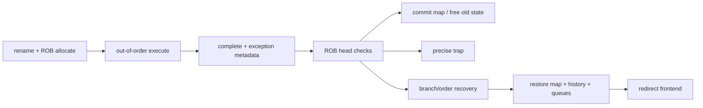
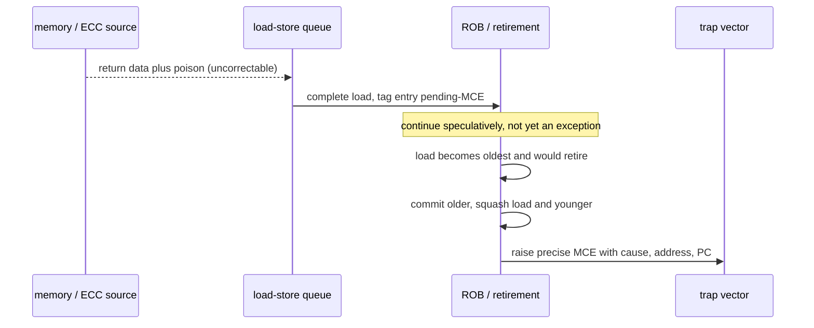

# Retirement, Recovery, and Precise State — Turning Speculation into Architectural Fact

> **First-time reader orientation:** Execution may happen speculatively and out of order; retirement is the ordered boundary where results become visible to software. Precise state means an interrupt or exception can identify one exact instruction boundary: all older instructions have committed and no younger instruction has. Recovery must restore every distributed queue and ignore late responses from discarded work.

> **Abbreviation key — skim now and return as needed:** central processing unit (CPU); instruction set architecture (ISA); reduced instruction set computer (RISC); misses per thousand instructions (MPKI); translation lookaside buffer (TLB);
> reorder buffer (ROB); load queue (LQ); store queue (SQ); issue queue (IQ); arithmetic logic unit (ALU);
> fetch target queue (FTQ); program counter (PC); operating system (OS); control and status register (CSR).

> **Prerequisites:** [Out-of-Order Execution](01_OoO_Execution.md) (ROB and rename state), [Load-Store Unit and Memory Ordering](02_Load_Store_Unit_and_Memory_Ordering.md), and [Fetch, Decode, and µop Delivery](../02_Frontend_and_Prediction/02_Fetch_Decode_and_Uop_Delivery.md).
> **Hands off to:** the ISA's trap/interrupt handler and to verification methodology; this page owns the microarchitectural transition from speculative state to a precise architectural boundary.

---

## 0. Why this page exists

Out-of-order execution is useful only because the machine can present the illusion of in-order completion. Hundreds of younger operations may execute, write physical registers, issue misses, and train predictors, yet an older fault must expose a state equivalent to sequential execution immediately before the faulting instruction.

The control plane must answer four questions exactly: what may commit, what must be undone, which state is restored, and where fetch restarts.

## Before the details: two versions of the machine coexist

During speculation, the CPU has a **future candidate state** containing results from instructions that may later be discarded and an **architectural state** that software is allowed to observe. Retirement advances the architectural boundary in program order. The reorder buffer records enough information to decide whether the oldest unfinished instruction completed normally, raised an exception, or must trigger recovery.

Recovery is distributed. The rename map, free-register pool, queues, load-store state, frontend history, and outstanding responses may all contain younger work. A checkpoint stores a restorable snapshot; a history log stores how to undo changes. An epoch or generation tag marks which speculative lifetime a delayed response belongs to. These are alternative implementation tools for the same invariant: discarded work must never become architectural.

**Beginner checkpoint:** “flush the pipeline” is an outcome, not a complete design. The architect must name every structure that can hold younger state and every path by which a late result could re-enter the machine. The later recovery table is a checklist of those paths.

## 1. Speculative versus architectural state

| State | Speculative representation | Architectural commitment |
|---|---|---|
| integer/vector registers | physical register file + speculative map | retirement/architectural map points to committed versions |
| memory | SQ entries and speculative loads | stores released in order; loads validated |
| PC/control flow | predicted path, FTQ, history | committed next PC and trap PC |
| exceptions | bits attached to ROB/µop | raised only when oldest eligible instruction reaches head |
| predictor state | speculative history, sometimes early table updates | repaired or trained with final outcome |
| privilege/CSR | buffered result or serialized execution | visible at commit with required pipeline effects |

Some microarchitectural effects—cache fills, prefetches, predictor changes—are not rolled back because they are architecturally invisible. That creates performance and security side effects, so “invisible” does not mean irrelevant.

## 2. Retirement conditions

An instruction or fused group may retire when:

1. it is at the oldest commit position;
2. all required µops completed;
3. no exception/interrupt takes priority before it;
4. memory-order validation is complete;
5. required serialization conditions hold;
6. commit resources are available (map/free-list/store buffer/CSR ports).

With commit width $W_c$, maximum retirement is $W_c$ instructions/cycle, but groups, taken traps, and serializing operations create holes. Useful retirement efficiency is

$$
\eta_c=\frac{N_{retired}}{W_cT}.
$$

If the ROB head is incomplete while younger entries are done, **head-of-line blocking** makes commit width irrelevant. Track head-stall causes by oldest instruction class.

## 3. Freeing physical registers safely

At rename, destination architectural register $a$ changes mapping from old physical $p_{old}$ to new $p_{new}$. The old physical register cannot be freed immediately because older instructions or recovery may still require it.

At commit of the redefining instruction:

- the committed map for $a$ becomes $p_{new}$;
- $p_{old}$ becomes free once no older checkpoint/recovery mechanism needs it.

Two common recovery organizations:

- **retirement map table:** keep a committed map and restore the speculative map from it after a full flush;
- **checkpoints/history buffer:** save maps or incremental rename changes at branches for fast partial recovery.

Full map checkpoints cost $N_{arch}\log_2N_{phys}$ bits each. Incremental history is smaller but restore latency scales with changes since the checkpoint. Designs often combine branch checkpoints with a retirement map for traps and machine clears.

## 4. Precise exceptions

Execution detects faults early—illegal instruction, page fault, access fault, divide exception—but records them in the instruction's ROB entry. The core continues speculatively until the faulting instruction is oldest. Then it:

1. prevents the faulting and younger instructions from committing;
2. commits all older completed instructions;
3. captures exception cause, fault address/value, and architectural PC;
4. restores committed rename/CSR/memory state;
5. redirects to the trap vector.

If multiple instructions fault, program age decides. If one instruction has several internal fault candidates, ISA priority decides. Late responses must carry age/epoch tags so a killed access cannot raise a ghost exception.

### 4.1 Interrupts

Interrupts are asynchronous but are taken at a defined instruction boundary. The core selects a point where older instructions are committed and younger state can be discarded. Long non-interruptible operations increase interrupt latency; designs may make them restartable or allow bounded interrupt checkpoints.

## 5. Branch recovery

On a misprediction, preserve instructions older than the branch and remove younger ones. Recovery state includes:

- rename map/free-list position;
- global/local branch history and return-stack state;
- ROB/IQ/LQ/SQ tails or generation epochs;
- frontend FTQ and µop queue positions;
- outstanding request kill/ignore identity.

Recovery latency is

$$
L_{recovery}=L_{detect}+L_{checkpoint-select}+L_{restore}+L_{redirect}+L_{refill}.
$$

A checkpoint per unresolved branch gives fast restore but consumes storage and checkpoint ports. Logging rename changes reduces storage but increases restore cycles. Limiting unresolved branches can simplify checkpointing but constrains speculation depth.

Predictor history is often updated speculatively so subsequent predictions see the assumed path. It must be repaired using the branch's checkpoint plus actual outcome; otherwise one miss poisons predictions far beyond the recovery window.

## 6. Selective replay versus pipeline flush

Not every error requires discarding all younger work.

| Event | Minimal recovery | Simpler conservative recovery |
|---|---|---|
| execution-port collision | retry the µop | hold issue |
| cache bank conflict | replay load | replay dependent slice |
| memory-order violation | violating load + dependents | flush from load |
| branch misprediction | flush younger than branch | same, usually unavoidable |
| machine configuration change | serialize + drain | full pipeline clear |
| precise exception | flush faulting and younger | restore committed state |

Selective replay needs dependency tracking. A poison bit can follow the producer's destination through scheduled consumers; replay queues reissue invalid operations. But a consumer may have generated stores, branches, or addresses. The proof obligation grows rapidly, so many cores selectively replay common load events and flush on rarer complex violations.

## 7. Machine clears and serializing operations

A machine clear is a recovery whose cause is not an ordinary branch miss: self-modifying code, memory-order machine clear, privilege/translation update, page-table shootdown interaction, or implementation consistency check.

Serializing instructions constrain what may be fetched, issued, or completed around them. Degrees of serialization include:

- wait until the instruction reaches ROB head;
- drain older loads/stores;
- stop younger issue but allow fetch;
- flush translation/predictor/frontend structures;
- wait for external acknowledgements;
- restart with a new epoch.

Model them explicitly. Treating every control-register write as a one-cycle ALU operation produces optimistic virtualization and OS performance.

## 8. Store retirement and irrevocability

A store should not update architecturally visible memory while an older exception can still cancel it. Commonly the SQ marks a store committed at retirement, then a store buffer drains it later.

The commit point needs space in the committed store buffer. If the buffer is full, the ROB head stalls. A fence or device access may require the buffer to drain to a stronger visibility point.

Atomic read-modify-write operations also delay commitment until their exception, ordering, and coherence outcomes are known. Some serialize at the ROB head; others execute earlier but retain rollback-safe protocol state.

## 9. Recovery state and late events

Physical structures cannot always be cleared combinationally. Use generation/epoch tags:

- increment epoch on flush;
- tag requests, queue entries, and responses;
- accept a response only if epoch and transaction identity still match;
- delay identifier reuse until all ambiguous responses are impossible.

Wraparound is a correctness issue. A small epoch field can alias a very late response after several recoveries. Bound maximum response lifetime, widen the tag, or use non-reused transaction IDs with explicit retirement.

The same rule applies to physical-register tags: a late functional-unit or cache result must not write a physical register that has been freed and reallocated to a different instruction.

## 10. Verification invariants

- Retirement order equals program order within each hardware thread.
- Architectural map after $k$ retired instructions equals sequential execution of those $k$ instructions.
- No younger store becomes visible before all older possible exceptions are resolved.
- The trap PC/cause/value identify the architecturally oldest fault according to ISA priority.
- Every allocated physical register is either mapped, in-flight, checkpoint-owned, or free—exactly once.
- Killed epochs cannot update registers, queues, predictors that require repair, or exception state.
- Branch recovery preserves all older instructions and removes all younger ones.
- Interrupt entry occurs at a legal precise boundary.

Differential checking against an ISA model verifies committed state, while assertions verify the speculative bookkeeping that the ISA model cannot see.

## 11. Observability

Count:

- retirement slots: useful, empty due to head stall, trap/serialization loss;
- ROB-head stall by functional unit, cache/TLB, store buffer, fence, and exception;
- recovery count and cycles by branch, memory order, replay, machine clear, trap;
- number of µops and energy-equivalent work squashed;
- checkpoint occupancy/failures and restore cycles;
- late responses dropped by epoch;
- interrupt latency distribution;
- physical-register/free-list high-water marks.

Recovery cost in lost work is

$$
W_{squash}=\sum_e N_e\,\bar{u}_e,
$$

where $N_e$ is event count and $\bar{u}_e$ average younger µops discarded. Two predictors with equal MPKI can differ if misses occur at different speculation depths.

## 12. Numbers to remember

- Precise state is the committed boundary; physical registers and queues may hold much newer speculative state.
- Exceptions are detected in execution but raised at the oldest legal retirement point.
- Branch checkpoints trade storage/ports for recovery latency.
- Selective replay reduces wasted work but expands correctness state dramatically.
- Store execute, commit, and global visibility remain distinct.
- Epoch/tag reuse must be safe against the maximum lifetime of late responses.
- An uncorrectable-but-recoverable error is poisoned, not fatal: the precise machine-check exception fires on consumption via the §4 path, faulting one consumer rather than the machine, and a squashed speculative consumer raises nothing.

## 13. Worked problems

### Problem 1 — checkpoint storage

A core has 64 architectural integer/vector names mapped into 256 physical registers, so each mapping needs 8 bits. Twelve full checkpoints cost

$$
64\times8\times12=6144\ \text{bits}
$$

before valid bits, free-list state, history, multiporting, and routing. Incremental history may save bits but adds restore latency.

### Problem 2 — misprediction waste

A workload has 4 branch MPKI, 20-cycle recovery, 6-wide rename, and on average 55 younger µops present at resolution. The direct empty-slot tax is $4/1000\times20\times6=0.48$ slots/instruction; the energy tax also includes about $4/1000\times55=0.22$ squashed µops/instruction.

### Problem 3 — epoch width

The maximum request lifetime is 500 cycles and recovery can occur once every 20 cycles. Up to 25 epoch changes can happen while an old response exists. A 4-bit epoch wraps after 16 and is unsafe without additional transaction identity; at least 5 bits are required under that bound, with margin for uncertainty.

## 14. Machine-check architecture: poison, deferred errors, and precise machine-check exceptions

A hardware error — a particle strike that flips a bit in static or dynamic random-access memory (SRAM/DRAM), a worn cell, a link transmission error — has exactly three acceptable fates: it is *corrected* in place, *delivered to software precisely and contained*, or the machine stops. The unacceptable fourth fate is that a flipped bit is consumed silently and the program computes a wrong answer with no indication: **silent data corruption (SDC)**. At fleet scale a minute per-device error rate multiplied by millions of devices is a steady stream of would-be corruptions, and in safety domains one undetected flip can be catastrophic, so SDC is a first-order server and safety concern rather than a curiosity. The precise-exception machinery this page already built (§4) is the delivery vehicle: an error attached to a specific consumed value can be raised as a precise exception on the exact instruction that consumes it.

### 14.1 Mechanism: error banks, correctable vs uncorrectable, poison

Detection lives at each source — cache and register arrays, the memory controller, and fabric links — via parity or an error-correcting code (ECC) (see [Cache Microarchitecture §5](../04_Cache_Hierarchy/01_Cache_Microarchitecture.md) and [PPA and Physical Implementation §2.2](../00_Design_Methodology/02_CPU_PPA_and_Physical_Implementation.md)). The machine-check architecture (MCA) gives each source a bank of status registers logging, per event: a valid bit, the error type, a **syndrome** (which check failed / which bit), the address, and an overflow bit for a second event before software drains the bank. Errors sort into three severities.

**Correctable error (CE).** ECC repairs the datum in flight; hardware delivers correct data, logs the bank, and may raise a *corrected machine-check interrupt* (CMCI) so software can count and scrub. No architectural state was ever wrong, so nothing precise is required — the event is bookkeeping. A rising CE rate on one line or rank is predictive: it usually precedes an uncorrectable failure, which is why fleets offline pages or spare out ranks on a CE-rate threshold.

**Uncorrectable but recoverable error (UCR).** ECC detects but cannot correct — for example a double-bit error under single-error-correct/double-error-detect (SECDED). The datum is known-bad. Rather than halt, the machine marks it **poisoned** — it tags the cache line or memory granule with a poison indicator — lets the poison travel with the data, and raises a *precise* machine-check exception (MCE) only if and when the poisoned value is actually **consumed** by an instruction. Consumption on a specific load is a precise fault on that load, delivered on exactly the §4 path: detected in execution, recorded in the load's ROB entry as pending exception metadata, and raised only when that load is the oldest instruction — older instructions commit, the load and everything younger squash, and the trap captures cause, faulting address, and architectural PC. If the poisoned line is never consumed (overwritten whole, or evicted and dropped), no exception is ever raised: containment with no fault at all.

**Fatal / uncontained error (UC).** The error corrupts state that cannot be pinned to one consumer — a control structure, or an error the fabric reports as uncontainable — so there is no precise boundary to ride. This escalates to a global machine check across all cores, typically firmware-first handling and reset.

### 14.2 Poison rides the precise-exception path

The essential move is that the "fault" is carried by a *data value* and realized at the precise boundary of whichever instruction consumes it — the §4 discipline with the error riding a datum instead of being raised by decode or execute.

Two invariants follow directly from the rest of this page. First, **a mis-speculated consumer raises nothing**: a load that read poison but is squashed before retirement carries its pending-MCE bit into the discarded epoch and delivers no exception — the §4/§9 rule that killed epochs cannot raise ghost exceptions applies unchanged, and the MCE fires only on a load that would architecturally retire. Second, **poison is contained to the consumer**: a single bad bit faults exactly one thread or virtual machine — which the operating system or hypervisor can terminate or repair — rather than the whole machine. Poison travels with the data — a forwarded value, or one a device wrote by direct memory access (DMA), stays flagged until someone consumes it — and byte/granule-level poison lets a load of the clean bytes of a partially-poisoned line proceed without faulting. This is what converts an SDC risk into a precise, contained, recoverable exception — the entire purpose of the architecture.

### 14.3 Availability levers and a worked number

Three levers raise the mean time to an uncontainable event.

**Memory scrubbing.** A background engine walks memory reading and rewriting-with-correction, removing single-bit errors before a *second* bit lands in the same ECC word and makes it uncorrectable. Model single-bit upsets in a given word as Poisson at rate $r_{CE}$; a SECDED word goes uncorrectable when a second independent upset arrives within the scrub window $T_{scrub}$, so per word
$$
r_{UC}\approx r_{CE}\cdot(r_{CE}T_{scrub})=r_{CE}^{2}\,T_{scrub}.
$$
The accumulation-driven uncorrectable rate is **linear in $T_{scrub}$**: halve the scrub interval and you halve it. The cost of scrubbing memory of size $M$ with period $T_{scrub}$ is background read bandwidth $B=M/T_{scrub}$.

*Worked number.* For $M=256$ GB, a 24 h scrub costs $B=256\times10^{9}/86400\approx3.0$ MB/s; a 1 h scrub costs $\approx71$ MB/s. Both are under 0.1 % of a ~100 GB/s memory system, yet the 24$\times$ shorter interval cuts accumulation-driven uncorrectables ~24$\times$. Bandwidth is not why you stop scrubbing faster — diminishing returns are: below some interval, single-event and whole-device failures (which scrubbing cannot touch) dominate $r_{UC}$, and scrub power stops being free.

**Chipkill / single-device data correction (SDDC).** Spread each ECC word across many DRAM devices so that the *complete* failure of one device — the mode SECDED cannot cover, which otherwise goes straight to uncorrectable/fatal — stays correctable. SDDC removes the whole-device term from $r_{UC}$ outright, commonly the dominant term, converting far more events from fatal to corrected than scrubbing alone.

**Core lockstep.** Run two cores on the same instruction stream and compare every cycle; a mismatch catches a *logic* soft error that no data ECC would see. This doubles core cost purely for detection (a third core majority-votes for correction) and is a safety lever (for example automotive) rather than a throughput one.

Each tier removes a different failure term, and residual SDC is the product of the uncovered tails: parity detects, SECDED corrects singles and detects doubles, SDDC corrects a device, scrubbing suppresses accumulation. Coverage is multiplicative, which is why high-availability parts stack all of them.

### 14.4 Trade-off: when the simpler option wins

Precise-MCE-on-consumption is materially more logic than "halt on any detected error": poison tags in every array and along every data path, per-source banks, byte/granule poison granularity, and integration with the ROB's precise-exception and epoch machinery (§4, §9) so speculative consumers cannot raise ghost MCEs. That cost is justified only by one of three requirements — **uptime** (survive an error without resetting the machine), **containment** (a multi-tenant server must fault one guest, not the host), or **zero-SDC** (never silently consume a bad bit). Absent all three — a microcontroller or a low-RAS (reliability, availability, serviceability) part — parity-plus-reset is the right engineering: detect the error and restart, cheaper in area and verification, acceptable when a reset per detected error meets the availability target.

The dual mistake is over-protecting recoverable state. An architecturally *invisible* array — a branch predictor, a prefetcher table — needs only parity and a flush/retrain on error (§5, §6), never ECC or poison, because a wrong prediction is already repaired by the recovery path. Match protection to the *consequence* of the state, as [PPA §2.2](../00_Design_Methodology/02_CPU_PPA_and_Physical_Implementation.md) argues: strong ECC and poison for architectural data, parity-and-retrain for speculative hints, and a global machine check reserved for the genuinely uncontainable, where spending logic to "precisely" deliver an error that corrupted a shared structure would be wasted.

Cross-references: the precise-exception path this section reuses is §4; killed-epoch suppression of ghost faults is §9; ECC generation/checking and cache-line poison live in [Cache Microarchitecture §5](../04_Cache_Hierarchy/01_Cache_Microarchitecture.md); array-level RAS, yield, and the protection-matches-consequence rule are in [PPA and Physical Implementation §2.2](../00_Design_Methodology/02_CPU_PPA_and_Physical_Implementation.md); fault delivery to the operating system and the guest/host containment boundary are in [TLB and Virtual Memory](../05_Virtual_Memory/01_TLB_and_Virtual_Memory.md).

## Cross-references

- **Create speculative state:** [Fetch, Decode, and µop Delivery](../02_Frontend_and_Prediction/02_Fetch_Decode_and_Uop_Delivery.md), [Out-of-Order Execution](01_OoO_Execution.md).
- **Memory recovery:** [Load-Store Unit and Memory Ordering](02_Load_Store_Unit_and_Memory_Ordering.md), [Memory Consistency and Atomics](../06_Coherence_and_Consistency/02_Memory_Consistency_and_Atomics.md).
- **Verification:** [Formal Verification](../../../03_Frontend_RTL_and_Verification/12_Formal_Verification.md), [Assertions and Coverage](../../../03_Frontend_RTL_and_Verification/09_Assertions_and_Coverage.md).
- **Reliability (RAS/ECC):** §14 poison and precise MCE build on [Cache Microarchitecture §5](../04_Cache_Hierarchy/01_Cache_Microarchitecture.md) (ECC, cache-line poison) and [PPA and Physical Implementation §2.2](../00_Design_Methodology/02_CPU_PPA_and_Physical_Implementation.md) (array RAS, protection-matches-consequence), and deliver faults through [TLB and Virtual Memory](../05_Virtual_Memory/01_TLB_and_Virtual_Memory.md).

## References

1. J. Smith and A. Pleszkun, “Implementing Precise Interrupts in Pipelined Processors,” *IEEE Transactions on Computers*, 1988.
2. G. Sohi and S. Vajapeyam, “Instruction Issue Logic for High-Performance, Interruptible, Multiple Functional Unit, Pipelined Computers,” ISCA 1987.
3. Intel, [Instructions Retired Event](https://www.intel.com/content/www/us/en/docs/vtune-profiler/user-guide/2026-0/instructions-retired-event.html).
4. J. Hennessy and D. Patterson, *Computer Architecture: A Quantitative Approach*.
5. RISC-V International, Privileged Architecture specification (traps, interrupts, and return semantics).

---

**Navigation:** [Out-of-Order Backend index](00_Index.md) · [CPU index](../00_Index.md)
