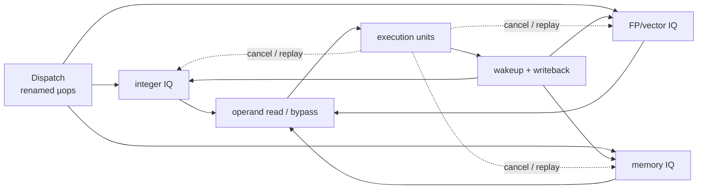

# Advanced CPU Scheduling — Wakeup, Bypass, Replay, and Compressed Windows

> **First-time reader orientation:** The basic out-of-order idea is “run any instruction whose inputs are ready.” The difficult microarchitecture is deciding *ready* quickly enough, delivering the operands without too many wires or memory ports, and repairing the schedule when an expected result is late. This chapter opens that implementation layer.

> **Abbreviation key — skim now and return as needed:** central processing unit (CPU); out-of-order (OoO); micro-operation (µop); issue queue (IQ); reservation station (RS); physical register file (PRF); reorder buffer (ROB); rename allocation buffer (RAB); register alias table (RAT); arithmetic logic unit (ALU); floating-point (FP); load-store unit (LSU); load queue (LQ); store queue (SQ); content-addressable memory (CAM); instructions per cycle (IPC); fan-out-of-four (FO4).

> **Prerequisites:** [Out-of-Order Execution](01_OoO_Execution.md) for rename, issue, and retirement; [Speculative Execution](../02_Frontend_and_Prediction/03_Speculative_Execution.md) for prediction and recovery; [Load-Store Unit](02_Load_Store_Unit_and_Memory_Ordering.md) for memory operations.
> **Hands off to:** [Retirement and Recovery](03_Retirement_Recovery_and_Precise_State.md) for precise commit and [XiangShan](../07_Core_Case_Studies/01_Xiangshan_CPU_Design.md) for distributed issue queues, speculative wakeup, cancellation, snapshots, and ROB compression.

---

## 0. Why the scheduler becomes the clock limiter

An instruction in an issue queue needs three things before it can execute:

1. every source operand is ready;
2. a compatible execution unit and output path are available;
3. no older ordering rule blocks it.

A naive scheduler compares every completing destination tag against every waiting source, chooses the oldest ready instructions, reads a multiported register file, and routes operands to execution units—all in one cycle. If the issue window holds $N$ instructions, each has $S$ sources, and $W$ results can wake consumers, the tag-comparison work is proportional to

$$
N\times S\times W.
$$

Selection and routing add wide priority and mux networks. Growing the window or width therefore increases both capacitance and logic depth on a loop that must complete every cycle. High-performance cores do not implement one ideal global scheduler; they decompose the problem.

## 1. Distributed issue versus a unified window

A unified issue queue sees every ready operation and can make globally optimal choices, but it needs many ports and broadcasts. A distributed design separates integer, floating-point/vector, branch, and memory work—or goes further and assigns queues to execution clusters.

Distribution buys:

- fewer tag comparisons per queue;
- shorter local select wires;
- execution-unit-specific entry formats;
- independent enqueue/dequeue widths;
- less switching when only one class is active.

It costs:

- load imbalance when one queue fills while another is empty;
- steering logic at dispatch;
- cross-cluster result broadcasts;
- occasional suboptimal scheduling because no queue sees the whole machine.

Dispatch steering is therefore a microarchitecture of its own. A common policy selects among compatible queues using free entries, predicted execution-unit pressure, or round-robin balance. The correctness rule is simple—send the operation only to a compatible place—but the performance goal is to avoid creating a hot queue that backpressures rename.

## 2. Entry organization: age, readiness, and mobility

Each issue entry usually holds the µop, physical source tags, readiness bits, destination tag, execution-unit class, ROB age, and speculation metadata. Three implementation styles are common:

- **compacting queue:** entries shift toward issue ports; selection is easy, but shifting burns power;
- **unordered reservation stations:** instructions stay in place; each entry participates in wakeup and selection;
- **hybrid tiers:** a few fast entries near issue plus a larger waiting tier, moving operations forward when space opens.

Oldest-ready selection reduces starvation and tends to expose long dependency chains early. A full age matrix records pairwise order and answers oldest queries quickly, but storage and update cost grow near $N^2$. Alternatives use age tags, cascaded arbiters, or approximate priority groups. “Oldest” is a quality policy, not a correctness requirement except where an ordering rule explicitly says so.

## 3. Wakeup: from writeback to prediction

### 3.1 Conventional writeback wakeup

When an execution unit completes destination physical register `p37`, it broadcasts `p37`. Every waiting source tag compares against the broadcast; matches set their ready bits. This is robust because completion is known, but a dependent operation usually cannot issue until a later cycle.

### 3.2 Speculative wakeup

Fixed-latency operations allow the scheduler to predict completion. At issue time, the producer enters a latency-aligned wakeup pipeline. If an add produces data after one execution stage, the wakeup signal can reach consumers just in time for them to select the bypass path.

The ideal dependent recurrence is

$$
T_{dep}=T_{select}+T_{operand}+T_{execute}+T_{wakeup}.
$$

Speculative wakeup overlaps the last term with known producer latency. It is especially valuable for integer chains and load-use paths where a single extra cycle repeats inside a loop.

### 3.3 Cancellation is part of wakeup

A predicted wakeup can be wrong because:

- a load misses or is replayed;
- an older redirect squashes the producer;
- an execution unit reports a variable latency;
- writeback arbitration delays the result;
- a cache or translation check invalidates early data.

Consumers awakened by that producer must receive a cancel before they use or propagate an invalid operand. Some designs track the exact producer tag; others carry a short dependency vector for recent loads because load latency is the common variable case. The cancellation fanout is as architecturally important as the wakeup fanout.

## 4. Operand delivery: PRF, bypass, and capture

The scheduler says *which* instruction executes; the datapath must supply its bits. A wide PRF with $R$ read ports and $W$ write ports becomes expensive because each added port touches every cell and lengthens wordlines, bitlines, and muxes.

Designs reduce that cost by combining:

- **banking:** distribute registers across narrower memories;
- **clustering:** keep a local PRF near a group of execution units;
- **bypass forwarding:** take a just-produced result directly rather than reading it back;
- **operand capture:** copy ready values into issue entries or small operand buffers;
- **late read:** keep tags in the queue and read values only after selection;
- **move elimination:** rename a move to the source physical register instead of executing it.

Each shifts cost. Operand capture reduces later PRF reads but widens the issue entries and wakeup write network. Banking saves area but creates bank conflicts. Clustering shortens wires but adds cross-cluster copies. A good design measures operand traffic, not merely the number of instructions issued.

## 5. Bypass networks and writeback conflicts

Forwarding avoids a PRF round trip, but a fully connected bypass network from every producer to every consumer scales roughly with producer count times consumer-input count. Its muxes often sit directly on the execution critical path.

Practical cores use topology and timing knowledge:

- only compatible producer–consumer pairs receive a direct path;
- common one-cycle ALU chains get the fastest paths;
- rare cross-cluster paths take an extra cycle;
- fixed latency lets the scheduler reserve a writeback slot early;
- variable-latency results arbitrate and may force dependent replay.

Early writeback-conflict detection is a reservation problem. If two fixed-latency operations issued now would complete onto one port in the same future cycle, the scheduler can defer one today rather than discover the collision after execution.

## 6. Replay taxonomy

“Replay” should name a specific scope and cause:

| Replay type | Typical cause | State retained |
|---|---|---|
| port retry | bank or execution-port conflict | request and operands |
| load replay | TLB miss, cache miss, forwarding block | load µop, address, cause bits |
| dependent cancel | speculatively awakened producer is late | affected IQ entries/dependency tags |
| selective slice replay | value or ordering violation | producer plus transitive consumers |
| pipeline redirect | branch or memory-order violation | older ROB state; younger work removed |

A replay queue must remember not just the operation but *why* it is blocked. Otherwise it retries every cycle, consumes bandwidth, and may livelock. Cause-specific wake events—TLB refill, store-address resolution, MSHR completion, bank availability—make replay demand-driven.

Age policy matters here. Always prioritizing replay may starve new work; always prioritizing new work may prevent an old miss from completing. A common policy gives ready high-priority causes first access, then chooses the oldest eligible replay, with fairness counters or reserved bandwidth.

## 7. ROB compression and the rename buffer

Wide decode creates a storage problem: many adjacent operations share fetch, exception, and control metadata. A **compressed ROB** stores several µops in one row or banked group, amortizing metadata and enabling wide commit without one enormous multiported array.

Compression creates corner cases:

- a group may contain a mixture of completed and incomplete µops;
- the oldest exception may sit in the middle;
- a redirect can split a group;
- commit width and physical bank width may differ;
- vector instructions may produce multiple completion events.

A separate **rename allocation buffer (RAB)** can retain old physical mappings needed to reclaim registers or walk backward after a redirect. This separates compact completion bookkeeping in the ROB from mapping-history bookkeeping. The acronym is easily confused with ROB; the two structures answer different questions: ROB asks “may this instruction retire?”, while RAB asks “which old mapping must be restored or freed?”

## 8. Snapshot recovery versus full walking

After a redirect, the machine must restore speculative RAT mappings, free-list pointers, vector configuration, and queue tails. A full walk undoes younger instructions in order. It stores little extra state but recovery time grows with distance to the commit point.

Snapshots save selected speculative states. On a redirect, the machine restores the newest snapshot no younger than the redirect and walks only the remaining interval. If snapshots are taken every $K$ operations, the expected residual walk is roughly $K/2$ operations, subject to branch distribution and snapshot availability.

Snapshots need coherent creation across modules. A RAT snapshot paired with the wrong ROB position is worse than no snapshot. Implementations tag snapshot events with the same ROB index and coordinate deletion when the boundary commits or is flushed.

## 9. XiangShan Kunminghu example

Current official documentation describes a six-wide decode/rename/dispatch backend with a 160-entry ROB, 224 integer physical registers, 192 floating-point physical registers, 128 vector physical registers, and up to eight ROB entries committed or walked per cycle. It uses distributed issue queues for scalar integer, vector/floating point, scalar memory, and vector memory operations.

The advanced mechanisms are more instructive than the headline widths:

- issue entries support writeback wakeup, speculative wakeup, cancellation, and feedback;
- a `WakeupQueue` delays early wakeup according to execution-unit latency;
- load-dependency metadata lets a late load cancel younger consumers;
- age detectors implement oldest-first selection;
- dispatch tracks fast wakeup in busy tables;
- the ROB compresses up to six µops per entry/group according to the documented configuration;
- four rename snapshots shorten recovery, with periodic snapshots providing fallback coverage;
- the RAB is documented separately from the 160-entry ROB;
- the load replay queue retains cause bits and wakes entries only when their blocking conditions clear.

This is precisely the machinery hidden by the phrase “out-of-order execution.” The performance comes from overlapping wakeup with execution, using narrow specialized queues, and replaying only what must be repaired.

## 10. Design equations and trade-offs

**Scheduler capacity.** Little's law gives a first bound:

$$
N_{IQ}\gtrsim \lambda_{dispatch}\,T_{wait},
$$

where $T_{wait}$ is average time from dispatch to issue for that operation class. A unified average can hide a full memory queue, so apply the equation per class and include burst headroom.

**Register pressure.** If fraction $f_w$ of in-flight instructions writes a register,

$$
N_{phys}\gtrsim N_{arch}+f_wN_{window}+H,
$$

where $H$ covers bursts and delayed reclamation. Provisioning below the worst-case bound is legal but creates rename stalls.

**Replay stability.** Let new operations arrive at rate $\lambda_n$ and replays at $\lambda_r$. A port with service rate $\mu$ remains stable only if

$$
\lambda_n+\lambda_r<\mu.
$$

This is why an apparently rare replay can collapse throughput near saturation: it consumes the same scarce issue and operand bandwidth as new work.

## 11. Verification and observability

Useful assertions include:

- an issued source marked ready has either a committed PRF value or a valid matching bypass;
- a canceled wakeup cannot issue a consumer with the canceled source;
- no two operations reserve the same exclusive writeback resource;
- the oldest-ready policy cannot starve an eligible entry indefinitely;
- a replay entry is released exactly once and only after its cause clears;
- snapshot restore and ROB/RAB walk produce the same RAT and free-list state;
- a µop cannot both commit and be flushed;
- banked or compressed ROB indices preserve total program age across wraparound.

Counters should separate `not ready`, `no execution port`, `PRF bank conflict`, `writeback conflict`, `load cancel`, `replay cause`, `IQ full`, and `snapshot miss`. A single “backend stall” counter cannot guide design.

## 12. Worked examples

**1 — Per-class sizing.** A six-wide backend dispatches 2.4 integer µops/cycle on average. Integer operations wait 7 cycles before issue. Little's law gives $2.4\times7=16.8$ resident integer µops. A 24-entry queue offers about 42% headroom; one 16-entry queue would be saturated even though a global 64-entry window looks ample.

**2 — Replay saturation.** A load pipe serves two operations/cycle. New demand is 1.7 loads/cycle and 12% of issued loads replay once. Replay demand is about $0.204$ operations/cycle, so total demand is $1.904<2$: stable but with only 4.8% capacity margin. Raising new demand to 1.8 yields $2.016>2$, causing the queue to grow without bound unless replay rate falls or service capacity rises.

**3 — Snapshot benefit.** A redirect is 83 µops younger than commit. A six-wide RAB walk would need at least $\lceil83/6\rceil=14$ cycles. If a snapshot lies 19 µops before the redirect, restore plus residual walking needs about $1+\lceil19/6\rceil=5$ cycles, saving roughly nine recovery cycles.

## Numbers to remember

| Quantity | Typical scale | Why it matters |
|---|---:|---|
| issue queues | several specialized queues, tens of entries each | avoids one timing-heavy global CAM |
| source operands | usually 2–3 per µop | multiplies wakeup comparisons and read ports |
| fixed ALU latency | often 1 cycle | enables speculative wakeup and bypass |
| load-use latency | often 3–5 cycles | common source of cancellation and replay |
| commit/walk width | often comparable to frontend width | bounds recovery and reclamation time |
| snapshot count | small, often single digits | fast common recovery with walk fallback |

## Cross-references

- [Speculative Execution](../02_Frontend_and_Prediction/03_Speculative_Execution.md) supplies the predict–validate–recover framework.
- [Load-Store Unit](02_Load_Store_Unit_and_Memory_Ordering.md) covers address comparison, forwarding, and memory ordering.
- [XiangShan](../07_Core_Case_Studies/01_Xiangshan_CPU_Design.md) connects the abstractions to named open modules.
- [Performance Modeling](../00_Design_Methodology/01_CPU_Workloads_Performance_and_DSE.md) turns queue and replay counters into design-space choices.

## References

1. S. Palacharla, N. P. Jouppi, and J. E. Smith, “Complexity-Effective Superscalar Processors,” ISCA 1997.
2. R. E. Kessler, “The Alpha 21264 Microprocessor,” *IEEE Micro*, 1999.
3. XiangShan Team, “Kunminghu V3 Backend Overview” — [documentation](https://docs.xiangshan.cc/projects/design/en/kunminghu-v3/backend/).
4. XiangShan Team, “IssueQueue and IssueQueueEntries” — [documentation](https://docs.xiangshan.cc/projects/design/en/kunminghu-v3/backend/Schedule_And_Issue/IssueQueue/).
5. XiangShan Team, “CtrlBlock and Reorder Buffer” — [documentation](https://docs.xiangshan.cc/projects/design/en/kunminghu-v3/backend/CtrlBlock/).
6. XiangShan Team, “LoadQueueReplay” — [documentation](https://docs.xiangshan.cc/projects/design/en/kunminghu-v3/memblock/LSU/LSQ/LoadQueueReplay/).

---

← [Retirement, Recovery, and Precise State](03_Retirement_Recovery_and_Precise_State.md) · [Out-of-Order Backend index](00_Index.md)
