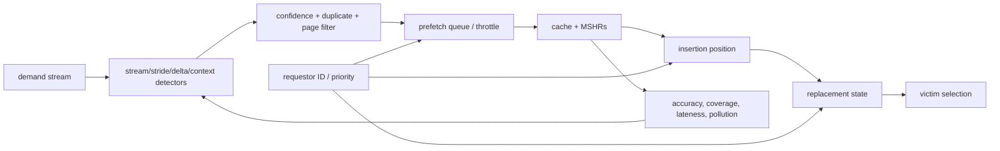

# Prefetching, Replacement, and Quality of Service (QoS) — Managing Cache Capacity

> **First-time reader orientation:** A cache must predict both what to fetch early and what to evict when space is needed. A prefetcher guesses future demand; a replacement policy chooses a victim; quality of service protects progress when several requesters share capacity or bandwidth. Local hit-rate improvement is not enough if the policy pollutes another core or saturates memory.

> **Abbreviation key — skim now and return as needed:** average memory access time (AMAT); miss status holding register (MSHR); dynamic random-access memory (DRAM); high-bandwidth memory (HBM); double data rate (DDR);
> level-one cache (L1); level-two cache (L2); last-level cache (LLC); network on chip (NoC); direct memory access (DMA);
> least recently used (LRU); program counter (PC); service-level objective (SLO); kibibyte (KiB).

> **Prerequisites:** [Cache Microarchitecture](01_Cache_Microarchitecture.md) (AMAT, MSHRs, hierarchy, replacement overview), [Workload Characterization](../00_Design_Methodology/01_CPU_Workloads_Performance_and_DSE.md), and [Network on Chip](../../04_SoC_and_Chiplet_Architecture/04_On_Chip_Networks/01_Network_on_Chip.md).
> **Hands off to:** [Cache Coherence](../06_Coherence_and_Consistency/01_Cache_Coherence.md) for distributed ownership, [DDR Controller](../../04_SoC_and_Chiplet_Architecture/02_Shared_Memory/01_DDR_Controller.md) for last-level misses, and [QoS, Ordering, and I/O Coherence](../../04_SoC_and_Chiplet_Architecture/05_IO_and_Chiplets/01_QoS_Ordering_and_IO_Coherence.md) for end-to-end enforcement.

---

## 0. Why this page exists

A shared cache makes three predictions continuously:

1. **prefetch:** which absent line will be demanded soon;
2. **replacement/insertion:** which resident line will be needed least;
3. **QoS allocation:** which requestor creates the most value from the next unit of capacity or bandwidth.

Treating them independently causes pathologies. An aggressive prefetcher fills the cache, replacement evicts demand lines, and a shared workload consumes MSHRs/bandwidth even if way partitioning limits its capacity.

The correct design is a closed-loop resource controller, not a collection of benchmark-specific heuristics.

## Before the details: cache policy spends shared resources

A prefetcher uses past address behavior to request a line before a demand access arrives. If the line arrives early enough, demand latency falls. But the request occupies a miss tracker, interconnect bandwidth, memory-controller space, and cache capacity. A correct prediction that arrives late gives little latency benefit; an unused prediction may evict useful data and delay another requester.

Replacement has the same system scope. Choosing a victim decides which future access will miss and whether a dirty line must be written back. Insertion policy decides how long an arriving line should compete. Quality of service adds a second objective: a policy should not improve one core by consuming the capacity or bandwidth needed to meet another core’s service target.

**Beginner checkpoint:** accuracy answers “was prefetched data used?” Coverage answers “how many costly misses were helped?” Timeliness asks “did it arrive before demand?” Pollution asks “what useful data or traffic did it displace?” The controller must observe all four before increasing aggressiveness.

## 1. Four prefetch metrics, not one hit count

Let $P$ be issued prefetches, $U$ useful prefetched lines later consumed by demand, $M_0$ baseline demand misses, and $M$ misses with prefetching.

$$
\text{accuracy}=\frac{U}{P},\qquad
\text{coverage}=\frac{M_0-M}{M_0}.
$$

Also measure:

- **timeliness:** useful line arrived before the demand;
- **pollution:** demand line evicted by a prefetch and re-requested before the prefetch line was useful;
- **bandwidth overhead:** prefetch bytes / demand bytes;
- **MSHR occupancy and queue delay:** hidden contention even when bandwidth is not saturated.

High accuracy can have low coverage if only trivial streams are predicted. High coverage can hurt performance if prefetches arrive late, consume miss resources, or displace critical data.

Speedup approximates

$$
\Delta T\approx N_{saved}L_{exposed}-N_{late}C_{contend}-N_{pollute}L_{refetch},
$$

where saved misses count only exposed latency, not fully overlapped misses.

## 2. Where prediction lives

| Placement | Sees | Strength | Cost/risk |
|---|---|---|---|
| L1 | precise per-core demand and PC | low latency | tiny state, pollution on critical cache |
| private L2 | filtered stream, more time | stronger correlation/state | misses some L1 behavior |
| shared LLC | all requestors and long lead time | global patterns, bandwidth coordination | inter-core interference and attribution |
| memory controller | physical stream and banks | DRAM-aware scheduling | too late for many hit-level benefits |

Prefetch into L1 for timeliness only when confidence is high. Lower-confidence requests can target L2/LLC or a prefetch buffer, trading an extra hit latency for less pollution.

## 3. Prefetch mechanisms

### 3.1 Next-line and stream

Next-line predicts $A+B$ after demand address $A$ for line size $B$. A stream detector confirms several increasing/decreasing lines, then runs ahead by distance $d$. It is cheap and effective for sequential arrays, harmful for sparse or boundary-crossing streams.

### 3.2 Stride by instruction PC

Track last address and delta for a load PC. If successive deltas match, predict $A+k\Delta$. Confidence prevents one accidental pair from launching a stream. Context may include call path, page, or address region to avoid mixing phases.

### 3.3 Delta/correlation predictors

Instead of one stride, learn sequences of deltas or transitions between miss addresses. These cover pointer-like or irregular-but-repeating patterns at greater storage and bandwidth risk. Signature/path predictors compress history into a table index; collisions become both accuracy and security concerns.

### 3.4 Spatial-region predictors

Record which offsets within a page/region tend to be accessed after a trigger. They handle structures with repeated spatial footprints. Metadata can be large: region tags, bitmaps, confidence, and replacement state.

### 3.5 Software and semantic prefetch

Compiler/programmer hints know loop structure and data layout but must choose lead distance robustly across cache/memory implementations. Hardware may drop hints under pressure. Accelerator DMA engines are prefetchers with explicit tile semantics and much larger transfer granularity.

## 4. Prefetch degree and distance are feedback controls

Degree $g$ is requests per trigger; distance $d$ is how far ahead. Required lead distance is roughly

$$
d\gtrsim\lambda_{consume}L_{fill},
$$

in units of lines, where the consumer uses $\lambda_{consume}$ lines/cycle and fill latency is $L_{fill}$. If $d$ is too small, prefetches are late; too large, they occupy capacity before use and cross phase/page boundaries.

Throttle using measured pressure:

- accuracy/confidence;
- demand MSHR stalls;
- NoC/memory utilization;
- prefetch queue age and lateness;
- pollution estimate;
- requestor priority and bandwidth budget.

Control must avoid oscillation. Update over windows longer than a burst, use hysteresis, and change degree gradually. Per-core policies need global feedback at shared bottlenecks.

## 5. Request lifecycle and correctness

Before issuing a prefetch:

1. check cache tags, MSHRs, and prefetch queues for duplicates;
2. respect page/region boundaries unless translation is available;
3. check permissions without raising a demand-visible fault for speculative hints;
4. attach requestor/security/virtualization attributes;
5. reserve resources only under policy limits;
6. mark the fill so usefulness and pollution can be attributed.

Prefetches must never create architectural exceptions or fetch forbidden data into an observable domain. Dropping a prefetch is always legal; changing architectural behavior is not.

## 6. Replacement as re-reference prediction

True LRU orders ways by recency but scales poorly in ports/state and is not optimal when scans displace frequently reused lines. Replacement approximations predict future reuse:

| Policy | State/idea | Good at | Weakness |
|---|---|---|---|
| random | none/small LFSR | low cost, high associativity | ignores reuse |
| tree-PLRU | $W-1$ direction bits | common temporal locality | not true stack order |
| SRRIP | small re-reference prediction value (RRPV) | scans and mixed reuse | fixed insertion behavior |
| BRRIP | mostly distant insertion, rare near insertion | protects cache from scans | can under-admit new useful lines |
| DRRIP | set dueling chooses SRRIP/BRRIP | adapts across phases | leader-set noise and per-core interaction |
| SHiP-like | signature learns dead/reused lines | PC/context-correlated reuse | table aliasing, training latency |

RRIP selects a line predicted distant; if none is maximally distant, all candidates age. Insertion policy determines whether a new line gets probation or immediate protection.

## 7. Inclusion, coherence, and replacement constraints

Replacement is not always free to choose any victim:

- dirty lines require writeback resources;
- inclusive LLC eviction may invalidate private-cache copies;
- directory entries may track sharers even if data is absent;
- locked/pinned lines cannot be evicted;
- transient coherence lines and outstanding misses are ineligible;
- compressed caches need variable-size placement;
- QoS partitions restrict candidate ways or occupancy.

Victim selection should account for **eviction cost** as well as reuse probability. A slightly more reusable clean private line may be cheaper to evict than a dirty widely shared line whose invalidations stall cores.

## 8. Shared-cache QoS

Shared resources include capacity, tag/data ports, MSHRs, fill/writeback buffers, NoC bandwidth, and memory service. Way partitioning controls only capacity.

### 8.1 Utility-based allocation

Estimate each requestor's misses as a function of allocated ways using auxiliary tags or set sampling. Allocate the next way to the largest marginal miss reduction:

$$
\Delta U_i(w)=Miss_i(w)-Miss_i(w+1).
$$

This maximizes aggregate hit utility under the model, but fairness/SLO policy may require minimums or weighted utility.

### 8.2 Controls

- way masks or maximum-capacity partitions;
- occupancy targets and insertion throttles;
- MSHR/fill-buffer quotas;
- request/token rate limits;
- bandwidth reservation at NoC and memory controller;
- priority with aging/deadline escalation;
- monitoring IDs separate from control IDs.

Controls must travel with the request through the system. A cache partition cannot guarantee latency if a neighbor monopolizes DRAM or coherence queues.

## 9. Prefetch–replacement–QoS coupling

Useful policies coordinate:

- insert prefetches at lower priority than demand until reuse is proven;
- charge prefetch traffic to the generating requestor;
- cap prefetch MSHRs separately but allow borrowing when idle;
- demote inaccurate prefetch signatures and train replacement on actual demand use;
- avoid letting prefetched hits inflate utility estimates without charging bandwidth;
- use coherence/sharing information to suppress ownership-prefetch pollution.

A prefetcher's accuracy measured in isolation can collapse under co-runners because fill latency, cache residence, and available MSHRs all change. Evaluate the feedback loop under multiprogrammed traffic.

## 10. Verification and observability

Counters per level and requestor:

- issued, dropped, duplicate, late, useful, unused, and harmful prefetches;
- demand/prefetch MSHR occupancy and full cycles;
- replacement victim class, age, dirty/shared state, and re-reference after eviction;
- occupancy, way allocation, hit/miss, bandwidth, and stall time by QoS ID;
- throttle state and transitions;
- leader-set policy choices and confidence distributions.

Invariants:

- prefetch cannot raise an architectural exception;
- partition restrictions apply to allocation/victim choice as defined;
- no requestor can exceed a hard reserved-resource limit;
- eventual demand progress survives continuous prefetch traffic;
- replacement never selects invalid-ineligible/transient/locked lines;
- counters attribute merged demand/prefetch events consistently.

## 11. Numbers to remember

- Accuracy = useful/issued; coverage = baseline misses removed/baseline misses.
- Timeliness, pollution, bandwidth, and MSHR pressure determine whether accurate prefetches help.
- Prefetch distance is consumption rate × fill latency in line units.
- Replacement predicts re-reference, not merely “oldest access.”
- Way partitioning controls capacity only; QoS also needs queues and downstream bandwidth.
- Charge prefetch resources and benefits to the same requestor identity.

## 12. Worked problems

### Problem 1 — prefetch evaluation

Baseline has 1000 misses. A prefetcher issues 600 requests, 420 are used, and misses fall to 650. Accuracy is $420/600=70\%$; coverage is $(1000-650)/1000=35\%$. The missing difference includes late/merged prefetches and effects that did not remove a demand miss.

### Problem 2 — required distance

A kernel consumes 0.25 new lines/cycle and memory fill latency is 160 cycles. Minimum steady lead is

$$
d\approx0.25\times160=40\ \text{lines}.
$$

That is 2.5 KiB at 64 B/line, large enough that page boundaries, phase changes, and cache residence must be considered.

### Problem 3 — marginal utility

At four ways, core A loses 30 misses by receiving a fifth way; B loses 8. A utility-maximizing allocator gives the way to A. If B has a latency SLO or currently only one way, policy may override aggregate utility with a guarantee.

## Cross-references

- **Cache structures:** [Cache Microarchitecture](01_Cache_Microarchitecture.md).
- **Shared correctness and policy:** [Cache Coherence](../06_Coherence_and_Consistency/01_Cache_Coherence.md), [QoS, Ordering, and I/O Coherence](../../04_SoC_and_Chiplet_Architecture/05_IO_and_Chiplets/01_QoS_Ordering_and_IO_Coherence.md).
- **Traffic sinks:** [Network on Chip](../../04_SoC_and_Chiplet_Architecture/04_On_Chip_Networks/01_Network_on_Chip.md), [DDR Controller](../../04_SoC_and_Chiplet_Architecture/02_Shared_Memory/01_DDR_Controller.md), [HBM and Advanced Memory Systems](../../02_GPU_Architecture/02_Memory_System/02_HBM_and_Advanced_Memory_Systems.md).

## References

1. S. Srinath et al., “Feedback Directed Prefetching: Improving the Performance and Bandwidth-Efficiency of Hardware Prefetchers,” HPCA 2007.
2. A. Jaleel et al., “High Performance Cache Replacement Using Re-Reference Interval Prediction,” ISCA 2010.
3. M. Qureshi and Y. Patt, “Utility-Based Cache Partitioning,” MICRO 2006.
4. Arm, [MPAM-style cache partitioning with gem5](https://developer.arm.com/community/arm-community-blogs/b/architectures-and-processors-blog/posts/gem5-cache-partitioning).
5. J. Doweck, “Inside Intel Core Microarchitecture and Smart Memory Access,” Intel Technology Journal, 2006.

---

**Navigation:** [Cache Hierarchy index](00_Index.md) · [Memory index](../00_Design_Methodology/00_Index.md)
