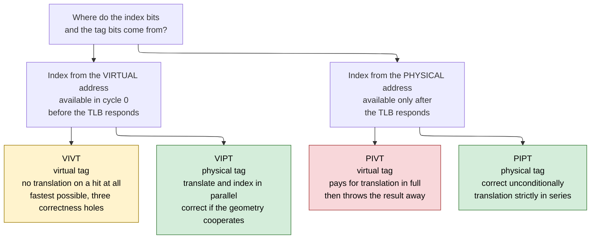
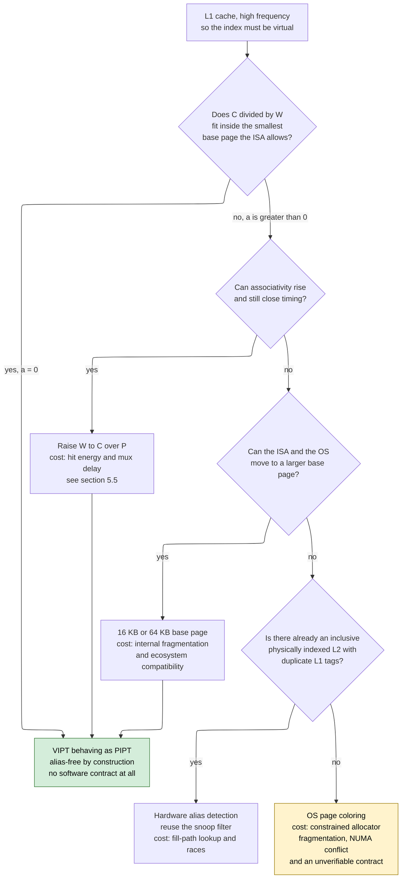

# Address Translation and Cache Indexing — VIVT, VIPT, PIPT, and the Constraint That Shapes Every L1

> **First-time reader orientation:** A program issues *virtual* addresses; memory is organized by *physical* addresses; a translation lookaside buffer converts one into the other. A cache must pick a set (the *index*) and then confirm identity (the *tag*). Each of those two jobs can use the virtual address or the physical one, and that single choice decides how fast the cache can be, whether two names for one memory location can silently disagree, and — through a small inequality — how large a first-level cache is allowed to be.

> **Abbreviation key — skim now and return as needed:** virtual address (VA); physical address (PA); virtual page number (VPN); physical page number (PPN); page frame number (PFN);
> translation lookaside buffer (TLB); virtually indexed, virtually tagged (VIVT); virtually indexed, physically tagged (VIPT); physically indexed, virtually tagged (PIVT); physically indexed, physically tagged (PIPT);
> address-space identifier (ASID); process-context identifier (PCID); virtual-machine identifier (VMID); address generation unit (AGU); load-store unit (LSU); reorder buffer (ROB); miss status holding register (MSHR);
> static random-access memory (SRAM); content-addressable memory (CAM); direct memory access (DMA); input-output memory management unit (IOMMU); last-level cache (LLC); level-one data cache (L1D); level-one instruction cache (L1I);
> operating system (OS); instruction set architecture (ISA); copy-on-write (CoW); transparent huge pages (THP); non-uniform memory access (NUMA); simultaneous multithreading (SMT); instructions per cycle (IPC);
> fan-out-of-four (FO4); point of unification (PoU); point of coherency (PoC); cache-block operation (CBO); naturally aligned power-of-two (NAPOT); shared-memory low-boundary address multiple (SHMLBA);
> address-space-layout randomization (ASLR); kilobyte or kibibyte (KB / KiB); megabyte (MB); gigabyte (GB); picosecond (ps); gigahertz (GHz).

> **Prerequisites:** [Cache Microarchitecture](01_Cache_Microarchitecture.md) (the index/tag/offset split of its §1.4 and, critically, the associativity cost model of its §2 — this page's central constraint is paid for in ways), [TLB and Virtual Memory](../05_Virtual_Memory/01_TLB_and_Virtual_Memory.md) (what a translation *is*: VPN → PPN, the TLB that caches it, ASIDs, and shootdown — all of which this page consumes and none of which it repeats), [Load-Store Unit and Memory Ordering](../03_Out_of_Order_Backend/02_Load_Store_Unit_and_Memory_Ordering.md) (where the virtual address comes from and what the load-to-use budget is spent on).
> **Hands off to:** [Cache Coherence](../06_Coherence_and_Consistency/01_Cache_Coherence.md) (the snoop path that only works because the tag is physical), [Page Walkers, IOMMUs, and Virtualization](../05_Virtual_Memory/02_Page_Walkers_IOMMUs_and_Virtualization.md) (two-stage translation, and devices that carry physical addresses into a coherent fabric), [Prefetching, Replacement, and QoS](02_Prefetching_Replacement_and_QoS.md) (prefetchers generate addresses in one space and must be told which).

---

## 0. Why this page exists

Ask an engineer why a first-level data cache is 32 KB and 8-way and you will usually get an answer about miss rates. That answer is wrong, or at least it is answering a different question. Miss-rate curves would happily justify 64 KB, or 4-way, or 128 B lines. The reason so many *unrelated* products — an x86 server core, an Arm phone core, an open-source RISC-V core designed by a university — converge on the same small set of geometries is not a shared opinion about locality. It is a single inequality that falls out of the interaction between address translation and cache indexing, and it is the tightest architectural constraint in the whole memory hierarchy: it is imposed by the page size, it cannot be negotiated, and it is enforced not by a specification but by silent data corruption.

This notebook has used the answer without deriving it. The term "VIPT" appears in dozens of places — the [TLB page](../05_Virtual_Memory/01_TLB_and_Virtual_Memory.md) uses it to explain how translation latency is hidden, and [Cache Microarchitecture §1.5](01_Cache_Microarchitecture.md) states the resulting capacity ceiling as a fact about the index/offset split. Neither derives the *design space* the answer came from, and neither explains what the discarded alternatives cost, why one of them is not merely worse but incoherent, or what a designer does when the inequality cannot be satisfied. That is this page. It owns the boundary where translation meets the cache index: the choice of which address supplies the index bits, which address supplies the tag bits, and every consequence of that choice.

The stakes are not academic. A cache that indexes with virtual bits it should not have used will pass every functional test you are likely to write, boot an operating system, run a benchmark suite for a week, and then corrupt exactly one shared-library page in a customer's database under a sharing pattern nobody thought to generate. Synonym bugs are the canonical "escaped to silicon" defect class in memory-system design precisely because they require a *conjunction* of conditions — two virtual addresses, one physical frame, a specific difference in one address bit, a write through one name and a read through the other — that no random test generator produces by accident and no benchmark exhibits. Meanwhile the same choice, made well, is what buys a whole cycle of load-to-use latency, which is worth a few percent of integer performance on every workload the part will ever run.

After this page you should be able to: enumerate the four index/tag combinations and prove that one of them is incoherent; lay out the serial and parallel L1 hit paths against a real clock period and say what serialization costs in cycles and in gigahertz; state and derive the VIPT constraint in both its bit-position form and its design form; take an arbitrary (capacity, associativity, line size, page size) tuple and decide in ten seconds whether it is legal; enumerate the four escapes when it is not, with the cost of each in hardware, in operating-system freedom, and in verification effort; explain why an instruction cache gets to make a different choice than a data cache; and write the specific directed tests that catch a synonym, a homonym, a missed snoop, and a page-coloring violation.

---

## 1. The design space: four ways to name a cached line

### 1.1 Two independent questions

[Cache Microarchitecture §1.4](01_Cache_Microarchitecture.md) established that a cache is a hardware hash table. An address is cut into three fields:

```text
   bit:   63                                12  11              6   5        0
          [------------- tag ----------------] [--- index ------] [-- block --]
                                                                     offset
```

- the **block offset** selects a byte within a cache line;
- the **index** selects which *set* of the array to look in — it is the hash function, and it is consumed at the very first moment of the access, because nothing can be read until a set is chosen;
- the **tag** is everything above, and it is what distinguishes the many addresses that hash to the same set. It is consumed at the *end* of the access, when the candidate tags read from the set are compared against it.

Now overlay translation. A load carries a virtual address. The TLB turns the high-order **virtual page number** into a **physical page number** and leaves the low-order **page offset** — the low $\log_2 P$ bits for page size $P$ — completely untouched, because that is the definition of a page: a unit of relocation, moved as a whole, with internal structure preserved.

```text
              translated by the TLB              never translated
          <----------------------------->    <---------------------->
   bit:   63                            12    11                     0
   VA:   [ virtual  page number   VPN     ]  [      page offset       ]
   PA:   [ physical page number   PPN     ]  [      page offset       ]
           ^ VPN and PPN are unrelated          ^ bit-for-bit identical
```

**Contract of the figure.** For any virtual address $v$ and its translation $\phi(v)$, the low $\log_2 P$ bits satisfy $v \bmod P = \phi(v) \bmod P$, and nothing above that is guaranteed. *Concrete trace:* with $P = 4\text{ KB}$, virtual address `0x0000_7F2A_9C41_3040` in a process whose page `0x7F2A_9C41_3` maps to frame `0x0_0004_2`, translates to physical `0x0000_0000_0004_2040`. Bits [11:0] are `0x040` in both. Bits [63:12] have nothing in common. *The trade-off it shows:* the low bits are available immediately and are safe; the high bits are safe but not available immediately. Every design in this page is a different way of living with that split.

So the cache designer faces **two independent binary choices**:

1. Where do the **index** bits come from — the virtual address (available in cycle 0, before translation) or the physical address (available only after the TLB responds)?
2. Where do the **tag** bits come from — the virtual address (no translation needed on a hit) or the physical address (translation needed, but names the location uniquely)?

Two binary choices give four combinations. Naming them by (index, tag):



**Contract of the figure.** Each leaf is a complete, buildable cache organization; the two branch levels are the two independent choices, so the four leaves are exhaustive — there is no fifth option, only variations on these. *Concrete trace:* a load of virtual address `0x1000_2040` in a 32 KB, 8-way, 64 B-line cache takes index bits [11:6] $=$ `0b000001` $=$ set 1 under either virtual or physical indexing here (those bits are inside the page offset), but the tag it compares is `VA[63:12]`, i.e. `0x1000_2040 >> 12 = 0x1_0000_2`, under virtual tagging and `PA[63:12]` under physical tagging — different numbers, and the whole page is about when that difference matters. *The trade-off it shows:* moving left-to-right across the leaves trades latency for correctness, and the two green leaves are the only ones a modern part ships — but for entirely different reasons, at entirely different levels of the hierarchy.

### 1.2 Why PIVT is not a design point but a mistake

Before spending any effort on the three serious options, dispose of the fourth. Showing that one of the four combinations is *incoherent* — not merely slower or riskier, but strictly dominated with no operating point where it wins — is what proves this is a genuine design space rather than a list of four names someone tabulated.

**The baseline.** A PIVT cache indexes with physical bits and compares a virtual tag. Build it: issue the load, send the VPN to the TLB, wait for the PPN, assemble the physical address, index the set, read the ways, and compare each way's stored tag against `VA[63:12]`.

**The trace that kills it — step 1: the latency argument.** The whole and only reason to use a virtual tag is to avoid waiting for translation. But this design has *already waited* — it could not select a set until the PPN arrived. The physical address is sitting in a register at the moment of the compare. Using a virtual tag therefore saves exactly zero cycles relative to using the physical tag that is already in hand. The compare is the same width and the same delay either way. The benefit column of the trade is empty before we even look at the cost column.

**Step 2: the cost column, and it is worse than VIVT's.** Physical indexing forces every alias of a physical line into *the same set*, because the index is a function of the physical address alone. So two virtual addresses $v_1 \ne v_2$ with $\phi(v_1) = \phi(v_2) = p$ land in set $\text{index}(p)$ — together — and then their *virtual* tags differ, so the tag compare declares them to be different lines. The cache dutifully allocates two ways of one set to two copies of one physical line. This is not a possibility that depends on geometry, as it is in VIPT; it is a **guarantee**. Every alias in the system produces a duplicate, in a set you are looking straight at, and the structure cannot tell.

**Step 3: it also keeps VIVT's other problem.** A virtual tag is ambiguous across address spaces — the same virtual address in two processes is two different locations — so PIVT still needs an ASID or VMID field in every tag, still needs flush-or-tag machinery on context switch, and still pays that width on every line. It has bought nothing and inherited everything.

**Step 4: snoops.** An incoming coherence request or DMA carries a physical address. PIVT can compute the set (physical index — this is the one thing it does better than VIVT), but it cannot compare, because the stored tags are virtual. It needs a reverse map from physical tag to virtual tag to answer a snoop — and §3.4 shows that map does not exist as a function. So PIVT needs the expensive reverse-translation structure *and* has no latency advantage to show for it.

**The derived conclusion.** PIVT pays translation in full, gains no latency, guarantees rather than risks duplicate lines, still needs address-space tagging, and still needs reverse translation for coherence. It is dominated by PIPT on every axis simultaneously — same latency, strictly worse correctness — which is a stronger statement than "it is a bad trade." There is no workload, frequency, page size, or geometry that makes it the right answer.

**The historical footnote, handled honestly.** PIVT is sometimes listed as a fourth quadrant with an attribution to an early-1990s MIPS implementation. What that machine actually did is better described as **partial translation**: a tiny "TLB slice" translated just the handful of address bits needed for the index, early, so the index could be physical without waiting for the full TLB (Taylor, Davies, and Farmwald, ISCA 1990). That is a real and still-useful idea — it reappears in §6.4 as a relative of way prediction — but it is a technique for getting *physical index bits sooner*, not an argument for virtual tags. Read that way, the four-quadrant table has three live entries and one that exists only to be crossed out.

The rest of the page therefore treats three organizations: **VIVT** (§3), the fast baseline whose failures generate every subsequent mechanism; **PIPT** (§4), the correct organization and the right answer everywhere except one place; and **VIPT** (§5), the compromise that owns that one place — the L1 — and the inequality that makes it work.

---

## 2. The timing argument: why the index cannot wait for translation

### 2.1 The two events, and the order they want to happen in

Everything in this page follows from one scheduling conflict:

- **Translation is a lookup.** It reads a structure — the L1 TLB, a small CAM or set-associative array — and produces the PPN. It takes real time.
- **The index is needed first.** The cache's very first action is to decode an index into wordlines. Nothing else can start. The index is not consumed at the *end* of the access like the tag; it is consumed at the *beginning*.

So a physically indexed cache must run translation *before* the access begins, in series. That is not an implementation detail that a clever circuit can hide; it is a data dependence: address bits produced by structure A are the select lines of structure B.

### 2.2 Costing it against a real clock period

Take a 4 GHz core, so a cycle is $1/4\text{ GHz} = 250$ ps. At a modern node a cycle of that length is roughly 15–20 fan-out-of-four inverter delays, so $1\ \text{FO4} \approx 13$–$17$ ps; take 15 ps. Budget the pieces of an L1 hit path, all of which the [Cache Microarchitecture §2.2](01_Cache_Microarchitecture.md) hit path already enumerates:

| Component | Delay | Where the number comes from |
|---|---:|---|
| L1 TLB lookup: CAM match, hit-mux, PPN drive | ~180 ps | ~12 FO4, consistent with the TLB page's "~13 of 15–20 FO4" for the translate stage |
| L1 data array: index decode, wordline, bitline, sense | ~200 ps | small SRAM macro at this capacity |
| Tag compare, way-select mux, byte rotate/align | ~160 ps | comparator plus one 8:1 mux level plus the aligner |
| Bypass-network drive to the consumer's operand mux | ~50 ps | wire plus a driver, on the LSU-to-ALU path |
| Flop overhead: clock-to-Q plus setup plus skew margin | ~40 ps per stage | pipeline tax |

Now schedule those pieces two ways.

**Overlapped (VIPT).** The TLB lookup and the array read do not depend on each other, so they occupy the same stage. That stage costs $\max(180, 200) + 40 = 240$ ps $\le 250$ ps. The next stage costs $160 + 50 + 40 = 250$ ps $\le 250$ ps. Two stages after address generation, and the data is on the bypass network.

**Serial (PIPT).** The array read cannot start until the PPN exists. Stage 1 is TLB only: $180 + 40 = 220$ ps. Stage 2 is the array: $200 + 40 = 240$ ps. Stage 3 is compare, mux, align, drive: $250$ ps. Three stages.

That is the entire argument, and it has exactly two payment options:

- **Pay in latency.** Keep 4 GHz and add the stage: load-to-use grows by **one full cycle**.
- **Pay in frequency.** Keep the two-stage structure and let the first stage absorb both operations serially: $180 + 200 + 40 = 420$ ps, so the machine tops out at $1/420\ \text{ps} = 2.38$ GHz — a **40 % frequency loss**, and the L1 path is now the critical path for the entire core, dragging every unrelated pipeline down with it.

Neither is acceptable in a high-frequency core, and there is no third option, because the dependence is real. This is why VIPT exists.

### 2.3 The cycle-accurate picture

```wavedrom
{ "signal": [
  { "name": "clk",                        "wave": "p......." },
  { "name": "AGU: virtual address ready", "wave": "10......", "node": "a......." },
  {},
  ["PIPT: translation in series",
    { "name": "L1 TLB lookup",            "wave": "010.....", "node": ".b......" },
    { "name": "set decode + array read",  "wave": "0.10....", "node": "..c....." },
    { "name": "tag compare + way mux",    "wave": "0..10...", "node": "...d...." },
    { "name": "data on bypass network",   "wave": "0...10..", "node": "....e..." }
  ],
  {},
  ["VIPT: translation overlapped",
    { "name": "L1 TLB lookup",            "wave": "010.....", "node": ".f......" },
    { "name": "set decode + array read",  "wave": "010.....", "node": ".g......" },
    { "name": "tag compare + way mux",    "wave": "0.10....", "node": "..h....." },
    { "name": "data on bypass network",   "wave": "0..10...", "node": "...i...." }
  ]
 ],
 "edge": ["b|->c PPN needed before the index exists", "i-e one cycle of load-to-use saved"],
 "head": {"text": "L1 hit path at 4 GHz, 250 ps per cycle: cycle 1 is address generation, cycle 2 begins the cache access", "tick": 1},
 "foot": {"text": "PIPT delivers in cycle 5, VIPT in cycle 4 — the difference is the serial dependence marked by the arrow"}
}
```

**Contract of the figure.** Cycle 1 is the AGU producing the virtual address; every later signal is asserted for the single cycle in which that operation occupies its pipeline stage; "data on bypass network" is the cycle in which a dependent instruction can consume the loaded value. The PIPT group has a serial edge from the TLB to the index; the VIPT group does not, because its index bits were never translated.

**Concrete trace.** `ld x5, 0(x10)` with `x10 = 0x1000_2040`. Cycle 1: the AGU computes $0\text{x}1000\_2040 + 0$. Cycle 2, VIPT: bits [11:6] $=$ `0b000001` drive set 1 of all eight ways *while* VPN `0x1_0000_2` goes to the TLB, which returns PPN `0x0_0004_2`. Cycle 3: the eight tags read from set 1 are compared against physical tag `0x0000_0000_0004_2`; way 3 matches; the mux selects way 3's 64 bytes; bytes [7:0] are extracted. Cycle 4: `x5` is on the bypass network, and a dependent `add x6, x5, x7` issued in cycle 4 executes without a bubble. In the PIPT group the identical access reaches the bypass network in cycle 5, so that dependent `add` stalls one cycle.

**The trade-off it shows.** The one cycle is bought by using index bits the TLB never touched — which means those bits must all lie inside the page offset, which is the entire subject of §5. The figure is honest about what VIPT does *not* buy: the tag compare is still physical, so the TLB is still on the path; VIPT does not remove translation from the hit path, it removes translation from the *front* of the hit path. A TLB that is too slow still lengthens cycle 2 and therefore still sets the clock period — the [TLB page](../05_Virtual_Memory/01_TLB_and_Virtual_Memory.md) develops that consequence and this page does not repeat it.

### 2.4 What one cycle of load-to-use is worth

A cycle of load-to-use latency is not a rounding error. Loads are roughly a quarter to a third of dynamic instructions in integer code, a large fraction of them are on the critical dependence chain (pointer chasing, array-index computation, spill/fill traffic), and the out-of-order scheduler wakes a load's consumers *speculatively* based on the expected hit latency — so changing that latency changes the schedule, not just one instruction's completion time. The working rule of thumb is **2–3 % IPC per cycle of L1 load-to-use** on integer workloads, more on pointer-heavy code, less on code dominated by long-latency misses. Restated as a design budget: the VIPT overlap is worth about as much as a substantial branch-predictor improvement, and it costs nothing but a constraint on the geometry.

The frequency alternative is worse than the latency alternative and it is worth seeing why. A 40 % frequency loss applies to *every* instruction the core executes, including the ones that never touch memory. A one-cycle load-to-use increase applies only to dependent consumers of loads and is partially hidden by the out-of-order window. So a designer forced to choose would take the extra stage — which is exactly what low-frequency, in-order, embedded cores do *not* have to do, and that observation is the selection boundary of §4.2.

### 2.5 The same argument for the instruction cache, only tighter

The load path is not the tightest budget in the machine; instruction fetch is. The fetch address arrives from the branch predictor, and the next prediction depends on the current fetch — so the branch-target buffer lookup, the instruction-cache index, and the next-address selection all want to be in one loop whose length directly sets the taken-branch throughput. Inserting a translation *before* the I-cache index lengthens that loop, which does not merely add latency to one fetch; it reduces the rate at which taken branches can be predicted at all, and a two-cycle taken-branch bubble is a well-known several-percent structure ([Fetch, Decode, and Uop Delivery](../02_Frontend_and_Prediction/02_Fetch_Decode_and_Uop_Delivery.md)). The pressure to index the I-cache with untranslated bits is therefore *stronger* than on the data side — which is one of the three reasons §8.2 gives for instruction caches making a different, more aggressive choice than data caches.

---

## 3. VIVT: the fast, broken baseline

### 3.1 The baseline, and why it is genuinely attractive

Index with virtual bits, tag with virtual bits. On a hit, **the TLB is not consulted at all**. Not overlapped — not consulted. The access is: index, read ways, compare virtual tags, mux, done. Translation happens only on a miss, to find out which physical line to fetch.

The benefits are real and worth stating before demolishing them:

- **Latency.** Same as the VIPT overlap in the common case, and better in the corner where the TLB is the slow leg: the array read alone is 200 ps, so the first stage costs $200 + 40 = 240$ ps whether or not a TLB exists. But the second stage no longer waits on translation at all, which gives slack a designer can spend elsewhere.
- **Energy.** A TLB lookup is a CAM match against tens of entries, and CAM matching is expensive: every entry drives a matchline. Skipping it on ~97 % of accesses (the L1 TLB hit rate) is a real fraction of the load-path energy — on the order of 10–20 % of a hit, depending on TLB size and organization.
- **TLB pressure.** The TLB now sees only the cache's miss stream rather than every access, so it can be smaller at the same miss rate, or the same size and miss far less often.
- **Simplicity, at first glance.** No coupling between the cache geometry and the page size. Any capacity, any associativity, any line size. The constraint of §5 simply does not exist.

That last point is the seduction. VIVT is the only organization in which cache geometry and page size are independent, which is why it keeps being proposed, and why it appeared in real machines through the 1990s. Then three failures arrive, and they arrive in increasing order of how hard they are to repair.

### 3.2 Failure one: homonyms — one name, two locations

**The exact failure.** Every process starts its address space at the same low addresses. Two processes both have a valid mapping for virtual address `0x0040_1000`; process A's maps to physical frame `0x0_0012_3`, process B's to `0x0_0009_A`. There is nothing unusual here; it is the *normal* case, and it is what "private address space" means.

Trace it through a 32 KB, 8-way, 64 B-line VIVT cache (64 sets, index = `VA[11:6]`, tag = `VA[63:12]`):

1. Process A executes `lw t0, 0(s0)` with `s0 = 0x0040_1040`. Miss. Translate: physical `0x0_0012_3040`. Fetch the line. Install it in set `0b000001` = 1 with **virtual** tag `0x0000_0000_0040_1`. A reads the value `0xAAAA_AAAA`.
2. The OS context-switches to process B. The page tables change. The TLB is handled by ASID or flush. **The cache is not touched** — nothing about a context switch invalidates data by itself.
3. Process B executes the same instruction with the same `s0 = 0x0040_1040`. Index → set 1. Compare virtual tag `0x0000_0000_0040_1`. **It matches.** The cache returns `0xAAAA_AAAA` — process A's data, from process A's page, to process B.

That is not a performance bug. It is a silent read of another process's memory across a protection boundary, produced by a correctly functioning cache doing exactly what it was told. And it is symmetric: B's *stores* land in A's cached line, so B can corrupt A. A homonym failure is both a correctness bug and a complete collapse of address-space isolation ([Hardware Security Architecture](../../../08_Cross_Cutting_Engineering/01_Hardware_Security_Architecture.md) treats the general class of cross-domain leaks; this one does not even require a side channel, it is a direct architectural read).

**Repair A: flush the cache on every context switch.** Correct, trivially. The cost is a cold cache after every switch, and it is worth computing rather than hand-waving.

Let $N_{\text{live}}$ be the number of lines the incoming process would have hit on, $t_{\text{refill}}$ the refill latency, $\text{MLP}$ the memory-level parallelism the refills achieve (misses overlap — see [Cache Microarchitecture §3](01_Cache_Microarchitecture.md)), and $T_q$ the quantum in cycles between flushes. The overhead fraction is

$$\text{overhead} \;=\; \frac{N_{\text{live}}\; t_{\text{refill}} / \text{MLP}}{T_q}.$$

Take a 32 KB L1D fully populated: $N_{\text{live}} = 32768/64 = 512$ lines, refilled from a warm L2 at $t_{\text{refill}} = 14$ cycles with $\text{MLP} = 4$. The flush costs $512 \times 14 / 4 = 1792$ cycles. Now sweep the quantum at 4 GHz:

| What forces the flush | $T_q$ | Overhead |
|---|---:|---:|
| Scheduler time slice, 1 ms | 4,000,000 cycles | 0.045 % |
| Aggressive time slice, 10 µs | 40,000 cycles | 4.5 % |
| Timer/device interrupt at 100 kHz, if the handler is a separate space | 40,000 cycles | 4.5 % |
| System call every 10,000 cycles, if the kernel is a separate space | 10,000 cycles | **18 %** |

The first row is why VIVT survived as long as it did: on a machine that switches processes every millisecond, flushing is nearly free. The last row is why it died. Modern systems switch protection domains constantly — system calls, interrupts, user/kernel transitions, and, since kernel page-table isolation became standard mitigation practice, transitions that genuinely change the active page table. At syscall frequency the flush cost is not a few percent, it is a fifth of the machine. And the cost is *not* recoverable by making the cache bigger — a bigger cache has more live lines to refill, so the flush gets more expensive, which inverts the normal relationship between capacity and performance.

**Repair B: put the address-space identifier in the tag.** Store `{ASID, VA[63:12]}` and require both to match. Now A's line and B's line coexist; a homonym misses cleanly instead of hitting wrongly. This is the right idea, and its cost is threefold:

1. **Tag width, paid on every line.** A physical tag for the 32 KB/8-way/4 KB-page geometry is `PA[47:12]` = 36 bits, plus valid, dirty, and two coherence-state bits ≈ 40 bits per line. Adding an 8-bit ASID makes it 48 bits — a **20 % larger tag array** in bits, and, because the tag array is read on *every* access and read in *all* ways in parallel, a 20 % increase in tag-read energy on every hit and a small increase in comparator delay on the timing-critical compare. Widen to a 12-bit PCID-class identifier and it is 30 %.
2. **Identifier recycling.** There are finitely many ASIDs — 8 bits gives 256, x86 PCID gives 12 bits, Arm ASIDs are 8 or 16 bits. When the OS runs out and must reuse an identifier for a new process, every cached line tagged with that identifier is now a homonym again, so the reuse must be preceded by exactly the flush you were trying to avoid. The mechanics of allocating, recycling, and invalidating on ASID/PCID/VMID are owned by [TLB and Virtual Memory §4 and §10](../05_Virtual_Memory/01_TLB_and_Virtual_Memory.md) and are not repeated here. What *is* this page's business is the coupling that tagging creates: **the cache's correctness now depends on the TLB's identifier allocator.** Every ASID rollover becomes a cache-maintenance event. Every hypervisor entry adds a VMID dimension. A structure that was previously independent of the translation subsystem is now a client of it, with a shared invariant that must be verified jointly.
3. **It fixes only one of the three failures.** ASID tagging makes a virtual tag unambiguous *across* address spaces. It does nothing about two virtual addresses *within* one address space — same ASID, different VA — naming the same physical frame. That is the next failure, and it is the one that kills VIVT outright.

### 3.3 Failure two: synonyms — two names, one location

**Why this is not exotic.** A reader meeting synonyms for the first time usually assumes they are a pathological case invented by architects. They are the opposite: on a general-purpose operating system, most physical pages that matter have more than one virtual name. The sources are all ordinary:

- **Shared libraries.** `libc` is mapped into every process, at a different base in each thanks to ASLR. One set of physical frames, dozens of virtual names.
- **`mmap` of the same file twice.** Legal, common in databases and language runtimes, and it yields two virtual regions over one page cache.
- **`fork` and copy-on-write.** Immediately after `fork`, parent and child share every physical frame under two page tables — usually at the *same* virtual address, but not necessarily, and not after the child `exec`s or after ASLR-remapping.
- **Kernel and user mappings of the same frame.** This is the decisive one. Linux maintains a direct ("linear") map of all of physical memory in the kernel half of the address space. *Every* user page therefore has at least two virtual names: the user one and the kernel's direct-map one. Any time the kernel touches user data — `read()`, `write()`, `copy_to_user`, a page-cache write-back, zeroing a freshly allocated page — it does so through the alias.
- **System V shared memory attached twice**, POSIX shared memory, and the framebuffer/DMA buffers that device drivers map both for the CPU and for a device.

So the question is not whether synonyms occur but how often, and the answer is: constantly.

**The exact failure, in a cache whose index bits spill.** Take a 32 KB, **2-way**, 64 B-line VIVT cache: $32768/(2\times 64) = 256$ sets, so index = `VA[13:6]` — eight index bits, two of which (bits 13 and 12) lie *above* the 12-bit page offset. Two virtual pages map one physical frame:

- `VA1 = 0x1000_2000` and `VA2 = 0x2000_3000`, both translating to physical frame `0x0_0004_2000`.
- Access byte offset `0x40` in that frame. Virtual addresses: `0x1000_2040` and `0x2000_3040`.
- Index for `VA1`: bits [13:6] of `0x2040`. $0\text{x}2040 \gg 6 = 0\text{x}81 = 129$. **Set 129.**
- Index for `VA2`: bits [13:6] of `0x3040`. $0\text{x}3040 \gg 6 = 0\text{xC1} = 193$. **Set 193.**

One physical line, two sets. Now write through both:

1. `sw` through `VA1`: miss in set 129, fill from physical `0x4_2040`, store `0xAA`, mark dirty. Set 129 holds `[dirty, 0xAA...]`.
2. `sw` through `VA2`: miss in set 193 — the cache has no way to know set 129 already holds this line, because it never compared physical addresses — fill from physical `0x4_2040`, which still reads the *old* memory contents because set 129's copy has not been written back. Store `0xBB`, mark dirty. Set 193 holds `[dirty, 0xBB...]`.
3. Load through `VA1`: hit set 129, returns `0xAA`. Load through `VA2`: hit set 193, returns `0xBB`. **Two dirty copies of one line, permanently disagreeing.**
4. Eventually both are evicted. Whichever is evicted *last* wins in memory. The surviving value depends on replacement-policy state — that is, on unrelated accesses to unrelated addresses. The bug is not merely wrong; it is nondeterministic and unreproducible.

**The part that makes VIVT unsalvageable.** In the example above, the aliasing came from index bits above the page offset — the same mechanism §5 will show for VIPT, and §6 will show how to remove. But VIVT has a *second*, unconditional source of the same failure. Shrink the example to a geometry with no spilled index bits at all: 32 KB, **8-way**, 64 B lines, so 64 sets and index = `VA[11:6]`, entirely inside the page offset. Now `VA1` and `VA2`, being aliases, necessarily agree in bits [11:0] — translation preserves them — so both index **set 1**. Good. But the tags are `VA1[63:12] = 0x1_0000_2` and `VA2[63:12] = 0x2_0000_3`. **They differ.** So the cache installs the line twice, in two ways of set 1, under two tags, and diverges exactly as before.

That is the key asymmetry of this page, and it is worth stating as a theorem:

> A virtually **indexed** cache has a synonym problem *only when its geometry lets the index bits escape the page offset*. A virtually **tagged** cache has a synonym problem *always*, at every geometry, because the tag itself is the thing that differs between aliases.

VIPT's synonym exposure is therefore a *geometric* property that can be engineered away by choosing capacity and associativity correctly. VIVT's is a *structural* property that cannot. No amount of associativity, no page size, no line size removes it. The only repairs are the ones software or a large amount of extra hardware provides: flush on every mapping change, forbid aliases by convention (page coloring, §6.1, applied far more aggressively), or maintain a reverse map — and the next subsection shows why that last option is where VIVT finally runs out of road.

### 3.4 Failure three: coherence and DMA — the address arrives physical

**The exact failure.** Coherence traffic and device traffic do not carry virtual addresses, and they cannot. A snoop from another core, a probe from a directory, a DMA write from a network interface, a peer-to-peer write from a GPU — all of these name memory by physical address, because physical address is the only name every agent in the system agrees on. There is no ASID for a PCIe device; there is no page table shared between a core's cache and a DMA engine. (An IOMMU gives devices their own translation regime, but the address that reaches the coherent fabric on the far side of it is still physical — see [Page Walkers, IOMMUs, and Virtualization §4](../05_Virtual_Memory/02_Page_Walkers_IOMMUs_and_Virtualization.md).)

Present a physical address to a VIVT cache and ask "do you have this line?" and the cache has no answer:

- It **cannot compute the index.** The index bits above the page offset are virtual, and the snoop does not know what virtual address, if any, this core used.
- It **cannot compare the tag.** The stored tags are virtual, and the snoop's tag is physical.

A cache that cannot answer a snoop cannot participate in coherence, which means a multiprocessor built from VIVT caches is not a shared-memory machine, and a uniprocessor with DMA silently reads stale data after every device write. This is not repairable by tagging tricks; it requires inverting the translation.

**Deriving why reverse translation is expensive.** The obvious repair is a structure that answers "given physical address $p$, which virtual addresses are cached?" — a reverse-translation buffer, or an inverted page table consulted by snoops. It fails for a reason that is mathematical before it is economic:

> **Translation is not injective.** The map $\phi: \text{VA} \to \text{PA}$ is many-to-one *by design* — that is precisely what a synonym is. A function that is not injective has no inverse. There is no structure that can return "the" virtual address for a physical frame, because in general there are several, spread across several address spaces, and the number is unbounded: a frame in a shared library can be mapped by a thousand processes.

So a reverse map must be a **multimap**, storing a list per frame, of unbounded length, kept exact — because a snoop that misses one entry is a silent coherence violation, and coherence has no tolerance for approximate answers in the "might be present" direction. Sizing such a structure means sizing for the worst case, which is unbounded. That is the end of the general reverse-translation idea.

The tractable retreat is to invert not the *translation* but the *cache contents*, which is a much smaller and bounded set: for each **resident line**, record its physical tag and where it lives.

> **Shadow tag directory (duplicate tags).** A second tag array, indexed by physical address, holding for each L1 line the physical tag, a valid bit, and a pointer to the L1 set and way that holds it. Snoops probe the shadow array; only a hit forwards to the real L1.

Size it for the 32 KB/8-way L1D: 512 lines; each entry holds a 36-bit physical tag, 1 valid bit, and a 3-bit way pointer, with the set implied by the shadow index — call it 40 bits. Total $512 \times 40 = 20{,}480$ bits $= 2.5$ KB, about **8 % of the data array** in bits and rather more in area once the extra decoder, sense amplifiers, and its own access port are counted. Then the recurring costs:

- **It must be kept exactly consistent** with the real tag array across every fill, every eviction, every invalidate, every alias migration, and every one of those events can be in flight concurrently with a snoop. That is a second coherence problem, internal to the core, with its own transient states and its own race matrix ([Cache Coherence §3 and §5](../06_Coherence_and_Consistency/01_Cache_Coherence.md) describe why transient states are unavoidable whenever two structures must agree).
- **It needs bandwidth.** Snoops arrive at a rate set by other cores' misses, and each one costs a shadow-array access that must be arbitrated against the fill/evict updates.
- **It does not solve the synonym problem** — it only makes snoops possible. Two dirty copies in two sets are still two dirty copies; the shadow array can *detect* the second one at fill time, which is exactly the hardware alias detector of §6.3, but that is an additional mechanism layered on top.

The punchline is that this structure — a physically indexed duplicate tag array — is precisely what an inclusive L2 already builds as a **snoop filter** ([Cache Coherence §6](../06_Coherence_and_Consistency/01_Cache_Coherence.md)). So the cost of the repair is not "build a new expensive thing"; it is "you needed one of these anyway, and now its correctness is load-bearing for the L1's basic functionality rather than merely for its snoop efficiency." That is a much worse position to be in, and it is §6.3's starting point.

### 3.5 The verdict, and where VIVT still lives

Three failures, in increasing order of severity: homonyms are repairable by tagging at ~20 % tag-array cost plus a coupling to the TLB's identifier allocator; synonyms are *not* repairable within the cache because virtual tags differ between aliases at every geometry; snoops and DMA require inverting a non-injective map, which retreats to a duplicate physical tag array that is most of the way to just tagging physically in the first place.

Add up the repairs and you have built a cache that stores an ASID, a virtual tag, *and* a physical tag, and consults the physical one for coherence — at which point the virtual tag is dead weight and you have discovered VIPT the expensive way. This is the derivation of VIPT: **it is what VIVT becomes after you fix it.**

VIVT nonetheless remains the right answer in three narrow places, and naming them keeps the taxonomy honest:

- **Single-address-space systems.** If there is exactly one address space — many deeply embedded systems, some real-time kernels, some managed-language runtimes on bare metal — homonyms cannot occur and synonyms occur only if software creates them, which such a system can simply forbid. VIVT then costs nothing and saves a TLB lookup per access.
- **Structures that are not caches of memory.** A micro-op cache, a loop buffer, a branch-target buffer, and a trace cache are all virtually indexed and virtually tagged, and correctly so: they cache *decoded work*, not memory contents, and they are flushed by the same maintenance operations that would invalidate the underlying instructions. Nobody snoops a loop buffer.
- **Historical machines with millisecond quanta and no DMA coherence**, where repair A's flush was affordable and §3.4's shadow tag directory was not needed. That configuration no longer exists in general-purpose computing.

---

## 4. PIPT: correct by construction, and where that costs nothing

### 4.1 What "correct by construction" actually means

Index and tag both come from the physical address. Every consequence follows in one line each:

- **No homonyms.** Two processes' identical virtual addresses translate to different physical addresses, which produce different indexes or different tags. There is no ASID in the tag, no flush on context switch, no coupling to the identifier allocator. The cache does not know that address spaces exist.
- **No synonyms.** Two virtual addresses mapping one frame produce *the same physical address*, hence the same index and the same tag, hence the same line. Aliases are not merely handled; they are invisible. The cache cannot represent the problem.
- **Snoops work directly.** A physical address arrives, indexes the set, compares the tag, done — the same operation as a core access, on the same structure, with no shadow array required for correctness. A snoop filter may still be built for *bandwidth* reasons, but it is an optimization, not a prerequisite.
- **No cache maintenance for aliasing.** Software never needs to know the cache exists. There is no architectural contract to document, no invariant for the OS to preserve, and no class of software bug that manifests as hardware data corruption.

Every one of the mechanisms in §3 exists to reconstruct a property PIPT has for free. That is why PIPT is the default and the other organizations are the exceptions that must justify themselves.

The only cost is the one §2 derived: the index is not available until translation completes, so translation is strictly in series ahead of the access.

### 4.2 The selection boundary, stated plainly

> **Use PIPT whenever translation has already happened, or whenever the structure's access latency is long enough that one more serial lookup does not change the pipeline structure.** Use VIPT only where neither is true — which in practice means the L1, and only in a core whose clock period cannot absorb TLB-plus-array.

Unpack the two clauses.

**Translation has already happened.** An L2 access happens *because* the L1 missed. At the moment the L1 declared a miss, the physical address was already in hand — the L1's own physical tag compare produced it, and the MSHR that records the miss stores it ([Cache Microarchitecture §3.3](01_Cache_Microarchitecture.md)). The L2 therefore receives a physical address as its input and pays exactly nothing for physical indexing. There is no serialization to avoid, because the serial step is behind us. **This is why every L2 and every LLC is PIPT, and it is not a compromise or a concession to correctness — it is free.** A VIPT L2 would be strictly worse: it would have to carry the virtual address alongside the physical one through the miss path, re-derive an index from bits it has no reason to trust, and reintroduce the entire alias problem in exchange for zero latency benefit.

The same argument applies to every structure downstream of the L1 miss: the LLC, the directory, the snoop filter, the memory controller's address map, the DRAM row/bank/column decode ([Memory Scheduling and Address Mapping](../../04_SoC_and_Chiplet_Architecture/02_Shared_Memory/03_Memory_Scheduling_and_Address_Mapping.md)). The entire system below the L1 speaks physical addresses, which is exactly what makes the physical address the universal name that §3.4 relied on.

**The latency is long enough.** An L2 hit is 12–20 cycles. Adding a serial TLB lookup — which the L2 does not need anyway — would be a 5–10 % latency increase on a structure that is off the critical dependence path by design. Compare that with the L1, where the same addition is a 25–33 % latency increase on the most critical path in the machine. The ratio is the whole story: **serialization costs in proportion to how short the access already is.**

That ratio also produces the boundary that is easy to miss. Take a 1 GHz in-order embedded core: a cycle is 1000 ps, and $180 + 200 + 40 = 420$ ps of serial TLB-plus-array fits in *less than half* a cycle. Such a core can index its L1 physically, in the same cycle, with room to spare. It gets PIPT's unconditional correctness, needs no page coloring, has no geometry constraint, and can build a 64 KB direct-mapped L1 if it wants to. **The VIPT constraint is a high-frequency phenomenon.** It binds when the cycle is short enough that two dependent array accesses do not fit — roughly above 1.5–2 GHz with contemporary SRAM — and every microcontroller-class and many application-class embedded designs live below that line and never encounter this page's problem at all. Stating that boundary is not a footnote; it prevents a designer from importing a constraint that does not apply and paying for associativity they do not need.

The remaining case — a high-frequency core's L1 — is where translation and indexing genuinely collide, and it gets the rest of the page.

---

## 5. VIPT and the constraint that shapes every L1

### 5.1 The observation, and the inequality it forces

VIPT takes the one fact §1.1 established — the page offset is bit-for-bit identical in the virtual and physical address — and exploits it as narrowly as possible:

> Index the cache using **only bits that translation cannot change**, and tag it with the physical bits translation produces.

The index is then available in cycle 0 with no TLB involvement, so index-and-read overlaps with translate; and the tag is physical, so homonyms are impossible (different frames, different tags) and snoops work directly. The full array read starts immediately; the physical tag arrives just in time for the compare. That is §2.3's lower waveform.

Now make "only bits translation cannot change" precise. The bits the cache consumes before the tag compare are the block offset and the index, and they occupy the *lowest* positions of the address, contiguously:

$$\underbrace{\log_2 L}_{\text{block offset bits}} \;+\; \underbrace{\log_2 S}_{\text{index bits}} \;\le\; \underbrace{\log_2 P}_{\text{page offset bits}}$$

with $L$ the line size in bytes, $S$ the number of sets, and $P$ the page size in bytes. In words: **index bits plus offset bits must fit inside the page offset.** Equivalently, in bit positions: the highest index bit is at position $\log_2 L + \log_2 S - 1$, the highest page-offset bit is at $\log_2 P - 1$, and the first must not exceed the second.

### 5.2 From the bit inequality to the design equation

The number of sets is fixed by capacity, associativity, and line size: $S = C/(W L)$ for capacity $C$ and associativity $W$ ([Cache Microarchitecture §1.4](01_Cache_Microarchitecture.md)). Substitute:

$$\log_2 L + \log_2\!\frac{C}{W L} \;\le\; \log_2 P
\;\;\Longrightarrow\;\;
\log_2 L + \log_2 C - \log_2 W - \log_2 L \;\le\; \log_2 P$$

The line-size terms cancel exactly, leaving

$$\log_2 \frac{C}{W} \le \log_2 P
\qquad\Longleftrightarrow\qquad
\boxed{\;\frac{\text{cache size}}{\text{associativity}} \;\le\; \text{page size}\;}
\qquad\Longleftrightarrow\qquad
C \le W \times P.$$

Three readings of the same statement, each useful:

1. **Geometric.** $C/W$ is the capacity of **one way** — one column of the array. The constraint says a single way must fit inside a single page. Then any given page's data occupies at most one full traversal of the index space per way, and which set a byte lands in is determined entirely by its position *within* its page — information that relocation does not change.
2. **Algebraic.** $C \le W \times P$. Capacity is bounded by the product of associativity and page size. To grow $C$ you must grow $W$ or $P$; nothing else in the equation is a free variable.
3. **The negative result that matters.** **Line size does not appear.** It cancelled. A designer who reaches for 128 B lines to "use fewer index bits" gains one offset bit and loses one index bit, one for one, and ends up in exactly the same place. This kills a plausible-sounding escape before anyone wastes a week on it.

**A structural corollary worth extracting.** Since $C/W = S \times L$, and both $S$ and $L$ are powers of two, the quantity that must fit inside the page is always a power of two. **Associativity is the only term free to be a non-power-of-two**, and it absorbs whatever capacity the designer wants that the power-of-two ceiling does not naturally provide. That is why 12-way and 20-way caches exist in products while 12-set or 12-byte-line caches do not, and it is the direct explanation for a geometry that otherwise looks arbitrary (§5.4).

### 5.3 Working the table: what is legal at a 4 KB page

Fix $P = 4$ KB (the base page of x86-64, of Armv8 with the 4 KB granule, and — with no alternative — of every RISC-V Sv39/Sv48/Sv57 configuration). Then $C/W \le 4$ KB, and with a 64 B line the index is at most $4096/64 = 64$ sets, i.e. at most 6 index bits, sitting at `A[11:6]`. Define the **spill** $a = \log_2\frac{C}{W P}$: the number of index bits forced above the page offset. $a \le 0$ is legal; $a > 0$ means one physical line can occupy $2^{a}$ different sets.

| $C$ | $W$ | $L$ | sets $S$ | index bits | index range | $C/W$ | $a$ | Legal at 4 KB? |
|---:|---:|---:|---:|---:|:---:|---:|---:|:---|
| 8 KB | 2 | 64 B | 64 | 6 | `A[11:6]` | 4 KB | 0 | yes, exactly on the boundary |
| 16 KB | 4 | 64 B | 64 | 6 | `A[11:6]` | 4 KB | 0 | yes, exactly on the boundary |
| 16 KB | 2 | 64 B | 128 | 7 | `A[12:6]` | 8 KB | 1 | **no** — 2 candidate sets |
| 32 KB | 8 | 64 B | 64 | 6 | `A[11:6]` | 4 KB | 0 | **yes, exactly on the boundary** |
| 32 KB | 4 | 64 B | 128 | 7 | `A[12:6]` | 8 KB | 1 | **no** — 2 candidate sets |
| 32 KB | 8 | 128 B | 32 | 5 | `A[11:7]` | 4 KB | 0 | yes — note the line size did not help or hurt |
| 48 KB | 12 | 64 B | 64 | 6 | `A[11:6]` | 4 KB | 0 | yes, exactly on the boundary |
| 64 KB | 16 | 64 B | 64 | 6 | `A[11:6]` | 4 KB | 0 | yes, exactly on the boundary |
| 64 KB | 8 | 64 B | 128 | 7 | `A[12:6]` | 8 KB | 1 | **no** — 2 candidate sets |
| 64 KB | 4 | 64 B | 256 | 8 | `A[13:6]` | 16 KB | 2 | **no** — 4 candidate sets |
| 64 KB | 8 | 128 B | 64 | 6 | `A[12:7]` | 8 KB | 1 | **no** — bigger lines did not rescue it |
| 128 KB | 8 | 64 B | 256 | 8 | `A[13:6]` | 16 KB | 2 | **no** at 4 KB pages |
| 128 KB | 32 | 64 B | 64 | 6 | `A[11:6]` | 4 KB | 0 | yes — but 32 ways is unbuildable at L1 speed |

Read down the "legal" column and the shape of the industry appears. At a 4 KB page there is exactly one lever, and it is associativity:

$$W \;\ge\; \frac{C}{4\text{ KB}} \quad\Longrightarrow\quad
\begin{array}{r|c}
C & W_{\min} \\ \hline
16\text{ KB} & 4 \\
32\text{ KB} & 8 \\
48\text{ KB} & 12 \\
64\text{ KB} & 16 \\
128\text{ KB} & 32
\end{array}$$

### 5.4 Why 32 KB, 8-way, 64 B lines, and why it is everywhere

Look at the fourth row of the table. $32\text{ KB} / 8 = 4\text{ KB} = P$ — the constraint is satisfied **with equality**. The index occupies `A[11:6]`, sitting directly on top of the 6-bit block offset, and its highest bit is bit 11, which is exactly the top of the page offset. Not one bit of slack, and not one bit of violation.

That is not a coincidence and it is not a convention. It is the *unique* answer to a small optimization problem that every designer of a high-frequency, 4 KB-page L1D solves independently:

- **Maximize $C$** — more capacity is more hit rate, and the L1 miss rate is a first-order performance term.
- **Subject to $C \le W \times P$** — the correctness constraint, with $P = 4$ KB frozen by the ISA.
- **Subject to $W \le 8$-ish** — the associativity ceiling imposed by the one-cycle hit path. [Cache Microarchitecture §2.1](01_Cache_Microarchitecture.md) derives this ceiling from two directions at once: the conflict-miss benefit of extra ways collapses past 4–8 (the Poisson overflow term falls from 37 % at direct-mapped to ~0 at 8 ways), while the cost grows linearly in comparators, linearly in wasted data-array energy, and logarithmically in mux depth on the timing-critical select path. Eight ways is where those curves cross for a structure that must resolve inside a 250 ps cycle.
- **Subject to $L = 64$ B** — set by DRAM burst length, coherence granularity, and the spatial-locality/false-sharing trade, and in any case irrelevant to this constraint since it cancels.

Maximize $C$ subject to $C \le 8 \times 4\text{ KB}$ and you get $C = 32$ KB. There is no other answer. **This is why a 32 KB, 8-way, 64 B-line L1 data cache appears in product after product from vendors who share no design team, no process, no ISA, and no market** — an x86 server core, an Arm application core, an open RISC-V core out of a university lab. They are not copying each other. They are each solving the same three-line optimization problem with the same frozen $P$, and it has a unique optimum.

Once you see it, the corollary geometries decode themselves. Intel's Golden Cove runs **48 KB at 12 ways** — a strange-looking number until you compute $48/12 = 4$ KB and see it is the same boundary, reached by spending associativity that a 4 KB page will not let it spend any other way. It is the $C \le W\times P$ line, walked one notch further along, and it costs exactly what §5.5 says it costs.

### 5.5 What it costs to want 64 KB

Suppose the hit-rate study says 64 KB of L1D is worth 3 % IPC. The constraint offers four responses, three of which are in this section and one of which is the whole of §6.

**Response 1: raise associativity to 16.** Legal — $64/16 = 4$ KB exactly. The bill, from [Cache Microarchitecture §2.1 and §9](01_Cache_Microarchitecture.md):

- **Comparators.** 16 tag comparators instead of 8. Area and leakage roughly double for that block; the comparators themselves are small, so this is the cheapest line item.
- **Tag-read energy.** All ways' tags are read on every access to have the compare ready. Doubling ways doubles tag-array read energy per hit. In a 64 KB/16-way/64 B cache the tag array holds $1024$ lines $\times \sim 40$ bits, and it is accessed on every load and every store — this is a persistent, per-access power cost on the highest-activity structure in the core.
- **Data-read energy.** If the design reads all ways in parallel for a one-cycle hit, it wastes $(W-1)/W$ of the data-array read energy: 87.5 % at 8 ways, **93.75 % at 16 ways**. In absolute terms the waste per hit grows by 2×. This is the cost that forces way prediction (§6.4), which is how the two mechanisms are causally linked rather than merely adjacent.
- **Hit latency.** The way-select mux gains one level: an 8:1 becomes a 16:1, roughly one extra 2:1 stage, on the order of **15–25 ps**. Against a 250 ps cycle that is 6–10 % of the entire budget, spent on the path that already has the least slack. If it does not fit, the design pays a whole cycle — and §2.4 priced a cycle at 2–3 % IPC, which may well exceed the 3 % the capacity was supposed to buy. **This is the trap:** a capacity increase that must be paid for in associativity can be net-negative, and the only way to know is to close timing on both.

**Response 2: enlarge the base page.** $P = 16$ KB makes $64\text{ KB}/4\text{-way}$ legal with room to spare. This is a real and shipping answer, and §6.2 works it fully, along with its cost — which is paid by the operating system and the software ecosystem, not by the cache.

**Response 3: accept the spill and handle the aliasing.** Build the 64 KB/8-way cache with $a = 1$, or the 64 KB/4-way with $a = 2$, and add a mechanism that guarantees a physical line is never simultaneously resident in two of its $2^a$ candidate sets. That is §6.1 (software does it), §6.3 (hardware does it), or the partial-translation scheme of §6.4 (a small dedicated structure makes the spilled index bits genuinely physical). Every one of these is a real product decision, and every one has a cost that lands somewhere specific.

**Response 4, and it is the one to check first: do not.** The capacity study that said 64 KB is worth 3 % assumed the extra capacity is free. It is not. Compare against spending the same silicon on a larger L2, a better prefetcher ([Prefetching, Replacement, and QoS](02_Prefetching_Replacement_and_QoS.md)), or more MSHRs to raise memory-level parallelism — all of which are unconstrained by page size. The VIPT constraint is, in effect, a **tax on L1 capacity specifically**, and the correct response to a tax is often to buy something else.

---

## 6. The escapes, each with the bill attached

When $a = \log_2\frac{C}{WP} > 0$, one physical line can live in $2^a$ different sets, and the failure is §3.3's: two dirty copies, silently diverging. Four escapes follow. Three of them — page coloring (§6.1), a larger base page (§6.2), and hardware detection (§6.3) — establish the same invariant by different means; the fourth (§6.4) does not touch the invariant at all but pays the bill left by the escape §5.5 already priced, raising associativity. §6.5 closes the section by ruling out the family most often mistaken for a fifth escape. The invariant they serve is:

> **The alias invariant.** For every physical address $p$, at most one valid line in the cache holds $p$.

Note what the invariant is *not*: it is not "aliases must not exist" (they exist constantly) and it is not "aliases must be at the same virtual address" (they are not). It is a statement about *cache residency only*, and that is what makes it enforceable.

Here is the decision structure, before the details.



**Contract of the figure.** Each path terminates in a design that satisfies the alias invariant; the questions are ordered by cost, cheapest first, and the ordering is the recommendation. *Concrete trace:* a 64 KB, 4-way, 64 B L1D with a 4 KB page enters at $a = 2$; associativity would have to reach 16 to fix it, which a 3 GHz design may not close, so the flow reaches Q3; if the ISA is x86-64 the base page is frozen at 4 KB and the flow reaches Q4; if the design already has an inclusive L2 with duplicate L1 tags — which any snooping multicore does — it takes the hardware-detection branch and never involves the OS. *The trade-off it shows:* the last branch, page coloring, is the only one that exports the problem to software, and it is last for that reason — every other escape keeps the invariant inside the hardware where it can be verified.

### 6.1 Page coloring: make the operating system align the aliases

**The mechanism.** If the $a$ spilled index bits are `VA[11+a : 12]`, then aliasing happens exactly when two virtual pages mapping one frame differ in those bits. Coloring removes the possibility by constraining the *physical* allocator: define the **color** of a page as the value of bits $[11+a:12]$, and require that

$$\text{PA}[11+a : 12] \;=\; \text{VA}[11+a : 12] \quad\text{for every mapping the OS installs.}$$

Then a frame has exactly one color, every virtual page mapping it must have that same color, and all aliases therefore agree in the spilled bits and land in the same set. Aliases merge into one line, and the invariant holds. The number of colors is

$$\text{colors} = 2^{a} = \frac{C}{W\times P}.$$

*Worked number.* A 64 KB, 4-way L1D at a 4 KB page: $a = \log_2\frac{65536}{4\times4096} = \log_2 4 = 2$, so **4 colors**, and every `mmap` must return an address congruent to the file offset modulo $4 \times 4\text{ KB} = 16\text{ KB}$. That number — the way size $C/W$ — is exactly what Unix systems expose to userspace as `SHMLBA`, the alignment multiple that `shmat` must respect, and it is why on machines with aliasing caches `SHMLBA` is larger than the page size while on machines without one it equals the page size. The constant is a fossil of this constraint, visible from a C program.

**Cost 1: the allocator loses freedom, and it is not a small loss.** The free-page pool splits into $2^a$ bins, and a request for color $c$ may only be served from bin $c$. Uniform demand would be harmless; demand is not uniform. Consider a program that maps many objects at a common alignment — arenas aligned to 64 KB, a slab allocator handing out 16 KB-aligned chunks, a JIT emitting aligned code regions, GPU or DMA buffers with alignment requirements. Every one of those demands **color 0**. With 4 colors and 1 GB free, bin 0 exhausts after roughly 256 MB while 768 MB sits free and unusable for that request. The system reports out-of-memory, or begins reclaiming, with three quarters of its memory idle. Effective capacity under adversarial-but-realistic alignment is $1/2^a$ of physical memory.

**Cost 2: fragmentation, and the collision with huge pages.** Splitting the free pool into color bins fragments it in a new dimension, on top of the fragmentation the allocator already fights (per-NUMA-node zones, per-migratetype pools for anti-fragmentation, DMA-reachable zones). Now consider huge pages. A 2 MB huge page is 512 contiguous, naturally aligned base pages, so it spans **every color exactly $512/2^a$ times** — meaning a huge page is automatically color-correct and needs no coloring at all. Excellent news, except: allocating a 2 MB page requires finding a 2 MB-aligned contiguous run of free frames, and coloring is a *fragmenting* policy that makes such runs harder to find, because the allocator has been picking frames by color rather than by contiguity for the entire uptime of the machine. **Coloring and transparent huge pages actively fight each other**: the policy that fixes aliasing degrades the mechanism that makes aliasing irrelevant.

There is a subtler point here that catches designers, and it deserves a box:

> **A larger *runtime* page does not relax the constraint; only a larger *minimum* page does.** The cache picks its index before it knows anything about the mapping — including the page size. It cannot say "these bits are safe because this happens to be a 2 MB page," because it does not yet know. The constraint is therefore set by the **smallest base page the ISA permits software to use**, not by the size actually in use. Transparent huge pages, Arm block descriptors, x86 2 MB/1 GB pages, and RISC-V megapages/gigapages all preserve more offset bits *in fact*, and none of them can be relied upon *in hardware*. Apple's 16 KB page relaxes the constraint because it is the **base** granule — the minimum — not because it is large.

**Cost 3: NUMA and the multiplication of partitions.** A page allocator on a server already partitions free memory by node, by zone, and by migration type. Coloring multiplies every one of those partitions by $2^a$. Two consequences follow. First, per-CPU free lists and buddy free-area structures grow by the same factor, and their own cache footprint grows with them — the allocator gets slower on every allocation, including the overwhelming majority that have nothing to do with aliasing. Second, and worse, the allocator is forced into a choice it should not have to make: when the NUMA-local bin of the required color is empty, it must either take a **remote** frame (paying 1.5–2.2× access latency for the lifetime of the page, on every access, forever) or take a **local frame of the wrong color** (violating the invariant and corrupting data). One option is a permanent performance regression, the other is silent corruption. There is no good branch.

**Cost 4: it is a contract hardware cannot verify.** This is the decisive cost and the reason the industry moved away. The invariant lives in the operating system's page allocator; the failure appears in the cache; and nothing checks the link. A kernel developer adding a new allocation path — a new driver's DMA buffer, a new filesystem's page-cache path, a new hypervisor's ballooning code — can violate coloring without any compile-time, run-time, or test-time signal. The bug then manifests as data corruption in an unrelated process, under a sharing pattern that occurs once an hour. It moves with the kernel version, so a part that qualified on one distribution fails on another. And it cannot be fixed in silicon after the fact. Compare the alternative: a geometry with $a = 0$ makes the invariant a *theorem about the hardware* that no software can violate.

**Where coloring is still right.** Coloring remains the answer when the hardware cannot be changed (a shipping part, an FPGA soft core with a fixed cache IP), when the software environment is closed and small (a real-time OS, an appliance, an embedded Linux with a controlled driver set), or when the same mechanism is wanted anyway for a different reason — coloring is also used to reduce *conflict misses* in large physically indexed caches by spreading a process's pages across sets (Kessler and Hill, ACM TOCS 1992), and to partition an LLC between tenants without hardware support. If you are paying for the mechanism already, using it for aliasing too is nearly free.

### 6.2 Larger base pages: relax the constraint at its source

$C \le W \times P$ has two free variables and §5.5 spent one. Spending the other means raising $P$, which multiplies the ceiling directly.

**At $P = 16$ KB** (Apple silicon's base granule; also an Armv8 translation granule, selectable per translation regime), $\log_2 P = 14$, so $C/W \le 16$ KB:

| $C$ | $W$ needed at 4 KB | $W$ needed at 16 KB | Comment |
|---:|---:|---:|---|
| 32 KB | 8 | 2 | the ubiquitous geometry becomes almost unconstrained |
| 64 KB | 16 | 4 | 4-way, comfortably inside a fast hit path |
| 128 KB | 32 — unbuildable | 8 | **this is the combination that makes a 128 KB L1D possible** |
| 192 KB | 48 — absurd | 12 | on the boundary, using the same non-power-of-two trick as §5.4 |
| 256 KB | 64 — absurd | 16 | on the boundary, at the associativity limit |

The third row is the one that changed the industry's sense of what an L1 can be. Apple's Firestorm P-core ships a 128 KB, 8-way L1D — cited here as a public example, not as a number this page derives — and $128\text{ KB}/8 = 16\text{ KB} = P$ exactly. It is on the boundary, by the same equality that puts a 32 KB/8-way cache on the 4 KB boundary. **The 16 KB base page is not incidental to that L1; it is what makes it legal.** A design team that wants a 128 KB L1D at 4 KB pages has no *alias-free* path: the 32 ways that $C \le W\times P$ demands will not close timing, so the geometry must spill. At a buildable 8 ways it sits at $a = 2$ — four candidate sets — and the invariant then has to be bought back with §6.3 hardware or four-color allocation. The 16 KB granule removes the problem; 4 KB pages only let you manage it.

**At $P = 64$ KB** (an Armv8 granule; some Arm server distributions have shipped it), $C/W \le 64$ KB, and the constraint effectively disappears for any L1 anyone would build. A 64 KB direct-mapped L1 becomes legal. This is the "just make the problem go away" option.

**The costs, and they are paid entirely by software.**

- **Internal fragmentation.** Allocation granularity is now the page. The expected waste in the last page of every mapping is about $P/2$: 2 KB at a 4 KB page, **8 KB at 16 KB**, **32 KB at 64 KB**. A process with 500 distinct small mappings — shared libraries, thread stacks, arenas, guard regions — wastes about $500 \times 8\text{ KB} = 4\text{ MB}$ at 16 KB pages and $500 \times 32\text{ KB} = 16\text{ MB}$ at 64 KB. Multiply by a few hundred processes on a server and 64 KB pages can cost gigabytes of pure waste. This is the reason 64 KB has not become the default despite being architecturally available for years.
- **Everything page-granular scales with $P$.** Copy-on-write copies a whole page: a single byte written to a shared 64 KB page copies 64 KB. Demand-zero faults zero a whole page. Protection, dirty tracking, page-cache readahead, and swap all coarsen. A workload with sparse writes over a large mapping sees its fault cost multiply by $P/4\text{ KB}$.
- **Ecosystem compatibility, which is the real barrier.** Decades of software assumes 4096. ELF segment alignment, `mmap` offset requirements, `posix_memalign` conventions, hardcoded `4096` constants, filesystem block/page assumptions, and — the sharp edge — any binary or container image built assuming a 4 KB page may fail to load on a 64 KB-page kernel because its ELF segments are not sufficiently aligned. This is a whole-ecosystem coordination problem, which is exactly why the successful example is a **vertically integrated** platform: Apple controls the ISA, the kernel, the toolchain, the ABI, and the app store simultaneously, and could move the base page in one step. A platform that does not control all five layers cannot.
- **TLB reach interacts, but in the *helpful* direction.** A 16 KB base page also multiplies TLB reach by 4× at fixed entry count, which is a substantial second benefit — the [TLB page §7](../05_Virtual_Memory/01_TLB_and_Virtual_Memory.md) owns reach-versus-fragmentation and this page does not restate it. The point here is only that the page-size decision is made jointly by the TLB team and the cache team, and that the cache's VIPT ceiling is often the *louder* of the two arguments.

**RISC-V has no version of this escape.** Sv32, Sv39, Sv48, and Sv57 all define a **4 KiB base page**. Sv32 splits the remaining virtual address into two 10-bit VPN levels, giving a 4 MiB megapage; Sv39, Sv48, and Sv57 use 9 VPN bits per level, giving 2 MiB megapages and 1 GiB gigapages, plus 512 GiB leaves in Sv48 and 256 TiB leaves in Sv57. There is no 16 KiB or 64 KiB base granule. The Svnapot extension lets a group of PTEs advertise a naturally aligned power-of-two contiguous region — a 64 KiB NAPOT range in its currently defined encoding — but the box above applies with full force: **NAPOT-ness is recorded in the PTE, so the cache cannot know about it at index time.** It improves TLB entry efficiency; it does not move the VIPT ceiling by one bit. A RISC-V core designer therefore has exactly the same hard 4 KiB ceiling as an x86-64 designer, and the same two remaining choices: associativity, or one of §6.3–§6.5. That is a genuine architectural consequence and worth knowing before committing to an L1 size ([RISC-V ISA](../01_Core_Foundations/02_RISC_V_ISA.md), [Privileged Architecture, CSRs, and Traps](../01_Core_Foundations/04_Privileged_Architecture_CSRs_and_Traps.md)).

### 6.3 Hardware alias detection: enforce the invariant in silicon

If the geometry spills and neither associativity nor page size can be moved, the hardware must guarantee the invariant itself. There are two shapes, and the second is the modern answer.

**Shape A: search the congruent sets on a miss.** When an access misses, before allocating, probe the other $2^a - 1$ sets that could hold this physical line and compare their physical tags. If a copy is found, do not allocate a second one — either migrate the line to the new set (invalidating the old, writing back if dirty) or satisfy the access from the old set.

*Cost, computed.* At $a = 2$ and $W = 4$: $(2^2 - 1) \times 4 = 12$ extra tag reads and comparisons per miss. With one tag port, serialized, that is 3 extra cycles of tag-array occupancy per miss.

```wavedrom
{ "signal": [
  { "name": "clk",                          "wave": "p......." },
  { "name": "L1 access, index set 193",     "wave": "10......" },
  { "name": "miss declared",                "wave": "010.....", "node": ".a......" },
  { "name": "probe congruent set 1: set 1", "wave": "0.10....", "node": "..b....." },
  { "name": "probe congruent set 2: set 65","wave": "0..10...", "node": "...c...." },
  { "name": "probe congruent set 3: set 129","wave": "0...10..", "node": "....d..." },
  { "name": "alias hit: migrate, no fill",  "wave": "0....10.", "node": ".....e.." },
  { "name": "no alias: fill request to L2", "wave": "0....10.", "node": ".....f.." }
 ],
 "edge": ["a~>b probe begins", "d~>e alias hit on the third probe", "b-f three probe cycles added"],
 "head": {"text": "Serial alias probe with a equals 2 and a single tag port: three extra sets, one per cycle", "tick": 1},
 "foot": {"text": "The two outcomes in cycle 6 are exclusive: an alias hit migrates the line and issues no fill, otherwise the fill leaves three cycles later than it would without the probe"}
}
```

**Contract of the figure.** Every signal is asserted for the single cycle its operation occupies the shared tag port; the two cycle-6 signals are the two mutually exclusive outcomes of the probe; and the fill request cannot leave until the probe completes, because issuing it early would risk a second copy. *Concrete trace:* a load to `VA2 = 0x2000_3040` misses in set 193; the controller probes sets 1, 65, and 129 (the four congruent sets are those agreeing in `A[11:6]` and differing in `A[13:12]`); set 129 hits with the same physical tag; the line is migrated from set 129 to set 193 with its dirty bit, and no fill is issued at all. *The trade-off it shows:* the probe is unconditional — it costs the same on the 99 % of misses that find nothing — and it delays the fill by $2^a - 1$ cycles, adding directly to the miss penalty. In AMAT terms with a 3 % miss rate and 3 added cycles, the average cost is $0.03 \times 3 = 0.09$ cycles per access, which is small; the tag-port contention with concurrent demand hits is the larger practical effect, and the state-machine complexity is larger still.

*The cost that dominates is verification, not cycles.* The probe must be atomic with respect to concurrent fills, evictions, and incoming snoops. If a snoop invalidates the alias between the probe and the migration, the controller must not migrate a line that no longer exists. If two accesses to two aliases of one line are in flight simultaneously — entirely possible in an out-of-order core with multiple load pipes — both may probe, both may find nothing, and both may allocate: **the exact bug the mechanism exists to prevent, reintroduced by the mechanism's own race.** This is a new family of transient states with a new race matrix, and it is the reason shape A rarely ships alone.

**Shape B: a physically indexed directory that already exists.** Keep, for each resident L1 line, an entry indexed by physical address recording `{physical tag, valid, L1 set, L1 way}`. On a fill, look up the physical address; if it is already present in a different set, back-invalidate that copy first. The invariant is then enforced at a single point — the fill path — by a structure that is authoritative because it is indexed the same way for every alias.

*Cost, computed.* For a 64 KB/4-way L1D with 1024 lines: $1024 \times (36 + 1 + 8 + 2) \approx 1024 \times 47 = 48{,}128$ bits $\approx 5.9$ KB, plus one lookup on the fill path — which is off the hit path entirely, so it costs latency only on misses, and can be overlapped with the L2 access.

*And here is the point that makes shape B the modern answer:* **that structure already exists.** An inclusive L2 in a snooping multicore keeps duplicate copies of the L1 tags precisely so that it can filter snoops without disturbing the L1's tag port ([Cache Coherence §6](../06_Coherence_and_Consistency/01_Cache_Coherence.md) derives the snoop-filter storage/traffic trade). It is physically indexed, it is authoritative about L1 residency, and it is consulted on every fill anyway to maintain inclusion. Adding "if this physical address is already recorded at a different L1 set, back-invalidate it" is a small extension to a state machine that already handles back-invalidation for capacity reasons.

That is why a core can ship a 64 KB, 4-way L1D at 4 KB pages — a geometry with $a = 2$ — and still present the architecturally required PIPT behavior to software with no coloring and no maintenance. Arm's Cortex-A78 is the public example this notebook has already cited; the mechanism is not OS coloring but the physically indexed directory the coherent cluster needed regardless. The [TLB page §6.3](../05_Virtual_Memory/01_TLB_and_Virtual_Memory.md) lists coloring as the classic remedy for that geometry, and it is the classic remedy — but in an Armv8 part the architecture forbids exporting the problem to software (§9.2), so the burden must be, and is, in hardware.

*The residual cost, and it is a performance cost.* Shape B enforces "one copy at a time," which means a workload that alternates accesses through two aliases of the same line **misses on every access**, migrating the line back and forth. This is alias thrashing, and it is silent — it shows up as an unexplained L1 miss rate, not as an error. A design that ships shape B should expose an "alias back-invalidate" performance counter, or the failure is undiagnosable in the field (§11.6).

### 6.4 Way prediction and micro-tags: reclaim what the constraint cost

This escape does not relax the constraint. It pays for it.

**The causal chain.** $C \le W\times P$ with $P$ frozen forces $W$ up to get capacity. High $W$ means reading many data ways in parallel for a one-cycle hit, wasting $(W-1)/W$ of the data-array energy — 87.5 % at 8 ways, 93.75 % at 16. So the constraint *creates* an energy problem, and way prediction is the mechanism that removes it.

**The mechanism.** Hash a subset of the virtual address bits — and sometimes the program counter — into a small table that predicts which way will hit. Read only that data way. Verify with the physical tag when the TLB responds; on a mismatch, read the remaining ways in a second cycle. The predictor is virtually indexed because it must produce its answer at the same moment the set index does, which is before translation — so it is subject to exactly the same "virtual bits are ambiguous" caveat as everything else in this page, with the crucial difference that **being wrong is legal**: the physical tag is still the arbiter, so a mispredicted way is a performance event, never a correctness event. That asymmetry is what makes the technique safe.

A **micro-tag** (µTag) is the same idea with a different table shape: store a short hash of the virtual address alongside each way and compare against it early, using the match to select the single data way to read. Same contract — early, virtual, advisory; the physical tag decides.

**Cost 1: the structure.** One µTag entry per line: 512 lines × 8 bits = 512 B for a 32 KB/8-way cache, plus the hash logic and a training/update path on every fill and every misprediction. Small, but it is another array on the critical path, with its own timing closure.

**Cost 2: the misprediction penalty.** [Cache Microarchitecture §9](01_Cache_Microarchitecture.md) gives 5–15 % misprediction for real predictors with a one-cycle recovery. At 10 % and one cycle, effective hit latency is $4 + 0.10 = 4.10$ cycles — a 2.5 % latency increase, worth roughly $0.10 \times 2.5\% \approx 0.25\%$ IPC by §2.4's rule, in exchange for reading $1/8$ instead of $8/8$ of the data array on 90 % of hits. That is an excellent trade on the energy axis and a small, real loss on the latency axis. It is also a *variance* increase: hit latency is no longer a constant, which complicates the scheduler's speculative wakeup ([Load-Store Unit and Memory Ordering](../03_Out_of_Order_Backend/02_Load_Store_Unit_and_Memory_Ordering.md) covers the replay machinery that a variable-latency hit forces).

**Cost 3: it must be trained, and training is state.** The predictor is cold after a context switch, mispredicts heavily until it warms, and — because it is indexed by virtual bits — is *shared and confusable* between SMT threads and between address spaces.

**Cost 4, and it is the one people forget: a virtually indexed predictor is a side channel.** Because the µTag is a hash of the virtual address, two addresses that collide in the hash produce an observable timing difference (the misprediction penalty), and that difference is a function of another context's virtual addresses. This has been demonstrated against a shipping way predictor and used to build covert channels and to break address-space randomization (Lipp et al., "Take A Way", AsiaCCS 2020). The mitigation is either to include an address-space or thread identifier in the hash — which costs entries and reintroduces the ASID coupling of §3.2 — or to flush the predictor on domain crossings, which costs the training. **This is a real consequence of the chain that started with the page size:** a frozen $P$ forced high $W$, high $W$ forced way prediction, way prediction opened a side channel. See [Hardware Security Architecture](../../../08_Cross_Cutting_Engineering/01_Hardware_Security_Architecture.md) for the general treatment of microarchitectural channels.

**The partial-translation relative.** The same "get the answer early, verify later" structure can be applied to the *index* rather than the way: translate only the $a$ spilled bits with a tiny dedicated structure — the TLB slice of Taylor, Davies, and Farmwald (ISCA 1990) — so the index becomes genuinely physical without waiting for the full TLB. The difference from way prediction is that a TLB slice must be **correct, not predictive**, since a wrong index selects a wrong set and the tag compare would then miss a line that is present — a false miss, which is legal, or in the write case a second copy, which is not. So the slice must be kept exactly consistent with the real TLB across every fill, invalidate, and shootdown. That is a second translation structure with a coherence obligation, and it is why the idea is more often cited than shipped.

### 6.5 Hashed and extended indexing: legal only inside the offset

The last family changes *which* bits form the index.

**Hashing to spread conflicts.** XOR-folding higher address bits into the index randomizes set selection and destroys the power-of-two-stride pathologies that [Cache Microarchitecture §2.1](01_Cache_Microarchitecture.md) flags as the case where the Poisson conflict model under-predicts. It is standard practice at L2 and LLC. Applied to an L1 index, it produces a sharp, derivable rule:

> A hash function is legal for a virtually indexed cache **iff its support lies entirely within the page offset.** The instant the hash reads a bit above $\log_2 P$, the index becomes a function of translated bits, and two aliases of one line hash to different sets — you have manufactured aliasing where the geometry had none.

Count the available bits. At $P = 4$ KB the offset is 12 bits; the block offset consumes the low 6; **six bits remain**, and in a geometry sitting on the $C = W\times P$ boundary those six *are* the index. There is nothing left to hash *with*. So L1 index hashing at a 4 KB page is essentially vacuous — you can permute six bits among themselves, which changes which set a line lands in but not the collision structure. This is the clean explanation for an asymmetry every reader eventually notices: **L2 and L3 index hashing is ubiquitous, L1 index hashing is not, and the reason is not that L1 conflicts do not matter — it is that a virtually indexed L1 has no bits to hash with.** The number of spare bits is exactly $-a$, so the only way to get any is to sit *below* the boundary: a 32 KB, 8-way L1 under a 16 KB granule has $C/W = 4$ KB against a 14-bit offset and therefore two bits to hash with. A design that spent the larger granule on capacity instead — 128 KB at 8 ways, $C/W = 16$ KB — is back at zero.

**Skewed associativity** — a different hash per way, so two addresses that collide in one way generally do not collide in another — has the same restriction and the same six-bit poverty at L1, and is likewise a large-cache technique.

**Extended indexing** covers the schemes that add non-address information to the index: a hardware thread identifier under SMT (partitions the cache per thread — hurts sharing), a security-domain identifier (partitions per domain — a mitigation technique), or a partition identifier for QoS ([Prefetching, Replacement, and QoS](02_Prefetching_Replacement_and_QoS.md)). All are legal with respect to *this* page's constraint, because none of them are translated bits, and all of them cost capacity utilization: a line reachable only under one thread's index is dead capacity for the other. They solve different problems and are listed here so a reader does not mistake them for alias escapes. They are not.

---

## 7. "VIPT behaving as PIPT" — what the phrase means and why it won

Practitioners describe a modern L1 as **"VIPT that behaves as PIPT."** It is worth unpacking, because it names the exact property that the whole design space was searching for, and because the phrase sounds like a hedge when it is in fact a guarantee.

**The statement.** When $C \le W \times P$, every index bit lies inside the page offset. Therefore, for any physical address $p$, the set that can hold $p$ is $\text{set}(p) = (p \gg \log_2 L) \bmod S$ — a function of $p$ alone, computable from the physical address, with no reference to any virtual address. The tag is physical. So:

- **The index is a function of the physical address**, even though the hardware computed it from virtual bits — because those bits *are* the physical bits, in the positions the page preserves.
- **The tag is a function of the physical address**, directly.
- Therefore the cache's mapping from address to (set, way, tag) is **exactly the mapping a PIPT cache would implement.**

The only difference between this cache and a true PIPT cache is *when the index bits become available*, which is a statement about timing and about nothing else. There is no observable difference in behavior — not to software, not to a snoop, not to a coherence protocol, not to a debugger reading tags. The alias invariant of §6 holds not because a mechanism enforces it but because the geometry makes violation unrepresentable: two aliases share the page offset, the index is drawn from the page offset, hence they index the same set, hence they are the same line.

**Why "provably alias-free by construction" is a categorically different kind of guarantee.** Every other escape in §6 establishes the invariant by *maintaining* it — a hardware directory that must be kept consistent, an allocator policy that must be respected, a probe that must win a race. Each of those is an obligation that can be broken by a future change: a new kernel allocation path, a new coherence transient, a new concurrency case. A geometry with $a = 0$ has no obligation to break. It is not enforced; it is a theorem about arithmetic. The verification obligation collapses from "check that a mechanism maintains an invariant across all interleavings" to "check that $C \le W \times P$," which is a spreadsheet cell.

**Why it is the dominant modern answer.** Line up the alternatives against the three things a design organization actually cares about:

| Organization | Load-to-use | Alias handling | Software contract |
|---|---|---|---|
| PIPT L1 at high frequency | one cycle worse (§2.2) | none needed | none |
| VIVT L1 | best | structurally impossible to fix (§3.3) | flush and maintenance everywhere |
| VIPT with $a > 0$ + coloring | best | OS must not violate the rule | a rule the OS must never break, unverifiable |
| VIPT with $a > 0$ + HW directory | best | directory races (§6.3) | none, but a new verification burden |
| **VIPT with $a = 0$** | **best** | **impossible by construction** | **none** |

The last row loses to no other row on any column, and beats each of them on at least one — a cycle against PIPT, alias handling against VIVT, the software contract against both mechanized VIPT variants. That is why it won, and it is why the industry paid for it in the one currency the table does not show: **associativity**. The entire cost of the modern answer is concentrated in a single design parameter — a 4 KB-page core must run 8 ways for 32 KB, 12 for 48 KB, 16 for 64 KB — and that is a cost the hardware team can pay privately, close in timing, and verify with a static check. Every alternative spreads its cost across the operating system, the software ecosystem, or a race matrix. Concentrating a cost where it can be verified is usually the right engineering move, and here it is decisively so.

**What "the software never has to know" buys.** The full consequence: no cache-maintenance instruction is required for correctness on the data side; no `mmap` alignment constraint is exported; `SHMLBA` equals the page size; a kernel can be ported without an architecture-specific `flush_dcache_page` implementation; a hypervisor can migrate pages without cache-aliasing analysis; a JIT can map code pages twice without special handling on the data side. All of that is downstream of one inequality holding.

---

## 8. What modern parts actually ship

Everything below that names a product is offered as a **public example of a geometry**, used to show the constraint being satisfied in a specific way. The arithmetic is this page's; the geometries are as publicly described by their vendors, and where a figure is uncertain this page derives the *implication* rather than asserting the number.

### 8.1 L1 data caches

| Example core | L1D | Ways | Base page | $C/W$ | $a$ | How the invariant holds |
|---|---:|---:|---:|---:|---:|---|
| Intel Golden Cove | 48 KB | 12 | 4 KB | 4 KB | 0 | associativity, non-power-of-two, exactly on the line |
| Apple Firestorm | 128 KB | 8 | 16 KB | 16 KB | 0 | large base page, exactly on the line |
| Arm Cortex-A78 | 64 KB | 4 | 4 KB | 16 KB | **2** | hardware, via the physically indexed L2 directory (§6.3) |
| RISC-V BOOM v3 | 32 KB | 8 | 4 KiB | 4 KiB | 0 | associativity, the canonical geometry |

Four rows, four different resolutions of one inequality. The pattern to extract:

- **Three of the four sit exactly on the boundary**, $C = W\times P$, not below it. That is not caution; it is optimization. Capacity is valuable and associativity is expensive, so every design pushes until equality and stops. A geometry strictly *below* the boundary is leaving cache capacity on the table.
- **The one that violates the boundary does so by 2 bits and pays in hardware**, not in software — because, as §9.2 shows, its architecture forbids the software option.
- **x86-64 has no page-size freedom at all.** Its base page is architecturally 4 KB with no larger *base* granule, so its designers can only spend associativity. Watch what that produces: when Intel wanted more than 32 KB of L1D it went to 48 KB and **12 ways** rather than 64 KB and 16 ways. Twelve is not a number anyone picks for miss-rate reasons; it is $48\text{ KB} / 4\text{ KB}$, and the capacity was chosen to land on the boundary at an associativity the hit path could still close. The odd number is a fingerprint of the constraint.
- **RISC-V is in exactly the same position as x86-64**, and for the same reason (§6.2): Sv39/Sv48/Sv57 fix the base page at 4 KiB. A RISC-V core targeting a 64 KiB L1D must plan for 16 ways or for §6.3 hardware from the start. This is a concrete, early, and often-missed architectural consequence for anyone building a high-performance RISC-V core ([Xiangshan CPU Design](../07_Core_Case_Studies/01_Xiangshan_CPU_Design.md) is the open example of a core that has had to make these choices explicitly).

### 8.2 L1 instruction caches: why they get to choose differently

Instruction caches face the same physics and a materially weaker correctness requirement, and the difference is worth deriving rather than asserting. Three reasons:

**Reason 1: read-mostly means aliasing cannot produce divergence.** The §3.3 failure was *two dirty copies*. An instruction cache is never dirty — nothing writes to it through the fetch path. So two aliased copies of one line in an I-cache hold identical data and the only cost is wasted capacity. The failure mode degrades from silent data corruption to a small hit-rate loss. That is a completely different risk class, and it justifies a completely different level of investment in preventing it.

**Reason 2: the one case that *is* a correctness problem is already special.** Aliasing in an I-cache becomes incorrect only when the underlying instructions change — self-modifying code, a JIT emitting new code, a loader relocating or applying relocations, a debugger inserting a breakpoint, a kernel patching itself. In all of these, the write happens through the *data* path and the execution through the *instruction* path, which is already not coherent on Arm and RISC-V and already requires an explicit synchronization sequence (§9). And those sequences are typically implemented as **whole-structure invalidations or all-alias invalidations**, which discharge the aliasing question as a side effect: if you invalidate every I-cache line, you have certainly invalidated both aliases. **The maintenance operation software already had to execute for a different reason also solves the alias problem for free.**

**Reason 3: the timing pressure is higher.** §2.5 argued that the fetch loop is tighter than the load path, so the incentive to index with untranslated bits is stronger.

The result is that instruction caches historically ranged further into the risky corner of the design space than data caches ever did:

- Armv7 permitted **AIVIVT** instruction caches — ASID-and-VMID-tagged virtually indexed, virtually tagged — which is §3's VIVT with repair B applied, viable precisely because reasons 1 and 2 remove the failures repair B does not fix. Armv8 removed it.
- Modern Arm I-caches are commonly **VIPT** with geometries that spill, relying on maintenance semantics and on hardware to cover aliases. The policy is architecturally *visible*: software can read the L1 instruction-cache policy from a system register (`CTR_EL0.L1Ip`), with encodings distinguishing VIPT from PIPT and, in later revisions, a VMID-aware PIPT variant intended for virtualization. That a whole system-register field exists to tell software the indexing policy is itself the strongest evidence that I-cache policy is a live design variable in a way D-cache policy no longer is.
- **x86 is the outlier and must behave as PIPT**, because x86 keeps the instruction cache coherent *in hardware* — the architecture guarantees that a store to a location whose bytes are cached as instructions is seen by subsequent execution on the same processor, and defines a specific (short) sequence for cross-modifying code on other processors. A snooped I-cache is a snooped cache, and §3.4 applies to it in full: it must be findable by physical address. This is also why x86 has no `IC IVAU` equivalent — the maintenance instruction is unnecessary because the hardware does the work. When Intel enlarged the P-core L1I beyond 32 KB, that enlargement had to be paid for the same way the L1D's was: at a frozen 4 KB page, a 64 KB instruction cache needs 16 ways or an alias mechanism, and there is no third possibility.
- **RISC-V occupies the opposite extreme**: the base ISA explicitly does *not* guarantee that stores are visible to instruction fetch, and hands the entire obligation to `FENCE.I` (§9.3). A RISC-V I-cache is therefore free to be virtually indexed with a spilling geometry, provided `FENCE.I` invalidates enough — and the cheapest correct implementation of `FENCE.I` is to invalidate the whole I-cache and any downstream instruction buffers, which is alias-agnostic by construction.

### 8.3 L2 and LLC: PIPT, and not as a compromise

§4.2 already made the argument; here is the consequence at system level. Every level below the L1 is physically indexed and physically tagged, which means:

- **The coherence protocol has a single namespace.** Directory entries, snoop-filter tags, the LLC's own tags, and the memory controller's address decode all key on the same physical address ([Cache Coherence §6](../06_Coherence_and_Consistency/01_Cache_Coherence.md), [ACE and CHI](../06_Coherence_and_Consistency/03_ACE_and_CHI.md)). No translation appears anywhere in the coherence fabric, which is what makes the fabric implementable at all.
- **LLC index hashing is unconstrained**, so large caches use aggressive hashes and slice-selection functions to spread traffic across slices and banks — the freedom §6.5 showed the L1 does not have.
- **A device is a first-class participant.** A DMA engine, an accelerator, or a peer device behind an IOMMU emits physical addresses into the same fabric, and a physically tagged hierarchy accepts them without a translation step ([Page Walkers, IOMMUs, and Virtualization §4](../05_Virtual_Memory/02_Page_Walkers_IOMMUs_and_Virtualization.md), [QoS, Ordering, and I/O Coherence](../../04_SoC_and_Chiplet_Architecture/05_IO_and_Chiplets/01_QoS_Ordering_and_IO_Coherence.md)).

### 8.4 The five interactions a designer must price

**Load-to-use budget.** The reason any of this exists (§2.4). The indexing choice is worth one cycle of load-to-use, which is 2–3 % IPC on integer code. Every alternative to VIPT either gives that cycle back or takes a 40 % frequency cut. Budget it first, and note that the budget also constrains the *TLB*: since translate and index share a stage, the TLB must fit in $\max(\cdot)$ with the array, which caps L1 TLB size — a constraint the [TLB page §3](../05_Virtual_Memory/01_TLB_and_Virtual_Memory.md) owns.

**Hit energy.** The constraint forces associativity; associativity wastes $(W-1)/W$ of the data read; way prediction reclaims it at a misprediction penalty and a side channel (§6.4). Price the whole chain, not the first link. A design that adds 4 ways to satisfy $C \le W \times P$ and then does *not* add way prediction has increased L1 hit energy by roughly the ratio of the way counts on the highest-activity structure in the core.

**SMT.** Two hardware threads share one L1D, and — in the general case — two different address spaces. Under a virtual tag this would make homonyms *simultaneous* rather than merely sequential: the two threads' identical virtual addresses would collide continuously, not just after a context switch, so the ASID field of §3.2 would go from an optimization to a hard requirement, and legitimate sharing between the threads would become impossible (two threads of one process mapping one page at one address would still carry the same ASID, but two processes sharing a library page could never share the cached line). A physical tag makes all of this vanish: two SMT threads that map the same physical frame hit **the same line**, regardless of their virtual addresses or their address spaces, and the cache is shared exactly as intended. SMT is thus a second, independent argument for physical tags, and it also raises capacity pressure — two threads' working sets in one cache — which the constraint says must be answered with associativity. See [SMT, SIMD, and Vector Execution](../01_Core_Foundations/03_SMT_SIMD_and_Vector_Execution.md).

**Virtualization.** Under two-stage translation the guest virtual address maps to a guest physical address maps to a host physical address. Ask which bits survive *both* stages: stage 1 preserves the low $\log_2 P_{\text{guest}}$ bits, stage 2 preserves the low $\log_2 P_{\text{host}}$ bits, so the composition preserves

$$\log_2 P_{\text{effective}} = \min\big(\log_2 P_{\text{guest}},\; \log_2 P_{\text{host}}\big).$$

Since the hardware must be correct for the *smallest* granule either level may use, virtualization **does not relax the constraint at all** — and a guest using 2 MB pages backed by 4 KB host frames preserves only 12 bits, exactly as if no huge page were involved. What virtualization does change is the *cost of a translation miss*: a nested walk can cost on the order of two dozen dependent memory accesses ([Page Walkers, IOMMUs, and Virtualization §3](../05_Virtual_Memory/02_Page_Walkers_IOMMUs_and_Virtualization.md) owns this and it is not restated here). That makes the parallel path *more* valuable, not less — the TLB hit is now hiding a much more expensive fallback. It also adds a VMID dimension to any virtually tagged structure, which is one more reason the data cache is not one, and which motivates the VMID-aware I-cache policy mentioned in §8.2.

**Physically tagged snoop filtering.** A physical tag lets a snoop be answered by one index and one compare on the structure that already exists. Two quantitative consequences. First, if the geometry spills, a snoop must probe $2^a$ candidate sets, so **snoop cost multiplies by $2^a$** and the multiplied cost lands on the L1 tag port, contending with demand accesses — at $a=2$ that is four tag-array accesses per snoop instead of one. Second, this is precisely why the inclusive L2's duplicate-tag snoop filter is worth so much more in a spilling design: filtering out the ~90 % of snoops that will miss saves $2^a$ times as much L1 tag bandwidth. The filter and the alias detector are the same structure (§6.3), which is the tidiest fact in this page: **the mechanism that makes coherence cheap is the mechanism that makes over-indexing safe.**

---

## 9. What the architectures actually require of software

The design space above is microarchitecture. What software may assume is *architecture*, and the three major ISAs answer differently. A designer must know which contract they are implementing before choosing a geometry, because the contract determines whether the escapes of §6 are even available.

### 9.1 x86-64: the hardware does everything

- **Base page is 4 KB**, with 2 MB and 1 GB large pages available. There is no larger *base* granule, so the VIPT ceiling is frozen at $C \le W \times 4\text{ KB}$ (§8.1).
- **Caches are coherent and behave as physically addressed**, including the instruction cache: the architecture guarantees self-modifying code works on the executing processor, and specifies a short sequence for cross-modifying code from another processor. Software performs **no** cache maintenance for coherence or aliasing. This is the strongest possible contract and it makes §6.1 (page coloring) architecturally unavailable as a correctness mechanism — an x86 part may not require the OS to color.
- The cache-line instructions that do exist — `CLFLUSH`, `CLFLUSHOPT`, `CLWB` — take a **linear (virtual) address**, translate it, and act on the *physical* line in all cache levels. They exist for persistent memory and for device/write-combining interactions, not for aliasing. Note the shape of the definition, because RISC-V and Arm share it: **the operand is virtual, the effect is on the physical block**, which is precisely what makes such an instruction alias-proof — you may reach a block through any of its names and get the same effect.
- Large pages are a TLB-reach mechanism only. Per the box in §6.1, they do not relax the index constraint.

### 9.2 Arm A-profile: PIPT behavior mandated for data, policy exposed for instructions

- **Three translation granules — 4 KB, 16 KB, and 64 KB** — selected per translation regime, with support advertised in ID registers. Block (large-page) sizes follow from the granule: at the 4 KB granule, 2 MB and 1 GB blocks; larger granules give correspondingly larger blocks. This is the ISA that actually offers §6.2's escape, and it is why the 16 KB granule appears in a shipping high-performance design.
- **Data and unified caches must behave as PIPT** from software's point of view. An implementation may build them VIPT — and does — but any aliasing must be invisible. This is the architectural rule that forces Cortex-A78's $a=2$ geometry to be resolved in hardware (§6.3) rather than by OS coloring: the OS is entitled to assume it need do nothing.
- **Instruction caches may be VIPT or PIPT**, and the policy is *reported to software* in `CTR_EL0.L1Ip` (§8.2). Reporting it is necessary because the maintenance requirements differ.
- **Maintenance is by virtual address to a "point"**: `DC CVAU` cleans a data line to the point of unification (the level where instruction and data views meet), `IC IVAU` invalidates an instruction line to the same point, `DC CIVAC` cleans and invalidates to the point of coherency (the level where all observers, including devices, agree). The canonical code-modification sequence is `DC CVAU` → `DSB` → `IC IVAU` → `DSB` → `ISB`. The relevant architectural principle for this page: **a maintenance-by-VA operation must have its architected effect regardless of the cache's indexing policy**, which places the burden of covering aliases on the implementation, not on software — discharged in practice either by an alias-free geometry or by invalidating every candidate set.
- The **point of unification / point of coherency** distinction is exactly the §3.4 problem stated architecturally: PoU is where the core's own instruction and data paths agree; PoC is where devices and other agents agree. Both are defined in the *physical* namespace, which is why they are well-defined at all.

### 9.3 RISC-V: the most explicit, and the least forgiving

RISC-V is worth stating in more detail because it is both the most commonly implemented ISA in new designs and the one whose specification says the least about caches — deliberately.

**Page sizes.** Sv32 (RV32) uses a 4 KiB base page with 4 MiB megapages. Sv39, Sv48, and Sv57 (RV64) all use a **4 KiB base page** with 9 VPN bits per level, giving 2 MiB megapages and 1 GiB gigapages, plus 512 GiB pages in Sv48 and a further level in Sv57. **There is no 16 KiB or 64 KiB base granule.** Consequences, restating §6.2 in one line: a RISC-V L1 must satisfy $C \le W \times 4\text{ KiB}$, or use §6.3 hardware, or require coloring. Svnapot's 64 KiB contiguity hint improves TLB entry efficiency and does *not* move the ceiling, because the cache indexes before the PTE is known.

**What the privileged architecture says about cache aliasing: essentially nothing, and that is the point.** The RISC-V privileged specification defines translation, permissions, and `SFENCE.VMA`; it does not define a cache, does not define cache maintenance for coherence, and does not state a PIPT-behavior requirement. Main memory is required to be coherent between harts and, in a standard platform, with I/O; how an implementation achieves that is unspecified. The practical reading for a designer is: **RISC-V neither grants you the page-coloring escape nor forbids it — it pushes the question into the platform specification and the software ecosystem.** An implementation that requires coloring is not violating the ISA; it is creating a platform requirement that general-purpose RISC-V software will not honor, which is a business problem rather than an architectural one, and no less fatal for that.

**The instruction stream is explicitly not coherent, and `FENCE.I` is the whole contract.** RISC-V does not guarantee that stores are visible to instruction fetch. Making them visible requires `FENCE.I` (the Zifencei extension), and `FENCE.I` orders only *the executing hart's* fetches with respect to its own prior stores. Multi-hart code modification requires the writing hart to publish the data, then coordinate — typically an inter-processor interrupt — so that each other hart executes its own `FENCE.I`. There is no broadcast form in the base extension; a "remote fence" is a software (SBI) service.

This is directly relevant to a virtually indexed instruction cache, in a way that is easy to miss:

> `FENCE.I` is specified in terms of **the instruction stream**, not in terms of addresses. It takes no address operand. An implementation therefore satisfies it by ensuring that no stale instruction bytes can be fetched afterwards — and the simplest correct implementation is to **invalidate the entire instruction cache** plus any prefetch buffers, loop buffers, and decoded-instruction caches. A whole-structure invalidate is **alias-agnostic by construction**: it does not matter which set a stale alias lived in, because every set is cleared.

So RISC-V's weakest-possible instruction-coherence contract is exactly what licenses an aggressively virtually indexed I-cache. The cost is that `FENCE.I` is expensive — a full I-cache refill, plus a front-end restart, plus (for multi-hart cases) an IPI round trip — which is a real burden on JIT-heavy workloads and is why the address-scoped alternative below exists.

**The cache-block management extensions.** Three ratified extensions give RISC-V software explicit, address-scoped control over cache blocks, and their definition matters for aliasing:

- **`Zicbom`** — cache-block management: `CBO.CLEAN` (write back a dirty block toward memory), `CBO.FLUSH` (clean and invalidate), `CBO.INVAL` (invalidate without writeback).
- **`Zicboz`** — cache-block zero: `CBO.ZERO` writes a whole block of zeros without reading it from memory, which is the fast path for page zeroing and `memset`.
- **`Zicbop`** — cache-block prefetch: `PREFETCH.I`, `PREFETCH.R`, `PREFETCH.W` as hints, encoded so that an implementation that does not support them executes them as no-ops.

The architecturally important property for this page: **all of these name a block by an effective (virtual) address, which is translated, and then act on the physical block.** That is the same shape as x86's `CLFLUSH` and Arm's `DC`/`IC` by VA, and it has the same consequence — software may reach a block through *any* of its aliases and obtain the same effect, so the operations are alias-proof without software needing to know how many names the block has. They are subject to translation faults and to permission checks, and their availability to lower privilege levels is gated by machine- and supervisor-level environment-configuration CSRs so that a hypervisor or OS can control or trap them; a block-invalidate that could discard another domain's dirty data is a capability, not a hint. The block size these operations act on is not an architectural constant — it is discovered from the platform description — so portable software must query it rather than assume 64 bytes ([Privileged Architecture, CSRs, and Traps](../01_Core_Foundations/04_Privileged_Architecture_CSRs_and_Traps.md), [RISC-V ISA](../01_Core_Foundations/02_RISC_V_ISA.md)).

Put together, a RISC-V core designer's checklist for this page is short and strict: the base page is 4 KiB and will not grow; therefore choose $W \ge C/4\text{ KiB}$, or build the §6.3 directory; do not plan on coloring unless the platform is closed; implement `FENCE.I` as a structure-wide invalidate unless you have proven a narrower implementation covers every alias; and implement the `Zicbo*` operations on the *physical* block reached through translation, because that is what makes them usable by software that does not know the cache's indexing policy.

---

## 10. The interfaces this choice touches

The indexing decision is not local to the cache. It constrains, and is constrained by, five things this notebook covers elsewhere. Each item below states only the *interface* — what crosses the boundary in each direction — and links rather than restates.

**TLB reach and page size** — [TLB and Virtual Memory](../05_Virtual_Memory/01_TLB_and_Virtual_Memory.md). *Outbound:* the cache imposes $C \le W\times P$ on the base page, which is one of the two arguments for a larger granule (the other, reach, is that page's). *Inbound:* the TLB's access time must fit inside the same pipeline stage as the array read (§2.2), so the L1 TLB's entry count and associativity are capped by the cache's stage budget, and the TLB hierarchy's split into a fast L1 and a large L2 is partly a consequence of that cap. The two structures share one stage and therefore one timing constraint; they are co-designed or neither closes.

**Way prediction and hit energy** — [Cache Microarchitecture §2 and §9](01_Cache_Microarchitecture.md). *Outbound:* the constraint sets a floor on associativity, and §2's cost model turns that floor into hit energy and mux delay. *Inbound:* the achievable associativity at a given frequency sets the maximum legal capacity. The causal chain of §6.4 — frozen page → high $W$ → wasted data-array reads → way prediction → virtual hashing → a side channel — begins in this page and ends in [Hardware Security Architecture](../../../08_Cross_Cutting_Engineering/01_Hardware_Security_Architecture.md).

**The coherence snoop path** — [Cache Coherence](../06_Coherence_and_Consistency/01_Cache_Coherence.md), [ACE and CHI](../06_Coherence_and_Consistency/03_ACE_and_CHI.md). *Outbound:* physical tagging is what makes an L1 snoopable at all (§3.4), and a spilling geometry multiplies snoop probe cost by $2^a$ (§8.4). *Inbound:* the inclusive L2's duplicate-tag directory, built for snoop filtering, is the structure that makes hardware alias detection nearly free (§6.3). This is the single tightest coupling on the page: **the same array serves coherence and aliasing**, and a design that removes it for one reason loses the other.

**The load-store unit's address path** — [Load-Store Unit and Memory Ordering](../03_Out_of_Order_Backend/02_Load_Store_Unit_and_Memory_Ordering.md). *Outbound:* VIPT lets the LSU start the cache access with the AGU's raw output, one cycle earlier. *Inbound:* store-to-load forwarding compares addresses in the store queue, and *which* address it compares is a design decision with the same flavor as this page's — virtual comparison is available early but can miss a forward between aliases (a performance and, if the design relies on it for ordering, a correctness issue), while physical comparison is exact but late. A design that is alias-free by construction ($a=0$) still has aliases in the *store queue*, because two aliases have different virtual addresses; forwarding logic that compares virtual addresses will not forward between them. The conservative answer — compare the page offset early to filter, then confirm on physical bits — is the same two-phase structure as VIPT itself.

**Cache maintenance forced on software** — §9. *Outbound:* an alias-free geometry exports *no* contract; every other choice exports one, and the contract must be documented, tested, and honored by every future kernel. *Inbound:* what the ISA already requires of software (`FENCE.I`, `IC IVAU`, `CLFLUSH`) may already discharge the alias obligation for free, which is why instruction caches can be more aggressive than data caches (§8.2).

---

## 11. Verification obligations

Synonym bugs are the archetypal escape-to-silicon defect, and the reason is structural rather than cultural. To expose one you need a **conjunction**: two virtual addresses, mapping one physical frame, differing in a specific bit above the page offset, accessed with at least one write, in an order that leaves both copies resident, with an observation that reads back through the other name. Random instruction generators produce independent addresses, so the probability that two of them alias is essentially zero. Benchmarks do produce aliases — every shared library is one — but almost never *write* through two aliases of the same line. Operating systems may accidentally color pages and mask the bug entirely on the machine where you test. So the failure survives simulation, emulation, bring-up, and qualification, and appears in a customer's workload.

The response is to stop hoping and to generate the conjunction deliberately.

### 11.1 Synonym test

**What to build.** A directed generator that takes the design's $a$ and constructs, for a single physical frame, all $2^a$ virtual aliases whose spilled index bits `VA[11+a:12]` cover every value. For each pair of aliases and each byte offset within the line, emit: write through alias A, read through alias B; write through B, read through A; write through A, write through B, read through both; and each of those with the line initially absent, initially clean-resident, and initially dirty-resident. Assert that every read returns the most recent write, byte-exactly.

**The coverage cross that matters.** `alias-bit-pattern × set-index × line-offset × {clean, dirty, absent} × {read-after-write, write-after-write} × {no snoop, snoop in flight}`. The last dimension is the one that finds real bugs: a synonym check that is correct in isolation frequently races with an incoming invalidate ([Assertions and Coverage](../../../03_Frontend_RTL_and_Verification/09_Assertions_and_Coverage.md) for how to state and close a cross like this).

**The formal obligation, which is better than the test.** The property is a simple safety invariant over the tag array:

> For all physical addresses $p$: $\big|\{(s,w) : \text{valid}[s][w] \wedge \text{phys\_addr}(s,w) = p\}\big| \le 1$.

That is expressible directly over the tag state and is exactly the kind of small-state, unbounded-depth property model checking is good at ([Formal Verification](../../../03_Frontend_RTL_and_Verification/12_Formal_Verification.md)). It will find the fill/probe/snoop interleaving that §6.3 warned about, which a directed test will not, because the interleaving requires a specific three-way timing coincidence. **If the design has $a = 0$, prove it statically instead**: assert at elaboration time that $C \le W \times P_{\min}$, with $P_{\min}$ a parameter, so the property cannot be broken by a later parameter change. A one-line elaboration assertion is worth more than a thousand directed tests, because it cannot regress.

### 11.2 Homonym test

Two address spaces, identical virtual addresses, different physical frames. Run with ASID/PCID tagging enabled and switch contexts *without* flushing: assert each space reads its own data. Then the two negative tests that matter more:

- **Identifier recycling.** Exhaust the identifier space so the OS reuses an ASID for a different process; assert that no line tagged with the recycled identifier is reachable afterwards. This is the case §3.2 flagged and the one that is skipped because exhausting 4096 PCIDs takes a long simulation — run it on emulation ([Gate-Level Sim and Emulation](../../../03_Frontend_RTL_and_Verification/13_Gate_Level_Sim_and_Emulation.md)).
- **Global/shared mappings.** Kernel pages marked global are intentionally *not* identifier-tagged; assert they are shared across spaces as intended and that a global-to-non-global transition invalidates correctly.

A design with physical tags passes these by construction, which is the point: run the tests anyway, because they document the property and will catch the day someone adds a virtually tagged fast-path structure.

### 11.3 Missed-snoop test

**The trap specific to a virtually indexed cache:** if the geometry spills, the snoop path must probe all $2^a$ congruent sets, and a testbench that always places the shared line in the "obvious" congruent set will never exercise the other probes.

**What to build.** A producer/consumer test across two cores in which the consumer's copy is placed, deliberately, in each of the $2^a$ congruent sets in turn — achieved by having the consumer touch the line through a chosen alias. Then have the producer write. Assert the consumer observes the new value.

**The scoreboard that makes it robust.** Maintain a golden map from physical address to the set of $(\text{core}, \text{set}, \text{way})$ locations holding a valid copy, updated on every fill, evict, and invalidate observed at the cache interfaces. On every snoop, assert: if the golden map says a copy exists and the snoop reports no hit, fail immediately. This converts a *silent* missed snoop — which otherwise manifests thousands of cycles later as a stale read, if at all — into an immediate, localized failure. It is the single highest-value checker in a memory-system testbench and it belongs in every regression ([Cache Coherence §10](../06_Coherence_and_Consistency/01_Cache_Coherence.md) develops the general "make races first-class" methodology).

### 11.4 Page-coloring-violation test

Only applicable if the design depends on coloring, and its purpose is as much documentation as detection.

**What to build.** A debug path (a hostile allocator in the testbench, or a chicken bit that disables a coloring assumption) that deliberately creates a mis-colored mapping. Then assert what the specification says happens. There are only two acceptable answers, and the test's job is to establish which one the design implements: either the hardware detects and handles it (in which case this is really a §6.3 test and coloring was never required), or the architecture states that behavior is undefined (in which case the test documents the exact corruption, and that document is the artifact the OS team needs).

**The complementary software test.** If coloring is required, it is a software invariant and must be checked in software, continuously: a kernel self-test that walks every mapping and asserts $\text{PA}[11+a:12] = \text{VA}[11+a:12]$, plus a userspace test asserting that `mmap` and `shmat` return addresses congruent modulo $C/W$ and that `SHMLBA` reports that value. Run both in continuous integration, on every kernel version, forever. A hardware requirement that depends on software must be tested in software or it is not tested.

### 11.5 Instruction-cache and self-modifying-code tests

Two tests, and the second is the expert one.

- **The positive test.** Write instruction bytes through a data alias, execute through an instruction alias, with the architected synchronization sequence (`FENCE.I` on RISC-V, `DC CVAU`/`DSB`/`IC IVAU`/`DSB`/`ISB` on Arm, the specified sequence on x86). Assert the new instructions execute. Vary the alias bits so every congruent set is used.
- **The negative test — "do not be accidentally stronger."** Run the same modification *without* the synchronization sequence, on an architecture that does not guarantee instruction coherence, and check whether stale instructions are executed. If the hardware happens to be stronger than the architecture requires, the test passes when it should not — and that is a defect, because it lets software ship a missing `FENCE.I` that will fail on a different implementation of the same ISA. Recording this behavior explicitly is how a vendor avoids becoming the reference implementation for other people's bugs.

### 11.6 Post-silicon and telemetry

- **A stress test** that pins two threads, maps one frame through two aliases with a controlled difference in the spilled bits, and hammers read-modify-write from both, with a checksum invariant. Run it at voltage and frequency corners; alias races are timing-sensitive and may only appear at one corner ([Tapeout and Post-Silicon Bringup](../../../07_Manufacturing_and_Bringup/03_Tapeout_and_Post_Silicon_Bringup.md)).
- **A performance counter for alias events.** If the design uses §6.3 hardware detection, expose an "alias back-invalidate" or "alias migration" counter. Alias thrashing is otherwise indistinguishable from an ordinary high miss rate, and a workload that ping-pongs between two names of one line will look like a capacity problem to every profiler in existence. This counter costs a few flops and is the difference between a two-hour diagnosis and a two-month one.
- **A model-versus-RTL check.** The performance model ([gem5](../08_Simulation/01_gem5.md)) must implement the *same* indexing policy as the RTL, including the alias mechanism. A model that assumes PIPT while the RTL is VIPT with $a=2$ will not reproduce alias thrashing, and the resulting model/silicon correlation gap will be blamed on the prefetcher for a quarter.

---

## Numbers to memorize

| Quantity | Value | Why it matters |
|---|---|---|
| The constraint | $C/W \le P$, equivalently $C \le W\times P$ | the single inequality that sets L1 geometry (§5.2) |
| Bit form of the constraint | index bits $+$ offset bits $\le \log_2 P$ | the form you check on a bit map (§5.1) |
| Spill | $a = \log_2\frac{C}{WP}$; one line can occupy $2^a$ sets | zero means alias-free by construction (§6) |
| Effect of line size | none — it cancels | kills the "use bigger lines" escape (§5.2) |
| Canonical L1D | 32 KB, 8-way, 64 B, 4 KB page | $32/8 = 4$ KB, exactly on the boundary (§5.4) |
| Minimum $W$ at a 4 KB page | 4 / 8 / 12 / 16 for 16 / 32 / 48 / 64 KB | the whole design table in one row (§5.3) |
| x86-64 and RISC-V base page | 4 KB / 4 KiB, no larger base granule | the ceiling cannot be raised by page size (§9.1, §9.3) |
| Arm granules | 4 KB, 16 KB, 64 KB | the only mainstream ISA offering the §6.2 escape |
| RISC-V leaf sizes | Sv39: 4 KiB, 2 MiB, 1 GiB; Sv48 adds 512 GiB | large pages do not relax the index constraint (§6.1 box) |
| Cost of serializing translation | $+1$ cycle load-to-use, **or** $-40\%$ frequency | the reason VIPT exists (§2.2) |
| Value of one cycle of load-to-use | 2–3 % IPC on integer code | what the overlap is worth (§2.4) |
| L1 TLB lookup / array read / compare+mux | ~180 / ~200 / ~160 ps at a modern node | the stage budget the overlap must fit (§2.2) |
| Colors needed when $a>0$ | $2^a = C/(WP)$; `SHMLBA` $= C/W$ | the software-visible constant (§6.1) |
| Coloring's worst-case capacity loss | effective memory $\to 1/2^a$ under aligned demand | why coloring fragments (§6.1) |
| Shadow/duplicate tag directory | ~40–47 bits per L1 line, ~2.5–6 KB | serves snoop filtering *and* alias detection (§3.4, §6.3) |
| Wasted data-array read energy | $(W-1)/W$: 87.5 % at 8 ways, 93.75 % at 16 | why the constraint forces way prediction (§5.5, §6.4) |
| Way-prediction misprediction | 5–15 %, 1-cycle penalty | reads $1/W$ of the data array instead of all of it, opens a side channel (§6.4) |
| Snoop cost multiplier when spilling | $2^a$ tag probes per snoop | why over-indexing taxes coherence (§8.4) |
| Effective page under nested translation | $\min(P_{\text{guest}}, P_{\text{host}})$ | virtualization does not relax the constraint (§8.4) |
| VIVT flush overhead at syscall rate | ~18 % of all cycles | why VIVT died (§3.2) |

---

## Worked problems

**1 — Decide legality and find the minimum associativity.**
*Problem.* A team proposes a 64 KB L1D, 64 B lines, targeting (a) x86-64, (b) Armv8 with the 16 KB granule, (c) RISC-V Sv39. For each, state the minimum associativity that makes the cache alias-free by construction, the index bit range at that associativity, and whether the result is buildable inside a 250 ps cycle.

*Solution.* The constraint is $W \ge C/P$.
(a) x86-64: $P = 4$ KB, so $W \ge 65536/4096 = 16$. Sets $= 65536/(16\times64) = 64$, so 6 index bits at `A[11:6]`, block offset `A[5:0]`; highest index bit is 11, top of the page offset is 11 — legal with equality. Buildable? 16 comparators and a 16:1 way mux is roughly one extra mux level over the 8-way baseline, ~15–25 ps of a 250 ps budget (§5.5), plus doubled tag-read energy and 93.75 % wasted data-read energy unless way prediction is added. Marginal: it depends on whether the design already has slack, and the design should compare against 48 KB/12-way, which needs $48\text{ KB}/4\text{ KB} = 12$ ways and costs proportionally less.
(b) Armv8, 16 KB granule: $W \ge 65536/16384 = 4$. Sets $= 65536/(4\times64) = 256$, 8 index bits at `A[13:6]`; the page offset is 14 bits, `A[13:0]`, so the index fits with the block offset exactly filling it. Legal, and a 4-way hit path is comfortable. **The same capacity costs one quarter of the associativity, purely because of the granule.**
(c) RISC-V Sv39: identical to (a) — $P$ is 4 KiB and there is no larger base granule (§9.3). $W \ge 16$. Svnapot does not help.
*Takeaway:* the ISA's base page, chosen years earlier by someone else, determines whether a 64 KB L1D is comfortable or marginal.

**2 — Price the serialization.**
*Problem.* A 3.5 GHz core has an L1 TLB at 190 ps, an L1D array read at 210 ps, a compare-plus-mux-plus-align path at 165 ps, a bypass drive of 50 ps, and 40 ps of flop overhead per stage. Can it build a PIPT L1 in two stages? If not, what does it cost, in both currencies?

*Solution.* Cycle $= 1/3.5\text{ GHz} = 286$ ps.
*Overlapped (VIPT):* stage 1 $= \max(190, 210) + 40 = 250$ ps $\le 286$ ✓. Stage 2 $= 165 + 50 + 40 = 255$ ps $\le 286$ ✓. Two stages, fits.
*Serial in two stages:* stage 1 $= 190 + 210 + 40 = 440$ ps $> 286$ ✗. So a two-stage PIPT does not fit.
*Currency 1 — frequency:* the machine must slow to $1/440\text{ ps} = 2.27$ GHz, a loss of $(3.5-2.27)/3.5 = 35\%$ applied to **every** instruction.
*Currency 2 — latency:* keep 3.5 GHz and split into three stages: $230 / 250 / 255$ ps, all $\le 286$ ✓. Load-to-use grows by one cycle, costing 2–3 % IPC (§2.4).
*Decision:* take the cycle. 2–3 % on load-dependent chains beats 35 % on everything. But note what the arithmetic says about the third option, shrinking the TLB. A serial stage has $286 - 210 - 40 = 36$ ps left for translation after the array read and the flop overhead are paid — about two FO4. Cutting the TLB from 190 ps to ~70 ps, a much smaller and less associative L1 TLB, still gives $70 + 210 + 40 = 320$ ps $> 286$ ps. No structure that answers a translation lookup fits in 36 ps, so no TLB optimization rescues serialization here. That is why the answer is architectural rather than circuit-level.

**3 — Size the coloring requirement and its allocator cost.**
*Problem.* A shipping SoC has a 64 KB, 4-way, 64 B L1D and a 4 KB page, with no hardware alias detection. How many page colors are needed, which address bits define a color, what alignment must `mmap` guarantee, and what is the worst-case effective memory capacity on a 16 GB system under an allocator whose requests are all 64 KB-aligned?

*Solution.* $a = \log_2\frac{65536}{4\times4096} = \log_2 4 = 2$, so $2^a = \mathbf{4}$ colors. Sets $= 65536/(4\times64) = 256 \Rightarrow$ 8 index bits at `A[13:6]`; the page offset is `A[11:0]`, so the spilled bits are `A[13:12]` — **the color is `VA[13:12]`, and the OS must allocate a frame with `PA[13:12]` equal to it.** The way size is $C/W = 64\text{ KB}/4 = 16$ KB, so `mmap` must return addresses congruent to the file offset modulo 16 KB, and `SHMLBA` $= 16$ KB.
*Worst case:* every request is 64 KB-aligned, so every request has `VA[13:12] = 0b00` — color 0 — and may only be served from bin 0. Bin 0 holds one quarter of physical memory: $16\text{ GB}/4 = 4$ **GB usable, 12 GB stranded**. The system reports memory exhaustion with three quarters of RAM free.
*Design conclusion:* this geometry should not have shipped without §6.3 hardware. Note the cost of the alternative for comparison: a physically indexed directory for 1024 L1 lines at ~47 bits is $\approx 5.9$ KB — a rounding error against 12 GB of stranded DRAM.

**4 — Alias-detection probe cost and the thrashing pathology.**
*Problem.* The same 64 KB/4-way design instead adds §6.3 shape-A detection: on every miss, serially probe the other three congruent sets with one tag port. The workload has a 4 % L1D miss rate. (a) What is the average added cost per access? (b) A different workload alternates loads through two aliases of one hot line, every iteration. What is its L1D hit rate under shape-B "one copy at a time" enforcement, and what does a profiler report?

*Solution.* (a) $2^a - 1 = 3$ extra set probes, one cycle each with a single port, so 3 cycles added per miss. Average $= 0.04 \times 3 = \mathbf{0.12}$ cycles per access. Against an L1 hit time of ~4 cycles that is ~3 % on the *access* path, but almost all of it is overlapped by the out-of-order window and by the L2 access it precedes; the real costs are tag-port contention with demand hits and the race matrix of §6.3.
(b) Under shape B, each access through alias A finds the line resident under alias B's set, back-invalidates it, and re-installs it in A's set. The next access, through B, does the same in reverse. **Every access misses in the L1 and hits in the L2**: hit rate $\to 0\%$ on that line, with the miss served at L2 latency, roughly 12–20 cycles instead of 4. A profiler reports an L1D miss rate spike with a high L2 hit rate and *no* increase in memory bandwidth — a signature that looks exactly like capacity pressure and will be misdiagnosed as such unless the design exposes an alias-migration counter (§11.6). The fix is software: align the two mappings so their bits `A[13:12]` agree, which is page coloring applied to one buffer rather than to the whole system.

**5 — Prove or refute a proposed "escape."**
*Problem.* An engineer proposes: "Our L1D is 64 KB, 8-way, 4 KB pages, so $a=1$. But our workload always uses 2 MB transparent huge pages, and a 2 MB page preserves 21 offset bits, so bit 12 is never translated and there is no aliasing. Ship it."

*Solution.* Refuted, on two independent grounds.
*Ground 1 — the hardware cannot know.* The index is driven into the decoder in the same cycle the TLB is looked up. At that moment the page size for this access is unknown; it is a property of the PTE the TLB has not yet returned. A cache cannot condition its index on information it does not have. The constraint is therefore set by the **smallest** page the ISA permits, unconditionally (§6.1 box).
*Ground 2 — the premise is false anyway.* "Always uses huge pages" is not enforceable. The kernel demotes huge pages under memory pressure, on `mprotect` of a sub-range, on copy-on-write of a single sub-page, and on migration; the loader, the stack, and every shared library are 4 KB-mapped regardless; and the kernel's own direct-map alias of the buffer may use a different granule than the user mapping. A correctness property that depends on a memory-management heuristic holding for the lifetime of the machine is not a correctness property.
*What would actually work:* raise associativity to 16 ($64\text{ KB}/16 = 4$ KB ✓), or add §6.3 detection, or reduce to 32 KB/8-way. The engineer's observation is not useless, though — it correctly identifies that huge pages make aliasing *rare in practice*, which is exactly why a design that violates the constraint can pass months of testing before failing.

---

## Cross-references

- **Down the stack (what this consumes):** [TLB and Virtual Memory](../05_Virtual_Memory/01_TLB_and_Virtual_Memory.md) (translation itself — VPN/PPN, the TLB, ASIDs, shootdown, TLB reach and superpages; this page consumes all of it and restates none of it), [Cache Microarchitecture](01_Cache_Microarchitecture.md) (the index/tag/offset split of §1.4, the associativity cost model of §2 that prices this page's constraint, and the hit-energy techniques of §9), [Load-Store Unit and Memory Ordering](../03_Out_of_Order_Backend/02_Load_Store_Unit_and_Memory_Ordering.md) (the AGU that produces the virtual address and the load-to-use budget the overlap defends), [RISC-V ISA](../01_Core_Foundations/02_RISC_V_ISA.md) and [Privileged Architecture, CSRs, and Traps](../01_Core_Foundations/04_Privileged_Architecture_CSRs_and_Traps.md) (Sv39/Sv48/Sv57, `FENCE.I`, and the environment-configuration CSRs that gate the `Zicbo*` operations).
- **Up the stack (what consumes this):** [Cache Coherence](../06_Coherence_and_Consistency/01_Cache_Coherence.md) (a snoop path that works only because the tag is physical, and the duplicate-tag directory that doubles as this page's alias detector), [ACE and CHI](../06_Coherence_and_Consistency/03_ACE_and_CHI.md) (physical-address coherence messaging at cluster scale), [Page Walkers, IOMMUs, and Virtualization](../05_Virtual_Memory/02_Page_Walkers_IOMMUs_and_Virtualization.md) (two-stage translation, and devices that emit physical addresses into the same fabric), [Prefetching, Replacement, and QoS](02_Prefetching_Replacement_and_QoS.md) (prefetchers that generate addresses in one namespace and must be told which, and that must not cross a page boundary without translation), [Memory, Translation, and Coherence Implementation Blueprint](../10_Implementation_Blueprints/02_Memory_Translation_and_Coherence_Implementation_Blueprint.md) (the RTL-level obligations), [Hardware Security Architecture](../../../08_Cross_Cutting_Engineering/01_Hardware_Security_Architecture.md) (virtually indexed predictors as side channels).
- **Section index:** [00_Index](00_Index.md).

---

## References

1. Hennessy, J. L. and Patterson, D. A., *Computer Architecture: A Quantitative Approach*, 6th ed., Morgan Kaufmann, 2017. Appendix B.3–B.5 for the cache/virtual-memory interaction, the VIPT overlap, and the standard statement of the aliasing problem.
2. Patterson, D. A. and Hennessy, J. L., *Computer Organization and Design, RISC-V Edition*, 2nd ed., Morgan Kaufmann, 2020. Chapter 5 for the index/tag/offset decomposition this page builds on.
3. Jacob, B., Ng, S. W., and Wang, D. T., *Memory Systems: Cache, DRAM, Disk*, Morgan Kaufmann, 2007. Used for the virtual-cache taxonomy and the reverse-translation discussion.
4. Cekleov, M. and Dubois, M., "Virtual-Address Caches, Part 1: Problems and Solutions in Uniprocessors" and "Part 2: Multiprocessor Issues", *IEEE Micro*, 1997. The systematic treatment of homonyms, synonyms, and the coherence consequences of virtual addressing; the primary source for §3.
5. Goodman, J. R., "Coherency for Multiprocessor Virtual Address Caches", *ASPLOS*, 1987. The origin of the dual-tag/reverse-map approach discussed in §3.4.
6. Wang, W.-H., Baer, J.-L., and Levy, H. M., "Organization and Performance of a Two-Level Virtual-Real Cache Hierarchy", *ISCA*, 1989. The virtual-L1-over-physical-L2 structure and the inclusion-based alias handling of §6.3.
7. Kessler, R. E. and Hill, M. D., "Page Placement Algorithms for Large Real-Indexed Caches", *ACM Transactions on Computer Systems*, 1992. The page-coloring mechanism and its allocation costs, §6.1.
8. Taylor, G., Davies, P., and Farmwald, M., "The TLB Slice — A Low-Cost High-Speed Address Translation Mechanism", *ISCA*, 1990. The partial-translation technique referenced in §1.2 and §6.4.
9. Inoue, K., Ishihara, T., and Murakami, K., "Way-Predicting Set-Associative Cache for High Performance and Low Energy Consumption", *ISLPED*, 1999. The way-prediction energy/latency trade of §6.4.
10. Lipp, M., Hadžić, V., et al., "Take A Way: Exploring the Security Implications of AMD's Cache Way Predictors", *ACM AsiaCCS*, 2020. The side channel created by a virtually hashed way predictor, §6.4.
11. Arm Ltd., *Arm Architecture Reference Manual for A-profile Architecture*, VMSA and cache-maintenance chapters. Used for translation granules, the PIPT-behavior requirement for data caches, `CTR_EL0` cache-policy reporting, and the point-of-unification / point-of-coherency maintenance model, §9.2.
12. Intel Corporation, *Intel 64 and IA-32 Architectures Software Developer's Manual*, Volume 3A, memory-cache-control chapter. Used for the coherent instruction cache, self- and cross-modifying code rules, and `CLFLUSH`/`CLFLUSHOPT`/`CLWB` semantics, §9.1.
13. RISC-V International, *The RISC-V Instruction Set Manual, Volume II: Privileged Architecture* (Sv32/Sv39/Sv48/Sv57 and `SFENCE.VMA`), *Volume I: Unprivileged ISA* (Zifencei / `FENCE.I`), and the ratified cache-management extensions Zicbom, Zicboz, and Zicbop. Used throughout §6.2, §8.2, and §9.3.

---

⬅ prev [Prefetching, Replacement, and QoS](02_Prefetching_Replacement_and_QoS.md) · [Section Index](00_Index.md) · [Root Index](../../../Index.md)
