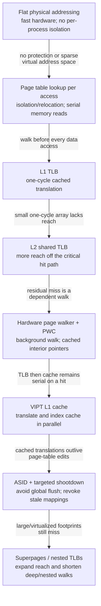
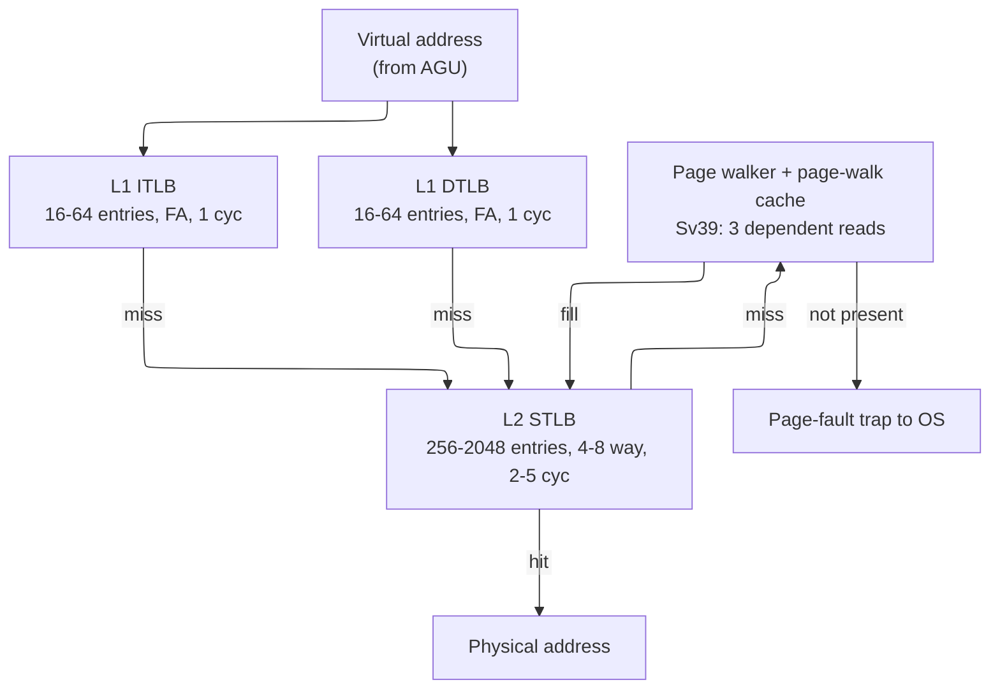
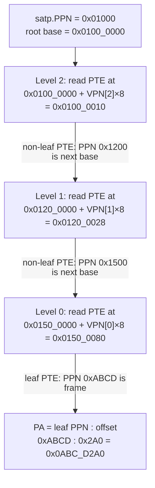
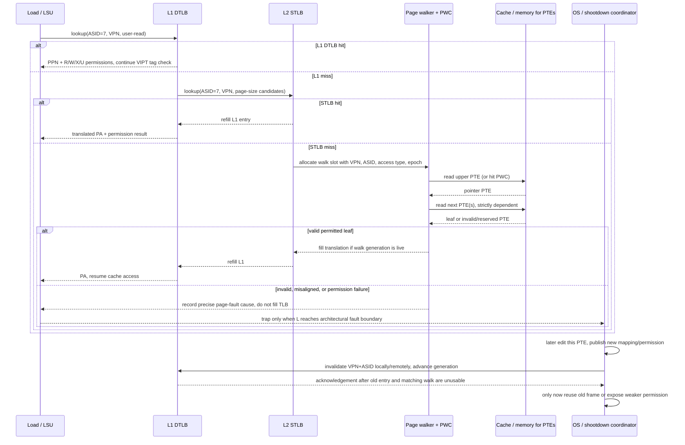
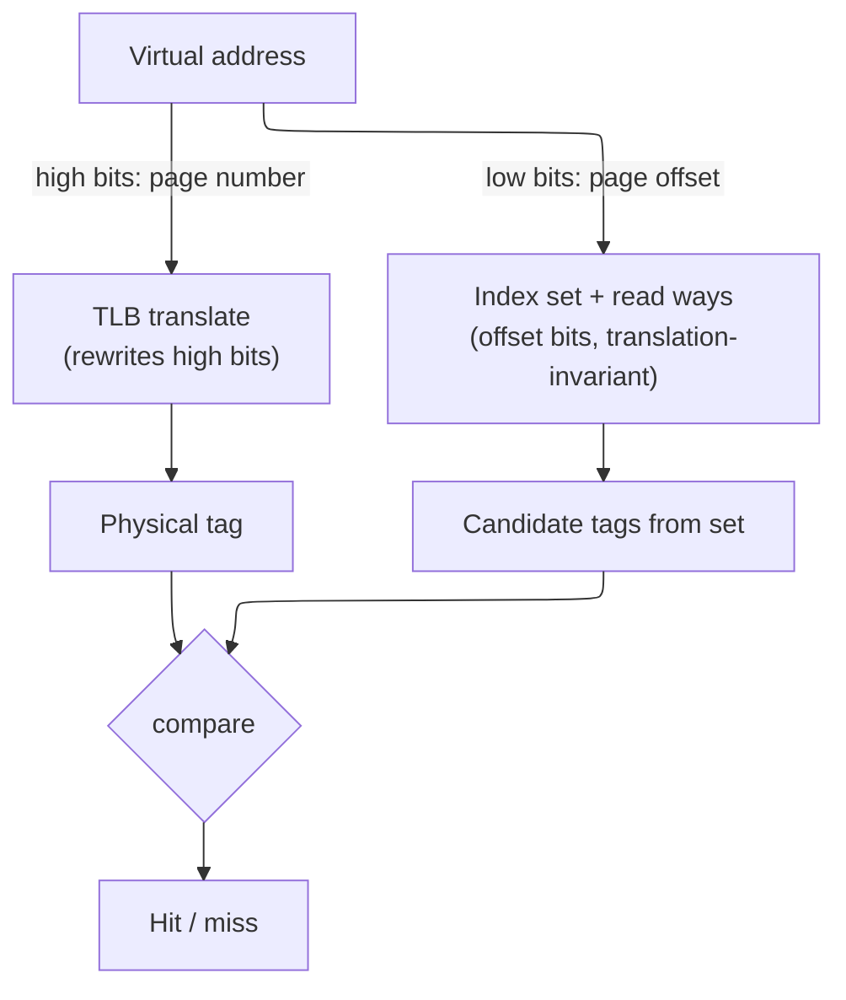
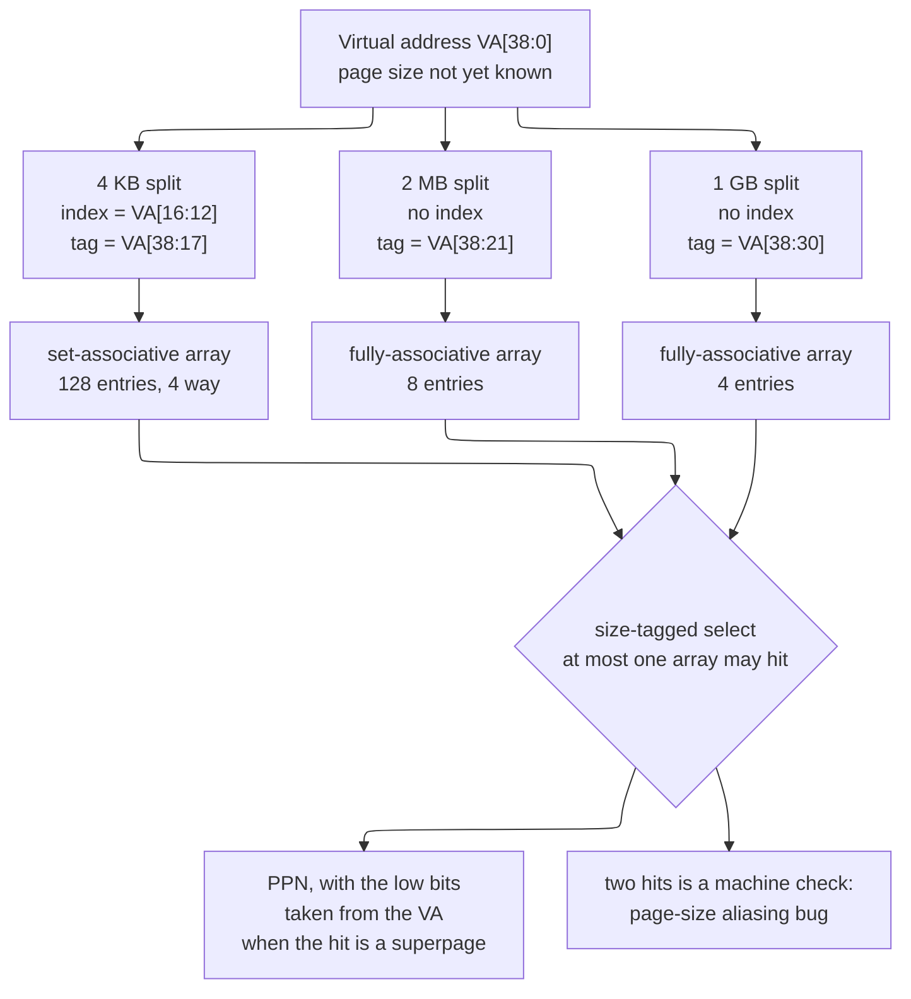
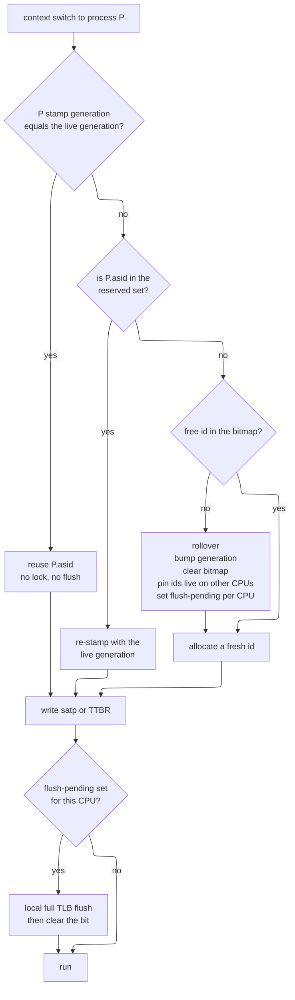
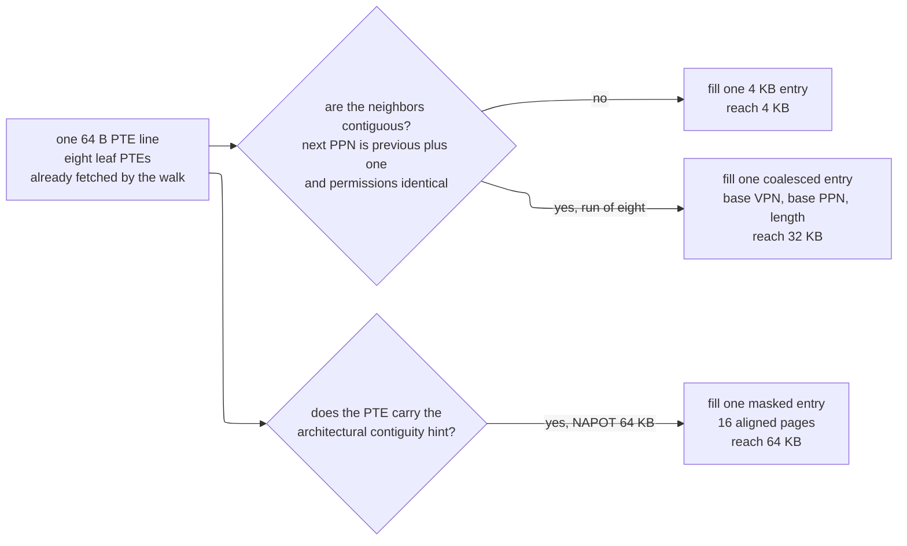

# Translation Lookaside Buffer (TLB) and Virtual Memory — Address Translation on the Critical Path

> **First-time reader orientation:** Software produces virtual addresses; caches and memory ultimately use physical addresses. Page tables store the mapping and protection rules, while a translation lookaside buffer caches recent mappings so every access does not reread those tables. The chapter first explains pages and address fields before introducing multi-level walkers and shootdowns.

> **Abbreviation key — skim now and return as needed:** central processing unit (CPU); instruction set architecture (ISA); reduced instruction set computer (RISC); average memory access time (AMAT); out-of-order (OoO);
> page-table entry (PTE); page-walk cache (PWC); virtual page number (VPN); address-space identifier (ASID); load-store queue (LSQ);
> address-generation unit (AGU); static random-access memory (SRAM); dynamic random-access memory (DRAM); double data rate (DDR); content-addressable memory (CAM);
> level-one cache (L1); level-two cache (L2); level-three cache (L3); Advanced eXtensible Interface (AXI); Advanced High-performance Bus (AHB);
> Advanced Peripheral Bus (APB); least recently used (LRU); Compute Express Link (CXL); virtual address (VA); physical address (PA);
> operating system (OS); complementary metal-oxide-semiconductor (CMOS); finite-state machine (FSM); Microprocessor without Interlocked Pipeline Stages (MIPS) architecture; control and status register (CSR);
> interprocessor interrupt (IPI); non-uniform memory access (NUMA); physically indexed, physically tagged (PIPT); virtually indexed, physically tagged (VIPT); initiation interval (II); kilobyte (KB);
> megabyte (MB); gigabyte (GB); terabyte (TB).

> **Prerequisites:** [CPU_Architecture](../01_Core_Foundations/01_CPU_Architecture.md) (pipeline, memory hierarchy), [Cache_Microarchitecture](../04_Cache_Hierarchy/01_Cache_Microarchitecture.md) (set-associative indexing, tag compare), [RISC_V_ISA](../01_Core_Foundations/02_RISC_V_ISA.md) (Sv39, `satp`, `SFENCE.VMA`).
> **Hands off to:** [Memory](../00_Design_Methodology/02_CPU_PPA_and_Physical_Implementation.md) (the DRAM the walk reads), [AHB_AXI_APB](../../04_SoC_and_Chiplet_Architecture/03_Transaction_Protocols/01_AHB_AXI_APB.md) (buses carrying physical addresses), [Xiangshan_CPU_Design](../07_Core_Case_Studies/01_Xiangshan_CPU_Design.md) (a complete MMU in an open core).

---

## 0. Why this page exists

Virtual memory rests on one uncomfortable fact: **every address a program computes must be translated before the hardware can touch memory — and the dictionary for that translation is itself in memory.** A load does not reference a DRAM location; it references a *virtual* location that the operating system has mapped, through a tree of page tables living in DRAM, onto some physical frame. So "translate this address" expands to "walk a data structure in memory," and that walk must happen *before every single memory reference the program makes*. Address translation is therefore recursive — a memory access interposed ahead of every memory access — and if paid in full it would multiply the machine's memory traffic several-fold and drop a chain of dependent DRAM reads onto the critical path of every load.

The **Translation Lookaside Buffer (TLB)** is the structure that makes translation affordable. It is a small, fast cache of recently used translations that answers the common case — "I have seen this page before" — in about a cycle, so the full walk is paid only on a miss. Everything else on this page is a consequence of two properties of that cache. It sits **on the load-use critical path** — nothing can address the data cache until translation resolves — which forces it to be tiny, associative, and *overlapped* with the cache rather than merely being another level of memory. And the thing it caches is **produced by a serial pointer-chase through a highly redundant tree**, which shapes the page-table walker, the page-walk cache, and the entire cost model of a miss.

We derive each structure from the problem it solves rather than tabulating its fields: what a TLB entry must hold (from its three jobs), why the hierarchy splits into a small fast level and a large slow one, why ASIDs and the global bit exist (a tag that buys out a flush), why the walk needs its own cache, why VIPT is the only way to hide translation latency behind the cache, and why superpages trade reach against fragmentation. By the end you should be able to size a TLB from its reach, prove the VIPT (virtually-indexed, physically-tagged) capacity ceiling, and explain why a virtualized page walk can cost 24 memory accesses — not recite bit-field widths.

### 0.1 The construction path: cache the answer, cache the walk, then control staleness

Address translation evolves from a correct but unusably serial baseline:



Each feature adds a different proof obligation. The TLB must match virtual page number (VPN), address-space identifier (ASID), page size, and validity before using a physical page number (PPN). The walker must check every page-table entry (PTE), accumulate permissions, update accessed/dirty state safely, and return only to the live request that launched it. Virtually indexed, physically tagged (VIPT) access may read candidate cache ways early, but cannot release data until the physical tag and permissions match. Shootdown must establish that no processor can use the old mapping before the operating system reuses the physical frame. Translation speed and translation correctness are therefore the same pipeline viewed from fast path and revocation path.

---

## 1. Translation is a memory access before every memory access

### 1.1 The cost of paying translation in full

Model the page table as a radix tree of depth $K$ (the number of levels). Resolving one virtual address means reading one page-table entry (PTE) per level, and — this is the sting — **each read's address comes from the previous read's result.** The levels cannot be fetched in parallel; they form a strictly dependent chain:

$$
t_{walk} \;=\; \sum_{i=1}^{K} t_{mem}^{(i)}
$$

where $t_{walk}$ = latency of a full walk, $K$ = tree depth (3 for RISC-V Sv39, 4 for Sv48 / x86-64, 5 for Sv57), and $t_{mem}^{(i)}$ = latency of the $i$-th dependent PTE read. If those PTEs are cold in DRAM at ~100 ns each, a single translation costs $3\text{–}5\times100$ ns — *before the actual load even issues.* Paying that on every memory reference is a non-starter; it would make virtual memory cost more than the computation it serves. The dependent chain also means the cost cannot be hidden by memory *bandwidth* — only by removing links from the chain, which is the recurring theme of §5.

**The amortized cost — the AMAT (average memory access time) adder.** You do not pay $t_{walk}$ on *every* access, only on a translation miss, so the true tax on the machine is the walk cost *weighted by how often it is incurred*. If a fraction $m_{walk}$ of memory references miss every TLB level and fall to the walker, and the radix has $K$ levels each costing one dependent access $t_{mem}$, translation adds to the average memory-access time exactly

$$
\Delta\text{AMAT}_{xlate} \;=\; m_{walk}\times t_{walk} \;=\; m_{walk}\times K \times t_{mem}
$$

where $m_{walk}=m_{L1}\,m_{L2}$ is the product of the per-level TLB miss rates (defined in §1.2/§3) and $t_{mem}$ is the latency of *one* dependent PTE read — itself an average, since each read may hit the L2/L3 cache or miss to DRAM (§5.1). This one number is what every later mechanism drives down, each attacking a different factor: the STLB shrinks $m_{walk}$ (§3.2), the page-walk cache shrinks the *effective* $K$ (§5.2), superpages shrink $m_{walk}$ by multiplying reach (§7). *Worked number:* a memory-bound workload with $m_{walk}=2\%$ on a 4-level tree ($K=4$) whose PTEs are cold ($t_{mem}\approx100$ cyc) pays $0.02\times4\times100=8$ cycles of translation on *every* memory reference on average — routinely larger than the data access it precedes. Warm those PTEs into L2 ($t_{mem}\approx10$ cyc) and it falls to $0.02\times4\times10=0.8$ cyc; halve $m_{walk}$ with a bigger STLB and it halves again. Because the tax is a *product*, any single lever that attacks any one factor pays.

### 1.2 Why a cache works — and why it must be *this* kind of cache

Two facts rescue it. First, **locality**: programs touch few pages relative to their instruction count — a tight loop over a few arrays lives in a handful of 4 KB pages, so the *same* translations are demanded over and over. A cache of translations therefore hits nearly always. Second, a translation result is tiny (a VPN (virtual page number)→PPN (physical page number) pair plus a few permission bits), so a few dozen of them cover the entire hot page working set.

That is exactly a cache, and the TLB is it — but it cannot be organized like an ordinary data cache, because of *where it sits*. A physically-tagged cache cannot compare tags until it has the physical address, and the physical address is precisely what translation produces, so translation is **in series ahead of the cache tag compare, on the load-use path that dominates integer performance** (§6 shows how VIPT partially hides it). Two consequences follow immediately and drive the rest of the page:

- **It must be fast and small.** A structure on the load-use path cannot afford the multi-cycle latency of a large SRAM; the L1 TLB is a few dozen entries answering in a single cycle (§3).
- **A miss must be cheap in the common case.** Since even a hit is on the critical path, a miss — a full walk — is catastrophic if paid in full, which is why the walk gets its *own* cache (§5) and why the hierarchy grows a second TLB level (§3) before ever falling back to memory.

The effective translation latency across the hierarchy is the standard cache-hierarchy expression:

$$
t_{xlate} \;=\; t_{L1} \;+\; m_{L1}\big(t_{L2} \;+\; m_{L2}\,t_{walk}\big)
$$

where $t_{L1}, t_{L2}$ = L1/L2 TLB hit latencies, $m_{L1}, m_{L2}$ = their miss rates, and $t_{walk}$ = the walk latency of §1.1. The entire microarchitecture below is a campaign to keep every term small: $t_{L1}$ by making L1 tiny and associative, $m_{L1}$ by adding an L2, $m_{L2}$ by growing reach with superpages, and $t_{walk}$ by caching the walk.

---

## 2. What a TLB entry must hold — derived from three jobs

A TLB entry is a *cached translation*, and its contents are fixed by what the consumer needs the instant it hits: a memory access that must **translate, check permission, and continue in a single cycle.** Do not memorize a field list — derive it from the three jobs one entry performs, and every bit follows as a consequence.

1. **Translate in one lookup.** The whole point is to replace a $K$-level walk with a single associative match, so an entry must store both halves of the map: the **virtual page number (VPN)** as the match key and the **physical page number (PPN)** as the payload it emits. The data-cache tag compare stalls until this resolves (§1), which is why the lookup must be a fast associative match, not another indexed SRAM read.
2. **Authorize in the same step.** A translation that is *correct but unpermitted* — a store to a read-only page, a user-mode access to a supervisor page — must fault *before* the access completes, not after the data returns. So the entry caches the **permission bits** (read / write / execute, user) beside the PPN: one lookup both translates and authorizes. Splitting them would drop a *second* dependent structure onto the same critical path.
3. **Stay coherent with an OS that edits the map underneath it.** A bare VPN→PPN pair is meaningful only within one address space and goes stale when the OS rewrites the page table. So the entry also carries the state that keeps a *cached* translation trustworthy: an **address-space identifier (ASID)** so it survives a context switch without a flush (§4), a **global** bit for kernel mappings shared by every space, a **valid** bit for invalidation, and hardware-managed **accessed / dirty** bits that report use back to the OS without forcing a walk.

So a TLB entry is best read not as "nine fields" but as **the minimum state that lets one associative hit translate, authorize, and stay coherent with the OS.** Concretely that is on the order of 100 bits — a ~30-bit key (VPN + ASID), a ~44-bit PPN payload, and a handful of permission and status bits — but the *widths* are incidental; the three jobs are the content. Two corollaries drop out:

- **Permissions live with the translation, not after it.** Any scheme that checked rights in a separate later stage would serialize two lookups on the critical path; caching R/W/X/U in the TLB is what collapses translate-and-authorize into one step.
- **A/D bits are an optimization for the OS, done in hardware.** Having hardware set "accessed" and "dirty" saves the OS from taking a fault purely to learn a page was touched or written — the page-replacement and copy-on-write machinery upstack reads them directly.

---

## 3. Sizing and organization — the hot structure on the critical path

The TLB faces the same tension as the OoO scheduler ([OoO_Execution](../03_Out_of_Order_Backend/01_OoO_Execution.md), §4): the structure that must be *fast* wants to be *small*, but the structure that must *hit often* wants to be *large*. Virtual memory resolves it the way caches do — with a hierarchy — but the split is driven by the critical path, so it is worth deriving rather than asserting.

### 3.1 Why the L1 TLB is small, fully-associative, and fast

The L1 TLB answers on the load-use path, so its latency is charged to *every* load. A fully-associative organization broadcasts the incoming VPN to every entry and compares in parallel — zero conflict misses, best possible hit rate per entry — but its delay grows with occupancy:

$$
t_{FA} \;\approx\; t_0 + \kappa\,N_{entries}
$$

where $t_0$ = fixed lookup overhead and $\kappa$ = the per-entry cost of the match-line discharge and the priority-encode / OR-reduce across $N_{entries}$ hit lines, both of which lengthen with the array. On the critical path that linear term is intolerable past a few dozen entries — which is exactly why real L1 TLBs sit at **16–64 fully-associative entries with a 1-cycle hit** and go no further. It is the TLB analog of why issue queues stay at 32–64 entries: a single-cycle associative structure cannot be both large and fast.

### 3.2 Why the L2 STLB is large, set-associative, and slower

A 64-entry L1 TLB covers only $64\times4\text{ KB}=256\text{ KB}$ of memory — its **reach**:

$$
R_{TLB} \;=\; N_{entries}\times S_{page}
$$

Any working set larger than the reach thrashes it — and *how badly* follows from a **coverage argument**. A footprint of $W_p$ hot pages (bytes $S_{WS}=W_p\,S_{page}$) cannot fit in $N_{entries}$ slots once $W_p>N_{entries}$, i.e. once $S_{WS}>R_{TLB}$. Under a uniform-reuse model the probability that a referenced page is currently resident equals the fraction of the footprint the reach covers, $R_{TLB}/S_{WS}$, so the miss rate is

$$
m_{TLB} \;\approx\; \max\!\Big(0,\; 1-\frac{R_{TLB}}{S_{WS}}\Big),
$$

zero while the footprint fits ($S_{WS}\le R_{TLB}$) and climbing toward 1 as it outgrows the reach. (Strict cyclic LRU is the pathological worst case — *every* access misses once $W_p>N_{entries}$; pure streaming with no reuse takes one compulsory miss per page. The uniform estimate sits between them and is the right first-order number.) *Worked number:* a 64-entry, 4 KB DTLB reaches $R_{TLB}=256\text{ KB}$; against a $S_{WS}=1\text{ GB}$ working set the coverage is $R_{TLB}/S_{WS}=2^{18}/2^{30}=1/4096$, so $m_{TLB}\approx1-1/4096\approx99.98\%$ — translation walks on essentially every access, and no entry-count increase the critical path allows can close a 4096× gap. Only *page size* can: at 2 MB the same 64 entries reach 128 MB ($R/S_{WS}=1/8$, $m\approx88\%$ — better, still thrashing), while a 1024-entry STLB at 2 MB reaches 2 GB $>$ 1 GB and the capacity-miss term drops to ~0. This is the §7 reach lever quantified: for large footprints the deciding knob is $S_{page}$, not $N_{entries}$. The fix for the second factor is a second level, and because it is consulted *only on an L1 miss* it is off the load-use path and may trade latency for capacity: the **L2 shared TLB (STLB)** is 256–2048 entries, 4–8-way set-associative, 2–5-cycle hit. Set-associativity is the enabling trade — it caps the comparator count at the way-count instead of $N$, letting the array scale to thousands of entries at the price of occasional conflict misses and a replacement policy (PLRU). This is the same fully-associative-versus-set-associative split as the cache hierarchy, made for the same reason.



The effective latency across the two levels is the $t_{xlate}$ model of §1.2. The STLB exists to shrink $m_{L1}$; superpages (§7) exist to shrink $m_{L2}$ by multiplying reach. Both are levers on the same expression.

---

## 4. ASIDs and the global bit — a tag that buys out a flush

A translation is valid only inside the address space that created it: the same VPN maps to different frames in different processes. The naive consequence is brutal — **every context switch must flush the entire TLB**, because otherwise the incoming process could hit the outgoing one's stale entry. That flush discards a warm TLB hierarchy (hundreds to a couple thousand entries across L1 and L2) and then forces the incoming process to re-walk all of them back in: hundreds to thousands of cycles of pure overhead, repeated at every switch.

The **address-space identifier (ASID)** buys that flush out. Each process gets an identifier (16 bits on RISC-V, held in the `satp` CSR (control and status register)), stamped into every entry it fills; a lookup hits only when both the VPN *and* the ASID match:

$$
\text{hit} \;\Longleftrightarrow\; \big(\text{VPN}_{entry}=\text{VPN}_{VA}\big)\;\wedge\;\big(\text{ASID}_{entry}=\text{ASID}_{cur}\;\vee\;G_{entry}\big)\;\wedge\;V_{entry}
$$

Now two processes' translations coexist in the TLB, and a context switch is a single `satp` write with nothing flushed. **What it costs** is explicit and small: every entry widens by the ASID field, every lookup performs one extra comparison, and the OS inherits a *finite namespace* to manage — $2^{16}$ ASIDs is generous but not infinite, so when they run out the OS must recycle one and flush *its* stale entries. That recycling flush is the residual cost; the win is eliminating the *unconditional* flush on every one of the far more frequent context switches. This is the canonical "add a tag to avoid an invalidate" trade, and it returns in §8 as the reason ASIDs also cut TLB shootdowns.

The **global (G) bit** is the complementary move for the one address space *every* process shares — the kernel. A kernel mapping marked global matches regardless of ASID, so it survives every context switch and need not be duplicated once per ASID. Without it, the kernel — mapped into every process — would burn one TLB entry per process per shared page; the G bit collapses those to one.

---

## 5. The page walk and the page-walk cache

### 5.1 The walk is serial pointer-chasing

When both TLB levels miss, a hardware **page-table walker** — an FSM (finite-state machine) in the MMU (memory-management unit) — traverses the radix tree in memory. Its defining property, from §1.1, is that the traversal is *serial*: level $i$'s PTE holds the physical address of level $i{+}1$'s table, so the reads are strictly dependent and cannot overlap. An Sv39 miss is three dependent memory reads; Sv48 and Sv57 are four and five. This is why a miss costs 20–40 cycles even when the PTEs are warm in the L2/L3 cache, and 100–300 cycles when they are cold in DRAM — the chain cannot be shortened by more bandwidth, only by *removing levels from it*.

Those two bands are just $t_{walk}=K\times t_{mem}$ read off at the two places a PTE can live, because **each of the $K$ dependent reads is itself a full memory access** that may hit the L2/L3 cache or miss to DRAM. Warm — all $K$ reads hitting L2/L3 at ~7–13 cyc — gives $K\times{\sim}10\approx20\text{–}40$ cyc; a cold walk pays a DRAM access (~100 cyc) for *each* level that misses the cache, so it ranges from ~100 cyc (only the leaf cold, the upper levels cached or served by the PWC of §5.2) up to ~300 cyc (several levels missing to DRAM) — which is the 100–300 band. And because the reads are strictly dependent, this latency is un-overlappable *within a single walk*: no memory-level parallelism helps, since read $i{+}1$'s address is not known until read $i$ returns. Every lever in §5.2–§5.5 therefore attacks the *length* of the chain, never its width.

**Worked trace — one Sv39 walk, in hex.** The flowchart in [RISC_V_ISA §5.3](../01_Core_Foundations/02_RISC_V_ISA.md) *is* the algorithm; running it on real numbers makes the address arithmetic explicit. Translate `VA = 0x80A102A0` (a valid Sv39 virtual address — bit 38 is 0, so the required sign-extension of bits 63:39 is all-zero) with `satp.PPN = 0x01000`, i.e. the root table sits at physical `0x01000 × 0x1000 = 0x0100_0000`. Sv39 slices the 39-bit VA into three 9-bit VPN indices and a 12-bit offset:

- `offset = VA[11:0] = 0x2A0`
- `VPN[0] = VA[20:12] = 0x010` (16)
- `VPN[1] = VA[29:21] = 0x005` (5)
- `VPN[2] = VA[38:30] = 0x002` (2)

The walker (PTE size = 8 B) then chases three dependent reads, each at `table_base + VPN[level] × 8`:

1. **Level 2.** Read the PTE at `0x0100_0000 + 2×8 = 0x0100_0010`. Value `0x0048_0001` → low bits `V=1, R=W=X=0`, so it is **not a leaf** but a pointer; its PPN field (`0x0048_0001 >> 10 = 0x1200`) gives the next table base `0x1200 × 0x1000 = 0x0120_0000`.
2. **Level 1.** Read the PTE at `0x0120_0000 + 5×8 = 0x0120_0028`. Value `0x0054_0001` → again `V=1, R/W/X=0`, a pointer; PPN `0x1500` → next base `0x0150_0000`.
3. **Level 0.** Read the PTE at `0x0150_0000 + 16×8 = 0x0150_0080`. Value `0x02AF_34D7` → low byte `0xD7` decodes `V=1, R=1, W=1, X=0, U=1, A=1, D=1`; `R=1` marks a **leaf**, with PPN `0x02AF_34D7 >> 10 = 0xABCD`.

The leaf ends the chase: **`PA = (leaf PPN : offset) = (0xABCD × 0x1000) | 0x2A0 = 0x0ABC_D2A0`.** Three dependent memory reads — at `0x0100_0010`, `0x0120_0028`, `0x0150_0080`, each of which may hit L2/L3 or miss to DRAM (the two bands above) — turned one virtual address into one physical address. Three checks along the way are the fault and fast-path conditions the same walker enforces: a PTE with `V=0` (or the reserved `R=0, W=1`) raises a **page fault**; a leaf found early at level 1 or 2 with non-zero low PPN bits is a **misaligned-superpage** fault; and if `A` is clear (or `D` is clear on a store) the walker must first set it with a write-back before the translation is usable. Swap the level-0 pointer for a leaf *at level 1* and the identical VA resolves in **two** reads to a 2 MB superpage — the early-termination win quantified in §7.

Seen whole, the walk is a strict pointer-chase — each PTE read hands back the base address the *next* read needs, so the three reads cannot overlap, and the leaf PPN concatenated with the untouched offset is the physical address:



Each downward edge is a data dependency, not just control flow: the address on one node is computed from the PPN read at the previous node, which is why no amount of memory bandwidth shortens the chain — only removing links from it (the page-walk cache, next) can.

### 5.2 The page-walk cache — exploiting upper-level redundancy

The walk's saving grace is that the top of the tree is enormously **redundant across misses**. The radix structure fans out so widely that one upper-level entry governs a vast region of virtual space: in Sv39 a single level-2 PTE covers 2 MB, a single level-1 PTE covers 1 GB. Every translation whose address falls in that region shares the *same* upper-level PTEs — so across many distinct TLB misses the walker re-reads the identical top-of-tree entries again and again, and only the leaf differs.

A **page-walk cache (PWC)** captures exactly those upper-level, non-leaf PTEs — keyed by the partial VPN that selects them — and pointedly *not* the leaf translations, which are the TLB's job. Its effect is to collapse the dependent chain from the top: a walk that hits the PWC at every upper level skips straight to the final leaf read. The expected number of memory accesses per walk becomes

$$
N_{acc} \;=\; 1 \;+\; (K-1)(1-h)
$$

where $K$ = walk depth, $h$ = PWC hit rate on upper-level entries, and the leaf read (the "1") is always taken. The derivation is a plain expectation: the leaf is never cached here (1 access, certain), and each of the remaining $K-1$ upper levels is read only when the PWC misses it (probability $1-h$ each), giving $1+(K-1)(1-h)$. The two limits check out — $h=0$ recovers the full $K$-access walk, $h=1$ collapses it to the single leaf read. Because upper-level reuse is extreme, $h$ is high and hot regions resolve in ~1 access instead of $K$ — which is *why* a small 16–64-entry PWC earns a dedicated structure, and why it is kept separate from the TLB rather than folded into it: the two cache different things (interior pointers versus leaf translations) with different reuse. *Worked number:* a 4-level tree with $h=0.9$ gives $N_{acc}=1+(4-1)(0.1)=1.3$ accesses per walk instead of 4, a $3\times$ shorter dependent chain; since walk latency is $N_{acc}\times t_{mem}$, the warm-walk cost falls from ${\sim}4\times10=40$ cyc toward ${\sim}1.3\times10=13$ cyc. The PWC is thus the **walk-latency reducer** that makes both deep trees (§5.3) and nested walks (§5.5) affordable — it converts the $K$ (or 24) dependent reads into ~1–2 whenever the upper tree is hot, which by locality it almost always is.

### 5.3 Walk depth versus address-space width

Each level added to the tree buys a $512\times$ larger virtual address space (9 more VPN bits) at the cost of exactly **one more access on the dependent chain**. That is the whole scaling law of paging, and it is why the industry ladders VA width in discrete steps rather than adopting one giant flat table — a flat Sv39 table would need $2^{27}$ PTEs = 1 GB *per process*, whereas the radix tree allocates interior nodes only for regions that are actually mapped, so a sparse address space costs almost nothing.

The space argument deserves the full derivation, because it is *the* reason paging is a tree and not an array. A **flat** (single-level) table must store one PTE for every page the VA can name — $2^{\,(\text{VA bits}-\log_2 S_{page})}$ of them — mapped or not. For Sv39 that is $2^{39-12}=2^{27}$ PTEs $\times\,8$ B $= 1$ GB, resident per process, almost all zeros. A **radix** table instead allocates a sub-table only when some entry beneath it is present, so its size tracks the *mapped* set, not the address space: a process mapping $M$ pages needs $M$ leaf PTEs ($8M$ bytes, packed 512 to a 4 KB leaf table $\Rightarrow\lceil M/512\rceil$ leaf pages if contiguous), plus $O(\#\text{separated regions})$ interior pages to reach them. *Worked number:* a typical sparse process — 8 MB resident ($M=2048$ pages) scattered across text, data, heap, and stack in four separated regions — needs $\lceil 2048/512\rceil=4$ leaf tables (16 KB of leaf PTEs), up to ~4 level-1 tables, and 1 root, so on the order of **9 page-table pages ≈ 36 KB** — against the flat **1 GB**, a $\sim\!2.9\times10^{4}\times$ reduction. The mechanism is exact: radix size $\propto$ mapped memory, flat size $\propto$ address space. Widen the VA to 57 bits (Sv39→Sv57, two more levels) and the flat table explodes by $512^2$ to **256 TB per process** — absurd — while the radix table grows by only two interior pages per mapped region. Sparsity, not compression, is what makes a 128 PB address space representable at all.

| Scheme | Levels | VA width | VA space | Walk depth |
|---|---|---|---|---|
| RISC-V Sv32 (RV32 only) | 2 | 32 bits | 4 GB | 2 |
| RISC-V Sv39 | 3 | 39 bits | 512 GB | 3 |
| RISC-V Sv48 | 4 | 48 bits | 256 TB | 4 |
| RISC-V Sv57 | 5 | 57 bits | 128 PB | 5 |
| x86-64 (4-/5-level) | 4–5 | 48 / 57 bits | 256 TB / 128 PB | 4–5 |
| ARMv8/v9-A | 3–4(+) | 48–52 bits | 256 TB – 4 PB | 3–4 |

Sv32 is the row that does not obey the $512\times$ rule, and the reason is worth one line: on RV32 a PTE is **4 bytes**, not 8, so one 4 KB table holds **1024** entries and each level carries **10** VPN bits. The invariant being preserved is not "512" but "exactly one page of PTEs per table" — re-solved for a narrower XLEN. Two levels of $2^{10}$ therefore cover the whole 32-bit VA, the level-1 leaf gives a **4 MB megapage** rather than 2 MB, and the 22-bit PPN reaches a **34-bit (16 GB) physical address**, so an RV32 system can populate more DRAM than any one process can name.

The trade is otherwise captured entirely by "one access per level, 512× reach per level," and the page-walk cache is what keeps the *added* levels nearly free for hot regions — which is why 5-level paging (Intel since Ice Lake, 2019; AMD since Genoa, 2023) ships with negligible steady-state overhead despite the deeper tree.

### 5.4 Who walks — hardware versus software

A second axis is *who* performs the walk. A **software-managed** TLB (classic MIPS) takes a precise exception on every miss and runs an OS handler that walks whatever page-table format it likes and installs the entry by hand. A **hardware-managed** TLB (RISC-V, ARM, x86) does it in a dedicated FSM with no exception. The trade is flexibility versus speed:

- **Software** wins *flexibility* — the OS may use any page-table structure (hashed, inverted, clustered) and any replacement policy — at the price of a trap, register save/restore, and I-cache pollution *on every miss*, plus the awkwardness of nested misses.
- **Hardware** wins *speed and overlap* — no trap, and on an OoO core the walker runs in the background while independent instructions keep executing — at the price of a page-table format frozen into the ISA and a walker + PWC to design and verify.

High-performance cores universally chose hardware: on a wide OoO machine, the ability to *overlap* the walk with execution and to avoid a pipeline flush per miss dominates the lost flexibility. Software-managed TLBs survive only where core simplicity matters more than miss latency.

### 5.5 Nested translation — when the walk becomes two-dimensional

Virtualization turns the one-dimensional walk into a two-dimensional one, and it is the sharpest illustration of why the PWC exists. Under a hypervisor a guest's "physical" addresses are themselves virtual (guest-physical), translated by a *second* set of page tables (the host / stage-2 tables). Every guest-physical address the guest walk produces — the table base and each level's pointer — must itself be translated by the host walk before it can be dereferenced:

$$
N_{nested} \;=\; (D_g+1)(D_h+1) - 1
$$

where $D_g, D_h$ = guest and host walk depths. The count is a 2-D grid, and deriving it shows *why* the blow-up is multiplicative. The guest walk must resolve $D_g+1$ guest-physical addresses — the guest table base, plus the pointer read out of each of its $D_g$ levels (the last being the guest-physical address of the data). **Each** of those gPAs is only a *guest*-physical address the hardware cannot dereference, so each costs a full $D_h$-access host walk to become a real host-physical address: $(D_g+1)D_h$ host accesses in all. Add the $D_g$ guest-PTE reads themselves and

$$
N_{nested}=(D_g+1)D_h+D_g=(D_g+1)(D_h+1)-1,
$$

the two forms identical since $(D_g+1)(D_h+1)-1=(D_g+1)D_h+(D_g+1)-1=(D_g+1)D_h+D_g$. Each dimension *multiplies* the other — there is no adding your way out. For two 4-level trees this is $(4{+}1)(4{+}1)-1 = 5\times5-1 = \mathbf{24}$ dependent memory accesses for a single translation — an order of magnitude worse than a native miss. This is why virtualization historically carried a heavy TLB-miss tax, why server cores invest in **nested TLBs and large page-walk caches** to short-circuit the 2-D walk, and why hypervisors lean on superpages (§7) to enlarge reach. The same reasoning covers *remote* page tables: on a NUMA or CXL-attached system the PTEs may live across an interconnect, adding link latency to each dependent read, so the OS co-locates page-table pages with the data they map — again, keep the dependent chain short.

### 5.6 One load through hit, walk, fault, and later shootdown

Follow load `L` from address generation using the worked virtual address `0x80A102A0`, address-space identifier `ASID=7`, and access type “user read.” The first lookup is the level-one data translation lookaside buffer (**L1 DTLB**); the larger second level is the shared/secondary TLB (**STLB**). The load-store unit retains `L`'s age, destination physical register, byte mask, and recovery epoch while translation is unresolved.



**The hit path.** The key is not VPN alone: `(VPN, ASID, page size/global)` must match, `valid` must be set, and cached permissions must authorize this access in the current privilege mode. The PPN is concatenated with the unchanged page offset. In a VIPT L1, virtual offset bits have already selected and read the candidate set, but data release waits for this physical tag and permission result. A permission failure on a TLB hit is a fault, not a TLB miss.

**The miss path.** The secondary TLB (STLB) is tried before allocating a finite walker slot. A walk slot is the translation analogue of an MSHR: it carries `(VPN, ASID, access type/privilege, current level, current table PPN, accumulated permissions, destination waiters, epoch/generation)`. Misses to the same translation can merge if their access-type checks remain distinguishable. Each returned pointer PTE determines the next request address, so one walk cannot parallelize its levels, although multiple independent walks can occupy different slots and overlap.

**The fault path.** Invalid/reserved encodings, a write to a read-only leaf, user access to a supervisor-only leaf, execute denial, a misaligned superpage, or a failed accessed/dirty update terminates the walk without installing a usable entry. The load records fault cause and virtual address in its retirement record; younger execution may be squashed, but the trap becomes architectural only at the precise instruction boundary. A speculative fault must disappear if an older branch later kills the load.

**The revocation path.** Suppose the operating system changes this VPN from PPN `Pold` to `Pnew` or removes write permission. Updating memory is insufficient because private TLBs and an in-flight walk may still recreate `Pold`. The initiator publishes the PTE update with required memory ordering, sends targeted invalidations to processors that may cache the `(ASID,VPN)`, advances or records a translation generation, and waits for acknowledgements. A target acknowledgement means both its old TLB entry **and any older-generation walk refill** can no longer authorize a new access. Only then may `Pold` be reassigned. This closes the subtle invalidate-versus-walk race in which a pre-shootdown walk returns after the invalidation and resurrects the stale mapping.

**Timing, costs, and evidence.** Report L1-hit, STLB-hit, and walk latency separately; PWC hits by level; concurrent-walk occupancy; walker-slot-full stalls; merged translation misses; permission-fault class; A/D update traffic; and shootdown target count, acknowledgement latency, and cycles stalled. Track walk generations discarded after invalidation. Assertions should prove that every translated access has a matching live `(ASID,VPN,page-size)` entry or a fully validated current-generation walk result; no denied access reaches the data cache; a faulting walk installs no entry; and after shootdown completion no core or delayed walker can produce `Pold`. Directed tests must collide shootdown with an STLB hit, each walk level, A/D-bit update, superpage fill, context switch, and ASID reuse.

---

## 6. VIPT — overlapping translation with the cache

### 6.1 The conflict

§1 established that translation sits in series ahead of a physically-tagged cache: you need the physical address to compare tags, and translation is what produces it, so naively the load costs TLB *then* cache — two serial latencies on the hottest path in the machine. Indexing *and* tagging with physical bits — a **physically-indexed, physically-tagged (PIPT)** cache — is exactly this serial arrangement: the cache cannot even pick its set until translation finishes, so the two latencies stack. The only escape is to run the two in *parallel*. But a cache lookup needs address bits to select its set, and translation is precisely the operation that **rewrites the high-order bits** (the page number) while leaving the low-order bits (the page offset) untouched. So the cache wants address bits early, and translation will not release the high ones until it is done. That is the conflict VIPT resolves.

### 6.2 The resolution and its ceiling

The resolution is a single observation: **the page offset is identical in the virtual and physical address** — translation never touches it. So index the cache with *only* offset bits and tag it with the physical bits translation produces. Now the TLB translation and the cache set-index-and-read proceed in parallel, and the physical tag lands just in time to compare against the tags read from the ways. This is **virtually-indexed, physically-tagged (VIPT)**: virtually indexed because the offset bits are available pre-translation, physically tagged because correctness still rests on the physical tag.



The catch is a hard ceiling on how many index bits exist *below* the page offset. The highest index bit must not reach above the top of the offset:

$$
\underbrace{\lceil\log_2 L\rceil}_{\text{block offset}} + \underbrace{\log_2\!\frac{C}{W L}}_{\text{index bits}} - 1 \;\le\; \log_2 P - 1
\;\;\Longrightarrow\;\;
\boxed{\,C \le W\times P\,}
$$

where $C$ = cache capacity, $W$ = associativity, $L$ = line size, $P$ = page size. The interpretation is the entire design lever: **a VIPT L1 cache can grow only by adding associativity or enlarging the page** — capacity beyond $W\times P$ pushes index bits up into the VPN, which translation changes, breaking the scheme. (The precise test is on bit *positions*, so the bound is met exactly at $C=W\times P$; a 32 KB / 8-way / 64 B cache with 4 KB pages sits right on the line, index bits [11:6] atop the [5:0] block offset.) The *geometric* derivation of $C\le W\times P$ from the index/offset split is owned by [Cache_Microarchitecture §1.5](../04_Cache_Hierarchy/01_Cache_Microarchitecture.md) — this page does not re-derive it; §6 here owns the complementary half, the **overlap-and-aliasing mechanism** that ceiling exists to police (§6.3).

### 6.3 The synonym problem, and how real cores dodge the ceiling

Two dual aliasing hazards haunt any virtually-indexed cache, and naming them precisely is the point of owning the mechanism here:

- A **homonym** is *one virtual address, many physical addresses* — the same VA names different frames in different address spaces (every process reuses low virtual addresses). A virtually-*tagged* cache would return the previous space's data on a hit; a VIPT cache does **not**, because the tag it compares is *physical*: the homonym indexes the same set but its physical tag differs, so the compare cleanly misses. Physical tagging *inherently* defeats homonyms — the first reason VIPT tags physically, not virtually. (The residual case, a stale entry surviving a context switch, is retired by the ASID/flush machinery of §4, not by the index.)
- A **synonym** (alias) is the dual — *many virtual addresses, one physical address* — and it is the hazard physical tagging does **not** catch, because the aliases share the *same* physical tag and only their *set* can differ. Two virtual pages mapping one frame necessarily share the page offset (translation preserves it), so if every index bit lies inside that offset ($C\le W\times P$) they select the *same* set and coincide as a single line — no synonym is even possible. The hazard appears only when the index spills $a=\log_2\frac{C}{WP}$ bits above the offset into the VPN.

When it does spill ($a>0\Leftrightarrow C>W\times P$), two virtual addresses mapping the same physical frame can differ in those $a$ bits and therefore land in one of $2^{a}$ different sets — the same physical line cached in up to $2^a$ places. A write to one copy is invisible to the others: silent incoherence. Three fixes exist, and the vendor table shows every core choosing among them explicitly:

- **Raise associativity** to keep $C\le W\times P$ — Intel Golden Cove runs a 48 KB L1D at 12-way so its index still fits a 4 KB page.
- **Enlarge the page** to widen the offset — Apple's 16 KB base page is directly motivated by VIPT: a 128 KB, 8-way L1D needs 8 index bits, which fit a 14-bit (16 KB) offset but not a 12-bit (4 KB) one.
- **Page coloring** (OS) — where the ceiling is violated (ARM Cortex-A78, 64 KB / 4-way on 4 KB pages: here $a=\log_2\frac{C}{WP}=\log_2\frac{64\text{ KB}}{4\times4\text{ KB}}=2$, so one physical line could otherwise scatter across $2^2=4$ sets), the OS constrains physical-frame allocation so the spilled physical bits always equal the virtual ones, forcing all aliases into the same set at the cost of some allocation freedom.

| Core | L1D | Assoc. | Page | Index fits offset? | How |
|---|---|:---:|---|:---:|---|
| Intel Golden Cove | 48 KB | 12-way | 4 KB | Yes (exact) | high associativity |
| Apple M1 Firestorm | 128 KB | 8-way | 16 KB | Yes (exact) | large page |
| RISC-V BOOM v3 | 32 KB | 8-way | 4 KB | Yes (exact) | index [11:6] fits |
| ARM Cortex-A78 | 64 KB | 4-way | 4 KB | No | OS page coloring |

Every one of these is $C\le W\times P$ made concrete — the constraint is not academic, it sets the associativity of essentially every high-performance L1 data cache in the industry.

---

## 7. Superpages — buying reach against fragmentation

TLB reach, $R_{TLB}=N_{entries}\times S_{page}$, has two factors, and §3 showed that entry count is capped by the critical path. The only other lever is **page size** — and it is a linear one. A leaf PTE placed at an *interior* level of the radix tree maps a larger, aligned region: in Sv39 a level-2 leaf is a 2 MB page and a level-1 leaf a 1 GB page. One superpage entry then covers $512\times$ or $512^2\times$ the memory of a base-page entry, multiplying reach without touching the entry count the critical path constrains:

| DTLB configuration | Reach |
|---|---|
| 64 × 4 KB | 256 KB |
| 64 × 2 MB | 128 MB |
| 64 × 1 GB | 64 GB |

The multiplier is exact, straight from the radix geometry: each level indexes $\log_2 512 = 9$ VPN bits, so promoting a leaf up one level folds those 9 bits into the page offset — the page grows $\times2^9=512$ and, at fixed $N_{entries}$, so does reach (a level-2 leaf → 2 MB, $\times512$; a level-1 leaf → 1 GB, $\times512^2$). The **same** promotion shortens the walk: a leaf found at radix level $j$ ends the pointer-chase there, costing $j$ dependent accesses instead of the full $K$ — an Sv39 base walk is $K=3$, a 2 MB leaf resolves in 2, a 1 GB leaf in 1 — and it shrinks page-table memory, one superpage PTE replacing $512$ or $512^2$ base PTEs. So a superpage is a *triple* win — reach, walk length, table size. *Worked number:* a workload striding through 500 MB thrashes a 4 KB-only DTLB (256 KB reach → a miss on nearly every new page, $m_{TLB}\approx1-256\text{ KB}/500\text{ MB}\approx99.95\%$ by the §3.2 coverage rule) but at 2 MB its 250-page footprint fits inside a 512-entry STLB (1 GB reach) and the miss rate collapses to the cold-start floor. Why not, then, map everything huge? Because reach is bought with **fragmentation and rigidity**:

- **Internal fragmentation** — the allocation granularity is now the page: a 2 MB page backing a 100 KB object wastes ~1.9 MB. Waste is bounded by $S_{page}-\text{used}$, negligible for 4 KB and severe for 1 GB.
- **Physical contiguity and alignment** — a superpage demands a naturally-aligned, physically-contiguous run of frames; under memory fragmentation the OS may be unable to find one, forcing a fallback to base pages.
- **Coarser everything else** — protection, dirty-tracking, and copy-on-write now act at superpage granularity, so a single byte written to a 2 MB copy-on-write page copies the whole 2 MB, and page-fault handling (zeroing a 2 MB page ~1 ms vs. ~2 µs for 4 KB) lengthens in proportion.
- **TLB partitioning** — a set-associative TLB cannot pick a set without knowing the page size, because the offset/index boundary *is* $\log_2 S_{page}$, and that boundary moves with the page size. Multi-size support therefore forces either a small **fully-associative** array (few superpage slots, since §3.1's linear delay caps its size) or **separate per-size sub-TLBs that are statically partitioned** — capacity handed to 2 MB entries is stolen from 4 KB entries and cannot be repurposed at runtime, so a workload whose page-size mix differs from the hardware's split leaves part of the TLB idle. Superpage reach thus competes with base-page reach for the same silicon; it is not free even measured in entries.

**Transparent huge pages (THP)** are the OS's attempt to get the reach without the manual trade: a kernel daemon watches for contiguous, fully-populated runs of base pages and *promotes* them to a superpage in the background, demoting on fragmentation or sparse use. It captures most of the reach benefit while keeping 4 KB granularity where sparsity or fine-grained protection demands it — the pragmatic middle of the reach-versus-fragmentation curve.

---

## 8. TLB shootdown — paying for absent coherence

Caches are kept coherent by hardware; **TLBs are not.** Each core's TLB is a private, hardware-incoherent cache of translations, so when the OS edits a page table — `munmap`, `mprotect`, page migration, copy-on-write demotion — the stale copies sitting in *other* cores' TLBs will not notice. Correctness then falls to software: the editing core must explicitly invalidate the stale entries everywhere they might live, a procedure called **TLB shootdown**. (RISC-V's `SFENCE.VMA` performs the local invalidation, with operands to scope it by VPN and/or ASID; crucially it is *local only*, which is precisely why a multi-core shootdown needs software coordination.)

Because there is no hardware fan-out, the initiator interrupts every other core (an inter-processor interrupt, IPI), each target invalidates locally and acknowledges, and the initiator waits for all acknowledgments before proceeding. The cost is fundamentally serial in the core count:

$$
T_{shoot}(N) \;\approx\; t_{IPI} + (N-1)\,t_{flush} + t_{sync} \;=\; O(N)
$$

where $t_{IPI}$ = IPI send/fan-out latency, $t_{flush}$ = per-core local flush, $t_{sync}$ = barrier cost, $N$ = core count. Since *every* core stalls in its handler for the duration, the wasted work scales as $N\cdot T_{shoot}=O(N^2)$. On a 64-core machine a single shootdown runs into thousands of cycles, and a database doing tens of thousands of `munmap`s per second can lose a few percent of *all* core cycles to shootdowns — which is why shootdown scalability, not raw TLB speed, is the virtual-memory bottleneck on large systems. The mitigations all attack the $O(N)$ fan-out or remove flushes entirely:

- **ASID / global tagging (§4)** removes the largest source of flushes — context switches — outright, so shootdown is needed only for genuine PTE edits, never merely for switching processes.
- **Directed shootdown** sends the IPI only to cores that might hold the mapping (tracked per page), turning $O(N)$ into $O(K)$ for the $K$ cores actually involved.
- **Batched / deferred shootdown** collects many invalidations into one IPI round, amortizing the fixed IPI and barrier cost.
- **Lazy invalidation** leaves stale entries in place and relies on the ASID check or a generation counter to skip them, flushing only a core that would actually *use* a stale translation — which, for the very common switch to a kernel thread with no user mappings, means no flush at all.

The through-line is the same as ASIDs: the cheapest invalidate is the one you can prove you never have to send.

---

## 9. The real TLB hierarchy, as products actually build it

§3 sized the *levels* — a small fast one, a large slow one — and asserted a picture with two L1 arrays and a unified L2. That picture is not one design decision; it is four, and a product has to make all of them: **why the level-one array is split by access type, why a second lookup is worth its latency, how one array can hold several page sizes at once, and how enough lookup bandwidth is delivered to a wide core.** Each has a failure mode that shows up only at product scale, and the last two are where most of the RTL and most of the bugs live.

### 9.1 Why the level-one TLB split into an ITLB and a DTLB

**Baseline.** One unified level-one TLB, shared by instruction fetch and by the load-store unit. It is the smallest structure, it needs no duplicate fill logic, and every entry is available to both clients.

**Trace the port demand.** Instruction fetch presents one aligned fetch block per cycle — 32 B or 64 B, which for a 4 KB page can never straddle a page boundary — so the **instruction TLB (ITLB)** needs one lookup per cycle per fetch stream. The data side is different: a 6-wide core with three load address-generation units (AGUs) and two store AGUs can present **five** virtual addresses in one cycle. A unified array therefore needs six search ports.

**The failure.** A content-addressable memory (CAM) cell's area is set by the wires that must pass through it. Per search port, a CAM bit cell carries one differential **search-line** pair (2 vertical wires) and contributes to one **match line** (1 horizontal wire); a write port adds a bit-line pair and a word line. Cell width therefore scales with $2P+2$ vertical wires and cell height with $P+1$ horizontal wires, so

$$
A_{cell}(P) \;\propto\; (2P+2)(P+1) \;=\; 2(P+1)^2,
$$

where $P$ = number of search ports. Going from $P=1$ to $P=6$ multiplies the cell area by $(7/2)^2 = 12.25\times$. A 6-ported unified L1 TLB is more than twelve times the area of a single-ported one, and every one of those extra wires also loads the search drivers, so it is slower as well as bigger.

The second failure is **physical, not logical**: the fetch unit and the load-store unit sit at opposite ends of a core floorplan, typically 0.5–1 mm apart. A repeated global wire in a modern node runs at roughly 200–400 ps/mm, so a single shared array forces one of the two clients to spend 100–400 ps just reaching it — up to a full cycle at 4 GHz, on the two most latency-critical paths in the machine. This is a placement argument, and placement arguments do not go away with a cleverer circuit.

**Derived repair.** Two arrays, each with the port count its own client needs, each placed beside that client. The ITLB is single- or dual-ported and sits in the fetch block; the DTLB is replicated or banked (§9.7) and sits in the memory block.

**Why the split is nearly free.** The duplication cost would be real if instruction and data pages overlapped, but they almost never do: code pages are mapped executable-and-not-writable, data pages writable-and-not-executable, so the two working sets are disjoint by construction. Self-modifying code and just-in-time (JIT) compilation are the exceptions, and both are rare enough that the duplicated entry costs nothing measurable.

**The two arrays are also asked for different behavior**, which is the third, independent reason to separate them:

- **The ITLB sees an extremely narrow, sequential working set.** A 4 KB page holds 1024 32-bit instructions; a tight loop lives in one or two pages. Sixteen to sixty-four entries hit essentially always. But an **ITLB miss is uniquely expensive relative to its size**, because the front end has no other work to overlap it with: a data TLB miss on an out-of-order machine is absorbed by the other 300 instructions in flight, whereas an ITLB miss starves the machine of instructions and drains the entire window behind it. Front-end misses cannot be hidden by memory-level parallelism because there is no parallelism in a single fetch stream ([Fetch, Decode, and Uop Delivery](../02_Frontend_and_Prediction/02_Fetch_Decode_and_Uop_Delivery.md)).
- **The DTLB sees several concurrent streams** — stack, heap, one or more arrays, a constant pool — so it needs both more entries and more ports, and its misses *are* overlappable ([OoO_Execution](../03_Out_of_Order_Backend/01_OoO_Execution.md), [Load-Store Unit](../03_Out_of_Order_Backend/02_Load_Store_Unit_and_Memory_Ordering.md)).
- **They sit in different timing loops.** The ITLB is inside the fetch loop — next-address predictor to instruction-cache index to ITLB to tag compare — which must close in one cycle or the front end loses a fetch slot per iteration. The DTLB is inside the *load-use* loop, whose length the scheduler must know in advance to speculatively wake dependents ([Advanced Scheduling, Wakeup, and Replay](../03_Out_of_Order_Backend/04_Advanced_Scheduling_Wakeup_and_Replay.md)). Two loops, two budgets, two arrays.

**Selection boundary.** A single-issue in-order core presents one fetch address and one data address per cycle. The port argument collapses ($P=1$ either way), the floorplan is a fraction of a millimeter, and a unified 16-entry array is the right answer. Small cores still often split anyway — but for the *replacement* reason, not the port reason: a unified array lets a streaming data scan evict the instruction translations the machine cannot run without.

### 9.2 Why the L2 STLB is worth a second lookup

A second level only pays if consulting it is cheaper than the walk it avoids. Write both options with the model of §1.2:

$$
t_{\text{no L2}} = t_{L1} + m_{L1}\,t_{walk}, \qquad
t_{\text{with L2}} = t_{L1} + m_{L1}\big(t_{L2} + m_{L2}\,t_{walk}\big).
$$

Subtracting, the shared TLB (STLB) wins exactly when

$$
\boxed{\,t_{L2} \;<\; (1-m_{L2})\,t_{walk}\,}
$$

and the saving per memory reference is $m_{L1}\big[(1-m_{L2})t_{walk} - t_{L2}\big]$. *Worked number:* $m_{L1}=3\%$, warm walk $t_{walk}=25$ cyc, STLB miss rate $m_{L2}=15\%$, STLB latency $t_{L2}=7$ cyc. The condition needs $t_{L2}<21.25$ cyc, so 7 passes with a factor of three in hand, and the saving is $0.03\times[0.85\times25-7]=0.03\times14.25=0.43$ cycles on *every* memory reference. On a machine executing 0.5 memory references per cycle that is a ~0.2-cycle-per-instruction reduction — an enormous return for a structure that is off the critical path.

The latency saving is not even the main prize. Walks per memory reference fall from $m_{L1}=3\%$ to $m_{L1}m_{L2}=0.45\%$ — an **85% reduction in walker work**. Three second-order consequences follow, and they are why the STLB is universal:

1. **The walker can be small.** Sizing by Little's law (§11.3), the number of concurrent walk slots scales with the walk arrival rate; cutting that rate by $6.7\times$ cuts the slot count the design must build and verify.
2. **Page-table lines stop polluting the data cache.** Each walk pulls up to $K$ 64 B lines of page-table data into the L2/L3, competing with the program's own data ([Cache_Microarchitecture](../04_Cache_Hierarchy/01_Cache_Microarchitecture.md)). An 85% traffic cut removes most of that interference.
3. **The tail shortens.** The distribution of translation latency loses its long right tail, which matters more than the mean for latency-sensitive services.

**Unified, not split.** The STLB holds both instruction and data translations, for the same reason the L2 cache is unified: it is off the critical path, so the port and placement arguments of §9.1 do not apply, and a shared array lets an instruction-footprint-heavy phase borrow capacity from the data side. It also functions as a **victim structure** — an entry evicted from the L1 DTLB is still resident one level down, so a working set that oscillates just above L1 capacity is caught for 7 cycles instead of 25.

**Inclusion policy is a real choice with a real cost.** If the STLB is *inclusive* of the L1 TLBs, an invalidation need only probe the STLB — but a capacity eviction in the STLB must **back-invalidate** the L1 copy, which requires a back-probe port on the critical L1 array and can evict a translation the core is actively using. If it is *non-inclusive*, every invalidation must probe all three arrays, widening the invalidation network but leaving the L1 arrays alone. Most products choose non-inclusive, because invalidations are rare compared to STLB evictions, so paying per invalidation is cheaper than paying per eviction. The exception is a design with a very high invalidation rate — a hypervisor host — where inclusion starts to look attractive.

### 9.3 What the numbers actually are

| Structure | Wide out-of-order server / desktop core | Embedded in-order application core | Why they differ |
|---|---|---|---|
| L1 ITLB, base page | 64–256 entries, fully-assoc. or 8-way, 1 cyc | 8–16 entries, fully-assoc., 1 cyc | narrow sequential footprint either way; the big core has a far larger *instruction* footprint from deep software stacks |
| L1 DTLB, base page | 64–96 entries, fully-assoc. or 4–6-way, 1 cyc | 8–16 entries, fully-assoc., 1 cyc | several concurrent data streams versus one or two |
| L1 superpage array | 8–32 entries for 2 MB, 4–8 for 1 GB, fully-assoc. | shared with the base array | §9.4 — the big core cannot index mixed sizes in one set-indexed array |
| L2 STLB | 1536–3072 entries, 8–16-way, 7–12 cyc, unified, 4 KB + 2 MB | 256–1024 entries, 4-way, 2–4 cyc, unified, all sizes | reach demand tracks working-set size, which differs by three orders of magnitude |
| Page-walk cache | 3 levels, 8–32 entries each | 0–8 entries, one level | §5.2 — worth its own structure only when walks are frequent enough |
| Concurrent walkers | 2–6 | 1 | §11.3 Little's-law sizing |
| Lookup bandwidth | 2–3 DTLB, 1–2 ITLB per cycle | 1 each | §9.7 |
| Context tags compared | ASID/PCID plus VMID plus regime | ASID only, often 8 bits | virtualization is not in the embedded threat model |
| Translation storage | ~250 kbit total | ~15 kbit total | the STLB dominates both |

Two calibration points make the ranges concrete. Current wide x86 cores ship STLBs in the 2048–3072-entry range at 8–16-way with a ~7-cycle penalty on an L1 DTLB miss; current Arm application cores in the same class ship 1280–2048-entry unified L2 TLBs. Embedded application cores of the Cortex-A5x class ship roughly 10-entry fully-associative micro-TLBs per side over a 512-entry 4-way unified L2 TLB.

**The selection boundary below the table.** A microcontroller or real-time core with no demand paging and no address-space relocation should not have a TLB at all. It should have a **memory protection unit (MPU)** — 8 to 16 base/limit/permission registers compared in parallel, with no translation, no page tables, no walker, and no shootdown. The question that decides it is not "do I need protection?" but "**do I need the physical address to differ from the virtual one?**" Demand paging, fork with copy-on-write, position-independent loading of the same binary at different physical addresses, and memory overcommit all require translation. Static partitioning and fault containment do not.

### 9.4 The hard part: several page sizes in one array

This is the problem that separates a textbook TLB from a product one, and it is created by the *combination* of two things each of which is individually necessary: set indexing (needed for capacity, §3.2) and superpages (needed for reach, §7).

**The circular dependency, stated exactly.** A set-associative array picks its set with $\text{index} = \text{VA}[\,i+s-1 : i\,]$, where $s=\log_2(\text{sets})$ and $i=\log_2 S_{page}$ is the width of the page offset. The tag is everything above. But $i$ **depends on the page size, and the page size is stored in the entry you have not found yet.** The page size is part of the answer, not part of the question. A fully-associative array has no index and so has no such problem — it compares against a size-dependent mask carried in the entry — which is precisely why the difficulty is *created by* set indexing.

*Worked trace.* Take `VA = 0x2ABCD000` in a 128-set array.

- **Assume 4 KB.** VPN $=$ `VA >> 12` $=$ `0x2ABCD`. Index $=$ low 7 bits $=$ `0b1001101` $=$ **77**.
- **Assume 2 MB.** VPN $=$ `VA >> 21` $=$ `0x155`. Index $=$ low 7 bits $=$ `0b1010101` $=$ **85**.
- **Assume 1 GB.** VPN $=$ `VA >> 30` $=$ `0x0`. Index $=$ **0**.

One address, three candidate sets. Probing the wrong one returns a miss even though the translation is resident — a *false* miss that sends a perfectly cacheable translation to the walker. The naive fix is to probe all three sets sequentially, which costs $P$ probe cycles for $P$ supported sizes on a structure whose entire purpose is a one-cycle answer. Three real solutions exist.

**Solution A — parallel arrays, one per page size.** Each array derives its own index and tag from the same VA, all are probed in the same cycle, and the results are OR-combined with a size-tagged select.

- *Latency:* one extra select level — a 3:1 mux plus a small hit-collection network, roughly 1–2 fan-out-of-four inverter delays (FO4). Usually absorbable.
- *Area:* model a macro as $A(N)=\alpha N+\beta$, where $\beta$ is the fixed periphery (row decoder, precharge, sense amps, way muxes, control) and $\alpha N$ the cells. At the few-hundred-entry scale $\beta\approx0.3A$. Splitting one $N$-entry array into three of $N/3$ gives $3\beta+\alpha N = 0.9A+0.7A = \mathbf{1.6}A$ — a 60% area premium, entirely periphery.
- *Power:* every lookup activates all three arrays. With $E(N)=\epsilon N+\eta$ and $\eta\approx0.25E$, the split costs $\epsilon N+3\eta=0.75E+0.75E=\mathbf{1.5}E$ **per lookup, on every access, forever.** That is the term that matters, because a TLB lookup happens more often than almost anything else in the machine.
- *The real cost is static partitioning.* Capacity given to 1 GB entries is dead silicon for a workload that uses none. A 64 + 32 + 8 configuration running a 4 KB-only workload leaves $40/104 = 38\%$ of its entries idle, and no runtime mechanism can reclaim them.

**Solution B — set-associative for the base size, a small fully-associative array for the large ones.** This is what nearly every shipping L1 TLB does, and the reason is arithmetic, not tradition. Superpage entries need to be *few*, because each covers 512× more memory:

$$
32\times2\text{ MB} = 64\text{ MB} \quad\text{versus}\quad 64\times4\text{ KB} = 256\text{ KB},
$$

so a 32-entry superpage array delivers **256× the reach of the 64-entry base array with half the entries**. And 32 entries is comfortably inside the fully-associative delay budget of §3.1, where 2048 would not be. The asymmetry in the sizes exactly cancels the asymmetry in the cost of associativity. Its cost is the same static partitioning as solution A, but at a much smaller absolute area, and its failure mode is a workload with thousands of hot 2 MB pages — a large in-memory database under transparent huge pages — which blows past the 32-entry array and must be caught by the STLB. That is why STLBs increasingly hold 2 MB entries too, and why the STLB is where solutions A and C fight it out.

**Solution C — skewed or hashed indexing, one array for all sizes.** Two variants, and they are not equally usable.

1. *Sequential re-probe.* Index under the base-size assumption; on a miss, re-index under the next size and probe again. Cost: variable latency, 1 to $P$ cycles. Fatal at L1, where the answer is consumed the same cycle. Perfectly acceptable in an STLB, whose 7-cycle budget can absorb a second pass — and several designs do exactly this, which is why STLB latency is quoted as a range rather than a number.
2. *Skewed associativity with per-way hashing.* Each way $w$ has its own hash $h_w$, the entry stores its page size, and the tag compare masks the size-dependent bits. Because the ways use different hash functions, one address lands in $W$ different sets, at most one of which holds the matching entry. The naive simplification — index using only VA bits above the *largest* supported offset — must be rejected explicitly: it maps all 512 base pages inside one 2 MB region to the same set, which is a catastrophic conflict pattern for the common case. A workable hash must mix in low VPN bits and rely on the per-way skew to break the resulting conflicts.
   - *Buys:* fully dynamic capacity sharing across page sizes. A 4 KB-only workload gets the entire array; a superpage-heavy one likewise. This is the one thing solutions A and B cannot do.
   - *Costs:* $W$ independent decoders and banks, so solution A's periphery premium returns; an exclusive-OR hash tree of 1–2 FO4 in front of every decoder, an 8–15% lengthening of the array access; and a masked tag compare that is a rich source of aliasing bugs (§11.2).

**What products do.** L1 takes solution B — latency-bound, small, so a fully-associative side array is affordable. STLB takes A or C — capacity-bound, so dynamic sharing is worth a hash or a second probe cycle that its latency budget can absorb.



**Contract of the figure.** One virtual address enters; three different index/tag splits are derived from it in parallel; three arrays are probed in the same cycle; at most one may report a hit, and the select is driven by *which array* hit, which is how the page size is discovered. **Trace:** `VA = 0x2ABCD000` reaches the 4 KB array at set 77, the 2 MB array as tag `0x155`, and the 1 GB array as tag `0x0`; if the operating system mapped this region with 2 MB pages, only the middle array hits, the select declares the size, and the low nine bits of the emitted physical page number come from `VA[20:12]` rather than from the entry. **The trade-off it illustrates** is the one solution A pays: all three arrays burn energy on every lookup and their capacities cannot be traded, in exchange for a single-cycle answer regardless of size. **The failure it illustrates** is the `MH` path: if two arrays hit, either the operating system mapped one address at two sizes or an invalidation of the old size was missed, and the translation returned is arbitrary — which is why §11.2 makes one-hot page-size selection a formal property rather than a testbench check.

### 9.5 RTL sketch of a multi-page-size lookup

```systemverilog
// ---------------------------------------------------------------------------
// L1 DTLB with two page sizes (solution B of section 9.4): a set-indexed 4 KB
// array probed in parallel with a small fully-associative 2 MB array.
// Sv39 geometry: VA[38:0], PPN[43:0], 8-byte PTEs, 512-entry tables.
// One combinational probe, result registered at the end of the cycle.
// ---------------------------------------------------------------------------
module dtlb_2size #(
  parameter int VA_W   = 39,
  parameter int PPN_W  = 44,
  parameter int ASID_W = 16,
  parameter int SETS   = 32,               // 4 KB array: 32 sets x 4 ways
  parameter int WAYS   = 4,
  parameter int NSP    = 8                 // 2 MB array: 8 entries, fully assoc.
) (
  input  logic                    clk,
  input  logic                    rst_n,

  // ---- lookup port ------------------------------------------------------
  input  logic                    lk_valid,
  input  logic [VA_W-1:0]         lk_va,
  input  logic [ASID_W-1:0]       lk_asid,
  input  logic                    lk_store,   // 1 = store, 0 = load
  input  logic                    lk_user,    // 1 = user-mode access

  // ---- fill port from the STLB or the page walker -----------------------
  input  logic                    fl_valid,
  input  logic                    fl_super,   // 1 = 2 MB leaf, 0 = 4 KB leaf
  input  logic [VA_W-1:12]        fl_vpn,     // VA[38:12] of the mapping
  input  logic [ASID_W-1:0]       fl_asid,
  input  logic                    fl_global,
  input  logic [PPN_W-1:0]        fl_ppn,
  input  logic [3:0]              fl_perm,    // {U, X, W, R}
  input  logic [$clog2(WAYS)-1:0] fl_way,     // victim chosen by the PLRU
  input  logic [$clog2(NSP)-1:0]  fl_sp_way,

  // ---- registered result ------------------------------------------------
  output logic                    hit_q,
  output logic                    fault_q,
  output logic [PPN_W-1:0]        ppn_q,
  output logic                    super_q,
  output logic                    multi_hit_q // formal hook; provably always 0
);

  localparam int IDX_W  = $clog2(SETS);        // 5
  localparam int TAG4_W = (VA_W-12) - IDX_W;   // 27 - 5 = 22 : VA[38:17]
  localparam int TAG2_W = VA_W - 21;           //          18 : VA[38:21]

  typedef struct packed {
    logic              v;
    logic              g;        // global: matches regardless of ASID
    logic [ASID_W-1:0] asid;
    logic [PPN_W-1:0]  ppn;
    logic [3:0]        perm;     // {U, X, W, R}
  } pay_t;

  logic [TAG4_W-1:0] tag4 [SETS][WAYS];
  pay_t              pay4 [SETS][WAYS];
  logic [TAG2_W-1:0] tag2 [NSP];
  pay_t              pay2 [NSP];

  // ---- the two different index/tag splits of the SAME address -----------
  logic [IDX_W-1:0]  idx4;
  logic [TAG4_W-1:0] tag4_req;
  logic [TAG2_W-1:0] tag2_req;

  always_comb begin
    idx4     = lk_va[12 +: IDX_W];        // VA[16:12]
    tag4_req = lk_va[VA_W-1 : 12+IDX_W];  // VA[38:17]
    tag2_req = lk_va[VA_W-1 : 21];        // VA[38:21] -- a different boundary
  end

  // ---- parallel match ---------------------------------------------------
  logic [WAYS-1:0] hit4;
  logic [NSP-1:0]  hit2;

  always_comb begin
    for (int w = 0; w < WAYS; w++)
      hit4[w] =  pay4[idx4][w].v
              && (tag4[idx4][w] == tag4_req)
              && (pay4[idx4][w].g || (pay4[idx4][w].asid == lk_asid));
    for (int e = 0; e < NSP; e++)
      hit2[e] =  pay2[e].v
              && (tag2[e] == tag2_req)
              && (pay2[e].g || (pay2[e].asid == lk_asid));
  end

  // ---- size-tagged select; at most one term may be active ---------------
  pay_t sel;
  logic sel_super, any_hit;

  always_comb begin
    sel       = '0;
    sel_super = 1'b0;
    for (int w = 0; w < WAYS; w++) if (hit4[w]) sel = pay4[idx4][w];
    for (int e = 0; e < NSP;  e++) if (hit2[e]) begin
      sel       = pay2[e];
      sel_super = 1'b1;
    end
    any_hit = (|hit4) || (|hit2);
  end

  // ---- physical page number assembly ------------------------------------
  // A 2 MB leaf supplies only PPN[43:9]; PPN[8:0] is copied from VA[20:12],
  // which is why the architecture requires the leaf PTE's PPN[0] field to be
  // zero and faults a misaligned superpage instead of silently masking it.
  logic [PPN_W-1:0] ppn_d;
  always_comb begin
    ppn_d = sel.ppn;
    if (sel_super) ppn_d[8:0] = lk_va[20:12];
  end

  // ---- authorize in the same cycle as translate (section 2) -------------
  logic perm_ok;
  always_comb begin
    perm_ok = lk_store ? sel.perm[1] : sel.perm[0];   // W for stores, R for loads
    if (lk_user) perm_ok = perm_ok && sel.perm[3];    // U must also be set
  end

  always_ff @(posedge clk or negedge rst_n) begin
    if (!rst_n) begin
      hit_q       <= 1'b0;
      fault_q     <= 1'b0;
      ppn_q       <= '0;
      super_q     <= 1'b0;
      multi_hit_q <= 1'b0;
      for (int s = 0; s < SETS; s++)
        for (int w = 0; w < WAYS; w++) pay4[s][w].v <= 1'b0;
      for (int e = 0; e < NSP; e++)    pay2[e].v    <= 1'b0;
    end else begin
      hit_q       <= lk_valid && any_hit &&  perm_ok;
      fault_q     <= lk_valid && any_hit && !perm_ok;
      ppn_q       <= ppn_d;
      super_q     <= sel_super;
      multi_hit_q <= lk_valid && (($countones(hit4) + $countones(hit2)) > 1);

      if (fl_valid) begin
        if (fl_super) begin
          tag2[fl_sp_way] <= fl_vpn[VA_W-1:21];
          pay2[fl_sp_way] <= '{v: 1'b1, g: fl_global, asid: fl_asid,
                               ppn: fl_ppn, perm: fl_perm};
        end else begin
          tag4[fl_vpn[12 +: IDX_W]][fl_way] <= fl_vpn[VA_W-1 : 12+IDX_W];
          pay4[fl_vpn[12 +: IDX_W]][fl_way] <= '{v: 1'b1, g: fl_global,
                               asid: fl_asid, ppn: fl_ppn, perm: fl_perm};
        end
      end
    end
  end
endmodule
```

Three lines carry the whole section. `tag4_req` and `tag2_req` are **different constant part-selects of the same bus** — that is the multi-size problem made textual, and it is why the arrays cannot be merged. The `ppn_d` block is the detail most first implementations get wrong: a superpage entry does not carry the low physical bits at all, so they must be spliced in from the virtual address, and the architecture's misaligned-superpage fault (§5.1) exists to guarantee the entry's corresponding field was zero. `multi_hit_q` is not a functional output; it is the formal hook for the one-hot property of §11.2, and in a shipping design it also drives a machine-check, because a live multi-hit means the translation just returned is arbitrary.

Two things are modeled rather than built. The 4 KB array is written as a flop array read combinationally at `idx4`; a real design puts it in an SRAM whose index arrives half a cycle early from the AGU's carry-save output. And the reset loop clears every valid bit in one cycle, which is right for a 128-entry array of flops but is replaced by a flush finite-state machine once the array is SRAM.

### 9.6 Fill and replacement

**Who fills what.** A walker completion fills the STLB and the L1 array that missed. An STLB hit fills the L1. Nothing fills the STLB from the L1 except on eviction, if the design uses the STLB as a victim structure. Two rules are non-negotiable and both come from earlier sections: **a faulting walk installs no entry** (§5.6), and **a walk whose invalidation generation is stale installs no entry** (§5.6) — a fill is the one place where a walker can resurrect a mapping the operating system has already revoked.

A third rule is architectural rather than microarchitectural: **do not cache negative entries.** An entry recording "this VPN is not present" would have to be invalidated when the operating system *creates* a mapping, which is an event no architecture requires software to announce — page-table invalidation instructions exist to revoke, not to publish. The sibling page treats the general form of this hazard ([Page Walkers, IOMMUs, and Virtualization §2](02_Page_Walkers_IOMMUs_and_Virtualization.md)).

**Replacement, and why size-blind policies are wrong.** A small fully-associative L1 array uses true least-recently-used (LRU) or random; an STLB uses tree-pseudo-LRU (PLRU), the same structure as an L2 cache. But in a *mixed-size* array, LRU systematically mis-prices its entries. The expected cost of evicting an entry is $\Pr[\text{reuse before it would have been evicted anyway}]\times t_{walk}$, and under the uniform-reuse model of §3.2 the probability that the next reference falls inside a given entry's region is $S_{entry}/S_{WS}$. A 2 MB entry is therefore **512× more likely to be needed again** than a 4 KB entry in the same array, and LRU — which sees only recency — will evict them at the same rate. A reach-weighted policy would bias against evicting superpages; in practice designs achieve the same effect *by partitioning*, which is a third independent argument for the separate arrays of §9.4, on top of the indexing argument and the fully-associative-delay argument.

**Do not fill on a purely speculative or prefetch-driven walk unless the design can afford the pollution** — §10.3 makes this a security question as well as a performance one.

### 9.7 Ports, bandwidth, and banking

§9.1 established that a wide core presents up to five data addresses per cycle and that true multiporting costs $2(P+1)^2$ per cell. Three alternatives exist, and the right answer differs between the two levels.

**Replication.** Build $P$ copies of a single-ported array. Area scales as $P$, not $P^2$, so replication beats multiporting for every $P\ge2$: at $P=3$, replication is $3\times$ and multiporting is $8\times$. The costs are real but bounded — every fill must be broadcast to all copies, so fill bandwidth scales with $P$; every invalidation must reach all copies; and the copies must be provably identical, which is an intra-core coherence obligation that shows up as an assertion (§11.2). Replication is what L1 DTLBs do, and it works *because the array is small*: three copies of a 64-entry array is still a tiny structure.

**Banking.** Split one array into $B$ banks by index bits; each bank is single-ported; two accesses to the same bank in one cycle conflict and one replays. With $P$ uniformly distributed requests and $B$ banks, the expected number served per cycle is

$$
S(B,P) \;=\; B\Big[1-\big(1-\tfrac1B\big)^{P}\Big].
$$

*Worked numbers* for $P=3$: $B=4$ gives $S=4(1-0.75^3)=2.31$ requests/cycle (77% efficiency); $B=8$ gives $2.64$ (88%); $B=16$ gives $2.82$ (94%). Efficiency rises fast and then saturates, which sets the bank count at 8–16 for a three-port structure.

But uniformity is exactly the assumption that fails. **A unit-stride stream puts every address in one cycle on the same page, hence in the same bank, hence in permanent conflict** — the most common access pattern is the pathological one. And there is a second, sharper problem: **banking by index only works if the index is page-size-independent.** Bank selection from index bits reintroduces the circular dependency of §9.4, because the bits that select the bank move with the page size. That is why banking is an STLB technique (where a hashed, size-independent index already exists per solution C) and replication is an L1 technique.

**Same-page combining is the fix for both.** Two addresses generated in the same cycle that share a VPN need only one translation. A comparator network across the AGU outputs — $P(P-1)/2$ comparators of 27 bits each, about 250 gates for $P=3$ — detects this before the array is accessed and merges the requests. Its coverage is exactly complementary to banking's weakness: three loads of 8 B each from a unit-stride stream span 24 bytes, so they share a 4 KB page with probability $1-24/4096=99.4\%$. The streaming case that guarantees a bank conflict is the case that combining resolves for free; the scattered case that combining cannot help is the case banking already handles well. Products build both.

```wavedrom
{ "signal": [
  { "name": "clk",         "wave": "p....." },
  { "name": "p0_vpn",      "wave": "x==x..", "data": ["a", "c"] },
  { "name": "p1_vpn",      "wave": "x===x.", "data": ["b", "d", "d"] },
  { "name": "p0_bank",     "wave": "x==x..", "data": ["B0", "B1"] },
  { "name": "p1_bank",     "wave": "x===x.", "data": ["B1", "B1", "B1"] },
  { "name": "bank_conflict","wave": "0.10.." },
  { "name": "p1_replay",   "wave": "0..10." },
  { "name": "xlate_done",  "wave": "0.===0", "data": ["a,b", "c", "d"] }
 ],
 "head": {"text": "two-port banked STLB: a same-bank collision costs exactly one replay cycle"}
}
```

**Contract of the waveform.** Two lookup ports present one VPN each per cycle; a bank is selected from index bits; one bank serves one request per cycle; a loser replays in the next cycle rather than stalling the port. **Trace:** in cycle 1, `a` selects bank 0 and `b` selects bank 1, so both complete. In cycle 2, `c` and `d` both select bank 1; `bank_conflict` rises, `c` proceeds, and `d` is replayed in cycle 3, completing one cycle late. **The trade-off it illustrates** is that banking converts an area cost into a *variable-latency* cost — which is affordable in the STLB, whose consumer is a miss handler that already tolerates 7 cycles, and unaffordable in the L1 DTLB, whose consumer is a scheduler that has already speculatively woken the dependents of the load. **The failure it illustrates** is what happens when `p0_vpn` and `p1_vpn` come from a unit-stride stream: they are on the same page every cycle, so `bank_conflict` never falls and throughput halves permanently. That is the case same-page combining removes before it reaches the banks.

---

## 10. Context identifiers, coalescing, and the modern feature set

§4 derived the address-space identifier (ASID) as a tag that buys out a flush. That is the mechanism; this section is the product. Three tag layers coexist in a virtualized machine, reach can be multiplied without adding entries, translation happens speculatively whether the architect intends it or not, and the accessed/dirty bits — two bits that exist only as an optimization — impose an atomicity requirement on the walker and open a multiprocessor race the architecture must define away.

### 10.1 ASID, PCID, and VMID as three tag layers

Each layer isolates a different scope, and the composition is what makes a virtualized lookup correct.

| Layer | Isolates | Set by | Typical width | Invalidation scope named after it |
|---|---|---|---|---|
| ASID / PCID | one **process** address space inside one operating system | `satp.ASID` (RISC-V), `TTBRn_ELx.ASID` (Arm), `CR3[11:0]` (x86 PCID) | 8 or 16 bits (Arm), up to 16 (RISC-V), 12 (x86) | "invalidate by ASID" |
| VMID | one **virtual machine's** stage-2 guest-physical to host-physical map | `hgatp.VMID` (RISC-V), `VTTBR_EL2.VMID` (Arm), VPID (x86) | 8 or 16 bits (Arm), up to 14 (RISC-V), 16 (x86) | "invalidate by VMID" |
| Translation regime | one **privilege and security context** — user/supervisor versus hypervisor versus machine, secure versus non-secure | implicit in the current mode | 2–4 bits, encoded not stored | "invalidate all, this regime" |

The third layer is the one people forget. An entry created while executing hypervisor code, using the hypervisor's own tables, must never be matched by a guest access even if the VPN, ASID, and VMID all coincide — they are different *maps*, not different tenants of one map. So the full match key is

$$
\text{hit} \;\Longleftrightarrow\; \text{VPN}\;\wedge\;\big(\text{ASID}\vee G\big)\;\wedge\;\text{VMID}\;\wedge\;\text{regime}\;\wedge\;\text{page size}\;\wedge\;V .
$$

**Composition under virtualization.** A guest process's translation is a *pair* of mappings — the guest's stage-1 map, tagged by ASID, composed with the hypervisor's stage-2 map, tagged by VMID. A combined entry caching guest-virtual straight to host-physical is therefore tagged by **both**, and the two scopes invalidate independently: changing a guest's page table must kill entries by (VMID, ASID) but not other VMs; migrating a guest's physical memory must kill entries by VMID across all of that guest's processes. A design that stores only one of the two tags cannot express one of those two operations without over-invalidating everything. Note also that ASID spaces are *per-VMID* on architectures that nest them properly: guest A's ASID 7 and guest B's ASID 7 are different spaces, distinguished by the VMID, which is why 8-bit ASIDs remain workable on a host running hundreds of guests.

**How wide should they be?** Not "how many processes exist" — that would be thousands. The useful bound is **how many address spaces can hold live entries in the array at once**, which is capacity divided by per-process hot footprint. A 2048-entry STLB with a 64-page hot footprint per process holds about 32 spaces; a 128-entry L1 holds two or three. The hardware therefore needs *tens*, not thousands, and 8 bits is already generous for the array.

Width matters for a different reason: **how often software must roll the identifier space over.** Rollover period is $2^k/P$ for a process-creation rate $P$. A build server forking 3000 new address spaces per second rolls over every 85 ms at 8 bits and every 22 seconds at 16 bits. Three things push toward the wider field: kernel page-table isolation (the Meltdown mitigation) consumes **two** identifiers per process, one for the kernel map and one for the user map, halving the space and doubling the switch rate; container hosts churn address spaces far faster than classic servers; and on x86 the PCID space is global to the machine rather than nested under a VM identifier, so every guest's processes compete for the same 4096 values.

The cost of the extra width is not free either: 8 more bits on 2048 STLB entries is 16 kbit of extra array — a few percent of the structure — and 8 more comparator bits on every way of every lookup, on the critical path of the level that is already the slowest.

**Discovering the implemented width.** RISC-V's `satp.ASID` and `hgatp.VMID` fields are write-any-read-legal (WARL): an implementation may provide fewer bits than the maximum, and software finds out by writing all ones and reading back what stuck. That is a boot-time probe every operating system port must get right, and it is the kind of detail that only appears at product level ([Privileged Architecture, CSRs, and Traps](../01_Core_Foundations/04_Privileged_Architecture_CSRs_and_Traps.md)).

**The recycling problem.** With $2^k$ identifiers and more address spaces than that, identifiers must be reused. Handing identifier $j$ to a new process while entries tagged $j$ from the *old* process still sit in some core's TLB is not a performance bug — it is a cross-process read of another program's memory. The mitigation is a generation-stamped allocator with a reserved set, which is worth writing out because every subtlety in it corresponds to a real failure.

```c
/* One per machine. mm->context.id is a 64-bit stamp = {generation, asid}. */
static u64  asid_generation = ASID_FIRST_VERSION;   /* bumped on rollover     */
static unsigned long asid_map[NUM_ASIDS / BITS_PER_LONG];  /* allocation bitmap */
static u64  active_asids[NR_CPUS];      /* what each CPU is running right now  */
static u64  reserved_asids[NR_CPUS];    /* pinned across the last rollover     */
static unsigned long tlb_flush_pending; /* one bit per CPU                     */

u64 get_asid(struct mm_struct *mm, int cpu)
{
    u64 old = atomic64_read(&mm->context.id);

    /* Fast path: our stamp is from the live generation. No lock, no flush,
       no scan of the TLB -- one 64-bit compare retires the whole question. */
    if (asid_gen(old) == asid_generation)
        goto out_active;

    spin_lock(&asid_lock);
    old = atomic64_read(&mm->context.id);
    if (asid_gen(old) == asid_generation)        /* re-check under the lock */
        goto out_unlock;

    /* A process that was running somewhere at the last rollover keeps its
       number: stealing it would alias a TLB that is live on another CPU. */
    if (is_reserved(old)) {
        atomic64_set(&mm->context.id, asid_generation | asid_num(old));
        goto out_unlock;
    }

    if (!alloc_free_asid(&mm->context.id)) {     /* bitmap exhausted */
        asid_generation += ASID_FIRST_VERSION;   /* (1) bump the generation  */
        clear_asid_bitmap();                     /* (2) everything is free   */
        pin_active_asids(reserved_asids, active_asids); /* (3) except these  */
        for_each_online_cpu(c)
            set_bit(c, &tlb_flush_pending);      /* (4) lazy, no IPI storm   */
        alloc_free_asid(&mm->context.id);
    }

out_unlock:
    spin_unlock(&asid_lock);
out_active:
    /* The rollover cost is paid here, by each CPU, at a switch where a flush
       is cheap anyway -- never as a synchronous broadcast. */
    if (test_and_clear_bit(cpu, &tlb_flush_pending))
        local_flush_tlb_all();

    active_asids[cpu] = atomic64_read(&mm->context.id);
    return active_asids[cpu];
}
```



**Contract of the figure.** Every context switch must yield an identifier that no live TLB entry anywhere associates with a different address space. **Trace:** process P last ran under generation 3, identifier 5. The machine has since rolled over to generation 4. P's stamp fails the first test; P is not in the reserved set; the bitmap has a free slot, so P gets identifier 12 stamped generation 4. Nothing is flushed, because this CPU's flush-pending bit was cleared at the rollover switch that preceded this one. **The trade-off it illustrates** is that the generation stamp converts "is my identifier stale?" — which would otherwise require scanning the TLB — into a single 64-bit compare on the fast path, at the cost of one full flush per rollover.

**The failure the reserved set prevents**, stated exactly, because it is the subtle one. CPU 0 is running process P under identifier 5, generation 3. CPU 1 exhausts the bitmap, bumps to generation 4, and — without step (3) — hands identifier 5 to a brand-new process Q. CPU 0 has not context-switched, so it has not yet honored its flush-pending bit, and its TLB still holds P's entries tagged 5. Each core is internally consistent, so nothing breaks yet. Then the scheduler migrates P to CPU 1, whose TLB now holds Q's entries tagged 5 — and P reads Q's memory. Pinning the identifiers that are *active on other CPUs* at the moment of rollover is what closes it.

**What rollover costs, arithmetically.** A full flush costs the subsequent refill of the working set, not the flush itself: roughly 200 hot entries at ~30 cycles per warm walk, with four-way walk overlap, is about 1500 cycles or 0.5 µs per core at 3 GHz. At 8 bits and 3000 address spaces per second — rollover every 85 ms — that is $0.5\,\mu\text{s}/85\,\text{ms} = 0.0006\%$ of cycles. **The honest conclusion is that identifier width is not a throughput question.** It is a question about (a) tail latency, since each rollover deletes the locality of every running process at once, and (b) the degenerate regime where the rollover period drops below the TLB's natural turnover time, at which point identifiers stop buying anything at all because the array is being flushed faster than it would have been naturally replaced. The useful design condition is

$$
\frac{2^{k}}{P_{\text{spaces/s}}} \;\gg\; \tau_{\text{TLB turnover}},
$$

and with $\tau$ on the order of 100 µs, even 8 bits clears it by three orders of magnitude at realistic $P$. **VMID rollover is the case that genuinely hurts:** flushing stage-2 discards every process of every guest on that core simultaneously, so a host must keep the VMID space comfortably larger than its guest count.

### 10.2 Coalescing and contiguity hints — the cheapest reach there is

**The observation.** Physical memory allocators hand out physically contiguous runs, because the buddy allocator works in power-of-two blocks and because a freshly booted or lightly fragmented system has large free extents. So consecutive page-table entries very often satisfy $\text{PTE}[i{+}1].\text{PPN} = \text{PTE}[i].\text{PPN}+1$ with identical permissions — **even for regions that can never become superpages**, because they are unaligned, incompletely populated, or carry mixed permissions at a coarser boundary.

**The mechanism.** If $C$ consecutive virtual page numbers map to $C$ consecutive physical frames with identical permissions and attributes, one entry can represent all $C$: store the base VPN, the base PPN, and the run length, match with $\text{VPN}_{req}-\text{VPN}_{base}<C$, and emit $\text{PPN}_{base}+(\text{VPN}_{req}-\text{VPN}_{base})$. There are two ways to build it, and they differ in cost by an order of magnitude.

**Flavor 1 — the architectural contiguity hint.** The page-table entry itself carries the claim. Arm's *contiguous bit* marks a leaf as one of an aligned block that all map contiguous frames with identical attributes; at the 4 KB granule the block is 16 entries, covering 64 KB. RISC-V's **Svnapot** extension does the same thing with a naturally-aligned power-of-two (NAPOT) encoding of the leaf PTE's physical page number field, and the ratified size is likewise 64 KiB — 16 base pages. The operating system sets it; hardware is then permitted to allocate **one** TLB entry for the whole block.

The alignment requirement is not incidental — it is what makes the mechanism cheap. Because the run is naturally aligned in *both* the virtual and physical page number, the match degenerates from a subtract-and-compare into a **masked equality compare**, and the output degenerates from an adder into a **mux**:

$$
\text{match} \;\Longleftrightarrow\; \big(\text{VPN}_{req}\oplus\text{VPN}_{ent}\big)\;\&\;\overline{\text{mask}(C)} = 0,
\qquad
\text{PPN}_{out} = \{\,\text{PPN}_{ent}[\,\cdot\,{:}\,\log_2 C\,],\;\text{VPN}_{req}[\log_2 C{-}1{:}0]\,\}.
$$

That is exactly the superpage PPN-splice of §9.5, applied at a finer granularity, and it costs almost nothing: a few bits of size field per entry, and *ternary* match cells in only the low $\log_2 C_{max}$ tag columns. A binary NOR-CAM cell is about 10 transistors and a ternary one about 16, so making 4 of a 27-bit tag ternary raises the entry's transistor count by $4\times6/270 \approx 9\%$ on the tag array — roughly 4% of the whole entry once the PPN and permission payload is counted.

**Flavor 2 — hardware coalescing, with no architectural help.** The walker detects contiguity at fill time. The key economic fact is that **the neighbors are already in hand**: eight 8-byte leaf PTEs share one 64 B cache line, so the walker's final read returned seven neighbors for free. Comparing them costs seven "is the next PPN one greater and are the permissions identical" checks — a small combinational block in the *fill* path, entirely off the lookup critical path. If they match, install one coalesced entry covering up to eight pages.

This is the scheme from the CoLT line of work, and its reach multiplier is bounded by the line: **×8 for one 64 B line of PTEs**, more only if the walker fetches additional lines. Arbitrary, unaligned runs require the general form — a 27-bit subtractor and magnitude compare replacing a 27-bit equality compare (about 5–6 FO4 instead of 2, so **+3–4 FO4 on a 13 FO4 array access, a 25–30% latency increase**) plus an adder on the output. That is why the general form does not ship at L1 and does appear in STLBs, where the budget absorbs it.



**Contract of the figure.** Both paths consume the same already-fetched cache line and produce one TLB entry; they differ in who supplies the guarantee of contiguity — hardware inference versus an architectural promise from software. **Trace:** a walk for VPN `0x2ABCD` returns a line holding the PTEs for `0x2ABC8` through `0x2ABCF`; the comparator finds all eight frames consecutive with identical read-write-user permissions, so one entry with base VPN `0x2ABC8` and length 8 is installed, and the next seven page crossings in this region hit it. **The trade-off it illustrates** is guarantee versus inference: the NAPOT path buys ×16 with a mask, but only where the operating system was able to arrange and declare the alignment; the inference path buys ×8 anywhere, but must re-verify the run on every fill because nothing promises it will hold.

**The reach arithmetic, with a 64-entry array.**

| Mechanism | One entry covers | Reach of 64 entries | Multiplier | Where it lives |
|---|---|---|---|---|
| 4 KB base page | 4 KB | 256 KB | ×1 | baseline |
| Hardware coalescing, one PTE line | 32 KB | 2 MB | ×8 | fill-path comparators |
| Svnapot / contiguous bit, 4 KB granule | 64 KB | 4 MB | ×16 | masked tag compare |
| 2 MB superpage | 2 MB | 128 MB | ×512 | separate array (§9.4) |
| Coalesced 2 MB entries, run of 8 | 16 MB | 1 GB | ×4096 | STLB |

*Worked number.* A workload with a 4 MB hot footprint — 1024 hot pages — against a 64-entry DTLB. Base case: reach 256 KB, coverage $1/16$, miss rate $\approx94\%$ by the §3.2 rule. With ×8 hardware coalescing: reach 2 MB, coverage $1/2$, miss $\approx50\%$. With ×16 NAPOT: reach 4 MB, coverage 1, and the capacity-miss term collapses to the cold-start floor. **Coalescing alone converts a thrashing DTLB into a fitting one, with no superpage, no operating-system huge-page machinery, and no change to the allocation granularity.**

**Why this is the cheapest reach available.** Compare the three levers per unit of reach bought:

- **More entries.** Reach scales as $N$; area scales as $N$; but *latency* scales as $N$ too in a fully-associative array (§3.1), so ×8 reach demands ×8 entries and blows the one-cycle budget. Unavailable at any price on the critical path.
- **Superpages.** ×512, but they require the operating system to find a 2 MB naturally-aligned physically-contiguous run, they impose internal fragmentation and superpage-granular copy-on-write and dirty tracking (§7), and they need a separate array. Powerful, but conditional on the allocator's success.
- **Coalescing.** ×8 to ×16 for roughly **4% more entry area and zero operating-system-visible change** in the hardware form. No fragmentation, no allocation-time alignment requirement, no separate array, and it works on regions where a superpage is illegal. Compare like for like: ×8 reach costs +4% area via coalescing and +700% area via entry count — a **~175× better area efficiency for the same reach**. And the two compose: coalesced superpage entries multiply.

**What it costs, honestly.** Two things beyond the comparators.

1. **Invalidation gets coarser.** Invalidating one 4 KB page inside a coalesced entry has three possible answers: *split* the entry into the surviving fragments, which needs a free way, a fill port, and a multi-cycle sequence in the middle of the invalidation path; *invalidate the whole run*, which is correct but discards up to 15 useful translations; or *forbid coalescing* where software might partially unmap, which needs a hint the architecture does not provide. Products choose over-invalidation, because it is the option that cannot be wrong (§11.2: over-invalidation is a performance bug, under-invalidation is a security bug).
2. **The permission-uniformity check must be exact.** A run whose middle page differs in one permission bit must not coalesce. Getting this wrong widens permissions for that page — the single most severe defect class in a TLB.

### 10.3 Speculative and prefetched translation

**Why translate early.** The load-use loop is address generation, then translation, then cache access, then formatting. A cycle removed from it is worth roughly 2–3% instructions-per-cycle on integer code, because the scheduler's speculative wakeup of dependents is timed to it. And a translation *miss* is discovered late — at execute — after which 25 to 300 cycles of walk sit between the load and everything downstream of it. Both pressures push toward doing translation work before it is certainly needed.

Three distinct things are called speculative translation, and conflating them is how designs get this wrong:

1. **Translating an access that is itself speculative.** On an out-of-order machine every load executes speculatively; its translation is therefore speculative by construction. This is unavoidable, not a design choice.
2. **Translating ahead of any access** — running the walker for an address the core merely *predicts* it will use. This is TLB prefetching.
3. **Using a translation before it is validated** — way or translation prediction, where the pipeline proceeds on a predicted physical page number and checks late. [Speculative Execution §6](../02_Frontend_and_Prediction/03_Speculative_Execution.md) owns this pattern; the TLB is one of its instances.

**The correctness requirement.** A speculative translation must produce no architecturally visible effect. Three obligations follow, in increasing order of subtlety.

- **It must not raise a fault at translation time.** A load on a mispredicted path may reference an unmapped page; if the machine faulted there, a correct program would take a spurious page fault. The fault is *recorded* in the load's reorder-buffer entry and becomes architectural only when the load reaches the retirement boundary ([Retirement, Recovery, and Precise State](../03_Out_of_Order_Backend/03_Retirement_Recovery_and_Precise_State.md)) — which is exactly the fault path of §5.6.
- **It must not set the dirty bit.** This is the sharp one, because the accessed and dirty bits are *architectural writes to memory*. A spuriously set dirty bit on a clean page converts a page the operating system could have discarded into one it must write to backing store — a real, correctness-adjacent cost that every architecture forbids. The accessed bit is the permissive side: architectures generally allow it to be set for an access that is never performed, because the only consequence is a slightly worse page-replacement decision. **The line every instruction set draws is at D, and the reason is that A is advisory while D is load-bearing.**
- **It must not let an invalidated mapping return.** A speculative *fill* is architecturally harmless — the TLB is microarchitectural state — but only if the fill honors the invalidation generation of §5.6. A speculative walk that started before an invalidation and completes after it must be killed, not filled.

**Why TLB prefetching is harder than data prefetching.** Both predict addresses, but the problem is not the same shape.

- **The training signal is 64–512× sparser.** A data prefetcher sees every access. A page-granular predictor sees an event only when the access stream crosses a page: 64 samples per page for a 64 B-stride line walk, 512 for an 8 B-stride element walk. A stride detector needs several consistent samples to arm, so it arms hundreds of times more slowly.
- **The prefetch distance must be large.** A dense 64 B-stride stream at two accesses per cycle crosses a 4 KB page every 32 cycles. To hide a 300-cycle cold walk, the prefetcher must run about ten pages ahead — which means ten speculative walks outstanding, competing for the same walker slots as demand misses.
- **The cost asymmetry is brutal.** A wrong data prefetch wastes one 64 B fill and one miss-status holding register. A wrong translation prefetch occupies a walker slot for 30–300 cycles, pulls up to $K$ page-table lines into the shared cache, and may evict a resident translation whose replacement costs another walk. The cost of a wrong prediction is five to twenty times higher, so the accuracy bar is 80–90% rather than the 30–50% that makes a data prefetcher profitable ([Prefetching, Replacement, and QoS](../04_Cache_Hierarchy/02_Prefetching_Replacement_and_QoS.md)).
- **The walker needs a prefetch flavor.** A prefetch to an unmapped page must terminate silently — no fault report, no accessed/dirty update, no fill — where a demand walk to the same address must report a precise fault. That is a distinct finite-state-machine path with its own verification obligation, and it is where prefetch support actually costs design effort.

The schemes that exist follow from those constraints. **Next-page prefetch** — on a miss for VPN $v$, also walk $v+1$ — is the cheapest and captures sequential scans. **Distance prefetch** tracks the delta between consecutively missed VPNs and extends it, capturing strided traversals whose stride exceeds a page. **Recency or Markov schemes**, keyed on "after missing page $a$ we next missed page $b$," target pointer-chasing structures and have poor accuracy for their cost. **Inter-core cooperative schemes** exploit something a data prefetcher cannot see: parallel threads walk the same shared structure, so one core's miss predicts another's.

And then the answer the industry actually shipped: **reach, not prediction.** Superpages and coalescing *remove* misses rather than predicting them, at a fraction of the accuracy risk. That is why the previous subsection is the one with silicon behind it and this one is mostly literature — and stating that plainly is more useful than a taxonomy of predictors.

**The security consequence.** Transient execution needs a window, a secret-dependent operation inside it, and a footprint that outlives the squash. Translation supplies all three ([Speculative Execution §9](../02_Frontend_and_Prediction/03_Speculative_Execution.md), [Hardware Security Architecture §6](../../../08_Cross_Cutting_Engineering/01_Hardware_Security_Architecture.md)):

- **The TLB is itself a channel.** A transiently executed access that fills a TLB entry leaves a timing signature that survives a cache flush, because flushing the data cache does not flush the TLB. A shared STLB between two simultaneous-multithreading siblings is a cross-thread channel that data-cache partitioning does not close.
- **The walk is a channel.** A transient walk pulls page-table lines into the shared L2 or L3, encoding the *page number* of the transient address even when the data line is never fetched. An attacker who can evict and time page-table lines learns the address without ever learning the data.
- **Suppressed faults were the enabler.** Meltdown-class attacks depended on the permission failure being detected at translation but *not gating the forwarding of the loaded data* to dependent operations. The architectural fault came at retirement, correctly and too late.

The mitigations sort cleanly by cost, which is why the industry converged on one of them:

- **Gate data forwarding on the permission result**, not merely the architectural fault. Removes the largest class at approximately zero performance cost, because the permission bits are available in the same cycle as the physical page number (§2). Every core designed after 2018 does this.
- **Do not share the STLB across threads** — partition it by way or by thread, halving effective reach each, or flush it on thread switch.
- **Do not fill on transient-only accesses.** Requires a speculative bit per entry and an undo at squash. Expensive enough that it rarely ships.
- **Flush translation caches at domain crossings.** Correct, and it gives back exactly the flush that §4's identifiers were introduced to buy out.

### 10.4 Accessed and dirty bits: hardware update, atomicity, and the race

The accessed bit records that a page has been referenced since software last cleared it, and drives page replacement and working-set estimation. The dirty bit records that it has been *written*, and drives whether a page can be silently discarded or must be written to backing store — and, upstack, copy-on-write, checkpointing, and live virtual-machine migration.

**Two implementations.**

1. **Fault-driven, in software.** The operating system installs the mapping with the accessed bit clear and, for dirty tracking, with write permission removed. The first access faults; the handler sets the bit, restores permission, and returns. No walker write path at all — which is why the earliest hardware-walked designs and pre-Svadu RISC-V implementations chose it. *Cost:* one trap per page per sweep, at roughly 1000–3000 cycles each. A 1 GB working set at 4 KB pages is 262,144 pages, so one full sweep costs about $2.6\times10^5\times2000 = 5.2\times10^8$ cycles — **175 ms of pure overhead at 3 GHz**. Untenable at scale.
2. **Hardware update.** On finding a leaf with the accessed bit clear, or the dirty bit clear on a store, the walker writes the page-table entry itself. *Cost:* about 30–100 cycles per update for a cache-resident line, so the same sweep costs $2.6\times10^5\times60 \approx 1.6\times10^7$ cycles $\approx$ **5 ms** — a factor of 30, which is what buys the feature its silicon.

**Why the update must be atomic — derived from the failure.** The page-table entry is a single 64-bit word written by *both* hardware (accessed/dirty) and software (valid, permissions, physical page number). Suppose the walker does a plain read, modify, and write:

- Core 0's walker reads the PTE: valid = 1, accessed = 0, frame = $P$.
- Core 1's operating system writes the same PTE to valid = 0 — an unmap — and begins a shootdown.
- Core 0's walker writes back its modified copy: accessed = 1, **valid = 1, frame = $P$.**

The unmap has been undone by a bit that exists purely as an optimization. The operating system, believing the mapping gone, frees frame $P$ and hands it to another process — which now shares memory with the first. The fix is that the update must be an **atomic read-modify-write** performed through the coherent cache hierarchy — a compare-and-swap, or the architecture's equivalent — that **fails and restarts the walk** if the entry changed underneath it. This is the reason the walker must be a coherence participant rather than a private reader of memory ([Memory Consistency and Atomics](../06_Coherence_and_Consistency/02_Memory_Consistency_and_Atomics.md), and [Page Walkers, IOMMUs, and Virtualization §2](02_Page_Walkers_IOMMUs_and_Virtualization.md) for the general form).

```wavedrom
{ "signal": [
  { "name": "clk",          "wave": "p........" },
  { "name": "leaf_pte_rd",  "wave": "01.0.....", "node": ".a......." },
  { "name": "os_unmap_wr",  "wave": "0..10....", "node": "...b....." },
  { "name": "ad_cas_req",   "wave": "0....10..", "node": ".....c..." },
  { "name": "ad_cas_fail",  "wave": "0.....10.", "node": "......d.." },
  { "name": "walk_restart", "wave": "0......10" },
  { "name": "tlb_fill",     "wave": "0........" }
 ],
 "edge": ["a~>b the unmap lands between read and update",
          "c~>d compare-and-swap observes the changed PTE"],
 "head": {"text": "hardware accessed/dirty update as an atomic read-modify-write: a concurrent unmap makes it fail, and no stale entry is filled"}
}
```

**Contract of the waveform.** The walker may modify a page-table entry only through an operation that observes any intervening write and refuses to complete over it. **Trace:** the leaf read at cycle 1 returns valid = 1 with the accessed bit clear. At cycle 3 a remote core's unmap writes the same line. At cycle 5 the walker issues its compare-and-swap with the *original* value as the comparand; at cycle 6 it fails, at cycle 7 the walk restarts, and `tlb_fill` never asserts. **The failure it illustrates** is the non-atomic version: replace the compare-and-swap with a plain store and `tlb_fill` would assert with a mapping the operating system had already revoked, resurrecting a freed frame. **The trade-off it illustrates** is that atomicity costs a coherent read-for-ownership on every first touch of a page and a restart path in the walker's state machine, in exchange for making the optimization safe.

**The multiprocessor race the architecture must define away.** Even with atomic updates, a second race remains: core 0 holds a *writable* TLB entry and issues a store, while core 1 removes write permission with `mprotect` and shoots down. Core 0's store may already have set the dirty bit on a page whose write permission is being revoked. Every architecture resolves this the same way, and it is the reason §8's protocol waits for acknowledgments rather than merely sending invalidations: **the acknowledgment is the ordering point.** Before it, core 0's store and its dirty update may occur; after it, neither may. Which makes the acknowledgment's meaning stricter than it first appears — it must certify not only that the stale entry is gone, but that no in-flight access *and no in-flight accessed/dirty update* can still touch that page-table entry. A design that drains lookups but not walker write-backs satisfies the letter and violates the intent.

Two benign races are worth naming so they are not over-engineered. Two cores both setting the accessed bit on the same entry is idempotent and needs no arbitration. Two cores both setting the dirty bit likewise. Only the interaction with a *software* write to the same word is hazardous, which is why the atomicity requirement is stated against software, not against the other walker.

**The sweep is the real scaling problem.** Working-set estimation requires periodically *clearing* accessed bits. But clearing the bit in memory is not enough: a TLB entry that is already resident does not re-check the accessed bit, so the page will be referenced without hardware setting it again, and the estimate is wrong. Correct clearing therefore requires a **shootdown per cleared page**, which makes working-set estimation cost $O(\text{sweep size})$ shootdowns — the §8 cost, multiplied by millions of pages. This is why large-memory systems move to sampled estimation or to hardware page-modification logging, where the hardware appends dirtied page numbers to a buffer instead of requiring software to re-arm a bit.

---

## 11. Cost, verification, and the design-space summary

### 11.1 What the translation path costs in timing, area, and power

**Timing.** A high-performance pipeline stage is 15–20 fan-out-of-four inverter delays (FO4) deep; at 4 GHz a 250 ps cycle implies roughly that. In a virtually-indexed, physically-tagged L1 (§6) the load stage contains the TLB path and the cache-array path **in parallel**, followed by the tag compare and way mux in series. A representative budget for a 64-entry fully-associative DTLB:

| Segment | FO4 | What sets it |
|---|---:|---|
| Search-line drive across the array | 3 | wire RC plus gate load, both ∝ entry count |
| Match-line discharge and sense | 4 | ∝ bits per entry, not entry count |
| Hit collection and way encode | 3 | $\log_2 N$ levels of wide gates |
| PPN mux and drive to the tag comparator | 3 | payload width and wire distance |
| Permission check and fault OR | (2) | in parallel with the PPN path, not additive |
| **TLB path total** | **~13** | |
| Cache set read, in parallel | ~12–14 | array geometry |
| Physical tag compare plus way mux, in series | 3–4 | |
| **Stage total** | **~16–18** | fits a 15–20 FO4 cycle |

The conclusion is not "the TLB costs a cycle." It is that **the TLB does not add a cycle, because VIPT hides it — but it sets the length of the stage that hides it.** Grow it and one of two things happens: the cycle lengthens, or the load path grows a stage. A stage on the load path costs one cycle of load-use latency, worth roughly 2–3% instructions-per-cycle on integer code, and it also breaks the scheduler's speculative wakeup timing ([Advanced Scheduling, Wakeup, and Replay](../03_Out_of_Order_Backend/04_Advanced_Scheduling_Wakeup_and_Replay.md)).

Quantify the sensitivity from the §3.1 model $t_{FA}\approx t_0+\kappa N$. The linear term is not the match line — that runs along the *bits* of one entry and is independent of entry count — it is the **search-line load and the hit-collection tree**, both of which grow with the number of entries. Doubling 64 to 128 entries doubles the search-line capacitance and adds a level to the hit tree, empirically 15–25% on the array access: about 2–3 FO4 on a 13 FO4 path, or 12–18% of the whole cycle. There is no room for it. **That is the quantified reason L1 TLBs have sat at 48–96 entries for two decades while everything else in the core grew** ([STA](../../../06_Signoff/01_STA.md) for how such a budget is actually closed).

**Area.** A TLB entry is on the order of 100–110 bits, and a NOR-CAM cell is roughly twice a 6T SRAM bit cell. Totalling the translation storage of a wide core: L1 ITLB and DTLB plus their superpage arrays, about 200 entries, ≈22 kbit; STLB 2048 entries, ≈225 kbit; page-walk cache, ≈5 kbit. **About 250 kbit, or 31 KB — roughly 30–40% of the storage in the core's L1 caches**, and the STLB is 90% of it. Add the walkers, the fill and arbitration logic, and the invalidation network, and a reasonable design-review budget for the whole memory-management unit is **1.5–4% of core area excluding the private L2** ([CPU PPA and Physical Implementation](../00_Design_Methodology/02_CPU_PPA_and_Physical_Implementation.md), [Memory Circuits and Technologies](../../../00_Fundamentals/06_Memory_Circuits_and_Technologies.md) for the cell-level costs).

**Power.** A fully-associative search discharges every match line, so its energy is proportional to the whole array rather than to one way — a 64-entry, 110-bit search is on the order of 1 pJ. At 4 GHz with an average of two DTLB searches and one ITLB search per cycle, that is $3\times1\text{ pJ}\times4\times10^9 \approx 12$ mW of array energy, against a 5–10 W core: a fraction of a percent for the arrays alone. Once the walkers, the fill paths, the invalidation network, and the clocking of all those flops are included, **2–6% of core power is the budget to hold a design to** ([Power Fundamentals](../../../02_Power_and_Low_Power/01_Power_Fundamentals.md)).

But the *per-access* term is what mobile designs attack, and the ITLB is the target because it is searched on essentially every fetch. **The fix is a one-entry filter and it is beautiful.** A 4 KB page holds 1024 32-bit instructions, so a 32 B fetch block covers 8 instructions and a page covers 128 fetch blocks: a purely sequential stream crosses a page once every 128 fetches, so 99.2% of fetches are on the same page as the previous one. Taken branches reduce that, but most branch displacements are far smaller than a page, so the measured same-page rate stays around 90–98%. So: hold the last translation in a single register with its VPN, compare the incoming fetch VPN against it — one 27-bit comparator — and on a match skip the ITLB search entirely. **One comparator and one register remove 90–98% of ITLB energy.** Its only correctness obligation is that the register must be invalidated by every translation-invalidation instruction, every address-space or `satp` write, and every privilege change — one more invalidation target, and exactly the kind of thing that gets forgotten and produces a stale-translation bug that reproduces once a week ([Power Reduction Techniques](../../../02_Power_and_Low_Power/04_Power_Reduction_Techniques.md)).

**What a designer trades when they grow it.**

| Knob | Buys | Costs | Stop when |
|---|---|---|---|
| L1 TLB entries | lower $m_{L1}$ | cycle time, or a stage on the load path | the array exceeds ~13 FO4 |
| STLB entries | lower $m_{L2}$, fewer walks | area (dominant storage term), STLB latency, which raises the L1-miss penalty | $t_{L2}$ approaches $(1-m_{L2})t_{walk}$ (§9.2) |
| Page sizes supported | reach | one array or one hash per size; 1.5× lookup energy; a quadratic growth in the aliasing state space | the workload's page-size mix no longer justifies the partition |
| Page-walk cache entries | shorter walks | invalidation cost and staleness surface — every cached interior pointer is another thing to revoke | upper-level hit rate saturates near 1 |
| Coalescing | ×8–16 reach for ~4% entry area | comparator delay in the general form; over-invalidation on partial unmap | the general form's +3–4 FO4 does not fit |
| Lookup ports | wide-core throughput | $2(P+1)^2$ per cell if multiported, $P\times$ area if replicated | same-page combining already covers the demand |
| Walk slots | miss concurrency | PTE bandwidth, cache pollution, verification state space | queue-full cycles fall below a threshold |

### 11.2 Verification obligations specific to translation

Translation is unusually hard to verify for a structural reason: **the design's correct behavior is defined against a data structure in memory that the testbench is concurrently mutating from several agents, with an architecturally permitted window of staleness.** There is no single golden answer at any instant — only a *set* of permitted answers that narrows when an invalidation completes. A scoreboard that models "the current page table" and compares against it will report failures that are legal, and miss the ones that are not.

**The invariants.** Each is stated with the failure it prevents, because an invariant nobody can attach to a failure does not survive schedule pressure.

1. **No stale entry survives a completed invalidation.** After the acknowledgment of an invalidation covering (regime, VMID, ASID, VPN), no lookup may hit an entry filled before it, and no in-flight walk from before it may fill. *Failure:* a physical frame is freed and reallocated while another core can still reach it — a cross-process data leak, the most severe defect this structure can have.
2. **Permissions are never widened.** What a lookup grants must be a subset of what the entry holds, and what a fill writes must be a subset of the accumulated permissions of every level of the walk. *Failure:* a store completes to a read-only page. The accumulation across levels is where this usually breaks — a walker that takes the leaf's permissions and forgets an interior level's restriction widens silently.
3. **Invalidation scoping is exact in the direction that matters.** A global entry must survive an ASID-scoped invalidation, and a non-global entry with a matching ASID must not. **The asymmetry is the useful thing to tell a verification engineer:** over-invalidation is a performance bug, under-invalidation is a security bug. Point formal proof at under-invalidation; point performance regression at over-invalidation.
4. **Speculative work never sets architectural bits.** No accessed or dirty update may be issued on behalf of a walk that has been killed or whose requester will not retire; no fault may be reported for a translation whose requester is squashed (§10.3).
5. **Exactly-once termination.** Every accepted miss ends in exactly one of fill-and-wake, architectural fault, or cancellation. The sibling page states this for the walker; the array-side corollary is that **every fill writes exactly one entry in exactly one array**.
6. **Page-size selection is one-hot.** At most one per-size array may report a hit for one address (§9.4). Two hits mean a remap left a stale entry of the other size behind, and the value returned is arbitrary.

```systemverilog
// ---------------------------------------------------------------------------
// Translation-path assertions, bound to the DTLB of section 9.5 and the walker
// of section 5.6. `fill_epoch[e]` is the invalidation generation stamped on
// entry e when it was written; `inval_done_epoch` is the last acknowledged one.
// ---------------------------------------------------------------------------

// (6) Page-size exclusivity. The cheapest property here, and it catches the
//     entire page-size-aliasing bug class of section 9.4.
a_size_onehot: assert property (@(posedge clk) disable iff (!rst_n)
  lk_valid |-> ($countones({hit4, hit2}) <= 1));

// (2) Permissions are never widened -- once on the grant, once on the fill.
a_no_widen_grant: assert property (@(posedge clk) disable iff (!rst_n)
  (lk_valid && any_hit) |-> ((granted_perm & ~sel.perm) == 4'b0));

a_no_widen_fill: assert property (@(posedge clk) disable iff (!rst_n)
  fl_valid |-> ((fl_perm & ~walk_perm_accum) == 4'b0));

// (1) A completed invalidation retires everything it covered: no hit may come
//     from an entry that predates the last acknowledged invalidation.
a_no_stale_hit: assert property (@(posedge clk) disable iff (!rst_n)
  (lk_valid && any_hit) |-> (fill_epoch[hit_entry] >= inval_done_epoch));

// (3) A global entry survives an ASID-scoped invalidation ...
property p_global_survives(int s, int w);
  @(posedge clk) disable iff (!rst_n)
  (inval_valid && inval_scope == SCOPE_ASID && pay4[s][w].g) |=> pay4[s][w].v;
endproperty

// ... and a matching non-global entry does NOT. This direction is the bug.
property p_asid_scope_kills(int s, int w);
  @(posedge clk) disable iff (!rst_n)
  (inval_valid && inval_scope == SCOPE_ASID && !pay4[s][w].g
                && pay4[s][w].asid == inval_asid) |=> !pay4[s][w].v;
endproperty

generate for (genvar s = 0; s < SETS; s++) begin : g_set
  for (genvar w = 0; w < WAYS; w++) begin : g_way
    a_global_survives:  assert property (p_global_survives(s, w));
    a_asid_scope_kills: assert property (p_asid_scope_kills(s, w));
  end
end endgenerate

// (4) No architectural side effect from a killed or still-speculative walk.
a_no_spec_ad: assert property (@(posedge clk) disable iff (!rst_n)
  ad_update_req |-> (!walk_killed[ad_slot] && walk_nonspec[ad_slot]));

a_no_fill_after_kill: assert property (@(posedge clk) disable iff (!rst_n)
  fl_valid |-> !walk_killed[fl_slot]);

// (5) Exactly-once termination: at least once ...
property p_terminates(int s);
  @(posedge clk) disable iff (!rst_n)
  $rose(walk_alloc[s]) |-> ##[1:$] (walk_fill[s] || walk_fault[s] || walk_kill[s]);
endproperty
// ... and never twice.
property p_terminates_once(int s);
  @(posedge clk) disable iff (!rst_n)
  $onehot0({walk_fill[s], walk_fault[s], walk_kill[s]});
endproperty

generate for (genvar s = 0; s < NWALK; s++) begin : g_slot
  a_terminates:      assert property (p_terminates(s));
  a_terminates_once: assert property (p_terminates_once(s));
end endgenerate

// Coverage: the states where the bugs actually live.
c_inval_at_leaf:    cover property (@(posedge clk)
  walk_state[0] == S_LEAF_RD && inval_valid && inval_hits_slot[0]);
c_inval_at_ad:      cover property (@(posedge clk)
  ad_update_req && inval_valid && inval_hits_slot[ad_slot]);
c_asid_rollover:    cover property (@(posedge clk)
  asid_rollover && (|walk_busy) && lk_valid);
c_super_over_base:  cover property (@(posedge clk)
  fl_valid && fl_super && base_entry_inside_super_present);
c_nested_size_skew: cover property (@(posedge clk)
  fl_valid && (fl_guest_size != fl_host_size));
```

The two properties worth defending in a review are `a_size_onehot` and `a_asid_scope_kills`. The first is nearly free to write and eliminates a bug class that is otherwise reachable only by a specific remap sequence a random test will not produce. The second is the one that is a *security* property rather than a functional one, and it is a natural formal target: the state space of one entry plus one invalidation command is small enough to prove exhaustively, which is exactly what formal is for ([Formal Verification](../../../03_Frontend_RTL_and_Verification/12_Formal_Verification.md), [Assertions and Coverage](../../../03_Frontend_RTL_and_Verification/09_Assertions_and_Coverage.md)).

**The coverage model.** Six clusters, and none of them are reached by unguided random stimulus.

- **Page-size aliasing.** A VA mapped 4 KB, then remapped 2 MB without a covering invalidation. A 4 KB fill arriving for an address inside a resident 2 MB entry. An invalidate-by-VA naming a 4 KB page that lies inside a resident superpage — which must invalidate the *superpage*, since the hardware cannot split it. A 1 GB entry covering a resident 2 MB entry covering a resident 4 KB entry, all three live.
- **Identifier rollover.** Allocate every ASID, force a rollover with entries live in all three arrays, a context switch in flight and a walk in flight, and a process pinned in the reserved set on another core (§10.1). Repeat for VMID.
- **Concurrent invalidation and fill.** An invalidation arriving at each walk level, at the fill port in the same cycle as the fill, in the same cycle as a hit on the entry being invalidated, and — the one that is usually missing — **between the walker's leaf read and its accessed/dirty write-back** (§10.4).
- **Nested translation with mismatched page sizes.** A guest 2 MB mapping over a host 4 KB mapping, and the reverse. A combined guest-virtual to host-physical entry may only cover the **intersection** of the two mappings' regions, so its page size must be $\min(S_g, S_h)$. A design that records the guest's size creates an entry covering 2 MB when the host guaranteed only 4 KB, and will translate 511 addresses the host never mapped. This is a correctness bug with a direct security consequence, it is invisible to any non-virtualized test, and it is the single best argument for a dedicated nested-translation coverage cluster ([Page Walkers, IOMMUs, and Virtualization §3](02_Page_Walkers_IOMMUs_and_Virtualization.md)).
- **Coalescing and contiguity.** A partial unmap inside a coalesced run. A run whose middle page differs in one permission bit, which must *not* coalesce. A run crossing a superpage boundary. A NAPOT entry whose alignment claim is false, which the hardware must fault rather than honor.
- **Ports, banking, and reset.** Maximum simultaneous lookups plus a fill plus an invalidation in one cycle. A bank conflict coinciding with an invalidation of the conflicting entry. All entries invalid out of reset, and no stale valid entry surviving a retention-domain power-down.

Cross the obvious axes — 4 page sizes × 3 tag cases (matching ASID, non-matching ASID, global) × 5 invalidation scopes × 4 hit levels × speculative/non-speculative — and the bin count is 480 before any of the sequential cases above. That is why translation coverage closure is a directed-plus-constrained-random hybrid rather than pure random: the sequential clusters need explicit sequences, and the cross-product needs constraints that keep the random generator inside the reachable region ([Verification Planning and Coverage Closure](../../../03_Frontend_RTL_and_Verification/11_Verification_Planning_and_Coverage_Closure.md)). The register-transfer-level realization of the whole subsystem, with its interfaces, is worked in the [Memory, Translation, and Coherence Implementation Blueprint](../10_Implementation_Blueprints/02_Memory_Translation_and_Coherence_Implementation_Blueprint.md).

### 11.3 Three worked configurations

| Design axis | Embedded in-order application core | Server out-of-order core | Accelerator IOMMU-side TLB |
|---|---|---|---|
| Binding constraint | area and leakage | load-use latency, then reach | reach and walk concurrency |
| Latency budget for a lookup | ~50 FO4 at 1 GHz — enormous | ~13 FO4 at 4 GHz — the binding one | hundreds of nanoseconds — irrelevant |
| L1 translation | 8–16 entries, fully-assoc., unified or split | 64–96 entries per side, replicated ×2–3, plus 8–32 superpage entries | none, or a small device-side cache |
| L2 translation | 256–512 entries, 4-way, 2–4 cyc, all sizes | 2048 entries, 8–16-way, 7–12 cyc, 4 KB + 2 MB, banked ×8 | 1024–4096 entries, hashed index, multi-cycle multi-probe |
| Multi-size strategy | one fully-assoc. array — no indexing problem | solution B at L1, solution A or C at L2 | solution C — a hash is free at this latency |
| Reach mechanism | NAPOT contiguity bit — free, it is a mask | superpages plus STLB coalescing | 2 MB and 1 GB pages, aggressive coalescing |
| Context tags | ASID, 8 bits | ASID/PCID plus VMID plus regime, 12–16 bits each | device ID plus process ID plus VMID — **wider than the address** |
| Concurrent walks | 1 | 4–8 | 16–64 |
| Page-walk cache | 0–8 entries | 3 levels × 8–32 | large, and split by stage |
| Accessed/dirty | fault-driven, or simple hardware update | hardware, atomic RMW, coherent | usually not updated for streaming DMA; recoverable faults via a page-request interface |
| Translation storage | ~15 kbit | ~250 kbit | ~400 kbit |

**Embedded in-order core.** Start from the workload: tens of megabytes of footprint, a handful of processes, a real-time or small-Linux operating system. Reach demand is a few megabytes, and $32\times4\text{ KB}=128\text{ KB}$ is not enough — but the architectural contiguity hint costs nothing but a mask (§10.2) and a simple allocator hands out aligned 64 KB runs readily, so $32\times64\text{ KB}=2\text{ MB}$ closes the gap without a superpage array. The latency budget is enormous — a 1 GHz cycle in a mature node is ~50 FO4, four times what the array needs — so a fully-associative array is free and the multi-size indexing problem of §9.4 **never arises**, which is the single largest simplification available at this design point. Area is the binding constraint, so: no page-walk cache beyond a handful of entries, one walker, an 8-bit ASID (§10.1 showed the hardware needs only tens), and fault-driven accessed/dirty if the operating system's sweep rate is low enough to tolerate it. **Selection boundary:** below this, if the system needs neither demand paging nor address-space relocation, delete the MMU and ship an MPU (§9.3).

**Server out-of-order core.** Reach is the headline: gigabyte working sets, so a 2048-entry STLB holding 2 MB entries reaches 4 GB and that is the target. Ports come from the machine width — three loads and two stores per cycle — resolved by replicating the L1 DTLB two or three times (cheap, because it is 64 entries) and banking the STLB eight ways (cheap, because it is off the critical path), with same-page combining in front of both (§9.7). Walk slots come from Little's law, $N_{walk}\ge\lambda\,L_{walk}$: the *average* is undemanding — 0.2% of two memory operations per cycle at a 60-cycle walk is 0.24 outstanding — but the burst rate governs, and a page-crossing scan generates a walk every 32 cycles, giving $\lambda L = (1/32)\times60 = 1.9$; round up for variance and for nested walks that run six times longer, and 4–8 slots is the answer, which is what ships. All three tag layers are compared on every lookup because the machine is virtualized. Hardware accessed/dirty with atomic read-modify-write is mandatory at this footprint (§10.4's 175 ms versus 5 ms). Coalescing goes in the STLB, where the general form's +3–4 FO4 fits, and the architectural contiguity hint is honored at L1, where it costs only a mask.

**Accelerator IOMMU-side TLB.** Every constraint inverts. Latency tolerance is hundreds of nanoseconds, so the array can be dense, hashed, and multi-probe — **solution C of §9.4 is free here**, and with it the dynamic capacity sharing across page sizes that a CPU cannot afford. Reach dominates everything: a DMA engine streaming 100 GB/s touches 25 million 4 KB pages per second, and no entry count reaches that, so the design point is 2 MB and 1 GB pages plus aggressive coalescing, with the entry count chosen for *context* count rather than for footprint. Bandwidth comes from walk concurrency, not lookup ports: one request stream but enormous outstanding depth, and Little's law bites hard — scatter-gather DMA at 50 million page touches per second with a 50% miss rate and a 500 ns walk needs $25\times10^6\times500\times10^{-9}\approx12.5$ concurrent walks, so 16–64 slots with miss merging. And the identity is wider than the address, because a device request must name a device, a process, and a guest before it names a page. The rest — context caches, address-translation services, page-request interfaces, and invalidation as a distributed transaction — belongs to [Page Walkers, IOMMUs, and Virtualization](02_Page_Walkers_IOMMUs_and_Virtualization.md), and the accelerator side of the contract to [Host Interface, Memory Visibility, and Scheduling](../../03_NPU_Architecture/03_System_Integration/01_Host_Interface_Memory_Visibility_and_Scheduling.md).

**The rule that generalizes all three.** *Latency-critical* means small, fully-associative, and replicated. *Capacity-critical* means large, set-associative, banked, and hashed. *Reach-critical* means larger pages and coalescing — **never more entries**, because reach scales linearly with entry count and so does the delay that entry count buys you.

---

## 12. Worked problems

**1 — Size a TLB from its reach.** A workload streams through a 1 GB array at unit stride with negligible reuse. With 4 KB pages, covering it needs $2^{30}/2^{12}=262{,}144$ page translations — no practical TLB reaches that, so translation misses on nearly every new page. Switch to 2 MB pages: now $2^{30}/2^{21}=512$ translations cover the whole array, and a 1024-entry L2 STLB holds them all — the $m_{L2}\,t_{walk}$ term of $t_{xlate}$ effectively vanishes. This is the reach argument (§7) in one line: for streaming footprints, page *size*, not entry count, decides whether translation is free.

**2 — Prove a cache is VIPT-safe.** A 32 KB, 8-way, 64 B-line L1D with 4 KB pages: sets $=32768/(8\times64)=64$, so 6 index bits atop a 6-bit block offset put the highest index bit at $6+6-1=11$. The page offset top bit is also 11, so the index occupies [11:6] ⊂ [11:0] — VIPT-safe, exactly on the $C\le W\times P$ line ($32\text{ KB}=8\times4\text{ KB}$). Halve associativity to 4-way and sets double to 128: 7 index bits, highest at $6+7-1=12>11$ — the index spills one bit into the VPN and the cache is no longer VIPT-safe without page coloring. This is why L1D associativity and capacity are chosen *together* under the page size (§6).

**3 — Cost a virtualized page walk.** A guest running Sv39 (3-level) under an Sv39 hypervisor: nested cost $=(3+1)(3+1)-1=15$ dependent accesses per translation, versus 3 native. At ~5 cycles per warm PTE read that is ~75 cycles per miss instead of ~15. A page-walk cache that resolves both trees' upper levels for hot regions drives $N_{acc}$ toward the single leaf pair — which is why nested TLBs and PWCs, not faster memory, are what make virtualization affordable (§5.5).

---

## Numbers to memorize

| Parameter | Typical | Why this value (section) |
|---|---|---|
| L1 I/D-TLB entries | 16–64, fully-assoc. | on load-use path → small and fast (§3.1) |
| L2 STLB entries | 256–2048, 4–8-way | off critical path → large, set-assoc. (§3.2) |
| L1 TLB hit latency | 1 cycle | parallel with L1 index via VIPT (§6) |
| L2 STLB hit latency | 2–5 cycles | sequential after L1 miss (§3.2) |
| Page walk, PTEs cached | 20–40 cycles | $K$ dependent L2/L3 reads (§5.1) |
| Page walk, PTEs in DRAM | 100–300 cycles | ~100 ns per dependent read (§5.1) |
| Translation AMAT adder | $m_{walk}\,K\,t_{mem}$ | walk cost × miss rate (§1.1) |
| Page fault | $10^6$–$10^7$ cycles | disk/SSD I/O + OS (§1) |
| Page-walk cache | 16–64 entries | caches non-leaf PTEs only (§5.2) |
| Page-walk cache effect | $N_{acc}=1{+}(K{-}1)(1{-}h)$ | ~1–2 accesses when upper tree hot (§5.2) |
| Flat vs radix table (Sv39) | 1 GB vs ~tens of KB | size ∝ address space vs mapped pages (§5.3) |
| Base / superpage sizes (Sv39) | 4 KB / 2 MB / 1 GB | leaf at level 3 / 2 / 1 (§5.3, §7) |
| TLB reach (64 × 4 KB) | 256 KB | $N_{entries}\times S_{page}$ (§3.2, §7) |
| TLB miss rate (footprint > reach) | $\approx 1-R_{TLB}/S_{WS}$ | coverage argument (§3.2) |
| Superpage reach multiplier | ×512 per level | 9 VPN bits folded into offset (§7) |
| ASID width | 16 bits | 65,536 spaces before recycle (§4) |
| Nested 2-D walk (4+4 level) | 24 accesses | $(D_g{+}1)(D_h{+}1){-}1$ (§5.5) |
| VIPT ceiling | $C \le W\times P$ | index must fit the page offset (§6.2) |
| `SFENCE.VMA` (local flush) | 10–50 cycles | one core; multi-core needs IPIs (§8) |
| STLB break-even condition | $t_{L2} < (1-m_{L2})\,t_{walk}$ | why a second lookup pays (§9.2) |
| CAM cell area vs. search ports | $\propto 2(P{+}1)^2$ | why the L1 TLB split I/D and replicates (§9.1, §9.7) |
| TLB share of the load stage | ~13 of 15–20 FO4 | hidden by VIPT, but it sets the cycle (§11.1) |
| Contiguity hint / coalescing reach | ×16 NAPOT, ×8 per PTE line | ~4% entry area for 8–16× reach (§10.2) |
| ITLB same-page filter hit rate | 90–98% | one comparator removes most ITLB energy (§11.1) |
| ASID / PCID / VMID widths | 8–16 / 12 / 8–16 bits | tens of live spaces suffice; width sets rollover rate (§10.1) |
| MMU share of core area / power | 1.5–4% area, 2–6% power | design-review budget for the whole translation path (§11.1) |

**Memory hierarchy latencies** (why a miss hurts and reach matters): L1 TLB ~1 cycle · L2 STLB 2–5 · cached page walk 20–40 · **uncached walk 100–300 cycles** — the $t_{walk}$ that dominates $t_{xlate}$ once reach is exceeded.

---

## Cross-references

- **Down the stack (what this is built from):** [Memory](../00_Design_Methodology/02_CPU_PPA_and_Physical_Implementation.md) (the SRAM/CAM cells behind the TLB and the DRAM the walk reads), [Cache_Microarchitecture](../04_Cache_Hierarchy/01_Cache_Microarchitecture.md) (set-associative indexing and the physical tag compare VIPT overlaps; its §1.5 owns the *geometric* derivation of the VIPT ceiling $C\le W\times P$, while §6 here owns the overlap-and-aliasing *mechanism* — synonyms and homonyms — that ceiling exists to police), [CMOS_Fundamentals](../../../00_Fundamentals/01_CMOS_Fundamentals.md) (the associative match delay of §3.1).
- **Up the stack (what builds on it):** [OoO_Execution](../03_Out_of_Order_Backend/01_OoO_Execution.md) (the AGU/LSQ that issue the virtual addresses translated here, and the load-use path VIPT protects), [DDR_Controller](../../04_SoC_and_Chiplet_Architecture/02_Shared_Memory/01_DDR_Controller.md) & [AHB_AXI_APB](../../04_SoC_and_Chiplet_Architecture/03_Transaction_Protocols/01_AHB_AXI_APB.md) (carry the physical addresses translation produces), [Xiangshan_CPU_Design](../07_Core_Case_Studies/01_Xiangshan_CPU_Design.md) (a complete MMU + page-walk cache in an open OoO core).
- **Adjacent / prerequisite:** [CPU_Architecture](../01_Core_Foundations/01_CPU_Architecture.md) (the pipeline and memory hierarchy this sits in), [RISC_V_ISA](../01_Core_Foundations/02_RISC_V_ISA.md) (Sv39/48/57, `satp`, `SFENCE.VMA`, and the page-fault trap of §8), [Privileged Architecture, CSRs, and Traps](../01_Core_Foundations/04_Privileged_Architecture_CSRs_and_Traps.md) (the `satp`/`hgatp` write-any-read-legal identifier fields of §10.1 and the fence semantics the shootdown of §8 relies on).
- **Timing, area, and power of the translation path (§11.1):** [CPU PPA and Physical Implementation](../00_Design_Methodology/02_CPU_PPA_and_Physical_Implementation.md) (where the 1.5–4% core-area budget is negotiated), [Memory Circuits and Technologies](../../../00_Fundamentals/06_Memory_Circuits_and_Technologies.md) (the CAM and SRAM cells the arrays are built from), [Power Fundamentals](../../../02_Power_and_Low_Power/01_Power_Fundamentals.md) & [Power Reduction Techniques](../../../02_Power_and_Low_Power/04_Power_Reduction_Techniques.md) (the per-access energy the ITLB same-page filter attacks), [STA](../../../06_Signoff/01_STA.md) (how the ~13 FO4 array budget is actually closed).
- **Speculation and security of translation (§10.3):** [Speculative Execution](../02_Frontend_and_Prediction/03_Speculative_Execution.md) (§6 TLB speculation, §9 transient-execution attacks — a speculative translation is one of the mechanisms), [Hardware Security Architecture](../../../08_Cross_Cutting_Engineering/01_Hardware_Security_Architecture.md) (§6 microarchitectural timing channels, including the TLB-only channel that survives a cache flush), [Retirement, Recovery, and Precise State](../03_Out_of_Order_Backend/03_Retirement_Recovery_and_Precise_State.md) (why a speculative fault is recorded and not raised), [Prefetching, Replacement, and QoS](../04_Cache_Hierarchy/02_Prefetching_Replacement_and_QoS.md) (the data-prefetch baseline TLB prefetching is harder than).
- **Verification of translation (§11.2):** [Assertions and Coverage](../../../03_Frontend_RTL_and_Verification/09_Assertions_and_Coverage.md) (the SVA idioms used there), [Formal Verification](../../../03_Frontend_RTL_and_Verification/12_Formal_Verification.md) (the natural target for the invalidation-scoping properties), [Verification Planning and Coverage Closure](../../../03_Frontend_RTL_and_Verification/11_Verification_Planning_and_Coverage_Closure.md) (closing a 480-bin cross-product), [Memory, Translation, and Coherence Implementation Blueprint](../10_Implementation_Blueprints/02_Memory_Translation_and_Coherence_Implementation_Blueprint.md) (the RTL realization of the whole subsystem), [Memory Consistency and Atomics](../06_Coherence_and_Consistency/02_Memory_Consistency_and_Atomics.md) (the atomic read-modify-write the accessed/dirty update of §10.4 requires).
- **Wide-core context for §9:** [Fetch, Decode, and Uop Delivery](../02_Frontend_and_Prediction/02_Fetch_Decode_and_Uop_Delivery.md) (the fetch loop the ITLB sits in), [Load-Store Unit and Memory Ordering](../03_Out_of_Order_Backend/02_Load_Store_Unit_and_Memory_Ordering.md) (the AGU ports that set DTLB bandwidth), [Advanced Scheduling, Wakeup, and Replay](../03_Out_of_Order_Backend/04_Advanced_Scheduling_Wakeup_and_Replay.md) (why a cycle added to the load-use loop is expensive).

---

## References

1. RISC-V International, *The RISC-V Instruction Set Manual, Vol. II: Privileged Architecture*, 2024. Sv39/48/57 formats, `satp`, `SFENCE.VMA` semantics.
2. Hennessy, J.L. and Patterson, D.A., *Computer Architecture: A Quantitative Approach*, 6th ed., Morgan Kaufmann, 2017. Appendix B.4–B.5: virtual memory, TLB hierarchy, VIPT and aliasing.
3. Barr, T.W., Cox, A.L., and Rixner, S., "Translation Caching: Skip, Don't Walk (the Page Table)," *ISCA*, 2010. The page-walk / translation cache of §5.2.
4. Bhattacharjee, A., "Large-Reach Memory Management Unit Caches," *MICRO*, 2013. MMU-cache reach and organization.
5. Bhargava, R. et al., "Accelerating Two-Dimensional Page Walks for Virtualized Systems," *ASPLOS*, 2008. The nested-walk cost and nested TLBs of §5.5.
6. Talluri, M. et al., "Tradeoffs in Supporting Two Page Sizes," *ISCA*, 1992. Foundational superpage reach-versus-fragmentation analysis (§7).
7. Bhattacharjee, A. and Lustig, D., *Architectural and Operating System Support for Virtual Memory*, Synthesis Lectures on Computer Architecture, Morgan & Claypool, 2017. TLBs, walks, ASIDs, shootdown.
8. ARM Ltd., *ARM Architecture Reference Manual, ARMv8-A*, Section D5 (VMSA), TLB maintenance (TLBI), VIPT constraints.
9. Intel Corp., *Intel 64 and IA-32 Architectures Software Developer's Manual, Vol. 3A*, Ch. 4 (Paging), 4-/5-level paging, INVLPG, PCID.

---

[Section Index](00_Index.md) · [Root Index](../../../Index.md) · next ➡ [Page Walkers, Input-Output Memory Management Units (IOMMUs), and Virtualization](02_Page_Walkers_IOMMUs_and_Virtualization.md)
