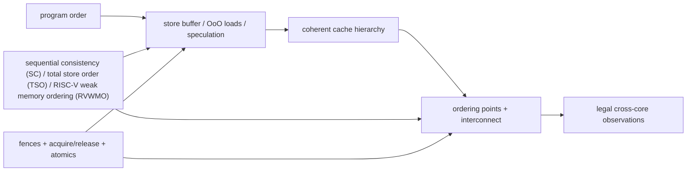
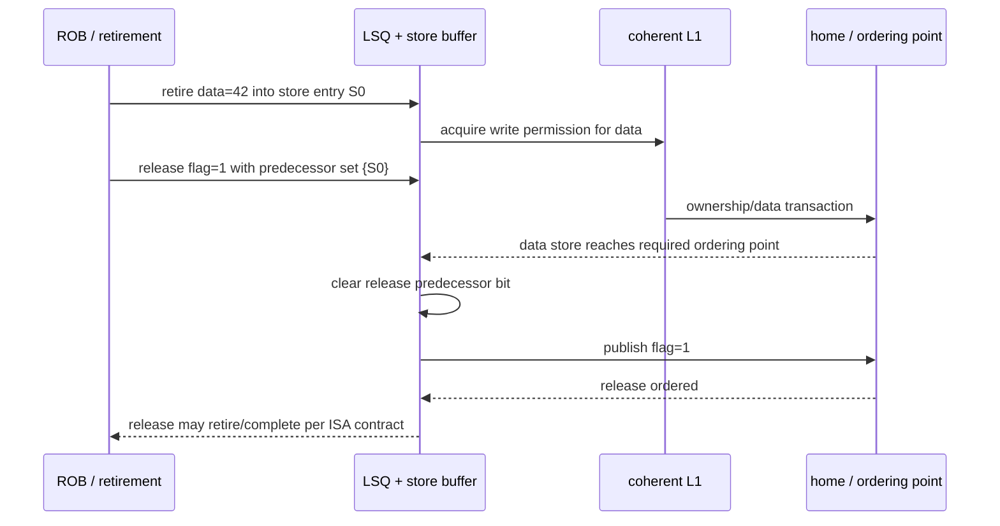
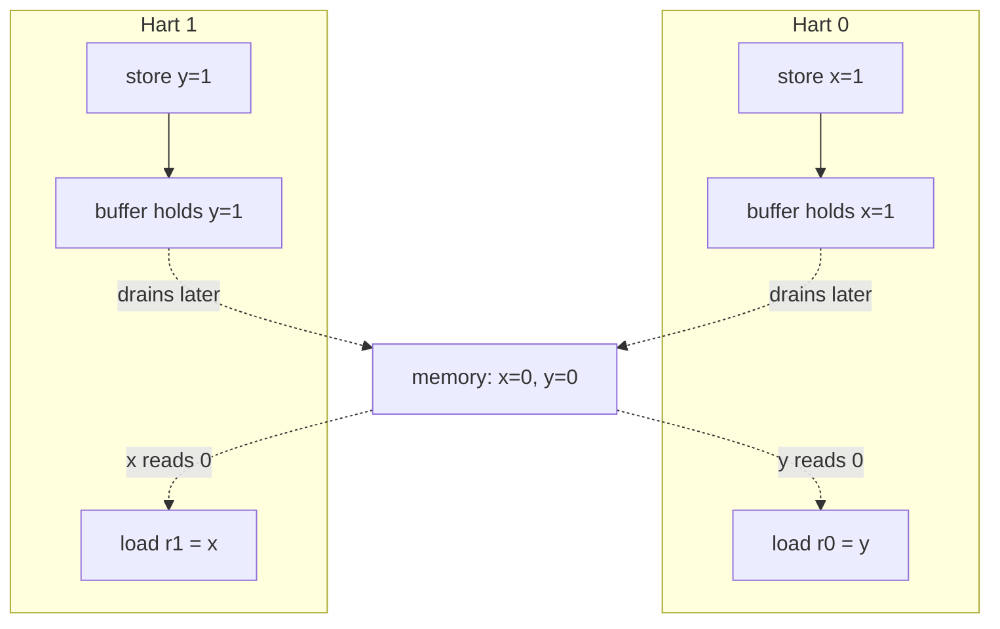
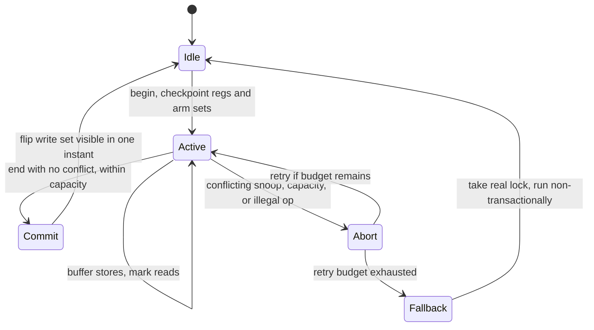

# Memory Consistency and Atomic Operations — Which Cross-Core Observations Are Legal?

> **First-time reader orientation:** Coherence concerns copies of one address; memory consistency constrains the order in which cores may observe accesses to different addresses. An atomic operation performs a read-modify-write indivisibly for synchronization. Litmus tests are tiny concurrent programs used to expose which observations a model permits, and fences forbid selected reorderings.

> **Abbreviation key — skim now and return as needed:** central processing unit (CPU); instruction set architecture (ISA); reduced instruction set computer (RISC); out-of-order (OoO); reorder buffer (ROB); load-store queue (LSQ); input-output memory management unit (IOMMU);
> quality of service (QoS); direct memory access (DMA); AXI Coherency Extensions (ACE); Coherent Hub Interface (CHI); Modified, Exclusive, Shared, Invalid (MESI).

> **Prerequisites:** [Cache Coherence](01_Cache_Coherence.md) (single-writer/multiple-reader permissions), [CPU Architecture](../01_Core_Foundations/01_CPU_Architecture.md) §9, and [Load-Store Unit](../03_Out_of_Order_Backend/02_Load_Store_Unit_and_Memory_Ordering.md).
> **Hands off to:** ISA/compiler synchronization rules, language memory models, and coherent fabrics. This page owns the hardware ordering contract and its microarchitectural consequences.

---

## 0. Why this page exists

Coherence guarantees a sensible order for writes to one cache line. Consistency constrains the order in which operations to **different** addresses may become visible. A coherent machine can still allow outcomes that surprise a programmer expecting sequential execution.



The central design bargain is to permit reorderings that improve performance while providing explicit operations that recover the order software needs.

## Before the details: permissions and observation order are separate

Cache coherence answers who may read or write one cache line and ensures writes to that line eventually agree. Memory consistency answers a broader software question: if one core accesses address X and then address Y, which orders may another core observe? Store buffers, speculative loads, and nonblocking caches can change observation order without violating single-address coherence.

A **litmus test** reduces the question to a few loads and stores on two or more cores, then asks whether a specific result is legal. Sequential consistency is the intuitive model in which all operations fit one total order consistent with each thread’s program order. Real architectures often allow more reordering for performance and provide fences and ordered atomic operations when software needs stronger synchronization.

**Beginner checkpoint:** an atomic operation is not merely a load followed by a store. Other agents must not interleave a conflicting operation between its read and write, and its ordering strength must be defined. The event graphs below make those two obligations visible.

## 0.1 From a blocking core to a weakly ordered core—one optimization at a time

Use a blocking in-order memory path as the baseline. It issues the next memory operation only after the previous one reaches its required visibility point. Program order and observation order are then closely aligned, but a store miss can freeze the core for hundreds of cycles. The first repair is a **store buffer**: retire a checked store into an ordered queue and let the cache acquire ownership in the background.

That repair creates a new failure. A younger load to the same address could read stale cache data while its older value waits in the store buffer. The derived requirement is store-to-load forwarding: compare the load address and byte mask against every older buffered store and select the youngest matching bytes. A partially covered load merges forwarded bytes with cache bytes only if the implementation can prove both sources belong to the same logical access epoch.

Allowing a load to a *different* address to bypass the older store recovers performance, but it exposes the store-buffering outcome and therefore changes the architectural memory model. The ISA must either permit that ordering or provide an operation that closes it. A fence adds tracked obligations—not magic:

```mermaid
flowchart LR
    B["blocking memory path"] -->|"store miss stalls retirement"| SB["ordered store buffer"]
    SB -->|"same-address load could see stale cache data"| FWD["age + address + byte-mask forwarding"]
    FWD -->|"different-address load can become visible first"| MM["documented relaxed ordering"]
    MM -->|"software needs publication/order"| F["fence or acquire/release obligation tracker"]
    F -->|"miss latency still hides independent loads"| SPEC["speculative load issue + validation + replay"]
    SPEC -->|"hot synchronization line serializes"| AT["atomic serialization + scalable software data structure"]
```



For each load, the LSQ therefore needs an age, address-valid bit, byte mask, execution/completion state, source (forward/cache), observed coherence version or invalidation status, and replay cause. For each store, it needs age, address-valid and data-valid bits, byte mask/data, retirement state, coherence request state, and visibility/acknowledgement state. Fence state records its predecessor and successor classes and whether every required predecessor has reached the ISA-defined ordering point. The ROB prevents a replayed speculative load from becoming a committed architectural event.

### Concrete trace: publish data, then a flag

The producer executes `data=42; release flag=1`; the consumer executes `acquire load flag; load data`. Suppose `data` misses in the producer's cache while `flag` could hit. Without release tracking, `flag=1` can become observable first and the consumer can read old `data=0`.

```wavedrom
{ "signal": [
  { "name": "P:data_store_retire", "wave": "01.0........" },
  { "name": "P:data_ordered",      "wave": "0....1......" },
  { "name": "P:release_flag",     "wave": "0.1..|.10.." },
  { "name": "C:acquire_flag",     "wave": "0.......10." },
  { "name": "C:data_load",        "wave": "0.........10" },
  { "name": "C:observed_data",    "wave": "x.........=.", "data": ["42"] }
] }
```

The release store may allocate early, but its visibility permission remains blocked while the older `data` store's obligation is outstanding. When `data` reaches the required coherence ordering point, the tracker clears that bit and permits `flag` to become visible. On the consumer, seeing the acquire value can unblock younger loads; an implementation may execute them earlier only if it retains enough state to validate and replay them before retirement.

Now inject an invalidation for `data` after the consumer speculatively reads it but before the acquire is resolved. A conservative core delays the data load. An aggressive core marks the completed load as exposed to the invalidation and, if the acquire later establishes an ordering edge that makes the old observation illegal, kills the dependent instruction slice and replays from the load. The repair path must clear destination readiness, cancel or generation-tag dependent wakeups, preserve older retired state, and prevent the first value from reaching retirement or an external side effect.



### Concrete trace: atomic increment under contention

For `atomic_fetch_add(counter,1)`, ownership of the cache line is not enough unless one point serializes the read and write. A cache-based design obtains exclusive permission, locks or reserves the line against conflicting local operations, reads the old value, computes and installs the new value, marks the atomic's serialization point, then releases the response. A home-node atomic instead performs the operation at the directory/memory-side engine, trading requester hops for less line movement.

Retry needs identity. A coherence retry or link retransmission may repeat transport, but it must not apply the increment twice. Carry a requester/transaction identifier until the response is durably matched; at the serialization engine, retain enough active or recently completed identity state to distinguish retry from new work according to the protocol. Cancellation after serialization cannot pretend the write never happened: it may suppress a requester result only under a defined fault contract, while global memory still contains the new value.

The PPA and losing cases follow from the state. A wider store buffer hides longer misses but expands associative forwarding and age selection; more speculative loads increase validation bits, replay bandwidth, and wasted work; a universal full drain for every fence is simple but destroys performance; a fine-grained obligation matrix saves cycles but costs comparisons and proof complexity. Report store-buffer occupancy/full time, forwarded bytes, unknown-address stalls, violation/replay causes, fence wait broken down by obligation, atomic ownership/serialization/queue time, and invalidations that intersect speculative loads. Verify with ISA-generated litmus outcomes and microarchitectural assertions together: litmus tests prove only allowed observations, while assertions prove killed work and retries cannot leak extra architectural events.

## 1. Events and relations

Reason about dynamic memory events rather than source lines:

- load, store, atomic read-modify-write;
- address, value, size, byte mask, hart/thread;
- program order (`po`) within a hart;
- reads-from (`rf`): which store supplied a load;
- coherence/write order (`co`) per location;
- from-read (`fr`): load to later store in per-location order;
- preserved program order and fence/order relations.

A memory model defines which cycles or combinations of these relations are forbidden. The model is not “the order the cache sees requests”; speculative requests may be issued and replayed without becoming architectural events.

## 2. Sequential consistency as the reference point

Sequential consistency (SC) requires one total order of all memory operations that preserves each thread's program order. Every load reads the latest preceding store to that address in that total order.

SC is easy to explain and expensive to implement literally. Store buffers, nonblocking caches, speculative loads, and distributed interconnects naturally allow operations to complete/propagate in different orders.

An implementation may execute aggressively internally and still implement SC if it validates/repairs before retirement/visibility. The constraint is on architecturally observable results, not internal issue order.

## 3. Store buffering litmus test

Initially `x=y=0`:

| Hart 0 | Hart 1 |
|---|---|
| `x = 1` | `y = 1` |
| `r0 = y` | `r1 = x` |

Outcome `r0=0, r1=0` is forbidden under SC: no single total order can place both loads before the other hart's store while preserving both local store→load orders (the two program-order edges and the two load-before-store edges close the cycle $x{=}1 \rightarrow r0{=}y \rightarrow y{=}1 \rightarrow r1{=}x \rightarrow x{=}1$). It is allowed by models that permit a later load to bypass an earlier store to a different address, as ordinary store buffers do.

To decode that cycle, name its two edge kinds. A store→load arrow *inside one hart* (`x=1 → r0=y`, and `y=1 → r1=x`) is **program order** (`po`). A load→store arrow *across harts* (`r0=y → y=1`, and `r1=x → x=1`) is **from-read** (`fr`): the load observed memory *before* that store took effect, so it sits earlier in coherence order. SC forbids any cycle in $po \cup fr$, and these four edges close exactly one — so no legal total order exists.

**How a store buffer produces `0/0`.** Each store parks in its own hart's store buffer and drains to coherent memory later; each load goes to memory immediately. Interleave so both loads run before either buffer drains:

| step | Hart 0 | Hart 1 | memory |
|---|---|---|---|
| 1 | `x=1` enters SB0 | — | `x=0, y=0` |
| 2 | — | `y=1` enters SB1 | `x=0, y=0` |
| 3 | `r0=y` reads **0** | — | `x=0, y=0` |
| 4 | — | `r1=x` reads **0** | `x=0, y=0` |
| 5 | SB0 drains | SB1 drains | `x=1, y=1` |

Neither load sees the other's store because that store is still private in a buffer — the store→load edge *to a different address* is exactly what TSO leaves unordered. This is the microarchitectural realization of the `fr` edges above.



A full fence between each store and load forbids that bypass/visibility outcome. A fence is therefore an ordering edge, not a “flush all caches” instruction. Concretely, the fence makes each hart's store drain to memory before that hart's load may issue; the two stores can no longer both be buffered when the loads read, so at least one load observes a `1` and `0/0` cannot occur.

## 4. Common hardware model shapes

| Model shape | Typical preserved orders | Performance implication |
|---|---|---|
| SC | all load/store program order | simplest software reasoning; strongest hardware validation |
| TSO-like | generally preserves load→load, load→store, store→store; relaxes store→load to different address | store buffer hides write latency |
| weak/release consistency | many orders relaxed unless dependency/fence/acquire/release constrains them | greatest implementation/compiler freedom |
| RVWMO | weak model with explicit preserved program-order rules, dependencies, fences, and atomics | permits aggressive RISC-V cores while specifying portable synchronization |

Precise rules belong to each ISA specification; labels like “weak” are not interchangeable. Whether dependencies order accesses, whether stores are multi-copy atomic, and which fence bits apply can differ.

## 5. Message-passing litmus test

Initially `data=0, flag=0`:

| Producer | Consumer |
|---|---|
| `data = 42` | `r0 = flag` (acquire) |
| `flag = 1` (release) | if `r0==1`, `r1=data` |

Release orders earlier producer operations before the flag publication; acquire orders later consumer operations after observing it. If the consumer reads `flag=1`, it must see `data=42` under the synchronization contract.

In C11 the pair uses explicit memory orders on the flag; `data` stays a plain access because the release/acquire edge is what orders it:

```c
// Producer
data = 42;                                             // plain store
atomic_store_explicit(&flag, 1, memory_order_release); // publishes data first

// Consumer
if (atomic_load_explicit(&flag, memory_order_acquire)) // observes the release
    use(data);                                         // guaranteed to read 42
```

The `release` forbids `data=42` from sinking past the flag store; the matching `acquire` forbids the `use(data)` load from hoisting above the flag load. Weaken either to `memory_order_relaxed` and the edge breaks — the consumer may then see `flag=1` with stale `data=0`.

Microarchitecturally, release may wait until older stores reach the required ordering point before making the release store observable. Acquire may prevent younger loads from becoming irrevocably ordered before the acquire result. It need not stop all speculative execution if violations can be detected and repaired.

## 6. Store buffers and load speculation

A store buffer lets retirement continue while committed stores wait for cache/coherence service. Loads search older stores for forwarding, then may access cache ahead of buffered stores to other addresses.

Correctness requirements:

- same-address load gets the youngest older store's value;
- store→store visibility order is preserved when the model requires it;
- fences wait for the defined subsets/order points;
- speculative loads are replayed if older unknown stores alias;
- coherence invalidations or snoops trigger required load validation;
- device/strongly ordered accesses bypass relaxed normal-memory rules.

Load-load reordering can occur when a younger cache hit returns before an older miss. If the model preserves their order, the core can delay retirement/observation or detect external events that make early execution illegal.

## 7. Multi-copy atomicity and propagation

A write is multi-copy atomic when it becomes visible to all observers at one conceptual point rather than propagating to different observers at different times. Directory/home serialization and invalidate acknowledgements often support such a point, but protocol details matter.

Non-multi-copy-atomic behavior complicates tests such as independent reads of independent writes (IRIW), where two readers observe writes in different orders. Some models constrain propagation through cumulative fences: a hart that observes another write and then publishes a flag can carry ordering to third parties.

Do not infer consistency solely from MESI state. A line may be coherent while writes to two lines reach observers in relaxed orders.

## 8. Fences are parameterized ordering operations

A fence can be understood as ordering predecessor classes before successor classes. In RISC-V, predecessor/successor sets distinguish reads, writes, input, and output. Implementations may map different combinations to different drain/serialization actions.

Possible machinery:

- block younger memory issue until older sets complete;
- allow issue but prevent retirement/visibility;
- drain committed store buffer to a coherence ordering point;
- wait for outstanding invalidation/atomic acknowledgements;
- order device I/O separately from cacheable memory;
- serialize translation or instruction-stream updates with dedicated operations.

Over-implementing every fence as a full pipeline/cache drain is correct but can be catastrophically slow. Under-implementing one creates rare cross-core failures.

## 9. Atomics and their serialization point

An atomic read-modify-write reads a value and conditionally/unconditionally writes a new value without another observer intervening at that location. It needs one serialization point, often cache ownership or a home-node atomic engine.

### 9.1 AMOs / fetch operations

The requester obtains exclusive authority, performs the operation, and returns the old value. Acquire/release annotations add cross-address ordering around the atomic.

### 9.2 Compare-and-swap

Write occurs only if the observed value matches. The comparison and conditional write share the same serialization interval; software sees one success/failure result.

Why one conditional primitive suffices: *any* read-modify-write can be built as a CAS **retry loop** — read the current value, compute a new one, and swap it in only if nothing changed underneath. On failure CAS reloads the current value into `cur`, so the loop simply recomputes and retries:

```c
// atomic "multiply by 3" — no native AMO for it — via a CAS loop
uint64_t cur = atomic_load_explicit(&v, memory_order_relaxed);
uint64_t next;
do {
    next = cur * 3;                       // arbitrary RMW computed from cur
} while (!atomic_compare_exchange_weak_explicit(
    &v, &cur, next,                       // fail path writes current v into cur
    memory_order_acq_rel, memory_order_relaxed));
```

The `_weak` form may fail spuriously, which is harmless inside a loop. A caveat CAS shares with all value-comparison: it cannot tell `A → B → A` from "never changed" (the *ABA* problem), because it inspects only the value, not the history.

### 9.3 Load-reserved/store-conditional

LR establishes a reservation; SC succeeds only if it remains valid. Conflicting writes and allowed implementation events clear it. Correctness includes forward-progress constraints for constrained loops, reservation granularity, and context-switch behavior.

The same optimistic retry loop as §9.2, but keyed on the reservation rather than a compared value:

```asm
retry:
    lr.w   t0, (a0)      # load-reserved: read *a0, arm a reservation
    addi   t0, t0, 1     # compute new value
    sc.w   t1, t0, (a0)  # store-conditional: t1 = 0 on success, nonzero if lost
    bnez   t1, retry     # reservation broken -> retry
```

Because SC fails on *any* intervening write to the reserved granule — not just a net value change — LR/SC sidesteps the ABA problem that trips CAS: an `A → B → A` sequence still clears the reservation and forces a retry. The cost is the reservation-granularity and forward-progress constraints above.

An atomic's latency includes ownership acquisition, invalidations, operation, acknowledgement, and ordering drains:

$$
L_{atomic}=L_{route}+L_{serialize}+L_{snoop/invalidations}+L_{op}+L_{response}+L_{order}.
$$

Contention turns the cache line into a serial queue; throughput approaches the inverse service time regardless of core count.

## 10. Compiler and language boundary

Hardware orders dynamic machine instructions. Languages define races and atomic semantics at source level; compilers map them to ISA operations. A hardware fence cannot repair a compiler that removed/reordered unsynchronized source accesses, and a compiler barrier alone cannot order hardware visibility.

Correct synchronization requires the full chain:

$$
\text{language model}\rightarrow\text{compiler mapping}\rightarrow\text{ISA model}\rightarrow\text{microarchitecture}\rightarrow\text{coherent fabric}.
$$

Architecture documentation should specify the ISA contract and implementation reasoning without claiming that ordinary data races are portable language synchronization.

## 11. Device memory and I/O ordering

Memory-mapped registers can have side effects, reject speculative reads, require access size/order, or represent doorbells. Attributes distinguish normal cacheable memory from device/strongly ordered memory.

Common producer sequence for a DMA device:

1. write descriptors in normal memory;
2. ensure descriptor writes reach the device-visible domain;
3. write device doorbell;
4. device reads descriptors.

The required barrier orders normal stores before I/O. Cache maintenance may also be required for noncoherent devices. Treating the doorbell as an ordinary write risks the device observing a command before its data.

## 12. Verification with litmus tests and formal models

Directed litmus tests cover store buffering, message passing, load buffering, IRIW, publication, atomics, and fence combinations. Random generators explore longer interactions. Outcomes should be checked against an executable axiomatic/operational model, not intuition.

Microarchitectural assertions:

- forwarding returns youngest older same-address bytes;
- preserved program-order edges cannot become observably inverted;
- completed fences have satisfied all specified predecessor/successor obligations;
- atomic serialization is unique and indivisible;
- invalidated speculative loads are replayed when required;
- device accesses obey attributes and are not speculated illegally;
- killed requests cannot create architectural ordering events.

## 13. Performance counters

- store-buffer occupancy/full cycles and drain latency;
- loads bypassing older stores, predicted dependencies, violations, replays;
- fence count and stall cycles by predecessor/successor class;
- atomic latency, retries, ownership transfers, and contention depth;
- coherence invalidations hitting speculative/completed loads;
- device-ordering drains;
- LR/SC success/failure causes.

An average atomic latency is insufficient; report by line sharing and contention because one hot lock dominates tails.

## 14. Numbers to remember

- Coherence orders writes per line; consistency constrains observations across addresses.
- Store buffering commonly relaxes store→load ordering to different addresses.
- Acquire/release creates a publication chain without requiring every operation to be SC.
- A fence orders specified event classes; it is not synonymous with flushing caches.
- Atomics need one serialization point plus any acquire/release ordering.
- Language, compiler, ISA, core, and fabric must all preserve the synchronization contract.
- Hardware transactional memory (HTM) commits a group of memory ops atomically and detects conflicts with the coherence protocol; it beats a lock only while the abort rate stays under $(o_\ell-o_x)/(o_\ell+C_a)$, and forward progress still requires a non-transactional fallback.

## 15. Worked problems

### Problem 1 — store-buffer outcome

In the store-buffering test, both loads reading zero is possible if each load bypasses its hart's older buffered store and runs before the other store is visible. Adding store→load fences on both harts creates a cycle that forbids the outcome.

### Problem 2 — contended atomic throughput

An atomic increment on one line takes 80 ns including ownership transfer. Even with 64 requesters, ideal serialization-limited throughput is at most

$$
1/(80\ \text{ns})=12.5\ \text{M operations/s}.
$$

More cores increase queueing, not the line's service rate. Sharding counters or combining updates changes the algorithmic bottleneck.

### Problem 3 — fence cost

A release operation waits for six older stores. Four are already globally ordered; two take 35 and 60 cycles in parallel. Incremental drain cost is about 60 cycles, not $6\times$ average store latency. The implementation should track outstanding obligations, not serialize every store anew.

## 16. Hardware transactional memory and lock elision

Section 9 gave a single atomic read-modify-write one serialization point. A lock generalizes that to a *region*: acquire, run a critical section, release. Hardware transactional memory (HTM) generalizes it a different way — it lets a *group* of loads and stores commit at one instant, all-or-nothing, so the region runs speculatively and pays only for the conflicts that actually occur.

### 16.1 Why elide the lock at all

A lock is both an overhead and a pessimism.

The overhead is fixed per critical section. Acquiring the lock is itself an atomic on a shared line, so it carries the full $L_{atomic}$ of §9 — ownership, serialization, and the acquire/release ordering drains — and under sharing the lock line ping-pongs between cores. Even an *uncontended* lock costs an atomic plus two fences on a line touched only to synchronize.

The pessimism is worse. A lock forbids concurrency the workload may never need. Two threads updating disjoint buckets of a hash table under one coarse lock never actually conflict, yet the lock serializes them anyway: it protects against the worst case (some pair *might* collide) and charges every case for it.

HTM removes both. It runs the critical section speculatively, uses the coherence protocol to watch for a real conflict, and commits atomically if none occurred. Disjoint-bucket updates then proceed in parallel; only a genuine collision costs anything.

### 16.2 Mechanism: §4's speculate/validate/recover, applied to a group

A transaction is the retirement discipline of the [retirement page](../03_Out_of_Order_Backend/03_Retirement_Recovery_and_Precise_State.md) — speculate, validate, then commit or else recover — lifted from one instruction to a *set* of memory operations that must retire together or not at all.

- **Read set / write set.** The transaction records every line it reads (read set) and every line it writes (write set). Speculative stores are *buffered* — held in the store queue or written into L1 in a speculative state — and are **not** made globally visible. Speculative loads are marked (a per-line read bit, or a hashed signature over addresses).
- **Conflict detection reuses coherence.** The conflict detector is already in the machine: the cache-coherence protocol (see [Cache Coherence](01_Cache_Coherence.md)). A remote snoop that would *invalidate* a read-set line, or *steal ownership* of a write-set line, is exactly a conflict — another agent is about to observe or clobber state this transaction depends on. This is §6's rule "coherence invalidations trigger required load validation," but the answer for a whole group is **abort**, not per-load replay.
- **Commit.** At transaction end the machine confirms no read/write-set line was lost, then atomically flips the buffered write set to globally visible and clears the speculative marks — one serialization instant, the group's retirement boundary. Before that instant no observer sees any write; after it, all of them.
- **Abort.** Discard the buffered write set, drop the read/write marks, restore the register checkpoint taken at transaction begin, and jump to the abort handler.



### 16.3 The three unavoidable abort causes

1. **Data conflict.** A read-set line is invalidated or a write-set line is stolen. This is the mechanism working as intended; it fires whenever two transactions — or a transaction and a plain access — genuinely race on a line.
2. **Capacity overflow.** The speculative write set must fit its buffer (an L1 set's ways, or the speculative store-queue depth), and the tracked read set must fit its marking resource (bits or signature). Once the footprint exceeds capacity there is nowhere to hold speculative state, so the transaction aborts regardless of conflicts. This is a hard ceiling, not a probability.
3. **Illegal / uncacheable operations.** A system call, a page fault, an uncacheable device access, an interrupt, or certain serializing register writes cannot be buffered or rolled back and force an abort. This is why no bounded HTM can promise that a given transaction ever commits.

### 16.4 When HTM wins — a break-even derivation

Let a critical-section body take $C$ cycles. Charge a lock $o_\ell$ per acquire+release (the atomic, the release store, the ordering drains, and — when shared — the lock-line transfer), and charge a transaction $o_x$ per begin+commit (checkpoint plus commit flip), with $o_x<o_\ell$ because there is no globally-ordered atomic on a contended line. Let $p_a$ be the per-attempt abort probability and $C_a\le C$ the work discarded on an abort.

An uncontended lock costs
$$
E[T_\ell]=o_\ell+C.
$$
Retrying transactionally until success, the number of *failed* attempts is geometric with mean $p_a/(1-p_a)$; each failed attempt costs $o_x+C_a$ and the successful one costs $o_x+C$:
$$
E[T_x]=(o_x+C)+\frac{p_a}{1-p_a}\,(o_x+C_a).
$$
HTM wins when $E[T_x]<E[T_\ell]$, i.e. when the abort tax is smaller than the overhead it saves:
$$
\frac{p_a}{1-p_a}\,(o_x+C_a)<o_\ell-o_x.
$$
Writing the saving $S=o_\ell-o_x$ and the per-abort cost $D=o_x+C_a$, the break-even is $\tfrac{p_a}{1-p_a}=S/D$, so
$$
p_a^\star=\frac{o_\ell-o_x}{o_\ell+C_a}.
$$
The reading is the whole point of HTM: the abort budget $p_a^\star$ grows with the lock overhead being elided. A cheap uncontended lock ($o_\ell\!\to\!o_x$) gives $p_a^\star\!\to\!0$ — HTM must almost never abort to be worth it. An expensive contended lock (large $o_\ell$ from cross-socket line bouncing) gives a large $p_a^\star$ — HTM wins even with frequent aborts. **HTM pays off in proportion to the contention it removes.**

The abort probability itself rises with conflict rate and footprint. Model remote conflicting accesses to the shared footprint as Poisson over the transaction's exposure window: with $n$ threads, footprint overlap $f=r/S$ (touched lines $r$ out of a shared set of $S$), and a conflicting-store duty factor $\rho$, the expected conflicts in one window are roughly
$$
\lambda\approx(n-1)\,\rho\,f\,C,\qquad p_{conf}=1-e^{-\lambda}.
$$
So HTM's region of advantage is $\lambda<\ln\frac{1}{1-p_a^\star}$: **short** transactions (small $C$), **narrow** footprints (small $r$), and **low** concurrency ($n$). Grow $C$ or $r$ and $\lambda$ climbs until either conflicts or the §16.3 capacity ceiling ends the party.

### 16.5 Worked number

Take a contended lock $o_\ell=120$, transaction overhead $o_x=25$, discarded work $C_a=50$ cycles. Then
$$
p_a^\star=\frac{120-25}{120+50}=\frac{95}{170}=0.56,
$$
so elision wins as long as under ~56 % of attempts abort. At a measured $p_a=0.20$ with $C=200$,
$$
E[T_\ell]=320,\qquad E[T_x]=225+\tfrac{0.20}{0.80}(75)=243.75,\qquad \text{speedup}=1.31\times.
$$
Now swap in a *cheap, uncontended* lock $o_\ell=30$. The break-even collapses to $p_a^\star=(30-25)/(30+50)=0.0625$ — HTM must abort under ~6 %. At the same $p_a=0.20$, $E[T_\ell]=230$ while $E[T_x]$ is unchanged at $243.75$, so the speedup is $0.94\times$, a **loss**. Same transaction, opposite verdict — decided by how much lock the elision actually removes. (The $p_a=0.20$ point corresponds to $\lambda=-\ln 0.8\approx0.22$; doubling either the thread count or $C$ drives $\lambda\to0.45$ and $p_a\to0.36$, straight through the cheap-lock break-even.)

### 16.6 Lock elision and the mandatory fallback

Lock *elision* is the productization: a library or the hardware *begins a transaction instead of taking the lock*, executes the region, and commits — the lock is never written in the common case, so its line never leaves shared state and disjoint critical sections run concurrently. The named implementations are Intel Transactional Synchronization Extensions (TSX), in two forms — Hardware Lock Elision (HLE) prefixes on a legacy lock, and Restricted Transactional Memory (RTM) with explicit begin/end/abort — Arm's Transactional Memory Extension (TME) with transaction start/commit/cancel, and IBM POWER's transactional-memory (TM) facility.

One correctness detail is non-negotiable: **the elided region must place the lock word in its read set** and verify the lock is free at begin. If any thread takes the *real* lock — writing the lock word — that write invalidates the lock line in every eliding transaction's read set and aborts them all. That single trick preserves mutual exclusion between an eliding thread and a non-eliding one; without it, a transaction could commit while another thread holds the lock.

And **forward progress requires a non-transactional fallback path.** Some transactions can never commit — a footprint that always overflows capacity, a critical section containing a system call, or a livelock of mutual aborts. After a bounded retry budget the thread stops eliding, acquires the *actual* lock, and runs non-transactionally. This guarantees progress and sets the semantics floor: correctness rests on the lock, never on the transaction succeeding. The price is the "lemming effect" — one fallback acquisition writes the lock and aborts every concurrent elider, so a burst of fallbacks can serialize the whole set; retry and back-off policy govern how often that happens.

### 16.7 Trade-off — when a plain lock or a lock-free structure wins

HTM turns pessimistic mutual exclusion into optimistic concurrency, so it wins on **short, narrow, low-conflict** critical sections guarded by **expensive** locks — exactly where §16.4 gives a large abort budget. A simpler option wins when:

- **The lock is cheap.** If $o_\ell\lesssim o_x$ (an uncontended test-and-set that stays local), the elision overhead plus any abort tax exceeds the lock — the §16.5 cheap-lock case. Just take the lock.
- **The section is long, wide, or does I/O.** Capacity and illegal-op aborts then dominate; every attempt aborts and falls back, so you pay transaction + abort + lock. A plain lock skips the wasted speculation.
- **The conflict is real and frequent.** HTM does not *reduce* true conflicts; it only avoids paying for conflicts that do not happen. When threads genuinely hammer the same lines, the fix is algorithmic — shard the state, use per-bucket locks, or read-copy-update — the same lesson as §9's contended-atomic service-time bound (a hot line is a serial queue however it is accessed; cf. §15 Problem 2). A lock-free structure that keeps threads off each other's lines beats any elision of a lock they should not be sharing.

Architected HTM is therefore **best-effort**: capacity and illegal aborts mean no transaction is guaranteed to commit, which is precisely why the fallback lock is mandatory. Use HTM to make the uncontended common case fast; keep a correct lock underneath for everything it cannot promise.

Cross-references: [Cache Coherence](01_Cache_Coherence.md) supplies the conflict detector; [Retirement, Recovery, and Precise State](../03_Out_of_Order_Backend/03_Retirement_Recovery_and_Precise_State.md) supplies the speculate/validate/recover machinery a transaction generalizes; §9 (atomics) is the single-operation special case; [Load-Store Unit](../03_Out_of_Order_Backend/02_Load_Store_Unit_and_Memory_Ordering.md) owns the store buffering that holds speculative writes.

## Cross-references

- **Permission protocol:** [Cache Coherence](01_Cache_Coherence.md), [ACE and CHI](03_ACE_and_CHI.md).
- **Core machinery:** [Load-Store Unit](../03_Out_of_Order_Backend/02_Load_Store_Unit_and_Memory_Ordering.md), [Retirement and Recovery](../03_Out_of_Order_Backend/03_Retirement_Recovery_and_Precise_State.md).
- **Speculative synchronization:** §16 hardware transactional memory reuses [Cache Coherence](01_Cache_Coherence.md) as its conflict detector and the [Retirement and Recovery](../03_Out_of_Order_Backend/03_Retirement_Recovery_and_Precise_State.md) speculate/validate/recover discipline.
- **I/O/translation:** [Page Walkers, IOMMUs, and Virtualization](../05_Virtual_Memory/02_Page_Walkers_IOMMUs_and_Virtualization.md), [QoS, Ordering, and I/O Coherence](../../04_SoC_and_Chiplet_Architecture/05_IO_and_Chiplets/01_QoS_Ordering_and_IO_Coherence.md).

## References

1. RISC-V International, [RVWMO Memory Consistency Model](https://docs.riscv.org/reference/isa/unpriv/rvwmo.html).
2. RISC-V International, [Formal Memory Model Specifications](https://docs.riscv.org/reference/isa/unpriv/mm-formal.html).
3. P. Sewell et al., “x86-TSO: A Rigorous and Usable Programmer's Model for x86 Multiprocessors,” CACM 2010.
4. S. Adve and K. Gharachorloo, “Shared Memory Consistency Models: A Tutorial,” *Computer*, 1996.
5. J. Alglave et al., “Herding Cats: Modelling, Simulation, Testing, and Data Mining for Weak Memory,” TOPLAS 2014.

---

**Navigation:** [Coherence and Consistency index](00_Index.md) · [Memory index](../00_Design_Methodology/00_Index.md)
