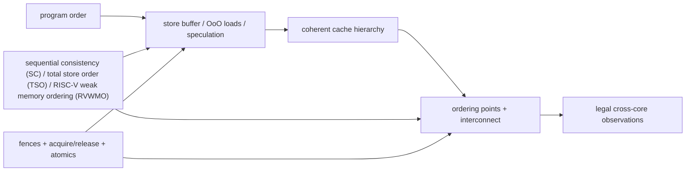

# Memory Consistency and Atomic Operations — Which Cross-Core Observations Are Legal?

> **First-time reader orientation:** Coherence concerns copies of one address; memory consistency constrains the order in which cores may observe accesses to different addresses. An atomic operation performs a read-modify-write indivisibly for synchronization. Litmus tests are tiny concurrent programs used to expose which observations a model permits, and fences forbid selected reorderings.

> **Abbreviation key — skim now and return as needed:** central processing unit (CPU); instruction set architecture (ISA); reduced instruction set computer (RISC); out-of-order (OoO); input-output memory management unit (IOMMU);
> quality of service (QoS); direct memory access (DMA); AXI Coherency Extensions (ACE); Coherent Hub Interface (CHI); Modified, Exclusive, Shared, Invalid (MESI).

> **Prerequisites:** [Cache Coherence](01_Cache_Coherence.md) (single-writer/multiple-reader permissions), [CPU Architecture](../01_Core_Foundations/01_CPU_Architecture.md) §9, and [Load-Store Unit](../03_Out_of_Order_Backend/02_Load_Store_Unit_and_Memory_Ordering.md).
> **Hands off to:** ISA/compiler synchronization rules, language memory models, and coherent fabrics. This page owns the hardware ordering contract and its microarchitectural consequences.

---

## 0. Why this page exists

Coherence guarantees a sensible order for writes to one cache line. Consistency constrains the order in which operations to **different** addresses may become visible. A coherent machine can still allow outcomes that surprise a programmer expecting sequential execution.

The central design bargain is to permit reorderings that improve performance while providing explicit operations that recover the order software needs.

## Before the details: permissions and observation order are separate

Cache coherence answers who may read or write one cache line and ensures writes to that line eventually agree. Memory consistency answers a broader software question: if one core accesses address X and then address Y, which orders may another core observe? Store buffers, speculative loads, and nonblocking caches can change observation order without violating single-address coherence.

A **litmus test** reduces the question to a few loads and stores on two or more cores, then asks whether a specific result is legal. Sequential consistency is the intuitive model in which all operations fit one total order consistent with each thread’s program order. Real architectures often allow more reordering for performance and provide fences and ordered atomic operations when software needs stronger synchronization.

**Beginner checkpoint:** an atomic operation is not merely a load followed by a store. Other agents must not interleave a conflicting operation between its read and write, and its ordering strength must be defined. The event graphs below make those two obligations visible.

## 1. Events and relations

Reason about dynamic memory events rather than source lines:

- load, store, atomic read-modify-write;
- address, value, size, byte mask, hart/thread;
- program order (`po`) within a hart;
- reads-from (`rf`): which store supplied a load;
- coherence/write order (`co`) per location;
- from-read (`fr`): load to later store in per-location order;
- preserved program order and fence/order relations.

A memory model defines which cycles or combinations of these relations are forbidden. The model is not “the order the cache sees requests”; speculative requests may be issued and replayed without becoming architectural events.

## 2. Sequential consistency as the reference point

Sequential consistency (SC) requires one total order of all memory operations that preserves each thread's program order. Every load reads the latest preceding store to that address in that total order.

SC is easy to explain and expensive to implement literally. Store buffers, nonblocking caches, speculative loads, and distributed interconnects naturally allow operations to complete/propagate in different orders.

An implementation may execute aggressively internally and still implement SC if it validates/repairs before retirement/visibility. The constraint is on architecturally observable results, not internal issue order.

## 3. Store buffering litmus test

Initially `x=y=0`:

| Hart 0 | Hart 1 |
|---|---|
| `x = 1` | `y = 1` |
| `r0 = y` | `r1 = x` |

Outcome `r0=0, r1=0` is forbidden under SC: no single total order can place both loads before the other hart's store while preserving both local store→load orders. It is allowed by models that permit a later load to bypass an earlier store to a different address, as ordinary store buffers do.

A full fence between each store and load forbids that bypass/visibility outcome. A fence is therefore an ordering edge, not a “flush all caches” instruction.

## 4. Common hardware model shapes

| Model shape | Typical preserved orders | Performance implication |
|---|---|---|
| SC | all load/store program order | simplest software reasoning; strongest hardware validation |
| TSO-like | generally preserves load→load, load→store, store→store; relaxes store→load to different address | store buffer hides write latency |
| weak/release consistency | many orders relaxed unless dependency/fence/acquire/release constrains them | greatest implementation/compiler freedom |
| RVWMO | weak model with explicit preserved program-order rules, dependencies, fences, and atomics | permits aggressive RISC-V cores while specifying portable synchronization |

Precise rules belong to each ISA specification; labels like “weak” are not interchangeable. Whether dependencies order accesses, whether stores are multi-copy atomic, and which fence bits apply can differ.

## 5. Message-passing litmus test

Initially `data=0, flag=0`:

| Producer | Consumer |
|---|---|
| `data = 42` | `r0 = flag` (acquire) |
| `flag = 1` (release) | if `r0==1`, `r1=data` |

Release orders earlier producer operations before the flag publication; acquire orders later consumer operations after observing it. If the consumer reads `flag=1`, it must see `data=42` under the synchronization contract.

Microarchitecturally, release may wait until older stores reach the required ordering point before making the release store observable. Acquire may prevent younger loads from becoming irrevocably ordered before the acquire result. It need not stop all speculative execution if violations can be detected and repaired.

## 6. Store buffers and load speculation

A store buffer lets retirement continue while committed stores wait for cache/coherence service. Loads search older stores for forwarding, then may access cache ahead of buffered stores to other addresses.

Correctness requirements:

- same-address load gets the youngest older store's value;
- store→store visibility order is preserved when the model requires it;
- fences wait for the defined subsets/order points;
- speculative loads are replayed if older unknown stores alias;
- coherence invalidations or snoops trigger required load validation;
- device/strongly ordered accesses bypass relaxed normal-memory rules.

Load-load reordering can occur when a younger cache hit returns before an older miss. If the model preserves their order, the core can delay retirement/observation or detect external events that make early execution illegal.

## 7. Multi-copy atomicity and propagation

A write is multi-copy atomic when it becomes visible to all observers at one conceptual point rather than propagating to different observers at different times. Directory/home serialization and invalidate acknowledgements often support such a point, but protocol details matter.

Non-multi-copy-atomic behavior complicates tests such as independent reads of independent writes (IRIW), where two readers observe writes in different orders. Some models constrain propagation through cumulative fences: a hart that observes another write and then publishes a flag can carry ordering to third parties.

Do not infer consistency solely from MESI state. A line may be coherent while writes to two lines reach observers in relaxed orders.

## 8. Fences are parameterized ordering operations

A fence can be understood as ordering predecessor classes before successor classes. In RISC-V, predecessor/successor sets distinguish reads, writes, input, and output. Implementations may map different combinations to different drain/serialization actions.

Possible machinery:

- block younger memory issue until older sets complete;
- allow issue but prevent retirement/visibility;
- drain committed store buffer to a coherence ordering point;
- wait for outstanding invalidation/atomic acknowledgements;
- order device I/O separately from cacheable memory;
- serialize translation or instruction-stream updates with dedicated operations.

Over-implementing every fence as a full pipeline/cache drain is correct but can be catastrophically slow. Under-implementing one creates rare cross-core failures.

## 9. Atomics and their serialization point

An atomic read-modify-write reads a value and conditionally/unconditionally writes a new value without another observer intervening at that location. It needs one serialization point, often cache ownership or a home-node atomic engine.

### 9.1 AMOs / fetch operations

The requester obtains exclusive authority, performs the operation, and returns the old value. Acquire/release annotations add cross-address ordering around the atomic.

### 9.2 Compare-and-swap

Write occurs only if the observed value matches. The comparison and conditional write share the same serialization interval; software sees one success/failure result.

### 9.3 Load-reserved/store-conditional

LR establishes a reservation; SC succeeds only if it remains valid. Conflicting writes and allowed implementation events clear it. Correctness includes forward-progress constraints for constrained loops, reservation granularity, and context-switch behavior.

An atomic's latency includes ownership acquisition, invalidations, operation, acknowledgement, and ordering drains:

$$
L_{atomic}=L_{route}+L_{serialize}+L_{snoop/invalidations}+L_{op}+L_{response}+L_{order}.
$$

Contention turns the cache line into a serial queue; throughput approaches the inverse service time regardless of core count.

## 10. Compiler and language boundary

Hardware orders dynamic machine instructions. Languages define races and atomic semantics at source level; compilers map them to ISA operations. A hardware fence cannot repair a compiler that removed/reordered unsynchronized source accesses, and a compiler barrier alone cannot order hardware visibility.

Correct synchronization requires the full chain:

$$
\text{language model}\rightarrow\text{compiler mapping}\rightarrow\text{ISA model}\rightarrow\text{microarchitecture}\rightarrow\text{coherent fabric}.
$$

Architecture documentation should specify the ISA contract and implementation reasoning without claiming that ordinary data races are portable language synchronization.

## 11. Device memory and I/O ordering

Memory-mapped registers can have side effects, reject speculative reads, require access size/order, or represent doorbells. Attributes distinguish normal cacheable memory from device/strongly ordered memory.

Common producer sequence for a DMA device:

1. write descriptors in normal memory;
2. ensure descriptor writes reach the device-visible domain;
3. write device doorbell;
4. device reads descriptors.

The required barrier orders normal stores before I/O. Cache maintenance may also be required for noncoherent devices. Treating the doorbell as an ordinary write risks the device observing a command before its data.

## 12. Verification with litmus tests and formal models

Directed litmus tests cover store buffering, message passing, load buffering, IRIW, publication, atomics, and fence combinations. Random generators explore longer interactions. Outcomes should be checked against an executable axiomatic/operational model, not intuition.

Microarchitectural assertions:

- forwarding returns youngest older same-address bytes;
- preserved program-order edges cannot become observably inverted;
- completed fences have satisfied all specified predecessor/successor obligations;
- atomic serialization is unique and indivisible;
- invalidated speculative loads are replayed when required;
- device accesses obey attributes and are not speculated illegally;
- killed requests cannot create architectural ordering events.

## 13. Performance counters

- store-buffer occupancy/full cycles and drain latency;
- loads bypassing older stores, predicted dependencies, violations, replays;
- fence count and stall cycles by predecessor/successor class;
- atomic latency, retries, ownership transfers, and contention depth;
- coherence invalidations hitting speculative/completed loads;
- device-ordering drains;
- LR/SC success/failure causes.

An average atomic latency is insufficient; report by line sharing and contention because one hot lock dominates tails.

## 14. Numbers to remember

- Coherence orders writes per line; consistency constrains observations across addresses.
- Store buffering commonly relaxes store→load ordering to different addresses.
- Acquire/release creates a publication chain without requiring every operation to be SC.
- A fence orders specified event classes; it is not synonymous with flushing caches.
- Atomics need one serialization point plus any acquire/release ordering.
- Language, compiler, ISA, core, and fabric must all preserve the synchronization contract.

## 15. Worked problems

### Problem 1 — store-buffer outcome

In the store-buffering test, both loads reading zero is possible if each load bypasses its hart's older buffered store and runs before the other store is visible. Adding store→load fences on both harts creates a cycle that forbids the outcome.

### Problem 2 — contended atomic throughput

An atomic increment on one line takes 80 ns including ownership transfer. Even with 64 requesters, ideal serialization-limited throughput is at most

$$
1/(80\ \text{ns})=12.5\ \text{M operations/s}.
$$

More cores increase queueing, not the line's service rate. Sharding counters or combining updates changes the algorithmic bottleneck.

### Problem 3 — fence cost

A release operation waits for six older stores. Four are already globally ordered; two take 35 and 60 cycles in parallel. Incremental drain cost is about 60 cycles, not $6\times$ average store latency. The implementation should track outstanding obligations, not serialize every store anew.

## Cross-references

- **Permission protocol:** [Cache Coherence](01_Cache_Coherence.md), [ACE and CHI](03_ACE_and_CHI.md).
- **Core machinery:** [Load-Store Unit](../03_Out_of_Order_Backend/02_Load_Store_Unit_and_Memory_Ordering.md), [Retirement and Recovery](../03_Out_of_Order_Backend/03_Retirement_Recovery_and_Precise_State.md).
- **I/O/translation:** [Page Walkers, IOMMUs, and Virtualization](../05_Virtual_Memory/02_Page_Walkers_IOMMUs_and_Virtualization.md), [QoS, Ordering, and I/O Coherence](../../04_SoC_and_Chiplet_Architecture/05_IO_and_Chiplets/01_QoS_Ordering_and_IO_Coherence.md).

## References

1. RISC-V International, [RVWMO Memory Consistency Model](https://docs.riscv.org/reference/isa/unpriv/rvwmo.html).
2. RISC-V International, [Formal Memory Model Specifications](https://docs.riscv.org/reference/isa/unpriv/mm-formal.html).
3. P. Sewell et al., “x86-TSO: A Rigorous and Usable Programmer's Model for x86 Multiprocessors,” CACM 2010.
4. S. Adve and K. Gharachorloo, “Shared Memory Consistency Models: A Tutorial,” *Computer*, 1996.
5. J. Alglave et al., “Herding Cats: Modelling, Simulation, Testing, and Data Mining for Weak Memory,” TOPLAS 2014.

---

**Navigation:** [Coherence and Consistency index](00_Index.md) · [Memory index](../../05_Architecture_Foundations_and_Methods/01_Reader_Foundations/00_Index.md)
