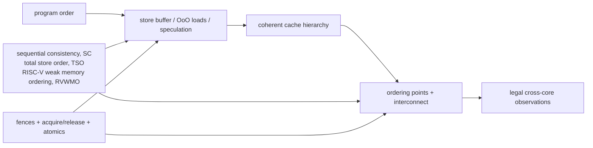
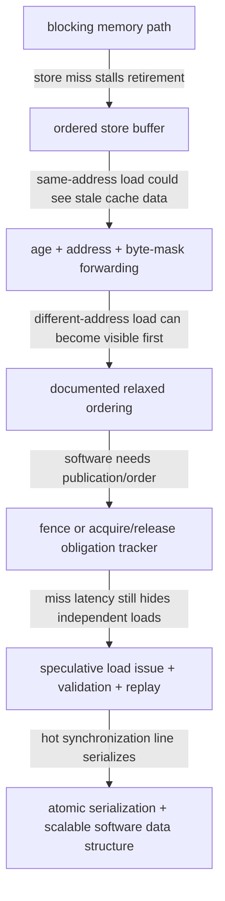
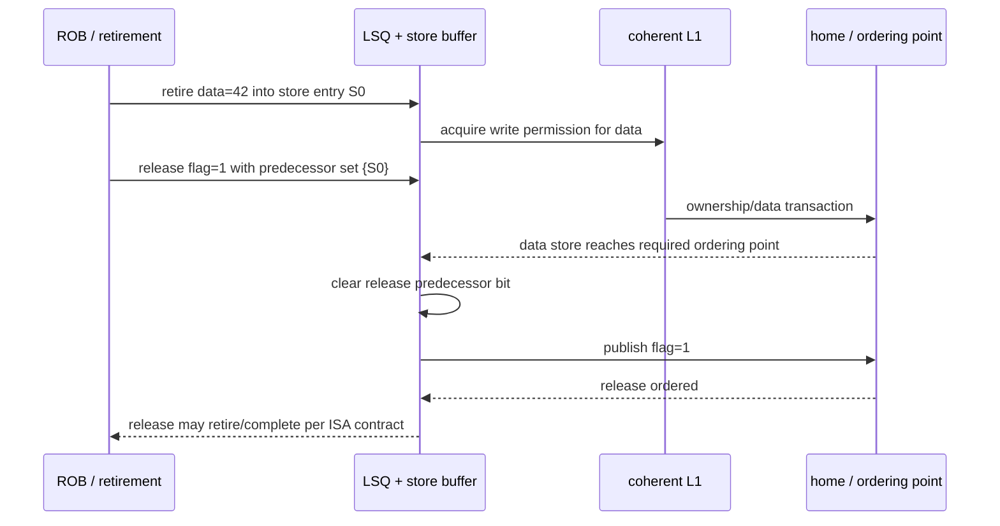
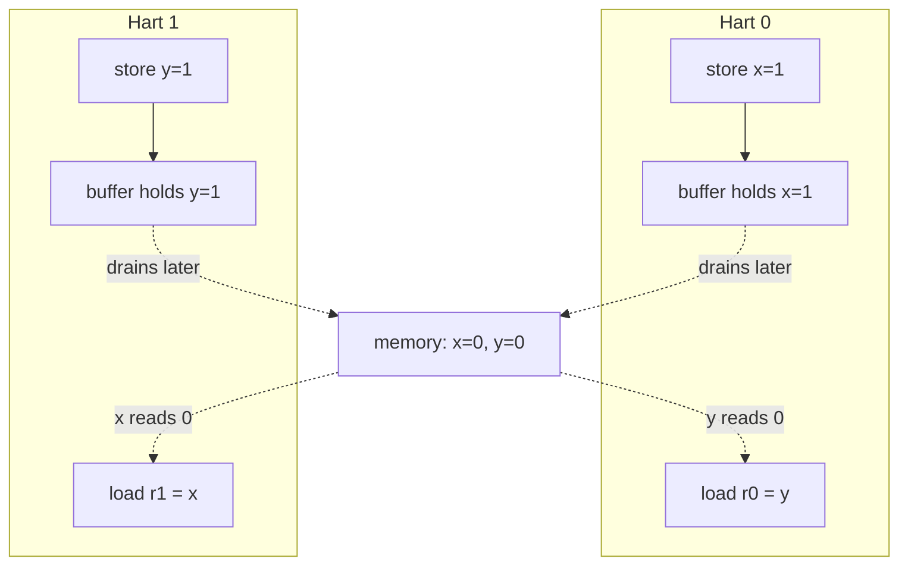
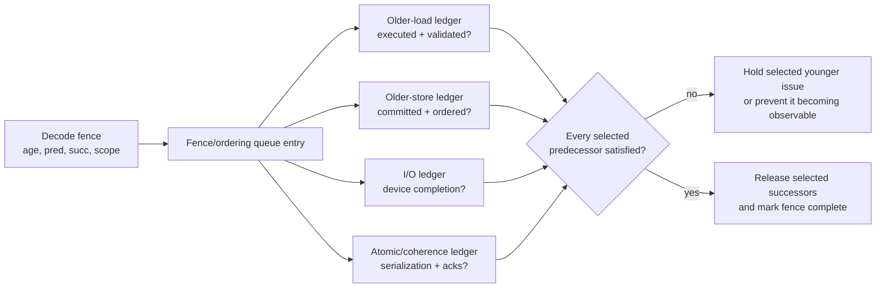
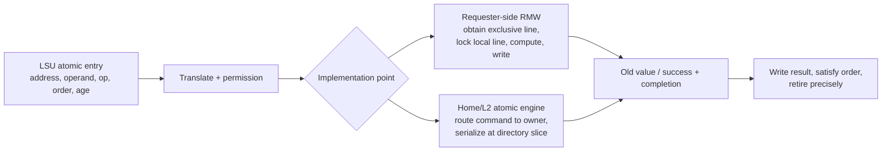
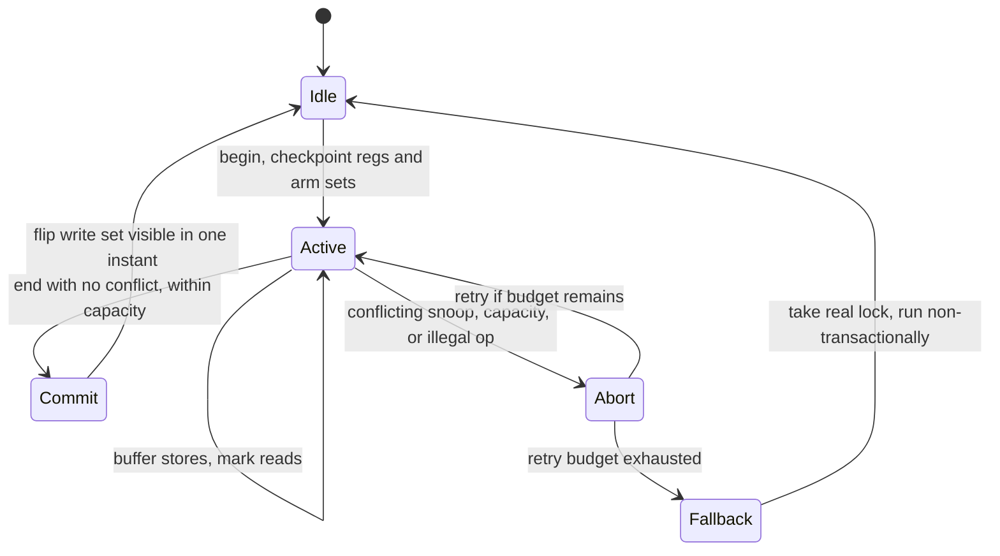

# Memory Consistency and Atomic Operations — Which Cross-Core Observations Are Legal?

> **First-time reader orientation:** Coherence concerns copies of one address; memory consistency constrains the order in which cores may observe accesses to different addresses. An atomic operation performs a read-modify-write indivisibly for synchronization. Litmus tests are tiny concurrent programs used to expose which observations a model permits, and fences forbid selected reorderings.

> **Abbreviation key — skim now and return as needed:** central processing unit (CPU); instruction set architecture (ISA); reduced instruction set computer (RISC); out-of-order (OoO); reorder buffer (ROB); load-store queue (LSQ); input-output memory management unit (IOMMU);
> quality of service (QoS); direct memory access (DMA); AXI Coherency Extensions (ACE); Coherent Hub Interface (CHI); Modified, Exclusive, Shared, Invalid (MESI).

> **Prerequisites:** [Cache Coherence](01_Cache_Coherence.md) (single-writer/multiple-reader permissions), [CPU Architecture](../01_Core_Foundations/01_CPU_Architecture.md) §9, and [Load-Store Unit](../03_Out_of_Order_Backend/02_Load_Store_Unit_and_Memory_Ordering.md).
> **Hands off to:** ISA/compiler synchronization rules, language memory models, and coherent fabrics. This page owns the hardware ordering contract and its microarchitectural consequences.

---

## 0. Why this page exists

Coherence guarantees a sensible order for writes to one cache line. Consistency constrains the order in which operations to **different** addresses may become visible. A coherent machine can still allow outcomes that surprise a programmer expecting sequential execution.


```mermaid
flowchart LR
    Program["program order"] --> Core["store buffer / OoO loads / speculation"]
    Core --> Cache["coherent cache hierarchy"]
    Cache --> Fabric["ordering points + interconnect"]
    Fabric --> Observe["legal cross-core observations"]
    Model["sequential consistency, SC<br/>total store order, TSO<br/>RISC-V weak memory ordering, RVWMO"] --> Core
    Model --> Fabric
    Fence["fences + acquire/release + atomics"] --> Core
    Fence --> Fabric
```

The central design bargain is to permit reorderings that improve performance while providing explicit operations that recover the order software needs.

## Before the details: permissions and observation order are separate

Cache coherence answers who may read or write one cache line and ensures writes to that line eventually agree. Memory consistency answers a broader software question: if one core accesses address X and then address Y, which orders may another core observe? Store buffers, speculative loads, and nonblocking caches can change observation order without violating single-address coherence.

A **litmus test** reduces the question to a few loads and stores on two or more cores, then asks whether a specific result is legal. Sequential consistency is the intuitive model in which all operations fit one total order consistent with each thread’s program order. Real architectures often allow more reordering for performance and provide fences and ordered atomic operations when software needs stronger synchronization.

**Beginner checkpoint:** an atomic operation is not merely a load followed by a store. Other agents must not interleave a conflicting operation between its read and write, and its ordering strength must be defined. The event graphs below make those two obligations visible.

## 0.1 From a blocking core to a weakly ordered core—one optimization at a time

Use a blocking in-order memory path as the baseline. It issues the next memory operation only after the previous one reaches its required visibility point. Program order and observation order are then closely aligned, but a store miss can freeze the core for hundreds of cycles. The first repair is a **store buffer**: retire a checked store into an ordered queue and let the cache acquire ownership in the background.

That repair creates a new failure. A younger load to the same address could read stale cache data while its older value waits in the store buffer. The derived requirement is store-to-load forwarding: compare the load address and byte mask against every older buffered store and select the youngest matching bytes. A partially covered load merges forwarded bytes with cache bytes only if the implementation can prove both sources belong to the same logical access epoch.

Allowing a load to a *different* address to bypass the older store recovers performance, but it exposes the store-buffering outcome and therefore changes the architectural memory model. The ISA must either permit that ordering or provide an operation that closes it. A fence adds tracked obligations—not magic:


```mermaid
flowchart TD
    B["blocking memory path"] -->|"store miss stalls retirement"| SB["ordered store buffer"]
    SB -->|"same-address load could see stale cache data"| FWD["age + address + byte-mask forwarding"]
    FWD -->|"different-address load can become visible first"| MM["documented relaxed ordering"]
    MM -->|"software needs publication/order"| F["fence or acquire/release obligation tracker"]
    F -->|"miss latency still hides independent loads"| SPEC["speculative load issue + validation + replay"]
    SPEC -->|"hot synchronization line serializes"| AT["atomic serialization + scalable software data structure"]
```

For each load, the LSQ therefore needs an age, address-valid bit, byte mask, execution/completion state, source (forward/cache), observed coherence version or invalidation status, and replay cause. For each store, it needs age, address-valid and data-valid bits, byte mask/data, retirement state, coherence request state, and visibility/acknowledgement state. Fence state records its predecessor and successor classes and whether every required predecessor has reached the ISA-defined ordering point. The ROB prevents a replayed speculative load from becoming a committed architectural event.

### Concrete trace: publish data, then a flag

The producer executes `data=42; release flag=1`; the consumer executes `acquire load flag; load data`. Suppose `data` misses in the producer's cache while `flag` could hit. Without release tracking, `flag=1` can become observable first and the consumer can read old `data=0`.

```wavedrom
{ "signal": [
  { "name": "P:data_store_retire", "wave": "01.0........" },
  { "name": "P:data_ordered",      "wave": "0....1......" },
  { "name": "P:release_flag",     "wave": "0.1..|.10..." },
  { "name": "C:acquire_flag",     "wave": "0.......10.." },
  { "name": "C:data_load",        "wave": "0.........10" },
  { "name": "C:observed_data",    "wave": "x.........=.", "data": ["42"] }
] }
```

The release store may allocate early, but its visibility permission remains blocked while the older `data` store's obligation is outstanding. When `data` reaches the required coherence ordering point, the tracker clears that bit and permits `flag` to become visible. On the consumer, seeing the acquire value can unblock younger loads; an implementation may execute them earlier only if it retains enough state to validate and replay them before retirement.

Now inject an invalidation for `data` after the consumer speculatively reads it but before the acquire is resolved. A conservative core delays the data load. An aggressive core marks the completed load as exposed to the invalidation and, if the acquire later establishes an ordering edge that makes the old observation illegal, kills the dependent instruction slice and replays from the load. The repair path must clear destination readiness, cancel or generation-tag dependent wakeups, preserve older retired state, and prevent the first value from reaching retirement or an external side effect.


```mermaid
sequenceDiagram
    participant ROB as ROB / retirement
    participant LSQ as LSQ + store buffer
    participant L1 as coherent L1
    participant H as home / ordering point
    ROB->>LSQ: retire data=42 into store entry S0
    LSQ->>L1: acquire write permission for data
    ROB->>LSQ: release flag=1 with predecessor set {S0}
    L1->>H: ownership/data transaction
    H-->>LSQ: data store reaches required ordering point
    LSQ->>LSQ: clear release predecessor bit
    LSQ->>H: publish flag=1
    H-->>LSQ: release ordered
    LSQ-->>ROB: release may retire/complete per ISA contract
```

### Concrete trace: atomic increment under contention

For `atomic_fetch_add(counter,1)`, ownership of the cache line is not enough unless one point serializes the read and write. A cache-based design obtains exclusive permission, locks or reserves the line against conflicting local operations, reads the old value, computes and installs the new value, marks the atomic's serialization point, then releases the response. A home-node atomic instead performs the operation at the directory/memory-side engine, trading requester hops for less line movement.

Retry needs identity. A coherence retry or link retransmission may repeat transport, but it must not apply the increment twice. Carry a requester/transaction identifier until the response is durably matched; at the serialization engine, retain enough active or recently completed identity state to distinguish retry from new work according to the protocol. Cancellation after serialization cannot pretend the write never happened: it may suppress a requester result only under a defined fault contract, while global memory still contains the new value.

The PPA and losing cases follow from the state. A wider store buffer hides longer misses but expands associative forwarding and age selection; more speculative loads increase validation bits, replay bandwidth, and wasted work; a universal full drain for every fence is simple but destroys performance; a fine-grained obligation matrix saves cycles but costs comparisons and proof complexity. Report store-buffer occupancy/full time, forwarded bytes, unknown-address stalls, violation/replay causes, fence wait broken down by obligation, atomic ownership/serialization/queue time, and invalidations that intersect speculative loads. Verify with ISA-generated litmus outcomes and microarchitectural assertions together: litmus tests prove only allowed observations, while assertions prove killed work and retries cannot leak extra architectural events.

## 1. Events and relations

Reason about dynamic memory events rather than source lines:

- load, store, atomic read-modify-write;
- address, value, size, byte mask, hart/thread;
- program order (`po`) within a hart;
- reads-from (`rf`): which store supplied a load;
- coherence/write order (`co`) per location;
- from-read (`fr`): load to later store in per-location order;
- preserved program order and fence/order relations.

A memory model defines which cycles or combinations of these relations are forbidden. The model is not “the order the cache sees requests”; speculative requests may be issued and replayed without becoming architectural events.

## 2. Sequential consistency as the reference point

Sequential consistency (SC) requires one total order of all memory operations that preserves each thread's program order. Every load reads the latest preceding store to that address in that total order.

SC is easy to explain and expensive to implement literally. Store buffers, nonblocking caches, speculative loads, and distributed interconnects naturally allow operations to complete/propagate in different orders.

An implementation may execute aggressively internally and still implement SC if it validates/repairs before retirement/visibility. The constraint is on architecturally observable results, not internal issue order.

## 3. Store buffering litmus test

Initially `x=y=0`:

| Hart 0 | Hart 1 |
|---|---|
| `x = 1` | `y = 1` |
| `r0 = y` | `r1 = x` |

Outcome `r0=0, r1=0` is forbidden under SC: no single total order can place both loads before the other hart's store while preserving both local store→load orders (the two program-order edges and the two load-before-store edges close the cycle $x{=}1 \rightarrow r0{=}y \rightarrow y{=}1 \rightarrow r1{=}x \rightarrow x{=}1$). It is allowed by models that permit a later load to bypass an earlier store to a different address, as ordinary store buffers do.

To decode that cycle, name its two edge kinds. A store→load arrow *inside one hart* (`x=1 → r0=y`, and `y=1 → r1=x`) is **program order** (`po`). A load→store arrow *across harts* (`r0=y → y=1`, and `r1=x → x=1`) is **from-read** (`fr`): the load observed memory *before* that store took effect, so it sits earlier in coherence order. SC forbids any cycle in $po \cup fr$, and these four edges close exactly one — so no legal total order exists.

**How a store buffer produces `0/0`.** Each store parks in its own hart's store buffer and drains to coherent memory later; each load goes to memory immediately. Interleave so both loads run before either buffer drains:

| step | Hart 0 | Hart 1 | memory |
|---|---|---|---|
| 1 | `x=1` enters SB0 | — | `x=0, y=0` |
| 2 | — | `y=1` enters SB1 | `x=0, y=0` |
| 3 | `r0=y` reads **0** | — | `x=0, y=0` |
| 4 | — | `r1=x` reads **0** | `x=0, y=0` |
| 5 | SB0 drains | SB1 drains | `x=1, y=1` |

Neither load sees the other's store because that store is still private in a buffer — the store→load edge *to a different address* is exactly what TSO leaves unordered. This is the microarchitectural realization of the `fr` edges above.


```mermaid
flowchart TB
    subgraph H0 ["Hart 0"]
        A0["store x=1"] --> B0["buffer holds x=1"]
        C0["load r0 = y"]
    end
    subgraph H1 ["Hart 1"]
        A1["store y=1"] --> B1["buffer holds y=1"]
        C1["load r1 = x"]
    end
    B0 -. "drains later" .-> M["memory: x=0, y=0"]
    B1 -. "drains later" .-> M
    M -. "y reads 0" .-> C0
    M -. "x reads 0" .-> C1
```

A full fence between each store and load forbids that bypass/visibility outcome. A fence is therefore an ordering edge, not a “flush all caches” instruction. Concretely, the fence makes each hart's store drain to memory before that hart's load may issue; the two stores can no longer both be buffered when the loads read, so at least one load observes a `1` and `0/0` cannot occur.

## 4. Common hardware model shapes

| Model shape | Typical preserved orders | Performance implication |
|---|---|---|
| SC | all load/store program order | simplest software reasoning; strongest hardware validation |
| TSO-like | generally preserves load→load, load→store, store→store; relaxes store→load to different address | store buffer hides write latency |
| weak/release consistency | many orders relaxed unless dependency/fence/acquire/release constrains them | greatest implementation/compiler freedom |
| RVWMO | weak model with explicit preserved program-order rules, dependencies, fences, and atomics | permits aggressive RISC-V cores while specifying portable synchronization |

Precise rules belong to each ISA specification; labels like “weak” are not interchangeable. Whether dependencies order accesses, whether stores are multi-copy atomic, and which fence bits apply can differ.

## 5. Message-passing litmus test

Initially `data=0, flag=0`:

| Producer | Consumer |
|---|---|
| `data = 42` | `r0 = flag` (acquire) |
| `flag = 1` (release) | if `r0==1`, `r1=data` |

Release orders earlier producer operations before the flag publication; acquire orders later consumer operations after observing it. If the consumer reads `flag=1`, it must see `data=42` under the synchronization contract.

In C11 the pair uses explicit memory orders on the flag; `data` stays a plain access because the release/acquire edge is what orders it:

```c
// Producer
data = 42;                                             // plain store
atomic_store_explicit(&flag, 1, memory_order_release); // publishes data first

// Consumer
if (atomic_load_explicit(&flag, memory_order_acquire)) // observes the release
    use(data);                                         // guaranteed to read 42
```

The `release` forbids `data=42` from sinking past the flag store; the matching `acquire` forbids the `use(data)` load from hoisting above the flag load. Weaken either to `memory_order_relaxed` and the edge breaks — the consumer may then see `flag=1` with stale `data=0`.

Microarchitecturally, release may wait until older stores reach the required ordering point before making the release store observable. Acquire may prevent younger loads from becoming irrevocably ordered before the acquire result. It need not stop all speculative execution if violations can be detected and repaired.

## 6. Store buffers and load speculation

A store buffer lets retirement continue while committed stores wait for cache/coherence service. Loads search older stores for forwarding, then may access cache ahead of buffered stores to other addresses.

Correctness requirements:

- same-address load gets the youngest older store's value;
- store→store visibility order is preserved when the model requires it;
- fences wait for the defined subsets/order points;
- speculative loads are replayed if older unknown stores alias;
- coherence invalidations or snoops trigger required load validation;
- device/strongly ordered accesses bypass relaxed normal-memory rules.

Load-load reordering can occur when a younger cache hit returns before an older miss. If the model preserves their order, the core can delay retirement/observation or detect external events that make early execution illegal.

## 7. Multi-copy atomicity and propagation

A write is multi-copy atomic when it becomes visible to all observers at one conceptual point rather than propagating to different observers at different times. Directory/home serialization and invalidate acknowledgements often support such a point, but protocol details matter.

Non-multi-copy-atomic behavior complicates tests such as independent reads of independent writes (IRIW), where two readers observe writes in different orders. Some models constrain propagation through cumulative fences: a hart that observes another write and then publishes a flag can carry ordering to third parties.

Do not infer consistency solely from MESI state. A line may be coherent while writes to two lines reach observers in relaxed orders.

## 8. Fences are parameterized ordering operations

A fence is not “flush the cache.” It creates selected **before → after** edges between memory events. In RISC-V, `FENCE pred,succ` independently selects predecessor and successor classes from read (`R`), write (`W`), device input (`I`), and device output (`O`). For example, a write-to-write fence orders earlier stores before later stores without necessarily waiting for unrelated earlier loads. Other ISAs encode common acquire, release, full-system, load-only, store-only, or device-shareability combinations rather than exposing the same bit fields.

Keep four different actions separate:

| Operation | What it guarantees | What it does **not** necessarily do |
|---|---|---|
| compiler barrier | constrains compiler motion | emit a hardware ordering instruction |
| acquire/release operation | one-sided ordering around one load/store/RMW | order unrelated operations in both directions |
| architectural fence | orders named event classes in a named domain | write dirty cache lines to DRAM |
| cache/translation/instruction maintenance | changes cache, TLB, or instruction visibility | replace the ISA memory-order edge |

An instruction-cache synchronization operation such as RISC-V `FENCE.I`, a TLB invalidation sequence, and a data-memory fence therefore have different completion ledgers even if a simple core serializes all three.

### 8.1 Turn the ISA sentence into obligations

At decode, convert a fence into a fence micro-operation carrying:

```text
rob_age
pred_mask = {R,W,I,O}
succ_mask = {R,W,I,O}
scope/domain
strength = acquire | release | acq_rel | sequentially-consistent
instruction/translation/cache-maintenance subtype
epoch
```

The fence's age divides memory operations into older predecessors and younger successors. An implementation then defines an **ordering point** for every class. Examples are “load value is irrevocably validated,” “store has reached the coherence serialization point,” “MMIO write response has returned from the device domain,” and “all invalidation acknowledgements have arrived.” “Request left the LSU” is usually too early; “data reached DRAM cells” is usually unnecessarily late.


```mermaid
flowchart LR
    D["Decode fence<br/>age, pred, succ, scope"] --> FQ["Fence/ordering queue entry"]
    FQ --> OL["Older-load ledger<br/>executed + validated?"]
    FQ --> OS["Older-store ledger<br/>committed + ordered?"]
    FQ --> IO["I/O ledger<br/>device completion?"]
    FQ --> AT["Atomic/coherence ledger<br/>serialization + acks?"]
    OL --> DONE{"Every selected<br/>predecessor satisfied?"}
    OS --> DONE
    IO --> DONE
    AT --> DONE
    DONE -- "no" --> HOLD["Hold selected younger issue<br/>or prevent it becoming observable"]
    DONE -- "yes" --> REL["Release selected successors<br/>and mark fence complete"]
```

The ledger can be implemented with age comparisons over load/store queues, snapshot counters, sequence numbers, or per-domain outstanding counters. A useful counter scheme snapshots the number of relevant operations accepted before the fence and advances a completion sequence only when holes close; a simple count alone is unsafe if completions reorder.

### 8.2 A practical fence state machine

A conservative but understandable implementation is:

1. **allocate:** insert the fence in the reorder buffer (ROB) and ordering queue;
2. **stop selected successors:** prevent younger operations in `succ_mask` from passing the fence;
3. **wait for retirement eligibility:** all older instructions are non-faulting, so stores counted by the fence cannot later be killed;
4. **drain/validate selected predecessors:** wait for required load validation, store-buffer serialization, atomic completion, and I/O acknowledgements;
5. **perform special maintenance:** for an instruction/TLB/cache-maintenance subtype, issue the required invalidates and wait for their acknowledgements;
6. **complete and retire:** advance the fence epoch and release the selected successors.

```text
IDLE -> ALLOCATED -> WAIT_OLDER_SAFE -> WAIT_ORDER_POINTS
     -> [WAIT_MAINTENANCE] -> COMPLETE -> IDLE
```

This state machine needs explicit handling for squash, trap, reset, and debug halt. A squashed fence cannot release a successor from a newer epoch. An interrupt may be taken before the fence retires only if the implementation can preserve precise state and later re-execute the fence; it cannot silently declare its obligations complete.

The conservative design blocks successor issue. A higher-performance design may execute younger loads speculatively, but it must not let them create an architecturally visible result forbidden by the fence. It retains their load-queue entries, snoop-validation state, and replay path until the fence completes.

### 8.3 Store-buffer draining: “accepted” is not “visible”

Suppose a release store publishes a flag after two ordinary stores:

```text
S0: data[0] = A
S1: data[1] = B
R : flag    = 1    // release
```

It is insufficient for `S0` and `S1` merely to occupy the store buffer. The release store must not become visible before the two data stores reach the ordering point required by the ISA and shareability domain. The store buffer can attach a monotonically increasing sequence:

| Entry | Sequence | Committed | Ownership/data accepted | Globally ordered |
|---|---:|---:|---:|---:|
| `S0` | 40 | yes | yes | yes |
| `S1` | 41 | yes | pending | no |
| release `R` | 42 | yes | not issued | no |

`R` remains blocked until the contiguous ordered sequence reaches 41. If stores to different cache lines issue out of order internally, a completion bitmap plus a “highest contiguous completed sequence” prevents a younger completion from hiding an older hole.

For a write-back cache, globally ordered does **not** mean the line has been written to DRAM. It normally means the coherence system has established the write's architecturally required visibility/ownership point. For noncoherent memory or MMIO, the point may instead be a bridge, device, or explicit completion response.

### 8.4 Acquire, release, full, and sequentially consistent forms

- A **release** prevents selected earlier events from appearing after the release operation. It commonly constrains the store buffer before the release publication.
- An **acquire** prevents selected later events from appearing before an observed acquire. Younger loads may execute speculatively only if the core can validate/replay them.
- An **acquire-release** RMW applies both sides around one atomic serialization point.
- A **sequentially consistent (SC)** operation participates in the language/ISA's stronger global ordering rules. Implementations often need an SC-order token, a sufficiently strong fence pattern, or a serialization point shared by SC operations—not merely local queue draining.

Do not implement these names by folklore. Start from the precise ISA preserved-program-order and propagation requirements, then prove the selected microarchitectural actions imply them. RISC-V's `aq`/`rl` bits, Arm load-acquire/store-release instructions, and x86 locked operations have different architectural wording even when source-language compilers use them for similar C/C++ constructs.

### 8.5 Scope and cumulativity

Ordering has a domain: one core, one coherence cluster, all coherent agents, or the system including devices. A narrow-scope fence can complete at a local point; a system-scope fence may need traffic to cross the last-level cache, I/O coherence point, or bridge.

A **cumulative** fence may also carry forward observations made by this hart. In a three-party handoff, hart B reads data written by hart A, executes a cumulative fence, then publishes to hart C. The system must not let C observe B's publication while missing the A data that B carried forward. This is why the fence controller needs domain/protocol knowledge rather than only an empty local store buffer.

### 8.6 Fence performance without weakening semantics

Safe optimizations include:

- implement predecessor/successor masks rather than treating every fence as full;
- snapshot sequence numbers so the fence waits only for older operations;
- let unrelated arithmetic and provably safe memory operations execute;
- combine adjacent compatible fences before either has taken effect;
- keep separate ordering domains so network/storage traffic does not delay an unrelated GPU or CPU domain;
- expose memory synchronization domains or traffic classes when the architecture permits;
- complete at the earliest architecturally sufficient ordering point.

Performance counters should distinguish time waiting for retirement, load validation, store-buffer holes, ownership/invalidation acknowledgements, MMIO, atomics, and translation/cache maintenance. “Fence stalls” alone cannot identify the fix.

### 8.7 Fence design and verification checklist

- Is each ISA fence encoding decoded to the correct predecessor, successor, scope, and strength?
- Is the ordering point for cacheable memory, noncoherent memory, and device I/O named?
- Can an older operation still fault, replay, or be killed after the fence considers it complete?
- Are split accesses and bridge-generated child transactions all counted?
- Does completion wait for holes rather than just the number of responses?
- Are speculative younger loads retained and invalidated/replayed when required?
- Do reset epochs prevent stale acknowledgements completing a new fence?
- Does a system-scope fence include DMA/device/coherence traffic required by the contract?

Assertions should state the architectural consequence: if a fence retires, no selected successor can be observed before any selected predecessor. Internal “queue empty” assertions are supporting facts, not the specification.

Over-implementing every fence as a full pipeline and cache drain may be correct but extremely slow. Under-implementing one produces rare failures that appear only with the right cache misses, snoops, bridge buffering, and compiler motion.

## 9. Atomics and their serialization point

An atomic read-modify-write (RMW) reads a value and conditionally or unconditionally writes a new value without an intervening write to the atomicity granule. **Atomicity and ordering are separate:** a relaxed atomic still has an indivisible per-location RMW, while acquire/release/SC qualifiers add cross-location edges.

The architectural operand may be one byte, word, or doubleword; the coherence ownership granule may be an entire cache line. The specification must define supported alignment, crossing behavior, byte enables, sign extension, fault atomicity, and the interaction of smaller overlapping atomics. Never silently split an architecturally atomic operand into two independently visible bus transactions.

### 9.1 Choose the serialization location


```mermaid
flowchart LR
    LSU["LSU atomic entry<br/>address, operand, op, order, age"] --> TLB["Translate + permission"]
    TLB --> CHOOSE{"Implementation point"}
    CHOOSE --> L1["Requester-side RMW<br/>obtain exclusive line,<br/>lock local line, compute, write"]
    CHOOSE --> HOME["Home/L2 atomic engine<br/>route command to owner,<br/>serialize at directory slice"]
    L1 --> RESP["Old value / success + completion"]
    HOME --> RESP
    RESP --> ROB["Write result, satisfy order,<br/>retire precisely"]
```

1. **Requester-side atomic:** acquire exclusive ownership, prevent local eviction/snoop intervention during the RMW interval, read the line, execute the operation, update ECC/data, then unlock. This reuses the L1 datapath but may move a hot line among requesters.
2. **Home-node atomic:** route an atomic command to the address's home/L2 slice, serialize it in an atomic queue, fetch or recall the current data, compute/update there, and return the old value. This avoids ownership ping-pong for some traffic but adds operation hardware, queues, and protocol states at every home.

“Lock the bus” is neither necessary nor scalable. The real requirement is one serialization point for conflicting operations plus protocol exclusion around it.

A useful atomic entry holds:

```text
ROB age and destination tag
virtual/physical address and byte mask
operation and source operand(s)
ordering strength and scope
translation/protection status
coherence transaction ID and retry epoch
old value, computed value, compare result
exclusive/line-lock/serialization ownership
exception, poison, and completion state
```

The entry stays alive until the result is safe to publish, all architecturally required ordering obligations are satisfied, and a precise exception can no longer replace it.

### 9.2 AMOs / fetch operations

For fetch-add, swap, bitwise, signed/unsigned min/max, or another atomic memory operation (AMO), the serialization engine performs:

1. translate and check the complete operand before changing memory;
2. acquire exclusive authority or enter the home atomic queue;
3. read and ECC-check the old operand;
4. compute `new = f(old, source)` in a narrow integer datapath;
5. merge enabled bytes, regenerate ECC, and commit the line update;
6. return `old` to the destination register;
7. satisfy release before, acquire after, or SC obligations;
8. release the line/queue entry.

Only step 5 is the memory update, but the indivisible interval includes whatever protocol exclusion is needed to ensure no conflicting observer can intervene between steps 3 and 5. A retry response before serialization is harmless; retrying after an update without a duplicate-suppression rule would apply an increment twice. Protocols therefore need a clear “not performed / performed” boundary, unique request identity where replay exists, or a rule that completed non-idempotent atomics are never blindly retried.

### 9.3 Compare-and-swap

Compare-and-swap (CAS) writes only when the observed value equals the expected value. The read, comparison, and conditional write share one serialization interval:

```text
old = memory[address]              // while holding atomic authority
match = (old == expected)
if match: memory[address] = desired
return old and/or match
```

On comparison failure, no data update occurs, but the operation was still an atomic read and may still carry acquire semantics. The cache controller must not generate a dirty write merely because the CAS command reached an exclusive state; update/ECC/dirty bits are gated by `match`.

Why one conditional primitive suffices: *any* read-modify-write can be built as a CAS **retry loop** — read the current value, compute a new one, and swap it in only if nothing changed underneath. On failure CAS reloads the current value into `cur`, so the loop simply recomputes and retries:

```c
// atomic "multiply by 3" — no native AMO for it — via a CAS loop
uint64_t cur = atomic_load_explicit(&v, memory_order_relaxed);
uint64_t next;
do {
    next = cur * 3;                       // arbitrary RMW computed from cur
} while (!atomic_compare_exchange_weak_explicit(
    &v, &cur, next,                       // fail path writes current v into cur
    memory_order_acq_rel, memory_order_relaxed));
```

The `_weak` form may fail spuriously, which is harmless inside a loop. A caveat CAS shares with all value-comparison: it cannot tell `A → B → A` from "never changed" (the *ABA* problem), because it inspects only the value, not the history.

### 9.4 Load-reserved/store-conditional

Load-reserved (LR) establishes a reservation; store-conditional (SC) succeeds only if it remains valid. A reservation monitor is explicit hardware state, not a lock held from LR to SC:

| Reservation field | Purpose |
|---|---|
| valid | whether an SC is eligible |
| physical address/tag | location or reservation granule |
| size/byte range | overlap check |
| hart/thread/context identity | prevents one context using another's reservation |
| coherence/reset epoch | rejects stale completions |
| optional version | detects a conflicting write event |

LR behaves like a load and records the reservation after translation. The cache/coherence system sends conflicting write/invalidate/evict events to the monitor. SC translates again, checks address/context/reservation, and conditionally enters the atomic update path. Whether SC succeeds must be decided at a point that cannot race with a conflicting coherence write.

Common reservation-clearing events include:

- a conflicting coherent write or invalidation to the reservation granule;
- eviction, replacement, or loss of monitored coherence state;
- another LR/SC as specified by the ISA;
- trap return, context switch, debug, reset, or explicit software action;
- implementation events explicitly allowed by the architecture.

Spurious SC failure is permitted by some architectures, but constrained LR/SC loops receive forward-progress guarantees. Hardware should record failure causes—conflict, eviction, context, address mismatch, resource/retry, or spurious—because a single failure counter cannot distinguish real sharing from a broken monitor.

The same optimistic retry loop as §9.3, but keyed on the reservation rather than a compared value:

```asm
retry:
    lr.w   t0, (a0)      # load-reserved: read *a0, arm a reservation
    addi   t0, t0, 1     # compute new value
    sc.w   t1, t0, (a0)  # store-conditional: t1 = 0 on success, nonzero if lost
    bnez   t1, retry     # reservation broken -> retry
```

Because SC fails on *any* intervening write to the reserved granule — not just a net value change — LR/SC sidesteps the ABA problem that trips CAS: an `A → B → A` sequence still clears the reservation and forces a retry. The cost is the reservation-granularity and forward-progress constraints above.

### 9.5 Ordering qualifiers around the serialization point

Represent the atomic as three conceptual events:

```text
[release obligations] -> [per-location serialization/update] -> [acquire obligations]
```

- relaxed: only the middle event;
- release: selected older operations reach their ordering points before the middle event;
- acquire: selected younger operations cannot become observably ordered before the returned atomic event;
- acquire-release: both;
- sequentially consistent: both plus participation in the architecture/language's SC-order constraints.

The LSU can reuse the fence ledger from §8. Release-qualified atomics wait for the predecessor snapshot before requesting serialization; acquire-qualified atomics hold or validate younger successors until the atomic response and required scope event. This sharing avoids two subtly different definitions of “ordered.”

### 9.6 Contention, fairness, and forward progress

A contended cache line is a serial server. With service time $S$ and average queue depth $q$, the best-case throughput is about $1/S$, while request latency grows with queueing. More requesters do not create more per-line bandwidth.

Hardware mechanisms include:

- a FIFO or age-based home atomic queue;
- fair ownership arbitration rather than repeated victory by the nearest core;
- negative acknowledgement with randomized/exponential backoff;
- combining only when the ISA result permits it—ordinary fetch-add returns a distinct old value to each requester, so combining must reconstruct those results exactly;
- line-local throttling so one hot address does not consume every miss-status or response entry;
- priority inheritance or bounded service for synchronization used by real-time agents.

Livelock tests must include two or more requesters losing ownership repeatedly, snoop pressure, replacement, and a nearly full response network. Fair router arbitration is not enough if the cache controller continually rejects the same atomic.

### 9.7 Precise faults, cancellation, and reset

Perform translation, alignment, access permission, and supported-size checks before the memory update. An uncorrectable data error, bus error, or page fault must have an architectural outcome defined by the ISA/platform; the design must never update memory and then report the operation as unperformed.

Once an atomic passes its no-return serialization/update point, a pipeline squash cannot cancel the memory effect. Therefore the core normally waits until the atomic is the oldest safe instruction before allowing the irreversible update, or retains enough retirement state to guarantee that it will commit. Responses carry transaction and reset epochs so an old completion cannot update a newly reused ROB destination.

### 9.8 Atomic verification plan

Use reference-model and adversarial tests:

- all operation/size/alignment/byte-mask cases, including signed min/max boundaries;
- two atomics to the same operand and overlapping subwords;
- atomic versus ordinary loads/stores and cache-line eviction;
- CAS success/failure and “failure must not dirty data”;
- LR/SC conflicts at every cycle, granule boundaries, traps, context switches, and forward-progress loops;
- acquire/release message-passing litmus tests around successful and failed operations;
- retries, duplicate responses, poison/ECC, reset, and backpressure;
- home/requester races, invalidation acknowledgements, and two physical aliases.

Core assertions:

```text
no two successful conflicting RMW intervals overlap
each successful RMW returns the value immediately preceding its serialization point
failed CAS/SC performs no memory update
an atomic memory update occurs at most once per architectural instruction
SC success implies a valid matching reservation with no intervening conflict
retired acquire/release/SC atomics have satisfied the §8 ordering ledger
```

An atomic's latency includes ownership acquisition, invalidations, operation, acknowledgement, and ordering drains:

$$
L_{atomic}=L_{route}+L_{serialize}+L_{snoop/invalidations}+L_{op}+L_{response}+L_{order}.
$$

Contention turns the cache line into a serial queue; throughput approaches the inverse service time regardless of core count.

## 10. Compiler and language boundary

Hardware orders dynamic machine instructions. Languages define races and atomic semantics at source level; compilers map them to ISA operations. A hardware fence cannot repair a compiler that removed/reordered unsynchronized source accesses, and a compiler barrier alone cannot order hardware visibility.

Correct synchronization requires the full chain:

$$
\text{language model}\rightarrow\text{compiler mapping}\rightarrow\text{ISA model}\rightarrow\text{microarchitecture}\rightarrow\text{coherent fabric}.
$$

Architecture documentation should specify the ISA contract and implementation reasoning without claiming that ordinary data races are portable language synchronization.

## 11. Device memory and I/O ordering

Memory-mapped registers can have side effects, reject speculative reads, require access size/order, or represent doorbells. Attributes distinguish normal cacheable memory from device/strongly ordered memory.

Common producer sequence for a DMA device:

1. write descriptors in normal memory;
2. ensure descriptor writes reach the device-visible domain;
3. write device doorbell;
4. device reads descriptors.

The required barrier orders normal stores before I/O. Cache maintenance may also be required for noncoherent devices. Treating the doorbell as an ordinary write risks the device observing a command before its data.

## 12. Verification with litmus tests and formal models

Directed litmus tests cover store buffering, message passing, load buffering, IRIW, publication, atomics, and fence combinations. Random generators explore longer interactions. Outcomes should be checked against an executable axiomatic/operational model, not intuition.

Microarchitectural assertions:

- forwarding returns youngest older same-address bytes;
- preserved program-order edges cannot become observably inverted;
- completed fences have satisfied all specified predecessor/successor obligations;
- atomic serialization is unique and indivisible;
- invalidated speculative loads are replayed when required;
- device accesses obey attributes and are not speculated illegally;
- killed requests cannot create architectural ordering events.

## 13. Performance counters

- store-buffer occupancy/full cycles and drain latency;
- loads bypassing older stores, predicted dependencies, violations, replays;
- fence count and stall cycles by predecessor/successor class;
- atomic latency, retries, ownership transfers, and contention depth;
- coherence invalidations hitting speculative/completed loads;
- device-ordering drains;
- LR/SC success/failure causes.

An average atomic latency is insufficient; report by line sharing and contention because one hot lock dominates tails.

## 14. Numbers to remember

- Coherence orders writes per line; consistency constrains observations across addresses.
- Store buffering commonly relaxes store→load ordering to different addresses.
- Acquire/release creates a publication chain without requiring every operation to be SC.
- A fence orders specified event classes; it is not synonymous with flushing caches.
- Atomics need one serialization point plus any acquire/release ordering.
- Language, compiler, ISA, core, and fabric must all preserve the synchronization contract.
- Hardware transactional memory (HTM) commits a group of memory ops atomically and detects conflicts with the coherence protocol; it beats a lock only while the abort rate stays under $(o_\ell-o_x)/(o_\ell+C_a)$, and forward progress still requires a non-transactional fallback.

## 15. Worked problems

### Problem 1 — store-buffer outcome

In the store-buffering test, both loads reading zero is possible if each load bypasses its hart's older buffered store and runs before the other store is visible. Adding store→load fences on both harts creates a cycle that forbids the outcome.

### Problem 2 — contended atomic throughput

An atomic increment on one line takes 80 ns including ownership transfer. Even with 64 requesters, ideal serialization-limited throughput is at most

$$
1/(80\ \text{ns})=12.5\ \text{M operations/s}.
$$

More cores increase queueing, not the line's service rate. Sharding counters or combining updates changes the algorithmic bottleneck.

### Problem 3 — fence cost

A release operation waits for six older stores. Four are already globally ordered; two take 35 and 60 cycles in parallel. Incremental drain cost is about 60 cycles, not $6\times$ average store latency. The implementation should track outstanding obligations, not serialize every store anew.

## 16. Hardware transactional memory and lock elision

Section 9 gave a single atomic read-modify-write one serialization point. A lock generalizes that to a *region*: acquire, run a critical section, release. Hardware transactional memory (HTM) generalizes it a different way — it lets a *group* of loads and stores commit at one instant, all-or-nothing, so the region runs speculatively and pays only for the conflicts that actually occur.

### 16.1 Why elide the lock at all

A lock is both an overhead and a pessimism.

The overhead is fixed per critical section. Acquiring the lock is itself an atomic on a shared line, so it carries the full $L_{atomic}$ of §9 — ownership, serialization, and the acquire/release ordering drains — and under sharing the lock line ping-pongs between cores. Even an *uncontended* lock costs an atomic plus two fences on a line touched only to synchronize.

The pessimism is worse. A lock forbids concurrency the workload may never need. Two threads updating disjoint buckets of a hash table under one coarse lock never actually conflict, yet the lock serializes them anyway: it protects against the worst case (some pair *might* collide) and charges every case for it.

HTM removes both. It runs the critical section speculatively, uses the coherence protocol to watch for a real conflict, and commits atomically if none occurred. Disjoint-bucket updates then proceed in parallel; only a genuine collision costs anything.

### 16.2 Mechanism: §4's speculate/validate/recover, applied to a group

A transaction is the retirement discipline of the [retirement page](../03_Out_of_Order_Backend/03_Retirement_Recovery_and_Precise_State.md) — speculate, validate, then commit or else recover — lifted from one instruction to a *set* of memory operations that must retire together or not at all.

- **Read set / write set.** The transaction records every line it reads (read set) and every line it writes (write set). Speculative stores are *buffered* — held in the store queue or written into L1 in a speculative state — and are **not** made globally visible. Speculative loads are marked (a per-line read bit, or a hashed signature over addresses).
- **Conflict detection reuses coherence.** The conflict detector is already in the machine: the cache-coherence protocol (see [Cache Coherence](01_Cache_Coherence.md)). A remote snoop that would *invalidate* a read-set line, or *steal ownership* of a write-set line, is exactly a conflict — another agent is about to observe or clobber state this transaction depends on. This is §6's rule "coherence invalidations trigger required load validation," but the answer for a whole group is **abort**, not per-load replay.
- **Commit.** At transaction end the machine confirms no read/write-set line was lost, then atomically flips the buffered write set to globally visible and clears the speculative marks — one serialization instant, the group's retirement boundary. Before that instant no observer sees any write; after it, all of them.
- **Abort.** Discard the buffered write set, drop the read/write marks, restore the register checkpoint taken at transaction begin, and jump to the abort handler.


```mermaid
stateDiagram-v2
    [*] --> Idle
    Idle --> Active: begin, checkpoint regs and arm sets
    Active --> Active: buffer stores, mark reads
    Active --> Commit: end with no conflict, within capacity
    Active --> Abort: conflicting snoop, capacity, or illegal op
    Commit --> Idle: flip write set visible in one instant
    Abort --> Active: retry if budget remains
    Abort --> Fallback: retry budget exhausted
    Fallback --> Idle: take real lock, run non-transactionally
```

### 16.3 The three unavoidable abort causes

1. **Data conflict.** A read-set line is invalidated or a write-set line is stolen. This is the mechanism working as intended; it fires whenever two transactions — or a transaction and a plain access — genuinely race on a line.
2. **Capacity overflow.** The speculative write set must fit its buffer (an L1 set's ways, or the speculative store-queue depth), and the tracked read set must fit its marking resource (bits or signature). Once the footprint exceeds capacity there is nowhere to hold speculative state, so the transaction aborts regardless of conflicts. This is a hard ceiling, not a probability.
3. **Illegal / uncacheable operations.** A system call, a page fault, an uncacheable device access, an interrupt, or certain serializing register writes cannot be buffered or rolled back and force an abort. This is why no bounded HTM can promise that a given transaction ever commits.

### 16.4 When HTM wins — a break-even derivation

Let a critical-section body take $C$ cycles. Charge a lock $o_\ell$ per acquire+release (the atomic, the release store, the ordering drains, and — when shared — the lock-line transfer), and charge a transaction $o_x$ per begin+commit (checkpoint plus commit flip), with $o_x<o_\ell$ because there is no globally-ordered atomic on a contended line. Let $p_a$ be the per-attempt abort probability and $C_a\le C$ the work discarded on an abort.

An uncontended lock costs
$$
E[T_\ell]=o_\ell+C.
$$
Retrying transactionally until success, the number of *failed* attempts is geometric with mean $p_a/(1-p_a)$; each failed attempt costs $o_x+C_a$ and the successful one costs $o_x+C$:
$$
E[T_x]=(o_x+C)+\frac{p_a}{1-p_a}\,(o_x+C_a).
$$
HTM wins when $E[T_x]<E[T_\ell]$, i.e. when the abort tax is smaller than the overhead it saves:
$$
\frac{p_a}{1-p_a}\,(o_x+C_a)<o_\ell-o_x.
$$
Writing the saving $S=o_\ell-o_x$ and the per-abort cost $D=o_x+C_a$, the break-even is $\tfrac{p_a}{1-p_a}=S/D$, so
$$
p_a^\star=\frac{o_\ell-o_x}{o_\ell+C_a}.
$$
The reading is the whole point of HTM: the abort budget $p_a^\star$ grows with the lock overhead being elided. A cheap uncontended lock ($o_\ell\!\to\!o_x$) gives $p_a^\star\!\to\!0$ — HTM must almost never abort to be worth it. An expensive contended lock (large $o_\ell$ from cross-socket line bouncing) gives a large $p_a^\star$ — HTM wins even with frequent aborts. **HTM pays off in proportion to the contention it removes.**

The abort probability itself rises with conflict rate and footprint. Model remote conflicting accesses to the shared footprint as Poisson over the transaction's exposure window: with $n$ threads, footprint overlap $f=r/S$ (touched lines $r$ out of a shared set of $S$), and a conflicting-store duty factor $\rho$, the expected conflicts in one window are roughly
$$
\lambda\approx(n-1)\,\rho\,f\,C,\qquad p_{conf}=1-e^{-\lambda}.
$$
So HTM's region of advantage is $\lambda<\ln\frac{1}{1-p_a^\star}$: **short** transactions (small $C$), **narrow** footprints (small $r$), and **low** concurrency ($n$). Grow $C$ or $r$ and $\lambda$ climbs until either conflicts or the §16.3 capacity ceiling ends the party.

### 16.5 Worked number

Take a contended lock $o_\ell=120$, transaction overhead $o_x=25$, discarded work $C_a=50$ cycles. Then
$$
p_a^\star=\frac{120-25}{120+50}=\frac{95}{170}=0.56,
$$
so elision wins as long as under ~56 % of attempts abort. At a measured $p_a=0.20$ with $C=200$,
$$
E[T_\ell]=320,\qquad E[T_x]=225+\tfrac{0.20}{0.80}(75)=243.75,\qquad \text{speedup}=1.31\times.
$$
Now swap in a *cheap, uncontended* lock $o_\ell=30$. The break-even collapses to $p_a^\star=(30-25)/(30+50)=0.0625$ — HTM must abort under ~6 %. At the same $p_a=0.20$, $E[T_\ell]=230$ while $E[T_x]$ is unchanged at $243.75$, so the speedup is $0.94\times$, a **loss**. Same transaction, opposite verdict — decided by how much lock the elision actually removes. (The $p_a=0.20$ point corresponds to $\lambda=-\ln 0.8\approx0.22$; doubling either the thread count or $C$ drives $\lambda\to0.45$ and $p_a\to0.36$, straight through the cheap-lock break-even.)

### 16.6 Lock elision and the mandatory fallback

Lock *elision* is the productization: a library or the hardware *begins a transaction instead of taking the lock*, executes the region, and commits — the lock is never written in the common case, so its line never leaves shared state and disjoint critical sections run concurrently. The named implementations are Intel Transactional Synchronization Extensions (TSX), in two forms — Hardware Lock Elision (HLE) prefixes on a legacy lock, and Restricted Transactional Memory (RTM) with explicit begin/end/abort — Arm's Transactional Memory Extension (TME) with transaction start/commit/cancel, and IBM POWER's transactional-memory (TM) facility.

One correctness detail is non-negotiable: **the elided region must place the lock word in its read set** and verify the lock is free at begin. If any thread takes the *real* lock — writing the lock word — that write invalidates the lock line in every eliding transaction's read set and aborts them all. That single trick preserves mutual exclusion between an eliding thread and a non-eliding one; without it, a transaction could commit while another thread holds the lock.

And **forward progress requires a non-transactional fallback path.** Some transactions can never commit — a footprint that always overflows capacity, a critical section containing a system call, or a livelock of mutual aborts. After a bounded retry budget the thread stops eliding, acquires the *actual* lock, and runs non-transactionally. This guarantees progress and sets the semantics floor: correctness rests on the lock, never on the transaction succeeding. The price is the "lemming effect" — one fallback acquisition writes the lock and aborts every concurrent elider, so a burst of fallbacks can serialize the whole set; retry and back-off policy govern how often that happens.

### 16.7 Trade-off — when a plain lock or a lock-free structure wins

HTM turns pessimistic mutual exclusion into optimistic concurrency, so it wins on **short, narrow, low-conflict** critical sections guarded by **expensive** locks — exactly where §16.4 gives a large abort budget. A simpler option wins when:

- **The lock is cheap.** If $o_\ell\lesssim o_x$ (an uncontended test-and-set that stays local), the elision overhead plus any abort tax exceeds the lock — the §16.5 cheap-lock case. Just take the lock.
- **The section is long, wide, or does I/O.** Capacity and illegal-op aborts then dominate; every attempt aborts and falls back, so you pay transaction + abort + lock. A plain lock skips the wasted speculation.
- **The conflict is real and frequent.** HTM does not *reduce* true conflicts; it only avoids paying for conflicts that do not happen. When threads genuinely hammer the same lines, the fix is algorithmic — shard the state, use per-bucket locks, or read-copy-update — the same lesson as §9's contended-atomic service-time bound (a hot line is a serial queue however it is accessed; cf. §15 Problem 2). A lock-free structure that keeps threads off each other's lines beats any elision of a lock they should not be sharing.

Architected HTM is therefore **best-effort**: capacity and illegal aborts mean no transaction is guaranteed to commit, which is precisely why the fallback lock is mandatory. Use HTM to make the uncontended common case fast; keep a correct lock underneath for everything it cannot promise.

Cross-references: [Cache Coherence](01_Cache_Coherence.md) supplies the conflict detector; [Retirement, Recovery, and Precise State](../03_Out_of_Order_Backend/03_Retirement_Recovery_and_Precise_State.md) supplies the speculate/validate/recover machinery a transaction generalizes; §9 (atomics) is the single-operation special case; [Load-Store Unit](../03_Out_of_Order_Backend/02_Load_Store_Unit_and_Memory_Ordering.md) owns the store buffering that holds speculative writes.

## Cross-references

- **Permission protocol:** [Cache Coherence](01_Cache_Coherence.md), [ACE and CHI](03_ACE_and_CHI.md).
- **Core machinery:** [Load-Store Unit](../03_Out_of_Order_Backend/02_Load_Store_Unit_and_Memory_Ordering.md), [Retirement and Recovery](../03_Out_of_Order_Backend/03_Retirement_Recovery_and_Precise_State.md).
- **Speculative synchronization:** §16 hardware transactional memory reuses [Cache Coherence](01_Cache_Coherence.md) as its conflict detector and the [Retirement and Recovery](../03_Out_of_Order_Backend/03_Retirement_Recovery_and_Precise_State.md) speculate/validate/recover discipline.
- **I/O/translation:** [Page Walkers, IOMMUs, and Virtualization](../05_Virtual_Memory/02_Page_Walkers_IOMMUs_and_Virtualization.md), [QoS, Ordering, and I/O Coherence](../../04_SoC_and_Chiplet_Architecture/05_IO_and_Chiplets/01_QoS_Ordering_and_IO_Coherence.md).

## References

1. RISC-V International, [RVWMO Memory Consistency Model](https://docs.riscv.org/reference/isa/unpriv/rvwmo.html).
2. RISC-V International, [Formal Memory Model Specifications](https://docs.riscv.org/reference/isa/unpriv/mm-formal.html).
3. RISC-V International, [Unprivileged ISA Specification, “A” Extension](https://docs.riscv.org/reference/isa/unpriv/a-st-ext.html) — AMOs, LR/SC, acquire/release bits, and forward progress.
4. Arm, [Armv8-A Memory Model Guide](https://developer.arm.com/documentation/102336/latest/) — memory types, observers, barriers, acquire/release, and ordering examples.
5. P. Sewell et al., “x86-TSO: A Rigorous and Usable Programmer's Model for x86 Multiprocessors,” CACM 2010.
6. S. Adve and K. Gharachorloo, “Shared Memory Consistency Models: A Tutorial,” *Computer*, 1996.
7. J. Alglave et al., “Herding Cats: Modelling, Simulation, Testing, and Data Mining for Weak Memory,” TOPLAS 2014.

---

**Navigation:** [Coherence and Consistency index](00_Index.md) · [Memory index](../00_Design_Methodology/00_Index.md)

---

⬅ prev [Cache Coherence](01_Cache_Coherence.md) · [Section Index](00_Index.md) · [Root Index](../../../Index.md) · next ➡ [AXI Coherency Extensions (ACE) and Coherent Hub Interface (CHI)](03_ACE_and_CHI.md)
