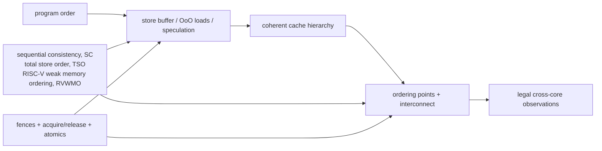
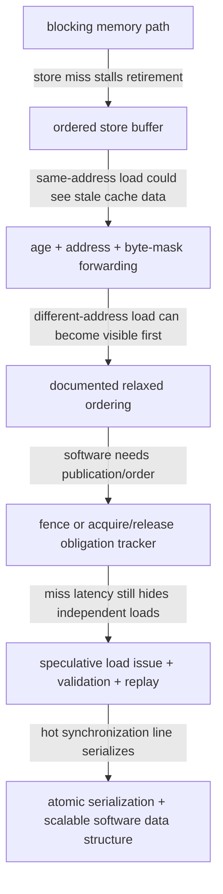
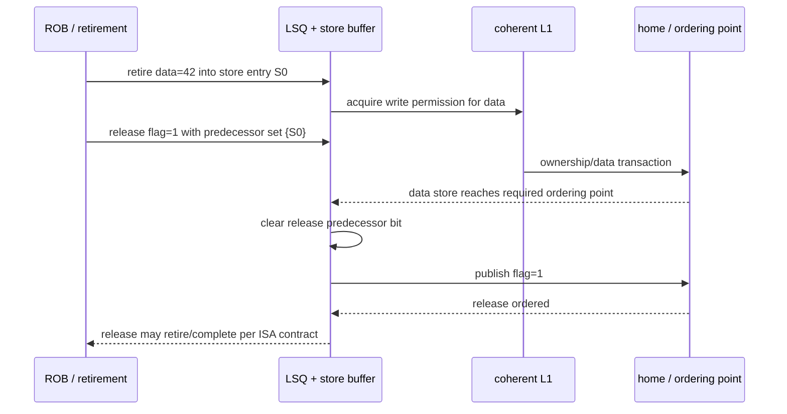
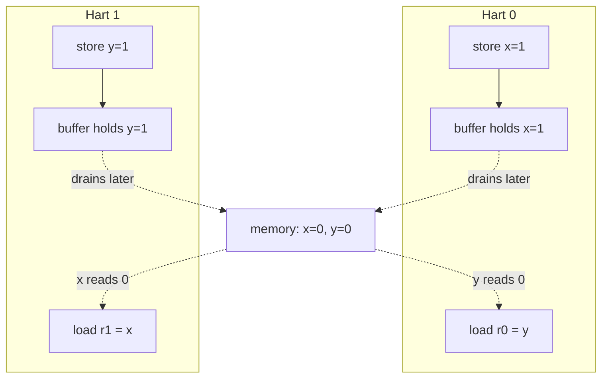
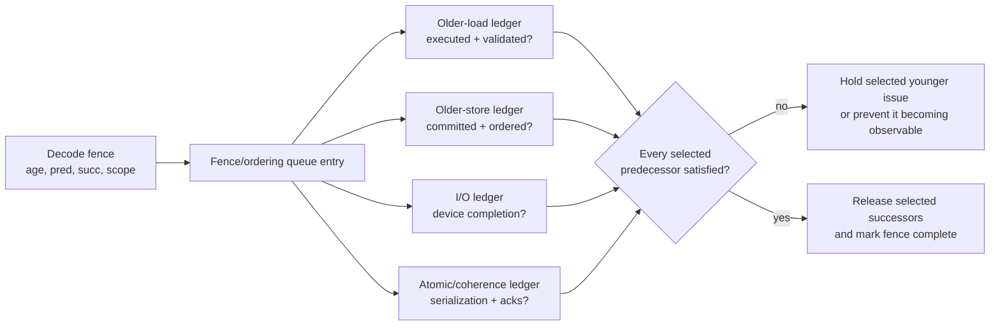

# Memory Consistency — Which Cross-Core Observations Are Legal?

> **Atomic operations moved.** This page once carried them; they now have their own page per architecture — [Atomic Operations](04_Atomic_Operations.md) for the core, [System Atomics and Exclusive Access](../../04_SoC_and_Chiplet_Architecture/02_Shared_Memory/04_System_Atomics_and_Exclusive_Access.md) for the fabric, [GPU Atomics and Synchronization](../../02_GPU_Architecture/02_Memory_System/03_GPU_Atomics_and_Synchronization.md) for the GPU. What stays here is the ordering model those pages assume.

> **First-time reader orientation:** Coherence concerns copies of one address; memory consistency constrains the order in which cores may observe accesses to different addresses. Litmus tests are tiny concurrent programs used to expose which observations a model permits, and fences forbid selected reorderings.

> **Abbreviation key — skim now and return as needed:** central processing unit (CPU); instruction set architecture (ISA); reduced instruction set computer (RISC); out-of-order (OoO); reorder buffer (ROB); load-store queue (LSQ); input-output memory management unit (IOMMU);
> quality of service (QoS); direct memory access (DMA); AXI Coherency Extensions (ACE); Coherent Hub Interface (CHI); Modified, Exclusive, Shared, Invalid (MESI).

> **Prerequisites:** [Cache Coherence](01_Cache_Coherence.md) (single-writer/multiple-reader permissions), [CPU Architecture](../01_Core_Foundations/01_CPU_Architecture.md) §9, and [Load-Store Unit](../03_Out_of_Order_Backend/02_Load_Store_Unit_and_Memory_Ordering.md).
> **Hands off to:** ISA/compiler synchronization rules, language memory models, and coherent fabrics. This page owns the hardware ordering contract and its microarchitectural consequences.

---

## 0. Why this page exists

Coherence guarantees a sensible order for writes to one cache line. Consistency constrains the order in which operations to **different** addresses may become visible. A coherent machine can still allow outcomes that surprise a programmer expecting sequential execution.


```mermaid
flowchart LR
    Program["program order"] --> Core["store buffer / OoO loads / speculation"]
    Core --> Cache["coherent cache hierarchy"]
    Cache --> Fabric["ordering points + interconnect"]
    Fabric --> Observe["legal cross-core observations"]
    Model["sequential consistency, SC<br/>total store order, TSO<br/>RISC-V weak memory ordering, RVWMO"] --> Core
    Model --> Fabric
    Fence["fences + acquire/release + atomics"] --> Core
    Fence --> Fabric
```

The central design bargain is to permit reorderings that improve performance while providing explicit operations that recover the order software needs.

## Before the details: permissions and observation order are separate

Cache coherence answers who may read or write one cache line and ensures writes to that line eventually agree. Memory consistency answers a broader software question: if one core accesses address X and then address Y, which orders may another core observe? Store buffers, speculative loads, and nonblocking caches can change observation order without violating single-address coherence.

A **litmus test** reduces the question to a few loads and stores on two or more cores, then asks whether a specific result is legal. Sequential consistency is the intuitive model in which all operations fit one total order consistent with each thread’s program order. Real architectures often allow more reordering for performance and provide fences and ordered atomic operations when software needs stronger synchronization.

**Beginner checkpoint:** an atomic operation is not merely a load followed by a store. Other agents must not interleave a conflicting operation between its read and write, and its ordering strength must be defined. The event graphs below make those two obligations visible.

## 0.1 From a blocking core to a weakly ordered core—one optimization at a time

Use a blocking in-order memory path as the baseline. It issues the next memory operation only after the previous one reaches its required visibility point. Program order and observation order are then closely aligned, but a store miss can freeze the core for hundreds of cycles. The first repair is a **store buffer**: retire a checked store into an ordered queue and let the cache acquire ownership in the background.

That repair creates a new failure. A younger load to the same address could read stale cache data while its older value waits in the store buffer. The derived requirement is store-to-load forwarding: compare the load address and byte mask against every older buffered store and select the youngest matching bytes. A partially covered load merges forwarded bytes with cache bytes only if the implementation can prove both sources belong to the same logical access epoch.

Allowing a load to a *different* address to bypass the older store recovers performance, but it exposes the store-buffering outcome and therefore changes the architectural memory model. The ISA must either permit that ordering or provide an operation that closes it. A fence adds tracked obligations—not magic:


```mermaid
flowchart TD
    B["blocking memory path"] -->|"store miss stalls retirement"| SB["ordered store buffer"]
    SB -->|"same-address load could see stale cache data"| FWD["age + address + byte-mask forwarding"]
    FWD -->|"different-address load can become visible first"| MM["documented relaxed ordering"]
    MM -->|"software needs publication/order"| F["fence or acquire/release obligation tracker"]
    F -->|"miss latency still hides independent loads"| SPEC["speculative load issue + validation + replay"]
    SPEC -->|"hot synchronization line serializes"| AT["atomic serialization + scalable software data structure"]
```

For each load, the LSQ therefore needs an age, address-valid bit, byte mask, execution/completion state, source (forward/cache), observed coherence version or invalidation status, and replay cause. For each store, it needs age, address-valid and data-valid bits, byte mask/data, retirement state, coherence request state, and visibility/acknowledgement state. Fence state records its predecessor and successor classes and whether every required predecessor has reached the ISA-defined ordering point. The ROB prevents a replayed speculative load from becoming a committed architectural event.

### Concrete trace: publish data, then a flag

The producer executes `data=42; release flag=1`; the consumer executes `acquire load flag; load data`. Suppose `data` misses in the producer's cache while `flag` could hit. Without release tracking, `flag=1` can become observable first and the consumer can read old `data=0`.

```wavedrom
{ "signal": [
  { "name": "P:data_store_retire", "wave": "01.0........" },
  { "name": "P:data_ordered",      "wave": "0....1......" },
  { "name": "P:release_flag",     "wave": "0.1..|.10..." },
  { "name": "C:acquire_flag",     "wave": "0.......10.." },
  { "name": "C:data_load",        "wave": "0.........10" },
  { "name": "C:observed_data",    "wave": "x.........=.", "data": ["42"] }
] }
```

The release store may allocate early, but its visibility permission remains blocked while the older `data` store's obligation is outstanding. When `data` reaches the required coherence ordering point, the tracker clears that bit and permits `flag` to become visible. On the consumer, seeing the acquire value can unblock younger loads; an implementation may execute them earlier only if it retains enough state to validate and replay them before retirement.

Now inject an invalidation for `data` after the consumer speculatively reads it but before the acquire is resolved. A conservative core delays the data load. An aggressive core marks the completed load as exposed to the invalidation and, if the acquire later establishes an ordering edge that makes the old observation illegal, kills the dependent instruction slice and replays from the load. The repair path must clear destination readiness, cancel or generation-tag dependent wakeups, preserve older retired state, and prevent the first value from reaching retirement or an external side effect.


```mermaid
sequenceDiagram
    participant ROB as ROB / retirement
    participant LSQ as LSQ + store buffer
    participant L1 as coherent L1
    participant H as home / ordering point
    ROB->>LSQ: retire data=42 into store entry S0
    LSQ->>L1: acquire write permission for data
    ROB->>LSQ: release flag=1 with predecessor set {S0}
    L1->>H: ownership/data transaction
    H-->>LSQ: data store reaches required ordering point
    LSQ->>LSQ: clear release predecessor bit
    LSQ->>H: publish flag=1
    H-->>LSQ: release ordered
    LSQ-->>ROB: release may retire/complete per ISA contract
```

### Concrete trace: atomic increment under contention

For `atomic_fetch_add(counter,1)`, ownership of the cache line is not enough unless one point serializes the read and write. A cache-based design obtains exclusive permission, locks or reserves the line against conflicting local operations, reads the old value, computes and installs the new value, marks the atomic's serialization point, then releases the response. A home-node atomic instead performs the operation at the directory/memory-side engine, trading requester hops for less line movement.

Retry needs identity. A coherence retry or link retransmission may repeat transport, but it must not apply the increment twice. Carry a requester/transaction identifier until the response is durably matched; at the serialization engine, retain enough active or recently completed identity state to distinguish retry from new work according to the protocol. Cancellation after serialization cannot pretend the write never happened: it may suppress a requester result only under a defined fault contract, while global memory still contains the new value.

The PPA and losing cases follow from the state. A wider store buffer hides longer misses but expands associative forwarding and age selection; more speculative loads increase validation bits, replay bandwidth, and wasted work; a universal full drain for every fence is simple but destroys performance; a fine-grained obligation matrix saves cycles but costs comparisons and proof complexity. Report store-buffer occupancy/full time, forwarded bytes, unknown-address stalls, violation/replay causes, fence wait broken down by obligation, atomic ownership/serialization/queue time, and invalidations that intersect speculative loads. Verify with ISA-generated litmus outcomes and microarchitectural assertions together: litmus tests prove only allowed observations, while assertions prove killed work and retries cannot leak extra architectural events.

## 1. Events and relations

Reason about dynamic memory events rather than source lines:

- load, store, atomic read-modify-write;
- address, value, size, byte mask, hart/thread;
- program order (`po`) within a hart;
- reads-from (`rf`): which store supplied a load;
- coherence/write order (`co`) per location;
- from-read (`fr`): load to later store in per-location order;
- preserved program order and fence/order relations.

A memory model defines which cycles or combinations of these relations are forbidden. The model is not “the order the cache sees requests”; speculative requests may be issued and replayed without becoming architectural events.

## 2. Sequential consistency as the reference point

Sequential consistency (SC) requires one total order of all memory operations that preserves each thread's program order. Every load reads the latest preceding store to that address in that total order.

SC is easy to explain and expensive to implement literally. Store buffers, nonblocking caches, speculative loads, and distributed interconnects naturally allow operations to complete/propagate in different orders.

An implementation may execute aggressively internally and still implement SC if it validates/repairs before retirement/visibility. The constraint is on architecturally observable results, not internal issue order.

## 3. Store buffering litmus test

Initially `x=y=0`:

| Hart 0 | Hart 1 |
|---|---|
| `x = 1` | `y = 1` |
| `r0 = y` | `r1 = x` |

Outcome `r0=0, r1=0` is forbidden under SC: no single total order can place both loads before the other hart's store while preserving both local store→load orders (the two program-order edges and the two load-before-store edges close the cycle $x{=}1 \rightarrow r0{=}y \rightarrow y{=}1 \rightarrow r1{=}x \rightarrow x{=}1$). It is allowed by models that permit a later load to bypass an earlier store to a different address, as ordinary store buffers do.

To decode that cycle, name its two edge kinds. A store→load arrow *inside one hart* (`x=1 → r0=y`, and `y=1 → r1=x`) is **program order** (`po`). A load→store arrow *across harts* (`r0=y → y=1`, and `r1=x → x=1`) is **from-read** (`fr`): the load observed memory *before* that store took effect, so it sits earlier in coherence order. SC forbids any cycle in $po \cup fr$, and these four edges close exactly one — so no legal total order exists.

**How a store buffer produces `0/0`.** Each store parks in its own hart's store buffer and drains to coherent memory later; each load goes to memory immediately. Interleave so both loads run before either buffer drains:

| step | Hart 0 | Hart 1 | memory |
|---|---|---|---|
| 1 | `x=1` enters SB0 | — | `x=0, y=0` |
| 2 | — | `y=1` enters SB1 | `x=0, y=0` |
| 3 | `r0=y` reads **0** | — | `x=0, y=0` |
| 4 | — | `r1=x` reads **0** | `x=0, y=0` |
| 5 | SB0 drains | SB1 drains | `x=1, y=1` |

Neither load sees the other's store because that store is still private in a buffer — the store→load edge *to a different address* is exactly what TSO leaves unordered. This is the microarchitectural realization of the `fr` edges above.


```mermaid
flowchart TB
    subgraph H0 ["Hart 0"]
        A0["store x=1"] --> B0["buffer holds x=1"]
        C0["load r0 = y"]
    end
    subgraph H1 ["Hart 1"]
        A1["store y=1"] --> B1["buffer holds y=1"]
        C1["load r1 = x"]
    end
    B0 -. "drains later" .-> M["memory: x=0, y=0"]
    B1 -. "drains later" .-> M
    M -. "y reads 0" .-> C0
    M -. "x reads 0" .-> C1
```

A full fence between each store and load forbids that bypass/visibility outcome. A fence is therefore an ordering edge, not a “flush all caches” instruction. Concretely, the fence makes each hart's store drain to memory before that hart's load may issue; the two stores can no longer both be buffered when the loads read, so at least one load observes a `1` and `0/0` cannot occur.

## 4. Common hardware model shapes

| Model shape | Typical preserved orders | Performance implication |
|---|---|---|
| SC | all load/store program order | simplest software reasoning; strongest hardware validation |
| TSO-like | generally preserves load→load, load→store, store→store; relaxes store→load to different address | store buffer hides write latency |
| weak/release consistency | many orders relaxed unless dependency/fence/acquire/release constrains them | greatest implementation/compiler freedom |
| RVWMO | weak model with explicit preserved program-order rules, dependencies, fences, and atomics | permits aggressive RISC-V cores while specifying portable synchronization |

Precise rules belong to each ISA specification; labels like “weak” are not interchangeable. Whether dependencies order accesses, whether stores are multi-copy atomic, and which fence bits apply can differ.

## 5. Message-passing litmus test

Initially `data=0, flag=0`:

| Producer | Consumer |
|---|---|
| `data = 42` | `r0 = flag` (acquire) |
| `flag = 1` (release) | if `r0==1`, `r1=data` |

Release orders earlier producer operations before the flag publication; acquire orders later consumer operations after observing it. If the consumer reads `flag=1`, it must see `data=42` under the synchronization contract.

In C11 the pair uses explicit memory orders on the flag; `data` stays a plain access because the release/acquire edge is what orders it:

```c
// Producer
data = 42;                                             // plain store
atomic_store_explicit(&flag, 1, memory_order_release); // publishes data first

// Consumer
if (atomic_load_explicit(&flag, memory_order_acquire)) // observes the release
    use(data);                                         // guaranteed to read 42
```

The `release` forbids `data=42` from sinking past the flag store; the matching `acquire` forbids the `use(data)` load from hoisting above the flag load. Weaken either to `memory_order_relaxed` and the edge breaks — the consumer may then see `flag=1` with stale `data=0`.

Microarchitecturally, release may wait until older stores reach the required ordering point before making the release store observable. Acquire may prevent younger loads from becoming irrevocably ordered before the acquire result. It need not stop all speculative execution if violations can be detected and repaired.

## 6. Store buffers and load speculation

A store buffer lets retirement continue while committed stores wait for cache/coherence service. Loads search older stores for forwarding, then may access cache ahead of buffered stores to other addresses.

Correctness requirements:

- same-address load gets the youngest older store's value;
- store→store visibility order is preserved when the model requires it;
- fences wait for the defined subsets/order points;
- speculative loads are replayed if older unknown stores alias;
- coherence invalidations or snoops trigger required load validation;
- device/strongly ordered accesses bypass relaxed normal-memory rules.

Load-load reordering can occur when a younger cache hit returns before an older miss. If the model preserves their order, the core can delay retirement/observation or detect external events that make early execution illegal.

## 7. Multi-copy atomicity and propagation

A write is multi-copy atomic when it becomes visible to all observers at one conceptual point rather than propagating to different observers at different times. Directory/home serialization and invalidate acknowledgements often support such a point, but protocol details matter.

Non-multi-copy-atomic behavior complicates tests such as independent reads of independent writes (IRIW), where two readers observe writes in different orders. Some models constrain propagation through cumulative fences: a hart that observes another write and then publishes a flag can carry ordering to third parties.

Do not infer consistency solely from MESI state. A line may be coherent while writes to two lines reach observers in relaxed orders.

## 8. Fences are parameterized ordering operations

A fence is not “flush the cache.” It creates selected **before → after** edges between memory events. In RISC-V, `FENCE pred,succ` independently selects predecessor and successor classes from read (`R`), write (`W`), device input (`I`), and device output (`O`). For example, a write-to-write fence orders earlier stores before later stores without necessarily waiting for unrelated earlier loads. Other ISAs encode common acquire, release, full-system, load-only, store-only, or device-shareability combinations rather than exposing the same bit fields.

Keep four different actions separate:

| Operation | What it guarantees | What it does **not** necessarily do |
|---|---|---|
| compiler barrier | constrains compiler motion | emit a hardware ordering instruction |
| acquire/release operation | one-sided ordering around one load/store/RMW | order unrelated operations in both directions |
| architectural fence | orders named event classes in a named domain | write dirty cache lines to DRAM |
| cache/translation/instruction maintenance | changes cache, TLB, or instruction visibility | replace the ISA memory-order edge |

An instruction-cache synchronization operation such as RISC-V `FENCE.I`, a TLB invalidation sequence, and a data-memory fence therefore have different completion ledgers even if a simple core serializes all three.

### 8.1 Turn the ISA sentence into obligations

At decode, convert a fence into a fence micro-operation carrying:

```text
rob_age
pred_mask = {R,W,I,O}
succ_mask = {R,W,I,O}
scope/domain
strength = acquire | release | acq_rel | sequentially-consistent
instruction/translation/cache-maintenance subtype
epoch
```

The fence's age divides memory operations into older predecessors and younger successors. An implementation then defines an **ordering point** for every class. Examples are “load value is irrevocably validated,” “store has reached the coherence serialization point,” “MMIO write response has returned from the device domain,” and “all invalidation acknowledgements have arrived.” “Request left the LSU” is usually too early; “data reached DRAM cells” is usually unnecessarily late.


```mermaid
flowchart LR
    D["Decode fence<br/>age, pred, succ, scope"] --> FQ["Fence/ordering queue entry"]
    FQ --> OL["Older-load ledger<br/>executed + validated?"]
    FQ --> OS["Older-store ledger<br/>committed + ordered?"]
    FQ --> IO["I/O ledger<br/>device completion?"]
    FQ --> AT["Atomic/coherence ledger<br/>serialization + acks?"]
    OL --> DONE{"Every selected<br/>predecessor satisfied?"}
    OS --> DONE
    IO --> DONE
    AT --> DONE
    DONE -- "no" --> HOLD["Hold selected younger issue<br/>or prevent it becoming observable"]
    DONE -- "yes" --> REL["Release selected successors<br/>and mark fence complete"]
```

The ledger can be implemented with age comparisons over load/store queues, snapshot counters, sequence numbers, or per-domain outstanding counters. A useful counter scheme snapshots the number of relevant operations accepted before the fence and advances a completion sequence only when holes close; a simple count alone is unsafe if completions reorder.

### 8.2 A practical fence state machine

A conservative but understandable implementation is:

1. **allocate:** insert the fence in the reorder buffer (ROB) and ordering queue;
2. **stop selected successors:** prevent younger operations in `succ_mask` from passing the fence;
3. **wait for retirement eligibility:** all older instructions are non-faulting, so stores counted by the fence cannot later be killed;
4. **drain/validate selected predecessors:** wait for required load validation, store-buffer serialization, atomic completion, and I/O acknowledgements;
5. **perform special maintenance:** for an instruction/TLB/cache-maintenance subtype, issue the required invalidates and wait for their acknowledgements;
6. **complete and retire:** advance the fence epoch and release the selected successors.

```text
IDLE -> ALLOCATED -> WAIT_OLDER_SAFE -> WAIT_ORDER_POINTS
     -> [WAIT_MAINTENANCE] -> COMPLETE -> IDLE
```

This state machine needs explicit handling for squash, trap, reset, and debug halt. A squashed fence cannot release a successor from a newer epoch. An interrupt may be taken before the fence retires only if the implementation can preserve precise state and later re-execute the fence; it cannot silently declare its obligations complete.

The conservative design blocks successor issue. A higher-performance design may execute younger loads speculatively, but it must not let them create an architecturally visible result forbidden by the fence. It retains their load-queue entries, snoop-validation state, and replay path until the fence completes.

### 8.3 Store-buffer draining: “accepted” is not “visible”

Suppose a release store publishes a flag after two ordinary stores:

```text
S0: data[0] = A
S1: data[1] = B
R : flag    = 1    // release
```

It is insufficient for `S0` and `S1` merely to occupy the store buffer. The release store must not become visible before the two data stores reach the ordering point required by the ISA and shareability domain. The store buffer can attach a monotonically increasing sequence:

| Entry | Sequence | Committed | Ownership/data accepted | Globally ordered |
|---|---:|---:|---:|---:|
| `S0` | 40 | yes | yes | yes |
| `S1` | 41 | yes | pending | no |
| release `R` | 42 | yes | not issued | no |

`R` remains blocked until the contiguous ordered sequence reaches 41. If stores to different cache lines issue out of order internally, a completion bitmap plus a “highest contiguous completed sequence” prevents a younger completion from hiding an older hole.

For a write-back cache, globally ordered does **not** mean the line has been written to DRAM. It normally means the coherence system has established the write's architecturally required visibility/ownership point. For noncoherent memory or MMIO, the point may instead be a bridge, device, or explicit completion response.

### 8.4 Acquire, release, full, and sequentially consistent forms

- A **release** prevents selected earlier events from appearing after the release operation. It commonly constrains the store buffer before the release publication.
- An **acquire** prevents selected later events from appearing before an observed acquire. Younger loads may execute speculatively only if the core can validate/replay them.
- An **acquire-release** RMW applies both sides around one atomic serialization point.
- A **sequentially consistent (SC)** operation participates in the language/ISA's stronger global ordering rules. Implementations often need an SC-order token, a sufficiently strong fence pattern, or a serialization point shared by SC operations—not merely local queue draining.

Do not implement these names by folklore. Start from the precise ISA preserved-program-order and propagation requirements, then prove the selected microarchitectural actions imply them. RISC-V's `aq`/`rl` bits, Arm load-acquire/store-release instructions, and x86 locked operations have different architectural wording even when source-language compilers use them for similar C/C++ constructs.

### 8.5 Scope and cumulativity

Ordering has a domain: one core, one coherence cluster, all coherent agents, or the system including devices. A narrow-scope fence can complete at a local point; a system-scope fence may need traffic to cross the last-level cache, I/O coherence point, or bridge.

A **cumulative** fence may also carry forward observations made by this hart. In a three-party handoff, hart B reads data written by hart A, executes a cumulative fence, then publishes to hart C. The system must not let C observe B's publication while missing the A data that B carried forward. This is why the fence controller needs domain/protocol knowledge rather than only an empty local store buffer.

### 8.6 Fence performance without weakening semantics

Safe optimizations include:

- implement predecessor/successor masks rather than treating every fence as full;
- snapshot sequence numbers so the fence waits only for older operations;
- let unrelated arithmetic and provably safe memory operations execute;
- combine adjacent compatible fences before either has taken effect;
- keep separate ordering domains so network/storage traffic does not delay an unrelated GPU or CPU domain;
- expose memory synchronization domains or traffic classes when the architecture permits;
- complete at the earliest architecturally sufficient ordering point.

Performance counters should distinguish time waiting for retirement, load validation, store-buffer holes, ownership/invalidation acknowledgements, MMIO, atomics, and translation/cache maintenance. “Fence stalls” alone cannot identify the fix.

### 8.7 Fence design and verification checklist

- Is each ISA fence encoding decoded to the correct predecessor, successor, scope, and strength?
- Is the ordering point for cacheable memory, noncoherent memory, and device I/O named?
- Can an older operation still fault, replay, or be killed after the fence considers it complete?
- Are split accesses and bridge-generated child transactions all counted?
- Does completion wait for holes rather than just the number of responses?
- Are speculative younger loads retained and invalidated/replayed when required?
- Do reset epochs prevent stale acknowledgements completing a new fence?
- Does a system-scope fence include DMA/device/coherence traffic required by the contract?

Assertions should state the architectural consequence: if a fence retires, no selected successor can be observed before any selected predecessor. Internal “queue empty” assertions are supporting facts, not the specification.

Over-implementing every fence as a full pipeline and cache drain may be correct but extremely slow. Under-implementing one produces rare failures that appear only with the right cache misses, snoops, bridge buffering, and compiler motion.

## 9. Atomics — the single-location special case

An atomic read-modify-write (RMW) reads a value and conditionally or unconditionally writes a new value without an intervening write to the atomicity granule. It is the point where this page's cross-location ordering rules meet a single-location indivisibility guarantee, and the two are genuinely separate: a *relaxed* atomic still has an indivisible per-location RMW and imposes no cross-location edges at all, while the acquire/release/sequentially-consistent qualifiers of §8 are what add those edges.

That separation is the only thing about atomics this page owns. Everything else — choosing where the operation serializes, the AMO/compare-and-swap/load-reserved families, the reservation monitor, the contention arithmetic, precise faults, and hardware transactional memory — now has its own page.

> **→ [Atomic Operations](04_Atomic_Operations.md)** is the core-side home. For the fabric side (global exclusive monitors, far atomics on the wire, PCIe and CXL), see [System Atomics and Exclusive Access](../../04_SoC_and_Chiplet_Architecture/02_Shared_Memory/04_System_Atomics_and_Exclusive_Access.md); for the GPU side, [GPU Atomics and Synchronization](../../02_GPU_Architecture/02_Memory_System/03_GPU_Atomics_and_Synchronization.md).


## 10. Compiler and language boundary

Hardware orders dynamic machine instructions. Languages define races and atomic semantics at source level; compilers map them to ISA operations. A hardware fence cannot repair a compiler that removed/reordered unsynchronized source accesses, and a compiler barrier alone cannot order hardware visibility.

Correct synchronization requires the full chain:

$$
\text{language model}\rightarrow\text{compiler mapping}\rightarrow\text{ISA model}\rightarrow\text{microarchitecture}\rightarrow\text{coherent fabric}.
$$

Architecture documentation should specify the ISA contract and implementation reasoning without claiming that ordinary data races are portable language synchronization.

## 11. Device memory and I/O ordering

Memory-mapped registers can have side effects, reject speculative reads, require access size/order, or represent doorbells. Attributes distinguish normal cacheable memory from device/strongly ordered memory.

Common producer sequence for a DMA device:

1. write descriptors in normal memory;
2. ensure descriptor writes reach the device-visible domain;
3. write device doorbell;
4. device reads descriptors.

The required barrier orders normal stores before I/O. Cache maintenance may also be required for noncoherent devices. Treating the doorbell as an ordinary write risks the device observing a command before its data.

## 12. Verification with litmus tests and formal models

Directed litmus tests cover store buffering, message passing, load buffering, IRIW, publication, atomics, and fence combinations. Random generators explore longer interactions. Outcomes should be checked against an executable axiomatic/operational model, not intuition.

Microarchitectural assertions:

- forwarding returns youngest older same-address bytes;
- preserved program-order edges cannot become observably inverted;
- completed fences have satisfied all specified predecessor/successor obligations;
- atomic serialization is unique and indivisible;
- invalidated speculative loads are replayed when required;
- device accesses obey attributes and are not speculated illegally;
- killed requests cannot create architectural ordering events.

## 13. Performance counters

- store-buffer occupancy/full cycles and drain latency;
- loads bypassing older stores, predicted dependencies, violations, replays;
- fence count and stall cycles by predecessor/successor class;
- atomic latency, retries, ownership transfers, and contention depth;
- coherence invalidations hitting speculative/completed loads;
- device-ordering drains;
- LR/SC success/failure causes.

An average atomic latency is insufficient; report by line sharing and contention because one hot lock dominates tails.

## 14. Numbers to remember

- Coherence orders writes per line; consistency constrains observations across addresses.
- Store buffering commonly relaxes store→load ordering to different addresses.
- Acquire/release creates a publication chain without requiring every operation to be SC.
- A fence orders specified event classes; it is not synonymous with flushing caches.
- Atomics need one serialization point plus any acquire/release ordering.
- Language, compiler, ISA, core, and fabric must all preserve the synchronization contract.
- Hardware transactional memory (HTM) commits a group of memory ops atomically and detects conflicts with the coherence protocol; it beats a lock only while the abort rate stays under $(o_\ell-o_x)/(o_\ell+C_a)$, and forward progress still requires a non-transactional fallback.

## 15. Worked problems

### Problem 1 — store-buffer outcome

In the store-buffering test, both loads reading zero is possible if each load bypasses its hart's older buffered store and runs before the other store is visible. Adding store→load fences on both harts creates a cycle that forbids the outcome.

### Problem 2 — contended atomic throughput

Moved, with its full derivation and the sharding follow-up, to [Atomic Operations](04_Atomic_Operations.md).


### Problem 3 — fence cost

A release operation waits for six older stores. Four are already globally ordered; two take 35 and 60 cycles in parallel. Incremental drain cost is about 60 cycles, not $6\times$ average store latency. The implementation should track outstanding obligations, not serialize every store anew.

## 16. Speculative synchronization

Section 9 gave a single atomic read-modify-write one serialization point. A lock generalizes that to a *region*. Hardware transactional memory (HTM) generalizes it a different way — it lets a *group* of loads and stores commit at one instant, all-or-nothing, reusing [Cache Coherence](01_Cache_Coherence.md) as its conflict detector and the [Retirement, Recovery, and Precise State](../03_Out_of_Order_Backend/03_Retirement_Recovery_and_Precise_State.md) speculate/validate/recover machinery as its rollback path.

HTM belongs to the ordering story because its commit instant is an ordering event, but its derivation, break-even arithmetic, abort taxonomy, and mandatory non-speculative fallback are developed in full on the atomics page.

> **→ [Atomic Operations §12](04_Atomic_Operations.md)**.


## Cross-references

- **Permission protocol:** [Cache Coherence](01_Cache_Coherence.md), [ACE and CHI](03_ACE_and_CHI.md).
- **Core machinery:** [Load-Store Unit](../03_Out_of_Order_Backend/02_Load_Store_Unit_and_Memory_Ordering.md), [Retirement and Recovery](../03_Out_of_Order_Backend/03_Retirement_Recovery_and_Precise_State.md).
- **Atomics and speculative synchronization:** [Atomic Operations](04_Atomic_Operations.md) owns the read-modify-write families, the reservation monitor, the contention arithmetic, and hardware transactional memory, which reuses [Cache Coherence](01_Cache_Coherence.md) as its conflict detector and the [Retirement and Recovery](../03_Out_of_Order_Backend/03_Retirement_Recovery_and_Precise_State.md) speculate/validate/recover discipline.
- **I/O/translation:** [Page Walkers, IOMMUs, and Virtualization](../05_Virtual_Memory/02_Page_Walkers_IOMMUs_and_Virtualization.md), [QoS, Ordering, and I/O Coherence](../../04_SoC_and_Chiplet_Architecture/05_IO_and_Chiplets/01_QoS_Ordering_and_IO_Coherence.md).

## References

1. RISC-V International, [RVWMO Memory Consistency Model](https://docs.riscv.org/reference/isa/unpriv/rvwmo.html).
2. RISC-V International, [Formal Memory Model Specifications](https://docs.riscv.org/reference/isa/unpriv/mm-formal.html).
3. RISC-V International, [Unprivileged ISA Specification, “A” Extension](https://docs.riscv.org/reference/isa/unpriv/a-st-ext.html) — AMOs, LR/SC, acquire/release bits, and forward progress.
4. Arm, [Armv8-A Memory Model Guide](https://developer.arm.com/documentation/102336/latest/) — memory types, observers, barriers, acquire/release, and ordering examples.
5. P. Sewell et al., “x86-TSO: A Rigorous and Usable Programmer's Model for x86 Multiprocessors,” CACM 2010.
6. S. Adve and K. Gharachorloo, “Shared Memory Consistency Models: A Tutorial,” *Computer*, 1996.
7. J. Alglave et al., “Herding Cats: Modelling, Simulation, Testing, and Data Mining for Weak Memory,” TOPLAS 2014.

---

**Navigation:** [Coherence and Consistency index](00_Index.md) · [Memory index](../00_Design_Methodology/00_Index.md)

---

⬅ prev [Cache Coherence](01_Cache_Coherence.md) · [Section Index](00_Index.md) · [Root Index](../../../Index.md) · next ➡ [AXI Coherency Extensions (ACE) and Coherent Hub Interface (CHI)](03_ACE_and_CHI.md)
