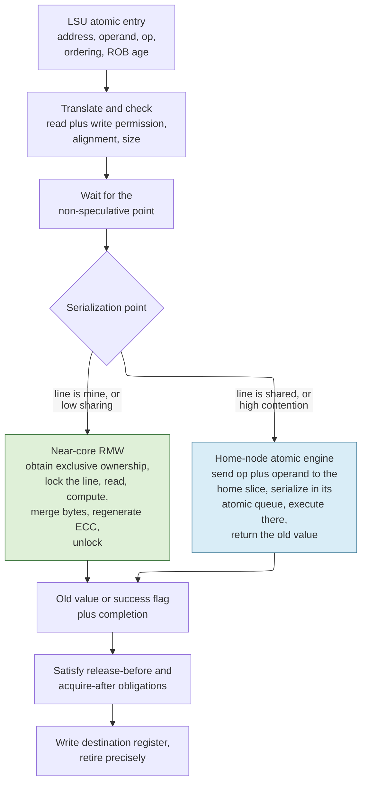
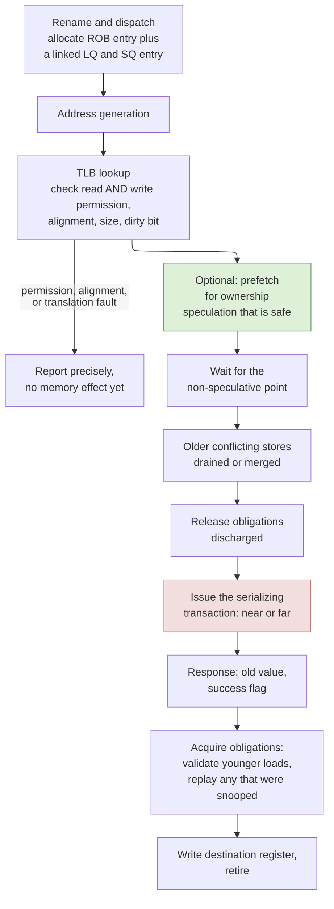
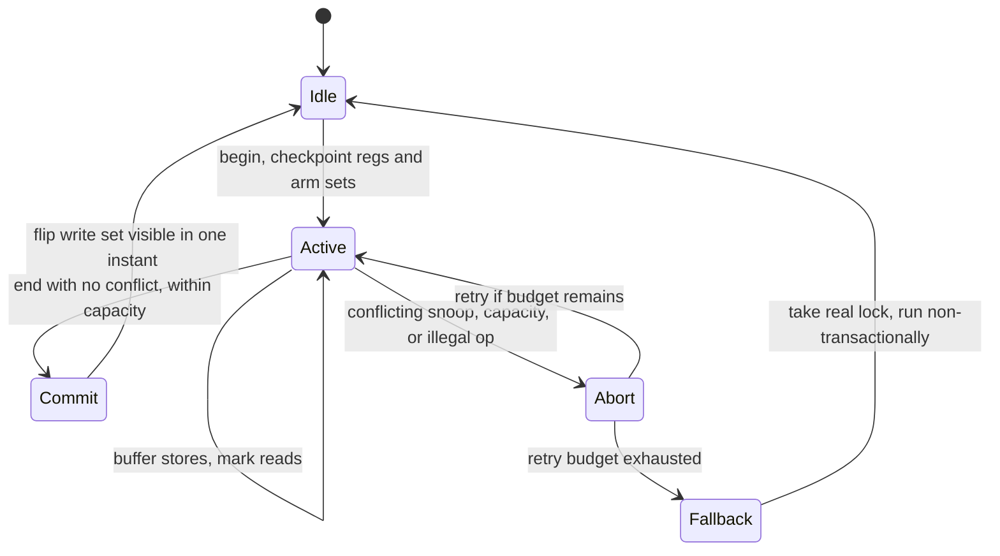
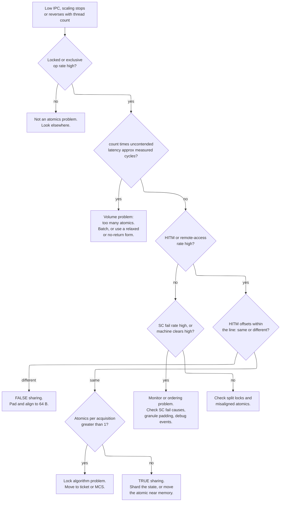

# Atomic Operations — Making a Read-Modify-Write Indivisible, and Paying for It

> **First-time reader orientation:** An *atomic* read-modify-write reads a memory location, computes a new value from it, and writes the result back with no other write to that location in between. It is the hardware primitive underneath every lock, every counter, every reference count, and every lock-free queue in production software. This page is about *where in the machine* that indivisibility is enforced, what enforcing it costs in latency and throughput, how three real instruction sets chose differently, and how to tell on silicon that atomics are the thing making your program slow.

> **Abbreviation key — skim now and return as needed:** read-modify-write (RMW); atomic memory operation (AMO); compare-and-swap (CAS); load-reserved and store-conditional (LR/SC); load-store unit (LSU); load queue (LQ); store queue (SQ); reorder buffer (ROB); instruction set architecture (ISA); translation-lookaside buffer (TLB); page-table entry (PTE); miss-status holding register (MSHR); Modified, Exclusive, Shared, Invalid (MESI); last-level cache (LLC); error-correcting code (ECC); hardware transactional memory (HTM); Large System Extensions (LSE, Arm v8.1 atomics); Transactional Synchronization Extensions (TSX, Intel); Hardware Lock Elision (HLE); Restricted Transactional Memory (RTM); Transactional Memory Extension (TME, Arm); Coherent Hub Interface (CHI); AXI Coherency Extensions (ACE); performance monitoring unit (PMU); simultaneous multithreading (SMT); point of coherency (PoC); exclusives reservation granule (ERG); Compute Express Link (CXL); non-uniform memory access (NUMA); sequentially consistent (SC — note the collision with store-conditional; this page always writes "store-conditional" in full when the SC instruction is meant).

> **Prerequisites:** [Cache Coherence](01_Cache_Coherence.md) (single-writer/multiple-reader permission states, and what it costs to move a line between cores), [Memory Consistency and Atomic Operations](02_Memory_Consistency_and_Atomics.md) (fences, acquire/release, and why atomicity and ordering are different properties), [Load-Store Unit and Memory Ordering](../03_Out_of_Order_Backend/02_Load_Store_Unit_and_Memory_Ordering.md) (load/store queues, store-to-load forwarding, speculative-load validation).
> **Hands off to:** [System Atomics and Exclusive Access](../../04_SoC_and_Chiplet_Architecture/02_Shared_Memory/04_System_Atomics_and_Exclusive_Access.md) (exclusive monitors physically inside an interconnect, ACE/CHI far-atomic transactions on the wire, PCIe AtomicOps, CXL), [GPU Atomics and Synchronization](../../02_GPU_Architecture/02_Memory_System/03_GPU_Atomics_and_Synchronization.md) (warp aggregation, L2-resident atomics, scoped synchronization), [ACE and CHI](03_ACE_and_CHI.md) (the transaction encodings a far atomic actually uses).

---

## 0. Why this page exists

Coherence gives you one value per address. Consistency gives you a legal set of cross-address observations. Neither of them lets one core increment a counter without another core losing an increment. That gap is what an atomic operation fills, and it is the single narrowest, hottest, most contended point in a shared-memory machine: a lock word touched by 64 cores is one 8-byte object that every one of those cores wants exclusively, forever.

The gap is not an oversight in the ISA. It is a theorem. A load and a store are two separate events in the per-location order, and *any* other agent's write can be placed between them. No amount of software cleverness on top of plain loads and stores removes that possibility for an unbounded, dynamically-sized set of participants — §1.2 makes this precise using Herlihy's consensus hierarchy. Hardware must supply at least one primitive whose read and write are adjacent in the per-location order. Everything on this page follows from that one requirement plus the fact that the requirement is expensive.

An engineer who skips this material ships one of five defects, all of which are found late and are miserable to debug. The first is a lost update: an atomic that was split into two bus transactions, or a store buffer that was allowed to hold a stale value across the read-modify-write interval. The second is a livelock: an LR/SC loop whose reservation is cleared by an event the loop itself generates, so it retries forever and the core makes no architectural progress at all — usually discovered on real silicon at 3 a.m. during bring-up. The third is a non-precise fault: an atomic that updated memory and *then* reported a page fault, so the operating system re-executes it and the increment lands twice. The fourth is a performance cliff: a correctly-functioning atomic placed at the wrong serialization point, so a 64-core machine delivers the throughput of one core. The fifth is a false-sharing disaster: two unrelated counters in the same 64-byte line, turning independent work into a full coherence ping-pong.

After this page you should be able to: specify an atomic instruction completely enough to hand to a verification team (operand sizes, alignment, byte enables, sign extension, fault atomicity, ordering); choose between a core-local and a near-memory serialization point *from measured contention rather than from taste*, using the crossover in §11.2; implement and verify a reservation monitor that provably satisfies the RISC-V constrained-LR/SC forward-progress rule; explain why Arm added LSE and why x86 cannot have a relaxed atomic; derive the break-even abort rate for hardware transactional memory; and diagnose a real atomics problem from PMU counters in an afternoon rather than a quarter.

The neighboring pages own the neighboring problems. [Cache Coherence](01_Cache_Coherence.md) owns how a line gets from one cache to another; this page owns what you do once you have it. [Memory Consistency](02_Memory_Consistency_and_Atomics.md) owns the cross-address ordering contract; this page owns the per-location indivisibility and the ordering qualifiers that *decorate* it. [System Atomics and Exclusive Access](../../04_SoC_and_Chiplet_Architecture/02_Shared_Memory/04_System_Atomics_and_Exclusive_Access.md) owns everything past the core's request port.

---

## 1. What "indivisible" actually constrains

### 1.1 The baseline, and the exact input that breaks it

The simplest thing that could work is three ordinary instructions:

```asm
    lw   t0, 0(a0)      # read the counter
    addi t0, t0, 1      # compute the new value
    sw   t0, 0(a0)      # write it back
```

On one core with no other agents, this is correct. Trace it on two harts with the counter at 7, and it is not:

| Time | Hart 0 | Hart 1 | Memory at `a0` |
|---|---|---|---|
| $t_0$ | `lw` → `t0 = 7` | | 7 |
| $t_1$ | | `lw` → `t0 = 7` | 7 |
| $t_2$ | `addi` → `t0 = 8` | | 7 |
| $t_3$ | | `addi` → `t0 = 8` | 7 |
| $t_4$ | `sw 8` | | 8 |
| $t_5$ | | `sw 8` | 8 |

Two increments were issued; the counter advanced by one. Nothing here violates coherence — every access to the line was properly ordered, and both harts saw a legal value. Nothing violates consistency either: the interleaving is sequentially consistent. The failure is entirely inside the *pair*: hart 1's load was placed between hart 0's load and hart 0's store in the per-location order, so hart 0's store was computed from a value that was no longer current when the store landed.

Strengthening the memory model does not help. Add a full fence between the load and the store on both harts and the same interleaving still occurs: fences constrain the order of *your* accesses relative to each other, not whether someone else's write can land in a window you left open. This is the single most useful sentence on the page: **atomicity is a property of an interval on one location; ordering is a property of a relation between locations. A fence cannot buy atomicity and an atomic does not by itself buy ordering.**

### 1.2 Why no software protocol fixes it in general

The obvious rebuttal is that mutual exclusion *can* be built from loads and stores: Dekker's algorithm for two threads, Peterson's for two, Lamport's bakery for $N$. All of these work, and all of them have costs that make them unusable as a general primitive:

- **They need the participant set in advance.** The bakery algorithm needs an array of $N$ entries and reads all $N$ on every entry, so entering a critical section costs $O(N)$ remote loads — with $N=64$ and a 100-cycle remote load that is 6400 cycles of pure protocol per acquisition. A dynamically-sized thread pool cannot use it at all.
- **They need sequential consistency, which you get from fences.** Peterson's algorithm is incorrect on any machine that relaxes store→load ordering (i.e. every real machine) unless you insert a store-load fence, and a store-load fence costs roughly what an atomic costs. You have paid the atomic's price and got a worse algorithm.
- **They provide mutual exclusion, not a wait-free primitive.** A thread that stops inside the critical section blocks everyone forever. Lock-free and wait-free data structures — the reason atomics exist in modern software — are not expressible.

The formal statement is Herlihy's **consensus hierarchy** (*Wait-Free Synchronization*, TOPLAS 1991). Assign each primitive a *consensus number*: the maximum number of threads for which that primitive can solve wait-free consensus (all threads agree on one proposed value, with every thread finishing in a bounded number of its own steps, regardless of the others' scheduling). The results:

| Primitive | Consensus number |
|---|---|
| Atomic read and atomic write | 1 |
| Test-and-set, swap, fetch-and-add, queues, stacks | 2 |
| $m$-register assignment | $2m-2$ |
| Compare-and-swap, load-linked/store-conditional | $\infty$ |

Consensus number 1 for plain loads and stores means: **two threads cannot solve wait-free consensus using only loads and stores**, and therefore no object with a consensus number above 1 — a queue, a stack, a lock-free list — has a wait-free implementation built from loads and stores alone. (It does not mean loads and stores are useless: plenty of specific objects, such as an atomic snapshot, *are* wait-free over plain registers. The impossibility is about universality.) This is a proof, not a limitation of current cleverness. Consensus number 2 for fetch-and-add means an ISA that supplies only `amoadd` cannot express arbitrary wait-free objects for three or more threads. Consensus number $\infty$ for CAS and LR/SC is why every serious ISA supplies one of them: they are *universal*, meaning any sequential object specification can be turned into a wait-free concurrent implementation on top of them.

That is the derivation of the whole page. The hardware must supply a primitive whose read and write are adjacent in the per-location order, and the primitive should be conditional (CAS or LR/SC) so it is universal, with unconditional fetch-and-op forms added because they are cheaper for the common cases.

### 1.3 What the indivisibility contract does and does not say

Precisely: for an atomic RMW on granule $G$, in the global coherence order of $G$, the atomic's read and the atomic's write are adjacent — no other write to any byte of $G$ appears between them.

Four things that are *not* implied, each of which has bitten a real design:

1. **The instruction is not instantaneous.** A far atomic may take 60 cycles end to end. Only the read-to-write interval on $G$ is exclusive. The rest of the latency is routing, queueing, and ordering drains, during which other agents freely access other addresses.
2. **Nothing is implied about other locations.** A relaxed `amoadd` is fully atomic on its own address and imposes zero ordering on anything else. Ordering is a separate, optional decoration (§7).
3. **Single-copy atomicity is a prerequisite, not the same thing.** *Single-copy atomic* means no observer ever sees a partially-written value — a 64-bit store either happened or did not, never half. *Multi-copy atomic* means all observers see a write at the same instant. An atomic RMW needs single-copy atomicity of $G$ plus exclusion across the interval; it does not by itself require multi-copy atomicity of the machine.
4. **The atomicity granule and the coherence granule are different objects.** The architectural operand may be one byte (`amoadd.b` under RISC-V Zabha), four bytes, eight, or sixteen. The ownership granule is typically a 64-byte cache line. Exclusion is usually obtained at line granularity because that is the unit the coherence protocol trades, which means a byte atomic and a word atomic overlapping in the same line automatically exclude each other — correct, but it also means two *unrelated* atomics in the same line contend for no reason. That is false sharing, and §6.1 quantifies it.

### 1.4 The specification checklist

An atomic instruction is under-specified until every one of these has an answer written down. Verification will find each gap eventually; the only question is whether it finds it in simulation or in silicon.

| Question | Why it matters | Typical answer |
|---|---|---|
| Supported operand sizes | Determines datapath width and byte-enable logic | 32/64-bit; 8/16 with RISC-V Zabha; 128 with `CASP`, `amocas.q`, `CMPXCHG16B` |
| Alignment requirement | An unaligned atomic may span two lines or two pages | Natural alignment required on RISC-V and Arm; permitted but catastrophic on x86 (§8.3) |
| Line-crossing behavior | Two lines cannot be owned atomically without a second mechanism | Fault (RISC-V, Arm) or system bus lock (x86 split lock) |
| Page-crossing behavior | Two translations, two possible faults, one memory effect | Forbidden by the alignment rule; if permitted, both translations must resolve before the update |
| Byte enables | A sub-word atomic must not disturb neighboring bytes | Merge under mask at the serialization point, regenerate ECC over the whole protected word |
| Sign extension of the returned old value | `amomin.w` on RV64 returns a 32-bit value into a 64-bit register | Sign-extend for `.w` on RV64; specify explicitly, do not leave to the implementation |
| Fault atomicity | A fault after the update is unrecoverable | All checks complete before the update; never update-then-report-unperformed (§10) |
| Overlapping smaller atomics | An `amoadd.b` and an `amoadd.w` that overlap must still be mutually atomic | Exclusion at a granule covering both — in practice, the line |
| Behavior on device/uncacheable memory | A far atomic to a device may not be executable at all | Architecturally undefined or faulting on Arm exclusives to Device memory; define it |
| Ordering qualifier encodings | Whether ordering is in the instruction or in a separate fence | `.aq`/`.rl` bits (RISC-V), `A`/`L` suffixes (Arm), implicit and always-on (x86) |
| Return value optional? | Enables a fire-and-forget write-only atomic | `rd = x0` (RISC-V), `ST<op>` forms (Arm); not available on x86 |

The one non-negotiable rule underneath the table: **never silently split an architecturally atomic operand into two independently visible bus transactions.** A 64-bit atomic on a 32-bit data path, a 128-bit CAS on a 64-bit protocol, or an unaligned atomic decomposed into two aligned pieces all produce a window in which another agent observes half the update. If the protocol cannot carry the operand in one indivisible transaction, the instruction must fault, not degrade.

---

## 2. Choosing the serialization point

### 2.1 The two structural choices

Exactly one thing must be true of an atomic: conflicting operations on the granule must be totally ordered at *one* place. There are two places to put it, and the entire performance argument of this page is about which one.



**Contract of the figure.** Everything above `CHOOSE` is common to both schemes and must complete before either one starts: the operand is fully translated, both read and write permission are checked, alignment and size are validated, and the instruction has reached a point where it is guaranteed to retire. The two branches below `CHOOSE` differ only in *where the granule is exclusively held during the read-to-write interval*. Everything after `RESP` is ordering, which is orthogonal.

**One concrete trace.** Core 3 executes `amoadd.d.aqrl a5, a4, (a0)` on address `0x8000_1040`, currently held Modified by core 11. Near-core path: core 3's L1 misses, sends a read-for-ownership to the home slice, the home snoops core 11, core 11 writes back and invalidates, data arrives at core 3, core 3 locks the L1 way (blocking incoming snoops for the duration), reads `0x0000_0000_0000_002A`, adds `a4 = 1`, writes `0x2B`, regenerates ECC, unlocks. Far path: core 3 sends `AtomicLoad ADD` with operand `1` to the home; the home snoop-invalidates core 11 and pulls the line into the slice (or already has it), the slice's 64-bit adder computes `0x2B`, the slice writes it into its own array, and returns `0x2A` to core 3. In both cases core 3's `a5` ends up `0x2A` and memory holds `0x2B`. The difference is that after the near path the line is Modified in *core 3's* L1, and after the far path it is Modified in the *home*, where the next requester can reach it without another migration.

**The trade-off it shows.** The near path reuses the existing L1 read-modify-write datapath, gives a ~6-cycle operation when the line is already yours, and adds no new hardware. It moves a hot line. The far path adds an operation ALU, an atomic queue, and new protocol states at *every* home slice, and always pays a network round trip. It does not move the line. Section 11 turns that sentence into a number.

### 2.2 "Lock the bus" is neither necessary nor scalable

The historical implementation — assert a `LOCK#` wire, stall every other agent, do the read and the write, release — is worth naming precisely because it is the wrong answer and it is still lurking in x86 for split locks (§8.3). It is wrong on three counts. It serializes *all* addresses to enforce exclusion on *one*, so an unrelated core's L1 hit is stalled by your counter increment. It does not exist as a concept in a mesh or a chiplet fabric, where there is no single bus to lock. And it converts a local problem into a global one, so its cost grows with machine size rather than with contention.

The real requirement is much weaker: **one serialization point for conflicting operations, plus protocol exclusion around it.** Exclusion for non-conflicting operations is pure loss. The coherence protocol already provides exactly this — exclusive ownership of a line *is* protocol exclusion for that line and nothing else — which is why both schemes above build on coherence instead of on a lock wire.

### 2.3 The four implementations you will actually see

The LSU sees one instruction; the memory system may implement it in any of four ways, and a large core often implements more than one and picks dynamically:

1. **Locked cache-line ownership plus a local operation.** Get the line into Modified, block snoops to that way for the RMW interval, operate in the L1 datapath. Cheapest hardware, best uncontended latency, worst contended throughput.
2. **The operation executed at the cache or home node.** Send op-plus-operand to the point of serialization. Best contended throughput, fixed round-trip latency, most new hardware.
3. **LR/SC with a reservation monitor.** No exclusion interval at all — an optimistic read that arms a monitor, and a conditional write that fails if the monitor was disturbed. Cheapest possible hardware for a small core (one address register and a comparator), but the retry loop is unbounded work and needs an architectural forward-progress rule to be usable (§6).
4. **CAS translated into a protocol atomic.** A single-instruction CAS that the fabric executes, as in Arm's `CAS`/`CASP` on CHI's `AtomicCompare`, or RISC-V Zacas `amocas`. This is option 2 specialized to the universal primitive, and it is how modern lock-free code gets a bounded-work compare-and-swap instead of an unbounded LR/SC loop.

A large modern core implements 1, 2, and 4 and chooses between near and far at run time. Arm's Neoverse cores do exactly this: an atomic whose line is already held exclusively locally executes near; an atomic to a line the core does not own, or to a line the cache has observed to be contended, is sent to the interconnect as a far atomic. The selection heuristic is a *hardware* decision made from the local coherence state, which is the only place the necessary information exists.

### 2.4 The atomic entry, and what keeps it alive

The atomic is a protocol transaction with several independent completion conditions, not an ALU operation with a slow operand. Treating it as the latter is the origin of most atomic bugs: an ALU operation completes once; an atomic completes when its data returns, *and* its ordering obligations are discharged, *and* it can no longer be replaced by a precise exception. A useful entry holds:

```text
ROB age and destination register tag
virtual address, physical address, byte mask, operand size
operation code and source operand or operands
ordering strength and scope, release-satisfied and acquire-satisfied flags
translation and protection status
coherence transaction ID and retry epoch
old value, computed value, compare result
exclusive / line-lock / home-queue-slot ownership state
exception, poison, and completion state
near-or-far decision and retry count
```

The entry stays allocated until the result is safe to publish, all architecturally required ordering obligations are satisfied, and a precise exception can no longer replace it. Three fields deserve a note. The **retry epoch** exists so that a response from a request that was already retried cannot be applied twice; without it, a duplicated `amoadd` response applies the increment twice, which is exactly the class of bug that is invisible in directed tests and appears once per week in a fleet. The **ordering-satisfied flags** exist so that release and acquire are tracked as *obligations* rather than as a serializing stall — reusing the fence ledger of the [consistency page](02_Memory_Consistency_and_Atomics.md) §8 rather than defining a second, subtly different notion of "ordered". The **near-or-far decision** is recorded because a retried atomic may be re-issued to the other path, and the counters in §13 need to attribute latency to the path actually taken.

The end-to-end latency decomposes as

$$
L_{atomic}=L_{route}+L_{serialize}+L_{snoop/invalidations}+L_{op}+L_{response}+L_{order},
$$

and every term is separately measurable and separately optimizable. A design that reports only a mean atomic latency has thrown away the information needed to know which term to attack.

### 2.5 The core-side contract with the rest of the system

Everything past the core's request port belongs to [System Atomics and Exclusive Access](../../04_SoC_and_Chiplet_Architecture/02_Shared_Memory/04_System_Atomics_and_Exclusive_Access.md). What the core owes the fabric, and what it requires in return, is short enough to state here and is the interface both teams sign:

**The core promises:** one well-formed atomic transaction per architectural instruction, carrying operation, size, byte mask, operand(s), and requested ordering; it will never split the operand across transactions; it will never re-issue a non-idempotent atomic that may already have been performed unless the protocol supplies duplicate suppression; and it will tolerate a negative acknowledgement *before* serialization without any architectural effect.

**The fabric promises:** exactly-once execution at exactly one serialization point per accepted transaction; return of the value that immediately preceded that point; a clean, unambiguous "not performed / performed" boundary so a retry is never a guess; and forward progress — a requester that keeps asking is eventually served.

The bit that goes wrong in integration is the "not performed / performed" boundary. If a protocol allows a response to be lost after the update has been applied, the core cannot safely retry, and the only correct behavior is to fail the transaction to software — which for an `amoadd` means an unrecoverable machine check, because you cannot un-add. The alternative, which is what real protocols do, is unique request identity end to end, so a duplicate is detected and suppressed at the serialization point.

---

## 3. Atomic memory operations — the fetch-and-op family

### 3.1 The eight steps

An AMO — fetch-and-add, swap, bitwise AND/OR/XOR, signed and unsigned min/max — is the unconditional case. The serialization engine, near or far, performs:

1. translate and check the *complete* operand — address, size, alignment, read and write permission — before changing any memory;
2. acquire exclusive authority over the granule, or enter the home's atomic queue;
3. read the old operand and check its ECC;
4. compute $\text{new}=f(\text{old},\text{src})$ in a narrow integer datapath;
5. merge the enabled bytes into the protected word, regenerate ECC, and commit the update;
6. return `old` to the destination register;
7. satisfy release-before, acquire-after, or sequentially-consistent obligations;
8. release the line lock or the queue entry.

Only step 5 is the memory update. The **indivisible interval is steps 3 through 5**, and it must be covered by whatever protocol exclusion prevents a conflicting observer from intervening. Steps 1, 2, 7, and 8 are outside it; steps 6 and 7 can overlap with other work.

The narrow datapath in step 4 is genuinely narrow: an adder, a byte-wise logical unit, and a comparator with a signed/unsigned mode bit are enough for the whole RISC-V AMO set. At a home slice this is a few hundred gates plus the operand registers — trivial next to the slice's own arrays, which is why "put an ALU at the home" is a much smaller ask than it first sounds. What is *not* trivial at the home is the queue, the new protocol states, the ECC read-modify-write turnaround on the slice array, and the duplicate-suppression bookkeeping.

### 3.2 Idempotency: the retry rule that has to be stated

A retry response *before* serialization is harmless — nothing happened, so re-asking costs latency and nothing else. A retry *after* an update, without duplicate suppression, applies an increment twice. `amoadd` is not idempotent; `amoswap` and `amoand`/`amoor` with a fixed operand happen to be, and CAS is *conditionally* idempotent (a repeated CAS after a successful one will find the value already changed and fail, which is a different architectural result than the first one). You therefore cannot rely on the operation's algebra. The protocol needs one of:

- a clear, protocol-level "not performed / performed" boundary, such that a NACK is only ever legal on the "not performed" side; or
- unique request identity end to end, so the serialization point recognizes and suppresses a duplicate and replays the *recorded response*; or
- a rule that completed non-idempotent atomics are never blindly retried, and that a lost response after completion is a fatal error rather than a retry.

Real fabrics use the second. When you review an integration, this is the first question to ask, because it is cheap to get right at specification time and impossible to patch later.

### 3.3 The no-return form, which is worth more than it looks

RISC-V specifies that an AMO with `rd = x0` need not return the old value; Arm LSE provides explicit store-forms (`STADD`, `STCLR`, `STEOR`, `STSET`, `STSMAX`, `STSMIN`, `STUMAX`, `STUMIN`) that architecturally have no result. x86 has no such form: `LOCK ADD` sets flags, and `LOCK XADD` returns the old value, so the core must wait for the response either way.

The value is not the saved register write. It is that a no-return atomic is a *posted* operation: the core can retire it as soon as it is guaranteed to be delivered, without waiting for a response to come back across the fabric. For a statistics counter incremented once per packet on a NUMA machine, that converts a 200 ns blocking round trip into a fire-and-forget injection, and it lets the home coalesce and pipeline the updates freely because nobody is waiting for a distinct per-requester result. For a shared histogram or a per-CPU-summed metric this is often a 5–10× throughput difference at zero correctness cost. If you are specifying an ISA extension or an accelerator's atomic set, include the no-return form.

### 3.4 Combining, and its exact limit

At a home node, $k$ queued `amoadd` operations $\delta_1 \ldots \delta_k$ on the same address can be *combined*: apply $\sum_i \delta_i$ to memory once, and return prefix sums $v,\ v+\delta_1,\ v+\delta_1+\delta_2,\ \ldots$ to the respective requesters. Each requester receives exactly the value it would have received under some serial order, so the semantics are exact, not approximate. This converts $k$ array read-modify-write turnarounds into one, which matters when the slice array turnaround — not the network — is the bottleneck. Combining networks were the defining feature of the NYU Ultracomputer and IBM RP3, and the idea survives today in GPU warp-level aggregation (see [GPU Atomics and Synchronization](../../02_GPU_Architecture/02_Memory_System/03_GPU_Atomics_and_Synchronization.md)).

The limit is sharp. Combining is legal only when the ISA result for each requester can be reconstructed exactly. It works for add and for the no-return forms; it works for OR and AND when no result is returned; it does **not** work for CAS, where at most one requester can match and the rest must observe the specific value that the winner left; it does not work for min/max returning old values unless the engine computes the running extremum in queue order, which is possible but requires the same care. A combining implementation that returns "close enough" values is not an optimization, it is a functional bug — an `amoadd` used as a ticket dispenser will hand out duplicate tickets.

### 3.5 The RISC-V AMO set, concretely

`amoswap`, `amoadd`, `amoand`, `amoor`, `amoxor`, `amomin`, `amomax`, `amominu`, `amomaxu`, in `.w` and (on RV64) `.d` widths, each with independently-settable `.aq` and `.rl` bits. On RV64 the `.w` forms sign-extend the returned 32-bit old value into the 64-bit destination — a specification detail that has to be in the reference model or you will chase a mismatch on `amomaxu.w` with a value above $2^{31}$. Natural alignment is required; a misaligned AMO raises a store/AMO address-misaligned exception (or an access fault, per the platform). The Zabha extension adds `.b` and `.h` widths, which matter because without them a C++ `std::atomic<uint8_t>` compiles to a word-wide LR/SC loop with shift-and-mask — more instructions, a wider reservation footprint, and a forward-progress hazard when two different bytes of the same word are hammered by different threads.

---

## 4. Compare-and-swap, and the ABA problem

### 4.1 The primitive

CAS writes only if the observed value equals an expected value. The read, the comparison, and the conditional write share one serialization interval:

```text
old   = memory[address]              // while holding atomic authority
match = (old == expected)
if match: memory[address] = desired
return old and/or match
```

Two implementation rules fall directly out of this. First, **on comparison failure no data update occurs, but the operation was still an atomic read** and may still carry acquire semantics — a failed CAS in a `while (!cas(...))` loop must still order the reload correctly, or the loop reads stale data forever. Second, and this is the classic bug: **the cache controller must not mark the line dirty merely because the CAS command drove it to an exclusive state.** Getting the line into Modified is the *mechanism*; the update and the dirty bit and the ECC regeneration are all gated by `match`. A controller that sets dirty unconditionally is functionally correct but generates a writeback of unchanged data on every failed CAS, which under contention doubles the traffic on the hottest line in the machine.

### 4.2 Why one conditional primitive suffices

Any read-modify-write, however exotic, can be built from a CAS retry loop: read the current value, compute whatever you like from it, and swap it in only if nothing changed underneath. On failure, CAS reloads the current value, so the loop recomputes and retries.

```c
// atomic "multiply by 3" — no native AMO for it — via a CAS loop
uint64_t cur = atomic_load_explicit(&v, memory_order_relaxed);
uint64_t next;
do {
    next = cur * 3;                       // arbitrary RMW computed from cur
} while (!atomic_compare_exchange_weak_explicit(
    &v, &cur, next,                       // fail path writes current v into cur
    memory_order_acq_rel, memory_order_relaxed));
```

The `_weak` form is permitted to fail spuriously, which is harmless inside a loop and lets the compiler emit a bare LR/SC pair on machines that have one rather than an LR/SC loop nested inside a CAS loop. The `_strong` form must retry internally, which on an LR/SC machine costs an extra branch and, more importantly, an extra reservation acquisition.

This is the consensus-number-$\infty$ result of §1.2 made operational: with CAS you can implement any object; without it you cannot. It is also the reason RISC-V ratified Zacas in 2024, roughly a decade after the A extension froze without a CAS instruction — an LR/SC loop is a *substitute* for CAS, but a substitute whose worst case is unbounded and whose reservation granule creates false-conflict retries that CAS does not have.

### 4.3 The ABA problem

CAS inspects a value, not a history. It cannot distinguish "nothing changed" from "changed to $B$ and changed back to $A$". The canonical failure is a lock-free stack:

| Step | Thread 1 | Thread 2 | Stack |
|---|---|---|---|
| 1 | reads `top = A`, reads `A->next = B` | | A → B → C |
| 2 | *preempted* | pops A, pops B | C |
| 3 | | frees B, pushes A back | A → C |
| 4 | `CAS(top, A, B)` **succeeds** | | B → ? |

Thread 1's CAS succeeds because `top` is again `A`, and installs `B` as the new top — but `B` was freed in step 3. The stack now points into freed memory. Nothing about the CAS was incorrect; the *value* really was unchanged, and value equality was never a proxy for "no intervening modification".

The three standard repairs, with their costs:

- **Tagged pointers / double-width CAS.** Store a monotonically increasing counter alongside the pointer and CAS both together, so an $A\to B\to A$ sequence changes the tag. This is why `CMPXCHG16B`, `CASP`, and `amocas.q` exist: a 64-bit pointer plus a 64-bit tag is 128 bits. Cost: 16-byte alignment, a wider protocol transaction, and a tag that can in principle wrap (with a 64-bit tag, never in practice; with a 16-bit tag packed into pointer bits, absolutely in practice).
- **Deferred reclamation** — hazard pointers, epoch-based reclamation, or read-copy-update. Do not free a node while any thread might still hold a reference, so the address cannot be recycled inside the window. Cost: memory held longer, per-thread announcement state, and a reclamation pass.
- **Use LR/SC instead.** §5.3.

### 4.4 CAS versus LR/SC as a design choice

CAS is *bounded work per instruction*: one transaction, one response, no loop in the hardware's view. That makes it far friendlier to a far-atomic implementation — the whole operation, including the comparison, is executed at the home, so a contended CAS never migrates the line. LR/SC is *unbounded work per attempt*: the sequence must run on the requesting core, so the line must come to the core, and the SC may fail for reasons that have nothing to do with the value. Under heavy contention CAS therefore has a hard advantage, which is most of the reason Arm added `CAS` in v8.1 and RISC-V added `amocas` in Zacas.

LR/SC's advantages are equally real: it is immune to ABA (§5.3), it lets the *arbitrary* computation between the load and the store be any base-ISA instruction sequence rather than a value comparison, and it is dramatically cheaper to implement on a small in-order core — one address register, one valid bit, one comparator, no operation ALU anywhere in the memory system. That is why RISC-V made Zaamo and Zalrsc separately implementable subsets: a microcontroller implements LR/SC and nothing else; a server core implements both plus Zacas.

---

## 5. Load-reserved and store-conditional

### 5.1 Semantics and the retry loop

Load-reserved reads a location and arms a reservation. Store-conditional writes that location and returns success only if the reservation is still intact. The reservation is **explicit hardware state, not a lock held from LR to SC** — nothing is blocked in the interval, nothing can deadlock if the sequence is abandoned, and no other agent is delayed.

```asm
retry:
    lr.w   t0, (a0)      # load-reserved: read *a0, arm a reservation
    addi   t0, t0, 1     # compute the new value
    sc.w   t1, t0, (a0)  # store-conditional: t1 = 0 on success, nonzero if lost
    bnez   t1, retry     # reservation broken -> retry
```

The reservation record has six fields, each of which exists for a reason:

| Field | Purpose | What breaks without it |
|---|---|---|
| valid | Whether any SC is eligible | An SC with no prior LR succeeds, corrupting memory |
| physical address or granule tag | Which location is reserved | An SC to a different address succeeds against another location's reservation |
| size or byte range | Overlap check | A `sc.d` succeeds against an `lr.w` reservation covering half the operand |
| hart / thread / context identity | Prevents one context using another's reservation | After a context switch, thread B's SC completes thread A's critical section |
| coherence / reset epoch | Rejects stale completions | A pre-reset or pre-retry response validates a reservation that was already cleared |
| optional version counter | Detects a conflicting write event even without an invalidate | A write that hits a shared copy is missed if the invalidate path is the only clearing trigger |

LR behaves like an ordinary load and records the reservation *after* translation, using the physical address — because two virtual aliases of one physical page must conflict. SC translates again (the mapping could have changed), checks the address, size, context, and validity, and only then conditionally enters the atomic update path. The decisive design constraint: **whether the SC succeeds must be decided at a point that cannot race with a conflicting coherence write.** §6.4 shows exactly where that point has to be.

### 5.2 What clears a reservation

- a conflicting coherent write or invalidation to the reservation granule;
- eviction, replacement, or any loss of the monitored coherence state — including a capacity eviction caused by entirely unrelated accesses;
- another LR, as specified by the ISA (a second LR replaces the first);
- any SC, successful or not — an SC always consumes the reservation;
- trap entry, trap return, context switch, debug entry, `CLREX` on Arm, reset, or explicit software action;
- implementation events explicitly permitted by the architecture, which is a large and deliberately vague category (§6.3).

### 5.3 The ABA immunity, and its price

Because SC fails on *any* intervening write to the reserved granule — not just on a net change of value — an $A\to B\to A$ sequence still clears the reservation and forces a retry. LR/SC therefore sidesteps the ABA problem entirely, without tags, without deferred reclamation, and without a double-width transaction.

The price is exactly the other side of the same coin. "Any intervening write to the granule" includes writes to *neighboring* data in the same granule, which is a false conflict; and "any loss of monitored state" includes evictions caused by the loop's own memory traffic. So LR/SC trades a correctness hazard (ABA) for a forward-progress hazard (spurious and false failures), and the architecture has to buy the forward progress back with an explicit rule. That rule, and the microarchitecture that satisfies it, is the whole of the next section.

---

## 6. Inside the reservation monitor

### 6.1 Granule: the operand is 4 bytes, the monitor watches 64

The reservation covers a *reservation granule*, not the operand. RISC-V requires only that the reservation set contain every byte of the addressed word or doubleword; beyond that an implementation may register an arbitrarily large set, and the platform is expected to give software a way to discover its size and shape. Arm names the same thing the **exclusives reservation granule (ERG)**, architecturally between 8 and 2048 bytes, discoverable by software in the `CTR_EL0.ERG` field, and in practice equal to the cache line — 64 bytes on essentially all Arm application cores.

The reason implementations use the line is that the clearing signal is already there. A remote write to the granule is detected by watching *invalidations*, and invalidations arrive at line granularity. Narrowing the monitor to the operand would require the coherence message to carry byte-level write masks and the monitor to compare them, which adds a comparator and — much worse — makes the monitor depend on information some protocols do not transmit at all (an `Invalidate` says "you lost the line", not "bytes 8–11 changed"). One tag comparator against the line address is nearly free; anything narrower is not.

The consequence is **false sharing at the reservation granule**, and it is strictly worse than ordinary false sharing. With ordinary false sharing, two threads writing to adjacent counters in one line ping-pong the line and go slower. With reservation false sharing they can fail to make progress at all:

```c
struct { uint32_t lock;      // thread A runs an LR/SC loop on this
         uint32_t counter; } shared;   // thread B does a plain store here every 20 cycles
```

Thread B's plain store to `counter` invalidates the line, which clears thread A's reservation, so A's SC fails. If B stores more often than A can complete an LR/SC pair, A *never* completes — a livelock caused by two variables that share nothing but an address range. The fix is padding to the granule, and the number to remember is: pad synchronization objects to 64 bytes, or to 128 bytes on parts whose prefetcher or L2 works on 128-byte sectors (some Arm and POWER designs), and verify the padding survived the compiler with `alignas(64)` or `__attribute__((aligned(64)))`.

### 6.2 One reservation per hart

RISC-V permits at most one reservation to be held at a time: a second LR replaces the first. Arm's architecture defines one local monitor and one global-monitor state per processing element. Nobody implements more.

The derivation is short. Multiple reservations would require: a CAM to be searched by every incoming snoop (turning a one-comparator structure into an $n$-way associative lookup on the snoop critical path, which is the most timing-critical path in the L1); an architectural rule saying which reservation an SC matches; and a definition of what happens when the set overflows. In exchange you would be able to express a multi-word conditional update — which is what transactional memory does properly, with a proper abort mechanism (§12). The synchronization idioms that actually exist — a lock word, a counter, a queue head, a reference count — need exactly one. One reservation is the right answer, and the ISA says so, so software cannot come to depend on more.

For SMT, the reservation must be *per hardware thread*, because the identity check is what prevents thread B's SC from completing thread A's sequence. But the two threads share the L1, so thread B's capacity evictions can clear thread A's reservation. If B evicts A's line more often than A can complete a pair, A starves. This is a real bring-up bug class; the fix is a bounded anti-starvation window — after a hart's SC fails $k$ times, its reserved way is temporarily protected from replacement by the sibling — and it is the sort of thing that only appears in a two-thread stress test with a hostile working-set size.

### 6.3 Why the architecture permits spurious failure

Every architecture with LR/SC allows the SC to fail for no visible reason. That seems like a defect until you cost out the alternative.

An *exact* monitor would have to compare the full physical address (48 bits or more), be immune to eviction (so the reserved line must be pinned in the cache, which means a way is unavailable and a capacity miss on that set cannot be served), survive interrupts and context switches (so the reservation becomes part of the architectural context that has to be saved, restored, and virtualized), and distinguish a write that changed the operand from one that did not (so the protocol must carry byte masks). That is not a monitor; it is a hardware lock, held by a hart across an arbitrary instruction sequence, that no other agent can break. It reintroduces exactly the deadlock the ISA was avoiding: a hart that takes a trap between LR and SC leaves the location locked.

Permission to fail spuriously buys, at zero architectural cost, all of the following implementation freedoms: a partial or hashed address tag; a granule larger than the operand; "clear on any invalidate to the line" rather than "clear on a write to the operand"; "clear on any eviction", including capacity evictions; "clear on any trap, interrupt, or context switch"; and, on a very small core, "clear on anything at all that is easier to clear on than to analyze". In exchange, the architecture keeps one small, precisely-bounded promise — §6.5 — and pushes the entire remaining burden onto that promise.

### 6.4 The SC decision point, and the livelock that hides behind it

Here is the subtlety that produces working-in-simulation, livelocked-in-silicon designs. Consider an SC on a line the core holds Shared. To write, it must upgrade to Modified, which means sending an upgrade request that *invalidates every other sharer*. Now trace two harts running the same LR/SC loop:

1. Hart 0 and hart 1 both execute LR; both hold the line Shared; both reservations armed.
2. Hart 0's SC issues an upgrade request. Hart 1's SC issues an upgrade request.
3. The home orders hart 0 first. It invalidates hart 1 — **clearing hart 1's reservation** — and grants hart 0 ownership.
4. Hart 1's upgrade request is NACKed or converted, and hart 1's SC fails. Correct so far: one winner.
5. Hart 1 retries: LR (line comes back Shared or Exclusive), SC issues an upgrade, which invalidates hart 0, clearing hart 0's reservation.
6. Hart 0 retries. Symmetric.

Steps 3–6 make progress — one SC succeeds per round — *only if step 3 actually completes hart 0's SC*. The broken variant is a design where the SC first issues the invalidating upgrade and *then*, on receiving ownership, re-checks the reservation against invalidations that arrived in the meantime. Hart 0's own upgrade races with hart 1's; both invalidate the other; both then find their reservation cleared; both fail; both retry; nobody ever succeeds. Aggregate progress is zero forever, with the fabric at 100 % utilization. This is the canonical LR/SC livelock and it is invisible in a single-agent test.

The design rules that remove it:

- **Define an SC commit point at ownership grant.** Once the SC's ownership request has been granted, the SC commits. Invalidations that arrive after the grant do not retroactively fail it — they are ordered after the SC's write, which is correct, because the home ordered the SC first.
- **Check the reservation *before* issuing the invalidating request.** If the reservation is already dead, fail locally and send nothing. This turns a wasted invalidation storm into a local branch.
- **Hold ownership briefly and non-preemptibly after the grant** — long enough to land the store. A snoop arriving in that window is stalled, not honored. The window must be bounded (a handful of cycles) and must be provably free of deadlock, which means it cannot wait on anything that could wait on the snoop.
- **Add a short back-off after a successful SC**, so the winning hart cannot immediately re-arm and re-win, starving everyone else. This is fairness, not correctness, but under 64 contenders the difference between "fair" and "the nearest core always wins" is unbounded latency for the far cores.

### 6.5 The RISC-V constrained LR/SC sequence, and what the designer owes it

Because spurious failure is unlimited in general, RISC-V defines a small class of sequences for which failure is *not* unlimited. A **constrained LR/SC sequence** satisfies all of:

- the LR and the SC are to the same address, with the same operand size, and that address is naturally aligned (Zalrsc requires natural alignment of every LR and SC anyway);
- the instructions dynamically executed between them come only from the base integer ISA, and exclude loads, stores, backward jumps, taken backward branches, `JALR`, `FENCE`, and SYSTEM instructions (`ECALL`, `EBREAK`, CSR accesses). `FENCE.I` is excluded automatically, being in Zifencei rather than the base set. The *retry* code after a failed SC may of course branch backward — that restriction applies only between the LR and the SC;
- the loop — the LR/SC sequence plus its retry code — comprises at most 16 instructions placed sequentially in memory, and therefore occupies at most 64 contiguous bytes of instruction memory;
- the addresses lie in a region that the execution environment has declared to have the *LR/SC eventuality* property. This last clause is the one integrators forget: an address range that never got the property (a slow peripheral aperture, a region behind a bridge that can NACK forever) is outside the guarantee entirely, and a lock placed there can spin until the heat death of the machine without anything being architecturally wrong.

For such a sequence the architecture guarantees **eventual success**: if no other hart or device writes the reservation set between the LR and the SC, and no interrupt or exception intervenes, the sequence must eventually complete. And it guarantees **livelock freedom** for contending harts: if several harts execute constrained sequences in a loop, some hart's SC must eventually succeed. That is a lock-freedom guarantee (someone progresses), not wait-freedom (everyone progresses) — a specific hart can still starve, and fair arbitration is the implementation's job if starvation matters.

Every clause of the constraint list is there to bound an implementation obligation, and reading it that way tells you exactly what to guarantee in hardware:

| Constraint | The implementation obligation it bounds |
|---|---|
| No loads or stores between LR and SC | The sequence generates no data-cache accesses of its own, so it cannot evict its own reserved line. Without this, a monitor that clears on eviction could never guarantee anything. |
| At most 16 instructions, within 64 contiguous bytes | The sequence's *instruction fetch* touches at most two 64-byte instruction lines — two, not one, because the 64-byte window is contiguous but not required to be aligned. You must guarantee the reserved data line survives that much fetch. With split L1I and L1D this is structural; with a unified L1 or a shared victim buffer you must exempt the reserved line from replacement, or guarantee associativity and a replacement policy that will not select it. |
| No backward branches or jumps *between LR and SC* | Bounds the dynamic instruction count and prevents the sequence from wandering onto another page, which would add a translation and possibly a page walk. The retry code is exempt, because a loop that cannot branch backward is not a loop. |
| The region has the LR/SC eventuality property | Tells you which address ranges your implementation is actually signing up to guarantee. Everything outside that set may fail forever, which is the correct answer for an aperture whose responder can NACK without bound. |
| No `FENCE`, `FENCE.I`, or SYSTEM instructions | Excludes operations that legitimately clear the reservation or trigger a trap, and excludes CSR writes that could change translation under the sequence. |
| Same address, same size, naturally aligned | Makes the SC's match check a single tag comparison with no partial-overlap case. |
| "No interrupt or exception intervenes" | Explicitly *excludes* traps from the guarantee, which is why a debugger single-stepping an LR/SC loop makes it fail forever (§10.4). |

The remaining obligations are the ones no constraint clause can bound for you, and they are the real work:

1. **Bounded page-walk interference.** If translation for the sequence's own code or data misses the TLB, the walk issues data-cache accesses that could evict the reserved line. Either exempt the reserved line from replacement for the duration, or guarantee the walk's footprint cannot alias it.
2. **A live ownership path.** The SC's coherence request must eventually be granted. A home that can NACK the same requester indefinitely — because a nearer core keeps winning arbitration — breaks livelock freedom no matter how good the monitor is. Age-based or round-robin arbitration at the home, not distance-based.
3. **The commit-point discipline of §6.4.** This is the one that gets built wrong.
4. **No self-clearing events at a rate above one per attempt.** A periodic hardware event — a performance-counter overflow, an aggressive cache-maintenance sweep, a coherent DMA engine walking memory — that clears reservations more often than a 16-instruction sequence can complete will livelock every LR/SC loop in the machine. During bring-up, this is the first thing to check when "the kernel boots but hangs in `spin_lock`".

### 6.6 A monitor you could synthesize

```systemverilog
// Per-hart reservation monitor: one reservation, granule-aligned tag compare.
// Clearing always beats arming, which is conservative and therefore always safe.
module reservation_monitor #(
    parameter int PA_WIDTH   = 48,
    parameter int CTX_WIDTH  = 8,
    parameter int GRANULE_LG = 6            // 2**6 = 64-byte reservation granule
) (
    input  logic                   clk,
    input  logic                   rst_n,

    // Load-reserved, presented after translation with a physical address.
    input  logic                   lr_valid,
    input  logic [PA_WIDTH-1:0]    lr_paddr,
    input  logic [CTX_WIDTH-1:0]   lr_ctx,

    // Store-conditional probe, also post-translation.
    input  logic                   sc_valid,
    input  logic [PA_WIDTH-1:0]    sc_paddr,
    input  logic [CTX_WIDTH-1:0]   sc_ctx,
    output logic                   sc_hit,   // combinational eligibility

    // Clearing events from the cache and the control path.
    input  logic                   snoop_valid,   // remote write or invalidate
    input  logic [PA_WIDTH-1:0]    snoop_paddr,
    input  logic                   evict_valid,   // local replacement or permission loss
    input  logic [PA_WIDTH-1:0]    evict_paddr,
    input  logic                   ctx_event,     // trap, trap return, CLREX, debug entry

    output logic                   resv_valid_o
);
    localparam int TAG_W = PA_WIDTH - GRANULE_LG;

    logic             resv_valid;
    logic [TAG_W-1:0] resv_tag;
    logic [CTX_WIDTH-1:0] resv_ctx;

    function automatic logic [TAG_W-1:0] tag_of(input logic [PA_WIDTH-1:0] pa);
        return pa[PA_WIDTH-1:GRANULE_LG];
    endfunction

    logic clear_by_snoop, clear_by_evict, clear_now;
    always_comb begin
        clear_by_snoop = snoop_valid && resv_valid && (resv_tag == tag_of(snoop_paddr));
        clear_by_evict = evict_valid && resv_valid && (resv_tag == tag_of(evict_paddr));
        clear_now      = ctx_event || clear_by_snoop || clear_by_evict;
        // An SC is eligible only on validity AND granule tag AND context identity,
        // and a clearing event in this same cycle beats the probe: the SC must fail,
        // not be ordered ahead of a snoop the monitor has already accepted.
        sc_hit         = resv_valid
                      && !clear_now
                      && (resv_tag == tag_of(sc_paddr))
                      && (resv_ctx == sc_ctx);
    end

    always_ff @(posedge clk or negedge rst_n) begin
        if (!rst_n) begin
            resv_valid <= 1'b0;
            resv_tag   <= '0;
            resv_ctx   <= '0;
        end else if (clear_now) begin
            resv_valid <= 1'b0;            // conservative: clear wins any same-cycle race
        end else if (lr_valid) begin
            resv_valid <= 1'b1;            // a new LR replaces any older reservation
            resv_tag   <= tag_of(lr_paddr);
            resv_ctx   <= lr_ctx;
        end else if (sc_valid) begin
            resv_valid <= 1'b0;            // any SC consumes the reservation
        end
    end

    assign resv_valid_o = resv_valid;
endmodule
```

Three properties of this module are the design, and the rest is plumbing. **Clearing has priority over arming and over probing**, so a snoop and an LR in the same cycle produce no reservation, and a snoop and an SC probe in the same cycle produce `sc_hit = 0`; the opposite priority in either place would let a reservation survive, or an SC succeed against, a write it should have seen. **Any SC consumes the reservation**, successful or not, so a retry loop cannot accidentally reuse a stale one. **`sc_hit` is combinational off registered state qualified by this cycle's clearing events**, so the success decision is made at one instant in one clock domain and cannot race — but note that `sc_hit` alone is not the SC's success: the SC still has to obtain ownership, and §6.4's commit-point rule governs what happens between this comparator and the write. A real monitor adds a size/overlap comparison and a coherence epoch field so a stale response cannot revive a cleared reservation.

### 6.7 Losing a reservation, cycle by cycle

```wavedrom
{ "signal": [
  { "name": "clk",            "wave": "p........." },
  { "name": "hart0 uop",      "wave": "x3.4.x.5.x", "data": ["lr.w a", "addi", "sc.w a"] },
  { "name": "resv_valid",     "wave": "0.1...0...", "node": "..a...c..." },
  { "name": "resv_tag",       "wave": "x.=...x...", "data": ["tag of a"] },
  { "name": "snoop_inval a",  "wave": "0....10...", "node": ".....b...." },
  { "name": "sc_probe",       "wave": "0......10.", "node": ".......d.." },
  { "name": "sc_hit",         "wave": "0........." },
  { "name": "t1 result",      "wave": "x.......=.", "data": ["1 = fail"] }
 ],
 "edge": ["a~>b window of exposure", "b->c clear beats everything", "c~>d SC probes a dead reservation"],
 "head": {"text": "LR arms at cycle 2, a remote invalidate lands at cycle 5, the monitor clears at 6, the SC at 7 fails"}
}
```

**Contract.** `resv_valid` is armed by a retiring LR and cleared by the first qualifying event; `sc_hit` is the combinational AND of validity, tag match, and context match, sampled when `sc_probe` asserts. The SC's architectural result is `0` if and only if `sc_hit` was true at the probe *and* the subsequent ownership acquisition committed.

**Concrete trace.** Cycle 1: `lr.w a0` executes. Cycle 2: the monitor registers `tag(a)` and asserts `resv_valid`. Cycles 3–4: `addi` computes the new value — no memory traffic, per the constrained-sequence rule. Cycle 5: a remote core's store to another word in the same 64-byte granule causes the home to send an invalidate; `snoop_inval` asserts. Cycle 6: `clear_by_snoop` fires and `resv_valid` drops. Cycle 7: `sc.w` probes; `sc_hit` is low; no ownership request is issued at all. Cycle 8: `t1 = 1`. Cycle 9: `bnez` takes the branch back to `retry`.

**The trade-off it shows.** The exposure window from cycle 2 to cycle 7 is five cycles here and is proportional to the number of instructions between LR and SC — which is exactly why the constrained-sequence rule caps that count at 16. Every cycle of exposure is a cycle in which any write to the whole 64-byte granule, related or not, kills the attempt. Short sequences and padded granules are not style preferences; they are the two variables that set the failure probability. Note also what *did not* happen: no invalidation was sent, no line was migrated, and no other agent was delayed. A failed SC is cheap. An LR/SC loop that fails often is expensive only in the retries it forces, which is precisely why the forward-progress rules of §6.5 are the whole ball game.

---

## 7. Ordering qualifiers around the serialization point

### 7.1 Three conceptual events

Represent every atomic as three events, and every ordering qualifier as a choice of which ones are present:

```text
[release obligations] -> [per-location serialization and update] -> [acquire obligations]
```

- **relaxed** — only the middle event. The RMW is indivisible on its location and imposes no cross-location order at all. This is the right qualifier for a statistics counter, and on Arm or RISC-V it is meaningfully cheaper than anything else.
- **release** — selected older operations must reach their ordering points before the middle event. Used on lock *release* and on any publication: the data you wrote must be visible before the flag that advertises it.
- **acquire** — selected younger operations cannot become observably ordered before the returned atomic event. Used on lock *acquire*: nothing inside the critical section may be observed before the acquisition.
- **acquire-release** — both. The correct qualifier for a CAS in a general retry loop that both reads published data and publishes its own.
- **sequentially consistent** — both, plus participation in the architecture's or language's total-SC-order constraints. Strictly stronger than acquire-release: it also forbids the store-buffering outcome between two SC atomics on different addresses.

The critical implementation point is that these are *obligations to track*, not stalls to insert. The LSU should reuse the fence ledger described on the [consistency page](02_Memory_Consistency_and_Atomics.md) §8: a release-qualified atomic records the set of older operations that must reach their ordering points and requests serialization when that set is empty; an acquire-qualified atomic marks younger successors as needing validation against the atomic's response rather than blocking them. Sharing the ledger with fences is not an optimization — it is the only way to avoid two subtly different definitions of "ordered" in one machine, which is a bug factory.

### 7.2 What it costs, and where the cost actually lands

A release obligation on an atomic costs the *incremental* drain of older stores that are not yet globally ordered. If six older stores are outstanding and four are already ordered, and the remaining two complete in 35 and 60 cycles in parallel, the release costs about 60 cycles, not six store latencies. An acquire obligation usually costs nothing in the common case, because younger loads have already executed speculatively and only need to be *validated* — the cost appears as a replay if and only if a coherence invalidation hit one of them, which is the same machinery as ordinary speculative-load validation in the [LSU](../03_Out_of_Order_Backend/02_Load_Store_Unit_and_Memory_Ordering.md).

That asymmetry has a design consequence worth stating plainly: **release is expensive and acquire is usually free, so an ISA that fuses ordering into the atomic instruction should let the two be set independently.** RISC-V's separate `.aq` and `.rl` bits do exactly this, and a compiler emitting `amoadd.d.rl` for a lock release rather than `amoadd.d.aqrl` genuinely saves the acquire-side machinery. x86's model, where every atomic is both, cannot express the distinction at all.

### 7.3 A failed conditional operation still carries its ordering

The rule that is easy to miss: a CAS that fails performed no write but *did* perform a read, and its ordering qualifier still applies to that read. A failed SC is a different case, and the difference is the trap. In practice:

- A failed acquire-CAS must still order the younger reload of the current value. A loop that reads a stale value forever because the failing CAS was treated as a no-op is a real and very confusing bug.
- A failed release-CAS has already discharged its release obligations by the time it fails — the older stores are ordered whether or not the conditional write happened. That is wasted work but not incorrect, and it is one reason the C++ interface lets you specify a *weaker* failure ordering (`memory_order_relaxed`) than the success ordering, as in the `compare_exchange_weak_explicit` call in §4.2.
- A failed SC is not a failed CAS. RVWMO attaches ordering annotations to memory *operations*, and it says explicitly that a failed SC generates no store operation at all — so a failed `sc.w.rl` has nothing for its release annotation to attach to and orders nothing. In a retry loop this is harmless, because the attempt that finally succeeds pays the release. It stops being harmless the moment software or a compiler moves the release out of the loop on the theory that "the SC already did it": the publication then races the flag. Verify this one against the memory model, not against intuition.

---

## 8. The three ISAs, concretely

### 8.1 RISC-V: a separable, composable atomic set

The **A extension** is now formally the union of two independently implementable subsets: **Zaamo** (the AMO instructions of §3.5) and **Zalrsc** (`lr.w`, `lr.d`, `sc.w`, `sc.d`). A microcontroller that needs only a lock implements Zalrsc — one address register, one valid bit, one comparator, no operation ALU anywhere in the memory system. A throughput core implements both. Ordering rides in the instruction as the `.aq` and `.rl` bits — instruction bits 26 and 25, immediately below the 5-bit `funct5` operation field — and they are independently settable. Two bits give four encodings, not the five qualifiers of §7.1: both clear is relaxed, `.aq` alone is acquire, `.rl` alone is release, and `.aqrl` is *sequentially consistent*. RVWMO makes the both-bits case the strongest one, so acquire-release and sequentially-consistent collapse onto the same encoding; four of the five qualifiers come free, in the instruction, with no separate fence.

Two extensions ratified in 2024 closed real gaps:

- **Zacas** adds `amocas.w`, `amocas.d`, and `amocas.q`, using even-odd register pairs for the operands wider than XLEN — so RV32 gets a 64-bit CAS and RV64 gets a 128-bit CAS. That 128-bit form is the tagged-pointer solution to ABA (§4.3) and the direct counterpart of `CMPXCHG16B` and `CASP`. Just as important, it gives the memory system a *single-instruction, bounded-work* conditional atomic that can be executed far, which an LR/SC loop can never be.
- **Zabha** adds byte and halfword AMOs (`amoadd.b`, `amoswap.h`, and with Zacas also `amocas.b`/`amocas.h`). Without it, `std::atomic<uint8_t>` compiles into a word-wide LR/SC loop with shift and mask: more instructions, a reservation covering three unrelated bytes, and a forward-progress hazard when two threads hammer two different bytes of one word.
- **Zawrs** (`wrs.nto`, `wrs.sto`) is the spin-wait companion: a hint that stalls the hart until the reservation set armed by a preceding LR is written, so a spin loop stops burning issue slots and power. The two forms differ in exactly one way — `wrs.nto` ("no timeout") waits with no architectural bound, `wrs.sto` ("short timeout") is required to terminate after an implementation-defined short interval so a hypervisor or a watchdog can regain control. It is the RISC-V equivalent of Arm's `WFE` and x86's `PAUSE`/`UMWAIT`, and it is what makes a test-and-test-and-set loop (§11.5) cheap rather than merely correct.

Explicit load-acquire and store-release *instructions* (as opposed to ordering bits on atomics) are not part of the ratified base; RISC-V expresses them today with `fence` plus an ordinary access, or with an `amoswap`/`amoor` carrying `.aq`/`.rl`. The `Zalasr` proposal would add them.

### 8.2 Arm: exclusives first, then LSE, because exclusives did not scale

Armv6 introduced `LDREX`/`STREX`, carried into A64 as **`LDXR`/`STXR`** with acquire/release variants `LDAXR`/`STLXR`, plus `CLREX` to explicitly drop the local monitor. Arm splits the mechanism into a **local monitor** in the core and a **global monitor** for Shareable memory — architecturally distinct because exclusives to Non-shareable memory need only the local one, while exclusives from an agent that is not coherently caching (a DMA master, a non-caching device) need a monitor at the point of coherency. Exclusives to Device memory are not architecturally guaranteed to work at all. The ERG is discoverable in `CTR_EL0.ERG` precisely so that software can pad correctly (§6.1).

Armv8.1-A added **LSE (Large System Extensions)**: single-instruction atomics `LDADD`, `LDCLR`, `LDEOR`, `LDSET`, `LDSMAX`, `LDSMIN`, `LDUMAX`, `LDUMIN`, `SWP`, `CAS`, and `CASP` (a pair, giving 128-bit CAS), each with `A` (acquire), `L` (release), and `AL` suffixes, plus the no-return `ST<op>` forms of §3.3. Armv9.4/8.9 added `FEAT_LSE128` for 128-bit atomic logical operations, and `FEAT_LSE2` relaxed the alignment requirement for the single-copy atomicity of ordinary loads and stores within a 16-byte granule (it does *not* relax the alignment requirement of the atomic instructions themselves).

Why Arm added them is the most instructive story on this page. As Arm moved from 4-core phones to 64- and 128-core servers and then to multi-socket, `LDXR`/`STXR` on a hot line degraded in three separate ways at once. The loop must execute *on the requesting core*, so the line must migrate to every contender in turn — the near-core scheme of §2.1, with the transfer inside the service time. Every failed attempt still consumed a full ownership migration, so the fabric carried enormous traffic that produced no forward progress. And because the retry count is unbounded, an unlucky core could be starved arbitrarily long with no architectural recourse. LSE fixes all three: the operation is one bounded transaction, so it can be sent to the interconnect and executed at a shared point of coherency without moving the line; a contended atomic becomes a queued request at one server rather than a migration tournament; and the implementation gets to *choose* near or far from the local coherence state, which is the dynamic selection of §2.3. Arm kept exclusives for compatibility and because LR/SC still expresses arbitrary read-modify-write and is ABA-immune, both of which `CAS` is not.

### 8.3 x86: sequentially consistent by construction, and paying for 1978

x86 has no exclusives and never did. It has a `LOCK` prefix, legal on `ADD`, `ADC`, `AND`, `BTC`, `BTR`, `BTS`, `CMPXCHG`, `CMPXCHG8B`, `CMPXCHG16B`, `DEC`, `INC`, `NEG`, `NOT`, `OR`, `SBB`, `SUB`, `XOR`, and `XADD`; `XCHG` with a memory operand asserts it implicitly. `CMPXCHG` compares `EAX`/`RAX` against the destination, sets `ZF` and writes the source on a match, and loads the destination into the accumulator on a mismatch. `CMPXCHG16B` is the 128-bit form (operands in `RDX:RAX` and `RCX:RBX`, 16-byte alignment required) and is the x86 tagged-pointer primitive.

The defining property: **every `LOCK`ed instruction is a full barrier.** It drains the store buffer and prevents reordering in both directions, so an x86 atomic is sequentially consistent whether or not the program wants that. This is a genuine convenience — most naively-written x86 concurrent code is accidentally correct, and `LOCK ADD [rsp], 0` is the idiomatic cheap store-load fence, usually faster than `MFENCE` — and a genuine cost, because there is no relaxed atomic. A statistics counter incremented with `LOCK XADD` pays a full store-buffer drain on every packet, work that Arm's `STADD` and RISC-V's `amoadd rd=x0` simply do not do. That single ISA decision, made when `LOCK` meant asserting a wire on an 8086 bus, is now unremovable.

The other inheritance is the **split lock**. Because x86 permits misaligned locked accesses, a `LOCK`ed operation can straddle two cache lines. Cache locking cannot cover two lines, so the implementation falls back to a *system-wide bus lock*: every other core is stalled while one misaligned increment completes. The measured cost is on the order of a thousand cycles for the offender and, far worse, a machine-wide stall — in a fleet, a single library doing an unaligned `LOCK INC` can cost double-digit percentages of total throughput. Intel added detection precisely because software could not be trusted: split-lock detection raises `#AC` (configurable through `MSR_TEST_CTRL`, exposed on Linux as the `split_lock_detect=` boot parameter with `warn`, `fatal`, and `ratelimit` modes), and bus-lock detection raises a `#DB` trap so a hypervisor can rate-limit a misbehaving guest. Budget arithmetic: a 3 GHz core executing one split lock per $10^4$ instructions at IPC 2 runs those $10^4$ instructions in $10^4/2 = 5000$ cycles and adds 1000 on top, i.e. $1000/5000 = 0.2$, a **20 % overhead on its own execution** — one cycle in six of the total — before counting the cost imposed on all the other cores, which is what actually kills the machine.

### 8.4 The comparison

| Question | RISC-V (A = Zaamo + Zalrsc, plus Zacas, Zabha) | Arm A64 (v8.0 exclusives, v8.1 LSE) | x86-64 |
|---|---|---|---|
| Unconditional RMW | `amoswap/add/and/or/xor/min/max/minu/maxu`, `.w`/`.d`, `.b`/`.h` with Zabha | `LDADD`, `LDCLR`, `LDEOR`, `LDSET`, `LDSMAX/SMIN/UMAX/UMIN`, `SWP` | `LOCK ADD/AND/OR/XOR/INC/DEC/XADD`, `XCHG` |
| Conditional RMW | `amocas.w/.d/.q` (Zacas) | `CAS`, `CASP` | `CMPXCHG`, `CMPXCHG8B`, `CMPXCHG16B` |
| Optimistic sequence | `lr.w/.d` + `sc.w/.d` | `LDXR`/`STXR`, `LDAXR`/`STLXR`, `CLREX` | none |
| Widths | 8/16/32/64, 128 via `amocas.q` | 8/16/32/64, 128 via `CASP`, `FEAT_LSE128` | 8/16/32/64, 128 via `CMPXCHG16B` |
| Alignment | Natural alignment required; misaligned faults | Natural alignment required; misaligned faults | Any alignment legal; misaligned crossing a line = split lock |
| Default ordering | Relaxed unless `.aq`/`.rl` set | Relaxed unless `A`/`L` suffix | Always sequentially consistent |
| Acquire/release expression | `.aq`, `.rl` bits, independently settable | `A`, `L`, `AL` instruction suffixes | Not expressible; always both |
| No-return form | `rd = x0` | `ST<op>` forms | None |
| Executable at the home? | Yes for AMOs and `amocas`; no for LR/SC | Yes for LSE; no for exclusives | Yes for `LOCK` ops in practice, via cache locking or a fabric atomic |
| Double-width CAS for ABA | `amocas.q` | `CASP` | `CMPXCHG16B` |
| Spurious failure permitted | Yes, for SC | Yes, for `STXR` | Not applicable — no conditional-sequence primitive |
| Forward-progress guarantee | Constrained LR/SC sequences: eventual success and livelock freedom (§6.5) | Architecture recommends but the loop is software's responsibility; LSE atomics are bounded work | Bounded work per instruction; the bus lock is bounded but globally expensive |
| Spin-wait companion | `wrs.nto`, `wrs.sto` (Zawrs) | `WFE`/`SEV`, `YIELD` | `PAUSE`, `UMONITOR`/`UMWAIT` |

### 8.5 Why they diverged

Three different eras, three different constraints, and — importantly — none of the three choices was wrong for its era.

**x86 optimized for compatibility with software that already existed.** The `LOCK` prefix predates cache coherence as a mainstream concern; its semantics were "stop everyone else", and forty years of correct-by-accident concurrent software now depends on the fact that an x86 atomic is a full barrier. Intel cannot add a relaxed atomic that is cheaper, because a program that used it would behave differently from every program written before, and it cannot remove split-lock support, because something in the fleet uses it. The cost is a permanently more expensive atomic and an exposed system-wide stall; the benefit is that the enormous body of x86 concurrent software is easier to get right.

**Arm optimized first for tiny cores and then, having gone to servers, had to re-optimize.** Exclusives are the cheapest possible universal primitive to implement — that is exactly what a small ARMv6 or ARMv7 core needed — and they scale terribly, which is exactly what a 128-core server exposes. LSE is Arm buying back scalability at the price of a large new instruction set and a coherent interconnect that must implement atomic transaction types. That the old mechanism was kept, rather than replaced, is why an Arm core today has both a reservation monitor *and* an atomic ALU, and why the compiler flag `-moutline-atomics` exists to pick between them at run time on binaries that must run on pre-v8.1 parts.

**RISC-V optimized for separability and for being specifiable.** It arrived after both other stories were visible, so it made the AMO and LR/SC subsets independently implementable, put ordering bits inside the instruction so the common case is one instruction rather than three, and defined a formal memory model with a precisely bounded forward-progress promise rather than an informal recommendation. What it got wrong initially it got wrong by minimalism — no CAS, so ABA-sensitive lock-free code and 128-bit atomics were awkward; no sub-word atomics, so `std::atomic<char>` was a masked LR/SC loop — and it fixed both in 2024 with Zacas and Zabha, arriving at roughly the same functional set as Arm LSE by a different route. The convergence is not a coincidence: the destination is dictated by what large coherent machines need, and only the path differs.

---

## 9. The atomic inside an out-of-order core

### 9.1 Where it sits

An atomic is simultaneously a load (it returns a value to a register, so it needs a destination tag and must participate in load ordering) and a store (it writes memory, so it needs an address in the store queue and its write must be tracked against younger loads). Implementations do one of two things: allocate an entry in *both* the load queue and the store queue and link them, or allocate one unified LSQ entry with an "atomic" flag and two completion conditions. The unified entry is more common in new designs because the two halves can never separate, and keeping them in two structures means every ordering check has to remember to look in both.



**Contract.** Everything above `SER` is reversible: a branch misprediction, an older fault, or a snoop can squash it all with no architectural trace. `SER` is the point of no return. Everything below it must complete — the instruction is committed to memory whether or not the core still wants it.

**Concrete trace.** A `lock xadd` (or `amoadd.d.aqrl`) is dispatched behind an unresolved branch. Address generation and translation complete in cycle 3. The core issues a prefetch-for-ownership immediately, so the line arrives Modified in the L1 by cycle 40 — pure speculation, and pure win if the prediction holds. The branch resolves as predicted in cycle 30; the atomic is now non-speculative. An older store to a different address in the same line is still in the store buffer; it drains by cycle 45. The release obligation of `.rl` is satisfied at cycle 45. The atomic issues its serializing transaction at cycle 46, finds the line already Modified locally, performs the RMW in 6 cycles, and returns at cycle 52. Two younger loads that executed at cycle 20 are checked against the snoop log; neither was invalidated, so neither replays. The atomic retires at cycle 54. Total: 54 cycles of which the actual indivisible interval was 6.

**The trade-off.** The prefetch-for-ownership converted a 40-cycle ownership acquisition into overlapped work, which is the single largest optimization available for uncontended atomics. It also stole the line from whichever core had it — on a mispredicted path, that is pure damage to another core, and under contention aggressive ownership prefetching makes the ping-pong of §11 *worse*. This is the recurring shape of every atomic optimization: what helps the uncontended case usually hurts the contended one.

### 9.2 Why the atomic cannot issue speculatively

The memory update is irreversible. Once a `LOCK ADD` has been applied at its serialization point, no pipeline squash can un-apply it, because other agents may already have observed the result. There is no rollback mechanism for a globally visible RMW short of transactional memory (§12), which is precisely the machinery for making one.

Note carefully what is *not* the problem. Obtaining ownership speculatively is architecturally harmless — it moves a line, which is a performance event, not a correctness event. Reading the old value speculatively is also harmless in isolation. What is impossible is *performing* the update. And because the whole point is that the read and the write are adjacent, an early read buys nothing: by the time the write is allowed, the early read's value may be stale and must be discarded. There is no partial-speculation payoff, which is why designs do the ownership prefetch and nothing else.

The condition the atomic waits for has two common definitions, and the choice is a real performance lever:

- **"Oldest in the ROB."** Simple, obviously correct, and expensive: the atomic waits for every older instruction to retire, which on a deep machine with a long-latency older load can be a hundred cycles of nothing.
- **"Guaranteed to retire."** No older branch is unresolved, no older instruction can still fault, and no older store to an overlapping address is outstanding. This is strictly earlier than ROB-head and is what a high-performance core implements. The cost is the tracking logic: you need a per-instruction "can still fault" bit maintained conservatively, and getting it wrong means an atomic performs on a path that then faults away — an unrecoverable bug.

For a **far** atomic the condition is tighter still, and this is the tightest coupling between the LSU and retirement in the whole machine: once the request is injected into the fabric, the home may execute it at any moment, so the core has already committed. Every fault, every permission check, every translation must therefore be fully resolved *before injection*, and the atomic must be at the non-speculative point *before injection*, not before the response. A design that injects early to hide latency and hopes to cancel is not implementable.

### 9.3 Store-to-load forwarding, in three cases

The store queue holds addresses and data for stores that have not yet become globally visible. An atomic interacts with it in three distinct ways, and each has a different answer.

**Case 1 — an older plain store to the same address, still buffered.** Consider `sd x5, (a0)` (value 5) followed by `amoadd.d x0, x1, (a0)` with `x1 = 1`, where the counter in memory currently holds 3. If the AMO reads the coherent line (3), computes 4, and writes 4, and the buffered store to 5 lands afterward, the final value is 5 and the increment vanished. The atomic must therefore either wait for older conflicting stores to drain, or forward the buffered value into its read *and* ensure the buffered store is merged into (not applied after) the atomic's update. Every design I would recommend takes the first option: **drain older overlapping stores before the atomic serializes.** It costs a few cycles in a rare case and eliminates an entire bug class. Note that a far atomic makes forwarding impossible in principle — the operation executes at the home, which cannot see your store buffer — so draining is mandatory there.

**Case 2 — a younger load overlapping a pending atomic.** The atomic's write data is $f(\text{old},\text{src})$ and does not exist until the atomic reaches its serialization point. There is nothing to forward. The younger load must stall (or issue and be replayed) until the atomic has both computed its result and become guaranteed to commit. Forwarding from an atomic that has computed but might still be squashed would publish a value that never existed. Once the atomic has performed, forwarding its result to a younger same-thread load is correct and worth doing — atomicity is a property of the location's global order, and a same-thread forward does not insert anything into that order.

**Case 3 — a younger load to a different address in the same line.** No forwarding relationship exists, but the line is about to be exclusively acquired and possibly invalidated in other caches. The interaction to watch is the reverse one: a snoop that arrives to steal the line will hit the younger load in the speculative-load-validation structure and force a replay, exactly as described on the [LSU page](../03_Out_of_Order_Backend/02_Load_Store_Unit_and_Memory_Ordering.md). Under contention this shows up as a memory-ordering machine clear counted against a load that has nothing to do with the atomic — a diagnostic trap worth knowing about (§13).

### 9.4 What it costs, and why

An uncontended atomic that hits L1 in Modified state costs roughly **15–25 cycles** on a modern x86 or Arm core, against roughly **4 cycles** for a plain L1-hit store. The difference is not the operation — the ALU is one cycle. It is: waiting for the non-speculative point, draining older conflicting stores, the line-lock acquire/release around the RMW interval, the store-buffer drain that a sequentially-consistent atomic requires on x86, and the acquire-side validation sweep. On Arm or RISC-V a *relaxed* atomic skips the drain and the validation and lands nearer the bottom of that range; on x86 there is no such option.

Two SMT notes. First, an atomic that serializes retirement stalls *its own* thread, and a sibling thread continues — which is one of the few cases where SMT genuinely recovers the lost slots, and is why SMT often looks unusually good on lock-heavy workloads. Second, the reservation monitors must be per-hart (§6.2) and the sibling's cache pressure can clear your reservation, so the same SMT that helps throughput hurts LR/SC forward progress.

---

## 10. Precise faults, cancellation, and reset

### 10.1 The one rule

**Never update memory and then report the operation as unperformed.** Every check that can fail — translation, alignment, supported size, read permission, write permission, page dirty state, PMP/MPU region permission, and any implementation-specific address filter — must complete before the memory update. If a check fails, the atomic raises a precise exception with no architectural memory effect, and the trap handler may re-execute the instruction from scratch.

The reason this rule is stated so bluntly is that violating it is *silently* wrong. An atomic that increments and then faults will be re-executed by the operating system after fixing up the page, and the counter will have been incremented twice. Nothing in the machine detects it; the workload simply produces wrong numbers, occasionally, under memory pressure.

### 10.2 The checks that are easy to forget

- **Write permission on a read-only-looking operation.** A CAS that will fail still requires write permission, because whether it fails is not known until after the check must be done. Checking only read permission produces an atomic that "works" on read-only pages until the comparison happens to match.
- **The dirty bit.** An atomic is a write, so on architectures with hardware page-table A/D updates the PTE's dirty bit must be set before the update. That PTE update is itself a read-modify-write on a page table shared by all harts, so the page walker must perform it atomically — RISC-V explicitly requires hardware PTE updates to be atomic. A machine with an atomic instruction whose translation quietly performs a non-atomic PTE update has just moved the bug one level down. See [Page Walkers, IOMMUs, and Virtualization](../05_Virtual_Memory/02_Page_Walkers_IOMMUs_and_Virtualization.md) and [TLB and Virtual Memory](../05_Virtual_Memory/01_TLB_and_Virtual_Memory.md).
- **Two-stage translation.** Under virtualization the guest-physical to host-physical stage can fault independently. Both stages must resolve before injection.
- **Page crossing.** Natural alignment makes this impossible on RISC-V and Arm, which is one of the strongest arguments for requiring it: an atomic that crosses a page boundary needs two translations that can fault independently while the memory effect is single and indivisible, and there is no correct way to sequence that.

### 10.3 Data errors and poison

An uncorrectable ECC error on the *read* half of the atomic is the interesting case, because the operation cannot proceed and cannot cleanly abort either. The wrong behavior is to compute $f(\text{garbage},\text{src})$ and write it: that converts a *detected* error into silent data corruption, which is the worst outcome any RAS mechanism can produce. The correct behaviors, in order of preference:

1. if the error was detected before the update point, take a precise machine-check exception with no memory update at all. The granule is left exactly as it was, so system software can kill precisely the faulting context and nothing else, and the counter is unambiguously *not* incremented;
2. otherwise — the error surfaced too late to be precise — leave the granule poisoned (write the poison marker, not a computed value) and signal a deferred error according to the platform's RAS contract, so that whoever reads the granule next inherits a detected error rather than a plausible-looking number.

Either way the *architectural outcome must be defined by the ISA or platform*, not left to the implementation, because system software has to know whether the counter was incremented.

### 10.4 Cancellation, debug, and the loop that never finishes

Once the atomic passes its no-return point, a pipeline squash cannot cancel the memory effect. The core therefore either waits until the atomic is guaranteed to retire before allowing the update (§9.2), or retains enough retirement state to guarantee that it will commit regardless of what happens upstream. There is no third option.

The debug interaction is worth its own paragraph because it consumes bring-up weeks. Trap entry, trap return, and debug entry all clear the reservation. Therefore **single-stepping an LR/SC loop in a debugger makes it fail forever**: the step exception between the LR and the SC clears the reservation, the SC fails, the loop branches back, and the debugger steps again. This is architecturally correct behavior — the RISC-V forward-progress guarantee explicitly excludes sequences in which an interrupt or exception intervenes — and it is why the correct debug technique for an LR/SC loop is a breakpoint *after* the loop, not stepping through it. The same reasoning applies to any periodic event: a timer, a performance-counter overflow interrupt, or a hypervisor tick firing more often than a 16-instruction sequence can complete will livelock every LR/SC loop in the system.

### 10.5 Reset and epochs

Responses carry transaction identifiers and a reset epoch so that a completion issued before a reset cannot update a ROB destination that has since been reallocated. Concretely: on reset the reservation is cleared, every atomic entry is invalidated, the home's atomic queues are drained or flushed, and the epoch counter increments; any response arriving with a stale epoch is dropped rather than applied. Without the epoch, a warm reset during heavy atomic traffic produces a register write to a random destination — a failure that reproduces once in a thousand resets and looks like anything but what it is.

---

## 11. Contention arithmetic

This is the section that turns "choose the serialization point from contention, not from taste" into numbers. Throughout: a 3 GHz core, so one cycle is $0.333$ ns.

### 11.1 A contended line is a single server

A cache line under a read-modify-write workload is a **serial server**. With service time $S$ — the time from one atomic completing to the next being able to complete — the throughput ceiling is

$$
\Theta \le \frac{1}{S},
$$

*regardless of the number of requesters.* Adding cores adds queueing, not capacity. With $N$ always-backlogged requesters and a fair server, the mean response time seen by any one of them is $L \approx N \cdot S$: your request waits behind, on average, all the others. This is Little's law with one server and zero think time, and it is the entire performance story of contended atomics.

The only lever is $S$. Everything else in this section is about making $S$ smaller or making $N$ smaller.

### 11.2 Near versus far, derived

**Near-core (migrate the line).** The service time is the local RMW plus, when the line is not already yours, a full coherent transfer:

$$
S_{near}(h) = t_{loc} + (1-h)\,t_{xfer},
$$

where $h$ is the probability the line is already held Modified locally when the atomic issues. With $N$ symmetric contenders and fair arbitration, $h \approx 1/N$, so

$$
S_{near}(N) = t_{loc} + \left(1 - \tfrac{1}{N}\right) t_{xfer}.
$$

At $N=1$ this is $t_{loc}$ — the best number in the machine. As $N\to\infty$ it saturates at $t_{loc}+t_{xfer}$.

**Far (execute at the home).** The line never moves. The service time is the home's own read-modify-write turnaround on its array, and *the network latency is pipelined out of it*: the home can accept a new atomic every $S_{far}$ cycles even though each requester sees a full round trip. That is the entire structural advantage:

$$
S_{far} = t_{arr} + t_{op}, \qquad L_{far} = 2\,t_{net} + S_{far}.
$$

Plug in a representative same-die mesh: $t_{loc}=6$ cycles, $t_{xfer}=64$ cycles (request to home, snoop the owner, writeback, data return), $t_{net}=20$ cycles each way, $t_{arr}+t_{op}=6$ cycles.

**Throughput crossover.** Near beats far on throughput when $S_{near}(N) < S_{far}$, i.e. when $6 + (1-1/N)\cdot 64 < 6$ — which is never true. At $N=1$ the two tie exactly at 6 cycles, because the transfer term vanishes and both schemes are doing the same local read-modify-write; every $N>1$ adds transfer to the near path and nothing to the far one. **Any genuine sharing favors the far scheme on throughput.** At $N=8$: $S_{near}=6+56=62$ cycles, so $\Theta_{near}=48$ M ops/s; $S_{far}=6$ cycles, so $\Theta_{far}=500$ M ops/s — a 10× gap, and it grows with $t_{xfer}$, which grows with machine size.

**Latency crossover.** This is where near-core earns its keep. Compare expected per-operation latency with no queueing:

$$
\bar L_{near} = t_{loc} + (1-h)\,t_{xfer}, \qquad \bar L_{far} = 2t_{net} + S_{far} = 46\ \text{cycles}.
$$

Setting them equal gives the crossover local-hit fraction

$$
h^\star = 1 - \frac{\bar L_{far} - t_{loc}}{t_{xfer}} = 1 - \frac{46-6}{64} = 0.375 .
$$

**If the same core wins the line more than about 38 % of the time, keep the atomic near the core; below that, send it to the home.** Substituting $h\approx 1/N$ gives $N^\star = 1/0.375 \approx 2.7$: **at three or more active sharers, far atomics win.** That is a memorable, derivable number, and it matches what real implementations do — which is why Arm cores select near or far from the local coherence state, and why the heuristic must be in hardware: only the cache knows whether the line is currently yours.

```wavedrom
{ "signal": [
  { "name": "clk",              "wave": "p..............." },
  {},
  { "name": "near line owner",  "wave": "3....4....5.....", "data": ["C0 M", "C1 M", "C2 M"] },
  { "name": "near op done",     "wave": "0..10...10...10.", "node": "...a....b....c.." },
  {},
  { "name": "far home pipe",    "wave": "3..4..5..x......", "data": ["C0", "C1", "C2"] },
  { "name": "far op done",      "wave": "0.10.10.10......", "node": "..d..e..f......." }
 ],
 "edge": ["a~>b transfer sits inside the service time", "d~>e only the array turnaround sits inside it"],
 "head": {"text": "Three atomics to one address, schematic: near-core serializes on line transfer, the home serializes on its own RMW pipeline"}
}
```

**Contract.** Both rows show the same three atomics from cores C0, C1, C2 to one address. The `op done` rows mark the instants at which each operation becomes globally performed; the spacing between marks *is* the service time $S$.

**Concrete trace.** Near: C0 owns the line and completes at cycle 3; the line must then migrate to C1, which completes at cycle 8; migrate again to C2, completing at 13. Five cycles between completions, all of it transfer. Far: C0's request occupies the home pipeline from cycle 0 and is performed at cycle 2; C1's from 3, performed at 5; C2's from 6, performed at 8. Three cycles between completions, all of it array turnaround, while C1's and C2's requests were *in flight across the network at the same time as C0's was executing*.

**The trade-off.** The ratio in this schematic figure is 5:3; with the §11.2 numbers it is 62:6. But look at the first completion: near-core finishes C0's atomic at cycle 3, far finishes it at cycle 2 only because the figure omits the network round trip — in reality C0's far atomic would not complete until cycle 46. That is the whole trade in one picture: **the far scheme wins throughput by pipelining the network out of the service time, and loses single-operation latency by putting the network into every operation.**

### 11.3 A worked number at scale

An atomic increment on one line takes 80 ns including ownership transfer — a realistic figure for a hot line on a large many-core server socket, where the transfer is queueing behind other requests for the same line rather than running at the unloaded 40–100 cycles of §11.2 — and 240 cycles at 3 GHz. (Cross-socket is worse again: the transfer *alone* is 150–300 ns there, and worked problem 2d redoes the whole calculation for that case.) Then even with 64 requesters the ideal serialization-limited throughput is at most

$$
\frac{1}{80\ \text{ns}} = 12.5\ \text{M operations/s}.
$$

More cores increase queueing, not the line's service rate. The mean latency each core sees is $L \approx 64 \times 80\ \text{ns} = 5.12\ \mu\text{s}$ — for an *increment*. A single core doing the same increments uncontended would achieve $1/(6\ \text{cycles}) = 500$ M ops/s. The 64-core machine is running the counter at 2.5 % of one core's rate.

Now the same 64 cores with a far atomic at $S_{far}=6$ cycles $=2$ ns: throughput ceiling $500$ M ops/s (40× better), and mean latency $\approx 2t_{net} + 64 \times 2\ \text{ns} \approx 13 + 128 = 141$ ns (36× better). In practice the ceiling is usually set not by the home's ALU but by the request bandwidth into one home slice and by the slice array's ECC read-modify-write turnaround, so budget $S_{far}$ at 8–16 cycles rather than 6: $8$ cycles is $2.67$ ns and $375$ M ops/s, $16$ cycles is $5.33$ ns and $187.5$ M ops/s, so expect 15–30× rather than 40×. The conclusion survives the pessimism.

The remaining lever is $N$, and it is the biggest one: **sharding**. Replace one counter with $k$ counters on separate cache lines, have core $i$ increment counter $i \bmod k$, and sum them when a reader needs the total. Each shard sees $N/k$ contenders, so aggregate throughput scales as $k$ until either $k = N$ (each core has its own line, contention gone entirely) or the reader's $O(k)$ summation becomes the bottleneck. With $N=64$ and $k=16$: 16 lines × 12.5 M ops/s = 200 M ops/s, a 16× gain, and a reader pays 16 remote loads (~1.6 µs at 100 ns each) per read. That is the right trade whenever reads are rarer than writes, which for a statistics counter they overwhelmingly are. No hardware change beats it, which is the honest summary of this whole section: **the best atomic is the one that is not contended.**

### 11.4 Fairness, forward progress, and livelock

Throughput bounds are not the only failure mode; a perfectly fast server that always serves the same client is also broken. The hardware mechanisms:

- **A FIFO or age-based atomic queue at the home**, so requests are served in arrival order rather than in whatever order the network happens to deliver.
- **Fair ownership arbitration** rather than repeated victory by the nearest core. On a mesh, distance-based arbitration means the two cores adjacent to the home slice can starve the far corner indefinitely.
- **Negative acknowledgement with randomized or exponential back-off**, so a rejected requester does not immediately re-inject and consume the capacity it is waiting for.
- **Combining, but only where the ISA result permits it** (§3.4) — ordinary fetch-add returns a *distinct* old value to each requester, so a combining engine must reconstruct those results exactly.
- **Line-local throttling**, so one hot address cannot consume every MSHR or every response-network entry and stall unrelated traffic. This is the mechanism that keeps a badly-written application from degrading the whole SoC.
- **Priority inheritance or bounded service** for synchronization used by real-time agents, so a low-priority spinner cannot indefinitely delay a deadline-bound one.

Livelock tests must include two or more requesters losing ownership repeatedly, snoop pressure, replacement activity, and a nearly-full response network *at the same time*. Fair router arbitration is not sufficient if the cache controller keeps rejecting the same atomic: fairness has to hold at every serialization point, and the controller is one.

### 11.5 Spin-lock arithmetic: why the algorithm matters more than the atomic

Fix $N=64$ waiters, a critical section $C=200$ cycles, and a contended line transfer $T=240$ cycles (the 80 ns of §11.3). Compare four lock algorithms by the total time for all 64 threads to acquire and release once.

**Test-and-set.** Every waiter issues an atomic on the lock line in a tight loop. While the lock is held, all 63 waiters are consuming the line's entire service capacity with *failing* attempts. Worse, the holder's release store must itself acquire the line and therefore queues behind them — up to $63 \times 240 = 15{,}120$ cycles of release delay. Per handoff, $C + 63T \approx 15{,}320$ cycles; for 64 handoffs, about $980{,}000$ cycles $\approx 327\ \mu s$. The critical section itself is also slowed, because the holder's own data accesses compete with the spin traffic.

**Test-and-test-and-set.** Spin on a plain *load*; issue the atomic only when the load observes "free". While the lock is held, every waiter's copy sits Shared in its own L1 and generates **zero** coherence traffic — an enormous improvement in the steady state. But on release, all 63 copies are invalidated and all 63 waiters issue an atomic simultaneously: a thundering herd of 63 atomics per handoff. Steady-state traffic goes to zero; handoff cost stays $O(N)$. The arithmetic is a subtraction from the test-and-set case: the release store no longer queues behind failing atomics, because during the hold the waiters are loading rather than hammering, so the $63T$ *release-delay* term disappears; but the herd still serializes up to 63 atomics on one line at $T=240$ cycles each, and only the first of them does useful work. How much of that $63T = 15{,}120$ cycles you actually pay depends on how many waiters re-test, see "held", and drop back to load-spinning before their atomic reaches the line — which is why the honest answer is a measured range rather than a formula: roughly $100$–$300\ \mu s$ here, against test-and-set's $327\ \mu s$. This is where `wrs.nto`, `WFE`, and `PAUSE` earn their keep — they make the spin phase nearly free in power as well as in traffic.

**Ticket lock.** One `fetch_add` on `next` to draw a ticket, then spin on a plain load of `now_serving`; release is a *plain store*. Exactly **one atomic per acquisition** instead of per spin iteration, and strict FIFO fairness. The remaining cost is the release store invalidating all 63 spinners, each of which reloads: if those reloads serialize at the sharing controller at $t_r = 30$ cycles each, the winner may wait behind up to $63 \times 30 = 1{,}890$ cycles. Per handoff $\approx 200 + 240 + 1{,}890 \approx 2{,}330$ cycles; for 64 handoffs, about $149{,}000$ cycles $\approx 50\ \mu s$. Roughly $6.5\times$ better than test-and-set, and *fair*, which test-and-set is not. Proportional back-off — sleep $(\text{my ticket} - \text{now serving}) \times \bar{C}$ — removes most of the herd.

**MCS queue lock.** Each waiter enqueues a node it owns and **spins on its own cache line**. Acquisition is one `swap` on the tail pointer plus a link store; release is a single store to the successor's flag, invalidating exactly *one* line in exactly *one* cache. Per handoff: one atomic plus one line transfer, **independent of $N$**. Cost $\approx C + T = 440$ cycles; for 64 handoffs, $28{,}160$ cycles $\approx 9.4\ \mu s$. That is $35\times$ better than test-and-set and $5\times$ better than the ticket lock, and it scales linearly rather than quadratically. The price: a per-thread queue node per lock (memory and an indirection), a longer uncontended path than a bare test-and-set, and awkward semantics for timeout or abort. Linux's `qspinlock` is the productized form — MCS with a fast path for the uncontended and two-waiter cases, packed into four bytes.

| Algorithm | Atomics per handoff | Coherence traffic per handoff | 64-thread total | Fair? |
|---|---|---|---|---|
| Test-and-set | $O(N)$ continuously | Continuous, saturating | $\approx 327\ \mu s$ | No |
| Test-and-test-and-set | $O(N)$ per release | Zero while held, burst on release | $\approx 100\text{--}300\ \mu s$ | No |
| Ticket | 1 | $O(N)$ reloads on release | $\approx 50\ \mu s$ | Yes, FIFO |
| MCS / qspinlock | 1 | 1 line transfer | $\approx 9.4\ \mu s$ | Yes, FIFO |

**Back-off arithmetic.** Exponential back-off, capped at a window $W$, reduces the number of waiters probing during one handoff to roughly $N(C+T)/W$. Choosing $W \ge N(C+T) = 64 \times 440 = 28{,}160$ cycles brings that to about one probe per handoff — the herd is gone. But a waiter that becomes eligible immediately after backing off waits on average $W/2 = 14{,}080$ cycles $\approx 4.7\ \mu s$ even if the lock is free the whole time. That is the trade: back-off buys throughput with latency and with fairness (a late arrival holding a small window beats a long-waiting thread holding a large one, which is starvation by construction). A queue lock buys the same throughput with neither penalty, which is why back-off is a patch for algorithms you cannot change and MCS is the answer when you can.

---

## 12. Hardware transactional memory and lock elision

Sections 1–11 gave a *single* read-modify-write one serialization point. A lock generalizes that to a *region*: acquire, run a critical section, release. Hardware transactional memory generalizes it a different way — it lets a *group* of loads and stores commit at one instant, all-or-nothing, so the region runs speculatively and pays only for the conflicts that actually occur.

### 12.1 Why elide the lock at all

A lock is both an overhead and a pessimism.

The overhead is fixed per critical section. Acquiring the lock is itself an atomic on a shared line, so it carries the full $L_{atomic}$ of §2.4 — ownership, serialization, and the acquire/release ordering drains — and under sharing the lock line ping-pongs between cores exactly as §11.5 measured. Even an *uncontended* lock costs an atomic plus two ordering obligations on a line touched only to synchronize.

The pessimism is worse. A lock forbids concurrency the workload may never need. Two threads updating disjoint buckets of a hash table under one coarse lock never actually conflict, yet the lock serializes them anyway: it protects against the worst case — some pair *might* collide — and charges every case for it.

HTM removes both. It runs the critical section speculatively, uses the coherence protocol to watch for a real conflict, and commits atomically if none occurred. Disjoint-bucket updates then proceed in parallel; only a genuine collision costs anything.

### 12.2 Mechanism: speculate, validate, recover — applied to a group

A transaction is the retirement discipline of [Retirement, Recovery, and Precise State](../03_Out_of_Order_Backend/03_Retirement_Recovery_and_Precise_State.md) — speculate, validate, then commit or else recover — lifted from one instruction to a *set* of memory operations that must retire together or not at all.

- **Read set and write set.** The transaction records every line it reads (read set) and every line it writes (write set). Speculative stores are *buffered* — held in the store queue, or written into L1 in a speculative state — and are **not** made globally visible. Speculative loads are marked, with a per-line read bit or a hashed signature over addresses.
- **Conflict detection reuses coherence.** The detector is already in the machine: the cache-coherence protocol ([Cache Coherence](01_Cache_Coherence.md)). A remote snoop that would *invalidate* a read-set line, or *steal ownership* of a write-set line, is exactly a conflict — another agent is about to observe or clobber state this transaction depends on. This is the same rule as speculative-load validation, but the answer for a whole group is **abort**, not per-load replay.
- **Commit.** At transaction end the machine confirms no read-set or write-set line was lost, then atomically flips the buffered write set to globally visible and clears the speculative marks — one serialization instant, the group's retirement boundary. Before that instant no observer sees any write; after it, all of them.
- **Abort.** Discard the buffered write set, drop the marks, restore the register checkpoint taken at begin, and jump to the abort handler.



**Contract.** `Active` is the only state in which speculative state exists; `Commit` and `Abort` are instantaneous transitions that either publish all of it or discard all of it. The `Fallback` path is not an optimization — it is the only reason the machine is guaranteed to make progress at all.

**Concrete trace.** Two threads update disjoint buckets of a hash table under one coarse lock, with elision. Both begin transactions, both read the lock word (finding it free) into their read sets, both write their own bucket lines into their write sets, both reach `end`, both validate cleanly because no snoop touched either read set or write set, and both commit. Two critical sections executed concurrently, and the lock line never left Shared state in either cache. Now a third thread whose retry budget is exhausted takes the *real* lock: its write to the lock word invalidates that line in both transactions' read sets, and both abort. That is the mechanism working correctly in both directions.

**The trade-off.** Everything the transaction buys depends on conflicts being rare. When they are not, every attempt does the full critical section's work and discards it, then pays the lock anyway.

### 12.3 The three unavoidable abort causes

1. **Data conflict.** A read-set line is invalidated or a write-set line is stolen. This is the mechanism working as intended; it fires whenever two transactions — or a transaction and a plain access — genuinely race on a line. Note the granularity: the conflict unit is a *line*, so two transactions touching different fields of one 64-byte object conflict. False sharing degrades HTM exactly as it degrades everything else on this page.
2. **Capacity overflow.** The speculative write set must fit its buffer (an L1 set's ways, or the speculative store-queue depth) and the tracked read set must fit its marking resource (bits or a signature). Once the footprint exceeds capacity there is nowhere to hold speculative state, so the transaction aborts regardless of conflicts. This is a hard ceiling, not a probability — and because the write set is usually held in L1 *by set*, a transaction can overflow at a footprint far below the L1's total capacity if its addresses collide in one set.
3. **Illegal or uncacheable operations.** A system call, a page fault, an uncacheable device access, an interrupt, or certain serializing register writes cannot be buffered or rolled back and force an abort. This is why **no bounded HTM can promise that a given transaction ever commits.**

### 12.4 When HTM wins — the break-even derivation

Let the critical-section body take $C$ cycles. Charge a lock $o_\ell$ per acquire-plus-release (the atomic, the release store, the ordering drains, and — when shared — the lock-line transfer), and charge a transaction $o_x$ per begin-plus-commit (checkpoint plus commit flip), with $o_x<o_\ell$ because there is no globally-ordered atomic on a contended line. Let $p_a$ be the per-attempt abort probability and $C_a\le C$ the work discarded on an abort.

An uncontended lock costs
$$
E[T_\ell]=o_\ell+C.
$$
Retrying transactionally until success, the number of *failed* attempts is geometric with mean $p_a/(1-p_a)$; each failed attempt costs $o_x+C_a$ and the successful one costs $o_x+C$:
$$
E[T_x]=(o_x+C)+\frac{p_a}{1-p_a}\,(o_x+C_a).
$$
HTM wins when $E[T_x]<E[T_\ell]$, i.e. when the abort tax is smaller than the overhead it saves:
$$
\frac{p_a}{1-p_a}\,(o_x+C_a)<o_\ell-o_x.
$$
Writing the saving $S=o_\ell-o_x$ and the per-abort cost $D=o_x+C_a$, the break-even is $\tfrac{p_a}{1-p_a}=S/D$, so
$$
p_a^\star=\frac{o_\ell-o_x}{o_\ell+C_a}.
$$

The reading is the whole point of HTM: **the abort budget $p_a^\star$ grows with the lock overhead being elided.** A cheap uncontended lock ($o_\ell\to o_x$) gives $p_a^\star\to 0$ — HTM must almost never abort to be worth it. An expensive contended lock (large $o_\ell$ from cross-socket line bouncing) gives a large $p_a^\star$ — HTM wins even with frequent aborts. **HTM pays off in proportion to the contention it removes.**

The abort probability itself rises with conflict rate and footprint. Model remote conflicting accesses to the shared footprint as Poisson over the transaction's exposure window: with $n$ threads, footprint overlap $f=r/S_{set}$ (touched lines $r$ out of a shared set of $S_{set}$), and a conflicting-store duty factor $\rho$, the expected conflicts in one window are roughly
$$
\lambda\approx(n-1)\,\rho\,f\,C,\qquad p_{conf}=1-e^{-\lambda}.
$$
So HTM's region of advantage is $\lambda<\ln\frac{1}{1-p_a^\star}$: **short** transactions (small $C$), **narrow** footprints (small $r$), and **low** concurrency ($n$). Grow $C$ or $r$ and $\lambda$ climbs until either conflicts or the §12.3 capacity ceiling ends it.

### 12.5 The worked number, both ways

Take a contended lock $o_\ell=120$, transaction overhead $o_x=25$, discarded work $C_a=50$ cycles. Then
$$
p_a^\star=\frac{120-25}{120+50}=\frac{95}{170}=0.56,
$$
so elision wins as long as under about 56 % of attempts abort. At a measured $p_a=0.20$ with $C=200$,
$$
E[T_\ell]=320,\qquad E[T_x]=225+\tfrac{0.20}{0.80}(75)=243.75,\qquad \text{speedup}=1.31\times.
$$

Now swap in a *cheap, uncontended* lock $o_\ell=30$. The break-even collapses to $p_a^\star=(30-25)/(30+50)=0.0625$ — HTM must abort under about 6 %. At the same $p_a=0.20$, $E[T_\ell]=230$ while $E[T_x]$ is unchanged at $243.75$, so the speedup is $0.94\times$, a **loss**. Same transaction, opposite verdict — decided entirely by how much lock the elision actually removes. (The $p_a=0.20$ point corresponds to $\lambda=-\ln 0.8\approx0.22$; doubling either the thread count or $C$ drives $\lambda\to0.45$ and $p_a\to0.36$, straight through the cheap-lock break-even.)

### 12.6 Lock elision, the read-set trick, and the mandatory fallback

Lock *elision* is the productization: a library or the hardware *begins a transaction instead of taking the lock*, executes the region, and commits — the lock is never written in the common case, so its line never leaves Shared state and disjoint critical sections run concurrently. The named implementations are Intel Transactional Synchronization Extensions (TSX), in two forms — Hardware Lock Elision (HLE), prefixes applied to a legacy lock sequence, and Restricted Transactional Memory (RTM), with explicit `XBEGIN`/`XEND`/`XABORT` — Arm's Transactional Memory Extension (TME), with transaction start, commit, and cancel, and IBM POWER's transactional-memory facility. RISC-V has no ratified HTM. Intel's TSX has had a difficult history: errata caused it to be disabled by microcode on several generations, and it was subsequently disabled on many parts following transactional-asynchronous-abort side-channel disclosures, so any performance plan that assumes TSX must check availability at run time rather than at build time.

One correctness detail is non-negotiable: **the elided region must place the lock word in its read set** and verify the lock is free at begin. If any thread takes the *real* lock — writing the lock word — that write invalidates the lock line in every eliding transaction's read set and aborts them all. That single trick preserves mutual exclusion between an eliding thread and a non-eliding one; without it, a transaction could commit while another thread holds the lock.

And **forward progress requires a non-transactional fallback path.** Some transactions can never commit: a footprint that always overflows capacity, a critical section containing a system call, or a livelock of mutual aborts. After a bounded retry budget the thread stops eliding, acquires the *actual* lock, and runs non-transactionally. This guarantees progress and sets the semantics floor: correctness rests on the lock, never on the transaction succeeding. The price is the **lemming effect** — one fallback acquisition writes the lock and aborts every concurrent elider, so a burst of fallbacks can serialize the whole set. Retry and back-off policy govern how often that happens, and a good policy waits for the lock to become free again before retrying transactionally rather than retrying immediately into a held lock.

### 12.7 When a plain lock or a lock-free structure wins

HTM turns pessimistic mutual exclusion into optimistic concurrency, so it wins on **short, narrow, low-conflict** critical sections guarded by **expensive** locks — exactly where §12.4 gives a large abort budget. A simpler option wins when:

- **The lock is cheap.** If $o_\ell \lesssim o_x$ (an uncontended test-and-set that stays local), the elision overhead plus any abort tax exceeds the lock — the §12.5 cheap-lock case. Take the lock.
- **The section is long, wide, or does I/O.** Capacity and illegal-operation aborts then dominate; every attempt aborts and falls back, so you pay transaction *plus* abort *plus* lock. A plain lock skips the wasted speculation.
- **The conflict is real and frequent.** HTM does not *reduce* true conflicts; it only avoids paying for conflicts that do not happen. When threads genuinely hammer the same lines, the fix is algorithmic — shard the state (§11.3), use per-bucket locks, or use read-copy-update — the same lesson as the contended-atomic service-time bound: a hot line is a serial queue however it is accessed. A lock-free structure that keeps threads off each other's lines beats any elision of a lock they should not be sharing.

Architected HTM is therefore **best-effort**: capacity and illegal aborts mean no transaction is guaranteed to commit, which is precisely why the fallback lock is mandatory. Use HTM to make the uncontended common case fast; keep a correct lock underneath for everything it cannot promise.

---

## 13. Performance counters and diagnosing an atomics problem on silicon

### 13.1 What to count in your own design

An average atomic latency is close to useless: one hot lock dominates the tail while a thousand uncontended atomics dominate the mean, so the mean reports neither. Report **by address class and by contention depth**. The event set a core should implement:

- atomic count, broken down by operation, size, and ordering qualifier;
- atomic latency **histogram**, not mean, with the $L_{atomic}$ decomposition of §2.4 attributable to at least three buckets — ownership acquisition, serialization/operation, and ordering drain;
- near versus far selection counts, and how often the near path was chosen and then had to migrate the line anyway;
- ownership transfers per atomic (the ping-pong metric: 1.0 means each atomic moved the line once; anything near 1.0 under load means you are in the near-core regime of §11.2);
- retries by cause, and home atomic-queue occupancy and full cycles;
- **store-conditional failure cause histogram** — conflict, eviction, context event, address or size mismatch, resource or retry, spurious. A single "SC failed" counter cannot distinguish real sharing from a broken monitor, and that distinction is the entire bring-up debug for LR/SC;
- misaligned and line-crossing atomic count;
- a top-$N$ hot-address histogram, which is what turns "atomics are slow" into "this one line";
- HTM aborts by cause, if HTM exists.

### 13.2 What exists on shipping silicon

**x86 (Intel).** `MEM_INST_RETIRED.LOCK_LOADS` counts locked operations. `MEM_INST_RETIRED.SPLIT_LOADS` and `SPLIT_STORES` catch line-crossing accesses, and split-lock-specific events exist on most generations. `MEM_LOAD_L3_HIT_RETIRED.XSNP_HITM` counts loads served by a *modified* line in another core's cache — the HITM event, and the single most diagnostic counter for sharing, because a HITM means "someone else had written this line and I took it from them". `MACHINE_CLEARS.MEMORY_ORDERING` counts the ordering violations of §9.3 case 3. `OFFCORE_RESPONSE` with snoop qualifiers separates local-socket from remote-socket sourcing. For HTM, `RTM_RETIRED.START`, `.COMMIT`, `.ABORTED`, and the cause-specific `.ABORTED_MEM`, `.ABORTED_TIMER`, `.ABORTED_UNFRIENDLY`, `.ABORTED_MEMTYPE`. The tool that ties it together is **`perf c2c`** (cache-to-cache), which samples HITM events and attributes them to a *cache line, an offset within the line, and the source lines of code on both sides*. That offset breakdown is what distinguishes true from false sharing mechanically instead of by inspection.

**Arm.** The architected PMU defines `LDREX_SPEC`, `STREX_SPEC`, `STREX_PASS_SPEC`, and `STREX_FAIL_SPEC` — exclusive attempt and outcome counts, which is exactly the SC success/failure ratio you need, though not the failure *cause*. `MEM_ACCESS`, `BUS_ACCESS`, and `REMOTE_ACCESS` bound the traffic and separate local from remote. Implementation-defined events on Neoverse cores add LSE atomic counts and near/far breakdowns. The Statistical Profiling Extension (SPE) is the Arm analogue of `perf c2c`: it samples individual operations with latency and data-source information, so you can attribute a long atomic to an instruction and a data source.

**RISC-V.** `mhpmcounter`/`mhpmevent` are entirely implementation-defined, and `Sscofpmf` adds counter-overflow interrupts so sampling profilers work. This means the event list in §13.1 is *your specification to write* — there is no architected atomic event set to inherit, and a design that ships without one has made its own performance problems undiagnosable.

### 13.3 The diagnostic sequence



**Contract.** Each decision node is answerable from one counter ratio, and each leaf names an action, not a diagnosis. The tree is ordered by cost of the test, cheapest first.

**Concrete trace.** A service scales to 16 threads and *regresses* at 32. Step B: `MEM_INST_RETIRED.LOCK_LOADS` is 4 % of instructions — high. Step C: 4 % × 20 cycles uncontended is far below the measured stall time, so this is not volume. Step E: HITM rate is very high. Step G: `perf c2c` reports the HITMs concentrated on one cache line, with the reading and writing accesses at *different* offsets — a lock word at offset 0 and a hot statistics counter at offset 8. Leaf H: pad them apart. Measured result: the regression disappears and 32 threads scale, with no change to any algorithm.

**The trade-off it shows.** The tree deliberately checks false sharing before true sharing, because false sharing is free to fix (padding costs memory) while true sharing requires an algorithmic change (sharding costs a reader-side summation, moving to a queue lock costs per-thread nodes). It is worth being disciplined about that ordering: teams routinely rewrite an algorithm to fix what turns out to have been two variables in one line.

### 13.4 Confirming the diagnosis

Two rules save a lot of wasted work. First, **reproduce the address pattern in a microbenchmark** before changing production code: a loop of $N$ threads hammering one line, then the same loop with padding, then the same loop sharded, gives you the three numbers the tree predicts and confirms you found the right line. Second, **check the fix at the counter you used to find it** — if you padded for false sharing, the HITM rate must drop; if it does not, the sharing was true and the padding did nothing. Simulation-side, the same experiments run in [gem5](../08_Simulation/01_gem5.md) with a configurable coherence protocol let you sweep $N$, $t_{xfer}$, and the near/far decision to check the §11.2 crossover for your own machine rather than for mine.

---

## 14. The atomic verification plan

### 14.1 Directed and adversarial cases

Use a reference model plus adversarial tests. The coverage list:

- all operation, size, alignment, and byte-mask combinations, including signed and unsigned min/max at their sign boundaries and the RV64 `.w` sign-extension case;
- two atomics to the same operand, and to overlapping subwords (a `.b` inside a `.w`);
- atomics versus ordinary loads and stores to the same line, including an older buffered store to the same address (§9.3 case 1);
- cache-line eviction concurrent with an atomic in flight;
- CAS success and failure, with an explicit check that **failure performs no update and does not set the dirty bit**;
- LR/SC conflicts injected at *every cycle* of the sequence, at granule boundaries, across traps and context switches, and in forward-progress loops with two, four, and many contenders;
- acquire/release message-passing litmus tests around both successful and failed operations;
- retries, duplicate responses, poison and ECC injection, reset during atomic traffic, and full backpressure on the response network;
- home-versus-requester races, invalidation-acknowledgement ordering, and two physical aliases of the same page.

### 14.2 The assertions

```text
no two successful conflicting RMW intervals overlap
each successful RMW returns the value immediately preceding its serialization point
failed CAS or SC performs no memory update
an atomic memory update occurs at most once per architectural instruction
SC success implies a valid matching reservation with no intervening conflict
an atomic never updates memory on a path that later reports it as unperformed
retired acquire, release, and SC atomics have satisfied the ordering ledger
every atomic response matches an outstanding request ID and a current epoch
```

The first four are safety and belong in formal property checking, where the state space is small enough for a bounded proof against a two- or three-agent abstraction of the protocol; see [Formal Verification](../../../03_Frontend_RTL_and_Verification/12_Formal_Verification.md). The reservation monitor of §6.6 is a particularly good formal target: a handful of state bits, a well-defined clearing set, and a property ("SC success implies no conflicting write since the LR") that a model checker disposes of in seconds. The last four are best expressed as SystemVerilog assertions running in every simulation, which is the [assertions and coverage](../../../03_Frontend_RTL_and_Verification/09_Assertions_and_Coverage.md) discipline applied to a protocol rather than to a datapath.

### 14.3 Liveness, which is where the real bugs are

Safety properties catch lost updates. The bugs that reach silicon are liveness bugs, and they need their own plan:

- **Bounded-progress checks.** Assert that within $K$ cycles of an atomic being the oldest instruction, it either completes or the machine is in a defined backpressure state. A test that simply "hangs" tells you nothing; a bounded-progress assertion tells you where.
- **The livelock matrix.** Two or more requesters losing ownership repeatedly, *combined with* snoop pressure, *combined with* replacement activity, *combined with* a nearly-full response network. The §6.4 livelock only appears when the upgrade requests actually race, which requires the fabric to be loaded.
- **The constrained-sequence obligations of §6.5, one test each.** Instruction fetch across the 64-byte window with a hostile I-cache configuration; a page walk triggered inside the sequence; the sibling-hart eviction case under SMT; a periodic interrupt swept across the frequency range that brackets the sequence length.
- **Fairness measurement, not just fairness assertion.** Run $N$ contenders and record the distribution of per-requester completion counts. A design where the nearest core gets 40 % of a 16-core machine's atomics is functionally correct and operationally unusable.

Litmus-test tooling closes the loop on the ordering side: `herd7` and `litmus7` from the `herdtools7` suite generate and run the RVWMO and Arm tests, and the same tests must pass against the RTL, the simulator, and the silicon. Divergence between those three is itself the finding.

---

## Numbers to memorize

| Quantity | Value | Why it matters |
|---|---|---|
| Plain L1-hit store | ~4 cycles | The baseline an atomic is measured against (§9.4) |
| Uncontended atomic, line already Modified in L1 | 15–25 cycles | The floor; the extra is drain plus serialization plus ordering, not the ALU (§9.4) |
| Coherent line transfer, same die | 40–100 cycles, 13–33 ns at 3 GHz | Sits *inside* the service time of a near-core atomic (§11.2) |
| Coherent line transfer, cross-socket | 150–300 ns | Why NUMA turns a lock into a disaster (§11.3) |
| Contended atomic including ownership transfer | 80 ns = 240 cycles at 3 GHz | The standard planning number (§11.3) |
| Throughput ceiling of one contended line | $1/S$; 12.5 M ops/s at $S=80$ ns | Independent of core count — more cores add queueing, not capacity (§11.1) |
| Home-node atomic service time | 6–16 cycles | Network latency is pipelined *out* of it (§11.2) |
| Far-atomic round-trip latency | ~46 cycles on a same-die mesh | Paid on every operation, contended or not (§11.2) |
| Near/far crossover, local-hit fraction | $h^\star = 1 - (\bar L_{far}-t_{loc})/t_{xfer} \approx 0.38$ | Below this, send the atomic to the home (§11.2) |
| Near/far crossover, sharer count | $N^\star \approx 2.7$, i.e. 3 active sharers | The decision must be made in hardware from coherence state (§11.2) |
| Arm exclusives reservation granule (ERG) | 8–2048 B architecturally; 64 B in practice, in `CTR_EL0.ERG` | Sets the padding software must apply (§6.1) |
| Reservations per hart | Exactly one | A second LR replaces the first; nobody implements more (§6.2) |
| RISC-V constrained LR/SC sequence | ≤16 instructions, within 64 contiguous aligned bytes, no loads/stores/jumps/fences/SYSTEM | The precise bound on what hardware must guarantee (§6.5) |
| x86 split lock | ~1000+ cycles, and a system-wide stall | One misaligned `LOCK INC` can cost a fleet double digits (§8.3) |
| Cache line, and padding rule | 64 B; 128 B on some Arm and POWER parts | False sharing at the coherence *and* reservation granule (§6.1) |
| Spin-lock scaling, 64 threads | TAS ≈ 327 µs, ticket ≈ 50 µs, MCS ≈ 9.4 µs | The algorithm beats the instruction (§11.5) |
| Atomics per acquisition | 1 for ticket and MCS; $O(N)$ for test-and-set | The counter ratio that identifies a lock-algorithm problem (§13.3) |
| HTM break-even abort rate | $p_a^\star=(o_\ell-o_x)/(o_\ell+C_a)$ | 0.56 for a contended lock, 0.0625 for a cheap one (§12.4, §12.5) |
| Atomic latency decomposition | $L_{route}+L_{serialize}+L_{snoop}+L_{op}+L_{response}+L_{order}$ | Report a histogram of these terms, never a mean (§2.4, §13.1) |
| Consensus numbers | load/store 1, fetch-add 2, CAS and LR/SC $\infty$ | Why hardware *must* supply a conditional primitive (§1.2) |

---

## Worked problems

**1 — The 64-core counter, and what sharding buys.**
*Problem.* Sixty-four cores each increment one shared 8-byte counter as fast as they can. A contended atomic increment on that line, including ownership transfer, takes 80 ns. (a) What is the aggregate throughput ceiling? (b) What latency does each core see? (c) The same core doing uncontended increments with the line resident achieves one every 6 cycles at 3 GHz — what fraction of a single core's rate is the 64-core machine achieving? (d) You shard into 16 counters on separate lines. What happens to throughput, and what does a reader now pay?

*Solution.* (a) The line is a single server, so $\Theta \le 1/S = 1/(80\ \text{ns}) = 12.5$ M ops/s, and this is independent of the 64. (b) With 64 always-backlogged requesters at one server, mean response time is $L \approx N S = 64 \times 80\ \text{ns} = 5.12\ \mu\text{s}$ per increment. (c) One core uncontended: $6$ cycles at $0.333$ ns/cycle $= 2$ ns, so $500$ M ops/s. The 64-core machine achieves $12.5/500 = 2.5\ \%$ of *one* core's rate — it is 40× *slower* than a single-threaded program, using 64× the hardware. (d) Each of the 16 shards sees $64/16 = 4$ contenders, so each still runs at its own $1/S$ ceiling of 12.5 M ops/s, and the aggregate is $16 \times 12.5 = 200$ M ops/s — a 16× improvement with no hardware change. Per-core latency drops to $\approx 4 \times 80\ \text{ns} = 320$ ns. A reader must now sum 16 lines, each of which is likely dirty in another core's cache: 16 HITM-class loads at roughly 100 ns each, so about 1.6 µs per read. Sharding is correct whenever reads are rarer than writes by more than the shard count, which for a statistics counter is always.

**2 — Near or far? Compute the crossover for a given machine.**
*Problem.* A 3 GHz mesh has: local L1 read-modify-write $t_{loc}=6$ cycles; coherent line transfer $t_{xfer}=64$ cycles; one-way network latency to the home $t_{net}=20$ cycles; home atomic service time $S_{far}=6$ cycles. (a) At what fraction of locally-resident lines does the far atomic become the lower-latency choice? (b) At what sharer count? (c) A profiling run shows that for a particular lock the line is locally Modified on 60 % of atomics. Which path? (d) The machine is respun as a two-socket system where $t_{xfer}=600$ cycles and $t_{net}=250$ cycles. Redo (a).

*Solution.* (a) $\bar L_{far} = 2t_{net} + S_{far} = 40 + 6 = 46$ cycles. $\bar L_{near}(h) = t_{loc} + (1-h)t_{xfer} = 6 + 64(1-h)$. Equate: $6 + 64(1-h) = 46 \Rightarrow 1-h = 40/64 = 0.625 \Rightarrow h^\star = 0.375$. (b) With symmetric contenders $h \approx 1/N$, so $N^\star = 1/0.375 = 2.67$: three or more active sharers favors far. (c) $h = 0.60 > 0.375$, so keep it near — $\bar L_{near} = 6 + 64(0.40) = 31.6$ cycles versus 46 for far. Note this is a *latency* verdict; if that lock ever becomes throughput-limited the answer flips, because $S_{near}=31.6$ against $S_{far}=6$. (d) $\bar L_{far} = 500+6 = 506$ cycles; $6 + 600(1-h) = 506 \Rightarrow 1-h = 0.833 \Rightarrow h^\star = 0.167$, i.e. $N^\star = 6$. The far path's fixed round trip grew faster than the transfer did, so cross-socket actually *raises* the sharer count at which far wins — a useful and counterintuitive result: far atomics help most when the home is close and the sharers are far, which is the on-die mesh case, not the cross-socket case. Cross-socket, the real fix is to not share the line (problem 1d).

**3 — Spin-lock algebra.**
*Problem.* 64 threads, critical section $C=200$ cycles, contended line transfer $T=240$ cycles, and a serialized re-read cost of $t_r=30$ cycles at the sharing controller. Estimate the total time for all 64 threads to acquire and release once, under (a) test-and-set, (b) ticket lock, (c) MCS. (d) If you must keep test-and-set, what exponential back-off cap $W$ reduces the herd to about one probe per handoff, and what latency does that cost?

*Solution.* (a) While the lock is held, all 63 waiters consume the line's service capacity with failing atomics; the holder's release store queues behind up to 63 of them, so the release costs up to $63T = 15{,}120$ cycles. Per handoff $\approx C + 63T = 15{,}320$; total $64 \times 15{,}320 \approx 9.8\times10^5$ cycles $= 327\ \mu$s at 3 GHz. (b) The ticket lock issues one atomic per acquisition and releases with a plain store; the cost per handoff is the transfer plus the reload herd, $\approx C + T + 63t_r = 200+240+1890 = 2{,}330$ cycles; total $\approx 1.49\times10^5$ cycles $= 50\ \mu$s. (c) MCS: each waiter spins on its own line, so a release is one store invalidating one line — per handoff $C + T = 440$ cycles; total $64 \times 440 = 28{,}160$ cycles $= 9.4\ \mu$s. Ratios: TAS is $35\times$ worse than MCS, ticket is $5.3\times$ worse. (d) The expected number of probes during one handoff window is $\approx N(C+T)/W$; setting that to 1 with $N=64$ gives $W = 64 \times 440 = 28{,}160$ cycles. The cost is that a waiter which becomes eligible just after backing off waits on average $W/2 = 14{,}080$ cycles $\approx 4.7\ \mu$s even when the lock is free — plus the unfairness of a late arrival with a small window beating a long waiter with a large one. Back-off is the fix when you cannot change the algorithm; MCS is the fix when you can.

**4 — HTM break-even, both verdicts.**
*Problem.* A critical section body is $C=200$ cycles; a transaction costs $o_x=25$ cycles for begin plus commit; an abort discards $C_a=50$ cycles. (a) With a contended lock costing $o_\ell=120$ cycles, what abort rate can elision tolerate, and what is the speedup at a measured $p_a=0.20$? (b) With an uncontended lock costing $o_\ell=30$, redo. (c) The thread count doubles. Using the Poisson conflict model, what happens?

*Solution.* (a) $p_a^\star = (o_\ell-o_x)/(o_\ell+C_a) = (120-25)/(120+50) = 95/170 = 0.56$. At $p_a=0.20$: $E[T_\ell] = 120+200 = 320$; $E[T_x] = (25+200) + \frac{0.20}{0.80}(25+50) = 225 + 0.25 \times 75 = 243.75$. Speedup $320/243.75 = 1.31\times$. (b) $p_a^\star = (30-25)/(30+50) = 5/80 = 0.0625$. $E[T_\ell] = 230$; $E[T_x]$ is unchanged at $243.75$. Speedup $230/243.75 = 0.94\times$ — a 6 % **loss**. The same transaction, with the same abort rate, is a win against an expensive lock and a loss against a cheap one, because $p_a^\star$ scales with the lock overhead being removed. (c) $p_a = 0.20$ corresponds to $\lambda = -\ln(1-0.20) = 0.223$. Since $\lambda \approx (n-1)\rho f C$, doubling $n$ roughly doubles $\lambda$ to $0.45$, giving $p_a = 1-e^{-0.45} = 0.36$. That is still inside the contended-lock budget of 0.56 (case (a) still wins, at $E[T_x] = 225 + \frac{0.36}{0.64}(75) = 267$, speedup $1.20\times$) and far outside the cheap-lock budget of 0.0625. The same doubling would also be produced by doubling $C$, which is why "keep transactions short" is the operative advice.

**5 — An LR/SC loop that never completes.**
*Problem.* Bring-up on a new core: a two-hart system boots, then hangs in the kernel's spinlock. The SC failure counter is enormous. The design has a 64-byte reservation granule, a *unified* 4-way L1 holding both instructions and data, and a hardware page walker that issues its accesses through the L1. The lock word sits in a `struct` whose next field is a statistics counter written by the other hart. Identify every mechanism that could prevent forward progress, and give the fix for each.

*Solution.* Four independent mechanisms, and the loop only needs one.
(i) **Reservation false sharing.** The statistics counter is in the same 64-byte granule as the lock word, so the other hart's ordinary stores clear this hart's reservation. If those stores are more frequent than a 16-instruction sequence takes, the SC never succeeds. *Fix (software):* pad the lock to the granule with `alignas(64)`. *Fix (hardware):* nothing — this one is architecturally permitted behavior, which is exactly why `CTR_EL0.ERG` exists to tell software the granule.
(ii) **Instruction fetch evicting the reserved line.** With a unified 4-way L1, the sequence's own instruction fetch (up to two 64-byte lines by the constrained-sequence rule) can map to the same set as the reserved data line and evict it. *Fix:* exempt the reserved line from replacement while a reservation is armed, or guarantee the fetch and the reserved line cannot collide. The 64-byte/16-instruction constraint exists precisely to make this obligation bounded and therefore satisfiable.
(iii) **Page-walk traffic through the L1.** A TLB miss inside the sequence issues walker accesses that can evict the reserved line, and there is no architectural constraint bounding a walk's footprint. *Fix:* the same replacement exemption, held across the walk.
(iv) **The SC commit-point race of §6.4.** If the SC issues its invalidating upgrade before checking its own reservation, and then re-checks after the grant, two harts can invalidate each other forever with neither succeeding. *Fix:* check the reservation *before* issuing the upgrade, define the commit point at ownership grant, and hold ownership non-preemptibly for the few cycles needed to land the store.
The diagnostic that separates them is the SC failure-cause histogram of §13.1: (i) shows as *conflict*, (ii) and (iii) show as *eviction*, and (iv) shows as *conflict* with an ownership-transfer count far above one per successful SC. A single aggregate "SC failed" counter cannot distinguish any of them, which is the argument for building the histogram.

**6 — Reading the counters.**
*Problem.* A service scales cleanly to 16 threads and regresses at 32. `MEM_INST_RETIRED.LOCK_LOADS` is 4 % of retired instructions. Uncontended atomic latency on this part is 20 cycles. IPC has fallen from 1.8 to 0.7. `perf c2c` shows HITM events overwhelmingly on a single cache line, with the loading accesses at offset 0 and the storing accesses at offset 8. What is the diagnosis, what is the fix, and what counter confirms it?

*Solution.* First test whether this is volume: 4 % of instructions at 20 cycles each, at IPC 1.8, is $0.04 \times 20 \times 1.8 \approx 1.4$ cycles of atomic work per cycle of execution — already implausible, and at the *measured* IPC of 0.7 the atomics are clearly not merely numerous but slow, so it is contention, not volume. The `perf c2c` output settles the rest: HITMs concentrated on one line means real cross-core sharing of that line, and the *different offsets* — reads at 0, writes at 8 — mean the two sides are touching different objects. That is **false sharing**: a lock word or flag at offset 0 and a counter at offset 8 in the same 64-byte line. The fix is padding and alignment, not an algorithm change: put the two objects in separate 64-byte-aligned lines. The confirming counter is the HITM rate itself — it must collapse. If it does not, the offsets were misattributed and the sharing was true, in which case the next step is sharding (problem 1d) or moving the atomic to a near-memory serialization point (problem 2).

---

## Cross-references

- **Down the stack (what this consumes):** [Cache Coherence](01_Cache_Coherence.md) supplies the exclusive-ownership mechanism every serialization scheme is built on, and the invalidations the reservation monitor listens to; [Cache Microarchitecture](../04_Cache_Hierarchy/01_Cache_Microarchitecture.md) supplies the L1 read-modify-write datapath, the line lock, and the ECC regeneration path; [TLB and Virtual Memory](../05_Virtual_Memory/01_TLB_and_Virtual_Memory.md) and [Page Walkers, IOMMUs, and Virtualization](../05_Virtual_Memory/02_Page_Walkers_IOMMUs_and_Virtualization.md) supply the translation and dirty-bit update that must complete before any memory effect.
- **Alongside (the same core, different contract):** [Memory Consistency and Atomic Operations](02_Memory_Consistency_and_Atomics.md) owns the cross-address ordering model and the fence ledger this page's acquire/release qualifiers reuse; [Load-Store Unit and Memory Ordering](../03_Out_of_Order_Backend/02_Load_Store_Unit_and_Memory_Ordering.md) owns the load and store queues, forwarding, and speculative-load validation; [Retirement, Recovery, and Precise State](../03_Out_of_Order_Backend/03_Retirement_Recovery_and_Precise_State.md) owns the speculate/validate/recover discipline that §12's transactions generalize; [RISC-V ISA](../01_Core_Foundations/02_RISC_V_ISA.md) owns the base instruction encodings the A, Zacas, Zabha, and Zawrs extensions attach to.
- **Up the stack (what consumes this):** [System Atomics and Exclusive Access](../../04_SoC_and_Chiplet_Architecture/02_Shared_Memory/04_System_Atomics_and_Exclusive_Access.md) owns everything past the request port — global exclusive monitors inside an interconnect, far-atomic transactions on the wire, PCIe AtomicOps, and CXL; [ACE and CHI](03_ACE_and_CHI.md) owns the transaction encodings a far atomic actually uses; [GPU Atomics and Synchronization](../../02_GPU_Architecture/02_Memory_System/03_GPU_Atomics_and_Synchronization.md) owns the same problem where the answer is always near-memory and the aggregation happens in the warp.
- **Methodology:** [Assertions and Coverage](../../../03_Frontend_RTL_and_Verification/09_Assertions_and_Coverage.md) and [Formal Verification](../../../03_Frontend_RTL_and_Verification/12_Formal_Verification.md) for §14; [gem5](../08_Simulation/01_gem5.md) for sweeping the §11.2 crossover on your own configuration.
- **Section index:** [00_Index](00_Index.md).

---

## References

1. RISC-V International, *The RISC-V Instruction Set Manual, Volume I: Unprivileged Architecture* — the "A" extension and its Zaamo/Zalrsc subsets, the Zacas, Zabha, and Zawrs extensions, the `.aq`/`.rl` ordering bits, reservation sets, and the constrained LR/SC sequence rules and forward-progress guarantee used throughout §5, §6, and §8.1.
2. Arm Limited, *Arm Architecture Reference Manual for A-profile Architecture* — local and global exclusive monitors, `LDXR`/`STXR`/`CLREX`, the exclusives reservation granule and `CTR_EL0.ERG`, and the FEAT_LSE atomic instructions used in §6 and §8.2.
3. Intel Corporation, *Intel 64 and IA-32 Architectures Software Developer's Manual, Volume 3A: System Programming Guide*, chapter on multiple-processor management — the `LOCK` prefix, locked atomic operations, bus locking versus cache locking, and memory ordering, used in §8.3.
4. M. Herlihy, "Wait-Free Synchronization," *ACM Transactions on Programming Languages and Systems* 13(1), 1991 — the consensus hierarchy that supplies the §1.2 impossibility result and the universality of compare-and-swap.
5. J. M. Mellor-Crummey and M. L. Scott, "Algorithms for Scalable Synchronization on Shared-Memory Multiprocessors," *ACM Transactions on Computer Systems* 9(1), 1991 — the MCS queue lock and the ticket lock, and the scaling analysis reproduced in §11.5.
6. T. E. Anderson, "The Performance of Spin Lock Alternatives for Shared-Memory Multiprocessors," *IEEE Transactions on Parallel and Distributed Systems* 1(1), 1990 — the back-off arithmetic in §11.5.
7. M. Herlihy and J. E. B. Moss, "Transactional Memory: Architectural Support for Lock-Free Data Structures," *Proceedings of the 20th International Symposium on Computer Architecture (ISCA)*, 1993 — the original HTM proposal underlying §12.2.
8. R. Rajwar and J. R. Goodman, "Speculative Lock Elision: Enabling Highly Concurrent Multithreaded Execution," *Proceedings of the 34th International Symposium on Microarchitecture (MICRO)*, 2001 — lock elision and the read-set trick of §12.6.
9. D. J. Sorin, M. D. Hill, and D. A. Wood, *A Primer on Memory Consistency and Cache Coherence*, 2nd ed., Morgan & Claypool, 2020 — the coherence and consistency foundations that §2 and §7 build the serialization point on top of.
10. M. Herlihy, N. Shavit, V. Luchangco, and M. Spear, *The Art of Multiprocessor Programming*, 2nd ed., Morgan Kaufmann, 2020 — ABA, hazard pointers, epoch reclamation, and the lock-free structures of §4.3.
11. Arm Limited, *Arm Neoverse N1 Core Software Optimization Guide* — atomic and exclusive instruction latencies and the near/far atomic behavior referenced in §2.3 and §8.2.
12. P. E. McKenney, *Is Parallel Programming Hard, And, If So, What Can You Do About It?* — the software-side counterpart to §11.5 and §13, including read-copy-update and per-CPU sharding.

---

⬅ prev [ACE and CHI](03_ACE_and_CHI.md) · [Section Index](00_Index.md) · [Root Index](../../../Index.md)
