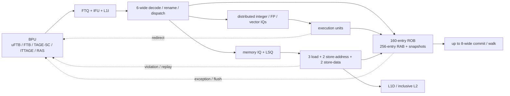

# XiangShan Kunminghu — A Current Open Case Study in Speculative CPU Microarchitecture

> **First-time reader orientation:** XiangShan is an open-source high-performance RISC-V central processing unit (CPU). This case study uses its current Kunminghu documentation to show how prediction, out-of-order scheduling, memory speculation, replay, and recovery connect. Configuration numbers describe the documented typical build, not an unchangeable product specification—the source is parameterized and continues to evolve.

> **Abbreviation key — skim now and return as needed:** central processing unit (CPU); reduced instruction set computer (RISC); instruction set architecture (ISA); out-of-order (OoO); program counter (PC); branch prediction unit (BPU); fetch target buffer (FTB); micro fetch target buffer (uFTB); tagged geometric-history-length predictor (TAGE); statistical corrector (SC); indirect-target TAGE (ITTAGE); return-address stack (RAS); fetch target queue (FTQ); instruction fetch unit (IFU); instruction cache (ICache or L1I); translation lookaside buffer (TLB); reorder buffer (ROB); rename allocation buffer (RAB); register alias table (RAT); physical register file (PRF); issue queue (IQ); load-store unit (LSU); load queue (LQ); store queue (SQ); memory dependence predictor (MDP); miss status holding register (MSHR); load-reserved/store-conditional (LR/SC); memory-mapped input/output (MMIO); physical memory attribute (PMA); physical memory protection (PMP); error-correcting code (ECC).

> **Prerequisites:** [Speculative Execution](../02_Frontend_and_Prediction/03_Speculative_Execution.md), [Advanced Scheduling, Wakeup, and Replay](../03_Out_of_Order_Backend/04_Advanced_Scheduling_Wakeup_and_Replay.md), [Branch Prediction](../02_Frontend_and_Prediction/01_Branch_Prediction_Deep_Dive.md), and [Load-Store Unit](../03_Out_of_Order_Backend/02_Load_Store_Unit_and_Memory_Ordering.md).
> **Hands off to:** [Cache Microarchitecture](../04_Cache_Hierarchy/01_Cache_Microarchitecture.md), [Memory Consistency](../06_Coherence_and_Consistency/02_Memory_Consistency_and_Atomics.md), and [CPU Simulation](../08_Simulation/00_Index.md).

---

## 0. Scope and source discipline

XiangShan is unusually valuable because module-level design documents expose mechanisms that commercial CPU descriptions usually hide. They show the actual recovery pointers, replay causes, wakeup paths, and queue roles—not only a marketing block diagram.

The documents are also a living engineering record. Pages routed under `kunminghu-v3` may label an individual module `V2R2`, `draft`, or carry a specific document date. This chapter therefore follows three rules:

1. attribute numeric configuration to the official **typical Kunminghu V2** table or a named current module document;
2. describe V3-specific frontend material as documented design work, not shipped-silicon fact;
3. avoid inferring generational size trends when the official pages do not establish them.

That removes an earlier common error: confusing the **160-entry ROB** with the separately documented **256-entry RAB**. ROB tracks completion and retirement; RAB retains rename history for commit or recovery walking.

## 1. Current documented machine shape

The official typical Kunminghu V2 configuration lists:

| Structure | Documented typical value | What the number means |
|---|---:|---|
| pipeline | 13 stages | latency/frequency and redirect-depth choice |
| decode / rename | 6 / 6 per cycle | frontend-to-backend allocation width |
| commit | up to 8 per cycle | architectural retirement bandwidth |
| ROB / RAB | 160 / 256 entries | completion window versus rename-history storage |
| integer / FP / vector PRF | 224 / 192 / 128 | physical destinations available to renamed work |
| load / store queue | 72 / 56 entries | in-flight memory-operation capacity |
| integer IQ | four × 24 entries | distributed scalar scheduling windows |
| FP IQ | three × 18 entries | distributed floating-point scheduling windows |
| memory IQ | 16 entries | scalar memory scheduling window |
| load / store-address / store-data units | 3 / 2 / 2 | memory execution bandwidth |
| L1I / L1D | 64 or 128 KiB configurable | private first-level cache capacity |
| L2 | 512 KiB–1 MiB, 8-way, inclusive | private next-level cache and coherence point |
| L3 | 2–16 MiB, 8-way, non-inclusive | shared capacity below the core |
| documented mispredict penalty | 13 cycles | control-speculation recovery cost in the typical table |

The important pattern is heterogeneity. One “six-wide” label hides four integer IQs, three FP IQs, a memory IQ, vector execution, and asymmetric memory ports. Each operation class receives the window and datapath it needs rather than sharing one globally multiported structure.

## 2. A multi-stage speculative frontend

The BPU does not wait for one perfect prediction. It composes several structures with different latency and specialization:

- **uFTB** gives a fast early prediction for common branches;
- **FTB** describes fetch blocks, branch positions, types, and targets;
- **TAGE-SC** predicts conditional direction using geometric history plus a statistical correction;
- **ITTAGE** predicts indirect branch targets;
- **RAS** predicts function returns.

The early stage keeps fetch moving. Later stages may produce a different answer and override the earlier path. This creates speculation *inside the predictor*: a late override flushes frontend work even before a branch reaches backend execution.

### 2.1 FTQ as lifecycle storage

The FTQ sits between BPU and IFU. A prediction block enters through several BPU stages; later-stage information overwrites or refines earlier fields. The queue then:

- sends fetch requests to the IFU;
- retains PC and predictor metadata;
- receives predecode information;
- restores pointers on predecode or backend redirects;
- returns trusted metadata for predictor training after commit;
- uses BPU runahead to issue instruction prefetches.

Four pointer roles in the documented lifecycle are instructive: BPU production, IFU request, IFU writeback/predecode, and commit/training. They progress at different rates. A redirect must restore each pointer to a boundary consistent with the surviving prediction blocks.

### 2.2 Speculative history and return prediction

TAGE, SC, and ITTAGE use branch histories. The BPU updates history with predicted outcomes because committed outcomes arrive too late to predict the next blocks. Redirect logic restores corrected history.

The RAS has the same contamination problem. Current documentation describes a persistent design separating speculative movement from a commit-backed state so wrong-path call/return activity does not irreversibly damage prediction. This is a concrete example of the general rule: predictor state needs its own checkpoint or persistence scheme, not just a pipeline flush.

### 2.3 Fetch-directed instruction prefetch

The BPU can run ahead of the IFU. FTQ entries not yet consumed by normal fetch supply future addresses to the ICache prefetch path. Current V3 ICache documentation names fetch-directed instruction prefetch and describes a `WayLookup` queue that decouples metadata/prefetch work from data delivery.

The subtlety is cancellation. A later BPU stage can override an earlier predicted block while its prefetch is in flight. Prefetch-pipeline and `WayLookup` entries therefore carry FTQ identity and accept BPU/backend flushes. A performance optimization has become a distributed stale-request problem.

## 3. Rename, ROB, RAB, and snapshots

Rename maps ISA registers onto a larger physical namespace so independent instructions do not wait on false name dependencies. Current backend documentation lists move elimination and instruction fusion alongside rename. Move elimination can map the destination to an existing physical value instead of executing a data-copy operation; fusion represents a common instruction pair with less backend work.

The ROB is a 160-entry circular program-order structure. Documentation describes banked access, up to eight entries committed or walked per cycle, compressed groups, exception selection, vector completion concerns, and redirect handling.

The RAB is separate. It maintains rename changes used during commit or recovery walks. This separation lets the ROB optimize completion/retirement metadata while the RAB preserves old mappings and reclamation information.

### 3.1 Snapshot recovery

Kunminghu documentation describes four coordinated rename snapshots. A snapshot includes or aligns:

- a ROB position;
- speculative RAT state;
- free-list head;
- vector-type state;
- related control pointers.

Snapshots are created around branch jumps because branch mispredictions are frequent redirect sources. Periodic snapshots—documented around groups of committed-width operations—provide coverage when no suitable branch snapshot exists. On redirect, the machine selects an older legal snapshot and walks only the remaining interval.

The snapshot flag travels with renamed operations so modules associate the state with the same ROB index. This synchronization is the hard part. Independently “close” snapshots of RAT and ROB are not correct if they represent different instruction boundaries.

## 4. Distributed scheduling and speculative wakeup

The issue system has specialized queues for scalar integer, vector/floating-point, scalar memory, and vector memory operations. The documented IQ supports two enqueue and two dequeue ports in its generic form, oldest-ready selection, age detectors, speculative wakeup, wakeup-signal replication, and early writeback-conflict detection.

For fixed-latency operations, a `WakeupQueue` shifts the producer through a latency-aligned pipeline and wakes dependents before final writeback. This lets a consumer issue in time to use forwarding instead of waiting an extra register-file cycle.

Issue entries support both normal writeback wakeup and speculative wakeup. They also keep cancellation/feedback state. Load-dependent consumers carry short dependency metadata so a late load cancellation can invalidate the wakeup chain.

This is a high-value advanced mechanism because it exposes both sides:

- **fast path:** predict result availability and shorten dependent latency;
- **repair path:** find and cancel consumers when the result is late.

Speculative wakeup without cancellation is incorrect. Cancellation without adequate identity can cancel an unrelated newer use of the same queue slot.

## 5. Memory speculation and replay

The LSU has three load units, two store-address units, and two store-data units in the typical configuration. Loads may execute while older store addresses or data remain unresolved, so the memory system must predict dependencies and validate the result.

### 5.1 Memory dependence prediction

Official XiangShan material describes a load-wait table and a store-set variant. The predictor uses instruction PCs around rename/dispatch to decide whether a load should wait for one or more older stores. Violations train the predictor; periodic invalidation prevents stale relationships from accumulating forever.

This is not address prediction. It is scheduling prediction: “this static load has historically conflicted with these older stores, so do not issue it yet.” Loads without a learned dependency proceed aggressively.

### 5.2 Store-to-load forwarding

A speculative load may obtain bytes from several places. Current LSU documentation gives priority:

$$
\text{StoreQueue} > \text{SBuffer} > \text{DCache}.
$$

The youngest relevant older store must override an older buffered or cached value. Partial overlaps may require byte merging. Address match with missing store data produces a replay rather than returning stale cache data.

### 5.3 Load replay queue

`LoadQueueReplay` stores loads that must execute again. Its cause bits distinguish conditions including memory-dependence violation, TLB miss, cache miss, and forwarding-related blockage. Cause-specific readiness prevents blind retries.

When eligible replays exist, priority separates high-impact causes from ordinary ones; otherwise an age detector can select the oldest entry. Replay therefore has both a correctness role and a service policy. Without fairness, repeated new misses can starve an old load and block retirement.

### 5.4 Ordering checks and redirects

The load pipeline checks read-after-read and read-after-write relationships and can generate load–load or store–load violation redirects. The redirect controller arbitrates these against branch redirects and ROB flushes, choosing the oldest valid redirect that has not already been squashed by an older event.

This “oldest wins” rule is fundamental. Repairing a younger violation while an older mispredicted branch removes it would waste work and may restore the machine to an inconsistent point.

## 6. Exceptions, MMIO, and non-cacheable speculation

Not every memory access may speculate equally. MMIO can have device side effects, so documented MMIO operations wait until they reach the ROB head and older instructions complete. Address translation and PMA/PMP checks must pass before the uncache path performs the operation.

Idempotent non-cacheable memory is different. A load with no harmful external side effect may execute out of order and speculatively, subject to the RISC-V weak memory ordering contract. This distinction—device side effect versus merely uncached—is more precise than “all uncached accesses are slow and ordered.”

Exceptions detected in execution are recorded, but the ROB preserves the oldest exception and raises it only at a precise retirement boundary. Younger speculative faults disappear if an older redirect squashes them.

## 7. Current V3 frontend work

Current V3 ICache design material, explicitly marked draft and dated in 2026, documents several advanced frontend mechanisms:

- up to two fetch blocks in one accepted request under bank/page constraints;
- decoupled two-block prefetch and fetch through `WayLookup`;
- fetch-directed instruction prefetch from the FTQ;
- configurable MSHRs for outstanding misses;
- banked data storage for lower power;
- parity/ECC checks and error injection;
- flush handling for BPU overrides, backend redirects, and `fence.i`.

This material should be read as design documentation with stated status, not silently folded into the fixed V2 table. Its value is architectural: it shows how a modern frontend increases instruction bandwidth without simply adding another fully independent cache port.

## 8. What the old high-level story missed

Saying “XiangShan is a six-wide OoO RISC-V core with TAGE” omits most of the advanced design:

- speculation occurs at multiple BPU stages, not only at branch execution;
- predictor history and return state need recovery;
- FTQ metadata lives from prediction through commit;
- rename uses coordinated snapshots plus residual walking;
- issue queues predict wakeup and carry cancellation feedback;
- loads predict memory dependencies and replay for several distinct causes;
- redirect arbitration spans frontend, execution, memory, and retirement;
- instruction prefetch shares identity and flush rules with control speculation;
- MMIO, non-cacheable, and cacheable memory have different speculation permissions.

The CPU is therefore best understood as several optimistic distributed protocols sharing one age order.

## 9. Verification architecture

XiangShan's open ecosystem includes differential testing against an ISA reference model, but advanced speculation needs more than final register comparison. Verification should combine:

- differential retirement checking for architectural state;
- assertions on ROB/RAB/snapshot pointer relationships;
- directed simultaneous redirects from branch, load, and exception sources;
- stale-response tests after FTQ, LSQ, MSHR, and IQ-slot reuse;
- random load/store alias and forwarding cases;
- replay fairness and no-livelock properties;
- predictor-history/RAS restore checks;
- MMIO tests proving no wrong-path device effect;
- transient-execution security analysis beyond ISA correctness.

Module documents expose the identities and state transitions needed to write these properties. That is one of the strongest educational benefits of an open core.

## 10. Worked examples

**1 — ROB and RAB are not interchangeable.** A 160-entry ROB tracks whether operations may retire. A 256-entry RAB stores rename history that may need to be committed or walked. Reporting “256-entry ROB” by reading the RAB value exaggerates the speculative completion window by 60% and leads to incorrect queue/latency reasoning.

**2 — Distributed integer capacity.** Four 24-entry integer IQs provide 96 physical slots, but no instruction can necessarily use every slot. If one execution class maps to one full queue while the others have space, dispatch still stalls for that class. Aggregate capacity is not interchangeable capacity.

**3 — Snapshot recovery.** A redirect lies 61 operations past the newest usable snapshot. With six RAB walk entries/cycle, residual recovery takes at least $\lceil61/6\rceil=11$ walk cycles plus restore/control overhead. Without a snapshot, walking 145 operations would take at least 25 cycles. Snapshot placement reduces average recovery distance; it does not eliminate walking.

**4 — Speculative load decision.** Conservatively waiting for older stores costs 6 cycles on average. A learned load violates 3% of the time and redirect recovery costs 13 cycles. Expected violation cost is $0.03\times13=0.39$ cycles/load, so aggressive issue is attractive. The MDP should stall the exceptional PCs rather than every load.

## Numbers to remember

| Quantity | Current documented typical value | Meaning |
|---|---:|---|
| pipeline / mispredict penalty | 13 stages / 13 cycles | frontend speculation is expensive enough to justify layered prediction |
| decode / rename / commit | 6 / 6 / up to 8 | allocation and retirement are asymmetric |
| ROB / RAB | 160 / 256 | completion window is distinct from rename-history storage |
| physical registers | 224 integer, 192 FP, 128 vector | separate renamed namespaces |
| load / store queues | 72 / 56 | memory speculation capacity |
| integer IQs | 4 × 24 | distributed scheduling, not one 96-entry universal queue |
| FP IQs | 3 × 18 | separate scheduling pressure and execution mapping |
| memory execution | 3 load, 2 store-address, 2 store-data | asymmetric address/data bandwidth |
| snapshots | 4 in current CtrlBlock documentation | fast recovery points plus walk fallback |
| branch predictors | uFTB, FTB, TAGE-SC, ITTAGE, RAS | latency-tiered and function-specialized |

## Cross-references

- [Speculative Execution](../02_Frontend_and_Prediction/03_Speculative_Execution.md) provides the common lifecycle used by every mechanism here.
- [Advanced Scheduling, Wakeup, and Replay](../03_Out_of_Order_Backend/04_Advanced_Scheduling_Wakeup_and_Replay.md) derives IQ, wakeup, cancellation, ROB compression, and snapshot trade-offs.
- [Branch Prediction](../02_Frontend_and_Prediction/01_Branch_Prediction_Deep_Dive.md) explains TAGE-SC, ITTAGE, RAS, and FTQ theory.
- [Load-Store Unit](../03_Out_of_Order_Backend/02_Load_Store_Unit_and_Memory_Ordering.md) supplies the generic memory-order model instantiated here.
- [gem5](../08_Simulation/01_gem5.md) shows how to model and test these pipeline choices.

## References

1. XiangShan Team, “Typical Kunminghu V2 Configurations” — [user guide](https://docs.xiangshan.cc/projects/user-guide/en/kunminghu-v2/typical-configuration/).
2. XiangShan Team, “Kunminghu V3 Backend Overview” — [design document](https://docs.xiangshan.cc/projects/design/en/kunminghu-v3/backend/).
3. XiangShan Team, “Branch Prediction Unit” — [design document](https://docs.xiangshan.cc/projects/design/en/kunminghu-v3/frontend/BPU/).
4. XiangShan Team, “Fetch Target Queue” — [design document](https://docs.xiangshan.cc/projects/design/en/kunminghu-v3/frontend/FTQ/).
5. XiangShan Team, “CtrlBlock and Snapshot Recovery” — [design document](https://docs.xiangshan.cc/projects/design/en/kunminghu-v3/backend/CtrlBlock/).
6. XiangShan Team, “IssueQueue” — [design document](https://docs.xiangshan.cc/projects/design/en/kunminghu-v3/backend/Schedule_And_Issue/IssueQueue/).
7. XiangShan Team, “Load Store Unit and Load Replay Queue” — [LSU](https://docs.xiangshan.cc/projects/design/en/kunminghu-v3/memblock/LSU/) and [LoadQueueReplay](https://docs.xiangshan.cc/projects/design/en/kunminghu-v3/memblock/LSU/LSQ/LoadQueueReplay/).
8. XiangShan Team, “Kunminghu V3 ICache” — [draft design document](https://docs.xiangshan.cc/projects/design/en/kunminghu-v3/frontend/ICache/).
9. OpenXiangShan, “XiangShan Source Repository” — [GitHub](https://github.com/OpenXiangShan/XiangShan).

---

[Core Case Studies index](00_Index.md) · [CPU Architecture](../00_Index.md)
