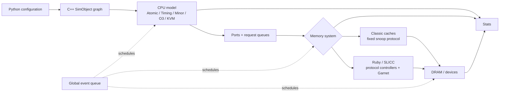

# gem5 — A Configurable Full-System Architecture Simulator

> **First-time reader orientation:** gem5 is software that models processors, caches, memory, devices, and sometimes an operating system. “Full-system” means the simulator can model privileged software and devices, not that every timing detail is automatically accurate. A model configuration is a hypothesis that must be calibrated and validated for the question being asked.

> **Abbreviation key — skim now and return as needed:** central processing unit (CPU); system on chip (SoC); instruction set architecture (ISA); reduced instruction set computer (RISC); register-transfer level (RTL);
> instructions per cycle (IPC); cycles per instruction (CPI); instruction-level parallelism (ILP); memory-level parallelism (MLP); misses per thousand instructions (MPKI);
> design-space exploration (DSE); out-of-order (OoO); translation lookaside buffer (TLB); page-table entry (PTE); address-space identifier (ASID);
> reorder buffer (ROB); miss status holding register (MSHR); load-store queue (LSQ); issue queue (IQ); physical register file (PRF);
> arithmetic logic unit (ALU); dynamic random-access memory (DRAM); double data rate (DDR); level-one cache (L1); level-two cache (L2);
> last-level cache (LLC); network on chip (NoC); direct memory access (DMA); Advanced Microcontroller Bus Architecture (AMBA); AXI Coherency Extensions (ACE);
> Coherent Hub Interface (CHI); tagged geometric-history-length predictor (TAGE); Modified, Exclusive, Shared, Invalid (MESI); Modified, Owned, Exclusive, Shared, Invalid (MOESI); virtual address (VA);
> physical address (PA); operating system (OS); floating point (FP); million instructions per second (MIPS); Kernel-based Virtual Machine (KVM);
> control and status register (CSR); interprocessor interrupt (IPI); initiation interval (II); program counter (PC); region of interest (ROI); input/output (I/O); application binary interface (ABI); executable and linkable format (ELF);
> kilobyte (KB); megabyte (MB); gigahertz (GHz).

> **Prerequisites:** [Simulation_Methodology](../../05_Architecture_Foundations_and_Methods/05_Simulation_Methodology/01_Simulation_Methodology.md) (the event engine, the functional/timing split, ROI/warm-up/sampling — this page is that machinery made concrete in one tool), [OoO_Execution](../03_Out_of_Order_Backend/01_OoO_Execution.md) (the structures the O3 model tracks).
> **Hands off to:** [Analytical_Models](../../05_Architecture_Foundations_and_Methods/05_Simulation_Methodology/02_Analytical_Models.md) (the closed-form duals of every model here), [Full_Chip_Modeling](../../04_SoC_and_Chiplet_Architecture/01_System_Modeling/01_Full_Chip_Modeling.md) (feeding gem5 activity into McPAT for the perf→power→thermal loop), [DDR_Controller](../../04_SoC_and_Chiplet_Architecture/02_Shared_Memory/01_DDR_Controller.md) (the DRAM device gem5's memory controller abstracts).

---

## 0. Why this page exists

gem5 is the de-facto open simulator for computer-architecture research and a common industrial pre-RTL exploration tool, but "I ran it in gem5" says almost nothing about a number's trustworthiness. A gem5 result is the product of **three orthogonal choices** — *which CPU timing model, which memory system, and which system mode* — and each choice moves you a full rung on the fidelity–speed ladder of [Simulation_Methodology §2](../../05_Architecture_Foundations_and_Methods/05_Simulation_Methodology/01_Simulation_Methodology.md). An `AtomicSimpleCPU` IPC is not a microarchitecture claim; an uncalibrated `O3CPU` can be 2× off; a Classic-memory coherence study cannot see the protocol races a Ruby study can. This page is about **what each of those knobs actually models, how a binary becomes a statistic, and the error you inherit.** It assumes the concepts from the methodology page and shows how gem5 realizes them.

The single habit to carry: **name the (mode × CPU model × memory system) triple before quoting any gem5 number** — it fixes the error bar.

### System view — configuration becomes an event-driven machine

Python configuration instantiates C++ SimObjects. CPU models generate memory requests through ports; Classic or Ruby supplies the cache/coherence hierarchy; controllers and devices schedule future events on one time base; the statistics package turns those events into measured output.



---

## 1. What gem5 is — one functional core, many timing models

gem5 is an **execution-driven, discrete-event, modular** simulator built from **SimObjects** (Python-configured, C++-implemented components) wired together by **ports**. It supports several ISAs (x86, Arm, RISC-V, and others) and is released on a rolling `YY.M` cadence (v25.0 in 2025). It is the union of two ancestors — M5 (the CPU/system side) and GEMS/Ruby (the memory/coherence side) — which is exactly why it carries *two* memory systems (§4).

Its defining architectural decision is the one [Simulation_Methodology §1](../../05_Architecture_Foundations_and_Methods/05_Simulation_Methodology/01_Simulation_Methodology.md) calls the functional/timing split: a **functional model** guarantees architectural correctness (registers, memory end up right) while a separate **timing model** decides *when* each event happens. gem5's canonical realization is the **execute-in-execute** O3 model (§3), where the same instruction stream that produces the right answer also drives the pipeline timing, so one functional core feeds many timing fidelities. The practical consequence: you pick fidelity per run by swapping one SimObject, and the *same* workload can be fast-forwarded functionally and then measured in detail (§7). Quantitatively this is the lever of the slowdown identity $S=wf/R_h\approx w$ of [Simulation_Methodology §2.1](../../05_Architecture_Foundations_and_Methods/05_Simulation_Methodology/01_Simulation_Methodology.md) (where $S$ = slowdown, $w$ = host instructions per simulated cycle, $R_h$ = host retirement rate, $f$ = target clock): the functional core fixes the *answer* while the swapped timing SimObject fixes $w$ — how much bookkeeping each simulated cycle demands — and so the run's speed and its error bar together. §3.1 reads $w$ off each CPU model; §4.1 off each memory system.

---

## 2. SE vs FS — the "is there an operating system?" axis

The mode determines **whether a real OS exists in the simulation**, and it is the choice most often gotten wrong. It is orthogonal to the CPU model (§3) and the memory system (§4) — any of the four CPUs runs in either mode — but it decides *which half of the machine is real*: user space alone, or user space plus a genuine kernel on modeled hardware. That decides which numbers mean anything.

### 2.1 SE mode — the kernel is a table of function calls

In **syscall-emulation (SE)** mode gem5 runs a user-space ELF directly: a `Process` object loads the binary, lays out the initial stack (argv/envp/auxv), sets the initial `brk`, and builds a **functional page table** (`EmulationPageTable`) — a plain VA→PA map *inside the simulator*, not a radix tree in guest memory. There is **no kernel, no bootloader, no devices.** Everything a kernel would do is emulated at the syscall boundary:

- **Syscalls are dispatched through a table.** When the CPU decodes the ISA's syscall instruction (x86 `syscall`, Arm `svc`, RISC-V `ecall`), gem5 intercepts it and indexes a per-ABI **syscall-descriptor table** by syscall number, calling the matching C++ handler. The handler's *class* is the whole accuracy story:
  - **Serviced inside gem5** — memory (`brk`, `mmap`, `munmap`), process/thread (`clone`, `getpid`, `exit`, `set_tid_address`), synchronization (`futex`, via an internal `FutexMap`), and time (`clock_gettime` returns *simulated* time). These mutate simulator state directly and cost essentially nothing in modeled cycles.
  - **Passed through to the host** — file I/O (`openat`, `read`, `write`, `close`, `stat`) runs against **real host file descriptors**, optionally remapped by a redirected / "faux" filesystem so guest paths resolve into a supplied directory and synthesized `/proc` entries match the modeled core count. The *data* is real; the *time* is the host's, not a modeled storage stack.
  - **Ignored with a warning** — a long tail of syscalls are no-ops that return success. Convenient, and a quiet source of error the one time one of them mattered.
- **Memory is allocated lazily and for free.** First touch of a mapped-but-unbacked page makes gem5 allocate a physical frame and extend the `EmulationPageTable` — functionally, with **no page-fault event and no timing.** `mmap`/`brk` merely grow the map.
- **Translation has no real walk.** The TLB is still modeled for timing, but a miss is filled by consulting the *functional* page table; gem5 does **not** issue dependent PTE reads into the modeled memory system. So an SE TLB miss costs a modeled constant, not the walk of [TLB_and_Virtual_Memory §5](../05_Virtual_Memory/01_TLB_and_Virtual_Memory.md) — the page-walk-cache traffic, the walk's own cache pressure, and TLB-shootdown cost are simply absent.
- **Threads exist; a scheduler does not.** `clone` spawns a new `ThreadContext`, which gem5 places on an available CPU context — so you must supply as many contexts as peak live threads. There is **no OS scheduler** multiplexing more threads than contexts: no time-slice, no preemption, no migration. Lock *contention* is visible through the memory system (a real `futex` on a real cache line); *scheduling* effects are not.

SE's virtue is exactly this thinness — drop in a statically-linked binary and go. It is the correct mode for SPEC-style and HPC compute kernels, microbenchmarks, and any study whose object lives entirely in user space.

### 2.2 FS mode — a real kernel on modeled hardware

In **full-system (FS)** mode gem5 boots an **unmodified OS** (typically Linux) on a modeled platform, and every mechanism SE fakes becomes real *because the kernel itself is running as guest code*:

- **It boots like hardware.** gem5 loads a bootloader, a kernel image (`vmlinux`), and — on Arm — a **device-tree blob** describing the modeled hardware; the kernel initializes the MMU, probes and initializes drivers by reading device registers, mounts the **disk image** as its root filesystem, runs `init`, and reaches the workload. Nothing is short-circuited.
- **Devices are memory-mapped SimObjects.** Each device — interrupt controller (Arm **GIC**, x86 **APIC**, RISC-V **PLIC**), timer, **UART** console, **IDE/VirtIO** disk, optional NIC — claims one or more **physical address ranges** on the I/O crossbar. A load/store whose physical address lands in a device's range is routed by the crossbar to that device's `read`/`write` handler — the same MMIO path real hardware uses — and the device may **raise an interrupt** the controller then delivers to a CPU, or issue its own **DMA** accesses that contend for memory bandwidth.
- **The page-table walk is real.** The guest kernel builds actual page tables in guest-physical memory; on a TLB miss gem5's hardware **`TableWalker`** issues real *timing* PTE reads through the cache hierarchy — the dependent-read chain of [TLB_and_Virtual_Memory §5](../05_Virtual_Memory/01_TLB_and_Virtual_Memory.md), page-walk-cache and cache-pressure effects included. Page faults trap into the real kernel, so **demand paging, copy-on-write, ASID management, and TLB shootdowns** all happen and cost modeled cycles.
- **The scheduler is real.** Timer interrupts drive the actual Linux scheduler; context switches, time-slicing, CPU migration, and load balancing execute as guest code and land in the cycle count.

FS is the only mode whose numbers **include the kernel**. The price is a heavier setup (kernel + disk image + bootloader + DTB) and the boot itself — which is exactly what the checkpoint / KVM machinery of §7 exists to amortize.

### 2.3 The difference that changes the numbers — and the rule

The two modes are not two fidelities of one machine; they **model different machines**, and SE's omissions are *structural* in the sense of [Simulation_Methodology §8](../../05_Architecture_Foundations_and_Methods/05_Simulation_Methodology/01_Simulation_Methodology.md) — no SE parameter can synthesize a mechanism SE does not contain:

| Axis | SE (syscall emulation) | FS (full system) |
|---|---|---|
| Kernel code | none — syscalls host-serviced / emulated | real, runs on the modeled CPU |
| Syscall / page-fault time | host's, unmodeled | modeled kernel path |
| Page-table walk | functional lookup, no memory traffic | real `TableWalker`, dependent reads through caches |
| Shootdown / demand paging / COW | absent or approximated | real |
| Devices / interrupts / DMA / I/O | none | fully modeled (MMIO + IRQ + DMA) |
| Scheduler (preempt, slice, migrate) | none — threads pinned to contexts | real Linux scheduler |
| Setup | one binary | kernel + disk + bootloader (+ DTB) |

Restated as *what SE structurally cannot show* — the list an auditor checks before trusting an SE number:

- **No real OS scheduler** — context-switch cost, time-slicing, and migration are absent, so multithreaded server workloads with real contention and tail latency are mis-measured.
- **No drivers, interrupts, or DMA** — driver overhead, IRQ latency, and DMA-driven I/O do not exist; anything I/O-bound is meaningless in SE.
- **No real kernel-side syscall cost** — the host services the call, so syscall- and page-fault-heavy workloads (`fork`/`exec` servers, allocators that fault often) are under-counted.
- **No real virtual-memory management** — the §5 page walk, TLB shootdowns, demand paging, and COW are only approximated (contrast [TLB_and_Virtual_Memory](../05_Virtual_Memory/01_TLB_and_Virtual_Memory.md)).

The envelope: for a workload that lives in user space the two agree closely — the kernel is off the critical path, so its absence costs nothing, and SE's speed and simplicity win. The moment the OS, drivers, real multithreaded scheduling, page-fault behavior, or I/O are *part of what you are measuring*, SE is not merely less precise but structurally wrong. **The rule: SE for user-space compute; FS the instant the kernel is in the measurement — and never quote an I/O, syscall, or scheduler number from SE.**

### 2.4 The simulation path forks by ISA

gem5 is multi-ISA, so "SE" and "FS" are each a *family* of paths — one per target ISA — because the very things SE emulates and FS models are ISA-defined. Choosing x86 vs Arm vs RISC-V swaps concrete objects on **both** paths.

**In SE, the fork is the ABI (application binary interface).** "Emulate a syscall" is only defined relative to an ABI: the trap instruction, how the syscall number and arguments are passed, and the syscall-number table all differ — so gem5 carries a per-ISA/per-OS `Process` subclass (`X86Process`, `ArmProcess`, `RiscvProcess`, …) and a matching syscall-descriptor table:

| Target (Linux) | trap instruction | syscall-# reg | argument registers | return reg |
|---|---|---|---|---|
| x86-64 | `syscall` | `rax` | `rdi, rsi, rdx, r10, r8, r9` | `rax` |
| Arm AArch64 | `svc #0` | `x8` | `x0–x5` | `x0` |
| RISC-V (RV64) | `ecall` | `a7` | `a0–a5` | `a0` |

The *same* C `write()` therefore decodes through three different register conventions and syscall numbers before reaching the *same* host-passthrough handler — the handler is shared, the decode is per-ISA — and the ELF loader and initial stack/`auxv` layout are per-ISA too. What is **not** ISA-specific in SE is the memory model: the functional `EmulationPageTable` is a flat map whatever the target, which is exactly why no SE target reproduces a real page walk (§2.1).

**In FS, the fork is the whole platform and privileged ISA.** Because FS boots a real kernel on modeled hardware, everything the privileged architecture defines becomes a different SimObject graph:

| Target | privilege model | interrupt controller | page-table format | boot path |
|---|---|---|---|---|
| x86-64 | rings 0–3, MSRs, long mode | LAPIC + IO-APIC | 4-level PML4 (or 5-level) | real→protected→long mode, e820/ACPI |
| Arm AArch64 | EL0–EL3, `TTBR0/1`, system regs | GIC (v2/v3) | multi-level, 4/16/64 KB granule | bootloader + **device-tree blob** |
| RISC-V | M/S/U, CSRs, `satp` | PLIC (external) + CLINT (timer/IPI) | Sv39/48/57 | **OpenSBI** M-mode firmware → S-mode kernel + DTB |

*(LAPIC/IO-APIC = local + I/O Advanced Programmable Interrupt Controllers; GIC = Generic Interrupt Controller; PLIC = Platform-Level Interrupt Controller; CLINT = Core-Local Interruptor; TTBR = translation-table base register; MSR = model-specific register; PML4 = page-map level 4; DTB = device-tree blob; SBI = supervisor binary interface.)*

The path differences are concrete, not cosmetic. On a TLB miss the modeled hardware walker chases an x86 **PML4** (4 reads), an Arm stage-1 table (depth set by the granule), or a RISC-V Sv39 tree (3 reads — exactly the trace of [TLB_and_Virtual_Memory §5](../05_Virtual_Memory/01_TLB_and_Virtual_Memory.md)): *different structures, different read counts, different cache footprints.* Boot differs too — RISC-V comes up in **M-mode firmware (OpenSBI)** that installs the SBI and drops into the S-mode kernel; Arm hands the kernel a **device-tree blob** enumerating the modeled hardware; x86 climbs the real-mode→protected→long-mode ladder with an e820 memory map. Interrupt delivery differs — a PLIC claim/complete handshake vs a GIC distributor/redistributor vs an APIC — so driver and IRQ-latency numbers are platform-specific. **The result-level lesson: an FS number is a claim about (ISA × platform × kernel), not merely "FS" — an Arm/GIC interrupt latency does not carry over to a RISC-V/PLIC system.**

---

## 3. The CPU timing models — a fidelity ladder inside one tool

gem5 ships four core CPU models that span three rungs of the methodology ladder. They differ in **execution order**, **whether memory accesses are atomic or timed**, and **how much of the pipeline they represent**.

| Model | Order | Memory access | What it abstracts / models | Use |
|---|---|---|---|---|
| **AtomicSimpleCPU** | in-order, 1 IPC | *atomic* (latency returned inline) | no pipeline, no contention; memory latency is an estimate folded into the call | fast-forward, warm-up, checkpoint generation, "does the binary run?" |
| **TimingSimpleCPU** | in-order, ≤1 IPC | *timing* (stalls on real memory event) | one instruction at a time, but exposes **memory-system timing and queueing** | memory-system studies where the core is not the point |
| **MinorCPU** | strict in-order, pipelined | timing | a real **4-stage in-order pipeline** (Fetch1, Fetch2, Decode, Execute), scoreboard, configurable functional units, LSQ | in-order cores calibrated to a target (e.g. Arm in-order) |
| **O3CPU** (a.k.a. `DerivO3CPU`) | out-of-order | timing | full OoO structures; **execute-in-execute** | big-core microarchitecture studies — the workhorse |

**AtomicSimpleCPU** uses *atomic* memory accesses: a load/store is a chain of function calls that returns immediately with a *latency estimate*, so there is no decoupling of CPU and memory and **no contention term at all**. It is not a timing model — it is the functional core used to *reach* the region of interest cheaply, or to warm caches, before you switch to something detailed.

**TimingSimpleCPU** keeps the one-instruction-at-a-time front end but issues **real timing memory requests** and *stalls* until the memory system responds. That single change means it sees queueing, bank conflicts, and DRAM latency — the memory system's contention becomes visible — while the core itself stays trivial (no ILP, essentially one outstanding miss). It is the right tool when the *memory hierarchy* is the object of study and the core is a stimulus generator.

**MinorCPU** is an in-order but genuinely **pipelined** model: four stages (Fetch1 pulls cache lines and drives I-TLB/I-cache; Fetch2 splits lines into instructions and does branch prediction; Decode cracks into micro-ops; Execute runs configurable functional-unit pipelines and the LSQ). A **scoreboard** gates issue by tracking which in-flight instructions will write which registers. Minor is meant to be **micro-architecturally correlated to a specific in-order core** — its value is calibration to a real target, not generality.

**O3CPU** is the out-of-order workhorse. Five stages — **Fetch, Decode, Rename, IEW (Issue/Execute/Writeback), Commit** — over the OoO structures the [OoO_Execution](../03_Out_of_Order_Backend/01_OoO_Execution.md) page details: a **reorder buffer (ROB)**, **instruction queue (IQ)**, **load/store queue (LSQ)**, a **physical register file** with a rename free-list. Its distinctive property is **execute-in-execute**: instructions actually execute at the execute stage (not speculatively at decode), which is what lets it model **wrong-path** effects and precise load/store ordering and violation detection — the path effects that make execution-driven simulation worth its cost ([Simulation_Methodology §4](../../05_Architecture_Foundations_and_Methods/05_Simulation_Methodology/01_Simulation_Methodology.md)). As the methodology page argues, the point of the O3 model is not to re-simulate the ALU but to reproduce **which structure saturates first** — ROB-full, LSQ-full, IQ pressure, issue-port limits, or a long dependence chain — so you learn *why* IPC is 1.8 and not 4. The closed-form dual of this model is the **interval/mechanistic model** in [Analytical_Models §3](../../05_Architecture_Foundations_and_Methods/05_Simulation_Methodology/02_Analytical_Models.md).

### 3.1 The ladder quantified — each model's slowdown from the work-per-cycle identity

The four models are four points on the slowdown identity of [Simulation_Methodology §2.1](../../05_Architecture_Foundations_and_Methods/05_Simulation_Methodology/01_Simulation_Methodology.md), evaluated on *one* functional core:

$$S=\frac{w\,f}{R_h}\approx w,\qquad \Theta=\frac{R_h}{w},\qquad w=i_{\text{ev}}\times n_{\text{ev}},$$

where $S$ = wall-clock/target slowdown, $\Theta$ = simulated instr/s, $R_h$ = host retirement rate (instr/s), $f$ = target clock, $w$ = host instructions per simulated cycle, $i_{\text{ev}}$ = host instr per modeled event, $n_{\text{ev}}$ = events per simulated cycle. When the host runs near the target's rate ($R_h\approx f$) the slowdown *is* the work-per-cycle, $S\approx w$. Swapping the CPU SimObject changes only $n_{\text{ev}}$ — **how many modeled state-transitions each simulated cycle demands** — so the ladder is one functional core read at four values of $w$.

Take an illustrative host at $R_h=3\times10^9$ host-instr/s modeling a 3 GHz, IPC-1 target (native $3\times10^3$ MIPS); read $w$ off what each model must do, then $\Theta=R_h/w$ and $S=3000\,\text{MIPS}/\Theta$:

- **AtomicSimpleCPU** schedules *no timing event per access* — it functionally interprets the instruction and folds a latency *estimate* into the inline return, so $n_{\text{ev}}\approx O(1)$ and $w\approx i_{\text{fun}}$ (the host cost of interpreting one target instruction, $\sim\!10^2$–$10^3$). With $w\approx3\times10^2$–$10^3$: $\Theta\approx$ **3–10 MIPS**, $S\approx300$–$10^3\times$ — the interpreted-functional ("~MIPS") rung. It tracks architectural state and an *estimate* of time; it does **not** track a pipeline, queueing, or overlap.
- **TimingSimpleCPU** turns each memory access into a scheduled request/response *event pair* and stalls on it: $w$ climbs a small factor to $\sim\!10^3$, $\Theta\approx$ **1–3 MIPS**, $S\approx10^3\times$. It now tracks memory timing and queueing (the $\rho$ of [Simulation_Methodology §7](../../05_Architecture_Foundations_and_Methods/05_Simulation_Methodology/01_Simulation_Methodology.md)) but with $\le\!1$ outstanding miss it models **MLP $=1$** — no overlap, so it structurally under-counts an OoO core's hidden latency (the exposed-penalty caveat of [Performance_Modeling_and_DSE §2.1](../../05_Architecture_Foundations_and_Methods/02_Performance_Analysis/01_Performance_Modeling_and_DSE.md)).
- **MinorCPU** advances a real 4-stage pipeline *every cycle*, so $n_{\text{ev}}$ jumps to the live stages/scoreboard/LSQ slots touched per cycle: $w\sim\!3\times10^3$–$10^4$, $\Theta\approx$ **0.3–1 MIPS**, $S\sim\!(3$–$10)\times10^3$. It tracks in-order structural hazards and FU occupancy; it does **not** reorder, so ILP the window would find is invisible.
- **O3CPU** walks, each cycle, fetch → decode → rename (free list) → IQ wakeup/select → execute/writeback → in-order commit from the ROB head over the full ROB/IQ/LSQ/PRF; $n_{\text{ev}}$ scales with the *window it scans*, so $w\sim\!10^4$ (rising toward $10^5$ with a detailed Ruby memory system) and $\Theta\approx$ **0.1–1 MIPS**, $S\sim\!(3$–$30)\times10^3$ — the page's headline figure, now derived.

| Model | Tracks | Does **not** track | $n_{\text{ev}}$ driver | $w$ | $\Theta$ | $S$ @3 GHz |
|---|---|---|---|---|---|---|
| **AtomicSimple** | arch state + latency *estimate* | pipeline, queueing, overlap | $O(1)$/instr | $\sim\!3\times10^2$–$10^3$ | 3–10 MIPS | ~300–$10^3$× |
| **TimingSimple** | + real memory timing / queueing | pipeline overlap, MLP $>1$ | mem events/instr | $\sim\!10^3$ | 1–3 MIPS | ~$10^3$× |
| **Minor** | + in-order 4-stage pipe, LSQ | out-of-order issue | stages/cycle | $\sim\!3\times10^3$–$10^4$ | 0.3–1 MIPS | ~$5\times10^3$× |
| **O3** | + full OoO window | its own un-modeled corners (§8) | window slots/cycle | $\sim\!10^4$ | 0.1–1 MIPS | $3\times10^3$–$3\times10^4$× |

**Why O3 is the slow rung — it executes the Little's-law window cycle by cycle.** The interval model *closes* the window analytically ([Analytical_Models §3](../../05_Architecture_Foundations_and_Methods/05_Simulation_Methodology/02_Analytical_Models.md)); O3 does the opposite — it *maintains* the window and pays for it. Each cycle it decides, over the live ROB/IQ/LSQ, which in-flight instructions can wake and issue — precisely the balance [OoO_Execution §3.2](../03_Out_of_Order_Backend/01_OoO_Execution.md) closes with Little's law, $N=\lambda\,\bar T_{\text{res}}$ (in-flight = IPC × residency), and its miss-shadow corollary $N_{\text{ROB}}\ge \text{IPC}\times L_{\text{miss}}/\text{MLP}$. The per-cycle cost is roughly proportional to the window occupancy $N$ it scans, so a server ROB (Golden Cove's 512, sized to overlap ~400 loads against ~100 ns DRAM) makes O3 *both* truer (it captures the MLP that hides the miss) *and* proportionally slower ($w\propto N$). **Fidelity and cost rise together** — the coupling that forces the cheap rungs to exist above it.

**Worked ladder.** Atomic ~3–10 MIPS (~300–$10^3\times$) to O3 ~0.1–1 MIPS ($3\times10^3$–$3\times10^4\times$) is a **one-to-two-order span ($\approx$10–100×) on one functional core** — exactly the functional→cycle-approximate jump of [Simulation_Methodology §2.1](../../05_Architecture_Foundations_and_Methods/05_Simulation_Methodology/01_Simulation_Methodology.md). That 10–100× buys the ability to see *which structure saturates first*; you spend it only where the decision needs it, which is why Atomic fast-forwards and O3 measures (§7).

---

## 4. Classic vs Ruby — two memory systems with different coherence fidelity

gem5's two memory systems are the GEMS/M5 seam, and the choice is about **how faithfully coherence is modeled**.

**Classic memory system.** A fast, port-and-crossbar hierarchy of cache SimObjects with **MSHRs** (bounding outstanding misses) and a **single, hardcoded snooping coherence protocol** (a MOESI-style protocol built into the cache/crossbar objects). It is quick to configure and quick to run, and it is *good enough* for the majority of single-metric studies (cache-size sweeps, MPKI, bandwidth to a point). What it cannot do is let you *change the protocol* or expose protocol-level transient states and races.

**Ruby.** A detailed memory model in which **cache coherence is a first-class, configurable state machine**. Protocols are written in **SLICC** (Specification Language for Implementing Cache Coherence) and compiled to C++. Ruby separates the protocol from the cache indexing and replacement policy, and ships a menu of protocols: `MI_example`, `MESI_Two_Level`, `MOESI_CMP_directory`, `MOESI_hammer`, `MESI_Three_Level`, and **CHI** (Arm's AMBA 5 CHI — see [ACE_and_CHI](../06_Coherence_and_Consistency/03_ACE_and_CHI.md)). Its protocol-independent parts are the **Sequencer** (one per hardware thread; turns loads/stores/atomics into Ruby requests via a *mandatory queue*), the **cache and directory controllers** (the state machines), **MessageBuffers** (both interface and timing buffer between components), and an interconnect that can be the detailed **Garnet** NoC model ([Network_on_Chip](../../04_SoC_and_Chiplet_Architecture/04_On_Chip_Networks/01_Network_on_Chip.md)).

**SLICC** is the load-bearing idea: a protocol is declared as **states** (stable + *transient*), **events** (processor requests, incoming messages, replacements), **transitions** (the mapping from state×event to next state), and **actions** (the atomic operations — enqueue a message, update a block — performed during a transition). The SLICC compiler turns that specification into the C++ controllers. **This is why Ruby, and only Ruby, can model coherence-protocol races, transient-state occupancy, and directory/network contention** — the phenomena that dominate manycore and NoC studies. The cost is speed and setup complexity.

Pick **Classic** for fast single-core-to-modest-SoC studies where the protocol is not under test; pick **Ruby** when coherence protocol, transient-state behavior, directory pressure, or the on-chip network *is* the object of study.

### 4.1 Why Classic is fast and blind, Ruby slow and sighted — an event-count derivation

The speed/fidelity gap between the two memory systems is the same $w$ story as the CPU ladder (§3.1), read off the *memory* path: what separates them is $n_{\text{ev}}$ **per coherence miss.**

**Classic** resolves coherence inside the cache/crossbar objects with one hardcoded MOESI-style snoop. A miss to memory costs a short fixed chain — MSHR allocate → crossbar arbitration → memory access → fill — call it $n_{\text{ev}}^{\text{cls}}\approx3$–5. It *can* therefore show the contention living on those shared resources (MSHR-limited MLP, crossbar/bus bandwidth to a point), but the coherence decision itself is atomic and topology-free: **no per-transient-state event, no per-hop network event.**

**Ruby** replays the same miss as a walk through a SLICC state machine over a modeled network. A load missing to a remote owner on a mesh generates: L1-controller transition (miss) → inject request message → route $\sim\!k$ NoC hops to the directory → directory transition (lookup) → forward to owner → $\sim\!k$ hops → owner transition → data response → $\sim\!k$ hops back → requestor fill. Each hop is a Garnet router event ([Network_on_Chip](../../04_SoC_and_Chiplet_Architecture/04_On_Chip_Networks/01_Network_on_Chip.md)). With $k\approx5$ and three traversals, $n_{\text{ev}}^{\text{ruby}}\approx 3k+4\ \text{transitions}\approx\mathbf{20}$ — a $\sim$**5× event multiplier** on the coherence path. Diluted across the accesses that *don't* miss coherently, that lands Ruby at the folklore **~2–5× slower than Classic**: the price, in the $w$ of the slowdown identity, of making coherence an explicit machine.

**What the extra events buy — the structural-error argument.** Classic's speed is bought by *omitting structure*, and omitted structure is unrecoverable by tuning. Ruby's directory is a finite-rate server; under coherence-miss load $\lambda$ at service rate $\mu_{\text{dir}}$ it runs at utilization $\rho=\lambda/\mu_{\text{dir}}$ and imposes the queueing wait of [Simulation_Methodology §7](../../05_Architecture_Foundations_and_Methods/05_Simulation_Methodology/01_Simulation_Methodology.md),

$$W_q=\frac{\rho}{1-\rho},\qquad \rho=\frac{\lambda}{\mu_{\text{dir}}},$$

where $W_q$ = mean queueing delay (cycles), $\rho$ = directory utilization, $\lambda$ = offered coherence-miss rate, $\mu_{\text{dir}}$ = directory service rate. At $\rho=0.8$ that is $0.8/0.2=\mathbf{4\ \text{cycles}}$ of coherence stall per miss — produced purely by serializing transition events at the directory. **Classic has no directory-server event, hence no $\rho_{\text{dir}}$, hence — by the structural-error theorem of [Simulation_Methodology §8](../../05_Architecture_Foundations_and_Methods/05_Simulation_Methodology/01_Simulation_Methodology.md) — no setting of any Classic parameter can make it show that stall, the transient-state occupancy, or the NoC hotspot.** That is what "blind to protocol-level contention" means: not imprecise, *structurally incapable*. Ruby's CHI protocol encodes the [ACE/CHI](../06_Coherence_and_Consistency/03_ACE_and_CHI.md) transitions (the Snp*/RN/HN-F states) as SLICC transitions, so a coherence or NoC study sees the transient-state and directory pressure the real fabric has — the accuracy gain — for the ~5× event cost.

---

## 5. The discrete-event engine, SimObjects, and ports

gem5 is the **discrete-event simulator** of [Simulation_Methodology §3](../../05_Architecture_Foundations_and_Methods/05_Simulation_Methodology/01_Simulation_Methodology.md) made concrete. Time is measured in **ticks** (default 1 tick = 1 ps, i.e. $10^{12}$ ticks/second); the global `simulate()` entry point runs a `doSimLoop` that **pops one event at a time from a tick-ordered EventQueue** and processes it, where processing an event may schedule new events at `now + latency`. There is no cycle-stepped "update everything each cycle" loop — the engine **time-skips** to the next scheduled event, which is why a memory-bound run (long idle gaps to DRAM) can simulate faster than a compute-bound one of the same length.

Two structural abstractions make this composable:

- **SimObjects** are the model units. Each has a Python configuration class (its parameters — cache size, ROB entries, clock) and a C++ implementation (its behavior and its statistics). A gem5 "config" is a Python script that instantiates and parameterizes a graph of SimObjects; the C++ side then runs the events. This is the DSE knob surface — changing a parameter is editing the Python graph, not the model code.
- **Ports** connect SimObjects and carry **packets** (a `Packet` wrapping a `Request`). A *request port* on a CPU connects to a *response port* on a cache; the memory hierarchy is a chain of such connections. The port protocol comes in the two flavors that name the CPU models: **atomic** (`sendAtomic`/`recvAtomic`, latency returned inline) and **timing** (`sendTimingReq`/`recvTimingResp`, decoupled, response arrives as a future scheduled event). The "apparent recursion" you see in a gem5 call stack — fetch schedules an event that re-enters execution — is not recursion; it is asynchronous event scheduling.

The takeaway an architect should internalize matches the methodology page: **every modeled latency is a `+N` on a scheduled event, and contention emerges only where SimObjects share a port/queue/bank whose events serialize.** A model with no shared resource cannot produce queueing delay.

### 5.1 The tick, and how gem5 puts a number on each event

gem5 is [Simulation_Methodology §3](../../05_Architecture_Foundations_and_Methods/05_Simulation_Methodology/01_Simulation_Methodology.md)'s discrete-event engine concretely: the global `EventQueue` **is** that section's min-heap, `doSimLoop` its pop-min loop, and gem5's per-event *priority within a tick* is exactly the "delta/priority sub-order" the methodology proves necessary to sequence zero-latency (same-tick) updates without breaking causality. The time-ordered-execution invariant holds for the same reason: every modeled latency is a non-negative `+N`-tick offset, so no event schedules a consequence in its own past and pop-min order equals temporal order (the induction proof there). Time-skipping — a memory-bound run simulating *faster* — is that section's activity-not-capacity win ($O(E\log\bar n)$ vs $O(C\!\cdot\!M)$) made concrete.

**Why the tick is 1 ps — a quantization argument.** Every latency and clock period is stored as an *integer* number of ticks, so the tick must be fine enough that rounding is negligible against the smallest thing modeled:

$$p=\operatorname{round}\!\big(10^{12}/f_c\big)\ \text{ticks},\qquad \varepsilon_{\text{round}}\le \tfrac{1}{2p},$$

where $p$ = clock period in ticks, $f_c$ = clock frequency (Hz), $\varepsilon_{\text{round}}$ = fractional rounding error. At $f_c=3$ GHz, $p=\operatorname{round}(333.3)=333$ ticks — a $0.1\%$ error; a 50 ns DRAM latency is $5\times10^4$ ticks (1 part in 50 000). A coarser 1 ns tick would round the 3 GHz period $0.33\to0$ ticks — catastrophic — so 1 ps is the coarsest base keeping every domain (sub-ns clocks to µs I/O) an integer with $\lesssim\!10^{-3}$ drift. The tick is the common time base, fixed by this bound.

**How compute and memory time are assigned — the $(L,II,P)$ cost model realized.** A gem5 timing model never recomputes an op's *result* (the functional core has it, §1); it assigns each op only a **time and an occupancy**, and the minimal-sufficient record is [Simulation_Methodology §6](../../05_Architecture_Foundations_and_Methods/05_Simulation_Methodology/01_Simulation_Methodology.md)'s triple: latency $L$ (when the result reaches dependents), initiation interval $II$ (when the unit accepts the next op), port count $P$ (how many run at once). gem5 stores exactly $(L,II,P)$ per functional-unit class and schedules from them: "issue op" pushes a *result-writeback* event at `now + L·p` ticks and marks the port busy until `now + II·p`; a cache miss pushes its *fill* at `now + t_mem` ticks. The register-wakeup dependence graph does the rest.

*Worked number — the tick arithmetic and the dependence gap.* A pipelined FP adder with $L=4$ cyc, $II=1$ at 3 GHz ($p=333$ ticks/cyc). Issuing at tick $T$ schedules result-ready at $T+4(333)=T+1332$, port free at $T+333$. Eight **dependent** adds resolve at $8\times4=32$ cyc $=10{,}656$ ticks; the **same eight independent** finish at $8\,II+L=12$ cyc $=3{,}996$ ticks — **2.7× apart on one FU**, the entire gap living in the $(L,II)$ schedule, i.e. [Simulation_Methodology §6](../../05_Architecture_Foundations_and_Methods/05_Simulation_Methodology/01_Simulation_Methodology.md)'s "same eight ops, two times" denominated in gem5 ticks. This is why each latency is a `+N` addend a sweep perturbs cheaply — and why a wrong constant silently biases every downstream statistic (§8).

---

## 6. How a workload becomes a statistic

**Input.** In SE mode you feed an ISA binary (plus arguments); in FS mode a disk image + kernel + bootloader and a run script. gem5 can also be trace-driven via the `TraceCPU` / *elastic traces* front end when you want repeatable replay instead of execution-driven fidelity (the trade-off is [Simulation_Methodology §4](../../05_Architecture_Foundations_and_Methods/05_Simulation_Methodology/01_Simulation_Methodology.md)).

For the complete compiler-to-metric chain shared with GPU and NPU tools, first read [Benchmark to Results](../../05_Architecture_Foundations_and_Methods/05_Simulation_Methodology/03_Benchmark_to_Results_End_to_End.md). The concrete gem5 instantiation is below.

### 6.1 Build the exact target binary

gem5 never compiles the benchmark. Build it with a compiler whose target ISA and application binary interface (ABI) match the gem5 binary/configuration. An illustrative RISC-V build-and-inspect sequence is:

```text
riscv64-linux-gnu-gcc -O3 -g -march=rv64gc -mabi=lp64d -static benchmark.c -o benchmark.rv64
riscv64-linux-gnu-readelf -h -l benchmark.rv64
riscv64-linux-gnu-objdump -dr benchmark.rv64
```

`-O3` changes the instruction stream through inlining, vectorization, unrolling, and code motion; `-march` chooses legal ISA extensions; `-mabi` fixes calling convention and data layout; `-static` packages target libraries into the executable so syscall-emulation (SE) mode does not need a target dynamic loader. Static linking increases file/code size and can change cache behavior, so it is a methodology choice, not a harmless convenience.

`readelf` confirms ELF class, machine, entry point, and loadable segments. `objdump` shows the static machine instructions and symbol boundaries. Preserve both outputs with the run: if a later build generates different instructions, its IPC is not an apples-to-apples microarchitecture comparison.

The number of disassembly lines is not `simInsts`. A static instruction at a loop PC creates a new dynamic instruction every iteration. Library/startup instructions also count unless ROI markers exclude them. gem5 additionally reports `simOps` because one ISA instruction can decode into multiple micro-operations; do not divide µops by cycles and label it architectural IPC.

### 6.2 SE and FS create different instruction universes

In **SE mode**, the workload loader maps the ELF's loadable segments, creates the simulated stack containing `argv`, environment and auxiliary data, initializes registers/PC, and starts user code. When the binary executes a system call, gem5 implements the requested service in its syscall-emulation layer. The modeled CPU does **not** execute a guest kernel's system-call path, scheduler, interrupt handlers, page-fault handler, or device driver.

In **full-system (FS) mode**, firmware and the guest kernel execute on the modeled CPU. The guest OS creates page tables, services faults and interrupts, loads the benchmark ELF, maps shared libraries, and schedules threads. The final results include those instructions if they fall inside the measured region. For an algorithmic core study, SE is often the controlled boundary; for page walks, OS scheduling, devices, I/O, virtualization, or kernel-heavy work, FS is required.

This difference is why “same binary” is necessary but not sufficient. Record disk image/kernel, target libraries, guest command line, thread placement, and ROI in FS; record emulated syscall support and host-file mappings in SE.

### 6.3 ELF bytes become StaticInst and dynamic pipeline records

At the entry PC, the CPU fetch path requests instruction bytes through the modeled instruction TLB/cache. The ISA decoder turns those bytes into a `StaticInst`: immutable opcode/operand/semantic information for that machine instruction. Each execution allocates a dynamic record carrying sequence number, predicted PC, renamed operands, effective address, fault state, and stage timing.

For `O3CPU`, a simplified lifetime is:

1. fetch bytes at the predicted PC;
2. decode and, where applicable, expand an ISA instruction into micro-operations;
3. rename destinations and allocate reorder-buffer/issue/load-store entries;
4. issue when operands and a compatible functional unit are ready;
5. call the instruction semantics to obtain its value/address while timing requests determine availability;
6. write back, wake dependents, and finally commit in order;
7. on misprediction/fault/violation, squash younger dynamic records and redirect fetch.

A memory operation builds a request containing virtual address, size, command, byte enables, context and ordering attributes. Translation yields a physical address; cache/Ruby ports turn it into timing messages. The CPU remains blocked or continues with other independent work according to queue availability. The eventual response schedules completion and dependent wakeup. Therefore cycles are created by interactions between this dynamic record and SimObject event queues—not read from the assembly as a fixed per-instruction cost.

### 6.4 Mark, reset, run, dump, and verify

The measurement controller should make the statistics boundary explicit:

```text
boot/load/fast-forward
receive ROI-begin exit event or instruction-count boundary
warm detailed state
m5.stats.reset()
m5.simulate(measurement limit or ROI-end event)
m5.stats.dump()
verify exit cause and benchmark output
```

`m5.simulate()` returns an exit event. Reaching “maximum instruction count,” an ROI marker, normal program exit, work-item event, checkpoint request, and fatal limit are different outcomes. A script that ignores the cause can report a truncated run as success.

The `m5out` directory also contains `config.ini` and `config.json`, which describe the instantiated SimObjects and their resolved parameters. Preserve them with `stats.txt`; the Python script describes intent, while the emitted configuration records what was actually built. If statistics are dumped more than once, `stats.txt` contains multiple delimited snapshots. Post-processing must select or difference the intended snapshot rather than silently reading the first value with a matching name.

### 6.5 From primitive statistics to reported results

Every SimObject registers statistics through gem5's stats system — `Stats::Scalar`, `Vector`, `Distribution`, and **`Formula`** (a derived stat computed from others). At the end of a run, or on an explicit dump, the current value of every stat is written to **`m5out/stats.txt`** as `name  value  # description`. The load-bearing ones:

- `simInsts` / `simOps` — instructions (and micro-ops) committed.
- `system.cpu.numCycles` — cycles the core was modeled as running.
- `system.cpu.ipc` and `system.cpu.cpi` — **Formula** stats, literally `simInsts / numCycles` and its reciprocal.
- `system.cpu.dcache.overallMissRate`, `...demandMisses`, `...overallAccesses` — the cache counters.

**How the headline metrics are computed** — the same accumulation the methodology page describes, but with concrete stat names:

$$\text{IPC}=\frac{\texttt{simInsts}}{\texttt{numCycles}},\qquad \text{MPKI}=1000\times\frac{\texttt{demandMisses}}{\texttt{simInsts}},\qquad \text{miss rate}=\frac{\texttt{demandMisses}}{\texttt{overallAccesses}},$$

$$\text{achieved BW}=\frac{\texttt{bytesRead}+\texttt{bytesWritten}}{\texttt{simSeconds}}.$$

The subtlety that separates a correct result from a wrong one is **the region over which these counters accumulate**. gem5 accumulates continuously, so you bound the region of interest with `m5_work_begin`/`m5_work_end` or `m5_dump_reset_stats` (the `m5` "magic" pseudo-instructions / ops) so that the numerator and denominator cover only the steady-state ROI — never the cold init. Reporting whole-program IPC when the ROI is a kernel is the classic error of [Simulation_Methodology §5](../../05_Architecture_Foundations_and_Methods/05_Simulation_Methodology/01_Simulation_Methodology.md).

---

## 7. Fast-forwarding, checkpoints, and KVM warm-up

Running a trillion-instruction workload at O3 fidelity (~0.1–1 MIPS) is infeasible, so gem5 provides the **sampling machinery** the methodology page insists on — as first-class, switchable objects.

**CPU switching (fast-forward → detailed).** You build a `switch_cpu_list` of `(oldCPU, newCPU)` pairs, mark the detailed CPUs `switched_out=True`, then run the fast CPU to the ROI and call `m5.switchCpus(...)` to hand the architectural state to the detailed model:

```
m5.simulate(fast_forward_ticks)   # AtomicSimpleCPU or KVM: reach the ROI cheaply
m5.switchCpus(switch_cpu_list)    # hand state to O3CPU
m5.simulate(warmup + measure)     # detailed-warm, then count
```

**Checkpoints.** A checkpoint (`cpt.<TICK>` directory) is a snapshot of **architected state (registers, memory) and device state**, restored with `-r N` / `--checkpoint-restore` (and `--restore-with-cpu` because gem5 defaults to restoring into Atomic). Checkpoints let many detailed runs start from one expensive boot/fast-forward. The critical caveat, and the reason warm-up is still required: **microarchitectural state — cache contents, TLB entries, branch-predictor tables — is generally *not* in the checkpoint**, so a detailed CPU restarts with cold structures and *overstates* miss rates until a **detailed warm-up window** refills them. (Ruby checkpointing additionally requires the `MOESI_hammer` protocol, since capturing state needs caches flushed to memory.)

**KVM-accelerated warm-up.** On a virtualization-capable host (x86/Arm), the **KVM CPU** runs the guest under hardware virtualization at **near-native speed** — orders of magnitude faster than Atomic — to blast through boot and uninteresting phases. The trade: under KVM gem5 records **no architectural statistics** (it is purely functional), so KVM is used *only* to reach the ROI, after which you `switchCpus` to Timing/O3 and run a warm-up before measuring. This is precisely the "functional fast-forward, then detailed warm-up, then measure" recipe of [Simulation_Methodology §5](../../05_Architecture_Foundations_and_Methods/05_Simulation_Methodology/01_Simulation_Methodology.md), realized in one config.

### 7.1 Why this machinery exists — the sampling arithmetic, quantified

Fast-forward, checkpoint, and KVM are forced by the sampling-and-warm-up theory of [Simulation_Methodology §5](../../05_Architecture_Foundations_and_Methods/05_Simulation_Methodology/01_Simulation_Methodology.md): (i) you cannot run the whole workload at O3 fidelity; (ii) statistical sampling proves a *tiny representative slice* suffices; (iii) so *reaching and warming* each slice becomes the cost — which is what these objects attack.

**Worked number — effective slowdown on a 1-trillion-instruction workload.** Let $N=10^{12}$ instructions on the 3 GHz/IPC-1 target of §3.1 (native run $10^{12}/3\times10^9\approx\mathbf{333\ s}$). The sampling law of [Simulation_Methodology §5.1](../../05_Architecture_Foundations_and_Methods/05_Simulation_Methodology/01_Simulation_Methodology.md) ($n\ge(z\,c_v/\varepsilon)^2$) puts ±2% CPI at 95% confidence at $n\approx10^4$ intervals; at $\sim\!10^3$–$10^4$ instr each that is $n_{\text{det}}\approx10^8$ instructions **detail-simulated** — $0.01\%$ of the run. The other $\approx10^{12}$ must merely be *reached*:

| Phase | Instructions | Model / rate | Wall-clock |
|---|---|---|---|
| Detailed measure + warm | $10^8$ | O3 @ 0.5 MIPS | $10^8/5\times10^5=\mathbf{200\ s}$ |
| Fast-forward via Atomic | $\approx10^{12}$ | Atomic @ 10 MIPS | $10^{12}/10^7=10^5\ \text{s}\approx\mathbf{28\ h}$ |
| Fast-forward via **KVM** | $\approx10^{12}$ | KVM @ ~1 GIPS | $10^{12}/10^9=10^3\ \text{s}\approx\mathbf{17\ min}$ |

Once you sample, the detailed work is a trivial 200 s — **the fast-forward is the bottleneck**, and Atomic's 28 h dominates. *That is why KVM exists*: it collapses the reach-phase from 28 h to 17 min, making the total $\approx\!17\ \text{min}+3.3\ \text{min}\approx\mathbf{20\ min}$. Against a naive full-O3 run ($10^{12}/5\times10^5\approx2\times10^6\ \text{s}\approx\mathbf{23\ days}$) that is a **~1700× speedup**, and the *effective* slowdown versus silicon falls from full-O3's ~6000× to $\approx\!1.2\times10^3/333\approx\mathbf{3.6\times}$ — because 99.99% of the run went KVM-near-native and only $10^8$ instructions paid the O3 tax. That collapse is the whole argument for the switch-CPU / checkpoint / KVM stack.

**The warm-up-bias trade — the checkpoint caveat *is* [Simulation_Methodology §5.1](../../05_Architecture_Foundations_and_Methods/05_Simulation_Methodology/01_Simulation_Methodology.md)'s cold-start bias.** Reaching the ROI cheaply leaves microarchitectural state — caches, TLB, branch-predictor tables — *cold*, because a checkpoint holds architected + device state only. Measuring immediately over-charges misses: a systematic offset $\beta_{\text{bias}}>0$ that, unlike random sampling error, the CLT **cannot** average away — RMSE floors at $|\beta_{\text{bias}}|$. The fix is a detailed warm-up window $w$, after which $\beta_{\text{bias}}\sim\beta_0\,e^{-w/\tau}$ with $\tau$ the structure's fill time. *Worked number:* a 2 MB LLC holds $2^{21}/64=3.3\times10^4$ lines; at an L2-fill rate $\sim\!5\times10^{-3}$/instr its cold-fill time is $\tau\approx3.3\times10^4/5\times10^{-3}\approx\mathbf{6.6\times10^6\ \text{instr}}$ — far too long to *detailed*-warm before each of $10^4$ samples. Hence the timescale split (methodology §5.1): **functionally** warm the long-lived LLC/TLB/BP across the whole run (cheap, no timing — the reason Atomic/KVM fast-forward still warms caches), and reserve **detailed** warming for short-lived pipeline/MSHR state ($w\sim\!10^3$ instr/sample), driving $\beta_{\text{bias}}$ under the ±2% sampling SE. Under-warming does not widen the interval; it *moves its center* — the silent bias the auditor checks first.

---

## 8. Validation and the error vs real silicon

A gem5 model is a *hypothesis about a machine* and is only as good as its validation ([Simulation_Methodology §8](../../05_Architecture_Foundations_and_Methods/05_Simulation_Methodology/01_Simulation_Methodology.md)). Validation means comparing gem5 stats against **hardware performance counters on the same binaries**. The most-cited x86 study (Akram & Sawalha, PMBS@SC'19), validating gem5's O3 model against an **Intel Core i7-4770 (Haswell)**, is the cautionary tale:

- **Out of the box, the model was ~136% mean error** across their microbenchmark suite — with pathological cases (compute/"execution" microbenchmarks) as bad as **458%**, and control-flow and memory suites near **39%**.
- **After targeted calibration** — fixing the branch-predictor configuration, the inflated micro-op-per-instruction ratio, overstated cache/memory latencies, an I-cache treated as blocking when the real fetch unit is non-blocking, and over-conservative `SkidBuffer` pipeline stalls — the **mean error fell below 6%.**

Two lessons generalize. First, **an uncalibrated "cycle-accurate" gem5 config is not accurate** — it can be 2× or worse; the <6% figure is a *calibrated* number for a *specific* target, exactly the "cycle-accurate is a claim about one target" point of the methodology page. Second, the dominant error sources are model *configuration* (predictor, µop cracking, latency constants), not the event engine — which is why calibration against a known reference on a few kernels precedes any DSE. For DSE the mature stance is to trust **relative** comparisons (trends survive calibration error) and reserve absolute claims for validated, calibrated configs. When gem5 activity is pushed forward into McPAT for power, these errors **compound** — co-validate the perf→power loop, do not validate stage by stage ([Full_Chip_Modeling §5.1](../../04_SoC_and_Chiplet_Architecture/01_System_Modeling/01_Full_Chip_Modeling.md)).

### 8.1 Where the residual error lives — structural residual and composed error

The <6% of the Akram–Sawalha result is a *calibrated-to-one-target* best case; production gem5 validation, calibrated less aggressively, more typically lands at **~10–30%** against silicon. That floor is not a tuning failure — it is the **structural residual** of [Simulation_Methodology §8](../../05_Architecture_Foundations_and_Methods/05_Simulation_Methodology/01_Simulation_Methodology.md): the error of the model's *form*, which no fit of its constants removes.

**Why it is structural, not parametric.** Calibration moves free parameters (latencies, penalties, µop ratios, predictor tables) to close the gap — which is exactly what drove the 136% down to <6%. The remaining gap comes from *mechanisms gem5's form omits or abstracts*, where by the theorem of [Simulation_Methodology §8](../../05_Architecture_Foundations_and_Methods/05_Simulation_Methodology/01_Simulation_Methodology.md) no parameter setting suffices:

- **Un-modeled prefetchers.** The silicon's proprietary multi-stream/temporal prefetcher reshapes the effective miss rate and MLP; gem5's stride prefetcher is a *different mechanism*, so it mis-times the memory term that dominates CPI — and tuning its degree cannot synthesize a stream the model lacks.
- **DRAM corner cases.** Refresh ($t_{RFC}$), the four-activate window ($t_{FAW}$), bank-group turnaround, write-to-read bubbles — abstracted to varying fidelity; a coarse controller with no $t_{RC}$/$\rho$ (methodology §7) cannot produce the bandwidth-saturation knee at all.
- **Replacement policy, TAGE-class predictors, page-walk detail** — each a form the model only approximates.

These are the same gaps that hold the *calibrated* architectural floor at ~20–30% throughout this notebook; gem5 inherits it.

**Composed error — why the perf→power loop must be co-validated.** When gem5 activity feeds McPAT (the perf→power→thermal loop of [Full_Chip_Modeling §5.1](../../04_SoC_and_Chiplet_Architecture/01_System_Modeling/01_Full_Chip_Modeling.md)), errors compose by the quadrature rule of [Simulation_Methodology §8](../../05_Architecture_Foundations_and_Methods/05_Simulation_Methodology/01_Simulation_Methodology.md):

$$\sigma_{\text{tot}}=\sqrt{\textstyle\sum_i \sigma_i^2}\ \ (\text{independent}),\qquad \sigma_{\text{tot}}=\textstyle\sum_i \sigma_i\ \ (\text{fully correlated}),$$

where $\sigma_i$ = stage $i$'s relative error and $\sigma_{\text{tot}}$ = composed relative error. *Worked number:* a typical calibrated gem5 at ±25% feeding a ±20% McPAT composes to $\sqrt{0.25^2+0.20^2}=\sqrt{0.1025}\approx\mathbf{\pm32\%}$ if independent — but if they share a bias (one activity-count over-count inflates both cycles *and* switching energy), they add linearly to $0.25+0.20=\mathbf{\pm45\%}$. The 32%→45% gap is precisely why you **co-validate** the loop against measured power rather than signing off gem5 and McPAT separately. And because systematic bias *cancels in ranking* while random error floors DSE resolution at $\Delta>2.8\,s$ ([Simulation_Methodology §8](../../05_Architecture_Foundations_and_Methods/05_Simulation_Methodology/01_Simulation_Methodology.md)), the mature stance holds: trust gem5's **relative** verdicts (a uniformly-25%-high model still orders two configs correctly), reserve **absolute** claims for the validated, calibrated point.

---

## 9. Numbers to memorize

| Quantity | Value | Why it matters |
|---|---|---|
| Default gem5 tick | 1 ps ($10^{12}$ ticks/s) | every latency is a `+N` in ticks |
| AtomicSimpleCPU role | functional, no contention | fast-forward/warm-up only — never a timing claim |
| O3CPU speed | ~0.1–1 MIPS | why fast-forward + sampling exist |
| KVM warm-up | near-native, **no stats** | reach the ROI, then switch to detailed |
| Checkpoint contents | arch + device state, **not** caches/BP | why detailed warm-up is still required |
| Ruby vs Classic | protocol state machines (SLICC) vs one hardcoded protocol | Ruby for coherence/NoC studies |
| Uncalibrated O3 error | up to ~2× (136% in one study) | out-of-the-box gem5 is not accurate |
| Calibrated O3 error | <5–6% vs target | the sign-off-ish rung, per target only |
| CPU-model slowdown ladder | Atomic ~3–10 MIPS → O3 0.1–1 MIPS (≈10–100×) | one core, $S\approx w=i_{\text{ev}}n_{\text{ev}}$ (§3.1) |
| O3 per-cycle cost | scans the window $N=\text{IPC}\times\bar T_{\text{res}}$ | big-ROB configs slower *and* truer (§3.1) |
| Ruby event multiplier | ~5× events/coherence-miss → ~2–5× slower | protocol/NoC contention as $n_{\text{ev}}$ (§4.1) |
| Default tick vs 3 GHz cycle | 1 ps → 333 ticks ($\lesssim0.1\%$ round) | integer time base for all clock domains (§5.1) |
| gem5 compute cost record | $(L,II,P)$ per FU → `+N`-tick events | result-time + throughput + ports (§5.1) |
| Trillion-instr sampled run | ~20 min (KVM-FF) vs ~23 days (full O3); eff. ~3.6× | fast-forward is the bottleneck → KVM (§7.1) |
| LLC warm-up fill time | $\tau\approx6.6\times10^6$ instr (2 MB) | checkpoint omits caches = cold-start bias (§7.1) |
| Typical validated gem5 gap | ~10–30% (structural residual) | prefetchers/DRAM corners no fit removes (§8.1) |
| gem5 ⊕ McPAT composed error | $\sqrt{.25^2{+}.20^2}\approx32\%$; 45% if correlated | co-validate the perf→power loop (§8.1) |

---

## Cross-references

- **Down the stack:** [OoO_Execution](../03_Out_of_Order_Backend/01_OoO_Execution.md) (the ROB/IQ/LSQ/rename structures the O3 model tracks), [Cache_Microarchitecture](../04_Cache_Hierarchy/01_Cache_Microarchitecture.md) & [Memory](../../05_Architecture_Foundations_and_Methods/04_Hardware_Structures/01_Memory_Arrays_and_Technologies.md) / [DDR_Controller](../../04_SoC_and_Chiplet_Architecture/02_Shared_Memory/01_DDR_Controller.md) (what the Classic/Ruby cache and memory-controller SimObjects abstract), [Cache_Coherence](../06_Coherence_and_Consistency/01_Cache_Coherence.md) (the stable/transient state, TBE, race, and correctness concepts SLICC makes executable), [Network_on_Chip](../../04_SoC_and_Chiplet_Architecture/04_On_Chip_Networks/01_Network_on_Chip.md) (Garnet), [ACE_and_CHI](../06_Coherence_and_Consistency/03_ACE_and_CHI.md) (the CHI protocol Ruby implements).
- **Up the stack:** [Simulation_Methodology](../../05_Architecture_Foundations_and_Methods/05_Simulation_Methodology/01_Simulation_Methodology.md) (the event engine, functional/timing split, ROI/warm-up/sampling this page instantiates), [Full_Chip_Modeling](../../04_SoC_and_Chiplet_Architecture/01_System_Modeling/01_Full_Chip_Modeling.md) (composing gem5 output into a chip; the perf→power→thermal loop), [Performance_Modeling_and_DSE](../../05_Architecture_Foundations_and_Methods/02_Performance_Analysis/01_Performance_Modeling_and_DSE.md) (where gem5 sits on the modeling ladder).
- **The machinery each section instantiates:** §3.1's CPU-model slowdowns are [Simulation_Methodology §2.1](../../05_Architecture_Foundations_and_Methods/05_Simulation_Methodology/01_Simulation_Methodology.md)'s $S\approx w$; §4.1's Ruby contention and §5.1's event-time assignment are its §3 event engine, §6 $(L,II,P)$ cost model, and §7 queueing; §7.1's sampling arithmetic is its §5.1; §8.1's error budget its §8 — this page is those derivations made concrete in one tool.
- **Sibling (this folder):** [Analytical_Models](../../05_Architecture_Foundations_and_Methods/05_Simulation_Methodology/02_Analytical_Models.md) — the interval/roofline/queueing duals of the O3 and memory models here.

---

## References

- J. Lowe-Power et al., "The gem5 Simulator: Version 20.0+," arXiv:2007.03152, 2020 — [arxiv.org/abs/2007.03152](https://arxiv.org/abs/2007.03152).
- N. Binkert et al., "The gem5 Simulator," *ACM SIGARCH Computer Architecture News*, 2011.
- gem5 documentation — [Simple CPU models](https://www.gem5.org/documentation/general_docs/cpu_models/SimpleCPU), [O3 CPU](https://www.gem5.org/documentation/general_docs/cpu_models/O3CPU), [Minor CPU](https://www.gem5.org/documentation/general_docs/cpu_models/minor_cpu), [Ruby](https://www.gem5.org/documentation/general_docs/ruby/), [SLICC](https://www.gem5.org/documentation/general_docs/ruby/slicc/), [Checkpoints](https://www.gem5.org/documentation/general_docs/checkpoints/), [KVM](https://www.gem5.org/documentation/general_docs/using_kvm/), [Statistics](https://www.gem5.org/documentation/learning_gem5/part1/gem5_stats/).
- "Anatomy of the gem5 Simulator: AtomicSimpleCPU, TimingSimpleCPU, O3CPU, and Their Interaction with the Ruby Memory System," arXiv:2508.18043, 2025 — [arxiv.org/abs/2508.18043](https://arxiv.org/abs/2508.18043).
- A. Akram and L. Sawalha, "Validation of the gem5 Simulator for x86 Architectures," *PMBS @ SC'19* — [PDF](https://sc19.supercomputing.org/proceedings/workshops/workshop_files/ws_pmbss111s2-file1.pdf).
- gem5 v25.0 release — [github.com/gem5/gem5/releases](https://github.com/gem5/gem5/releases).
