# Network-on-Chip (NoC) and CPU Coherence Simulation — Coupling Protocol State to Transport

> **First-time reader orientation:** A network-on-chip model tracks packets, router queues, links, and flow control. A coherence model tracks cache permissions, outstanding transactions, and races. Coupling matters because congestion delays coherence messages, delayed messages change cache and CPU behavior, and that feedback changes later traffic; a fixed trace may miss the loop.

> **Abbreviation key — skim now and return as needed:** central processing unit (CPU); register-transfer level (RTL); instructions per cycle (IPC); miss status holding register (MSHR); virtual channel (VC);
> quality of service (QoS); service-level objective (SLO).

> **Prerequisites:** [Simulation Methodology](../../05_Architecture_Foundations_and_Methods/05_Simulation_Methodology/01_Simulation_Methodology.md), [Cache Coherence](../06_Coherence_and_Consistency/01_Cache_Coherence.md), [Network on Chip](../../04_SoC_and_Chiplet_Architecture/04_On_Chip_Networks/01_Network_on_Chip.md), and [Routing, Flow Control, and Deadlock](../../04_SoC_and_Chiplet_Architecture/04_On_Chip_Networks/02_Routing_Flow_Control_and_Deadlock.md).
> **Hands off to:** gem5/Ruby/Garnet configurations, stand-alone NoC experiments, protocol verification, and full-system performance studies.

---

## 0. Why this page exists

A coherence simulator without a realistic network can underestimate queueing and message interference. A NoC simulator driven only by uniform random packets can optimize a topology for traffic no protocol generates. Correct architecture work couples the two while keeping enough modularity to isolate causes.

```mermaid
flowchart LR
    Work["cores / accelerators / synthetic injectors"] --> Proto["cache + directory protocol state machines"]
    Proto --> Msg["request / snoop / response / data classes"]
    Msg --> NI["network interfaces / packetization"]
    NI --> NoC["routers / VCs / links / credits"]
    NoC --> NI2["destination NI / queues"]
    NI2 --> Proto2["home / cache controller"]
    Proto2 --> Stats["latency, traffic, stalls, invariants"]
```

The model must preserve causality: protocol messages create traffic, traffic delay changes transaction overlap, and that overlap changes future protocol state/traffic.

## Before the details: the protocol and network form a feedback loop

A coherence controller creates messages because cache state changes. The network delays those messages according to routes, buffers, and competing traffic. Delay keeps coherence transactions open longer, occupying transient-state entries and miss trackers. Once those structures fill, the processor or cache injects fewer requests. The traffic source therefore depends on the network being measured.

A synthetic-traffic experiment deliberately removes the endpoints and asks a transport question such as saturation throughput. A trace-driven experiment replays previously recorded requests and can compare routing policies quickly. An execution-driven experiment lets endpoint timing change future injection and is required when feedback affects the design ranking. None is universally best; each answers a different question.

**Beginner checkpoint:** packet count is not network work. A short control request and a cache-line data response may occupy different numbers of flits and hops. Validate flit-hops, queue occupancy, protocol transactions, and tail latency before trusting a single average.

## 1. Choose the fidelity boundary

| Model | Protocol detail | Network detail | Best use |
|---|---|---|---|
| analytical | average transactions/fanout | hop/bisection/queue approximation | early topology and storage bounds |
| trace-driven network | recorded message stream | cycle or event network | compare routers/topologies for fixed traffic |
| synthetic NoC | traffic pattern generators | detailed router/VC/link | saturation and routing stress |
| execution-driven coherence + simple network | state machines/transients | fixed link latency/bandwidth | protocol/storage exploration |
| execution-driven full coupling | detailed controllers | detailed router/VC/link | interference, deadlock, performance closure |
| RTL/formal | implementation state | small/bounded or RTL fabric | correctness and corner races |

Use differential fidelity: detailed where alternatives differ, abstract where shared. A prefetch/coherence study needs protocol detail; a router pipeline study may use synthetic traffic first, then validate with protocol traffic.

## 2. Protocol state representation

Per line/controller model:

- stable permissions and transient states;
- transaction/buffer entry with requester, pending acknowledgements, data status, retries;
- directory sharers/owner and replacement state;
- MSHR/queue capacity and backpressure;
- message generation/consumption rules;
- ordering/atomic and eviction interactions;
- timeout/retry policy.

The simulator must model finite resources. Infinite TBEs, input queues, and response buffers remove precisely the races and deadlocks real controllers face.

Events need unique transaction/epoch identity so stale responses/retries do not accidentally complete reused state. Instrument state transition counts and dwell-time histograms.

## 3. Message and packet model

Classify protocol messages:

- requests/upgrades/evictions;
- snoops/forwards/invalidations;
- acknowledgements and response control;
- cache-line data;
- writebacks;
- retries/credits;
- maintenance/invalidation/atomic classes.

Map each to bytes/flits, virtual network/VC, priority, source/destination/multicast, and ordering rules. A control message may be one flit while a data response spans several; counting packets alone understates load.

Network work metric:

$$
W_{flit-hop}=\sum_m F_mH_m,
$$

where $F_m$ is flits and $H_m$ hops. This correlates better with link/router energy than logical transactions.

## 4. Router and flow-control fidelity

Detailed model parameters:

- topology/routing and link widths/latencies;
- router pipeline stages;
- virtual networks/channels;
- per-VC buffers and credit return latency;
- VC/switch arbitration;
- packetization and NI queues;
- multicast replication;
- adaptive routing/congestion state;
- clock-domain crossings and off-chip links.

gem5 Garnet, for example, exposes flit width, VCs per virtual network, buffers, routing algorithm, and router/link latency. Parameter defaults are not the target architecture; document every override.

## 5. Synthetic traffic is a theorem test, not a workload prediction

Patterns:

- uniform random: general load balance;
- hotspot: home/memory-controller concentration;
- transpose/bit-complement/tornado: topology/adversarial paths;
- neighbor: locality;
- burst/on-off: queue and credit response;
- multicast/fanout: snoop-like amplification;
- request/response dependency: protocol progress.

Sweep offered injection until saturation. Plot accepted throughput and latency percentiles. Saturation is where accepted throughput stops tracking offered load and latency rises sharply.

Synthetic tests reveal transport properties and bugs. They do not predict application performance because applications have phase behavior, address mapping, dependencies, and backpressure.

## 6. Trace-driven limitations

A trace fixes message injection times/addresses from a source execution. Changing network latency should slow cores/controllers and alter future injection; a fixed trace cannot capture this feedback. It is safe when:

- comparing network designs near the traced behavior and feedback is weak;
- traces include dependencies and replay under a timing wrapper;
- goal is traffic replay/energy, not full performance.

It is unsafe for congestion-driven protocol changes, MSHR blocking, synchronization, or prefetch timeliness. State the “open-loop” assumption.

## 7. Execution-driven coupling

In a coupled model:

1. core miss allocates finite MSHR/TBE;
2. controller generates a message only if NI has capacity;
3. network moves flits under credits/arbitration;
4. destination queue backpressures network;
5. protocol state consumes/generates responses;
6. response frees resources and wakes core;
7. core timing changes subsequent requests.

Avoid zero-time combinational cycles across components. Define event ordering or clock phases so same-cycle credit/message/response behavior is deterministic and matches intended hardware.

## 8. Warm-up and measurement

Warm:

- cache tags/data/replacement;
- directory sharers/owners;
- predictor/prefetch state;
- NoC queues/credits and arbitration state;
- memory rows/queues;
- translation state;
- workload phase.

At measurement start, either retain all in-flight state and reset counters, or drain to a declared quiescent point. Dropping network/protocol transactions corrupts correctness and biases latency.

Run long enough to capture rare contention and tail latency. For synthetic saturation, reach steady queue occupancy at each offered load; near saturation convergence is slow.

## 9. Correctness validation

### Protocol invariants

- single-writer, multiple-reader (SWMR) and data-value invariants;
- directory/cache state agreement;
- exact acknowledgement accounting;
- no stale response completes new transaction;
- evictions/replacements preserve dirty data;
- atomics have one serialization point;
- eventual completion under fairness assumptions.

### Network invariants

- credit/buffer conservation;
- no flit loss/duplication/reordering within packet;
- legal route and destination;
- VC/protocol dependency graph progress;
- reserved response paths remain available.

Run random protocol testers without CPU workloads, small exhaustive/formal models, and directed simultaneous races. A simulator assertion failure is not “just a model issue” until disproven; models often expose real specification holes.

## 10. Calibration

Calibrate layers independently, then jointly:

1. router zero-load latency against RTL/microarchitecture;
2. link bandwidth/serialization;
3. saturation curve for known topology;
4. controller hit/miss/upgrade message sequences;
5. cache/home unloaded latency;
6. coupled microbenchmarks (ping-pong sharing, false sharing, streaming, atomics);
7. application counters/latency against hardware when available.

Do not use one latency multiplier to hide incorrect message count, path, or queue behavior. Calibrate structural observables first.

## 11. Experiment matrix

Useful sweeps:

- core/agent count and topology size;
- snoop versus directory, sharer encoding, home placement;
- line size and data/control packet widths;
- link width/frequency, router stages, VC/buffer count;
- MSHR/TBE/input queue capacity;
- routing and escape VC policy;
- address-to-home/channel hashing;
- prefetch/coherence traffic;
- workload sharing/false sharing/atomic intensity;
- QoS/priority and co-runners;
- fault/degraded link and route reconfiguration.

Use factorial or sensitivity-guided designs; exhaustive Cartesian products waste simulation on obviously dominated configurations.

## 12. Metrics

Protocol:

- miss/upgrade/eviction latency by phase (queue, route, home, snoop, data);
- messages/bytes/flit-hops per transaction;
- sharer/fanout distribution;
- TBE/MSHR/queue occupancy and blocked cycles;
- transient-state dwell and retry rate;
- ownership ping-pong, false sharing, atomics.

Network:

- offered/accepted/ejected throughput;
- per-link/VC utilization and occupancy;
- packet/flit latency percentiles;
- credit, VC allocation, switch allocation stalls;
- path length and adaptive/escape use;
- maximum packet age/starvation;
- energy via buffers/crossbar/links/flit-hops.

System:

- IPC/job/latency/throughput;
- cache/NoC/memory stall decomposition;
- fairness/slowdown/tail SLO;
- power/energy and thermal proxy.

## 13. Common modeling failures

- infinite controller/network queues;
- one latency for all messages regardless of bytes/path;
- no separation of request/response virtual networks;
- trace injection unaffected by backpressure, then claiming IPC;
- average hop count without hotspot/bisection analysis;
- protocol correct only without replacements/races;
- warming caches but zeroing directories/network;
- counting packets rather than bytes/flit-hops;
- reporting one below-saturation point;
- changing topology without remapping homes/memory controllers.

## 14. Numbers to remember

- Finite TBEs, MSHRs, NI queues, VCs, buffers, and credits are essential to model contention and deadlock.
- Flit-hops capture packet size × path work; logical transaction count does not.
- Synthetic traffic validates transport; execution-driven traffic predicts protocol/application feedback.
- Fixed traces are open-loop and cannot reproduce timing-dependent injection changes.
- Warm-up includes directory and network state, not only caches.
- Validate router, protocol, then coupled behavior with structural counters.

## 15. Worked problems

### Problem 1 — packet work

A 64 B data line plus 8 B header uses five 16 B flits. Across six hops it costs 30 flit-hops. An 8 B control request uses one flit across four hops: 4 flit-hops. One data response can dominate network work even when packet counts are equal.

### Problem 2 — saturation

A mesh accepts offered loads 0.10, 0.20, 0.30 flits/node/cycle nearly linearly, but at 0.35 accepts 0.31 and p99 latency jumps 8×. Sustainable throughput is near 0.30–0.31; using 0.35 as “achieved bandwidth” ignores unstable queues.

### Problem 3 — trace feedback

A trace injects a miss every 20 cycles. A narrower NoC raises miss latency and would fill MSHRs, eventually stalling the real core and reducing injection. Fixed trace continues at one/20 cycles, overloading the network and overstating traffic/performance impact. Use coupled execution or dependency-aware throttling.

## Cross-references

- **Method/tool:** [Simulation Methodology](../../05_Architecture_Foundations_and_Methods/05_Simulation_Methodology/01_Simulation_Methodology.md), [gem5](01_gem5.md), [Other Architecture Simulators](../../05_Architecture_Foundations_and_Methods/06_Tool_Landscape/01_Other_Architecture_Simulators.md).
- **Subjects:** [Cache Coherence](../06_Coherence_and_Consistency/01_Cache_Coherence.md), [Network on Chip](../../04_SoC_and_Chiplet_Architecture/04_On_Chip_Networks/01_Network_on_Chip.md), [Routing, Flow Control, and Deadlock](../../04_SoC_and_Chiplet_Architecture/04_On_Chip_Networks/02_Routing_Flow_Control_and_Deadlock.md).

## References

1. gem5, [Garnet 2.0](https://www.gem5.org/documentation/general_docs/ruby/garnet-2/).
2. gem5, [Ruby Cache Coherence Protocols](https://www.gem5.org/documentation/general_docs/ruby/cache-coherence-protocols/).
3. N. Agarwal et al., “GARNET: A Detailed On-Chip Network Model inside a Full-System Simulator,” ISPASS 2009.
4. W. Dally and B. Towles, *Principles and Practices of Interconnection Networks*.
5. D. Sorin, M. Hill, and D. Wood, *A Primer on Memory Consistency and Cache Coherence*.

---

**Navigation:** [Memory and Interconnect Simulation index](../../04_SoC_and_Chiplet_Architecture/06_Simulation/00_Index.md) · [Simulators index](../../04_SoC_and_Chiplet_Architecture/01_System_Modeling/00_Index.md)
