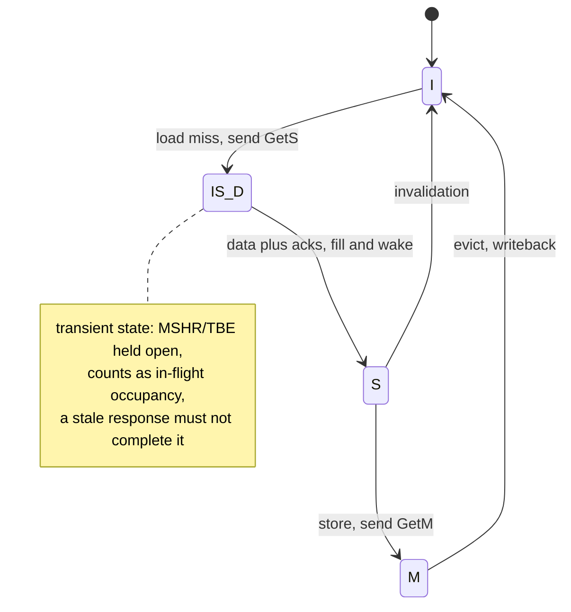
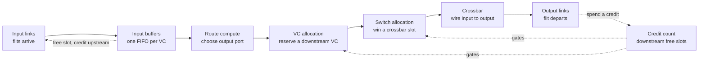
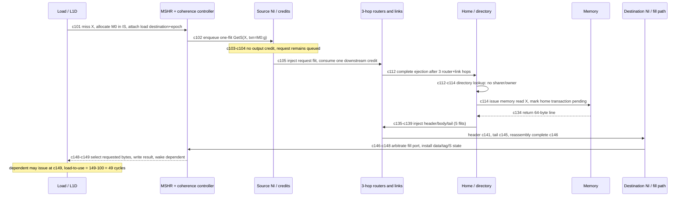

# Network-on-Chip (NoC) and CPU Coherence Simulation — Coupling Protocol State to Transport

> **First-time reader orientation:** A network-on-chip model tracks packets, router queues, links, and flow control. A coherence model tracks cache permissions, outstanding transactions, and races. Coupling matters because congestion delays coherence messages, delayed messages change cache and CPU behavior, and that feedback changes later traffic; a fixed trace may miss the loop.

> **Abbreviation key — skim now and return as needed:** central processing unit (CPU); register-transfer level (RTL); instructions per cycle (IPC); miss status holding register (MSHR); transient buffer entry (TBE); network interface (NI); virtual channel (VC);
> quality of service (QoS); service-level objective (SLO).

> **Prerequisites:** [Simulation Methodology](../00_Design_Methodology/03_CPU_Simulation_Methodology_and_Evidence.md), [Cache Coherence](../06_Coherence_and_Consistency/01_Cache_Coherence.md), [Network on Chip](../../04_SoC_and_Chiplet_Architecture/04_On_Chip_Networks/01_Network_on_Chip.md), and [Routing, Flow Control, and Deadlock](../../04_SoC_and_Chiplet_Architecture/04_On_Chip_Networks/02_Routing_Flow_Control_and_Deadlock.md).
> **Hands off to:** gem5/Ruby/Garnet configurations, stand-alone NoC experiments, protocol verification, and full-system performance studies.

---

## 0. Why this page exists

A coherence simulator without a realistic network can underestimate queueing and message interference. A NoC simulator driven only by uniform random packets can optimize a topology for traffic no protocol generates. Correct architecture work couples the two while keeping enough modularity to isolate causes.

```mermaid
flowchart LR
    Work["cores / accelerators / synthetic injectors"] --> Proto["cache + directory protocol state machines"]
    Proto --> Msg["request / snoop / response / data classes"]
    Msg --> NI["network interfaces / packetization"]
    NI --> NoC["routers / VCs / links / credits"]
    NoC --> NI2["destination NI / queues"]
    NI2 --> Proto2["home / cache controller"]
    Proto2 --> Stats["latency, traffic, stalls, invariants"]
```



The model must preserve causality: protocol messages create traffic, traffic delay changes transaction overlap, and that overlap changes future protocol state/traffic.

### 0.1 The model evolves only when the simpler abstraction changes the answer

```mermaid
%%{init: {"flowchart": {"defaultRenderer": "elk", "nodeSpacing": 42, "rankSpacing": 56, "htmlLabels": false}}}%%
flowchart LR
    A["Fixed miss latency<br/>one delay per cache outcome"]
    B["Protocol-event model<br/>requests, transients, acks, finite TBEs"]
    C["Packet network<br/>message bytes, routes, queueing"]
    D["Flit/credit router model<br/>VCs, buffers, arbitration, links"]
    E["Execution-driven coupling<br/>MSHR backpressure changes future issue"]

    A -->|"cannot compare protocols or sharing fanout"| B
    B -->|"fixed transport hides congestion and packet size"| C
    C -->|"packet latency hides head-of-line blocking/deadlock"| D
    D -->|"open-loop injection ignores core slowdown"| E
```



Start with the leftmost model that can distinguish the proposed designs. A fixed-latency cache is appropriate when only core scheduling changes and the memory system is held constant. Protocol events become necessary when alternatives change invalidations, forwarding, ownership, or finite transaction-buffer pressure. Packet detail is necessary when data/control size and routes differ. Flit/credit detail is necessary when virtual channels (VCs), buffer depth, arbitration, serialization, or deadlock are the research question. Execution-driven coupling is necessary when those delays fill miss status holding registers (MSHRs), stall the core, alter synchronization, or change prefetch timeliness.

Every step adds state and calibration burden. Greater detail can lose by running too slowly to sample workload phases or by introducing uncalibrated parameters. Fidelity is useful only when it changes a design ranking or closes a correctness proof; otherwise it is simulation noise with a larger confidence interval.

## Before the details: the protocol and network form a feedback loop

A coherence controller creates messages because cache state changes. The network delays those messages according to routes, buffers, and competing traffic. Delay keeps coherence transactions open longer, occupying transient-state entries and miss trackers. Once those structures fill, the processor or cache injects fewer requests. The traffic source therefore depends on the network being measured.

A synthetic-traffic experiment deliberately removes the endpoints and asks a transport question such as saturation throughput. A trace-driven experiment replays previously recorded requests and can compare routing policies quickly. An execution-driven experiment lets endpoint timing change future injection and is required when feedback affects the design ranking. None is universally best; each answers a different question.

**Beginner checkpoint:** packet count is not network work. A short control request and a cache-line data response may occupy different numbers of flits and hops. Validate flit-hops, queue occupancy, protocol transactions, and tail latency before trusting a single average.

## 1. Choose the fidelity boundary

| Model | Protocol detail | Network detail | Best use |
|---|---|---|---|
| analytical | average transactions/fanout | hop/bisection/queue approximation | early topology and storage bounds |
| trace-driven network | recorded message stream | cycle or event network | compare routers/topologies for fixed traffic |
| synthetic NoC | traffic pattern generators | detailed router/VC/link | saturation and routing stress |
| execution-driven coherence + simple network | state machines/transients | fixed link latency/bandwidth | protocol/storage exploration |
| execution-driven full coupling | detailed controllers | detailed router/VC/link | interference, deadlock, performance closure |
| RTL/formal | implementation state | small/bounded or RTL fabric | correctness and corner races |

Use differential fidelity: detailed where alternatives differ, abstract where shared. A prefetch/coherence study needs protocol detail; a router pipeline study may use synthetic traffic first, then validate with protocol traffic.

## 2. Protocol state representation

Per line/controller model:

- stable permissions and transient states;
- transaction/buffer entry with requester, pending acknowledgements, data status, retries;
- directory sharers/owner and replacement state;
- MSHR/queue capacity and backpressure;
- message generation/consumption rules;
- ordering/atomic and eviction interactions;
- timeout/retry policy.

The simulator must model finite resources. Infinite TBEs, input queues, and response buffers remove precisely the races and deadlocks real controllers face.

Events need unique transaction/epoch identity so stale responses/retries do not accidentally complete reused state. Instrument state transition counts and dwell-time histograms.

**What a line's state machine looks like, and why transient states cost resources.** A cached line is not simply present or absent. Between one stable permission and the next it sits in a *transient* state while its request is outstanding on the network — it has asked for permission but not yet collected the data and every acknowledgement. That transient is precisely what a miss tracker (MSHR) or transient-buffer entry (TBE) holds open, so the count of concurrent transients is the occupancy that finite resources cap. The load path in §7.1 walks one line through `I → IS_D → S`:



Read `IS_D` as "was **I**, heading to **S**, awaiting **D**ata" (§7.1 abbreviates the same state `IS`). Stable states (`I`, `S`, `M`) need no transaction resource; every transient does — which is why occupancy of these pending states, not packet count, bounds how many misses can be in flight at once.

## 3. Message and packet model

Classify protocol messages:

- requests/upgrades/evictions;
- snoops/forwards/invalidations;
- acknowledgements and response control;
- cache-line data;
- writebacks;
- retries/credits;
- maintenance/invalidation/atomic classes.

Map each to bytes/flits, virtual network/VC, priority, source/destination/multicast, and ordering rules. A control message may be one flit while a data response spans several; counting packets alone understates load.

Network work metric:

$$
W_{flit-hop}=\sum_m F_mH_m,
$$

where $F_m$ is flits and $H_m$ hops. This correlates better with link/router energy than logical transactions.

## 4. Router and flow-control fidelity

**What a router actually does, before the parameter list.** Picture a staffed road intersection. Flits arrive on several input lanes and wait in small per-lane buffers. For each waiting flit the router works out which exit it needs (*route compute*), reserves a lane on the far side so the flit has somewhere to land (*virtual-channel allocation*), grants it a turn to cross the middle (*switch allocation*), and finally wires that input to that output through the *crossbar*. Backward-flowing *credits* are the "there is room" signals: a router may launch a flit only when it holds a credit proving the downstream buffer has a free slot.



**Why all these structures exist.** With a single shared queue per input, one flit whose exit is busy freezes every flit behind it even when *their* exits are free — head-of-line blocking. Worse, if packets each hold a buffer while waiting for the next buffer around a cycle, the fabric deadlocks. Splitting each input into several virtual channels (VCs) gives independent lanes, so a stalled packet blocks only its own lane; reserving an *escape* VC routed in strict dimension order breaks the dependency cycle. Every parameter below tunes one part of this machine — how many lanes, how deep, how quickly credits return, how arbitration picks winners.

Detailed model parameters:

- topology/routing and link widths/latencies;
- router pipeline stages;
- virtual networks/channels;
- per-VC buffers and credit return latency;
- VC/switch arbitration;
- packetization and NI queues;
- multicast replication;
- adaptive routing/congestion state;
- clock-domain crossings and off-chip links.

gem5 Garnet, for example, exposes flit width, VCs per virtual network, buffers, routing algorithm, and router/link latency. Parameter defaults are not the target architecture; document every override.

### 4.1 Packet latency = header transit + serialization + contention

**What sets one packet's latency.** Three independent costs add up. The **header** is routed and switched at every router it crosses, so it pays the per-hop delay once per hop. The **body and tail** flits pipeline single-file behind the header, so a long packet pays extra just to clock its own bytes onto the wire — *serialization*. And each time a flit loses arbitration or waits for a credit it pays **contention**. For a packet of $F$ flits crossing $H$ hops,

$$
T_{packet}=\underbrace{H\,t_{hop}}_{\text{header transit}}+\underbrace{F\,t_{flit}}_{\text{serialization}}+\underbrace{T_{contention}}_{\text{queueing / arbitration}},
$$

where $t_{hop}$ is one router stage plus one link stage and $t_{flit}=L_{flit}/b$ is the time to push one flit onto a channel. The first two terms are the *zero-load* latency a packet sees on an empty network; only $T_{contention}$ depends on the rest of the traffic.

**Worked example on the mesh below.** Reuse the §7.1 fabric: $t_{hop}=2$ cycles, 16-byte flits, one flit per cycle, and the 3-hop dimension-order route drawn here.

```text
        x=0        x=1        x=2
         |          |          |
  y=2   R02 ------ R12 ------ R22
         |          |          |
  y=1   R01 ------ R11 ------ R21   <-- home (destination)
         |          |          |
  y=0   R00 ------ R10 ------ R20   <-- source

  XY (dimension-order) route, 3 hops:
     R00 --E--> R10 --E--> R20 --N--> R21
     each hop = 1 router stage + 1 link stage = 2 cycles
```

A 72-byte data response is $\lceil 72/16\rceil=5$ flits. On an empty network,

$$
T_{0}=H\,t_{hop}+F\,t_{flit}=3\times2+5\times1=6+5=11\ \text{cycles},
$$

exactly the response network sample in §7.1 (both measured from first-flit injection to full reassembly). Now let the middle router `R10` hold the packet 4 cycles because another flow owns the VC it needs:

$$
T_{packet}=6+5+4=15\ \text{cycles}.
$$

The one-flit `GetS` request over the same route costs $3\times2+1\times1=7$ cycles with no contention — again matching §7.1. Two lessons carry forward: a data packet's serialization term ($+5$) makes it far heavier than its one-flit request even though both cross the same 3 hops (the flit-hop point of §3: $5\times3=15$ versus $1\times3=3$ flit-hops), and contention is the *only* term that ties one packet's latency to the rest of the workload — which is why the open-loop traces of §6 cannot reproduce it.

## 5. Synthetic traffic is a theorem test, not a workload prediction

Patterns:

- uniform random: general load balance;
- hotspot: home/memory-controller concentration;
- transpose/bit-complement/tornado: topology/adversarial paths;
- neighbor: locality;
- burst/on-off: queue and credit response;
- multicast/fanout: snoop-like amplification;
- request/response dependency: protocol progress.

Sweep offered injection until saturation. Plot accepted throughput and latency percentiles. Saturation is where accepted throughput stops tracking offered load and latency rises sharply.

Synthetic tests reveal transport properties and bugs. They do not predict application performance because applications have phase behavior, address mapping, dependencies, and backpressure.

## 6. Trace-driven limitations

A trace fixes message injection times/addresses from a source execution. Changing network latency should slow cores/controllers and alter future injection; a fixed trace cannot capture this feedback. It is safe when:

- comparing network designs near the traced behavior and feedback is weak;
- traces include dependencies and replay under a timing wrapper;
- goal is traffic replay/energy, not full performance.

It is unsafe for congestion-driven protocol changes, MSHR blocking, synchronization, or prefetch timeliness. State the “open-loop” assumption.

## 7. Execution-driven coupling

In a coupled model:

1. core miss allocates finite MSHR/TBE;
2. controller generates a message only if NI has capacity;
3. network moves flits under credits/arbitration;
4. destination queue backpressures network;
5. protocol state consumes/generates responses;
6. response frees resources and wakes core;
7. core timing changes subsequent requests.

This list begins after compilation and execution have already done important work. The end-to-end chain is:

~~~text
benchmark source -> target binary -> dynamic load/store -> translated physical address
-> cache lookup -> coherence transaction -> protocol message(s)
-> network packet(s) -> flits -> router/link events
-> destination protocol transition -> response flits -> cache fill -> core wakeup
~~~

The dynamic instruction supplies operation type, byte mask, program age and virtual address. Translation supplies the physical block used for directory/home selection. Cache state decides whether any coherence transaction exists. The protocol may amplify one miss into several messages—for example request, forwarded snoop, data response and acknowledgements. Packetization then divides each message by link/flit width:

$$
N_{flit}(m)=\left\lceil\frac{B_{header}+B_{payload}(m)}{B_{flit}}\right\rceil.
$$

For every flit, the network model records injection, virtual-channel allocation, switch traversal, link traversal, stalls and ejection. The protocol controller consumes the reassembled message, changes stable/transient state, and may generate new messages. The core sees completion only after the correct response returns and the cache/MSHR installs it. Thus one instruction's observed miss latency is the sum of local controller delay, all message paths, remote service and queueing—but their overlap is determined by event timing, not by adding average hop latencies afterward.

Keep raw layers separate when calculating results:

- **instruction level:** committed instructions, stall cycles, IPC;
- **transaction level:** shared-read requests (often named `GETS`), ownership/modified requests (often `GETM`), upgrades, writebacks, invalidations, and retries;
- **message level:** request, response, data, and acknowledgment bytes;
- **network level:** packets, flits, hops, blocked cycles, link/VC occupancy;
- **latency level:** injection-to-ejection network latency versus issue-to-fill coherence miss latency.

Average packet latency cannot be substituted for cache-miss latency: a miss may wait before injection, require multiple dependent packets, and wait again at the destination. [CPU source-to-result workflow](../00_Design_Methodology/03_CPU_Simulation_Methodology_and_Evidence.md) defines the earlier compiler/loader/ROI stages.

Avoid zero-time combinational cycles across components. Define event ordering or clock phases so same-cycle credit/message/response behavior is deterministic and matches intended hardware.

### 7.1 Exact worked trace: one load miss becomes six flits and a 49-cycle result

This trace is deliberately small enough to reproduce by hand. It follows one load `L` after a translation hit. `L` addresses physical line `X`, which is Invalid in the private L1 data cache. The directory reports no sharers and the last-level cache also misses, so memory supplies the line. There is no competing traffic except a two-cycle lack of output credit on the request path.

**Declared model parameters and cycle convention.** A state change scheduled for cycle `c` occurs at the start of `c`; a component with latency `d` schedules its dependent event for `c+d`. The L1 tag lookup is 1 cycle. Network flits are 16 bytes. A `GetS` (get shared/read permission) request is an 8-byte one-flit packet. A data response is an 8-byte header plus a 64-byte line, hence `ceil(72/16)=5` flits. Source and home are three links apart. Each hop costs one router stage plus one link stage, or 2 cycles; wormhole flow control lets successive flits pipeline through the route. Home-directory lookup is 2 cycles, memory service is 20 cycles, destination reassembly is 1 cycle, fill arbitration/array install is 2 cycles, and result broadcast/wakeup is 1 cycle.



The exact event ledger is:

| Cycle/interval | Event and state mutation | Counters charged at this point |
|---|---|---|
| `100→101` | load issues; L1 tag/state arrays read | `l1d_access += 1` |
| `101` | tag miss; allocate `M0`, state `IS` (Invalid→Shared pending), save line, waiter, permission, victim, transaction generation `g` | `l1d_miss += 1`, `mshr_alloc += 1`, occupancy begins |
| `102` | controller creates `GetS(X,M0:g)` and enqueues it at source network interface (NI) | `gets += 1`, `packets_created += 1`, `flits_created += 1` |
| `103,104` | required output VC has no downstream credit; flit cannot leave NI | `credit_blocked_cycles += 2`; no hop or injection is counted |
| `105→112` | credit arrives; inject one flit; route across three router/link hops and eject/reassemble | `injected_flits += 1`, `flit_hops += 3`, request injection-to-ejection sample `7` |
| `112→114` | home looks up directory/LLC; finds no sharer, owner, or data | `directory_lookups += 1`, `directory_misses += 1` |
| `114→134` | one memory read is outstanding; requester remains IS and MSHR occupied | `memory_reads += 1`, memory-service sample `20` |
| `134→135` | home creates response with 8-byte header + 64-byte payload | `data_responses += 1`, `packets_created += 1`, `flits_created += 5`, `response_bytes += 72` |
| `135→146` | five flits inject during `135..139`; header reaches destination at 141, tail at 145, full packet reassembles at 146 | `injected_flits += 5`, `flit_hops += 15`, response injection-to-complete sample `11` |
| `146→148` | fill competes for/wins array port; tag, data, and Shared permission install atomically | `fills += 1`, fill-path sample `2` |
| `148→149` | requested bytes select, destination result writes, waiter wakes, `M0` frees | load-to-use sample `49`; MSHR occupancy ends |

The request uses one flit and the response five, so final network work is

$$
N_{packet}=2,\qquad N_{flit}=1+5=6,\qquad
W_{flit-hop}=1\times3+5\times3=18.
$$

`M0` is occupied over `[101,149)`, contributing **48 MSHR-slot-cycles** to the occupancy integral and a maximum occupancy of one. The load-to-use latency is **49 cycles**. The two network packet samples are 7 and 11 cycles, so their unweighted mean is 9 cycles—yet substituting 9 for the load miss latency would understate the actual 49 cycles by more than 5× because it omits cache detection, NI waiting, home lookup, memory, packet creation/serialization, fill arbitration, and wakeup. This is exactly why packet latency and coherence-miss latency must remain separate statistics.

The 49 cycles also reconcile by phase, with no double-counting:

$$
T_{load\to use}=
\underbrace{2}_{\text{L1 detect + request preparation}}+
\underbrace{3}_{\text{NI enqueue to injection}}+
\underbrace{7}_{\text{request network/ejection}}+
\underbrace{22}_{\text{directory + memory}}+
\underbrace{12}_{\text{response creation/network/reassembly}}+
\underbrace{3}_{\text{fill + wake}}=49.
$$

The decomposition is based on timestamp boundaries, not on adding separately averaged components; in larger runs, wormhole serialization, parallel snoops, and memory overlap make “sum of averages” invalid.

### 7.2 How the simulator produces those events and final statistics

A discrete-event implementation keeps a priority queue ordered by `(time, phase, sequence_number)`. A cycle-stepped implementation evaluates the same ordering every tick. One deterministic phase order is:

1. deliver link arrivals and returning credits;
2. place arrived flits into input VCs and reassemble completed packets;
3. let endpoint protocol controllers consume messages and schedule directory/memory/fill work;
4. perform VC allocation, switch allocation, and link traversal for already-buffered flits;
5. let NIs inject new head/body/tail flits only when queue space, a VC, and credit exist;
6. update occupancy integrals, ages, timeout checks, and end-of-cycle counters.

The phases prevent a credit created by a departure from being consumed “backward in zero time” by an injection in the same modeled stage unless the target hardware explicitly has that bypass. A monotonically increasing sequence number makes two events with equal time/phase reproducible.

Every object carries identity across layers: `(core, load-sequence, physical-line, MSHR index, MSHR generation)` at the cache; a protocol transaction ID at the controller; and `(packet ID, flit index, head/body/tail, VC)` in the network. At response time, `M0:g` must still own line X and the waiter epoch must still be live. If a branch flush or replacement changed the generation, the response may release protocol resources but cannot install into the new transaction or wake the old destination.

Counters update at the causal event, not by reconstructing them at the end. Flits increment on injection, flit-hops on successful link traversal, blocked cycles when a ready flit loses specifically for credit/VC/switch/output reasons, MSHR occupancy once per occupied slot per cycle, and transaction latency when the matching completion timestamp closes its start timestamp. Histograms retain distributions; averages are derived as `sum/count` only after the region of interest (ROI).

For a benchmark, final results are reductions over these raw ledgers:

$$
\text{IPC}=\frac{N_{committed}}{C_{ROI}},\quad
\text{mean miss latency}=\frac{\sum_j(t^{fill}_j-t^{miss}_j)}{N_{completed\ misses}},\quad
\overline{Q}_{MSHR}=\frac{\sum_{c\in ROI}Q_{MSHR}(c)}{C_{ROI}},\quad
U_{link}=\frac{N_{flit\ traversals}}{N_{links}\,C_{ROI}\,\text{flits/link/cycle}}.
$$

Warm-up events populate state but their counters are not included; measurement resets the accumulators while preserving tags, directory entries, queues, credits, and in-flight start timestamps. At ROI end, either drain accepted work and attribute it under a declared policy or stop only at a quiescent boundary. Silently deleting in-flight requests shortens latency samples and violates conservation.

**Verification of the worked trace.** Check credit conservation for every VC: `upstream credit count + downstream occupied slots + flits launched against consumed credits but not yet deposited + returning credits not yet applied = configured capacity` under the declared pipeline timing. Also check one injection and one ejection per flit ID, in-order body/tail delivery within the packet, legal route hops, and exact 18 flit-hops. At the protocol layer assert one live `IS` transaction for X, no Shared installation before data and permission, response-generation match, and one wake with the memory value. At completion reconcile created versus consumed messages, allocated versus freed MSHRs, memory reads versus data responses, and per-phase timestamps. Then perturb one factor at a time—add one credit-stall cycle, one router stage, one memory cycle, or one fill-port conflict—and require the load-to-use result to rise by exactly the causally exposed amount. That sensitivity test catches hidden zero-time edges and double-counted latency.

## 8. Warm-up and measurement

Warm:

- cache tags/data/replacement;
- directory sharers/owners;
- predictor/prefetch state;
- NoC queues/credits and arbitration state;
- memory rows/queues;
- translation state;
- workload phase.

At measurement start, either retain all in-flight state and reset counters, or drain to a declared quiescent point. Dropping network/protocol transactions corrupts correctness and biases latency.

Run long enough to capture rare contention and tail latency. For synthetic saturation, reach steady queue occupancy at each offered load; near saturation convergence is slow.

## 9. Correctness validation

### Protocol invariants

- single-writer, multiple-reader (SWMR) and data-value invariants;
- directory/cache state agreement;
- exact acknowledgement accounting;
- no stale response completes new transaction;
- evictions/replacements preserve dirty data;
- atomics have one serialization point;
- eventual completion under fairness assumptions.

### Network invariants

- credit/buffer conservation;
- no flit loss/duplication/reordering within packet;
- legal route and destination;
- VC/protocol dependency graph progress;
- reserved response paths remain available.

Run random protocol testers without CPU workloads, small exhaustive/formal models, and directed simultaneous races. A simulator assertion failure is not “just a model issue” until disproven; models often expose real specification holes.

## 10. Calibration

Calibrate layers independently, then jointly:

1. router zero-load latency against RTL/microarchitecture;
2. link bandwidth/serialization;
3. saturation curve for known topology;
4. controller hit/miss/upgrade message sequences;
5. cache/home unloaded latency;
6. coupled microbenchmarks (ping-pong sharing, false sharing, streaming, atomics);
7. application counters/latency against hardware when available.

Do not use one latency multiplier to hide incorrect message count, path, or queue behavior. Calibrate structural observables first.

## 11. Experiment matrix

Useful sweeps:

- core/agent count and topology size;
- snoop versus directory, sharer encoding, home placement;
- line size and data/control packet widths;
- link width/frequency, router stages, VC/buffer count;
- MSHR/TBE/input queue capacity;
- routing and escape VC policy;
- address-to-home/channel hashing;
- prefetch/coherence traffic;
- workload sharing/false sharing/atomic intensity;
- QoS/priority and co-runners;
- fault/degraded link and route reconfiguration.

Use factorial or sensitivity-guided designs; exhaustive Cartesian products waste simulation on obviously dominated configurations.

## 12. Metrics

Protocol:

- miss/upgrade/eviction latency by phase (queue, route, home, snoop, data);
- messages/bytes/flit-hops per transaction;
- sharer/fanout distribution;
- TBE/MSHR/queue occupancy and blocked cycles;
- transient-state dwell and retry rate;
- ownership ping-pong, false sharing, atomics.

Network:

- offered/accepted/ejected throughput;
- per-link/VC utilization and occupancy;
- packet/flit latency percentiles;
- credit, VC allocation, switch allocation stalls;
- path length and adaptive/escape use;
- maximum packet age/starvation;
- energy via buffers/crossbar/links/flit-hops.

System:

- IPC/job/latency/throughput;
- cache/NoC/memory stall decomposition;
- fairness/slowdown/tail SLO;
- power/energy and thermal proxy.

## 13. Common modeling failures

- infinite controller/network queues;
- one latency for all messages regardless of bytes/path;
- no separation of request/response virtual networks;
- trace injection unaffected by backpressure, then claiming IPC;
- average hop count without hotspot/bisection analysis;
- protocol correct only without replacements/races;
- warming caches but zeroing directories/network;
- counting packets rather than bytes/flit-hops;
- reporting one below-saturation point;
- changing topology without remapping homes/memory controllers.

## 14. Numbers to remember

- Finite TBEs, MSHRs, NI queues, VCs, buffers, and credits are essential to model contention and deadlock.
- Flit-hops capture packet size × path work; logical transaction count does not.
- Synthetic traffic validates transport; execution-driven traffic predicts protocol/application feedback.
- Fixed traces are open-loop and cannot reproduce timing-dependent injection changes.
- Warm-up includes directory and network state, not only caches.
- Validate router, protocol, then coupled behavior with structural counters.

## 15. Worked problems

### Problem 1 — packet work

A 64 B data line plus 8 B header uses five 16 B flits. Across six hops it costs 30 flit-hops. An 8 B control request uses one flit across four hops: 4 flit-hops. One data response can dominate network work even when packet counts are equal.

### Problem 2 — saturation

A mesh accepts offered loads 0.10, 0.20, 0.30 flits/node/cycle nearly linearly, but at 0.35 accepts 0.31 and p99 latency jumps 8×. Sustainable throughput is near 0.30–0.31; using 0.35 as “achieved bandwidth” ignores unstable queues.

### Problem 3 — trace feedback

A trace injects a miss every 20 cycles. A narrower NoC raises miss latency and would fill MSHRs, eventually stalling the real core and reducing injection. Fixed trace continues at one/20 cycles, overloading the network and overstating traffic/performance impact. Use coupled execution or dependency-aware throttling.

## Cross-references

- **Method/tool:** [Simulation Methodology](../00_Design_Methodology/03_CPU_Simulation_Methodology_and_Evidence.md), [gem5](01_gem5.md), [Other Architecture Simulators](../00_Design_Methodology/03_CPU_Simulation_Methodology_and_Evidence.md).
- **Subjects:** [Cache Coherence](../06_Coherence_and_Consistency/01_Cache_Coherence.md), [Network on Chip](../../04_SoC_and_Chiplet_Architecture/04_On_Chip_Networks/01_Network_on_Chip.md), [Routing, Flow Control, and Deadlock](../../04_SoC_and_Chiplet_Architecture/04_On_Chip_Networks/02_Routing_Flow_Control_and_Deadlock.md).

## References

1. gem5, [Garnet 2.0](https://www.gem5.org/documentation/general_docs/ruby/garnet-2/).
2. gem5, [Ruby Cache Coherence Protocols](https://www.gem5.org/documentation/general_docs/ruby/cache-coherence-protocols/).
3. N. Agarwal et al., “GARNET: A Detailed On-Chip Network Model inside a Full-System Simulator,” ISPASS 2009.
4. W. Dally and B. Towles, *Principles and Practices of Interconnection Networks*.
5. D. Sorin, M. Hill, and D. Wood, *A Primer on Memory Consistency and Cache Coherence*.

---

**Navigation:** [Memory and Interconnect Simulation index](../../04_SoC_and_Chiplet_Architecture/06_Simulation/00_Index.md) · [Simulators index](../../04_SoC_and_Chiplet_Architecture/01_System_Modeling/00_Index.md)
