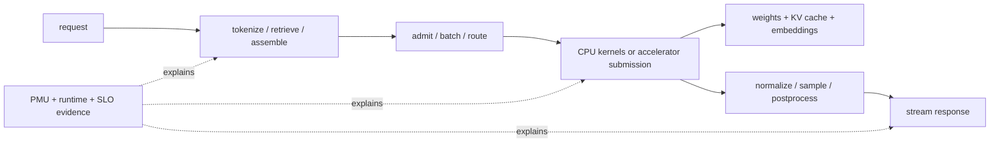

# Central Processing Unit (CPU) Architecture › Artificial Intelligence Workloads and Serving

> **First-time reader orientation:** An artificial-intelligence (AI) service is not only a matrix-multiplication benchmark. A request passes through storage, networking, tokenization or feature preparation, scheduling, model execution, memory management, and output processing. The CPU may execute the model itself, coordinate an accelerator, or do both. This section follows that entire path and explains which CPU structures matter at each boundary.

> **Abbreviation key — skim now and return as needed:** central processing unit (CPU); artificial intelligence (AI); machine learning (ML); large language model (LLM); graphics processing unit (GPU); neural processing unit (NPU); single instruction, multiple data (SIMD); non-uniform memory access (NUMA); translation lookaside buffer (TLB); key-value (KV); mixture of experts (MoE); time to first token (TTFT); time per output token (TPOT); service-level objective (SLO); performance monitoring unit (PMU).

## Why this subdomain exists

The same model can stress very different CPU mechanisms depending on phase. Model loading is a storage, virtual-memory, and NUMA-placement problem. Tokenization and retrieval mix branchy scalar work with irregular memory access. Transformer prefill exposes large matrix operations; autoregressive decode repeatedly streams weights and KV state for one or a few new tokens. A CPU coordinating a GPU may spend little time in arithmetic yet still determine tail latency through scheduling, page pinning, launch preparation, and synchronization.

Every chapter applies the notebook's [research-depth and evidence standard](../../../Research_Depth_and_Evidence_Standard.md): workload and contract → causal mechanism → theoretical bound → observable counters/traces → validation and failure boundary.

## Terms introduced here

| Term | Meaning |
|---|---|
| prefill | parallel processing of all prompt tokens before the first generated token |
| decode | autoregressive phase that produces one new token per request per model iteration |
| arithmetic intensity | useful operations divided by bytes transferred through a named memory boundary |
| continuous batching | changing the active request set between model iterations instead of waiting for a fixed batch to finish |
| goodput | completed work that satisfies its latency and correctness objectives, rather than raw throughput alone |
| weight packing | rearranging and often quantizing matrix data into the exact layout consumed by a kernel |
| first-touch placement | NUMA policy in which the node that first writes a page usually determines its physical location |

## Reading order

1. [End-to-End AI Serving on CPUs](01_End_to_End_AI_Serving_on_CPUs.md) — request lifecycle, model loading, tokenization, retrieval, scheduling, CPU-only inference, heterogeneous serving, and training support.
2. [AI Operators on CPU Microarchitecture](02_AI_Operators_on_CPU_Microarchitecture.md) — dense and sparse matrix multiplication, convolution, attention, embeddings, MoE, normalization, sampling, matrix extensions, quantization, cache tiling, TLBs, and NUMA.
3. [Performance Analysis, Profiling, and Research Frontiers](03_Performance_Analysis_Profiling_and_Research_Frontiers.md) — rooflines, prefill/decode models, TTFT/TPOT, queueing, batch tradeoffs, evidence collection, and research questions.
4. [CPU AI Software-Stack Implementation Blueprint](04_CPU_AI_Software_Stack_Implementation_Blueprint.md) — model artifacts, tensor/IR schemas, compiler passes, kernel ABI/dispatch, weight packing, NUMA runtime, and accelerator adapters.
5. [CPU Serving Runtime, Scheduler, and State Blueprint](05_CPU_Serving_Runtime_Scheduler_and_State_Implementation_Blueprint.md) — request state machine, admission, continuous batching, KV/prefix ownership, cancellation, overload, and output commit.
6. [CPU AI-Stack Verification, Operations, and Deployment](06_CPU_AI_Stack_Verification_Operations_and_Deployment_Blueprint.md) — semantic/quality/concurrency validation, telemetry, capacity, canary, drain, rollback, and incident recovery.

## Research-position competency target

After this section, a reader should be able to:

- draw the request-to-token critical path and identify CPU, accelerator, memory, storage, and network ownership;
- derive operator shapes from model dimensions and predict whether each phase is compute-, bandwidth-, latency-, or capacity-limited;
- explain how a kernel maps to scalar pipelines, vector lanes, matrix tiles, caches, page translation, memory controllers, and sockets;
- distinguish peak operations per second from attainable service goodput under TTFT and TPOT constraints;
- design a measurement plan that separates queueing, runtime overhead, operator execution, memory placement, and interference;
- state a falsifiable research hypothesis and the hardware/software evidence needed to test it.
- reconstruct the CPU AI stack's artifacts, compiler/runtime objects, scheduler and state machines, validation, telemetry, deployment, and recovery contracts without relying on hidden framework behavior.

**Comes from:** [Core Foundations](../01_Core_Foundations/00_Index.md), [Cache Hierarchy](../04_Cache_Hierarchy/00_Index.md), and [Virtual Memory](../05_Virtual_Memory/00_Index.md).
**Hands off to:** [CPU Simulation](../08_Simulation/00_Index.md) when an architectural hypothesis needs controlled timing experiments.

---

[CPU Architecture](../00_Index.md) · next → [End-to-End AI Serving on CPUs](01_End_to_End_AI_Serving_on_CPUs.md)
