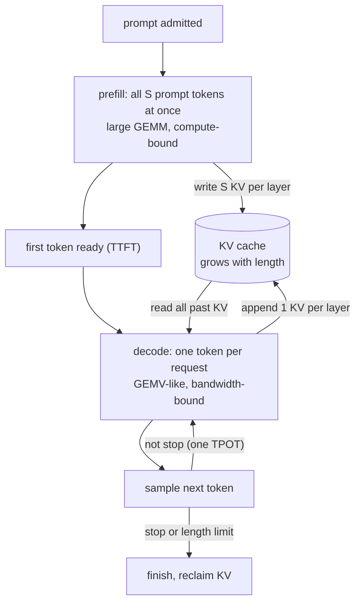
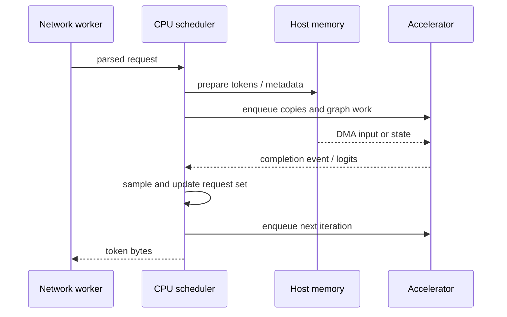

# End-to-End Artificial Intelligence Serving on Central Processing Units

> **First-time reader orientation:** A model server turns an arriving request into a prediction or generated response. The central processing unit (CPU) always participates: it accepts the request, prepares inputs, schedules work, manages memory, and returns results. It may also execute every model operator. This chapter follows data rather than software product names so that the reasoning transfers across serving stacks.

> **Abbreviation key — skim now and return as needed:** artificial intelligence (AI); machine learning (ML); central processing unit (CPU); graphics processing unit (GPU); neural processing unit (NPU); large language model (LLM); network interface card (NIC); non-volatile memory express (NVMe); direct memory access (DMA); input/output memory-management unit (IOMMU); non-uniform memory access (NUMA); translation lookaside buffer (TLB); key-value (KV); byte-pair encoding (BPE); approximate nearest neighbor (ANN); mixture of experts (MoE); single instruction, multiple data (SIMD); time to first token (TTFT); time per output token (TPOT); service-level objective (SLO); remote direct memory access (RDMA); memory-mapped input/output (MMIO).

> **Prerequisites:** [CPU Architecture](../01_Core_Foundations/01_CPU_Architecture.md), [Cache Microarchitecture](../04_Cache_Hierarchy/01_Cache_Microarchitecture.md), and [TLB and Virtual Memory](../05_Virtual_Memory/01_TLB_and_Virtual_Memory.md).
> **Hands off to:** [AI Operators on CPU Microarchitecture](02_AI_Operators_on_CPU_Microarchitecture.md) for the execution kernels and [Performance Analysis](03_Performance_Analysis_Profiling_and_Research_Frontiers.md) for quantitative models.

---

## 0. The unit of study is a request, not an isolated matrix

A useful architecture analysis begins with a *request contract*:

| Field | Examples | Why the CPU architect needs it |
|---|---|---|
| input distribution | prompt length, image size, sparse-feature count | determines parsing work, allocation size, and operator shapes |
| output distribution | generated tokens, classes, retrieved documents | determines decode iterations and response traffic |
| arrival process | steady, bursty, diurnal, correlated | determines queueing and scheduler headroom |
| latency objective | median and 99th-percentile TTFT/TPOT | limits batching, page faults, and background work |
| quality objective | model, precision, retrieval recall, sampling policy | prevents a faster but semantically different comparison |
| isolation boundary | process, virtual machine, tenant, security domain | determines cache sharing, copy policy, and speculation controls |
| failure policy | retry, shed, degrade, fail over | changes worst-case CPU and memory demand |

The complete critical path is approximately

$$
T_{request}=T_{ingress}+T_{queue}+T_{prepare}+T_{execute}+T_{output},
$$

but each term contains overlap. A storage read can overlap initialization; CPU tokenization can overlap retrieval; output streaming can overlap later decode iterations. Therefore a trace needs both durations and dependency edges. Adding every observed duration double-counts parallel work.

```mermaid
flowchart LR
    Net["NIC receives bytes"] --> Ingress["protocol / auth / rate limit"]
    Ingress --> Tok["normalize + tokenize"]
    Tok --> Retrieve["embedding + ANN retrieval"]
    Retrieve --> Prompt["prompt / feature assembly"]
    Prompt --> Admit["admission + batch scheduler"]
    Admit --> Prefill["prefill / encoder execution"]
    Prefill --> Decode["decode iteration"]
    Decode --> Sample["logits + sampling"]
    Sample -->|"continue"| Decode
    Sample --> Detok["detokenize / postprocess"]
    Detok --> NetOut["stream response"]
```

## 1. Cold start: model bytes become executable state

### 1.1 Storage-to-memory path

A checkpoint is not executed directly from a filename. A typical CPU path is:

1. Metadata is parsed: tensor names, shapes, data types, strides, and shard locations.
2. File-backed pages enter the operating-system page cache through buffered reads or memory mapping; direct I/O is another policy with different alignment and caching requirements.
3. Virtual pages are mapped into the process. A first access may cause a minor fault for an already cached page or a major fault that waits for storage.
4. Pages acquire physical placement. On NUMA machines, allocation policy and the thread that first touches each page strongly affect which memory controllers serve later requests.
5. Weights may be converted, quantized, transposed, or packed into a kernel-specific format. Packing is real initialization work and may temporarily require both source and destination copies.
6. The runtime builds operator descriptors, scratch buffers, thread pools, and possibly compiled code specialized for shapes and instruction-set support.
7. Representative kernels run to warm instruction caches, data caches, TLBs, memory allocators, frequency state, and just-in-time code paths.

For checkpoint size $S_w$, sustainable storage bandwidth $B_s$, packing throughput $B_p$, and overlappable fraction $0\le\alpha\le1$, a first bound is

$$
T_{load}\ge \max\left(\frac{S_w}{B_s},\frac{S_w}{B_p}\right)
 +(1-\alpha)\min\left(\frac{S_w}{B_s},\frac{S_w}{B_p}\right).
$$

Here $\alpha=0$ means storage and packing are serial, while $\alpha=1$ assumes perfect overlap after pipeline fill with enough buffering and no shared-resource interference. Intermediate values are an empirical overlap summary, not a universal constant. This is more useful than quoting storage peak bandwidth. Small reads, decompression, page faults, checksums, and NUMA copies may lower the measured rate. Measure bytes at each boundary: storage, page cache, memory controller, and final packed-weight allocation.

### 1.2 Capacity is an architectural constraint

At steady state, memory must hold more than weights:

$$
M_{resident}=M_{weights}+M_{KV}+M_{runtime}+M_{scratch}+M_{retrieval}+M_{headroom}.
$$

The headroom term prevents allocator fragmentation, page-cache eviction, or request bursts from turning a nominally fitting model into tail-latency failures. Transparent huge pages or explicit huge pages can reduce TLB pressure, but compaction and allocation latency must be measured. Locking pages avoids later faults but consumes a finite system resource.

### 1.3 NUMA placement is part of model placement

A multi-socket server has physically distributed memory. A thread reading local memory reaches its local memory controllers; reading remote memory crosses a socket fabric and consumes both link and remote-controller bandwidth. Three common placements are:

- **replicate:** each socket owns a full model copy and serves independent requests; highest capacity cost, lowest weight-sharing traffic;
- **shard:** split layers, tensors, or experts across sockets; fits larger models but introduces synchronization and cross-socket transfers;
- **interleave:** distribute pages across nodes; balances bandwidth for one shared instance but can increase average latency and coherence traffic.

The correct placement follows access ownership. Interleaving weights across sockets while pinning all compute threads to one socket is not bandwidth aggregation for free; every remote line still crosses the interconnect. Verify placement using page maps and per-memory-controller counters, not only thread affinity.

## 2. Ingress and request preparation

### 2.1 Network and protocol work

Packets arrive through a NIC into host memory using DMA. The CPU processes transport, encryption, protocol framing, authentication, quotas, and request parsing unless some functions are offloaded. Interrupt coalescing reduces interrupt rate but can add latency; polling reduces wakeup latency but dedicates cores. Receive-side scaling must align NIC queues, worker affinity, and NUMA-local buffers.

The system designer should separate:

- bytes copied between kernel and user space;
- serialization and parsing cycles;
- encryption cycles and vector-instruction use;
- scheduler wakeups and context switches;
- cache-line bouncing on shared connection or queue state.

A zero-copy interface can remove a copy yet still pay page pinning, reference counting, IOMMU translation, and synchronization. “Zero copy” is therefore a statement about data movement, not zero CPU work.

### 2.2 Tokenization is a CPU microarchitecture workload

For text models, tokenization transforms input bytes into integer token identifiers. A BPE-like path commonly performs Unicode or byte normalization, pre-tokenization, vocabulary lookup, and iterative merges. It mixes:

- vectorizable byte classification and delimiter scans;
- branch-heavy finite-state or regular-expression logic;
- hash-table, trie, or vocabulary accesses with imperfect locality;
- allocation and variable-length output writes;
- synchronization when shared caches or vocabulary objects are mutable.

The fastest implementation is not automatically the widest vector implementation. Long contiguous strings favor SIMD classification; short messages may be dominated by call, branch, and allocation overhead. Parallelizing one request can harm tail latency if it consumes cores needed by model kernels. A research-quality evaluation sweeps input-length distribution and concurrency rather than reporting only megabytes per second on one long buffer.

### 2.3 Retrieval-augmented generation

Retrieval-augmented generation adds a search path before model execution:

1. Compute or receive a query embedding.
2. Search an ANN index.
3. Fetch document or feature payloads.
4. Optionally rerank candidates with another model.
5. Assemble retrieved context into the model prompt.

Graph indexes such as hierarchical navigable small-world graphs expose pointer chasing, irregular branches, and random cache-line reads. Inverted-file indexes first choose coarse clusters and then scan candidates. Product quantization reduces vector bytes and converts distance evaluation into table lookups. These choices trade recall against CPU cycles, memory capacity, and latency variance.

If each visited node needs $b_n$ bytes and a query visits $N_v$ nodes, the minimum index traffic is $N_vb_n$, but hardware prefetchers may fail because the next address is data-dependent. Software prefetch helps only when the search exposes enough independent candidates to cover memory latency. Multiple queries in flight can supply memory-level parallelism more effectively than parallelizing a single dependency chain.

### 2.4 Prompt and feature assembly

Prompt templates, retrieved passages, image patches, sparse features, and masks become tensors. Avoidable costs include repeated string concatenation, type conversion, transposition, and non-pinned staging buffers. The output layout should already match the first model operator when practical. Otherwise the serving path pays a hidden layout-conversion kernel before useful inference begins.

## 3. Admission, batching, and resource ownership

Admission control decides whether a request can enter without violating capacity or latency constraints. The decision needs at least predicted input length, maximum or expected output length, model identity, KV-cache demand, deadline, and tenant quota.

### 3.1 Static and continuous batches

A static batch waits for a fixed group and completes it together. It gives regular matrix shapes but suffers head-of-line blocking when sequence lengths differ. **Continuous batching** admits and removes requests at iteration boundaries. It raises utilization but makes active shapes dynamic and turns KV-cache allocation into a live scheduling resource.

Batching exposes two opposing effects:

- larger batches increase matrix dimensions, amortize weight reads and runtime overhead, and improve vector or matrix-unit utilization;
- waiting to form a batch and sharing a worker increase queueing and per-request latency.

Do not optimize average tokens per second without a latency constraint. A valid metric is **goodput**: requests or tokens completed while meeting the stated TTFT, TPOT, and quality SLOs.

### 3.2 CPU core partitioning

Serving subsystems compete for the same cores, caches, memory channels, and power budget. A useful initial policy assigns explicit core sets to:

- network and ingress processing;
- tokenization and retrieval;
- model execution or accelerator submission;
- sampling and response streaming;
- background model loading, telemetry, and compaction.

Static partitioning improves isolation but can strand capacity. Work stealing improves average utilization but pollutes caches and weakens tail predictability. Simultaneous multithreading (SMT) can pair complementary workloads, yet two memory-bandwidth-heavy siblings may interfere. The decision should be counter-driven and tested under bursty arrivals.

## 4. CPU-only inference: prefill and decode are different machines

The two phases load opposite parts of the machine, so a serving stack schedules and tunes them separately. The quantity that separates them is **arithmetic intensity** — operations performed per byte read from memory. A linear layer multiplies an $M\times K$ activation by a $K\times N$ weight for $2MNK$ operations, while the weight tile is only $KNq$ bytes ($q$ bytes per element). Streaming that tile once and reusing it across all $M$ rows gives

$$
I=\frac{2MNK}{KNq}=\frac{2M}{q}.
$$

This intensity, $2M/q$ operations per weight byte, depends only on $M$, the number of rows sharing each weight. Prefill makes $M=BS$ large; decode makes $M\approx B$ small — the same weights, a different regime.

**Worked roofline** (illustrative sustained figures: $P_{eff}=10$ TFLOP/s BF16, $B_{eff}=200$ GB/s, so the roofline ridge is at $I_{ridge}=P_{eff}/B_{eff}=50$ ops/byte; $q=2$).

- *Prefill*, $M=512$: $I=2\cdot512/2=512$ ops/byte, well above $50$ → **compute-bound**; peak matrix throughput sets the step time.
- *Decode*, $M=1$: $I=2\cdot1/2=1$ op/byte, far below $50$ → **bandwidth-bound**; the bytes streamed for weights (and KV state; see the decode bound below) set the step time, not FLOP/s.
- Decode only reaches the ridge at $M\ge I_{ridge}\,q/2=50$ rows — a batch near $50$ concurrent requests. Real batches are smaller, so decode stays memory-bound. The conclusion holds for any ridge that falls between the two intensities, so the exact figures above are not load-bearing.

The diagram below traces one request through both regimes and the KV cache that couples them.

### 4.1 Prefill

Prefill processes the input sequence in parallel. For a transformer layer, it forms query, key, and value matrices; computes attention over prompt tokens; applies output projections; and runs feed-forward or MoE sublayers. With batch-token dimension $M=B S$ (batch $B$, prompt length $S$), hidden dimension $K$, and output dimension $N$, many linear layers are matrix multiplications with substantial reuse of each weight tile across $M$ rows.

Large $M$ raises arithmetic intensity and can fill vector or matrix pipelines. Prefill can therefore be compute-bound on a CPU with matrix extensions, although attention, packing, and memory capacity still matter. Long-context attention introduces work proportional to sequence pairs unless the model uses a restricted attention pattern.

### 4.2 Decode

Decode appends one new token per active request per iteration. Each layer performs projections for a small $M\approx B$, reads the layer's weights, reads earlier KV state, and writes new KV entries. At small batch, matrix multiplication degenerates toward matrix-vector multiplication: there is little reuse of each streamed weight within that iteration.

The resulting lower bound is often bandwidth-shaped:

$$
T_{decode\ step}\ge \max\left(\frac{O_{step}}{P_{eff}},
\frac{D_{weights}+D_{KV}+D_{other}}{B_{eff}}\right),
$$

where $O_{step}$ is operation count, $P_{eff}$ is sustainable compute, $D$ terms are bytes crossing the active memory boundary, and $B_{eff}$ is sustainable bandwidth under the actual NUMA and concurrency conditions.

Batching several decode requests reuses a weight tile across more rows and raises arithmetic intensity, but it also increases KV traffic and may lengthen TPOT. The scheduler must solve that service tradeoff rather than maximize one kernel's utilization.

### 4.3 KV-cache lifecycle

Without a cache, decoding token $t$ would re-run attention over all $t-1$ earlier tokens every step, making generation cost grow with the square of the length. The KV cache is the scratchpad that removes that waste: each layer keeps the keys and values it already produced for every past token, so a decode step computes only the new token's query and *reads* the stored keys and values. The price is memory that grows linearly with sequence length and is held for the request's entire lifetime — which turns generation length into a capacity problem rather than a compute one.

Attention stores key and value vectors from previous tokens. For $L$ layers, $H_{kv}$ key/value heads, head dimension $D_h$, element size $q$ bytes, and sequence length $S$,

$$
M_{KV/request}=2L H_{kv}D_h S q.
$$

The factor two represents keys and values. Multi-query or grouped-query attention reduces $H_{kv}$ relative to the number of query heads. At serving scale, KV capacity can limit concurrency before arithmetic does.

**Worked KV size** (Llama-3-8B shape: $L=32$, grouped KV heads $H_{kv}=8$, $D_h=128$, $q=2$). Per token, every layer stores one key and one value for each KV head, so the cache grows by $2 L H_{kv} D_h q = 2\cdot32\cdot8\cdot128\cdot2 = 131072$ bytes, i.e. $128$ KiB. A full $S=8192$ context is then $128\times8192 = 1048576$ KiB $= 1$ GiB per request. Budget $40$ GiB for KV and only about $40$ requests fit at full context — a concurrency ceiling reached before compute saturates. Plain multi-head attention (all $32$ heads kept as KV heads) would store $4\times$ more: $512$ KiB per token, $4$ GiB per request. Grouped-query attention buys that $4\times$ back by sharing each stored KV head across four query heads.

CPU KV management choices include contiguous per-request buffers, paged/block allocators, shared prefix blocks, quantized KV, and tiering to slower memory. They trade fragmentation, address translation, gather overhead, copy-on-write complexity, and reuse. The page size used by the runtime is a logical allocation unit and need not equal the operating-system page size.

## 5. Output path: logits are not yet a response

The final hidden state is projected to vocabulary logits. The runtime then applies constraints and selects a token:

1. Add masks, repetition penalties, temperature scaling, or grammar constraints.
2. Compute an exact or approximate candidate set such as top-$k$.
3. For nucleus sampling, find a top-$p$ set whose normalized probability reaches a threshold.
4. Draw from a pseudo-random stream or choose the maximum for greedy decoding.
5. Append token state, detokenize bytes, and stream output.

Vocabulary projection can be a large matrix-vector product; top-$k$ is a reduction/selection workload; softmax needs a maximum reduction, exponentials, a sum reduction, and normalization. Fusing filters with selection can avoid writing and rereading the entire logits array. Determinism requires specifying random-number state, reduction order, and numerical precision.

The stop condition may depend on an end token, length, grammar state, or application callback. Finished requests leave the continuous batch, their KV blocks are reclaimed, and another request may enter. Allocator synchronization and zeroing policy can therefore appear directly in TPOT tails.

## 6. CPU plus accelerator serving

When a GPU or NPU executes tensor operators, the CPU remains the control plane and often the data plane at boundaries.

### 6.1 Submission overhead and synchronization

Each accelerator launch may require descriptor construction, command-queue writes, MMIO doorbells, runtime locks, and completion handling. If the device kernel is short, CPU submission can become the serial bottleneck. Graph capture, persistent device kernels, batched descriptors, and asynchronous queues amortize the cost, but reduce flexibility or complicate cancellation.

Blocking after each launch destroys overlap. The CPU should express dependencies using events and continue independent work. Busy polling minimizes wake latency but consumes a core and power; interrupts save CPU time but add wakeup variance. Measure both submission-to-start delay and device execution.

### 6.2 Host-device movement

Pageable application memory may be copied into pinned host buffers before DMA. Pinned memory enables direct DMA but is expensive to allocate and reduces memory-management flexibility, so pools are preferable. Unified virtual addressing does not imply uniform access latency or automatic optimal placement.

For transfer size $D$, link bandwidth $B_l$, and fixed transfer latency $t_0$,

$$
T_{copy}\ge t_0+\frac{D}{B_l}.
$$

Small transfers are latency-bound; large transfers approach bandwidth limits. Bidirectional copies, other devices, and I/O share root-complex and memory-controller resources. Place the CPU worker, pinned buffer, and device attachment on a topology-consistent NUMA node.

### 6.3 State placement and tiering

Weights normally remain device-resident if capacity permits. CPU memory may hold cold weights, retrieval indexes, prefix caches, KV overflow, or speculative-decoding models. Offloading helps only when transfer and synchronization fit behind useful computation. Moving one KV block just before it is needed converts a capacity solution into a latency stall.

Prefetch distance must cover

$$
T_{detect}+T_{schedule}+T_{link}+T_{device\ install},
$$

while avoiding cache pollution and wasted movement for canceled requests. A tiering policy needs hit rate, transfer size, queuing on the link, and tail latency—not just nominal capacity.

### 6.4 Coherence is not universal

Some CPU-accelerator systems expose coherent shared memory; others require explicit copies and fences. Even coherent attachment does not make cache-line ownership free. Fine-grained producer/consumer sharing can cause coherence traffic, false sharing, or device translation misses. Prefer ownership epochs: CPU prepares a region, publishes it, device consumes it, then returns ownership with an explicit completion relation.

### 6.5 Distributed and disaggregated serving is CPU-owned control work

When one model spans accelerators or hosts, CPUs create the distributed execution plan and keep it live. They form tensor-, pipeline-, data-, or expert-parallel groups; load only the shards owned by each rank; initialize collective communicators; publish topology; coordinate batch/iteration identifiers; and handle membership, timeout, and retry. Device kernels may perform the bulk data movement, but CPU placement and launch order determine whether that movement follows a local scale-up link or crosses a network interface controller (NIC).

For a collective or state transfer with $n_{step}$ dependent steps, fixed per-step latency $\alpha_c$, algorithmic traffic $V$, and delivered bandwidth $B_{net}$, a first bound is

$$
T_{comm}\ge n_{step}\alpha_c+\frac{V}{B_{net}}+T_{queue}+T_{protocol}.
$$

Measure the *exposed* portion on the request dependency path; adding total communication duration to compute double-counts overlap. Pin the orchestration thread and registered RDMA buffers near the correct NIC/accelerator root complex. Track NIC bytes, queue depth, completion latency, rank skew, collective start/end, and CPU launch gaps. A nominally fast fabric can still stall because one rank arrives late or because traffic crosses a remote NUMA socket before reaching its NIC.

Disaggregated prefill/decode assigns prompt processing and autoregressive decode to different worker pools. The prefill side must hand off request metadata and KV state. For $M_{KV}$ transferred bytes,

$$
T_{handoff}\ge T_{serialize}+T_{register}+T_{queue}+\frac{M_{KV}}{B_{RDMA,eff}}+T_{install}+T_{ack}.
$$

The design wins only if phase specialization, independent scaling, and reduced interference outweigh this exposed handoff and its extra queue. The CPU control plane needs a versioned ownership protocol: the sender freezes or versions blocks, the receiver validates model/request/position identity, ownership changes exactly once, cancellation frees one authoritative copy, and retry is idempotent. Without these rules, a fast transfer can produce use-after-free, duplicate reclamation, stale KV, or two workers decoding the same request.

Distributed failure evidence belongs in the performance study: injected rank/NIC failure, collective timeout, partial KV transfer, retransmission, coordinator failover, and recovery traffic under load. Report whether the request is retried, recomputed, migrated, or failed and how long resources remain reserved. A steady-state tokens/s benchmark cannot establish this correctness or tail behavior.

## 7. CPU roles in training

Training adds a backward pass, optimizer state, distributed collectives, input pipelines, and checkpoints. CPUs commonly handle:

- dataset reading, decompression, tokenization, augmentation, and batching;
- graph/runtime orchestration and collective-launch coordination;
- sparse embedding tables or parameter-server functions;
- optimizer-state offload and weight updates when accelerator memory is scarce;
- checkpoint serialization, checksums, and storage transfer;
- failure detection, rendezvous, and elastic membership.

The input pipeline must deliver a batch before the accelerator consumes the previous batch. If $T_{input}>T_{step}$ after overlap, accelerators wait even when their kernels are optimal. A queue hides variance only temporarily; its occupancy trace reveals whether the producer is systematically slow or merely bursty.

CPU matrix extensions can execute training operators directly for models and precisions they support, especially in capacity-rich servers. Training changes the balance: activations and gradients add traffic, weight updates require writes, and numerical accumulation requirements may differ from inference. Report time-to-train or samples per joule at fixed convergence criteria, not peak low-precision operations alone.

## 8. Failure, isolation, and correctness paths

Production requests encounter cancellations, timeouts, malformed inputs, out-of-memory conditions, device faults, and model reloads. These paths are architecture workloads because they flush queues, reclaim pages, invalidate translations, and move state.

Important invariants include:

1. A canceled request cannot leave live KV blocks or consume later batch slots.
2. A model version change cannot mix weights, tokenizer vocabulary, and KV state from different versions.
3. Tenant data is cleared or protected before memory reuse.
4. Queue backpressure reaches ingress before memory is exhausted.
5. Recovery traffic cannot starve healthy requests indefinitely.
6. Performance counters and logs do not expose another tenant's prompts or access pattern.

Speculative CPU execution and shared caches add side-channel risk to model weights, prompts, and retrieved documents. Isolation may require process boundaries, cache or memory-bandwidth controls, disabling SMT across trust domains, and speculation mitigations. Each defense must be evaluated for both leakage reduction and service-capacity cost.

## 9. Worked system traces

### 9.1 CPU-only language-model request

Assume a request has 512 input tokens and generates 128 tokens. The trace should record:

- queue wait before tokenization and before model admission;
- tokenization cycles/byte, branch misses, and allocation bytes;
- page faults and NUMA-local/remote weight traffic;
- prefill latency and per-layer operator breakdown;
- 128 decode-step latencies, active batch size, weight bytes, KV bytes, and memory bandwidth;
- sampling and detokenization latency for every step;
- final TTFT, TPOT distribution, energy, and correctness.

A single `tokens/s` number cannot reveal whether the bottleneck is tokenizer serialization, prefill compute, decode bandwidth, or scheduler queueing.

### 9.2 CPU-coordinated accelerator request

Record CPU and device clocks on a correlated timeline. For each iteration identify CPU ready time, enqueue time, device start/end, copy intervals, completion notification, sampling, and next enqueue. If the device is idle between kernels while a CPU thread constructs the next batch, optimizing device arithmetic cannot improve TPOT.

### 9.3 Retrieval-heavy recommendation request

Separate sparse-feature parsing, embedding lookup, ANN search, reranking, and dense model execution. Correlate last-level-cache misses, TLB walks, remote NUMA reads, and memory bandwidth with each phase. If bandwidth is low while miss latency is high, the problem is insufficient memory-level parallelism, not bandwidth saturation.

## 10. Review checklist

- Is the model-loading and warm-up policy part of the experiment?
- Are checkpoint, packed-weight, KV, scratch, retrieval, and headroom capacity counted separately?
- Are CPU threads, memory pages, NIC queues, and accelerators placed using the actual topology?
- For distributed execution, are shard/collective placement, exposed communication, KV ownership, timeout, and recovery visible?
- Are tokenization, retrieval, batching, execution, sampling, and output visible as separate trace intervals?
- Are prefill and decode modeled separately?
- Does batching improve goodput under the stated TTFT and TPOT SLO, or only raw throughput?
- Are page faults, compaction, allocator contention, and cancellations included in tail tests?
- Is correctness fixed across precision, sampling, and retrieval alternatives?
- Can a reviewer reconstruct the request path and resource ownership from captured artifacts?

## References

1. W. Kwon et al., [“Efficient Memory Management for Large Language Model Serving with PagedAttention,”](https://doi.org/10.1145/3600006.3613165) SOSP 2023. The block-allocation and continuous-batching concepts generalize beyond the evaluated GPU implementation.
2. Y. Zhong et al., [“DistServe: Disaggregating Prefill and Decoding for Goodput-optimized Large Language Model Serving,”](https://www.usenix.org/conference/osdi24/presentation/zhong-yinmin) OSDI 2024.
3. A. Agrawal et al., [“Taming Throughput-Latency Tradeoff in LLM Inference with Sarathi-Serve,”](https://arxiv.org/abs/2403.02310) 2024.
4. Linux kernel documentation, [NUMA memory policy](https://docs.kernel.org/admin-guide/mm/numa_memory_policy.html) and [transparent huge pages](https://docs.kernel.org/admin-guide/mm/transhuge.html).
5. Intel, [Intel Resource Direct Technology](https://www.intel.com/content/www/us/en/architecture-and-technology/resource-director-technology.html), for cache and memory-bandwidth allocation/monitoring concepts.

---

← [AI Workloads and Serving index](00_Index.md) · next → [AI Operators on CPU Microarchitecture](02_AI_Operators_on_CPU_Microarchitecture.md)
