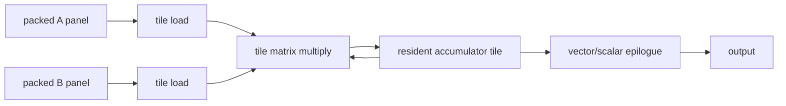
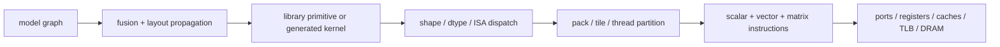

# Artificial Intelligence Operators on Central Processing Unit Microarchitecture

> **First-time reader orientation:** A model graph is eventually executed as loops over arrays. Performance depends on how those loops reuse data in registers and caches, how they feed vector or matrix units, and how they cross page and socket boundaries. This chapter starts from operator mathematics, derives loop shapes, and maps them onto CPU resources.

> **Abbreviation key — skim now and return as needed:** central processing unit (CPU); artificial intelligence (AI); general matrix multiplication (GEMM); general matrix-vector multiplication (GEMV); fused multiply-add (FMA); single instruction, multiple data (SIMD); Advanced Vector Extensions (AVX); Vector Neural Network Instructions (VNNI); Advanced Matrix Extensions (AMX); tile matrix multiply unit (TMUL); Scalable Vector Extension (SVE); Scalable Matrix Extension (SME); instruction set architecture (ISA); bfloat16 (BF16); floating point 16-bit (FP16); integer 8-bit (INT8); non-uniform memory access (NUMA); translation lookaside buffer (TLB); level-one/level-two cache (L1/L2); dynamic random-access memory (DRAM); input/output (I/O); key-value (KV); query/key/value attention tensors (Q/K/V); mixture of experts (MoE); Gaussian error linear unit (GELU); sigmoid linear unit (SiLU); array of structures (AoS); structure of arrays (SoA); channels-first image layout (NCHW); channels-last image layout (NHWC); image-to-column transformation (`im2col`); arithmetic logic unit (ALU); operations per second (OPS).

> **Prerequisites:** [SMT, SIMD, and Vector Execution](../01_Core_Foundations/03_SMT_SIMD_and_Vector_Execution.md), [Cache Microarchitecture](../04_Cache_Hierarchy/01_Cache_Microarchitecture.md), and [Load-Store Unit](../03_Out_of_Order_Backend/02_Load_Store_Unit_and_Memory_Ordering.md).
> **Hands off to:** [Performance Analysis](03_Performance_Analysis_Profiling_and_Research_Frontiers.md) for service-level bounds and profiling.

---

## 0. Start with shape, reuse, and dependency

For each operator, write five facts before choosing an instruction:

1. **Shape:** loop bounds and which are dynamic.
2. **Operations:** useful arithmetic and non-arithmetic work.
3. **Bytes:** compulsory and actual traffic at register, L1, last-level cache, and memory boundaries.
4. **Reuse:** which dimension lets a loaded value serve multiple operations.
5. **Dependencies:** reductions, data-dependent addresses, synchronization, or sequential recurrence.

The same `matmul` name may describe a large compute-bound prefill GEMM or a bandwidth-bound single-token GEMV. Peak AMX throughput is relevant to the first but can be irrelevant to the second.

## 1. Dense matrix multiplication: the CPU's AI throughput kernel

For $C=A B+C$ with $A\in\mathbb{R}^{M\times K}$, $B\in\mathbb{R}^{K\times N}$, and $C\in\mathbb{R}^{M\times N}$, the main arithmetic is approximately

$$
O_{GEMM}=2MKN
$$

floating-point operations when a multiply and add count separately. A naive loop repeatedly reloads operands. A high-performance kernel tiles the problem:

- an **outer cache tile** fits panels of $A$, $B$, and $C$ into selected cache levels;
- a **packed panel** presents contiguous data in the exact order the kernel consumes;
- a **microkernel** holds a small $M_r\times N_r$ block of accumulators in vector or tile registers while stepping through $K$;
- an **epilogue** applies scaling, bias, activation, residual addition, or type conversion before the result leaves registers or cache.

### 1.1 Why loop order is an architecture decision

Consider a microkernel that keeps $C_{micro}$ resident. Each $A$ element can be broadcast across several output columns and each $B$ vector reused across several output rows. The register working set is approximately

$$
R_{bytes}=M_rN_rq_{acc}+M_rK_rq_A+K_rN_rq_B,
$$

where $q$ denotes bytes per element for a tile step. $M_r$ and $N_r$ cannot grow without bound: register capacity, load ports, instruction issue, and accumulator dependency chains constrain them.

Packing $B$ may read and write the entire weight tensor. It is worthwhile when packed weights are reused over many requests; it can dominate a one-shot operator. Report whether packing is included in latency and how many inferences amortize it.

### 1.2 Prefill, decode, and training shapes

Transformer linear layers flatten batch and token dimensions into $M=B S$:

$$
[B,S,K]\times[K,N]\rightarrow[B,S,N].
$$

- **Prefill:** $M$ can be hundreds or thousands, enabling weight reuse and large cache tiles.
- **Decode:** $M$ is active batch size, often much smaller; weight traffic dominates until batching creates reuse.
- **Training:** forward, activation-gradient, and weight-gradient GEMMs permute $M$, $N$, and $K$ roles; the weight-gradient path also writes a large reduction result.

A kernel library therefore dispatches by shape, data type, transposition, and ISA. One large-square benchmark is not evidence for serving performance.

## 2. SIMD, vector, dot-product, and matrix execution

### 2.1 Scalar and SIMD execution

Scalar instructions handle loop bounds, pointer arithmetic, branches, tails, and irregular operators. SIMD instructions apply one operation to several packed elements. Dot-product instructions multiply groups of low-precision elements and accumulate into wider lanes, reducing instruction and register-read demand relative to separate multiply/add sequences.

Fixed-width x86 vector families such as AVX2 and AVX-512 expose a named register width. Arm SVE and the RISC-V Vector extension use a vector-length-agnostic programming model: software strip-mines based on the implemented vector length. Predication masks tails without scalar cleanup, but inactive-lane policy and gather patterns still affect execution.

### 2.2 Intel AMX as a tile dataflow

Intel AMX adds tile registers and tile-matrix-multiply hardware to the x86 ISA. The original AMX tile state provides eight two-dimensional tile data registers, each configurable up to 16 rows by 64 bytes, or 1 KiB. Software loads a tile configuration, moves array blocks from memory into tiles, performs matrix multiply-accumulate into accumulator tiles, and stores results.

The conceptual dataflow is:

The architecture consequence is not simply “more multiply units”:

- tile loads create sustained L1/L2 bandwidth and address-generation demand;
- tile shapes constrain packed layout and tail handling;
- keeping accumulators resident amortizes tile-store traffic;
- TMUL operations are multi-cycle, so independent accumulator tiles are needed to cover dependency latency;
- tile state expands operating-system context state and must be enabled and managed;
- frequency, thermal, and power sharing can change sustained throughput under many active cores.

AMX-BF16 and AMX-INT8 multiply low-precision inputs into wider accumulators. Accumulation width does not remove quantization error or overflow concerns; software must define scaling, saturation, and conversion.

### 2.3 Other scalable matrix directions

Arm SME adds a streaming execution mode and a scalable two-dimensional accumulator state often called `ZA`. It is designed so vector length remains an implementation choice while matrix kernels operate on scalable tiles. RISC-V's ratified V extension provides portable vector operations; matrix/tensor acceleration should be described using the exact implemented or proposed extension rather than assuming a universal ratified matrix ISA.

Across ISAs, compare contracts rather than mnemonics:

| Contract question | Why it matters |
|---|---|
| fixed or scalable vector/tile dimensions? | binary portability and loop strip-mining |
| supported input and accumulation types? | model quality, conversion, and overflow |
| explicit or implicit data movement? | instruction count, cache control, and predictability |
| accumulator capacity? | output-tile reuse and reduction latency |
| mask/tail semantics? | dynamic shapes and utilization |
| context-state and virtualization cost? | scheduling and multi-tenant serving |

## 3. Quantization is an algorithm-layout-ISA contract

Quantization represents weights or activations with fewer bits. An affine mapping is commonly written

$$
x\approx s(q-z),
$$

where integer $q$ uses scale $s$ and optional zero point $z$. **Symmetric** quantization uses $z=0$; **asymmetric** quantization can better cover an offset range but adds correction terms.

Scales may be per tensor, output channel, input group, or token. Smaller groups track distributions more closely but increase scale metadata and dequantization work. The full cost includes:

- packed data bytes and scale/zero-point bytes;
- unpack, sign extension, shuffle, and conversion instructions;
- dot-product throughput and accumulator width;
- requantization or dequantization in the epilogue;
- padding caused by block shapes;
- accuracy or convergence at the task level.

### 3.1 Weight-only decode

Weight-only quantization such as low-bit weights with FP16/BF16 activations reduces the dominant weight stream during decode. A kernel may unpack several low-bit values, apply group scales, and use vector FMA or integer dot products. It wins only if saved memory time exceeds unpack/dequantization time:

$$
\Delta T_{memory}>T_{unpack}+T_{scale}+T_{conversion}.
$$

At low bandwidth or large models this inequality is often favorable; for cache-resident small matrices or unsupported block shapes, conversion can dominate.

### 3.2 Layout is part of the quantized format

A file format optimized for compact storage may not match the microkernel. Runtime layouts interleave values so one cache line feeds the exact lane or tile order, often placing scales near their groups. Important choices include:

- row-major versus column-major or blocked matrices;
- input/output channel blocking;
- AoS versus SoA for metadata and sparse indices;
- alignment to cache line, vector width, and tile row;
- padding versus masked tails;
- prepacked immutable weights versus dynamically packed activations.

Changing data type without changing layout can leave most theoretical gain unrealized.

## 4. Sparse GEMM and structured sparsity

A sparse matrix stores only selected nonzero values plus information describing their locations. If fraction $d$ of elements is nonzero, ideal arithmetic falls from $2MKN$ toward $2dMKN$. Actual speedup is smaller because the CPU must decode metadata, form addresses, gather operands, balance uneven rows, and often scatter or reduce results.

Common contracts include:

- **compressed sparse row (CSR):** values and column indices are contiguous within each output row; flexible but index-heavy and hard to vectorize across unequal rows;
- **compressed sparse column (CSC):** analogous column ownership, useful when the loop reuses one input element across output updates;
- **block sparse row (BSR):** stores dense $r\times c$ blocks plus block indices; wastes work inside partially empty blocks but maps much better to SIMD or matrix tiles;
- **fixed $N$:$M$ sparsity:** exactly $N$ values survive in each group of $M$; predictable decoding and balance, but constrained pruning;
- **activation/dynamic sparsity:** nonzeros depend on the current input; cannot always be packed once with weights and may require runtime compaction.

For sparse weight values of $q_v$ bytes and indices of $q_i$ bytes, a rough stored size is

$$
D_{sparse}\approx dKN(q_v+q_i)+D_{row/block},
$$

versus $KNq_v$ dense bytes. Setting $dKN(q_v+q_i)<KNq_v$ and cancelling $KN$ gives the threshold below. Element-level sparsity saves capacity only when

$$
d<\frac{q_v}{q_v+q_i}
$$

before row pointers and alignment. With 1-byte values and 2-byte indices, density must fall below one third merely to reduce this simplified byte count. Block formats amortize one index across many values.

The execution mapping depends on which operand is sparse. Sparse weights can stream nonzero blocks and reuse dense activation rows; sparse activations can skip selected input contributions but create data-dependent work. Matrix extensions prefer regular dense blocks, so BSR or structured sparsity may outperform a mathematically sparser unstructured matrix.

Load balance is a first-class term. If thread $t$ owns $n_t$ nonzeros or blocks, parallel time follows the maximum work plus synchronization:

$$
T_{parallel}\gtrsim \max_t\frac{n_tC_{nz}}{P_t}+T_{merge},
$$

where $C_{nz}$ is the average operations or cycles required to decode and apply one nonzero/block, $P_t$ is thread $t$'s delivered processing rate in the matching unit, and $T_{merge}$ is synchronization/output-combination time. The bound follows the slowest assigned thread, not the mean nonzero count. Work stealing reduces imbalance but can damage NUMA locality and output ownership. Row bucketing or two-dimensional partitioning can regularize work at preprocessing cost.

Sparse research results should report density distribution, format bytes, index width, block occupancy, preprocessing/packing, vector/tile utilization, branch misses, gather/scatter traffic, load imbalance, and model quality. Comparing useful nonzero operations against dense hardware peak produces a misleading utilization number unless skipped work and metadata are accounted explicitly.

## 5. Convolution and vision operators

For a two-dimensional convolution with batch $B$, output height/width $H_o,W_o$, output channels $C_o$, kernel $R\times S$, and input channels $C_i$, main work is approximately

$$
O_{conv}=2BH_oW_oC_oRSC_i.
$$

Implementation families are:

- **explicit im2col + GEMM:** materializes sliding-window patches; reuses mature GEMM kernels but expands memory traffic and scratch capacity;
- **implicit GEMM:** generates patch addresses while feeding a GEMM-like microkernel, avoiding full materialization;
- **direct convolution:** tiles spatial and channel loops directly, useful for shapes where transform overhead is excessive;
- **Winograd or transform methods:** reduce multiplies for selected small kernels but add transforms and can affect numerical behavior;
- **depthwise convolution:** low reuse across channels and often memory/overhead bound despite low operation count.

The layout decision (`NCHW`, `NHWC`, or blocked channels) changes whether channel vectors are contiguous and whether matrix instructions see full tiles. Layout conversion between operators can erase an isolated kernel win; compilers try to propagate one layout or fuse conversions.

## 6. Attention: projections, score reduction, and KV traffic

For one head, scaled dot-product attention is

$$
P=\operatorname{softmax}\left(\frac{QK^T}{\sqrt{D_h}}+M\right),\qquad O=PV,
$$

where $M$ is an optional mask. A complete layer also contains Q/K/V projections and an output projection.

### 6.1 Prefill attention

With sequence length $S$, score computation and value aggregation scale as $O(S^2D_h)$. Naively materializing the $S\times S$ score/probability matrix creates large traffic. An I/O-aware implementation tiles Q, K, and V, computes an online softmax using running row maxima and normalization sums, and keeps score tiles transient in registers/cache.

For a block of logits $x_j$, stable online softmax updates a running maximum $m$ and denominator $l$:

$$
m' = \max(m,\max_j x_j),
$$

$$
l' = e^{m-m'}l+\sum_j e^{x_j-m'}.
$$

The factor $e^{m-m'}$ rebases the earlier denominator $l$ from the old maximum $m$ to the new $m'$. The output accumulator is rescaled by the same factor when $m$ changes. The method reduces intermediate memory traffic but introduces reduction dependencies, exponentials, and careful numerical ordering.

On CPUs, tile sizes must fit vector/tile registers and cache while leaving room for packed K/V panels. Parallelizing over heads and query blocks is usually simpler than splitting one softmax row, because a split row needs max/sum reductions across workers.

### 6.2 Decode attention

For one new query, each head reads stored keys to form scores and stored values to form the output. The work is linear in context length, but K/V are generally read once per step. Decode attention is thus commonly memory-bandwidth or latency bound.

Grouped-query and multi-query attention share K/V across several query heads, reducing capacity and traffic. Paged KV layouts simplify variable-length allocation and prefix sharing, but logical blocks add address translation and may fragment vector accesses. A block table should be cached and prefetched; data blocks should align to the kernel's head and token traversal.

## 7. Embeddings and sparse lookup

An embedding lookup gathers rows from a large table. It performs little arithmetic per byte and can have low locality. The fundamental questions are:

- how many unique rows are read after deduplication?
- are indices random, Zipf-distributed, or temporally correlated?
- how large is each row relative to cache lines and memory bursts?
- are rows local to the executing NUMA node?
- does training require atomic or reduced gradient updates?

For $N_u$ unique rows of $D$ elements at $q$ bytes, compulsory read traffic is roughly $N_uDq$. Metadata, partial-line fetches, and replication add more. Sorting or bucketing indices by shard improves locality and combines duplicates but costs a histogram, prefix sum, scatter, and possibly output reordering.

Hardware prefetchers struggle with data-dependent row addresses. Software can prefetch several independent future indices if the loop exposes a lookahead distance. Too short a distance fails to cover memory latency; too long evicts data before use or reads rows that a branch later skips.

## 8. Mixture-of-experts routing and expert execution

An MoE layer selects $k$ experts from $E$ for each token:

1. A router computes $E$ scores.
2. Top-$k$ selection chooses experts and routing weights.
3. A histogram counts tokens per expert.
4. Prefix sums allocate packed expert-input ranges.
5. Tokens scatter into expert-major buffers.
6. Each expert executes a feed-forward network.
7. Outputs gather to token order and combine using routing weights.

The router and permutation path are irregular integer/reduction workloads; expert networks are dense GEMMs, but their $M$ dimension equals tokens routed to each expert and may be small or imbalanced. A CPU design or runtime must balance:

- batching tokens for matrix efficiency;
- preserving token latency;
- replicating hot experts versus sharding capacity;
- NUMA-local expert placement;
- load balancing versus routing quality;
- sparse metadata and copy traffic versus arithmetic.

If expert $e$ receives $n_e$ tokens, compute completion is controlled by $\max_e n_e$ under static parallel assignment, not only $\sum_e n_e$. Report the distribution and tail of $n_e$, plus bytes moved during dispatch.

## 9. Normalization, activation, and fusion

Layer normalization computes mean and variance across hidden dimension $D$; root-mean-square normalization omits mean subtraction. A stable variance calculation and deterministic reduction may require more than one pass or wider accumulation. Activations such as GELU or SiLU combine arithmetic and approximations to transcendental functions.

These operators read and write relatively few operations per element, so intermediate traffic dominates. Fusion can keep data in registers/cache:

- bias + activation in a GEMM epilogue;
- residual addition + normalization;
- gated activation with two projection outputs;
- quantization scaling + output packing.

Fusion is limited by register pressure, code size, dynamic branches, and reuse. An oversized fused kernel may spill registers, reduce instruction-cache locality, or duplicate code for many shapes. Evidence must compare total bytes and end-to-end time, not kernel count alone.

## 10. Vocabulary projection, selection, and sampling

The output projection multiplies hidden state by a vocabulary matrix. Decode often makes this a bandwidth-heavy GEMV. Tied input/output embeddings can reduce capacity but do not eliminate the read.

Greedy selection requires a maximum reduction over vocabulary. Top-$k$ may use small per-thread heaps, partial sorting, selection networks, or vectorized block maxima followed by a merge. Top-$p$ additionally needs probabilities in descending order until cumulative mass crosses $p$; implementations may restrict to a top-$k$ candidate set first.

The exact softmax can use three logical passes: maximum, exponentiate/sum, normalize/sample. Fusion avoids materializing all probabilities when sampling can accumulate candidates online. Parallel reductions introduce order-dependent floating-point rounding; reproducibility requires a defined reduction tree and pseudo-random-number stream.

## 11. Cache, TLB, prefetch, and memory-level parallelism

### 11.1 A hierarchy of rooflines

“The operator fits in cache” is incomplete. Name which operands fit, which cache, and for how long under concurrency. A packed weight panel may fit in L2 but be displaced by activation and another thread's panel. Last-level-cache capacity may be shared across cores and sockets.

Blocking should satisfy a capacity inequality with associativity and safety margin:

$$
M_A+M_B+M_C+M_{other}\le \beta C_{cache},\qquad 0<\beta<1.
$$

The factor $\beta$ leaves room for set conflicts, code, stack, page tables, and competing workers. Capacity alone does not guarantee bandwidth; load/store ports, cache banks, and miss queues also bound supply.

### 11.2 TLB reach

If a TLB has $N_T$ effective entries for page size $p$, its ideal reach is $N_Tp$. Irregular access over a weight, embedding, or KV working set much larger than that can cause page walks. Huge pages increase reach and reduce page-table memory traffic, but do not fix poor NUMA placement or random DRAM latency.

Page walks themselves access a hierarchy of page-table entries, which may be cached. Measure completed walks, walk cycles, and the data-access pattern. A low TLB miss *rate* can still matter if every miss blocks a dependency chain.

### 11.3 Bandwidth versus latency

High memory bandwidth requires enough concurrent cache misses. If average miss latency is $L$ seconds and each request transfers a cache line of $B$ bytes, sustaining bandwidth $W$ requires approximately

$$
N_{outstanding}\ge \frac{WL}{B}
$$

independent outstanding requests. This is Little's law for the memory pipeline: bandwidth $W$ issues $W/B$ line requests per second, each in flight for latency $L$, so $N_{outstanding}=(W/B)L$. GEMM panels naturally expose streaming parallelism. ANN graph traversal may expose only a few dependent misses and achieve low bandwidth while remaining memory-latency bound.

Software prefetch, simultaneous requests, loop unrolling, and independent accumulators raise concurrency. They are limited by load buffers, miss-status holding registers, memory-controller queues, and cache pollution.

## 12. NUMA, coherence, and thread scheduling

### 12.1 Ownership rules

Pin worker threads and allocate their hot data on the same NUMA node unless deliberate sharding says otherwise. Immutable weights can be replicated without coherence writes. Mutable queues, counters, allocators, and KV metadata need ownership policies that prevent cache-line bouncing.

False sharing occurs when independent fields written by different cores occupy one coherence line. Padding removes the ping-pong but increases footprint. Sharded counters and per-worker queues reduce coherence traffic; periodic aggregation trades freshness for scalability.

### 12.2 Thread pools and matrix kernels

Parallelizing a GEMM across cores partitions output tiles, batch rows, or weight columns. The partition should minimize shared writes and balance work. Nested parallelism—a serving worker pool calling a library that starts another full pool—can oversubscribe cores and destroy locality. Establish one owner for parallelism at each operator.

For small decode shapes, using every core may hurt: barrier and scheduling overhead grow while memory bandwidth saturates early. Sweep thread count and socket count. A smaller local core set can improve TPOT and leave capacity for concurrent requests.

## 13. Compiler and runtime path

A model operator reaches hardware through several layers:

The reproducible path begins with a model artifact—not the source framework alone. Capture the exported graph or intermediate representation (IR), parameter hashes, shape constraints, operator-set version, precision policy, and preprocessing semantics. Import then canonicalizes names and layouts and decomposes high-level operators into supported primitives. Two compilers can legally lower the same attention node into very different fusion, materialization, and reduction boundaries.

Precision transformation is part of compilation. Post-training quantization needs calibration data and a stated rule for scales, zero points, clipping, outliers, and accumulator width. Quantization-aware training embeds related choices in the learned artifact. Record where conversions occur: an INT8 weight file that is expanded to BF16 before every kernel is not an INT8 memory/execution result.

Dynamic shapes require contracts rather than wishful “dynamic support.” A compiler may emit symbolic loops, guard-and-specialize variants, or pad requests into shape buckets. Each option changes code-cache size, compilation latency, tail work, and operator fusion. Log the guard/bucket selected for every request and include recompilation or cache-miss behavior in cold/warm experiments.

After fusion and layout propagation, memory planning assigns lifetimes and reusable buffers. The planner must account for aliasing, alignment, packed weights, scratch space, parallel tasks, and fallback boundaries. An unsupported operator may return to a framework interpreter or scalar/library kernel, forcing layout conversion and synchronization. Report graph-node coverage by generated kernel, library primitive, and fallback; a fast supported subset does not characterize the complete model.

Libraries provide tuned primitives and just-in-time generators specialize microkernels. Runtime dispatch chooses a primitive using shape, data type, layout, ISA availability, thread topology, and sometimes measured autotuning. Executable identity therefore includes compiler/library/runtime versions, compile flags, target feature set, generated-code or cache key, shape guards, packed-layout version, thread/NUMA policy, and relevant environment settings. Preserve the final IR, dispatch log, generated-code disassembly, and graph-node-to-kernel map so a reviewer can prove which program actually ran.

A useful coverage invariant is

$$
N_{graph\ nodes}=N_{fused\ into\ CPU\ kernels}+N_{library}+N_{fallback}+N_{eliminated},
$$

with every category traceable to source nodes and executed intervals. Reconcile operator output shapes and checksums at fusion boundaries; otherwise a performance comparison may silently measure different graph semantics.

## 14. Worked mappings

### 14.1 Decode linear layer

Let $M=8$, $K=4096$, $N=11008$, and weights use 4 bits plus modest scale metadata. The main work is about

$$
2MKN\approx 721\text{ million operations}.
$$

Raw weight bytes are roughly $KN/2\approx22.5$ MB. Each iteration can reuse a loaded weight value across eight rows, but must also unpack and scale it. The analysis should compare sustained memory time for 22.5 MB, unpack/dot-product throughput, and output-tile accumulation. Raising batch to 16 doubles arithmetic while weight bytes remain similar, improving intensity but increasing each request's scheduling exposure.

### 14.2 Decode KV attention

For 32 layers, 8 KV heads, head dimension 128, BF16 state, and context 4096, per-request KV capacity is

$$
2\times32\times8\times128\times4096\times2=512\text{ MiB}.
$$

Each decode step reads a large fraction of prior K/V state. Four concurrent requests can consume about 2 GiB of KV capacity before allocator metadata. The kernel should stream contiguous token/head blocks, prefetch block-table entries, and distribute heads without cross-core reductions where possible.

### 14.3 MoE imbalance

Suppose 256 tokens choose two of eight experts, producing 512 assignments. Uniform mean load is 64 assignments/expert, but measured maximum is 104. If experts execute in parallel with equal hardware, the compute phase is at best $64/104\approx61.5\%$ balanced relative to the mean ideal. Faster GEMM alone cannot remove the routing imbalance.

## 15. Research audit questions and failure boundaries

- Does an ISA feature reduce end-to-end bytes or only instruction count?
- Is matrix peak limited by tile compute, tile loads, packing, epilogue, or memory controllers?
- Which reuse dimension disappears from prefill to decode?
- Does quantization preserve task quality and reduce measured memory traffic after scale metadata and unpacking?
- Are sparse kernels limited by arithmetic, address generation, cache misses, TLB walks, or load imbalance?
- Does operator fusion reduce traffic without causing register spills or code-size pressure?
- Are huge pages improving TLB reach or merely masking an allocator/placement problem?
- Is cross-socket bandwidth useful data or avoidable remote access?
- Can the result be explained from counters, generated code, and an operator-level model?
- Where does the model fail: insufficient independent misses, cache-capacity transitions, dynamic sparsity, packing amortization, or queueing outside the operator?
- Which result depends on one vendor's instruction contract, and which mechanism generalizes to other vector or matrix machines?

## References

1. Intel, [Advanced Matrix Extensions intrinsic example and architectural overview](https://www.intel.com/content/www/us/en/developer/articles/code-sample/advanced-matrix-extensions-intrinsics-functions.html).
2. Intel, [64 and IA-32 Architectures Optimization Reference Manual](https://www.intel.com/content/www/us/en/developer/articles/technical/intel-sdm.html).
3. Arm, [A-profile architecture and Scalable Matrix Extension documentation](https://developer.arm.com/Architectures/A-Profile%20Architecture).
4. RISC-V International, [“V” Standard Extension for Vector Operations, Version 1.0](https://docs.riscv.org/reference/isa/unpriv/v-st-ext).
5. oneAPI Deep Neural Network Library project, [oneDNN developer guide](https://uxlfoundation.github.io/oneDNN/).
6. T. Dao et al., [“FlashAttention: Fast and Memory-Efficient Exact Attention with IO-Awareness,”](https://arxiv.org/abs/2205.14135) 2022.
7. J. Hennessy and D. Patterson, *Computer Architecture: A Quantitative Approach*, sections on vector processors, memory hierarchy, and roofline analysis.

---

← [End-to-End AI Serving on CPUs](01_End_to_End_AI_Serving_on_CPUs.md) · [AI section index](00_Index.md) · next → [Performance Analysis, Profiling, and Research Frontiers](03_Performance_Analysis_Profiling_and_Research_Frontiers.md)
