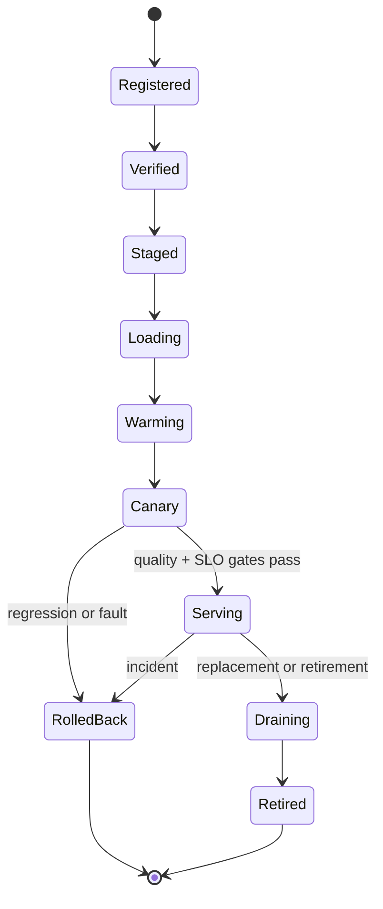

# CPU AI-Stack Verification, Operations, and Deployment Blueprint

> **Abbreviation key:** central processing unit (CPU); artificial intelligence (AI); service-level objective (SLO); time to first token (TTFT); time per output token (TPOT); continuous integration/continuous deployment (CI/CD); non-uniform memory access (NUMA); personally identifiable information (PII).

## 0. Purpose and design ideology

This chapter turns the CPU AI stack into an operable product. The design ideology is **one immutable build identity, validation at every semantic boundary, and telemetry that reconstructs the first divergence or oldest delay**. Deployment is part of correctness because a mismatched tokenizer, packed-weight layout, kernel library, or scheduler configuration can invalidate an otherwise correct binary.

## 1. Release artifact and compatibility contract

A release bundle contains model/checkpoint hashes, tokenizer/feature artifacts, graph and execution-plan manifests, packed weights, kernel/JIT cache where portable, runtime/server/container versions, supported CPU features and operating-system requirements, configuration schema/defaults, quality results, performance envelope, security signature, migration/rollback instructions, and provenance.

The compatibility matrix crosses model/tokenizer, graph schema, compiler, plan format, kernel layout, runtime, CPU feature set, device adapter, and serving-state format. Each boundary either guarantees backward compatibility or refuses startup. Silent rebuilds during deployment break reproducibility; new generated plans receive new identities and validation.

## 2. Correctness and quality validation ladder

1. validate artifact integrity and schema;
2. compare imported graph with framework reference on known and randomized inputs;
3. compare each transformed graph/partition and kernel variant;
4. test numerical extrema, quantization boundaries, dynamic shapes, aliases, and fallbacks;
5. run end-to-end requests through preprocessing, execution, sampling, and output;
6. validate deterministic mode and expected nondeterministic tolerances;
7. evaluate task-specific model quality on held-out data;
8. test old/new version coexistence, drain, rollback, and state incompatibility.

Use differential, metamorphic, and property tests. Examples: batching or request order must not change independent deterministic outputs; a layout round trip preserves values; a fused graph matches unfused within the declared tolerance; increasing a mask cannot expose forbidden positions; cancellation cannot affect another request. Tolerance is fixed before results and accompanied by model-quality impact.

## 3. Concurrency, fault, and security verification

Stress task completion reordering, full pools, NUMA imbalance, slow clients, cancellation at every state, model unload during requests, device reset, storage/network errors, malformed descriptors, memory pressure, and process restart. Inject faults with stable seeds and retain the first-divergence packet.

Multi-tenant tests enforce authentication/authorization, model access, request/byte/core/KV quotas, memory zeroization/reuse, log/trace redaction, administrative separation, and debug control. Treat prompts, features, embeddings, KV state, and outputs as sensitive. Avoid placing content in labels with unbounded cardinality; use protected trace payloads only under explicit access/retention policy.

## 4. Telemetry schema and causal correlation

Propagate request, tenant, model/version, trace, scheduler epoch, batch, graph/plan, task, kernel variant, tensor generation, KV block, device submission, and response-chunk identities. A trace span records start/end boundary, status, causal parent/dependency, resource/NUMA placement, work units, bytes, and queue reason.

Metrics need exact definitions:

- arrivals, admissions/rejections by reason, queue depth/age by state;
- model load/validate/pack/warm time and resident bytes;
- preprocessing, scheduling, execution, sampling, and output time;
- kernel/operator counts, useful operations/bytes, thread/NUMA placement, device gaps;
- KV/prefix capacity, fragmentation, hit/reference/eviction/swap;
- TTFT, TPOT, total latency, throughput, goodput, deadline misses;
- faults/retries/cancellations and wasted compute;
- CPU cycles/instructions/cache/TLB/memory bandwidth, power and energy when available.

Conservation checks catch instrumentation bugs: admitted = completed + failed + canceled + live change; allocated KV = referenced + freeable pending + leaked error; submitted tasks = completed + failed + canceled + live; streamed chunks cannot exceed committed output tokens.

## 5. Performance and capacity qualification

Benchmark cold start, warm start, single request, saturation curve, realistic open-loop arrival distributions, input/output length matrix, model mix, tenant mix, NUMA/socket placement, background interference, slow clients, cancellation, and failure recovery. Separate service time from queueing.

For each hardware/configuration class, produce a capacity envelope rather than one QPS number: maximum safe offered load versus TTFT/TPOT/quality SLO, memory/KV capacity, power, and model mix. Locate the knee with increasing open-loop load and include burst/tail confidence. Capacity headroom covers a worker failure, rollout overlap, compaction/packing, and traffic forecast error.

Performance regression gates compare work as well as time. A faster result with fewer evaluated tokens or changed quality is invalid. Diagnose with plan/kernel identity, operations/bytes, queue states, and counters before accepting a threshold.

## 6. Deployment state machine

A model version moves through Registered → Verified → Staged → Loading → Warming → Canary → Serving → Draining → Retired, with Failed/RolledBack terminal branches. Each transition has owner, checks, timeout, telemetry, cleanup, and rollback.

Canary traffic is representative and isolated enough to compare error, quality, TTFT/TPOT/goodput, memory, and CPU/device demand. Promotion requires minimum sample and confidence, not absence of alerts for a few minutes. Rolling update limits concurrent load/warm capacity and pins existing requests to their version. Drain stops new assignments, waits or cancels under policy, releases request state, then unloads plans/weights.

Rollback selects a known compatible artifact/configuration. If serving-state format changed, either old requests remain on old workers, a tested migration converts state, or they fail explicitly; never reinterpret live KV or tokenizer state.

## 7. Configuration and control plane

Version configuration with schema, units, bounds, defaults, per-model/tenant overrides, provenance, and safe-update rules. Classify fields:

- static startup: CPU features, memory pools, thread topology;
- drain-required: model plan, packed layout, state format;
- epoch-safe: scheduler policy, batch/token budgets with new work only;
- dynamic: admission thresholds or logging level within validated bounds.

Validate cross-field constraints such as batch tokens ≤ workspace/plan profile, KV high-water < capacity minus finish reserve, thread teams ≤ assigned cores, and timeout hierarchy. Record a configuration hash on every trace/benchmark.

## 8. Incident response and disaster recovery

Alerts connect symptom to an actionable state: rising queue age, admission failure, KV high-water/leak, model load error, kernel fallback, device reset, output backpressure, NUMA remote traffic, or quality drift. On incident, capture configuration/build identities, traffic distribution, oldest requests/tasks, queue/resource snapshots, model/KV ownership, recent changes, logs/traces/counters, and sample-safe failure inputs.

Mitigation can shed load, disable a faulty plan/kernel, reduce batch, stop new prefill, preserve decode finish reserve, route to another pool, rollback, or restart after drain/epoch change. Avoid blind restart when persistent corrupt artifacts or overload will reproduce the failure.

Disaster recovery defines artifact/registry backup, configuration recovery, warm-capacity target, regional failover, state-loss policy, idempotent client retry, and validation after restoration. Persistent model artifacts are recoverable; live KV/request state may be intentionally ephemeral unless replicated with a defined consistency protocol.

## 9. Design trade-offs and invariants

| Choice | Benefit | Cost |
|---|---|---|
| strict reproducible build | debuggability/audit | slower adoption and larger variant registry |
| shadow/canary validation | catches real-traffic faults | duplicate compute, privacy, comparison complexity |
| rich traces | causal diagnosis | overhead, sensitive data, storage |
| live state migration | graceful updates/failover | format compatibility and distributed consistency |
| fail-fast admission | protects active SLO | rejected demand and routing requirements |
| automatic fallback | availability | performance/quality changes can hide defects |

Operational invariants: every served response names immutable model/plan/config identities; promotion never bypasses correctness/quality gates; active requests retain compatible state semantics; rollback is executable within the declared recovery objective; telemetry accounting conserves work/state; secrets and user data obey access/retention; and one failure cannot consume the finish reserve required by admitted work.

## 10. Staged operational bring-up

Bring up offline reference tests, one-process functional service, fixed-load performance, concurrency/cancellation, overload, fault injection, multi-version drain/rollback, canary, and full production load in order. Each stage has pass evidence and a rollback. The complete stack is reconstructable when a new team can build the artifacts, validate semantics/quality, qualify capacity, deploy safely, diagnose first divergence or oldest delay, and recover without hidden framework behavior.

---

← [CPU Serving Runtime](05_CPU_Serving_Runtime_Scheduler_and_State_Implementation_Blueprint.md) · [CPU AI Index](00_Index.md)
