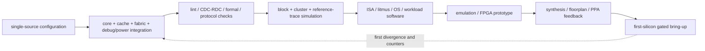

# CPU Integration, Verification, and Bring-up Blueprint

> **Abbreviation key:** central processing unit (CPU); instruction set architecture (ISA); instructions per cycle (IPC); field-programmable gate array (FPGA); power, performance, and area (PPA); error-correcting code (ECC).

## 0. From correct blocks to a usable CPU

A frontend, backend, and cache can each pass local tests while the assembled CPU fails to boot, makes no forward progress, or reports misleading performance. Integration is the discipline of making all boundaries agree: reset state, addresses, interrupts, ordering, cacheability, power state, debug, errors, configuration, and observability.

The design ideology is **one source of truth for contracts and one observable architectural boundary**. Parameters such as physical address width, cache-line size, transaction identifier width, number of interrupt sources, and feature presence must be generated from a reviewed configuration—not copied independently into blocks. The retirement trace remains the end-to-end correctness boundary from first simulation through post-silicon debug.

## 1. CPU-subsystem integration contract

Create a top-level interface ledger:

| Boundary | Required specification |
|---|---|
| instruction/data fabric | address, opcode, size, attributes, IDs, ordering, responses, retry, errors, backpressure |
| coherence | line size, agent IDs, request/probe/response channels, states, progress resources |
| interrupt | source, level/edge behavior, priority, masking, synchronization, acknowledgement |
| debug | halt request, halt point, outstanding-traffic policy, resume, reset, trace access |
| clock/reset | source, frequency relation, reset assertion/deassertion, isolation, synchronization |
| power | domain membership, retention, wake cause, quiescence handshake, power-state legality |
| configuration | feature discovery, read-only identity, writable policy, reset values, versioning |
| performance/trace | event definitions, privilege filtering, overflow, timestamps, sampling |

An interface is incomplete unless it defines behavior under backpressure, reset, timeout, and a response after cancellation. Payload must remain stable while a ready/valid transfer is stalled. Credit protocols must define initialization, return, saturation, and recovery if endpoints reset independently.

## 2. Reset, boot, interrupt, and debug sequencing

Reset assertion should place externally visible outputs in safe states immediately according to the electrical/domain contract; reset deassertion must be synchronized to each receiving clock. Define retained versus cleared arrays. Large memories often invalidate through valid-bit reset or a scrub sequence rather than resetting every data bit.

A defensible boot sequence is:

1. power and clocks reach valid conditions;
2. reset synchronizers release always-on and core domains in dependency order;
3. cache/TLB/coherence valid state is empty or scrubbed;
4. reset program counter and privilege state become valid;
5. the first instruction fetch uses a known memory attribute and address path;
6. firmware discovers features, configures translation/cache policy, and enables interrupts;
7. optional cores leave reset only after shared fabric and coherence homes are ready.

Interrupt sampling and delivery need a precise boundary. Record a pending interrupt, but take it only when retirement rules allow a precise next program counter. Define priority relative to synchronous exception, debug halt, non-maskable interrupt, and reset. A debug halt usually stops at a retirement boundary, blocks new work, and either drains or preserves outstanding memory according to the debug contract. “Stop the clock” alone can strand coherence responses and deadlock the system.

## 3. Configuration and compatibility discipline

For each parameter, decide whether it is elaboration-time, boot-time, or dynamically writable. Elaboration parameters change structure and must be visible in feature-identification registers. Dynamic configuration needs safe-update rules: drain, fence, invalidate, or epoch transition before behavior changes.

Version registers and descriptor formats. Reserve encodings and specify how software detects optional features. Never let hardware silently reinterpret an old field after an update. Cross-block derived constants—line offset, source-ID partition, number of cache slices—must be checked for consistency at build time and also surfaced to verification.

## 4. Verification ladder

Verification should grow from local mathematical properties to complete software:

### 4.1 Static and formal checks

- lint, clock/reset-domain crossing, and structural connectivity;
- ready/valid stability, FIFO overflow/underflow, tag uniqueness, and allocation conservation;
- bounded proof of rename recovery, reorder retirement, cache permission invariants, and protocol deadlock freedom under fair responses;
- equivalence across synthesis or major transformations where applicable.

Formal proof is strongest for small control cones and invariants; it is not a replacement for long software behavior or performance validation.

### 4.2 Block and cluster simulation

Use directed corner cases first, then constrained-random streams with reference scoreboards. Inject arbitrary backpressure, response reordering, exceptions, interrupts, ECC errors, and flushes. Compose core plus private cache, then coherent cluster, then memory/system. Compare every retired instruction to a reference model and every committed memory effect to a memory scoreboard.

### 4.3 Architectural and software suites

Run ISA compliance, privilege/translation tests, memory-model litmus tests, atomics, debug, multicore stress, operating-system boot, compiler tests, and long random instruction streams. Differential testing against more than one reference model reduces shared-bug risk. Track coverage by feature and cross-feature scenario—not only line or toggle coverage.

### 4.4 Acceleration and prototypes

Emulation or field-programmable gate-array (FPGA) prototypes allow booting full software and running long stress tests, but clock ratios, memory timing, and debug intrusiveness differ from silicon. Preserve architectural checking and use the timing simulator for performance conclusions.

## 5. Performance signoff as a causal experiment

Define a benchmark matrix before optimizing:

- small dependency chains for execution latency and bypass;
- independent arithmetic for issue/port throughput;
- branch patterns for direction/target capacity and recovery penalty;
- instruction-footprint sweeps for frontend/cache capacity;
- pointer chasing for unloaded memory latency;
- streams for bandwidth, MSHR, prefetch, and writeback behavior;
- TLB/page-size sweeps;
- multicore false sharing, contended atomics, and bandwidth fairness;
- representative applications and AI host/inference paths.

For each benchmark, record committed instructions, cycles, frequency, warm-up, region of interest, compiler, memory placement, and configuration. Decompose cycles into mutually interpretable causes. Useful top-down categories are retirement, bad speculation, frontend bound, and backend bound, but implementation counters must further identify the exhausted queue, port, cache level, translation level, or fabric channel.

Peak performance is constrained by several bounds:

$$IPC \le \min(W_{retire}, W_{decode}, T_{ports}, P_{parallelism}, M_{memory}),$$

where $W_{retire}$ and $W_{decode}$ are widths, $T_{ports}$ is execution-resource throughput expressed as instructions per cycle for the mix, $P_{parallelism}$ is available dependency-independent work, and $M_{memory}$ is the memory/latency-hiding bound. Measure which term is active before widening anything.

Performance validation proceeds from microbenchmarks whose answer is analytically predictable, through subsystem kernels, to applications. Correlate simulator intermediate observables—misses, branch outcomes, queue occupancy, traffic—not only total runtime. Two models can match total cycles for compensating wrong reasons.

## 6. PPA and physical closure feedback

Power, performance, and area (PPA) are not a final report. Maintain a per-block budget for area, leakage, dynamic power by activity mode, critical path, clock load, memory instances, and wire-sensitive interfaces. After synthesis and floorplanning, feed actual latency and bandwidth changes back into the performance model.

Common closure responses and consequences:

- pipeline issue select: higher frequency, but later wakeup and more branch/miss replay complexity;
- bank the physical register file: local timing, but steering and bank conflicts;
- distribute the reorder buffer or completion: wiring relief, but retirement aggregation complexity;
- add cache pipeline stages: frequency/size benefit, but load-use and redirect latency;
- reduce broadcast: power/timing benefit, but extra cross-cluster latency;
- clock gate aggressively: dynamic-power benefit, but enable timing and wake latency.

Every timing fix must update the architectural performance model. A core that closes 10% faster but adds one cycle to a high-frequency dependency may lose application performance.

## 7. Observability architecture

Debug facilities must be designed before failure, not added after signals disappear. Provide:

- an architectural retirement trace with cycle or global timestamp;
- triggerable control-flow trace where bandwidth permits;
- error-status registers with first-error capture and source identity;
- queue/cache/coherence occupancy and stall counters;
- watchdog progress indicators such as last-retired program counter and fabric transaction age;
- scan, memory built-in self-test, and array repair visibility;
- safe firmware-readable feature/configuration identity;
- trace filters and privilege/security controls.

Counters require exact definitions. State increment event, clock domain, reset, saturation/wrap, speculative versus retired scope, whether events can count multiple per cycle, and multiplexing limitations. For cross-domain correlation, define timestamp synchronization or accept a bounded alignment error.

## 8. Bring-up plan from first clock to workloads

Bring-up is a sequence of falsifiable gates:

1. **Power/clock/reset:** rails, clocks, reset release, scan access, and current are within safe limits.
2. **Static identity:** debug can read implementation/version and key state without executing code.
3. **Single-step execution:** known instructions retire from on-chip or tightly controlled memory; compare trace manually/reference model.
4. **Exception/interrupt:** deliberate illegal instruction, access fault, timer interrupt, and debug halt return to known points.
5. **Cache/translation:** walking patterns, alias/protection tests, invalidation, and ECC injection.
6. **Multicore/coherence:** ping-pong lines, atomics, barriers, false sharing, and randomized litmus tests.
7. **External memory and I/O:** sweep address/data patterns, stress outstanding traffic, errors, and resets.
8. **Operating system and applications:** boot with conservative features, then enable prefetch, speculation, power states, and frequency modes one at a time.
9. **Characterization:** voltage/frequency/temperature shmoo, power modes, workload performance, and long reliability stress.

Each gate has entry conditions, expected trace/counters, timeout, rollback configuration, and pass/fail owner. Keep disable bits for new predictors, prefetchers, speculative memory, and deep power states so failures can be isolated. Security must control those bits in production.

## 9. Failure triage by first divergence

When hardware and reference disagree, find the earliest differing retired instruction, not the eventual crash. Classify whether its inputs were already wrong, its execution was wrong, or an incorrect instruction retired. For hangs, inspect oldest live reorder entry, oldest memory/coherence transaction, full queues, credits, and clock/power state. For performance loss, compare intermediate counts to the calibrated model before changing policy.

A useful triage record contains configuration hash, binary hash, seed/input, first-divergence trace, preceding redirects/exceptions, outstanding transaction snapshot, temperature/voltage/frequency, and reproducibility rate. Without this, teams repeatedly rediscover non-deterministic failures.

## 10. Completion checklist

A CPU subsystem is implementation-ready when:

- every top-level interface has payload, ordering, flow-control, reset, and error semantics;
- all cross-block parameters have one source of truth and discoverable versioning;
- the architectural reference trace works from block simulation through prototype;
- safety, precise-state, coherence, and progress invariants have named verification methods;
- benchmark counters locate a bottleneck rather than merely report performance;
- physical feedback is reflected in cycle-level performance assumptions;
- first-silicon gates, expected evidence, failure rollback, and feature-enablement order are written before tape-out;
- remaining risks are explicit experiments, not assumptions hidden in prose.

---

← [Memory Blueprint](02_Memory_Translation_and_Coherence_Implementation_Blueprint.md) · [CPU Blueprint Index](00_Index.md)
