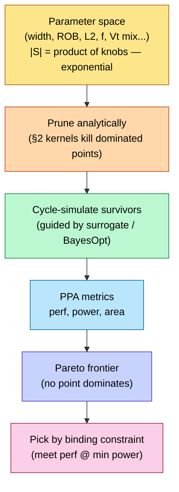

# Performance Modeling and Design-Space Exploration

> **Stage:** 01 · Architecture & PPA (Performance, Power, Area) — the *performance* half of PPA, done **before any RTL (register-transfer level) exists**.
> **Prerequisites:** [Chip_Design_Flow_Overview](../../Chip_Design_Flow_Overview.md), [CPU_Architecture](../02_CPU/01_CPU_Architecture.md), [Memory](../03_Memory/03_Memory.md).
> **Hands off to:** the µarch spec that [RTL_Design_Methodology](../../03_Frontend_RTL_and_Verification/01_RTL_Design_Methodology.md) implements. **Owns the concepts; defers the machinery:** simulator internals live in [Simulation_Methodology](../07_Simulators/01_Simulation_Methodology.md); full-chip composition, contention, and power/thermal coupling in [Full_Chip_Modeling](02_Full_Chip_Modeling.md); per-tool detail in the [Simulators folder](../07_Simulators/00_Index.md).

---

## 0. Why this page exists

Architecture is a **one-way door**. You choose a microarchitecture — issue width, window depth, cache sizes, how many cores, what accelerator — and then RTL spends months and silicon spends a year *faithfully implementing that choice*. Every downstream stage optimizes the thing you committed to; none of them second-guesses whether it was the right thing. So the single most expensive mistake in chip design is made here, at the top, before a line of RTL exists — and it is made about a machine **that cannot yet be measured because it does not yet exist.**

If you cannot measure it, you **model** it. A model is an abstraction that deliberately throws away detail to answer a question faster than building the real thing would. That immediately sets up the organizing tension of this entire page — a **trilemma** between three things you cannot have at once:

- **Accuracy** — how close the model's number is to what the real silicon would do.
- **Speed** — how many design points you can evaluate per day.
- **Effort/coverage** — how much of the real machine (and how many workloads) the model captures.

You cannot maximize all three. A cycle-accurate model is accurate but slow; a spreadsheet is instant but coarse. The whole craft of pre-RTL modeling is choosing, for each *decision*, the point on that surface that is *just accurate enough to be right and no slower than necessary*. Stated as a rule that governs everything below:

> **Use the fastest, cheapest model whose resolution still exceeds the gap between the choices you are deciding between.**

If two cache sizes differ by 15% in performance and your model's error bar is ±30%, the model cannot see the difference — you must climb to a finer rung. If they differ by 2× , a spreadsheet settles it in a minute and cycle-accurate simulation is wasted effort. This page builds the tools that let you make that call: the **fidelity ladder** (§1), the **analytical kernels** that decide most questions on paper (§2, and their throughput-machine variants §9–§10), how and when to **climb to simulation** (§3–§4), how to search the exploding space with **design-space exploration** (§5), and how the **PPA axes actually trade** (§6). The recurring discipline is that performance is not one opaque number — it *decomposes*, and the decomposition tells you where to spend.

---

## 1. The modeling-fidelity ladder

Every model sits at a point on the **accuracy ↔ speed** curve, and the models form a ladder spanning roughly *six orders of magnitude* in simulation cost. You start at the top (cheapest) and climb only as far down as a decision forces you — because each rung costs ~10–100× more per evaluated point than the one above it.

| Rung | What it can resolve | Speed (host/target) | Error on cycles | Typical instance |
|---|---|---|---|---|
| **Analytical / mechanistic** | first-order: iron law, CPI stack, Amdahl, roofline; *which term dominates* | instant (closed form) | ±30–50% (ranking) | spreadsheet, interval model |
| **Trace-driven** | cache / branch / bandwidth behavior on a fixed address+branch stream | very fast | ±15–25% | cache sim on a trace |
| **Event-driven cycle-approximate** | pipeline + contention + reordering, abstracted | 10³–10⁴× slowdown | ±10–15% | gem5-O3, Sniper |
| **Cycle-accurate** | full timing validated *to a specific target* core | 10⁴–10⁵× slowdown | <5% vs that core | validated O3 config |
| **RTL / emulation** | the actual gates — it *is* the design | 10⁶–10⁷× (RTL); 10–10³× (FPGA) | exact | Verilator/VCS; [emulation](../../03_Frontend_RTL_and_Verification/13_Gate_Level_Sim_and_Emulation.md) |

Two properties make this a *ladder* rather than a menu:

- **"Cycle-accurate" is a claim about a target, not a virtue.** A model validated against a Cortex-A76 is not cycle-accurate for a Neoverse-V2. Accuracy is always *relative to a reference you calibrated against* — an uncalibrated "cycle-accurate" model can be 30% off (§8).
- **You live on the middle rungs because of the speed budget.** A design-space sweep of thousands of configurations cannot afford RTL; you push the physics *down* into pre-characterized per-event costs (cache access energies, DRAM timings) and keep the *composition* fast and cheap. This is why architects spend most of their time between "analytical" and "event-driven."

This page owns the **top rung** — the analytical kernels that decide the most and that every lower rung is a more-faithful realization of. *How* the lower rungs actually work — the discrete-event engine, trace- vs execution-driven feeding, region-of-interest sampling, warm-up, validation and error budgets — is the subject of [Simulation_Methodology](../07_Simulators/01_Simulation_Methodology.md), and the ladder's use in composing a whole chip is [Full_Chip_Modeling §2](02_Full_Chip_Modeling.md). We cross-link that machinery rather than duplicate it.

---

## 2. Analytical models — the back-of-envelope that decides the most

The counter-intuitive truth of this stage: a spreadsheet, used well, settles more architecture questions than a simulator does. Analytical models are ±30–50% in *absolute* terms but far tighter in *ranking* — and ranking is what a design decision needs. Their real power is not the number but the *decomposition*: they tell you **which term dominates**, and therefore where a transistor buys performance and where it is wasted.

### 2.1 The iron law and the CPI stack

Start from the identity that underlies all processor performance — the **iron law**:

$$
T_{\text{program}} \;=\; \underbrace{IC}_{\text{ISA + compiler}} \;\times\; \underbrace{\text{CPI}}_{\text{microarchitecture}} \;\times\; \underbrace{t_{\text{cyc}}}_{\text{µarch + circuit + process}}
$$

where $IC$ = dynamic instruction count, $\text{CPI}$ = average cycles per instruction, $t_{\text{cyc}} = 1/f$ = clock period.

**Where it comes from — a counting identity, not a model.** Execution time is cycles times seconds-per-cycle, $T = C_{\text{tot}}\cdot t_{\text{cyc}}$, and the cycle count is the sum over the $IC$ dynamically-retired instructions of the cycles each is charged, $C_{\text{tot}} = \sum_{j=1}^{IC} c_j$. *Define* CPI as the average of that charge, $\text{CPI}\equiv C_{\text{tot}}/IC$; then $C_{\text{tot}}=IC\cdot\text{CPI}$ by construction and $T=IC\cdot\text{CPI}\cdot t_{\text{cyc}}$ follows with **no approximation**. The content is not the algebra but the *factoring*: the three factors are set by three nearly-disjoint actors, so each can be attacked independently — that is what turns a tautology into a design tool.

Its value is *separation of concerns*: three factors owned by three different actors, and the architect owns the middle one outright and shares the third. It also warns you that the three are coupled — a deeper pipeline cuts $t_{\text{cyc}}$ but raises CPI (more mispredict exposure), so **you optimize the product, never one factor** (§2.4, §6).

The architect's factor, CPI, then decomposes **additively** into a base rate plus one stall term per hazard source:

$$\text{CPI} = \text{CPI}_{\text{base}} + \underbrace{m_{\text{L1}}\,p_{\text{L1}} + m_{\text{L2}}\,p_{\text{L2}} + m_{\text{mem}}\,p_{\text{mem}}}_{\text{memory}} + \underbrace{b\,(1-a)\,p_{\text{mispred}}}_{\text{branch}} + \dots$$

where $m_x$ = misses per instruction at level $x$, $p_x$ = penalty cycles at level $x$, $b$ = branch fraction, $a$ = predictor accuracy.

**Where the additive form comes from — linearity of expectation.** Treat a uniformly-random retired instruction as a draw and write the cycles it is charged as $c = c_0 + \sum_i \mathbb 1[E_i]\,p_i$, where $E_i$ is the event "hazard $i$ fires on this instruction" and $p_i$ its penalty. Average over all $IC$ instructions and apply **linearity of expectation** — $\mathbb E[\sum_i X_i]=\sum_i \mathbb E[X_i]$, which holds *whether or not the $E_i$ are independent*:

$$\text{CPI}=\mathbb E[c]=\mathbb E[c_0]+\sum_i \mathbb E\!\big[\mathbb 1[E_i]\big]\,p_i=\text{CPI}_{\text{base}}+\sum_i f_i\,p_i,\qquad f_i \equiv \Pr[E_i],$$

so every stack term is a **frequency × penalty** product ($f_i$ = events of class $i$ per instruction, $p_i$ = its penalty). The independence-free step is the load-bearing one: cache misses and branch mispredicts *are* correlated, yet their expected stall contributions still *add* — which is exactly what licenses the stacked bar chart. The one thing linearity does *not* excuse is using the wrong $p_i$: the identity is exact only when each $p_i$ is the **actually-exposed** penalty, not the raw latency (the OoO caveat below).

This is the **CPI stack**, and its two gifts are the reason it is the workhorse of the whole page:

1. **Additive → attributable.** Each term is a bar in a stacked chart. The tallest bar *is* the bottleneck, named and quantified. If memory-CPI swamps branch-CPI, a fancier predictor is wasted silicon no matter how elegant — spend the area on the cache or the prefetcher. Every activity counter that feeds a power model comes from this same decomposition, which is why [Full_Chip_Modeling §1.5](02_Full_Chip_Modeling.md) drives McPAT straight off the CPI-stack counters.
2. **Actionable → marginal reasoning.** Because the terms add, the *marginal* value of any lever is the reduction in its own term. You spend where $\partial \text{CPI}/\partial(\text{area})$ is largest — never uniformly.

**Worked number — decomposing a CPI.** Take an OoO core with stall-free $\text{CPI}_{\text{base}}=0.30$ and per-instruction event rates: $m_{\text{L1}}=0.02$ L1 misses that reach L2 (incremental penalty $p_{\text{L1}}=10$ cyc), $m_{\text{mem}}=0.005$ L2 misses that reach DRAM ($p_{\text{mem}}=200$ cyc), and branches $b=0.20$ at accuracy $a=0.95$ ($p_{\text{mispred}}=15$ cyc). Penalties are billed *incrementally to the next level*, so a miss all the way to DRAM pays $10+200$ and nothing is double-counted:

$$\text{CPI}=0.30+\underbrace{0.02\cdot10}_{0.20}+\underbrace{0.005\cdot200}_{1.00}+\underbrace{0.20\cdot0.05\cdot15}_{0.15}=1.65\ \Rightarrow\ \text{IPC}=0.61.$$

The bars — DRAM $1.00$ (61%), base $0.30$ (18%), L1 $0.20$ (12%), branch $0.15$ (9%) — say memory dominates, and the *marginal-value* rule (gift 2) reads straight off them. Halving the mispredict rate attacks the 9% bar and saves $0.075$ CPI ($\approx4.5\%$); a prefetcher that turns one-quarter of the DRAM misses into L2 hits saves $\tfrac14\cdot0.005\cdot200=0.25$ CPI ($\approx15\%$). Same silicon budget, ~3× the return — chosen by the decomposition, not by taste. But $1.65$ is the *fully-exposed upper bound*; the next paragraph is why an OoO core's real CPI is lower.

**The theoretical catch that separates a novice from an architect:** the additive stack assumes each stall is *fully exposed*, which is true for an in-order or blocking machine but **wrong for out-of-order execution**. An OoO core overlaps independent misses (memory-level parallelism, MLP) and hides stalls under other work, so the *exposed* penalty is far below the *raw* latency:

$$
\text{CPI}_{\text{stall}} \;=\; \sum_{e} N_e \, p_e^{\text{exposed}}, \qquad p_e^{\text{exposed}} \;=\; \frac{p_e^{\text{raw}}}{\text{MLP}_e}\;\ (\le p_e^{\text{raw}})
$$

where $N_e$ = events of type $e$ per instruction, $p_e^{\text{raw}}$ = full latency, $\text{MLP}_e$ = independent events of that type overlapped in the window. The additive stack with raw latencies is therefore an **upper bound** on stall CPI; multiplying MPKI by raw DRAM latency systematically *over*-counts, sometimes absurdly (the CPI goes negative — §8). This single subtlety is why the honest analytical model carries an overlap factor, and why the cycle-approximate rung exists: to *measure* the MLP the closed form can only estimate. (The mechanistic/interval model that makes this rigorous is [Analytical_Models](../07_Simulators/07_Analytical_Models.md).)

*Worked number, continued — the overlap correction.* Give the core above $\text{MLP}_{\text{mem}}=4$ (four independent DRAM misses outstanding in the window on average). The exposed DRAM term falls to $1.00/4=0.25$ and the stack becomes $0.30+0.20+0.25+0.15=0.90$ (IPC $1.11$) — the *same misses*, with $0.75$ CPI of them hidden under other work. The raw stack over-stated CPI by $1.65/0.90-1\approx83\%$; multiply MPKI by *raw* latency and you are off by nearly $2\times$ in the direction that makes memory look unfixable. This is the quantitative face of the caveat, and the exact trap §8 walks into.

### 2.2 Amdahl and the parallel ceiling

$$\text{Speedup} = \frac{1}{(1-p) + p/N}$$

where $p$ = parallelizable fraction of the work, $N$ = number of parallel units.

**Derivation.** Normalize single-unit runtime to $1$ and split it into a serial part $1-p$ and a perfectly-parallel part $p$. On $N$ units the serial part is unchanged and the parallel part shrinks to $p/N$ (perfect division — the optimistic case), so $T(N)=(1-p)+p/N$ and $S(N)=T(1)/T(N)=1/[(1-p)+p/N]$. As $N\to\infty$ the parallel term vanishes and $S\to 1/(1-p)$: the serial residue alone sets the ceiling.

**Why the last few percent of serial code dominate — the sensitivity.** Differentiate the ceiling $S_\infty(p)=1/(1-p)$:

$$\frac{dS_\infty}{dp}=\frac{1}{(1-p)^2}=S_\infty^{\,2}.$$

The marginal return on parallelizing more code grows as the *square* of the speedup already achieved. At $p=0.5$ ($S_\infty=2$) a $+0.01$ in $p$ buys $\approx0.04$; at $p=0.99$ ($S_\infty=100$) the same $+0.01$ buys $\approx100$ — a $2500\times$ heavier lever. Equivalently, in the serial fraction $s=1-p$ the ceiling is $S_\infty=1/s$ with $dS_\infty/ds=-1/s^2$, so **halving the serial residue doubles the ceiling**. That divergence as $s\to0$ is the rigorous reason optimization effort migrates to the last slivers of serial code.

**Gustafson — the scaled-speedup counterpoint.** Amdahl fixes the *problem size*; Gustafson observes that bigger machines run bigger problems (weak scaling), with the serial part roughly constant in absolute time while the parallel part grows with $N$. If a run on $N$ units spends fraction $\sigma=1-p$ serial and $p$ parallel of its *own* wall-time, the same work serialized would take $\sigma+pN$, a **scaled speedup**

$$S_{\text{scaled}}=(1-p)+pN,$$

*linear in $N$, uncapped*. Same $p$, opposite verdict — because the two answer different questions: Amdahl "how much faster is *this fixed job*?", Gustafson "how much more work in the *same time*?". Neither is wrong; you choose by whether your problem size is pinned (strong scaling → Amdahl) or grows with the machine (weak scaling → Gustafson).

**Worked number.** At $p=0.95$: Amdahl ceiling $1/0.05=20\times$. Finite $N$: $N=16\Rightarrow 1/(0.05+0.95/16)=9.1\times$; $N=64\Rightarrow 1/(0.05+0.01484)=15.4\times$ (already 77% of the $\infty$-core ceiling); $N=256\Rightarrow18.6\times$ — quadrupling 64→256 cores adds only $1.2\times$. Sensitivity: pushing $p$ from $0.95$ to $0.99$ lifts the ceiling $20\to100\times$ — the last 4% of serialization *quintuples* the ceiling, the $S^2$ law in the flesh. Gustafson on the same $p=0.95,\,N=64$ gives $0.05+0.95\cdot64=60.9\times$ — the weak-scaling number data-parallel training actually rides.

The serial fraction $1-p$ caps everything: at $p=0.9$, infinite cores give only $10\times$. Amdahl is *why* accelerators co-design the algorithm, not just the hardware — you attack the serial residue, because no amount of $N$ will. It is the pure-parallelism ceiling; the real multicore curve is lower still once shared-resource **contention** is added as a growing term $C(N)$ (the Universal Scalability Law), which is developed where contention lives — [Full_Chip_Modeling §2.2](02_Full_Chip_Modeling.md) and [Analytical_Models](../07_Simulators/07_Analytical_Models.md).

### 2.3 Roofline — compute-bound or memory-bound, before you size anything

A kernel of **arithmetic intensity** $I$ (useful FLOPs per byte moved) on a machine of peak compute $\pi$ (FLOP/s) and peak bandwidth $\beta$ (byte/s) can attain at most

$$P_{\text{attainable}} \;=\; \min\!\big(\pi,\ \beta \cdot I\big)$$

**Derivation — a two-resource concurrency bound.** A kernel performs $F$ useful FLOPs while moving $Q$ bytes, so $I=F/Q$. Two subsystems run *concurrently*: compute clears FLOPs at peak $\pi$, taking $t_{\text{cmp}}=F/\pi$ if it were the only limit; memory delivers bytes at peak $\beta$, taking $t_{\text{mem}}=Q/\beta$. On a machine that overlaps them (prefetch / double-buffer) the runtime cannot beat the busier resource, $t\ge\max(F/\pi,\,Q/\beta)$ — a critical-path lower bound, since neither subsystem exceeds its own peak. Hence

$$P=\frac{F}{t}\le\frac{F}{\max(F/\pi,\ Q/\beta)}=\min\!\Big(\pi,\ \tfrac{F}{Q}\beta\Big)=\min(\pi,\ I\beta).$$

Two roofs fall out: a flat **compute roof** $\pi$ and a slanted **memory roof** $\beta I$. They cross at the **ridge point**

$$I^\star = \pi / \beta \quad\text{(FLOP/byte)},$$

**Why $I$ is the single decisive parameter.** Note what survived the algebra: once the machine is fixed ($\pi,\beta$), the bound depends on the kernel through the *one scalar* $I$ — not $F$ and $Q$ separately. An entire kernel collapses to a point on a 1-D intensity axis, and its fate is one comparison, $I \lessgtr I^\star$. Moving the ridge is a machine decision: doubling $\beta$ slides $I^\star$ **left** (rescuing memory-bound kernels linearly), doubling $\pi$ slides it **right**.

which partitions all kernels: $I < I^\star$ ⇒ **memory-bound** (you are on the slanted roof; more FLOPS buys nothing — raise $I$ by fusion/blocking, or raise $\beta$); $I > I^\star$ ⇒ **compute-bound** (raise $\pi$ or utilization). Roofline is a *ceiling*, not a prediction — real performance sits below it whenever latency is not hidden (insufficient MLP/occupancy, §2.1, §9.1) — but it tells you *which knob is even live* before you spend a transistor. It is the AI-era PPA lens, applied **per kernel** for throughput machines (§9.3, §10.3).

**Worked number.** On a $\pi=60$ TFLOP/s, $\beta=2$ TB/s part, $I^\star=60/2=30$ FLOP/byte. A fused vector update $y\leftarrow ax+y$ moves 3 fp32 words (read $x$, read $y$, write $y$ $=12$ B) per 2 FLOPs, so $I=2/12=0.17$ FLOP/byte — far **left** of the ridge, deeply memory-bound: attainable $=I\beta=0.17\times2000=0.33$ TFLOP/s, only $0.56\%$ of the $60$ TFLOP/s peak. Its FLOP units sit idle; only $\beta$ (or fusion to raise $I$) helps. A GEMM tile at $I=40>30$ sits **right**: attainable $=\pi=60$ TFLOP/s, bandwidth irrelevant — spend on MAC utilization. One machine, two kernels, opposite live knobs, named before a transistor moved. (The full throughput-machine roofline — with the divergence / coalescing / occupancy factors that pull a kernel *below* the roof, and the H100-class $I^\star\!\approx\!295$ — is [GPU_Architecture §7](../05_GPU/01_GPU_Architecture.md).)

### 2.4 Worked mini-example — issue width vs frequency (DSE in one decision)

A 4-wide core at 3 GHz vs. a 2-wide core at 4 GHz (the *deeper* pipeline that bought the higher clock also lengthened the mispredict penalty in cycles, raising exposure and hurting IPC). Suppose the 4-wide sustains IPC 1.8, the 2-wide IPC 1.2:

- 4-wide: $1.8 \times 3 = 5.4$ BIPS (billion instructions/s). 2-wide: $1.2 \times 4 = 4.8$ BIPS.

Raw throughput favors the 4-wide — but this is a trap, because the *decision variable is not BIPS*. Turn the abstract "compare BIPS/W" into arithmetic (power figures illustrative). Dynamic power tracks $C f V^2$: the 4-wide switches more capacitance per cycle (wider datapath, larger RF and wakeup, ports growing $\sim W^2$, [OoO_Execution §4.3](../02_CPU/03_OoO_Execution.md)), while the 2-wide pays a *higher* $V$ to reach 4 GHz. Say the 4-wide draws $6$ W, the 2-wide $3.5$ W:

- 4-wide: $5.4/6 = 0.90$ BIPS/W. 2-wide: $4.8/3.5 = 1.37$ BIPS/W.

The efficiency ranking **inverts** the raw-BIPS ranking: the narrower core does 11% less work but 52% more work-per-watt. So under a power budget (mobile, a dark-silicon-limited many-core) the 2-wide wins; under a single-thread-latency goal with power to spare (desktop) the 4-wide wins. **Both are Pareto-optimal (§5); the binding constraint (§6) — not raw BIPS — selects.** This one example is the whole method in miniature: the iron law sets the objective, and PPA efficiency (§6) — not raw performance — decides.

---

## 3. Climbing to cycle simulation — when the spreadsheet can't decide

The analytical stack fails precisely where behaviors *interact*: contention for a shared port or channel, out-of-order reordering that changes what overlaps, a prefetcher racing a stride, wrong-path instructions polluting a cache. These are **emergent** — they are not the sum of independent terms, so no closed form captures them. When two candidate designs differ only in such an interaction, you climb to the **event-driven cycle-approximate / cycle-accurate** rung and *simulate*.

Conceptually a timing simulator makes the CPI stack **executable**: instead of estimating each stall term, it maintains the actual microarchitectural structures (reorder buffer, issue queue, load-store queue, MSHRs, cache hierarchy, branch predictor) and lets throughput fall out of *whichever structure saturates first*. That is the payoff — you learn not just that IPC is 1.8 but *why* (ROB-full? LSQ-full? a long dependence chain? issue-port pressure?), which the additive stack cannot tell you because it assumed the terms were independent.

The two facts an architect must carry from this rung (both derived in depth in [Simulation_Methodology](../07_Simulators/01_Simulation_Methodology.md), not repeated here):

- **A simulated number is only as trustworthy as its provenance.** Which rung produced it, and was it *validated and calibrated* against a reference? An uncalibrated architectural model can be 2× off; a calibrated one ~20–30% (§8). Always ask the provenance before believing the digit.
- **You never run the whole workload.** A trillion-instruction SPEC run at 10⁴× slowdown is months of wall-clock, so the reported number is the product of a **sampling** methodology (SimPoint phase clustering, SMARTS statistical sampling) plus **warm-up** — and most simulation *mistakes* live in that methodology, not in the model. The statistical-sampling side has a *provable* error bar: by the central limit theorem the standard error of a CPI estimated from $n$ randomly-chosen sample intervals falls as $\sigma/\sqrt n$, so hitting a target $\pm\varepsilon$ needs only $n\propto(\sigma/\varepsilon)^2$ intervals — a few thousand out of billions, i.e. the $\sim\!1\%$ coverage of §7, with a *computable* confidence rather than a hope. This is exactly why cheap analytical pruning (§5) precedes expensive simulation.

The tool that instantiates this rung for CPUs is **gem5** (configurable in-order/O3 CPU models, classic/Ruby memory); its configuration and validation are covered in [gem5](../07_Simulators/02_gem5.md). We deliberately do **not** reproduce its config knobs here — the modeling *decision* (when to climb, and what the rung buys) is the concept; the tool syntax is a lookup.

---

## 4. System-level modeling and virtual platforms — a different question

Not every model is about a core's CPI. For a full **SoC** (system-on-chip) — CPUs, DMA (direct memory access) engines, accelerators, a NoC (network-on-chip), memory controllers — there is a second modeling *purpose* that has nothing to do with cycle accuracy: **enabling software and interconnect analysis before RTL exists.** This is transaction-level modeling (**SystemC / TLM-2.0**), and it trades away pipeline detail for whole-system reach at two fidelities:

- **Loosely-timed (LT)** — blocking transactions, temporal decoupling; fast enough to **boot the OS and run firmware** on a *virtual platform* months before RTL. The deliverable is time-to-software, not an accurate cycle count: driver and firmware teams start against the virtual platform instead of waiting a year for silicon.
- **Approximately-timed (AT)** — non-blocking, models arbitration/contention/latency phases; used for early **bandwidth/latency** estimates of the bus and memory system ([AHB_AXI_APB](../04_Interconnect/01_AHB_AXI_APB.md), [DDR_Controller](../03_Memory/04_DDR_Controller.md)).

The point for this page is that "modeling" is not one axis. §2–§3 climb the *accuracy* axis for a core; virtual platforms climb a *coverage/time-to-software* axis for a system. The systematic composition of leaf models into a full-chip power+performance model — and the contention, DVFS, and thermal coupling that only appear at that scale — is the subject of [Full_Chip_Modeling](02_Full_Chip_Modeling.md).

---

## 5. Design-space exploration — optimization over the PPA surface

Every knob above defines an axis; together they define a **design space**, and DSE is the search over it for the PPA-optimal points. The reason DSE needs a *methodology* rather than brute force is that the space is a Cartesian product:

$$
|\mathcal{S}| \;=\; \prod_{k=1}^{K} n_k
$$

where $K$ = number of parameters (width, ROB depth, L2 size, associativity, frequency, $V_t$ mix, #cores, NoC topology, …) and $n_k$ = options for knob $k$. This is **exponential in the number of knobs**: a modest 8 knobs at 4 settings each is $4^8 \approx 65{,}000$ points, and at cycle-accurate fidelity (hours per point) that is years of compute. The governing inequality of DSE is a budget constraint,

$$
\underbrace{|\text{points evaluated}|}_{\text{coverage}} \;\times\; \underbrace{\text{cost per evaluation}}_{\text{fidelity}} \;\le\; \text{compute budget},
$$

and it forces the entire recipe — you buy coverage by making evaluations cheap:

1. **Prune analytically.** Kill obviously-dominated points at ~zero cost with the §2 kernels (a config that is memory-bound *and* has a small cache cannot win). This removes most of $\mathcal{S}$ before any simulation.
2. **Cycle-simulate the survivors.** Spend the expensive rung only where the analytical model could not resolve the ranking.
3. **Guide the sampling.** When even the survivor set is too large, a **surrogate** (Bayesian optimization / ML model of the PPA surface) is fit to a handful of samples and used to pick the next most-informative point — sample-efficient search over an expensive black box. The surrogate is *forced*, not decorative: the objective is a black box with no gradient and each query costs hours, so you can neither do calculus on it nor afford a grid. It works by exploiting the one property the PPA surface has — **smoothness**: neighbouring configs have similar PPA, so a model (a Gaussian process or gradient-boosted tree) fit to $\mathcal O(\text{tens})$ points predicts the rest with calibrated uncertainty, and an acquisition function (expected improvement) spends each next expensive evaluation where it most reduces uncertainty about the optimum. Convergence in tens rather than thousands is dimensional: if only a few knobs dominate (low *effective* dimension) the sample count tracks that, not $\prod_k n_k$. Bayesian optimization routinely locates a near-optimal point of a $10^4$–$10^6$ space in $\sim\!30$–$50$ evaluations — a $10^2$–$10^4\times$ saving over grid search.

**Worked number — why brute force is off the table.** Eight knobs at four settings is $|\mathcal S|=4^8=65{,}536$ points. At cycle-accurate fidelity — say $4$ CPU-hours per point (a few hundred million sampled instructions) — one workload is $2.6\times10^5$ CPU-hours $\approx 30$ CPU-years; a realistic $\sim\!20$-workload suite is $\sim\!600$ CPU-years, months of wall-clock even on a large cluster. The §2 analytical kernels evaluate a point in $\sim\!1$ ms, so the *entire* space costs $65{,}536$ ms $\approx 66$ s — over seven orders of magnitude cheaper (the ladder gap of §1 made concrete). That single ratio is the whole argument for the funnel: prune $65{,}536\to$ a few hundred survivors analytically for free, then spend the $4$-hour rung only on those — turning $600$ CPU-years into a few CPU-days.

The output is not a single answer but a **Pareto frontier**: the set of points where no other point is better in *all* of performance, power, and area simultaneously (no point *dominates* them). The architect then picks by the **binding constraint** — "minimum power that still meets 5.4 BIPS," or "max perf under 2 W and 10 mm²."

At industrial scale this exact recipe is realized with a distributed job scheduler sweeping millions of configurations — the concrete instance is the NeuSim DSE of §11.

---

## 6. The PPA trade-off — the fundamental tension

Performance, power, and area are not three independent dials; they are **coupled through the same physical budget** — transistors, watts, and mm² are all finite and all spent from one pool. You cannot move one without paying in the others, so design is always motion *along a surface*, never toward a corner. The levers and their signs:

| Lever | Performance | Power | Area | Why / where it saturates |
|---|---|---|---|---|
| ↑ Frequency | + | ++ ($V^2$, then thermal) | ~0 | hits the [power wall](../../02_Power_and_Low_Power/01_Power_Fundamentals.md) fast; $P\sim f^3$ over the DVFS range |
| ↑ Issue width / OoO depth | + (diminishing) | + | ++ | wakeup/RF port cost grows $\sim W^2$ ([OoO §4.3](../02_CPU/03_OoO_Execution.md)) |
| ↑ Cache size | + (until working set fits) | + (leakage) | ++ | the classic area sink; step-function returns |
| Pipeline deeper | + $f$, − IPC (mispredict) | + | + | net perf **non-monotonic** (§2.4) |
| Specialize (accelerator) | +++ on target | −− energy/op | + | the AI-chip bet; useless off-target (Amdahl) |
| Parallelize (more cores) | + (Amdahl-capped) | + | ++ | only if the workload scales; contention $C(N)$ |

The deep point: because power and area are *budgeted*, the true objective is almost never raw performance but **performance per watt** and **performance per mm²** — a memory-bound design that doubles FLOPS at 2× power moved *backward*. And the architect's allocation rule is the CPI-stack/roofline rule from §2: **spend each mm² and each mW where the decomposition says the bottleneck is, never uniformly.** DSE (§5) formalizes this as picking a Pareto point; §2–§4 are the models that place a candidate on the surface.

**Why a frontier, not a point — the dominance argument.** Point $A$ *dominates* $B$ if $A$ is no worse on every axis (perf, power, area) and strictly better on at least one; the **Pareto frontier** is the set of non-dominated points. Two facts pin the optimum to it. (i) *Any* positive-weight scalarization $\min\big(w_1\,\text{power}+w_2\,\text{area}-w_3\,\text{perf}\big)$ with all $w_i>0$ is minimized at a Pareto point — were its optimizer dominated, the dominating point would score strictly better, a contradiction. (ii) Conversely, for a convex frontier every Pareto point is the optimum of *some* weight vector — the supporting hyperplane / KKT stationarity at that point. So "choose weights, then optimize" and "find the frontier, then pick by the binding constraint" are duals: you optimize *on* the frontier because it is exactly the set of points that can be optimal for *some* preference, and your constraint ("min power at $\ge5.4$ BIPS") is that preference written as a bound.

**The physics under the frontier — the energy–delay trade.** The frontier is carved by two opposing dependences on supply voltage $V$. Dynamic energy per operation is the charge–discharge of the switched capacitance,

$$E \;=\; \alpha\,C\,V^2 \qquad(\text{energy}\propto V^2),$$

where $C$ = switched capacitance, $\alpha$ = activity factor. Gate delay is set by drive current; with a first-order velocity-saturated on-current $I_{\text{on}}\approx k(V-V_t)$ charging the node through a swing $\sim V$,

$$t_d \;=\; \frac{C\,V}{I_{\text{on}}} \;\approx\; \frac{C\,V}{k(V-V_t)} \;\;\Longrightarrow\;\; f\propto\frac{V-V_t}{V},$$

where $V_t$ = threshold voltage — so delay falls as $\sim 1/(V-V_t)$: cheap speed when $V\gg V_t$, diverging as $V\to V_t$ (the sub-threshold wall). This also *proves* the table's $P\sim f^3$ claim: on the DVFS curve $V\approx V_t + f\cdot\text{const}$, so for $V\gg V_t$, $V\propto f$ and $P=CfV^2\propto f\cdot f^2=f^3$ — why the last increment of clock is punishingly expensive.

**The provable sweet spot.** Combine both into the energy–delay product and minimize over $V$:

$$\text{EDP}=E\cdot t_d\propto V^2\cdot\frac{V}{V-V_t}=\frac{V^3}{V-V_t}, \qquad \frac{d}{dV}\frac{V^3}{V-V_t}=\frac{V^2\,(2V-3V_t)}{(V-V_t)^2}=0 \;\;\Longrightarrow\;\; V^\star=\tfrac{3}{2}V_t.$$

The EDP-optimal supply sits at $1.5\,V_t$ — the near-threshold point. Weighting delay more (minimizing $E\cdot t_d^{\,2}\propto V^4/(V-V_t)^2$) shifts the optimum to $V=2V_t$; weighting energy more pushes it toward $V_t$. That whole family of optima *is* the DVFS frontier, swept by the single knob $V$.

**Worked number.** With $V_t=0.3$ V the EDP optimum is $V^\star=0.45$ V. Against a nominal $V=0.9$ V: energy scales $(0.9/0.45)^2=4\times$ *up*, while delay scales $\frac{0.9/(0.9-0.3)}{0.45/(0.45-0.3)}=\frac{1.5}{3.0}=\tfrac12$, i.e. the near-threshold gate is $2\times$ *slower* but $4\times$ *cheaper* per op — a net EDP win of $\frac{1.215}{0.6075}=2.0\times$ at $0.45$ V. This is why energy-first blocks (and idle/near-idle logic) drop toward near-threshold while latency-first blocks stay at nominal — two ends of the same frontier. (The device physics and the leakage floor that eventually caps this descent are [Power_Fundamentals](../../02_Power_and_Low_Power/01_Power_Fundamentals.md).)

---

## 7. Numbers to memorize

| Quantity | Value | Why it matters (section) |
|---|---|---|
| Analytical model error | ±30–50% | good for *ranking*, not signoff (§2) |
| Trace-driven error | ±15–25% | cache/branch studies (§1) |
| Cycle-approximate error | ±10–15% | the working DSE rung (§1, §3) |
| Cycle-accurate error (validated) | ~5% | the architecture commit point (§1) |
| Uncalibrated architectural model | up to ~2× off | why calibration/validation is mandatory (§3, §8) |
| gem5 O3 speed | ~0.1–1 MIPS | why sampling exists (§3) |
| SimPoint coverage | ~1% of instrs simulated | bounded-error extrapolation (§3) |
| Amdahl at $p=0.9$ | 10× ceiling | serial fraction dominates (§2.2) |
| Amdahl sensitivity | $dS_\infty/dp = 1/(1-p)^2 = S_\infty^2$ | last % of serial code dominates (§2.2) |
| Gustafson scaled speedup | $(1-p)+pN$ (linear, uncapped) | weak scaling vs Amdahl (§2.2) |
| Superscalar IPC reality | ~1–2 sustained (general code) | width has diminishing returns (§2.4, §6) |
| CPI stack | $\text{CPI}_0+\sum_i f_i\,p_i$ | additive: frequency × penalty per event (§2.1) |
| Roofline attainable | $\min(\pi,\ I\beta)$ | ceiling from two overlapped resources (§2.3) |
| Roofline ridge point | $I^\star=\pi/\beta$ | compute- vs memory-bound split (§2.3) |
| TLM-LT use | boots OS pre-RTL | early SW on a virtual platform (§4) |
| Systolic fill/drain | $K/(K{+}2D)$ amortization | small reductions waste the array (§10.1) |
| DSE space size | $\prod_k n_k$ (exponential in knobs) | why you prune + sample (§5) |
| Bayesian-opt sample cost | ~30–50 evals for a $10^4$–$10^6$ space | surrogate beats grid $10^2$–$10^4\times$ (§5) |
| Energy–delay of a gate | $E\propto V^2$, $t_d\propto 1/(V-V_t)$ | the DVFS frontier's physics (§6) |
| EDP-optimal supply | $V^\star\approx 1.5\,V_t$ (near-threshold) | energy-first sweet spot (§6) |
| DVFS power law | $P\sim f^3$ (when $V\propto f$) | last clock increment is dear (§6) |

**Memory hierarchy latencies** (the $p_x$ behind the CPI stack): register ~1 cycle · L1 ~4 · L2 ~10–15 · L3 ~30–50 · **DRAM ~100–300 cycles** — the term that dominates memory-CPI and drives the roofline for most modern workloads.

---

## 8. Worked problem — the MLP trap

**Q.** Architecture proposes doubling L2 from 1 MB to 2 MB. Trace-driven sim shows L2 MPKI drops 12 → 7. L2 penalty is 12 cyc, mem penalty 200 cyc; the extra MB adds 1.5 mm² and 60 mW leakage. The core runs at IPC 1.5, 3 GHz. Worth it?

*Naive solution.* The 5 fewer misses/1000-instr now hit L2 instead of memory, saving $(200-12)=188$ cyc each → $\Delta\text{CPI} = \tfrac{5}{1000}\times 188 = 0.94$ cyc/instr. But base CPI is only $1/1.5 = 0.67$, so "new CPI $= 0.67 - 0.94 < 0$" — **impossible.**

*Why it is provably wrong, not merely imprecise.* The observed CPI at 1 MB is $1/1.5=0.667$, and that number *already includes* whatever memory stalls the OoO core failed to hide. A claimed saving of $0.94$ exceeds the entire measured CPI — impossible, because you cannot remove more cycles than the machine spends, and only a fraction of $0.667$ is memory-stall at all. The bug is an internal inconsistency: the *baseline* $0.667$ reflects heavy miss overlap (MLP), but the *delta* was computed with **raw** 200-cycle latency, as if the newly-avoided misses had been fully exposed. Mixing an overlap-aware baseline with an overlap-blind delta must produce nonsense.

*The lesson (this is §2.1's caveat in the flesh).* The contradiction proves the additive stack with *raw* latency over-counts: on an OoO core those misses were **partly overlapped** (MLP), so the *exposed* penalty was far below 188 cycles — you cannot recover cycles the machine never actually lost. The correct move is to plug the MPKI change into the CPI stack **with a realistic overlap/MLP factor** (or, better, re-run the cycle model, which measures the overlap instead of guessing it), then judge the gain on **BIPS/W and BIPS/mm²** against the Pareto frontier (§5–§6). If the re-run shows >~3–5% performance for +1.5 mm²/+60 mW, it likely earns its place. The takeaway an architect keeps: **never multiply MPKI by raw latency on an out-of-order machine.**

*The corrected number.* Give the core an illustrative $\text{MLP}_{\text{mem}}=6$ (six DRAM misses overlapped in the window — plausible for 8–16 MSHRs at imperfect overlap). Each avoided miss then exposed only $\approx188/6\approx31$ cyc, so $\Delta\text{CPI}=\tfrac{5}{1000}\times31=0.157$: CPI $0.667\to0.510$, IPC $1.5\to1.96$ (+31%) — a real but *finite* gain, not the impossible one. Now judge PPA, not cycles. At $3$ GHz that is BIPS $4.5\to5.88$; against an illustrative $20$ mm² / $4$ W core the change is $+1.5$ mm² ($+7.5\%$) and $+60$ mW ($+1.5\%$), so BIPS/W rises $1.125\to1.45$ ($+29\%$) and BIPS/mm² $0.225\to0.273$ ($+21\%$). Both efficiency metrics improve, so the extra megabyte earns its place *here*. Had the true MLP been higher (the misses already mostly hidden), the perf gain would fall under the $\sim\!3$–$5\%$ that justifies $+1.5$ mm², and the area would belong elsewhere by the marginal-value rule (§2.1). The verdict is set by the overlap factor the cycle model *measures* and the naive stack can only guess.

---

## 9. GPU performance modeling — throughput, occupancy, per-kernel roofline

Everything above is CPU-centric: the metric is **latency of one instruction stream** (CPI, IPC). A GPU inverts the philosophy — it is a **throughput** machine that *hides* latency with thousands of threads instead of *avoiding* it — so the model changes shape. The unit of analysis is the **kernel**, and the bottleneck is almost always *occupancy* or *memory bandwidth*, not per-instruction stalls. (The hardware that these models describe is [GPU_Architecture](../05_GPU/01_GPU_Architecture.md); how a GPU is *simulated* is [GPU_Simulators](../07_Simulators/04_GPU_Simulators.md).)

### 9.1 Occupancy and latency hiding

Threads run in **warps** (32 lanes, SIMT — single-instruction, multiple-thread); a streaming multiprocessor (SM) round-robins ready warps to fill stall bubbles. **Occupancy** = resident warps / max warps per SM, capped by whichever per-SM resource runs out first:

$$\text{occupancy} = \frac{\min\!\left(\underbrace{\tfrac{\text{regs}_{\max}}{32\cdot\text{regs/thread}}}_{\text{reg-limited warps}},\ \underbrace{\left\lfloor\tfrac{\text{smem}_{\max}}{\text{smem/block}}\right\rfloor\cdot\tfrac{\text{warps}}{\text{block}}}_{\text{smem-limited warps}},\ W_{\max}\right)}{W_{\max}}$$

(each term is *warps per SM* — registers are budgeted per 32-thread warp, shared memory per resident block — and hardware also caps resident blocks/SM.) The load-bearing theory is **Little's law**: to hide a memory latency $L$ at issue throughput $\lambda$ you need

$$\text{warps} \;\gtrsim\; L \times \lambda \quad\text{(operations in flight = throughput × latency)}.$$

(The distribution-free derivation of Little's law — the area under the in-flight-count curve counted two ways — and the *fill factor* $\phi=\min(1,\,W_{\text{res}}/W_{\text{needed}})$ that turns an occupancy shortfall into *exposed* latency now live in full at [GPU_Architecture §1, §7](../05_GPU/01_GPU_Architecture.md); this section keeps only the modeling formulation.)

Too few warps → the SM stalls with no ready work even though peak FLOPS is untouched (latency-bound, not compute-bound). The lever is register/shared-memory pressure, not clock. Crucially, occupancy is a *ceiling on latency-hiding, not throughput itself*: past the point where warps cover the latency, more occupancy buys nothing — you are then set by which side of the roofline knee (§2.3, §9.3) you are on.

### 9.2 Memory coalescing

DRAM/L2 sees **memory transactions**, not threads. When a warp's 32 threads touch one aligned cache line, the access **coalesces** into a single transaction; strided/scattered access fans out into many, multiplying traffic and collapsing achieved bandwidth. Coalescing efficiency $=$ requested bytes / transferred bytes is a first-order multiplier on $\beta$ in the roofline — a strided kernel can sit 8–32× below peak BW with *no change in compute*, moving it left of the ridge point into memory-bound territory.

### 9.3 Per-kernel roofline

Apply roofline (§2.3) **per kernel**, with $I$ = FLOPs / bytes computed *after* coalescing and cache effects. A GEMM (general matrix multiply) kernel sits near the compute roof; an element-wise or LayerNorm kernel sits far left (memory-bound) — they need *opposite* optimizations, which is why you never roofline "the GPU," you roofline each kernel. The model tells you which knob is live (occupancy vs intensity vs bandwidth) before you touch a line of CUDA. The full below-roof decomposition — attainable $=\phi\cdot\min(\eta_{\text{SIMT}}\pi,\ \varepsilon\,\beta I)$, separating occupancy $\phi$, SIMT/divergence $\eta_{\text{SIMT}}$, and coalescing $\varepsilon$ as independent multipliers — is derived on [GPU_Architecture §7](../05_GPU/01_GPU_Architecture.md); here it is enough that the roofline *names the live knob*. This is the same knee that, at chip scale, makes adding SMs past $N^\star = B_{HBM}/\text{demand}$ pure waste ([Full_Chip_Modeling §3.3](02_Full_Chip_Modeling.md)).

### 9.4 Worked example — occupancy-bound vs memory-bound

An SM allows 64 warps (2048 threads), 64K registers, 96 KB shared memory. A kernel uses **64 registers/thread**, 256-thread blocks.

- Register-limited: $65536 / (64 \times 32) = 32$ warps (a warp = 32 threads → $64\times32=2048$ regs/warp; $65536/2048=32$). Occupancy $= 32/64 = 50\%$.
- Recompiling to 32 regs/thread → 64 warps → **100% occupancy**, doubling latency-hiding capacity — *but only helps if the kernel is latency-bound.* If it is memory-bandwidth-bound, higher occupancy buys nothing once BW saturates.
- Roofline check: a GEMM tile at $I=40$ FLOP/byte on a 2 TB/s, 60 TFLOP/s part has ridge $I^\star=\pi/\beta=30$. Since $40>30$ → **compute-bound** → fix occupancy/instruction mix. An element-wise kernel at $I=0.25$ is hopelessly memory-bound → **fuse it to raise $I$**; occupancy is irrelevant. The model chooses the knob before any code changes.

---

## 10. NPU / accelerator performance modeling — systolic arrays, dataflow, tiling

An NPU/TPU (neural / tensor processing unit) discards the thread-scheduler abstraction entirely: the workhorse is a **systolic array (SA)** of $D\times D$ MAC (multiply-accumulate) PEs (processing elements) streaming a tiled GEMM, plus a SIMD **vector unit (VU)** for non-GEMM ops and an SRAM/HBM hierarchy. Performance modeling becomes a **loop-nest + utilization** problem, not an IPC problem — the entire computation is known statically from the layer shape, so it is an *offline analysis*, not an execution. (The hardware is [NPU_Accelerators](../06_NPU/01_NPU_Accelerators.md); the mapping-to-PPA tools are [Accelerator_and_NPU_Simulators](../07_Simulators/05_Accelerator_and_NPU_Simulators.md).)

### 10.1 The systolic-array cycle and utilization model

A $D\times D$ array computing $C_{M\times N}=A_{M\times K}B_{K\times N}$, tiled into $D\times D$ output tiles with $K$ streamed, must **fill** and **drain** the pipeline around the $K$ useful cycles per tile:

$$\text{cycles}_{\text{tile}} \approx K + 2D \quad(\text{fill + drain} \approx 2D), \qquad \text{cycles}_{\text{total}} \approx \left\lceil\frac{M}{D}\right\rceil\left\lceil\frac{N}{D}\right\rceil\,(K + 2D)$$

The $2D$ is a first-order stand-in (an exact wavefront gives $(D{-}1)+(D{-}1)=2D-2$; some formulations bill $\approx D$ when fill and drain overlap across back-to-back tiles) — use it to *rank* mappings and expose the penalty, not for cycle-exact signoff. **Utilization** = useful MACs / (capacity × cycles) factors into exactly two losses:

$$U = \frac{M\,N\,K}{D^2 \times \text{cycles}_{\text{total}}} \;=\; \frac{1}{\underbrace{\left\lceil M/D\right\rceil D / M \cdot \left\lceil N/D\right\rceil D / N}_{\text{edge-tile quantization}}}\times\underbrace{\frac{K}{K+2D}}_{\text{fill/drain amortization}}$$

**Edge quantization** (small/odd $M,N$ don't fill the array — pad waste) and **fill/drain** (small $K$ can't amortize the $2D$ latency) both push toward large, array-aligned tiles. This is the single formula the hardware and simulator pages both build on. The wavefront derivation of the $2D$ ramp (fill $D{-}1$ + drain $D{-}1$) and the proof that steady state is *provably peak* — the live set is the whole $D^2$ grid and there are only $D^2$ multipliers — are [NPU_Accelerators §2](../06_NPU/01_NPU_Accelerators.md).

### 10.2 Dataflow taxonomy — mostly an energy lever

*Which* tensor stays resident in the PEs sets reuse, SRAM traffic, and which dimension amortizes the pipeline:

| Dataflow | Stationary operand | Reuse maximized | Typical fit |
|---|---|---|---|
| **Weight-stationary (WS)** | weights held in PEs | weight reuse across the activation stream | TPU-style GEMM, many activations per weight |
| **Output-stationary (OS)** | partial sums accumulate in place | psum reuse (no read-modify-write to SRAM) | deep reduction — large $K$ amortized in-place |
| **Row-stationary (RS)** | a 1-D conv row mapped into a PE (Eyeriss) | balances weight/act/psum reuse | CNNs, low data-movement energy |

The dataflow changes *cycles* only modestly (via utilization) but changes *energy* substantially (via which memory level absorbs the accesses, and $e_{\text{DRAM}}\gg e_{\text{SRAM}}\gg e_{\text{RF}}$). Eyeriss's row-stationary was 1.4×–2.5× more energy-efficient than the alternatives on AlexNet — a scoped, workload-specific result, not a global optimum. This is *why* dataflow selection is driven by an analytical *energy* model, with cycles as the confirmation. The access-counting derivation behind that claim — the DRAM re-fetch multipliers $R_A,R_B,R_C$, their floor $R\ge1$ (equality iff the reuse dimension is resident on-chip), and the $\sim\!200{:}1$ DRAM:RF energy ladder that makes the DRAM term dominate — is [NPU_Accelerators §3](../06_NPU/01_NPU_Accelerators.md).

### 10.3 Tiling and the three bottleneck classes

The mapper picks tile sizes ($T_m,T_n,T_k$) so each tile's operands fit in SRAM, then orders the loop nest. (The scratchpad-sizing bound — double-buffering forces $S_{\text{buf}}\ge2\times$ a tile's footprint, and the tile must clear the ridge $I^\star=\pi/\beta$ to keep the array fed — and the AM-GM proof that *cube* tiles $T_m{=}T_n{=}T_k$ maximize arithmetic intensity for any SRAM budget are [NPU_Accelerators §4](../06_NPU/01_NPU_Accelerators.md).) The **roofline still rules**, per operator, with three architecture-specific bottleneck classes:

- **SA-bound** — the GEMM saturates the MAC array; you are at the compute roof. *Fix:* bigger array, more SAs, higher $U$.
- **VU-bound** — softmax / LayerNorm / activation on the vector unit is the critical path (common in attention). *Fix:* more VU lanes, fuse into the GEMM epilogue.
- **HBM-bound** — operand/weight traffic exceeds HBM bandwidth (low arithmetic intensity, KV-cache reads). *Fix:* bigger tiles for reuse, more HBM BW, quantization.

This SA/VU/HBM taxonomy is what an operator-level tool emits per operator (§11) and what the full-chip model composes ([Full_Chip_Modeling §4](02_Full_Chip_Modeling.md)).

### 10.4 Worked example — GEMM on a 128×128 array

Map $C=AB$ with $M=512, N=512, K=256$ onto $D=128$ (WS):

- Tiles: $\lceil 512/128\rceil^2 = 4\times4 = 16$ output tiles, each $128\times128$.
- Per-tile cycles $\approx K + 2D = 256 + 256 = 512$; total $\approx 16\times512 = 8192$ cycles.
- Useful MACs $= MNK = 6.71\times10^7$; capacity·cycles $= D^2\times8192 = 1.34\times10^8$.
- **Utilization** $U = 6.71\times10^7 / 1.34\times10^8 = \mathbf{50\%}$, and the cause is explicit: $M,N$ tile cleanly (no edge loss), so the entire 50% is **fill/drain** — $K/(K+2D)=256/512=0.5$. Doubling $K$ to 512 lifts $U$ to $512/768 = 67\%$; **tiling the $K$ loop deeper** (a longer reduction per array load) is the lever. At 1 GHz the kernel is $8192$ ns and **SA-bound** — but if a fused softmax afterward took $>8192$ cycles on the VU, the operator flips **VU-bound** and the array sizing is wasted.

---

## 11. Worked example — building an industrial operator-level DSE model (NeuSim)

The capstone question: **how do the analytical kernels of §9–§10 become a real industrial DSE tool?** [NeuSim](https://github.com/platformxlab/NeuSim) (UIUC PlatformX; backs the Neu10/MICRO'24, V10/ISCA'23, and ReGate/MICRO'25 papers) is an open-source, config-driven NPU simulator that runs the full **perf → power → carbon → SLO** (service-level-objective) loop at design-space scale. It is worth studying not for its command syntax — trimmed here on purpose — but because it makes concrete the *three ingredients every industrial DSE tool has*.

> **Scope boundary.** Composing these operator-level results *up* the hierarchy — core→chip→pod, with contention, compute/memory/comm overlap, DVFS/turbo, and thermal throttling co-modeled — is [Full_Chip_Modeling §4](02_Full_Chip_Modeling.md). NeuSim's place in the *simulator* taxonomy (operator-level vs cycle-accurate vs analytical-mapping) is [Accelerator_and_NPU_Simulators §7](../07_Simulators/05_Accelerator_and_NPU_Simulators.md). This section owns the "how you build one" concept.

### 11.1 The operator cost model — how one tensor op becomes a time

The atom NeuSim reasons about is one **tensor operator** (a fused GEMM, an attention softmax, a layernorm), and it summarizes each with a small record — call it the operator's *cost node* — carrying seven numbers: the systolic-array time $t_{\text{SA}}$, the vector-unit time $t_{\text{VU}}$, the HBM time $t_{\text{mem}}$, a raw compute time $t_{\text{cmp}}$, the operator's byte traffic $Q$ and flop count $F$, and the delivered latency $t_{\text{op}}$. The first three come straight from the §10 kernels — $t_{\text{SA}}$ from the systolic cycle model §10.1, $t_{\text{VU}}$ from the SIMD-width model below, $t_{\text{mem}}=Q/B_{\text{HBM}}$ — evaluated per operator from its static shape (which is why this is an *offline analysis*, §10).

The load-bearing move is how those combine into $t_{\text{op}}$. They do **not** add: the SA, the VU, and HBM run **concurrently** because the SRAM is double-buffered — while the array computes one tile, the DMA engine stages the next and the VU drains the last. So the operator's latency is the **critical path through overlapping resources** — at first order the roofline max,

$$t_{\text{op}} \;\approx\; \max\!\big(t_{\text{SA}},\ t_{\text{VU}},\ t_{\text{mem}}\big),$$

which NeuSim refines by splitting the work into the array and everything that runs alongside it. The tail the array *cannot* hide is

$$t_{\text{non-SA}} \;=\; \max\!\big(t_{\text{VU}},\; t_{\text{mem}},\; t_{\text{cmp}}-t_{\text{SA}}\big),$$

so the operator is **SA-bound** when $t_{\text{SA}}\ge t_{\text{non-SA}}$ (the array is the long pole and everything else fits under it) and **VU-/HBM-bound** otherwise. The three terms in that tail are the three ways an operator can outlast the array: a heavy softmax/layernorm ($t_{\text{VU}}$), a low-reuse weight or KV-cache stream that starves it ($t_{\text{mem}}$), or leftover scalar compute ($t_{\text{cmp}}-t_{\text{SA}}$). The bottleneck class is therefore $\arg\max$ over $\{t_{\text{SA}}, t_{\text{VU}}, t_{\text{mem}}\}$ — **computed, not hand-labelled** — which is the §10.3 taxonomy emitted per operator.

*Worked number — the same op, two verdicts.* An attention output-projection GEMM reports $t_{\text{SA}}=8.0\,\mu\text{s},\ t_{\text{VU}}=1.2\,\mu\text{s},\ t_{\text{mem}}=6.5\,\mu\text{s},\ t_{\text{cmp}}=8.4\,\mu\text{s}$. Then $t_{\text{non-SA}}=\max(1.2,\,6.5,\,8.4{-}8.0)=6.5<8.0$: the op is **SA-bound**, $t_{\text{op}}\approx 8.0\,\mu\text{s}$, and the 6.5 µs of HBM traffic is *fully hidden* under the array. Now cut the batch so the same weights still stream ($t_{\text{mem}}=6.5$ unchanged) but the GEMM shrinks to $t_{\text{SA}}=3.0\,\mu\text{s}$: now $t_{\text{non-SA}}=6.5>3.0$, the op flips **HBM-bound** at $t_{\text{op}}\approx 6.5\,\mu\text{s}$, and *adding arrays buys nothing* (§11.2). One operator, opposite prescriptions from the batch size alone — precisely why the class is recomputed per operator, per config.

This is the roofline made per-operator, and it is worth doing the intensity arithmetic once. With **arithmetic intensity** $I=F/Q$ (flop/byte) and the machine ridge $I^\star=\text{peak flop/s}/B_{\text{HBM}}$, the op is compute-bound iff $I>I^\star$ — the condition under which $t_{\text{SA}}$ or $t_{\text{cmp}}$ wins the max. Take a $M{=}256,\,K{=}256,\,N{=}4096$ projection: $F=2MKN=2(256)(256)(4096)\approx5.4\times10^{8}$ flop; the bytes touched (bf16, 2 B/elem) are $Q\approx2\big(MK+KN+MN\big)=2(0.066+1.05+1.05)\,\text{M}\approx4.3$ MB, so $I\approx5.4\times10^{8}/4.3\times10^{6}\approx125$ flop/B. Against a ridge $I^\star=275\times10^{12}/(1.2\times10^{12})\approx230$ flop/B (a 275 TFLOP/s bf16 core on 1.2 TB/s HBM), $I<I^\star$ → **memory-bound**: the operator cannot reach peak flops until the reuse (larger $N$ or batched $M$) lifts $I$ past 230. This is the number that tells you, before building anything, that a bigger array is the wrong lever for this shape.

Two guardrails in the model encode real physics and are the reason the roofline does not lie at the extremes. First, the delivered **memory bandwidth** $B_{\text{op}}=Q/t_{\text{op}}$ is **capped** at a per-core ceiling ($\sim\!330$ GB/s, TPUv2-class): a single core cannot pull HBM faster than its own port, so an op the naive model thinks needs 900 GB/s is silently re-timed at 330 and re-classified HBM-bound. Second, both $t_{\text{mem}}$ and $t_{\text{op}}$ are **floored** ($\sim\!200$ ns): below that, $Q/B$ is unphysical because *fixed access latency* — row activate, queueing, the $t_{\text{RC}}$ of [DDR_Controller](../03_Memory/04_DDR_Controller.md) — dominates a tiny transfer, so a 40-byte op is not "0.1 ns of bandwidth" but a full access latency. Together the cap and the floor bound the linear-bandwidth model to the regime where it holds — the mark of a cost model that knows its own edges.

### 11.2 Intra-core parallelism — the SA/VU allocation law

A core has several systolic arrays and several vector units, and the operator can be spread across them. The vector unit's peak is a plain product of its VLIW/SIMD dimensions,

$$\text{flop/cycle}_{\text{VU}} = w_{\text{SIMD}} \times n_{\text{sublane}} \times n_{\text{slot}}, \qquad \text{flop/s}_{\text{VU}} = \text{flop/cycle}_{\text{VU}}\times f,$$

where $w_{\text{SIMD}}$ is the lane width, $n_{\text{sublane}}$ the sublanes per lane, $n_{\text{slot}}$ the issue slots, and $f$ the clock — the accelerator's answer to "issue width × frequency." An operator whose demand is *below* that peak is latency-bound and more slots do not help; only an op *above* the peak is throughput-bound and scales with width. That is the same compute-vs-latency-bound split as everywhere else on this page, here deciding whether widening the VU buys anything.

Spreading one operator across $n$ identical units divides its cycles, with a ceiling for the leftover tile:

$$\text{cycles}(n) = \left\lceil \frac{\text{cycles}(1)}{n} \right\rceil.$$

The scaling is **linear** because a GEMM's output tiles (or a vector op's lanes) partition evenly across units — intra-operator data parallelism with no dependence between tiles — and the $\lceil\cdot\rceil$ is the one partial tile that cannot be split. This is why doubling the arrays roughly halves an SA-bound op but does *nothing* for an HBM-bound one (you divided $t_{\text{SA}}$, but $\max$ still returns $t_{\text{mem}}$): **parallelism only moves the term it divides.**

Which sets the real question — given a fixed budget of $N$ execution units, *how many arrays vs vector units* should this operator get? Allocate $n_{\text{SA}}$ arrays and $n_{\text{VU}}$ vector units; the op's compute tail is $\max\!\big(t_{\text{SA}}/n_{\text{SA}},\, t_{\text{VU}}/n_{\text{VU}}\big)$, and minimizing it under $n_{\text{SA}}+n_{\text{VU}}=N$ has a clean closed form. Write $n_{\text{SA}}=x$, so $n_{\text{VU}}=N-x$ and the tail is $g(x)=\max\!\big(t_{\text{SA}}/x,\ t_{\text{VU}}/(N-x)\big)$ on $x\in(0,N)$. The first branch $t_{\text{SA}}/x$ **decreases** in $x$; the second $t_{\text{VU}}/(N-x)$ **increases** in $x$. A max of a falling and a rising curve is minimized exactly at their crossing — left of it the rising branch is the smaller so the max is the falling branch (still dropping); right of it the max is the rising branch (climbing) — so the minimum sits where they meet:

$$\frac{t_{\text{SA}}}{x}=\frac{t_{\text{VU}}}{N-x} \;\;\Longrightarrow\;\; x^\star=\frac{N\,t_{\text{SA}}}{t_{\text{SA}}+t_{\text{VU}}}, \qquad \frac{n_{\text{SA}}}{n_{\text{VU}}}=\frac{t_{\text{SA}}}{t_{\text{VU}}}.$$

**Give each unit type resources in proportion to the work it must do** — then round to integers, since the $\lceil\cdot\rceil$ of the FU law makes the true objective a step function and the tool just tests the few integer points bracketing $x^\star$. *Worked number:* an op with $t_{\text{SA}}=9\,\mu\text{s}$, $t_{\text{VU}}=3\,\mu\text{s}$ on a core with $N=8$ units wants $x^\star=8\cdot 9/12=6$ arrays and $2$ vector units, a balanced tail $\max(9/6,\,3/2)=1.5\,\mu\text{s}$ — against $\max(9/4,\,3/4)=2.25\,\mu\text{s}$ at a naive 4/4 split: a **1.5× speedup from allocation alone, no new silicon.** NeuSim precomputes this best $(n_{\text{SA}}, n_{\text{VU}})$ per operator. The payoff is the whole thesis of the underlying *neucloud/vNPU* work: because different operators — and different whole models — have wildly different $t_{\text{SA}}\!:\!t_{\text{VU}}$ ratios, a chip provisioned at a fixed 1:1 leaves one unit type idle most of the time, and letting the SA/VU split be *allocated per workload* (a "virtual NPU") is what recovers the lost utilization. The allocator is a §5 optimization at operator granularity.

### 11.3 Inter-chip parallelism — the collective cost on a torus

Above one chip, a model is sharded across many by a **parallelism strategy** — tensor (TP), pipeline (PP), data (DP), expert (EP) — and each strategy induces **collective communication**: TP and DP reduce partial results with All-Reduce, PP passes activations point-to-point, EP shuffles tokens with All-to-All. NeuSim places the chips on a **3D-torus** and models each inter-chip (ICI) link as a pipe of bandwidth $B_{\text{link}}$ (tens of GB/s), with dimension-order routing laying each transfer onto specific links.

The canonical cost is the bandwidth-optimal **ring All-Reduce**, and its factor is worth deriving because the derivation *is* the intuition. Arrange the $p$ chips in a ring and split the $V$-byte tensor into $p$ equal chunks of $V/p$. **Reduce-scatter phase:** in each of $p-1$ steps every chip sends one chunk to its clockwise neighbour and receives one, summing the arrival into its local copy; after $p-1$ steps each chip holds the fully-reduced value of exactly *one* distinct chunk. Bytes a chip sends $=(p-1)\cdot V/p$. **All-gather phase:** the same $p-1$ steps circulate those finished chunks around the ring until every chip has all $p$ — another $(p-1)\cdot V/p$ bytes. Summing the halves, each chip pushes $2(p-1)V/p$ bytes across its links, so with per-link bandwidth $B_{\text{link}}$ and per-hop latency $\alpha$,

$$t_{\text{AR}} \approx \underbrace{2\,\frac{p-1}{p}\,\frac{V}{B_{\text{link}}}}_{\text{bandwidth term}} \;+\; \underbrace{2(p-1)\,\alpha}_{\text{latency term}} \;\xrightarrow[p\ \text{large}]{}\; \frac{2V}{B_{\text{link}}}.$$

The striking part — the bandwidth term $\to 2V/B_{\text{link}}$, **independent of $p$** — is *why* ring All-Reduce is the workhorse: doubling the group does not double the reduce, only the (small) latency term grows. *Worked number:* reducing a $V=200$ MB gradient shard across $p=16$ chips on $B_{\text{link}}=50$ GB/s links costs $2\cdot\tfrac{15}{16}\cdot\tfrac{200}{50\times10^3}\approx 7.5$ ms of bandwidth time; going to $p=32$ gives $2\cdot\tfrac{31}{32}\cdot\tfrac{200}{50\times10^3}\approx 7.75$ ms — a 2× larger cluster for a 3% longer reduce, the $p$-independence that lets data parallelism scale. (Latency $2(p-1)\alpha$ stays sub-100 µs for microsecond-class $\alpha$, negligible against MB-scale shards but dominant for small ones — which is why tiny gradients are bucketed before reducing.) But that clean number holds only if the ring **embeds into the torus with no two of its hops sharing a physical link.** When the parallel-group-to-torus mapping forces link sharing, several flows contend and the real wall-time is the **most-loaded link**:

$$t_{\text{coll}} = \max_{\text{link } \ell} \frac{(\text{traffic routed onto }\ell)}{B_{\text{link}}}.$$

That bottleneck-link formula is exactly why NeuSim models physical links and routing rather than a single "network bandwidth" scalar: the *same* collective, moving the *same* bytes, can cost 2–4× more purely from a worse embedding — so the parallelism strategy and its mapping onto the torus are a first-class DSE knob, not a detail.

### 11.4 Why analytical, not cycle-accurate — and what it buys

Notice what §11.1–§11.3 never did: step a clock. Because an operator's work is known from its shape, its time is a closed-form (or table) evaluation, and a whole model's time is the critical path over its operator graph plus the collectives between shards. That is what lets NeuSim evaluate a *config* in milliseconds and therefore sweep **millions** of them — the cost being intra-operator cycle detail (it trusts each cost node rather than simulating the array's stalls, which is the cycle-accurate rung's job, [Accelerator_and_NPU_Simulators §6](../07_Simulators/05_Accelerator_and_NPU_Simulators.md)). The trade is the recurring one of this page: buy speed and breadth with a model whose error bars you know, and reserve the slow rung for the one configuration you finally build.

### 11.5 The three ingredients — assembling the tool

With the cost layer derived, the tool is three parts:

**Ingredient 1 — one perf model per block, reporting the bottleneck class as output.** Each component is the §10/§11.1 abstraction, and per operator it emits time, FLOPS, traffic, and the SA-/VU-/HBM-bound label ($\arg\max$ of §11.1):

| Component | Modeled quantity | Cost formula |
|---|---|---|
| **Systolic array (SA)** | GEMM cycles, FLOPS, utilization | §10.1 fill/drain; scales as §11.2 |
| **Vector unit (VU)** | SIMD time for non-GEMM ops | $F/\text{flop-per-cycle}_{\text{VU}}$ (§11.2) |
| **On-chip SRAM** | capacity, reuse, DMA staging | double-buffer overlap (§11.1) |
| **HBM** | bandwidth, memory traffic | $Q/B_{\text{HBM}}$, capped + floored (§11.1) |
| **ICI (inter-chip interconnect)** | collective time across a pod | ring-AR + bottleneck link (§11.3) |

**Ingredient 2 — an energy/carbon overlay on the perf activity.** Modular stages, each consuming the previous output so power re-runs without re-running performance: per-operator **performance** → per-component **energy** (static + dynamic) → **carbon** (embodied + operational, energy × carbon-intensity × duty cycle) → **SLO** filtering. This is the accelerator analogue of "gem5 → McPAT → power/thermal → does-it-meet-spec," operator-level and carbon-aware — the same activity × per-event-energy pattern McPAT uses for CPUs ([Full_Chip_Modeling §1.5](02_Full_Chip_Modeling.md)).

**Ingredient 3 — a config-swept, distributed search.** Three orthogonal axes swept combinatorially (§5's DSE, made real): **hardware** (#SAs, #VUs, frequency, HBM BW, SRAM), **model** (graph + TP/PP/DP/EP strategy, which §11.3 costs), **system** (PUE, carbon intensity). *#chips × batch × NPU-version × parallelism* explodes into millions of jobs, so a distributed scheduler (Ray) fans them out — the practical answer to "the space is combinatorial, you can't brute-force cycle-accurate." The output is a Pareto set the SLO stage filters to the cheapest/greenest config meeting the target.

NeuSim also exposes knobs the static roofline cannot see — **power gating** and **DVFS** per component — capturing leakage burned in the idle bubbles *between* operators (30–72% of NPU energy is static; ReGate, MICRO'25); [Block_Activity_and_Power](../../02_Power_and_Low_Power/02_Block_Activity_and_Power.md) has the power-side detail.

**The lesson for an architect:** an industrial DSE tool is **(per-component cost models) + (an energy/carbon overlay) + (a config-swept, distributed search)** — nothing more exotic. §11.1's operator cost, §11.2's allocation law, and §11.3's collective model are the per-component layer; §5 DSE is the distributed sweep; §6 PPA trade-offs are the SLO/carbon Pareto filter. Every piece on this page is a piece of that tool.

---

## Cross-references

- **Down the stack (what these models are built from):** [CPU_Architecture](../02_CPU/01_CPU_Architecture.md) (the iron law and pipeline the CPI stack decomposes), [Memory](../03_Memory/03_Memory.md) & [DDR_Controller](../03_Memory/04_DDR_Controller.md) (the $p_{\text{mem}}$ latencies and bandwidth roofs), [OoO_Execution](../02_CPU/03_OoO_Execution.md) (the window-sizing that sets MLP and the $\sim W^2$ issue cost behind §2.4/§6).
- **Sideways (the machinery this page defers to):** [Simulation_Methodology](../07_Simulators/01_Simulation_Methodology.md) (how the lower rungs actually work — event engine, sampling, validation), [gem5](../07_Simulators/02_gem5.md) / [GPU_Simulators](../07_Simulators/04_GPU_Simulators.md) / [Accelerator_and_NPU_Simulators](../07_Simulators/05_Accelerator_and_NPU_Simulators.md) (per-tool detail), [Analytical_Models](../07_Simulators/07_Analytical_Models.md) (roofline/interval/Little's-law/USL formalized), [Full_Chip_Modeling](02_Full_Chip_Modeling.md) (composing leaves into a chip; contention, DVFS, thermal, tool map).
- **Up the stack (what consumes this page):** [RTL_Design_Methodology](../../03_Frontend_RTL_and_Verification/01_RTL_Design_Methodology.md) (implements the committed µarch spec), [Gate_Level_Sim_and_Emulation](../../03_Frontend_RTL_and_Verification/13_Gate_Level_Sim_and_Emulation.md) (validates the perf model against real workloads), [Power_Fundamentals](../../02_Power_and_Low_Power/01_Power_Fundamentals.md) & [Block_Activity_and_Power](../../02_Power_and_Low_Power/02_Block_Activity_and_Power.md) (the power half of PPA), [GPU_Architecture](../05_GPU/01_GPU_Architecture.md) & [NPU_Accelerators](../06_NPU/01_NPU_Accelerators.md) (the throughput/dataflow hardware §9–§10 model — and now the *full* derivations §9/§10 only formulate: Little's-law + occupancy fill-factor and the below-roof $\phi\cdot\min(\eta_{\text{SIMT}}\pi,\varepsilon\beta I)$ on the GPU page, the wavefront fill/drain, dataflow access-counting, and AM-GM cube-tiling on the NPU page).

---

## References

1. Hennessy, J.L. and Patterson, D.A., *Computer Architecture: A Quantitative Approach*, 6th ed., Morgan Kaufmann, 2017. The iron law, CPI, Amdahl, and the limits of the window.
2. Williams, S., Waterman, A., Patterson, D., "Roofline: An Insightful Visual Performance Model for Multicore Architectures," *CACM*, 52(4), 2009. The roofline of §2.3/§9.3/§10.3.
3. Karkhanis, T. and Smith, J.E., "A First-Order Superscalar Processor Model," *ISCA*, 2004. The mechanistic/interval CPI model behind §2.1's overlap correction.
4. Sherwood, T. et al., "Automatically Characterizing Large Scale Program Behavior (SimPoint)," *ASPLOS*, 2002; Wunderlich, R. et al., "SMARTS: Accelerating Microarchitecture Simulation via Rigorous Statistical Sampling," *ISCA*, 2003. The sampling of §3.
5. Chen, Y.-H., Emer, J., Sze, V., "Eyeriss: A Spatial Architecture for Energy-Efficient Dataflow for CNNs (row-stationary)," *ISCA*, 2016. The §10.2 dataflow result.
6. Jouppi, N.P. et al., "In-Datacenter Performance Analysis of a Tensor Processing Unit," *ISCA*, 2017. The systolic GEMM machine of §10.
7. NeuSim / PlatformX (UIUC) — [github.com/platformxlab/NeuSim](https://github.com/platformxlab/NeuSim); ReGate, MICRO 2025 (NPU static-power fraction). The §11 industrial DSE reference.
