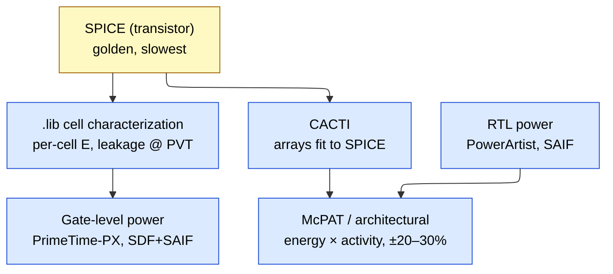
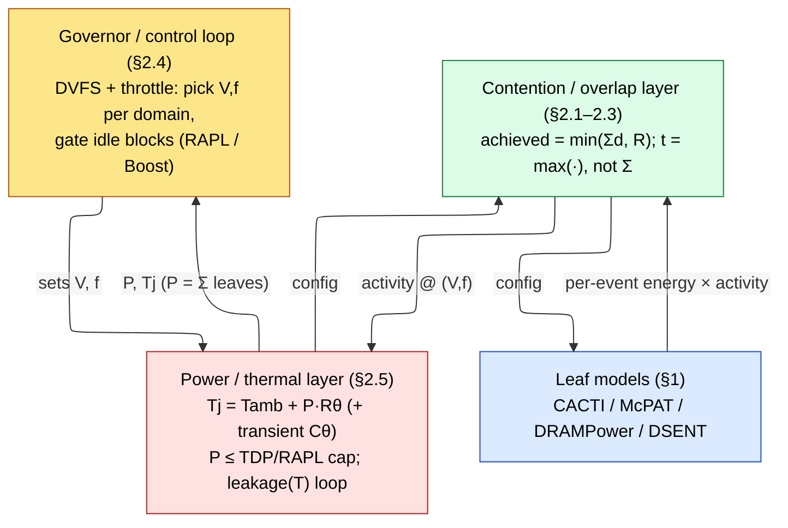

# Full-Chip Power and Performance Modeling

> **Stage:** 01 · Architecture & PPA (Performance, Power, Area) — the *systematic, hierarchical* model that composes leaf blocks into a **full chip** and answers SoC-level power+performance questions **before RTL (register-transfer level) exists**.
> **Prerequisites:** [Performance_Modeling_and_DSE](01_Performance_Modeling_and_DSE.md) (fidelity ladder, CPI (cycles per instruction) stack, roofline), [Block_Activity_and_Power](../../02_Power_and_Low_Power/02_Block_Activity_and_Power.md) (per-block $P=\alpha C V^2 f + P_{leak}$, McPAT/CACTI bottom-up, DPM), [CPU_Architecture](../02_CPU/01_CPU_Architecture.md), [Memory](../03_Memory/03_Memory.md).
> **Hands off to:** [GPU_Architecture](../05_GPU/01_GPU_Architecture.md) and [NPU_Accelerators](../06_NPU/01_NPU_Accelerators.md) (the µarch behind §4), [06_Simulators](../07_Simulators/00_Index.md) (how every tool named here actually models compute, memory, and time), [Power_Analysis_and_Signoff](../../02_Power_and_Low_Power/05_Power_Analysis_and_Signoff.md) (the budgeting/governor mechanics at silicon).

---

## 0. Why this page exists

The shallow instinct is: model the CPU core, model the cache, model the DRAM (dynamic random-access memory), add the Watts, and declare the chip understood. That is wrong, and an auditor will catch it in one question, because **a chip is a system, not a bag of blocks.** The number a leaf model gives you is real; what it cannot give you is what happens when you *put the leaves together and run them at once*.

Write the honest full-chip model as a first term plus a correction:

$$
X_{chip} \;=\; \underbrace{\bigoplus_i X_{\text{leaf},i}}_{\text{what a leaf model gives you}} \;+\; \underbrace{X_{\text{coupling}}}_{\text{the whole art of this page}}
$$

The first term is cheap and the sibling pages already produce it — per-block energy and per-block latency from characterized cells and CACTI-fit arrays. The second term is everything this page is about, and it is *not* a small correction. It routinely moves throughput by $1.5\text{–}2\times$ and turns a benchmark's first second into a different machine from its tenth. A model that keeps only the first term does not under-report the chip by a few percent; it answers a different question than the one asked.

Two things go wrong when you keep only $\bigoplus X_{\text{leaf}}$:

1. **The composition operator is wrong for performance.** Power is *extensive* — Watts genuinely sum. Performance is not: throughput is set by the **slowest shared resource** and latencies compose through **overlap and queueing**, never by addition. Summing per-block latencies is a category error, not an approximation.
2. **The operating point is wrong for every block.** Each leaf's energy and delay are functions of $(V, f, T, \text{activity})$. On a real chip those are *not* datasheet constants: a shared power budget sets $f$, a thermal cap sets the sustainable $f$, and contention sets the true activity. A standalone leaf is evaluated at an operating point the assembled chip never actually runs at.

So the full-chip model has three parts, not one — the leaf models, a **contention/overlap layer** that fixes the composition and the contended activity, and a **power/thermal budget layer** that fixes the operating point — and the two upper layers are solved *together* in a control loop (§3). The rest of this page builds those two layers on top of the leaves the sibling pages give you.

**A full-chip model is defined by the questions it must answer** — none of which a leaf model can:

- What is SoC (system-on-chip) power at TDP (thermal design power), delivery losses included?
- What *sustained* clock survives the thermal cap, as opposed to the burst clock the datasheet quotes?
- What memory bandwidth is *actually achieved* once $N$ cores contend for one channel?

If your model cannot answer these, it is a pile of leaf models, not a chip model. That gap — between $\bigoplus X_{\text{leaf}}$ and the truth — is the coupling layer, and closing it is the job.

---

## 1. Composition: push the physics down, keep the composition cheap

Before the coupling, the scaffolding it hangs on: *how* leaves become a chip when nothing is contending yet. The discipline has one governing idea — **compute the physics once, at the bottom, and never again above it.** A per-access SRAM energy or a per-op ALU energy is expensive to derive (it is a circuit-simulation question) but cheap to *reuse*; the architectural model earns its speed by composing pre-computed energies against activity counts, not by re-deriving physics at every level.

### 1.1 The hierarchy and the roll-up rule

You compose strictly bottom-up through named levels, and the rule at every level is the same: **sum of children, plus the glue that only exists at this level.**

| Level | Contents | New cost that first appears here |
|---|---|---|
| **Leaf** | one array/unit (SRAM bank, ALU, FPU, register file, router) | energy/access × access rate; leakage |
| **Block** | a core, a cache slice, one memory controller | pipeline glue, local clock tree |
| **Cluster** | $N$ cores + shared LLC (last-level cache) + local NoC (network-on-chip) | coherence, interconnect, LLC sharing |
| **Chip** | clusters + full uncore (NoC, MC, PHY, PCIe, PMU) | global clock/NoC, uncore floor |
| **Package** | chip + VRM + PDN + board | VRM loss, PDN/IR drop, on-package DRAM/HBM |

The identity every roll-up must satisfy at chip level:

$$
P_{chip} \;=\; \sum_i P_{block,i} \;+\; P_{uncore} \;+\; P_{PDN/VRM}
$$

where $P_{uncore}$ (NoC + MC (memory controller) + PHY (physical-layer interface) + PMU (power-management unit) + I/O) is **not an idle floor you may neglect** — on server parts it is 20–40% of socket power and it *scales with activity* (the PHY and MC burn more under high bandwidth), and $P_{PDN/VRM}$ is the delivery loss $P_{VRM,loss}=P_{load}(1/\eta-1)$ at regulator efficiency $\eta\approx0.85\text{–}0.92$, plus PDN (power-delivery network) $I^2R$ drop ([Signal_Integrity_Reliability](../../05_Backend_Physical_Design/02_Signal_Integrity_Reliability.md)). These sit *outside* the die-power sum and are exactly what shallow models forget.

The one rule you cannot violate: **power rolls up additively; performance does not.** Watts sum because dissipation is extensive. Latency and bandwidth compose through the bottleneck — the slowest shared resource caps throughput (roofline), and delays overlap or queue rather than add. Never sum latencies across blocks; route them through the coupling layer of §2.

Concretely, the leaf→block step is what an architectural power model like **McPAT** does: it maps the µarch onto a few primitive circuit structures (arrays, wires, logic, clocking), pulls each array's per-access energy from an internal CACTI (its cache/array energy model), and composes

$$
P_{core} \;=\; \sum_{u\in\text{units}} E_u\,A_u\,f \;+\; P_{clock} \;+\; \sum_u P_{leak,u}
$$

where $E_u$ = per-event energy (from CACTI-fit arrays / characterized cells), $A_u$ = events per cycle (from the [CPI stack](01_Performance_Modeling_and_DSE.md) counters), $f$ = clock. There is **no new physics at the core level** — the clock tree ($P_{clock}$, typically 30–40% of core dynamic) and leakage ($V\cdot I_{leak}$, scaled by area and temperature) are added, and the array/op energies are *looked up, not recomputed*. That is the whole game restated: push the physics down, keep the composition cheap.

### 1.2 Where the numbers come from: the calibration chain

The architectural model is fast enough to sweep hundreds of design points *because* it does not re-derive physics — but that only makes it trustworthy if its inherited per-event energies are anchored to something golden. They are, through a calibration chain in which each level calibrates the one above it:

| Level | Tool | Accuracy vs silicon | Speed |
|---|---|---|---|
| Transistor | SPICE | golden (≈1–2%) | slowest |
| Cell library | Liberty `.lib` characterization | ~2–3% | one-time |
| Gate + parasitics | PrimeTime-PX (SDF+SAIF) | ~5–10% | slow |
| RTL | PowerArtist / Joules (SAIF/FSDB) | ~10–20% | medium |
| Architectural | McPAT / Accelergy | ~20–30% *calibrated* (≫ un-cal) | instant |

The ladder is used in **two directions** at opposite ends of a project. **Bottom-up** (pre-silicon) composes energy × activity analytically — this page's mode — for design-space exploration and budgeting before RTL exists. **Top-down** (post-silicon) does the inverse: it takes a *measured* chip power number from RAPL (Running Average Power Limit) / on-die telemetry and decomposes it to blocks via **power proxies** — regressions of block power onto activity counters, fitted to silicon (accuracy ~3–5% per block, far better than bottom-up because it is trained on the real thing). Mature flows run both and reconcile: the proxy is *trained* against the bottom-up model and *validated* against silicon. The mechanics of each tool live in [06_Simulators](../07_Simulators/00_Index.md); here they are just rungs on the ladder.

### 1.3 What survives summation: the validation theory

Whether a roll-up can be trusted turns on how per-block error behaves under summation, and two error classes behave *oppositely*:

- **Random (uncorrelated) error cancels.** If $N$ blocks each carry independent relative error $\sigma$, the chip-total relative error scales as $\sim\sigma/\sqrt{N}$ — a fleet of $\pm25\%$ blocks can roll up to a $\pm8\text{–}10\%$ chip total. Summation is a variance-averaging operation.
- **Systematic (correlated) error accumulates.** A consistent 15% activity-overestimate in *every* block (e.g. from a continuously-toggling testbench SAIF (Switching Activity Interchange Format)) stays 15% at the chip — it does not wash out. These are the dangerous ones.

The practical corollary is the single most useful fact about trusting a model: **it is most accurate for *relative* comparisons and least accurate for *absolute* Watts.** Comparing design A to design B in the same model, the systematic error is common-mode and cancels almost entirely; quoting an absolute socket-power number exposes the full systematic bias. So:

| Validation target | Typical acceptance band |
|---|---|
| Per-block, calibrated | ±10–20% |
| Full-chip total, calibrated | ±10–15% |
| Full-chip *un*-calibrated | ±30% or worse |
| Relative (A vs B, same model) | tightest — errors are common-mode |

**Rule:** use the model freely to *rank* design points; validate any absolute total against at least one silicon or gate-level anchor before quoting it to a thermal team.

---

## 2. Why a chip is not the sum of its blocks: five coupling terms

This is the heart of the page — the $X_{\text{coupling}}$ term of §0 made explicit. Five phenomena make the assembled chip deviate from $\bigoplus X_{\text{leaf}}$, each in a specific direction, each with its own theory, and each with an **auditor's red flag** — the tell-tale wrong number a model that omits it will report. Two of the five (contention, queueing) fix the *performance composition operator*; one (overlap) decides whether it is $\max$ or $\Sigma$; two (DVFS, thermal) fix the *operating point* every leaf is evaluated at. The governor of §3 makes them mutually consistent.

### 2.1 Contention — the throughput face of a shared resource

Every shared resource — a DRAM/HBM channel, an LLC, a NoC link, an inter-chip link — has a finite **capacity** $R$ and serves $N$ clients each with **demand** $d_i$. There is one saturation knee, at $\sum_i d_i = R$, and achieved throughput is

$$
\text{achieved} \;=\; \min\!\Big(\textstyle\sum_i d_i,\; R\Big)
$$

- **Below the knee** ($\sum d_i < R$): every client gets its full demand; the resource is not the bottleneck.
- **Above the knee** ($\sum d_i > R$): aggregate throughput clamps at $R$, and each client's share collapses toward $R/N$ under fair arbitration. A core that measured 20 GB/s standalone sees 5 GB/s under an 8-way contended channel — the *same* leaf, a quarter of the bandwidth, purely from company.

*Arbitration decides who loses.* Round-robin / age-based arbiters split near-equally ($R/N$); priority or QoS (quality-of-service) arbiters protect one client at others' expense. The arbitration policy is therefore *part of the contention model* — the same saturated resource yields very different per-client outcomes under round-robin versus strict priority, which is why an MC that favours a latency-critical core, or a NoC with virtual-channel priorities, must be modeled as such and not as a fair split.

Because a leaf measured alone always runs below its own private knee, **standalone leaf numbers overstate throughput the moment they are composed** — this is the mechanical reason full-chip $\ne \Sigma$ leaves for performance. The contended demand $\sum d_i$ must be evaluated with *every* client present; a per-core number measured in isolation is the wrong input.

> **Auditor's red flag:** a cluster model that reports $N\times$ throughput and feeds each core its *standalone* memory-CPI has no contention layer and is wrong by the queueing gap of §2.2.

### 2.2 Queueing — the latency face of the same resource

The $\min()$ of §2.1 captures throughput and *hides* the latency penalty, which is where naive models lie most. Model the shared resource as a queue with utilization $\rho = \sum_i d_i / R$. Even for the simplest (M/M/1-like) server, mean latency diverges as

$$
L \;\approx\; \frac{L_{\text{service}}}{1-\rho}, \qquad \rho \to 1 \Rightarrow L \to \infty
$$

where $L_{\text{service}}$ = unloaded service time. Latency blows up **super-linearly well before throughput flatlines**: a channel at $\rho = 0.9$ already carries roughly $10\times$ its unloaded queueing delay while still delivering "90% of peak bandwidth." So "achieved BW = 90% of peak" and "latency is fine" are not the same statement — the last 10% of bandwidth is bought with a latency cliff, and for a latency-sensitive core (one whose ROB cannot cover the stall) that cliff is the real cost. This is why contention and queueing are two faces of one resource: §2.1 is what the resource delivers, §2.2 is what it charges to deliver it, and both are governed by the same $\rho$.

The M/M/1 form is illustrative — real memory controllers are FR-FCFS (first-ready, first-come-first-served) with finite queues — but the $1/(1-\rho)$ blow-up is qualitatively universal, and it is the reason the memory-CPI in a cluster model must be driven by the *contended* channel at its true $\rho$, never the standalone one.

> **Auditor's red flag:** a model that reports achieved bandwidth near peak and unloaded latency in the same breath has priced the throughput but not the queue.

### 2.3 Overlap — max, not sum

A chip does compute, memory movement, and (at pod scale) communication *concurrently* when the hardware and the schedule allow it. The step time is then the **max**, not the sum, of the phase times:

$$
t_{step} = \max\big(t_{comp},\, t_{mem},\, t_{comm}\big)\ \text{(overlapped)} \qquad\text{vs}\qquad t_{step} = t_{comp}+t_{mem}+t_{comm}\ \text{(serial)}
$$

Overlap is what makes the *bottleneck resource — and only it —* set performance: if $t_{mem}$ is hidden under $t_{comp}$ you are compute-bound and memory is free; if the overlap fails, the times add and everything is slower. Real designs live between these bounds, and the **degree of overlap is a first-class model parameter, not a given.**

Overlap is *conditional* — the $\max()$ holds only when movement is decoupled from consumption:

- **Double-buffering** (NPU §4.4): DMA fills buffer B while the array computes on A. Needs SRAM for *two* tiles; with one, DMA and compute serialize back to the sum and throughput halves.
- **Async DMA / prefetch** (CPU, GPU): loads issued far enough ahead hide memory latency behind compute — *provided* the prefetch distance covers the latency and the MSHRs (miss-status handling registers) do not fill.
- **Comm/compute overlap** (pod §4.4): AllReduce layer $L$ while computing layer $L{-}1$; needs an interleaved schedule and spare link bandwidth.

When a precondition fails, $t_{step}$ slides from $\max$ toward $\Sigma$. So the model must ask two questions, not one: *is it overlapped?* and *is the hidden term still smaller after §2.1–2.2 inflate it?*

**Little's law is the unifying principle.** How much concurrency does hiding latency require? To keep a resource of latency $L$ and bandwidth $B$ busy you need

$$
\text{in-flight work} \;=\; B \times L \quad\text{(the bandwidth–delay product)}
$$

Too few outstanding requests — too few MSHRs, too little prefetch distance, too low GPU occupancy — and the pipe runs dry: you are latency-bound *even below the §2.1 knee*. CPU memory-level parallelism, GPU thread-level parallelism, and NPU double-buffer depth are three names for one mechanism — hold enough in-flight work to keep the bottleneck saturated and thus keep the $\max()$ in force. This also sets up a tension with §2.1–2.2: more in-flight work raises the offered load $\sum d_i$, pushing $\rho \to 1$ where $L$ itself grows and *demands even more* in-flight work. The sweet spot is enough concurrency to hide latency but not so much that the queue explodes.

> **Auditor's red flag:** a model that assumes free overlap (always $\max$) overstates scaling; one that always sums understates it. The overlap fraction is the parameter, and it degrades under contention.

### 2.4 DVFS and turbo — frequency is allocated, not fixed

The sum of every block at its peak $(V,f)$ *exceeds* what the package can dissipate: $\sum P_{block,max} \gg \text{TDP}$. Therefore the per-domain operating point $(V,f)$ is **not a datasheet constant — it is continuously allocated** by a power manager so that $\sum P \le \text{budget}$. Frequency is an *output* of the budget solve, not an input, and this is what §0 meant by "the operating point is wrong for every block": a leaf evaluated at nominal $f$ is evaluated at a frequency the chip may never sustain.

Why the allocation matters so much is the shape of the cost curve. Dynamic power is $P_{dyn} = \alpha C V^2 f$, and along the voltage–frequency curve a higher $f$ needs a higher $V$ (roughly $V \propto f$ in the usable range), so

$$
P_{dyn} \;\propto\; V^2 f \;\propto\; f^3
$$

Dynamic power grows **cubically** with frequency. A small $f$ cut buys a large power cut, and conversely raising the budget buys only a *cube-root* frequency gain — which is exactly why turbo hands the budget to *few* cores (a large $f$ on one core costs what a modest $f$ costs on three) and why sustained all-core clock sits well below single-core burst.

Every vendor mechanism is the same idea — measure power, compare to a cap, actuate $(V,f)$ — under different names:

| Mechanism | Vendor | What it does |
|---|---|---|
| Turbo Boost | Intel | raises few-core $f$ above base while others idle, until $\sum P =$ budget |
| Precision Boost / PBO | AMD | opportunistic $f$ up to power/thermal/current limits |
| GPU Boost | NVIDIA | highest clock s.t. $P\le$ cap *and* $T\le T_{limit}$ (`nvidia-smi -pl`) |
| RAPL | Intel | HW enforces PL1 (sustained, $\tau\sim$ tens of s) and PL2 (burst, $\tau\sim$ ms); throttles $f$ when the running-average power exceeds the limit |

The two-timescale RAPL model (PL2 above PL1 for a window $\tau$) is not an implementation quirk — it is the chip *spending thermal capacitance* (§2.5), and it is why burst clock exceeds sustained clock.

A second consequence is the classic **race-to-idle vs pace-to-deadline** split, two opposite ways to spend a budget:

- **Race-to-idle:** run at max $f$, finish fast, drop to a deep idle state. Wins when idle (leakage-dominated) power is very low and there is a long idle tail to amortize — you pay the high active power only briefly.
- **Pace-to-deadline:** run at the *lowest* $f$ that still meets the deadline, exploiting $P\sim f^3$ so that stretching the work cuts energy super-linearly. Wins when there is a hard deadline and idle power is *not* negligible (leakage would burn during the idle tail anyway).

Which wins is the dynamic-power-management break-even of [Block_Activity_and_Power](../../02_Power_and_Low_Power/02_Block_Activity_and_Power.md): race-to-idle pays only when $E_{\text{saved by idling}} > E_{\text{extra to run fast}} + E_{\text{transition}}$. On leaky advanced nodes (high static power) race-to-idle is increasingly favored; on low-leakage or deadline-bound work, pace-to-deadline.

> **Auditor's red flag:** quoting throughput at peak $f$ across all cores at once ignores that the budget cannot fund it — the all-core sustained $f$ is the frequency at which $\sum P = \text{TDP}$, always lower.

### 2.5 Thermal — power is temperature, and temperature is throttle

The steady-state thermal model is Ohm's law for heat — power is the "current," temperature rise the "voltage," thermal resistance the "resistance":

$$
T_j \;=\; T_{amb} + P\cdot R_{\theta ja}
$$

where $T_j$ = junction temperature, $T_{amb}$ = ambient, $P$ = dissipated power, $R_{\theta ja}$ = junction-to-ambient thermal resistance (°C/W), the *series* sum of die→case, the TIM (thermal interface material), and heatsink→air. $R_{\theta ja}$ ranges from ~0.1–0.5 °C/W for a big server part under a large heatsink to >10 °C/W for a small package with poor cooling — and note it is the *cooling solution's* number, not the die's. This single equation says: at fixed cooling, $T_j$ rises *linearly* with power, so **power is temperature.**

The transient model adds thermal capacitance $C_\theta$ (the mass that must be heated), giving a first-order RC approach to steady state:

$$
T_j(t) = T_\infty + (T_0 - T_\infty)\,e^{-t/\tau_\theta}, \qquad \tau_\theta = R_\theta C_\theta
$$

The **thermal time constant** $\tau_\theta$ spans orders of magnitude within one package: the tiny die heats in **~ms** (small $C_\theta$), while the heatsink/package has $\tau_\theta$ of **~seconds to tens of seconds** (large $C_\theta$). That span *is* why burst beats sustained: for a few ms the die can dissipate above steady-state TDP because the heatsink has not warmed yet — precisely the headroom RAPL PL2 and Turbo (§2.4) exploit. When $T_j$ reaches $T_{j,max}$ (commonly ~95–105 °C for logic), the governor cuts $(V,f)$ to force $P$ down, so the **sustained clock is the frequency at which $T_j$ settles *at* $T_{j,max}$** — necessarily below the burst clock the die hits before the package warms.

The deepest coupling is a positive feedback. Subthreshold leakage rises *exponentially* with temperature — roughly **doubling every ~10 °C** — closing a loop:

$$
T_j\uparrow \;\Rightarrow\; P_{leak}\uparrow \;\Rightarrow\; P_{total}\uparrow \;\Rightarrow\; T_j\uparrow
$$

Usually the loop gain is below 1 — cooling removes heat faster than leakage adds it — so it merely inflates steady-state $T_j$ and leakage, which is already reason enough that **leakage must be modeled at the operating temperature, not at 25 °C.** But if the gain exceeds 1 (weak cooling, high $R_\theta$, a leaky node, high $V$) it becomes **thermal runaway**: $T$ and leakage diverge until the part hard-throttles or trips protection. This makes the thermal and leakage models *mutually coupled* — you cannot solve one without the other — and it is the deepest reason perf, power, and thermal are a single co-model (§3).

> **Auditor's red flag:** reporting peak/burst clock as if it were sustained — the same error as ignoring the power budget (§2.4), because thermal *is* a budget, expressed in °C over $\tau_\theta$.

---

## 3. The system loop: one fixed point, not two models

The five terms of §2 do not act in sequence; they close a loop. Trace the dependencies: a performance number depends on the clock $f$; $f$ is set by the power budget (§2.4) and the thermal cap (§2.5); the power drawn depends on activity, which depends on the *achieved* performance after contention (§2.1–2.2) and overlap (§2.3); and leakage — a power term — depends on temperature, which depends on power (§2.5). **Every arrow points at every other.** There is no "compute performance first, then estimate power" — it is one **fixed-point solve** for a self-consistent operating point.

The full-chip model is therefore four parts wired in a loop:

Control flows *down* (the governor sets $(V,f)$ and gating); computed quantities flow *back up* (leaf energies become achieved throughput and true activity, which become $P$ and $T_j$). The solve iterates: pick $(V,f)$ → leaves emit activity → contention/overlap turn activity into achieved performance *and* the true (contended) activity counts → those give $P$ → $P$ gives $T_j$ (with the leakage–$T$ loop) → the governor checks $P\le\text{budget}$ and $T_j\le T_{j,max}$, adjusts $(V,f)$, and repeats until nothing moves. Only at that self-consistent point is a perf *or* power number meaningful — quoting either before the loop closes is quoting a transient the chip passes through, not a state it sits in.

On real silicon this loop *is* the governor, running in hardware/firmware at millisecond granularity: measure (RAPL counters, on-die current and thermal sensors) → compare to budget/limit → actuate $(V,f)$ and gating → repeat. In a model it is a solver iterating the four boxes to convergence. Either way, **this loop is the precise reason a leaf-only model is not a chip model** — it has the bottom box and none of the three above it.

---

## 4. One equation, three architectures

Everything above is architecture-independent, which is the point: CPU, GPU, and NPU are the *same* composition and the *same* five coupling terms with different labels. This section is deliberately compact — it carries the load-bearing numbers and vendor data, not a re-derivation. For the microarchitecture behind each, see [GPU_Architecture](../05_GPU/01_GPU_Architecture.md) and [NPU_Accelerators](../06_NPU/01_NPU_Accelerators.md); for how each is *simulated*, [06_Simulators](../07_Simulators/00_Index.md).

### 4.1 The hierarchies line up

| CPU | GPU | NPU | Shared glue that appears at this level |
|---|---|---|---|
| core | SM (streaming multiprocessor) | systolic array + vector unit | pipeline/warp/dataflow control, local clock |
| cluster (N cores + LLC) | GPC (SM cluster) | NPU core (array + SRAM + DMA) | intra-cluster crossbar, regional clock domain |
| SoC (+ DDR) | full GPU (+ L2, HBM) | chip (multi-core + HBM + ICI) | shared memory pool, uncore, chip-wide power cap |
| — | — | pod (multi-chip torus) | inter-chip network, collectives |

The roll-up rule (§1.1), the calibration chain (§1.2), and the loop (§3) are identical at every row. What differs is *which* coupling term dominates: the CPU foregrounds contention on one DRAM channel, the GPU foregrounds the HBM-bandwidth knee under a power cap, and the NPU foregrounds overlap — on-chip (double-buffering) and across the pod (collectives).

### 4.2 CPU: the DRAM channel is the textbook contention instance

Climb core → cluster → SoC and the coupling appears exactly on schedule. At the **cluster**, a shared LLC means co-runners evict each other's lines, so *effective* per-core miss rate (MPKI, misses per kilo-instruction) rises as capacity splits $N$ ways, and coherence traffic (snoops, invalidations, writebacks under MESI/MOESI, or point-to-point messages under a directory protocol like CHI, [ACE_and_CHI](../04_Interconnect/02_ACE_and_CHI.md)) adds NoC energy that scales with the miss rate. Sub-linear scaling follows directly — Amdahl *and* contention:

$$
\text{Speedup}(N) \;=\; \frac{1}{(1-p) + p/N + C(N)}
$$

where $C(N)$ is the contention term that *grows* with $N$ (LLC eviction, NoC and channel queueing, §2.1–2.2). This is why 8 memory-heavy cores deliver ~4–5× rather than 8×, while a cache-fitting compute phase approaches Amdahl's ceiling.

At the **SoC**, the DRAM channel is the canonical shared resource. Its *performance* and its *energy* are modeled by different tools — a distinction an auditor watches for: performance (achieved BW, latency, scheduling) from a cycle-level channel model (Ramulator / DRAMSim3), energy from a state-integrator (DRAMPower), which computes $\sum_{\text{states}}(\text{time in state}\times \text{IDD}\times V_{DD})$. Two device facts survive from the parameter detail (which lives in [DDR_Controller](../03_Memory/04_DDR_Controller.md) and [Memory](../03_Memory/03_Memory.md)):

- **Achieved BW is access-pattern-bound, not just peak.** A row-buffer **hit** costs only $t_{CAS}$; a **miss** adds an activate; a **conflict** adds a precharge *and* an activate. FR-FCFS scheduling reorders to favour row-hits, so a streaming, well-interleaved stream reaches ~80–90% of peak while a conflict-heavy random stream falls to ~40–50% — the *same* channel, half the bandwidth, from access pattern alone.
- **Refresh is an unavoidable off-the-top tax:** $\approx t_{RFC}/t_{REFI}$, so **~4–5% on DDR4** (~350 ns / 7.8 µs) but **~8–10% on DDR5** ($t_{REFI}$ halved to ~3.9 µs while $t_{RFC}$ held), worsening at higher density.

The **interaction** is §2.1–2.2 in the flesh: the channel is shared across all cores, so as they contend the MC queue saturates, aggregate BW stays near peak (FR-FCFS) but *per-core* BW divides toward $R/N$ and *per-request latency* balloons via queueing. A core that saw 20 GB/s standalone may see 5 GB/s under 8-core load — which is why the cluster model's memory-CPI *must* be driven by the contended channel, never the standalone one.

### 4.3 GPU: the HBM roofline knee, under a power cap

The GPU re-runs the hierarchy with a *throughput* philosophy — thousands of threads, wide SIMT (single-instruction, multiple-thread) lanes, memory bandwidth as the first-class shared resource — and hides latency not with OoO speculation but with **thread-level parallelism**: many resident warps, and on a stall the scheduler switches to a ready warp for free. **Occupancy** (resident warps ÷ hardware max) quantifies the available TLP, but it is a *ceiling on activity, not activity itself* — a 100%-occupant kernel can still be issue-starved if every warp is blocked on the same saturated memory system. That is Little's law (§2.3): occupancy only helps if enough warps are *eligible* to keep $B\times L$ bytes in flight.

The dominant coupling is HBM (high-bandwidth memory) bandwidth shared across all SMs — the §2.1 knee, at GPU scale:

$$
B_{achieved} = \min\!\Big(\textstyle\sum_i \text{demand}_i,\; B_{HBM}\Big), \qquad N^\star = \frac{B_{HBM}}{\text{demand per SM}}
$$

At per-SM demand 30 GB/s and $B_{HBM}=3$ TB/s the knee is $N^\star = 100$ active SMs; on a ~130-SM die, all-SM streaming pushes $\sum\text{demand}=3.9$ TB/s past $B_{HBM}$, so achieved saturates at 3 TB/s and per-SM effective BW collapses from 30 → ~23 GB/s while every SM's memory-CPI rises together. Past the knee, *adding SMs adds no throughput* — only contention and power. Data-movement energy is a real uncore line, not a floor: **HBM3 ≈ 0.29 pJ/bit** at the interface, **NVLink ≈ 1.3 pJ/bit** (~5× more efficient than **PCIe Gen5 ≈ 6–7 pJ/bit**), so a multi-GPU AllReduce over NVLink is a quantifiable energy term.

The GPU is where **both** coupling families bite at once: the *contention* layer collapses per-SM BW (above), and the *budget* layer (§2.4–2.5) runs GPU Boost — the highest clock with $P\le\text{cap}$ and $T\le T_{limit}$. These interact perversely: a memory-bound phase draws *less* core power, so Boost may *raise* the clock — which buys nothing, because the bottleneck is HBM, not compute; conversely a compute-bound tensor-core phase hits the power cap and throttles the very compute rate that defined it. A correct model co-solves BW-sharing and the power-capped clock in one loop (§3).

> **Auditor's red flag:** reporting peak TFLOPs × peak clock × all SMs ignores *both* layers — the HBM knee and the power cap.

### 4.4 NPU: overlap on-chip, collectives across the pod

The NPU (neural processing unit; TPU-class dataflow accelerator) climbs one level higher — PE/MAC → systolic array → core → chip → **pod** — because AI systems are multi-chip, and its philosophy inverts the GPU's: instead of many latency-hiding threads, a **deterministic dataflow** streams operands through a fixed array, and the whole game is *overlap* — keep the array fed.

**On-chip, overlap is §2.3 as the single most important modeling fact.** An NPU core wraps the array with a large on-chip SRAM (static RAM) and DMA (direct-memory-access) engines; with the SRAM double-buffered, DMA fills buffer B while the array computes on A, so

$$
t_{tile} = \max\big(t_{compute},\ t_{DMA}\big)\ \text{(overlapped)} \qquad\text{NOT}\qquad t_{compute}+t_{DMA}\ \text{(serial)}
$$

Which term dominates classifies the tile — SA-bound (compute-limited), VU-bound (too much elementwise vs GEMM), or HBM-bound (DMA-limited, low arithmetic intensity) — and *arithmetic intensity decides the flip*, exactly the roofline. A concrete tile: a $128\times128$ INT8 weight sub-tile is 16 KB, streaming in $t_{DMA}\approx 16\text{ KB}/1.2\text{ TB/s}\approx 13$ ns; if $t_{compute}\approx 90$ ns ($K{=}128$ at ~1.4 GHz) then DMA is fully hidden and the tile is SA-bound. But the overlap is *conditional* (§2.3): the buffer must hold *two* tiles (single-buffered, DMA and compute serialize back to the sum and throughput halves) *and* HBM BW must satisfy $t_{DMA}\le t_{compute}$. When sibling cores contend for HBM (§2.1), the per-core $t_{DMA}$ grows and tiles that were SA-bound standalone flip HBM-bound — the NPU's contended-vs-standalone regime change. A leakage note peculiar to this class: because the dataflow schedule is *known ahead of time*, fine-grained gating can follow the compute wavefront with near-zero mis-wake cost (unlike speculative CPU gating), which matters because **30–72% of NPU energy is static** on weakly-managed designs (ReGate, MICRO 2025).

**Across the pod, overlap becomes collectives, and the network is the bottleneck.** Hundreds–thousands of chips wire into a torus (2D = 4 neighbours, TPU v2/v3-class; 3D = 6 neighbours, e.g. $4\times4\times4$ cubes on TPU v4+), and the dominant operation is **AllReduce** for gradient/activation sync. Ring-AllReduce runtime (bandwidth-optimal, Patarasuk & Yuan 2009):

$$
t_{AllReduce} \approx \underbrace{\frac{2(N-1)}{N}\cdot\frac{S}{B_{link}}}_{\text{bandwidth term}} + \underbrace{2(N-1)\,\ell}_{\text{latency term}}
$$

where $N$ = chips in the ring, $S$ = payload bytes, $B_{link}$ = per-link ICI (inter-chip interconnect) bandwidth, $\ell$ = per-hop latency. As $N\to\infty$ the bandwidth term $\to 2S/B_{link}$ — *independent of $N$*, the whole point of ring-AllReduce — while the latency term grows linearly, so at large $N$ or small $S$ latency dominates and hierarchical/tree collectives win. Worked: $N=256$, $S=256$ MB (bf16 shard), $B_{link}=1.2$ TB/s gives $t_{AllReduce}\approx 425\ \mu s$; against a ~5 ms per-step compute this is easily hidden — *compute-bound*, good scaling. The saving grace is again §2.3 overlap: AllReduce layer $L$ while the backward pass still computes layer $L{-}1$, so the effective step is $\max(t_{compute}, t_{comm})$ — but *only if* the schedule interleaves independent comm and compute *and* the ICI links are not already saturated by other tensor/pipeline-parallel traffic (the pod-scale contention layer). A model assuming free overlap overstates scaling.

> **Auditor's red flag:** classifying a tile's regime (or a pod's scaling) from *standalone* bandwidth — the regime is set by how many siblings contend *right now*, and by whether the overlap preconditions actually hold.

---

## 5. Numbers to remember

Order-of-magnitude anchors for back-of-envelope full-chip sanity checks. **State the basis; these are public-literature ballparks, not any specific silicon — use vendor/tool numbers for a real quote.**

| Quantity | Value | Basis / note |
|---|---|---|
| Uncore share of socket power | **~20–40%** | server RAPL package/uncore split; scales with BW, not a floor (§1.1, §4.2) |
| VRM efficiency $\eta$ | **~0.85–0.92** | delivery loss $P(1/\eta-1)$ ⇒ ~9–18% lost in regulator (§1.1) |
| DRAM refresh BW loss | **~4–5% DDR4, ~8–10% DDR5** | $t_{RFC}/t_{REFI}$ (~350 ns / 7.8 µs; ~295–410 ns / 3.9 µs); worse at high density (§4.2) |
| Clock-tree share of core dynamic | **~30–40%** | McPAT / [Block_Activity](../../02_Power_and_Low_Power/02_Block_Activity_and_Power.md) (§1.1) |
| Calibrated arch-model accuracy | **±20–30%** abs, tighter relative | inherits CACTI/cell energies; relative error is common-mode (§1.2–1.3) |
| Random vs systematic block error | **$\sigma/\sqrt{N}$ cancels; systematic stays** | why relative $\gg$ absolute trust (§1.3) |
| HBM3 interface energy | **~0.29 pJ/bit** | NVIDIA/WikiChip class; order-of-mag (§4.3) |
| NVLink / PCIe Gen5 energy | **~1.3 / ~6–7 pJ/bit** | NVLink ~5× more efficient; comm baseline (§4.3) |
| NoC energy | **~a few pJ/flit-hop** | DSENT/Orion, node-dependent (§4.2) |
| NPU static (leakage) fraction | **~30–72%** | ReGate, MICRO 2025 (arXiv:2508.02536) (§4.4) |
| Dynamic power vs frequency | **$P\sim f^3$** over the DVFS range | $V\propto f$ ⇒ small $f$ cut, large power cut (§2.4) |
| RAPL windows | **PL1 $\tau\sim$ tens of s, PL2 $\tau\sim$ ms** | burst > sustained via thermal $C_\theta$ (§2.4–2.5) |
| Junction-to-ambient $R_{\theta ja}$ | **~0.1–0.5 °C/W** (server+heatsink) to **>10 °C/W** (small pkg) | it's the cooling's number, not the die's (§2.5) |
| Leakage vs temperature | **~2× per +10 °C** | subthreshold $T$-dependence; drives runaway loop (§2.5) |
| Die vs package thermal time constant | **~ms (die) vs ~s (heatsink)** | $\tau_\theta=R_\theta C_\theta$; enables burst > sustained (§2.5) |
| $T_{j,max}$ (logic throttle point) | **~95–105 °C** | sustained clock settles here (§2.5) |
| Queueing blow-up at $\rho=0.9$ | **~10× unloaded latency** | $L\approx L_{svc}/(1-\rho)$ (§2.2) |
| Ring-AllReduce bandwidth factor | **$2(N-1)/N \to 2$** | Patarasuk 2009; per-link cost $\to 2S/B_{link}$ (§4.4) |
| Multicore speedup (mem-heavy) | **~4–5× on 8 cores** | Amdahl + contention $C(N)$, not 8× (§4.2) |

---

## 6. The tool map

A full-chip model is a *pipeline of tools*: a performance/timing tool emits activity, a power tool turns activity into a per-block power map, and a thermal tool turns the power map + floorplan into temperatures — which feed the governor (§3). Read a row as "at this layer, use these three." The **mechanics of each tool** — how it models compute, memory, and time, and where its error comes from — live in [06_Simulators](../07_Simulators/00_Index.md); this table is only the *which-tool-where* index.

| Modeling layer | Performance / timing | Power / energy | Thermal |
|---|---|---|---|
| **Leaf (arrays, cells)** | — (analytical) | **CACTI** (array E), Accelergy | (feeds up) |
| **Block / core (CPU)** | **gem5** (cycle/CPI), Sniper | **McPAT** (energy × activity) | HotSpot (per-block map) |
| **DRAM channel** | **Ramulator**, DRAMSim3 | **DRAMPower** (IDD × time) | HotSpot (DRAM layer) |
| **NoC / interconnect** | gem5-Ruby (latency-under-load) | **DSENT**, Orion (pJ/flit-hop) | HotSpot |
| **GPU (SM→chip)** | **GPGPU-Sim / Accel-Sim** | **GPUWattch / AccelWattch** | HotSpot |
| **NPU (PE→chip)** | **SCALE-Sim**, ONNXim | Accelergy/Timeloop, NeuSim | HotSpot |
| **NPU pod (multi-chip)** | **NeuSim** (ICI, collectives) | NeuSim / composed per-chip | system-level |
| **Thermal (all)** | (consumes power map) | (consumes power map) | **HotSpot** (RC grid); HotSniper, CoMeT (2.5D/3D) |
| **DSE / orchestration** | roofline + fidelity ladder ([Perf_Modeling](01_Performance_Modeling_and_DSE.md)) | budget solve (§2.4) | budget solve (§2.5) |

The columns are *different tools on purpose* — the auditor's distinction of §4.2: Ramulator gives bandwidth, DRAMPower gives energy; never conflate a timing tool with a power tool. The thermal column is what §2.5 adds; HotSpot is the standard, consuming the power column's output plus a floorplan → per-block $T_j(t)$. For a full co-modeled DSE loop, an orchestration layer drives the perf→power→thermal→governor fixed point of §3 across a design space.

---

## Cross-references

- **Down the stack (what this composes):** [Block_Activity_and_Power](../../02_Power_and_Low_Power/02_Block_Activity_and_Power.md) (the leaf energies, McPAT/CACTI bottom-up, DPM/gating, clock-tree share), [Performance_Modeling_and_DSE](01_Performance_Modeling_and_DSE.md) (the CPI stack and roofline that supply activity and the bottleneck), [06_Simulators](../07_Simulators/00_Index.md) (how every tool in §6 actually models time, memory, and energy — [Analytical_Models](../07_Simulators/07_Analytical_Models.md) for the queueing/Little/roofline duals of §2), [Signal_Integrity_Reliability](../../05_Backend_Physical_Design/02_Signal_Integrity_Reliability.md) (the PDN/IR-drop delivery loss of §1.1).
- **Up the stack (what builds on this):** [GPU_Architecture](../05_GPU/01_GPU_Architecture.md) and [NPU_Accelerators](../06_NPU/01_NPU_Accelerators.md) (the µarch behind §4's power/perf roll-ups), [Power_Analysis_and_Signoff](../../02_Power_and_Low_Power/05_Power_Analysis_and_Signoff.md) and [Power_Reduction_Techniques](../../02_Power_and_Low_Power/03_Power_Reduction_Techniques.md) (the budgeting/DVFS/gating mechanics at silicon).
- **Adjacent / device detail:** [Memory](../03_Memory/03_Memory.md) & [DDR_Controller](../03_Memory/04_DDR_Controller.md) (the DRAM timing/IDD parameters §4.2 abstracts), [Network_on_Chip](../04_Interconnect/03_Network_on_Chip.md) & [ACE_and_CHI](../04_Interconnect/02_ACE_and_CHI.md) (the NoC/coherence fabric of §4.2), [Cache_Microarchitecture](../03_Memory/01_Cache_Microarchitecture.md) (the LLC whose sharing drives cluster contention).

---

## References

1. Li, S. et al., "McPAT: An Integrated Power, Area, and Timing Modeling Framework for Multicore and Manycore Architectures," *MICRO*, 2009. The architectural energy×activity roll-up of §1.1.
2. Muralimanohar, N., Balasubramonian, R., and Jouppi, N.P., "CACTI 6.0: A Tool to Model Large Caches," HP Labs, 2009. The array energies §1 pushes down.
3. Williams, S., Waterman, A., and Patterson, D., "Roofline: An Insightful Visual Performance Model for Multicore Architectures," *CACM*, 52(4), 2009. The bottleneck/overlap model of §2.3.
4. Gunther, N.J., *Guerrilla Capacity Planning*, Springer, 2007. The Universal Scalability Law — Amdahl plus the contention term $C(N)$ of §4.2.
5. Chandrasekar, K. et al., "DRAMPower: Open-Source DRAM Power & Energy Estimation Tool," 2012. The IDD × time-in-state integral of §4.2.
6. Skadron, K. et al., "Temperature-Aware Microarchitecture" (HotSpot), *ISCA*, 2003. The RC thermal model of §2.5.
7. Patarasuk, P. and Yuan, X., "Bandwidth Optimal All-reduce Algorithms for Clusters of Workstations," *JPDC*, 69(2), 2009. The ring-AllReduce runtime of §4.4.
8. Zhang, Y. et al., "ReGate: Fine-Grained Power Gating for NPUs," *MICRO*, 2025 (arXiv:2508.02536). The 30–72% static-energy finding of §4.4.
9. Intel, *Running Average Power Limit (RAPL)* and *Turbo Boost* documentation; NVIDIA GPU Boost / `nvidia-smi` power-cap docs; AMD Precision Boost. The governor mechanisms of §2.4.
