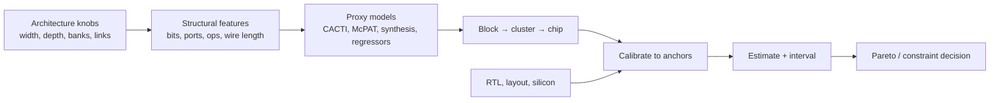

# Early PPA Estimation and Uncertainty — Useful Numbers Before the Netlist Exists

> **Prerequisites:** [Full-Chip Modeling](01_Full_Chip_Modeling.md) (hierarchical composition and coupling), [Performance Modeling and DSE](../01_Performance_Analysis/01_Performance_Modeling_and_DSE.md) (objective functions), and [Power Fundamentals](../../../02_Power_and_Low_Power/01_Power_Fundamentals.md).
> **Hands off to:** RTL budgets, floorplanning, power intent, and signoff correlation; this page owns the architecture-stage estimate and its confidence, not final implementation closure.

---

## 0. Why this page exists

Architecture decisions happen when most implementation facts are missing. A block may be a queue depth and port count, not RTL; a cache may be capacity/ways/banks, not a compiled macro; a network may be topology and traffic, not routed wires. The estimator must therefore do two things at once:

1. predict enough PPA to rank alternatives;
2. expose uncertainty so false precision does not become a specification.

The correct output is rarely “power = 23.417 W.” It is closer to “design B is 9–13% faster, 4–8% larger, and likely within the 120 W envelope; clock-tree and SRAM uncertainty dominate.”

## 1. Translate architecture into physical features

Names are not predictive; structures are. Express each block using features that physical cost models understand.

| Structure | Architecture features | Dominant PPA mechanisms |
|---|---|---|
| SRAM/cache | rows, columns, bits, ways, banks, read/write ports, ECC | cell area, decoder/mux, bitline, banking, wire |
| CAM/TLB/IQ | entries, tag width, match ports, wakeup ports | parallel compare capacitance and wiring |
| ROB/FIFO | entries, payload bits, ports | SRAM/flops, pointer/control, bypass |
| ALU/vector | operation width, lane count, pipeline depth, issue rate | logic depth, replicated datapath, forwarding |
| NoC router | radix, flit width, virtual channels, buffer depth | crossbar, buffers, allocators, link repeaters |
| clock/power fabric | sequential count, area, voltage domains, activity | clock tree, gating, level shifters, grid loss |

For a queue with $N$ entries, payload $B$, $R$ read and $W$ write ports, a first proxy is

$$
A_{queue}\approx NB\,a_{bit}\,f_{port}(R,W)+A_{control}+A_{wire}.
$$

The port factor is strongly nonlinear. Treating a 4-read/2-write register file as six copies of a one-port bitcell misses wordline/bitline replication, muxing, and bypass wiring—the very costs that often decide the design.

## 2. A hierarchy of estimators

Use the cheapest estimator that can distinguish the alternatives:

1. **Scaling law:** bit count, operation count, wire length, and activity.
2. **Published/previous-design anchor:** normalize a known implementation.
3. **Analytical structure model:** CACTI-like memory or interconnect equations.
4. **Parameterized framework:** McPAT-like block templates plus activity.
5. **Generated RTL + quick synthesis:** key structures and critical loops.
6. **Macro characterization / trial floorplan:** SRAM and long-wire anchors.
7. **Full implementation:** only when the decision value warrants it.

Never use one tool uniformly merely because it is available. A memory compiler is a better SRAM estimator than a generic cell-area rule; quick synthesis is a better arbiter estimator than an SRAM tool; neither predicts package power delivery.

## 3. Area: sum cells, then pay for composition

A naive die estimate is

$$
A_{die}=\frac{\sum_i A_{cell,i}+A_{macro}+A_{analog}+A_{IO}}{U},
$$

where $U$ is effective utilization. But $U$ is an outcome of aspect ratio, macro placement, pin density, routing congestion, power grid, and timing—not a universal constant.

Use additive overhead terms:

$$
A_{die}\approx A_{blocks}+A_{NoC}+A_{clock}+A_{power-grid}+A_{whitespace}+A_{IO-ring}.
$$

Track at least two utilization regimes:

- **logic-dominated:** placement/routing density and timing whitespace dominate;
- **macro-dominated:** macro shapes, halos, channels, and pin access dominate.

An architecture that saves 5% cell area but requires another wide bypass bus across the core can enlarge the floorplan. Wire-aware proxies should include endpoint count and expected Manhattan distance, even before placement exists.

## 4. Timing: estimate loops, not just operation latency

The frequency limiter is often a recurrence or broadcast:

- issue wakeup → select → grant → tag broadcast;
- branch prediction lookup → target selection → fetch address;
- cache tag/data lookup → way select → forwarding;
- NoC route/VC/switch allocation;
- coherence request → home serialization → response dependency.

For path $p$,

$$
T_p\approx\sum_g t_g+\sum_w(R_wC_w)+T_{setup}+T_{skew}+T_{margin}.
$$

Early models can classify wire distance (local, cluster, global) and fanout rather than guessing exact parasitics. The architectural question is often binary: can the loop fit in one cycle, or must it be pipelined? Pipelining changes latency and sometimes throughput, recovery cost, or protocol state; feed that consequence back into performance.

## 5. Power: activity is the architecture

Dynamic power remains

$$
P_{dyn}=\sum_i \alpha_i C_i V_i^2 f_i,
$$

but activity $\alpha_i$ must come from workload events. Convert simulator counters into event rates:

$$
P_{block}=\sum_e E_e\,r_e+P_{clock}+P_{leak}.
$$

Examples include cache read, tag probe, MSHR allocation, predictor lookup, integer issue, tensor MAC, NoC flit-hop, and DRAM command. Distinguish:

- **useful activity** that retires product work;
- **speculative activity** squashed after misprediction/replay;
- **background activity** refresh, coherence probes, scrub, and keepalive;
- **idle-but-clocked activity** prevented only by gating;
- **leakage residency** affected by power states and temperature.

Peak power, average energy, and thermal design power are separate constraints. A bursty accelerator can satisfy average energy while violating voltage droop or junction-temperature limits.

## 6. Calibration: ratios are usually more trustworthy than absolutes

Given observations $y_k$ and model predictions $\hat y_k(\theta)$, fit a small number of physically meaningful calibration parameters:

$$
\theta^*=\arg\min_\theta\sum_k w_k\left(y_k-\hat y_k(\theta)\right)^2.
$$

Do not add enough free coefficients to interpolate every anchor. Calibrate by structure class and retain a holdout design. Useful anchors include:

- synthesized representative datapaths and control blocks;
- compiled SRAM/CAM macros;
- post-route wire/clock overhead from a prior node or product;
- measured event energy or block power;
- silicon performance counters and package power.

Normalize technology carefully. Logic, SRAM, analog, I/O, and wires do not scale by the same factor. Voltage and frequency shifts further invalidate a single “node scaling” number.

## 7. Uncertainty propagation

Represent uncertain inputs as ranges or distributions: activity, macro density, wire factor, leakage corner, achievable frequency, software efficiency, and workload mix.

For independent small uncertainties, a first-order variance estimate is

$$
\sigma_y^2\approx\sum_i\left(\frac{\partial f}{\partial x_i}\right)^2\sigma_{x_i}^2.
$$

Correlations matter: higher voltage raises frequency and dynamic power; larger cache lowers misses but raises access energy and area; temperature increases leakage and can reduce timing margin. Monte Carlo or scenario sweeps preserve these couplings better than adding worst cases independently.

Report:

- central estimate and interval;
- top sensitivity contributors;
- calibration domain and distance from anchors;
- which uncertainty is reducible with the next experiment;
- probability of violating each hard constraint.

### 7.1 Sensitivity before precision

Define normalized elasticity

$$
S_i=\frac{\partial y}{\partial x_i}\frac{x_i}{y}.
$$

An input with high $|S_i|$ and high uncertainty deserves better modeling. A low-sensitivity input does not need another week of characterization. This turns model refinement into a value-of-information decision.

## 8. Pareto decisions under uncertainty

Design A does not dominate B merely because their central estimates do. If intervals overlap, classify the decision:

| Situation | Action |
|---|---|
| clear dominance across plausible corners | choose dominant design |
| ranking changes only under unlikely corner | choose with documented risk |
| ranking changes under common workload mix | collect more workload evidence |
| hard constraint violation possible | prototype the dominant uncertainty |
| benefits below model error | avoid over-optimizing; preserve flexibility |

A robust objective can penalize risk:

$$
J=E[Perf]-\lambda_AE[Area]-\lambda_PE[Power]-\lambda_R\Pr(Power>P_{max}).
$$

The penalty weights are product policy. The estimator should expose the frontier, not hide policy inside undocumented coefficients.

## 9. Architecture-stage signoff checklist

1. Every block maps to explicit structural features.
2. Memory, logic, wires, clock, analog, and I/O use appropriate estimators.
3. Timing-critical recurrences are identified and tied to performance latency.
4. Activity comes from representative workloads and includes squashed/background work.
5. Chip overhead is not a single unexplained utilization fudge factor.
6. Calibration has independent holdout evidence.
7. Technology scaling is component-specific.
8. Uncertainty and correlations are propagated.
9. Results show per-workload/per-corner detail and Pareto sensitivity.
10. Every estimate records owner, version, units, and confidence.

## 10. Numbers to remember

- Dynamic power scales as $CV^2f$; a **10% voltage reduction** ideally cuts switching energy about **19%** before frequency/leakage effects.
- Confidence is not decimal precision; architecture estimates should usually be ranges.
- Port count, fanout, and wire distance can dominate raw bit or gate count.
- Clock, power grid, NoC, I/O, analog, and whitespace are chip-level costs not owned by leaf blocks.
- Sensitivity × uncertainty identifies the next modeling investment.
- A model is safest for interpolation near calibrated anchors and riskiest for new structure classes.

## 11. Worked problems

### Problem 1 — voltage/frequency trade

A block consumes 20 W dynamic at 1.0 V and 2.0 GHz. At 0.9 V it reaches 1.8 GHz with unchanged activity/capacitance:

$$
P'=20\left(\frac{0.9}{1.0}\right)^2\left(\frac{1.8}{2.0}\right)=14.58\ \text{W}.
$$

Power falls 27.1%, performance ceiling falls 10%, and energy per cycle falls 19%. Product value depends on whether throughput or the power envelope is binding.

### Problem 2 — uncertainty-driven experiment

Estimated chip area is 250 mm². SRAM area has 3% uncertainty and sensitivity 0.4; routing overhead has 15% uncertainty and sensitivity 0.35. Their normalized contributions are 0.012 and 0.0525. A trial floorplan reducing routing uncertainty is worth more than another SRAM model refinement.

### Problem 3 — ranking reversal

Design B is predicted 6% faster than A, but frontend model error is ±5% and B's gain comes entirely from a new µop-cache estimator outside the calibration domain. The right action is not to average the endpoints; synthesize or prototype the frontend and close the dominant uncertainty.

## Cross-references

- **Inputs:** [Workload Characterization and Sampling](../01_Performance_Analysis/02_Workload_Characterization_and_Sampling.md), [Performance Modeling and DSE](../01_Performance_Analysis/01_Performance_Modeling_and_DSE.md).
- **Composition:** [Full-Chip Modeling](01_Full_Chip_Modeling.md), [Block Activity and Power](../../../02_Power_and_Low_Power/02_Block_Activity_and_Power.md).
- **Implementation correlation:** [Physical Design](../../../05_Backend_Physical_Design/01_Physical_Design.md) and [Power Analysis and Signoff](../../../02_Power_and_Low_Power/05_Power_Analysis_and_Signoff.md).

## References

1. S. Li et al., [“McPAT: An Integrated Power, Area, and Timing Modeling Framework for Multicore and Manycore Architectures,”](https://cseweb.ucsd.edu/~tullsen/micro09b.pdf) MICRO 2009.
2. N. Muralimanohar, R. Balasubramonian, and N. Jouppi, “CACTI 6.0: A Tool to Model Large Caches,” HP Laboratories, 2009.
3. D. Brooks, V. Tiwari, and M. Martonosi, “Wattch: A Framework for Architectural-Level Power Analysis and Optimizations,” ISCA 2000.
4. International Roadmap for Devices and Systems, More Moore and Systems Integration chapters.
5. [Power Fundamentals](../../../02_Power_and_Low_Power/01_Power_Fundamentals.md) and its primary references.

---

**Navigation:** [System and PPA index](00_Index.md) · [Architecture + PPA index](../../00_Index.md)
