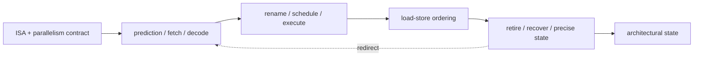

# Part 2 · Architecture › CPU

The CPU section is organized by the machine's natural control boundaries: architectural contract, frontend delivery, speculative backend, and complete-core case studies.

## Subdomains

| Subdomain | Chapters | Boundary it owns |
|---|---:|---|
| [Core Foundations](01_Core_Foundations/00_Index.md) | 3 | pipeline/ISA contract and ILP/TLP/DLP mechanisms |
| [Frontend and Prediction](02_Frontend_and_Prediction/00_Index.md) | 2 | next PC through useful µop delivery |
| [Out-of-Order Backend](03_Out_of_Order_Backend/00_Index.md) | 3 | rename through memory validation and precise commit |
| [Core Case Studies](04_Core_Case_Studies/00_Index.md) | 1 | evidence-backed mapping of theory to real designs |

## Chapter map

| Chapter | Primary ownership |
|---|---|
| [CPU Architecture](01_Core_Foundations/01_CPU_Architecture.md) | in-order pipeline, hazards, hierarchy and multicore concepts |
| [RISC-V ISA](01_Core_Foundations/02_RISC_V_ISA.md) | modular ISA/privilege/vector contract and implementation consequences |
| [SMT, SIMD, and Vector Execution](01_Core_Foundations/03_SMT_SIMD_and_Vector_Execution.md) | lane organization, vector register/memory tax, SMT sharing/isolation |
| [Branch Prediction](02_Frontend_and_Prediction/01_Branch_Prediction_Deep_Dive.md) | BTB/TAGE/indirect/RAS/FTQ prediction machinery |
| [Fetch, Decode, and µop Delivery](02_Frontend_and_Prediction/02_Fetch_Decode_and_Uop_Delivery.md) | I-cache/ITLB, alignment, decode, µop cache, queues and redirects |
| [Out-of-Order Execution](03_Out_of_Order_Backend/01_OoO_Execution.md) | rename, ROB, issue/wakeup, window sizing and execution |
| [Load-Store Unit and Memory Ordering](03_Out_of_Order_Backend/02_Load_Store_Unit_and_Memory_Ordering.md) | disambiguation, byte forwarding, replay, stores and atomics |
| [Retirement, Recovery, and Precise State](03_Out_of_Order_Backend/03_Retirement_Recovery_and_Precise_State.md) | commit maps, checkpoints, traps, branch/order recovery and epochs |
| [Xiangshan CPU Design](04_Core_Case_Studies/01_Xiangshan_CPU_Design.md) | open-core trade-off trajectory from frontend to CHI |

## Reading paths

- **Learn the core end to end:** CPU Architecture → RISC-V → frontend pair → OoO → LSU → retirement.
- **Design a wide frontend:** CPU Architecture §4 → Branch Prediction → Fetch/Decode → Retirement recovery.
- **Close memory correctness:** LSU → Memory Consistency → Cache Coherence → Retirement.
- **Ground the equations in RTL:** read the theory chapters, then Xiangshan.

---

⬅ [Modeling](../01_Modeling/00_Index.md) · [Architecture Contents](../00_Index.md) · next ➡ [Memory](../03_Memory/00_Index.md)
