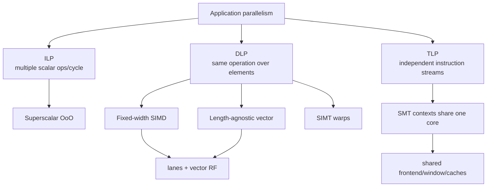
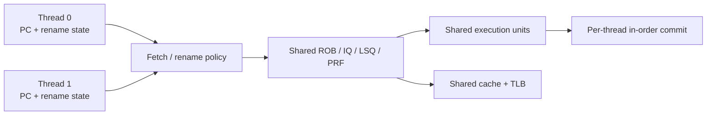

# SMT, SIMD, and Vector Execution — Three Different Ways to Fill the Machine

> **Prerequisites:** [CPU Architecture](01_CPU_Architecture.md) (pipeline and superscalar concepts), [RISC-V ISA](02_RISC_V_ISA.md) §6 (vector ISA contract), and [Out-of-Order Execution](../03_Out_of_Order_Backend/01_OoO_Execution.md) (window structures).
> **Hands off to:** [GPU Architecture](../../05_GPU/01_Core_Architecture/01_GPU_Architecture.md) for SIMT, [NPU Accelerators](../../06_NPU/01_Compute_Dataflows/01_NPU_Accelerators.md) for spatial tensor execution, and the backend chapters for scalar scheduling and recovery.

---

## 0. Why this page exists

Wide machines go idle for different reasons. Scalar superscalar issue runs out of independent instructions; vector lanes run out of active elements; simultaneous multithreading (SMT) runs out of shared queues or fetch fairness. “More parallelism” is therefore not one technique but several contracts with distinct state, control, and utilization costs.

The design question is which form of parallelism the software can expose, which structures must be replicated, and which bottleneck becomes shared.

## 1. Taxonomy: do not conflate width with threads

| Mechanism | Architectural streams | Control stream | Data elements per instruction | Main utilization loss |
|---|---:|---:|---:|---|
| scalar superscalar | 1 | 1 | 1 | insufficient ILP / dependencies |
| fixed-width SIMD | 1 | 1 | fixed ISA width | short/tail vectors, shuffle cost |
| length-agnostic vector | 1 | 1 | runtime `vl`, implementation VLEN | strip-mining overhead, lane/memory imbalance |
| SIMT | many logical threads | warp-level issue | active lanes in warp | divergence, occupancy/resource limits |
| SMT | 2+ independent threads | independent PCs | scalar or vector per thread | contention and unfairness |

SIMD/vector amortizes one instruction's fetch/decode over many operations. SMT selects among independent instruction streams to fill scalar issue slots. SIMT combines a multithreaded programming model with grouped lane issue. These mechanisms can coexist: an SMT core can issue vector instructions from either thread.

## 2. The vector-length contract

In fixed-width SIMD, the ISA names a physical width. Software must be rebuilt or dispatched differently when the width changes. A length-agnostic vector ISA instead exposes a maximum implementation width while software sets the active element count `vl` for each strip-mined iteration.

For application vector length $N$, element width $SEW$, architectural register grouping $LMUL$, and implementation vector length $VLEN$,

$$
VLMAX=LMUL\frac{VLEN}{SEW},\qquad n_{iter}=\left\lceil\frac{N}{VLMAX}\right\rceil.
$$

The final iteration uses a smaller `vl`; tail policy defines whether inactive elements are preserved or may become unspecified. Mask policy similarly determines inactive masked elements. These policies are not syntax trivia: preserving old values creates read-modify-write pressure in the vector register file.

### 2.1 Strip mining example

With $VLEN=256$, $SEW=32$, and $LMUL=2$, $VLMAX=16$ elements. A 100-element loop executes seven vector iterations (six at 16, one at 4). The binary remains correct on a 128-bit or 512-bit implementation because it queries the available length.

## 3. Lane organization and the utilization equation

A vector unit with $L$ lanes, $m$ functional pipelines per lane, and clock $f$ has peak operation rate

$$
P_{peak}=L\,m\,o\,f,
$$

where $o$ counts operations per pipeline result (for example, an FMA may count as two floating-point operations). Achieved performance is

$$
P=P_{peak}\eta_{lane}\eta_{issue}\eta_{mem}\eta_{mask},
$$

with lane fill, issue availability, memory supply, and active-mask efficiencies.

Lanes may be **element-partitioned** (each lane owns element indices modulo $L$) or **register-partitioned**. Element partitioning simplifies regular arithmetic but makes cross-lane slides, permutations, reductions, and indexed memory expensive. A reduction tree adds area and wiring yet cuts latency from $O(L)$ serialized steps toward $O(\log L)$ stages.

### 3.1 Chaining and convoys

Without chaining, a dependent vector instruction waits for the entire producer vector. With lane-level forwarding, element $i$ can enter the consumer shortly after its producer result emerges. For producer startup $S_p$, consumer startup $S_c$, and $n$ elements processed at $L$ elements/cycle,

$$
T_{chained}\approx S_p+S_c+\left\lceil\frac{n}{L}\right\rceil,
$$

rather than paying the full vector length twice. Chaining is vector bypassing; it also creates long, high-fanout physical paths.

## 4. The vector register file is usually the tax collector

Peak arithmetic is easy to replicate. Feeding it requires read/write bandwidth. If each of $I$ issued vector operations needs $r$ source and $w$ destination operands, the logical port demand is $Ir$ reads and $Iw$ writes per cycle, each across $L\times SEW$ bits.

Practical designs reduce the quadratic multiport cost using:

- banking and lane-local register slices;
- operand collectors that decouple register reads from issue;
- staged reads for ternary operations;
- bypass networks to avoid immediate write/read cycles;
- register grouping and physical-register allocation constraints;
- separate mask/predicate storage;
- compiler scheduling around bank conflicts.

A 32-lane, 32-bit result is 1024 bits per cycle before ECC, tags, and bypass control. Two results plus three sources can make operand transport consume more energy and routing than the arithmetic.

## 5. Vector memory is a second machine

Unit-stride accesses are coalesced into cache-line transactions. Strided and indexed operations require address generation, translation, miss tracking, ordering, and fault bookkeeping per element or group.

For line size $B$, element size $E$, and unit stride, one line supplies $B/E$ elements. With $L$ lanes consuming one element/cycle, minimum line request rate is

$$
\lambda_{line}=\frac{LE}{B}\ \text{lines/cycle}.
$$

At $L=16$, $E=4$ B, and $B=64$ B, the vector unit consumes one line per cycle. Two source streams plus one destination can demand three cache-line streams, before misses. The cache banks, TLB ports, MSHRs, and store path must scale accordingly.

Precise exceptions complicate vector loads. The implementation must identify the faulting element, avoid exposing later elements incorrectly, and support restart state such as RISC-V `vstart`. Fault-only-first operations deliberately shorten `vl` after the first fault to support vectorized pointer/string traversal.

## 6. SMT: replicate identity, share expensive machinery

An SMT context needs its own architectural PC/register state, privilege state, rename map or map identity, interrupt state, and predictor-history context. The core may share fetch/decode bandwidth, physical registers, ROB entries, issue queues, execution units, load/store queues, TLBs, and caches.

SMT throughput benefit follows complementarity. If one thread alone uses fraction $u_j$ of resource $j$, a second thread can fill idle capacity only where its demand does not collide. A crude upper bound for two identical threads is

$$
S_{SMT}\le\min_j\frac{C_j}{d_{0,j}+d_{1,j}},
$$

interpreted across fetch, rename, issue, execution ports, memory bandwidth, and queue occupancy. Two memory-bound threads can reduce single-thread performance without increasing total work much.

### 6.1 Sharing policies

| Policy | Benefit | Risk |
|---|---|---|
| fully shared | high utilization and elasticity | starvation, covert channels, unpredictable latency |
| static partition | isolation and simple accounting | stranded entries when one thread stalls |
| threshold / cap | bounded interference with some elasticity | tuning complexity |
| dynamic priority | targets QoS or critical thread | feedback instability and gaming |

ROB/LSQ/physical-register occupancy must be controlled together. Capping only ROB entries does not stop a thread from exhausting load buffers or MSHRs.

## 7. Frontend and predictor implications of SMT

Fetch policies include round-robin, ICOUNT (favor the thread with fewer in-flight instructions), stall-based selection, and QoS priority. Predictor state may be shared with thread tags, partitioned, or indexed using history containing thread identity. Sharing improves capacity but creates destructive interference and security channels.

The instruction cache can hold both working sets while the ITLB, BTB, and return stack thrash. Therefore measure frontend structures separately; “SMT slows the cache” may actually be BTB or ITLB contention.

At retirement, each thread must preserve in-order architectural state, but aggregate commit bandwidth can be shared. Interrupt delivery, single-step debug, and precise exceptions target one context without corrupting the other.

## 8. SIMD/vector versus SMT: a design ledger

| Question | Vector/SIMD | SMT |
|---|---|---|
| software requirement | data-parallel loop | independent threads |
| replicated state | lanes/datapaths, vector RF capacity | architectural contexts, maps/history |
| amortized control | high | low; each thread has own stream |
| latency tolerance | long vector operations and memory overlap | switch issue among threads |
| main bottleneck | operand/memory bandwidth and masks | shared-structure contention |
| determinism | relatively predictable for regular loops | workload-pair dependent |
| security/isolation | lane data separation | shared predictors/caches create channels |

The mechanisms are complementary. A server may use SMT to fill scalar bubbles and vectors to accelerate dense loops. The physical budget must cover their interaction: two SMT threads issuing wide vectors can saturate register-file and memory bandwidth abruptly.

## 9. Numbers to remember

- $VLMAX=LMUL\times VLEN/SEW$ elements for the basic RISC-V vector relationship.
- Tail and mask **undisturbed** policies may require preserving old destination elements.
- Vector peak is lane count × pipelines/lane × operations/result × frequency; utilization factors multiply it down.
- Register-file and bypass bandwidth often dominate vector-core energy and routing.
- SMT replicates architectural identity but shares expensive execution and memory structures.
- SMT throughput gains are workload-pair dependent; isolation needs coordinated queue/cache/bandwidth controls.

## 10. Worked problems

### Problem 1 — vector utilization

An 8-lane unit processes 100 32-bit elements with `VLMAX=32`. It runs four iterations with active elements 32, 32, 32, and 4. Ignoring startup, lane-slot utilization is

$$
\eta=\frac{100}{4\times32}=78.125\%.
$$

Longer application vectors or a policy that combines independent short vectors is needed to recover the tail loss.

### Problem 2 — register bandwidth

Two vector FMAs/cycle each read three 512-bit operands and write one result. Logical register traffic is

$$
2(3+1)512=4096\ \text{bits/cycle}=512\ \text{B/cycle}.
$$

At 2 GHz that is 1 TB/s of on-core operand traffic, showing why lane-local banking and bypass are mandatory.

### Problem 3 — SMT fairness

A 256-entry ROB gives thread 0 a cap of 192 and thread 1 a guaranteed minimum of 64. If thread 0 stalls at 120 entries, thread 1 may borrow the remainder under an elastic policy. A static 192/64 partition would strand 72 entries; a fully shared policy could let thread 0 starve thread 1. The threshold policy trades utilization for a bounded minimum.

## Cross-references

- **Scalar core:** [CPU Architecture](01_CPU_Architecture.md), [Out-of-Order Execution](../03_Out_of_Order_Backend/01_OoO_Execution.md), [Fetch, Decode, and µop Delivery](../02_Frontend_and_Prediction/02_Fetch_Decode_and_Uop_Delivery.md).
- **Vector contract:** [RISC-V ISA](02_RISC_V_ISA.md) §6 and the official RISC-V V specification.
- **Throughput relatives:** [GPU Architecture](../../05_GPU/01_Core_Architecture/01_GPU_Architecture.md), [SIMT Scheduling and Occupancy](../../05_GPU/01_Core_Architecture/02_SIMT_Scheduling_and_Occupancy.md), [Systolic, Spatial, and Vector Dataflows](../../06_NPU/01_Compute_Dataflows/02_Systolic_Spatial_and_Vector_Dataflows.md).

## References

1. RISC-V International, [“V” Standard Extension for Vector Operations, Version 1.0](https://docs.riscv.org/reference/isa/unpriv/v-st-ext).
2. R. Espasa and M. Valero, “Multithreaded Vector Architectures,” HPCA 1997.
3. D. Tullsen, S. Eggers, and H. Levy, “Simultaneous Multithreading: Maximizing On-Chip Parallelism,” ISCA 1995.
4. J. Smith and G. Sohi, “The Microarchitecture of Superscalar Processors,” *Proceedings of the IEEE*, 1995.
5. Intel, *64 and IA-32 Architectures Optimization Reference Manual*.

---

**Navigation:** [Core Foundations index](00_Index.md) · [CPU index](../00_Index.md)
