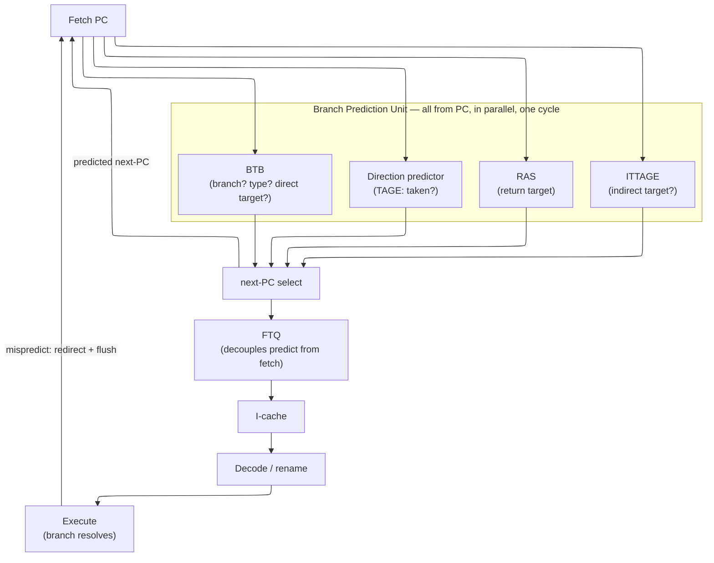

# Branch Prediction — the Speculative Front End

> **Prerequisites:** [CPU_Architecture](01_CPU_Architecture.md) (the pipeline and its fetch stage, hazards), [OoO_Execution](03_OoO_Execution.md) (speculative execution and the misprediction-recovery flush path, its §2.5 and §6).
> **Hands off to:** [Cache_Microarchitecture](../03_Memory/01_Cache_Microarchitecture.md) & [Memory](../03_Memory/03_Memory.md) (the I-cache the front end drives), [TLB_and_Virtual_Memory](../03_Memory/02_TLB_and_Virtual_Memory.md) (the iTLB in the fetch path), [Xiangshan_CPU_Design](05_Xiangshan_CPU_Design.md) (a complete open core built around TAGE-SC-L + ITTAGE).

---

## 0. Why this page exists

A pipelined machine has to choose the address it fetches **next** before it can possibly know the outcome of the instruction it is fetching **now**. A branch's direction and target are not settled until it executes — many stages downstream of fetch — yet fetch must hand the front end a next-PC *every cycle*. That gap is not an implementation wart; it is structural, and it leaves exactly three options:

1. **Stall until the branch resolves.** Deterministic, and ruinous. With a resolution depth of $s_r$ stages and branch density $b$, every branch injects an $s_r$-cycle bubble, adding $b\cdot s_r$ to CPI. At $b=0.2$ (a branch every five instructions) and $s_r=12$, that is $+2.4$ CPI — the machine spends most of its cycles idle.
2. **Guess statically** (e.g. predict-not-taken). Free, but a fixed guess is wrong on ~40–50 % of dynamic branches, so it pays most of the stall anyway.
3. **Guess dynamically** — a trained predictor that is wrong only a few percent of the time, and pays the bubble *only on mispredicts*.

Option 3 is the only viable one, which is the whole point: **speculation across branches is mandatory, not optional.** Branch prediction is the discipline of making that mandatory guess wrong as rarely as physically possible, because every wrong guess discards all the work fetched behind it. This page derives each front-end structure from the fact it must produce early, makes **TAGE** the theoretical centrepiece (why *tagged geometric history lengths* are the accuracy/storage sweet spot), and quantifies why a deep, wide core lives or dies by its predictor.

### 0.1 The cost model, and why deeper *and* wider makes it dominant

A branch resolves in execute; a mispredict is detected there and the front end is redirected and refilled. The cost of one mispredict is the **penalty** $P$ — cycles from the branch entering the pipe to correct-path instructions reaching the same point — which is essentially the fetch-to-resolve depth. Averaged over the stream, this is the same formula the OoO page uses for the misprediction limiter ([OoO_Execution](03_OoO_Execution.md) §6):

$$
\text{CPI} \;=\; \text{CPI}_{ideal} \;+\; \underbrace{\frac{\text{MPKI}}{1000}}_{b\,\cdot\,m}\times P
$$

where MPKI = mispredicts per 1000 instructions $=1000\,b\,m$, $b$ = branches per instruction ($\approx 0.2$), $m$ = per-branch mispredict rate, $P$ = penalty in cycles. The added CPI is a **fixed tax**: a fixed number of cycles per thousand instructions, set by the predictor ($m$) and the pipeline depth ($P$), independent of how wide the machine is.

That fixed tax is exactly what makes misprediction *dominant* on aggressive cores. Express the realized throughput as a fraction of peak $W$ (issue width, $\text{CPI}_{ideal}=1/W$):

$$
\frac{\text{IPC}_{eff}}{W} \;=\; \frac{1}{1 + W\cdot\dfrac{\text{MPKI}}{1000}\cdot P}
$$

The denominator carries the **product $W\times P$**. Depth raises $P$ directly; width shrinks $\text{CPI}_{ideal}=1/W$ so the same fixed tax eats a larger share of it. A machine built to be both deep and wide surrenders a fraction of its peak that grows with the product of the two things it spent all its area on:

- **W = 4, P = 14, MPKI = 8** → tax $0.112$, realized $= 1/(1+4\cdot0.112)=69\%$ of peak.
- **W = 8**, same P and MPKI → realized $= 1/(1+8\cdot0.112)=53\%$ of peak.

Doubling width from 4→8 raised realized IPC only $2.76\to4.22$ (1.53×, not 2×) and *lost* 16 points of peak utilisation — because the branch tax was unchanged while the thing it is measured against halved. This is the Amdahl-flavoured reason a 6-wide, 12–18-stage core cannot be built without a near-perfect predictor: the front end is the tax collector on all of that width and depth, and the only knobs are **cut $P$** (resolve earlier) or **cut $m$** (predict better). Everything below is about cutting $m$.

---

## 1. What must be predicted, and why one structure cannot do it

To advance, fetch needs one thing: the **next-PC**. Producing it from the current PC *before decode* means answering a chain of questions the pipeline would otherwise only settle much later:

| Question the next-PC needs | Settled for certain at | Speculative structure that answers it early |
|---|---|---|
| Is this fetch block even a branch? | decode | **BTB** (presence) — §2 |
| Where does it go (direct target)? | decode | **BTB** (target) — §2 |
| Is a conditional branch taken this time? | execute | **direction predictor** (TAGE) — §3–4 |
| Where does a *return* go? | execute | **RAS** — §6 |
| Where does an *indirect* branch go this time? | execute | **ITTAGE / indirect target cache** — §5.1 |

The organizing idea of the whole front end is one sentence: **every predictor is a speculative cache of a fact the pipeline will only confirm later, pulled forward to the one cycle fetch can use it.** They are separate structures because the facts have different *natures*, and that nature dictates what each must remember:

- "Is this PC a branch, and (for a direct branch) where does it statically go" is a property of the **PC** — cache it by PC. → BTB.
- "Is it taken this time" is a property of **dynamic bias and recent history**, not of the PC alone. → direction predictor.
- "Where does this return go" is a property of **call context**, and is *not* a function of the branch PC at all. → RAS.

The loop `PC → predict → next-PC → PC` closes every cycle; the FTQ (§7) lets it run ahead of the I-cache; and the one back-edge from execute is the mispredict recovery that §0's tax pays for. Hold that picture and the rest is filling in each box.

---

## 2. The BTB: "is this a branch, and where?" from the PC alone

### 2.1 Why it must exist — a timing argument that dictates its contents

The fetch engine picks the next PC in the *same cycle* it launches the I-cache access — several stages before decode can even confirm the fetched bytes are a branch. If it waited for decode, every taken branch would cost a decode-to-fetch bubble (3–5 cycles). So the BTB must reconstruct, from the PC alone, everything decode would otherwise have to tell it. That job — and nothing more — fixes what every entry holds:

| The entry must remember… | …because the next-PC needs to know |
|---|---|
| a **tag** (upper PC bits) | that *this* PC is really the cached branch, not an aliasing neighbour — a bogus redirect is worse than none |
| a **target PC** | *where* to steer next fetch, for a direct branch whose offset decode hasn't computed yet |
| a **branch type** (cond / call / return / indirect) | *who acts next cycle* — a return must pop the RAS, a call push it, an indirect not blindly trust one stored target |

That is the whole entry. A structure that stored only "one target per PC" would mispredict every return and every polymorphic indirect branch — which is exactly why the type field, not the target, is the subtle part. There is no bit-field layout worth memorising here; those three obligations *are* the state.

### 2.2 The capacity–latency knee: why the BTB is a cache hierarchy

The BTB has a cache's central conflict: it wants to be **large** (cover a big code footprint so few branches miss) and **fast** (redirect within the single fetch cycle). SRAM access time grows with capacity (roughly $\sqrt{\text{capacity}}$ for the array plus decode), so one structure cannot be both. The resolution is the same split L1/L2 data caches make — separate *capacity* from *latency*:

| Level | Entries | Latency | Role |
|---|---|---|---|
| L1 BTB | 64–128 | 1 cycle (in the fetch cycle) | hot branch working set, zero-bubble redirect |
| L2 BTB | 2K–8K | 2–3 cycles | cold/large-footprint branches, cheap 1–2-cycle redirect |
| (miss both) | — | 3–5 cycles | branch only recognised at decode |

The 3–5-cycle decode-time recovery is precisely the cost the L2 BTB exists to avoid on all but the coldest branches, and its 1–2-cycle redirect is the price of admission. This is a **coverage-vs-latency** trade with a cache-miss cost model: BTB miss rate rises as the dynamic branch working set approaches capacity, and each miss on a taken branch costs the decode redirect. That is why large-footprint server and interpreter workloads — thousands of active branch sites — are frequently *front-end-bound* and drive the enormous BTBs (and even decoupled, run-ahead fetch, §7) of Golden Cove, Apple, and Neoverse, while an embedded core with a tiny code footprint ships a single small BTB. Match the structure to the residual miss rate: the whole design lever is coverage of the branch working set, not raw capacity.

---

## 3. Direction prediction: bias first, then correlation

A BTB says *where* a taken branch goes; it says nothing about *whether* a conditional is taken — and a perfect target is worthless if you step onto it on a branch that should have fallen through. Direction is a separate question, so it earns a separate structure, and what that structure must remember is derived in two layers.

### 3.1 Layer one — bias with hysteresis

Most branches are heavily skewed: a loop back-edge is taken $N{-}1$ of $N$ times, an error check almost never fires. The minimum state that captures skew is a small saturating counter per branch. The classic **2-bit** counter (states strongly/weakly not-taken → weakly/strongly taken; predict taken when in the top half) is chosen not because 2 bits store more skew than 1, but for **hysteresis**: it takes *two* consecutive surprises to flip the prediction, so a loop that is taken 99 times then falls through once loses only *one* prediction at the exit instead of two (one at the exit, one on re-entry). One bit would double the error on every loop boundary. That is the entire reason 2-bit is the floor and 1-bit is not used.

Bias alone tops out around **85–90 %** accuracy. It cannot predict a branch whose outcome depends on *context* — `if (x) …` followed by `if (x && y) …`, where the second branch's behaviour is decided by the first. For those, per-branch bias is structurally blind.

### 3.2 Layer two — global history and the correlation it captures

The leap past the bias ceiling is the observation that a branch's outcome often *correlates with the recent outcomes of other branches*. Remember a slice of that history and you can tell the contexts apart. The **global history register (GHR)** is an $N$-bit shift register of the last $N$ branch outcomes (1 = taken); indexing the prediction by GHR as well as PC lets one static branch predict differently under different histories. This is the single idea behind every predictor from two-level adaptive through TAGE.

**gshare** is the cheapest way to use both. Rather than one table per history pattern (exponential), it hashes bias and history into *one* small table by XOR:

$$
\text{index} \;=\; \text{PC}[k{-}1{:}0] \;\oplus\; \text{GHR}[k{-}1{:}0]
$$

into a $2^{k}$-entry array of 2-bit counters. The XOR **decorrelates aliasing**: two branches sharing a PC-index but differing in history land on different counters, and vice versa, cutting destructive interference ~30 % versus pure PC-indexing. gshare is untagged and simply *tolerates* the collisions that remain, because the counters self-correct — which is both its cheapness (~2 KB, ~89–92 %) and its ceiling.

### 3.3 The two problems a single-length predictor cannot escape

Two theoretical facts about gshare-style predictors set up everything TAGE does:

**Aliasing.** A single shared table of $2^k$ counters is a hash table with no tags. When the working set of distinct $(\text{PC}, \text{history})$ contexts approaches $2^k$, unrelated contexts with *opposite* bias collide and corrupt each other. Untagged predictors can only fight this by growing the table (linear in area) — there is no way to *know* a collision happened, so a collision is a silent wrong prediction.

**The wrong history length, for every branch at once.** A branch whose outcome truly depends on the last $h$ prior branches needs history length $\ge h$. But index it with $L \gg h$ bits and the extra $L-h$ bits are effectively random *for this branch*, splitting its training examples across up to $2^{L-h}$ redundant entries — training slows by that factor and table pressure (and aliasing) explodes. Conversely, too-short history is simply blind to deep correlation. Since real code mixes branches whose true correlation depth $h$ ranges from 1 to hundreds, **no single history length is right**, and a fixed-$L$ predictor loses accuracy at both ends of the spectrum. The ideal $L$ is *per-branch* and unknown a priori.

TAGE resolves both at once. That is the next section, and it is the heart of the page.

---

## 4. TAGE: letting each branch pick its own history length

TAGE (TAgged GEometric history length, Seznec & Michaud 2006) has been the dominant direction predictor in academia and industry since it swept the Championship Branch Prediction contests, and it ships — as TAGE-SC-L — in Intel P-cores, SiFive P870, and the open-source Xiangshan Nanhu. It is best understood not as "gshare with more tables" but as the direct answer to §3.3's two problems.

### 4.1 The move, and the two obligations it forces

Keep **several** tables at **geometrically spaced** history lengths ($0, 4, 16, 64, 256, \dots$), and for each branch use *the longest table that has a tag-matching, trained entry for this exact history*. That one sentence forces exactly two design features — and they are precisely the "TA" and the usefulness machinery TAGE adds over gshare:

- **Tags (the "TA").** If you intend to *trust the longest matching table*, you must be sure it matches: a false hit on a 256-bit-history entry is a *confident* wrong prediction, the most expensive kind. So each tagged entry carries a partial tag and is believed only on a tag match. Tags convert aliasing from "silent misprediction" (gshare's disease) into "tag miss → fall back to a shorter, safer table." **This is what lets TAGE use very long histories without paying the aliasing tax those histories would otherwise impose** — a mis-hit degrades gracefully instead of mispredicting confidently.
- **A usefulness counter + an alternate.** A freshly allocated long-history entry is unproven. So TAGE keeps the second-longest match as an **alternate** and trusts the long **provider** only once a small per-entry usefulness counter shows it has earned it; on a mispredict it *allocates* a new entry in a longer, currently-missing table, so the next encounter has a more specific predictor available. The allocation/decay bookkeeping is all in service of one online question: *which history length should I believe for this branch, right now?* — i.e. discovering each branch's true correlation depth $h$ empirically.

The essential per-entry state, derived from that job (not a bit-field dump): a **prediction counter** (3-bit saturating direction), a **partial tag** (8–10 bits, the "am I really the right entry" check), and a **usefulness counter** (2-bit, "have I earned trust over the alternate"). The base component is untagged (it always hits, as the fallback of last resort).

### 4.2 Why *geometric* spacing — reach that is exponential in table count

Geometric lengths are not a tuning nicety; they are the optimal covering of a target that lives on a log scale. To span history lengths from $L_{min}$ to $L_{max}$ with $M$ tables at ratio $\alpha$ (each $L_i = L_{min}\,\alpha^{\,i}$):

$$
L_{max} = L_{min}\,\alpha^{\,M-1} \;\;\Longrightarrow\;\; M \;=\; 1 + \log_{\alpha}\!\frac{L_{max}}{L_{min}}
$$

so the maximum history **reach grows exponentially in the number of tables** — a handful of components spans loop-local to very-long-range. With $\alpha=2$, reaching $L_{max}=256$ needs $M\approx 8$ tables; production TAGE reaches **500+ bit** histories with ~8–12 components. The deeper reason geometric beats linear: what matters for matching a branch correlated at distance $d$ is a table whose length is *within a bounded ratio* of $d$, not a bounded difference. Covering a multiplicative range $[L_{min},L_{max}]$ with bounded ratio-gaps requires geometrically spaced points; linear spacing would cluster tables uselessly at short lengths and leave order-of-magnitude gaps at long ones. Geometric spacing is the minimum-table covering of a log-scale need — that is *why* the "G" is in the name.

A representative 4-component layout (base + geometric tagged tables):

| Component | History length | Entries | Tag |
|---|---|---|---|
| Base (bimodal) | 0 | 1–4 K | none |
| T1 | 4 | 128–256 | 8–10 bit |
| T2 | 16 | 128–256 | 8–10 bit |
| T3 | 64 | 128–256 | 8–10 bit |
| T4 (typical high-end +4 more) | 256 (…up to 500+) | 128–256 | 8–10 bit |

### 4.3 The accuracy-per-byte argument: what the tags buy

Tags cost storage — a tagged entry is ~13 bits (3-bit counter + 2-bit useful + 8-bit tag) against gshare's 2 — roughly 6× per entry. TAGE wins anyway because it needs *far fewer* entries (it is not fighting aliasing by brute capacity) and only the tagged components pay the tag. The empirical accuracy/storage curve on SPEC INT 2006:

| Predictor | Storage | MPKI | Accuracy |
|---|---|---|---|
| bimodal (2-bit) | 1 KB | 12–15 | 85–88 % |
| gshare (12-bit GHR) | 2 KB | 8–11 | 89–92 % |
| TAGE, 4 components | 8 KB | 3–4 | 96–97 % |
| TAGE, 8 components | 16 KB | 2.5–3.5 | 97–99 % |
| TAGE-SC-L | 32–64 KB | 2–2.4 | ~99–99.2 % |

MPKI roughly **halves per ~4× storage** through the TAGE regime, then flattens near the entropy of the branch stream. Cash that out in §0's model — a 6-wide, $P=14$ core:

- gshare, MPKI $\approx 10$: peak realized $= 1/(1+6\cdot0.010\cdot14)=54\%$.
- TAGE, MPKI $\approx 3$: peak realized $= 1/(1+6\cdot0.003\cdot14)=80\%$.

Moving gshare → TAGE recovers **~26 points of peak IPC** — about $1.5\times$ on branchy integer code — for ~14 KB of extra tables. *That* is what the tag bits and the multi-table lookup are worth, and why every high-performance core pays for them. The cost side is real and bounded: $M$ parallel tagged lookups plus the geometric history folds each cycle (a shallow XOR tree, ~2–3 FO4), which is why TAGE lives behind the FTQ (§7) where its latency is off the per-cycle fetch critical path rather than on it.

### 4.4 SC and L: correcting the residue

**TAGE-SC** adds a **Statistical Corrector**. TAGE commits to *one* provider; sometimes the *ensemble* of component counters carries a signal that the single-provider choice throws away (several low-confidence components agreeing against one high-confidence provider). A perceptron-like corrector reads all component outputs as features and flips TAGE's answer only when it is *confidently* opposed — a gated override that cannot drop below the TAGE baseline. Worth ~0.2–0.4 accuracy points.

**TAGE-SC-L** adds a tiny **Loop predictor**. Long regular loops are TAGE's blind spot: a 100-iteration loop needs ~100 bits of history to see its single exit, and even geometric tables train slowly on it. A dedicated loop predictor learns the trip count and predicts the exit exactly — ~1 KB, disproportionately effective on counted loops. The pattern is the recurring one: **spend structure only on the residual difficulty the main predictor leaves.** TAGE-SC-L is the current production state of the art (~2–2.4 MPKI, ~99 %).

---

## 5. Indirect branches and the perceptron alternative

### 5.1 Indirect targets: ITTAGE

Indirect branches (virtual dispatch, switch tables, function pointers) have a target that *varies at runtime*, so a BTB storing one target per PC mispredicts them whenever a site has multiple targets (~75–85 % accuracy). But the target is usually *history-selected*, not random — the same call site tends to reach the same target under the same recent history. **ITTAGE** (Seznec 2014) reuses TAGE's exact tagged-geometric structure but stores a **target PC** per entry instead of a direction bit: the longest matching history selects the target. It lifts indirect accuracy to **~95 %** on SPEC INT and ships in Xiangshan Nanhu (4 tagged components). It is the cleanest evidence that TAGE is a *general* mechanism for "predict a fact from the longest reliable history," not a direction-only trick.

### 5.2 Perceptron: the other great branch, and why it mostly lost — but not entirely

The perceptron predictor (Jiménez & Lin 2001) is the main alternative hypothesis, and contrasting it sharpens *why* TAGE is shaped as it is. It treats prediction as **linear classification**: keep a weight per history bit, predict taken when the dot-product of weights with the (±1) history vector clears a threshold, and nudge weights toward the outcome on each mispredict.

Its trade-offs are the mirror image of TAGE's:

- **Strength — cheap long history.** Correlation with any of $N$ history bits costs $O(N)$ weights, not $O(2^N)$ table entries. Perceptrons scale to long histories in *storage* gracefully, and the bias weight cleanly separates per-branch skew from correlation.
- **Weakness 1 — linear separability.** A single-layer perceptron cannot represent XOR of history bits: patterns that are not linearly separable are a hard accuracy ceiling TAGE's per-context tables do not have.
- **Weakness 2 — latency.** A prediction is a wide dot-product-and-threshold (an adder tree over $N$ weights), harder to land in one cycle than a table lookup; and it reads many weights per prediction. A table read is simply faster.

So the dichotomy is **table-and-tags (TAGE) vs linear-model-arithmetic (perceptron)**: TAGE selects a history length and reads a counter; perceptron sums a learned model. TAGE-family predictors dominate on accuracy-per-latency (Intel, SiFive, Xiangshan); AMD's Zen line uses **hashed-perceptron**-family predictors, and the two hybridise cleanly — the Statistical Corrector in TAGE-SC *is* a perceptron bolted onto TAGE, taking perceptron's ensemble strength exactly where TAGE's single-provider choice is weakest. Representative numbers: perceptron $N{=}32$ reaches ~5–7 MPKI but at large storage (~100+ KB), against TAGE-8's ~3 MPKI at 16 KB — which is why pure perceptron is rare as the primary predictor and common as a corrector. (The 1990s **tournament** predictor — Alpha 21264, a per-branch selector choosing among bimodal/global/local, ~4 KB, ~96–97 %, 6–9 MPKI — is the historical ancestor of this "combine predictors" idea, superseded by TAGE after 2006 but still the reference design in every course.)

---

## 6. The RAS: returns are context-determined, not PC-determined

A return's target is the one control-transfer target that is **not a function of the branch PC**: the same `ret` returns to a different caller on every dynamic invocation, so a PC-indexed BTB mispredicts it the instant a function has more than one call site. Yet the target is not *unpredictable* — it is exactly the address after whichever CALL is currently outstanding, and calls and returns **nest perfectly**. That nesting *is* the structure it demands: "last call made is first to return" is precisely LIFO discipline, so the predictor is a **stack** of return addresses whose only extra state is a top pointer — push on CALL, pop on RETURN. Everything else follows: an entry is one return address wide, and depth is sized to typical call nesting.

**Sizing.** Call depth is 5–25 levels across C/C++, managed runtimes, and kernels; a **16-entry** RAS covers >95 % of SPEC call depths, **32** covers >99.9 %, and deeper only adds SRAM latency for no accuracy. Returns are ~15 % of branches, and a 32-entry RAS mispredicts <0.05 % of them, so its contribution to overall MPKI is negligible. The RAS is therefore a *solved* problem — which is exactly why it gets a tiny, cheap structure while direction and indirect prediction get TAGE.

**Speculative repair (the one subtlety).** Because fetch pushes and pops the RAS *speculatively*, a mispredict must restore the top pointer to its value before the wrong path. The cheap, standard fix is to checkpoint the 5-bit top pointer per in-flight branch — the same per-branch checkpoint machinery the OoO core uses for the rename map ([OoO_Execution](03_OoO_Execution.md) §2.5), so the incremental cost is trivial (~5 bits × in-flight branches). Pointer-only repair can leave *stale data* in popped entries ("RAS corruption") in deep speculation; cores that care (Apple, ARM Cortex-X) keep a full shadow-RAS per checkpoint (~4 KB for 16 checkpoints vs ~140 bytes pointer-only), buying corruption-freedom for area. Most cores take the cheap side because the residual corruption rate is already below the RAS's negligible MPKI floor.

---

## 7. The decoupled front end: FTQ, and the fetch-width wall

### 7.1 Why prediction and fetch are decoupled

The branch predictor and the I-cache have different natural latencies and stall for different reasons, so coupling them makes each stall the other. A **Fetch Target Queue (FTQ)** — a small FIFO of predicted fetch addresses — sits between them and lets the **predictor run ahead** of fetch. Two payoffs, and they are the whole reason the modern front end is "decoupled":

1. **Latency hiding.** The predictor's multi-cycle work (a TAGE lookup, §4.3) is not on the per-cycle fetch critical path; the FTQ absorbs bursts and bubbles.
2. **Prefetch for free.** The run-ahead addresses in the FTQ *are* an I-cache prefetch stream — target lines can be fetched before the pipe reaches them, hiding I-cache miss latency on predicted-taken branches.

This is the front-end analogue of the OoO window: decouple a producer (prediction) from a consumer (fetch/decode) with a queue, exactly as the ROB decouples execution from commit. It is why large-footprint, front-end-bound workloads (§2.2) benefit from a *deep* FTQ and a predictor that can sprint ahead of the cache.

### 7.2 The taken-branch bubble and the real fetch-width ceiling

Two effects cap *effective* fetch bandwidth below the nominal width, and both are branch-driven:

- Even a **correctly predicted taken** branch can cost a bubble if the redirected target is not ready in time — the fundamental "taken penalty," which the FTQ + prefetch exist to hide.
- A wide fetch block holds **multiple branches**, and the first taken one **truncates** the block: everything fetched past it is discarded. So the useful instructions per fetch are bounded by the run to the first taken branch:

$$
\mathbb{E}[\text{useful insns per fetch}] \;\approx\; \frac{1}{b\cdot t}
$$

where $b$ = branch density ($\approx0.2$), $t$ = taken fraction ($\approx0.6$). That is $\approx 8$ instructions — so a fetch engine wider than ~8 buys nothing on integer code *unless* it can predict past multiple taken branches per cycle (multi-ported BTB, multi-branch direction lookup), which is exactly what Apple's and Golden Cove's front ends do. This is the concrete reason 8-wide fetch does not yield 8 IPC on branchy code, and why fetch width and branch-prediction throughput must scale together.

(The I-cache mechanics the FTQ drives — critical-word-first fill, line-fill buffers, next-line prefetch, the iTLB — belong to [Cache_Microarchitecture](../03_Memory/01_Cache_Microarchitecture.md), [Memory](../03_Memory/03_Memory.md), and [TLB_and_Virtual_Memory](../03_Memory/02_TLB_and_Virtual_Memory.md); the front end's job is to feed them a correct, run-ahead address stream.)

---

## 8. Real cores: where the trade-offs land

The mainstream high-performance cores make the same bet — a near-perfect predictor is the price of deep, wide execution (§0.1) — and differ mainly in predictor family and front-end depth. This parallels the OoO page's Golden Cove vs Zen 4 comparison, from the front-end side.

| Feature | Intel Golden Cove (2021) | AMD Zen 4 (2022) | Xiangshan Nanhu (open) |
|---|---|---|---|
| Direction predictor | TAGE-SC-L family | hashed-perceptron + TAGE | TAGE-SC-L |
| Direction accuracy | ~99 % | ~98.5 % | ~99 % |
| Indirect | dedicated indirect + BTB | dedicated indirect | ITTAGE (4 comp.) |
| BTB | large, multi-level (~L1 + few-K L2) | multi-level (L0/L1/L2, ~8–10 K) | multi-level + FTQ |
| RAS | shadow / checkpointed | checkpointed | checkpointed |
| Front end | decoupled, deep FTQ, multi-branch fetch | decoupled, op-cache fed | decoupled BPU + FTQ |
| Mispredict penalty | ~17 cycles (deep) | ~13 cycles | ~11–13 cycles |

Every row is §0–§7 in silicon: the TAGE/perceptron split of §5.2 (Intel/SiFive/Xiangshan lean TAGE, AMD leans perceptron-family), the multi-level BTB of §2.2, the checkpointed/shadow RAS of §6, and the decoupled FTQ front end of §7. Golden Cove's deeper pipe raises $P$, so it invests proportionally more in $m$ (accuracy) to keep §0.1's $W\times P$ tax bounded; Xiangshan is the one you can read end-to-end, composing TAGE-SC-L + ITTAGE + RAS behind an FTQ ([Xiangshan_CPU_Design](05_Xiangshan_CPU_Design.md)).

---

## 9. Numbers to memorize

| Parameter | Typical | Range | Why this value (section) |
|---|---|---|---|
| Branch frequency (INT) | 1 per 5 insns | 1 per 4–7 | $b\approx0.2$; sets the MPKI scale (§0.1) |
| Branch frequency (FP) | 1 per 15–25 | — | long loops, few branches |
| Per-branch mispredict rate | ~2 % | 1–5 % | $m$ at ~98 % accuracy (§0.1) |
| MPKI, gshare | 8–11 | — | untagged aliasing ceiling (§3.3) |
| MPKI, TAGE-SC-L | 2–2.4 | 2–4 | tagged geometric history (§4.3) |
| L1 BTB entries | 64–128 | — | 1-cycle hot working set (§2.2) |
| L2 BTB entries | 2K–8K | 2K–16K | coverage vs 2–3-cycle latency (§2.2) |
| BTB decode-miss penalty | 3–5 cyc | — | recognised only at decode (§2.2) |
| Direction predictor storage | 16–64 KB | 8–64 KB | accuracy-per-byte knee (§4.3) |
| GHR length (gshare) | 8–16 bits | — | single compromise length (§3.2) |
| GHR reach (TAGE longest) | 256–500+ bits | — | geometric, $M\approx\log_\alpha L_{max}$ (§4.2) |
| TAGE components | 4–8 | 4–12 | geometric spacing (§4.2) |
| TAGE tag width | 8–10 bits | — | false-hit protection (§4.1) |
| RAS depth | 16–32 | 16–64 | covers 95–99.9 % call nesting (§6) |
| Indirect accuracy (BTB / ITTAGE) | 85 % / 95 % | — | one vs history-selected target (§5.1) |
| Mispredict penalty | 12 cyc | 8–18 | fetch-to-resolve depth $P$ (§0.1) |
| Effective useful fetch/block | ~8 insns | — | first-taken truncation $1/(bt)$ (§7.2) |

**Penalty vs pipeline depth** (the $P$ that drives §0.1): 10-stage pipe → 5–8 cyc · 15-stage → 8–12 cyc · 20-stage → 12–18 cyc. **Accuracy vs predictor** (SPEC INT 2006 MPKI): static 20–25 · bimodal 12–15 · gshare 8–11 · tournament 6–9 · TAGE-4 3–4 · TAGE-8 2.5–3.5 · TAGE-SC-L 2–2.4. **Hardest workloads**: data-dependent indirect (`mcf`), virtual dispatch (`gcc`), interpreter switches (`perlbench`) — 3–5 MPKI even under TAGE; FP loops are ~0.3.

---

## 10. Worked problems

**1 — Why depth × width makes the predictor the limiter.** A 6-wide core, 15-stage pipe, resolves branches at stage ~13 so $P\approx14$; predictor MPKI $=8$. Fraction of peak realized $=1/(1+W\cdot\frac{\text{MPKI}}{1000}\cdot P)=1/(1+6\cdot0.008\cdot14)=1/1.672=60\%$. Now *widen* to 8-wide (same P, MPKI): $1/(1+8\cdot0.008\cdot14)=53\%$ — wider hardware, *smaller* fraction of it realized, because the fixed branch tax is unchanged. The only recovery is a better predictor: at MPKI $=3$ (TAGE), the 8-wide core reaches $1/(1+8\cdot0.003\cdot14)=75\%$. Prediction, not width, is the first lever — the same conclusion the OoO page reaches from the back end.

**2 — What TAGE's tags buy, in CPI.** Same 6-wide, $P=14$ core. gshare (MPKI 10): added CPI $=\frac{10}{1000}\cdot14=0.14$. TAGE-SC-L (MPKI 2.4): added CPI $=\frac{2.4}{1000}\cdot14=0.034$. The predictor swap removes $0.106$ CPI; against an ideal CPI of $1/6=0.167$, that is the difference between $\text{IPC}_{eff}=3.3$ and $4.97$ — a $1.5\times$ swing on branchy code, bought with ~14–30 KB of tag-carrying tables. This is the §4.3 accuracy/storage argument as a wall-clock number.

**3 — Geometric history reach.** How many tagged components reach a 512-bit history from a 4-bit shortest tagged length at ratio $\alpha=2$? $M=1+\log_2(512/4)=1+\log_2 128=1+7=8$ components. Linear spacing at step 4 would need $512/4=128$ tables for the same reach — geometric turns a 128-table problem into an 8-table one. *That* is the "G" earning its place.

**4 — Why the RAS is left small.** Returns are ~15 % of branches; a 32-entry RAS mispredicts <0.05 % of returns. Contribution to MPKI $\approx 1000\cdot b\cdot(0.15)\cdot(0.0005)$; with $b=0.2$ that is $\approx0.000015\times1000\cdot0.2\approx$ well under $0.01$ MPKI — negligible beside TAGE's ~2.4. Correctly, no core spends TAGE-scale area on returns; the LIFO already solved it (§6).

---

## Cross-references

- **Down the stack (what this is built from):** [CPU_Architecture](01_CPU_Architecture.md) (the pipeline and fetch stage whose bubble this eliminates; the resolution depth that sets $P$), [CMOS_Fundamentals](../../00_Fundamentals/01_CMOS_Fundamentals.md) (the FO4 unit and SRAM access-time scaling behind §2.2's capacity–latency knee and §4.3's fold delay).
- **Up / adjacent (what builds on it):** [OoO_Execution](03_OoO_Execution.md) (the speculative back end this front end feeds; its §6 misprediction limiter and §2.5 checkpoint recovery are the other half of every model here), [Cache_Microarchitecture](../03_Memory/01_Cache_Microarchitecture.md) & [Memory](../03_Memory/03_Memory.md) (the I-cache the FTQ drives and prefetches), [TLB_and_Virtual_Memory](../03_Memory/02_TLB_and_Virtual_Memory.md) (the iTLB in the fetch path), [Xiangshan_CPU_Design](05_Xiangshan_CPU_Design.md) (a complete open core: TAGE-SC-L + ITTAGE + RAS behind an FTQ), [Performance_Modeling_and_DSE](../01_Modeling/01_Performance_Modeling_and_DSE.md) (where the CPI/penalty models here feed design-space exploration).

---

## References

1. Seznec, A. and Michaud, P., "A Case for (Partially) Tagged Geometric History Length Branch Prediction," *Journal of Instruction-Level Parallelism*, 2006. The original TAGE — §4.
2. Seznec, A., "TAGE-SC-L Branch Predictors," *CBP-4*, 2011 (and CBP-5, 2016). The production state of the art — §4.4.
3. Seznec, A., "A 64-Kbytes ITTAGE Indirect Branch Predictor," *CBP-3*, 2011. Tagged-geometric target prediction — §5.1.
4. Jiménez, D.A. and Lin, C., "Dynamic Branch Prediction with Perceptrons," *HPCA-7*, 2001. The perceptron predictor and its linear-separability ceiling — §5.2.
5. Jiménez, D.A., "Multiperspective Perceptron Predictor," *CBP-5*, 2020. State-of-the-art perceptron-family accuracy — §5.2.
6. McFarling, S., "Combining Branch Predictors," *DEC WRL TN-36*, 1993. gshare and the tournament idea — §3.2, §5.2.
7. Kessler, R.E., "The Alpha 21264 Microprocessor," *IEEE Micro*, 19(2), 1999. Tournament predictor and speculative RAS repair — §5.2, §6.
8. Yeh, T.-Y. and Patt, Y.N., "Two-Level Adaptive Branch Prediction," *MICRO-24*, 1991. The GHR and correlation — §3.2.
9. Xiangshan Team, "Xiangshan Nanhu Microarchitecture Manual," 2022. TAGE-SC-L + ITTAGE + decoupled FTQ front end in open-source RISC-V — §8.
