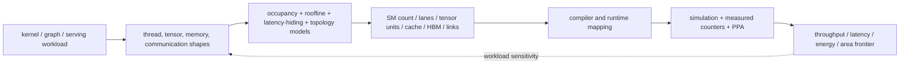
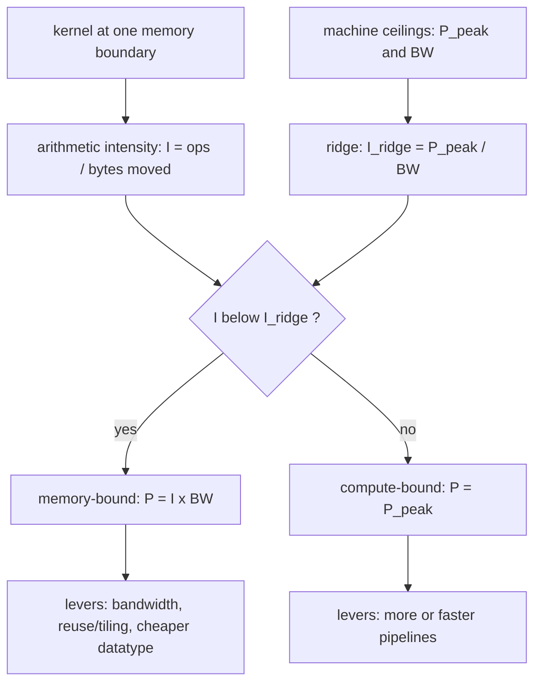

# GPU Workloads, Performance Modeling, and Design-Space Exploration



> **First-time reader orientation:** A GPU converts many threads into groups called warps, issues one instruction for active lanes of a warp, and relies on many resident warps to hide latency. Performance is therefore governed by active lanes, eligible warps, execution pipelines, memory coalescing, cache/high-bandwidth-memory traffic, and host/device orchestration—not by core count or peak floating-point operations alone.

> **Abbreviation key — skim now and return as needed:** graphics processing unit (GPU); central processing unit (CPU); single instruction, multiple threads (SIMT); streaming multiprocessor (SM); thread block (block); high-bandwidth memory (HBM); level-one/level-two cache (L1/L2); instructions per cycle (IPC); floating-point operation (FLOP); floating-point 16-bit (FP16); brain floating-point 16-bit (BF16); general matrix multiplication (GEMM); design-space exploration (DSE); power, performance, and area (PPA); quality of service (QoS); direct memory access (DMA); region of interest (ROI).

> **Hands off to:** [GPU PPA and Physical Implementation](02_GPU_PPA_and_Physical_Implementation.md) and [GPU Simulation Methodology and Evidence](03_GPU_Simulation_Methodology_and_Evidence.md).

---

## 0. Freeze the GPU workload contract

Record:

- host and device source revisions, libraries, input dataset, and expected output;
- CUDA/toolchain/driver versions, target compute capability, optimization and math flags;
- grid/block dimensions, dynamic shared memory, streams, graphs, and synchronization;
- datatype, accumulation mode, sparsity, tensor layout, and determinism settings;
- transfers, allocations, preprocessing, launch overhead, and CPU work included or excluded;
- warm-up launches, measured kernels/iterations, power/clock state, and repetition count.

“Run ResNet” can mean one isolated convolution, all device kernels, or CPU preprocessing + transfers + inference. These boundaries produce different latency and energy claims.

## 1. The GPU throughput chain

For a kernel with $N_{work}$ useful operations and elapsed time $T$,

$$
\text{throughput}=\frac{N_{work}}{T}.
$$

A useful factorization is

$$
\text{achieved throughput}\approx
\text{peak pipelines}\times
\eta_{active}\times
\eta_{eligible}\times
\eta_{issue}\times
\eta_{memory},
$$

where:

- $\eta_{active}$ captures inactive lanes from divergence/masks/tails;
- $\eta_{eligible}$ captures whether enough warps are ready to hide latency;
- $\eta_{issue}$ captures instruction mix, dependencies, scheduler and pipeline limits;
- $\eta_{memory}$ captures coalescing, cache behavior, bandwidth and latency stalls.

These factors are diagnostic, not always independent. A memory stall reduces eligible warps, and divergence changes memory transactions.

## 2. Occupancy is capacity, not performance

Resident blocks on one SM are bounded by

$$
B_{res}=\min\left(
B_{arch},
\left\lfloor\frac{R_{SM}}{R_{block}}\right\rfloor,
\left\lfloor\frac{S_{SM}}{S_{block}}\right\rfloor,
\left\lfloor\frac{T_{SM}}{T_{block}}\right\rfloor
\right),
$$

where $R$ denotes registers, $S$ shared memory, and $T$ threads. Occupancy is resident warps divided by architectural warp slots.

**Intuition.** Resident warps are workers clocked in on the SM; occupancy counts them, but only the *eligible* ones can execute this cycle—a crowded floor does nothing if every warp is blocked on the same delivery (one shared dependency).

High occupancy only means more latency-hiding candidates exist. It does not guarantee they are eligible. All warps can wait on the same long scoreboard dependency, barrier, cache miss, or tensor-core result. Conversely, a compute-dense kernel with independent instructions may reach peak at modest occupancy.

Use three distinct measurements:

1. resident warps (capacity occupancy);
2. eligible warps/cycle (scheduler opportunity);
3. issued warps/cycle and stall reasons (realized progress).

## 3. Arithmetic intensity and the GPU roofline

**Intuition.** Arithmetic intensity is the useful work a kernel extracts per byte it moves across a memory boundary—operations per byte. Compute units are cheap and plentiful while moving bytes is slow and scarce, so intensity decides which resource runs out first: reuse each fetched byte in many operations (high intensity) and the math pipelines stay busy behind the memory system; touch each byte only once or twice (low intensity) and those pipelines starve no matter how many exist. The roofline turns this into a single ceiling—bandwidth-limited at low intensity, compute-limited at high—sketched below.

At a named memory boundary,

$$
I=\frac{N_{ops}}{B},\qquad
P\le\min(P_{peak},\ I\,BW_{boundary}).
$$

The two ceilings cross at the **ridge point**

$$
I_{ridge}=\frac{P_{peak}}{BW_{boundary}},
$$

the intensity where the bandwidth term $I\,BW$ exactly equals the compute peak. It partitions the model: a kernel with $I<I_{ridge}$ sits on the sloped roof and is **memory-bound** (throughput $\approx I\,BW$, so only more bandwidth, more reuse, or a cheaper datatype raises it), while a kernel with $I>I_{ridge}$ sits on the flat roof and is **compute-bound** (throughput $\approx P_{peak}$, so only faster or additional pipelines raise it). The ridge belongs to the machine at that boundary, not to the kernel—each boundary in the hierarchy has its own. For the machine in the Section 9 worked example (120 tera-operations/s, 3 TB/s), $I_{ridge}=120/3=40$ operations/byte: a kernel must reuse every HBM byte in at least 40 operations to be compute-bound, so that kernel at 10 operations/byte sits far left of the ridge and is firmly memory-bound.

```text
 throughput P   (log-log)
   ^
   |             ______________   P_peak  (compute roof, flat)
   |            /
   |           /       compute-bound (P = P_peak)
   |          /
   |         /
   |        /          memory-bound (P = I x BW)
   |       /
   |      /
   +------------+--------------->  arithmetic intensity I
                |
             I_ridge = P_peak / BW
```

Applying the model to a kernel is mechanical: locate its intensity relative to the ridge, read off the bound, and pick levers from the side it lands on.



There is not one GPU arithmetic intensity. A tile can have high HBM intensity due to L2/shared-memory reuse while still being limited by shared-memory bank bandwidth or register-file operand delivery. Construct hierarchical rooflines for HBM, L2, L1/shared memory, register file, and specialized pipelines.

Datatype changes both terms: FP16 tensor operations raise compute peak and reduce bytes relative to FP32, while accumulation or conversion adds operations/data paths.

## 4. Coalescing turns lane addresses into transactions

Let a warp access $N_{useful}$ useful bytes and create $N_{txn}$ transactions of size $B_{sector}$. Transfer efficiency is

$$
\eta_{coal}=\frac{N_{useful}}{N_{txn}B_{sector}}.
$$

Strides, misalignment, inactive lanes, and scattered indices can make $\eta_{coal}\ll1$. The memory system sees post-coalescing sectors, not source-language loads. A DSE that changes cache-sector size, coalescer policy, or layout must use lane address distributions.

## 5. Latency hiding has a concurrency bound

If a warp experiences average exposed latency $L$ cycles and the SM can issue $r$ warp instructions/cycle, sustaining the issue pipeline needs on the order of

$$
N_{independent}\gtrsim rL
$$

independent ready warp-instructions across resident warps. Dependencies and barriers reduce effective independence.

For cache misses, Little's law gives a miss-throughput ceiling

$$
\lambda_{miss}\le\frac{N_{MSHR}}{L_{miss}},
$$

where $N_{MSHR}$ is outstanding miss capacity. A kernel can become MSHR-limited before HBM bandwidth saturates.

## 6. Characterize kernels by mechanisms

For each kernel/phase, capture:

$$
\mathbf{x}=(\text{warp count},\ \text{active-lane fraction},\ \text{eligible warps},\ \text{issue mix},\ \text{registers/thread},\ \text{shared bytes/block},\ L1/L2\ \text{misses},\ \eta_{coal},\ HBM\ \text{bytes},\ \text{barriers},\ \text{atomics}).
$$

Also record launch count and duration. Thousands of tiny kernels can be launch/synchronization-bound even when individual kernels show excellent device utilization.

Classify at least:

- compute/tensor-pipeline bound;
- operand/register-file bound;
- latency/eligibility bound;
- L1/L2/shared-memory bandwidth or conflict bound;
- HBM bandwidth/capacity bound;
- barrier/atomic/serialization bound;
- host/launch/transfer bound;
- inter-GPU collective bound.

## 7. GPU design-space exploration

A configuration vector may include

$$
\theta=(N_{SM},W_{sched},N_{warp},R_{SM},S_{SM},L1,L2,N_{MSHR},P_{FP},P_{tensor},P_{LDST},BW_{NoC},BW_{HBM},f,V).
$$

Couple knobs:

- more SMs require L2/NoC/HBM throughput and power delivery;
- more resident warps require registers, scoreboard/barrier state, and cache/MSHR capacity;
- wider pipelines require register-file/operand bandwidth;
- larger shared memory can raise block residency but increases area/access distance;
- more tensor cores without data supply only raises theoretical peak.

Use analytical screening, kernel traces/counters, timing simulation for contention finalists, and implementation estimates for frequency/power/area.

## 8. Multi-GPU and end-to-end performance

For a partitioned workload,

$$
T_{step}=T_{compute}+T_{exposed\ communication}+T_{sync}+T_{imbalance}.
$$

Communication may overlap compute, so blindly adding isolated kernel and link times is pessimistic; ignoring shared links/serialization is optimistic. Measure critical-path time through stream/event dependencies.

A simple collective bound for payload $M$ is

$$
T_{comm}\ge \alpha N_{steps}+\frac{M_{wire}}{BW_{delivered}},
$$

where $\alpha$ captures per-step latency and $M_{wire}$ includes protocol/topology amplification. Scaling efficiency must include slowest-rank imbalance and host orchestration.

## 9. Worked kernel diagnosis

Assume a kernel performs $4\times10^{12}$ operations and transfers 400 GB from HBM, so HBM intensity is 10 operations/byte. A GPU offers 120 tera-operations/s and 3 TB/s delivered HBM bandwidth:

$$
P_{roof}=\min(120,\ 10\times3)=30\ \text{tera-operations/s}.
$$

The kernel is HBM-bound at this boundary, with a 133 ms lower-bound time ($400\ \text{GB}/3\ \text{TB/s}$). If profiling shows only 1.8 TB/s and 60% coalescing efficiency, the achieved bound is 18 tera-operations/s and about 222 ms. Doubling tensor pipelines cannot help. Candidate fixes are layout/coalescing, reuse/tiling, cache policy, more MSHRs, or delivered HBM bandwidth. Timing simulation must distinguish coalescing waste from outstanding-request or NoC/controller limits.

## 10. Aggregation and decision rules

- Sum dependent kernel/transfer intervals along the actual critical path, accounting for legal overlap.
- Report per-kernel and end-to-end results; do not let a long kernel hide launch-bound regressions.
- For throughput suites, state job mix and weighting rather than averaging unrelated FLOP/s values.
- Use percentiles for latency-sensitive GPU services and multiple repetitions for runtime/power variability.
- Compare equivalent numerical work and accuracy; fast-math or lower precision can change semantics.

## Cross-references

- [GPU Architecture](../01_Core_Architecture/01_GPU_Architecture.md) and [SIMT Scheduling and Occupancy](../01_Core_Architecture/02_SIMT_Scheduling_and_Occupancy.md) implement the parallelism model.
- [Coalescing, Caches, and Shared Memory](../02_Memory_System/01_Coalescing_Caches_and_Shared_Memory.md) and [HBM](../02_Memory_System/02_HBM_and_Advanced_Memory_Systems.md) implement the memory terms.
- [Multi-GPU Interconnect](../03_Scale_Up/01_Multi_GPU_Interconnect_and_Execution.md) develops communication and ordering.

## References

1. NVIDIA, *CUDA C++ Programming Guide* and GPU architecture whitepapers.
2. V. Volkov, “Better Performance at Lower Occupancy,” GPU Technology Conference.
3. S. Williams et al., “Roofline: An Insightful Visual Performance Model,” CACM 2009.
4. A. Bakhoda et al., “Analyzing CUDA Workloads Using a Detailed GPU Simulator,” ISPASS 2009.

---

← [Methodology index](00_Index.md) · next → [GPU PPA and Physical Implementation](02_GPU_PPA_and_Physical_Implementation.md)
