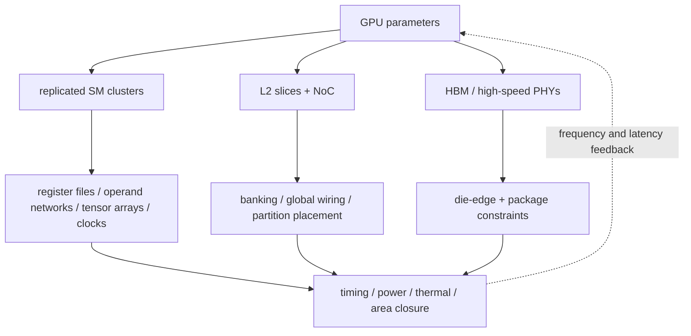
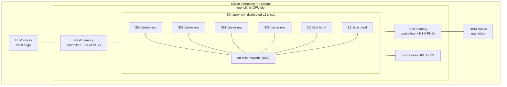

# GPU Power, Performance, Area, and Physical Implementation

> **First-time reader orientation:** GPU throughput comes from replication, but replication magnifies every physical cost. A small increase in registers per thread can reduce occupancy; a wider tensor pipeline multiplies operand bandwidth; adding SMs raises NoC, cache, HBM, clock, and power-delivery demand. This chapter prices those couplings.

> **Abbreviation key — skim now and return as needed:** streaming multiprocessor (SM); single instruction, multiple threads (SIMT); register file (RF); static random-access memory (SRAM); high-bandwidth memory (HBM); level-one/level-two cache (L1/L2); load-store unit (LSU); multiply-accumulate (MAC); tensor core; network on chip (NoC); error-correcting code (ECC); dynamic voltage and frequency scaling (DVFS); power, performance, and area (PPA); process, voltage, and temperature (PVT); thermal design power (TDP).

---

## 0. The GPU physical resource ledger

For each SM, inventory:

- warp schedulers, instruction buffers, program counters, reconvergence/independent-thread state;
- scoreboards, barrier/atomic state, and operand collectors;
- scalar, floating-point, integer, special-function, tensor, and load/store pipelines;
- large banked register files and bypass/operand networks;
- shared-memory/L1 structures, miss queues, and texture/constant paths;
- SM-to-NoC interfaces, clock gating, power gating, sensors, and test logic.

At chip level add L2 slices, memory partitions/controllers, HBM PHYs, copy engines, global scheduler, coherent/host interfaces, inter-GPU links, clock/power networks, and package/thermal constraints.

## 1. Power and energy equations in a replicated machine

$$
P_{dyn}=\sum_j\alpha_j C_jV^2f,\qquad
P_{leak}=\sum_jVI_{leak,j}(T,V),\qquad
E=P\,T.
$$

GPU activity is heterogeneous. An SM can be resident but stalled; tensor cores can toggle heavily while scalar lanes idle; HBM/NoC can dominate a memory kernel. Use event/activity counts per structure rather than one chip utilization percentage.

Along a voltage/frequency curve, higher frequency often requires higher voltage, making dynamic power rise faster than linearly. The intuition: near the top of the curve, voltage must climb roughly in step with frequency to keep paths meeting timing, and since $P_{dyn}\propto V^2f$, holding $V\propto f$ pushes dynamic power toward an $f^3$ trend rather than a linear one — the last few percent of clock is the most expensive to buy. Under a package power limit, adding compute units or clock can reduce sustainable frequency elsewhere. Evaluate sustained operating point, not unconstrained peak.

## 2. The register file is a first-class GPU architecture

A GPU stores state for many resident warps. Nominal RF bits per SM are roughly

$$
B_{RF}=N_{resident\ threads}\times R_{thread}\times b_{reg}.
$$

But capacity is only the start. Each issued warp instruction may require multiple source operands across many lanes and one destination. A monolithic multiported RF would be too costly, so GPUs use banking, operand collectors, distributed slices, and scheduling rules.

Physical consequences:

- bank conflicts delay operand collection even when execution units are free;
- more issue width requires more bank/collector/crossbar bandwidth;
- more registers/thread reduce resident blocks/warps;
- longer RF/operand wires can force pipeline stages;
- bypassing saves writes/reads but adds wide mux and wire load.

Measure collector stalls and bank conflicts; “pipeline busy” alone cannot identify operand delivery as the limiter.

### 2.1 Translate issue width into RF traffic

Suppose one SM issues four 32-lane warp instructions per cycle and each instruction consumes two 32-bit operands and produces one. The logical peak is

$$
B_{read}=4\times32\times2\times32=8192\ \text{bits/cycle},
$$

$$
B_{write}=4\times32\times1\times32=4096\ \text{bits/cycle}.
$$

At 1.5 GHz that is 1.5 TB/s of local read traffic ($8192\times1.5\ \text{GHz}/8$) and 0.75 TB/s of writes *inside one SM* before predicate, tensor-fragment, special-register, or replay traffic. A single memory with eight read and four write ports would have prohibitive cell/periphery and wiring. Real organizations split lanes and banks, collect operands over time, or assign schedulers to RF partitions.

A bank function maps register number and sometimes lane/sub-core to a physical bank. Two source operands that map to the same single-read bank cannot both return in that cycle. Operand collectors retain the first operand while arbitrating for the second; this converts an impossible multiport requirement into variable collection latency. Bank conflicts therefore depend on compiled register assignment and instruction mix. A PPA estimate must pair the cheaper banked implementation with simulated conflict/replay counters rather than assuming all nominal issue slots remain available.

The RF is also physically distributed. A monolithic 256 KB structure near every execution unit would need long, high-toggle wires. Slices reduce wire length but restrict which schedulers or lanes can access which copy; cross-slice moves or writeback broadcasts restore flexibility at an energy/latency cost. This is one reason “register-file size per SM” is not a sufficient architecture description.

## 3. Shared memory and L1 are banked SRAM systems

Shared memory is software-managed SRAM; L1 is hardware-managed cache. Many GPUs share physical capacity or ports between them. Array cost includes decoders, banks, bitlines, sense/write circuits, ECC/parity, arbitration, and crossbars.

Banking supplies parallel accesses when addresses distribute. A conflict serializes lanes or requests. Increasing banks raises decoder/interconnect complexity and may lengthen wires. Increasing capacity can improve tiling/residency but may add access cycles and area per SM.

For configurable L1/shared partitions, evaluate both capacity and traffic patterns. A larger shared allocation can reduce L1 and occupancy; a larger L1 can reduce misses but cannot replace explicitly reused shared tiles.

### 3.1 Low-voltage, reliability, and repair choices are GPU-specific

Shared memory is frequently accessed and software-visible: an uncorrected bit can corrupt many threads in a block. L1 data may be replayable or non-inclusive, while L2/HBM state usually needs stronger end-to-end protection. The policy can therefore differ by level: parity plus replay close to an SM, single-error-correcting/double-error-detecting (SECDED) ECC in larger arrays, and link/DRAM ECC across the package. Define whether ECC bits consume advertised capacity, whether correction adds a cycle, and whether a detected error replays an instruction, poisons a line, or terminates the kernel.

SRAM minimum voltage is constrained by read stability, writability, retention, and process variation. A low-voltage GPU may use read-decoupled cells, assist circuits, or a higher SRAM rail than logic. Each response affects macro density, level shifting, and the feasible dynamic-voltage-and-frequency-scaling range. GPU replication makes yield important as well: spare rows/columns and repair can keep one weak bank from disabling an otherwise good SM, but repair remapping must preserve the bank/interleave behavior assumed by software and the simulator.

A banked-array estimate should state usable capacity, physical word width, number of banks, read/write ports, access cycles, ECC/repair overhead, and conflict rule. Capacity alone cannot distinguish a dense two-cycle 128 KB array from a one-cycle 128 KB array built from more banks and periphery.

## 4. Tensor pipelines are data-delivery machines

An $m\times n\times k$ matrix operation requires $mnk$ MACs, but the physical tensor block also needs:

- operand registers/queues and layout/transpose handling;
- wide reads from RF/shared memory;
- accumulation storage and precision conversion;
- pipeline control, sparsity metadata/decode if supported;
- result writeback bandwidth.

Peak tensor throughput is useful only if operand systems supply the initiation rate. Adding tensor units may increase RF/shared/NoC power more than compute-array power. Include data movement energy per level:

$$
E_{kernel}=N_{MAC}e_{MAC}+N_{RF}e_{RF}+N_{SMEM}e_{SMEM}+N_{L2}e_{L2}+N_{HBM}e_{HBM}+E_{control}.
$$

Per-access energy generally grows as storage becomes larger/farther; reducing HBM traffic through reuse is often a bigger energy lever than reducing MAC energy.

## 5. L2, NoC, and HBM must scale with SM count

More SMs raise aggregate request injection. The shared fabric must provide:

- L2 tag/data ports and slice capacity;
- address hashing/home routing;
- NoC bisection bandwidth and buffers;
- memory-partition queues and scheduling;
- HBM controller/PHY bandwidth and package connections.

These blocks are not free to place, and the floorplan explains the couplings. HBM PHYs must sit at the die edge because each stack drives a very wide interface straight down into the silicon interposer beneath the package; L2 is sliced and scattered through the SM array so no core is far from a cache home; and the NoC is the physical wiring that ties every SM to every L2 slice and memory partition. Adding SMs therefore stretches all of this fabric, not just the compute.

Near saturation, latency grows nonlinearly. A chip with twice the SMs and unchanged memory system may deliver far less than twice throughput while consuming much more power.

HBM cost is not just off-chip DRAM capacity. Include PHY area/power, controller logic, package routing, interposer/bridge, stack power, signal integrity, repair/ECC, and thermal coupling. Delivered bandwidth is below pin peak because of command, refresh, bank, read/write turnaround, and access-pattern effects.

**Worked example — HBM bandwidth per pin, and why delivered stays below peak.** Take an HBM3-class stack: it presents a 1024-bit data interface, and each data pin runs at up to 6.4 Gb/s, so one stack peaks at $6.4\ \text{Gb/s}\times1024/8 = 819\ \text{GB/s}$. Six such stacks give $\approx 4.9\ \text{TB/s}$ of pin-peak bandwidth. But command/address cycles, refresh, bank-conflict and read/write turnaround bubbles, and imperfect access patterns typically cap sustained delivery at roughly 80–90% of peak, so a realistic budget is $\approx 4.2\ \text{TB/s}$ (at 85%). That gap is not slack to reclaim later — it is the number a memory-bound roofline actually sees, and it must be carried alongside the PHY area/power and the interposer routing those six edge-mounted stacks demand.

## 6. Timing paths and floorplan feedback

GPU timing-critical families include:

- warp eligibility/selection → instruction issue;
- scoreboard clear/broadcast → next dependent selection;
- operand collector arbitration → RF bank read → execution input;
- shared/L1 tag/data/bank arbitration;
- coalescer → cache/MSHR allocation;
- tensor accumulator/writeback;
- L2/NoC switch allocation and long chip wires.

Replicated regular blocks ease floorplanning, but chip-scale wires, L2/NoC, clock delivery, and power grid can limit frequency. Clock delivery is its own physical problem: a low-skew edge must reach every flip-flop across a reticle-scale die through a balanced tree or mesh whose buffers burn a meaningful share of total dynamic power and set a floor on achievable skew, so a higher target clock is never free even where the logic alone could run faster. A simulator that assumes one-cycle global communication or unlimited operand bandwidth overstates realizable throughput.

## 7. Area and yield-aware composition

$$
A_{GPU}=N_{SM}A_{SM}+A_{L2/NoC}+A_{memory\ PHY}+A_{host/IO}+A_{clock/power/test}+A_{margin}.
$$

Within an SM,

$$
A_{SM}=A_{RF}+A_{shared/L1}+A_{pipelines}+A_{scheduler/control}+A_{local\ interconnect}.
$$

These terms compete for a hard ceiling. A single lithographic exposure can pattern at most one reticle field — about $26\ \text{mm}\times33\ \text{mm}=858\ \text{mm}^2$ — so a monolithic die physically cannot exceed it. That ceiling, not transistor supply, is what ultimately caps SM count on one die and pushes the largest designs toward multi-die/chiplet composition.

**Worked example — die area from SM count.** With an illustrative $A_{SM}\approx 4\ \text{mm}^2$ and $N_{SM}=128$, the SM array alone is $512\ \text{mm}^2$. Add the rest of the ledger — L2/NoC $\approx 90$, six HBM PHYs $\approx 90$, host/IO $\approx 40$, clock/power/test $\approx 30$, margin $\approx 30$ — for a total near $792\ \text{mm}^2$, comfortably under the reticle. Push to $N_{SM}=160$ and the array alone becomes $640\ \text{mm}^2$; the total climbs past $\approx 920\ \text{mm}^2$ (and the overhead grows too), which no longer fits one exposure. The architect must then shrink $A_{SM}$, cut SM count, wait for a denser process, or split the design across reticle-limited chiplets — a fork the area equation makes visible before any RTL exists.

Array redundancy/repair and SM-level disable strategies affect yield. A design may include spare rows/columns, cache ways, or allow a small number of defective SMs to be fused off into lower product bins.

## 8. Thermal and power-management coupling

Hot tensor/FP regions, HBM PHYs, and interconnect can create spatial hotspots. Temperature raises leakage and can reduce allowed frequency. Sustained design must model:

- per-block activity and hotspot placement;
- thermal resistance through die/package/cooling;
- boost duration versus steady state;
- DVFS and clock/power-gating granularity;
- workload phase changes and power-virus behavior.

Average chip power can be within TDP while a local region violates thermal or current-density limits.

**Worked example — power density.** A 700 W part on an $\approx 800\ \text{mm}^2$ die averages only $\approx 0.9\ \text{W/mm}^2$, but that average hides the risk: a tensor/FP cluster toggling hard can dissipate locally at $\approx 2\times$ the mean ($\approx 1.8\ \text{W/mm}^2$) while idle blocks sit far below it. Junction temperature and metal current density track the local peak, not the chip average — which is why hotspot placement, per-block activity, and current-density-aware power grids matter even when the datasheet TDP looks safe.

## 9. Worked trade: more tensor cores per SM

Suppose doubling tensor pipelines raises theoretical SM tensor peak 2×. The target GEMM already uses 85% tensor issue but RF/shared operand paths are at 90% bandwidth. Implementation estimates:

- tensor datapath area +18% per SM;
- RF/collector/shared bandwidth changes +12% area and +20% dynamic power;
- extra routing causes a 4% clock reduction;
- HBM unchanged.

If the workload can raise tensor issue only from 0.85 to 1.00 of the old peak because operand supply saturates, compute speedup is 1.18× at best ($1.00/0.85$), then 1.13× after frequency loss ($1.18\times0.96$). Memory-bound kernels gain zero. The design is defensible only if tensor-heavy weighted workloads justify the area/power and the operand system is co-designed; “2× tensor cores” is not “2× GPU.”

## 10. GPU PPA review checklist

- Price capacity and bandwidth/ports for RF, shared memory, caches, and NoC.
- Convert occupancy proposals into actual RF/shared/barrier state.
- Match execution-pipeline growth with operand and memory bandwidth.
- Model post-coalescing traffic and delivered—not pin-peak—HBM bandwidth.
- Include host/IO/inter-GPU PHYs and package costs at chip level.
- Check timing paths created by bank selection, arbitration, and wide data movement.
- Use per-block activity, thermal constraints, and sustained clocks.
- Carry uncertainty ranges and calibrate with synthesis/macro/hardware data.

## Cross-references

- [Operand Collectors, Register Files, and Scoreboards](../01_Core_Architecture/03_Operand_Collectors_Register_Files_and_Scoreboards.md).
- [Coalescing, Caches, and Shared Memory](../02_Memory_System/01_Coalescing_Caches_and_Shared_Memory.md).
- [HBM and Advanced Memory Systems](../02_Memory_System/02_HBM_and_Advanced_Memory_Systems.md).

## References

1. NVIDIA architecture whitepapers and CUDA programming documentation.
2. J. Leng et al., “GPUWattch,” ISCA 2013; S. Wang et al., “AccelWattch,” MICRO 2021.
3. CACTI and technology-specific SRAM/compiler estimates.
4. N. Weste and D. Harris, *CMOS VLSI Design*.

---

← [GPU Workloads and DSE](01_GPU_Workloads_Performance_and_DSE.md) · next → [GPU Simulation Methodology and Evidence](03_GPU_Simulation_Methodology_and_Evidence.md)
